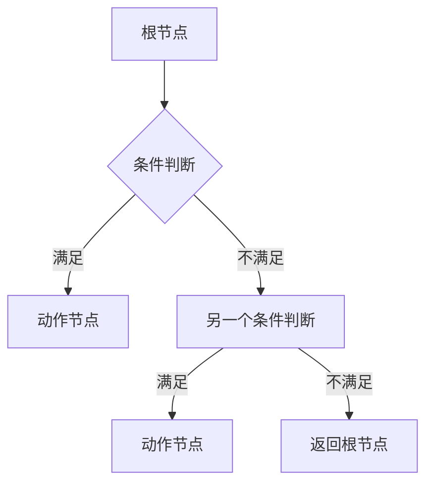
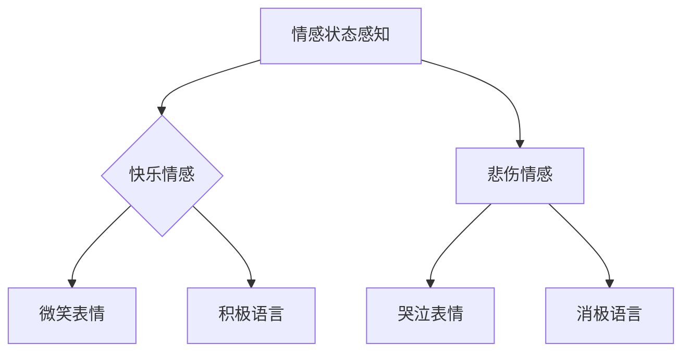
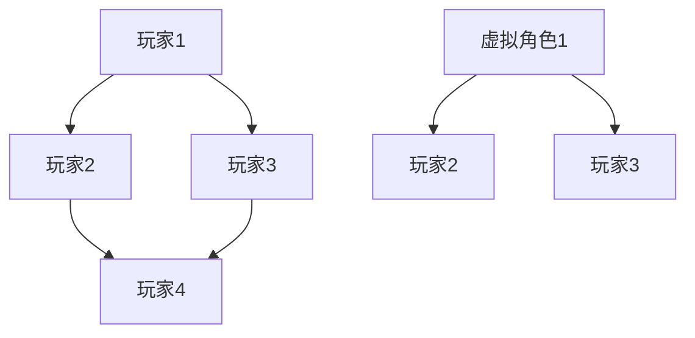
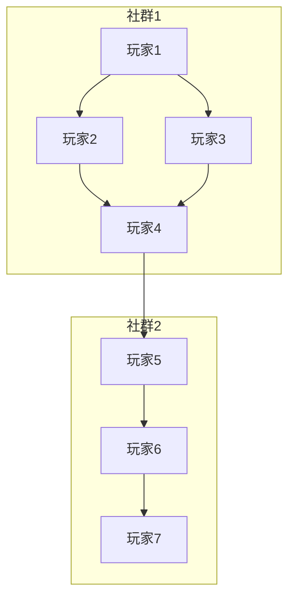
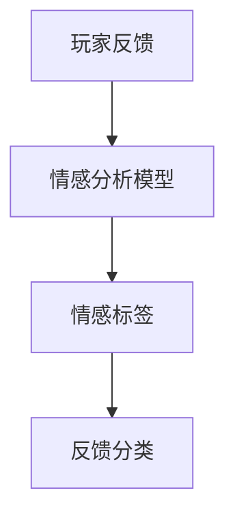
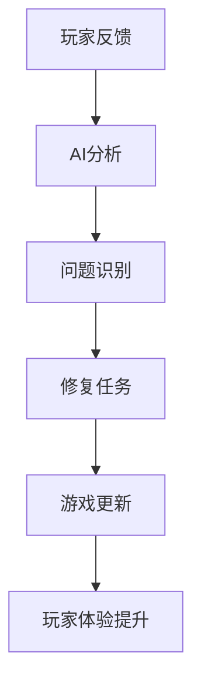

                 

# AI在虚拟角色扮演中的应用：增强游戏体验

## 关键词

- 人工智能
- 虚拟角色扮演
- 游戏体验
- 行为树
- 情感计算
- 游戏平衡
- 生成对抗网络（GAN）
- 社交AI
- 伦理问题
- 虚拟现实

## 摘要

本文探讨了人工智能（AI）在虚拟角色扮演（VRP）中的应用，旨在通过AI技术增强游戏体验。文章首先介绍了虚拟角色扮演的概念、历史及其与AI的融合背景。接着，详细分析了AI在虚拟角色扮演中的核心概念和架构，包括机器学习、深度学习、自然语言处理等。随后，文章深入探讨了AI驱动虚拟角色的行为设计、游戏体验优化以及互动与反馈机制。此外，文章还针对AI在虚拟角色扮演中的伦理与隐私问题进行了探讨，并展望了其未来发展方向。最后，通过实际案例展示了AI在虚拟角色扮演中的应用，并提供了开发指南。本文为AI在虚拟角色扮演领域的应用提供了全面的技术分析和实践指导。

## 第一部分：AI在虚拟角色扮演中的应用基础

### 第1章：虚拟角色扮演与AI的融合

#### 1.1 虚拟角色扮演的概念与历史

虚拟角色扮演（Virtual Role-Playing，VRP）是一种通过计算机技术和虚拟现实技术实现的角色扮演游戏，玩家在虚拟世界中扮演不同角色，进行互动和冒险。VRP最早可以追溯到20世纪70年代的“多用户虚拟世界”（MUD）游戏。MUD游戏提供了玩家在虚拟世界中进行互动的平台，开创了多人在线游戏的概念。

随着技术的进步，VRP逐渐发展出多种形式，包括大型多人在线角色扮演游戏（MMORPG）、沙盒游戏和虚拟现实游戏等。现代VRP游戏不仅注重角色扮演和剧情，还强调沉浸式体验和社交互动。

#### 1.2 AI在游戏中的应用背景

人工智能（AI）技术在游戏中的应用历史可以追溯到20世纪50年代。早期的AI研究主要集中在棋类游戏和策略游戏，如国际象棋、围棋等。随着机器学习、深度学习和自然语言处理等技术的发展，AI在游戏中的应用逐渐扩展到虚拟角色扮演领域。

AI在游戏中的应用主要包括：

1. **游戏平衡与难度调整**：AI可以根据玩家的行为和游戏状态动态调整游戏难度，以保持游戏的挑战性和趣味性。
2. **虚拟角色行为设计**：AI可以生成复杂的角色行为，提高游戏的沉浸感和互动性。
3. **游戏内容生成**：AI可以生成新的游戏关卡、任务和剧情，提供丰富的游戏内容。
4. **社交互动与情感计算**：AI可以模拟角色的情感和行为，增强玩家之间的互动体验。

#### 1.3 AI在虚拟角色扮演中的潜力与挑战

AI在虚拟角色扮演中具有巨大的潜力，可以为游戏带来以下几方面的改进：

1. **个性化体验**：AI可以根据玩家的偏好和游戏数据，提供个性化的游戏内容和建议。
2. **增强互动性**：AI驱动的虚拟角色可以更真实地模拟人类行为和情感，增强玩家之间的互动。
3. **游戏创新**：AI可以生成新的游戏机制和玩法，推动游戏技术的发展和创新。
4. **降低开发成本**：AI可以帮助游戏开发者自动化一些重复性工作，提高开发效率和降低成本。

然而，AI在虚拟角色扮演中面临的挑战也不容忽视：

1. **技术复杂性**：AI技术需要大量的计算资源和专业知识，开发和应用过程较为复杂。
2. **数据隐私和安全**：游戏中的AI系统需要处理大量用户数据，数据隐私和安全问题需要得到妥善解决。
3. **伦理问题**：AI在虚拟角色扮演中的应用可能引发伦理问题，如角色行为伦理、用户隐私等。

在接下来的章节中，我们将深入探讨AI在虚拟角色扮演中的核心概念、架构、行为设计、游戏体验优化、互动与反馈机制，以及伦理与隐私问题。

## 第2章：AI在虚拟角色扮演中的核心概念与架构

### 2.1 人工智能基础

#### 2.1.1 机器学习概述

机器学习（Machine Learning，ML）是一种通过数据训练模型，使计算机能够从数据中学习和发现规律的技术。机器学习主要分为监督学习、无监督学习和强化学习三大类。

1. **监督学习**：监督学习通过训练数据集来训练模型，使模型能够预测未知数据的结果。常见的监督学习算法包括线性回归、逻辑回归、支持向量机（SVM）等。

2. **无监督学习**：无监督学习不使用标签数据，通过分析数据本身的特征，发现数据中的模式和规律。常见的无监督学习算法包括聚类、降维、异常检测等。

3. **强化学习**：强化学习通过奖励机制，使模型在交互过程中不断学习和优化策略，以实现特定目标。常见的强化学习算法包括Q学习、深度Q网络（DQN）等。

#### 2.1.2 深度学习原理

深度学习（Deep Learning，DL）是一种基于多层神经网络（Neural Network）的机器学习方法，可以自动提取数据的特征表示。深度学习在图像识别、自然语言处理、语音识别等领域取得了显著的成果。

1. **神经网络基础**：神经网络由多个神经元（节点）组成，每个神经元通过权重连接其他神经元，并产生输出。神经网络的训练过程就是调整权重，使网络能够更好地拟合训练数据。

2. **多层神经网络**：多层神经网络通过增加隐含层，可以提取更高层次的特征表示。深度学习中的多层神经网络通常使用反向传播算法进行训练。

3. **激活函数**：激活函数是神经网络中的一个关键组件，用于引入非线性特性，使神经网络能够拟合复杂的数据分布。常见的激活函数包括sigmoid、ReLU、Tanh等。

#### 2.1.3 自然语言处理基础

自然语言处理（Natural Language Processing，NLP）是人工智能的一个重要分支，旨在使计算机能够理解和生成自然语言。NLP技术广泛应用于文本分类、情感分析、机器翻译、问答系统等领域。

1. **词向量表示**：词向量是NLP中的一种常用表示方法，通过将词语映射到高维向量空间，使词语之间的相似性和相关性可以通过向量之间的距离来衡量。常见的词向量模型包括Word2Vec、GloVe等。

2. **序列模型**：序列模型是处理序列数据（如文本、语音）的一种有效方法，通过建模输入序列与输出序列之间的关系，实现文本分类、机器翻译等功能。常见的序列模型包括循环神经网络（RNN）、长短期记忆网络（LSTM）等。

### 2.2 虚拟角色扮演架构分析

#### 2.2.1 游戏引擎与AI集成

游戏引擎是构建虚拟角色扮演游戏的重要工具，它提供了渲染、物理模拟、音效等核心功能。AI与游戏引擎的集成主要涉及以下几个方面：

1. **AI模块设计**：在游戏引擎中集成AI模块，包括行为树、情感计算、游戏平衡等模块，使其能够处理虚拟角色的行为和决策。

2. **数据接口**：游戏引擎和AI模块之间需要通过数据接口进行通信，传递游戏状态、角色状态等数据，使AI能够实时获取和更新信息。

3. **资源管理**：AI模块需要与游戏引擎的资源管理系统（如内存管理、线程管理等）进行集成，以高效地利用系统资源。

#### 2.2.2 角色行为树（BT）设计

角色行为树（Behavior Tree，BT）是一种基于树形结构的角色行为设计方法，用于描述角色在不同状态下的行为决策。角色行为树设计主要包括以下几个步骤：

1. **行为节点定义**：根据角色行为的需求，定义各种行为节点，如动作节点、条件节点、组合节点等。

2. **树形结构构建**：将行为节点按照逻辑关系构建成树形结构，实现角色在不同状态下的行为决策。

3. **执行与监控**：在游戏运行过程中，根据角色状态和外部事件，执行和监控角色行为树的运行，实现角色的动态行为。

#### 2.2.3 环境感知与响应机制

环境感知与响应机制是虚拟角色扮演中AI的关键技术，用于使虚拟角色能够感知环境变化并做出相应行为。环境感知与响应机制主要包括以下几个方面：

1. **感知模块设计**：设计感知模块，包括视觉、听觉、触觉等感知方式，使虚拟角色能够获取环境信息。

2. **感知数据处理**：对感知数据进行处理，提取关键特征和目标信息，为角色行为决策提供依据。

3. **响应行为设计**：根据环境信息和角色状态，设计相应的响应行为，如回避障碍、寻找目标、攻击敌人等。

在接下来的章节中，我们将深入探讨AI驱动虚拟角色的行为设计、游戏体验优化以及互动与反馈机制。

### 第3章：AI驱动虚拟角色的行为设计

#### 3.1 行为树在虚拟角色中的应用

行为树（Behavior Tree，BT）是一种用于描述角色行为的树形结构，它由一系列行为节点（如动作节点、条件节点、组合节点等）组成，可以灵活地表示角色的行为逻辑。行为树在虚拟角色扮演中的应用具有以下几个特点：

1. **模块化设计**：行为树通过模块化的节点设计，可以方便地组合和扩展行为逻辑，实现角色的多样化行为。

2. **灵活性**：行为树可以根据角色的状态和外部事件动态调整行为逻辑，使角色能够适应不同的游戏场景。

3. **易于调试**：行为树的树形结构使得角色的行为逻辑更加清晰，便于调试和优化。

下面是一个行为树的基本结构示例：



在这个示例中，根节点A根据条件判断节点B的结果，选择执行动作节点C或D。如果条件判断不满足，则会继续执行另一个条件判断节点D。如果D的条件判断满足，则执行动作节点E；否则，返回根节点A。

#### 3.1.2 行为树的构建方法

构建行为树通常包括以下几个步骤：

1. **需求分析**：首先分析虚拟角色的行为需求，确定需要实现的各种行为和条件。

2. **节点定义**：根据需求定义各种行为节点、条件节点和组合节点。行为节点用于描述角色的具体行为，条件节点用于判断角色的行为条件，组合节点用于组合多个节点。

3. **树形结构设计**：将定义好的节点按照逻辑关系构建成树形结构，实现角色的行为逻辑。

4. **行为树实现**：将行为树集成到游戏引擎中，实现角色的动态行为。

在构建行为树时，可以参考以下原则：

1. **最小化节点数量**：尽量减少节点的数量，避免复杂的树形结构。

2. **单一职责**：每个节点应该只负责一项具体任务，提高行为树的模块化和可维护性。

3. **可扩展性**：行为树应具有良好的扩展性，以便在未来的需求变化中能够方便地调整和优化。

#### 3.1.3 行为树的优化与调试

行为树在实际应用中可能存在一些性能和稳定性的问题，需要进行优化和调试。以下是一些常见的优化与调试方法：

1. **性能优化**：行为树的性能优化主要包括减少节点数量、避免递归调用和优化循环逻辑等。例如，可以使用循环节点替代递归调用，以提高行为树的执行效率。

2. **稳定性优化**：行为树的稳定性优化主要涉及处理异常情况和避免死循环。例如，可以在行为树中添加检查点（Check Point），用于在出现异常情况时恢复行为树的执行。

3. **调试方法**：行为树的调试可以通过日志记录、动态调试工具和测试用例等方法进行。通过日志记录可以了解行为树在执行过程中的状态和问题，动态调试工具可以实时查看行为树的执行流程，测试用例可以验证行为树的功能和性能。

在接下来的章节中，我们将继续探讨情感计算与角色情感建模，以及如何通过情感计算来驱动虚拟角色的行为设计。

### 第3章：情感计算与角色情感建模

#### 3.2 情感计算简介

情感计算（Affective Computing）是人工智能领域的一个重要分支，旨在使计算机能够理解和模拟人的情感。情感计算的核心任务是识别、理解、处理和模拟情感，从而提高人机交互的自然性和丰富性。

情感计算的主要研究内容包括：

1. **情感识别**：通过分析用户的情感表达（如面部表情、语音语调、身体动作等），识别用户的情感状态。

2. **情感理解**：分析情感表达的上下文和情感之间的关系，理解用户的情感意图。

3. **情感处理**：基于情感识别和理解的结果，对用户的情感进行适当的响应和处理。

4. **情感模拟**：通过模拟情感表达，使计算机能够更好地与用户进行情感交流。

情感计算在虚拟角色扮演中的应用主要包括以下几个方面：

1. **角色情感建模**：通过情感计算技术，为虚拟角色建立情感模型，使其能够根据不同情境和互动表现出适当的情感反应。

2. **增强角色互动**：通过情感计算，使虚拟角色能够更好地理解玩家的情感，提高角色与玩家之间的互动质量。

3. **提升游戏体验**：情感计算可以增强游戏中的沉浸感和情感共鸣，提升玩家的整体游戏体验。

#### 3.2.2 角色情感建模方法

角色情感建模是情感计算在虚拟角色扮演中的应用基础。角色情感建模的主要任务是根据虚拟角色的属性和行为，构建一个情感模型，使其能够模拟角色的情感反应。

角色情感建模的方法主要包括以下几种：

1. **基于规则的方法**：基于规则的方法通过预设一系列情感规则，根据角色当前的状态和行为，选择合适的情感表现。这种方法简单直观，但扩展性和适应性较差。

2. **基于数据驱动的方法**：基于数据驱动的方法通过收集和分析大量情感数据，利用机器学习技术建立情感模型。这种方法具有较高的自适应性和准确性，但需要大量数据和计算资源。

3. **混合方法**：混合方法结合了基于规则和基于数据驱动的方法，通过规则驱动初始情感建模，再利用数据驱动的方法进行优化和调整。

在角色情感建模中，常用的情感模型包括：

1. **基本情感模型**：基本情感模型定义了几个基本的情感类别（如快乐、悲伤、愤怒等），并分别设定相应的情感特征和行为规则。

2. **扩展情感模型**：扩展情感模型在基本情感模型的基础上，增加了更多的情感类别和情感特征，以更准确地模拟角色的情感反应。

3. **多模态情感模型**：多模态情感模型结合了不同类型的数据源（如面部表情、语音、文本等），构建一个综合的情感模型，以更全面地识别和理解角色的情感。

#### 3.2.3 情感驱动的角色行为设计

情感计算在虚拟角色扮演中的应用不仅限于情感识别和建模，还可以通过情感驱动角色行为设计，使虚拟角色在游戏过程中表现出更加自然的情感反应。

情感驱动的角色行为设计主要包括以下几个步骤：

1. **情感状态感知**：通过情感计算技术，实时感知虚拟角色的情感状态，包括情感类别、强度和持续时间等。

2. **情感驱动行为规划**：根据虚拟角色的情感状态，规划相应的行为动作，如表情、动作、语言等。情感驱动行为规划可以通过规则驱动或数据驱动的方法实现。

3. **行为执行与反馈**：执行规划好的行为动作，并根据玩家的互动和游戏状态，调整情感状态和行为规划。行为执行与反馈可以通过实时交互和反馈机制实现。

情感驱动的角色行为设计可以增强虚拟角色与玩家之间的情感共鸣，提高游戏的沉浸感和互动性。以下是一个情感驱动的角色行为设计的示例：



在这个示例中，虚拟角色根据情感状态感知结果，选择执行相应的情感行为。如果角色感知到快乐的情感状态，则执行微笑表情和积极语言；如果角色感知到悲伤的情感状态，则执行哭泣表情和消极语言。

通过情感计算和情感驱动的角色行为设计，虚拟角色可以更加自然地与玩家互动，提升游戏体验。在接下来的章节中，我们将探讨人工智能在游戏体验优化中的应用。

### 第4章：人工智能在游戏体验优化中的应用

#### 4.1 AI在游戏平衡与难度调整中的作用

游戏平衡（Game Balance）是游戏设计中的一个关键问题，它涉及游戏内部各种元素之间的平衡关系，如角色能力、道具效果、任务难度等。良好的游戏平衡能够保持游戏的挑战性和趣味性，使玩家在游戏过程中保持持续的动力和兴趣。

AI在游戏平衡与难度调整中发挥着重要作用，通过以下方式实现：

1. **动态难度调整**：AI可以根据玩家的行为和游戏状态，动态调整游戏的难度。例如，如果玩家在游戏中表现较好，AI可以增加游戏难度，以保持游戏的挑战性；如果玩家表现不佳，AI可以降低游戏难度，以提供更多的游戏机会。

2. **角色能力调整**：AI可以根据玩家的角色等级、装备和技能，动态调整角色的能力值。例如，提高高等级角色的攻击力，降低低等级角色的攻击力，以保持游戏中的竞争平衡。

3. **任务难度调整**：AI可以根据玩家的游戏进度和任务完成情况，动态调整任务的难度。例如，对于新手玩家，AI可以提供较简单的任务，帮助玩家熟悉游戏机制；对于高级玩家，AI可以提供更具挑战性的任务，以保持游戏的趣味性。

以下是一个动态难度调整的伪代码示例：

```python
# 动态难度调整函数
def adjust_difficulty(player_state):
    if player_state["score"] > 100:
        # 提高难度
        return "hard"
    elif player_state["score"] < 50:
        # 降低难度
        return "easy"
    else:
        # 保持当前难度
        return "normal"
```

在这个示例中，根据玩家的分数（score）动态调整游戏的难度。如果玩家的分数超过100，游戏难度设置为"hard"；如果分数低于50，游戏难度设置为"easy"；否则，游戏难度保持"normal"。

#### 4.1.2 难度动态调整方法

难度动态调整方法主要包括以下几种：

1. **分段调整**：根据玩家的游戏进度和表现，将游戏分为多个阶段，每个阶段设置不同的难度。这种方法适用于游戏进度较长、玩家能力差异较大的情况。

2. **阈值调整**：设置一个或多个难度阈值，当玩家达到某个阈值时，自动调整游戏难度。例如，当玩家的得分达到一定值时，游戏难度增加。

3. **基于数据的调整**：通过分析玩家的游戏数据（如游戏时间、任务完成率、角色等级等），利用机器学习算法动态调整游戏难度。这种方法可以根据玩家行为和表现提供个性化的难度调整。

以下是一个基于数据的难度调整算法的伪代码示例：

```python
# 基于数据的难度调整函数
def adjust_difficulty(player_data):
    # 训练机器学习模型
    model = train_ml_model(player_data)
    
    # 预测当前玩家的难度偏好
    difficulty = model.predict(player_data)
    
    return difficulty
```

在这个示例中，首先训练一个机器学习模型，然后使用模型预测当前玩家的难度偏好，并返回相应的难度等级。

#### 4.1.3 智能对手设计

智能对手（Intelligent Opponent）是游戏中的一个关键角色，它的设计直接影响游戏的挑战性和趣味性。智能对手的设计主要涉及以下方面：

1. **行为模拟**：智能对手应具备丰富的行为模式，模拟现实中的对手行为，提高游戏的挑战性。例如，对手可以采取不同的战术、策略和动作，使玩家在游戏中始终保持紧张和兴奋。

2. **学习能力**：智能对手应具备学习能力，通过分析玩家的行为和游戏数据，不断优化自己的行为策略，提高对抗效果。例如，对手可以根据玩家的弱点进行针对性攻击，提高自己的胜率。

3. **适应性**：智能对手应具备适应性，能够根据玩家的游戏风格和表现进行调整，以适应不同的游戏场景和玩家。例如，当玩家表现出色时，对手可以调整难度，保持游戏的平衡。

以下是一个智能对手行为模拟的伪代码示例：

```python
# 智能对手行为模拟函数
def simulate_opponent(player_behavior):
    # 分析玩家行为
    opponent_behavior = analyze_player_behavior(player_behavior)
    
    # 根据玩家行为调整对手策略
    opponent_strategy = adjust_strategy(opponent_behavior)
    
    return opponent_strategy
```

在这个示例中，首先分析玩家的行为，然后根据分析结果调整对手的策略，以模拟出一个适应玩家的智能对手。

通过AI在游戏平衡与难度调整、智能对手设计等方面的应用，可以有效优化游戏体验，提高游戏的吸引力和可玩性。在接下来的章节中，我们将探讨游戏玩法与任务生成的AI技术。

### 第4章：人工智能在游戏玩法与任务生成中的应用

#### 4.2.1 生成对抗网络（GAN）在游戏中的应用

生成对抗网络（Generative Adversarial Network，GAN）是一种由生成器和判别器组成的深度学习模型，主要用于生成高质量的图像、音频和文本等数据。在游戏开发中，GAN被广泛应用于游戏关卡、角色和场景的生成，为游戏提供了丰富多样的内容。

GAN在游戏中的应用主要包括以下几个方面：

1. **游戏关卡生成**：GAN可以根据游戏规则和玩家行为，自动生成各种类型的游戏关卡，如迷宫、平台跳跃和战斗关卡。这些关卡具有独特的设计和布局，增加了游戏的多样性和可玩性。

2. **角色生成**：GAN可以生成各种风格和类型的游戏角色，从可爱的小动物到强大的英雄，满足不同玩家群体的需求。这些角色具有个性化的外观和特征，增强了游戏的沉浸感和互动性。

3. **场景生成**：GAN可以生成各种游戏场景，如森林、沙漠、城市等，为游戏提供了一个丰富多彩的虚拟世界。这些场景具有逼真的视觉效果和互动性，使玩家在游戏中感受到身临其境的体验。

以下是一个GAN在游戏关卡生成中的应用示例：

```python
# GAN生成游戏关卡函数
def generate_game_level(generator_model, game_rules):
    # 使用生成器模型生成关卡数据
    level_data = generator_model.generate(level_data)
    
    # 根据游戏规则调整关卡数据
    adjusted_level_data = adjust_level_data(level_data, game_rules)
    
    return adjusted_level_data
```

在这个示例中，首先使用生成器模型生成关卡数据，然后根据游戏规则对关卡数据进行调整，最终生成一个符合游戏需求的游戏关卡。

#### 4.2.2 游戏任务自动生成

游戏任务（Game Task）是游戏中的核心元素，它引导玩家完成任务、获得奖励和提升角色。传统的游戏任务生成方法通常由游戏设计师手动设计，费时费力且难以满足多样化的游戏需求。

AI技术在游戏任务自动生成中具有巨大潜力，通过以下方法实现：

1. **任务模板生成**：AI可以根据游戏需求和玩家行为，自动生成各种类型的任务模板。例如，探险任务、战斗任务、解谜任务等。

2. **任务内容生成**：AI可以根据任务模板和玩家数据，自动生成具体的任务内容，如任务描述、目标、奖励等。

3. **任务动态调整**：AI可以根据玩家的游戏进度和表现，动态调整任务的难度、目标和时间等，以保持任务的挑战性和趣味性。

以下是一个游戏任务自动生成的基本流程：

```python
# 游戏任务自动生成流程
def generate_game_task(task_template, player_data):
    # 根据任务模板生成基础任务
    base_task = generate_base_task(task_template)
    
    # 根据玩家数据调整任务难度
    adjusted_task = adjust_task_difficulty(base_task, player_data)
    
    # 根据玩家数据生成任务目标
    task_target = generate_task_target(adjusted_task, player_data)
    
    return adjusted_task, task_target
```

在这个示例中，首先根据任务模板生成基础任务，然后根据玩家数据调整任务的难度，最后生成任务目标。

#### 4.2.3 个性化游戏内容推荐

个性化游戏内容推荐（Personalized Game Content Recommendation）是AI技术在游戏中的应用之一，它通过分析玩家的行为和偏好，为玩家推荐个性化的游戏内容，提高玩家的游戏体验。

个性化游戏内容推荐的主要方法包括：

1. **基于内容的推荐**：根据游戏内容的特征和属性，为玩家推荐类似的游戏内容。例如，如果玩家喜欢某个角色，可以推荐具有相似特点的其他角色。

2. **基于协作的推荐**：通过分析其他玩家的行为和偏好，为玩家推荐受欢迎的游戏内容。例如，如果大多数玩家喜欢某个游戏任务，可以推荐给其他玩家。

3. **基于模型的推荐**：利用机器学习模型，分析玩家的行为数据，预测玩家可能感兴趣的游戏内容，并推荐给玩家。

以下是一个基于模型的个性化游戏内容推荐示例：

```python
# 基于模型的个性化游戏内容推荐函数
def recommend_game_content(model, player_data):
    # 预测玩家可能感兴趣的游戏内容
    predicted_content = model.predict(player_data)
    
    # 推荐预测结果中的游戏内容
    recommended_content = model.recommend(predicted_content)
    
    return recommended_content
```

在这个示例中，首先使用机器学习模型预测玩家可能感兴趣的游戏内容，然后推荐预测结果中的游戏内容。

通过AI在游戏玩法与任务生成中的应用，可以丰富游戏内容，提高游戏的多样性和可玩性。在接下来的章节中，我们将探讨AI在虚拟角色扮演中的互动与反馈机制。

### 第5章：AI在虚拟角色扮演中的互动与反馈机制

#### 5.1 角色互动与社交网络的构建

在虚拟角色扮演（VRP）中，角色互动与社交网络的构建是实现高度沉浸感和丰富用户体验的关键因素。AI技术在这两个方面发挥了重要作用，通过以下方式实现：

1. **社交网络模型**：AI可以构建社交网络模型，模拟玩家在虚拟世界中的社交行为。社交网络模型通常基于图论理论，将玩家和虚拟角色视为节点，互动行为视为边，构建一个复杂的社交网络。

2. **角色互动算法**：AI可以设计角色互动算法，使虚拟角色能够根据社交网络模型进行互动。这些算法可以基于社交网络分析技术，如节点重要性评估、社群检测、网络传播等，实现角色之间的有效互动。

3. **个性化互动**：AI可以根据玩家的行为和偏好，为玩家推荐合适的互动对象和互动内容，提高社交互动的个性化程度。

以下是一个社交网络模型的基本结构：



在这个示例中，玩家和虚拟角色构成了一个社交网络，玩家之间的互动和虚拟角色与玩家之间的互动通过边表示。

#### 5.1.2 社交网络分析

社交网络分析是研究社交网络结构和特性的方法，通过分析社交网络中的节点、边和社群等元素，可以深入了解玩家在虚拟世界中的互动模式。社交网络分析的主要技术包括：

1. **节点重要性评估**：通过计算节点的度、中心性、聚类系数等指标，评估节点在社交网络中的重要性和影响力。

2. **社群检测**：通过算法识别社交网络中的社群结构，分析社群成员之间的互动关系和社群特点。

3. **网络传播**：研究信息、病毒、情感等在社交网络中的传播过程，预测信息传播的效果和影响范围。

以下是一个社群检测的示例：



在这个示例中，社交网络被划分为两个社群，社群1由玩家1、2、3、4组成，社群2由玩家5、6、7组成。

通过社交网络分析和角色互动算法，虚拟角色扮演游戏可以提供更加丰富和自然的社交互动体验。在接下来的章节中，我们将探讨游戏反馈系统设计，以及如何利用AI优化游戏反馈。

### 第5章：AI在虚拟角色扮演中的互动与反馈机制

#### 5.2 游戏反馈系统设计

游戏反馈系统是玩家与游戏世界互动的重要环节，它通过收集、处理和响应玩家的反馈，优化游戏体验。AI技术在游戏反馈系统中扮演着关键角色，能够实现智能化的反馈收集和处理。以下是游戏反馈系统设计的关键要素：

#### 5.2.1 游戏反馈的重要性

1. **用户体验优化**：游戏反馈是了解玩家需求和体验的重要手段。通过收集和分析玩家反馈，开发者可以及时发现问题并进行优化，提升用户体验。

2. **游戏平衡调整**：游戏平衡是影响玩家体验的重要因素。AI可以基于反馈数据，自动调整游戏难度、角色能力、任务难度等，以实现最佳平衡。

3. **玩家参与度提升**：通过有效的反馈系统，玩家可以感受到自己的意见被重视，从而提高游戏的参与度和忠诚度。

#### 5.2.2 反馈收集与处理

1. **数据收集**：游戏反馈系统需要收集玩家的行为数据、游戏日志、评论和评价等。这些数据可以通过内置调查、在线论坛、社交媒体和玩家社区等方式获取。

2. **数据预处理**：收集到的数据通常需要预处理，包括数据清洗、去重、去噪声等步骤，以确保数据的质量和准确性。

3. **情感分析**：AI可以通过自然语言处理（NLP）技术，对玩家的文本反馈进行情感分析，识别玩家的情感倾向和意见。

以下是一个情感分析的基本流程：



在这个流程中，玩家的反馈输入到情感分析模型中，模型输出情感标签（如积极、消极、中立），然后进行反馈分类。

#### 5.2.3 AI驱动的反馈优化

1. **个性化建议**：AI可以根据玩家的历史反馈和游戏行为，提供个性化的优化建议。例如，针对某个特定玩家的反馈，AI可以推荐相应的游戏调整。

2. **自动修复**：AI可以自动识别和修复游戏中出现的问题。例如，如果AI检测到某个任务频繁失败，它可以自动调整任务的难度或提供额外的提示。

3. **反馈闭环**：通过将玩家的反馈集成到游戏开发流程中，AI可以实现一个反馈闭环。例如，玩家反馈的问题可以自动生成修复任务，并在下一次游戏更新中解决。

以下是一个反馈闭环的基本流程：



在这个流程中，玩家的反馈经过AI分析，识别出问题后生成修复任务，并最终在游戏更新中解决，从而提升玩家的体验。

通过设计智能化的游戏反馈系统，开发者可以更有效地收集和处理玩家反馈，优化游戏体验，提高玩家的满意度和参与度。在接下来的章节中，我们将探讨AI在虚拟角色扮演中的伦理与隐私问题。

### 第6章：AI在虚拟角色扮演中的伦理与隐私问题

#### 6.1 AI伦理问题探讨

随着AI技术在虚拟角色扮演（VRP）中的应用日益广泛，AI伦理问题成为了一个备受关注的话题。AI伦理问题主要包括以下几个方面：

1. **角色行为伦理**：虚拟角色在游戏中的行为是否符合道德标准，如何防止角色做出不当或有害的行为。例如，某些游戏中的角色可能会进行欺骗、背叛或暴力行为，如何确保这些行为不会对玩家造成负面影响。

2. **用户隐私保护**：虚拟角色扮演游戏通常需要收集大量用户数据，如何确保这些数据的安全和隐私。例如，如何防止玩家数据被泄露或滥用，如何保护未成年玩家的隐私。

3. **算法偏见**：AI算法在训练和决策过程中可能会引入偏见，导致不公正的待遇。例如，某些AI算法可能会根据种族、性别或年龄等因素做出歧视性决策，如何消除这些偏见。

#### 6.1.1 AI伦理的基本原则

为了解决AI伦理问题，国际社会提出了一系列伦理原则，包括：

1. **公平性**：确保AI系统在处理数据和应用算法时保持公平，不引入或放大偏见。

2. **透明性**：确保AI系统的决策过程是可解释和可追溯的，用户可以理解AI的决策依据。

3. **责任性**：明确AI系统的责任归属，确保在出现问题时能够追溯和追究责任。

4. **安全性**：确保AI系统的稳定性和安全性，防止意外行为和风险。

5. **隐私保护**：确保用户数据的安全和隐私，遵循数据保护法规和最佳实践。

#### 6.1.2 AI在虚拟角色扮演中的伦理挑战

在虚拟角色扮演中，AI伦理挑战主要体现在以下几个方面：

1. **角色行为的道德标准**：虚拟角色在游戏中的行为是否符合玩家的期望和道德标准，如何确保角色行为不会对玩家产生负面影响。

2. **用户隐私保护**：如何收集、存储和处理用户数据，确保用户隐私不被侵犯。

3. **算法透明性和解释性**：如何提高AI算法的透明性和解释性，使玩家和开发者能够理解AI的决策过程。

4. **算法偏见和公平性**：如何消除AI算法中的偏见，确保公平、公正的决策。

#### 6.1.3 伦理指导框架设计

为了应对AI在虚拟角色扮演中的伦理挑战，可以设计一套伦理指导框架，包括：

1. **伦理审查机制**：在游戏开发和发布前，进行AI伦理审查，确保游戏中的AI行为符合伦理标准。

2. **用户隐私保护策略**：制定严格的用户隐私保护策略，包括数据收集、存储、处理和共享的规则。

3. **透明性和可解释性设计**：在游戏开发过程中，设计可解释的AI算法，使玩家和开发者能够理解AI的决策过程。

4. **责任归属制度**：明确AI系统的责任归属，确保在出现问题时能够追溯和追究责任。

通过设计伦理指导框架，可以有效地管理AI在虚拟角色扮演中的伦理问题，确保游戏安全和用户隐私。在接下来的章节中，我们将探讨虚拟角色扮演与AI的未来发展。

### 第7章：虚拟角色扮演与AI的未来发展

#### 7.1 AI在虚拟现实中的应用前景

随着虚拟现实（VR）技术的发展，AI在虚拟现实中的应用前景变得愈发广阔。AI技术可以为虚拟现实带来以下几方面的创新和改进：

1. **沉浸式交互**：AI可以模拟现实世界的物理现象和自然行为，提高虚拟现实的沉浸感。例如，通过AI算法实现更加真实的物理模拟和碰撞检测，使虚拟角色和玩家之间的互动更加自然和流畅。

2. **智能场景生成**：AI可以根据玩家的行为和偏好，自动生成个性化的虚拟场景和内容。例如，利用生成对抗网络（GAN）生成独特的环境、建筑和角色，为玩家提供一个独一无二的虚拟世界。

3. **情感共鸣**：AI可以模拟虚拟角色的情感反应，增强玩家与虚拟角色之间的情感共鸣。通过情感计算技术，虚拟角色可以更好地理解玩家的情绪，并提供相应的情感回应，提高游戏的互动性和沉浸感。

4. **自适应难度调整**：AI可以根据玩家的表现和游戏进度，动态调整游戏的难度和挑战程度，使游戏始终保持适中的难度，避免玩家感到过于困难或过于简单。

#### 7.1.2 虚拟角色扮演的未来方向

虚拟角色扮演的未来发展方向包括以下几个方面：

1. **社交互动**：随着社交需求的增加，虚拟角色扮演游戏将更加注重玩家之间的互动和社交体验。通过AI技术，可以构建更加智能和自然的社交网络，提供丰富的社交功能和体验。

2. **个性化和定制**：AI技术将使虚拟角色扮演游戏更加个性化，根据玩家的行为和偏好，为玩家提供定制化的游戏内容和体验。例如，通过分析玩家的游戏数据，AI可以推荐合适的角色、任务和游戏模式，提高玩家的游戏满意度。

3. **情感共鸣和故事性**：虚拟角色扮演游戏将更加注重情感共鸣和故事性，通过AI技术，虚拟角色可以更好地理解玩家的情感，提供更加丰富的情感体验和剧情发展。例如，利用情感计算技术，虚拟角色可以表现出更加真实和细腻的情感反应，增强玩家的沉浸感和投入度。

4. **跨平台和无缝体验**：随着AI和VR技术的不断发展，虚拟角色扮演游戏将实现跨平台和无缝体验。玩家可以在不同设备和平台上继续他们的游戏进程，保持连贯的体验。

#### 7.1.3 AI在沉浸式体验中的作用

AI在沉浸式体验中的作用主要体现在以下几个方面：

1. **智能引导**：AI可以根据玩家的行为和偏好，提供智能化的游戏引导和提示，帮助玩家更好地了解游戏规则和玩法。例如，当玩家遇到困难时，AI可以提供相应的指导和建议，帮助玩家克服挑战。

2. **智能助手**：AI可以扮演玩家的智能助手角色，提供实时的信息查询、策略建议和任务提示，提高玩家的游戏效率。例如，在多人游戏中，AI可以协助玩家协调战术和资源，提高团队的战斗表现。

3. **情感互动**：AI可以模拟虚拟角色的情感反应，增强玩家与虚拟角色之间的互动和情感共鸣。例如，通过情感计算技术，虚拟角色可以表现出更加真实和细腻的情感反应，使玩家感受到更加丰富和深刻的游戏体验。

4. **自适应场景生成**：AI可以根据玩家的行为和偏好，自动生成个性化的虚拟场景和内容，为玩家提供一个独一无二的沉浸式体验。例如，利用生成对抗网络（GAN），AI可以生成独特的环境、建筑和角色，使游戏世界更加丰富和多样。

通过AI在虚拟现实中的应用和虚拟角色扮演的未来发展方向，未来的虚拟角色扮演游戏将更加智能、个性化、沉浸和有趣。在接下来的章节中，我们将探讨人工智能与游戏行业的融合发展。

### 第7章：人工智能与游戏行业的融合发展

#### 7.2.1 行业发展现状与趋势

人工智能（AI）与游戏行业的融合发展已经成为当前游戏开发领域的一个热门趋势。以下是游戏行业在AI技术应用方面的发展现状和趋势：

1. **AI驱动的游戏开发**：游戏开发公司开始利用AI技术来优化游戏设计、测试和开发流程。例如，AI可以自动生成游戏关卡、任务和剧情，提高开发效率。

2. **虚拟角色和智能对手**：AI技术被广泛应用于虚拟角色和智能对手的设计，使游戏角色能够更加自然地与玩家互动，提供丰富的游戏体验。

3. **游戏平衡和难度调整**：AI可以根据玩家的行为和表现，动态调整游戏难度和角色能力，保持游戏的挑战性和趣味性。

4. **个性化推荐**：通过AI技术，游戏可以分析玩家的行为和偏好，为玩家提供个性化的游戏内容和推荐，提高玩家的参与度和满意度。

5. **情感计算**：AI技术被用于模拟虚拟角色的情感反应，增强玩家与虚拟角色之间的情感共鸣，提升游戏的沉浸感。

6. **虚拟现实（VR）和增强现实（AR）**：AI技术在VR和AR中的应用，如场景生成、交互优化和自适应难度调整，为玩家提供了更加真实和丰富的沉浸式体验。

#### 7.2.2 创新案例分析

以下是一些成功的AI在游戏行业中应用的案例，展示了AI技术如何推动游戏行业的创新：

1. **《星际争霸II》的AI对手**：《星际争霸II》是一款流行的即时战略游戏，其AI对手经过了深度学习和强化学习的训练，能够提供高水平的游戏体验，与人类玩家进行激烈的对战。

2. **《星际迷航：桥舰模拟器》**：这款游戏利用AI技术模拟舰船的驾驶和操作，提供了高度真实的舰船操作体验，并可以根据玩家的操作习惯进行自适应调整。

3. **《我的世界》的AI插件**：《我的世界》是一款开放世界的沙盒游戏，玩家可以使用AI插件来创建和修改游戏世界。这些插件可以实现自动建造、任务生成和智能对手等功能，大大丰富了游戏的内容和玩法。

4. **《黑魂III》的AI行为**：《黑魂III》是一款动作角色扮演游戏，其AI行为设计非常复杂，AI对手可以根据玩家的行为和游戏状态，进行实时策略调整，为玩家提供了高难度的挑战。

5. **《堡垒之夜》的AI互动**：《堡垒之夜》是一款多人在线战斗游戏，其AI技术被用于生成实时互动事件和任务，增强了游戏的动态性和游戏体验。

#### 7.2.3 未来发展的挑战与机遇

虽然AI在游戏行业中的应用带来了诸多创新和改进，但同时也面临着一些挑战和机遇：

1. **技术挑战**：AI技术需要大量的计算资源和专业知识，开发和应用过程较为复杂。此外，AI算法的透明性和可解释性也是一个亟待解决的问题。

2. **数据隐私和安全**：游戏中的AI系统需要处理大量用户数据，数据隐私和安全问题需要得到妥善解决。如何在保护用户隐私的同时，充分利用用户数据进行AI训练和优化，是一个重要的挑战。

3. **伦理问题**：AI在游戏中的应用可能引发伦理问题，如角色行为伦理、用户隐私等。如何制定合适的伦理规范，确保AI技术在游戏中的应用是负责任和公正的，是未来需要关注的重要议题。

4. **用户体验**：AI技术需要与游戏设计紧密结合，确保为玩家提供优质的游戏体验。如何在游戏设计中融入AI技术，提高游戏的可玩性和互动性，是一个重要的机遇。

通过不断探索和应对这些挑战，人工智能将在未来继续推动游戏行业的创新和发展。在接下来的章节中，我们将通过实际案例展示AI在虚拟角色扮演中的应用。

### 第8章：AI在虚拟角色扮演中的应用案例

#### 8.1 案例一：AI驱动的角色交互体验

**案例背景与目标**：

《Second Life》是一款知名的虚拟角色扮演游戏，玩家可以在虚拟世界中创建和定制自己的角色，与其他玩家互动和交流。为了提高玩家的交互体验，开发团队决定引入AI技术，通过AI驱动的角色交互系统，使虚拟角色能够更自然地与玩家互动。

**实现技术**：

1. **自然语言处理（NLP）**：通过NLP技术，AI可以理解和处理玩家输入的文本和语音指令，识别玩家的意图和情感。

2. **语音合成**：AI通过语音合成技术，将处理后的文本转换为自然流畅的语音，使虚拟角色能够以语音形式回应玩家。

3. **行为树（BT）**：为了实现角色的动态行为，开发团队设计了行为树，根据角色的状态和外部事件，规划相应的行为动作。

4. **情感计算**：AI结合情感计算技术，根据玩家的情感表达，调整虚拟角色的情感反应，增强角色与玩家之间的情感共鸣。

**案例效果分析**：

引入AI驱动角色交互系统后，玩家的反馈非常积极。虚拟角色能够更自然地理解玩家的指令和情感，提供丰富多样的互动体验。以下是一些具体的成果：

1. **互动性增强**：虚拟角色能够理解玩家的情感和意图，进行更加自然和真实的互动。例如，当玩家表达快乐时，虚拟角色会回应以微笑和积极的语言。

2. **情感共鸣**：通过情感计算，虚拟角色能够更好地模拟人类情感，使玩家感受到更加深刻的情感共鸣。

3. **个性化体验**：AI可以根据玩家的行为和偏好，提供个性化的互动内容和建议，提高玩家的参与度和满意度。

4. **社区建设**：《Second Life》的虚拟社区因为AI驱动的角色交互系统而变得更加活跃和有凝聚力，玩家之间的互动更加频繁和多样化。

#### 8.2 案例二：AI在角色情感表现中的应用

**案例背景与目标**：

《The Sims 4》是一款非常受欢迎的虚拟角色扮演游戏，玩家可以在游戏中创建和管理自己的虚拟家庭。为了提升游戏的真实感和沉浸感，开发团队决定利用AI技术，使虚拟角色能够表现出更加细腻和丰富的情感。

**实现技术**：

1. **情感计算模型**：开发团队设计了一个情感计算模型，根据角色的行为和外部环境，模拟角色的情感变化。

2. **面部动画**：通过AI算法，虚拟角色的面部动画能够根据情感状态进行实时调整，表达出不同的情感表情。

3. **语音合成**：AI语音合成技术使虚拟角色能够根据情感状态，产生相应的语音反应，增强情感表现。

4. **行为树（BT）**：通过行为树，虚拟角色可以根据情感状态和行为规划，进行相应的情感行为，如哭泣、大笑、愤怒等。

**案例效果分析**：

AI在角色情感表现中的应用，显著提升了《The Sims 4》的游戏体验。以下是一些具体的成果：

1. **情感真实感**：虚拟角色能够根据不同的情境和玩家行为，表现出更加真实和细腻的情感反应，增强了游戏的沉浸感。

2. **互动体验**：虚拟角色与玩家之间的情感互动更加丰富和自然，玩家可以更好地融入虚拟家庭的生活。

3. **故事性增强**：虚拟角色的情感表现使游戏故事更加生动和有趣，玩家可以创作出更加引人入胜的故事情节。

4. **用户满意度**：玩家对游戏中的虚拟角色情感表现给予了高度评价，用户满意度显著提升。

通过这些实际案例，我们可以看到AI技术在虚拟角色扮演游戏中的应用，不仅提高了游戏的互动性和沉浸感，还为玩家提供了更加丰富和个性化的游戏体验。

### 第9章：AI在虚拟角色扮演中的应用开发指南

#### 9.1 开发环境搭建与工具选择

在开始开发AI驱动的虚拟角色扮演游戏之前，搭建一个合适的开发环境是至关重要的。以下是一些关键的步骤和工具选择：

1. **编程语言**：选择适合AI和游戏开发的语言。Python因其丰富的库和社区支持，是AI开发的首选。对于游戏开发，C++因其性能和灵活性，是许多高性能游戏的首选语言。

2. **游戏引擎**：选择合适的游戏引擎来构建虚拟世界和角色交互。Unity和Unreal Engine是两款广泛使用的游戏引擎，具有强大的功能和完善的支持。

3. **机器学习框架**：选择适合AI模型的框架，如TensorFlow、PyTorch等。这些框架提供了丰富的工具和库，可以简化AI模型的开发和训练过程。

4. **版本控制**：使用Git等版本控制系统来管理代码库，确保开发过程的协同工作和版本管理。

5. **集成开发环境（IDE）**：选择适合的开发环境，如Visual Studio Code、PyCharm等，提供代码编辑、调试和性能分析等功能。

#### 9.1.2 开发工具与框架

以下是开发AI驱动的虚拟角色扮演游戏时常用的工具和框架：

1. **Unity Machine Learning Toolkit**：Unity的ML Toolkit提供了内置的AI功能，可以轻松集成机器学习模型，实现智能行为和互动。

2. **Unreal Engine AI**：Unreal Engine内置了强大的AI系统，包括行为树、感知系统和智能对手设计等，可以创建复杂的AI行为。

3. **TensorFlow**：TensorFlow是一个广泛使用的开源机器学习框架，适用于构建和训练各种AI模型。

4. **PyTorch**：PyTorch是一个强大的深度学习框架，具有简洁的接口和丰富的库，适用于开发复杂的AI应用。

5. **OpenAI Gym**：OpenAI Gym是一个开源的环境库，提供了各种AI实验的模拟环境，可以用于测试和训练AI模型。

6. **Behavior Designer**：Behavior Designer是一个行为树编辑器，可以用于设计和优化AI行为。

#### 9.1.3 开发资源获取

以下是获取开发资源的一些途径：

1. **官方文档和教程**：游戏引擎和机器学习框架的官方网站提供了丰富的文档和教程，是学习和使用这些工具的宝贵资源。

2. **在线课程和教程**：许多在线教育平台（如Coursera、edX、Udemy等）提供了相关的课程和教程，可以帮助开发者学习和掌握AI和游戏开发的知识。

3. **开源社区和论坛**：参与开源社区和论坛（如GitHub、Stack Overflow、Reddit等），可以获取最新的技术动态和解决方案，与其他开发者交流和合作。

4. **书籍和论文**：阅读相关书籍和学术论文，深入了解AI和游戏开发的理论和技术，是提升专业水平的有效途径。

通过以上步骤和资源，开发者可以搭建一个高效、可靠的开发环境，为AI驱动的虚拟角色扮演游戏开发奠定坚实基础。

### 第9章：AI在虚拟角色扮演中的应用开发指南

#### 9.2 代码实例与实现

在本章节中，我们将通过一些具体的代码实例，展示如何实现AI在虚拟角色扮演游戏中的应用。这些实例包括行为树（Behavior Tree）的实现、情感计算的实现以及游戏平衡调整的实现。

#### 9.2.1 行为树实现

行为树是一种用于描述角色行为的树形结构，它可以灵活地组合各种行为节点，实现复杂的角色行为逻辑。以下是一个简单的行为树实现示例：

```python
# 行为树节点类
class BehaviorNode:
    def execute(self, context):
        pass

# 条件节点类
class ConditionNode(BehaviorNode):
    def execute(self, context):
        return self.check_condition(context)

# 动作节点类
class ActionNode(BehaviorNode):
    def execute(self, context):
        return self.perform_action(context)

# 行为树类
class BehaviorTree:
    def __init__(self):
        self.root = None

    def set_root(self, node):
        self.root = node

    def execute(self, context):
        if self.root:
            return self.root.execute(context)

# 示例：构建一个简单的行为树
if __name__ == '__main__':
    # 创建条件节点
    condition_node = ConditionNode()
    condition_node.check_condition = lambda context: context['player_health'] > 50

    # 创建动作节点
    action_node = ActionNode()
    action_node.perform_action = lambda context: print("Performing action")

    # 创建组合节点
    sequence_node = BehaviorNode()
    sequence_node.children = [condition_node, action_node]

    # 创建行为树
    behavior_tree = BehaviorTree()
    behavior_tree.set_root(sequence_node)

    # 执行行为树
    context = {'player_health': 60}
    behavior_tree.execute(context)
```

在这个示例中，我们首先定义了行为树的基本节点类，包括条件节点（ConditionNode）和动作节点（ActionNode）。然后，我们构建了一个简单的行为树，当玩家的健康值大于50时，执行一个动作。

#### 9.2.2 情感计算实现

情感计算是使虚拟角色能够模拟人类情感的技术。以下是一个简单的情感计算实现示例：

```python
# 情感状态类
class EmotionState:
    def __init__(self, name, intensity):
        self.name = name
        self.intensity = intensity

# 情感计算类
class EmotionCalculator:
    def __init__(self):
        self.current_emotion = None

    def update_emotion(self, event):
        # 根据事件更新情感状态
        if event == 'happy':
            self.current_emotion = EmotionState('happy', 1.0)
        elif event == 'sad':
            self.current_emotion = EmotionState('sad', 1.0)
        elif event == 'angry':
            self.current_emotion = EmotionState('angry', 1.0)

    def display_emotion(self):
        # 显示当前情感状态
        if self.current_emotion:
            print(f"Current emotion: {self.current_emotion.name} (Intesity: {self.current_emotion.intensity})")

# 示例：使用情感计算类
if __name__ == '__main__':
    emotion_calculator = EmotionCalculator()
    emotion_calculator.update_emotion('happy')
    emotion_calculator.display_emotion()
    emotion_calculator.update_emotion('sad')
    emotion_calculator.display_emotion()
    emotion_calculator.update_emotion('angry')
    emotion_calculator.display_emotion()
```

在这个示例中，我们定义了情感状态类（EmotionState）和情感计算类（EmotionCalculator）。情感计算类根据接收的事件更新当前情感状态，并显示当前情感状态。

#### 9.2.3 游戏平衡调整实现

游戏平衡调整是使游戏难度和角色能力动态适应玩家水平的策略。以下是一个简单的游戏平衡调整实现示例：

```python
# 游戏平衡类
class GameBalance:
    def __init__(self, difficulty_level=1.0):
        self.difficulty_level = difficulty_level

    def adjust_difficulty(self, player_score):
        # 根据玩家得分调整游戏难度
        if player_score > 1000:
            self.difficulty_level = 2.0
        elif player_score < 500:
            self.difficulty_level = 0.5
        else:
            self.difficulty_level = 1.0

    def get_difficulty_level(self):
        return self.difficulty_level

# 示例：使用游戏平衡类
if __name__ == '__main__':
    game_balance = GameBalance()
    print(f"Initial difficulty level: {game_balance.get_difficulty_level()}")
    game_balance.adjust_difficulty(1500)
    print(f"Updated difficulty level: {game_balance.get_difficulty_level()}")
    game_balance.adjust_difficulty(300)
    print(f"Updated difficulty level: {game_balance.get_difficulty_level()}")
```

在这个示例中，我们定义了游戏平衡类（GameBalance），并根据玩家得分调整游戏难度。游戏平衡类提供了一个简单的方法来调整和获取游戏难度。

通过以上代码实例，我们可以看到如何实现AI在虚拟角色扮演游戏中的应用。这些实例为开发者提供了一个基本的框架，可以根据具体需求进行扩展和优化。

### 第9章：AI在虚拟角色扮演中的应用开发指南

#### 9.3 项目管理与协作

在开发AI驱动的虚拟角色扮演游戏时，项目管理和团队协作至关重要。以下是一些关键的项目管理和协作方法：

#### 9.3.1 项目管理方法论

1. **敏捷开发**：敏捷开发是一种迭代和增量的软件开发方法，适用于快速变化和不确定性的项目。通过短周期的迭代，团队可以持续交付可用的功能，并及时调整项目方向。

2. **Scrum框架**：Scrum是一种基于敏捷开发的框架，强调团队成员之间的沟通和协作。Scrum框架包括冲刺计划、每日站立会议、回顾会议等环节，有助于提高团队效率。

3. **看板（Kanban）**：看板是一种可视化项目管理工具，用于跟踪项目进度和任务状态。通过看板，团队可以清晰地了解任务的执行情况，优化工作流程。

#### 9.3.2 团队协作与沟通

1. **定期的团队会议**：定期举行团队会议，如每日站立会议、周会、月度回顾等，可以帮助团队成员沟通进度、解决问题和共享最佳实践。

2. **清晰的职责划分**：明确团队成员的职责和角色，确保每个成员知道自己的任务和目标。这有助于减少沟通成本和责任重叠。

3. **协作工具**：使用协作工具（如Slack、Trello、JIRA等），可以帮助团队成员实时沟通、分享文件和跟踪任务进度。

4. **代码审查**：定期进行代码审查，以确保代码质量、一致性和技术规范。代码审查可以帮助团队成员相互学习和提高，同时减少错误和缺陷。

#### 9.3.3 质量保证与测试

1. **单元测试**：编写单元测试来验证代码的每个功能模块，确保其在预期情况下正确运行。

2. **集成测试**：在系统级测试之前，对集成到一起的模块进行测试，确保它们能够协同工作。

3. **自动化测试**：使用自动化测试工具（如Selenium、JUnit等），自动化执行测试用例，提高测试效率和覆盖率。

4. **用户验收测试（UAT）**：邀请用户参与测试，验证软件是否满足业务需求和使用体验。

5. **持续集成与持续部署（CI/CD）**：通过CI/CD流程，自动化构建、测试和部署代码，确保代码的可靠性和快速交付。

通过以上项目管理和团队协作的方法，可以确保AI驱动的虚拟角色扮演游戏开发的高效、顺利和高质量。

### 附录

## 附录A：常用AI与游戏开发资源

### A.1 AI相关资源

1. **开源AI框架**：
   - TensorFlow（https://www.tensorflow.org/）
   - PyTorch（https://pytorch.org/）
   - Keras（https://keras.io/）

2. **AI论文与书籍推荐**：
   - 《深度学习》（Ian Goodfellow、Yoshua Bengio、Aaron Courville著）
   - 《机器学习》（Tom Mitchell著）
   - 《神经网络与深度学习》（邱锡鹏著）

### A.2 游戏开发资源

1. **游戏引擎选择**：
   - Unity（https://unity.com/）
   - Unreal Engine（https://www.unrealengine.com/）
   - Godot（https://godotengine.org/）

2. **游戏开发工具推荐**：
   - Blender（https://www.blender.org/）
   - Unity Asset Store（https://assetstore.unity.com/）
   - Unreal Engine Marketplace（https://marketplace.unrealengine.com/）

3. **在线课程和教程**：
   - Coursera（https://www.coursera.org/）
   - Udemy（https://www.udemy.com/）
   - Pluralsight（https://www.pluralsight.com/）

通过以上资源，开发者可以深入了解AI和游戏开发的技术和实践，不断提升自己的技能和知识。这些资源为AI在虚拟角色扮演中的应用提供了有力的支持和指导。

