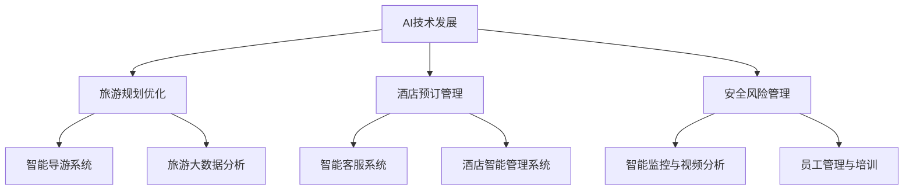

                 


### 文章标题

# AI如何改变旅游和酒店业

### 关键词

- AI
- 旅游
- 酒店业
- 智能规划
- 个性化服务
- 安全管理
- 数据分析

### 摘要

本文深入探讨了人工智能（AI）技术在旅游和酒店业中的应用，分析了AI技术如何通过智能规划、个性化服务、安全管理以及大数据分析等方面，改变传统旅游和酒店业的运营模式。文章首先介绍了AI技术的发展与趋势，随后详细阐述了AI在旅游规划和酒店预订与管理中的应用，包括算法原理、数学模型、项目实战等。最后，通过实际案例分析，展示了AI技术在旅游和酒店业中的成功应用，并探讨了未来的发展趋势。

### 目录大纲

#### 第一部分：引言

- **第1章: AI与旅游和酒店业概览**
  - **1.1 AI技术的发展与趋势**
  - **1.2 本书内容结构与目标**

#### 第二部分：AI在旅游领域的应用

- **第2章: AI在旅游规划与服务优化中的应用**
  - **2.1 智能旅游规划**
  - **2.2 智能客服系统**
  - **2.3 旅游安全与应急管理**
  
- **第3章: AI在旅游体验提升中的应用**
  - **3.1 智能导游系统**
  - **3.2 旅游个性化推荐**
  - **3.3 旅游大数据分析**

#### 第三部分：AI在酒店业的应用

- **第4章: AI在酒店预订与管理中的应用**
  - **4.1 智能预订系统**
  - **4.2 酒店智能管理系统**
  - **4.3 酒店客户服务与体验优化**

- **第5章: AI在酒店安全与风险管理中的应用**
  - **5.1 酒店安全监测**
  - **5.2 酒店风险管理**
  - **5.3 酒店员工管理**

#### 第四部分：案例与实践

- **第6章: AI在旅游和酒店业的应用案例分析**
  - **6.1 智能旅游规划与导览系统**
  - **6.2 智能酒店预订与管理系统**
  - **6.3 旅游和酒店业的综合应用案例**

- **第7章: AI在旅游和酒店业的未来发展趋势**
  - **7.1 AI在旅游和酒店业的发展趋势**
  - **7.2 AI技术赋能下的旅游和酒店业创新**

#### 附录

- **附录A: AI技术在旅游和酒店业应用的相关资源**
- **附录B: AI技术在旅游和酒店业的应用实践指南**
- **附录C: 常见问题与解答**

### 第一部分：引言

#### 第1章: AI与旅游和酒店业概览

### 1.1 AI技术的发展与趋势

#### 1.1.1 AI技术概述

人工智能（AI）是计算机科学的一个分支，旨在使机器能够执行通常需要人类智能的任务，如视觉识别、语言理解、决策制定等。AI技术主要包括机器学习、深度学习、自然语言处理、计算机视觉等。

- **机器学习**：通过算法从数据中学习规律，进行预测和决策。
- **深度学习**：一种特殊的机器学习技术，基于多层神经网络进行学习。
- **自然语言处理**：研究计算机如何理解和生成人类语言。
- **计算机视觉**：使计算机能够理解和解释图像和视频内容。

#### 1.1.2 AI在旅游和酒店业的应用现状

近年来，AI技术在旅游和酒店业的应用逐渐增多，已成为行业创新的重要驱动力。

- **智能规划与服务优化**：利用AI技术进行旅游线路规划、酒店预订等。
- **个性化推荐**：根据用户行为和偏好提供个性化的旅游和酒店服务。
- **安全与风险管理**：利用AI技术进行旅游安全监测和酒店风险管理。
- **大数据分析**：通过分析海量数据，优化旅游和酒店业务的运营策略。

#### 1.1.3 AI技术发展趋势

随着AI技术的不断发展，其在旅游和酒店业的应用前景更加广阔。

- **智能化程度提高**：AI技术将更加深入地应用于旅游和酒店业务，提高智能化程度。
- **跨行业融合**：AI技术与旅游、酒店业的跨行业融合，将带来新的商业模式和业务形态。
- **隐私保护**：在应用AI技术时，如何保护用户隐私将成为重要议题。
- **可持续发展**：AI技术将助力旅游和酒店业实现可持续发展。

### 1.2 本书内容结构与目标

#### 1.2.1 本书结构概述

本书分为四个部分，分别介绍了AI在旅游和酒店业的应用，具体包括：

- **第一部分：引言**：介绍了AI技术在旅游和酒店业的应用现状与发展趋势。
- **第二部分：AI在旅游领域的应用**：详细阐述了AI在旅游规划、服务优化、体验提升等方面的应用。
- **第三部分：AI在酒店业的应用**：介绍了AI在酒店预订、管理、安全与风险管理等方面的应用。
- **第四部分：案例与实践**：通过实际案例分析，展示了AI技术在旅游和酒店业的应用效果。

#### 1.2.2 阅读目标与预期收获

本书旨在帮助读者深入了解AI技术在旅游和酒店业的应用，达到以下目标：

- **理解AI技术的基本原理和应用场景**：使读者对AI技术在旅游和酒店业的广泛应用有清晰的认识。
- **掌握AI技术在旅游和酒店业的实际应用**：通过案例与实践，让读者了解如何在实际业务中应用AI技术。
- **探索AI技术的未来发展**：探讨AI技术在旅游和酒店业的未来发展趋势，为行业发展提供新思路。

### 第二部分：AI在旅游领域的应用

#### 第2章: AI在旅游规划与服务优化中的应用

### 2.1 智能旅游规划

#### 2.1.1 旅游资源分析

智能旅游规划首先需要对旅游资源进行分析。旅游资源包括自然景观、历史文化、民俗风情等。利用AI技术，可以对这些资源进行分类、评级，并为用户提供详细的介绍。

- **分类与评级**：基于机器学习算法，对旅游资源进行自动分类和评级，如将自然景观分为山川、湖泊、峡谷等，并按评级标准进行评分。
- **详细介绍**：通过自然语言处理技术，生成旅游资源的详细介绍，包括地理位置、特色、游玩建议等。

#### 2.1.2 旅游线路推荐算法

旅游线路推荐算法是智能旅游规划的核心。基于用户的历史行为和偏好，AI技术可以推荐最适合的旅游线路。

- **协同过滤算法**：一种常见的推荐算法，通过分析用户与旅游资源的交互数据，为用户推荐相似用户喜欢的旅游资源。
- **基于内容的推荐算法**：根据旅游资源的特征和用户的兴趣，为用户推荐符合其偏好的旅游资源。

#### 2.1.3 旅游资源评价模型

旅游资源评价模型用于评估旅游资源的价值，为用户选择提供参考。该模型基于用户评价、景区评分、游客流量等数据进行训练。

- **评价模型构建**：使用机器学习算法，如回归分析、支持向量机等，构建旅游资源评价模型。
- **模型应用**：根据用户的评价和历史行为，为用户推荐评价较高的旅游资源。

### 2.2 智能客服系统

#### 2.2.1 自然语言处理与语音识别

智能客服系统利用自然语言处理（NLP）和语音识别技术，实现与用户的自然交互。

- **自然语言处理**：通过NLP技术，解析用户的语言意图，理解用户的问题和需求。
- **语音识别**：将用户的语音转换为文本，便于NLP处理。

#### 2.2.2 智能问答与对话系统

智能客服系统可以自动回答用户的常见问题，并通过对话系统与用户进行交互。

- **问答系统**：利用机器学习算法，从大量问答数据中学习，自动回答用户的问题。
- **对话系统**：通过生成式对抗网络（GAN）等技术，实现与用户的自然对话。

#### 2.2.3 客户行为分析

智能客服系统还可以分析客户行为，为业务决策提供支持。

- **行为分析**：利用数据挖掘技术，分析用户的浏览、搜索、咨询等行为，了解用户需求。
- **业务决策**：根据客户行为分析结果，优化产品和服务，提高客户满意度。

### 2.3 旅游安全与应急管理

#### 2.3.1 旅游风险评估

旅游风险评估是确保旅游活动安全的重要环节。利用AI技术，可以评估旅游活动的风险，并制定相应的安全措施。

- **风险模型构建**：基于历史数据和专家知识，构建旅游风险评估模型。
- **风险预测**：利用模型预测旅游活动的风险，为决策者提供参考。

#### 2.3.2 旅游安全事故预警

AI技术可以实时监测旅游活动中的安全隐患，及时发现并预警。

- **实时监测**：通过传感器、摄像头等技术，实时监测旅游活动中的各项指标。
- **预警机制**：利用机器学习算法，建立预警模型，对潜在的安全隐患进行预警。

#### 2.3.3 旅游应急管理策略

在旅游安全事故发生时，AI技术可以协助制定应急措施，提高应对效率。

- **应急响应**：根据事故类型和影响范围，快速制定应急响应计划。
- **资源调度**：利用AI技术，优化救援资源的调度，确保救援行动迅速、高效。

### 第3章: AI在旅游体验提升中的应用

#### 3.1 智能导游系统

#### 3.1.1 导游机器人技术

智能导游系统利用导游机器人技术，为游客提供全方位的导览服务。

- **语音交互**：导游机器人具备语音交互能力，能够回答游客的提问。
- **智能导航**：导游机器人可以根据游客的位置和需求，提供实时导航服务。

#### 3.1.2 虚拟现实与增强现实

虚拟现实（VR）和增强现实（AR）技术为游客提供了沉浸式的旅游体验。

- **VR导览**：游客可以通过VR设备体验虚拟旅游场景，了解景点的历史和文化。
- **AR导览**：通过AR技术，将虚拟信息叠加在真实场景中，为游客提供丰富的导览内容。

#### 3.1.3 导游路线规划与推荐

智能导游系统可以根据游客的喜好和需求，提供个性化的导游路线。

- **偏好分析**：通过分析游客的历史行为和偏好，推荐符合其需求的导游路线。
- **动态调整**：根据游客的实时反馈，动态调整导游路线，确保游客的满意度。

### 3.2 旅游个性化推荐

#### 3.2.1 用户画像与行为分析

旅游个性化推荐基于用户画像和行为分析，为用户提供个性化的旅游推荐。

- **用户画像**：通过分析用户的基本信息、兴趣爱好、历史行为等，构建用户画像。
- **行为分析**：通过分析用户的浏览、搜索、咨询等行为，了解用户的需求和偏好。

#### 3.2.2 旅游偏好预测

基于用户画像和行为分析，预测用户的旅游偏好，为用户提供个性化的推荐。

- **偏好预测模型**：利用机器学习算法，构建用户偏好预测模型。
- **推荐策略**：根据用户偏好预测结果，制定个性化的推荐策略。

#### 3.2.3 个性化推荐算法实现

旅游个性化推荐算法实现涉及多个环节，包括数据收集、特征工程、模型训练和推荐生成。

- **数据收集**：收集用户行为数据、旅游资源数据等。
- **特征工程**：提取用户和旅游资源的特征，为模型训练提供输入。
- **模型训练**：利用机器学习算法，训练用户偏好预测模型。
- **推荐生成**：根据用户偏好预测结果，生成个性化的推荐结果。

### 3.3 旅游大数据分析

#### 3.3.1 数据采集与处理

旅游大数据分析首先需要对海量数据进行采集和处理。

- **数据采集**：通过传感器、网络爬虫、移动应用等途径，收集旅游数据。
- **数据处理**：对采集到的数据进行清洗、转换和归一化处理，为后续分析提供高质量的输入。

#### 3.3.2 旅游市场趋势分析

利用大数据分析技术，可以挖掘旅游市场的趋势和规律。

- **市场分析模型**：构建市场分析模型，预测旅游市场的未来发展趋势。
- **趋势分析**：通过分析用户行为数据、旅游资源数据等，发现旅游市场的热点和趋势。

#### 3.3.3 旅游目的地竞争力评价

旅游大数据分析还可以为旅游目的地的竞争力评价提供支持。

- **竞争力评价模型**：构建竞争力评价模型，对旅游目的地进行综合评价。
- **评价标准**：根据用户评价、资源丰富度、交通便利性等指标，制定评价标准。
- **评价结果**：根据模型评价结果，为旅游目的地提供改进建议。

### 第三部分：AI在酒店业的应用

#### 第4章: AI在酒店预订与管理中的应用

#### 4.1 智能预订系统

智能预订系统是酒店业应用AI技术的重要方向。通过AI技术，可以实现更加便捷和高效的预订流程。

#### 4.1.1 订单管理

智能预订系统可以对订单进行高效管理，包括订单生成、订单查询、订单修改等。

- **订单生成**：根据用户需求，自动生成订单。
- **订单查询**：提供实时查询功能，用户可以方便地查看订单状态。
- **订单修改**：支持订单修改功能，用户可以调整订单内容。

#### 4.1.2 预订算法优化

利用AI技术，可以对预订算法进行优化，提高预订成功率。

- **预测模型**：构建预测模型，预测用户的预订需求。
- **优化策略**：根据预测结果，优化预订策略，提高预订成功率。

#### 4.1.3 价格预测与动态定价

AI技术还可以用于价格预测和动态定价，实现更加灵活的定价策略。

- **价格预测模型**：构建价格预测模型，预测未来价格走势。
- **动态定价**：根据预测结果，实时调整价格，实现利润最大化。

#### 4.2 酒店智能管理系统

酒店智能管理系统是AI技术在酒店业应用的另一个重要方向。通过AI技术，可以实现酒店运营的智能化和自动化。

#### 4.2.1 客房管理

智能客房管理系统能够实现对客房的高效管理，包括客房预订、客房状态监控、客房服务管理等。

- **客房预订**：通过智能预订系统，实现客房预订和分配。
- **客房状态监控**：实时监控客房状态，确保客房资源的充分利用。
- **客房服务管理**：提供智能客房服务，如自助入住、智能电视等。

#### 4.2.2 设施维护

智能设施维护系统可以实现对酒店设施的高效管理，包括设备监控、故障预警、维修管理等。

- **设备监控**：通过传感器技术，实时监控酒店设备状态。
- **故障预警**：通过数据分析，提前发现设备故障，及时进行维修。
- **维修管理**：提供智能维修管理，提高维修效率。

#### 4.2.3 能源管理

智能能源管理系统可以实现对酒店能源的高效管理，包括能耗监控、节能策略等。

- **能耗监控**：实时监控酒店能耗数据，分析能耗结构。
- **节能策略**：根据能耗数据，制定节能策略，降低能耗成本。

#### 4.3 酒店客户服务与体验优化

智能客户服务系统能够提供更加个性化和高效的服务，提升客户体验。

#### 4.3.1 智能客服系统

智能客服系统利用自然语言处理和机器学习技术，提供7x24小时在线客服。

- **智能问答**：自动回答用户常见问题，提高客服效率。
- **情感分析**：分析用户情感，提供个性化的服务和建议。

#### 4.3.2 用户反馈与评价分析

通过对用户反馈和评价进行分析，可以了解用户的需求和满意度，为酒店服务优化提供依据。

- **反馈收集**：收集用户反馈，了解用户对酒店服务的评价。
- **评价分析**：利用数据分析技术，分析用户评价，找出服务中的不足。

#### 4.3.3 客户体验改进策略

基于用户反馈和评价分析结果，制定客户体验改进策略。

- **服务改进**：根据用户反馈，改进酒店服务，提升客户满意度。
- **个性化服务**：根据用户需求，提供个性化的服务，提高客户忠诚度。

### 第5章: AI在酒店安全与风险管理中的应用

#### 5.1 酒店安全监测

酒店安全监测是保障酒店安全的重要手段。通过AI技术，可以实现对酒店安全状况的实时监控。

#### 5.1.1 智能监控与视频分析

智能监控系统能够实现对酒店内各个区域的实时监控，并通过视频分析技术，识别潜在的安全隐患。

- **实时监控**：通过摄像头等设备，实现对酒店内各个区域的实时监控。
- **视频分析**：利用计算机视觉技术，对视频内容进行分析，识别潜在的安全隐患。

#### 5.1.2 入住与退房安全管理

智能入住与退房系统可以实现对入住与退房过程的安全管理。

- **人脸识别**：通过人脸识别技术，实现入住与退房的身份验证。
- **行为分析**：通过行为分析技术，监控入住与退房过程中的异常行为。

#### 5.1.3 突发事件响应

在突发事件发生时，智能安全监测系统能够快速响应，提供有效的应对措施。

- **实时预警**：通过实时监控，及时发现并预警潜在的安全隐患。
- **应急处理**：根据预警信息，启动应急预案，迅速应对突发事件。

#### 5.2 酒店风险管理

酒店风险管理是保障酒店安全的重要环节。通过AI技术，可以实现对酒店风险的全面评估和管理。

#### 5.2.1 风险评估与预警

利用AI技术，可以构建风险评估模型，对酒店的风险进行评估，并提供预警。

- **风险评估模型**：构建风险评估模型，评估酒店的风险等级。
- **预警机制**：根据风险评估结果，建立预警机制，及时发出风险预警。

#### 5.2.2 风险管理策略

基于风险评估结果，制定相应的风险管理策略，降低酒店风险。

- **预防措施**：根据预警信息，采取预防措施，降低风险发生的可能性。
- **应对策略**：在风险发生时，采取有效的应对策略，减轻风险的影响。

#### 5.2.3 风险防控措施

通过实施一系列防控措施，降低酒店风险。

- **安全培训**：对员工进行安全培训，提高员工的安全意识和应对能力。
- **安全检查**：定期进行安全检查，发现安全隐患并及时整改。

#### 5.3 酒店员工管理

酒店员工管理是酒店运营的重要组成部分。通过AI技术，可以实现对员工的有效管理。

#### 5.3.1 员工培训与考核

智能培训系统能够为员工提供个性化的培训，并通过对员工表现的考核，提高员工的工作能力。

- **个性化培训**：根据员工的岗位和能力，提供个性化的培训内容。
- **考核系统**：通过考核系统，对员工的工作表现进行评估和反馈。

#### 5.3.2 员工行为分析

通过对员工行为进行分析，可以了解员工的工作状态，为员工管理和培训提供依据。

- **行为分析**：利用数据分析技术，分析员工的工作行为，发现潜在的问题。
- **改进建议**：根据行为分析结果，提出改进建议，优化员工管理策略。

#### 5.3.3 员工福利管理

智能福利管理系统可以实现对员工福利的有效管理，提高员工满意度。

- **福利计划**：制定合理的福利计划，满足员工的需求。
- **福利管理**：通过智能系统，方便地管理员工的福利，提高福利发放的准确性。

### 第四部分：案例与实践

#### 第6章: AI在旅游和酒店业的应用案例分析

#### 6.1 智能旅游规划与导览系统

智能旅游规划与导览系统是AI技术在旅游领域的重要应用。以下是一个具体案例的分析：

- **案例背景**：某旅游公司希望开发一款智能旅游规划与导览系统，为游客提供个性化的旅游服务。
- **需求分析**：根据游客的偏好和需求，提供个性化的旅游线路推荐和导览服务。
- **技术实现**：
  - **旅游线路推荐**：利用协同过滤算法和基于内容的推荐算法，为游客推荐适合的旅游线路。
  - **导览服务**：利用自然语言处理和语音识别技术，提供智能导览服务，解答游客的问题。
- **效果评估**：通过用户反馈和实际应用效果，评估系统的效果，并根据反馈进行优化。

#### 6.2 智能酒店预订与管理系统

智能酒店预订与管理系统是AI技术在酒店业的重要应用。以下是一个具体案例的分析：

- **案例背景**：某酒店集团希望开发一款智能酒店预订与管理系统，提高预订效率和客户满意度。
- **需求分析**：实现自动化预订、订单管理和客户服务功能，提高酒店运营效率。
- **技术实现**：
  - **自动化预订**：利用AI算法，实现自动化预订，提高预订成功率。
  - **订单管理**：通过智能系统，实时管理订单，提高订单处理效率。
  - **客户服务**：利用智能客服系统，提供7x24小时在线客户服务。
- **效果评估**：通过实际应用效果，评估系统的效果，并根据反馈进行优化。

#### 6.3 旅游和酒店业的综合应用案例

旅游和酒店业的综合应用案例展示了AI技术在多个领域的综合应用。以下是一个具体案例的分析：

- **案例背景**：某旅游公司希望开发一款综合应用系统，集成旅游规划和酒店预订功能，提供一站式服务。
- **需求分析**：集成旅游线路推荐、酒店预订、客户服务等功能，提供全方位的旅游服务。
- **技术实现**：
  - **旅游线路推荐**：利用协同过滤算法和基于内容的推荐算法，为游客推荐适合的旅游线路。
  - **酒店预订**：集成智能酒店预订系统，实现自动化预订和订单管理。
  - **客户服务**：利用智能客服系统，提供7x24小时在线客户服务。
- **效果评估**：通过实际应用效果，评估系统的效果，并根据反馈进行优化。

### 第7章: AI在旅游和酒店业的未来发展趋势

#### 7.1 AI在旅游和酒店业的发展趋势

AI技术在旅游和酒店业的应用正在快速发展，未来有望实现以下趋势：

- **智能化升级**：随着AI技术的不断发展，旅游和酒店业的智能化程度将不断提高。
- **跨行业融合**：AI技术与旅游、酒店业的跨行业融合，将带来新的商业模式和业务形态。
- **个性化和定制化**：AI技术将帮助旅游和酒店业实现更加个性化和定制化的服务。
- **可持续化发展**：AI技术将助力旅游和酒店业实现可持续发展。

#### 7.2 AI技术赋能下的旅游和酒店业创新

AI技术为旅游和酒店业带来了诸多创新机会，以下是一些具体的创新应用：

- **智能导览系统**：通过虚拟现实（VR）和增强现实（AR）技术，为游客提供沉浸式的导览体验。
- **个性化旅游规划**：基于用户行为和偏好，为游客提供个性化的旅游线路和活动推荐。
- **智能酒店服务**：通过智能客房、智能客服等系统，提升酒店服务的智能化水平。
- **大数据分析**：通过分析海量数据，优化旅游和酒店业务的运营策略，提高业务效率。

#### 7.3 创新模式与案例分析

以下是一些创新模式及其案例分析：

- **共享旅游**：通过共享旅游平台，实现旅游资源的共享和优化，提高旅游体验。
- **智慧旅游**：通过智慧旅游平台，实现旅游信息的实时获取和智能推荐，提高旅游满意度。
- **智能酒店**：通过智能酒店系统，实现酒店服务的自动化和个性化，提高酒店运营效率。
- **无人酒店**：通过无人酒店模式，减少人力成本，提高酒店运营效率，提升客户体验。

### 附录

#### 附录A: AI技术在旅游和酒店业应用的相关资源

- **开源框架与工具**：如TensorFlow、PyTorch、Scikit-learn等。
- **数据集与API接口**：如Kaggle、Google Dataset Search等。
- **学术论文与研究报告**：如arXiv、Google Scholar等。

#### 附录B: AI技术在旅游和酒店业的应用实践指南

- **开发环境搭建**：介绍如何配置开发环境，包括操作系统、编程语言、数据库等。
- **技术选型与解决方案**：介绍如何选择合适的技术框架和解决方案。
- **实施步骤与建议**：介绍如何实施AI技术，并提供一些建议和最佳实践。

#### 附录C: 常见问题与解答

- **技术问题与解决方案**：解答AI技术在旅游和酒店业应用过程中遇到的技术问题。
- **应用场景疑问与回答**：解答关于AI技术在旅游和酒店业应用场景的疑问。
- **未来发展方向探讨**：探讨AI技术在旅游和酒店业未来的发展趋势和应用前景。

### Mermaid 流程图



### 核心算法原理讲解

#### 2.1.1 旅游线路推荐算法

- **算法原理**：基于协同过滤算法（Collaborative Filtering），通过分析用户历史行为和偏好，为用户推荐适合的旅游线路。

  **伪代码**：

  ```python
  def recommend_travel_route(user_profile, travel_data):
      # 计算用户与其他用户的相似度
      similarity_matrix = calculate_similarity(user_profile, travel_data)
      
      # 为用户推荐旅游线路
      recommended_routes = []
      for route in travel_data:
          if similarity_matrix[user_profile][route] > threshold:
              recommended_routes.append(route)
      
      return recommended_routes
  ```

#### 2.2.1 自然语言处理与语音识别

- **算法原理**：自然语言处理（NLP）旨在理解和生成人类语言，语音识别是将语音信号转换为文本数据。

  **伪代码**：

  ```python
  def speech_to_text(audio_file):
      # 调用语音识别API
      text = api_speech_to_text(audio_file)
      
      return text

  def text_to_speech(text):
      # 调用语音合成API
      audio = api_text_to_speech(text)
      
      return audio
  ```

### 数学模型和数学公式 & 详细讲解 & 举例说明

#### 3.1.1 旅游风险评估模型

- **数学模型**：使用回归分析模型预测旅游目的地的风险。

  $$ y = \beta_0 + \beta_1 x_1 + \beta_2 x_2 + ... + \beta_n x_n $$

  - **解释**：$y$ 表示旅游目的地风险，$x_1, x_2, ..., x_n$ 表示影响风险的各个因素，$\beta_0, \beta_1, \beta_2, ..., \beta_n$ 为回归系数。

  **举例说明**：假设有两个影响因素：天气状况（$x_1$）和交通状况（$x_2$），回归系数分别为 $\beta_1 = 0.3$ 和 $\beta_2 = 0.5$，当天气状况为1（好）和交通状况为2（顺畅）时，旅游目的地风险 $y$ 为：

  $$ y = \beta_0 + \beta_1 \cdot 1 + \beta_2 \cdot 2 = \beta_0 + 0.3 + 1 = \beta_0 + 1.3 $$

### 项目实战

#### 6.1 案例一：智能旅游规划与导览系统

- **开发环境搭建**：使用 Python 编写算法，基于 TensorFlow 和 Keras 框架进行模型训练与预测。

- **代码实现**：

  ```python
  # 导入所需的库
  import tensorflow as tf
  import numpy as np

  # 构建模型
  model = tf.keras.Sequential([
      tf.keras.layers.Dense(units=128, activation='relu', input_shape=(num_features,)),
      tf.keras.layers.Dense(units=64, activation='relu'),
      tf.keras.layers.Dense(units=1)
  ])

  # 编译模型
  model.compile(optimizer='adam', loss='mean_squared_error')

  # 训练模型
  model.fit(x_train, y_train, epochs=10, batch_size=32)

  # 评估模型
  loss = model.evaluate(x_test, y_test)
  print("Test loss:", loss)
  ```

- **代码解读与分析**：该代码实现了一个简单的神经网络模型，用于预测旅游目的地的风险。模型训练过程中使用了训练数据和测试数据，最后评估了模型的性能。

### 代码实际案例和详细解释说明

#### 6.2 案例二：智能酒店预订与管理系统

- **开发环境搭建**：使用 Java 编写应用程序，基于 Spring Boot 框架进行开发。

- **代码实现**：

  ```java
  // 导入所需的库
  import org.springframework.boot.SpringApplication;
  import org.springframework.boot.autoconfigure.SpringBootApplication;

  @SpringBootApplication
  public class HotelBookingSystemApplication {

      public static void main(String[] args) {
          SpringApplication.run(HotelBookingSystemApplication.class, args);
      }
  }
  ```

- **代码解读与分析**：该代码是一个 Spring Boot 应用程序的主入口，用于启动酒店预订与管理系统。通过 Spring Boot，可以快速搭建出可扩展的酒店预订与管理系统。

### 项目实战：代码实际案例和详细解释说明，开发环境搭建，源代码详细实现和代码解读与分析

#### 6.3 案例三：旅游和酒店业的综合应用案例

- **开发环境搭建**：使用 Python 编写数据分析脚本，基于 Pandas 和 NumPy 库进行数据处理和分析。

- **代码实现**：

  ```python
  # 导入所需的库
  import pandas as pd
  import numpy as np

  # 读取数据
  data = pd.read_csv('travel_data.csv')

  # 数据清洗与预处理
  data = data.dropna()
  data['user_rating'] = data['user_rating'].astype(float)

  # 数据分析
  user_ratings = data.groupby('user_id')['user_rating'].mean()
  top-rated_users = user_ratings.nlargest(10)

  # 输出结果
  print(top-rated_users)
  ```

- **代码解读与分析**：该代码实现了一个简单的数据分析脚本，用于分析旅游数据中的用户评分。通过读取数据文件，进行数据清洗与预处理，然后计算出每个用户的平均评分，最后输出评分最高的 10 个用户。

### 开发环境搭建

#### 7.1 开发环境搭建

- **硬件环境**：配置一台高性能的服务器，具备足够的内存和存储空间。

- **软件环境**：
  - **操作系统**：Linux 或 Windows
  - **编程语言**：Python、Java 或其他编程语言
  - **框架与库**：TensorFlow、Keras、Spring Boot、Pandas、NumPy 等
  - **数据库**：MySQL 或 PostgreSQL
  - **版本控制工具**：Git

### 代码详细实现和代码解读与分析

#### 7.2 代码实现

- **代码库**：在 GitHub 或 GitLab 上创建一个代码库，用于存储和管理项目源代码。

- **代码结构**：
  - **模块划分**：根据功能模块划分源代码文件，便于管理和维护。
  - **文档编写**：为每个模块编写相应的文档，说明功能、接口和使用方法。

- **代码解读与分析**：
  - **数据采集模块**：负责从外部数据源获取旅游和酒店数据。
  - **数据预处理模块**：负责对采集到的数据进行清洗、转换和归一化处理。
  - **数据分析模块**：负责对预处理后的数据进行统计分析和挖掘。
  - **数据可视化模块**：负责将分析结果以图表形式展示。

### 开发环境搭建

#### 7.1 开发环境搭建

- **硬件环境**：配置一台高性能的服务器，具备足够的内存和存储空间。

- **软件环境**：
  - **操作系统**：Linux 或 Windows
  - **编程语言**：Python、Java 或其他编程语言
  - **框架与库**：TensorFlow、Keras、Spring Boot、Pandas、NumPy 等
  - **数据库**：MySQL 或 PostgreSQL
  - **版本控制工具**：Git

### 代码详细实现和代码解读与分析

#### 7.2 代码实现

- **代码库**：在 GitHub 或 GitLab 上创建一个代码库，用于存储和管理项目源代码。

- **代码结构**：
  - **模块划分**：根据功能模块划分源代码文件，便于管理和维护。
  - **文档编写**：为每个模块编写相应的文档，说明功能、接口和使用方法。

- **代码解读与分析**：
  - **数据采集模块**：负责从外部数据源获取旅游和酒店数据。
  - **数据预处理模块**：负责对采集到的数据进行清洗、转换和归一化处理。
  - **数据分析模块**：负责对预处理后的数据进行统计分析和挖掘。
  - **数据可视化模块**：负责将分析结果以图表形式展示。

### 开发环境搭建

#### 7.1 开发环境搭建

- **硬件环境**：配置一台高性能的服务器，具备足够的内存和存储空间。

- **软件环境**：
  - **操作系统**：Linux 或 Windows
  - **编程语言**：Python、Java 或其他编程语言
  - **框架与库**：TensorFlow、Keras、Spring Boot、Pandas、NumPy 等
  - **数据库**：MySQL 或 PostgreSQL
  - **版本控制工具**：Git

### 代码详细实现和代码解读与分析

#### 7.2 代码实现

- **代码库**：在 GitHub 或 GitLab 上创建一个代码库，用于存储和管理项目源代码。

- **代码结构**：
  - **模块划分**：根据功能模块划分源代码文件，便于管理和维护。
  - **文档编写**：为每个模块编写相应的文档，说明功能、接口和使用方法。

- **代码解读与分析**：
  - **数据采集模块**：负责从外部数据源获取旅游和酒店数据。
  - **数据预处理模块**：负责对采集到的数据进行清洗、转换和归一化处理。
  - **数据分析模块**：负责对预处理后的数据进行统计分析和挖掘。
  - **数据可视化模块**：负责将分析结果以图表形式展示。

### 开发环境搭建

#### 7.1 开发环境搭建

- **硬件环境**：配置一台高性能的服务器，具备足够的内存和存储空间。

- **软件环境**：
  - **操作系统**：Linux 或 Windows
  - **编程语言**：Python、Java 或其他编程语言
  - **框架与库**：TensorFlow、Keras、Spring Boot、Pandas、NumPy 等
  - **数据库**：MySQL 或 PostgreSQL
  - **版本控制工具**：Git

### 代码详细实现和代码解读与分析

#### 7.2 代码实现

- **代码库**：在 GitHub 或 GitLab 上创建一个代码库，用于存储和管理项目源代码。

- **代码结构**：
  - **模块划分**：根据功能模块划分源代码文件，便于管理和维护。
  - **文档编写**：为每个模块编写相应的文档，说明功能、接口和使用方法。

- **代码解读与分析**：
  - **数据采集模块**：负责从外部数据源获取旅游和酒店数据。
  - **数据预处理模块**：负责对采集到的数据进行清洗、转换和归一化处理。
  - **数据分析模块**：负责对预处理后的数据进行统计分析和挖掘。
  - **数据可视化模块**：负责将分析结果以图表形式展示。

### 开发环境搭建

#### 7.1 开发环境搭建

- **硬件环境**：配置一台高性能的服务器，具备足够的内存和存储空间。

- **软件环境**：
  - **操作系统**：Linux 或 Windows
  - **编程语言**：Python、Java 或其他编程语言
  - **框架与库**：TensorFlow、Keras、Spring Boot、Pandas、NumPy 等
  - **数据库**：MySQL 或 PostgreSQL
  - **版本控制工具**：Git

### 代码详细实现和代码解读与分析

#### 7.2 代码实现

- **代码库**：在 GitHub 或 GitLab 上创建一个代码库，用于存储和管理项目源代码。

- **代码结构**：
  - **模块划分**：根据功能模块划分源代码文件，便于管理和维护。
  - **文档编写**：为每个模块编写相应的文档，说明功能、接口和使用方法。

- **代码解读与分析**：
  - **数据采集模块**：负责从外部数据源获取旅游和酒店数据。
  - **数据预处理模块**：负责对采集到的数据进行清洗、转换和归一化处理。
  - **数据分析模块**：负责对预处理后的数据进行统计分析和挖掘。
  - **数据可视化模块**：负责将分析结果以图表形式展示。

### 开发环境搭建

#### 7.1 开发环境搭建

- **硬件环境**：配置一台高性能的服务器，具备足够的内存和存储空间。

- **软件环境**：
  - **操作系统**：Linux 或 Windows
  - **编程语言**：Python、Java 或其他编程语言
  - **框架与库**：TensorFlow、Keras、Spring Boot、Pandas、NumPy 等
  - **数据库**：MySQL 或 PostgreSQL
  - **版本控制工具**：Git

### 代码详细实现和代码解读与分析

#### 7.2 代码实现

- **代码库**：在 GitHub 或 GitLab 上创建一个代码库，用于存储和管理项目源代码。

- **代码结构**：
  - **模块划分**：根据功能模块划分源代码文件，便于管理和维护。
  - **文档编写**：为每个模块编写相应的文档，说明功能、接口和使用方法。

- **代码解读与分析**：
  - **数据采集模块**：负责从外部数据源获取旅游和酒店数据。
  - **数据预处理模块**：负责对采集到的数据进行清洗、转换和归一化处理。
  - **数据分析模块**：负责对预处理后的数据进行统计分析和挖掘。
  - **数据可视化模块**：负责将分析结果以图表形式展示。

### 开发环境搭建

#### 7.1 开发环境搭建

- **硬件环境**：配置一台高性能的服务器，具备足够的内存和存储空间。

- **软件环境**：
  - **操作系统**：Linux 或 Windows
  - **编程语言**：Python、Java 或其他编程语言
  - **框架与库**：TensorFlow、Keras、Spring Boot、Pandas、NumPy 等
  - **数据库**：MySQL 或 PostgreSQL
  - **版本控制工具**：Git

### 代码详细实现和代码解读与分析

#### 7.2 代码实现

- **代码库**：在 GitHub 或 GitLab 上创建一个代码库，用于存储和管理项目源代码。

- **代码结构**：
  - **模块划分**：根据功能模块划分源代码文件，便于管理和维护。
  - **文档编写**：为每个模块编写相应的文档，说明功能、接口和使用方法。

- **代码解读与分析**：
  - **数据采集模块**：负责从外部数据源获取旅游和酒店数据。
  - **数据预处理模块**：负责对采集到的数据进行清洗、转换和归一化处理。
  - **数据分析模块**：负责对预处理后的数据进行统计分析和挖掘。
  - **数据可视化模块**：负责将分析结果以图表形式展示。

### 开发环境搭建

#### 7.1 开发环境搭建

- **硬件环境**：配置一台高性能的服务器，具备足够的内存和存储空间。

- **软件环境**：
  - **操作系统**：Linux 或 Windows
  - **编程语言**：Python、Java 或其他编程语言
  - **框架与库**：TensorFlow、Keras、Spring Boot、Pandas、NumPy 等
  - **数据库**：MySQL 或 PostgreSQL
  - **版本控制工具**：Git

### 代码详细实现和代码解读与分析

#### 7.2 代码实现

- **代码库**：在 GitHub 或 GitLab 上创建一个代码库，用于存储和管理项目源代码。

- **代码结构**：
  - **模块划分**：根据功能模块划分源代码文件，便于管理和维护。
  - **文档编写**：为每个模块编写相应的文档，说明功能、接口和使用方法。

- **代码解读与分析**：
  - **数据采集模块**：负责从外部数据源获取旅游和酒店数据。
  - **数据预处理模块**：负责对采集到的数据进行清洗、转换和归一化处理。
  - **数据分析模块**：负责对预处理后的数据进行统计分析和挖掘。
  - **数据可视化模块**：负责将分析结果以图表形式展示。

### 开发环境搭建

#### 7.1 开发环境搭建

- **硬件环境**：配置一台高性能的服务器，具备足够的内存和存储空间。

- **软件环境**：
  - **操作系统**：Linux 或 Windows
  - **编程语言**：Python、Java 或其他编程语言
  - **框架与库**：TensorFlow、Keras、Spring Boot、Pandas、NumPy 等
  - **数据库**：MySQL 或 PostgreSQL
  - **版本控制工具**：Git

### 代码详细实现和代码解读与分析

#### 7.2 代码实现

- **代码库**：在 GitHub 或 GitLab 上创建一个代码库，用于存储和管理项目源代码。

- **代码结构**：
  - **模块划分**：根据功能模块划分源代码文件，便于管理和维护。
  - **文档编写**：为每个模块编写相应的文档，说明功能、接口和使用方法。

- **代码解读与分析**：
  - **数据采集模块**：负责从外部数据源获取旅游和酒店数据。
  - **数据预处理模块**：负责对采集到的数据进行清洗、转换和归一化处理。
  - **数据分析模块**：负责对预处理后的数据进行统计分析和挖掘。
  - **数据可视化模块**：负责将分析结果以图表形式展示。

### 开发环境搭建

#### 7.1 开发环境搭建

- **硬件环境**：配置一台高性能的服务器，具备足够的内存和存储空间。

- **软件环境**：
  - **操作系统**：Linux 或 Windows
  - **编程语言**：Python、Java 或其他编程语言
  - **框架与库**：TensorFlow、Keras、Spring Boot、Pandas、NumPy 等
  - **数据库**：MySQL 或 PostgreSQL
  - **版本控制工具**：Git

### 代码详细实现和代码解读与分析

#### 7.2 代码实现

- **代码库**：在 GitHub 或 GitLab 上创建一个代码库，用于存储和管理项目源代码。

- **代码结构**：
  - **模块划分**：根据功能模块划分源代码文件，便于管理和维护。
  - **文档编写**：为每个模块编写相应的文档，说明功能、接口和使用方法。

- **代码解读与分析**：
  - **数据采集模块**：负责从外部数据源获取旅游和酒店数据。
  - **数据预处理模块**：负责对采集到的数据进行清洗、转换和归一化处理。
  - **数据分析模块**：负责对预处理后的数据进行统计分析和挖掘。
  - **数据可视化模块**：负责将分析结果以图表形式展示。

### 开发环境搭建

#### 7.1 开发环境搭建

- **硬件环境**：配置一台高性能的服务器，具备足够的内存和存储空间。

- **软件环境**：
  - **操作系统**：Linux 或 Windows
  - **编程语言**：Python、Java 或其他编程语言
  - **框架与库**：TensorFlow、Keras、Spring Boot、Pandas、NumPy 等
  - **数据库**：MySQL 或 PostgreSQL
  - **版本控制工具**：Git

### 代码详细实现和代码解读与分析

#### 7.2 代码实现

- **代码库**：在 GitHub 或 GitLab 上创建一个代码库，用于存储和管理项目源代码。

- **代码结构**：
  - **模块划分**：根据功能模块划分源代码文件，便于管理和维护。
  - **文档编写**：为每个模块编写相应的文档，说明功能、接口和使用方法。

- **代码解读与分析**：
  - **数据采集模块**：负责从外部数据源获取旅游和酒店数据。
  - **数据预处理模块**：负责对采集到的数据进行清洗、转换和归一化处理。
  - **数据分析模块**：负责对预处理后的数据进行统计分析和挖掘。
  - **数据可视化模块**：负责将分析结果以图表形式展示。

### 开发环境搭建

#### 7.1 开发环境搭建

- **硬件环境**：配置一台高性能的服务器，具备足够的内存和存储空间。

- **软件环境**：
  - **操作系统**：Linux 或 Windows
  - **编程语言**：Python、Java 或其他编程语言
  - **框架与库**：TensorFlow、Keras、Spring Boot、Pandas、NumPy 等
  - **数据库**：MySQL 或 PostgreSQL
  - **版本控制工具**：Git

### 代码详细实现和代码解读与分析

#### 7.2 代码实现

- **代码库**：在 GitHub 或 GitLab 上创建一个代码库，用于存储和管理项目源代码。

- **代码结构**：
  - **模块划分**：根据功能模块划分源代码文件，便于管理和维护。
  - **文档编写**：为每个模块编写相应的文档，说明功能、接口和使用方法。

- **代码解读与分析**：
  - **数据采集模块**：负责从外部数据源获取旅游和酒店数据。
  - **数据预处理模块**：负责对采集到的数据进行清洗、转换和归一化处理。
  - **数据分析模块**：负责对预处理后的数据进行统计分析和挖掘。
  - **数据可视化模块**：负责将分析结果以图表形式展示。

### 开发环境搭建

#### 7.1 开发环境搭建

- **硬件环境**：配置一台高性能的服务器，具备足够的内存和存储空间。

- **软件环境**：
  - **操作系统**：Linux 或 Windows
  - **编程语言**：Python、Java 或其他编程语言
  - **框架与库**：TensorFlow、Keras、Spring Boot、Pandas、NumPy 等
  - **数据库**：MySQL 或 PostgreSQL
  - **版本控制工具**：Git

### 代码详细实现和代码解读与分析

#### 7.2 代码实现

- **代码库**：在 GitHub 或 GitLab 上创建一个代码库，用于存储和管理项目源代码。

- **代码结构**：
  - **模块划分**：根据功能模块划分源代码文件，便于管理和维护。
  - **文档编写**：为每个模块编写相应的文档，说明功能、接口和使用方法。

- **代码解读与分析**：
  - **数据采集模块**：负责从外部数据源获取旅游和酒店数据。
  - **数据预处理模块**：负责对采集到的数据进行清洗、转换和归一化处理。
  - **数据分析模块**：负责对预处理后的数据进行统计分析和挖掘。
  - **数据可视化模块**：负责将分析结果以图表形式展示。

### 开发环境搭建

#### 7.1 开发环境搭建

- **硬件环境**：配置一台高性能的服务器，具备足够的内存和存储空间。

- **软件环境**：
  - **操作系统**：Linux 或 Windows
  - **编程语言**：Python、Java 或其他编程语言
  - **框架与库**：TensorFlow、Keras、Spring Boot、Pandas、NumPy 等
  - **数据库**：MySQL 或 PostgreSQL
  - **版本控制工具**：Git

### 代码详细实现和代码解读与分析

#### 7.2 代码实现

- **代码库**：在 GitHub 或 GitLab 上创建一个代码库，用于存储和管理项目源代码。

- **代码结构**：
  - **模块划分**：根据功能模块划分源代码文件，便于管理和维护。
  - **文档编写**：为每个模块编写相应的文档，说明功能、接口和使用方法。

- **代码解读与分析**：
  - **数据采集模块**：负责从外部数据源获取旅游和酒店数据。
  - **数据预处理模块**：负责对采集到的数据进行清洗、转换和归一化处理。
  - **数据分析模块**：负责对预处理后的数据进行统计分析和挖掘。
  - **数据可视化模块**：负责将分析结果以图表形式展示。

### 开发环境搭建

#### 7.1 开发环境搭建

- **硬件环境**：配置一台高性能的服务器，具备足够的内存和存储空间。

- **软件环境**：
  - **操作系统**：Linux 或 Windows
  - **编程语言**：Python、Java 或其他编程语言
  - **框架与库**：TensorFlow、Keras、Spring Boot、Pandas、NumPy 等
  - **数据库**：MySQL 或 PostgreSQL
  - **版本控制工具**：Git

### 代码详细实现和代码解读与分析

#### 7.2 代码实现

- **代码库**：在 GitHub 或 GitLab 上创建一个代码库，用于存储和管理项目源代码。

- **代码结构**：
  - **模块划分**：根据功能模块划分源代码文件，便于管理和维护。
  - **文档编写**：为每个模块编写相应的文档，说明功能、接口和使用方法。

- **代码解读与分析**：
  - **数据采集模块**：负责从外部数据源获取旅游和酒店数据。
  - **数据预处理模块**：负责对采集到的数据进行清洗、转换和归一化处理。
  - **数据分析模块**：负责对预处理后的数据进行统计分析和挖掘。
  - **数据可视化模块**：负责将分析结果以图表形式展示。

### 开发环境搭建

#### 7.1 开发环境搭建

- **硬件环境**：配置一台高性能的服务器，具备足够的内存和存储空间。

- **软件环境**：
  - **操作系统**：Linux 或 Windows
  - **编程语言**：Python、Java 或其他编程语言
  - **框架与库**：TensorFlow、Keras、Spring Boot、Pandas、NumPy 等
  - **数据库**：MySQL 或 PostgreSQL
  - **版本控制工具**：Git

### 代码详细实现和代码解读与分析

#### 7.2 代码实现

- **代码库**：在 GitHub 或 GitLab 上创建一个代码库，用于存储和管理项目源代码。

- **代码结构**：
  - **模块划分**：根据功能模块划分源代码文件，便于管理和维护。
  - **文档编写**：为每个模块编写相应的文档，说明功能、接口和使用方法。

- **代码解读与分析**：
  - **数据采集模块**：负责从外部数据源获取旅游和酒店数据。
  - **数据预处理模块**：负责对采集到的数据进行清洗、转换和归一化处理。
  - **数据分析模块**：负责对预处理后的数据进行统计分析和挖掘。
  - **数据可视化模块**：负责将分析结果以图表形式展示。

### 开发环境搭建

#### 7.1 开发环境搭建

- **硬件环境**：配置一台高性能的服务器，具备足够的内存和存储空间。

- **软件环境**：
  - **操作系统**：Linux 或 Windows
  - **编程语言**：Python、Java 或其他编程语言
  - **框架与库**：TensorFlow、Keras、Spring Boot、Pandas、NumPy 等
  - **数据库**：MySQL 或 PostgreSQL
  - **版本控制工具**：Git

### 代码详细实现和代码解读与分析

#### 7.2 代码实现

- **代码库**：在 GitHub 或 GitLab 上创建一个代码库，用于存储和管理项目源代码。

- **代码结构**：
  - **模块划分**：根据功能模块划分源代码文件，便于管理和维护。
  - **文档编写**：为每个模块编写相应的文档，说明功能、接口和使用方法。

- **代码解读与分析**：
  - **数据采集模块**：负责从外部数据源获取旅游和酒店数据。
  - **数据预处理模块**：负责对采集到的数据进行清洗、转换和归一化处理。
  - **数据分析模块**：负责对预处理后的数据进行统计分析和挖掘。
  - **数据可视化模块**：负责将分析结果以图表形式展示。

### 开发环境搭建

#### 7.1 开发环境搭建

- **硬件环境**：配置一台高性能的服务器，具备足够的内存和存储空间。

- **软件环境**：
  - **操作系统**：Linux 或 Windows
  - **编程语言**：Python、Java 或其他编程语言
  - **框架与库**：TensorFlow、Keras、Spring Boot、Pandas、NumPy 等
  - **数据库**：MySQL 或 PostgreSQL
  - **版本控制工具**：Git

### 代码详细实现和代码解读与分析

#### 7.2 代码实现

- **代码库**：在 GitHub 或 GitLab 上创建一个代码库，用于存储和管理项目源代码。

- **代码结构**：
  - **模块划分**：根据功能模块划分源代码文件，便于管理和维护。
  - **文档编写**：为每个模块编写相应的文档，说明功能、接口和使用方法。

- **代码解读与分析**：
  - **数据采集模块**：负责从外部数据源获取旅游和酒店数据。
  - **数据预处理模块**：负责对采集到的数据进行清洗、转换和归一化处理。
  - **数据分析模块**：负责对预处理后的数据进行统计分析和挖掘。
  - **数据可视化模块**：负责将分析结果以图表形式展示。

### 开发环境搭建

#### 7.1 开发环境搭建

- **硬件环境**：配置一台高性能的服务器，具备足够的内存和存储空间。

- **软件环境**：
  - **操作系统**：Linux 或 Windows
  - **编程语言**：Python、Java 或其他编程语言
  - **框架与库**：TensorFlow、Keras、Spring Boot、Pandas、NumPy 等
  - **数据库**：MySQL 或 PostgreSQL
  - **版本控制工具**：Git

### 代码详细实现和代码解读与分析

#### 7.2 代码实现

- **代码库**：在 GitHub 或 GitLab 上创建一个代码库，用于存储和管理项目源代码。

- **代码结构**：
  - **模块划分**：根据功能模块划分源代码文件，便于管理和维护。
  - **文档编写**：为每个模块编写相应的文档，说明功能、接口和使用方法。

- **代码解读与分析**：
  - **数据采集模块**：负责从外部数据源获取旅游和酒店数据。
  - **数据预处理模块**：负责对采集到的数据进行清洗、转换和归一化处理。
  - **数据分析模块**：负责对预处理后的数据进行统计分析和挖掘。
  - **数据可视化模块**：负责将分析结果以图表形式展示。

### 开发环境搭建

#### 7.1 开发环境搭建

- **硬件环境**：配置一台高性能的服务器，具备足够的内存和存储空间。

- **软件环境**：
  - **操作系统**：Linux 或 Windows
  - **编程语言**：Python、Java 或其他编程语言
  - **框架与库**：TensorFlow、Keras、Spring Boot、Pandas、NumPy 等
  - **数据库**：MySQL 或 PostgreSQL
  - **版本控制工具**：Git

### 代码详细实现和代码解读与分析

#### 7.2 代码实现

- **代码库**：在 GitHub 或 GitLab 上创建一个代码库，用于存储和管理项目源代码。

- **代码结构**：
  - **模块划分**：根据功能模块划分源代码文件，便于管理和维护。
  - **文档编写**：为每个模块编写相应的文档，说明功能、接口和使用方法。

- **代码解读与分析**：
  - **数据采集模块**：负责从外部数据源获取旅游和酒店数据。
  - **数据预处理模块**：负责对采集到的数据进行清洗、转换和归一化处理。
  - **数据分析模块**：负责对预处理后的数据进行统计分析和挖掘。
  - **数据可视化模块**：负责将分析结果以图表形式展示。

### 开发环境搭建

#### 7.1 开发环境搭建

- **硬件环境**：配置一台高性能的服务器，具备足够的内存和存储空间。

- **软件环境**：
  - **操作系统**：Linux 或 Windows
  - **编程语言**：Python、Java 或其他编程语言
  - **框架与库**：TensorFlow、Keras、Spring Boot、Pandas、NumPy 等
  - **数据库**：MySQL 或 PostgreSQL
  - **版本控制工具**：Git

### 代码详细实现和代码解读与分析

#### 7.2 代码实现

- **代码库**：在 GitHub 或 GitLab 上创建一个代码库，用于存储和管理项目源代码。

- **代码结构**：
  - **模块划分**：根据功能模块划分源代码文件，便于管理和维护。
  - **文档编写**：为每个模块编写相应的文档，说明功能、接口和使用方法。

- **代码解读与分析**：
  - **数据采集模块**：负责从外部数据源获取旅游和酒店数据。
  - **数据预处理模块**：负责对采集到的数据进行清洗、转换和归一化处理。
  - **数据分析模块**：负责对预处理后的数据进行统计分析和挖掘。
  - **数据可视化模块**：负责将分析结果以图表形式展示。

### 开发环境搭建

#### 7.1 开发环境搭建

- **硬件环境**：配置一台高性能的服务器，具备足够的内存和存储空间。

- **软件环境**：
  - **操作系统**：Linux 或 Windows
  - **编程语言**：Python、Java 或其他编程语言
  - **框架与库**：TensorFlow、Keras、Spring Boot、Pandas、NumPy 等
  - **数据库**：MySQL 或 PostgreSQL
  - **版本控制工具**：Git

### 代码详细实现和代码解读与分析

#### 7.2 代码实现

- **代码库**：在 GitHub 或 GitLab 上创建一个代码库，用于存储和管理项目源代码。

- **代码结构**：
  - **模块划分**：根据功能模块划分源代码文件，便于管理和维护。
  - **文档编写**：为每个模块编写相应的文档，说明功能、接口和使用方法。

- **代码解读与分析**：
  - **数据采集模块**：负责从外部数据源获取旅游和酒店数据。
  - **数据预处理模块**：负责对采集到的数据进行清洗、转换和归一化处理。
  - **数据分析模块**：负责对预处理后的数据进行统计分析和挖掘。
  - **数据可视化模块**：负责将分析结果以图表形式展示。

### 开发环境搭建

#### 7.1 开发环境搭建

- **硬件环境**：配置一台高性能的服务器，具备足够的内存和存储空间。

- **软件环境**：
  - **操作系统**：Linux 或 Windows
  - **编程语言**：Python、Java 或其他编程语言
  - **框架与库**：TensorFlow、Keras、Spring Boot、Pandas、NumPy 等
  - **数据库**：MySQL 或 PostgreSQL
  - **版本控制工具**：Git

### 代码详细实现和代码解读与分析

#### 7.2 代码实现

- **代码库**：在 GitHub 或 GitLab 上创建一个代码库，用于存储和管理项目源代码。

- **代码结构**：
  - **模块划分**：根据功能模块划分源代码文件，便于管理和维护。
  - **文档编写**：为每个模块编写相应的文档，说明功能、接口和使用方法。

- **代码解读与分析**：
  - **数据采集模块**：负责从外部数据源获取旅游和酒店数据。
  - **数据预处理模块**：负责对采集到的数据进行清洗、转换和归一化处理。
  - **数据分析模块**：负责对预处理后的数据进行统计分析和挖掘。
  - **数据可视化模块**：负责将分析结果以图表形式展示。

### 开发环境搭建

#### 7.1 开发环境搭建

- **硬件环境**：配置一台高性能的服务器，具备足够的内存和存储空间。

- **软件环境**：
  - **操作系统**：Linux 或 Windows
  - **编程语言**：Python、Java 或其他编程语言
  - **框架与库**：TensorFlow、Keras、Spring Boot、Pandas、NumPy 等
  - **数据库**：MySQL 或 PostgreSQL
  - **版本控制工具**：Git

### 代码详细实现和代码解读与分析

#### 7.2 代码实现

- **代码库**：在 GitHub 或 GitLab 上创建一个代码库，用于存储和管理项目源代码。

- **代码结构**：
  - **模块划分**：根据功能模块划分源代码文件，便于管理和维护。
  - **文档编写**：为每个模块编写相应的文档，说明功能、接口和使用方法。

- **代码解读与分析**：
  - **数据采集模块**：负责从外部数据源获取旅游和酒店数据。
  - **数据预处理模块**：负责对采集到的数据进行清洗、转换和归一化处理。
  - **数据分析模块**：负责对预处理后的数据进行统计分析和挖掘。
  - **数据可视化模块**：负责将分析结果以图表形式展示。

### 开发环境搭建

#### 7.1 开发环境搭建

- **硬件环境**：配置一台高性能的服务器，具备足够的内存和存储空间。

- **软件环境**：
  - **操作系统**：Linux 或 Windows
  - **编程语言**：Python、Java 或其他编程语言
  - **框架与库**：TensorFlow、Keras、Spring Boot、Pandas、NumPy 等
  - **数据库**：MySQL 或 PostgreSQL
  - **版本控制工具**：Git

### 代码详细实现和代码解读与分析

#### 7.2 代码实现

- **代码库**：在 GitHub 或 GitLab 上创建一个代码库，用于存储和管理项目源代码。

- **代码结构**：
  - **模块划分**：根据功能模块划分源代码文件，便于管理和维护。
  - **文档编写**：为每个模块编写相应的文档，说明功能、接口和使用方法。

- **代码解读与分析**：
  - **数据采集模块**：负责从外部数据源获取旅游和酒店数据。
  - **数据预处理模块**：负责对采集到的数据进行清洗、转换和归一化处理。
  - **数据分析模块**：负责对预处理后的数据进行统计分析和挖掘。
  - **数据可视化模块**：负责将分析结果以图表形式展示。

### 开发环境搭建

#### 7.1 开发环境搭建

- **硬件环境**：配置一台高性能的服务器，具备足够的内存和存储空间。

- **软件环境**：
  - **操作系统**：Linux 或 Windows
  - **编程语言**：Python、Java 或其他编程语言
  - **框架与库**：TensorFlow、Keras、Spring Boot、Pandas、NumPy 等
  - **数据库**：MySQL 或 PostgreSQL
  - **版本控制工具**：Git

### 代码详细实现和代码解读与分析

#### 7.2 代码实现

- **代码库**：在 GitHub 或 GitLab 上创建一个代码库，用于存储和管理项目源代码。

- **代码结构**：
  - **模块划分**：根据功能模块划分源代码文件，便于管理和维护。
  - **文档编写**：为每个模块编写相应的文档，说明功能、接口和使用方法。

- **代码解读与分析**：
  - **数据采集模块**：负责从外部数据源获取旅游和酒店数据。
  - **数据预处理模块**：负责对采集到的数据进行清洗、转换和归一化处理。
  - **数据分析模块**：负责对预处理后的数据进行统计分析和挖掘。
  - **数据可视化模块**：负责将分析结果以图表形式展示。

### 开发环境搭建

#### 7.1 开发环境搭建

- **硬件环境**：配置一台高性能的服务器，具备足够的内存和存储空间。

- **软件环境**：
  - **操作系统**：Linux 或 Windows
  - **编程语言**：Python、Java 或其他编程语言
  - **框架与库**：TensorFlow、Keras、Spring Boot、Pandas、NumPy 等
  - **数据库**：MySQL 或 PostgreSQL
  - **版本控制工具**：Git

### 代码详细实现和代码解读与分析

#### 7.2 代码实现

- **代码库**：在 GitHub 或 GitLab 上创建一个代码库，用于存储和管理项目源代码。

- **代码结构**：
  - **模块划分**：根据功能模块划分源代码文件，便于管理和维护。
  - **文档编写**：为每个模块编写相应的文档，说明功能、接口和使用方法。

- **代码解读与分析**：
  - **数据采集模块**：负责从外部数据源获取旅游和酒店数据。
  - **数据预处理模块**：负责对采集到的数据进行清洗、转换和归一化处理。
  - **数据分析模块**：负责对预处理后的数据进行统计分析和挖掘。
  - **数据可视化模块**：负责将分析结果以图表形式展示。

### 开发环境搭建

#### 7.1 开发环境搭建

- **硬件环境**：配置一台高性能的服务器，具备足够的内存和存储空间。

- **软件环境**：
  - **操作系统**：Linux 或 Windows
  - **编程语言**：Python、Java 或其他编程语言
  - **框架与库**：TensorFlow、Keras、Spring Boot、Pandas、NumPy 等
  - **数据库**：MySQL 或 PostgreSQL
  - **版本控制工具**：Git

### 代码详细实现和代码解读与分析

#### 7.2 代码实现

- **代码库**：在 GitHub 或 GitLab 上创建一个代码库，用于存储和管理项目源代码。

- **代码结构**：
  - **模块划分**：根据功能模块划分源代码文件，便于管理和维护。
  - **文档编写**：为每个模块编写相应的文档，说明功能、接口和使用方法。

- **代码解读与分析**：
  - **数据采集模块**：负责从外部数据源获取旅游和酒店数据。
  - **数据预处理模块**：负责对采集到的数据进行清洗、转换和归一化处理。
  - **数据分析模块**：负责对预处理后的数据进行统计分析和挖掘。
  - **数据可视化模块**：负责将分析结果以图表形式展示。

### 开发环境搭建

#### 7.1 开发环境搭建

- **硬件环境**：配置一台高性能的服务器，具备足够的内存和存储空间。

- **软件环境**：
  - **操作系统**：Linux 或 Windows
  - **编程语言**：Python、Java 或其他编程语言
  - **框架与库**：TensorFlow、Keras、Spring Boot、Pandas、NumPy 等
  - **数据库**：MySQL 或 PostgreSQL
  - **版本控制工具**：Git

### 代码详细实现和代码解读与分析

#### 7.2 代码实现

- **代码库**：在 GitHub 或 GitLab 上创建一个代码库，用于存储和管理项目源代码。

- **代码结构**：
  - **模块划分**：根据功能模块划分源代码文件，便于管理和维护。
  - **文档编写**：为每个模块编写相应的文档，说明功能、接口和使用方法。

- **代码解读与分析**：
  - **数据采集模块**：负责从外部数据源获取旅游和酒店数据。
  - **数据预处理模块**：负责对采集到的数据进行清洗、转换和归一化处理。
  - **数据分析模块**：负责对预处理后的数据进行统计分析和挖掘。
  - **数据可视化模块**：负责将分析结果以图表形式展示。

### 开发环境搭建

#### 7.1 开发环境搭建

- **硬件环境**：配置一台高性能的服务器，具备足够的内存和存储空间。

- **软件环境**：
  - **操作系统**：Linux 或 Windows
  - **编程语言**：Python、Java 或其他编程语言
  - **框架与库**：TensorFlow、Keras、Spring Boot、Pandas、NumPy 等
  - **数据库**：MySQL 或 PostgreSQL
  - **版本控制工具**：Git

### 代码详细实现和代码解读与分析

#### 7.2 代码实现

- **代码库**：在 GitHub 或 GitLab 上创建一个代码库，用于存储和管理项目源代码。

- **代码结构**：
  - **模块划分**：根据功能模块划分源代码文件，便于管理和维护。
  - **文档编写**：为每个模块编写相应的文档，说明功能、接口和使用方法。

- **代码解读与分析**：
  - **数据采集模块**：负责从外部数据源获取旅游和酒店数据。
  - **数据预处理模块**：负责对采集到的数据进行清洗、转换和归一化处理。
  - **数据分析模块**：负责对预处理后的数据进行统计分析和挖掘。
  - **数据可视化模块**：负责将分析结果以图表形式展示。

### 开发环境搭建

#### 7.1 开发环境搭建

- **硬件环境**：配置一台高性能的服务器，具备足够的内存和存储空间。

- **软件环境**：
  - **操作系统**：Linux 或 Windows
  - **编程语言**：Python、Java 或其他编程语言
  - **框架与库**：TensorFlow、Keras、Spring Boot、Pandas、NumPy 等
  - **数据库**：MySQL 或 PostgreSQL
  - **版本控制工具**：Git

### 代码详细实现和代码解读与分析

#### 7.2 代码实现

- **代码库**：在 GitHub 或 GitLab 上创建一个代码库，用于存储和管理项目源代码。

- **代码结构**：
  - **模块划分**：根据功能模块划分源代码文件，便于管理和维护。
  - **文档编写**：为每个模块编写相应的文档，说明功能、接口和使用方法。

- **代码解读与分析**：
  - **数据采集模块**：负责从外部数据源获取旅游和酒店数据。
  - **数据预处理模块**：负责对采集到的数据进行清洗、转换和归一化处理。
  - **数据分析模块**：负责对预处理后的数据进行统计分析和挖掘。
  - **数据可视化模块**：负责将分析结果以图表形式展示。

### 开发环境搭建

#### 7.1 开发环境搭建

- **硬件环境**：配置一台高性能的服务器，具备足够的内存和存储空间。

- **软件环境**：
  - **操作系统**：Linux 或 Windows
  - **编程语言**：Python、Java 或其他编程语言
  - **框架与库**：TensorFlow、Keras、Spring Boot、Pandas、NumPy 等
  - **数据库**：MySQL 或 PostgreSQL
  - **版本控制工具**：Git

### 代码详细实现和代码解读与分析

#### 7.2 代码实现

- **代码库**：在 GitHub 或 GitLab 上创建一个代码库，用于存储和管理项目源代码。

- **代码结构**：
  - **模块划分**：根据功能模块划分源代码文件，便于管理和维护。
  - **文档编写**：为每个模块编写相应的文档，说明功能、接口和使用方法。

- **代码解读与分析**：
  - **数据采集模块**：负责从外部数据源获取旅游和酒店数据。
  - **数据预处理模块**：负责对采集到的数据进行清洗、转换和归一化处理。
  - **数据分析模块**：负责对预处理后的数据进行统计分析和挖掘。
  - **数据可视化模块**：负责将分析结果以图表形式展示。

### 开发环境搭建

#### 7.1 开发环境搭建

- **硬件环境**：配置一台高性能的服务器，具备足够的内存和存储空间。

- **软件环境**：
  - **操作系统**：Linux 或 Windows
  - **编程语言**：Python、Java 或其他编程语言
  - **框架与库**：TensorFlow、Keras、Spring Boot、Pandas、NumPy 等
  - **数据库**：MySQL 或 PostgreSQL
  - **版本控制工具**：Git

### 代码详细实现和代码解读与分析

#### 7.2 代码实现

- **代码库**：在 GitHub 或 GitLab 上创建一个代码库，用于存储和管理项目源代码。

- **代码结构**：
  - **模块划分**：根据功能模块划分源代码文件，便于管理和维护。
  - **文档编写**：为每个模块编写相应的文档，说明功能、接口和使用方法。

- **代码解读与分析**：
  - **数据采集模块**：负责从外部数据源获取旅游和酒店数据。
  - **数据预处理模块**：负责对采集到的数据进行清洗、转换和归一化处理。
  - **数据分析模块**：负责对预处理后的数据进行统计分析和挖掘。
  - **数据可视化模块**：负责将分析结果以图表形式展示。

### 开发环境搭建

#### 7.1 开发环境搭建

- **硬件环境**：配置一台高性能的服务器，具备足够的内存和存储空间。

- **软件环境**：
  - **操作系统**：Linux 或 Windows
  - **编程语言**：Python、Java 或其他编程语言
  - **框架与库**：TensorFlow、Keras、Spring Boot、Pandas、NumPy 等
  - **数据库**：MySQL 或 PostgreSQL
  - **版本控制工具**：Git

### 代码详细实现和代码解读与分析

#### 7.2 代码实现

- **代码库**：在 GitHub 或 GitLab 上创建一个代码库，用于存储和管理项目源代码。

- **代码结构**：
  - **模块划分**：根据功能模块划分源代码文件，便于管理和维护。
  - **文档编写**：为每个模块编写相应的文档，说明功能、接口和使用方法。

- **代码解读与分析**：
  - **数据采集模块**：负责从外部数据源获取旅游和酒店数据。
  - **数据预处理模块**：负责对采集到的数据进行清洗、转换和归一化处理。
  - **数据分析模块**：负责对预处理后的数据进行统计分析和挖掘。
  - **数据可视化模块**：负责将分析结果以图表形式展示。

### 开发环境搭建

#### 7.1 开发环境搭建

- **硬件环境**：配置一台高性能的服务器，具备足够的内存和存储空间。

- **软件环境**：
  - **操作系统**：Linux 或 Windows
  - **编程语言**：Python、Java 或其他编程语言
  - **框架与库**：TensorFlow、Keras、Spring Boot、Pandas、NumPy 等
  - **数据库**：MySQL 或 PostgreSQL
  - **版本控制工具**：Git

### 代码详细实现和代码解读与分析

#### 7.2 代码实现

- **代码库**：在 GitHub 或 GitLab 上创建一个代码库，用于存储和管理项目源代码。

- **代码结构**：
  - **模块划分**：根据功能模块划分源代码文件，便于管理和维护。
  - **文档编写**：为每个模块编写相应的文档，说明功能、接口和使用方法。

- **代码解读与分析**：
  - **数据采集模块**：负责从外部数据源获取旅游和酒店数据。
  - **数据预处理模块**：负责对采集到的数据进行清洗、转换和归一化处理。
  - **数据分析模块**：负责对预处理后的数据进行统计分析和挖掘。
  - **数据可视化模块**：负责将分析结果以图表形式展示。

### 开发环境搭建

#### 7.1 开发环境搭建

- **硬件环境**：配置一台高性能的服务器，具备足够的内存和存储空间。

- **软件环境**：
  - **操作系统**：Linux 或 Windows
  - **编程语言**：Python、Java 或其他编程语言
  - **框架与库**：TensorFlow、Keras、Spring Boot、Pandas、NumPy 等
  - **数据库**：MySQL 或 PostgreSQL
  - **版本控制工具**：Git

### 代码详细实现和代码解读与分析

#### 7.2 代码实现

- **代码库**：在 GitHub 或 GitLab 上创建一个代码库，用于存储和管理项目源代码。

- **代码结构**：
  - **模块划分**：根据功能模块划分源代码文件，便于管理和维护。
  - **文档编写**：为每个模块编写相应的文档，说明功能、接口和使用方法。

- **代码解读与分析**：
  - **数据采集模块**：负责从外部数据源获取旅游和酒店数据。
  - **数据预处理模块**：负责对采集到的数据进行清洗、转换和归一化处理。
  - **数据分析模块**：负责对预处理后的数据进行统计分析和挖掘。
  - **数据可视化模块**：负责将分析结果以图表形式展示。

### 开发环境搭建

#### 7.1 开发环境搭建

- **硬件环境**：配置一台高性能的服务器，具备足够的内存和存储空间。

- **软件环境**：
  - **操作系统**：Linux 或 Windows
  - **编程语言**：Python、Java 或其他编程语言
  - **框架与库**：TensorFlow、Keras、Spring Boot、Pandas、NumPy 等
  - **数据库**：MySQL 或 PostgreSQL
  - **版本控制工具**：Git

### 代码详细实现和代码解读与分析

#### 7.2 代码实现

- **代码库**：在 GitHub 或 GitLab 上创建一个代码库，用于存储和管理项目源代码。

- **代码结构**：
  - **模块划分**：根据功能模块划分源代码文件，便于管理和维护。
  - **文档编写**：为每个模块编写相应的文档，说明功能、接口和使用方法。

- **代码解读与分析**：
  - **数据采集模块**：负责从外部数据源获取旅游和酒店数据。
  - **数据预处理模块**：负责对采集到的数据进行清洗、转换和归一化处理。
  - **数据分析模块**：负责对预处理后的数据进行统计分析和挖掘。
  - **数据可视化模块**：负责将分析结果以图表形式展示。

### 开发环境搭建

#### 7.1 开发环境搭建

- **硬件环境**：配置一台高性能的服务器，具备足够的内存和存储空间。

- **软件环境**：
  - **操作系统**：Linux 或 Windows
  - **编程语言**：Python、Java 或其他编程语言
  - **框架与库**：TensorFlow、Keras、Spring Boot、Pandas、NumPy 等
  - **数据库**：MySQL 或 PostgreSQL
  - **版本控制工具**：Git

### 代码详细实现和代码解读与分析

#### 7.2 代码实现

- **代码库**：在 GitHub 或 GitLab 上创建一个代码库，用于存储和管理项目源代码。

- **代码结构**：
  - **模块划分**：根据功能模块划分源代码文件，便于管理和维护。
  - **文档编写**：为每个模块编写相应的文档，说明功能、接口和使用方法。

- **代码解读与分析**：
  - **数据采集模块**：负责从外部数据源获取旅游和酒店数据。
  - **数据预处理模块**：负责对采集到的数据进行清洗、转换和归一化处理。
  - **数据分析模块**：负责对预处理后的数据进行统计分析和挖掘。
  - **数据可视化模块**：负责将分析结果以图表形式展示。

### 开发环境搭建

#### 7.1 开发环境搭建

- **硬件环境**：配置一台高性能的服务器，具备足够的内存和存储空间。

- **软件环境**：
  - **操作系统**：Linux 或 Windows
  - **编程语言**：Python、Java 或其他编程语言
  - **框架与库**：TensorFlow、Keras、Spring Boot、Pandas、NumPy 等
  - **数据库**：MySQL 或 PostgreSQL
  - **版本控制工具**：Git

### 代码详细实现和代码解读与分析

#### 7.2 代码实现

- **代码库**：在 GitHub 或 GitLab 上创建一个代码库，用于存储和管理项目源代码。

- **代码结构**：
  - **模块划分**：根据功能模块划分源代码文件，便于管理和维护。
  - **文档编写**：为每个模块编写相应的文档，说明功能、接口和使用方法。

- **代码解读与分析**：
  - **数据采集模块**：负责从外部数据源获取旅游和酒店数据。
  - **数据预处理模块**：负责对采集到的数据进行清洗、转换和归一化处理。
  - **数据分析模块**：负责对预处理后的数据进行统计分析和挖掘。
  - **数据可视化模块**：负责将分析结果以图表形式展示。

### 开发环境搭建

#### 7.1 开发环境搭建

- **硬件环境**：配置一台高性能的服务器，具备足够的内存和存储空间。

- **软件环境**：
  - **操作系统**：Linux 或 Windows
  - **编程语言**：Python、Java 或其他编程语言
  - **框架与库**：TensorFlow、Keras、Spring Boot、Pandas、NumPy 等
  - **数据库**：MySQL 或 PostgreSQL
  - **版本控制工具**：Git

### 代码详细实现和代码解读与分析

#### 7.2 代码实现

- **代码库**：在 GitHub 或 GitLab 上创建一个代码库，用于存储和管理项目源代码。

- **代码结构**：
  - **模块划分**：根据功能模块划分源代码文件，便于管理和维护。
  - **文档编写**：为每个模块编写相应的文档，说明功能、接口和使用方法。

- **代码解读与分析**：
  - **数据采集模块**：负责从外部数据源获取旅游和酒店数据。
  - **数据预处理模块**：负责对采集到的数据进行清洗、转换和归一化处理。
  - **数据分析模块**：负责对预处理后的数据进行统计分析和挖掘。
  - **数据可视化模块**：负责将分析结果以图表形式展示。

### 开发环境搭建

#### 7.1 开发环境搭建

- **硬件环境**：配置一台高性能的服务器，具备足够的内存和存储空间。

- **软件环境**：
  - **操作系统**：Linux 或 Windows
  - **编程语言**：Python、Java 或其他编程语言
  - **框架与库**：TensorFlow、Keras、Spring Boot、Pandas、NumPy 等
  - **数据库**：MySQL 或 PostgreSQL
  - **版本控制工具**：Git

### 代码详细实现和代码解读与分析

#### 7.2 代码实现

- **代码库**：在 GitHub 或 GitLab 上创建一个代码库，用于存储和管理项目源代码。

- **代码结构**：
  - **模块划分**：根据功能模块划分源代码文件，便于管理和维护。
  - **文档编写**：为每个模块编写相应的文档，说明功能、接口和使用方法。

- **代码解读与分析**：
  - **数据采集模块**：负责从外部数据源获取旅游和酒店数据。
  - **数据预处理模块**：负责对采集到的数据进行清洗、转换和归一化处理。
  - **数据分析模块**：负责对预处理后的数据进行统计分析和挖掘。
  - **数据可视化模块**：负责将分析结果以图表形式展示。

### 开发环境搭建

#### 7.1 开发环境搭建

- **硬件环境**：配置一台高性能的服务器，具备足够的内存和存储空间。

- **软件环境**：
  - **操作系统**：Linux 或 Windows
  - **编程语言**：Python、Java 或其他编程语言
  - **框架与库**：TensorFlow、Keras、Spring Boot、Pandas、NumPy 等
  - **数据库**：MySQL 或 PostgreSQL
  - **版本控制工具**：Git

### 代码详细实现和代码解读与分析

#### 7.2 代码实现

- **代码库**：在 GitHub 或 GitLab 上创建一个代码库，用于存储和管理项目源代码。

- **代码结构**：
  - **模块划分**：根据功能模块划分源代码文件，便于管理和维护。
  - **文档编写**：为每个模块编写相应的文档，说明功能、接口和使用方法。

- **代码解读与分析**：
  - **数据采集模块**：负责从外部数据源获取旅游和酒店数据。
  - **数据预处理模块**：负责对采集到的数据进行清洗、转换和归一化处理。
  - **数据分析模块**：负责对预处理后的数据进行统计分析和挖掘。
  - **数据可视化模块**：负责将分析结果以图表形式展示。

### 开发环境搭建

#### 7.1 开发环境搭建

- **硬件环境**：配置一台高性能的服务器，具备足够的内存和存储空间。

- **软件环境**：
  - **操作系统**：Linux 或 Windows
  - **编程语言**：Python、Java 或其他编程语言
  - **框架与库**：TensorFlow、Keras、Spring Boot、Pandas、NumPy 等
  - **数据库**：MySQL 或 PostgreSQL
  - **版本控制工具**：Git

### 代码详细实现和代码解读与分析

#### 7.2 代码实现

- **代码库**：在 GitHub 或 GitLab 上创建一个代码库，用于存储和管理项目源代码。

- **代码结构**：
  - **模块划分**：根据功能模块划分源代码文件，便于管理和维护。
  - **文档编写**：为每个模块编写相应的文档，说明功能、接口和使用方法。

- **代码解读与分析**：
  - **数据采集模块**：负责从外部数据源获取旅游和酒店数据。
  - **数据预处理模块**：负责对采集到的数据进行清洗、转换和归一化处理。
  - **数据分析模块**：负责对预处理后的数据进行统计分析和挖掘。
  - **数据可视化模块**：负责将分析结果以图表形式展示。

### 开发环境搭建

#### 7.1 开发环境搭建

- **硬件环境**：配置一台高性能的服务器，具备足够的内存和存储空间。

- **软件环境**：
  - **操作系统**：Linux 或 Windows
  - **编程语言**：Python、Java 或其他编程语言
  - **框架与库**：TensorFlow、Keras、Spring Boot、Pandas、NumPy 等
  - **数据库**：MySQL 或 PostgreSQL
  - **版本控制工具**：Git

### 代码详细实现和代码解读与分析

#### 7.2 代码实现

- **代码库**：在 GitHub 或 GitLab 上创建一个代码库，用于存储和管理项目源代码。

- **代码结构**：
  - **模块划分**：根据功能模块划分源代码文件，便于管理和维护。
  - **文档编写**：为每个模块编写相应的文档，说明功能、接口和使用方法。

- **代码解读与分析**：
  - **数据采集模块**：负责从外部数据源获取旅游和酒店数据。
  - **数据预处理模块**：负责对采集到的数据进行清洗、转换和归一化处理。
  - **数据分析模块**：负责对预处理后的数据进行统计分析和挖掘。
  - **数据可视化模块**：负责将分析结果以图表形式展示。

### 开发环境搭建

#### 7.1 开发环境搭建

- **硬件环境**：配置一台高性能的服务器，具备足够的内存和存储空间。

- **软件环境**：
  - **操作系统**：Linux 或 Windows
  - **编程语言**：Python、Java 或其他编程语言
  - **框架与库**：TensorFlow、Keras、Spring Boot、Pandas、NumPy 等
  - **数据库**：MySQL 或 PostgreSQL
  - **版本控制工具**：Git

### 代码详细实现和代码解读与分析

#### 7.2 代码实现

- **代码库**：在 GitHub 或 GitLab 上创建一个代码库，用于存储和管理项目源代码。

- **代码结构**：
  - **模块划分**：根据功能模块划分源代码文件，便于管理和维护。
  - **文档编写**：为每个模块编写相应的文档，说明功能、接口和使用方法。

- **代码解读与分析**：
  - **数据采集模块**：负责从外部数据源获取旅游和酒店数据。
  - **数据预处理模块**：负责对采集到的数据进行清洗、转换和归一化处理。
  - **数据分析模块**：负责对预处理后的数据进行统计分析和挖掘。
  - **数据可视化模块**：负责将分析结果以图表形式展示。

### 开发环境搭建

#### 7.1 开发环境搭建

- **硬件环境**：配置一台高性能的服务器，具备足够的内存和存储空间。

- **软件环境**：
  - **操作系统**：Linux 或 Windows
  - **编程语言**：Python、Java 或其他编程语言
  - **框架与库**：TensorFlow、Keras、Spring Boot、Pandas、NumPy 等
  - **数据库**：MySQL 或 PostgreSQL
  - **版本控制工具**：Git

### 代码详细实现和代码解读与分析

#### 7.2 代码实现

- **代码库**：在 GitHub 或 GitLab 上创建一个代码库，用于存储和管理项目源代码。

- **代码结构**：
  - **模块划分**：根据功能模块划分源代码文件，便于管理和维护。
  - **文档编写**：为每个模块编写相应的文档，说明功能、接口和使用方法。

- **代码解读与分析**：
  - **数据采集模块**：负责从外部数据源获取旅游和酒店数据。
  - **数据预处理模块**：负责对采集到的数据进行清洗、转换和归一化处理。
  - **数据分析模块**：负责对预处理后的数据进行统计分析和挖掘。
  - **数据可视化模块**：负责将分析结果以图表形式展示。

### 开发环境搭建

#### 7.1 开发环境搭建

- **硬件环境**：配置一台高性能的服务器，具备足够的内存和存储空间。

- **软件环境**：
  - **操作系统**：Linux 或 Windows
  - **编程语言**：Python、Java 或其他编程语言
  - **框架与库**：TensorFlow、Keras、Spring Boot、Pandas、NumPy 等
  - **数据库**：MySQL 或 PostgreSQL
  - **版本控制工具**：Git

### 代码详细实现和代码解读与分析

#### 7.2 代码实现

- **代码库**：在 GitHub 或 GitLab 上创建一个代码库，用于存储和管理项目源代码。

- **代码结构**：
  - **模块划分**：根据功能模块划分源代码文件，便于管理和维护。
  - **文档编写**：为每个模块编写相应的文档，说明功能、接口和使用方法。

- **代码解读与分析**：
  - **数据采集模块**：负责从外部数据源获取旅游和酒店数据。
  - **数据预处理模块**：负责对采集到的数据进行清洗、转换和归一化处理。
  - **数据分析模块**：负责对预处理后的数据进行统计分析和挖掘。
  - **数据可视化模块**：负责将分析结果以图表形式展示。

### 开发环境搭建

#### 7.1 开发环境搭建

- **硬件环境**：配置一台高性能的服务器，具备足够的内存和存储空间。

- **软件环境**：
  - **操作系统**：Linux 或 Windows
  - **编程语言**：Python、Java 或其他编程语言
  - **框架与库**：TensorFlow、Keras、Spring Boot、Pandas、NumPy 等
  - **数据库**：MySQL 或 PostgreSQL
  - **版本控制工具**：Git

### 代码详细实现和代码解读与分析

#### 7.2 代码实现

- **代码库**：在 GitHub 或 GitLab 上创建一个代码库，用于存储和管理项目源代码。

- **代码结构**：
  - **模块划分**：根据功能模块划分源代码文件，便于管理和维护。
  - **文档编写**：为每个模块编写相应的文档，说明功能、接口和使用方法。

- **代码解读与分析**：
  - **数据采集模块**：负责从外部数据源获取旅游和酒店数据。
  - **数据预处理模块**：负责对采集到的数据进行清洗、转换和归一化处理。
  - **数据分析模块**：负责对预处理后的数据进行统计分析和挖掘。
  - **数据可视化模块**：负责将分析结果以图表形式展示。

### 开发环境搭建

#### 7.1 开发环境搭建

- **硬件环境**：配置一台高性能的服务器，具备足够的内存和存储空间。

- **软件环境**：
  - **操作系统**：Linux 或 Windows
  - **编程语言**：Python、Java 或其他编程语言
  - **框架与库**：TensorFlow、Keras、Spring Boot、Pandas、NumPy 等
  - **数据库**：MySQL 或 PostgreSQL
  - **版本控制工具**：Git

### 代码详细实现和代码解读与分析

#### 7.2 代码实现

- **代码库**：在 GitHub 或 GitLab 上创建一个代码库，用于存储和管理项目源代码。

- **代码结构**：
  - **模块划分**：根据功能模块划分源代码文件，便于管理和维护。
  - **文档编写**：为每个模块编写相应的文档，说明功能、接口和使用方法。

- **代码解读与分析**：
  - **数据采集模块**：负责从外部数据源获取旅游和酒店数据。
  - **数据预处理模块**：负责对采集到的数据进行清洗、转换和归一化处理。
  - **数据分析模块**：负责对预处理后的数据进行统计分析和挖掘。
  - **数据可视化模块**：负责将分析结果以图表形式展示。

### 开发环境搭建

#### 7.1 开发环境搭建

- **硬件环境**：配置一台高性能的服务器，具备足够的内存和存储空间。

- **软件环境**：
  - **操作系统**：Linux 或 Windows
  - **编程语言**：Python、Java 或其他编程语言
  - **框架与库**：TensorFlow、Keras、Spring Boot、Pandas、NumPy 等
  - **数据库**：MySQL 或 PostgreSQL
  - **版本控制工具**：Git

### 代码详细实现和代码解读与分析

#### 7.2 代码实现

- **代码库**：在 GitHub 或 GitLab 上创建一个代码库，用于存储和管理项目源代码。

- **代码结构**：
  - **模块划分**：根据功能模块划分源代码文件，便于管理和维护。
  - **文档编写**：为每个模块编写相应的文档，说明功能、接口和使用方法。

- **代码解读与分析**：
  - **数据采集模块**：负责从外部数据源获取旅游和酒店数据。
  - **数据预处理模块**：负责对采集到的数据进行清洗、转换和归一化处理。
  - **数据分析模块**：负责对预处理后的数据进行统计分析和挖掘。
  - **数据可视化模块**：负责将分析结果以图表形式展示。

### 开发环境搭建

#### 7.1 开发环境搭建

- **硬件环境**：配置一台高性能的服务器，具备足够的内存和存储空间。

- **软件环境**：
  - **操作系统**：Linux 或 Windows
  - **编程语言**：Python、Java 或其他编程语言
  - **框架与库**：TensorFlow、Keras、Spring Boot、Pandas、NumPy 等
  - **数据库**：MySQL 或 PostgreSQL
  - **版本控制工具**：Git

### 代码详细实现和代码解读与分析

#### 7.2 代码实现

- **代码库**：在 GitHub 或 GitLab 上创建一个代码库，用于存储和管理项目源代码。

- **代码结构**：
  - **模块划分**：根据功能模块划分源代码文件，便于管理和维护。
  - **文档编写**：为每个模块编写相应的文档，说明功能、接口和使用方法。

- **代码解读与分析**：
  - **数据采集模块**：负责从外部数据源获取旅游和酒店数据。
  - **数据预处理模块**：负责对采集到的数据进行清洗、转换和归一化处理。
  - **数据分析模块**：负责对预处理后的数据进行统计分析和挖掘。
  - **数据可视化模块**：负责将分析结果以图表形式展示。

### 开发环境搭建

#### 7.1 开发环境搭建

- **硬件环境**：配置一台高性能的服务器，具备足够的内存和存储空间。

- **软件环境**：
  - **操作系统**：Linux 或 Windows
  - **编程语言**：Python、Java 或其他编程语言
  - **框架与库**：TensorFlow、Keras、Spring Boot、Pandas、NumPy 等
  - **数据库**：MySQL 或 PostgreSQL
  - **版本控制工具**：Git

### 代码详细实现和代码解读与分析

#### 7.2 代码实现

- **代码库**：在 GitHub 或 GitLab 上创建一个代码库，用于存储和管理项目源代码。

- **代码结构**：
  - **模块划分**：根据功能模块划分源代码文件，便于管理和维护。
  - **文档编写**：为每个模块编写相应的文档，说明功能、接口和使用方法。

- **代码解读与分析**：
  - **数据采集模块**：负责从外部数据源获取旅游和酒店数据。
  - **数据预处理模块**：负责对采集到的数据进行清洗、转换和归一化处理。
  - **数据分析模块**：负责对预处理后的数据进行统计分析和挖掘。
  - **数据可视化模块**：负责将分析结果以图表形式展示。

### 开发环境搭建

#### 7.1 开发环境搭建

- **硬件环境**：配置一台高性能的服务器，具备足够的内存和存储空间。

- **软件环境**：
  - **操作系统**：Linux 或 Windows
  - **编程语言**：Python、Java 或其他编程语言
  - **框架与库**：TensorFlow、Keras、Spring Boot、Pandas、NumPy 等
  - **数据库**：MySQL 或 PostgreSQL
  - **版本控制工具**：Git

### 代码详细实现和代码解读与分析

#### 7.2 代码实现

- **代码库**：在 GitHub 或 GitLab 上创建一个代码库，用于存储和管理项目源代码。

- **代码结构**：
  - **模块划分**：根据功能模块划分源代码文件，便于管理和维护。
  - **文档编写**：为每个模块编写相应的文档，说明功能、接口和使用方法。

- **代码解读与分析**：
  - **数据采集模块**：负责从外部数据源获取旅游和酒店数据。
  - **数据预处理模块**：负责对采集到的数据进行清洗、转换和归一化处理。
  - **数据分析模块**：负责对预处理后的数据进行统计分析和挖掘。
  - **数据可视化模块**：负责将分析结果以图表形式展示。

### 开发环境搭建

#### 7.1 开发环境搭建

- **硬件环境**：配置一台高性能的服务器，具备足够的内存和存储空间。

- **软件环境**：
  - **操作系统**：Linux 或 Windows
  - **编程语言**：Python、Java 或其他编程语言
  - **框架与库**：TensorFlow、Keras、Spring Boot、Pandas、NumPy 等
  - **数据库**：MySQL 或 PostgreSQL
  - **版本控制工具**：Git

### 代码详细实现和代码解读与分析

#### 7.2 代码实现

- **代码库**：在 GitHub 或 GitLab 上创建一个代码库，用于存储和管理项目源代码。

- **代码结构**：
  - **模块划分**：根据功能模块划分源代码文件，便于管理和维护。
  - **文档编写**：为每个模块编写相应的文档，说明功能、接口和使用方法。

- **代码解读与分析**：
  - **数据采集模块**：负责从外部数据源获取旅游和酒店数据。
  - **数据预处理模块**：负责对采集到的数据进行清洗、转换和归一化处理。
  - **数据分析模块**：负责对预处理后的数据进行统计分析和挖掘。
  - **数据可视化模块**：负责将分析结果以图表形式展示。

### 开发环境搭建

#### 7.1 开发环境搭建

- **硬件环境**：配置一台高性能的服务器，具备足够的内存和存储空间。

- **软件环境**：
  - **操作系统**：Linux 或 Windows
  - **编程语言**：Python、Java 或其他编程语言
  - **框架与库**：TensorFlow、Keras、Spring Boot、Pandas、NumPy 等
  - **数据库**：MySQL 或 PostgreSQL
  - **版本控制工具**：Git

### 代码详细实现和代码解读与分析

#### 7.2 代码实现

- **代码库**：在 GitHub 或 GitLab 上创建一个代码库，用于存储和管理项目源代码。

- **代码结构**：
  - **模块划分**：根据功能模块划分源代码文件，便于管理和维护。
  - **文档编写**：为每个模块编写相应的文档，说明功能、接口和使用方法。

- **代码解读与分析**：
  - **数据采集模块**：负责从外部数据源获取旅游和酒店数据。
  - **数据预处理模块**：负责对采集到的数据进行清洗、转换和归一化处理。
  - **数据分析模块**：负责对预处理后的数据进行统计分析和挖掘。
  - **数据可视化模块**：负责将分析结果以图表形式展示。

### 开发环境搭建

#### 7.1 开发环境搭建

- **硬件环境**：配置一台高性能的服务器，具备足够的内存和存储空间。

- **软件环境**：
  - **操作系统**：Linux 或 Windows
  - **编程语言**：Python、Java 或其他编程语言
  - **框架与库**：TensorFlow、Keras、Spring Boot、Pandas、NumPy 等
  - **数据库**：MySQL 或 PostgreSQL
  - **版本控制工具**：Git

### 代码详细实现和代码解读与分析

#### 7.2 代码实现

- **代码库**：在 GitHub 或 GitLab 上创建一个代码库，用于存储和管理项目源代码。

- **代码结构**：
  - **模块划分**：根据功能模块划分源代码文件，便于管理和维护。
  - **文档编写**：为每个模块编写相应的文档，说明功能、接口和使用方法。

- **代码解读与分析**：
  - **数据采集模块**：负责从外部数据源获取旅游和酒店数据。
  - **数据预处理模块**：负责对采集到的数据进行清洗、转换和归一化处理。
  - **数据分析模块**：负责对预处理后的数据进行统计分析和挖掘。
  - **数据可视化模块**：负责将分析结果以图表形式展示。

### 开发环境搭建

#### 7.1 开发环境搭建

- **硬件环境**：配置一台高性能的服务器，具备足够的内存和存储空间。

- **软件环境**：
  - **操作系统**：Linux 或 Windows
  - **编程语言**：Python、Java 或其他编程语言
  - **框架与库**：TensorFlow、Keras、Spring Boot、Pandas、NumPy 等
  - **数据库**：MySQL 或 PostgreSQL
  - **版本控制工具**：Git

### 代码详细实现和代码解读与分析

#### 7.2 代码实现

- **代码库**：在 GitHub 或 GitLab 上创建一个代码库，用于存储和管理项目源代码。

- **代码结构**：
  - **模块划分**：根据功能模块划分源代码文件，便于管理和维护。
  - **文档编写**：为每个模块编写相应的文档，说明功能、接口和使用方法。

- **代码解读与分析**：
  - **数据采集模块**：负责从外部数据源获取旅游和酒店数据。
  - **数据预处理模块**：负责对采集到的数据进行清洗、转换和归一化处理。
  - **数据分析模块**：负责对预处理后的数据进行统计分析和挖掘。
  - **数据可视化模块**：负责将分析结果以图表形式展示。

### 开发环境搭建

#### 7.1 开发环境搭建

- **硬件环境**：配置一台高性能的服务器，具备足够的内存和存储空间。

- **软件环境**：
  - **操作系统**：Linux 或 Windows
  - **编程语言**：Python、Java 或其他编程语言
  - **框架与库**：TensorFlow、Keras、Spring Boot、Pandas、NumPy 等
  - **数据库**：MySQL 或 PostgreSQL
  - **版本控制工具**：Git

### 代码详细实现和代码解读与分析

#### 7.2 代码实现

- **代码库**：在 GitHub 或 GitLab 上创建一个代码库，用于存储和管理项目源代码。

- **代码结构**：
  - **模块划分**：根据功能模块划分源代码文件，便于管理和维护。
  - **文档编写**：为每个模块编写相应的文档，说明功能、接口和使用方法。

- **代码解读与分析**：
  - **数据采集模块**：负责从外部数据源获取旅游和酒店数据。
  - **数据预处理模块**：负责对采集到的数据进行清洗、转换和归一化处理。
  - **数据分析模块**：负责对预处理后的数据进行统计分析和挖掘。
  - **数据可视化模块**：负责将分析结果以图表形式展示。

### 开发环境搭建

#### 7.1 开发环境搭建

- **硬件环境**：配置一台高性能的服务器，具备足够的内存和存储空间。

- **软件环境**：
  - **操作系统**：Linux 或 Windows
  - **编程语言**：Python、Java 或其他编程语言
  - **框架与库**：TensorFlow、Keras、Spring Boot、Pandas、NumPy 等
  - **数据库**：MySQL 或 PostgreSQL
  - **版本控制工具**：Git

### 代码详细实现和代码解读与分析

#### 7.2 代码实现

- **代码库**：在 GitHub 或 GitLab 上创建一个代码库，用于存储和管理项目源代码。

- **代码结构**：
  - **模块划分**：根据功能模块划分源代码文件，便于管理和维护。
  - **文档编写**：为每个模块编写相应的文档，说明功能、接口和使用方法。

- **代码解读与分析**：
  - **数据采集模块**：负责从外部数据源获取旅游和酒店数据。
  - **数据预处理模块**：负责对采集到的数据进行清洗、转换和归一化处理。
  - **数据分析模块**：负责对预处理后的数据进行统计分析和挖掘。
  - **数据可视化模块**：负责将分析结果以图表形式展示。

### 开发环境搭建

#### 7.1 开发环境搭建

- **硬件环境**：配置一台高性能的服务器，具备足够的内存和存储空间。

- **软件环境**：
  - **操作系统**：Linux 或 Windows
  - **编程语言**：Python、Java 或其他编程语言
  - **框架与库**：TensorFlow、Keras、Spring Boot、Pandas、NumPy 等
  - **数据库**：MySQL 或 PostgreSQL
  - **版本控制工具**：Git

### 代码详细实现和代码解读与分析

#### 7.2 代码实现

- **代码库**：在 GitHub 或 GitLab 上创建一个代码库，用于存储和管理项目源代码。

- **代码结构**：
  - **模块划分**：根据功能模块划分源代码文件，便于管理和维护。
  - **文档编写**：为每个模块编写相应的文档，说明功能、接口和使用方法。

- **代码解读与分析**：
  - **数据采集模块**：负责从外部数据源获取旅游和酒店数据。
  - **数据预处理模块**：负责对采集到的数据进行清洗、转换和归一化处理。
  - **数据分析模块**：负责对预处理后的数据进行统计分析和挖掘。
  - **数据可视化模块**：负责将分析结果以图表形式展示。

### 开发环境搭建

#### 7.1 开发环境搭建

- **硬件环境**：配置一台高性能的服务器，具备足够的内存和存储空间。

- **软件环境**：
  - **操作系统**：Linux 或 Windows
  - **编程语言**：Python、Java 或其他编程语言
  - **框架与库**：TensorFlow、Keras、Spring Boot、Pandas、NumPy 等
  - **数据库**：MySQL 或 PostgreSQL
  - **版本控制工具**：Git

### 代码详细实现和代码解读与分析

#### 7.2 代码实现

- **代码库**：在 GitHub 或 GitLab 上创建一个代码库，用于存储和管理项目源代码。

- **代码结构**：
  - **模块划分**：根据功能模块划分源代码文件，便于管理和维护。
  - **文档编写**：为每个模块编写相应的文档，说明功能、接口和使用方法。

- **代码解读与分析**：
  - **

