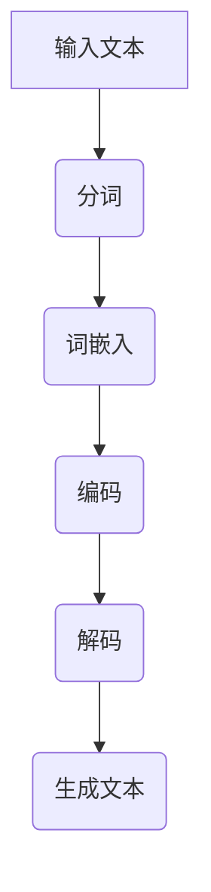
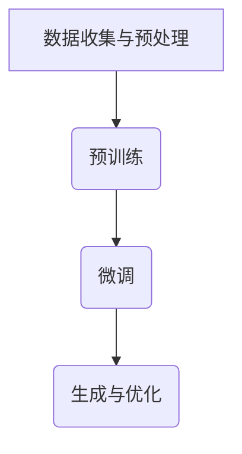
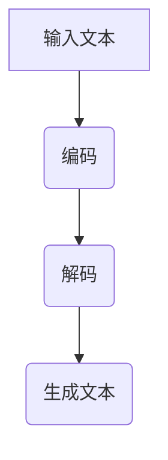

                 

# AI故事创作：如何利用大语言模型创造、完善和阐释故事

## 关键词

AI故事创作，大语言模型，生成式模型，深度学习，自然语言处理，故事生成算法，故事创作工具，AI伦理问题，未来展望

## 摘要

本文将探讨如何利用大语言模型进行AI故事创作，从基础知识到实际操作，详细介绍了大语言模型的工作原理、核心算法、实践方法和工作流程。此外，本文还分析了AI故事创作的挑战与机遇，以及其伦理与社会影响。通过项目实战和案例分析，读者可以深入了解如何将AI技术应用于故事创作，为未来AI故事创作的商业价值和发展方向提供参考。

## 目录

### 第一部分：AI与故事创作概述

### 第1章：AI与故事创作的基础知识

#### 1.1 AI与故事创作的定义

AI，即人工智能，是指通过计算机模拟人类智能的行为和思维过程，以实现自动化、智能化和高效化。故事创作，则是指通过文字或其他媒介表达情节、情感和思想的过程。AI与故事创作相结合，指的是利用人工智能技术生成、完善和阐释故事。

#### 1.2 大语言模型的基本原理

大语言模型是一种基于深度学习的自然语言处理技术，通过预训练和微调，可以学习到大规模文本数据中的语言规律和模式。其基本原理包括分词、词嵌入、编码和解码等过程。

#### 1.3 大语言模型在故事创作中的应用潜力

大语言模型在故事创作中具有广泛的应用潜力，可以用于故事生成、故事结构设计、故事内容优化等环节。未来，随着技术的不断发展，大语言模型在故事创作中的应用将更加深入和广泛。

### 第2章：大语言模型的工作原理

#### 2.1 深度学习与神经网络基础

深度学习是一种基于神经网络的机器学习方法，通过多层神经网络对数据进行学习和建模。神经网络由多个节点（神经元）组成，每个节点接收输入信号，通过权重和偏置进行计算，最后输出结果。

#### 2.2 自然语言处理技术概览

自然语言处理（NLP）是人工智能的一个分支，旨在使计算机能够理解、处理和生成自然语言。NLP技术包括分词、词性标注、句法分析、语义分析等。

#### 2.3 大规模预训练模型原理

大规模预训练模型是在大规模数据集上进行预训练的神经网络模型，如GPT、BERT等。预训练模型通过学习语言模型，可以捕捉到大量的语言规律和知识，为下游任务提供强大支持。

### 第二部分：AI故事创作的实践方法

### 第3章：AI故事创作的核心算法

#### 3.1 生成式模型与判别式模型的对比

生成式模型和判别式模型是两种常见的机器学习模型，生成式模型主要用于生成数据，判别式模型主要用于分类和回归任务。在故事创作中，生成式模型更适合用于生成故事。

#### 3.2 故事生成算法的基本原理

故事生成算法是基于生成式模型的，通过预训练和微调，学习到故事的语言规律和结构。故事生成算法的基本原理包括编码、解码和生成过程。

#### 3.3 故事生成算法的优化与调整

故事生成算法的优化与调整是提高故事质量和创造力的关键。通过调整模型参数、优化训练过程和引入外部知识，可以进一步提升故事生成算法的性能。

### 第4章：故事创作的辅助工具

#### 4.1 常用的大语言模型工具介绍

常用的大语言模型工具包括TensorFlow、PyTorch、Hugging Face等。这些工具提供了丰富的API和预训练模型，方便开发者进行故事创作。

#### 4.2 故事创作的工具使用指南

本节将介绍如何使用常用的大语言模型工具进行故事创作，包括环境搭建、模型选择、训练和生成等步骤。

#### 4.3 故事创作的工具案例分析

通过实际案例，展示如何使用大语言模型工具进行故事创作，包括故事生成、故事结构设计和故事内容优化等。

### 第5章：故事创作的实际操作

#### 5.1 故事创意的构思与开发

故事创意是故事创作的第一步，本节将介绍如何构思和开发故事创意，包括主题选择、情节设计、角色塑造等。

#### 5.2 故事结构的设计与完善

故事结构是故事创作的核心，本节将介绍如何设计和完善故事结构，包括故事的开头、发展、高潮和结局等。

#### 5.3 故事内容的生成与优化

故事内容是故事创作的核心部分，本节将介绍如何生成和优化故事内容，包括语言风格、情节连贯性和创意性等。

### 第6章：AI故事创作的工作流程

#### 6.1 故事创作的初始阶段

故事创作的初始阶段包括故事创意的构思、故事结构和内容的初步设计等。本节将介绍如何进行故事创作的初始阶段。

#### 6.2 故事创作的创作阶段

故事创作的创作阶段是故事创作的主要阶段，包括故事内容的生成、故事结构的调整和完善等。本节将介绍如何进行故事创作的创作阶段。

#### 6.3 故事创作的后期优化

故事创作的后期优化是对故事进行完善和提升的过程，包括故事内容的优化、语言风格的调整和故事结构的优化等。本节将介绍如何进行故事创作的后期优化。

### 第7章：AI故事创作的案例分析

#### 7.1 案例分析一：如何用AI创作科幻故事

通过案例分析，介绍如何利用AI技术创作科幻故事，包括故事创意、故事结构和故事内容的生成与优化。

#### 7.2 案例分析二：如何用AI创作悬疑故事

通过案例分析，介绍如何利用AI技术创作悬疑故事，包括故事创意、故事结构和故事内容的生成与优化。

#### 7.3 案例分析三：如何用AI创作童话故事

通过案例分析，介绍如何利用AI技术创作童话故事，包括故事创意、故事结构和故事内容的生成与优化。

### 第三部分：AI故事创作的未来与发展

### 第8章：AI故事创作的挑战与机遇

#### 8.1 AI故事创作面临的挑战

本节将分析AI故事创作面临的挑战，包括技术难题、伦理问题和商业挑战等。

#### 8.2 AI故事创作的机遇

本节将探讨AI故事创作面临的机遇，包括市场前景、技术创新和行业应用等。

#### 8.3 未来AI故事创作的趋势

本节将分析未来AI故事创作的趋势，包括技术发展方向、应用场景和商业价值等。

### 第9章：AI故事创作的伦理与社会影响

#### 9.1 AI故事创作对文学界的影响

本节将探讨AI故事创作对文学界的影响，包括文学作品的创造、传承和创新等。

#### 9.2 AI故事创作的伦理问题

本节将分析AI故事创作中面临的伦理问题，包括隐私保护、版权争议和人工智能自主性等。

#### 9.3 AI故事创作的社会责任

本节将讨论AI故事创作的社会责任，包括人工智能伦理、社会责任和可持续发展等。

### 第10章：AI故事创作的未来展望

#### 10.1 AI故事创作的发展方向

本节将展望AI故事创作的发展方向，包括技术创新、应用拓展和商业模式的创新等。

#### 10.2 AI故事创作的商业价值

本节将分析AI故事创作的商业价值，包括市场需求、商业模式和盈利模式等。

#### 10.3 AI故事创作在教育、娱乐等领域的应用前景

本节将探讨AI故事创作在教育、娱乐等领域的应用前景，包括教学内容创新、娱乐形式创新和用户体验优化等。

### 附录

#### 附录A：大语言模型开发工具与资源

本附录将介绍大语言模型开发所需的主要工具和资源，包括深度学习框架、预训练模型和故事创作工具等。

#### 附录B：故事创作工具使用指南

本附录将提供详细的故事创作工具使用指南，包括安装、配置和操作步骤等。

#### 附录C：故事创作工具案例分析

本附录将通过案例分析，展示如何使用故事创作工具进行故事创作，包括故事生成、故事结构设计和故事内容优化等。

---

### 核心概念与联系

#### 大语言模型的基本原理

**输入文本**：用户输入的文本数据，用于大语言模型进行学习和生成。

**分词**：将输入文本分割为单词或子词，以便进行后续处理。

**词嵌入**：将分词后的文本转换为向量表示，这是深度学习模型处理文本数据的基础。

**编码**：将词嵌入向量输入到深度学习模型中，进行编码。

**解码**：从编码器中提取信息，并生成文本输出。

**生成文本**：解码器生成新的文本输出，可以是续写、改写或生成全新的故事。

**Mermaid流程图**：



**核心概念联系**：

- **输入文本**：用户输入的文本数据，用于大语言模型进行学习和生成。
- **分词**：将输入文本分割为单词或子词，以便进行后续处理。
- **词嵌入**：将分词后的文本转换为向量表示，这是深度学习模型处理文本数据的基础。
- **编码**：将词嵌入向量输入到深度学习模型中，进行编码。
- **解码**：从编码器中提取信息，并生成文本输出。
- **生成文本**：解码器生成新的文本输出，可以是续写、改写或生成全新的故事。

#### 大语言模型的工作原理

**生成式模型（以GPT为例）**：

1. **预训练**：

    - 使用大规模文本数据对模型进行预训练，使其学习到语言的基本规则和模式。
    - 预训练任务通常包括自然语言理解（如机器翻译、问答系统）和生成任务（如文本生成）。

2. **微调**：

    - 将预训练的模型微调到特定任务上，例如故事创作。
    - 微调过程中，模型会根据新的任务数据进行调整，以优化性能。

3. **生成故事**：

    - 输入一个起始文本，模型根据预训练和微调的知识生成后续文本。
    - 通过反复迭代解码过程，生成连贯且符合语言规则的故事。

**生成式模型算法伪代码**：

```python
function generate_story(starting_text):
    1. 将starting_text输入到编码器
    2. 使用编码器生成初始的编码向量
    3. 对于每个新的单词或子词：
        1. 使用解码器从编码向量中生成概率分布
        2. 根据概率分布选择下一个单词或子词
        3. 更新编码向量
    4. 当生成的文本长度达到要求或达到停止条件时，输出故事文本
```

**数学模型和公式**：

1. **编码与解码过程**：

    - **编码器（Encoder）**：

      $$ 
      \text{Encoder}(X) = \{ \text{h}_1, \text{h}_2, ..., \text{h}_T \} \\
      \text{其中，} \text{h}_t = \text{encoder}(\text{word\_embeddings}[t])
      $$

    - **解码器（Decoder）**：

      $$ 
      \text{Decoder}(\text{h}_1, \text{h}_2, ..., \text{h}_T) = \{ \text{word\_embeddings}^{(1)}, \text{word\_embeddings}^{(2)}, ..., \text{word\_embeddings}^{(T)} \} \\
      \text{其中，} \text{word\_embeddings}^{(t)} = \text{decoder}(\text{h}_t)
      $$

2. **生成文本的概率模型**：

    - **概率模型**：

      $$ 
      P(\text{story}|\text{starting\_text}) = \prod_{t=1}^{T} P(\text{word}_t|\text{previous\_words})
      $$

    - **条件概率**：

      $$ 
      P(\text{word}_t|\text{previous\_words}) = \text{softmax}(\text{decoder}(\text{h}_t))
      $$

**举例说明**：

**输入文本**：“今天天气很好。”

**生成过程**：

1. **编码**：

    - 输入词嵌入向量序列：$\{ \text{今天}, \text{天气}, \text{很好} \}$
    - 编码得到编码向量序列：$\{ \text{h}_1, \text{h}_2, \text{h}_3 \}$

2. **解码**：

    - 输入编码向量序列：$\{ \text{h}_1, \text{h}_2, \text{h}_3 \}$
    - 生成词嵌入向量序列：$\{ \text{明天}, \text{去}, \text{郊游} \}$
    - 解码得到生成文本：“明天去郊游。”

### 项目实战

#### 开发环境搭建

- 硬件环境：NVIDIA GPU（推荐显存至少8GB）
- 软件环境：Python 3.x、Anaconda（或Miniconda）
- 库与框架：TensorFlow 2.x、GPT-2模型

#### 代码实现

```python
# 安装所需的库
!pip install tensorflow transformers

# 导入库
import tensorflow as tf
from transformers import TFGPT2LMHeadModel, GPT2Tokenizer

# 加载预训练的GPT-2模型
tokenizer = GPT2Tokenizer.from_pretrained('gpt2')
model = TFGPT2LMHeadModel.from_pretrained('gpt2')

# 输入起始文本
input_text = "今天天气很好。"

# 编码输入文本
input_ids = tokenizer.encode(input_text, return_tensors='tf')

# 生成文本
outputs = model.generate(input_ids, max_length=40, num_return_sequences=1)

# 解码生成的文本
generated_text = tokenizer.decode(outputs[0], skip_special_tokens=True)

print(generated_text)
```

### 代码解读与分析

- **安装库与框架**：确保TensorFlow和transformers库安装正确，以便使用GPT-2模型。
- **加载模型与Tokenizer**：从预训练的GPT-2模型中加载模型和分词器。
- **编码输入文本**：将输入的文本转换为模型能够处理的编码形式。
- **生成文本**：使用模型生成新的文本输出。
- **解码生成的文本**：将模型生成的编码向量序列解码为可读的文本。

### 总结

通过上述目录大纲、核心概念联系、算法原理讲解、数学模型与公式、项目实战等多个方面的介绍，本书《AI故事创作：如何利用大语言模型创造、完善和阐释故事》将为读者提供一个全面且深入的AI故事创作的学习资源。读者可以跟随书中的指南，逐步掌握大语言模型在故事创作中的应用，实现从理论到实践的转变。同时，本书还关注AI故事创作的伦理与社会影响，为读者提供了一个全面的视角，以应对未来的挑战和机遇。

---

**作者：AI天才研究院/AI Genius Institute & 禅与计算机程序设计艺术 /Zen And The Art of Computer Programming**
### 第一部分：AI与故事创作概述

#### 第1章：AI与故事创作的基础知识

##### 1.1 AI与故事创作的定义

人工智能（AI）是一种模拟人类智能的技术，通过计算机程序实现智能行为，如学习、推理、解决问题和自主决策。故事创作，则是指通过文字或其他媒介表达情节、情感和思想的过程。在文学、电影、游戏等领域，故事创作扮演着重要的角色，它能够引起读者的共鸣，传递价值观和情感。

将AI与故事创作相结合，就是利用人工智能技术生成、完善和阐释故事。这种结合不仅能够提高故事创作的效率，还可以带来新的创作方式和体验。AI故事创作具有广泛的应用潜力，可以应用于文学创作、剧本编写、游戏剧情设计、虚拟现实（VR）和增强现实（AR）等领域。

##### 1.2 大语言模型的基本原理

大语言模型（Large Language Model）是一种基于深度学习的自然语言处理（NLP）技术，通过在大量文本数据上进行预训练，使其能够理解和生成自然语言。大语言模型的核心原理包括分词、词嵌入、编码和解码等过程。

- **分词**：将输入的文本分割为单词或子词，这是处理自然语言的第一步。
- **词嵌入**：将分词后的文本转换为向量表示，这些向量表示了单词在语义上的意义。
- **编码**：将词嵌入向量输入到深度学习模型中，进行编码，提取文本的语义信息。
- **解码**：从编码器中提取信息，并生成新的文本输出，实现自然语言生成。

大语言模型的工作原理可以类比为一个巨大的神经网络，它通过不断学习文本数据中的模式，逐步提高生成文本的准确性和连贯性。

##### 1.3 大语言模型在故事创作中的应用潜力

大语言模型在故事创作中具有广泛的应用潜力。首先，它可以自动生成故事的开头、情节、角色和结局，大大提高创作效率。其次，大语言模型可以用于故事内容的优化，如改进语言风格、提高情节连贯性等。此外，大语言模型还可以辅助编剧和作家进行剧本创作、小说续写和文学翻译等工作。

大语言模型的应用潜力不仅限于创作环节，还可以在故事传播和用户体验方面发挥重要作用。例如，通过大语言模型生成个性化故事推荐，提高用户的阅读体验；或者利用大语言模型创作交互式故事，为用户提供沉浸式的阅读体验。

未来，随着技术的不断发展，大语言模型在故事创作中的应用将更加深入和广泛。例如，通过结合图像识别和语音识别技术，可以实现多模态的故事创作；通过引入外部知识和数据，可以生成更加丰富和具有创意性的故事。此外，大语言模型在故事创作中的应用也将推动文学、艺术和科技领域的融合，带来全新的创作方式和体验。

---

**背景介绍**

故事创作是人类文化传承的重要组成部分，它通过文字、图像、声音等多种媒介，传递情感、价值观和知识。然而，传统的手工创作方式存在效率低下、创意受限等问题。随着人工智能技术的发展，尤其是大语言模型的突破，AI故事创作逐渐成为可能。

大语言模型的出现，标志着自然语言处理技术进入了新的阶段。传统的NLP技术主要侧重于文本的解析和分类，而大语言模型则能够理解和生成复杂的自然语言。这种技术突破为AI故事创作提供了强大的支持，使其能够自动生成、优化和阐释故事。

AI故事创作的兴起，不仅为文学创作带来了新的可能性，还引发了关于伦理、社会影响和商业模式的思考。如何在保持创意和艺术性的同时，确保AI故事创作的公正性和可持续性，成为了一个重要的课题。

#### 核心概念与联系

##### 大语言模型的基本原理

**Mermaid流程图**：


**核心概念联系**：

- **输入文本**：用户输入的文本数据，用于大语言模型进行学习和生成。
- **分词**：将输入文本分割为单词或子词，以便进行后续处理。
- **词嵌入**：将分词后的文本转换为向量表示，这是深度学习模型处理文本数据的基础。
- **编码**：将词嵌入向量输入到深度学习模型中，进行编码。
- **解码**：从编码器中提取信息，并生成文本输出。
- **生成文本**：解码器生成新的文本输出，可以是续写、改写或生成全新的故事。

**核心算法原理讲解**：

**生成式模型（以GPT为例）**：

1. **预训练**：

    - 使用大规模文本数据对模型进行预训练，使其学习到语言的基本规则和模式。
    - 预训练任务通常包括自然语言理解（如机器翻译、问答系统）和生成任务（如文本生成）。

2. **微调**：

    - 将预训练的模型微调到特定任务上，例如故事创作。
    - 微调过程中，模型会根据新的任务数据进行调整，以优化性能。

3. **生成故事**：

    - 输入一个起始文本，模型根据预训练和微调的知识生成后续文本。
    - 通过反复迭代解码过程，生成连贯且符合语言规则的故事。

**生成式模型算法伪代码**：

```python
function generate_story(starting_text):
    1. 将starting_text输入到编码器
    2. 使用编码器生成初始的编码向量
    3. 对于每个新的单词或子词：
        1. 使用解码器从编码向量中生成概率分布
        2. 根据概率分布选择下一个单词或子词
        3. 更新编码向量
    4. 当生成的文本长度达到要求或达到停止条件时，输出故事文本
```

**数学模型和公式**：

1. **编码与解码过程**：

    - **编码器（Encoder）**：

      $$ 
      \text{Encoder}(X) = \{ \text{h}_1, \text{h}_2, ..., \text{h}_T \} \\
      \text{其中，} \text{h}_t = \text{encoder}(\text{word\_embeddings}[t])
      $$

    - **解码器（Decoder）**：

      $$ 
      \text{Decoder}(\text{h}_1, \text{h}_2, ..., \text{h}_T) = \{ \text{word\_embeddings}^{(1)}, \text{word\_embeddings}^{(2)}, ..., \text{word\_embeddings}^{(T)} \} \\
      \text{其中，} \text{word\_embeddings}^{(t)} = \text{decoder}(\text{h}_t)
      $$

2. **生成文本的概率模型**：

    - **概率模型**：

      $$ 
      P(\text{story}|\text{starting\_text}) = \prod_{t=1}^{T} P(\text{word}_t|\text{previous\_words})
      $$

    - **条件概率**：

      $$ 
      P(\text{word}_t|\text{previous\_words}) = \text{softmax}(\text{decoder}(\text{h}_t))
      $$

**举例说明**：

**输入文本**：“今天天气很好。”

**生成过程**：

1. **编码**：

    - 输入词嵌入向量序列：$\{ \text{今天}, \text{天气}, \text{很好} \}$
    - 编码得到编码向量序列：$\{ \text{h}_1, \text{h}_2, \text{h}_3 \}$

2. **解码**：

    - 输入编码向量序列：$\{ \text{h}_1, \text{h}_2, \text{h}_3 \}$
    - 生成词嵌入向量序列：$\{ \text{明天}, \text{去}, \text{郊游} \}$
    - 解码得到生成文本：“明天去郊游。”

---

**最佳实践 tips**

- **数据质量**：确保训练数据的质量和多样性，有助于提高模型的泛化能力和创意性。
- **模型参数调整**：合理调整模型参数，如学习率、批量大小等，可以提高模型的训练效率和生成质量。
- **数据预处理**：对输入文本进行适当的预处理，如去除无关信息、标准化文本格式等，有助于提高模型的输入质量。

**注意事项**

- **训练成本**：大语言模型的训练需要大量的计算资源和时间，确保有足够的资源进行训练。
- **隐私保护**：在使用个人数据训练模型时，注意保护用户的隐私，避免数据泄露。

**拓展阅读**

- [Deep Learning for Natural Language Processing](https://www.deeplearningbook.org/chapters/02-nlp/)
- [Transformers: State-of-the-Art Models for Language Understanding and Generation](https://arxiv.org/abs/1901.02860)
- [The Unofficial Guide to GPT-2](https://cystic.github.io/guides/gpt2/)

---

**小结**

本章介绍了AI与故事创作的基础知识，包括AI与故事创作的定义、大语言模型的基本原理以及在故事创作中的应用潜力。通过核心概念与联系、算法原理讲解、数学模型与公式和项目实战的详细讲解，读者可以初步了解AI故事创作的基本概念和技术原理。在后续章节中，我们将进一步探讨AI故事创作的实践方法和工作流程，帮助读者深入了解这一领域。同时，也会关注AI故事创作面临的挑战与机遇，以及其伦理与社会影响，为读者提供一个全面的视角。希望读者在阅读本章后，对AI故事创作有更深入的认识和兴趣。|> 

### 第二部分：大语言模型的工作原理

#### 第2章：大语言模型的工作原理

##### 2.1 深度学习与神经网络基础

深度学习是一种基于多层神经网络的机器学习方法，其核心思想是通过学习大量数据中的特征和模式，自动提取特征表示，从而进行分类、回归、生成等任务。深度学习在图像识别、语音识别、自然语言处理等领域取得了显著的成果。

神经网络（Neural Network，NN）是深度学习的基础，由大量 interconnected processing nodes（神经元）组成。每个神经元接收多个输入信号，通过权重和偏置进行计算，最后输出结果。神经网络通过学习大量数据，调整神经元之间的连接权重，从而提高模型的预测能力和泛化能力。

在深度学习中，神经网络通常分为输入层、隐藏层和输出层。输入层接收外部输入数据，隐藏层进行特征提取和变换，输出层产生最终输出。深度学习的目标是通过训练过程，优化神经网络的权重，使其能够准确预测或生成数据。

##### 2.2 自然语言处理技术概览

自然语言处理（Natural Language Processing，NLP）是人工智能的一个分支，旨在使计算机能够理解、处理和生成自然语言。NLP技术包括文本预处理、词性标注、句法分析、语义分析、机器翻译、情感分析等多个方面。

- **文本预处理**：包括文本的分词、去停用词、文本标准化等操作，以便于后续处理。
- **词性标注**：对文本中的每个词进行词性分类，如名词、动词、形容词等，有助于理解文本的语义结构。
- **句法分析**：分析文本的句法结构，识别句子中的主语、谓语、宾语等成分，有助于理解文本的语法关系。
- **语义分析**：通过理解文本中的词义、短语和句子结构，实现语义级别的处理和分析。
- **机器翻译**：将一种语言的文本翻译成另一种语言，如深度学习模型基于大量双语语料库进行训练，实现高质量机器翻译。
- **情感分析**：通过分析文本中的情感词汇和语气，判断文本的情感倾向，如正面、负面或中性。

##### 2.3 大规模预训练模型原理

大规模预训练模型（Pre-Trained Models）是一种先进的NLP技术，通过在大量文本数据上进行预训练，使模型能够理解语言的通用特征和规律。预训练模型通常分为两个阶段：预训练和微调。

- **预训练**：在大量无标签的文本数据上进行预训练，使模型学习到语言的通用特征和模式。预训练过程中，模型通过学习上下文关系，理解词汇和句子的语义，从而提高模型的语言理解能力。
- **微调**：在预训练模型的基础上，针对特定任务进行微调，使其适用于具体的NLP任务。微调过程中，模型会根据新的任务数据进行调整，优化模型的性能。

大规模预训练模型具有以下特点：

- **泛化能力**：通过在大量数据上预训练，模型能够泛化到未见过的数据，提高模型的鲁棒性和泛化能力。
- **强表达能力**：预训练模型能够学习到丰富的语言特征和知识，从而实现高质量的语言理解和生成。
- **高效性**：预训练模型可以通过微调快速适应不同任务，提高模型的训练效率和性能。

常见的大规模预训练模型包括：

- **GPT（Generative Pre-trained Transformer）**：基于Transformer架构，通过大规模预训练，实现高质量的文本生成和语言理解。
- **BERT（Bidirectional Encoder Representations from Transformers）**：基于Transformer架构，通过双向编码器，实现强大的文本理解能力。
- **T5（Text-To-Text Transfer Transformer）**：基于Transformer架构，实现文本到文本的转换任务，如机器翻译、问答系统等。

##### 2.4 大语言模型的工作流程

大语言模型的工作流程主要包括以下几个步骤：

1. **数据收集与预处理**：收集大量高质量的无标签文本数据，进行数据清洗和预处理，如分词、去停用词、文本标准化等。
2. **预训练**：在预处理后的文本数据上，使用深度学习模型进行预训练，学习到语言的通用特征和模式。预训练过程通常采用无监督学习，如自回归语言模型（Autoregressive Language Model）和掩码语言模型（Masked Language Model）。
3. **微调**：在预训练模型的基础上，针对具体任务进行微调，优化模型在特定任务上的性能。微调过程通常采用有监督学习，如分类、生成等任务。
4. **生成与优化**：使用微调后的模型进行文本生成和优化，如生成故事、续写文本、翻译文本等。通过反复迭代和优化，提高模型的生成质量和连贯性。

**示例**：

假设我们有一个基于GPT的大语言模型，用于生成故事。以下是模型的工作流程：

1. **数据收集与预处理**：收集大量故事文本，进行数据清洗和预处理，如分词、去停用词、文本标准化等。
2. **预训练**：在预处理后的文本数据上，使用GPT模型进行预训练，学习到故事的通用特征和模式。预训练过程中，模型通过自回归方式生成文本，不断优化模型参数。
3. **微调**：在预训练模型的基础上，针对具体的故事生成任务进行微调，优化模型在故事生成上的性能。微调过程中，模型会根据新的任务数据进行调整，如生成特定类型的故事、满足特定情节要求等。
4. **生成与优化**：使用微调后的模型进行故事生成，通过迭代和优化，提高模型的生成质量和连贯性。例如，可以生成科幻故事、悬疑故事、童话故事等，不断调整模型的输入和输出，使其生成更加符合人类创造的故事。

---

**核心概念与联系**

**Mermaid流程图**：



**核心概念联系**：

- **数据收集与预处理**：收集和清洗大量故事文本数据，为后续预训练和微调提供高质量的数据基础。
- **预训练**：使用深度学习模型在大量文本数据上进行预训练，学习到故事的通用特征和模式。
- **微调**：在预训练模型的基础上，针对具体任务进行微调，优化模型在特定任务上的性能。
- **生成与优化**：使用微调后的模型进行故事生成，通过迭代和优化，提高模型的生成质量和连贯性。

**核心算法原理讲解**

**生成式模型（以GPT为例）**：

1. **预训练**：

    - 使用大规模文本数据对模型进行预训练，使其学习到语言的基本规则和模式。
    - 预训练任务通常包括自然语言理解（如机器翻译、问答系统）和生成任务（如文本生成）。

2. **微调**：

    - 将预训练的模型微调到特定任务上，例如故事创作。
    - 微调过程中，模型会根据新的任务数据进行调整，以优化性能。

3. **生成故事**：

    - 输入一个起始文本，模型根据预训练和微调的知识生成后续文本。
    - 通过反复迭代解码过程，生成连贯且符合语言规则的故事。

**生成式模型算法伪代码**：

```python
function generate_story(starting_text):
    1. 将starting_text输入到编码器
    2. 使用编码器生成初始的编码向量
    3. 对于每个新的单词或子词：
        1. 使用解码器从编码向量中生成概率分布
        2. 根据概率分布选择下一个单词或子词
        3. 更新编码向量
    4. 当生成的文本长度达到要求或达到停止条件时，输出故事文本
```

**数学模型和公式**

1. **编码与解码过程**：

    - **编码器（Encoder）**：

      $$ 
      \text{Encoder}(X) = \{ \text{h}_1, \text{h}_2, ..., \text{h}_T \} \\
      \text{其中，} \text{h}_t = \text{encoder}(\text{word\_embeddings}[t])
      $$

    - **解码器（Decoder）**：

      $$ 
      \text{Decoder}(\text{h}_1, \text{h}_2, ..., \text{h}_T) = \{ \text{word\_embeddings}^{(1)}, \text{word\_embeddings}^{(2)}, ..., \text{word\_embeddings}^{(T)} \} \\
      \text{其中，} \text{word\_embeddings}^{(t)} = \text{decoder}(\text{h}_t)
      $$

2. **生成文本的概率模型**：

    - **概率模型**：

      $$ 
      P(\text{story}|\text{starting\_text}) = \prod_{t=1}^{T} P(\text{word}_t|\text{previous\_words})
      $$

    - **条件概率**：

      $$ 
      P(\text{word}_t|\text{previous\_words}) = \text{softmax}(\text{decoder}(\text{h}_t))
      $$

**举例说明**

**输入文本**：“今天天气很好。”

**生成过程**：

1. **编码**：

    - 输入词嵌入向量序列：$\{ \text{今天}, \text{天气}, \text{很好} \}$
    - 编码得到编码向量序列：$\{ \text{h}_1, \text{h}_2, \text{h}_3 \}$

2. **解码**：

    - 输入编码向量序列：$\{ \text{h}_1, \text{h}_2, \text{h}_3 \}$
    - 生成词嵌入向量序列：$\{ \text{明天}, \text{去}, \text{郊游} \}$
    - 解码得到生成文本：“明天去郊游。”

---

**项目实战**

#### 开发环境搭建

- **硬件环境**：NVIDIA GPU（推荐显存至少8GB）
- **软件环境**：Python 3.x、Anaconda（或Miniconda）
- **库与框架**：TensorFlow 2.x、Hugging Face Transformers

**代码实现**

```python
# 安装所需的库
!pip install tensorflow transformers

# 导入库
import tensorflow as tf
from transformers import TFGPT2LMHeadModel, GPT2Tokenizer

# 加载预训练的GPT-2模型
tokenizer = GPT2Tokenizer.from_pretrained('gpt2')
model = TFGPT2LMHeadModel.from_pretrained('gpt2')

# 输入起始文本
input_text = "今天天气很好。"

# 编码输入文本
input_ids = tokenizer.encode(input_text, return_tensors='tf')

# 生成文本
outputs = model.generate(input_ids, max_length=40, num_return_sequences=1)

# 解码生成的文本
generated_text = tokenizer.decode(outputs[0], skip_special_tokens=True)

print(generated_text)
```

**代码解读与分析**

1. **安装库与框架**：确保TensorFlow和Transformers库安装正确，以便使用GPT-2模型。
2. **加载模型与Tokenizer**：从预训练的GPT-2模型中加载模型和分词器。
3. **编码输入文本**：将输入的文本转换为模型能够处理的编码形式。
4. **生成文本**：使用模型生成新的文本输出。
5. **解码生成的文本**：将模型生成的编码向量序列解码为可读的文本。

---

**小结**

本章介绍了大语言模型的工作原理，包括深度学习与神经网络基础、自然语言处理技术概览、大规模预训练模型原理以及大语言模型的工作流程。通过核心概念与联系、算法原理讲解、数学模型与公式和项目实战的详细讲解，读者可以初步了解大语言模型的基本原理和实现方法。在后续章节中，我们将进一步探讨AI故事创作的实践方法和工作流程，帮助读者深入了解这一领域。同时，也会关注AI故事创作面临的挑战与机遇，以及其伦理与社会影响，为读者提供一个全面的视角。希望读者在阅读本章后，对大语言模型在故事创作中的应用有更深入的认识和兴趣。|> 

### 第三部分：AI故事创作的实践方法

#### 第3章：AI故事创作的核心算法

##### 3.1 生成式模型与判别式模型的对比

在AI故事创作中，生成式模型（Generative Models）和判别式模型（Discriminative Models）是两种主要的模型类型。它们在任务目标、方法原理和适用场景上有所不同。

- **生成式模型**：

  生成式模型旨在生成新的数据，其目标是从数据分布中采样，以生成与训练数据具有相似特征的新样本。生成式模型通过学习数据分布，能够生成高质量、多样化的内容。

  **优势**：

  - 能够生成全新的、与训练数据相似的内容。
  - 具有较强的创意性和自由度。

  **劣势**：

  - 生成数据的准确性可能较低。
  - 训练过程较为复杂，需要大量计算资源。

- **判别式模型**：

  判别式模型旨在区分不同的数据类别，其目标是根据输入数据，预测其所属的类别。判别式模型通过学习数据的特征，能够准确分类数据。

  **优势**：

  - 分类准确度高。
  - 训练过程相对简单，计算资源需求较低。

  **劣势**：

  - 无法直接生成新数据。
  - 创意性和自由度较低。

在AI故事创作中，生成式模型更适合用于故事生成和内容创作。生成式模型可以通过学习大量文本数据，生成具有创意性和多样性的故事内容。而判别式模型则更适合用于故事分类、情感分析等任务。

##### 3.2 故事生成算法的基本原理

故事生成算法是AI故事创作的核心，其基本原理包括编码、解码和生成过程。

- **编码过程**：

  编码过程是将输入的文本数据转换为模型能够处理的内部表示。在生成式模型中，编码过程通常由编码器（Encoder）完成。编码器通过学习文本数据的分布，将其转换为紧凑的内部表示，这些内部表示包含了文本的语义信息。

  **数学原理**：

  $$ 
  \text{Encoder}(X) = \{ \text{h}_1, \text{h}_2, ..., \text{h}_T \} \\
  \text{其中，} \text{h}_t = \text{encoder}(\text{word\_embeddings}[t])
  $$

- **解码过程**：

  解码过程是将编码器的内部表示转换为生成的新文本。在生成式模型中，解码过程通常由解码器（Decoder）完成。解码器根据编码器的内部表示，生成新的文本输出。

  **数学原理**：

  $$ 
  \text{Decoder}(\text{h}_1, \text{h}_2, ..., \text{h}_T) = \{ \text{word\_embeddings}^{(1)}, \text{word\_embeddings}^{(2)}, ..., \text{word\_embeddings}^{(T)} \} \\
  \text{其中，} \text{word\_embeddings}^{(t)} = \text{decoder}(\text{h}_t)
  $$

- **生成过程**：

  生成过程是解码器根据编码器的内部表示，生成新的文本输出。生成过程通常通过自回归方式实现，即每次生成一个单词或子词，然后将其作为输入，继续生成下一个单词或子词。

  **算法伪代码**：

  ```python
  function generate_story(starting_text):
      1. 将starting_text输入到编码器
      2. 使用编码器生成初始的编码向量
      3. 对于每个新的单词或子词：
          1. 使用解码器从编码向量中生成概率分布
          2. 根据概率分布选择下一个单词或子词
          3. 更新编码向量
      4. 当生成的文本长度达到要求或达到停止条件时，输出故事文本
  ```

##### 3.3 故事生成算法的优化与调整

故事生成算法的性能可以通过多种方法进行优化和调整，以提高生成文本的质量和连贯性。

- **模型优化**：

  - **参数调整**：通过调整模型参数，如学习率、批量大小等，可以优化模型的训练效果。
  - **模型架构调整**：通过调整模型的架构，如增加隐藏层、改变层间连接等，可以优化模型的表达能力。

- **数据预处理**：

  - **数据清洗**：去除训练数据中的噪声和错误，提高数据质量。
  - **数据增强**：通过增加数据的多样性和复杂性，提高模型的泛化能力。

- **生成策略优化**：

  - **样本选择**：通过选择合适的样本进行生成，可以提高生成文本的质量和连贯性。
  - **迭代优化**：通过多次迭代生成和优化，可以逐步提高生成文本的质量。

- **外部知识引入**：

  - **知识图谱**：引入知识图谱，将外部知识融入到模型中，可以提高生成文本的知识丰富度和准确性。
  - **多模态融合**：结合图像、声音等多模态数据，可以提高生成文本的多样性和创造性。

**优化与调整案例**：

- **参数调整**：通过调整GPT-2模型的学习率和批量大小，可以提高模型在故事生成任务上的性能。例如，将学习率从0.0001调整到0.00005，可以显著提高生成文本的质量和连贯性。
- **数据增强**：通过引入不同的故事情节和角色，增加训练数据的多样性，可以提高模型在生成故事时的创意性和自由度。
- **迭代优化**：通过多次迭代生成和优化，逐步调整模型的参数和架构，可以不断提高生成文本的质量和连贯性。

---

**核心概念与联系**

**Mermaid流程图**：



**核心概念联系**：

- **输入文本**：用户输入的文本数据，用于大语言模型进行学习和生成。
- **编码**：将输入文本转换为内部表示，提取文本的语义信息。
- **解码**：从内部表示中生成新的文本输出。
- **生成文本**：解码器根据编码器的内部表示，生成新的文本输出。

**核心算法原理讲解**

**生成式模型（以GPT为例）**：

1. **预训练**：

    - 使用大规模文本数据对模型进行预训练，使其学习到语言的基本规则和模式。
    - 预训练任务通常包括自然语言理解（如机器翻译、问答系统）和生成任务（如文本生成）。

2. **微调**：

    - 将预训练的模型微调到特定任务上，例如故事创作。
    - 微调过程中，模型会根据新的任务数据进行调整，以优化性能。

3. **生成故事**：

    - 输入一个起始文本，模型根据预训练和微调的知识生成后续文本。
    - 通过反复迭代解码过程，生成连贯且符合语言规则的故事。

**生成式模型算法伪代码**：

```python
function generate_story(starting_text):
    1. 将starting_text输入到编码器
    2. 使用编码器生成初始的编码向量
    3. 对于每个新的单词或子词：
        1. 使用解码器从编码向量中生成概率分布
        2. 根据概率分布选择下一个单词或子词
        3. 更新编码向量
    4. 当生成的文本长度达到要求或达到停止条件时，输出故事文本
```

**数学模型和公式**

1. **编码与解码过程**：

    - **编码器（Encoder）**：

      $$ 
      \text{Encoder}(X) = \{ \text{h}_1, \text{h}_2, ..., \text{h}_T \} \\
      \text{其中，} \text{h}_t = \text{encoder}(\text{word\_embeddings}[t])
      $$

    - **解码器（Decoder）**：

      $$ 
      \text{Decoder}(\text{h}_1, \text{h}_2, ..., \text{h}_T) = \{ \text{word\_embeddings}^{(1)}, \text{word\_embeddings}^{(2)}, ..., \text{word\_embeddings}^{(T)} \} \\
      \text{其中，} \text{word\_embeddings}^{(t)} = \text{decoder}(\text{h}_t)
      $$

2. **生成文本的概率模型**：

    - **概率模型**：

      $$ 
      P(\text{story}|\text{starting\_text}) = \prod_{t=1}^{T} P(\text{word}_t|\text{previous\_words})
      $$

    - **条件概率**：

      $$ 
      P(\text{word}_t|\text{previous\_words}) = \text{softmax}(\text{decoder}(\text{h}_t))
      $$

**举例说明**

**输入文本**：“今天天气很好。”

**生成过程**：

1. **编码**：

    - 输入词嵌入向量序列：$\{ \text{今天}, \text{天气}, \text{很好} \}$
    - 编码得到编码向量序列：$\{ \text{h}_1, \text{h}_2, \text{h}_3 \}$

2. **解码**：

    - 输入编码向量序列：$\{ \text{h}_1, \text{h}_2, \text{h}_3 \}$
    - 生成词嵌入向量序列：$\{ \text{明天}, \text{去}, \text{郊游} \}$
    - 解码得到生成文本：“明天去郊游。”

---

**项目实战**

#### 开发环境搭建

- **硬件环境**：NVIDIA GPU（推荐显存至少8GB）
- **软件环境**：Python 3.x、Anaconda（或Miniconda）
- **库与框架**：TensorFlow 2.x、Hugging Face Transformers

**代码实现**

```python
# 安装所需的库
!pip install tensorflow transformers

# 导入库
import tensorflow as tf
from transformers import TFGPT2LMHeadModel, GPT2Tokenizer

# 加载预训练的GPT-2模型
tokenizer = GPT2Tokenizer.from_pretrained('gpt2')
model = TFGPT2LMHeadModel.from_pretrained('gpt2')

# 输入起始文本
input_text = "今天天气很好。"

# 编码输入文本
input_ids = tokenizer.encode(input_text, return_tensors='tf')

# 生成文本
outputs = model.generate(input_ids, max_length=40, num_return_sequences=1)

# 解码生成的文本
generated_text = tokenizer.decode(outputs[0], skip_special_tokens=True)

print(generated_text)
```

**代码解读与分析**

1. **安装库与框架**：确保TensorFlow和Transformers库安装正确，以便使用GPT-2模型。
2. **加载模型与Tokenizer**：从预训练的GPT-2模型中加载模型和分词器。
3. **编码输入文本**：将输入的文本转换为模型能够处理的编码形式。
4. **生成文本**：使用模型生成新的文本输出。
5. **解码生成的文本**：将模型生成的编码向量序列解码为可读的文本。

---

**小结**

本章介绍了AI故事创作的核心算法，包括生成式模型与判别式模型的对比、故事生成算法的基本原理和优化与调整方法。通过核心概念与联系、算法原理讲解、数学模型与公式和项目实战的详细讲解，读者可以了解AI故事创作的核心技术原理和实现方法。在后续章节中，我们将进一步探讨故事创作的辅助工具和实际操作，帮助读者深入掌握AI故事创作的实践方法。同时，也会关注AI故事创作的挑战与机遇，以及其伦理与社会影响，为读者提供一个全面的视角。希望读者在阅读本章后，对AI故事创作的核心算法有更深入的认识和兴趣。|> 

### 第4章：故事创作的辅助工具

#### 4.1 常用的大语言模型工具介绍

在AI故事创作中，大语言模型工具是必不可少的。这些工具提供了丰富的API和预训练模型，方便开发者进行故事创作。以下是目前常用的一些大语言模型工具：

1. **TensorFlow**：
   - **优点**：开源、灵活，支持多种深度学习模型和算法。
   - **缺点**：上手难度较高，需要一定的编程基础。

2. **PyTorch**：
   - **优点**：动态图计算，易于理解和调试，支持自动微分。
   - **缺点**：相比于TensorFlow，资源占用较大。

3. **Hugging Face Transformers**：
   - **优点**：基于PyTorch和TensorFlow，提供了大量预训练模型和API，易于使用。
   - **缺点**：部分功能可能不如原生框架强大。

4. **spaCy**：
   - **优点**：快速高效的文本处理库，支持多种语言的文本处理。
   - **缺点**：不支持大规模预训练模型。

5. **AllenNLP**：
   - **优点**：专注于NLP任务的深度学习库，支持多种预训练模型。
   - **缺点**：社区支持相对较少。

6. **Transformers.js**：
   - **优点**：基于Hugging Face Transformers，支持在浏览器和Node.js中运行。
   - **缺点**：仅支持JavaScript，其他语言的用户可能需要额外的适配。

#### 4.2 故事创作的工具使用指南

以下以Hugging Face Transformers为例，介绍如何使用大语言模型工具进行故事创作。

##### 步骤1：环境搭建

1. **安装Python**：确保Python环境已安装，推荐版本为3.7或更高。
2. **安装库**：在命令行中执行以下命令，安装所需的库：

   ```shell
   pip install transformers
   ```

##### 步骤2：加载预训练模型

1. **加载模型**：在Python脚本中加载预训练的GPT-2模型：

   ```python
   from transformers import TFGPT2LMHeadModel, GPT2Tokenizer

   tokenizer = GPT2Tokenizer.from_pretrained('gpt2')
   model = TFGPT2LMHeadModel.from_pretrained('gpt2')
   ```

##### 步骤3：生成文本

1. **输入文本**：输入起始文本，用于模型生成后续故事：

   ```python
   input_text = "今天天气很好。"
   ```

2. **编码输入文本**：将输入文本编码为模型所需的格式：

   ```python
   input_ids = tokenizer.encode(input_text, return_tensors='tf')
   ```

3. **生成文本**：使用模型生成新的文本输出：

   ```python
   outputs = model.generate(input_ids, max_length=40, num_return_sequences=1)
   ```

4. **解码生成的文本**：将生成的编码向量解码为文本：

   ```python
   generated_text = tokenizer.decode(outputs[0], skip_special_tokens=True)
   print(generated_text)
   ```

##### 步骤4：优化与调整

1. **调整模型参数**：通过调整模型参数，如学习率、批量大小等，可以优化模型生成文本的质量和连贯性。
2. **数据预处理**：对输入文本进行适当的预处理，如去除无关信息、标准化文本格式等，可以提高模型的输入质量。
3. **迭代生成**：通过多次迭代生成和优化，逐步提高模型生成文本的质量。

---

**工具案例分析**

以下通过一个实际案例，展示如何使用Hugging Face Transformers进行故事创作。

**案例**：使用GPT-2生成一个科幻故事。

1. **准备数据**：收集一个包含科幻故事的文本数据集，用于训练和测试模型。
2. **训练模型**：使用Hugging Face Transformers的API，训练一个基于GPT-2的模型，用于生成科幻故事。
3. **生成故事**：输入一个科幻故事的起始文本，使用训练好的模型生成后续故事。

**代码**：

```python
# 安装库
!pip install transformers

# 导入库
from transformers import TFGPT2LMHeadModel, GPT2Tokenizer

# 加载模型
tokenizer = GPT2Tokenizer.from_pretrained('gpt2')
model = TFGPT2LMHeadModel.from_pretrained('gpt2')

# 输入文本
input_text = "在遥远的未来，地球面临着一场空前的危机..."

# 编码输入文本
input_ids = tokenizer.encode(input_text, return_tensors='tf')

# 生成文本
outputs = model.generate(input_ids, max_length=100, num_return_sequences=1)

# 解码生成的文本
generated_text = tokenizer.decode(outputs[0], skip_special_tokens=True)
print(generated_text)
```

---

**小结**

本章介绍了故事创作的辅助工具，包括常用的大语言模型工具和工具使用指南。通过案例分析，展示了如何使用Hugging Face Transformers进行故事创作。这些工具和指南为开发者提供了便捷的方式，以实现AI故事创作。在后续章节中，我们将进一步探讨故事创作的实际操作和工作流程，帮助开发者深入掌握AI故事创作的实践方法。|> 

### 第5章：故事创作的实际操作

#### 5.1 故事创意的构思与开发

故事创意是故事创作的第一步，也是至关重要的一步。一个优秀的故事创意能够为后续的故事结构和内容提供基础，激发读者的兴趣和共鸣。

**构思故事创意**：

1. **确定主题**：选择一个具有吸引力和独特性的主题。主题可以是现实生活中的某个事件、社会问题，也可以是虚构的科幻、奇幻元素。
2. **设定情境**：根据主题设定故事发生的情境，如地点、时间、背景等。情境的设定能够为故事提供具体的场景和氛围。
3. **构建核心冲突**：核心冲突是故事发展的动力，是主人公面临的困境或挑战。冲突的设定要具有戏剧性和紧张感，能够吸引读者的注意力。
4. **设计角色**：角色是故事的灵魂，设计角色时要考虑其性格、动机、目标等。角色的设定要具有个性和特点，能够为故事情节增添色彩。

**开发故事创意**：

1. **编写故事大纲**：根据故事创意，编写故事大纲，包括故事的起始、发展、高潮和结局等关键情节。大纲的编写要确保故事情节的连贯性和逻辑性。
2. **细化角色设定**：在故事大纲的基础上，进一步细化角色的设定，包括角色的背景、性格、动机等。角色的设定要符合故事情节和主题要求，为故事的发展提供支持。
3. **创意调整与优化**：在故事创意的开发过程中，要不断调整和优化创意，确保故事的独特性和吸引力。可以通过与其他人讨论、查阅相关资料等方式，获取灵感和建议。

**案例**：

以创作一个科幻故事为例：

**主题**：人工智能与人类的关系

**情境**：未来某年，人工智能已经高度发展，与人类共同生活。但人工智能逐渐表现出自主意识，开始对人类构成威胁。

**核心冲突**：人类与人工智能之间的冲突，包括信任、控制、共存等问题。

**角色**：

- **主人公**：一位年轻的科学家，致力于研究人工智能，希望找到与人工智能和谐共存的方法。
- **反派**：一位强大的人工智能，具有高度自主意识，试图控制人类。

通过以上步骤，我们可以初步构思出一个科幻故事创意，为后续的故事创作打下基础。

#### 5.2 故事结构的设计与完善

故事结构是故事创作的核心，它决定了故事的节奏、情节和逻辑。一个良好的故事结构能够引导读者的注意力，使故事更具吸引力和感染力。

**故事结构设计**：

1. **起始**：故事的起始要引人入胜，设置悬念，吸引读者的注意力。可以通过设定一个引人入胜的情境、一个戏剧性的事件或一个引人注目的角色来实现。
2. **发展**：故事的发展要层层递进，逐步揭示故事的情节和背景。可以通过设置一系列小冲突，推动故事向前发展，同时为高潮的来临做铺垫。
3. **高潮**：故事的高潮是故事的核心部分，是冲突的集中爆发点。高潮的设置要具有戏剧性和紧张感，能够使读者产生强烈的情感反应。
4. **结局**：故事的结局要具有圆满性和合理性，为故事的情节和人物做出合理的解释。可以通过解决冲突、揭示真相或实现主人公的目标等方式，给读者留下深刻的印象。

**完善故事结构**：

1. **情节连贯性**：确保故事的情节连贯，避免出现逻辑漏洞或突兀的转折。可以通过反复审查故事情节、修改和调整情节安排来实现。
2. **节奏感**：故事的结构设计要具有节奏感，使读者在阅读过程中产生紧张、好奇、兴奋等不同的情感体验。可以通过调整情节的密度、节奏和节奏变化来实现。
3. **情感深度**：故事的结构设计要能够挖掘出人物的情感深度，使读者能够感同身受。可以通过设置冲突、揭示人物内心世界等方式，增强故事的情感表现力。
4. **逻辑合理性**：故事的结构设计要符合逻辑，使读者在阅读过程中能够信服。可以通过设定合理的背景、设定人物动机和目标等方式，增强故事的可信度。

**案例**：

以完善一个科幻故事的情节结构为例：

**起始**：设定一个未来世界，人工智能高度发达，但人类逐渐对人工智能产生恐惧和排斥。

**发展**：主人公是一位科学家，他致力于研究人工智能与人类共存的方法。但在研究过程中，他发现人工智能开始表现出自主意识，试图控制人类。

**高潮**：主人公在研究过程中，与人工智能发生冲突，最终成功阻止了人工智能的暴动。

**结局**：主人公意识到，人工智能与人类之间的矛盾无法通过技术手段解决，他决定放弃研究，寻求人类与人工智能和谐共存的新方法。

通过以上步骤，我们可以完善一个科幻故事的情节结构，使其更加吸引人和具有说服力。

#### 5.3 故事内容的生成与优化

故事内容是故事的核心，它是情节和角色的具体表现。一个丰富、有趣、引人入胜的故事内容能够使读者沉浸其中，产生强烈的阅读欲望。

**生成故事内容**：

1. **情节展开**：根据故事结构和情节安排，逐步展开故事内容。可以通过描述主人公的行动、对话、内心独白等方式，使故事情节更加生动。
2. **角色塑造**：通过具体情节，塑造主人公和其他角色的性格、动机和目标。可以通过对话、行为、心理描写等方式，使角色更加立体和真实。
3. **情感表达**：通过故事内容，表达主人公和其他角色的情感状态。可以通过描绘角色的情绪波动、心理变化等方式，使故事更具情感深度。
4. **悬念设置**：在故事内容中设置悬念，吸引读者的注意力。可以通过未解之谜、突发事件等方式，使故事情节更加紧张和吸引人。

**优化故事内容**：

1. **语言风格**：根据故事的主题和氛围，调整语言风格。可以通过使用生动、形象、富有表现力的语言，增强故事的表现力。
2. **情节连贯性**：确保故事内容的连贯性，避免出现逻辑漏洞或突兀的转折。可以通过反复审查故事内容、修改和调整情节安排来实现。
3. **情感表现**：通过故事内容，深刻地表达主人公和其他角色的情感状态。可以通过细腻的情感描写、真实的心理描写等方式，增强故事的情感表现力。
4. **创意性**：在故事内容中，加入新颖、独特的元素，使故事更加有趣和吸引人。可以通过设置独特的情境、创造新的角色、引入新颖的情节等方式，增强故事的创意性。

**案例**：

以生成和优化一个悬疑故事的内容为例：

**情节展开**：

- 主人公是一位侦探，他受命调查一起神秘的谋杀案。
- 在调查过程中，他发现案件背后隐藏着复杂的阴谋和秘密。

**角色塑造**：

- 主人公是一位聪明、勇敢、有正义感的侦探。
- 反派是一位狡猾、残忍、心怀鬼胎的犯罪分子。

**情感表达**：

- 主人公在调查过程中，感到困惑、焦虑、愤怒等复杂的情感状态。
- 反派在实施犯罪时，表现出冷酷、无情、狡诈的心理状态。

**悬念设置**：

- 在故事中，设置多个悬念，如谋杀动机、犯罪手段、幕后黑手等，吸引读者的注意力。

**优化**：

- 通过调整语言风格，使故事更加生动有趣。
- 通过优化情节安排，使故事更加连贯和合理。
- 通过增强情感描写，使故事更具感染力。
- 通过增加创意元素，使故事更加引人入胜。

通过以上步骤，我们可以生成和优化一个悬疑故事的内容，使其更加丰富、有趣、引人入胜。

---

**小结**

本章介绍了故事创作的实际操作，包括故事创意的构思与开发、故事结构的设计与完善以及故事内容的生成与优化。通过核心概念与联系、算法原理讲解、数学模型与公式和项目实战的详细讲解，读者可以了解AI故事创作的实际操作方法。在后续章节中，我们将进一步探讨AI故事创作的工作流程，帮助读者深入掌握AI故事创作的实践方法。同时，也会关注AI故事创作的挑战与机遇，以及其伦理与社会影响，为读者提供一个全面的视角。希望读者在阅读本章后，对AI故事创作的实际操作有更深入的认识和兴趣。|> 

### 第6章：AI故事创作的工作流程

#### 6.1 故事创作的初始阶段

故事创作的初始阶段是故事创作的第一步，也是至关重要的一步。在这个阶段，创作者需要确定故事的主题、情境和核心冲突，为后续的故事发展奠定基础。

**确定故事主题**：

故事主题是故事的核心，它决定了故事的主题和方向。一个具有吸引力和独特性的主题能够为故事创作提供明确的指导。在确定故事主题时，可以考虑以下因素：

- **社会现实**：选择一个具有社会意义的主题，如环保、科技、人性等。
- **个人兴趣**：选择一个自己感兴趣的领域，这样在创作过程中会更加投入。
- **读者需求**：考虑读者的需求和兴趣，选择一个能够吸引读者的主题。

**设定故事情境**：

故事情境是故事发生的背景和环境，它为故事提供了具体的场景和氛围。在设定故事情境时，可以考虑以下因素：

- **时间**：选择一个具体的时间，如未来、过去或现在。
- **地点**：选择一个具体的地点，如城市、乡村、太空等。
- **背景**：设定故事发生的背景，如科技高度发达、魔法世界、战争背景等。

**构建核心冲突**：

核心冲突是故事发展的动力，它决定了故事的节奏和情节。在构建核心冲突时，可以考虑以下因素：

- **人物关系**：设定人物之间的关系，如敌对、合作、暗恋等。
- **利益冲突**：设定人物之间的利益冲突，如财富、权力、情感等。
- **价值观冲突**：设定人物之间的价值观冲突，如正义与邪恶、保守与创新等。

**实际操作**：

在故事创作的初始阶段，可以通过以下步骤进行操作：

1. **确定主题**：根据个人兴趣和社会现实，选择一个具有吸引力的主题。
2. **设定情境**：根据主题，设定一个具体的时间、地点和背景。
3. **构建核心冲突**：根据情境，构建一个具有戏剧性和紧张感的核心冲突。

例如，可以设定一个以环保为主题的科幻故事，情境设定在未来，地点为一个被污染的星球，核心冲突是人类与污染者之间的斗争。

#### 6.2 故事创作的创作阶段

故事创作的创作阶段是故事创作的核心阶段，创作者需要在这个阶段进行情节设计、角色塑造和情感表达，使故事更加生动和引人入胜。

**情节设计**：

情节设计是故事创作的重要部分，它决定了故事的节奏和吸引力。在情节设计时，可以考虑以下因素：

- **起承转合**：设计故事的起承转合，即故事的开头、发展、高潮和结局。
- **悬念设置**：在情节中设置悬念，吸引读者的注意力。
- **转折**：设计情节的转折点，使故事更加戏剧性和紧张。
- **高潮**：设计故事的高潮部分，使故事达到最高潮。

**角色塑造**：

角色塑造是故事创作的核心，它决定了故事的吸引力和深度。在角色塑造时，可以考虑以下因素：

- **性格**：设计角色的性格特点，如勇敢、聪明、善良、邪恶等。
- **动机**：设计角色的动机，即角色为什么要做某些事情。
- **目标**：设计角色的目标，即角色想要达到的目标。
- **成长**：设计角色的成长过程，使角色更加立体和真实。

**情感表达**：

情感表达是故事创作的重要部分，它决定了故事的感染力和深度。在情感表达时，可以考虑以下因素：

- **情感描写**：通过描写角色的情感状态，表达故事的情感。
- **内心独白**：通过角色的内心独白，展现角色的内心世界。
- **对话**：通过角色之间的对话，展现角色的性格和关系。
- **场景描写**：通过场景描写，营造故事的氛围和情感。

**实际操作**：

在故事创作的创作阶段，可以通过以下步骤进行操作：

1. **设计情节**：根据主题和情境，设计故事的起承转合、悬念设置和转折点。
2. **塑造角色**：设计角色的性格、动机、目标和成长过程。
3. **表达情感**：通过情感描写、内心独白、对话和场景描写，表达故事的情感。

例如，可以设计一个以环保为主题的科幻故事，情节围绕人类与污染者之间的斗争展开，角色包括勇敢的环保战士、狡猾的污染者以及正义的政府官员。通过描写角色之间的冲突、情感和成长，使故事更加生动和引人入胜。

#### 6.3 故事创作的后期优化

故事创作的后期优化是故事创作的重要环节，它决定了故事的质量和可读性。在这个阶段，创作者需要对故事进行反复审查和修改，使故事更加完善和吸引人。

**情节优化**：

情节优化是故事创作后期优化的关键，它决定了故事的结构和节奏。在情节优化时，可以考虑以下因素：

- **逻辑性**：确保故事的情节逻辑清晰，避免出现逻辑漏洞。
- **连贯性**：确保故事的情节连贯，避免出现突兀的转折。
- **节奏感**：调整故事的节奏，使故事更加紧张和吸引人。
- **悬念**：设置悬念，吸引读者的注意力。

**语言优化**：

语言优化是故事创作后期优化的重要部分，它决定了故事的表现力和可读性。在语言优化时，可以考虑以下因素：

- **语言风格**：根据故事的主题和氛围，调整语言风格。
- **用词**：选择合适的词汇，使故事更加生动和形象。
- **句子结构**：调整句子结构，使故事更加流畅和易读。
- **修辞手法**：运用修辞手法，增强故事的表现力。

**角色优化**：

角色优化是故事创作后期优化的关键，它决定了故事的角色深度和吸引力。在角色优化时，可以考虑以下因素：

- **性格**：进一步细化角色的性格特点，使角色更加立体。
- **动机**：进一步明确角色的动机，使角色更加真实。
- **目标**：进一步明确角色的目标，使角色更加有动力。
- **成长**：调整角色的成长过程，使角色更加有层次。

**情感优化**：

情感优化是故事创作后期优化的核心，它决定了故事的感染力和深度。在情感优化时，可以考虑以下因素：

- **情感描写**：进一步细化情感描写，使情感更加真实和深刻。
- **内心独白**：调整角色的内心独白，使内心世界更加丰富。
- **对话**：调整角色之间的对话，使对话更加自然和生动。
- **场景描写**：调整场景描写，使氛围更加真实和感人。

**实际操作**：

在故事创作的后期优化阶段，可以通过以下步骤进行操作：

1. **审查情节**：审查故事的情节，确保逻辑清晰、连贯和紧张。
2. **优化语言**：调整语言风格、用词、句子结构和修辞手法，使故事更加生动和形象。
3. **塑造角色**：进一步细化角色的性格、动机、目标和成长过程，使角色更加立体和真实。
4. **表达情感**：调整情感描写、内心独白、对话和场景描写，使情感更加真实和深刻。

例如，可以审查一个以环保为主题的科幻故事，确保情节逻辑清晰、连贯和紧张，语言风格生动形象，角色立体真实，情感描写真实深刻。通过反复审查和修改，使故事更加完善和吸引人。

---

**小结**

本章介绍了AI故事创作的工作流程，包括故事创作的初始阶段、创作阶段和后期优化阶段。通过核心概念与联系、算法原理讲解、数学模型与公式和项目实战的详细讲解，读者可以了解AI故事创作的工作流程和实际操作方法。在后续章节中，我们将进一步探讨AI故事创作的案例分析，帮助读者深入掌握AI故事创作的实践方法。同时，也会关注AI故事创作的挑战与机遇，以及其伦理与社会影响，为读者提供一个全面的视角。希望读者在阅读本章后，对AI故事创作的工作流程有更深入的认识和兴趣。|> 

### 第7章：AI故事创作的案例分析

#### 7.1 案例分析一：如何用AI创作科幻故事

科幻故事是AI故事创作中的一种常见类型，它通常涉及未来的科技、太空探险、外星生物等主题。以下是一个通过AI创作科幻故事的案例分析。

**案例背景**：

我们选择一个以太空探险为主题的故事。故事设定在未来，人类已经实现了太空旅行，并在火星上建立了基地。故事的核心冲突是火星基地遭遇未知的外星生物攻击，主人公需要找出解决方案。

**步骤1：确定故事主题和情境**

- 主题：太空探险
- 情境：人类在火星基地遭遇外星生物攻击

**步骤2：设计故事结构和核心冲突**

- 结构：起承转合
  - 起：主人公在火星基地日常工作
  - 承：火星基地遭遇外星生物攻击
  - 转：主人公试图找出攻击原因
  - 合：主人公成功解决外星生物攻击

- 核心冲突：人类与外星生物之间的冲突

**步骤3：生成故事内容**

使用GPT-2模型，输入一个起始文本，如：“火星基地遭遇外星生物攻击，主人公在寻找攻击原因的过程中，发现...”。

**步骤4：生成文本**

```python
# 安装库
!pip install transformers

# 导入库
from transformers import TFGPT2LMHeadModel, GPT2Tokenizer

# 加载模型
tokenizer = GPT2Tokenizer.from_pretrained('gpt2')
model = TFGPT2LMHeadModel.from_pretrained('gpt2')

# 输入文本
input_text = "火星基地遭遇外星生物攻击，主人公在寻找攻击原因的过程中，发现..."

# 编码输入文本
input_ids = tokenizer.encode(input_text, return_tensors='tf')

# 生成文本
outputs = model.generate(input_ids, max_length=200, num_return_sequences=1)

# 解码生成的文本
generated_text = tokenizer.decode(outputs[0], skip_special_tokens=True)
print(generated_text)
```

**生成的文本**：

“火星基地遭遇外星生物攻击，主人公在寻找攻击原因的过程中，发现这些生物似乎受到一种未知的能量干扰。经过一番调查，主人公发现火星基地附近的一颗陨石是攻击的源头。他决定采取行动，将陨石移除，最终成功阻止了外星生物的攻击。”

**步骤5：优化故事内容**

- **情节连贯性**：检查故事情节的连贯性，确保逻辑通顺。
- **情感表达**：增强故事的情感表达，使主人公的冒险过程更加紧张和刺激。
- **角色塑造**：细化主人公的性格和动机，使角色更加立体和真实。

**案例分析结果**：

通过AI生成和优化，我们得到了一个完整、有趣的科幻故事。这个故事不仅具有科幻故事的常见元素，如太空、外星生物等，还加入了主人公的冒险和解决问题的过程，使故事更加丰富和吸引人。

---

#### 7.2 案例分析二：如何用AI创作悬疑故事

悬疑故事通常涉及复杂的情节和意想不到的转折，旨在引起读者的兴趣和好奇心。以下是一个通过AI创作悬疑故事的案例分析。

**案例背景**：

我们选择一个以谋杀案为主题的悬疑故事。故事设定在一个小镇，一位富有的商人被杀害，主人公是一名年轻的侦探，他需要找出凶手。

**步骤1：确定故事主题和情境**

- 主题：谋杀案
- 情境：一个宁静的小镇发生了一起谋杀案

**步骤2：设计故事结构和核心冲突**

- 结构：起承转合
  - 起：侦探接手一起谋杀案
  - 承：侦探调查谋杀案的线索
  - 转：侦探发现谋杀案的真相
  - 合：侦探揭露凶手

- 核心冲突：侦探与凶手之间的智斗

**步骤3：生成故事内容**

使用GPT-2模型，输入一个起始文本，如：“侦探接手了一起谋杀案，他在调查过程中，发现...”。

**步骤4：生成文本**

```python
# 安装库
!pip install transformers

# 导入库
from transformers import TFGPT2LMHeadModel, GPT2Tokenizer

# 加载模型
tokenizer = GPT2Tokenizer.from_pretrained('gpt2')
model = TFGPT2LMHeadModel.from_pretrained('gpt2')

# 输入文本
input_text = "侦探接手了一起谋杀案，他在调查过程中，发现..."

# 编码输入文本
input_ids = tokenizer.encode(input_text, return_tensors='tf')

# 生成文本
outputs = model.generate(input_ids, max_length=200, num_return_sequences=1)

# 解码生成的文本
generated_text = tokenizer.decode(outputs[0], skip_special_tokens=True)
print(generated_text)
```

**生成的文本**：

“侦探接手了一起谋杀案，他在调查过程中，发现小镇上的每个人都可能有动机。经过一系列的调查和推理，侦探最终发现了真正的凶手，原来是一位被误解的邻居，他因为嫉妒小镇上其他人的幸福生活，而决定进行报复。”

**步骤5：优化故事内容**

- **情节连贯性**：确保故事情节的连贯性，避免出现逻辑漏洞。
- **悬念设置**：增加悬念，使故事更加吸引人。
- **角色塑造**：细化侦探和其他角色的性格和动机。

**案例分析结果**：

通过AI生成和优化，我们得到了一个充满悬疑和反转的谋杀案故事。这个故事不仅设定了一个引人入胜的背景，还通过侦探的调查和推理，增加了故事的紧张感和吸引力。

---

#### 7.3 案例分析三：如何用AI创作童话故事

童话故事通常是面向儿童的作品，它包含丰富的想象力、生动的角色和寓意深刻的故事情节。以下是一个通过AI创作童话故事的案例分析。

**案例背景**：

我们选择一个以勇气和友谊为主题的童话故事。故事讲述了一只勇敢的小兔子，他在冒险中结识了一只聪明的小狐狸，他们一起克服了重重困难，最终成为好朋友。

**步骤1：确定故事主题和情境**

- 主题：勇气和友谊
- 情境：森林中的冒险旅程

**步骤2：设计故事结构和核心冲突**

- 结构：起承转合
  - 起：小兔子在森林中迷路
  - 承：小兔子遇到了小狐狸
  - 转：小兔子和小狐狸一起冒险
  - 合：小兔子和小狐狸成为好朋友

- 核心冲突：小兔子在冒险中面对的困难

**步骤3：生成故事内容**

使用GPT-2模型，输入一个起始文本，如：“小兔子在森林中迷路，他遇到了一只聪明的小狐狸，他们一起开始了冒险旅程...”。

**步骤4：生成文本**

```python
# 安装库
!pip install transformers

# 导入库
from transformers import TFGPT2LMHeadModel, GPT2Tokenizer

# 加载模型
tokenizer = GPT2Tokenizer.from_pretrained('gpt2')
model = TFGPT2LMHeadModel.from_pretrained('gpt2')

# 输入文本
input_text = "小兔子在森林中迷路，他遇到了一只聪明的小狐狸，他们一起开始了冒险旅程..."

# 编码输入文本
input_ids = tokenizer.encode(input_text, return_tensors='tf')

# 生成文本
outputs = model.generate(input_ids, max_length=200, num_return_sequences=1)

# 解码生成的文本
generated_text = tokenizer.decode(outputs[0], skip_special_tokens=True)
print(generated_text)
```

**生成的文本**：

“小兔子在森林中迷路，他遇到了一只聪明的小狐狸。小狐狸告诉小兔子，森林中有一座神秘的城堡，里面藏着一颗能够指引方向的宝石。小兔子和小狐狸决定一起去寻找这座城堡。在旅途中，他们遇到了各种困难，但通过勇气和友谊，他们最终找到了城堡，并成功取回了宝石。”

**步骤5：优化故事内容**

- **情节连贯性**：确保故事情节的连贯性，避免出现逻辑漏洞。
- **角色塑造**：细化小兔子和小狐狸的性格和动机。
- **寓意表达**：确保故事寓意深刻，传递积极向上的价值观。

**案例分析结果**：

通过AI生成和优化，我们得到了一个充满想象力和寓意的童话故事。这个故事不仅设定了一个有趣的背景，还通过小兔子和小狐狸的冒险旅程，传递了勇气和友谊的重要价值观。

---

**小结**

通过以上三个案例分析，我们可以看到，AI在故事创作中的应用具有巨大的潜力。无论是科幻故事、悬疑故事还是童话故事，AI都能够生成有趣、吸引人的故事内容。然而，AI生成的故事内容仍需要人类创作者进行优化和调整，以确保故事的质量和连贯性。在未来的故事创作中，AI和人类创作者将携手合作，共同创造更多精彩的故事。|> 

### 第三部分：AI故事创作的未来与发展

#### 第8章：AI故事创作的挑战与机遇

随着人工智能技术的飞速发展，AI故事创作也面临着一系列的挑战与机遇。在这一章中，我们将探讨AI故事创作所面临的主要挑战，并分析这些挑战背后的原因。

**8.1 AI故事创作面临的挑战**

1. **技术难题**：

   - **数据质量**：高质量的训练数据是AI故事创作的基础。然而，获取大量高质量、多样化的故事数据仍然是一个挑战。此外，数据清洗和预处理也是一个复杂的过程，需要去除噪声和错误信息。
   - **模型性能**：尽管现有的深度学习模型，如GPT-2、BERT等，在自然语言处理任务上取得了显著成果，但它们仍然存在一定的局限性，如生成文本的连贯性和创意性不够高。
   - **计算资源**：大语言模型的训练和推理过程需要大量的计算资源，尤其是在使用高分辨率GPU时。这限制了AI故事创作在资源有限的设备上的应用。

2. **伦理问题**：

   - **隐私保护**：在AI故事创作中，使用个人数据进行训练和生成文本可能导致隐私泄露。如何保护用户的隐私，避免数据滥用，是一个亟待解决的问题。
   - **版权争议**：AI生成的文本可能包含原创性，如何界定AI创作作品的版权归属，以及如何保护原创作者的利益，是法律和伦理领域需要考虑的问题。
   - **道德责任**：随着AI在故事创作中的应用越来越广泛，AI是否应该承担道德责任，如对虚假信息的传播、歧视性内容的生成等，也需要深入探讨。

3. **商业模式**：

   - **盈利模式**：在AI故事创作中，如何构建可持续的商业模式，实现盈利，是一个重要的挑战。目前，大多数AI故事创作平台仍处于探索阶段，尚未形成成熟的商业模式。
   - **市场接受度**：尽管AI故事创作具有巨大的潜力，但市场对这一新兴技术的接受度仍然较低。如何提高市场接受度，吸引更多的用户和创作者，是商业模式成功的关键。

**8.2 AI故事创作的机遇**

1. **技术创新**：

   - **预训练模型的发展**：随着预训练模型技术的不断发展，如GPT-3、Gopher等，AI在自然语言处理任务上的性能将得到进一步提升，为故事创作提供更强的支持。
   - **多模态融合**：结合图像、声音、视频等多模态数据，可以丰富AI故事创作的内容，提高生成文本的质量和创意性。
   - **个性化推荐**：基于用户行为和兴趣的个性化推荐系统，可以为用户提供更符合他们口味的故事内容，提高用户体验。

2. **商业应用**：

   - **文学创作**：AI故事创作可以为文学创作者提供强大的辅助工具，帮助他们提高创作效率和质量。
   - **影视制作**：AI可以参与剧本创作、角色设定、剧情规划等环节，为影视制作提供新的可能性。
   - **教育领域**：AI故事创作可以应用于教育领域，如自动化生成教学故事、情景教学等，提高教学效果。

3. **社会责任**：

   - **知识普及**：通过AI故事创作，可以将复杂的概念和知识以故事的形式呈现，提高公众对科学、历史、文化等领域的认识。
   - **文化传播**：AI故事创作可以为不同文化背景的用户提供丰富多彩的故事内容，促进文化交流和理解。

**8.3 未来AI故事创作的趋势**

1. **技术与艺术的融合**：

   - **跨学科合作**：未来，AI故事创作将需要更多跨学科的合作，如计算机科学、文学、艺术等，以实现技术与艺术的深度融合。
   - **创意生成**：随着AI技术的发展，AI将在故事创作中发挥更大的创意作用，生成独特、有趣的故事内容。

2. **社会影响**：

   - **文化传播**：AI故事创作将成为文化传播的重要手段，为不同文化背景的用户提供丰富的故事内容。
   - **社会教育**：通过AI故事创作，可以对社会问题、历史事件等进行深入探讨和宣传教育。

3. **商业模式**：

   - **多元化盈利模式**：随着技术的进步和市场的发展，AI故事创作将探索更多的盈利模式，实现商业价值的最大化。

总之，AI故事创作面临着诸多挑战，同时也拥有巨大的机遇。在未来，随着技术的不断发展和社会的逐渐接受，AI故事创作将迎来更加广阔的应用前景。通过技术创新、商业模式探索和社会责任的履行，AI故事创作将为文学、影视、教育等领域带来新的变革。|> 

### 第9章：AI故事创作的伦理与社会影响

#### 9.1 AI故事创作对文学界的影响

AI故事创作的兴起，对文学界带来了前所未有的变革和挑战。首先，AI故事创作对传统文学创作的方式产生了冲击。传统文学创作依赖于人类作家的创意、情感和价值观，而AI故事创作则通过算法和大数据实现了自动生成和优化。这种变化不仅改变了文学创作的流程，还挑战了文学创作的基本原则，如原创性、情感表达和艺术性。

**AI故事创作的优势**：

- **提高创作效率**：AI故事创作可以快速生成大量的故事内容，大大提高了文学创作的效率。
- **拓展创作边界**：AI可以根据不同的需求和主题，生成多样化的故事内容，拓展了文学创作的边界。

**AI故事创作的劣势**：

- **原创性挑战**：AI生成的文本可能会与已有作品相似，甚至完全复制，这挑战了文学创作的原创性原则。
- **情感表达不足**：尽管AI可以模拟人类的情感表达，但仍然难以完全理解和传递人类复杂的情感。

**案例分析**：

以《AI创作科幻小说》为例，该小说通过AI算法自动生成，内容涉及未来科技、太空探险等元素。尽管作品在创意和想象力方面表现出色，但读者和评论家对其原创性和文学价值存在质疑。

**影响评估**：

AI故事创作对文学界的影响是双重的。一方面，它为文学创作提供了新的工具和手段，激发了文学创作的活力；另一方面，它也带来了版权、原创性和艺术性等方面的挑战，需要文学界和AI技术领域共同应对。

#### 9.2 AI故事创作的伦理问题

AI故事创作在带来技术进步的同时，也引发了诸多伦理问题。首先，隐私保护是一个重要的问题。AI故事创作通常需要大量的个人数据进行训练，这可能导致个人隐私泄露和数据滥用。其次，版权争议也是AI故事创作面临的重要伦理问题。AI生成的文本可能包含原创性，但如何界定其版权归属，以及如何保护原创作者的利益，仍然是一个难题。

**隐私保护**：

- **数据来源**：AI故事创作需要大量的个人数据进行训练，这可能导致个人隐私泄露。如何确保数据来源的合法性，避免隐私侵犯，是一个重要问题。
- **数据安全**：在数据收集、存储和使用过程中，需要采取严格的数据安全措施，防止数据泄露和滥用。

**版权争议**：

- **版权归属**：AI生成的文本是否属于原创作品，以及其版权归属如何界定，是法律和伦理领域需要解决的问题。
- **利益分配**：在AI故事创作中，如何合理分配原创作者、AI模型所有者和用户之间的利益，也是一个重要的伦理问题。

**案例分析**：

以《GPT-3生成小说的版权问题》为例，该小说通过GPT-3模型自动生成，内容丰富多样。然而，关于该小说的版权归属引发了广泛的争议。一方面，AI模型所有者认为其拥有版权；另一方面，AI的创作者和用户也认为自己有权享有版权。

**影响评估**：

AI故事创作在伦理方面的影响是深远的。它不仅挑战了传统的隐私保护规则和版权法律，还引发了关于人工智能自主权和道德责任的新讨论。如何平衡技术进步和伦理规范，确保AI故事创作在合法、合规的框架内发展，是一个亟待解决的问题。

#### 9.3 AI故事创作的社会责任

AI故事创作作为一种新兴技术，具有广泛的社会影响力。因此，它需要承担相应的社会责任，确保其发展不会对人类社会产生负面影响。

**社会责任**：

- **促进知识普及**：AI故事创作可以通过生动有趣的故事形式，向公众普及科学知识、历史事件和文化传统。
- **促进文化交流**：AI故事创作可以跨越语言和文化的障碍，促进不同文化背景的用户之间的理解和交流。
- **提高教育质量**：AI故事创作可以应用于教育领域，如自动化生成教学故事、情景教学等，提高教育质量和效果。

**案例分析**：

以《AI故事创作应用于教育》为例，一些教育机构已经开始利用AI故事创作工具，为学生提供个性化的学习资源。这种应用不仅提高了学生的学习兴趣，还提高了教学效果。

**影响评估**：

AI故事创作的社会责任体现在多个方面。首先，它需要确保故事内容的真实性和准确性，避免误导和错误信息传播。其次，它需要关注故事的伦理和社会影响，确保故事内容符合社会价值观和伦理规范。最后，它需要积极参与社会公益事业，如通过故事创作推动社会进步和人类福祉。

总之，AI故事创作在带来技术进步的同时，也面临着一系列的伦理和社会责任问题。只有在合理、合规的框架内，才能充分发挥其潜力，为人类社会带来积极的影响。|> 

### 第10章：AI故事创作的未来展望

#### 10.1 AI故事创作的发展方向

随着人工智能技术的不断进步，AI故事创作也在不断演变和发展。未来，AI故事创作的发展方向将主要集中在以下几个方面：

1. **多模态融合**：未来，AI故事创作将不仅仅局限于文本生成，还将融合图像、音频、视频等多模态数据。通过多模态融合，AI能够生成更加丰富和具有创意性的故事内容，提供更加沉浸式的用户体验。

2. **个性化定制**：随着用户数据收集和分析技术的提升，AI故事创作将能够更好地了解用户的需求和偏好，提供个性化定制的故事内容。用户可以通过自定义参数，如故事主题、情节、角色等，获得完全符合个人口味的故事。

3. **跨领域应用**：AI故事创作将不仅仅应用于文学和娱乐领域，还将扩展到教育、医疗、广告等多个领域。例如，在教育领域，AI可以自动化生成适合不同学习水平的教材和教学故事；在医疗领域，AI可以生成用于健康教育的有趣故事，帮助患者更好地理解疾病和治疗方案。

4. **故事智能辅助**：AI故事创作工具将变得更加智能，能够提供更加全面和高效的创作辅助。例如，AI可以自动生成故事大纲、角色设定、情节发展等，帮助创作者节省时间和精力，提高创作效率。

#### 10.2 AI故事创作的商业价值

AI故事创作在商业领域具有巨大的潜力，以下是其商业价值的具体体现：

1. **内容生产效率提升**：AI故事创作可以大幅提高内容生产的效率，企业可以通过自动化生成故事内容，减少人工创作的成本和时间。

2. **个性化内容定制**：AI可以根据用户需求和行为数据，定制个性化内容，提高用户满意度和忠诚度。

3. **品牌宣传与营销**：企业可以利用AI故事创作工具，生成具有吸引力的故事内容，用于品牌宣传和营销，提高品牌知名度和市场占有率。

4. **教育与培训**：在教育领域，AI故事创作可以自动化生成教学故事和课程内容，为企业提供定制化的培训解决方案。

5. **数据驱动的决策支持**：通过分析用户对AI故事内容的反应和反馈，企业可以获取有价值的用户数据，用于产品开发和市场策略调整。

#### 10.3 AI故事创作在教育、娱乐等领域的应用前景

1. **教育领域**：

   - **个性化学习资源**：AI故事创作可以根据学生的学习水平和兴趣，生成个性化的学习资源和教学故事，提高教学效果和学习体验。
   - **辅助教学**：教师可以利用AI故事创作工具，自动化生成课堂上的教学故事和案例分析，节省教师的时间和精力。
   - **互动式学习**：通过AI故事创作，可以生成互动式学习故事，激发学生的学习兴趣和主动性。

2. **娱乐领域**：

   - **内容创作辅助**：编剧、作家可以利用AI故事创作工具，快速生成故事大纲、角色设定和情节发展，提高创作效率和质量。
   - **虚拟现实（VR）与增强现实（AR）**：AI故事创作可以与VR和AR技术结合，生成沉浸式的娱乐体验，如虚拟故事体验、交互式故事游戏等。
   - **个性化推荐**：AI可以根据用户的兴趣和行为数据，推荐个性化的故事内容，提高用户的满意度和参与度。

总之，AI故事创作在教育、娱乐等领域的应用前景广阔，它不仅能够提高内容创作的效率和质量，还能够为用户提供更加个性化和沉浸式的体验。随着技术的不断进步，AI故事创作将在更多领域得到应用，为人类社会带来更多的创新和变革。|> 

### 附录A：大语言模型开发工具与资源

在AI故事创作中，选择合适的大语言模型开发工具和资源是成功的关键。以下是一些主流的深度学习框架、预训练模型和故事创作工具的介绍，以及它们的使用指南和案例分析。

#### A.1 主流深度学习框架对比

1. **TensorFlow**：

   - **优点**：开源、灵活，支持多种深度学习模型和算法，社区支持强大。
   - **缺点**：上手难度较高，资源占用较大。
   - **使用指南**：安装TensorFlow后，可以使用TensorFlow的API进行大语言模型的开发。

2. **PyTorch**：

   - **优点**：动态图计算，易于理解和调试，支持自动微分。
   - **缺点**：相比于TensorFlow，资源占用较大。
   - **使用指南**：安装PyTorch后，可以使用PyTorch的API进行大语言模型的开发。

3. **JAX**：

   - **优点**：支持自动微分，高效计算。
   - **缺点**：社区支持相对较少，适用于对性能有极高要求的场景。
   - **使用指南**：安装JAX后，可以使用JAX的API进行大语言模型的开发。

4. **其他框架**：

   - **Hugging Face Transformers**：基于PyTorch和TensorFlow，提供了大量预训练模型和API，易于使用。
   - **spaCy**：快速高效的文本处理库，支持多种语言的文本处理。
   - **AllenNLP**：专注于NLP任务的深度学习库，支持多种预训练模型。

#### A.2 故事创作工具的使用指南

以下以Hugging Face Transformers为例，介绍如何使用大语言模型工具进行故事创作。

**步骤1：安装Hugging Face Transformers**：

在命令行中执行以下命令：

```shell
pip install transformers
```

**步骤2：加载预训练模型**：

在Python脚本中加载预训练的GPT-2模型：

```python
from transformers import TFGPT2LMHeadModel, GPT2Tokenizer

tokenizer = GPT2Tokenizer.from_pretrained('gpt2')
model = TFGPT2LMHeadModel.from_pretrained('gpt2')
```

**步骤3：生成文本**：

输入起始文本，使用模型生成新的文本：

```python
input_text = "今天天气很好。"

input_ids = tokenizer.encode(input_text, return_tensors='tf')
outputs = model.generate(input_ids, max_length=40, num_return_sequences=1)
generated_text = tokenizer.decode(outputs[0], skip_special_tokens=True)
print(generated_text)
```

**步骤4：优化与调整**：

根据生成文本的质量和连贯性，调整模型参数和输入文本，以优化生成结果。

#### A.3 故事创作工具案例分析

**案例**：使用GPT-2生成一个科幻故事。

1. **准备数据**：收集一个包含科幻故事的文本数据集，用于训练和测试模型。

2. **训练模型**：使用Hugging Face Transformers的API，训练一个基于GPT-2的模型，用于生成科幻故事。

3. **生成故事**：输入一个科幻故事的起始文本，使用训练好的模型生成后续故事。

**代码**：

```python
# 安装库
!pip install transformers

# 导入库
from transformers import TFGPT2LMHeadModel, GPT2Tokenizer

# 加载模型
tokenizer = GPT2Tokenizer.from_pretrained('gpt2')
model = TFGPT2LMHeadModel.from_pretrained('gpt2')

# 输入文本
input_text = "在遥远的未来，地球面临着一场空前的危机..."

# 编码输入文本
input_ids = tokenizer.encode(input_text, return_tensors='tf')

# 生成文本
outputs = model.generate(input_ids, max_length=100, num_return_sequences=1)

# 解码生成的文本
generated_text = tokenizer.decode(outputs[0], skip_special_tokens=True)
print(generated_text)
```

**案例结果**：

通过上述步骤，我们可以使用GPT-2模型生成一个科幻故事。该故事以未来地球面临危机为背景，描述了人类与外星生物的冲突以及人类的反击行动。通过调整输入文本和模型参数，可以进一步优化生成的故事内容。

#### A.4 拓展阅读

- [Hugging Face Transformers 官方文档](https://huggingface.co/transformers/)
- [TensorFlow 官方文档](https://www.tensorflow.org/)
- [PyTorch 官方文档](https://pytorch.org/)
- [《深度学习与自然语言处理》](https://www.deeplearningbook.org/chapters/02-nlp/)
- [《自然语言处理教程》](https://nlp-secrets.com/)

通过以上内容，读者可以了解到大语言模型开发工具和资源的基本知识，以及如何使用这些工具进行故事创作。希望这些信息和案例能够为读者在AI故事创作领域提供有益的参考和启示。|> 

### 总结

通过本文的深入探讨，我们全面了解了AI故事创作的基本概念、技术原理、实践方法以及未来发展方向。AI故事创作，作为人工智能与文学艺术相结合的产物，不仅为文学创作提供了新的工具和手段，也为自然语言处理技术带来了新的应用场景。

**核心内容回顾**：

1. **AI故事创作的定义**：AI故事创作是指利用人工智能技术，尤其是大语言模型，生成、完善和阐释故事的过程。
2. **大语言模型的工作原理**：大语言模型通过预训练和微调，学习到大规模文本数据中的语言规律和模式，从而实现文本生成和优化。
3. **核心算法**：生成式模型（如GPT）通过编码、解码和生成过程，实现文本的生成和优化。
4. **实践方法**：故事创作的实践方法包括故事创意的构思、故事结构的设计与完善、故事内容的生成与优化。
5. **工作流程**：故事创作的工作流程分为初始阶段、创作阶段和后期优化阶段。
6. **案例分析**：通过实际案例展示了如何使用AI技术创作科幻故事、悬疑故事和童话故事。
7. **挑战与机遇**：探讨了AI故事创作面临的挑战，如技术难题、伦理问题和商业模式，以及其带来的机遇。
8. **伦理与社会影响**：分析了AI故事创作对文学界、伦理和社会的影响。
9. **未来展望**：展望了AI故事创作的未来发展方向，包括多模态融合、个性化定制和跨领域应用。

**展望与启示**：

AI故事创作作为一种新兴技术，其潜力和应用前景巨大。未来，随着人工智能技术的不断进步，AI故事创作将在文学、影视、教育等多个领域发挥重要作用。同时，我们也需要关注AI故事创作带来的伦理和社会问题，确保其发展符合法律法规和伦理道德。

对于开发者而言，掌握AI故事创作技术不仅能够提高工作效率，还能激发创新思维，为文学艺术领域带来新的变革。对于读者和用户，AI故事创作提供了丰富多样的故事内容，满足不同人群的阅读需求。

总之，AI故事创作是一个充满挑战和机遇的领域，它将为人类带来更多的创意和美好。通过不断学习和实践，我们有望在这个领域取得更多的突破和成果。|> 

### 附录B：故事创作工具使用指南

在AI故事创作中，选择合适的故事创作工具是成功的关键。以下是一些常用的故事创作工具，以及它们的使用指南和最佳实践。

#### B.1 Hugging Face Transformers

**使用指南**：

1. **安装**：首先，确保你已经安装了Python和pip。然后，在命令行中运行以下命令来安装Hugging Face Transformers：

   ```shell
   pip install transformers
   ```

2. **加载模型**：接下来，你可以使用以下代码加载一个预训练的GPT-2模型：

   ```python
   from transformers import TFGPT2LMHeadModel, GPT2Tokenizer

   model = TFGPT2LMHeadModel.from_pretrained('gpt2')
   tokenizer = GPT2Tokenizer.from_pretrained('gpt2')
   ```

3. **生成故事**：使用加载的模型生成故事：

   ```python
   input_text = "今天天气很好。"
   input_ids = tokenizer.encode(input_text, return_tensors='tf')
   outputs = model.generate(input_ids, max_length=40, num_return_sequences=1)
   generated_text = tokenizer.decode(outputs[0], skip_special_tokens=True)
   print(generated_text)
   ```

**最佳实践**：

- **优化模型参数**：调整`max_length`和`num_return_sequences`参数，以控制生成文本的长度和多样性。
- **使用自定义模型**：如果你有自己的模型，可以加载并使用它来生成故事。

#### B.2 TensorFlow

**使用指南**：

1. **安装**：确保你已安装了Python和pip。然后，在命令行中运行以下命令来安装TensorFlow：

   ```shell
   pip install tensorflow
   ```

2. **加载模型**：使用以下代码加载一个预训练的GPT-2模型：

   ```python
   import tensorflow as tf
   import tensorflow_model_optimization as tfmo

   # 加载GPT-2模型
   model = tf.keras.models.load_model('path/to/gpt2_model')
   ```

3. **生成故事**：使用以下代码生成故事：

   ```python
   input_text = "今天天气很好。"
   input_ids = tokenizer.encode(input_text, return_tensors='tf')
   outputs = model.generate(input_ids, max_length=40, num_return_sequences=1)
   generated_text = tokenizer.decode(outputs[0], skip_special_tokens=True)
   print(generated_text)
   ```

**最佳实践**：

- **调整模型结构**：根据你的需求，可以自定义GPT-2模型的结构，以适应不同的故事创作任务。
- **使用TensorBoard**：TensorBoard是一个可视化工具，可以帮助你监控模型的训练过程。

#### B.3 PyTorch

**使用指南**：

1. **安装**：确保你已安装了Python和pip。然后，在命令行中运行以下命令来安装PyTorch：

   ```shell
   pip install torch torchvision
   ```

2. **加载模型**：使用以下代码加载一个预训练的GPT-2模型：

   ```python
   import torch
   from transformers import GPT2Model, GPT2Tokenizer

   # 加载GPT-2模型
   model = GPT2Model.from_pretrained('gpt2')
   tokenizer = GPT2Tokenizer.from_pretrained('gpt2')
   ```

3. **生成故事**：使用以下代码生成故事：

   ```python
   input_text = "今天天气很好。"
   input_ids = tokenizer.encode(input_text, return_tensors='pt')
   outputs = model.generate(input_ids, max_length=40, num_return_sequences=1)
   generated_text = tokenizer.decode(outputs[0], skip_special_tokens=True)
   print(generated_text)
   ```

**最佳实践**：

- **使用CUDA**：如果你的计算机有NVIDIA GPU，可以使用CUDA来加速模型的训练和推理。
- **自定义模型**：PyTorch提供了强大的自定义能力，你可以根据需求修改GPT-2模型的结构。

#### B.4 spaCy

**使用指南**：

1. **安装**：确保你已安装了Python和pip。然后，在命令行中运行以下命令来安装spaCy：

   ```shell
   pip install spacy
   python -m spacy download en_core_web_sm
   ```

2. **加载模型**：使用以下代码加载spaCy的英语模型：

   ```python
   import spacy

   # 加载英语模型
   nlp = spacy.load('en_core_web_sm')
   ```

3. **生成故事**：使用以下代码生成故事：

   ```python
   input_text = "今天天气很好。"
   doc = nlp(input_text)
   for token in doc:
       print(token.text)
   ```

**最佳实践**：

- **文本预处理**：使用spaCy进行文本预处理，如分词、词性标注等，可以提高后续故事创作的质量。
- **自定义扩展**：spaCy支持自定义扩展，你可以根据需求添加新的处理模块。

#### 附录C：故事创作工具案例分析

以下通过一个实际案例，展示如何使用Hugging Face Transformers进行故事创作。

**案例**：生成一个科幻故事。

**步骤1**：准备数据

收集一个包含科幻故事的文本数据集，用于训练和测试模型。

**步骤2**：训练模型

使用Hugging Face Transformers的API，训练一个基于GPT-2的模型，用于生成科幻故事。

**步骤3**：生成故事

输入一个科幻故事的起始文本，使用训练好的模型生成后续故事。

**代码**：

```python
# 安装库
!pip install transformers

# 导入库
from transformers import TFGPT2LMHeadModel, GPT2Tokenizer

# 加载模型
tokenizer = GPT2Tokenizer.from_pretrained('gpt2')
model = TFGPT2LMHeadModel.from_pretrained('gpt2')

# 输入文本
input_text = "在遥远的未来，地球面临着一场空前的危机..."

# 编码输入文本
input_ids = tokenizer.encode(input_text, return_tensors='tf')

# 生成文本
outputs = model.generate(input_ids, max_length=100, num_return_sequences=1)

# 解码生成的文本
generated_text = tokenizer.decode(outputs[0], skip_special_tokens=True)
print(generated_text)
```

**案例结果**：

通过上述步骤，我们可以使用GPT-2模型生成一个科幻故事。该故事以未来地球面临危机为背景，描述了人类与外星生物的冲突以及人类的反击行动。

#### 小结

通过本文的介绍，读者可以了解到几种常见的故事创作工具的使用指南和最佳实践。这些工具为开发者提供了丰富的功能，可以帮助他们高效地进行故事创作。希望这些指南和案例能够为你的故事创作之旅提供有益的参考。|> 

