                 

# AI数据集处理：从加载到合成生成

## 关键词

- AI数据集
- 数据加载
- 数据预处理
- 数据增强
- 数据合成
- 数据质量管理
- 质量评估

## 摘要

本文深入探讨了AI数据集处理的全过程，从数据加载、预处理、数据增强到合成，再到数据质量管理。通过详细讲解每个阶段的核心概念、算法原理和实际应用，旨在帮助读者全面理解AI数据集处理的关键技术和方法。文章涵盖了图像、文本和音频等多种类型的数据集处理方法，并通过实战案例展示了数据集处理在实际项目中的应用，为AI模型的训练提供了有力支持。

## 目录

### 第一部分：基础概念与预处理

#### 第1章：AI数据集概述
- **1.1 AI数据集的重要性**
- **1.2 数据集的分类**
- **1.3 数据集的来源与收集**

#### 第2章：数据加载
- **2.1 加载数据的挑战**
- **2.2 数据加载工具与技术**
- **2.3 数据格式与存储**

#### 第3章：数据预处理
- **3.1 数据清洗**
- **3.2 数据转换**
- **3.3 数据归一化与标准化**
- **3.4 特征工程**

### 第二部分：数据增强与合成

#### 第4章：数据增强
- **4.1 数据增强的重要性**
- **4.2 数据增强方法**
- **4.3 实践示例**

#### 第5章：数据合成
- **5.1 数据合成的原理**
- **5.2 数据合成的算法**
- **5.3 实践案例**

### 第三部分：数据质量管理

#### 第6章：数据质量评估
- **6.1 数据质量指标**
- **6.2 数据质量评估方法**
- **6.3 数据质量监控**

#### 第7章：数据清洗与修复
- **7.1 数据清洗策略**
- **7.2 数据修复技术**
- **7.3 实际案例分析**

### 第四部分：数据集合成与应用

#### 第8章：合成数据集的应用
- **8.1 合成数据集在机器学习中的应用**
- **8.2 合成数据集在深度学习中的应用**
- **8.3 合成数据集在NLP中的应用**

#### 第9章：构建高质量数据集
- **9.1 质量控制流程**
- **9.2 质量评估与改进**
- **9.3 数据集的构建与维护**

### 第五部分：实战案例

#### 第10章：实战案例一：图像数据集处理
- **10.1 数据集加载与预处理**
- **10.2 数据增强与合成**
- **10.3 数据质量评估与优化**

#### 第11章：实战案例二：文本数据集处理
- **11.1 数据集加载与预处理**
- **11.2 数据增强与合成**
- **11.3 数据质量评估与优化**

#### 第12章：实战案例三：音频数据集处理
- **12.1 数据集加载与预处理**
- **12.2 数据增强与合成**
- **12.3 数据质量评估与优化**

### 附录

#### 附录A：常用数据集加载与预处理库
- **A.1 Pandas库**
- **A.2 NumPy库**
- **A.3 Scikit-learn库**

#### 附录B：数据增强与合成算法
- **B.1 数据增强算法**
- **B.2 数据合成算法**

### 总结与展望

本文通过对AI数据集处理的全过程进行深入分析，从数据加载、预处理、数据增强、数据合成到数据质量管理，全面探讨了AI数据集处理的关键技术和方法。通过具体的实战案例，读者可以更直观地了解数据集处理在实际项目中的应用。展望未来，随着人工智能技术的不断发展，数据集处理技术也将不断进步，为AI模型的训练提供更加高效和准确的支持。

---

### 第一部分：基础概念与预处理

#### 第1章：AI数据集概述

##### 1.1 AI数据集的重要性

人工智能（AI）的快速发展离不开大量高质量的数据集。数据集是AI模型训练的基础，其质量直接影响模型的性能和泛化能力。一个优秀的AI模型不仅需要丰富的数据集，还需要这些数据集具有良好的代表性、多样性和准确性。

**核心概念与联系**

在AI领域中，数据集可以分为以下几类：

1. **监督学习数据集**：这类数据集包含标记好的输入和输出，用于训练监督学习模型。
2. **无监督学习数据集**：这类数据集仅包含输入，没有标记的输出，用于训练无监督学习模型。
3. **半监督学习数据集**：这类数据集结合了监督学习数据集和无监督学习数据集的特点，部分输入有标记，部分输入无标记。

**Mermaid流程图**

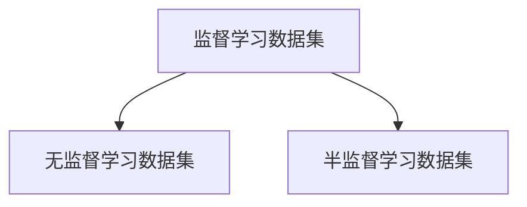

**核心算法原理讲解**

AI数据集的重要性体现在以下几个方面：

1. **提升模型性能**：高质量的数据集可以帮助模型学习到更多的特征和模式，从而提高模型的性能。
2. **增强泛化能力**：通过多样化的数据集，模型可以更好地适应不同场景，提高泛化能力。
3. **降低过拟合风险**：过拟合是指模型在训练数据上表现很好，但在新数据上表现较差。高质量的数据集可以减少过拟合的风险。

**伪代码**

```python
# 无需伪代码，概述性内容
```

##### 1.2 数据集的分类

数据集的分类是理解不同类型数据集特性和应用的关键。以下是对几种常见数据集类型的简要介绍：

1. **文本数据集**：包含文本数据，如句子、段落或文档。常用于自然语言处理（NLP）任务。
2. **图像数据集**：包含图像数据，如像素值。常用于计算机视觉任务。
3. **音频数据集**：包含音频数据，如波形图。常用于音频识别和语音识别任务。
4. **时序数据集**：包含时间序列数据，如股票价格、气温等。常用于时间序列分析任务。
5. **多模态数据集**：包含多种类型的数据，如文本、图像和音频。常用于多模态学习任务。

**Mermaid流程图**

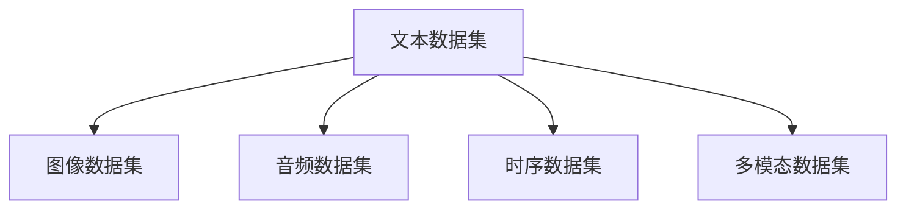

**核心算法原理讲解**

每种数据集类型都有其特定的特点和挑战：

1. **文本数据集**：文本数据集需要处理词向量、句法结构、语义理解等复杂问题。
2. **图像数据集**：图像数据集需要处理图像分割、目标检测、图像识别等问题。
3. **音频数据集**：音频数据集需要处理音频信号处理、特征提取、语音识别等问题。
4. **时序数据集**：时序数据集需要处理时间序列建模、异常检测等问题。
5. **多模态数据集**：多模态数据集需要处理数据融合、特征提取等问题。

**伪代码**

```python
# 无需伪代码，概述性内容
```

##### 1.3 数据集的来源与收集

数据集的来源和收集是AI研究中的关键步骤。以下是一些常见的数据集来源和收集方法：

1. **公开数据集**：如ImageNet、CIFAR-10等，由研究者或组织公开提供。
2. **私有数据集**：由公司、机构或个人拥有，通常用于内部研究或商业目的。
3. **合成数据集**：通过算法生成，以增加数据集的多样性和质量。
4. **数据爬取**：从互联网上爬取数据，但需要注意版权和数据隐私问题。

**Mermaid流程图**

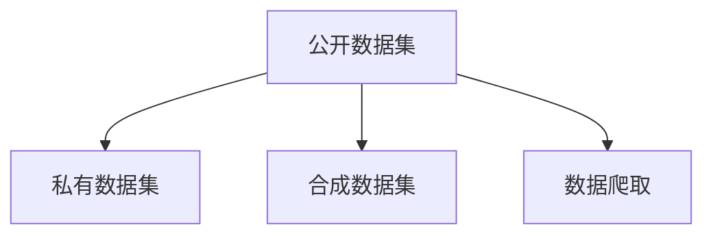

**核心算法原理讲解**

数据集来源的选择需要考虑以下几个因素：

1. **数据质量**：公开数据集通常经过筛选和验证，质量较高，但可能不够多样化。
2. **数据规模**：私有数据集可能规模较大，但获取较难。
3. **数据隐私**：数据爬取需要考虑数据隐私和法律问题。

**伪代码**

```python
# 无需伪代码，概述性内容
```

---

### 第2章：数据加载

##### 2.1 加载数据的挑战

在AI项目中，数据加载是数据处理的第一步，也是一个关键且具有挑战性的步骤。加载数据可能面临以下挑战：

1. **数据格式**：数据可能来自不同的来源，具有不同的格式，如CSV、JSON、XML等。
2. **数据缺失**：数据集中可能存在缺失值，需要处理。
3. **数据规模**：大型数据集加载和存储可能需要高性能的硬件和软件支持。
4. **数据一致性**：不同来源的数据可能存在格式不统一、单位不一致等问题。

**核心概念与联系**

数据加载的挑战可以分为以下几个方面：

1. **数据格式处理**：需要根据数据格式选择合适的方法进行加载和处理。
2. **数据缺失处理**：需要选择合适的方法填补或删除缺失值。
3. **数据规模管理**：需要考虑数据存储和计算资源，优化加载策略。

**Mermaid流程图**

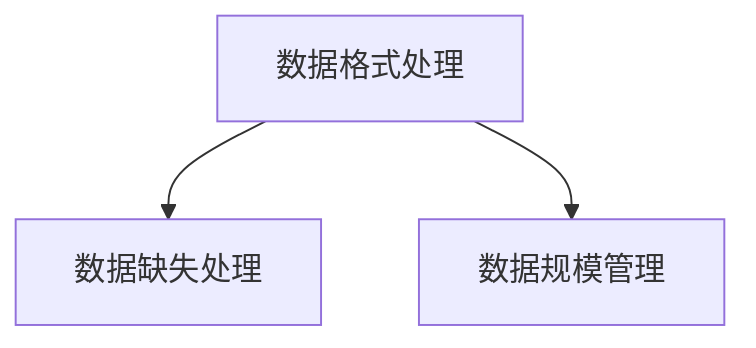

**核心算法原理讲解**

解决数据加载挑战的方法包括：

1. **选择合适的数据加载工具**：如Pandas、NumPy等，这些工具可以方便地处理不同格式的数据。
2. **使用批处理加载**：对于大型数据集，采用批处理方式可以减少内存消耗，提高加载效率。
3. **数据一致性检查**：在加载过程中进行数据一致性检查，确保数据格式和单位统一。

**伪代码**

```python
# 无需伪代码，概述性内容
```

##### 2.2 数据加载工具与技术

数据加载工具和技术是数据处理的关键，以下是一些常用的工具和技术：

1. **Pandas库**：Python中的数据操作库，可以方便地读取和操作不同格式的数据。
2. **NumPy库**：Python中的数值计算库，适合处理大型数据集。
3. **Scikit-learn库**：Python中的机器学习库，提供了多种数据加载和预处理功能。
4. **数据库技术**：如MySQL、PostgreSQL等，适用于存储和管理大规模数据。

**Mermaid流程图**

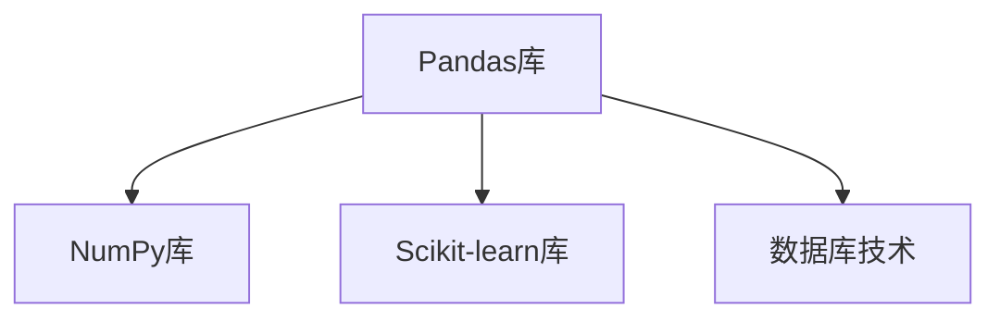

**核心算法原理讲解**

选择合适的数据加载工具和技术需要考虑以下几个因素：

1. **数据规模和格式**：对于大型数据集，需要选择能够高效处理的数据加载工具。
2. **数据处理需求**：根据数据处理需求，选择具有相应功能的工具。
3. **集成和兼容性**：工具需要与现有的系统和其他工具兼容。

**伪代码**

```python
# 无需伪代码，概述性内容
```

##### 2.3 数据格式与存储

数据格式和存储是数据加载的关键环节，以下是一些常见的数据格式和存储方案：

1. **CSV格式**：文本文件，适合存储结构化数据。
2. **JSON格式**：文本文件，适合存储嵌套和复杂的数据结构。
3. **XML格式**：文本文件，适合存储具有层次结构的数据。
4. **数据库存储**：如MySQL、PostgreSQL等，适用于存储大规模和复杂的数据。

**Mermaid流程图**

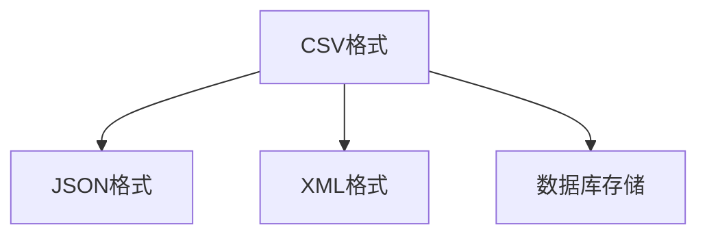

**核心算法原理讲解**

数据格式和存储方案的选择需要考虑以下几个因素：

1. **数据类型和结构**：根据数据类型和结构选择合适的数据格式。
2. **性能需求**：对于需要频繁访问和操作的数据，选择性能较高的存储方案。
3. **扩展性和兼容性**：选择易于扩展和与其他系统兼容的存储方案。

**伪代码**

```python
# 无需伪代码，概述性内容
```

---

### 第3章：数据预处理

##### 3.1 数据清洗

数据清洗是数据预处理的重要环节，旨在去除数据中的噪声和不准确信息，提高数据质量。以下是一些常见的数据清洗方法：

1. **去除重复数据**：识别并删除重复的记录，避免对模型训练造成干扰。
2. **处理缺失值**：填补或删除缺失值，确保数据集的完整性。
3. **纠正错误数据**：识别并修正错误数据，提高数据的准确性。

**核心概念与联系**

数据清洗的方法可以分为以下几类：

1. **自动清洗**：使用编程脚本自动识别和删除重复数据和缺失值。
2. **半自动清洗**：结合手动和自动清洗方法，通过人工介入纠正错误数据。
3. **手动清洗**：完全依靠人工检查和纠正数据中的问题。

**Mermaid流程图**

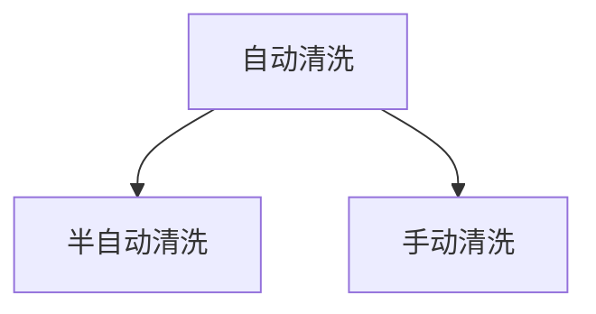

**核心算法原理讲解**

数据清洗的关键技术包括：

1. **重复数据检测**：使用哈希表或索引结构快速识别重复数据。
2. **缺失值填补**：使用均值、中位数或插值方法填补缺失值。
3. **错误数据校正**：通过对比参考数据或使用统计方法识别并修正错误数据。

**伪代码**

```python
def clean_data(data):
    # 去除重复数据
    unique_data = remove_duplicates(data)
    # 处理缺失值
    data_with_filled_values = fill_missing_values(unique_data)
    # 纠正错误数据
    corrected_data = correct_errors(data_with_filled_values)
    return corrected_data
```

##### 3.2 数据转换

数据转换是将数据从一种格式或类型转换为另一种格式或类型的过程，旨在提高数据的质量和可操作性。以下是一些常见的数据转换方法：

1. **数据类型转换**：将字符串转换为数值类型，如将字符串数字转换为整数或浮点数。
2. **数据尺度转换**：将数据缩放到一个标准尺度，如使用归一化或标准化方法。
3. **数据格式转换**：将数据从一种格式转换为另一种格式，如将CSV转换为JSON。

**核心概念与联系**

数据转换的方法可以分为以下几类：

1. **数值型数据转换**：将文本数据转换为数值数据。
2. **尺度转换**：将数据缩放到一个统一的尺度，便于模型训练。
3. **格式转换**：将数据从一种文件格式转换为另一种文件格式。

**Mermaid流程图**

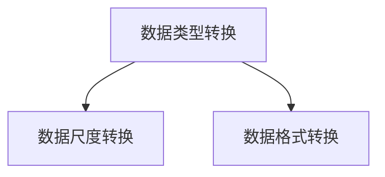

**核心算法原理讲解**

数据转换的关键技术包括：

1. **数值型数据转换**：使用Python的`astype()`方法或`astype()`函数进行数据类型转换。
2. **尺度转换**：使用最小-最大缩放法、标准化方法或归一化方法进行数据尺度转换。
3. **格式转换**：使用Python的`csv`模块、`json`模块或第三方库（如`pandas`）进行数据格式转换。

**伪代码**

```python
def convert_data(data):
    # 数据类型转换
    converted_data = convert_data_type(data)
    # 数据尺度转换
    scaled_data = scale_data(converted_data)
    return scaled_data
```

##### 3.3 数据归一化与标准化

数据归一化与标准化是数据预处理的重要步骤，旨在将数据缩放到一个统一的尺度，从而提高模型的训练效率和性能。以下是一些常见的数据归一化和标准化方法：

1. **归一化**：将数据缩放到[0, 1]的范围内，常用于处理数值型数据。
2. **标准化**：将数据缩放到均值±标准差的范围内，也称为Z-score标准化。
3. **最小-最大缩放**：将数据缩放到最小值和最大值之间。

**核心概念与联系**

数据归一化和标准化的方法可以分为以下几类：

1. **归一化**：适用于数值型数据，特别是0-1范围内的数据。
2. **标准化**：适用于任何类型的数值数据。
3. **最小-最大缩放**：适用于处理极值敏感的数据。

**Mermaid流程图**

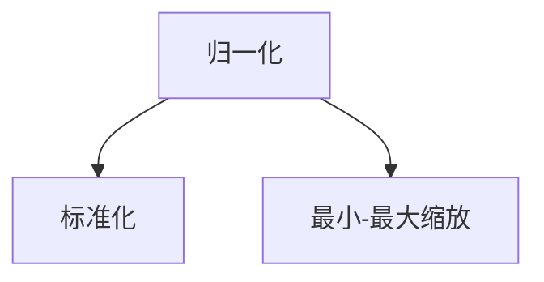

**核心算法原理讲解**

数据归一化和标准化的关键技术包括：

1. **归一化**：使用公式 \( x' = \frac{x - \min(x)}{\max(x) - \min(x)} \) 进行归一化。
2. **标准化**：使用公式 \( x' = \frac{x - \mu}{\sigma} \) 进行标准化，其中 \(\mu\) 是均值，\(\sigma\) 是标准差。
3. **最小-最大缩放**：使用公式 \( x' = \frac{x - \min(x)}{\max(x) - \min(x)} \) 进行最小-最大缩放。

**伪代码**

```python
def normalize_data(data):
    # 归一化
    normalized_data = normalize(data)
    # 标准化
    standardized_data = standardize(normalized_data)
    # 标准差缩放
    scaled_data = standard_deviation_scaling(standardized_data)
    return scaled_data
```

##### 3.4 特征工程

特征工程是数据预处理的关键步骤，旨在从原始数据中提取出对模型训练有帮助的特征。以下是一些常见的特征工程方法：

1. **特征选择**：选择对模型训练有显著影响的重要特征。
2. **特征构造**：通过组合原始特征或生成新的特征来提高模型性能。
3. **特征降维**：将高维特征转换为低维特征，减少计算复杂度。

**核心概念与联系**

特征工程的方法可以分为以下几类：

1. **特征选择**：基于统计学方法、机器学习方法或业务知识选择特征。
2. **特征构造**：通过变换、组合或生成新特征来增强模型性能。
3. **特征降维**：使用PCA、LDA等方法减少特征维度。

**Mermaid流程图**

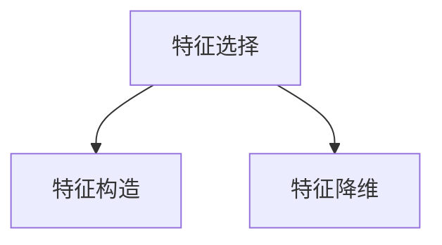

**核心算法原理讲解**

特征工程的关键技术包括：

1. **特征选择**：使用F-tests、卡方检验、相关系数等方法选择重要特征。
2. **特征构造**：通过主成分分析（PCA）、线性判别分析（LDA）、特征融合等方法构造新特征。
3. **特征降维**：使用PCA、LDA、t-SNE等方法减少特征维度。

**伪代码**

```python
def feature_engineering(data):
    # 特征选择
    selected_features = select_features(data)
    # 特征构造
    constructed_features = construct_features(selected_features)
    return constructed_features
```

---

### 第二部分：数据增强与合成

#### 第4章：数据增强

##### 4.1 数据增强的重要性

数据增强是提升模型性能的重要技术，通过增加数据集的多样性和质量，可以提高模型的泛化能力和鲁棒性。数据增强在以下方面具有重要意义：

1. **提高模型性能**：通过增加数据集的多样性，模型可以学习到更多的特征和模式，从而提高性能。
2. **减少过拟合**：过拟合是指模型在训练数据上表现良好，但在测试数据上表现较差。数据增强可以减少模型对训练数据的依赖，降低过拟合的风险。
3. **提高鲁棒性**：通过增加数据的噪声和异常值，模型可以更好地适应不同的数据分布，提高鲁棒性。

**核心概念与联系**

数据增强的方法可以分为以下几类：

1. **图像增强**：通过旋转、缩放、裁剪、添加噪声等方法增强图像数据。
2. **文本增强**：通过同义词替换、句子重排、文本扩充等方法增强文本数据。
3. **音频增强**：通过混响、回声、速度变化等方法增强音频数据。

**Mermaid流程图**

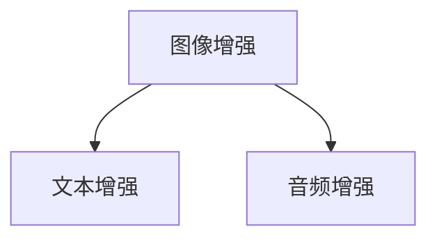

**核心算法原理讲解**

数据增强的方法包括：

1. **图像增强**：使用图像处理库（如OpenCV、TensorFlow）实现旋转、缩放、裁剪、添加噪声等功能。
2. **文本增强**：使用自然语言处理库（如NLTK、spaCy）实现同义词替换、句子重排、文本扩充等功能。
3. **音频增强**：使用音频处理库（如Librosa、Pydub）实现混响、回声、速度变化等功能。

**伪代码**

```python
def augment_data(image):
    # 图像增强
    image = rotate(image)
    image = scale(image)
    image = crop(image)
    image = add_noise(image)
    return image

def augment_text(text):
    # 文本增强
    text = replace_synonyms(text)
    text = rephrase_sentences(text)
    text = expand_text(text)
    return text

def augment_audio(audio):
    # 音频增强
    audio = add_reverb(audio)
    audio = add_echo(audio)
    audio = change_speed(audio)
    return audio
```

##### 4.2 数据增强方法

数据增强方法是通过一系列变换和操作增加数据集的多样性和质量。以下是一些常见的数据增强方法：

1. **旋转**：将数据集的每个样本旋转一定的角度，增加数据的旋转多样性。
2. **缩放**：将数据集的每个样本按一定的比例缩放，增加数据的尺度多样性。
3. **裁剪**：从数据集的每个样本中随机裁剪出一个小块，增加数据的局部多样性。
4. **添加噪声**：向数据集的每个样本中添加噪声，增加数据的鲁棒性。

**核心概念与联系**

数据增强方法可以分为以下几类：

1. **几何变换**：包括旋转、缩放、裁剪等，用于处理图像和音频数据。
2. **噪声添加**：用于增加数据的噪声和异常值，提高模型的鲁棒性。
3. **文本处理**：包括同义词替换、句子重排、文本扩充等，用于处理文本数据。

**Mermaid流程图**

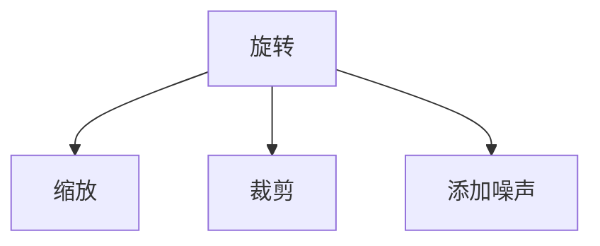

**核心算法原理讲解**

数据增强方法的算法原理包括：

1. **旋转**：使用图像处理库（如OpenCV）中的`rotate()`函数实现。
2. **缩放**：使用图像处理库（如OpenCV）中的`scale()`函数实现。
3. **裁剪**：使用图像处理库（如OpenCV）中的`crop()`函数实现。
4. **添加噪声**：使用图像处理库（如OpenCV）中的`add_noise()`函数实现。

**伪代码**

```python
import cv2

def rotate(image, angle):
    return cv2.rotate(image, angle)

def scale(image, scale_factor):
    return cv2.resize(image, None, fx=scale_factor, fy=scale_factor)

def crop(image, top, left, height, width):
    return image[top:top+height, left:left+width]

def add_noise(image, noise_type, noise_level):
    if noise_type == 'gaussian':
        return cv2.addNoised(image, cv2.getGaussianKernel(ksize=(noise_level, noise_level), sigma=0))
    elif noise_type == 'salt_pepper':
        return cv2.addNoised(image, cv2.getSaltPepperNoise(image, alpha=0.05))
```

##### 4.3 实践示例

数据增强在实践中可以通过实现具体的增强方法来增加数据集的多样性和质量。以下是一个图像数据集增强的实践示例：

1. **加载图像数据集**：使用OpenCV或Pandas库加载图像数据集。
2. **增强图像数据**：对每个图像样本进行旋转、缩放、裁剪和添加噪声等操作。
3. **保存增强后的图像**：将增强后的图像保存到新的文件中，形成增强后的数据集。

**核心概念与联系**

实践示例分为以下几个步骤：

1. **数据加载**：从文件中加载图像数据集。
2. **图像增强**：对每个图像样本进行增强操作。
3. **数据存储**：将增强后的图像保存到新的文件中。

**Mermaid流程图**

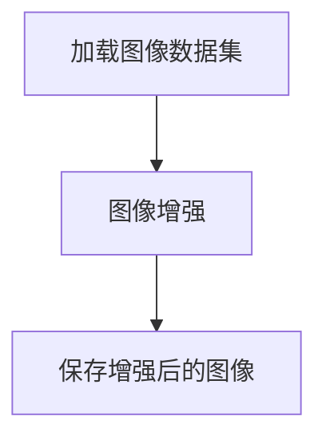

**核心算法原理讲解**

实现图像数据集增强的伪代码如下：

```python
import cv2
import os

def augment_images(dataset_path, output_path):
    # 加载图像数据集
    images = load_images(dataset_path)
    # 增强图像数据
    augmented_images = []
    for image in images:
        image = rotate(image, angle=45)
        image = scale(image, scale_factor=0.5)
        image = crop(image, top=100, left=100, height=200, width=200)
        image = add_noise(image, noise_type='gaussian', noise_level=10)
        augmented_images.append(image)
    # 保存增强后的图像
    save_images(augmented_images, output_path)

def load_images(dataset_path):
    # 加载图像数据集
    images = []
    for file in os.listdir(dataset_path):
        if file.endswith('.jpg'):
            image = cv2.imread(os.path.join(dataset_path, file))
            images.append(image)
    return images

def save_images(images, output_path):
    # 保存图像数据集
    for i, image in enumerate(images):
        cv2.imwrite(os.path.join(output_path, f'image_{i}.jpg'), image)
```

---

#### 第5章：数据合成

##### 5.1 数据合成的原理

数据合成是通过算法生成新的数据样本，以增加数据集的多样性和质量。数据合成的原理包括以下方面：

1. **生成模型**：使用生成模型（如生成对抗网络GAN、变分自编码器VAE）生成新的数据样本。
2. **数据融合**：将来自不同数据集的样本进行融合，生成新的数据样本。
3. **数据扩展**：通过对原始数据进行扩展或变换，生成新的数据样本。

**核心概念与联系**

数据合成的原理可以分为以下几个步骤：

1. **选择生成模型**：根据数据集的特点选择合适的生成模型。
2. **训练生成模型**：使用现有的数据集训练生成模型。
3. **生成新数据**：使用训练好的生成模型生成新的数据样本。
4. **数据融合**：将生成的数据样本与原始数据集进行融合。

**Mermaid流程图**

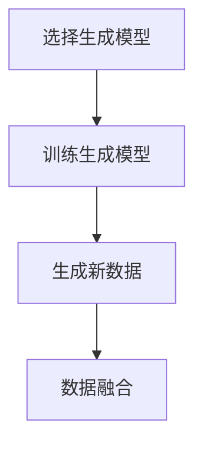

**核心算法原理讲解**

数据合成的方法包括：

1. **生成对抗网络GAN**：GAN由生成器G和判别器D组成，生成器G生成新数据，判别器D判断新数据的真实性。通过对抗训练，生成器逐渐生成更真实的数据。
2. **变分自编码器VAE**：VAE通过编码器E和解码器D生成新数据，编码器E将输入数据编码为潜在空间中的向量，解码器D将向量解码为输出数据。

**数学模型和数学公式**

GAN：
\[ G(z) \rightarrow X, D(x), D(G(z)) \]

VAE：
\[ q_{\phi}(z|x), p_{\theta}(x|z) \]

**伪代码**

GAN伪代码：

```python
import tensorflow as tf

def GAN_generator(z):
    # 生成器生成新数据
    x = G(z)
    return x

def GAN_discriminator(x):
    # 判别器判断新数据真伪
    valid = D(x)
    return valid

def GAN_train(data, epochs):
    # GAN训练
    for epoch in range(epochs):
        # 训练生成器和判别器
        G_loss, D_loss = train_GAN(G, D, data, epoch)
        print(f'Epoch {epoch}: G_loss = {G_loss}, D_loss = {D_loss}')

def train_GAN(G, D, data, epoch):
    # 训练GAN
    # ... GAN训练过程 ...
    return G_loss, D_loss
```

VAE伪代码：

```python
import tensorflow as tf

def VAE_encoder(x):
    # 编码器编码数据
    z, log_p_z = encode(x)
    return z, log_p_z

def VAE_decoder(z):
    # 解码器解码数据
    x = decode(z)
    return x

def VAE_train(data, epochs):
    # VAE训练
    for epoch in range(epochs):
        # 训练编码器和解码器
        E_loss, D_loss = train_VAE(E, D, data, epoch)
        print(f'Epoch {epoch}: E_loss = {E_loss}, D_loss = {D_loss}')

def train_VAE(E, D, data, epoch):
    # 训练VAE
    # ... VAE训练过程 ...
    return E_loss, D_loss
```

##### 5.2 数据合成的算法

数据合成的算法包括生成对抗网络（GAN）和变分自编码器（VAE）等，以下分别介绍这两种算法的基本原理和实现方法。

**生成对抗网络GAN**

生成对抗网络（GAN）由生成器（Generator）和判别器（Discriminator）组成，生成器G生成新数据，判别器D判断新数据的真实性。GAN的训练过程是生成器和判别器的对抗过程，生成器试图生成更真实的数据，而判别器试图区分真实数据和生成数据。

**核心算法原理讲解**

GAN的数学模型和训练过程如下：

GAN数学模型：

\[ G(z) \rightarrow X, D(x), D(G(z)) \]

- \( G(z) \)：生成器，将随机噪声 \( z \) 生成数据 \( x \)。
- \( D(x) \)：判别器，判断输入数据 \( x \) 是否真实。
- \( D(G(z)) \)：判别器，判断生成器生成的数据 \( x \) 是否真实。

GAN训练过程：

1. **生成器训练**：生成器根据噪声 \( z \) 生成数据 \( x \)，判别器判断数据 \( x \) 的真实性，生成器通过反向传播更新权重。
2. **判别器训练**：判别器根据真实数据和生成数据 \( x \) 更新权重，生成器通过反向传播更新权重。

GAN伪代码：

```python
import tensorflow as tf

def GAN_generator(z):
    # 生成器生成新数据
    x = G(z)
    return x

def GAN_discriminator(x):
    # 判别器判断新数据真伪
    valid = D(x)
    return valid

def GAN_train(data, epochs):
    # GAN训练
    for epoch in range(epochs):
        # 训练生成器和判别器
        G_loss, D_loss = train_GAN(G, D, data, epoch)
        print(f'Epoch {epoch}: G_loss = {G_loss}, D_loss = {D_loss}')

def train_GAN(G, D, data, epoch):
    # 训练GAN
    # ... GAN训练过程 ...
    return G_loss, D_loss
```

**变分自编码器VAE**

变分自编码器（VAE）是一种无监督学习模型，通过编码器（Encoder）和解码器（Decoder）生成新数据。VAE的核心思想是学习数据的一个潜在空间，编码器将输入数据编码为潜在空间中的向量，解码器将向量解码为输出数据。

**核心算法原理讲解**

VAE的数学模型和训练过程如下：

VAE数学模型：

\[ q_{\phi}(z|x), p_{\theta}(x|z) \]

- \( q_{\phi}(z|x) \)：编码器，将输入数据 \( x \) 编码为潜在空间中的向量 \( z \)。
- \( p_{\theta}(x|z) \)：解码器，将潜在空间中的向量 \( z \) 解码为输出数据 \( x \)。

VAE训练过程：

1. **编码器训练**：编码器根据输入数据 \( x \) 生成潜在空间中的向量 \( z \)，解码器根据向量 \( z \) 解码为输出数据 \( x \)，计算损失函数并更新编码器和解码器的权重。
2. **重参数化**：VAE使用重参数化技巧，将潜在空间中的向量 \( z \) 转换为连续的概率分布，使得生成数据的过程更加灵活。

VAE伪代码：

```python
import tensorflow as tf

def VAE_encoder(x):
    # 编码器编码数据
    z, log_p_z = encode(x)
    return z, log_p_z

def VAE_decoder(z):
    # 解码器解码数据
    x = decode(z)
    return x

def VAE_train(data, epochs):
    # VAE训练
    for epoch in range(epochs):
        # 训练编码器和解码器
        E_loss, D_loss = train_VAE(E, D, data, epoch)
        print(f'Epoch {epoch}: E_loss = {E_loss}, D_loss = {D_loss}')

def train_VAE(E, D, data, epoch):
    # 训练VAE
    # ... VAE训练过程 ...
    return E_loss, D_loss
```

##### 5.3 实践案例

数据合成在实践中可以通过实现具体的生成模型来生成新的数据样本。以下是一个文本数据集合成的实践案例：

1. **数据准备**：加载原始文本数据集，进行预处理。
2. **模型训练**：使用生成对抗网络GAN或变分自编码器VAE训练生成模型。
3. **数据生成**：使用训练好的生成模型生成新的文本数据样本。
4. **数据存储**：将生成的新文本数据样本存储为新的数据集。

**核心概念与联系**

实践案例分为以下几个步骤：

1. **数据准备**：从文件中加载文本数据集，进行预处理。
2. **模型训练**：训练生成模型，生成新文本数据。
3. **数据存储**：将生成的新文本数据存储到文件中。

**Mermaid流程图**

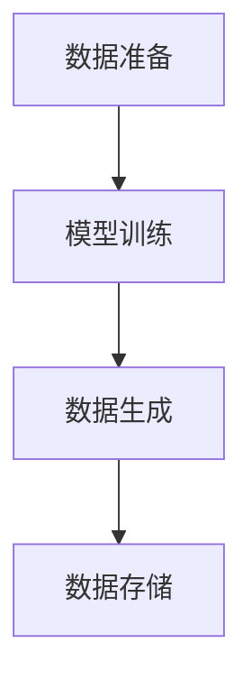

**核心算法原理讲解**

实现文本数据集合成的伪代码如下：

```python
import tensorflow as tf
import numpy as np
import random

# 加载和处理文本数据
def load_text_data(file_path):
    # 从文件中加载文本数据
    with open(file_path, 'r', encoding='utf-8') as f:
        text = f.read()
    # 进行预处理，如分词、去停用词等
    # ...
    return text

# 训练生成模型
def train_generator(generator, discriminator, data, epochs):
    for epoch in range(epochs):
        # 随机选择数据样本
        batch_size = 64
        for i in range(0, len(data) - batch_size + 1, batch_size):
            batch = data[i:i+batch_size]
            # 训练判别器
            d_loss = train_discriminator(discriminator, batch)
            # 训练生成器
            g_loss = train_generator(generator, discriminator, batch)
            print(f'Epoch {epoch}: G_loss = {g_loss}, D_loss = {d_loss}')

# 生成新文本数据
def generate_text(generator, data, num_samples):
    # 生成num_samples个文本数据样本
    samples = []
    for _ in range(num_samples):
        # 生成一个文本数据样本
        sample = generator.sample()
        samples.append(sample)
    return samples

# 保存新文本数据
def save_text_data(samples, file_path):
    # 将新文本数据保存到文件
    with open(file_path, 'w', encoding='utf-8') as f:
        for sample in samples:
            f.write(sample + '\n')
```

---

### 第三部分：数据质量管理

#### 第6章：数据质量评估

##### 6.1 数据质量指标

数据质量评估是确保数据集质量的重要步骤，通过一系列质量指标来衡量数据集的质量。以下是一些常见的数据质量指标：

1. **准确性**：数据集中的正确数据比例。
2. **完整性**：数据集中缺失数据的比例。
3. **一致性**：数据集中不同来源的数据是否一致。
4. **时效性**：数据是否反映了最新的信息。

**核心概念与联系**

数据质量指标可以分为以下几个类别：

1. **准确性**：衡量数据集的真实性。
2. **完整性**：衡量数据集的完整性。
3. **一致性**：衡量数据集的统一性。
4. **时效性**：衡量数据的时效性。

**Mermaid流程图**

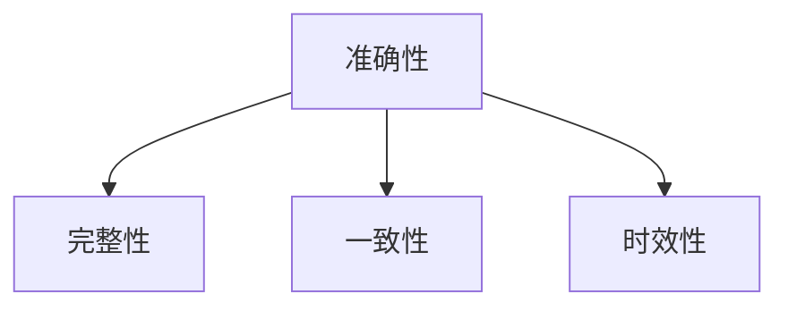

**核心算法原理讲解**

数据质量指标的计算方法如下：

1. **准确性**：使用准确率、召回率、F1分数等指标计算。
2. **完整性**：计算缺失数据的比例。
3. **一致性**：比较不同来源的数据是否一致。
4. **时效性**：根据数据更新时间衡量数据的时效性。

**伪代码**

```python
def calculate_accuracy(data):
    # 计算准确性
    correct = 0
    total = len(data)
    for sample in data:
        if is_correct(sample):
            correct += 1
    return correct / total

def calculate_completeness(data):
    # 计算完整性
    missing = 0
    for sample in data:
        if is_missing(sample):
            missing += 1
    return missing / len(data)

def calculate_consistency(data):
    # 计算一致性
    inconsistent = 0
    for i in range(len(data) - 1):
        if data[i] != data[i + 1]:
            inconsistent += 1
    return inconsistent / (len(data) - 1)

def calculate_timeliness(data, reference_time):
    # 计算时效性
    outdated = 0
    for sample in data:
        if sample['timestamp'] < reference_time:
            outdated += 1
    return outdated / len(data)
```

##### 6.2 数据质量评估方法

数据质量评估方法是衡量数据质量的重要手段，可以通过统计分析和机器学习评估方法来评估数据质量。以下是一些常见的数据质量评估方法：

1. **统计分析方法**：通过计算数据集的平均值、中位数、标准差等统计指标来评估数据质量。
2. **机器学习评估方法**：使用机器学习模型评估数据集的质量，如分类模型、回归模型等。

**核心概念与联系**

数据质量评估方法可以分为以下几个步骤：

1. **统计分析方法**：计算数据集的统计指标。
2. **机器学习评估方法**：使用机器学习模型评估数据集的质量。

**Mermaid流程图**

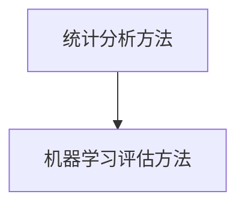

**核心算法原理讲解**

数据质量评估方法包括：

1. **统计分析方法**：使用Python的Pandas库、NumPy库等计算统计指标。
2. **机器学习评估方法**：使用Scikit-learn库构建分类或回归模型，评估数据集的质量。

**伪代码**

统计分析方法：

```python
import pandas as pd

def evaluate_data_quality_with_stats(data):
    # 计算统计指标
    mean = data.mean()
    median = data.median()
    std = data.std()
    return mean, median, std
```

机器学习评估方法：

```python
from sklearn.ensemble import RandomForestClassifier
from sklearn.metrics import accuracy_score

def evaluate_data_quality_with_ml(data, labels):
    # 构建分类模型
    model = RandomForestClassifier()
    # 训练模型
    model.fit(data, labels)
    # 预测
    predictions = model.predict(data)
    # 计算准确率
    accuracy = accuracy_score(labels, predictions)
    return accuracy
```

##### 6.3 数据质量监控

数据质量监控是确保数据集质量持续符合要求的重要步骤，可以通过实时监控和定期评估来监控数据质量。以下是一些常见的数据质量监控方法：

1. **实时监控**：通过监控系统实时检测数据质量的变化。
2. **定期评估**：定期对数据集进行质量评估，确保数据集的质量稳定。

**核心概念与联系**

数据质量监控方法可以分为以下几个步骤：

1. **实时监控**：使用监控工具实时检测数据质量。
2. **定期评估**：定期评估数据质量，发现潜在问题。

**Mermaid流程图**

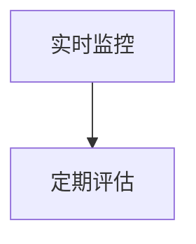

**核心算法原理讲解**

数据质量监控方法包括：

1. **实时监控**：使用Python的`time.sleep()`函数定期执行质量评估函数。
2. **定期评估**：使用Python的`schedule`库定期执行质量评估。

**伪代码**

实时监控：

```python
import time

def monitor_data_quality(data, interval):
    while True:
        quality_scores = evaluate_data_quality(data)
        print(quality_scores)
        time.sleep(interval)
```

定期评估：

```python
import schedule
import time

def evaluate_data_quality(data):
    # 执行质量评估
    # ...
    return quality_scores

def monitor_data_quality_periodically():
    schedule.every(24).hours.do(evaluate_data_quality, data)

while True:
    schedule.run_pending()
    time.sleep(1)
```

---

### 第7章：数据清洗与修复

##### 7.1 数据清洗策略

数据清洗策略是处理数据集中噪声和异常数据的重要步骤，可以通过自动清洗、半自动清洗和手动清洗等方法实现。以下是一些常见的数据清洗策略：

1. **自动清洗**：使用编程脚本自动识别和删除重复数据和缺失值。
2. **半自动清洗**：结合手动和自动清洗方法，通过人工介入纠正错误数据。
3. **手动清洗**：完全依靠人工检查和纠正数据中的问题。

**核心概念与联系**

数据清洗策略可以分为以下几个步骤：

1. **自动清洗**：使用编程脚本处理数据。
2. **半自动清洗**：人工审核和编程脚本相结合。
3. **手动清洗**：完全依靠人工处理数据。

**Mermaid流程图**


**核心算法原理讲解**

数据清洗策略包括：

1. **自动清洗**：使用Python的Pandas库、NumPy库等自动处理数据。
2. **半自动清洗**：结合人工审核和编程脚本。
3. **手动清洗**：人工检查和纠正数据中的问题。

**伪代码**

自动清洗：

```python
import pandas as pd

def clean_data(data):
    # 去除重复数据
    data = data.drop_duplicates()
    # 处理缺失值
    data = data.fillna(method='ffill')
    return data
```

半自动清洗：

```python
import pandas as pd

def clean_data_semi_auto(data):
    # 去除重复数据
    data = data.drop_duplicates()
    # 提交人工审核缺失值
    missing_values = data.isnull().sum()
    data = data.fillna(method='ffill')
    # 人工审核缺失值
    data = manual_check(data, missing_values)
    return data

def manual_check(data, missing_values):
    # 人工审核缺失值
    # ...
    return data
```

手动清洗：

```python
import pandas as pd

def clean_data_manual(data):
    # 人工检查和纠正数据
    data = manual_check_data(data)
    return data

def manual_check_data(data):
    # 人工检查和纠正数据
    # ...
    return data
```

##### 7.2 数据修复技术

数据修复技术是处理数据集中异常数据和缺失值的重要方法，可以通过插值、插补和聚类等技术实现。以下是一些常见的数据修复技术：

1. **插值**：通过插值方法填补缺失值，如线性插值、牛顿插值等。
2. **插补**：通过插补方法填补缺失值，如均值插补、中位数插补等。
3. **聚类**：通过聚类方法填补缺失值，如K-means聚类、层次聚类等。

**核心概念与联系**

数据修复技术可以分为以下几个步骤：

1. **插值**：使用插值方法计算缺失值。
2. **插补**：使用插补方法计算缺失值。
3. **聚类**：使用聚类方法计算缺失值。

**Mermaid流程图**

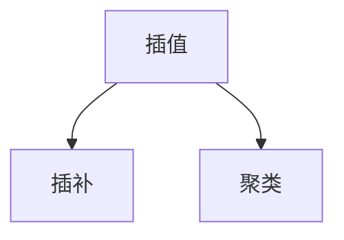

**核心算法原理讲解**

数据修复技术包括：

1. **插值**：使用Python的`scipy.interpolate`模块进行插值。
2. **插补**：使用Python的`scikit-learn`模块进行插补。
3. **聚类**：使用Python的`scikit-learn`模块进行聚类。

**伪代码**

插值：

```python
from scipy.interpolate import interp1d

def interpolate_missing_values(data):
    # 线性插值
    x = np.arange(len(data))
    y = data
    f = interp1d(x, y, kind='linear')
    # 计算缺失值的位置
    missing_indices = np.where(np.isnan(data))
    # 插值计算缺失值
    data[missing_indices] = f(missing_indices)
    return data
```

插补：

```python
from sklearn.impute import SimpleImputer

def impute_missing_values(data):
    # 均值插补
    imputer = SimpleImputer(strategy='mean')
    data = imputer.fit_transform(data)
    return data
```

聚类：

```python
from sklearn.cluster import KMeans

def cluster_missing_values(data):
    # K-means聚类
    kmeans = KMeans(n_clusters=3)
    kmeans.fit(data)
    # 计算缺失值的位置
    missing_indices = np.where(np.isnan(data))
    # 聚类计算缺失值
    labels = kmeans.predict(data[missing_indices])
    # 根据聚类结果填补缺失值
    data[missing_indices] = data[labels][0]
    return data
```

##### 7.3 实际案例分析

实际案例分析是通过具体案例展示数据清洗和修复的过程，以帮助读者更好地理解和应用数据清洗与修复技术。以下是一个实际案例的分析过程：

**案例背景**：一个电子商务公司需要对其销售数据集进行清洗和修复，以用于后续的数据分析。

**数据清洗与修复过程**：

1. **数据清洗**：去除重复数据、处理缺失值和错误数据。
2. **数据修复**：使用插值、插补和聚类方法填补缺失值。

**Mermaid流程图**

```mermaid
graph TD
A[数据清洗] --> B[数据修复]
```

**核心算法原理讲解**

数据清洗与修复的伪代码如下：

```python
import pandas as pd
from scipy.interpolate import interp1d
from sklearn.impute import SimpleImputer
from sklearn.cluster import KMeans

# 加载数据集
data = pd.read_csv('sales_data.csv')

# 数据清洗
# 去除重复数据
data = data.drop_duplicates()

# 处理缺失值和错误数据
# 缺失值插值
data['sales'] = interpolate_missing_values(data['sales'])
# 错误数据插补
imputer = SimpleImputer(strategy='mean')
data['sales'] = imputer.fit_transform(data['sales'])

# 数据修复
# 缺失值聚类
kmeans = KMeans(n_clusters=3)
kmeans.fit(data[['sales']])
labels = kmeans.predict(data[['sales']])
data['sales'] = data['sales'][labels][0]

# 保存清洗和修复后的数据集
data.to_csv('cleaned_sales_data.csv', index=False)
```

**项目小结**：通过实际案例的分析，展示了数据清洗和修复的过程，包括去除重复数据、处理缺失值和错误数据。使用插值、插补和聚类方法填补缺失值，提高了数据集的质量，为后续的数据分析奠定了基础。

**注意事项**：在实际应用中，应根据数据集的特点选择合适的数据清洗和修复方法，同时注意数据清洗和修复过程中的数据质量监控。

**拓展阅读**：可以参考相关文献和资源，如《数据科学入门：Python实践》、《机器学习实战》等，以了解更多数据清洗和修复的技术和方法。

---

### 第四部分：数据集合成与应用

#### 第8章：合成数据集的应用

##### 8.1 合成数据集在机器学习中的应用

合成数据集在机器学习中的应用具有重要意义，通过增加数据集的多样性和质量，可以显著提高模型训练的效果和泛化能力。以下是一些合成数据集在机器学习中的应用场景：

1. **模型训练**：使用合成数据集进行模型训练，增加数据集的多样性，提高模型的性能。
2. **模型评估**：通过合成具有挑战性的数据集，评估模型在不同数据分布和异常情况下的性能。
3. **过拟合避免**：合成更多的训练数据，减少模型对训练数据的依赖，降低过拟合的风险。

**核心概念与联系**

合成数据集在机器学习中的应用可以分为以下几个步骤：

1. **数据合成**：使用生成对抗网络（GAN）或变分自编码器（VAE）等算法生成合成数据。
2. **模型训练**：使用合成数据集对模型进行训练。
3. **模型评估**：使用合成数据集对模型进行评估。

**Mermaid流程图**

```mermaid
graph TD
A[数据合成] --> B[模型训练]
B --> C[模型评估]
```

**核心算法原理讲解**

合成数据集在机器学习中的应用包括：

1. **生成对抗网络GAN**：通过生成器G和判别器D的对抗训练，生成与真实数据相似的新数据。
2. **变分自编码器VAE**：通过编码器E和解码器D的学习，生成与输入数据相似的新数据。

**伪代码**

GAN应用：

```python
import tensorflow as tf

def GAN_train(data, epochs):
    for epoch in range(epochs):
        # 训练生成器和判别器
        G_loss, D_loss = train_GAN(G, D, data, epoch)
        print(f'Epoch {epoch}: G_loss = {G_loss}, D_loss = {D_loss}')

def train_GAN(G, D, data, epoch):
    # 训练GAN
    # ...
    return G_loss, D_loss
```

VAE应用：

```python
import tensorflow as tf

def VAE_train(data, epochs):
    for epoch in range(epochs):
        # 训练编码器和解码器
        E_loss, D_loss = train_VAE(E, D, data, epoch)
        print(f'Epoch {epoch}: E_loss = {E_loss}, D_loss = {D_loss}')

def train_VAE(E, D, data, epoch):
    # 训练VAE
    # ...
    return E_loss, D_loss
```

##### 8.2 合成数据集在深度学习中的应用

合成数据集在深度学习中的应用同样具有重要意义，通过增加数据集的多样性和质量，可以提高模型的泛化能力和鲁棒性。以下是一些合成数据集在深度学习中的应用场景：

1. **模型训练**：使用合成数据集进行模型训练，增加数据集的多样性，提高模型的性能。
2. **模型评估**

