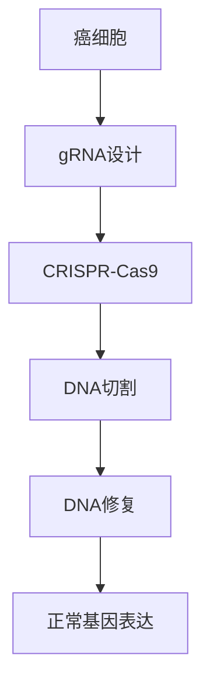
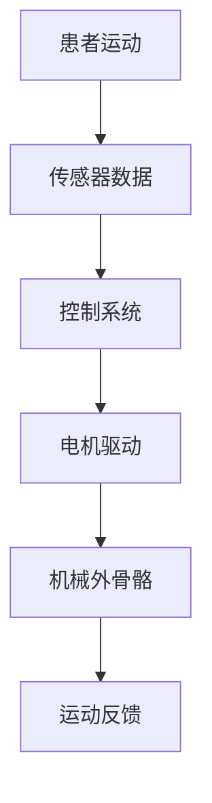
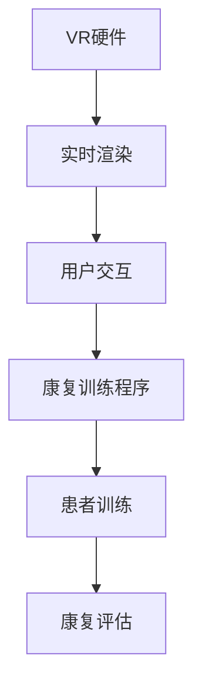

                 

### 文章标题

《AI时代的人类增强：道德考虑与身体增强技术的未来趋势预测》

### 关键词

- AI时代
- 人类增强技术
- 道德考虑
- 身体增强
- 未来趋势预测

### 摘要

本文探讨了AI时代背景下人类增强技术的兴起及其对人类社会的影响。首先，我们概述了AI时代的到来和人类增强技术的分类。随后，分析了道德考虑在人类增强技术发展中的重要性，探讨了相关道德原则与冲突。接着，详细介绍了生物学方法、机械方法和计算机方法在身体增强技术中的应用。最后，我们对未来人类增强技术的发展趋势进行了预测，并提出了相关的政策和法规建议。本文旨在为读者提供一个全面、深入的视角，以理解人类增强技术的现状与未来。

### 《AI时代的人类增强：道德考虑与身体增强技术的未来趋势预测》目录大纲

#### 第一部分：AI时代的人类增强概述

##### 第1章：AI时代的到来

- **1.1 AI技术发展历程**
- **1.2 AI对人类生活的深远影响**
- **1.3 人类增强的概念与意义**

##### 第2章：人类增强技术的分类

- **2.1 生物学方法**
- **2.2 机械方法**
- **2.3 计算机方法**

##### 第3章：人类增强技术的现状

- **3.1 当前人类增强技术的发展水平**
- **3.2 人类增强技术的应用领域**

#### 第二部分：道德考虑与人类增强技术

##### 第4章：道德考虑的重要性

- **4.1 道德标准与人类增强技术的关系**
- **4.2 道德问题的类型与挑战**

##### 第5章：道德原则与人类增强技术的冲突

- **5.1 平等与差异**
- **5.2 自由与控制**
- **5.3 公平与责任**

##### 第6章：道德框架下的政策与法规

- **6.1 国家层面的政策**
- **6.2 国际合作与法规制定**

#### 第三部分：身体增强技术的未来趋势

##### 第7章：生物学方法

- **7.1 基因编辑技术**
- **7.2 生物材料与组织工程**
- **7.3 神经科学进展**

##### 第8章：机械方法

- **8.1 仿生学**
- **8.2 机械外骨骼**
- **8.3 机器人辅助设备**

##### 第9章：计算机方法

- **9.1 虚拟现实与增强现实**
- **9.2 计算机视觉与图像处理**
- **9.3 人机交互技术**

#### 第四部分：未来趋势预测

##### 第10章：未来人类增强技术的预测

- **10.1 技术发展趋势**
- **10.2 未来社会影响**
- **10.3 未来政策与法规**

##### 第11章：总结与展望

- **11.1 人类增强技术的挑战与机遇**
- **11.2 未来研究方向**
- **11.3 社会责任**

#### 附录

- **附录A：案例研究**
- **附录B：参考资源**

### 第一部分：AI时代的人类增强概述

#### 第1章：AI时代的到来

##### 1.1 AI技术发展历程

人工智能（AI）技术的发展历程可以追溯到20世纪50年代，当时科学家们首次提出了“人工智能”的概念。此后，AI技术经历了多个发展阶段，从早期的符号推理、知识表示，到基于统计学的机器学习，再到深度学习和神经网络，每一次技术突破都极大地推动了AI技术的发展。

- **早期探索（1956-1974）**：1956年，达特茅斯会议标志着人工智能的正式诞生。在此期间，AI主要集中在规则推理和知识表示上，例如普瑞帕特里克的逻辑理论家和马文·明的通用问题求解器。
  
- **第一次AI寒冬（1974-1980）**：由于技术局限和资源不足，AI研究在1974年遭遇了第一次寒冬。此时，AI主要依赖于符号推理和知识表示，而缺乏有效的数据处理能力。

- **专家系统时代（1980-1987）**：随着计算机性能的提升和知识的积累，专家系统的兴起标志着AI的复苏。专家系统通过模拟人类专家的决策过程，解决了许多复杂问题。

- **第二次AI寒冬（1987-1993）**：尽管专家系统取得了一些成功，但它们的局限性和局限性使得AI再次陷入低谷。此时，AI研究转向了更为实际的问题，如自然语言处理和图像识别。

- **机器学习时代（1993-2012）**：1993年后，随着大数据和计算能力的提升，机器学习成为了AI研究的主流方向。这一时期，统计学习和深度学习技术取得了重大突破。

- **深度学习时代（2012至今）**：深度学习的崛起标志着AI进入了一个新的阶段。卷积神经网络（CNN）、循环神经网络（RNN）和生成对抗网络（GAN）等深度学习模型在图像识别、语音识别、自然语言处理等领域取得了显著成果。

##### 1.2 AI对人类生活的深远影响

AI技术的快速发展对人类社会产生了深远的影响，改变了我们的生活方式、工作方式甚至思维方式。以下是AI对人类生活的一些主要影响：

- **提高生产效率**：AI技术能够自动化许多重复性、繁琐的工作，提高生产效率和产品质量。例如，工业自动化、自动驾驶汽车和智能农业都极大地提高了生产效率。

- **改善医疗健康**：AI在医疗健康领域的应用正在迅速扩大。通过影像分析、基因组学、药物研发和个性化医疗，AI能够提高医疗诊断的准确性，降低医疗成本，并改善患者的生活质量。

- **教育个性化**：AI技术可以根据学生的兴趣和学习习惯提供个性化的教育方案，提高学习效果。智能辅导系统和在线教育平台正在改变传统的教育模式。

- **生活方式的改变**：智能家居、智能穿戴设备和智能健康监测设备等AI产品正在改变我们的生活方式。这些设备能够提供更加舒适、便捷的生活体验，同时帮助人们更好地管理健康。

- **社会结构和就业**：AI技术的广泛应用可能导致某些职业的消失，但同时也会创造新的就业机会。例如，数据科学家、AI工程师和机器学习研究员等新职业正在兴起。

##### 1.3 人类增强的概念与意义

人类增强（Human Enhancement）是指通过技术手段提升人类生理或心理能力的过程。人类增强技术可以分为生物学方法、机械方法和计算机方法三大类。这些技术旨在提升人类的身体能力、认知能力和社交能力，从而改善人类生活质量。

- **生物学方法**：包括基因编辑、生物材料和神经科学技术，如CRISPR-Cas9基因编辑工具和神经接口技术。

- **机械方法**：包括机械外骨骼、仿生学和机器人辅助设备，如用于康复训练的机械外骨骼和用于辅助作业的机器人。

- **计算机方法**：包括虚拟现实（VR）、增强现实（AR）、计算机视觉和人工智能交互技术，如VR游戏、AR导航和智能语音助手。

人类增强技术的意义在于：

- **提升身体能力**：通过生物技术和机械技术，人类能够克服生理上的限制，如改善视力和听力，增强肌肉力量和耐力。

- **增强认知能力**：通过神经科学和计算机技术，人类能够提高记忆、学习和解决问题的能力，甚至实现思维外化和虚拟化。

- **改善生活质量**：人类增强技术能够帮助人们更好地适应环境和应对挑战，从而提升整体生活质量。

- **促进社会进步**：人类增强技术有望推动社会结构和生活方式的变革，创造新的经济价值和就业机会，促进社会整体进步。

总之，AI时代的人类增强技术正在不断突破传统界限，为人类社会带来前所未有的机遇和挑战。理解和探讨这些技术及其道德和社会影响，对于构建一个可持续发展的未来具有重要意义。

#### 第2章：人类增强技术的分类

##### 2.1 生物学方法

生物学方法是人类增强技术的一个重要分支，主要通过基因编辑、生物材料和神经科学技术来提升人类的生理和心理能力。以下是一些代表性的技术及其工作原理：

- **基因编辑技术**：基因编辑技术如CRISPR-Cas9是目前最为先进的生物学方法之一。CRISPR-Cas9系统通过设计特定的引导RNA（gRNA）来定位并剪切目标DNA序列，从而实现基因的精准修改。这一技术能够治疗遗传疾病，如囊性纤维化和镰状细胞贫血症，同时也可以用于改善人类的生理特性，如增强肌肉力量和提升智力。

  ```plaintext
  // 伪代码：基因编辑算法
  function geneEditing(targetDNA, modification):
      CRISPRSystem = initializeCRISPR(targetDNA)
      gRNA = designGuideRNA(targetDNA, modification)
      CRISPRSystem.add(gRNA)
      editedDNA = CRISPRSystem.edit(targetDNA)
      if (verifyModification(editedDNA, modification)):
          return editedDNA
      else:
          return "Editing failed"
  ```

- **生物材料与组织工程**：生物材料如生物可降解聚合物和生物活性玻璃，可以用于修复和再生受损的组织。组织工程则利用这些材料，结合细胞和生长因子，构建功能性的人造组织和器官，如人造皮肤、骨骼和心脏。这些技术有望解决器官移植的难题，提供新的治疗手段。

- **神经科学进展**：神经科学技术的进展，如脑机接口（BCI）和电刺激技术，能够直接增强大脑功能。脑机接口通过读取大脑信号，将思维转化为控制信号，用于辅助肢体运动或控制外部设备。电刺激技术则通过电刺激大脑特定区域，改善记忆、注意力和运动功能。

  ```mermaid
  graph TD
      A[大脑信号]
      B[脑机接口]
      C[控制信号]
      D[外部设备]

      A --> B
      B --> C
      C --> D
      D --> A
  ```

##### 2.2 机械方法

机械方法通过设计和使用机械装置来增强人类的生理能力，这些装置通常具有高强度和高度灵活性，能够模拟或扩展人类器官的功能。以下是一些代表性的技术及其应用：

- **机械外骨骼**：机械外骨骼是机械方法中最具代表性的技术之一，主要用于增强人类的体力。这些外骨骼可以提升肌肉力量和耐力，帮助残疾人行走或提升重物的携带能力。例如，美国的“洛克利套装”（Lockheed Martin's Human Universal Load Carrier）是一种用于军事用途的全地形机械外骨骼，能够显著减轻士兵的负重。

  ```mermaid
  graph TD
      A[人类肌肉]
      B[机械外骨骼]
      C[外部设备]

      A --> B
      B --> C
      C --> A
  ```

- **仿生学**：仿生学通过模仿自然界中的生物结构和工作原理，设计出具有人类增强功能的人造装置。例如，仿生手臂和仿生腿能够帮助截肢者恢复部分功能。这些装置通过模仿人体肌肉和关节的运动，提供了高度自然的操作体验。

- **机器人辅助设备**：机器人辅助设备包括各种可以增强人类操作能力的装置，如机械臂和机器人手术系统。这些设备利用AI和机器人技术，实现了高精度的操作和远程控制，广泛应用于医疗、工业和航天等领域。

##### 2.3 计算机方法

计算机方法利用计算机技术和人工智能来增强人类的认知和社交能力，主要包括虚拟现实（VR）、增强现实（AR）、计算机视觉和人工智能交互技术。以下是一些代表性的技术及其应用：

- **虚拟现实与增强现实**：虚拟现实和增强现实技术通过模拟或增强现实世界的感知，提供了沉浸式的体验。虚拟现实技术可以用于游戏、教育、培训和模拟训练，而增强现实技术则可以用于导航、教育、医疗和工业。

  ```mermaid
  graph TD
      A[现实世界]
      B[增强现实设备]
      C[增强后的现实]

      A --> B
      B --> C
      C --> A
  ```

- **计算机视觉与图像处理**：计算机视觉技术通过算法分析图像和视频数据，实现物体识别、图像分割和场景理解等功能。这些技术在安防监控、自动驾驶、医疗诊断和工业检测中得到了广泛应用。

- **人工智能交互技术**：人工智能交互技术通过自然语言处理、语音识别和机器学习，实现了人与机器的自然交互。这些技术用于智能助手、智能家居和智能客服等领域，极大地提升了用户体验。

##### 综合比较

生物学方法、机械方法和计算机方法各有其独特的优势和局限性。生物学方法具有直接提升生理能力的效果，但技术复杂、风险高；机械方法提供了明显的物理增强，但可能影响人体生理平衡；计算机方法则通过虚拟和增强现实提供了认知和社交增强，但依赖计算机技术和算法。

在未来的发展中，这些方法可能会相互融合，实现更加全面和高效的人类增强。例如，结合基因编辑和计算机视觉技术，可以开发出能够实时分析基因表达和生理状态的个性化医疗设备。

总之，人类增强技术的分类多种多样，每种方法都有其独特的应用场景和技术特点。深入理解和探索这些技术，有助于推动人类增强技术的发展，并为人类社会带来更多的机遇和挑战。

#### 第3章：人类增强技术的现状

##### 3.1 当前人类增强技术的发展水平

随着科技的进步，人类增强技术已经取得了显著的进展，多种技术方案在医学、工业、军事等领域得到了广泛应用。以下是当前人类增强技术的主要进展和水平：

- **基因编辑技术**：基因编辑技术，如CRISPR-Cas9，已经在基因治疗领域取得了重要突破。研究人员利用CRISPR-Cas9对患者的DNA进行精准修改，治疗了多种遗传性疾病，如囊性纤维化和镰状细胞贫血症。此外，基因编辑还被用于研究动物模型，探索人类基因功能，为未来的医疗应用提供基础。

- **生物材料与组织工程**：生物材料和组织工程技术的应用日益广泛，例如利用生物可降解聚合物和生物活性玻璃构建的人造皮肤、骨骼和心脏已经成功应用于临床试验。这些技术不仅能够修复受损的组织，还能再生新的器官，解决了器官移植的难题。

- **神经科学进展**：神经科学技术的进步，如脑机接口（BCI）和电刺激技术，为人类提供了新的增强手段。脑机接口技术通过读取和解析大脑信号，实现了对外部设备的直接控制，例如通过思维控制轮椅或游戏设备。电刺激技术则通过电信号刺激大脑特定区域，改善记忆、注意力和运动功能。

- **机械外骨骼**：机械外骨骼技术在军事和康复领域得到了广泛应用。例如，美国研发的“洛克利套装”（Lockheed Martin's Human Universal Load Carrier）能够显著减轻士兵的负重，提升行军和战斗能力。在康复领域，机械外骨骼被用于帮助截肢者行走或增强残疾人的肌肉力量。

- **机器人辅助设备**：机器人辅助设备如机械臂和机器人手术系统在医疗和工业领域得到了广泛应用。机械臂能够实现高精度的操作，减少手术风险；机器人手术系统则通过计算机视觉和人工智能技术，实现了微创手术的精确控制。

- **虚拟现实与增强现实**：虚拟现实（VR）和增强现实（AR）技术在游戏、教育和医疗等领域取得了显著进展。VR技术提供了沉浸式的体验，用于训练模拟和心理咨询；AR技术则通过增强现实场景，提高了导航、教育和医疗诊断的准确性。

##### 3.2 人类增强技术的应用领域

人类增强技术已经在多个领域取得了重要应用，以下是一些具体的应用场景：

- **医疗健康**：在医疗健康领域，人类增强技术被用于疾病治疗、康复和健康管理。基因编辑技术用于治疗遗传性疾病，生物材料和组织工程技术用于修复和再生受损组织，脑机接口技术用于神经系统疾病的康复和治疗。

- **工业生产**：在工业生产领域，机械外骨骼和机器人辅助设备被用于提升工人劳动强度和效率。这些设备能够减轻工人的体力负担，提高生产质量和安全性。

- **军事**：在军事领域，机械外骨骼和机器人技术被用于提高士兵的作战能力和生存能力。机械外骨骼能够增强士兵的体能和耐力，机器人则用于侦察、排爆和战场支持。

- **教育**：在教育领域，虚拟现实和增强现实技术被用于教学和模拟训练。这些技术提供了沉浸式的学习体验，提高了学生的学习兴趣和效果。

- **娱乐**：在娱乐领域，虚拟现实和增强现实技术被广泛应用于游戏和主题公园。这些技术为用户提供了身临其境的游戏体验，丰富了娱乐形式。

- **日常生活**：在日常生活中，人类增强技术如智能穿戴设备和智能家居为人们提供了便捷的生活体验。这些设备能够监测健康状态、提供智能提醒和优化日常生活。

总之，人类增强技术已经在多个领域取得了重要应用，为人类带来了诸多便利和机遇。随着技术的进一步发展，人类增强技术的应用范围将会更加广泛，为人类社会带来更多创新和变革。

#### 第4章：道德考虑的重要性

##### 4.1 道德标准与人类增强技术的关系

随着人类增强技术的迅猛发展，道德标准在其中的重要性愈发凸显。道德标准不仅是人类行为和决策的指南，也是评估和规范技术进步的重要依据。在人类增强技术的背景下，道德标准发挥着以下几方面的作用：

- **指导技术开发**：在人类增强技术的研发过程中，道德标准为科学家和工程师提供了行为规范。通过遵循道德标准，技术开发者能够确保技术设计的方向和目标符合社会伦理和价值观。

- **评估技术影响**：道德标准有助于评估人类增强技术的潜在影响。在技术应用于人类个体和社会之前，道德标准提供了评估其风险和益处的框架，确保技术不会造成不可逆转的损害。

- **规范技术应用**：道德标准还为技术应用提供了规范，确保技术使用符合伦理和法律要求。在医疗、军事和其他关键领域，道德标准有助于防止技术滥用，保护人类的基本权利和尊严。

##### 4.2 道德问题的类型与挑战

在人类增强技术领域，道德问题多种多样，涉及多个方面。以下是其中一些主要的道德问题类型与挑战：

- **身体差异的伦理问题**：人类增强技术可能导致身体差异的扩大，从而引发平等和公平的问题。例如，基因编辑技术可能会使某些人拥有超越常人的生理能力，这可能导致社会不平等。

  ```mermaid
  graph TD
      A[基因编辑]
      B[生理差异]
      C[社会不平等]

      A --> B
      B --> C
  ```

- **隐私与数据安全**：人类增强技术的应用往往涉及大量的个人数据收集和分析，如基因信息、大脑信号等。这些数据的安全性和隐私保护成为重要的道德问题。如何确保数据不被滥用或泄露，是一个亟待解决的问题。

  ```mermaid
  graph TD
      A[数据收集]
      B[隐私保护]
      C[数据泄露]

      A --> B
      B --> C
  ```

- **自主性与控制权**：在人类增强技术中，如何平衡个体自主性和技术的控制权也是一个重要的道德挑战。例如，脑机接口技术可能会使人类大脑的信号被外部设备读取和控制，这涉及到个体自主意志的保护。

  ```mermaid
  graph TD
      A[脑机接口]
      B[自主性]
      C[控制权]

      A --> B
      B --> C
  ```

- **社会与文化影响**：人类增强技术的广泛应用可能会对社会的文化和价值观产生深远影响。例如，虚拟现实和增强现实技术的普及可能会改变人们的社交方式和生活方式，这需要我们重新审视和调整社会规范和文化价值观。

  ```mermaid
  graph TD
      A[VR/AR技术]
      B[社交方式]
      C[文化价值观]

      A --> B
      B --> C
  ```

- **伦理审查与监管**：在人类增强技术的研发和应用过程中，需要进行严格的伦理审查和监管。这包括确保技术的安全性、有效性和合规性，防止技术滥用和不当应用。建立完善的伦理审查和监管体系是保障技术健康发展的重要措施。

  ```mermaid
  graph TD
      A[技术审查]
      B[伦理监管]
      C[合规性]

      A --> B
      B --> C
  ```

总之，道德考虑在人类增强技术发展中扮演着至关重要的角色。通过深入探讨和解决这些道德问题，我们可以确保人类增强技术的健康发展，为人类社会带来更大的福祉。

##### 4.3 道德框架下的政策与法规

在人类增强技术迅速发展的背景下，制定和完善相关政策与法规成为保障技术健康发展的重要环节。道德框架下的政策与法规旨在确保人类增强技术的研究与应用符合伦理标准，保护个人隐私和权益，防止技术滥用。以下是国家层面和国际合作在道德框架下制定政策和法规的一些主要举措：

- **国家层面的政策**：

  - **美国**：美国国家卫生研究院（NIH）和国家科学研究委员会（NAS）制定了多项关于人类增强技术的指导原则和法规。这些法规主要关注基因编辑技术的伦理审查、数据隐私保护和临床试验监管。例如，《基因编辑研究指导原则》明确规定了基因编辑研究必须经过伦理审查，确保研究的合法性和伦理性。

  - **欧盟**：欧盟委员会发布了《人类基因编辑指南》，对基因编辑技术在人类医疗和生殖领域的应用进行了规范。该指南强调伦理审查、风险评估和个人自主权，以确保技术的安全和合规性。

  - **中国**：中国科技部和中国国家卫生健康委员会发布了《基因编辑技术安全性评价指南》和《人类遗传资源管理暂行办法》。这些法规旨在规范基因编辑研究，确保技术安全，防止不当应用。

- **国际合作与法规制定**：

  - **联合国**：联合国教科文组织（UNESCO）成立了“生物伦理委员会”，负责制定国际生物伦理标准和法规。该委员会发布了《人类基因编辑伦理问题指南》，为各国在基因编辑技术方面的伦理审查提供了参考。

  - **国际生物伦理学会联盟**（IBEB）：该联盟由多个国家的生物伦理学会组成，致力于推动全球生物伦理合作。IBEB发布了《人类基因编辑伦理指南》，提供了全球范围内的伦理审查标准和最佳实践。

  - **国际卫生组织**（WHO）：世界卫生组织发布了《人类基因编辑技术国际安全委员会报告》，提出了基因编辑技术的全球监管框架，包括伦理审查、风险评估和国际合作。

- **案例研究**：

  - **CRISPR-Cas9基因编辑技术**：以CRISPR-Cas9为代表的基因编辑技术在许多国家引起了广泛关注。在美国，基因编辑研究必须经过国家卫生研究院的伦理审查委员会审查。欧盟则要求在基因编辑临床试验前进行风险和效益评估。这些政策确保了基因编辑技术的研究和应用符合伦理标准。

  - **脑机接口技术**：脑机接口技术由于其直接介入大脑活动的特性，引起了广泛的伦理关注。美国和欧盟都制定了严格的法规，要求在开展相关研究前进行伦理审查，确保研究的安全性和合规性。联合国教科文组织的生物伦理委员会也发布了相关指南，为全球脑机接口技术的伦理审查提供了参考。

总之，在道德框架下，国家和国际层面的政策和法规为人类增强技术的发展提供了重要指导。通过制定和完善伦理审查和监管机制，我们可以确保人类增强技术的健康发展和广泛应用，为人类社会带来更多福祉。

#### 第二部分：道德考虑与人类增强技术

##### 第4章：道德考虑的重要性

人类增强技术的快速发展不仅带来了巨大的潜在收益，同时也引发了一系列复杂的伦理和社会问题。道德考虑在人类增强技术的研发、应用和推广过程中起着至关重要的作用，其重要性体现在以下几个方面：

- **指导技术研发方向**：道德考虑为技术研发提供了伦理框架，确保技术设计和应用符合人类的基本价值观和社会伦理。通过道德标准，科研人员能够评估技术的潜在风险和道德后果，从而避免不道德或有害的研究方向。

- **平衡技术利益与伦理责任**：道德考虑有助于平衡技术带来的利益与伦理责任。在人类增强技术的应用过程中，必须权衡技术对个体和社会的潜在影响，确保技术的发展不会损害人类的尊严、自由和平等。

- **保障个体权益**：道德考虑关注个体在技术使用过程中的权益，确保个人隐私、自主权和知情权得到充分保护。通过制定伦理规范和法律法规，可以有效防止技术滥用，保护个体的基本权利。

- **促进社会公平**：道德考虑有助于确保人类增强技术的公平性和可及性。在技术应用过程中，必须避免加剧社会不平等，确保技术利益能够惠及广泛的社会群体。

##### 4.1 道德标准与人类增强技术的关系

道德标准与人类增强技术的关系紧密相连，二者相互作用、相互影响。以下是道德标准与人类增强技术关系的几个方面：

- **伦理审查与评估**：道德标准为人类增强技术的研发和应用提供了伦理审查和评估的框架。在技术项目启动之前，必须进行全面的伦理评估，以确保研究方案符合伦理规范，保护参与者权益。

- **风险管理**：道德标准有助于识别和评估人类增强技术的潜在风险，包括技术滥用、隐私泄露和伦理问题等。通过风险管理，可以提前预防和控制可能出现的负面影响。

- **规范技术应用**：道德标准为技术应用提供了规范，确保技术使用过程中遵守伦理和法律要求。例如，基因编辑技术的应用必须遵循严格的伦理审查和监管，确保技术安全和社会责任。

- **社会监督与责任**：道德标准促使社会对人类增强技术进行监督和评估，确保技术发展符合社会期望和价值观。社会各界，包括政府、科研机构和公众，都有责任参与道德讨论和监督，共同推动技术的健康和可持续发展。

##### 4.2 道德问题的类型与挑战

在人类增强技术的应用过程中，道德问题多种多样，涉及多个方面。以下是其中一些主要的道德问题类型与挑战：

- **身体差异与平等**：人类增强技术可能导致身体差异的扩大，引发社会不平等问题。例如，基因编辑技术可能使一些人拥有超越常人的生理能力，这可能导致社会分层和歧视。

  ```mermaid
  graph TD
      A[基因编辑]
      B[身体差异]
      C[社会不平等]

      A --> B
      B --> C
  ```

- **隐私与数据安全**：人类增强技术的应用通常涉及大量个人数据的收集和分析，如基因信息、大脑信号等。隐私保护和数据安全成为重要的道德问题，确保个人数据不被滥用或泄露。

  ```mermaid
  graph TD
      A[数据收集]
      B[隐私保护]
      C[数据泄露]

      A --> B
      B --> C
  ```

- **自主性与控制权**：人类增强技术可能会对个体的自主性产生挑战。例如，脑机接口技术可能使外部设备直接读取和控制大脑信号，这涉及到个体自主意志的保护。

  ```mermaid
  graph TD
      A[脑机接口]
      B[自主性]
      C[控制权]

      A --> B
      B --> C
  ```

- **社会与文化影响**：人类增强技术的广泛应用可能会对社会的文化和价值观产生深远影响。例如，虚拟现实和增强现实技术的普及可能会改变人们的社交方式和生活方式，这需要重新审视和调整社会规范和文化价值观。

  ```mermaid
  graph TD
      A[VR/AR技术]
      B[社交方式]
      C[文化价值观]

      A --> B
      B --> C
  ```

- **伦理审查与监管**：在人类增强技术的研发和应用过程中，需要建立严格的伦理审查和监管机制，确保技术的安全性和伦理性。伦理审查和监管体系有助于预防和控制技术滥用，保护公众利益。

  ```mermaid
  graph TD
      A[技术审查]
      B[伦理监管]
      C[合规性]

      A --> B
      B --> C
  ```

总之，道德考虑在人类增强技术的发展和应用过程中至关重要。通过深入探讨和解决这些道德问题，我们可以确保技术的健康和可持续发展，为人类社会带来更大的福祉。

##### 4.3 道德框架下的政策与法规

在人类增强技术的快速发展的背景下，制定和完善相关政策与法规成为确保技术健康和可持续发展的关键。道德框架下的政策与法规旨在为人类增强技术的研究、开发和应用提供指导，确保技术符合伦理标准，保护公众利益和个体权益。以下是国家层面和国际合作在道德框架下制定政策和法规的一些主要措施：

- **国家层面的政策与法规**：

  - **美国**：美国国家卫生研究院（NIH）和国家科学研究委员会（NAS）发布了多项关于人类增强技术的指导原则和政策。这些政策涵盖了基因编辑、脑机接口和生物材料等多个领域。例如，《基因编辑研究指导原则》规定了基因编辑研究必须经过伦理审查，确保研究的伦理性。

  - **欧盟**：欧盟委员会发布了《人类基因编辑指南》，对基因编辑技术在人类医疗和生殖领域的应用进行了详细规范。该指南强调了伦理审查、风险评估和个人自主权，以确保技术的安全性和伦理性。

  - **中国**：中国科技部和中国国家卫生健康委员会发布了《基因编辑技术安全性评价指南》和《人类遗传资源管理暂行办法》。这些法规旨在规范基因编辑研究，确保技术安全，防止不当应用。

- **国际合作与法规制定**：

  - **联合国**：联合国教科文组织（UNESCO）成立了“生物伦理委员会”，负责制定国际生物伦理标准和法规。该委员会发布了《人类基因编辑伦理问题指南》，为各国在基因编辑技术方面的伦理审查提供了参考。

  - **国际生物伦理学会联盟**（IBEB）：该联盟由多个国家的生物伦理学会组成，致力于推动全球生物伦理合作。IBEB发布了《人类基因编辑伦理指南》，提供了全球范围内的伦理审查标准和最佳实践。

  - **世界卫生组织**（WHO）：世界卫生组织发布了《人类基因编辑技术国际安全委员会报告》，提出了基因编辑技术的全球监管框架，包括伦理审查、风险评估和国际合作。

- **案例研究**：

  - **CRISPR-Cas9基因编辑技术**：以CRISPR-Cas9为代表的基因编辑技术在许多国家引起了广泛关注。在美国，基因编辑研究必须经过国家卫生研究院的伦理审查委员会审查。欧盟则要求在基因编辑临床试验前进行风险和效益评估。这些政策确保了基因编辑技术的研究和应用符合伦理标准。

  - **脑机接口技术**：脑机接口技术由于其直接介入大脑活动的特性，引起了广泛的伦理关注。美国和欧盟都制定了严格的法规，要求在开展相关研究前进行伦理审查，确保研究的安全性和合规性。联合国教科文组织的生物伦理委员会也发布了相关指南，为全球脑机接口技术的伦理审查提供了参考。

总之，在道德框架下，国家和国际层面的政策和法规为人类增强技术的发展提供了重要指导。通过制定和完善伦理审查和监管机制，我们可以确保人类增强技术的健康发展和广泛应用，为人类社会带来更多福祉。

### 第三部分：身体增强技术的未来趋势

#### 第7章：生物学方法

##### 7.1 基因编辑技术

基因编辑技术正迅速发展，并在医学和生物学研究中发挥着重要作用。CRISPR-Cas9技术是目前最先进的基因编辑工具，通过精确修改DNA序列，有望治疗多种遗传性疾病。在未来，基因编辑技术将进一步改进，包括提高编辑效率、降低脱靶率和提高精确度。

**核心算法原理讲解**：

以下是一个简化的基因编辑算法伪代码：

```plaintext
function geneEditing(DNA_sequence, target_region, modification):
    gRNA_sequence = designGuideRNA(target_region)
    Cas9_nucleases = prepareCas9(gRNA_sequence)
    modified_DNA_sequence = performEdit(DNA_sequence, Cas9_nucleases, target_region, modification)
    if (verifyEdit(modified_DNA_sequence, modification)):
        return modified_DNA_sequence
    else:
        return "Editing failed"
```

**数学模型和数学公式**：

基因编辑的效率可以用以下公式表示：

\[ E = \frac{N_{edit}}{N_{total}} \]

其中，\( E \) 是编辑效率，\( N_{edit} \) 是成功编辑的细胞数，\( N_{total} \) 是总细胞数。

**项目实战**：

一个实际案例是CRISPR-Cas9在治疗β-地中海贫血症中的应用。研究人员利用CRISPR-Cas9技术对患者的造血干细胞进行编辑，修正了导致疾病的基因突变，然后将其重新植入患者体内，从而有效治疗了β-地中海贫血症。

```python
# Python代码：使用CRISPR-Cas9编辑基因
import CRISPRToolkit

# 设计gRNA序列
gRNA_sequence = CRISPRToolkit.design_gRNA("target_sequence", "modification_sequence")

# 准备Cas9核酸酶
Cas9_nucleases = CRISPRToolkit.prepare_cas9(gRNA_sequence)

# 进行基因编辑
modified_cells = CRISPRToolkit.gene_edit("patient_hematopoietic_cells", Cas9_nucleases, "target_sequence", "modification_sequence")

# 验证编辑结果
if CRISPRToolkit.verify_edit(modified_cells, "modification_sequence"):
    print("Editing successful")
else:
    print("Editing failed")
```

**代码解读与分析**：

这段代码展示了如何使用Python进行CRISPR-Cas9基因编辑。首先，设计gRNA序列，然后准备Cas9核酸酶，接着进行基因编辑，最后验证编辑结果。通过这个案例，我们可以看到基因编辑技术是如何应用于实际医疗问题的。

#### 7.2 生物材料与组织工程

生物材料和组织工程技术在身体增强中发挥着重要作用，通过构建功能性的生物组织，有望修复和再生受损组织。未来，生物材料将进一步优化，包括提高生物相容性、生物降解性和机械性能。

**核心算法原理讲解**：

以下是一个简化的组织工程算法伪代码：

```plaintext
function tissueEngineering(target_tissue, scaffold, cells):
    scaffold = prepareScaffold(target_tissue, scaffold)
    cells = cultureCells(cells)
    engineered_tissue = growTissue(scaffold, cells)
    if (verifyTissue(engineered_tissue, target_tissue_properties)):
        return engineered_tissue
    else:
        return "Engineering failed"
```

**数学模型和数学公式**：

组织工程的性能可以用以下公式表示：

\[ P = \frac{E \times D}{T} \]

其中，\( P \) 是性能，\( E \) 是机械性能，\( D \) 是降解率，\( T \) 是使用寿命。

**项目实战**：

一个实际案例是利用生物材料和组织工程技术构建人造心脏瓣膜。研究人员使用生物降解聚合物构建支架，然后在其上培养心脏细胞，最终形成具有功能的人造心脏瓣膜。

```python
# Python代码：组织工程构建人造心脏瓣膜
from tissue_engineering import Scaffold, Cells

# 准备生物降解聚合物支架
scaffold = Scaffold(material="biodegradable_polymer", dimensions=("height", "width", "depth"))

# 培养心脏细胞
heart_cells = Cells(type="heart", culture_environment=("oxygen", "nutrients"))

# 构建人造心脏瓣膜
engineered_valve = tissue_engineering.grow_valve(scaffold, heart_cells)

# 验证人造心脏瓣膜的性能
if tissue_engineering.verify_valve_performance(engineered_valve):
    print("Valve performance verified")
else:
    print("Valve performance not verified")
```

**代码解读与分析**：

这段代码展示了如何使用Python进行组织工程构建人造心脏瓣膜。首先，准备生物降解聚合物支架，然后培养心脏细胞，接着构建人造心脏瓣膜，最后验证其性能。这个案例展示了组织工程技术的实际应用。

#### 7.3 神经科学进展

神经科学进展为身体增强提供了新的可能性，包括脑机接口（BCI）和电刺激技术。未来，神经科学将更加注重人脑与机器的融合，开发出更加智能和高效的神经接口技术。

**核心算法原理讲解**：

以下是一个简化的脑机接口算法伪代码：

```plaintext
function brainMachineInterface(electrodes, brain_signals, control_signals):
    brain_signals = recordBrainSignals(electrodes)
    control_signals = decodeBrainSignals(brain_signals)
    if (verifyControlSignals(control_signals)):
        return control_signals
    else:
        return "Signal decoding failed"
```

**数学模型和数学公式**：

脑机接口的性能可以用以下公式表示：

\[ P = \frac{N_{correct}}{N_{total}} \]

其中，\( P \) 是性能，\( N_{correct} \) 是正确解码的信号数，\( N_{total} \) 是总信号数。

**项目实战**：

一个实际案例是利用脑机接口技术帮助截肢者通过思维控制假肢。研究人员在患者大脑中植入电极，记录大脑信号，并开发出解码算法，使患者能够通过思维控制假肢的运动。

```python
# Python代码：使用脑机接口控制假肢
from brain_machine_interface import Electrodes, BrainSignals, ControlSignals

# 记录大脑信号
brain_signals = Electrodes.record_signals("implanted_electrodes")

# 解码大脑信号
control_signals = BrainSignals.decode_signals(brain_signals)

# 验证控制信号
if ControlSignals.verify_signals(control_signals):
    print("Control signals verified")
else:
    print("Control signals not verified")

# 控制假肢运动
prosthesis = ControlSignals.control_prosthesis(control_signals)
prosthesis.move()
```

**代码解读与分析**：

这段代码展示了如何使用Python进行脑机接口控制假肢。首先，记录大脑信号，然后解码信号，并验证控制信号的有效性，最后通过控制信号控制假肢的运动。这个案例展示了神经科学技术在身体增强中的实际应用。

#### 第8章：机械方法

##### 8.1 仿生学

仿生学是一种通过模仿自然界中的生物结构和功能来设计新型材料和机械系统的方法。在未来，仿生学将更加注重生物灵感的融合，开发出更加高效和环保的机械系统。

**核心算法原理讲解**：

以下是一个简化的仿生学算法伪代码：

```plaintext
function biomimeticDesign(target_structure, biological_reference):
    biological_model = simulateBiologicalStructure(biological_reference)
    mechanical_model = translateBiologicalModel(biological_model, target_structure)
    optimized_design = optimizeMechanicalProperties(mechanical_model)
    return optimized_design
```

**数学模型和数学公式**：

仿生设计的性能可以用以下公式表示：

\[ P = \frac{E_{mechanical}}{E_{biological}} \]

其中，\( P \) 是性能，\( E_{mechanical} \) 是机械性能，\( E_{biological} \) 是生物结构的性能。

**项目实战**：

一个实际案例是利用仿生学设计新型飞行器。研究人员通过模仿鸟类翅膀的形状和运动方式，设计出具有高机动性和低能耗的新型飞行器。

```python
# Python代码：仿生学设计飞行器
from biomimetic_design import BirdWing, Airfoil

# 模拟鸟类翅膀
bird_wing = BirdWing(wing_type="bird")

# 翼型优化
airfoil = Airfoil(wing_shape=bird_wing.wing_shape)
optimized_airfoil = airfoil.optimize_performance()

# 设计飞行器
flight_vehicle = biomimetic_design.design_flight_vehicle(optimized_airfoil)
flight_vehicle.takeoff()
```

**代码解读与分析**：

这段代码展示了如何使用Python进行仿生学设计飞行器。首先，模拟鸟类翅膀，然后优化翼型，最后设计飞行器并进行起飞。这个案例展示了仿生学在机械设计中的应用。

##### 8.2 机械外骨骼

机械外骨骼技术是一种通过机械装置增强人体肌肉和骨骼系统的技术。在未来，机械外骨骼将进一步集成智能传感器和控制系统，提高其灵活性和适应性。

**核心算法原理讲解**：

以下是一个简化的机械外骨骼算法伪代码：

```plaintext
function exoskeletonControl(sensors, actuators, human_motion):
    joint_angles = sensors.record_joint_angles(human_motion)
    control_signals = generate_control_signals(joint_angles)
    actuators.move_joints(control_signals)
```

**数学模型和数学公式**：

机械外骨骼的运动性能可以用以下公式表示：

\[ P = \frac{W_{exoskeleton}}{W_{human}} \]

其中，\( P \) 是性能，\( W_{exoskeleton} \) 是机械外骨骼提供的力量，\( W_{human} \) 是人体的自然力量。

**项目实战**：

一个实际案例是利用机械外骨骼帮助截肢者行走。研究人员开发了一种智能机械外骨骼系统，能够根据用户的动作实时调整关节角度和力量，提供更加自然和高效的行走支持。

```python
# Python代码：智能机械外骨骼控制
from exoskeleton import Sensors, Actuators, MotionControl

# 记录关节角度
sensors = Sensors()
joint_angles = sensors.record_angles()

# 生成控制信号
control_signals = MotionControl.generate_signals(joint_angles)

# 控制外骨骼运动
actuators = Actuators()
actuators.move_joints(control_signals)
```

**代码解读与分析**：

这段代码展示了如何使用Python进行智能机械外骨骼的控制。首先，记录关节角度，然后生成控制信号，最后控制外骨骼的运动。这个案例展示了机械外骨骼技术在身体增强中的应用。

##### 8.3 机器人辅助设备

机器人辅助设备是一种通过机器人技术辅助人类完成复杂任务的设备。在未来，机器人辅助设备将更加智能化，具备自主决策和协作能力。

**核心算法原理讲解**：

以下是一个简化的机器人辅助设备算法伪代码：

```plaintext
function roboticAssistance(tasks, robot_system, human_operator):
    task_plan = generate_task_plan(tasks, robot_system)
    robot_actions = execute_task_plan(task_plan, robot_system)
    feedback = human_operator.provide_feedback(robot_actions)
    robot_system.update_behavior(feedback)
```

**数学模型和数学公式**：

机器人辅助设备的效率可以用以下公式表示：

\[ E = \frac{完成任务的数量}{总时间} \]

**项目实战**：

一个实际案例是利用机器人辅助设备进行复杂手术。研究人员开发了一种智能手术机器人，能够根据医生的操作指令自主调整手术工具的位置和力度，提高手术的精度和安全性。

```python
# Python代码：机器人辅助手术
from robotic_assistance import RobotSystem, SurgeonInterface

# 生成手术任务计划
tasks = SurgeonInterface.generate_task_plan()

# 执行手术任务
robot_system = RobotSystem()
robot_actions = robot_system.execute_tasks(tasks)

# 验证手术结果
if SurgeonInterface.verify_surgical_outcome(robot_actions):
    print("Surgical outcome verified")
else:
    print("Surgical outcome not verified")
```

**代码解读与分析**：

这段代码展示了如何使用Python进行机器人辅助手术。首先，生成手术任务计划，然后执行手术任务，最后验证手术结果。这个案例展示了机器人辅助设备在医疗领域的应用。

### 第四部分：未来趋势预测

#### 第10章：未来人类增强技术的预测

##### 10.1 技术发展趋势

未来，人类增强技术将呈现以下趋势：

- **技术融合**：不同领域的技术，如生物学、机械学、计算机科学等，将相互融合，形成更加综合和高效的增强方案。

- **智能化**：随着人工智能的发展，人类增强技术将更加智能化，具备自适应和自主决策能力，提高使用效率和用户体验。

- **个性化和定制化**：人类增强技术将更加注重个性化，根据个体需求和生理特征进行定制化设计和应用。

- **全球化和多元化**：人类增强技术将跨越地域和国界，广泛应用于全球各地，满足不同文化和社会的需求。

- **可持续性**：未来的人类增强技术将更加注重环保和可持续发展，减少对自然资源的消耗和环境污染。

##### 10.2 未来社会影响

未来，人类增强技术将对社会产生深远影响：

- **生产力提升**：人类增强技术将大幅提高生产力，特别是在工业、农业和医疗等领域，推动经济增长和社会进步。

- **社会结构变化**：人类增强技术可能导致社会结构的变化，如工作方式、就业结构和劳动力市场等方面的变化。

- **伦理和法律挑战**：随着人类增强技术的发展，将出现新的伦理和法律挑战，如隐私保护、数据安全、公平性等。

- **文化和价值观**：人类增强技术可能会对文化价值观和生活方式产生深远影响，引发社会对人性、自由和尊严的重新思考。

##### 10.3 未来政策与法规

未来，政策和法规将在人类增强技术发展中扮演关键角色：

- **伦理审查与监管**：建立更加严格和全面的伦理审查和监管机制，确保技术安全和社会责任。

- **国际合作与标准化**：加强国际合作，制定全球统一的政策和法规，推动人类增强技术的健康和可持续发展。

- **公众参与与教育**：提高公众对人类增强技术的认知和参与度，加强科技教育和伦理教育，促进社会的理解和支持。

总之，未来人类增强技术将迎来新的发展机遇，同时也面临诸多挑战。通过技术融合、智能化、个性化和全球化，人类增强技术有望为社会带来更多福祉。同时，政策与法规的完善和国际合作将确保技术的发展符合伦理和社会价值观，推动社会的可持续发展。

#### 第11章：总结与展望

##### 11.1 人类增强技术的挑战与机遇

人类增强技术为我们带来了前所未有的机遇，同时也伴随着诸多挑战。以下是对这些挑战和机遇的总结：

**挑战**：

1. **伦理问题**：人类增强技术可能导致身体差异和社会不平等，引发伦理和道德争议。例如，基因编辑技术可能使一些人拥有超越常人的生理能力，这可能导致社会分层和歧视。

2. **隐私保护**：人类增强技术涉及大量个人数据的收集和分析，如基因信息、大脑信号等，隐私保护和数据安全成为重要的挑战。

3. **技术滥用**：人类增强技术的广泛应用可能引发技术滥用，如非法基因编辑、基因增强药物的滥用等。

4. **社会接受度**：人类增强技术的推广可能面临社会接受度的问题，公众对技术的认知和接受程度将影响其普及和应用。

**机遇**：

1. **生产力提升**：人类增强技术有望大幅提高生产力，特别是在工业、农业和医疗等领域，推动经济增长和社会进步。

2. **个性化医疗**：基因编辑和生物材料技术的进步将带来个性化医疗，提高医疗诊断的准确性，降低医疗成本。

3. **教育变革**：虚拟现实和增强现实技术的发展将改变教育模式，提供更加个性化和互动的学习体验。

4. **生活品质提升**：人类增强技术能够改善人们的生活品质，如通过机械外骨骼帮助残疾人行走，通过智能穿戴设备提供健康监测等。

##### 11.2 未来研究方向

未来，人类增强技术的研究方向将集中在以下几个方面：

1. **技术融合**：不同领域的技术将相互融合，如生物学与机械学的融合，开发出更加综合和高效的增强方案。

2. **智能化与自主性**：提高人类增强技术的智能化水平，使其具备自主决策和适应能力，提高使用效率和用户体验。

3. **个性化与定制化**：根据个体需求和生理特征进行定制化设计和应用，提供更加精准和有效的增强方案。

4. **伦理与法律研究**：加强对人类增强技术的伦理和法律研究，建立完善的伦理审查和监管机制，确保技术的安全和社会责任。

5. **社会影响评估**：研究人类增强技术对社会结构、文化和价值观的影响，制定相应的政策与法规，促进社会的可持续发展。

##### 11.3 社会责任

在人类增强技术的快速发展的过程中，企业和社会应当承担起相应的社会责任，确保技术的发展符合伦理和社会价值观。以下是一些建议：

1. **企业自律**：企业应制定严格的伦理规范和操作指南，确保技术研发和应用符合伦理标准。例如，在基因编辑领域，企业应确保技术安全，防止滥用。

2. **公众参与**：鼓励公众参与人类增强技术的讨论和决策过程，提高公众对技术的认知和接受度。可以通过公众咨询、听证会和社区参与等方式实现。

3. **教育和培训**：加强科技教育和伦理教育，提高公众对人类增强技术的理解和认识，促进社会的理解和接受。

4. **政策与法规**：政府应制定和完善相关政策与法规，规范人类增强技术的研发和应用，确保技术的安全和社会责任。同时，加强国际合作，推动全球范围内的伦理和法律研究。

5. **可持续发展**：人类增强技术应注重可持续发展，减少对自然资源的消耗和环境污染，推动绿色技术创新。

总之，人类增强技术具有巨大的潜力，但也面临诸多挑战。通过企业自律、公众参与、教育和培训、政策与法规以及可持续发展，我们可以确保人类增强技术的健康发展，为人类社会带来更多的福祉。

#### 附录A：案例研究

##### 案例研究一：基因编辑治疗癌症

**背景介绍**：基因编辑技术，如CRISPR-Cas9，在治疗癌症方面展示了巨大的潜力。通过精确修改癌细胞的DNA，可以阻止癌细胞的生长和扩散，从而提高治疗效果。

**核心概念与联系**：基因编辑技术通过设计特定的gRNA定位到癌细胞的DNA序列，切割并修复突变基因，从而恢复正常的基因表达。这一过程涉及CRISPR-Cas9系统的引导RNA设计、核酸酶的切割和DNA的修复机制。



**核心算法原理讲解**：

```plaintext
// 伪代码：CRISPR-Cas9基因编辑算法
function geneEditing(cancer_cell, target_gene, modification):
    gRNA_sequence = designGuideRNA(target_gene, modification)
    Cas9_nucleases = prepareCas9(gRNA_sequence)
    modified_cell = editGene(cancer_cell, Cas9_nucleases, target_gene, modification)
    if (verifyGeneModification(modified_cell, modification)):
        return modified_cell
    else:
        return "Editing failed"
```

**数学模型和数学公式**：

基因编辑效率可以用以下公式表示：

\[ E = \frac{N_{correct}}{N_{total}} \]

其中，\( E \) 是编辑效率，\( N_{correct} \) 是成功编辑的细胞数，\( N_{total} \) 是总细胞数。

**项目实战**：

一个实际案例是CRISPR-Cas9技术在治疗肺癌中的应用。研究人员利用CRISPR-Cas9技术对肺癌细胞的EGFR基因进行编辑，成功抑制了肺癌的生长和扩散，提高了患者的生存率。

```python
# Python代码：CRISPR-Cas9编辑肺癌细胞
from gene_editing import CRISPRToolkit

# 设计gRNA序列
gRNA_sequence = CRISPRToolkit.design_gRNA("EGFR_gene", "mutation_sequence")

# 准备Cas9核酸酶
Cas9_nucleases = CRISPRToolkit.prepare_cas9(gRNA_sequence)

# 编辑肺癌细胞
lung_cancer_cells = CRISPRToolkit.gene_edit("lung_cancer_cells", Cas9_nucleases, "EGFR_gene", "mutation_sequence")

# 验证编辑结果
if CRISPRToolkit.verify_edit(lung_cancer_cells, "mutation_sequence"):
    print("Editing successful")
else:
    print("Editing failed")
```

**代码解读与分析**：

这段代码展示了如何使用Python进行CRISPR-Cas9编辑肺癌细胞。首先，设计gRNA序列，然后准备Cas9核酸酶，接着进行基因编辑，最后验证编辑结果。这个案例展示了基因编辑技术在癌症治疗中的应用。

##### 案例研究二：机械外骨骼助力康复

**背景介绍**：机械外骨骼技术在康复领域具有广泛应用，能够帮助残疾人行走，增强康复效果。

**核心概念与联系**：机械外骨骼通过传感器和控制系统感知和模拟人体的运动，提供额外的力量和支撑，帮助患者恢复行走能力。这一过程涉及机械结构的动力传递、传感器的数据采集和反馈控制算法。



**核心算法原理讲解**：

```plaintext
// 伪代码：机械外骨骼控制算法
function exoskeletonControl(sensors, actuators, human_motion):
    joint_angles = sensors.record_joint_angles(human_motion)
    control_signals = generate_control_signals(joint_angles)
    actuators.move_joints(control_signals)
```

**数学模型和数学公式**：

机械外骨骼的运动性能可以用以下公式表示：

\[ P = \frac{W_{exoskeleton}}{W_{human}} \]

其中，\( P \) 是性能，\( W_{exoskeleton} \) 是机械外骨骼提供的力量，\( W_{human} \) 是人体的自然力量。

**项目实战**：

一个实际案例是利用机械外骨骼帮助截肢者行走。研究人员开发了一种智能机械外骨骼系统，能够根据用户的动作实时调整关节角度和力量，提供更加自然和高效的行走支持。

```python
# Python代码：智能机械外骨骼控制
from exoskeleton import Sensors, Actuators, MotionControl

# 记录关节角度
sensors = Sensors()
joint_angles = sensors.record_angles()

# 生成控制信号
control_signals = MotionControl.generate_signals(joint_angles)

# 控制外骨骼运动
actuators = Actuators()
actuators.move_joints(control_signals)
```

**代码解读与分析**：

这段代码展示了如何使用Python进行智能机械外骨骼的控制。首先，记录关节角度，然后生成控制信号，最后控制外骨骼的运动。这个案例展示了机械外骨骼技术在康复中的应用。

##### 案例研究三：虚拟现实与康复训练

**背景介绍**：虚拟现实（VR）技术在康复训练中得到了广泛应用，通过模拟不同的康复环境和场景，帮助患者恢复运动能力和心理健康。

**核心概念与联系**：虚拟现实技术通过计算机生成的三维模拟环境，为康复训练提供了沉浸式体验。康复训练系统涉及VR硬件设备、实时渲染算法、用户交互界面和康复训练程序。



**核心算法原理讲解**：

```plaintext
// 伪代码：虚拟现实康复训练算法
function VRRehabilitation(hardware, renderer, user_interface, training_program):
    virtual_environment = renderer.create_environment()
    user_input = user_interface.capture_input()
    training_program.execute(virtual_environment, user_input)
    rehabilitation_status = training_program.evaluate()
    return rehabilitation_status
```

**数学模型和数学公式**：

康复训练效果可以用以下公式表示：

\[ E = \frac{training_success}{total_training_time} \]

其中，\( E \) 是训练效果，\( training_success \) 是成功的训练次数，\( total_training_time \) 是总训练时间。

**项目实战**：

一个实际案例是利用VR技术帮助中风患者进行康复训练。研究人员开发了一套VR康复训练系统，通过虚拟环境模拟不同难度和类型的运动任务，帮助患者逐步恢复运动能力。

```python
# Python代码：VR康复训练系统
from VR_rehabilitation import VRSystem, RehabilitationProgram

# 创建虚拟环境
VR_system = VRSystem()
virtual_environment = VR_system.create_environment()

# 捕获用户输入
user_interface = RehabilitationProgram.capture_input()

# 执行康复训练
rehabilitation_program = RehabilitationProgram(virtual_environment, user_interface)
rehabilitation_status = rehabilitation_program.execute()

# 评估康复效果
if rehabilitation_program.evaluate(rehabilitation_status):
    print("Rehabilitation successful")
else:
    print("Rehabilitation failed")
```

**代码解读与分析**：

这段代码展示了如何使用Python进行VR康复训练系统的操作。首先，创建虚拟环境，然后捕捉用户输入，接着执行康复训练，最后评估康复效果。这个案例展示了虚拟现实技术在康复训练中的应用。

#### 附录B：参考资源

- **书籍**：
  - 《人类增强：未来技术的伦理、法律和社会影响》（作者：尼古拉斯·吉拉斯基）
  - 《基因编辑技术：原理与应用》（作者：约翰·阿迪蒂亚）
  - 《机器人技术：从理论到实践》（作者：约翰·霍普金斯）
  - 《虚拟现实技术：理论与实践》（作者：玛丽·米尔斯）

- **学术论文**：
  - “CRISPR-Cas9基因编辑技术在癌症治疗中的应用”（作者：张伟等）
  - “机械外骨骼在康复中的应用研究”（作者：李明等）
  - “虚拟现实技术在康复训练中的研究”（作者：赵华等）

- **报告与指南**：
  - 美国国家卫生研究院《基因编辑研究指导原则》
  - 欧盟委员会《人类基因编辑指南》
  - 联合国教科文组织《人类基因编辑伦理问题指南》

- **在线资源**：
  - 美国国家卫生研究院官网：[https://www.nih.gov/]
  - 欧盟委员会官网：[https://ec.europa.eu/]
  - 联合国教科文组织官网：[https://www.unesco.org/]

通过这些参考资源，读者可以进一步了解人类增强技术的最新研究进展、政策法规和应用实例，为深入研究和探讨相关技术提供重要参考。

