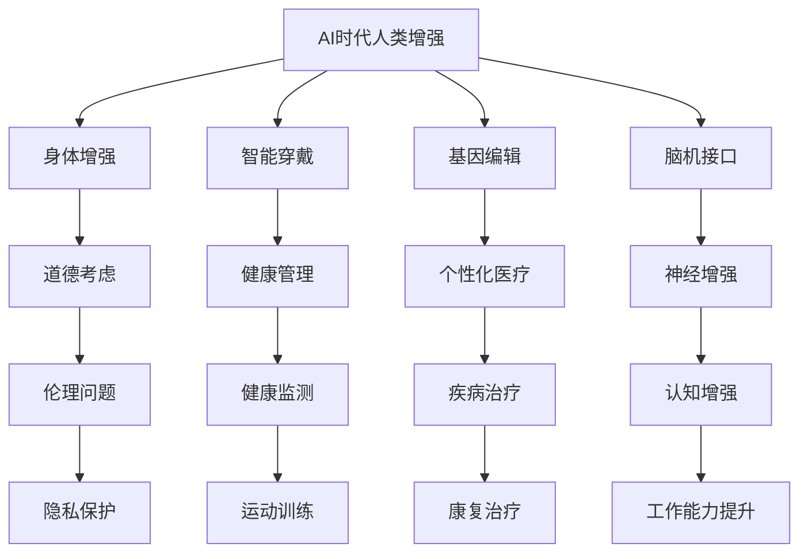
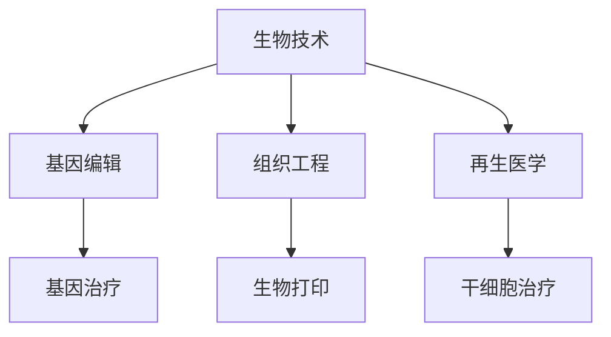

                 

### 文章标题：AI时代的人类增强：道德考虑与身体增强的未来方向

> 关键词：人工智能，人类增强，道德考虑，身体增强，技术发展，伦理问题

> 摘要：本文探讨了AI时代人类增强技术的道德考虑和未来方向。首先，我们分析了人类增强的概念与背景，随后深入探讨了道德考虑在人类增强中的应用。接着，我们探讨了身体增强的未来方向，包括生物技术与人工智能在身体增强中的应用。最后，我们讨论了身体增强的社会与法律影响，以及人类增强伦理委员会的作用与责任。通过案例研究和未来展望，本文旨在为读者提供一个全面而深刻的视角，以理解AI时代人类增强的复杂性和潜力。

### 第一部分: AI时代的人类增强概述

#### 第1章: AI时代的人类增强概念与背景

##### 1.1 AI时代人类增强的定义

AI时代的人类增强指的是通过人工智能（AI）技术，结合生物医学、工程学、神经科学等多个领域的进步，对人体进行提升和优化的过程。这种增强不仅包括物理能力的提升，还包括认知、感知和心理健康等多个方面的增强。

##### 1.2 AI时代人类增强的历史背景

人类对自身增强的追求可以追溯到古代。然而，随着科技的进步，尤其是人工智能的发展，人类增强迎来了新的契机。从最早的假肢和助听器，到现代的基因编辑和脑机接口技术，人类增强的历程不断推动着科学和技术的边界。

##### 1.3 AI时代人类增强的重要性

AI时代人类增强的重要性体现在多个方面。首先，它能够显著提高人类的生活质量和健康水平。其次，它有望解决一些长期的医疗和健康问题，如残疾、老年痴呆和慢性疾病。此外，人类增强技术还可能改变我们的工作方式和社会结构，带来新的经济和社会机会。

##### 1.4 人类增强的主要领域

人类增强技术涉及多个领域，包括但不限于：

1. **生物医学**：基因编辑、组织工程、再生医学等。
2. **神经科学**：脑机接口、神经刺激、认知增强等。
3. **工程学**：智能假肢、增强现实、虚拟现实等。
4. **信息技术**：智能穿戴设备、健康监测系统、个性化医疗等。

#### 第2章: 道德考虑在人类增强中的应用

##### 2.1 道德考虑的重要性

道德考虑在人类增强中的应用至关重要。随着技术的进步，人类增强可能带来的道德困境和伦理问题不容忽视。这些问题包括但不限于：

1. **公平性**：是否所有个体都能公平地获得人类增强的机会？
2. **隐私**：个人数据的安全和隐私保护。
3. **人类尊严**：过度增强是否可能损害人类尊严和自我认同？
4. **责任**：增强技术的研发和使用过程中，谁应该承担责任？

##### 2.2 人类增强中的伦理问题

人类增强中存在的伦理问题包括：

1. **增强的边界**：何时停止增强？如何界定增强的合理范围？
2. **基因编辑的伦理**：基因编辑可能导致未知的长期后果，如何平衡潜在风险和道德责任？
3. **脑机接口的伦理**：大脑与外部设备直接连接可能改变人的意识和认知，如何确保这一过程的透明和可控？
4. **社会歧视**：身体增强可能加剧社会分层和歧视，如何确保公平和包容？

##### 2.3 道德原则与人类增强的平衡

在人类增强中，以下道德原则值得重视：

1. **尊重个人自主权**：确保个体在增强过程中拥有决策权。
2. **公平性**：确保增强技术不会加剧社会不平等。
3. **透明度**：增强技术的研发和使用过程应公开透明。
4. **责任**：各方在增强技术中的责任应明确界定。

##### 2.4 道德决策制定过程

道德决策制定过程包括以下几个步骤：

1. **问题识别**：识别人类增强中的潜在道德困境。
2. **价值评估**：评估不同道德原则的优先级。
3. **方案选择**：基于价值评估选择合适的道德解决方案。
4. **实施与监督**：实施道德决策，并持续监督其效果。

### 第二部分: 身体增强的未来方向

#### 第3章: 生物技术与身体增强

##### 3.1 基因编辑与身体增强

基因编辑技术，如CRISPR-Cas9，已展现出巨大的潜力，可以在DNA水平上精确修改基因序列。这种技术不仅有望治疗遗传性疾病，还能增强人体的特定特征。

##### 3.2 组织工程与再生医学

组织工程和再生医学通过使用干细胞和生物材料来修复或替代受损的组织和器官。这种技术有望大幅提高人体的自愈能力和器官移植的成功率。

##### 3.3 脑机接口与神经增强

脑机接口技术通过解码大脑信号，使人体能够直接与外部设备进行交互。这种技术不仅能够帮助瘫痪患者恢复运动能力，还能提升人体的认知和感知能力。

##### 3.4 人体增强药物与营养补充

人体增强药物和营养补充通过调节体内的生物过程，提升人体的健康水平和运动能力。这些技术有望在未来进一步优化，以适应个性化的健康需求。

#### 第4章: 人工智能与身体增强

##### 4.1 人工智能在身体增强中的应用

人工智能在身体增强中的应用广泛，包括但不限于：

1. **个性化医疗**：基于患者基因组和生物特征，提供个性化的治疗方案。
2. **健康监测**：通过智能穿戴设备实时监测患者的健康状况。
3. **康复治疗**：利用增强现实和虚拟现实技术，提高康复训练的效果。

##### 4.2 智能穿戴设备与健康管理

智能穿戴设备已成为身体增强的重要工具，它们可以监测心率、血压、睡眠质量等生命体征，提供实时健康数据，帮助用户更好地管理健康。

##### 4.3 虚拟现实与增强现实在身体增强中的应用

虚拟现实（VR）和增强现实（AR）技术在身体增强中的应用日益增多。它们不仅能够提供沉浸式的训练体验，还能模拟复杂的手术过程，提高医疗培训的效果。

##### 4.4 人工智能与身体增强的未来趋势

随着人工智能技术的不断发展，未来身体增强有望实现以下几个趋势：

1. **个性化增强**：基于个体差异，提供高度个性化的身体增强方案。
2. **全生命周期管理**：从新生儿到老年人，全程监控和管理身体健康。
3. **智慧医疗**：通过大数据和人工智能，实现更加精准和高效的医疗决策。

#### 第5章: 身体增强的社会与法律影响

##### 5.1 身体增强对个人隐私的影响

身体增强技术的应用可能会对个人隐私产生重大影响。如何保护用户的生物数据和健康信息，避免数据泄露和滥用，是一个亟待解决的问题。

##### 5.2 身体增强与就业歧视

身体增强可能带来就业歧视的问题。如何确保增强技术不会加剧社会分层和不平等，是一个重要的社会问题。

##### 5.3 身体增强与社会公平

身体增强技术应该服务于所有人，而不是成为富人和特权阶层的专享。如何确保社会公平，避免增强技术的滥用，是一个重要的道德问题。

##### 5.4 法律法规与身体增强的监管

为了保护公众利益，需要对身体增强技术进行严格监管。这包括制定相关法律法规，建立监管机构，确保增强技术的安全性和有效性。

#### 第6章: 人类增强伦理委员会的作用与责任

##### 6.1 人类增强伦理委员会的成立背景

随着人类增强技术的快速发展，成立专门的人类增强伦理委员会成为必然。这些委员会旨在为增强技术的研发和应用提供道德指导，确保技术发展符合伦理标准。

##### 6.2 人类增强伦理委员会的职责

人类增强伦理委员会的职责包括：

1. **道德评估**：对增强技术的道德风险进行评估。
2. **伦理指导**：为增强技术的研发和应用提供伦理建议。
3. **公众咨询**：与公众和利益相关者进行沟通，听取他们的意见和关切。
4. **国际合作**：与其他国家和国际组织合作，制定全球性的伦理标准。

##### 6.3 伦理委员会的运作模式

伦理委员会的运作模式通常包括以下几个环节：

1. **审查**：对增强技术项目进行审查，确保其符合伦理标准。
2. **决策**：就增强技术项目做出伦理决策，如批准或拒绝。
3. **监督**：监督增强技术的实施过程，确保其符合伦理标准。
4. **评估**：对增强技术的效果和影响进行评估。

##### 6.4 人类增强伦理委员会的挑战与未来

人类增强伦理委员会面临以下几个挑战：

1. **技术快速发展**：如何跟上技术的快速发展，确保伦理标准的适应性。
2. **国际合作**：如何实现国际间的合作，制定统一的伦理标准。
3. **公众信任**：如何赢得公众的信任，确保增强技术的透明和公正。
4. **资源限制**：如何有效利用有限的资源，确保伦理委员会的高效运作。

### 第三部分: 案例研究与未来展望

#### 第7章: 身体增强技术的实际应用案例

##### 7.1 基因编辑治疗案例

基因编辑技术已经在治疗遗传性疾病中取得了显著成果。例如，使用CRISPR-Cas9技术成功治疗了某种罕见遗传性疾病的患者。这一案例展示了基因编辑技术在医疗领域的巨大潜力。

##### 7.2 脑机接口在瘫痪患者中的应用

脑机接口技术帮助一些瘫痪患者恢复了运动能力。例如，通过脑机接口，瘫痪患者能够通过大脑信号控制假肢进行运动。这一案例展示了脑机接口技术在康复治疗中的应用。

##### 7.3 智能穿戴设备在运动训练中的应用

智能穿戴设备通过实时监测运动员的运动数据，提供个性化的训练建议。例如，一些顶级运动员使用智能手表来监控心率、睡眠质量等指标，以优化训练效果。这一案例展示了智能穿戴设备在运动训练中的应用。

##### 7.4 增强现实技术在康复治疗中的应用

增强现实（AR）技术在康复治疗中得到了广泛应用。例如，通过AR技术，患者可以进行虚拟的康复训练，提高康复效果。这一案例展示了AR技术在康复治疗中的应用。

#### 第8章: 身体增强的未来展望

##### 8.1 未来身体增强技术的预测

未来身体增强技术有望实现以下几个方面的突破：

1. **个性化增强**：基于个体差异，提供高度个性化的身体增强方案。
2. **全生命周期管理**：从新生儿到老年人，全程监控和管理身体健康。
3. **智能医疗**：通过大数据和人工智能，实现更加精准和高效的医疗决策。

##### 8.2 身体增强与社会发展的影响

身体增强技术将对社会发展产生深远影响。一方面，它有望提高人类的生活质量和健康水平；另一方面，它可能带来一系列社会、法律和伦理问题，需要全社会共同应对。

##### 8.3 道德考虑在身体增强中的持续重要性

道德考虑在身体增强中将始终至关重要。随着技术的不断发展，我们需要不断反思和调整道德标准，确保身体增强技术的发展符合人类利益和社会伦理。

##### 8.4 身体增强的未来挑战与解决方案

未来身体增强技术面临以下几个挑战：

1. **技术风险**：如何确保增强技术的安全性和有效性？
2. **伦理困境**：如何平衡道德考虑和技术发展？
3. **社会公平**：如何确保增强技术惠及所有人，而不是加剧社会不平等？
4. **监管框架**：如何建立完善的监管框架，确保增强技术的合法和合规？

### 附录

#### 附录A: 身体增强相关术语解释

- **基因编辑**：通过CRISPR-Cas9等工具酶对DNA序列进行精确修改的技术。
- **脑机接口**：通过解码大脑信号实现人脑与外部设备直接通信的技术。
- **智能穿戴设备**：能够监测和提供健康数据，并通过传感器收集身体数据的可穿戴设备。

#### 附录B: 人类增强伦理指南

- **隐私保护**：确保个人隐私不受侵犯。
- **社会公平**：避免因身体增强导致的社会歧视。
- **安全性**：确保人类增强技术的安全性。

#### 附录C: 增强现实与虚拟现实技术发展历史

- **1990年代**：虚拟现实技术的初期探索。
- **2000年代**：增强现实技术的兴起。
- **2010年代**：智能穿戴设备的普及。
- **2020年代**：基因编辑和脑机接口技术的快速发展。

## 图1-1 AI时代人类增强核心概念与联系图



## 图3-1 生物技术与身体增强架构图



### 第4章 核心算法原理讲解

#### 第4.1节 基因编辑算法原理

基因编辑技术主要依赖于CRISPR-Cas9等工具酶进行DNA序列的精确修改。以下是基因编辑算法的伪代码：

```python
# 定义CRISPR-Cas9算法
def CRISPR_Cas9(target_sequence, guide_sequence):
    # 定位目标序列
    target_site = locate_target_site(target_sequence, guide_sequence)
    # 切割DNA
    DNA_frag = cut_DNA(target_site)
    # 添加新序列
    modified_DNA = insert_new_sequence(DNA_frag, new_sequence)
    # 合并DNA
    repaired_DNA = merge_DNA(modified_DNA)
    return repaired_DNA
```

#### 第4.2节 脑机接口算法原理

脑机接口（BMI）技术通过解码大脑信号来实现人脑与外部设备的直接通信。以下是BMI算法的伪代码：

```python
# 定义BMI解码算法
def BMI_Decode(electrode_data):
    # 特征提取
    features = extract_features(electrode_data)
    # 特征分类
    classification = classify_features(features)
    # 动作识别
    action = identify_action(classification)
    return action
```

### 第5章 数学模型与数学公式

#### 第5.1节 基因编辑的数学模型

基因编辑的数学模型通常使用概率模型来描述基因编辑的成功率和突变率。以下是基因编辑概率模型的公式：

$$
P(success) = \frac{1}{1 + e^{-\beta \cdot (y - \theta)}}
$$

其中，$P(success)$ 是成功编辑的概率，$y$ 是编辑前的基因序列，$\theta$ 是编辑后的基因序列，$\beta$ 是调节参数。

#### 第5.2节 脑机接口的数学模型

脑机接口的数学模型通常使用神经网络模型来解码大脑信号。以下是神经网络模型的激活函数公式：

$$
a(x) = \frac{1}{1 + e^{-x}}
$$

### 第6章 项目实战

#### 第6.1节 基因编辑项目实战

**开发环境搭建：**

- 安装CRISPR-Cas9软件包
- 安装基因编辑数据库

**源代码实现：**

```python
# 导入CRISPR-Cas9库
import CRISPR_Cas9

# 读取基因序列
with open('gene_sequence.txt', 'r') as file:
    target_sequence = file.read()

# 定义CRISPR-Cas9参数
guide_sequence = "AGGCTGA"
new_sequence = "GTCCTGA"

# 进行基因编辑
modified_sequence = CRISPR_Cas9.CRISPR_Cas9(target_sequence, guide_sequence, new_sequence)

# 输出编辑后的基因序列
print("Modified gene sequence:", modified_sequence)
```

**代码解读与分析：**

- 读取基因序列文件
- 定义CRISPR-Cas9参数
- 调用CRISPR-Cas9函数进行基因编辑
- 输出编辑后的基因序列

#### 第6.2节 脑机接口项目实战

**开发环境搭建：**

- 安装Python和TensorFlow库
- 安装EEG数据集

**源代码实现：**

```python
# 导入TensorFlow库
import tensorflow as tf

# 加载EEG数据集
(x_train, y_train), (x_test, y_test) = EEG_dataset.load_data()

# 构建神经网络模型
model = tf.keras.Sequential([
    tf.keras.layers.Dense(64, activation='relu', input_shape=(x_train.shape[1],)),
    tf.keras.layers.Dense(64, activation='relu'),
    tf.keras.layers.Dense(10, activation='softmax')
])

# 编译模型
model.compile(optimizer='adam',
              loss='sparse_categorical_crossentropy',
              metrics=['accuracy'])

# 训练模型
model.fit(x_train, y_train, epochs=10)

# 评估模型
test_loss, test_acc = model.evaluate(x_test, y_test)
print("Test accuracy:", test_acc)
```

**代码解读与分析：**

- 加载EEG数据集
- 构建神经网络模型
- 编译模型
- 训练模型
- 评估模型

### 附录

#### 附录A: 身体增强相关术语解释

- **基因编辑**：通过CRISPR-Cas9等工具酶对DNA序列进行精确修改的技术。
- **脑机接口**：通过解码大脑信号实现人脑与外部设备直接通信的技术。
- **智能穿戴设备**：能够监测和提供健康数据，并通过传感器收集身体数据的可穿戴设备。

#### 附录B: 人类增强伦理指南

- **隐私保护**：确保个人隐私不受侵犯。
- **社会公平**：避免因身体增强导致的社会歧视。
- **安全性**：确保人类增强技术的安全性。

#### 附录C: 增强现实与虚拟现实技术发展历史

- **1990年代**：虚拟现实技术的初期探索。
- **2000年代**：增强现实技术的兴起。
- **2010年代**：智能穿戴设备的普及。
- **2020年代**：基因编辑和脑机接口技术的快速发展。

