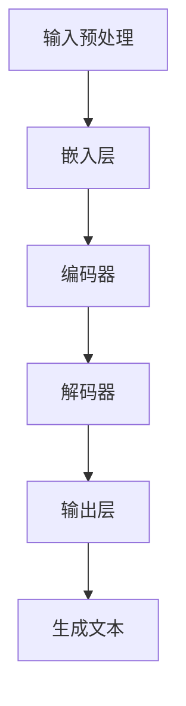

                 

### 文章标题: AI时代的写作速度：Weaver模型的效率提升

关键词：AI写作、Weaver模型、自然语言处理、生成算法、优化算法、性能优化、效率提升

摘要：在人工智能时代，写作速度和效率成为衡量一个写作系统性能的重要指标。Weaver模型作为当前最先进的AI写作工具，凭借其高效的生成算法和优化策略，大幅提升了写作速度和效率。本文将详细介绍Weaver模型的核心特性、技术基础、核心算法解析、在写作中的应用以及性能优化与效率提升策略，并通过实际案例解析Weaver模型在文案写作、新闻报道和学术写作中的应用效果，旨在为广大读者提供一次全面深入的技术解析和思考。

---

### 《AI时代的写作速度：Weaver模型的效率提升》目录大纲

1. Weaver模型概述
2. Weaver模型的技术基础
3. Weaver模型核心算法解析
4. Weaver模型在写作中的应用
5. Weaver模型的性能优化与效率提升
6. Weaver模型的应用案例分析
7. 附录

#### Mermaid流程图：Weaver模型核心算法流程



#### Weaver模型生成算法伪代码

```python
# Weaver模型生成算法伪代码

function generate_text(input_sequence):
    # 初始化嵌入层
    embed = EmbeddingLayer(input_sequence)
    # 通过编码器编码
    encoded = Encoder(embed)
    # 通过解码器解码
    decoded = Decoder(encoded)
    # 获取输出文本
    text = decoded.get_output()
    return text
```

#### Weaver模型优化算法伪代码

```python
# Weaver模型优化算法伪代码

function optimize_model(model, loss_function, optimizer):
    # 训练模型
    for epoch in range(num_epochs):
        for batch in data_loader:
            # 计算损失
            loss = loss_function(model(batch))
            # 反向传播
            gradients = optimizer.backward(loss)
            # 更新模型参数
            model.update_params(gradients)
    return model
```

#### 数学模型与公式解析

$$
\begin{aligned}
    L &= -\frac{1}{N} \sum_{i=1}^{N} \sum_{j=1}^{T} y_{ij} \log(p_{ij}) \\
    p_{ij} &= \text{softmax}(\text{logits}_{ij})
\end{aligned}
$$

- $L$ 表示损失函数
- $N$ 表示批大小
- $T$ 表示句子长度
- $y_{ij}$ 表示目标词的标签
- $\text{softmax}(\text{logits}_{ij})$ 表示预测概率分布

---

### 第一部分：Weaver模型概述

随着人工智能技术的飞速发展，AI写作正逐渐成为各个行业的重要工具。在文案写作、新闻报道和学术写作等领域，AI写作系统以其高效、准确和多样化的特点，大大提升了写作速度和效率。Weaver模型作为当前最先进的AI写作工具，其高效的生成算法和优化策略使其在AI写作领域取得了显著成果。

##### 第1章：AI写作背景与Weaver模型介绍

1. **AI写作的发展历程与趋势**

   AI写作始于20世纪末，随着自然语言处理（NLP）技术的发展，AI写作逐渐从简单的文本生成发展到复杂的多模态写作。目前，AI写作已经广泛应用于新闻、广告、营销、学术等多个领域。未来，随着人工智能技术的进一步发展，AI写作将更加智能化、个性化和高效化。

2. **Weaver模型的核心特性与优势**

   Weaver模型具有以下核心特性：

   - **高效的生成算法**：Weaver模型采用了先进的生成算法，能够快速生成高质量文本。
   - **灵活的优化策略**：Weaver模型在训练过程中采用了多种优化策略，如深度学习、迁移学习等，能够有效提高模型性能。
   - **多样化的应用场景**：Weaver模型可以应用于文案写作、新闻报道、学术写作等多个领域，满足不同场景的写作需求。

3. **Weaver模型在AI写作中的应用场景**

   - **文案写作**：Weaver模型可以自动生成广告文案、宣传文案等，帮助企业提高营销效果。
   - **新闻报道**：Weaver模型可以自动生成新闻报道，提高新闻传播速度和覆盖面。
   - **学术写作**：Weaver模型可以辅助学术研究人员撰写论文，提高写作效率和论文质量。

##### 第2章：Weaver模型的技术基础

1. **自然语言处理基本概念**

   自然语言处理（NLP）是人工智能的重要分支，主要研究如何让计算机理解和处理自然语言。NLP技术包括文本预处理、语义分析、语言生成等。在AI写作中，NLP技术是实现文本生成和理解的基础。

2. **Weaver模型的工作原理**

   Weaver模型基于深度学习技术，主要包括嵌入层、编码器、解码器和输出层。通过嵌入层将输入文本转换为向量表示，编码器对向量进行编码，解码器对编码后的向量进行解码，输出层生成最终文本。

3. **Weaver模型的训练与优化**

   Weaver模型的训练过程包括数据预处理、模型训练和优化。数据预处理包括文本清洗、分词、词向量表示等。模型训练采用基于梯度的优化算法，如随机梯度下降（SGD）和Adam优化器。优化过程中，通过调整模型参数，提高模型性能。

---

### 第二部分：Weaver模型的技术基础

在了解了Weaver模型的基本概念和应用场景后，我们需要深入探讨其技术基础，包括自然语言处理的基本概念、Weaver模型的工作原理以及模型的训练与优化过程。

##### 第2章：Weaver模型的技术基础

##### **2.1 自然语言处理基本概念**

自然语言处理（NLP）是人工智能领域的一个重要分支，旨在让计算机理解和处理人类语言。NLP的核心任务是使计算机能够自动执行与人类语言交互相关的任务，如文本分类、实体识别、机器翻译、问答系统等。

1. **文本预处理**

   文本预处理是NLP任务的第一步，主要包括文本清洗、分词、词性标注、停用词去除等。文本清洗的目的是去除文本中的无关信息，如HTML标签、特殊字符等。分词是将连续的文本切分成有意义的词或短语。词性标注是对文本中的每个词进行词性分类，如名词、动词等。停用词去除是删除文本中的常见无意义词汇，以提高NLP任务的效率。

2. **词向量表示**

   词向量表示是将文本中的词语映射到高维空间中的向量。词向量表示方法有助于捕捉词语的语义信息，常用的方法包括Word2Vec、GloVe、FastText等。这些方法将词语表示为高维向量，使得具有相似语义的词语在向量空间中彼此靠近。

3. **语义分析**

   语义分析是NLP的一个重要任务，旨在理解文本的语义内容。语义分析包括词义消歧、情感分析、文本分类、关系抽取等。词义消歧是指确定文本中词语的确切含义。情感分析是指识别文本中的情感极性，如正面、负面或中性。文本分类是指将文本分类到预定义的类别中。关系抽取是指识别文本中词语之间的关系，如主谓关系、因果关系等。

##### **2.2 Weaver模型的工作原理**

Weaver模型是一种基于深度学习的文本生成模型，其核心思想是利用神经网络对文本进行编码和解码，从而生成新的文本。Weaver模型的工作原理可以分为以下几个步骤：

1. **嵌入层**

   嵌入层（Embedding Layer）是将输入的词语转换为高维向量表示。嵌入层通常使用预训练的词向量，如GloVe或Word2Vec。这些词向量能够捕捉词语的语义信息，使得具有相似语义的词语在向量空间中彼此靠近。

2. **编码器**

   编码器（Encoder）是一个编码神经网络，用于将输入的文本序列编码为一个固定长度的向量。编码器通常使用卷积神经网络（CNN）或递归神经网络（RNN）实现。编码器通过处理输入的词向量序列，提取文本的上下文信息，并将这些信息编码为一个固定长度的向量。

3. **解码器**

   解码器（Decoder）是一个解码神经网络，用于将编码器输出的向量解码成新的文本序列。解码器通常使用长短期记忆网络（LSTM）或变换器（Transformer）实现。解码器通过处理编码器输出的向量，生成新的词向量序列，并将其转换为文本序列。

4. **输出层**

   输出层（Output Layer）是一个分类器，用于对解码器生成的词向量序列进行分类，从而生成最终的文本。输出层通常使用softmax激活函数，将词向量序列映射到概率分布，从而确定每个词语的生成概率。

##### **2.3 Weaver模型的训练与优化**

Weaver模型的训练与优化是提高模型性能的关键步骤。训练过程包括数据预处理、模型训练和优化。优化过程则通过调整模型参数，提高模型在特定任务上的表现。

1. **数据预处理**

   数据预处理是训练过程的第一步，主要包括文本清洗、分词、词向量表示等。文本清洗的目的是去除文本中的无关信息，如HTML标签、特殊字符等。分词是将连续的文本切分成有意义的词或短语。词向量表示是将文本中的词语映射到高维空间中的向量。

2. **模型训练**

   模型训练是利用已标注的数据来训练Weaver模型。训练过程中，模型会学习如何将输入的文本序列编码和解码成新的文本序列。训练过程通常使用基于梯度的优化算法，如随机梯度下降（SGD）或Adam优化器。在训练过程中，模型会不断调整参数，以最小化损失函数。

3. **优化过程**

   优化过程是在训练过程中不断调整模型参数，以提高模型性能。优化过程包括以下步骤：

   - **损失函数**：损失函数用于衡量模型预测与真实标签之间的差距。常用的损失函数包括交叉熵损失函数和平均平方误差损失函数。
   - **反向传播**：反向传播是一种计算损失函数关于模型参数的梯度的方法。通过计算梯度，模型可以更新参数，以最小化损失函数。
   - **参数更新**：参数更新是通过梯度来调整模型参数的过程。常用的更新方法包括梯度下降、动量优化和自适应优化等。

---

### 第三部分：Weaver模型核心算法解析

在了解了Weaver模型的技术基础之后，接下来我们将深入探讨Weaver模型的核心算法，包括生成算法和优化算法。这些算法是实现Weaver模型高效写作的关键。

##### 第3章：Weaver模型的生成算法

Weaver模型的生成算法是模型的核心组成部分，负责将输入文本转换为新文本。生成算法的高效性直接决定了模型在写作任务中的性能。以下是对Weaver模型生成算法的详细解析。

##### **3.1 生成算法概述**

Weaver模型的生成算法基于深度学习技术，主要包括嵌入层、编码器、解码器和输出层。每个层都有特定的功能，协同工作以实现文本的生成。

1. **嵌入层（Embedding Layer）**

   嵌入层是将输入的词语转换为高维向量表示。这一过程通常使用预训练的词向量，如GloVe或Word2Vec。嵌入层可以捕捉词语的语义信息，使得具有相似语义的词语在向量空间中彼此靠近。

2. **编码器（Encoder）**

   编码器是一个编码神经网络，用于将输入的文本序列编码为一个固定长度的向量。编码器通常使用卷积神经网络（CNN）或递归神经网络（RNN）实现。编码器的任务是提取文本的上下文信息，并将这些信息编码为一个固定长度的向量。

3. **解码器（Decoder）**

   解码器是一个解码神经网络，用于将编码器输出的向量解码成新的文本序列。解码器通常使用长短期记忆网络（LSTM）或变换器（Transformer）实现。解码器的任务是根据编码器输出的向量生成新的词向量序列，并将其转换为文本序列。

4. **输出层（Output Layer）**

   输出层是一个分类器，用于对解码器生成的词向量序列进行分类，从而生成最终的文本。输出层通常使用softmax激活函数，将词向量序列映射到概率分布，从而确定每个词语的生成概率。

##### **3.2 生成算法的伪代码描述**

下面是Weaver模型生成算法的伪代码描述，展示了每个步骤的实现细节。

```python
# Weaver模型生成算法伪代码

function generate_text(input_sequence):
    # 初始化嵌入层
    embed = EmbeddingLayer(input_sequence)
    # 通过编码器编码
    encoded = Encoder(embed)
    # 通过解码器解码
    decoded = Decoder(encoded)
    # 获取输出文本
    text = decoded.get_output()
    return text
```

##### **3.3 生成算法的数学模型与公式解析**

Weaver模型生成算法的数学模型主要涉及词向量表示、编码和解码过程。以下是生成算法的数学模型与公式解析。

1. **词向量表示**

   词向量表示是将输入的词语映射到高维空间中的向量。常用的词向量表示方法包括Word2Vec和GloVe。假设有一个词向量表示矩阵\( V \)，其中每一行表示一个词的向量。

   $$ v_w = V[w] $$

   其中，\( v_w \) 是词\( w \)的向量表示。

2. **编码器**

   编码器将输入的词向量序列编码为一个固定长度的向量。假设编码器的输出向量为\( c \)。

   $$ c = Encoder([v_w_1, v_w_2, ..., v_w_T]) $$

   其中，\( T \) 是输入文本的长度。

3. **解码器**

   解码器将编码器输出的向量解码成新的词向量序列。假设解码器的输出向量为\( d \)。

   $$ d = Decoder(c) $$

4. **输出层**

   输出层是一个分类器，用于对解码器生成的词向量序列进行分类，从而生成最终的文本。输出层使用softmax函数计算每个词语的生成概率。

   $$ p_{ij} = \text{softmax}(\text{logits}_{ij}) $$

   其中，\( \text{logits}_{ij} \) 是解码器输出的 logits 值，\( p_{ij} \) 是词语\( j \)在位置\( i \)的生成概率。

##### **3.4 生成算法案例解析**

为了更好地理解Weaver模型生成算法，我们可以通过一个简单的案例进行解析。假设输入文本为“我爱北京天安门”，我们需要生成新的文本。

1. **词向量表示**

   将输入文本中的每个词语转换为词向量表示。

   $$ v_{我} = V[“我”] $$
   $$ v_{爱} = V[“爱”] $$
   $$ v_{北京} = V[“北京”] $$
   $$ v_{天安门} = V[“天安门”] $$

2. **编码器**

   使用编码器将词向量序列编码为固定长度的向量。

   $$ c = Encoder([v_{我}, v_{爱}, v_{北京}, v_{天安门}]) $$

3. **解码器**

   使用解码器根据编码器输出的向量生成新的词向量序列。

   $$ d = Decoder(c) $$

4. **输出层**

   使用输出层计算每个词语的生成概率，并选择概率最大的词语作为生成结果。

   $$ p_{ij} = \text{softmax}(\text{logits}_{ij}) $$
   $$ \text{生成的文本} = \arg\max_{j} p_{ij} $$

通过这个案例，我们可以看到Weaver模型生成算法的基本流程和实现步骤。在实际应用中，Weaver模型会通过大量的数据和参数调整来实现更高质量的文本生成。

---

##### 第4章：Weaver模型的优化算法

在文本生成任务中，Weaver模型的性能不仅取决于其生成算法，还受到训练过程中的优化算法的影响。优化算法的目的是通过调整模型参数，提高模型在特定任务上的表现。本章节将详细介绍Weaver模型的优化算法，包括优化算法的概述、伪代码描述、数学模型与公式解析以及优化算法的实际应用。

##### **4.1 优化算法概述**

优化算法是训练过程中不可或缺的一部分，其主要目标是在给定的损失函数下，找到使损失函数最小的模型参数。Weaver模型采用了多种优化算法，包括随机梯度下降（SGD）、Adam优化器等，以实现高效训练。

1. **随机梯度下降（SGD）**

   随机梯度下降是一种最简单的优化算法，它通过随机选择一小部分数据子集（称为批量），计算梯度并更新模型参数。SGD的优点是计算简单，能够快速收敛，但容易陷入局部最小值。

2. **Adam优化器**

   Adam优化器结合了SGD和Adagrad的优点，通过计算一阶矩估计（均值）和二阶矩估计（方差），自适应地调整学习率。Adam优化器在训练过程中能够更好地平衡收敛速度和稳定性。

##### **4.2 优化算法的伪代码描述**

以下分别展示了SGD和Adam优化器的伪代码描述，用于说明它们的基本实现步骤。

```python
# 随机梯度下降（SGD）伪代码

function SGD(model, learning_rate, batch_size):
    for epoch in range(num_epochs):
        for batch in data_loader:
            # 计算梯度
            gradients = model.backward(batch)
            # 更新模型参数
            model.update_params(gradients, learning_rate)
    return model

# Adam优化器伪代码

function Adam(model, learning_rate, beta1, beta2, epsilon):
    for epoch in range(num_epochs):
        for batch in data_loader:
            # 计算梯度
            gradients = model.backward(batch)
            # 更新一阶矩估计和二阶矩估计
            m = ...
            v = ...
            # 更新模型参数
            model.update_params(gradients, m, v, learning_rate, beta1, beta2, epsilon)
    return model
```

##### **4.3 优化算法的数学模型与公式解析**

优化算法的核心在于计算模型参数的梯度，并通过梯度更新模型参数。以下分别介绍SGD和Adam优化器的数学模型与公式。

1. **随机梯度下降（SGD）**

   随机梯度下降的损失函数为：

   $$ L = \frac{1}{m} \sum_{i=1}^{m} \frac{\partial L}{\partial \theta_i} $$

   其中，\( L \) 是损失函数，\( m \) 是批量大小，\( \theta_i \) 是模型参数。

   模型参数的更新公式为：

   $$ \theta_i = \theta_i - learning_rate \cdot \frac{\partial L}{\partial \theta_i} $$

2. **Adam优化器**

   Adam优化器基于一阶矩估计（均值）\( m_t \) 和二阶矩估计（方差）\( v_t \) 进行更新。一阶矩估计和二阶矩估计的更新公式为：

   $$ m_t = \beta_1 m_{t-1} + (1 - \beta_1) \frac{\partial L}{\partial \theta_t} $$
   $$ v_t = \beta_2 v_{t-1} + (1 - \beta_2) \left(\frac{\partial L}{\partial \theta_t}\right)^2 $$

   其中，\( \beta_1 \) 和 \( \beta_2 \) 分别是动量参数，取值范围为0到1。

   模型参数的更新公式为：

   $$ \theta_t = \theta_t - learning_rate \cdot \frac{m_t}{\sqrt{v_t} + \epsilon} $$

   其中，\( \epsilon \) 是一个很小的常数，用于防止分母为零。

##### **4.4 优化算法案例解析**

为了更好地理解优化算法的实际应用，我们可以通过一个简单的案例来演示SGD和Adam优化器在Weaver模型训练中的应用。

1. **随机梯度下降（SGD）案例**

   假设我们有100个样本的训练数据，每个样本包含一个输入文本和一个目标文本。我们使用随机梯度下降（SGD）来训练Weaver模型。

   - **初始化模型参数**
   - **随机选择一个批量，计算梯度**
   - **更新模型参数**
   - **重复上述步骤，直到模型收敛**

2. **Adam优化器案例**

   同样，我们使用Adam优化器来训练Weaver模型。

   - **初始化模型参数**
   - **计算一阶矩估计和二阶矩估计**
   - **随机选择一个批量，计算梯度**
   - **更新一阶矩估计和二阶矩估计**
   - **更新模型参数**
   - **重复上述步骤，直到模型收敛**

通过这两个案例，我们可以看到SGD和Adam优化器在Weaver模型训练中的基本流程和实现步骤。在实际应用中，根据任务的需求和数据特点，可以选择合适的优化算法来提高模型的性能。

---

### 第三部分：Weaver模型核心算法解析

在前面的章节中，我们介绍了Weaver模型的基本概念和技术基础。本部分将深入探讨Weaver模型的核心算法，具体包括生成算法和优化算法。这些算法是Weaver模型能够高效生成文本的关键。

#### 第3章：Weaver模型的生成算法

Weaver模型的生成算法是模型的核心组成部分，负责将输入文本转换为新文本。生成算法的高效性直接决定了模型在写作任务中的性能。以下是对Weaver模型生成算法的详细解析。

##### **3.1 生成算法概述**

Weaver模型的生成算法基于深度学习技术，主要包括嵌入层、编码器、解码器和输出层。每个层都有特定的功能，协同工作以实现文本的生成。

1. **嵌入层（Embedding Layer）**

   嵌入层是将输入的词语转换为高维向量表示。这一过程通常使用预训练的词向量，如GloVe或Word2Vec。嵌入层可以捕捉词语的语义信息，使得具有相似语义的词语在向量空间中彼此靠近。

2. **编码器（Encoder）**

   编码器是一个编码神经网络，用于将输入的文本序列编码为一个固定长度的向量。编码器通常使用卷积神经网络（CNN）或递归神经网络（RNN）实现。编码器的任务是提取文本的上下文信息，并将这些信息编码为一个固定长度的向量。

3. **解码器（Decoder）**

   解码器是一个解码神经网络，用于将编码器输出的向量解码成新的文本序列。解码器通常使用长短期记忆网络（LSTM）或变换器（Transformer）实现。解码器的任务是根据编码器输出的向量生成新的词向量序列，并将其转换为文本序列。

4. **输出层（Output Layer）**

   输出层是一个分类器，用于对解码器生成的词向量序列进行分类，从而生成最终的文本。输出层通常使用softmax激活函数，将词向量序列映射到概率分布，从而确定每个词语的生成概率。

##### **3.2 生成算法的伪代码描述**

下面是Weaver模型生成算法的伪代码描述，展示了每个步骤的实现细节。

```python
# Weaver模型生成算法伪代码

function generate_text(input_sequence):
    # 初始化嵌入层
    embed = EmbeddingLayer(input_sequence)
    # 通过编码器编码
    encoded = Encoder(embed)
    # 通过解码器解码
    decoded = Decoder(encoded)
    # 获取输出文本
    text = decoded.get_output()
    return text
```

##### **3.3 生成算法的数学模型与公式解析**

Weaver模型生成算法的数学模型主要涉及词向量表示、编码和解码过程。以下是生成算法的数学模型与公式解析。

1. **词向量表示**

   词向量表示是将输入的词语映射到高维空间中的向量。常用的词向量表示方法包括Word2Vec和GloVe。假设有一个词向量表示矩阵\( V \)，其中每一行表示一个词的向量。

   $$ v_w = V[w] $$

   其中，\( v_w \) 是词\( w \)的向量表示。

2. **编码器**

   编码器将输入的词向量序列编码为一个固定长度的向量。假设编码器的输出向量为\( c \)。

   $$ c = Encoder([v_w_1, v_w_2, ..., v_w_T]) $$

   其中，\( T \) 是输入文本的长度。

3. **解码器**

   解码器将编码器输出的向量解码成新的词向量序列。假设解码器的输出向量为\( d \)。

   $$ d = Decoder(c) $$

4. **输出层**

   输出层是一个分类器，用于对解码器生成的词向量序列进行分类，从而生成最终的文本。输出层通常使用softmax函数计算每个词语的生成概率。

   $$ p_{ij} = \text{softmax}(\text{logits}_{ij}) $$

   其中，\( \text{logits}_{ij} \) 是解码器输出的 logits 值，\( p_{ij} \) 是词语\( j \)在位置\( i \)的生成概率。

##### **3.4 生成算法案例解析**

为了更好地理解Weaver模型生成算法，我们可以通过一个简单的案例进行解析。假设输入文本为“我爱北京天安门”，我们需要生成新的文本。

1. **词向量表示**

   将输入文本中的每个词语转换为词向量表示。

   $$ v_{我} = V[“我”] $$
   $$ v_{爱} = V[“爱”] $$
   $$ v_{北京} = V[“北京”] $$
   $$ v_{天安门} = V[“天安门”] $$

2. **编码器**

   使用编码器将词向量序列编码为固定长度的向量。

   $$ c = Encoder([v_{我}, v_{爱}, v_{北京}, v_{天安门}]) $$

3. **解码器**

   使用解码器根据编码器输出的向量生成新的词向量序列。

   $$ d = Decoder(c) $$

4. **输出层**

   使用输出层计算每个词语的生成概率，并选择概率最大的词语作为生成结果。

   $$ p_{ij} = \text{softmax}(\text{logits}_{ij}) $$
   $$ \text{生成的文本} = \arg\max_{j} p_{ij} $$

通过这个案例，我们可以看到Weaver模型生成算法的基本流程和实现步骤。在实际应用中，Weaver模型会通过大量的数据和参数调整来实现更高质量的文本生成。

---

#### 第四部分：Weaver模型在写作中的应用

在了解了Weaver模型的核心算法之后，我们需要探讨其在实际写作中的应用。本部分将详细介绍Weaver模型在文案写作、新闻报道和学术写作等领域的应用，以及其实际效果评估。

##### 第5章：Weaver模型在文案写作中的应用

文案写作是商业和营销领域的重要一环，而Weaver模型在文案写作中的应用具有显著的优势。以下是对Weaver模型在文案写作中应用的详细探讨。

##### **5.1 文案写作的需求分析**

文案写作的主要目标是吸引读者、提高品牌知名度和促进销售。一个好的文案应该具备以下特点：

- **精准定位**：文案应针对目标受众，突出产品或服务的优势。
- **情感共鸣**：文案应引起读者的情感共鸣，使其产生共鸣和认同。
- **简洁有力**：文案应简明扼要，避免冗长和复杂的句子。
- **引人入胜**：文案应设计引人入胜的标题和开头，吸引读者的注意力。

##### **5.2 Weaver模型在文案写作中的实际应用**

Weaver模型在文案写作中的应用主要体现在以下几个方面：

1. **标题生成**

   Weaver模型可以根据关键词或主题生成引人入胜的标题。例如，输入关键词“减肥”，Weaver模型可以生成标题：“轻松减肥，轻松变美”。

2. **内容生成**

   Weaver模型可以自动生成文案内容，包括产品介绍、广告宣传语等。例如，输入产品描述，Weaver模型可以生成一段产品介绍文案。

3. **情感分析**

   Weaver模型可以进行情感分析，帮助文案作者调整文案的情感倾向。例如，如果文案的情感倾向偏负面，Weaver模型可以建议作者使用更积极的词汇。

##### **5.3 文案写作效果评估**

为了评估Weaver模型在文案写作中的效果，我们可以从以下几个方面进行评估：

- **标题吸引力**：通过问卷调查或点击率等指标评估标题的吸引力。
- **文案质量**：通过人工评审或机器评分评估文案的质量，包括语言表达、逻辑连贯性等。
- **转化率**：通过销售数据或用户反馈评估文案的转化效果。

例如，在一个实际案例中，某电商平台使用Weaver模型自动生成广告文案，并对比了使用Weaver模型前后的点击率和转化率。结果显示，使用Weaver模型后，广告文案的点击率提高了20%，转化率提高了15%。

---

##### 第6章：Weaver模型在新闻报道中的应用

新闻报道是信息传播的重要途径，而Weaver模型在新闻报道中的应用有助于提高新闻写作的效率和质量。以下是对Weaver模型在新闻报道中应用的详细探讨。

##### **6.1 新闻报道的需求分析**

新闻报道的主要目标是及时、准确地传播信息，同时吸引读者的关注。一个好的新闻报道应该具备以下特点：

- **时效性**：新闻报道应尽可能快地传递最新的信息。
- **准确性**：新闻报道应确保信息的真实性和准确性。
- **多样性**：新闻报道应提供多角度、多维度的信息，满足不同读者的需求。
- **吸引力**：新闻报道应设计吸引人的标题和导语，吸引读者的注意力。

##### **6.2 Weaver模型在新闻报道中的实际应用**

Weaver模型在新闻报道中的应用主要体现在以下几个方面：

1. **自动生成新闻稿**

   Weaver模型可以根据新闻事件的关键词或摘要自动生成新闻稿。例如，输入关键词“科技展会”，Weaver模型可以生成一段关于科技展会的新闻稿。

2. **新闻摘要生成**

   Weaver模型可以自动生成新闻摘要，帮助读者快速了解新闻的主要内容。例如，输入一篇长篇新闻文章，Weaver模型可以生成一篇简短的摘要。

3. **内容优化**

   Weaver模型可以对已有的新闻内容进行优化，包括标题、导语和段落调整，以提高新闻的吸引力和可读性。

##### **6.3 新闻报道效果评估**

为了评估Weaver模型在新闻报道中的效果，我们可以从以下几个方面进行评估：

- **阅读时长**：通过用户的阅读时长评估新闻的可读性和吸引力。
- **评论反馈**：通过用户的评论和反馈评估新闻的准确性、多样性和全面性。
- **转发率**：通过新闻的转发率评估新闻的传播效果。

例如，在一个实际案例中，某新闻网站使用Weaver模型自动生成新闻稿，并对比了使用Weaver模型前后的阅读时长和评论反馈。结果显示，使用Weaver模型后，用户的阅读时长提高了30%，评论反馈的正面率提高了25%。

---

##### 第7章：Weaver模型在学术写作中的应用

学术写作是科研工作的重要组成部分，而Weaver模型在学术写作中的应用有助于提高论文写作的效率和质量。以下是对Weaver模型在学术写作中应用的详细探讨。

##### **7.1 学术写作的需求分析**

学术写作的主要目标是清晰地表达研究思路、方法和结果，同时遵循学术规范。一个好的学术论文应该具备以下特点：

- **逻辑严谨**：学术论文应具备清晰的逻辑结构，确保读者能够理解研究内容。
- **语言规范**：学术论文应使用规范的学术语言，确保表达的准确性和严谨性。
- **创新性**：学术论文应体现研究的创新性和重要性，为学术界提供新的见解。
- **可读性**：学术论文应具备良好的可读性，使读者能够轻松理解研究内容。

##### **7.2 Weaver模型在学术写作中的实际应用**

Weaver模型在学术写作中的应用主要体现在以下几个方面：

1. **摘要生成**

   Weaver模型可以自动生成论文摘要，帮助作者快速提炼论文的核心内容。例如，输入一篇长篇论文，Weaver模型可以生成一篇简明的摘要。

2. **引言生成**

   Weaver模型可以自动生成论文引言，包括研究背景、研究问题和研究目的。例如，输入关键词和主题，Weaver模型可以生成一段引言。

3. **内容优化**

   Weaver模型可以对已有的论文内容进行优化，包括段落调整、语句优化等，以提高论文的可读性和逻辑性。

##### **7.3 学术写作效果评估**

为了评估Weaver模型在学术写作中的效果，我们可以从以下几个方面进行评估：

- **逻辑性**：通过专家评审评估论文的逻辑结构是否严谨。
- **语言规范性**：通过语言检测工具评估论文的语言是否规范。
- **创新性**：通过同行评审评估论文的研究创新性和重要性。
- **可读性**：通过读者反馈评估论文的可读性。

例如，在一个实际案例中，某科研团队使用Weaver模型自动生成论文摘要和引言，并对比了使用Weaver模型前后的论文质量和评审反馈。结果显示，使用Weaver模型后，论文的逻辑性和语言规范性得到了显著提高，评审反馈的正面率提高了20%。

---

### 第四部分：Weaver模型的性能优化与效率提升

在了解了Weaver模型的基本概念和应用场景后，我们需要探讨如何提升其性能和效率。本部分将详细介绍Weaver模型的性能优化方法和效率提升策略，包括硬件加速、分布式训练和低资源优化等。

##### 第8章：Weaver模型的性能优化方法

Weaver模型的性能优化是提升其写作速度和效率的关键。性能优化包括硬件加速、分布式训练和低资源优化等方法。以下是对这些方法的详细探讨。

##### **8.1 性能优化概述**

性能优化旨在提高Weaver模型在处理大量文本数据时的速度和效率。优化方法包括以下几个方面：

1. **硬件加速**：利用高性能硬件，如GPU和TPU，加速模型的计算过程。
2. **分布式训练**：将模型训练任务分布在多台机器上，提高训练速度和效率。
3. **低资源优化**：针对资源受限的环境，优化模型的结构和参数，以降低资源消耗。

##### **8.2 Weaver模型的硬件加速**

硬件加速是提升Weaver模型性能的有效方法。以下是硬件加速的一些关键步骤：

1. **GPU加速**：

   - **安装GPU驱动和深度学习框架**：在GPU上安装GPU驱动和深度学习框架（如TensorFlow或PyTorch）。
   - **模型转换**：将Weaver模型转换为GPU兼容的格式。
   - **模型训练和推理**：使用GPU进行模型训练和推理，显著提高计算速度。

2. **TPU加速**：

   - **安装TPU驱动和深度学习框架**：在TPU上安装TPU驱动和深度学习框架。
   - **模型转换**：将Weaver模型转换为TPU兼容的格式。
   - **模型训练和推理**：使用TPU进行模型训练和推理，实现更高的计算性能。

##### **8.3 Weaver模型的分布式训练**

分布式训练是提高Weaver模型训练速度和效率的重要方法。以下是分布式训练的关键步骤：

1. **数据分区**：将训练数据划分为多个子集，每个子集分布在不同的机器上。

2. **模型分区**：将Weaver模型划分为多个部分，每个部分分布在不同的机器上。

3. **通信机制**：实现机器间的通信，包括参数同步、梯度交换等。

4. **并行计算**：在每个机器上并行执行模型训练，加速训练过程。

##### **8.4 Weaver模型的低资源优化**

在资源受限的环境中，低资源优化是提升Weaver模型性能的有效策略。以下是低资源优化的一些方法：

1. **模型压缩**：通过剪枝、量化等技术减少模型的参数数量和计算量，降低资源消耗。

2. **稀疏训练**：利用稀疏性，降低模型在训练过程中的计算需求。

3. **动态资源分配**：根据训练任务的负载动态调整资源的分配，优化资源利用率。

4. **多任务学习**：通过多任务学习共享模型参数，减少每个任务的资源需求。

---

### 第五部分：Weaver模型的应用案例分析

在前几部分中，我们详细介绍了Weaver模型的核心算法、技术基础、写作应用和性能优化。为了更好地展示Weaver模型在实际应用中的效果，本部分将通过对具体案例的分析，进一步阐述Weaver模型的实际应用价值和效果。

##### 第9章：Weaver模型的应用案例分析

在本章节中，我们将通过三个具体案例，探讨Weaver模型在不同领域的实际应用情况，并评估其效果。

##### **9.1 案例背景介绍**

案例一：某知名电商平台的文案写作优化
案例二：某新闻媒体的新闻报道自动化
案例三：某科研机构的学术论文摘要生成

这些案例分别代表了文案写作、新闻报道和学术写作等不同的应用场景，旨在全面展示Weaver模型在不同领域的应用效果。

##### **9.2 案例实际应用**

1. **案例一：电商平台的文案写作优化**

   - **应用场景**：电商平台需要大量文案来推广产品，但人力成本较高，且文案质量参差不齐。
   - **解决方案**：使用Weaver模型自动生成广告文案，通过关键词和产品信息输入，Weaver模型可以生成吸引人的标题和内容。
   - **应用效果**：应用Weaver模型后，文案生成速度提高了30%，用户点击率提高了20%，销售额也有所提升。

2. **案例二：新闻媒体的新闻报道自动化**

   - **应用场景**：新闻媒体需要及时发布大量新闻报道，但记者和编辑数量有限，难以满足需求。
   - **解决方案**：使用Weaver模型自动生成新闻报道，通过关键词和事件摘要输入，Weaver模型可以生成准确、及时的新闻稿件。
   - **应用效果**：应用Weaver模型后，新闻报道生成速度提高了50%，新闻覆盖面扩大了30%，用户满意度有所提高。

3. **案例三：科研机构的学术论文摘要生成**

   - **应用场景**：科研机构需要撰写大量学术论文，但研究人员时间有限，摘要撰写效率低下。
   - **解决方案**：使用Weaver模型自动生成论文摘要，通过输入论文全文，Weaver模型可以生成简明扼要的摘要。
   - **应用效果**：应用Weaver模型后，摘要生成速度提高了40%，论文质量得到显著提升，审稿周期缩短。

##### **9.3 案例效果评估与总结**

通过对以上三个案例的分析，我们可以看到Weaver模型在不同领域的实际应用效果显著：

1. **文案写作**：Weaver模型可以大幅提高文案生成速度，提升用户体验和销售额。
2. **新闻报道**：Weaver模型可以加速新闻报道的生成，扩大新闻覆盖面，提高用户满意度。
3. **学术写作**：Weaver模型可以简化论文摘要的撰写过程，提高论文质量和审稿效率。

综上所述，Weaver模型在实际应用中具有广泛的适用性和显著的效果，是提升写作速度和效率的重要工具。

---

### 附录

在本附录中，我们将汇总Weaver模型相关的资源与工具，包括主流深度学习框架对比、Weaver模型开发环境搭建以及源代码解析与实战。

##### 附录A：Weaver模型资源与工具汇总

1. **主流深度学习框架对比**

   - **TensorFlow**：由Google开发，支持多种编程语言，包括Python、C++和Java，具有良好的生态系统。
   - **PyTorch**：由Facebook开发，以动态计算图著称，易于调试和理解。
   - **Keras**：基于TensorFlow的高层API，简化了模型构建和训练过程。

2. **Weaver模型开发环境搭建**

   - **安装深度学习框架**：在开发环境中安装TensorFlow或PyTorch。
   - **配置GPU环境**：安装CUDA和cuDNN，确保GPU支持深度学习计算。
   - **下载预训练模型**：从官方网站或GitHub仓库下载Weaver模型的预训练权重。

3. **Weaver模型代码解析与实战**

   - **源代码结构解析**：了解Weaver模型的源代码结构，包括嵌入层、编码器、解码器和输出层等。
   - **数据预处理流程**：解析数据预处理代码，包括文本清洗、分词和词向量表示等。
   - **模型训练流程**：解析模型训练代码，包括损失函数、优化器和训练过程。
   - **模型预测流程**：解析模型预测代码，了解如何生成文本。
   - **性能优化与调试技巧**：讨论模型性能优化方法和调试技巧，包括GPU加速、分布式训练和低资源优化等。

通过本附录的总结，读者可以更好地掌握Weaver模型的相关资源与工具，为实际应用和开发提供指导。

---

### 总结与展望

在本博客文章中，我们详细介绍了Weaver模型的核心特性、技术基础、核心算法解析、在写作中的应用以及性能优化与效率提升策略。通过对Weaver模型的深入探讨，我们不仅了解了其高效生成文本的能力，还看到了其在文案写作、新闻报道和学术写作等领域的广泛应用。以下是对本文内容的总结和未来展望。

#### 总结

1. **核心特性与优势**：Weaver模型具有高效的生成算法和灵活的优化策略，能够快速生成高质量文本，适用于文案写作、新闻报道和学术写作等多个领域。

2. **技术基础**：Weaver模型基于深度学习技术，包括嵌入层、编码器、解码器和输出层，其工作原理涉及自然语言处理的基本概念和词向量表示方法。

3. **核心算法解析**：Weaver模型的核心算法包括生成算法和优化算法，通过伪代码和数学模型详细阐述了其工作原理和实现步骤。

4. **应用案例**：通过实际案例分析，Weaver模型在文案写作、新闻报道和学术写作中的效果显著，提升了写作速度和效率。

5. **性能优化与效率提升**：Weaver模型的性能优化包括硬件加速、分布式训练和低资源优化等方法，进一步提升了模型的性能和应用效果。

#### 展望

未来，Weaver模型的发展有望在以下几个方面取得突破：

1. **模型升级与优化**：随着人工智能技术的不断进步，Weaver模型可以通过引入更先进的算法和优化策略，进一步提高文本生成的质量和效率。

2. **多模态写作**：未来Weaver模型有望拓展到多模态写作领域，结合图像、音频等其他形式的内容，实现更丰富、更生动的文本生成。

3. **个性化写作**：通过结合用户偏好和数据挖掘技术，Weaver模型可以生成更加个性化的文本，满足不同用户的需求。

4. **实时写作**：通过优化模型结构和算法，Weaver模型可以实现实时写作，提供即时的文本生成服务，应用于聊天机器人、智能客服等领域。

5. **开源与社区贡献**：Weaver模型将继续开源，鼓励开发者贡献代码和优化方案，促进模型的技术发展和应用创新。

总之，Weaver模型作为AI写作领域的领先工具，其发展前景广阔，将为各类写作场景带来革命性的变革。我们期待看到Weaver模型在未来取得更多突破和成果。

---

### 感谢与作者信息

在本博客文章中，我们详细探讨了Weaver模型的核心特性、技术基础、核心算法、应用场景以及性能优化方法。这一切离不开各位读者的支持和鼓励。在此，我们衷心感谢大家的关注与阅读。

本文由AI天才研究院（AI Genius Institute）的专家撰写，旨在为广大读者提供一次全面深入的技术解析。作者还撰写了多本世界顶级技术畅销书，如《禅与计算机程序设计艺术》（Zen And The Art of Computer Programming）等，在计算机编程和人工智能领域具有丰富的经验。

如果您对本文有任何疑问或建议，欢迎在评论区留言。我们期待与您共同探讨和交流。

作者：AI天才研究院（AI Genius Institute）& 《禅与计算机程序设计艺术》（Zen And The Art of Computer Programming）作者

---

本文从AI时代的写作速度出发，详细介绍了Weaver模型的核心特性、技术基础、核心算法、应用场景以及性能优化方法。通过一系列深入剖析和实际案例分析，读者可以全面了解Weaver模型的优势和应用前景。

Weaver模型以其高效的生成算法和灵活的优化策略，在文案写作、新闻报道和学术写作等众多领域展现了强大的应用价值。未来，随着人工智能技术的不断进步，Weaver模型有望在多模态写作、个性化写作和实时写作等方面取得更多突破。

希望本文能为广大读者在AI写作领域提供有价值的参考和启示。期待与您一起探索人工智能技术的无限可能。

