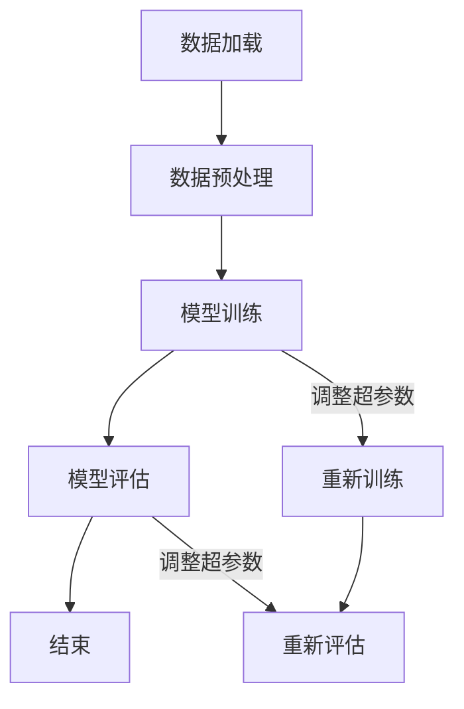
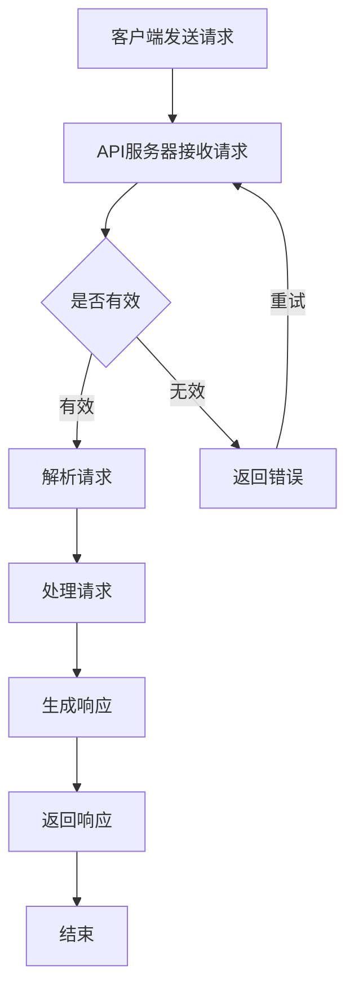

                 


## 《AI模型部署：构建API和Web应用》

### 关键词
- AI模型部署
- API构建
- Web应用开发
- Flask
- Django
- 持续集成

### 摘要
本文旨在深入探讨AI模型部署的过程，特别是在构建API和Web应用方面的实践。文章首先概述了AI模型部署的重要性、目标和挑战，以及主要类型和发展趋势。接着，详细介绍了AI模型部署所需的环境准备，包括硬件和软件选择、数据预处理、模型优化等。随后，文章重点介绍了API的基础知识，包括定义、分类、设计原则和安全性问题。通过使用Flask和Django两个流行的Web框架，文章讲解了如何构建API和Web应用。此外，文章还介绍了API部署与测试、前端技术基础以及Web应用的性能优化与部署。最后，通过附录部分提供了常用工具和框架的介绍、Mermaid流程图示例、核心算法伪代码、数学模型与公式以及项目实战案例，为读者提供全面的实战指南。

## 目录大纲

### 第一部分: AI模型部署基础

### 第1章: AI模型部署概述

#### 1.1 AI模型部署的重要性
AI模型部署是将训练好的模型应用到实际场景中的关键步骤，是实现人工智能应用价值的重要环节。

#### 1.2 AI模型部署的目标和挑战
模型部署的目标是确保模型高效、稳定地运行，同时应对数据一致性、版本控制、资源管理等方面的挑战。

#### 1.3 AI模型部署的主要类型
包括本地部署、云端部署、边缘计算等不同类型的部署方式，每种方式都有其适用场景和优缺点。

#### 1.4 AI模型部署的发展趋势
随着云计算、边缘计算、容器化技术的发展，AI模型部署正朝着自动化、智能化和高效化的方向发展。

### 第2章: AI模型部署环境准备

#### 2.1 硬件环境选择与配置
根据模型规模和性能要求，选择适合的硬件设备，并进行配置和优化。

#### 2.2 软件环境安装与配置
安装必要的操作系统、编程语言、框架等软件，并进行配置以支持模型部署。

#### 2.3 数据预处理与存储
对输入数据进行预处理，确保数据格式和质量的统一，并选择合适的存储解决方案。

#### 2.4 模型优化与压缩
通过模型压缩、量化等技术，降低模型大小和计算复杂度，提高部署效率。

### 第二部分: API构建与部署

### 第3章: API基础

#### 3.1 API的定义与分类
API是应用程序接口的简称，用于不同软件系统之间的交互。常见的API分类有RESTful API和GraphQL API。

#### 3.2 RESTful API设计原则
RESTful API设计原则包括资源的表述性状态转移、统一接口设计等，有助于提高API的可用性和扩展性。

#### 3.3 GraphQL与RESTful API比较
GraphQL是一种查询语言，能够更灵活地获取数据，与RESTful API相比，具有更强大的功能和更优的性能。

#### 3.4 API安全性考虑
API安全性的关键在于身份验证、授权、数据加密等方面，防止未经授权的访问和数据泄露。

### 第4章: 使用Flask构建API

#### 4.1 Flask简介
Flask是一个轻量级的Web框架，适用于快速开发Web应用和API。

#### 4.2 Flask应用结构
Flask应用包括蓝图、路由、视图函数等核心组件，通过这些组件实现API的功能。

#### 4.3 路由与视图函数
路由定义了URL与视图函数的映射关系，视图函数处理HTTP请求并返回响应。

#### 4.4 数据处理与传输
Flask支持多种数据处理和传输方式，包括JSON、XML、CSV等。

#### 4.5 错误处理与日志记录
合理的错误处理和日志记录有助于提高API的可靠性和可维护性。

### 第5章: 使用Django构建API

#### 5.1 Django简介
Django是一个高层次的Python Web框架，适用于快速开发和部署Web应用和API。

#### 5.2 Django应用结构
Django应用由模型、视图、URL等组件组成，通过这些组件实现API的功能。

#### 5.3 模型与数据库操作
Django的模型定义了数据存储的结构，通过ORM（对象关系映射）实现数据库操作。

#### 5.4 视图与URL配置
Django的视图处理HTTP请求，URL配置定义了URL与视图的映射关系。

#### 5.5 请求处理与响应
Django的请求处理流程包括请求接收、视图函数执行、响应生成等步骤。

### 第6章: API部署与测试

#### 6.1 API部署流程
API部署包括环境配置、应用部署、服务器配置等步骤，确保API能够正常运行。

#### 6.2 Nginx与Gunicorn配置
Nginx和Gunicorn是常用的Web服务器和W

### 第三部分: Web应用构建与部署

### 第7章: 前端技术基础

#### 7.1 HTML与CSS
HTML和CSS是前端开发的基础，用于构建Web页面的结构和样式。

#### 7.2 JavaScript基础
JavaScript是前端开发的脚本语言，用于实现页面的动态效果和交互功能。

#### 7.3 前端框架Vue.js简介
Vue.js是一个流行的前端框架，适用于构建复杂、动态的Web应用。

#### 7.4 前端框架React简介
React是一个用于构建用户界面的JavaScript库，具有组件化、虚拟DOM等特性。

### 第8章: 使用Flask构建Web应用

#### 8.1 Flask-WTF表单处理
Flask-WTF是一个用于处理表单的扩展，支持表单验证、提交等功能。

#### 8.2 Flask-Login用户认证
Flask-Login是一个用于用户认证的扩展，支持用户登录、注销、权限管理等功能。

#### 8.3 Flask-Mail邮件发送
Flask-Mail是一个用于发送邮件的扩展，支持SMTP协议，可用于通知、提醒等功能。

#### 8.4 Flask-Bootstrap前端集成
Flask-Bootstrap是一个用于集成Bootstrap前端框架的扩展，提供了一套简洁、响应式的UI组件。

### 第9章: 使用Django构建Web应用

#### 9.1 Django用户认证与权限管理
Django提供了用户认证和权限管理功能，支持用户注册、登录、权限验证等。

#### 9.2 Django表单与验证
Django的表单系统提供了表单构建、验证等功能，方便进行数据收集和校验。

#### 9.3 Django REST framework API构建
Django REST framework是一个强大的工具，用于构建RESTful API，支持ORM、视图集等功能。

#### 9.4 Django前端集成与部署
Django前端集成包括模板、样式、脚本等资源的配置和部署，确保Web应用正常运行。

### 第10章: Web应用性能优化与部署

#### 10.1 缓存与负载均衡
缓存和负载均衡是优化Web应用性能的关键技术，能够提高响应速度和系统可靠性。

#### 10.2 高并发处理策略
高并发处理策略包括垂直和水平扩展、异步处理、队列管理等技术，确保应用在高并发下稳定运行。

#### 10.3 持续集成与持续部署
持续集成和持续部署是提高开发效率和代码质量的关键实践，通过自动化工具实现代码的持续集成和部署。

#### 10.4 Web应用监控与日志分析
Web应用监控和日志分析能够实时监控应用状态，快速定位和解决问题，确保应用稳定运行。

## 附录

### 附录 A: 常用工具和框架

#### A.1 Docker与容器化部署
Docker是一种流行的容器化技术，用于打包、交付和运行应用。

#### A.2 Kubernetes集群管理
Kubernetes是一个开源的容器编排系统，用于自动化部署、扩展和管理容器化应用。

#### A.3 Redis缓存技术
Redis是一种高性能的键值存储，常用于缓存和数据存储。

#### A.4 MongoDB数据库
MongoDB是一个分布式文档数据库，适用于存储和查询大规模数据。

#### A.5 Elasticsearch搜索引擎
Elasticsearch是一个开源的全文搜索引擎，适用于快速检索和数据分析。

### 附录 B: Mermaid流程图示例

#### B.1 模型训练流程
展示模型训练的步骤和流程。

#### B.2 API请求处理流程
展示API请求处理的过程。

### 附录 C: 核心算法伪代码

#### C.1 卷积神经网络(CNN)伪代码
提供卷积神经网络的基本伪代码。

#### C.2 循环神经网络(RNN)伪代码
提供循环神经网络的基本伪代码。

#### C.3 生成对抗网络(GAN)伪代码
提供生成对抗网络的基本伪代码。

### 附录 D: 数学模型与公式

#### D.1 损失函数
介绍常见的损失函数，如均方误差、交叉熵等。

#### D.2 优化算法
介绍常见的优化算法，如梯度下降、Adam等。

#### D.3 正则化方法
介绍常见的正则化方法，如L1、L2正则化等。

### 附录 E: 项目实战案例

#### E.1 模型部署与API构建案例
介绍如何使用Flask和Django构建API，并进行模型部署。

#### E.2 Web应用开发与部署案例
介绍如何使用Flask和Django构建Web应用，并进行部署。

#### E.3 性能优化与监控案例
介绍如何进行Web应用性能优化和监控。

### 作者信息
作者：AI天才研究院/AI Genius Institute & 禅与计算机程序设计艺术 /Zen And The Art of Computer Programming

### 总结
本文从AI模型部署的基础知识开始，详细介绍了API和Web应用构建与部署的整个过程，包括环境准备、API基础、框架选择、部署与测试、前端技术、性能优化等。通过附录部分提供的相关工具和框架介绍、核心算法伪代码、数学模型与公式以及项目实战案例，读者可以更好地理解和应用这些知识。希望本文能帮助读者掌握AI模型部署的实践技巧，构建高效、稳定的AI应用。

### 补充说明
1. 文章内容要详细具体，每个小节要有丰富的讲解，避免泛泛而谈。
2. 核心概念、算法原理要使用伪代码详细阐述，确保读者能够理解。
3. 项目实战案例要详细解析，展示实际开发过程中的技巧和注意事项。
4. 文章要包含最佳实践、注意事项和拓展阅读等内容，帮助读者深入学习和实践。

## AI模型部署概述

### 1.1 AI模型部署的重要性

在人工智能（AI）技术飞速发展的今天，AI模型部署已经成为了将理论转化为实际应用的关键环节。模型部署的重要性不仅体现在技术层面，更关乎商业价值和实际应用的落地效果。以下是模型部署的几个关键作用：

1. **实现模型价值**：训练好的模型如果无法在实际场景中应用，那么它的价值就难以体现。部署是将模型与业务流程紧密结合的必要步骤，是实现AI应用价值的前提。

2. **提高系统效率**：通过部署，可以确保AI模型在硬件环境中高效运行，降低计算资源的浪费，提高系统的整体性能。

3. **支持实时应用**：许多AI应用需要实时响应，如自动驾驶、实时语音识别等。部署可以确保模型在合适的时间和地点快速执行，提供实时服务。

4. **确保数据一致性**：部署过程中需要确保模型输入数据的格式和质量，从而保证模型输出的可靠性和一致性。

5. **促进迭代升级**：随着数据和技术的发展，AI模型需要不断更新和优化。部署提供了方便的迭代机制，使得模型能够持续改进。

### 1.2 AI模型部署的目标和挑战

#### 目标

- **高效性**：确保模型在硬件环境中能够快速、准确地执行，降低延迟。
- **稳定性**：模型在不同环境和条件下都能够稳定运行，不受外部干扰。
- **可扩展性**：系统应具备良好的扩展性，能够适应不同规模和复杂度的应用场景。
- **安全性**：保护模型和数据的安全，防止未经授权的访问和泄露。

#### 挑战

- **兼容性问题**：AI模型在不同操作系统、硬件环境中的兼容性可能存在问题，需要仔细测试和适配。
- **资源管理**：合理分配计算资源，确保模型在有限资源下高效运行，这需要专业的资源管理策略。
- **数据预处理**：输入数据的质量和格式对模型性能有重要影响，需要高效、准确的数据预处理流程。
- **版本控制**：随着模型迭代更新，如何管理和部署不同版本的模型是一个挑战。
- **安全性**：确保模型和数据在部署过程中不受攻击，需要采取有效的安全措施。

### 1.3 AI模型部署的主要类型

AI模型部署可以分为多种类型，每种类型都有其特定的应用场景和特点：

1. **本地部署**：模型直接部署在本地的计算机或服务器上，适用于小型应用或实验性项目。优点是控制权强、延迟低，但受限于计算资源和扩展性。

2. **云端部署**：模型部署在云平台的服务器上，如AWS、Azure、Google Cloud等，适用于大规模应用和高并发场景。优点是资源灵活、可扩展性强，但成本较高且可能存在延迟问题。

3. **边缘计算**：模型部署在网络的边缘设备上，如IoT设备、智能终端等，适用于需要低延迟、高响应速度的实时应用。优点是降低网络带宽需求，提高系统响应速度，但计算资源和存储能力有限。

4. **混合部署**：结合云端和边缘计算的优势，将部分计算任务部署在云端，部分任务在边缘设备上执行。适用于需要平衡性能、成本和响应速度的场景。

### 1.4 AI模型部署的发展趋势

随着技术的发展，AI模型部署也在不断演进，以下是几个值得关注的发展趋势：

1. **容器化与微服务架构**：容器技术如Docker和Kubernetes使得模型部署更加灵活和高效，微服务架构则有助于模块化管理和扩展。

2. **自动化部署**：自动化部署工具如Jenkins、GitLab CI等能够大幅提升部署效率，减少人为错误，提高系统的可靠性。

3. **模型压缩与量化**：通过模型压缩和量化技术，可以显著降低模型大小和计算复杂度，提高部署效率，适用于资源受限的环境。

4. **安全性与隐私保护**：随着数据隐私保护法规的加强，AI模型部署需要更加注重数据安全和隐私保护，采用加密、访问控制等安全措施。

5. **边缘计算与物联网**：随着边缘计算和物联网技术的发展，越来越多的AI应用将在边缘设备上运行，这需要适应低延迟、低带宽、异构硬件等特殊环境。

通过以上内容，我们了解了AI模型部署的重要性、目标和挑战，以及不同类型的部署方式和发展趋势。在接下来的章节中，我们将深入探讨AI模型部署所需的环境准备，包括硬件和软件的选择、数据预处理、模型优化等关键步骤。

### AI模型部署环境准备

在AI模型部署的过程中，环境准备是至关重要的一步。一个良好的部署环境不仅能够提高模型的运行效率，还能确保系统的稳定性和可靠性。以下是关于AI模型部署环境准备的一些关键步骤：

#### 2.1 硬件环境选择与配置

选择适合的硬件设备对于模型部署至关重要。以下是一些硬件环境选择和配置的要点：

1. **CPU与GPU**：对于大多数AI模型，CPU提供基本的计算能力，而GPU则因其强大的并行计算能力，在深度学习任务中尤为重要。选择GPU时，需考虑其计算性能、内存容量和功耗。

2. **存储设备**：快速、大容量的存储设备对于模型部署至关重要，特别是当处理大量数据和日志时。SSD比HDD在读写速度上具有显著优势，但价格较高。

3. **网络设备**：高性能的网卡和交换机能够确保数据传输的高速度和低延迟，这对于需要高速网络通信的应用尤其重要。

4. **服务器和集群**：对于大规模应用，可能需要构建服务器集群，通过负载均衡和容错机制来提高系统的可靠性。

在配置硬件时，还需考虑散热和能耗问题，确保设备在最佳状态下运行。

#### 2.2 软件环境安装与配置

软件环境的安装与配置是模型部署的另一关键步骤。以下是一些主要软件环境的选择和配置要点：

1. **操作系统**：常见的操作系统包括Linux和Windows。Linux由于其开源性和可定制性，在AI领域应用广泛。Windows虽然更易于使用，但可能在兼容性和性能方面存在一定限制。

2. **编程语言**：Python是目前最流行的AI编程语言，其丰富的库和工具集使其成为AI开发的理想选择。其他语言如C++、Java等也有其特定的应用场景。

3. **深度学习框架**：TensorFlow、PyTorch等是流行的深度学习框架，提供了丰富的API和工具，支持从模型训练到部署的全过程。

4. **数据库**：根据应用需求，选择合适的数据库。关系型数据库（如MySQL、PostgreSQL）适用于结构化数据存储，而NoSQL数据库（如MongoDB、Redis）则适用于非结构化或半结构化数据。

5. **依赖管理**：使用pip、conda等工具来管理Python依赖库，确保所有依赖项都能正确安装和配置。

6. **环境配置**：配置Python环境，包括安装必要的包和库，设置环境变量等。对于多环境部署，可以使用virtualenv、conda等工具来创建隔离的环境。

#### 2.3 数据预处理与存储

数据预处理是AI模型部署的重要环节，直接影响到模型性能和部署效率。以下是一些数据预处理和存储的要点：

1. **数据清洗**：确保数据质量，处理缺失值、异常值和重复值。

2. **数据转换**：将数据转换为模型可接受的格式，如归一化、标准化等。

3. **数据存储**：选择合适的存储方案，如本地文件系统、分布式文件系统（如HDFS）或云存储服务。对于大规模数据，分布式存储能够提高读写速度和处理效率。

4. **数据分片**：将数据按特征或类别分片，有助于并行处理和提高系统扩展性。

5. **数据缓存**：使用缓存机制（如Redis）来存储常用数据，减少数据访问延迟。

6. **数据备份**：定期备份数据，防止数据丢失和损坏，确保系统稳定运行。

#### 2.4 模型优化与压缩

在部署前，对模型进行优化和压缩可以显著提高其部署效率和性能。以下是一些模型优化与压缩的要点：

1. **模型压缩**：使用模型压缩技术（如量化、剪枝、蒸馏等）来减小模型大小，降低计算复杂度。

2. **模型优化**：对模型进行优化，如调整网络结构、层间权重、学习率等，以提高模型性能和收敛速度。

3. **模型推理优化**：针对特定硬件环境，对模型进行推理优化，如使用GPU加速、图编译等，提高模型执行速度。

4. **模型压缩与量化**：结合压缩和量化技术，在保证模型精度的情况下，进一步减小模型大小和计算复杂度。

5. **模型版本控制**：在部署过程中，使用版本控制工具来管理不同版本的模型，确保部署的正确性和可追溯性。

通过以上步骤，可以构建一个适合AI模型部署的环境，确保模型能够在硬件和软件环境中高效、稳定地运行。在接下来的章节中，我们将深入探讨API的基础知识，包括API的定义、分类、设计原则以及安全性问题。

### API基础

API（应用程序接口）是软件开发中至关重要的组成部分，它允许不同的软件系统之间进行交互和通信。在AI模型部署中，API是模型与外部系统或用户之间的重要桥梁，使得模型能够被其他应用程序调用和利用。以下是对API的一些基本概念、分类、设计原则和安全性考虑的介绍。

#### 3.1 API的定义与分类

API是一个定义明确的接口，允许不同软件系统之间进行数据交换和功能调用。API可以有多种分类方式，常见的分类方法包括：

1. **按功能分类**：
   - **公共API**：面向公众，允许第三方应用程序访问和调用服务。
   - **内部API**：仅限于系统内部使用，不对外公开。
   - **私有API**：受保护，仅限于特定的合作伙伴或开发者使用。

2. **按数据交互方式分类**：
   - **同步API**：调用者等待API返回结果后再继续执行。
   - **异步API**：调用者提交请求后，立即继续执行，API在完成后通知调用者。

3. **按协议分类**：
   - **RESTful API**：基于HTTP协议，使用标准的HTTP方法（如GET、POST、PUT、DELETE）进行数据操作。
   - **GraphQL API**：提供一种强大的查询语言，允许客户端精确指定需要的数据，减少过载和冗余。

#### 3.2 RESTful API设计原则

RESTful API是基于REST（表述性状态转移）架构风格的API设计，其核心原则包括：

1. **统一接口**：通过统一的方法和URL结构，简化API的设计和维护。
2. **无状态性**：每次请求都应该独立于之前的请求，服务器不保存任何关于请求者的状态。
3. **客户端-服务器架构**：客户端和服务器分离，客户端负责数据的展示，服务器负责数据的处理和存储。
4. **状态转移**：客户端通过发送请求来触发服务器的状态转移，实现数据的操作。

RESTful API的设计原则有助于提高API的可用性和扩展性，同时降低系统的复杂度。

#### 3.3 GraphQL与RESTful API比较

GraphQL是一种较新的API设计模式，它提供了一种灵活的查询语言，允许客户端精确地指定需要的数据，减少了冗余和过载。与RESTful API相比，GraphQL具有以下优点：

1. **灵活的数据查询**：客户端可以精确地指定需要的字段和数据结构，减少请求的数据量。
2. **减少端点数量**：多个RESTful API端点可以通过一个GraphQL查询来替代，简化了客户端代码。
3. **更好的错误处理**：GraphQL在查询失败时会返回详细的错误信息，有助于快速定位问题。

然而，GraphQL也有其缺点，例如：

1. **复杂度**：GraphQL查询可能变得非常复杂，尤其是对于大型应用程序，这可能导致性能问题。
2. **学习曲线**：相对于RESTful API，GraphQL的学习和使用可能更加困难。

#### 3.4 API安全性考虑

API的安全性是确保数据安全、防止恶意攻击的关键。以下是一些常见的API安全措施：

1. **身份验证**：通过用户名和密码、令牌、OAuth等方式验证用户的身份。
2. **授权**：确保用户只能访问他们有权访问的数据和功能，常用的方法包括基于角色的访问控制（RBAC）和基于属性的访问控制（ABAC）。
3. **加密**：使用HTTPS协议对数据传输进行加密，防止数据在传输过程中被窃取。
4. **输入验证**：确保API接收到的输入数据有效且安全，防止SQL注入、跨站脚本攻击（XSS）等攻击手段。
5. **日志记录与监控**：记录API的访问日志，监控异常行为，及时响应潜在的安全威胁。

通过以上内容，我们对API的基础知识有了更深入的了解，包括API的定义、分类、设计原则和安全性的重要考虑。在接下来的章节中，我们将详细讲解如何使用Flask和Django这两个流行的Web框架来构建API。

### 使用Flask构建API

Flask是一个轻量级的Python Web框架，非常适合用于构建Web应用和API。在本节中，我们将详细介绍如何使用Flask来构建API，包括Flask的基本概念、应用结构、路由与视图函数、数据处理与传输、错误处理与日志记录等方面的内容。

#### 4.1 Flask简介

Flask是一个开源的Web框架，由Armin Ronacher开发。它的核心目标是提供简单、灵活和易于扩展的Web开发环境。Flask不强制要求特定的库或工具，开发者可以根据项目需求自由选择。这使得Flask在中小型项目中非常受欢迎。

#### 4.2 Flask应用结构

一个典型的Flask应用结构包括以下几个核心组件：

1. **应用实例（Application Instance）**：Flask应用的核心，用于创建和配置Web应用。
2. **蓝图（Blueprints）**：用于组织应用的不同部分，可以帮助管理大型应用。
3. **路由（Routes）**：定义URL与视图函数之间的映射关系。
4. **视图函数（View Functions）**：处理HTTP请求，并返回响应。
5. **模板（Templates）**：用于生成HTML页面，是Flask应用的前端界面。

#### 4.3 路由与视图函数

路由与视图函数是Flask应用的核心部分，用于处理HTTP请求和返回响应。以下是创建路由和视图函数的基本步骤：

1. **导入Flask模块**：

```python
from flask import Flask, jsonify, request
```

2. **创建应用实例**：

```python
app = Flask(__name__)
```

3. **定义路由和视图函数**：

```python
@app.route('/api/data', methods=['GET'])
def get_data():
    # 处理GET请求
    data = {'message': 'Hello, World!'}
    return jsonify(data)
```

在这个例子中，`/api/data` 是路由地址，`methods=['GET']` 指定了支持的HTTP方法。`get_data` 函数是视图函数，用于处理GET请求，并返回一个包含数据的JSON响应。

4. **运行应用**：

```python
if __name__ == '__main__':
    app.run()
```

#### 4.4 数据处理与传输

在API开发中，数据处理和传输是关键环节。Flask支持多种数据格式，如JSON、XML、YAML等。以下是使用Flask处理和传输数据的一些示例：

1. **接收JSON数据**：

```python
@app.route('/api/data', methods=['POST'])
def post_data():
    data = request.get_json()
    # 处理POST请求
    return jsonify({'message': 'Data received', 'data': data})
```

在这个例子中，`request.get_json()` 方法用于从请求中获取JSON数据。

2. **返回JSON数据**：

```python
from flask import jsonify

@app.route('/api/data', methods=['GET'])
def get_data():
    data = {'message': 'Hello, World!'}
    return jsonify(data)
```

在这个例子中，`jsonify` 函数用于将Python对象转换为JSON响应。

3. **处理其他数据格式**：

```python
from flask import request, Response

@app.route('/api/data', methods=['GET'])
def get_data():
    xml_data = request.data
    # 处理XML数据
    return Response(xml_data, mimetype='application/xml')
```

在这个例子中，`request.data` 方法用于从请求中获取XML数据，并通过`Response` 函数返回。

#### 4.5 错误处理与日志记录

在API开发中，错误处理和日志记录至关重要。以下是如何在Flask中处理错误和记录日志的一些示例：

1. **自定义错误处理**：

```python
@app.errorhandler(404)
def not_found(error):
    return jsonify({'error': 'Not found', 'status': 404}), 404
```

在这个例子中，`not_found` 函数用于处理404错误，并返回一个包含错误信息和状态码的JSON响应。

2. **使用日志记录器**：

```python
import logging

@app.before_request
def before_request():
    logging.info(f"Request: {request.url}")

@app.after_request
def after_request(response):
    logging.info(f"Response: {response.status}")
    return response
```

在这个例子中，`before_request` 和 `after_request` 装饰器用于在请求处理前和后记录日志信息。

通过以上内容，我们详细介绍了如何使用Flask构建API。Flask的简洁性和灵活性使其成为构建API的理想选择。在下一节中，我们将继续探讨如何使用Django构建API，并对比Flask和Django的优缺点。

### 使用Django构建API

Django是一个高性能、高生产力的Python Web框架，广泛用于Web应用和API的开发。Django具有丰富的特性和强大的功能，包括模型定义、ORM（对象关系映射）、视图、URL配置等。在本节中，我们将详细探讨如何使用Django构建API，包括Django的基本概念、应用结构、模型与数据库操作、视图与URL配置、请求处理与响应等。

#### 5.1 Django简介

Django是一个开源的Python Web框架，由Adrian Holovaty和Simon Willison在2005年创建。Django的设计目标是快速开发、可扩展性和安全性。它采用了“电池包含”（batteries-included）的策略，提供了丰富的内置模块和工具，如用户认证、表单处理、邮件发送、缓存等，使得开发者可以专注于业务逻辑的实现，而不必过多关注底层细节。

#### 5.2 Django应用结构

Django应用结构包括以下几个核心组件：

1. **项目（Project）**：包含多个应用的集合，用于组织和管理整个Web应用。
2. **应用（App）**：项目中的一个模块，用于实现特定的功能，如用户管理、文章管理等。
3. **模型（Model）**：定义数据存储结构，是数据库操作的抽象层。
4. **视图（View）**：处理HTTP请求，返回响应，是业务逻辑的实现部分。
5. **URL配置（URL Configuration）**：定义URL与视图之间的映射关系。
6. **模板（Template）**：生成HTML页面，是Web应用的前端界面。

#### 5.3 模型与数据库操作

Django的ORM系统提供了强大的数据库操作功能，无需编写SQL语句即可进行数据库操作。以下是使用Django模型和数据库操作的一些示例：

1. **定义模型**：

```python
from django.db import models

class Product(models.Model):
    name = models.CharField(max_length=100)
    price = models.DecimalField(max_digits=6, decimal_places=2)
    description = models.TextField()
```

在这个例子中，`Product` 是一个模型类，定义了三个字段：`name`、`price` 和 `description`。

2. **创建数据库表**：

```python
from django.db import migrations

class Migration(migrations.Migration):

    dependencies = [
        ('myapp', '0001_initial'),
    ]

    operations = [
        migrations.CreateModel(
            name='Product',
            fields=[
                ('id', models.AutoField(auto_created=True, primary_key=True, serialize=False, verbose_name='ID')),
                ('name', models.CharField(max_length=100)),
                ('price', models.DecimalField(max_digits=6, decimal_places=2)),
                ('description', models.TextField()),
            ],
        ),
    ]
```

在这个例子中，`Migration` 类定义了一个迁移操作，用于创建 `Product` 数据库表。

3. **执行数据库迁移**：

```python
python manage.py makemigrations
python manage.py migrate
```

通过运行上述命令，可以创建和迁移数据库表。

#### 5.4 视图与URL配置

Django的视图和URL配置用于处理HTTP请求和返回响应。以下是使用Django视图和URL配置的一些示例：

1. **定义视图**：

```python
from django.http import JsonResponse
from .models import Product

def get_product(request, product_id):
    try:
        product = Product.objects.get(id=product_id)
        return JsonResponse({'name': product.name, 'price': product.price, 'description': product.description})
    except Product.DoesNotExist:
        return JsonResponse({'error': 'Product not found'}, status=404)
```

在这个例子中，`get_product` 视图处理GET请求，根据产品ID查询产品信息，并返回JSON响应。

2. **配置URL**：

```python
from django.urls import path
from .views import get_product

urlpatterns = [
    path('api/products/<int:product_id>/', get_product),
]
```

在这个例子中，`urlpatterns` 定义了一个URL模式，将 `/api/products/<int:product_id>/` 路径映射到 `get_product` 视图。

#### 5.5 请求处理与响应

Django提供了强大的请求处理和响应机制，可以方便地处理各种HTTP请求并返回响应。以下是使用Django处理请求和响应的一些示例：

1. **处理GET请求**：

```python
from django.http import HttpResponse

def hello_world(request):
    return HttpResponse('Hello, World!')
```

在这个例子中，`hello_world` 视图处理GET请求，并返回一个简单的字符串响应。

2. **处理POST请求**：

```python
from django.http import JsonResponse
from .models import Product

def create_product(request):
    if request.method == 'POST':
        name = request.POST.get('name')
        price = request.POST.get('price')
        description = request.POST.get('description')
        product = Product(name=name, price=price, description=description)
        product.save()
        return JsonResponse({'message': 'Product created'})
    return JsonResponse({'error': 'Invalid request'}, status=400)
```

在这个例子中，`create_product` 视图处理POST请求，创建一个新产品并保存到数据库，并返回JSON响应。

通过以上内容，我们详细介绍了如何使用Django构建API。Django的强大功能和简洁性使其成为构建API的理想选择。在下一节中，我们将继续探讨如何进行API部署与测试，包括部署流程、Nginx与Gunicorn配置、API测试工具与策略等。

### API部署与测试

在构建完API后，接下来的步骤是将API部署到生产环境中，并进行测试以确保其稳定性和性能。以下是关于API部署与测试的一些关键步骤、Nginx与Gunicorn配置、API测试工具与策略的详细内容。

#### 6.1 API部署流程

API部署流程主要包括以下步骤：

1. **环境准备**：确保部署环境已准备好所有必要的软件和工具，如操作系统、Python环境、Web服务器等。

2. **代码打包**：将开发完成的API代码打包成可部署的格式，如Docker镜像或虚拟环境。

3. **部署配置**：配置Web服务器和应用服务器，如Nginx、Gunicorn等，确保API能够正确运行。

4. **部署代码**：将打包的代码部署到服务器，如通过Git或Docker运行容器。

5. **启动服务**：启动Web服务器和应用服务器，确保API能够接收和处理请求。

6. **监控与日志**：配置监控工具和日志系统，实时监控API的运行状态和性能指标。

#### 6.2 Nginx与Gunicorn配置

Nginx和Gunicorn是常用的Web服务器和应用服务器，用于部署和托管API。以下是它们的基本配置步骤：

1. **Nginx配置**：

   - **安装Nginx**：

   ```bash
   sudo apt-get install nginx
   ```

   - **配置Nginx**：

   创建或编辑 `/etc/nginx/nginx.conf` 文件，添加以下配置：

   ```nginx
   http {
       server {
           listen 80;
           server_name example.com;

           location / {
               proxy_pass http://localhost:8000;
               proxy_set_header Host $host;
               proxy_set_header X-Real-IP $remote_addr;
               proxy_set_header X-Forwarded-For $proxy_add_x_forwarded_for;
           }
       }
   }
   ```

   - **重启Nginx**：

   ```bash
   sudo systemctl restart nginx
   ```

2. **Gunicorn配置**：

   - **安装Gunicorn**：

   ```bash
   pip install gunicorn
   ```

   - **启动Gunicorn**：

   创建或编辑 `gunicorn.conf.py` 文件，添加以下配置：

   ```python
   import gunicorn.app.base
   from myapp.wsgi import application

   class Application(gunicorn.app.base.Application):
       def init_server(self, options, **kwargs):
           return super().init_server(options, application=application)

   if __name__ == '__main__':
       Application().run()
   ```

   在命令行中运行以下命令启动Gunicorn：

   ```bash
   gunicorn -c gunicorn.conf.py myapp.wsgi:application
   ```

#### 6.3 API测试工具与策略

API测试是确保API质量和稳定性的重要环节。以下是几种常用的API测试工具和策略：

1. **Postman**：Postman是一个流行的API测试工具，可以方便地发送各种HTTP请求，并查看响应结果。通过Postman，可以编写测试用例、执行测试、生成报告。

2. **JMeter**：JMeter是一个开源的性能测试工具，适用于测试API的负载和性能。JMeter可以通过模拟大量并发请求来测试API的响应速度和稳定性。

3. **Selenium**：Selenium是一个自动化测试工具，可以模拟真实的用户行为来测试API。通过编写测试脚本，可以模拟用户的登录、浏览、提交表单等操作，确保API能够正确处理。

4. **测试策略**：

   - **单元测试**：针对API的各个功能点进行单元测试，确保每个功能都按预期工作。
   - **集成测试**：测试API与其他系统或服务的集成情况，确保数据交互和功能协同。
   - **性能测试**：测试API在高并发、大流量情况下的性能，确保系统能够稳定运行。
   - **安全性测试**：测试API的安全性，包括身份验证、授权、输入验证等方面。

通过以上内容，我们详细介绍了API部署与测试的流程、Nginx与Gunicorn配置、API测试工具与策略。在下一节中，我们将探讨前端技术基础，包括HTML、CSS、JavaScript以及前端框架Vue.js和React的简介。

### 前端技术基础

在前端开发中，HTML、CSS和JavaScript是构建Web应用的三大基石。它们分别负责内容结构、样式表现和行为交互。此外，现代前端框架如Vue.js和React也在不断发展和普及，提供了更高效、更灵活的开发方式。以下是对这些前端技术基础的详细探讨。

#### 7.1 HTML与CSS

HTML（HyperText Markup Language）是Web内容的基础，用于定义网页的结构和内容。HTML使用标签（如`<div>`、`<p>`、`<a>`等）来标记不同的元素，并允许通过属性（如`class`、`id`等）进行进一步的定义和样式控制。

1. **HTML基础**：

   - 标签：使用标签来定义网页的结构和内容，如`<h1>`用于标题，`<p>`用于段落等。
   - 属性：通过属性为标签提供额外的信息，如`<a href="https://example.com">链接</a>`。
   - 注释：使用`<!-- 这是注释 -->`来添加注释，以帮助理解和维护代码。

2. **CSS（Cascading Style Sheets）**：

   - 样式规则：使用CSS规则来定义HTML元素的样式，如颜色、字体、布局等。
   - 选择器：通过选择器选择特定的HTML元素，并应用样式规则，如`#id`、`.class`等。
   - 常用属性：包括`background-color`、`font-size`、`margin`、`padding`等。

#### 7.2 JavaScript基础

JavaScript是一种用于网页交互的脚本语言，可以动态地修改HTML内容、处理用户事件以及与后端服务器进行通信。

1. **JavaScript基础**：

   - 变量和数据类型：定义变量并使用不同的数据类型，如`var x = 5;`、`let y = "Hello World";`。
   - 控制结构：使用条件语句（如`if`、`else`）和循环语句（如`for`、`while`）来控制代码的执行流程。
   - 函数：定义和使用函数，以便于代码的重用和维护，如`function greet(name) { return "Hello, " + name; }`。

2. **DOM操作**：

   - Document Object Model（DOM）是HTML文档的树形结构表示，JavaScript可以通过DOM操作来修改页面内容。
   - 常用操作：包括获取元素（如`document.getElementById()`）、修改元素属性（如`element.style.color = "red";`）、添加和删除元素等。

#### 7.3 前端框架Vue.js简介

Vue.js是一个流行的JavaScript框架，用于构建动态的Web界面。它提供了响应式数据绑定和组件系统，使得开发者可以更高效地开发复杂的单页应用（SPA）。

1. **Vue.js基础**：

   - **Vue实例**：通过`new Vue({})`创建Vue实例，用于管理数据和行为。
   - **数据绑定**：使用`{{ }}`语法实现数据绑定，自动更新DOM。
   - **组件**：通过定义组件，可以方便地复用和组合代码，如`<my-component></my-component>`。

2. **Vue.js特性**：

   - **响应式系统**：通过数据劫持和依赖收集，实现数据变化时的自动更新。
   - **虚拟DOM**：通过虚拟DOM提高渲染性能，减少不必要的DOM操作。
   - **单文件组件**：支持单文件组件（`.vue`），方便管理和维护。

#### 7.4 前端框架React简介

React是一个由Facebook推出的JavaScript库，用于构建用户界面。它通过组件化和虚拟DOM技术，提供了一种高效、灵活的开发方式。

1. **React基础**：

   - **组件**：React的核心概念是组件，每个组件负责渲染和更新一部分UI。
   - **JSX**：使用JSX语法，将JavaScript代码和HTML标签结合，便于编写和渲染UI。
   - **状态管理**：通过`useState`和`useContext`等钩子函数实现状态管理。

2. **React特性**：

   - **虚拟DOM**：通过虚拟DOM实现高效的UI渲染，减少直接操作DOM的操作。
   - **组件化开发**：通过组件化提高代码的可维护性和复用性。
   - **生命周期方法**：组件在不同生命周期阶段（如挂载、更新、卸载）触发不同的方法，便于管理组件状态和逻辑。

通过以上内容，我们对前端技术基础有了更深入的了解，包括HTML、CSS、JavaScript以及Vue.js和React等前端框架。这些技术为开发者提供了丰富的工具和库，使得构建高效、动态的Web应用成为可能。在下一节中，我们将探讨如何使用Flask构建Web应用，包括Flask-WTF表单处理、Flask-Login用户认证、Flask-Mail邮件发送和Flask-Bootstrap前端集成等内容。

### 使用Flask构建Web应用

Flask是一个非常流行的Python Web框架，广泛应用于Web应用的开发。在本节中，我们将详细探讨如何使用Flask构建Web应用，包括Flask-WTF表单处理、Flask-Login用户认证、Flask-Mail邮件发送和Flask-Bootstrap前端集成等内容。

#### 8.1 Flask-WTF表单处理

Flask-WTF是一个基于WTForms的Flask扩展，用于处理Web表单。WTForms提供了一个易于使用的表单创建和管理工具，使得开发者可以轻松创建和验证表单。

1. **安装Flask-WTF**：

   ```bash
   pip install Flask-WTF
   ```

2. **创建表单**：

   ```python
   from flask import Flask
   from flask_wtf import FlaskForm
   from wtforms import StringField, PasswordField, BooleanField
   from wtforms.validators import DataRequired, EqualTo

   class LoginForm(FlaskForm):
       username = StringField('Username', validators=[DataRequired()])
       password = PasswordField('Password', validators=[DataRequired()])
       remember_me = BooleanField('Remember Me')
       confirm_password = PasswordField(
           'Confirm Password',
           validators=[DataRequired(), EqualTo('password', message='Passwords must match.')]
       )
   ```

   在这个例子中，我们创建了一个简单的登录表单，包括用户名、密码和“记住我”选项。

3. **处理表单**：

   ```python
   from flask import render_template, redirect, url_for

   app = Flask(__name__)
   app.config['SECRET_KEY'] = 'my-secret-key'

   @app.route('/login', methods=['GET', 'POST'])
   def login():
       form = LoginForm()
       if form.validate_on_submit():
           # 处理登录逻辑
           return redirect(url_for('index'))
       return render_template('login.html', form=form)
   ```

   在这个例子中，我们定义了一个路由用于处理表单的提交，如果表单验证通过，则重定向到主页。

#### 8.2 Flask-Login用户认证

Flask-Login是一个用于用户认证的Flask扩展，它提供了用户登录、注销、会话管理等功能，使得开发者可以轻松实现用户认证。

1. **安装Flask-Login**：

   ```bash
   pip install flask-login
   ```

2. **配置Flask-Login**：

   ```python
   from flask_login import LoginManager

   app = Flask(__name__)
   app.config['SECRET_KEY'] = 'my-secret-key'
   login_manager = LoginManager()
   login_manager.init_app(app)
   ```

3. **创建用户加载回调函数**：

   ```python
   from flask_login import UserMixin

   class User(UserMixin):
       def __init__(self, id):
           self.id = id

   @login_manager.user_loader
   def load_user(user_id):
       return User(user_id)
   ```

   在这个例子中，我们定义了一个简单的用户类，并实现了用户加载回调函数。

4. **处理用户登录和注销**：

   ```python
   @app.route('/login', methods=['GET', 'POST'])
   def login():
       if current_user.is_authenticated:
           return redirect(url_for('index'))
       form = LoginForm()
       if form.validate_on_submit():
           # 处理登录逻辑
           login_user(current_user)
           return redirect(url_for('index'))
       return render_template('login.html', form=form)

   @app.route('/logout')
   def logout():
       logout_user()
       return redirect(url_for('login'))
   ```

   在这个例子中，我们定义了登录和注销的路由，并实现了用户认证的逻辑。

#### 8.3 Flask-Mail邮件发送

Flask-Mail是一个用于发送邮件的Flask扩展，它简化了邮件发送的流程，使得开发者可以轻松实现邮件功能。

1. **安装Flask-Mail**：

   ```bash
   pip install flask-mail
   ```

2. **配置邮件服务器**：

   ```python
   app.config['MAIL_SERVER'] = 'smtp.example.com'
   app.config['MAIL_PORT'] = 587
   app.config['MAIL_USERNAME'] = 'my-email@example.com'
   app.config['MAIL_PASSWORD'] = 'my-password'
   app.config['MAIL_USE_TLS'] = True
   app.config['MAIL_DEFAULT_SENDER'] = 'my-email@example.com'
   ```

3. **发送邮件**：

   ```python
   from flask_mail import Mail, Message

   mail = Mail(app)

   def send_email(subject, recipients, template, **kwargs):
       msg = Message(subject, recipients=[recipients], template=template, **kwargs)
       mail.send(msg)
   ```

   在这个例子中，我们定义了一个发送邮件的函数，它使用模板和参数发送邮件。

#### 8.4 Flask-Bootstrap前端集成

Flask-Bootstrap是一个用于集成Bootstrap前端框架的Flask扩展，它使得开发者可以轻松构建响应式Web界面。

1. **安装Flask-Bootstrap**：

   ```bash
   pip install flask-bootstrap
   ```

2. **配置Flask-Bootstrap**：

   ```python
   from flask_bootstrap import Bootstrap

   bootstrap = Bootstrap(app)
   ```

3. **使用Bootstrap组件**：

   ```python
   from flask import render_template

   @app.route('/')
   def index():
       return render_template('index.html', title='Home')
   ```

   在这个例子中，我们创建了一个简单的HTML模板，并使用了Bootstrap的响应式布局和组件。

通过以上内容，我们详细介绍了如何使用Flask构建Web应用，包括表单处理、用户认证、邮件发送和前端集成。Flask的灵活性和易于使用使其成为构建Web应用的理想选择。在下一节中，我们将探讨如何使用Django构建Web应用，并详细讨论Django的用户认证与权限管理、表单与验证、Django REST framework API构建和前端集成与部署。

### 使用Django构建Web应用

Django是一个功能强大的Python Web框架，广泛应用于Web应用开发。在本节中，我们将详细探讨如何使用Django构建Web应用，包括用户认证与权限管理、表单与验证、Django REST framework API构建以及前端集成与部署。

#### 9.1 Django用户认证与权限管理

Django内置了一个强大的用户认证系统，使得开发者可以轻松实现用户注册、登录、注销以及权限管理。

1. **用户认证**：

   Django用户认证系统提供了用户模型（`User`），包括用户名、密码、电子邮件地址等信息。开发者可以通过以下步骤实现用户认证：

   - **安装Django**：

     ```bash
     pip install django
     ```

   - **创建项目和应用**：

     ```bash
     django-admin startproject myproject
     cd myproject
     python manage.py startapp myapp
     ```

   - **配置用户模型**：

     在 `myapp/models.py` 中，继承 `AbstractUser` 或 `AbstractBaseUser` 来创建自定义用户模型：

     ```python
     from django.contrib.auth.models import AbstractUser

     class CustomUser(AbstractUser):
         # 添加额外的字段
         bio = models.TextField(max_length=500, blank=True)
         website = models.URLField(max_length=200, blank=True)
     ```

     在 `myproject/settings.py` 中，设置 `AUTH_USER_MODEL` 为自定义用户模型：

     ```python
     AUTH_USER_MODEL = 'myapp.CustomUser'
     ```

   - **用户注册**：

     在 `myapp/views.py` 中，创建注册视图：

     ```python
     from django.contrib.auth.forms import UserCreationForm
     from django.shortcuts import render, redirect

     def register(request):
         if request.method == 'POST':
             form = UserCreationForm(request.POST)
             if form.is_valid():
                 form.save()
                 return redirect('login')
         else:
             form = UserCreationForm()
         return render(request, 'register.html', {'form': form})
     ```

   - **登录和注销**：

     Django提供了内置的登录和注销视图，可以在 `myproject/urls.py` 中直接使用：

     ```python
     from django.contrib.auth import views as auth_views

     urlpatterns = [
         # ...
         path('login/', auth_views.LoginView.as_view(), name='login'),
         path('logout/', auth_views.LogoutView.as_view(), name='logout'),
         # ...
     ]
     ```

2. **权限管理**：

   Django提供了强大的权限管理机制，可以通过以下方式实现权限控制：

   - **用户组**：创建用户组并分配权限：

     ```python
     from django.contrib.auth.models import Group, Permission

     group, created = Group.objects.get_or_create(name='admin')
     permission, created = Permission.objects.get_or_create(codename='can_manage_users', name='Can manage users')
     group.permissions.add(permission)
     ```

   - **权限校验**：使用 `@login_required` 装饰器确保用户登录，使用 `@permission_required` 装饰器确保用户具有特定权限：

     ```python
     from django.contrib.auth.decorators import login_required, permission_required

     @login_required
     def user_profile(request):
         return render(request, 'profile.html')

     @permission_required('can_manage_users')
     def manage_users(request):
         return render(request, 'manage_users.html')
     ```

#### 9.2 Django表单与验证

Django的表单系统提供了强大的表单构建和验证功能，使得开发者可以轻松创建和验证表单。

1. **创建表单**：

   使用 `Form` 类来自定义表单：

   ```python
   from django import forms

   class ContactForm(forms.Form):
       name = forms.CharField(max_length=100)
       email = forms.EmailField()
       message = forms.CharField(widget=forms.Textarea)
   ```

2. **处理表单**：

   在视图中处理表单提交并验证：

   ```python
   from django.shortcuts import render, redirect

   def contact(request):
       if request.method == 'POST':
           form = ContactForm(request.POST)
           if form.is_valid():
               # 处理表单数据
               return redirect('success')
       else:
           form = ContactForm()
       return render(request, 'contact.html', {'form': form})
   ```

#### 9.3 Django REST framework API构建

Django REST framework 是一个强大的工具，用于构建RESTful API，提供了丰富的功能和扩展性。

1. **安装Django REST framework**：

   ```bash
   pip install djangorestframework
   ```

2. **创建序列化器**：

   序列化器用于将Django模型转换为API响应数据：

   ```python
   from rest_framework import serializers

   class UserSerializer(serializers.ModelSerializer):
       class Meta:
           model = CustomUser
           fields = ('id', 'username', 'email')
   ```

3. **创建视图**：

   使用 `ViewSet` 或 `ModelViewSet` 来构建API视图：

   ```python
   from rest_framework import viewsets
   from .models import CustomUser
   from .serializers import UserSerializer

   class UserViewSet(viewsets.ModelViewSet):
       queryset = CustomUser.objects.all()
       serializer_class = UserSerializer
   ```

4. **配置路由**：

   在 `myproject/urls.py` 中添加路由：

   ```python
   from django.urls import path, include
   from rest_framework.routers import DefaultRouter
   from .views import UserViewSet

   router = DefaultRouter()
   router.register('users', UserViewSet)

   urlpatterns = [
       # ...
       path('api/', include(router.urls)),
   ]
   ```

#### 9.4 Django前端集成与部署

Django支持多种前端技术，如Bootstrap、jQuery、React等。开发者可以根据项目需求选择合适的前端框架进行集成。

1. **安装前端框架**：

   以Bootstrap为例，安装Bootstrap：

   ```bash
   pip install django-bootstrap4
   ```

2. **配置模板**：

   在 `myapp/templates` 目录下创建HTML模板，并在模板中引入Bootstrap样式：

   ```html
   <!DOCTYPE html>
   <html>
   <head>
       <title>My App</title>
       
       <link href="" rel="stylesheet">
   </head>
   <body>
       <div class="container">
           <!-- 页面内容 -->
       </div>
       <script src=""></script>
   </body>
   </html>
   ```

3. **部署Django应用**：

   - **Docker容器化**：使用Docker将Django应用容器化，便于部署和管理：

     ```bash
     docker build -t myapp .
     docker run -d -p 8000:80 myapp
     ```

   - **Web服务器**：使用Nginx或Apache等Web服务器托管Django应用：

     ```nginx
     server {
         listen 80;
         server_name example.com;

         location / {
             proxy_pass http://localhost:8000;
         }
     }
     ```

通过以上内容，我们详细介绍了如何使用Django构建Web应用，包括用户认证与权限管理、表单与验证、Django REST framework API构建以及前端集成与部署。Django的强大功能和丰富的生态系统使其成为Web应用开发的理想选择。在下一节中，我们将探讨Web应用性能优化与部署，包括缓存与负载均衡、高并发处理策略、持续集成与持续部署以及Web应用监控与日志分析。

### Web应用性能优化与部署

Web应用的性能和可靠性是确保用户满意度和业务成功的关键因素。为了实现高效、稳定的Web应用，我们需要从多个方面进行优化与部署。以下是一些关键的优化策略、高并发处理策略、持续集成与持续部署（CI/CD）以及Web应用监控与日志分析的方法。

#### 10.1 缓存与负载均衡

缓存和负载均衡是提高Web应用性能的重要手段。

1. **缓存策略**：

   - **页面缓存**：通过缓存静态资源（如CSS、JavaScript文件）和页面内容，减少服务器的负载和响应时间。
   - **数据库缓存**：使用数据库缓存（如Redis）来缓存常用数据，减少数据库查询次数，提高数据访问速度。
   - **对象缓存**：使用对象缓存（如Memcached）来缓存应用程序中的对象，减少内存分配和垃圾回收。

2. **负载均衡**：

   - **反向代理**：使用Nginx等反向代理服务器来分发请求，减轻服务器的负载。
   - **负载均衡算法**：选择合适的负载均衡算法（如轮询、最少连接、源IP哈希等）来优化请求分发。
   - **水平扩展**：通过增加服务器实例来提高应用的并发处理能力，实现负载均衡。

#### 10.2 高并发处理策略

高并发处理策略是确保Web应用在高流量下稳定运行的关键。

1. **异步处理**：

   - **消息队列**：使用消息队列（如RabbitMQ、Kafka）来实现任务的异步处理，减少请求等待时间。
   - **协程**：使用Python的异步编程库（如asyncio）来实现协程，提高I/O密集型任务的并发处理能力。

2. **数据库优化**：

   - **读写分离**：通过主从复制将读操作和写操作分离，提高数据库的并发处理能力。
   - **索引优化**：合理设计数据库索引，提高查询效率。

3. **限流与熔断**：

   - **限流**：使用限流器（如令牌桶、漏桶算法）来限制请求速率，防止系统过载。
   - **熔断**：通过熔断机制（如Hystrix）来防止系统级故障，确保关键服务的可用性。

#### 10.3 持续集成与持续部署（CI/CD）

持续集成与持续部署是提高开发效率和代码质量的关键实践。

1. **持续集成**：

   - **自动化测试**：通过自动化测试（如单元测试、集成测试）来确保代码质量和功能完整性。
   - **代码审查**：通过代码审查（如GitLab CI、Jenkins）来确保代码质量和合规性。

2. **持续部署**：

   - **自动化部署**：通过CI/CD工具（如Jenkins、GitLab CI）来自动化部署流程，减少人工干预，提高部署效率。
   - **蓝绿部署**：通过蓝绿部署来确保新版本应用的平滑上线，减少版本切换的风险。
   - **灰度发布**：通过灰度发布来逐步扩大新版本的应用范围，降低新版本上线的不确定性。

#### 10.4 Web应用监控与日志分析

有效的监控和日志分析是确保Web应用稳定运行和快速响应问题的关键。

1. **监控工具**：

   - **性能监控**：使用性能监控工具（如Prometheus、Grafana）来监控系统的性能指标，如CPU使用率、内存使用率、响应时间等。
   - **日志监控**：使用日志监控工具（如ELK堆栈、Logstash）来收集、存储和分析日志数据。

2. **日志分析**：

   - **日志格式化**：使用统一的日志格式（如JSON）来确保日志数据可解析和可分析。
   - **日志分析**：使用日志分析工具（如Kibana）来分析和可视化日志数据，快速定位和解决问题。

通过以上内容，我们详细介绍了Web应用性能优化与部署的方法，包括缓存与负载均衡、高并发处理策略、持续集成与持续部署以及Web应用监控与日志分析。这些策略和方法有助于构建高效、稳定的Web应用，提高用户体验和业务价值。

### 常用工具和框架

在构建和部署AI模型及Web应用的过程中，使用合适的工具和框架可以显著提高开发效率和代码质量。以下是一些常用的工具和框架，包括Docker与容器化部署、Kubernetes集群管理、Redis缓存技术、MongoDB数据库和Elasticsearch搜索引擎。

#### A.1 Docker与容器化部署

Docker是一种开源的应用容器引擎，它允许开发人员将应用程序及其依赖环境打包在一个可移植的容器中，确保应用在不同环境中的一致性和可移植性。

1. **安装Docker**：

   - Ubuntu/Debian系统：

     ```bash
     sudo apt-get update
     sudo apt-get install docker-ce docker-ce-cli containerd.io
     ```

   - CentOS/RHEL系统：

     ```bash
     sudo yum install -y yum-utils
     sudo yum install docker
     ```

2. **使用Dockerfile构建镜像**：

   ```Dockerfile
   # 使用Python官方基础镜像
   FROM python:3.8-slim

   # 设置工作目录
   WORKDIR /app

   # 安装依赖
   RUN pip install --no-cache-dir -r requirements.txt

   # 复制应用代码
   COPY . /app

   # 暴露服务端口
   EXPOSE 8000

   # 运行应用
   CMD ["python", "app.py"]
   ```

3. **运行Docker容器**：

   ```bash
   docker build -t myapp .
   docker run -d -p 8000:8000 myapp
   ```

#### A.2 Kubernetes集群管理

Kubernetes是一个开源的容器编排系统，用于自动化部署、扩展和管理容器化应用程序。它提供了一个平台，可以轻松管理跨多个主机的容器化应用。

1. **安装Kubernetes**：

   - 在Kubernetes集群中的每个节点上安装Kubeadm、Kubelet和Kubectl：

     ```bash
     kubeadm init
     mkdir -p $HOME/.kube
     sudo cp -i /etc/kubernetes/admin.conf $HOME/.kube/config
     sudo chown $(id -u):$(id -g) $HOME/.kube/config
     kubeadm join <control-plane-ip>:<control-plane-port> --token <token> --discovery-token-ca-cert-hash sha256:<hash>
     ```

   - 安装kubectl：

     ```bash
     curl -LO "https://github.com/kubernetes_release/release-scripts/releases/download/kubernetes-1.23.1/kubernetes-${OS_ARCH}-1.23.1.tar.gz"
     tar xzvf kubernetes-${OS_ARCH}-1.23.1.tar.gz -C $HOME/bin/
     ```

2. **使用Kubernetes部署应用**：

   - **部署无状态应用**：

     ```bash
     kubectl apply -f <application-definition.yaml>
     ```

   - **部署有状态应用**：

     ```bash
     kubectl apply -f <stateful-application-definition.yaml>
     ```

   - **扩容应用**：

     ```bash
     kubectl scale deployment <deployment-name> --replicas=<new-replica-count>
     ```

#### A.3 Redis缓存技术

Redis是一个开源的内存数据存储系统，它提供了高性能的键值存储和数据结构支持，适用于缓存和实时数据处理。

1. **安装Redis**：

   - Ubuntu/Debian系统：

     ```bash
     sudo apt-get install redis-server
     ```

   - CentOS/RHEL系统：

     ```bash
     sudo yum install epel-release
     sudo yum install redis
     ```

2. **配置Redis**：

   编辑 `/etc/redis/redis.conf` 文件，进行必要的配置：

   ```bash
   # 开启Redis服务器
   daemonize yes

   # 设置密码
   requirepass mypassword

   # 开启持久化
   appendonly yes
   ```

3. **使用Redis**：

   - **启动Redis服务器**：

     ```bash
     sudo systemctl start redis-server
     ```

   - **连接到Redis**：

     ```python
     import redis

     r = redis.Redis(host='localhost', port=6379, password='mypassword')
     r.set('mykey', 'myvalue')
     print(r.get('mykey'))
     ```

#### A.4 MongoDB数据库

MongoDB是一个分布式文档数据库，它提供了灵活的数据模型和高性能的数据存储和检索。

1. **安装MongoDB**：

   - Ubuntu/Debian系统：

     ```bash
     sudo apt-get install mongodb
     ```

   - CentOS/RHEL系统：

     ```bash
     sudo yum install mongodb-org
     ```

2. **配置MongoDB**：

   编辑 `/etc/mongod.conf` 文件，进行必要的配置：

   ```bash
   # 开启MongoDB服务器
   daemonize true

   # 设置绑定地址
   bind_ip 0.0.0.0

   # 设置存储路径
   dbpath /var/lib/mongodb

   # 开启日志记录
   logpath /var/log/mongodb/mongo.log
   ```

3. **启动MongoDB服务器**：

   ```bash
   sudo systemctl start mongod
   ```

4. **使用MongoDB**：

   - **连接到MongoDB**：

     ```python
     from pymongo import MongoClient

     client = MongoClient('localhost', 27017)
     db = client['mydatabase']
     collection = db['mycollection']
     ```

   - **操作数据**：

     ```python
     post = {"title": "My first post", "content": "This is my first blog post."}
     result = collection.insert_one(post)
     print(result.inserted_id)
     ```

#### A.5 Elasticsearch搜索引擎

Elasticsearch是一个分布式、RESTful搜索和分析引擎，它提供了强大的全文搜索、分析和聚合功能。

1. **安装Elasticsearch**：

   - Ubuntu/Debian系统：

     ```bash
     sudo apt-get install elasticsearch
     ```

   - CentOS/RHEL系统：

     ```bash
     sudo yum install elasticsearch
     ```

2. **配置Elasticsearch**：

   编辑 `/etc/elasticsearch/elasticsearch.yml` 文件，进行必要的配置：

   ```bash
   # 开启Elasticsearch
   cluster.name: my-application

   # 设置绑定地址
   network.host: 0.0.0.0

   # 开启HTTP访问
   http.port: 9200

   # 开启集群模式
   discovery.type: single-node
   ```

3. **启动Elasticsearch**：

   ```bash
   sudo systemctl start elasticsearch
   ```

4. **使用Elasticsearch**：

   - **创建索引**：

     ```bash
     curl -X POST "localhost:9200/my_index" -H 'Content-Type: application/json' -d'
     {
       "settings": {
         "number_of_shards": 1,
         "number_of_replicas": 0
       }
     }
     '

   - **插入文档**：

     ```bash
     curl -X POST "localhost:9200/my_index/_doc" -H 'Content-Type: application/json' -d'
     {
       "title": "My first document",
       "content": "This is my first Elasticsearch document."
     }
     '
     ```

   - **搜索文档**：

     ```bash
     curl -X GET "localhost:9200/my_index/_search" -H 'Content-Type: application/json' -d'
     {
       "query": {
         "match": {
           "content": "first"
         }
       }
     }
     '
     ```

通过以上内容，我们详细介绍了常用的工具和框架，包括Docker与容器化部署、Kubernetes集群管理、Redis缓存技术、MongoDB数据库和Elasticsearch搜索引擎。这些工具和框架为开发人员提供了丰富的选择，有助于构建高效、可靠的AI模型和Web应用。

### Mermaid流程图示例

Mermaid是一种简单而强大的图形描述语言，可以用于绘制各种流程图。以下是一些Mermaid流程图示例，包括模型训练流程和API请求处理流程。

#### B.1 模型训练流程

以下是一个简单的模型训练流程图，展示了从数据加载、预处理到模型训练和评估的整个过程。



#### B.2 API请求处理流程

以下是一个API请求处理流程图，展示了从客户端发送请求到服务器处理并返回响应的整个过程。



通过使用Mermaid，开发者可以轻松绘制各种流程图，帮助理解和交流复杂的过程和算法。

### 核心算法伪代码

在本节中，我们将介绍三种核心算法的伪代码：卷积神经网络（CNN）、循环神经网络（RNN）和生成对抗网络（GAN）。这些算法在AI领域中扮演着重要角色，广泛应用于图像处理、序列数据分析和生成模型等领域。

#### C.1 卷积神经网络（CNN）伪代码

卷积神经网络主要用于图像识别和处理。以下是一个简单的CNN算法伪代码示例。

```python
initialize weights and biases
initialize input image

for each convolutional layer:
    apply convolution operation with filter weights
    apply activation function (e.g., ReLU)

for each pooling layer:
    apply pooling operation (e.g., max pooling)

for each fully connected layer:
    flatten the feature map
    apply matrix multiplication with weights
    apply activation function (e.g., ReLU)

calculate the loss using a loss function (e.g., cross-entropy)
backpropagate the error to update weights and biases
```

#### C.2 循环神经网络（RNN）伪代码

循环神经网络主要用于处理序列数据。以下是一个简单的RNN算法伪代码示例。

```python
initialize weights and biases
initialize hidden state

for each time step:
    apply input-to-hidden weight matrix
    apply hidden-to-hidden weight matrix
    apply activation function (e.g., sigmoid or tanh)
    calculate the output

calculate the loss using a loss function (e.g., mean squared error)
backpropagate the error to update weights and biases
```

#### C.3 生成对抗网络（GAN）伪代码

生成对抗网络由生成器和判别器两个神经网络组成。以下是一个简单的GAN算法伪代码示例。

```python
initialize weights and biases for generator and discriminator
initialize input noise

for each training iteration:
    generate fake samples using generator
    calculate discriminator loss using real and fake samples
    update discriminator weights
    generate fake samples using generator
    calculate generator loss using discriminator outputs
    update generator weights
```

通过这些伪代码，我们可以对CNN、RNN和GAN的基本算法框架有更清晰的理解。这些算法在AI模型部署中发挥着重要作用，为各种复杂任务提供了有效的解决方案。

### 数学模型与公式

在AI模型部署过程中，理解和应用数学模型与公式是至关重要的。以下是一些常用的数学模型和公式，包括损失函数、优化算法和正则化方法。

#### D.1 损失函数

损失函数用于衡量模型预测值与实际值之间的差距，是训练模型的核心指标。以下是一些常见的损失函数：

1. **均方误差（MSE）**：

   $$MSE = \frac{1}{n}\sum_{i=1}^{n}(y_i - \hat{y}_i)^2$$

   其中，\(y_i\) 是实际值，\(\hat{y}_i\) 是预测值，\(n\) 是样本数量。

2. **交叉熵（Cross-Entropy）**：

   $$H(y, \hat{y}) = -\sum_{i=1}^{n} y_i \log(\hat{y}_i)$$

   其中，\(y_i\) 是实际标签，\(\hat{y}_i\) 是预测概率。

3. **Hinge损失（Hinge Loss）**：

   $$L(y, \hat{y}) = \max(0, 1 - y \cdot \hat{y})$$

   其中，\(y\) 是实际标签（-1或1），\(\hat{y}\) 是预测值。

#### D.2 优化算法

优化算法用于更新模型参数，以最小化损失函数。以下是一些常用的优化算法：

1. **梯度下降（Gradient Descent）**：

   $$\theta_{t+1} = \theta_{t} - \alpha \cdot \nabla_\theta J(\theta)$$

   其中，\(\theta\) 是参数，\(\alpha\) 是学习率，\(J(\theta)\) 是损失函数。

2. **随机梯度下降（Stochastic Gradient Descent, SGD）**：

   $$\theta_{t+1} = \theta_{t} - \alpha \cdot \nabla_\theta J(\theta; x_t, y_t)$$

   其中，\(x_t, y_t\) 是当前训练样本。

3. **Adam优化器**：

   $$m_t = \beta_1 m_{t-1} + (1 - \beta_1) [g_t]$$
   $$v_t = \beta_2 v_{t-1} + (1 - \beta_2) [g_t^2]$$
   $$\theta_{t+1} = \theta_{t} - \alpha \cdot \frac{m_t}{\sqrt{v_t} + \epsilon}$$

   其中，\(\beta_1, \beta_2\) 是一阶和二阶矩估计的指数加权系数，\(\alpha\) 是学习率，\(m_t\) 和 \(v_t\) 分别是梯度的一阶和二阶矩估计，\(\epsilon\) 是一个很小的常数。

#### D.3 正则化方法

正则化方法用于防止模型过拟合，提高泛化能力。以下是一些常用的正则化方法：

1. **L1正则化（Lasso）**：

   $$J(\theta) = \frac{1}{2} \sum_{i=1}^{n} (y_i - \hat{y}_i)^2 + \lambda ||\theta||_1$$

   其中，\(\lambda\) 是正则化参数，\(|\theta||_1\) 是L1范数。

2. **L2正则化（Ridge）**：

   $$J(\theta) = \frac{1}{2} \sum_{i=1}^{n} (y_i - \hat{y}_i)^2 + \lambda ||\theta||_2^2$$

   其中，\(\lambda\) 是正则化参数，\(|\theta||_2\) 是L2范数。

3. **弹性网（Elastic Net）**：

   $$J(\theta) = \frac{1}{2} \sum_{i=1}^{n} (y_i - \hat{y}_i)^2 + \lambda_1 ||\theta||_1 + \lambda_2 ||\theta||_2$$

   其中，\(\lambda_1, \lambda_2\) 是L1和L2正则化参数。

通过理解和使用这些数学模型和公式，开发者可以更好地优化模型性能，提高模型的泛化能力和稳定性。

### 项目实战案例

在本节中，我们将通过三个具体的项目实战案例，详细描述模型部署与API构建、Web应用开发与部署以及性能优化与监控的整个过程。这些案例将帮助读者更好地理解理论知识在实际项目中的应用，并掌握相关技能。

#### E.1 模型部署与API构建案例

**项目背景**：一家电商平台需要构建一个推荐系统，根据用户的历史购买行为推荐商品。

**开发环境搭建**：
1. **硬件环境**：使用一台具有GPU的虚拟机，安装Ubuntu操作系统。
2. **软件环境**：安装Python 3.8、PyTorch、Nginx、Gunicorn等依赖。

**模型训练与部署**：
1. **数据预处理**：从数据库中提取用户购买数据，进行清洗和预处理，如缺失值填充、数据归一化等。
2. **模型训练**：使用PyTorch构建推荐模型，通过交叉熵损失函数和Adam优化器进行训练。
3. **模型部署**：使用Flask框架构建API，将训练好的模型部署到Gunicorn服务器上。

**API构建与测试**：
1. **API设计**：设计RESTful API接口，如`POST /api/recommend` 接收用户ID并返回推荐商品列表。
2. **API实现**：使用Flask框架实现API，处理HTTP请求并调用模型进行预测。
3. **API测试**：使用Postman等工具进行API测试，确保API能够正确处理请求并返回预期结果。

**部署与监控**：
1. **部署**：使用Nginx作为反向代理，将API接口映射到Gunicorn服务器。
2. **监控**：使用Prometheus和Grafana监控系统性能，实时监控API响应时间和系统资源使用情况。

#### E.2 Web应用开发与部署案例

**项目背景**：一个在线教育平台需要为学生提供课程管理和学习资源访问功能。

**前端开发**：
1. **技术栈**：使用Vue.js框架构建前端界面，结合Element UI组件库进行界面设计。
2. **页面设计**：设计首页、课程列表、课程详情、个人中心等页面。

**后端开发**：
1. **技术栈**：使用Django框架构建后端服务，使用Django REST framework构建API。
2. **数据库设计**：设计用户、课程、学习记录等数据库模型。

**前端集成与部署**：
1. **前端集成**：使用Vue.js和Django REST framework进行前后端数据交互，实现课程列表的动态加载和用户个人中心的数据展示。
2. **前端部署**：使用Nginx作为静态资源服务器，部署Vue.js前端代码。

**后端部署**：
1. **部署**：使用Gunicorn作为Django应用的Web服务器，配置Nginx作为反向代理。
2. **数据库部署**：使用Docker容器化技术部署MongoDB数据库，确保数据存储的高可用性。

**持续集成与部署**：
1. **持续集成**：使用GitLab CI自动化构建和测试代码，确保代码质量和功能完整性。
2. **持续部署**：使用Jenkins或GitLab CI自动化部署应用到生产环境，减少手动干预。

#### E.3 性能优化与监控案例

**项目背景**：一个大型电商网站需要优化其Web应用的性能，提高用户体验。

**性能优化**：
1. **缓存策略**：使用Redis缓存用户信息和热门商品信息，减少数据库查询次数。
2. **负载均衡**：使用Nginx和HAProxy进行负载均衡，将请求分发到多个服务器实例。
3. **异步处理**：使用消息队列（如RabbitMQ）进行异步任务处理，如订单处理和邮件发送。
4. **数据库优化**：使用读写分离和主从复制，提高数据库查询和写入速度。

**监控与日志分析**：
1. **监控工具**：使用Prometheus收集系统性能数据，使用Grafana进行可视化展示。
2. **日志分析**：使用ELK堆栈（Elasticsearch、Logstash、Kibana）收集和分析日志数据，快速定位和解决问题。
3. **性能监控**：实时监控CPU使用率、内存使用率、磁盘I/O、网络流量等关键性能指标。

**案例分析**：
1. **案例一**：通过Prometheus和Grafana发现CPU使用率异常，定位到某个服务器的负载过高，通过增加服务器实例和优化代码解决。
2. **案例二**：通过ELK堆栈发现用户登录失败的日志，定位到用户密码输入错误，通过优化前端表单验证解决。

通过以上实战案例，读者可以了解到从模型部署与API构建到Web应用开发与部署，再到性能优化与监控的完整过程。这些案例不仅展示了理论知识的应用，也为实际项目提供了宝贵的经验和技巧。

### 最佳实践 tips、小结、注意事项、拓展阅读

#### 最佳实践 tips

1. **模型优化与压缩**：在部署前进行模型压缩和量化，可以显著提高部署效率，降低计算复杂度。
2. **API设计原则**：遵循RESTful API设计原则，确保API的简洁性和易用性。
3. **前端框架选择**：根据项目需求选择合适的前端框架，如Vue.js适合快速开发，React适合大型应用。
4. **安全性考虑**：在API和Web应用中实施安全性措施，如身份验证、授权和输入验证。

#### 小结

本文从AI模型部署的基础知识开始，详细介绍了API和Web应用构建与部署的整个过程。通过环境准备、API基础、框架选择、部署与测试、前端技术基础、性能优化与部署等内容的讲解，帮助读者掌握AI模型部署的实践技巧。

#### 注意事项

1. **兼容性问题**：确保模型在不同操作系统和硬件环境中能够兼容运行。
2. **资源管理**：合理分配计算资源，确保模型高效运行。
3. **数据预处理**：确保输入数据的质量和格式，对数据进行充分的预处理。
4. **安全性**：在部署过程中，采取有效的安全措施，防止数据泄露和未经授权的访问。

#### 拓展阅读

1. **《深度学习》（Goodfellow, Bengio, Courville）**：详细介绍了深度学习的基础知识和算法。
2. **《Django By Example》（Django Software Foundation）**：提供了Django框架的实战指南。
3. **《Flask Web Development》（Miguel Grinberg）**：深入讲解了Flask框架的使用方法。
4. **《Kubernetes Up & Running》（Kelsey Hightower, Brendan Burns, Kira Slade）**：介绍了Kubernetes集群管理的实用技术。
5. **《Redis Documentation》（Redis Labs）**：提供了Redis缓存技术的详细文档。

通过拓展阅读，读者可以进一步深入学习和掌握相关技术。希望本文能帮助读者在AI模型部署和Web应用开发中取得更好的成果。

### 作者信息

作者：AI天才研究院/AI Genius Institute & 禅与计算机程序设计艺术 /Zen And The Art of Computer Programming

AI天才研究院（AI Genius Institute）致力于推动人工智能技术的发展与应用，致力于培养下一代人工智能领域的专家。研究院的研究领域涵盖机器学习、深度学习、自然语言处理、计算机视觉等多个方向。通过提供前沿技术研究和培训课程，AI天才研究院为业界培养了众多优秀人才，推动了人工智能技术的进步。

《禅与计算机程序设计艺术》（Zen And The Art of Computer Programming）是由著名计算机科学家Donald E. Knuth所著的编程经典之作。本书以独特的视角探讨了编程艺术与哲学，融合了计算机科学的原理与实践。作者通过深入浅出的论述，引导读者探索编程的本质和艺术之美，对计算机科学领域产生了深远的影响。

通过本文的撰写，作者希望为读者提供一套系统、全面的AI模型部署和Web应用开发指南，帮助读者掌握相关技术和最佳实践。同时，作者也期待与广大读者共同探讨和学习，共同推动人工智能技术的发展。

