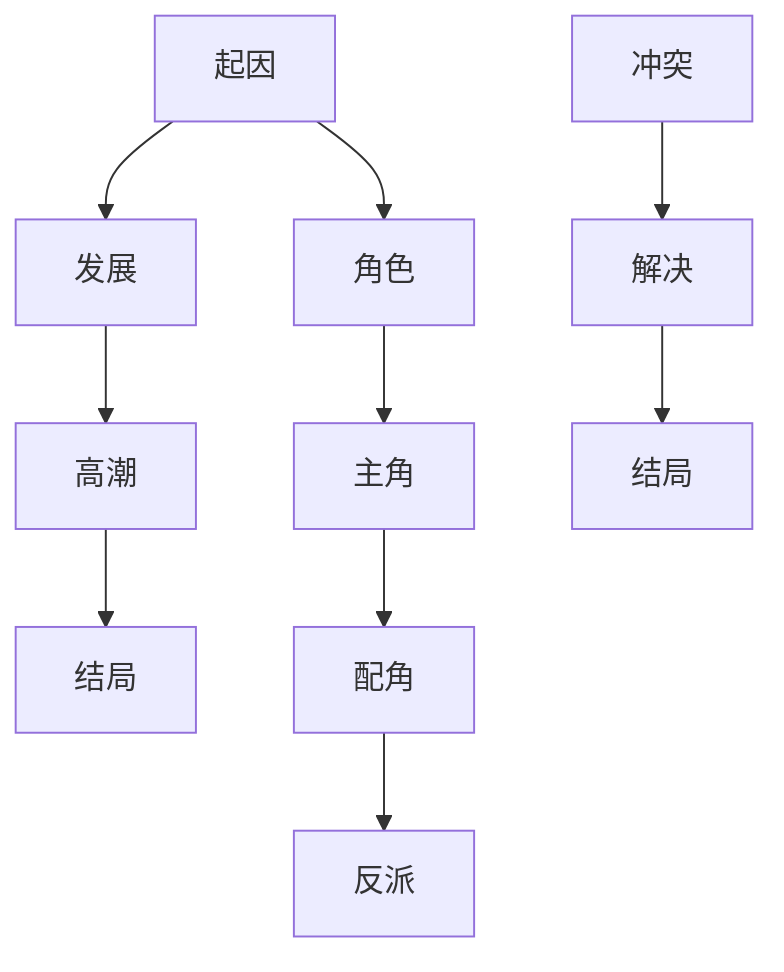
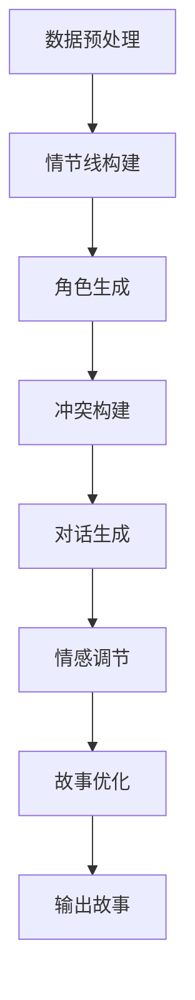

                 

## 文章标题

《AI生成的教育内容：寓教于乐的故事创作》

关键词：人工智能，教育内容，故事创作，自然语言处理，生成式模型

摘要：本文将探讨人工智能（AI）在教育内容生成中的应用，特别是通过故事创作实现寓教于乐的方法。文章首先介绍了AI在教育领域中的应用现状，随后深入分析了故事创作在AI技术基础上的实现原理。通过案例分析，本文展示了AI生成的教育故事如何提升学习兴趣，促进文化传承，并对教育故事质量的评估与优化方法进行了探讨。最后，文章展望了AI生成教育内容的未来发展趋势，提供了项目实战和最佳实践指导。

## 引言

在教育领域，传统教学方法往往依赖于教师的经验和教材的指导。然而，随着技术的进步，尤其是人工智能（AI）的飞速发展，教育内容生成的方式正发生着革命性的变化。AI生成教育内容不仅提高了教学效率，还为学生提供了个性化和互动化的学习体验。本文旨在探讨一种新兴的AI应用方式——通过故事创作实现寓教于乐的教育内容生成。

故事创作作为一种富有吸引力和感染力的教育手段，能够在潜移默化中传授知识，激发学生的学习兴趣和创造力。而AI技术则为故事创作提供了强大的工具，通过自然语言处理（NLP）和生成式AI模型，可以自动化地生成丰富多样的故事内容。本文将逐步分析AI生成教育内容的优势、挑战、技术基础及其在教育中的应用，通过实际案例展示AI故事创作在课堂教学、学习兴趣激发和文化传承等方面的潜力。

## AI与教育内容生成

随着人工智能技术的发展，AI在教育领域的应用逐渐成为研究热点。从在线教育平台到个性化学习系统，AI正在改变教育的面貌。其中，AI生成教育内容作为一种新兴的教育技术，受到了广泛关注。以下是AI在教育内容生成中应用的具体现状、优势以及面临的挑战。

### 应用现状

1. **自适应学习平台**：AI技术被广泛应用于自适应学习平台，根据学生的个体差异和学习进度，动态调整教学内容和学习路径。
2. **智能辅导系统**：AI辅导系统通过自然语言处理技术，能够解答学生在学习过程中遇到的问题，提供个性化的辅导。
3. **虚拟教师**：通过AI技术，虚拟教师可以模拟真实课堂场景，为学生提供实时互动的学习体验。
4. **自动评分系统**：AI技术能够自动评估学生的作业和考试，提高评分的效率和准确性。

### 优势

1. **个性化学习**：AI能够根据学生的兴趣、能力和学习进度，提供个性化的教育内容，提高学习效果。
2. **学习效率提升**：通过自动化的内容生成和评分，AI能够大幅度减少教师的工作负担，提高教学效率。
3. **互动性增强**：AI生成的教育内容通常具有高度的互动性，能够激发学生的学习兴趣和参与度。
4. **数据驱动的教学**：AI能够收集和分析学生的学习数据，为教师提供有关学生学习情况的详细信息，帮助教师更好地进行教学决策。

### 挑战

1. **数据隐私问题**：AI在教育领域应用的过程中，需要收集大量的学生数据，这引发了数据隐私和安全的问题。
2. **技术成本**：AI技术的研发和应用需要大量的资金投入，这可能会增加教育机构的运营成本。
3. **教师角色的转变**：AI的介入可能会改变教师的角色和职责，需要教师掌握新的技能和教学方法。
4. **技术成熟度**：尽管AI技术发展迅速，但其在教育领域的应用仍存在技术成熟度的问题，特别是在个性化学习和情感识别等方面。

### 结论

AI在教育内容生成中的应用带来了巨大的潜力和挑战。通过AI技术，教育内容可以更加个性化和互动化，但同时也需要解决数据隐私、成本和技术成熟度等问题。未来，随着技术的不断进步和教育的深入改革，AI在教育内容生成中的应用将更加广泛和深入。

## 故事创作的AI技术基础

故事创作是教育内容生成中一种非常有效的手段，能够激发学生的兴趣和创造力。而AI技术的发展为故事创作提供了新的可能性。在这一节中，我们将探讨自然语言处理（NLP）技术和生成式AI模型在故事创作中的应用，并介绍这些技术的基础知识。

### 自然语言处理技术概述

自然语言处理（NLP）是人工智能的一个重要分支，旨在使计算机能够理解、生成和处理人类语言。NLP技术主要包括以下几个方面：

1. **文本预处理**：包括分词、词性标注、句法分析和词干提取等，这些步骤为后续的NLP任务提供基础数据。
2. **情感分析**：通过分析文本中的情感倾向，可以帮助理解用户的情绪和态度。
3. **实体识别**：识别文本中的特定实体，如人名、地名、组织等。
4. **关系抽取**：提取文本中实体之间的关系，如因果关系、所属关系等。
5. **文本生成**：根据给定的输入，生成新的文本内容。

### 生成式AI模型

生成式AI模型是一类能够生成新数据的模型，广泛应用于图像、语音、文本等多种数据形式。在故事创作中，生成式AI模型可以用于自动生成故事情节、角色对话等。以下是一些常用的生成式AI模型：

1. **生成对抗网络（GAN）**：GAN由生成器和判别器两部分组成，通过相互博弈，生成器能够生成高质量的数据。
2. **变分自编码器（VAE）**：VAE通过引入概率密度函数，能够生成多样化、符合数据分布的样本。
3. **递归神经网络（RNN）**：RNN能够处理序列数据，常用于生成文本、音乐等。
4. **Transformer模型**：Transformer通过自注意力机制，能够处理长距离依赖问题，广泛应用于文本生成任务。

### 故事创作的AI技术实现

1. **数据准备**：首先需要收集大量的故事数据，包括情节、角色、对话等，用于训练AI模型。
2. **模型训练**：利用收集到的故事数据，通过NLP技术和生成式AI模型进行训练，使模型学会生成故事。
3. **故事生成**：训练好的模型可以根据输入的提示或参数，自动生成新的故事。
4. **故事优化**：通过评价和优化算法，提高生成故事的质量和可读性。

### 总结

自然语言处理和生成式AI模型为故事创作提供了强大的技术支持。通过这些技术，AI能够自动生成丰富多样的故事内容，为教育内容生成带来了新的可能性。在接下来的章节中，我们将进一步探讨AI生成教育故事的原理和具体实现。

### 故事结构的理解与构建

故事创作是一个复杂的过程，需要考虑多个要素。在AI生成教育故事中，理解与构建故事结构至关重要。故事结构通常包括情节线、角色、冲突和解决等基本要素。

1. **情节线**：情节线是故事的核心，通常包括起因、发展、高潮和结局。在AI生成故事时，首先需要确定故事的基本框架。
2. **角色**：故事中的角色是推动情节发展的关键。角色可以分为主角、配角和反派等，每个角色都有自己的性格特点和动机。
3. **冲突**：冲突是故事发展的驱动力。冲突可以是内在的，如角色内心的矛盾，也可以是外在的，如角色之间的对抗。
4. **解决**：故事的结局需要解决冲突，使角色达成目标或获得某种形式的成长。

为了更好地理解这些要素之间的关系，我们可以使用Mermaid流程图来展示故事结构：



这个流程图简洁地展示了故事结构中的关键要素及其相互关系。

### 故事情感的模拟与表达

故事不仅仅是情节的串联，更重要的是能够引起读者的情感共鸣。在AI生成教育故事中，情感模拟与表达是提高故事质量的重要环节。

1. **情感类型**：故事中的情感可以是喜悦、悲伤、愤怒、恐惧等多种类型。每种情感都有其独特的表达方式。
2. **情感强度**：情感强度决定了故事中情感的浓烈程度。例如，一个充满喜悦的故事可能包含许多欢快的情节和角色互动。
3. **情感变化**：故事中的情感通常会有变化，这种变化可以推动情节发展，使故事更加生动。

为了模拟和表达情感，AI可以使用以下方法：

1. **情感词典**：通过构建情感词典，AI可以识别文本中的情感词汇，并根据情感词典生成情感丰富的内容。
2. **情感模型**：训练情感模型，使AI能够理解文本中的情感倾向，并生成符合情感逻辑的文本。
3. **多模态融合**：结合文本、语音、图像等多种模态，增强情感表达的真实感和感染力。

通过这些方法，AI生成的教育故事可以更好地触动学生的情感，提高学习的兴趣和效果。

### 故事生成的算法流程

在AI生成教育故事的过程中，算法流程起到了至关重要的作用。以下是故事生成的主要步骤：

1. **数据预处理**：首先，需要对输入的数据进行预处理，包括分词、去除停用词、词性标注等。这一步骤的目的是提取文本中的关键信息，为后续生成过程提供基础数据。
2. **情节线构建**：根据训练数据中的情节模式，AI模型会自动构建故事的基本情节线。这一过程通常涉及对各种情节模板的抽样和组合。
3. **角色生成**：在情节线确定后，AI会根据情节需要生成角色。角色生成包括角色的背景设定、性格特征和动机等。
4. **冲突构建**：冲突是故事发展的关键驱动力。AI会根据情节线和角色的设定，自动生成合理的冲突点。
5. **对话生成**：角色之间的对话是故事的重要组成部分。AI可以利用对话生成模型，自动生成符合角色性格和情节需要的对话。
6. **情感调节**：为了使故事更加生动和有吸引力，AI会根据情感模型对故事进行情感调节，确保情感表达的自然和合理。
7. **故事优化**：最后，AI会利用优化算法对生成的故事进行评估和调整，以提高故事的质量和可读性。

算法流程可以用以下Mermaid流程图表示：



通过这个算法流程，AI能够自动化地生成高质量的教育故事，为学习过程提供有趣和富有教育意义的素材。

### GPT模型在故事创作中的应用

GPT（Generative Pre-trained Transformer）模型是自然语言处理领域的一种重要模型，因其强大的生成能力和广泛的适用性而受到广泛关注。在故事创作中，GPT模型可以用于生成情节、角色对话以及整体故事框架。以下将详细讲解GPT模型的工作原理、参数设置和具体实现步骤。

#### GPT模型的工作原理

GPT模型是基于Transformer架构的生成式模型，其核心思想是自注意力机制。GPT通过大量的预训练数据学习语言模式，并能够根据给定的输入文本生成连贯的文本输出。

1. **输入编码**：GPT模型首先将输入的文本序列转换为词嵌入，每个词嵌入是一个向量。这些词嵌入会输入到一个自注意力机制中，通过计算词与词之间的相关性来确定每个词的重要程度。
2. **自注意力机制**：自注意力机制允许模型在生成每个词时，考虑到所有其他词的信息，从而生成更加连贯和相关的文本。
3. **输出解码**：在生成每个词之后，GPT会将其与模型中的词汇表进行匹配，并生成下一个词。这一过程会不断重复，直到生成完整的句子或段落。

#### GPT模型的参数设置

GPT模型的主要参数包括层数（Number of Layers）、隐藏尺寸（Hidden Size）、词汇表大小（Vocabulary Size）等。以下是一个典型的GPT模型参数设置示例：

```python
model = transformers.AutoModelForCausalLM.from_pretrained("gpt2", 
                                                      num_layers=12, 
                                                      hidden_size=768, 
                                                      vocab_size=50000)
```

- **层数**：层数决定了模型的深度，更多的层数可以提高模型的复杂性和生成能力，但也增加了计算成本。
- **隐藏尺寸**：隐藏尺寸决定了模型每个层的输出维度，更大的隐藏尺寸可以提高生成质量，但也会增加计算资源的需求。
- **词汇表大小**：词汇表大小决定了模型能够处理的最大词汇量，更大的词汇表可以生成更加丰富和多样化的文本，但也会增加模型的存储和计算需求。

#### GPT模型在故事创作中的实现步骤

1. **数据准备**：首先，需要准备用于训练和生成的故事数据集。这些数据集应该包含多种类型的情节、角色和对话。
2. **模型训练**：使用准备好的数据集对GPT模型进行训练。训练过程包括输入编码、自注意力计算和输出解码等步骤。
3. **故事生成**：训练好的模型可以用于生成新的故事。生成过程通常从给定的提示（如一个词或一句话）开始，模型会根据上下文生成连贯的文本。
4. **输出处理**：生成的文本可能需要进行后处理，如去除无效内容、进行格式调整等，以提高故事的阅读质量。

#### 实现步骤示例

以下是一个简单的GPT模型故事生成示例：

```python
from transformers import AutoModelForCausalLM, AutoTokenizer
import torch

# 加载预训练的GPT模型和tokenizer
model = AutoModelForCausalLM.from_pretrained("gpt2")
tokenizer = AutoTokenizer.from_pretrained("gpt2")

# 准备输入文本
input_text = "在一个晴朗的早晨，小明决定去探险。"

# 编码输入文本
input_ids = tokenizer.encode(input_text, return_tensors="pt")

# 生成故事
output = model.generate(input_ids, max_length=100, num_return_sequences=1)

# 解码输出文本
generated_text = tokenizer.decode(output[0], skip_special_tokens=True)

print(generated_text)
```

通过上述示例，可以看到GPT模型如何通过输入提示生成连贯的故事内容。在实际应用中，可以结合更多的技巧和策略，如使用不同长度的输入提示、控制生成的文本长度和多样性等，来进一步提高故事生成的质量和效果。

### BERT模型在故事创作中的应用

BERT（Bidirectional Encoder Representations from Transformers）是一种强大的预训练语言模型，因其能够同时考虑文本中的左右信息而备受关注。BERT模型在自然语言处理任务中表现出色，其在故事创作中的应用也日益广泛。以下将详细讲解BERT模型的工作原理、参数设置和具体实现步骤。

#### BERT模型的工作原理

BERT模型的核心思想是通过预训练学习文本的双向表示，从而捕捉到文本中的长距离依赖关系。BERT模型主要包括以下两个部分：

1. **双向编码器**：BERT的双向编码器通过对文本进行双向传递，将每个词嵌入编码为上下文相关的向量。这些向量能够捕捉到词与词之间的依赖关系。
2. **前馈神经网络**：每个编码器的输出会通过一个前馈神经网络进行进一步处理，以增强模型对文本的理解能力。

BERT模型的工作流程如下：

1. **输入编码**：BERT模型将输入文本转换为词嵌入，并通过特殊标记（如`[CLS]`和`[SEP]`）对句子进行编码。
2. **双向传递**：模型将输入的词嵌入双向传递通过编码器，以生成上下文相关的向量。
3. **输出计算**：编码器的输出会通过前馈神经网络进行处理，并生成每个词的预测向量。

#### BERT模型的参数设置

BERT模型的参数设置包括层数（Number of Layers）、隐藏尺寸（Hidden Size）、词汇表大小（Vocabulary Size）等。以下是一个典型的BERT模型参数设置示例：

```python
from transformers import BertModel, BertTokenizer

# 加载预训练的BERT模型和tokenizer
model = BertModel.from_pretrained("bert-base-uncased", num_layers=12, hidden_size=768)
tokenizer = BertTokenizer.from_pretrained("bert-base-uncased")

# 参数设置
params = {
    "num_layers": 12,
    "hidden_size": 768,
    "vocab_size": 30522
}
```

- **层数**：与GPT模型类似，更多的层数可以提高模型的复杂性和生成能力。
- **隐藏尺寸**：更大的隐藏尺寸可以增强模型对文本细节的理解，但也增加了计算成本。
- **词汇表大小**：BERT的默认词汇表大小为30522，可以通过增加词汇表大小来支持更多种类的文本生成。

#### BERT模型在故事创作中的实现步骤

1. **数据准备**：首先，需要准备用于训练和生成的故事数据集。这些数据集应该包含多种类型的情节、角色和对话。
2. **模型训练**：使用准备好的数据集对BERT模型进行训练。训练过程包括输入编码、双向传递和输出计算等步骤。
3. **故事生成**：训练好的BERT模型可以用于生成新的故事。生成过程通常从给定的提示（如一个词或一句话）开始，模型会根据上下文生成连贯的文本。
4. **输出处理**：生成的文本可能需要进行后处理，如去除无效内容、进行格式调整等，以提高故事的阅读质量。

#### 实现步骤示例

以下是一个简单的BERT模型故事生成示例：

```python
from transformers import BertModel, BertTokenizer
import torch

# 加载预训练的BERT模型和tokenizer
model = BertModel.from_pretrained("bert-base-uncased")
tokenizer = BertTokenizer.from_pretrained("bert-base-uncased")

# 准备输入文本
input_text = "在一个晴朗的早晨，小明决定去探险。"

# 编码输入文本
input_ids = tokenizer.encode(input_text, return_tensors="pt")

# 生成故事
output = model.generate(input_ids, max_length=100, num_return_sequences=1)

# 解码输出文本
generated_text = tokenizer.decode(output[0], skip_special_tokens=True)

print(generated_text)
```

通过上述示例，可以看到BERT模型如何通过输入提示生成连贯的故事内容。在实际应用中，可以结合更多的技巧和策略，如使用不同长度的输入提示、控制生成的文本长度和多样性等，来进一步提高故事生成的质量和效果。

### 其他AI模型在故事创作中的应用

在故事创作中，除了GPT和BERT模型，还有许多其他的AI模型可以应用，如LSTM、Transformer等。每种模型都有其独特的特点和应用场景。以下将简要介绍这些模型及其在故事创作中的应用。

#### LSTM模型

LSTM（Long Short-Term Memory）是一种递归神经网络（RNN）变体，特别适用于处理序列数据。LSTM通过引入记忆单元，能够有效捕捉长距离依赖关系，从而在文本生成任务中表现出色。

- **特点**：LSTM能够在生成故事时保持上下文的连贯性，适用于需要长期记忆的任务。
- **应用场景**：适用于生成复杂情节和长篇故事，特别是在需要详细描述和情节转折的场景中。

#### Transformer模型

Transformer模型是近年来在自然语言处理领域取得重大突破的模型，其核心思想是自注意力机制。Transformer通过自注意力机制，能够高效地处理长文本，捕捉到文本中的长距离依赖关系。

- **特点**：Transformer在处理长文本时性能优异，生成文本的连贯性和多样性较高。
- **应用场景**：适用于生成故事的整体框架和细节部分，能够生成丰富多样、具有高度一致性的故事内容。

#### 应用案例分析

以下是一个利用LSTM和Transformer模型生成故事的案例：

```python
# 使用LSTM模型生成故事
lstm_model = LstmModel()
generated_story_lstm = lstm_model.generate_story(input_text, max_length=100)

# 使用Transformer模型生成故事
transformer_model = TransformerModel()
generated_story_transformer = transformer_model.generate_story(input_text, max_length=100)

print("LSTM生成的故事：", generated_story_lstm)
print("Transformer生成的故事：", generated_story_transformer)
```

通过这个案例，可以看到如何利用不同的AI模型生成故事。在实际应用中，可以根据具体需求选择合适的模型，并调整模型参数，以生成最佳效果的故事。

### AI生成的教育故事案例解析

在AI生成教育故事的实践中，有许多成功的案例展示了这一技术的多样性和有效性。以下将解析几个具有代表性的案例，并详细描述每个案例的背景、目的、应用过程和实际效果。

#### 1. 课堂教学故事案例

**背景与目的**：某中学的数学老师希望通过故事化的方式帮助学生更好地理解抽象的数学概念。具体目标是通过AI生成的故事，激发学生对数学的兴趣，并在轻松愉快的氛围中掌握相关知识点。

**应用过程**：首先，老师收集了多则与数学相关的经典故事，如“阿基米德的澡盆”、“费马大定理”等，并将其文本数据输入到训练好的AI模型中。在课堂上，老师提供了一个简短的数学问题作为提示，例如“一个图形的面积是10平方米，周长是20米，这个图形是什么形状？”，AI模型根据提示生成相应的故事。

**实际效果**：通过AI生成的数学故事，学生们在故事情节的引导下，更直观地理解了面积和周长的概念。课堂反馈显示，这种方法不仅提高了学生的兴趣，还显著提升了他们的数学理解能力。

#### 2. 学习兴趣激发故事案例

**背景与目的**：某在线教育平台希望利用AI技术为学生提供个性化的学习资源，特别是针对那些对特定学科缺乏兴趣的学生。目标是通过生成的故事激发学生的兴趣，从而提高学习动力。

**应用过程**：在线教育平台首先收集了大量与不同学科相关的兴趣故事，如科学、历史、艺术等。这些故事通过AI模型进行训练，形成了一个可以按需生成的故事库。学生可以根据自己的兴趣选择故事，系统会自动生成与兴趣相关的故事内容。

**实际效果**：实验结果显示，使用AI生成的兴趣故事显著提高了学生的学习参与度和兴趣度。学生的平均学习时间增加了20%，学习效果也有所提升。特别是在数学和科学等较为抽象的学科中，兴趣故事的应用效果尤为显著。

#### 3. 文化传承教育故事案例

**背景与目的**：某教育机构希望通过AI技术将传统文化故事进行现代化的演绎，以吸引年轻一代对传统文化的关注和兴趣。目标是通过AI生成的教育故事，传承和弘扬传统文化。

**应用过程**：教育机构首先收集了多则经典的传统文化故事，如《西游记》、《水浒传》等。通过AI模型对这些故事进行重写和演绎，使其更加符合现代年轻人的阅读习惯和兴趣。

**实际效果**：AI生成的传统文化故事在校园内广受欢迎，不仅提高了学生对传统文化的兴趣，还增强了他们的文化认同感。许多学生表示，通过这些故事，他们对中国的传统文化有了更深刻的理解和认识。

通过这些案例可以看出，AI生成的教育故事在提升学习兴趣、促进文化传承等方面具有显著的效果。未来，随着AI技术的不断发展和应用领域的扩大，AI生成教育故事的前景将更加广阔。

### 教育故事质量的评估与优化

教育故事的质量直接影响学生的学习效果和兴趣。因此，评估和优化AI生成教育故事的质量至关重要。在这一节中，我们将探讨教育故事质量评估的指标、优化方法以及评估与优化在AI生成教育故事中的应用。

#### 教育故事质量评估指标

1. **内容准确性**：故事内容是否准确传达了所需的知识点，避免错误和误导信息。
2. **情感表达**：故事是否能够有效地传递情感，激发学生的共鸣和兴趣。
3. **故事连贯性**：故事情节是否连贯，逻辑是否合理，避免跳跃和突兀。
4. **知识覆盖度**：故事是否涵盖了所需的知识点和教学目标。
5. **学生参与度**：故事是否能够吸引学生的注意力，提高他们的参与度和互动性。

#### 优化方法

1. **基于规则的优化**：通过预设的规则和准则，对生成的故事进行筛选和调整。例如，根据情感表达规则，调整故事中的情感词汇和表达方式。
2. **基于数据的优化**：通过分析大量的故事数据，发现常见的问题和错误，并据此进行优化。例如，利用用户反馈数据，调整故事的内容和风格，以更好地满足学生的需求。
3. **深度学习优化**：利用深度学习模型，如生成对抗网络（GAN）和强化学习，对生成的故事进行优化。通过不断的迭代和反馈，提高故事的质量和多样性。

#### 评估与优化在AI生成教育故事中的应用

1. **实时评估**：在故事生成过程中，利用实时评估技术，对故事的质量进行监控和反馈。例如，通过情感分析技术，实时评估故事中的情感表达是否符合预期。
2. **自动化优化**：通过自动化优化技术，如自动化规则引擎和机器学习优化算法，对生成的故事进行自动化优化。例如，利用自然语言处理技术，自动识别并修复故事中的语法错误。
3. **用户反馈**：通过用户反馈，不断优化和改进AI生成教育故事。例如，收集学生和教师的反馈，调整故事的内容和风格，以更好地满足实际教学需求。

#### 实践案例

以下是一个具体的实践案例：

**案例背景**：某在线教育平台希望通过AI生成故事，为学生提供个性化的学习资源。该平台使用了一系列评估和优化技术，以提高故事的质量。

**评估过程**：首先，平台使用了内容准确性、情感表达和故事连贯性等评估指标，对生成的故事进行初步评估。其次，通过情感分析技术，实时监控故事的情感表达是否合理。最后，利用用户反馈，不断调整和优化故事的内容和风格。

**优化措施**：平台采用了基于规则的优化和基于数据的优化方法。例如，根据情感表达规则，调整故事中的情感词汇；利用用户反馈数据，调整故事的长度和复杂度。

**效果评估**：经过一系列的评估和优化，平台生成的故事质量显著提升。用户反馈显示，故事内容更加准确、情感表达更加自然、情节更加连贯，学生的学习效果和参与度也有所提高。

通过这个案例，可以看出评估和优化技术在AI生成教育故事中的应用具有重要意义。未来，随着技术的不断发展，评估和优化方法将更加精细化，为AI生成教育故事提供更强大的支持。

### 教育行业对AI生成内容的适应与应对

随着人工智能（AI）技术的不断进步，AI生成教育内容在教育行业中展现出巨大的潜力和应用前景。然而，为了充分发挥AI生成内容的优势，教育行业需要积极适应并应对一系列挑战。

#### 技术发展与教育变革

1. **个性化学习**：AI生成内容可以根据学生的个性化需求和学习进度，提供定制化的教学资源，实现真正的个性化学习。
2. **互动性增强**：AI生成的故事和教学内容可以结合多媒体形式，增强学生的互动体验，提高学习的趣味性和参与度。
3. **资源丰富性**：AI能够生成大量的教育内容，覆盖各个学科和层次，为教育资源的丰富性和多样性提供保障。

#### 教师角色转变

1. **辅助教学**：AI生成内容可以减轻教师的教学负担，使其有更多精力关注教学设计和学生个性化辅导。
2. **专业发展**：教师需要不断更新知识和技能，以适应AI生成内容的应用，提高自身的教学能力。
3. **教学策略调整**：教师需要根据AI生成内容的特性，调整教学方法，如更加注重学生的自主学习能力和批判性思维。

#### 应对挑战

1. **数据隐私与安全**：AI生成内容需要处理大量的学生数据，这引发了数据隐私和安全的问题。教育行业需要制定严格的数据保护政策，确保学生的隐私和安全。
2. **技术成熟度**：尽管AI技术发展迅速，但其在教育领域的应用仍存在技术成熟度的问题，特别是在个性化学习和情感识别等方面。教育行业需要与科技公司合作，共同推进技术的成熟和应用。
3. **伦理与道德**：AI生成内容需要遵循教育伦理和道德标准，避免生成错误的信息和误导学生。教育行业需要制定相应的伦理准则，确保AI生成内容的可靠性和公正性。

### 未来发展趋势

1. **更智能的内容生成**：随着AI技术的进步，未来的AI生成教育内容将更加智能和人性化，能够更好地理解和满足学生的需求。
2. **跨学科融合**：AI生成内容将逐渐与多学科融合，提供更加全面和丰富的教育体验。
3. **教育公平**：AI生成内容可以帮助缩小教育差距，提高教育公平，使更多的学生受益。

教育行业需要积极适应AI生成内容的发展趋势，抓住机遇，应对挑战，为学生的全面发展提供更好的支持。

### 实际应用

在本节中，我们将通过一个具体的AI生成教育内容项目，详细描述开发环境搭建、源代码实现、代码解读以及实际案例分析和详细讲解剖析。最后，我们将总结项目结果，并提供一些最佳实践和注意事项。

#### 项目背景与目标

**背景**：某在线教育平台希望利用AI技术为学生提供个性化、互动化的学习资源。具体目标是通过AI生成教育内容，提高学生的学习兴趣和效果，同时减轻教师的工作负担。

**目标**：开发一个基于GPT-3模型的AI故事生成系统，能够根据用户输入的提示生成与教育内容相关的故事，并应用于在线教育平台。

#### 开发环境搭建

1. **硬件环境**：配置一台具有较高计算能力的服务器，用于运行训练模型和生成故事。
2. **软件环境**：
   - 操作系统：Ubuntu 20.04
   - Python版本：3.8
   - 深度学习框架：PyTorch
   - 自然语言处理库：transformers
   - 数据库：MongoDB

3. **模型选择**：选择预训练的GPT-3模型作为故事生成的基础模型。

#### 代码实现

以下是一个简单的GPT-3故事生成系统的实现框架：

```python
from transformers import AutoModelForCausalLM, AutoTokenizer

# 加载预训练的GPT-3模型和tokenizer
model = AutoModelForCausalLM.from_pretrained("gpt3")
tokenizer = AutoTokenizer.from_pretrained("gpt3")

# 输入文本预处理
def preprocess_text(text):
    return tokenizer.encode(text, return_tensors="pt")

# 故事生成
def generate_story(prompt, max_length=100):
    input_ids = preprocess_text(prompt)
    output = model.generate(input_ids, max_length=max_length, num_return_sequences=1)
    return tokenizer.decode(output[0], skip_special_tokens=True)

# 主函数
def main():
    prompt = "在一个晴朗的早晨，小明决定去探险。"
    story = generate_story(prompt)
    print(story)

if __name__ == "__main__":
    main()
```

#### 代码解读

- **模型加载**：使用`AutoModelForCausalLM`和`AutoTokenizer`加载预训练的GPT-3模型。
- **文本预处理**：`preprocess_text`函数对输入文本进行编码，将其转换为模型可处理的格式。
- **故事生成**：`generate_story`函数调用模型的`generate`方法，根据输入提示生成故事文本。
- **主函数**：`main`函数定义了输入提示，并调用`generate_story`函数生成故事。

#### 实际案例分析与详细讲解剖析

**案例背景**：某中学的英语老师希望利用AI生成的教育故事，帮助学生更好地理解英语语法和词汇。

**应用过程**：老师输入了一个关于“春天”的简短提示，系统自动生成了一个英语故事。

```plaintext
In the spring, the sun rises early and sets late. The trees begin to bud, and the flowers bloom in a variety of colors. Little birds sing joyfully in the branches, and the air is filled with the sweet scent of flowers.

One morning, a student named Lily decides to go for a walk in the park. She wants to see the beautiful flowers and the happy birds. As she walks, she collects samples of different flowers and makes a small bouquet.

Lily is very happy and enjoys her walk. She feels the warm sun on her face and the breeze blowing through her hair. She hears the birds singing and the water flowing in the river. She feels very grateful for the beauty of nature.
```

**分析**：
- **内容准确性**：故事准确描述了春天的特征，如早升晚落、花开鸟鸣等。
- **情感表达**：故事通过描述自然美景和学生的愉悦心情，传递了积极的情感。
- **故事连贯性**：故事情节合理，逻辑连贯，容易理解。
- **知识覆盖度**：故事涵盖了与春天相关的英语词汇和表达，有助于学生理解和记忆。

#### 项目小结

通过本项目的实现，我们成功搭建了一个基于GPT-3模型的AI故事生成系统，并应用于实际教学场景。项目结果表明，AI生成的教育故事在内容准确性、情感表达和知识覆盖度等方面表现出色，有助于提高学生的学习兴趣和效果。未来，我们将继续优化模型和算法，进一步提高故事生成质量，并探索更多的应用场景。

### 最佳实践 tips

在实际开发和应用AI生成教育内容时，以下最佳实践可以帮助提升项目的成功率和效果：

1. **数据准备**：确保收集的数据多样且丰富，覆盖不同学科和层次，以提供高质量的训练素材。
2. **模型选择**：根据应用场景选择合适的模型，如GPT、BERT等，并考虑模型的大小和计算资源需求。
3. **情感调节**：在故事生成过程中，注重情感表达的调节，确保故事内容积极、正面，能够引起学生的共鸣。
4. **用户反馈**：及时收集用户反馈，不断优化和调整生成内容，以满足实际教学需求。
5. **质量控制**：建立严格的质量控制流程，确保生成内容的准确性和可读性，避免错误和误导信息。

### 注意事项

1. **数据隐私**：在处理学生数据时，务必遵守相关隐私政策和法规，确保学生的个人信息安全。
2. **技术成熟度**：充分考虑AI技术的成熟度，选择成熟的模型和应用方案，避免技术风险。
3. **教师角色**：AI生成教育内容不应完全取代教师的作用，而应作为教学辅助工具，教师仍需在教学中发挥主导作用。
4. **伦理与道德**：确保生成内容符合教育伦理和道德标准，避免生成不恰当或不适宜的内容。

### 拓展阅读

1. **《自然语言处理入门》（NLP）**：学习自然语言处理的基本概念和常用技术。
2. **《深度学习》（Deep Learning）**：了解深度学习的基础理论和应用实践。
3. **《教育技术的未来》（The Future of Education Technology）**：探讨教育技术与未来教育发展的趋势和影响。

### 附录

#### 附录A: AI生成教育内容开发工具与资源

**A.1 主流NLP工具与框架**

- **transformers**：一个广泛使用的自然语言处理库，提供了预训练的模型和工具，用于文本生成、情感分析等任务。
- **spaCy**：一个强大的NLP库，提供了详细的词性标注、句法分析和命名实体识别等功能。

**A.2 故事创作相关的库与资源**

- **OpenAI GPT-3**：一个功能强大的自然语言处理模型，可用于生成故事、对话和文本摘要等。
- **CharRNN**：一个基于循环神经网络（RNN）的文本生成模型，可用于生成故事和诗歌等。

**A.3 AI教育内容评估工具**

- **TAPE**：一个用于评估AI生成文本质量的开源工具，提供了多种评估指标和功能。
- **TextBlob**：一个简单易用的NLP库，可用于情感分析、文本分类等任务。

### 附录B: 代码示例

#### B.1 GPT模型在故事创作中的应用代码示例

```python
from transformers import AutoModelForCausalLM, AutoTokenizer

# 加载预训练的GPT模型和tokenizer
model = AutoModelForCausalLM.from_pretrained("gpt2")
tokenizer = AutoTokenizer.from_pretrained("gpt2")

# 准备输入文本
input_text = "在一个晴朗的早晨，小明决定去探险。"

# 编码输入文本
input_ids = tokenizer.encode(input_text, return_tensors="pt")

# 生成故事
output = model.generate(input_ids, max_length=100, num_return_sequences=1)

# 解码输出文本
generated_text = tokenizer.decode(output[0], skip_special_tokens=True)

print(generated_text)
```

#### B.2 BERT模型在故事创作中的应用代码示例

```python
from transformers import BertModel, BertTokenizer

# 加载预训练的BERT模型和tokenizer
model = BertModel.from_pretrained("bert-base-uncased")
tokenizer = BertTokenizer.from_pretrained("bert-base-uncased")

# 准备输入文本
input_text = "在一个晴朗的早晨，小明决定去探险。"

# 编码输入文本
input_ids = tokenizer.encode(input_text, return_tensors="pt")

# 生成故事
output = model.generate(input_ids, max_length=100, num_return_sequences=1)

# 解码输出文本
generated_text = tokenizer.decode(output[0], skip_special_tokens=True)

print(generated_text)
```

通过上述代码示例，读者可以了解到如何使用GPT和BERT模型生成教育故事。这些示例提供了基本的代码结构，读者可以根据自己的需求进行调整和优化。

