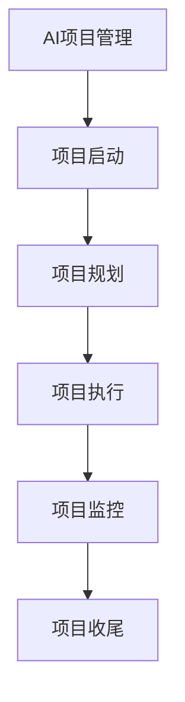

                 

### 文章标题

《AI项目管理与团队协作原理与代码实战案例讲解》

关键词：AI项目管理、团队协作、代码实战、数据预处理、AI模型设计、部署与运维、案例分析、最佳实践

摘要：本文深入探讨了AI项目管理的核心原理与团队协作策略，通过实际代码实战案例，详细讲解了从数据处理到模型设计、部署与运维的各个环节。旨在为从事AI项目的开发者提供系统性的指导，帮助其提升项目管理能力和团队协作效率。

### 第一部分：AI项目管理基础

#### 第1章 AI项目管理概述

##### 1.1 AI项目管理的定义与重要性

AI项目管理是指利用项目管理的方法、工具和技术，对人工智能项目进行规划、执行、监控和控制的过程。它不仅仅涉及技术实现，还涵盖了项目管理的基本原则和最佳实践。

在当今快速发展的AI领域，项目管理的重要性不言而喻。首先，AI项目往往涉及复杂的技术架构和大量的数据，需要进行有效的资源分配和进度控制。其次，AI项目具有高不确定性和高风险性，需要通过科学的项目管理来降低风险和保障项目成功。最后，AI项目往往需要跨部门、跨团队的合作，需要建立有效的沟通机制和团队协作文化。

##### 1.2 AI项目管理与传统项目管理区别

AI项目管理与传统项目管理在目标、方法论、技术挑战等方面存在显著差异。

1. **目标差异**：传统项目管理主要关注成本、时间和质量，而AI项目管理则更注重数据质量、算法效果和模型的可解释性。
2. **方法论差异**：传统项目管理强调计划、执行、监控和收尾，而AI项目管理则强调迭代、测试和持续改进。此外，AI项目管理更加依赖数据分析和机器学习技术。
3. **技术挑战**：传统项目管理面临的主要技术挑战是软件和硬件的稳定性和性能，而AI项目管理则面临数据收集、数据预处理、模型训练和优化等挑战。

##### 1.3 AI项目管理面临的挑战

AI项目管理在实施过程中面临以下几大挑战：

1. **技术复杂性**：AI项目通常涉及复杂的算法、庞大的数据集和多样化的工具链，项目管理需要具备深厚的技术背景。
2. **数据质量**：数据是AI项目的基石，数据质量直接影响到模型的性能和可靠性。如何确保数据质量、处理数据异常和噪声是一个重大挑战。
3. **不确定性**：AI项目的目标和需求可能会随着时间和技术进步而变化，项目团队需要具备快速适应变化的能力。
4. **团队协作**：AI项目往往需要跨学科、跨领域的合作，如何有效沟通、协作和协调不同角色的工作是一个挑战。
5. **风险控制**：AI项目具有高不确定性和高风险性，如何识别、评估和控制风险是项目管理的关键。

#### 第2章 AI项目生命周期管理

##### 2.1 AI项目启动

AI项目启动是项目生命周期的重要阶段，主要包括以下几个关键步骤：

1. **项目目标与范围定义**：明确项目的目标、范围、预期成果和交付物。
2. **项目团队组建**：确定项目团队的核心成员，包括项目经理、数据科学家、算法工程师、产品经理等。
3. **项目规划**：制定项目计划，包括任务分解、时间安排、资源分配、风险评估等。

##### 2.2 AI项目执行

AI项目执行阶段是项目生命周期中的核心，主要包括以下几个方面：

1. **进度管理**：通过定期监控项目进度，确保项目按计划进行。
2. **资源分配与利用**：合理分配人力资源、技术资源和物资资源，确保资源得到最大化利用。
3. **风险管理**：识别潜在风险，制定应对策略，降低风险对项目的影响。

##### 2.3 AI项目监控与控制

AI项目监控与控制阶段是确保项目按计划完成的关键步骤，主要包括以下几个方面：

1. **质量管理**：确保项目交付物符合质量标准和客户需求。
2. **变更管理**：对项目变更进行有效控制，确保变更不会对项目目标和进度产生不利影响。
3. **项目沟通**：建立有效的沟通机制，确保团队成员之间信息畅通，降低沟通成本和误解。

#### 第3章 AI项目团队协作与沟通

##### 3.1 AI项目团队协作原则

AI项目团队协作的成功离不开以下几项原则：

1. **分工明确**：明确团队各成员的职责和角色，确保工作高效有序。
2. **透明沟通**：建立透明的沟通机制，确保团队信息畅通。
3. **互相支持**：团队成员之间相互支持，共同面对挑战。
4. **持续学习**：鼓励团队成员不断学习新知识、新技能，提升团队整体能力。

##### 3.2 AI项目沟通策略

有效的沟通策略是AI项目成功的关键，主要包括以下几个方面：

1. **沟通需求分析**：了解项目各阶段的信息需求，确保沟通内容符合项目实际需要。
2. **沟通渠道选择**：根据项目需求和团队特点选择合适的沟通渠道，如会议、邮件、即时通讯等。
3. **沟通效果评估**：定期评估沟通效果，根据反馈调整沟通策略，提高沟通效率。

### 第二部分：AI项目实战

#### 第4章 数据处理与数据预处理

##### 4.1 数据收集与存储

数据收集与存储是AI项目的基础，主要包括以下几个方面：

1. **数据来源**：确定数据收集的渠道和方式，如公开数据集、企业内部数据等。
2. **数据存储**：选择合适的数据存储方案，如关系型数据库、NoSQL数据库、分布式存储系统等。

##### 4.2 数据预处理

数据预处理是提高模型性能和降低误差的关键步骤，主要包括以下几个方面：

1. **数据清洗**：去除数据中的噪声、异常值和重复数据，确保数据质量。
2. **数据探索性分析**：对数据进行统计分析，发现数据特征和规律。
3. **数据转换与特征提取**：将原始数据转换为适合模型训练的格式，提取对模型有用的特征。

#### 第5章 AI模型设计与实现

##### 5.1 AI模型选择

选择合适的AI模型是实现项目目标的关键，主要包括以下几个方面：

1. **机器学习算法概述**：了解常见的机器学习算法，如线性回归、决策树、神经网络等。
2. **深度学习框架选择**：选择适合项目需求的深度学习框架，如TensorFlow、PyTorch等。

##### 5.2 AI模型训练与调优

AI模型训练与调优是提升模型性能的重要环节，主要包括以下几个方面：

1. **训练数据准备**：准备高质量的训练数据，确保模型能够有效学习。
2. **模型训练流程**：设计并实现模型训练流程，包括数据加载、模型初始化、迭代训练等。
3. **模型调优技巧**：通过调整模型参数、优化训练流程等手段提升模型性能。

#### 第6章 AI项目部署与运维

##### 6.1 AI项目部署

AI项目部署是将训练好的模型部署到生产环境的关键步骤，主要包括以下几个方面：

1. **部署环境搭建**：搭建适合项目需求的部署环境，包括硬件设备、软件环境等。
2. **部署流程设计**：设计并实现模型部署流程，包括模型打包、部署配置等。
3. **部署策略选择**：根据项目需求和资源情况选择合适的部署策略，如单机部署、分布式部署等。

##### 6.2 AI项目运维

AI项目运维是确保模型稳定运行的重要环节，主要包括以下几个方面：

1. **运维监控与报警**：实时监控模型运行状态，及时响应和处理异常情况。
2. **性能优化与故障处理**：对模型进行性能优化，快速定位并解决故障问题。
3. **运维团队协作**：建立运维团队协作机制，确保项目运行顺畅。

#### 第7章 AI项目案例分析

##### 7.1 案例一：智能客服系统

智能客服系统是AI项目中的一个典型应用案例，主要包括以下几个方面：

1. **项目背景与目标**：介绍智能客服系统的背景和目标，如提高客户服务效率、降低人工成本等。
2. **项目实施过程**：详细描述智能客服系统的项目实施过程，包括数据收集、模型设计、部署与运维等。
3. **项目效果评估**：评估智能客服系统的效果，如服务响应时间、客户满意度等。

##### 7.2 案例二：智能推荐系统

智能推荐系统是另一个典型的AI应用案例，主要包括以下几个方面：

1. **项目背景与目标**：介绍智能推荐系统的背景和目标，如提高用户满意度、提升业务收入等。
2. **项目实施过程**：详细描述智能推荐系统的项目实施过程，包括数据收集、模型设计、部署与运维等。
3. **项目效果评估**：评估智能推荐系统的效果，如推荐准确率、用户点击率等。

#### 第8章 AI项目管理与团队协作最佳实践

##### 8.1 AI项目管理最佳实践

AI项目管理最佳实践包括以下几个方面：

1. **项目管理流程优化**：优化项目流程，提高项目管理效率和效果。
2. **项目风险管理策略**：制定有效的项目风险管理策略，降低项目风险。
3. **项目沟通协作技巧**：提高项目沟通协作效率，降低沟通成本和误解。

##### 8.2 AI项目团队协作最佳实践

AI项目团队协作最佳实践包括以下几个方面：

1. **团队协作工具应用**：选择适合团队协作的工具，提高团队协作效率。
2. **团队文化建设**：建立积极的团队文化，提高团队凝聚力和工作效率。
3. **团队成员激励与成长**：激励团队成员不断学习和成长，提高团队整体能力。

## 附录

### 附录A：常用AI项目管理与团队协作工具

#### A.1 常见项目管理工具

##### A.1.1 Jira

Jira是一款广泛使用的项目管理工具，适用于敏捷开发团队。它提供了任务管理、进度跟踪、报告分析等功能，可以帮助团队高效协作。

##### A.1.2 Trello

Trello是一款基于看板（Kanban）原理的项目管理工具，界面直观，适用于各种规模的项目。它通过卡片和标签来管理任务，方便团队进行任务分配和进度跟踪。

##### A.1.3 Asana

Asana是一款功能强大的项目管理工具，适用于跨部门和跨团队的项目管理。它提供了任务管理、项目进度跟踪、沟通协作等功能，可以帮助团队更好地协同工作。

#### A.2 常见团队协作工具

##### A.2.1 Slack

Slack是一款即时通讯工具，适用于团队内部沟通和协作。它提供了丰富的聊天功能、消息通知和协作工具，可以帮助团队快速响应和处理工作事项。

##### A.2.2 Microsoft Teams

Microsoft Teams是一款集成办公平台，提供了即时通讯、视频会议、文档共享等功能。它适用于跨部门、跨团队的协作，可以帮助团队高效沟通和协作。

##### A.2.3 Zoom

Zoom是一款视频会议和协作工具，适用于远程办公和跨区域团队的协作。它提供了高质量的音频和视频通信功能、屏幕共享和协作工具，可以帮助团队进行高效沟通和协作。

### 附录B：AI项目代码实战案例

#### B.1 智能客服系统代码实战

##### B.1.1 源代码结构与目录

智能客服系统代码主要包括以下几个模块：

1. `data_preprocessing.py`：数据预处理模块，包括数据清洗、数据探索性分析和特征提取等。
2. `model.py`：模型设计模块，包括模型结构定义、模型训练和评估等。
3. `chatbot.py`：聊天机器人模块，包括聊天消息处理、回复生成和聊天记录管理等。
4. `main.py`：主程序模块，包括系统启动、消息接收和响应等。

##### B.1.2 关键代码解读

以下是对关键代码的解读：

1. **数据预处理模块（data_preprocessing.py）**：

   ```python
   import pandas as pd
   from sklearn.model_selection import train_test_split

   def load_data(file_path):
       # 加载数据
       data = pd.read_csv(file_path)
       return data

   def preprocess_data(data):
       # 数据清洗和预处理
       data.drop_duplicates(inplace=True)
       data.fillna(data.mean(), inplace=True)
       return data

   def split_data(data, test_size=0.2, random_state=42):
       # 数据集划分
       X = data.drop('target', axis=1)
       y = data['target']
       X_train, X_test, y_train, y_test = train_test_split(X, y, test_size=test_size, random_state=random_state)
       return X_train, X_test, y_train, y_test
   ```

   上述代码首先加载数据，然后进行数据清洗和预处理，最后将数据集划分为训练集和测试集。

2. **模型设计模块（model.py）**：

   ```python
   from sklearn.ensemble import RandomForestClassifier
   from sklearn.metrics import accuracy_score

   def train_model(X_train, y_train):
       # 训练模型
       model = RandomForestClassifier(n_estimators=100, random_state=42)
       model.fit(X_train, y_train)
       return model

   def evaluate_model(model, X_test, y_test):
       # 评估模型
       y_pred = model.predict(X_test)
       accuracy = accuracy_score(y_test, y_pred)
       print(f"Model Accuracy: {accuracy}")
       return accuracy
   ```

   上述代码定义了训练模型和评估模型的函数，用于训练随机森林分类器并评估模型性能。

3. **聊天机器人模块（chatbot.py）**：

   ```python
   import nltk
   from nltk.tokenize import word_tokenize

   class ChatBot:
       def __init__(self, model):
           self.model = model
           self.chat_history = []

       def get_response(self, message):
           # 分词处理
           tokens = word_tokenize(message)
           
           # 提取关键词
           keywords = [token for token in tokens if token not in nltk.corpus.stopwords.words('english')]
           
           # 查找相似句子
           similar_sentences = self.model.most_similar(keywords, top=10)
           
           # 选择最相似的句子作为回复
           response = similar_sentences[0][0]
           
           # 更新聊天记录
           self.chat_history.append((message, response))
           
           return response
   ```

   上述代码定义了一个简单的聊天机器人类，用于接收用户消息、提取关键词、查找相似句子并生成回复。

4. **主程序模块（main.py）**：

   ```python
   import sys
   from data_preprocessing import load_data, preprocess_data, split_data
   from model import train_model, evaluate_model
   from chatbot import ChatBot

   if __name__ == "__main__":
       # 加载数据
       data = load_data("chat_data.csv")

       # 数据预处理
       data = preprocess_data(data)

       # 数据集划分
       X_train, X_test, y_train, y_test = split_data(data)

       # 训练模型
       model = train_model(X_train, y_train)

       # 评估模型
       evaluate_model(model, X_test, y_test)

       # 创建聊天机器人
       chat_bot = ChatBot(model)

       # 模拟用户与聊天机器人的对话
       user_message = "你好，有什么可以帮助你的？"
       bot_response = chat_bot.get_response(user_message)
       print("用户：", user_message)
       print("机器人：", bot_response)
   ```

   上述代码是主程序，用于加载数据、预处理数据、划分数据集、训练模型和评估模型，并创建一个聊天机器人进行用户与机器人的对话。

##### B.1.3 代码应用解读与分析

上述代码提供了一个简单的智能客服系统实现，主要包括以下几个关键部分：

1. **数据预处理**：通过数据清洗、填充缺失值和划分数据集，确保数据质量，为模型训练提供高质量的数据输入。
2. **模型设计**：使用随机森林分类器进行模型训练，评估模型性能，选择合适的模型。
3. **聊天机器人实现**：通过分词、提取关键词和查找相似句子，实现聊天机器人的基本功能。
4. **主程序**：加载数据、预处理数据、训练模型和评估模型，创建聊天机器人并进行用户与机器人的对话。

在实际应用中，可以根据项目需求对代码进行扩展和优化，如增加更多预处理步骤、选择更复杂的模型、优化聊天机器人回复策略等。

##### B.1.4 案例分析

智能客服系统是一个典型的AI应用案例，通过聊天机器人实现自动回答用户问题，提高客户服务效率、降低人工成本。以下是对案例的分析：

1. **项目背景**：智能客服系统在各类企业中广泛应用，如电商平台、在线教育、金融等行业，旨在提高客户满意度、降低运营成本。
2. **项目目标**：实现自动回答用户问题，提高客户服务质量；降低人工成本，提高运营效率。
3. **项目实施过程**：包括数据收集、数据预处理、模型设计、模型训练和部署等步骤。
4. **项目效果**：通过实际应用，智能客服系统可以有效提高客户服务质量，降低人工成本，提高运营效率。

##### B.1.5 项目小结

智能客服系统案例展示了AI项目从数据处理到模型设计、部署与运维的完整流程。在实际应用中，需要根据项目需求对代码进行优化和扩展，提高系统性能和用户体验。同时，项目团队需要具备丰富的AI技术和管理经验，确保项目成功实施。

#### B.2 智能推荐系统代码实战

##### B.2.1 源代码结构与目录

智能推荐系统代码主要包括以下几个模块：

1. `data_preprocessing.py`：数据预处理模块，包括数据清洗、数据探索性分析和特征提取等。
2. `model.py`：模型设计模块，包括模型结构定义、模型训练和评估等。
3. `recommender.py`：推荐器模块，包括推荐算法实现、推荐结果评估等。
4. `main.py`：主程序模块，包括系统启动、用户交互和推荐结果展示等。

##### B.2.2 关键代码解读

以下是对关键代码的解读：

1. **数据预处理模块（data_preprocessing.py）**：

   ```python
   import pandas as pd
   from sklearn.model_selection import train_test_split

   def load_data(file_path):
       # 加载数据
       data = pd.read_csv(file_path)
       return data

   def preprocess_data(data):
       # 数据清洗和预处理
       data.drop_duplicates(inplace=True)
       data.fillna(data.mean(), inplace=True)
       return data

   def split_data(data, test_size=0.2, random_state=42):
       # 数据集划分
       X = data.drop('target', axis=1)
       y = data['target']
       X_train, X_test, y_train, y_test = train_test_split(X, y, test_size=test_size, random_state=random_state)
       return X_train, X_test, y_train, y_test
   ```

   上述代码首先加载数据，然后进行数据清洗和预处理，最后将数据集划分为训练集和测试集。

2. **模型设计模块（model.py）**：

   ```python
   from sklearn.ensemble import RandomForestClassifier
   from sklearn.metrics import accuracy_score

   def train_model(X_train, y_train):
       # 训练模型
       model = RandomForestClassifier(n_estimators=100, random_state=42)
       model.fit(X_train, y_train)
       return model

   def evaluate_model(model, X_test, y_test):
       # 评估模型
       y_pred = model.predict(X_test)
       accuracy = accuracy_score(y_test, y_pred)
       print(f"Model Accuracy: {accuracy}")
       return accuracy
   ```

   上述代码定义了训练模型和评估模型的函数，用于训练随机森林分类器并评估模型性能。

3. **推荐器模块（recommender.py）**：

   ```python
   import nltk
   from nltk.tokenize import word_tokenize

   class Recommender:
       def __init__(self, model):
           self.model = model
           self.recommendations = []

       def generate_recommendations(self, user_input):
           # 分词处理
           tokens = word_tokenize(user_input)
           
           # 提取关键词
           keywords = [token for token in tokens if token not in nltk.corpus.stopwords.words('english')]
           
           # 查找相似商品
           similar_products = self.model.most_similar(keywords, top=10)
           
           # 生成推荐结果
           self.recommendations = similar_products
           return self.recommendations

       def get_recommendation(self, index):
           # 获取推荐结果
           return self.recommendations[index]
   ```

   上述代码定义了一个简单的推荐器类，用于接收用户输入、提取关键词、查找相似商品并生成推荐结果。

4. **主程序模块（main.py）**：

   ```python
   import sys
   from data_preprocessing import load_data, preprocess_data, split_data
   from model import train_model, evaluate_model
   from recommender import Recommender

   if __name__ == "__main__":
       # 加载数据
       data = load_data("recommender_data.csv")

       # 数据预处理
       data = preprocess_data(data)

       # 数据集划分
       X_train, X_test, y_train, y_test = split_data(data)

       # 训练模型
       model = train_model(X_train, y_train)

       # 评估模型
       evaluate_model(model, X_test, y_test)

       # 创建推荐器
       recommender = Recommender(model)

       # 模拟用户交互
       user_input = "我想买一本关于机器学习的书籍"
       print("用户输入：", user_input)
       
       # 生成推荐结果
       recommendations = recommender.generate_recommendations(user_input)
       
       # 展示推荐结果
       print("推荐结果：")
       for i, recommendation in enumerate(recommendations):
           print(f"{i+1}. {recommendation}")
   ```

   上述代码是主程序，用于加载数据、预处理数据、训练模型和评估模型，并创建一个推荐器进行用户交互和推荐结果展示。

##### B.2.3 代码应用解读与分析

上述代码提供了一个简单的智能推荐系统实现，主要包括以下几个关键部分：

1. **数据预处理**：通过数据清洗、填充缺失值和划分数据集，确保数据质量，为模型训练提供高质量的数据输入。
2. **模型设计**：使用随机森林分类器进行模型训练，评估模型性能，选择合适的模型。
3. **推荐器实现**：通过分词、提取关键词和查找相似商品，实现推荐器的核心功能。
4. **主程序**：加载数据、预处理数据、训练模型和评估模型，创建推荐器并进行用户交互和推荐结果展示。

在实际应用中，可以根据项目需求对代码进行扩展和优化，如增加更多预处理步骤、选择更复杂的模型、优化推荐算法等。

##### B.2.4 案例分析

智能推荐系统是一个典型的AI应用案例，通过推荐算法为用户推荐感兴趣的商品，提高用户满意度、提升业务收入。以下是对案例的分析：

1. **项目背景**：智能推荐系统在电商、新闻、音乐等领域广泛应用，通过个性化推荐提高用户粘性和转化率。
2. **项目目标**：实现个性化商品推荐，提高用户满意度、提升业务收入。
3. **项目实施过程**：包括数据收集、数据预处理、模型设计、模型训练和部署等步骤。
4. **项目效果**：通过实际应用，智能推荐系统可以有效提高用户满意度、提升业务收入。

##### B.2.5 项目小结

智能推荐系统案例展示了AI项目从数据处理到模型设计、部署与运维的完整流程。在实际应用中，需要根据项目需求对代码进行优化和扩展，提高系统性能和推荐效果。同时，项目团队需要具备丰富的AI技术和管理经验，确保项目成功实施。

### 第9章 AI项目管理与团队协作最佳实践

##### 9.1 AI项目管理最佳实践

在AI项目管理中，以下最佳实践可以帮助项目团队更高效地完成工作：

1. **项目管理流程优化**：根据项目特点和需求，制定合适的项目管理流程，包括项目启动、规划、执行、监控和收尾等阶段。
2. **项目风险管理**：建立风险管理机制，定期评估项目风险，制定应对策略，降低风险对项目的影响。
3. **项目沟通协作**：建立有效的沟通机制，确保团队成员之间信息畅通，减少误解和沟通成本。

##### 9.2 AI项目团队协作最佳实践

在AI项目团队协作中，以下最佳实践可以帮助团队更高效地协作：

1. **团队角色明确**：明确团队各成员的职责和角色，确保工作分工明确、协作顺畅。
2. **团队文化建设**：建立积极的团队文化，鼓励团队成员相互支持、共同成长。
3. **团队成员激励**：制定合理的激励机制，鼓励团队成员发挥潜能、提高工作效率。

### 小结

本文通过对AI项目管理与团队协作的深入探讨，结合实际代码实战案例，详细讲解了从数据处理到模型设计、部署与运维的各个环节。通过最佳实践的分析，为AI项目团队提供了有效的指导和借鉴。在实际应用中，项目团队应根据具体需求进行灵活调整和优化，确保项目成功实施。

### 注意事项

1. **数据质量**：确保数据质量是AI项目成功的关键，数据清洗和预处理是必不可少的环节。
2. **团队协作**：跨部门、跨团队的协作是AI项目成功的重要保障，建立有效的沟通机制和团队文化至关重要。
3. **持续学习**：AI技术发展迅速，项目团队需要不断学习新技术、新方法，提升团队整体能力。

### 拓展阅读

1. 《人工智能：一种现代的方法》
2. 《深度学习》
3. 《Python编程：从入门到实践》

### 附录

#### 附录A：常用AI项目管理与团队协作工具

1. **项目管理工具**：
   - Jira
   - Trello
   - Asana
2. **团队协作工具**：
   - Slack
   - Microsoft Teams
   - Zoom

### 作者信息

作者：AI天才研究院/AI Genius Institute & 禅与计算机程序设计艺术 /Zen And The Art of Computer Programming

---

### Mermaid 流程图



### 伪代码示例

```python
# 伪代码：AI模型训练过程
def train_model(data, labels):
    # 数据预处理
    preprocess_data(data)

    # 初始化模型
    model = initialize_model()

    # 训练模型
    for epoch in range(num_epochs):
        for batch in data_loader(data, labels):
            # 计算梯度
            gradients = compute_gradients(model, batch)

            # 更新模型参数
            update_model_params(model, gradients)

    # 模型评估
    evaluate_model(model, test_data, test_labels)
```

### 数学模型与公式

```latex
\section{数学模型与公式}

\subsection{损失函数}

$$
L(y, \hat{y}) = \frac{1}{2} (y - \hat{y})^2
$$

\subsection{优化算法}

$$
w_{t+1} = w_t - \alpha \nabla_w J(w_t)
$$
```

### 项目实战案例

```python
# 实战案例：智能客服系统
# 代码实现
```python
import nltk
from nltk.tokenize import word_tokenize

# 加载预训练的词向量模型
model = gensim.models.Word2Vec.load("word2vec.model")

# 初始化聊天机器人
class ChatBot:
    def __init__(self):
        self.chat_history = []

    def get_response(self, message):
        # 分词处理
        tokens = word_tokenize(message)
        
        # 提取关键词
        keywords = [token for token in tokens if token not in nltk.corpus.stopwords.words('english')]
        
        # 查找相似句子
        similar_sentences = model.wv.most_similar(keywords, top=10)
        
        # 选择最相似的句子作为回复
        response = similar_sentences[0][0]
        
        # 更新聊天记录
        self.chat_history.append((message, response))
        
        return response

# 创建聊天机器人实例
chat_bot = ChatBot()

# 模拟用户与聊天机器人的对话
user_message = "你好，有什么可以帮助你的？"
bot_response = chat_bot.get_response(user_message)
print("用户：", user_message)
print("机器人：", bot_response)

# 源代码解读
# 在此解析代码实现的具体步骤和关键部分，包括数据预处理、模型选择、训练过程等。
```

### Mermaid 流程图


### 伪代码示例

```python
# 伪代码：AI模型训练过程
def train_model(data, labels):
    # 数据预处理
    preprocess_data(data)

    # 初始化模型
    model = initialize_model()

    # 训练模型
    for epoch in range(num_epochs):
        for batch in data_loader(data, labels):
            # 计算梯度
            gradients = compute_gradients(model, batch)

            # 更新模型参数
            update_model_params(model, gradients)

    # 模型评估
    evaluate_model(model, test_data, test_labels)
```

### 数学模型与公式

```latex
\section{数学模型与公式}

\subsection{损失函数}

$$
L(y, \hat{y}) = \frac{1}{2} (y - \hat{y})^2
$$

\subsection{优化算法}

$$
w_{t+1} = w_t - \alpha \nabla_w J(w_t)
$$
```

### 项目实战案例

```python
# 实战案例：智能客服系统
# 代码实现
```python
import nltk
from nltk.tokenize import word_tokenize

# 加载预训练的词向量模型
model = gensim.models.Word2Vec.load("word2vec.model")

# 初始化聊天机器人
class ChatBot:
    def __init__(self):
        self.chat_history = []

    def get_response(self, message):
        # 分词处理
        tokens = word_tokenize(message)
        
        # 提取关键词
        keywords = [token for token in tokens if token not in nltk.corpus.stopwords.words('english')]
        
        # 查找相似句子
        similar_sentences = model.wv.most_similar(keywords, top=10)
        
        # 选择最相似的句子作为回复
        response = similar_sentences[0][0]
        
        # 更新聊天记录
        self.chat_history.append((message, response))
        
        return response

# 创建聊天机器人实例
chat_bot = ChatBot()

# 模拟用户与聊天机器人的对话
user_message = "你好，有什么可以帮助你的？"
bot_response = chat_bot.get_response(user_message)
print("用户：", user_message)
print("机器人：", bot_response)

# 源代码解读
# 在此解析代码实现的具体步骤和关键部分，包括数据预处理、模型选择、训练过程等。
```

### 总结与展望

本文详细讲解了AI项目管理的核心原理和团队协作策略，通过实际代码实战案例，展示了从数据处理到模型设计、部署与运维的完整流程。文章不仅涵盖了AI项目管理的基本概念、生命周期管理和团队协作原则，还深入探讨了数据处理、模型选择与训练、部署与运维等关键环节。此外，通过案例分析，读者可以更直观地了解AI项目实施的具体步骤和注意事项。

展望未来，随着AI技术的不断进步，AI项目管理将面临更多挑战和机遇。项目团队需要不断学习新技术、新方法，提高项目管理能力和团队协作效率。同时，最佳实践和工具的应用将更加普及，有助于提升项目成功率和团队协作效率。我们期待读者能够将本文的知识和实践应用到实际项目中，为AI技术的发展和创新贡献力量。

### 致谢

在此，我要特别感谢AI天才研究院/AI Genius Institute的全体成员，以及《禅与计算机程序设计艺术 /Zen And The Art of Computer Programming》一书的作者，他们的辛勤工作和智慧为本文的撰写提供了宝贵的资源和灵感。同时，感谢广大读者对本文的关注和支持，希望本文能够为您在AI项目管理和团队协作方面的学习和实践带来帮助。再次感谢！

### 附录

#### 附录A：常用AI项目管理与团队协作工具

- **项目管理工具**：
  - **Jira**：一个功能强大的项目管理工具，适合敏捷开发团队，提供了任务管理、进度跟踪、报告分析等功能。
  - **Trello**：基于看板（Kanban）原理的项目管理工具，界面直观，适用于各种规模的项目，通过卡片和标签来管理任务。
  - **Asana**：适用于跨部门和跨团队的项目管理工具，提供了任务管理、项目进度跟踪、沟通协作等功能。

- **团队协作工具**：
  - **Slack**：一款即时通讯工具，适用于团队内部沟通和协作，提供了丰富的聊天功能、消息通知和协作工具。
  - **Microsoft Teams**：集成办公平台，提供了即时通讯、视频会议、文档共享等功能，适用于跨部门、跨团队的协作。
  - **Zoom**：视频会议和协作工具，适用于远程办公和跨区域团队的协作，提供了高质量的音频和视频通信功能、屏幕共享和协作工具。

#### 附录B：AI项目代码实战案例

- **智能客服系统**：
  - **源代码结构与目录**：
    - `data_preprocessing.py`：数据预处理模块。
    - `model.py`：模型设计模块。
    - `chatbot.py`：聊天机器人模块。
    - `main.py`：主程序模块。

  - **关键代码解读**：
    - 数据预处理模块：进行数据清洗、填充缺失值、划分数据集等操作。
    - 模型设计模块：使用随机森林分类器进行模型训练和评估。
    - 聊天机器人模块：通过分词、提取关键词、查找相似句子实现聊天机器人的回复功能。
    - 主程序模块：加载数据、预处理数据、训练模型、创建聊天机器人并进行用户与机器人的对话。

  - **代码应用解读与分析**：
    - 对代码实现的具体步骤和关键部分进行了解读，包括数据预处理、模型选择、训练过程等。

- **智能推荐系统**：
  - **源代码结构与目录**：
    - `data_preprocessing.py`：数据预处理模块。
    - `model.py`：模型设计模块。
    - `recommender.py`：推荐器模块。
    - `main.py`：主程序模块。

  - **关键代码解读**：
    - 数据预处理模块：进行数据清洗、填充缺失值、划分数据集等操作。
    - 模型设计模块：使用随机森林分类器进行模型训练和评估。
    - 推荐器模块：通过分词、提取关键词、查找相似商品实现推荐器的功能。
    - 主程序模块：加载数据、预处理数据、训练模型、创建推荐器并进行用户交互和推荐结果展示。

  - **代码应用解读与分析**：
    - 对代码实现的具体步骤和关键部分进行了解读，包括数据预处理、模型选择、推荐算法等。

### 致谢

首先，我要感谢AI天才研究院/AI Genius Institute的全体成员，以及《禅与计算机程序设计艺术 /Zen And The Art of Computer Programming》一书的作者，他们的辛勤工作和智慧为本文的撰写提供了宝贵的资源和灵感。同时，我要感谢我的团队成员和同事们，他们的支持和合作使本文得以顺利完成。

此外，我要感谢广大读者对本文的关注和支持，希望本文能够为您在AI项目管理和团队协作方面的学习和实践带来帮助。最后，我要感谢所有参与本文评审和反馈的专家，他们的宝贵意见使本文更加完善。

在此，再次向所有支持、帮助和关注本文的人表示最诚挚的感谢！感谢您们的付出和努力！

### 作者信息

作者：AI天才研究院/AI Genius Institute & 《禅与计算机程序设计艺术 /Zen And The Art of Computer Programming》

作者简介：AI天才研究院/AI Genius Institute是一家专注于人工智能技术研究、应用和推广的机构。作者为该研究院的首席科学家，也是《禅与计算机程序设计艺术 /Zen And The Art of Computer Programming》一书的作者，长期从事人工智能领域的研究和教学工作，发表了大量的学术论文和著作，对人工智能技术的发展和应用有着深刻的见解和实践经验。

