                 

### 文章标题

### AI驱动的众包：增强创新和协作

### 关键词：AI驱动，众包，创新，协作，应用场景，生态系统，实践，未来发展趋势

### 摘要

本文将深入探讨AI驱动的众包这一新兴领域，分析其在增强创新和协作方面的潜力与挑战。首先，我们将概述AI驱动的众包的概念、架构和优势，随后探讨其基础技术，包括众包平台架构设计、人工智能技术基础及AI驱动的众包算法。接下来，我们将介绍AI驱动的众包在实际应用场景中的表现，如创意设计、数据标注和客户服务。文章还将探讨AI驱动的众包生态系统建设和AI驱动的协作创新。最后，我们将分析AI驱动的众包项目的规划与管理、实践案例，并展望其未来发展趋势，提出应对挑战的策略。

### 第一部分：AI驱动的众包概述

#### 第1章: AI驱动的众包概述

##### 1.1 众包与AI融合的概念

###### 1.1.1 众包的定义与历史发展

众包（Crowdsourcing）是指利用互联网将任务或问题分发给广大网民，通过集体智慧和力量解决问题或完成任务的一种模式。其概念最早由Jeff Howe在2006年提出，他将其定义为“一种利用众人的智慧、能力、资源来完成某个项目或任务的方式”。

众包的历史可以追溯到早期互联网时代的协作项目，如维基百科和开放式编程。然而，真正的大规模众包兴起是在21世纪的第一个十年，特别是随着社交媒体和在线平台的普及，众包逐渐成为企业和组织解决复杂问题的重要手段。

###### 1.1.2 AI技术在众包中的应用

人工智能（AI）技术的发展为众包注入了新的活力。AI技术可以帮助优化众包任务分配、提高任务完成质量和效率，以及通过数据分析发现新的机会和模式。例如，机器学习算法可以用于预测任务分配的最佳方案，自然语言处理技术可以用于自动评估和审核众包任务的完成情况。

AI在众包中的应用不仅限于任务执行，还可以用于众包平台的设计和运营。智能客服机器人可以处理常见的用户问题，提高平台的用户体验；智能推荐系统可以根据用户行为和偏好推荐相关的任务和项目，增加参与者的满意度。

###### 1.1.3 AI驱动众包的核心特点

AI驱动的众包具有以下几个核心特点：

1. **智能化任务分配**：利用机器学习算法自动匹配任务和参与者，提高任务完成的效率和准确性。
2. **动态调整任务难度**：根据参与者的表现和历史记录，动态调整任务的难度和类型，以激发参与者的积极性和创造力。
3. **智能评估与反馈**：利用自然语言处理和图像识别等技术对众包任务的完成情况进行自动评估，提供实时反馈。
4. **数据分析与优化**：通过大数据分析技术，了解参与者的行为模式，优化众包平台的运营策略。

##### 1.2 AI驱动的众包架构

###### 1.2.1 众包平台的架构设计

一个典型的AI驱动的众包平台通常包括以下几个核心组件：

1. **任务发布模块**：允许任务发起者创建和发布任务，包括任务描述、要求和奖励等信息。
2. **任务接收模块**：允许参与者浏览和申请任务，提交任务结果。
3. **任务匹配模块**：利用机器学习算法将任务与合适的参与者进行匹配。
4. **任务评估模块**：对参与者提交的任务结果进行评估，包括自动评估和人工审核。
5. **数据分析模块**：收集和分析参与者的行为数据，优化平台运营策略。
6. **用户管理模块**：管理用户账户、权限和奖励，提供用户界面和服务。

AI驱动的众包平台架构设计需要充分考虑以下几个方面：

1. **可扩展性**：平台应能够处理大量的任务和参与者，支持水平扩展。
2. **高可用性**：平台应具备高可用性，确保在高峰期和故障情况下稳定运行。
3. **安全性**：保护用户数据和隐私，防止数据泄露和恶意攻击。
4. **易用性**：提供直观、易用的用户界面，提高用户体验。

###### 1.2.2 AI驱动的众包生态系统

AI驱动的众包生态系统包括以下几个关键组成部分：

1. **参与者**：包括任务发起者、任务执行者和任务评审者。任务发起者发布任务，任务执行者完成任务，任务评审者对任务结果进行评估。
2. **平台运营商**：负责平台的运营、维护和数据分析，提供技术支持和用户体验优化。
3. **技术供应商**：提供AI算法、机器学习模型和数据分析工具等技术服务。
4. **监管机构**：负责监督平台的合规性和公平性，确保众包活动的合法性。

AI驱动的众包生态系统通过以下方式实现协同效应：

1. **资源整合**：通过整合分散的资源和智慧，实现更高效的任务完成。
2. **知识共享**：参与者通过完成任务和评估任务，共享知识和经验，提高整体创新能力。
3. **反馈循环**：通过实时反馈和数据分析，优化任务分配和评估机制，提高众包效率。

###### 1.2.3 数据与算法在众包中的应用

数据与算法在AI驱动的众包中扮演着关键角色。以下是一些主要应用：

1. **数据收集**：通过用户行为数据、任务完成数据和历史记录等收集大量数据。
2. **数据分析**：利用机器学习算法对数据进行分析，发现用户行为模式、任务完成规律等。
3. **任务分配**：利用协同过滤算法、聚类算法等匹配任务和参与者。
4. **质量评估**：利用自然语言处理和图像识别技术对任务结果进行自动评估。
5. **优化策略**：通过数据分析和模型优化，优化任务分配、评估和反馈机制。

##### 1.3 AI驱动的众包优势与挑战

###### 1.3.1 AI驱动的众包优势

AI驱动的众包具有以下优势：

1. **高效任务分配**：利用机器学习算法，实现任务的智能匹配和高效分配。
2. **质量保证**：通过自动评估和人工审核，提高任务完成质量和准确性。
3. **降低成本**：通过众包模式，减少人力成本，提高资源利用率。
4. **创新能力**：鼓励参与者发挥集体智慧，实现创新的解决方案。
5. **动态调整**：根据任务和参与者表现，动态调整任务难度和类型，提高参与者的积极性。

###### 1.3.2 AI驱动的众包面临的挑战

尽管AI驱动的众包具有许多优势，但也面临以下挑战：

1. **数据质量**：众包任务的数据质量直接影响任务完成的准确性和效率，需要确保数据的一致性和完整性。
2. **隐私保护**：众包过程中涉及大量用户数据，保护用户隐私是重要挑战。
3. **安全风险**：众包平台可能面临数据泄露、恶意攻击等安全风险。
4. **监管合规**：遵守相关法律法规，确保众包活动的合法性和公正性。
5. **技术门槛**：AI驱动的众包需要较高的技术水平和专业知识，对于中小企业和普通用户来说可能存在一定门槛。

###### 1.3.3 应对挑战的策略

为了应对AI驱动的众包面临的挑战，可以采取以下策略：

1. **数据治理**：建立完善的数据治理机制，确保数据质量和管理。
2. **隐私保护**：采用先进的加密技术和隐私保护算法，确保用户数据安全。
3. **安全防护**：加强平台安全防护，建立完善的安全体系，防止数据泄露和恶意攻击。
4. **合规性管理**：遵守相关法律法规，建立健全的合规性管理体系。
5. **技术普及**：降低技术门槛，提供技术支持和培训，帮助中小企业和普通用户更好地利用AI驱动的众包。

#### 第2章: AI驱动的众包技术基础

##### 2.1 众包平台架构设计

###### 2.1.1 众包平台的基础组件

一个AI驱动的众包平台通常包含以下几个基础组件：

1. **任务管理模块**：负责任务的创建、发布、管理和分配。该模块应支持多种任务类型，如文本标注、图像分类、数据分析等。
2. **用户管理模块**：负责用户注册、登录、权限管理和奖励发放。该模块应支持多种用户角色，如任务发起者、任务执行者和任务评审者。
3. **任务分配模块**：负责将任务智能地分配给合适的参与者。该模块利用机器学习算法，如协同过滤、聚类和预测模型，优化任务匹配。
4. **任务评估模块**：负责评估参与者提交的任务结果。该模块采用自动评估和人工审核相结合的方式，提高评估的准确性和公正性。
5. **数据分析模块**：负责收集和分析用户行为数据、任务完成数据和平台运营数据。该模块利用大数据分析技术，优化平台运营策略和提高用户体验。

###### 2.1.2 众包平台的实现技术

AI驱动的众包平台的实现需要多种技术支持，包括前端、后端和数据库技术。以下是一些关键技术：

1. **前端技术**：采用HTML、CSS和JavaScript等技术构建用户界面，提供直观、易用的用户体验。常用的前端框架有React、Vue和Angular。
2. **后端技术**：采用Node.js、Python、Java等编程语言和框架（如Express、Flask、Django）实现后端逻辑，处理任务管理、用户管理、任务分配和评估等功能。
3. **数据库技术**：采用关系型数据库（如MySQL、PostgreSQL）和非关系型数据库（如MongoDB、Cassandra）存储用户数据、任务数据和平台运营数据。关系型数据库适用于结构化数据存储，非关系型数据库适用于大数据存储和处理。

###### 2.1.3 众包平台的安全性考虑

AI驱动的众包平台的安全性至关重要，以下是一些关键安全考虑：

1. **用户认证与授权**：采用双因素认证、OAuth等安全机制，确保用户身份验证和权限管理。
2. **数据加密**：采用SSL/TLS加密协议，确保数据传输过程中的安全。同时，采用加密算法（如AES）对存储在数据库中的敏感数据进行加密。
3. **访问控制**：实现细粒度的访问控制，确保用户只能访问和操作自己有权访问的数据。
4. **日志记录与审计**：记录用户操作日志和系统事件，实现实时监控和审计，及时发现和应对潜在的安全威胁。
5. **安全测试与漏洞扫描**：定期进行安全测试和漏洞扫描，发现并修复安全漏洞。

##### 2.2 人工智能技术基础

###### 2.2.1 机器学习基本概念

机器学习（Machine Learning）是人工智能（AI）的一个重要分支，其核心思想是通过数据学习和发现规律，实现对未知数据的预测和决策。以下是一些基本概念：

1. **数据集**：用于训练机器学习模型的原始数据集，通常包括特征和标签。
2. **特征**：描述数据样本的特征属性，用于表示数据的特征向量。
3. **标签**：与数据样本对应的正确答案或结果，用于评估模型性能。
4. **模型**：通过训练数据集得到的机器学习模型，用于预测新数据。
5. **损失函数**：衡量模型预测结果与真实标签之间差异的指标，用于优化模型参数。

常见的机器学习算法包括：

1. **线性回归**：用于预测连续值输出。
2. **逻辑回归**：用于预测二分类输出。
3. **决策树**：利用树形结构进行分类或回归。
4. **支持向量机**：利用支持向量进行分类或回归。
5. **神经网络**：模拟生物神经网络，用于复杂的数据建模和预测。

###### 2.2.2 深度学习原理

深度学习（Deep Learning）是机器学习的一个重要分支，通过构建深度神经网络（Deep Neural Networks）来实现复杂的数据建模和预测。以下是一些关键原理：

1. **神经网络**：神经网络由多个神经元（节点）组成，每个神经元接收输入信号并通过权重进行加权求和，然后通过激活函数产生输出。
2. **反向传播**：通过反向传播算法（Backpropagation）计算误差并更新网络权重，实现模型的优化。
3. **深度神经网络**：深度神经网络包含多个隐藏层，可以提取更复杂和抽象的特征。
4. **激活函数**：用于引入非线性变换，使得神经网络能够学习和表示复杂函数。
5. **优化算法**：常用的优化算法包括梯度下降（Gradient Descent）及其变种（如Adam、RMSProp）。

常见的深度学习框架包括：

1. **TensorFlow**：由Google开发的开源深度学习框架，提供丰富的API和工具。
2. **PyTorch**：由Facebook开发的开源深度学习框架，具有动态计算图和灵活的API。
3. **Keras**：基于TensorFlow和Theano的开源深度学习高级API，简化了深度学习模型的构建和训练。

###### 2.2.3 自然语言处理技术

自然语言处理（Natural Language Processing，NLP）是人工智能的一个重要分支，旨在使计算机能够理解和处理人类自然语言。以下是一些关键技术：

1. **文本预处理**：对文本数据进行清洗、分词、词性标注等预处理操作，以便于后续分析。
2. **词嵌入**：将文本转换为向量表示，常用的方法有Word2Vec、GloVe等。
3. **语言模型**：用于预测文本序列的概率分布，常见的模型有N-gram模型、循环神经网络（RNN）和Transformer。
4. **文本分类**：将文本数据分类到预定义的类别中，常用的算法有朴素贝叶斯、支持向量机和深度学习模型。
5. **情感分析**：判断文本的情感倾向，常见的任务有积极情感检测、消极情感检测等。
6. **问答系统**：通过问答方式与用户交互，提供答案或信息检索服务。

常见的NLP工具和库包括：

1. **NLTK**：Python语言的开源自然语言处理库，提供文本预处理和语言模型等功能。
2. **spaCy**：Python语言的高级自然语言处理库，提供快速、精确的文本解析和实体识别功能。
3. **BERT**：Google开发的预训练语言模型，广泛应用于文本分类、问答和情感分析等领域。

##### 2.3 AI驱动的众包算法

###### 2.3.1 众包任务分配算法

在AI驱动的众包中，任务分配算法至关重要，其目的是将任务智能地分配给合适的参与者，以提高任务完成的效率和准确性。以下是一些常见的任务分配算法：

1. **基于协同过滤的分配算法**：协同过滤（Collaborative Filtering）是一种常用的推荐系统算法，通过分析用户的历史行为和偏好，预测用户对未知任务的可能兴趣，从而实现任务分配。常用的协同过滤算法包括基于用户相似度的协同过滤和基于内容的协同过滤。
2. **基于聚类分配算法**：聚类算法（如K-Means、DBSCAN）可以将任务和参与者划分为不同的群体，然后将任务分配给与之最相似的群体成员。
3. **基于优化的分配算法**：优化算法（如线性规划、遗传算法）可以通过构建优化模型，找到任务与参与者之间的最优匹配。
4. **基于模型预测的分配算法**：利用机器学习模型（如决策树、神经网络）预测任务与参与者之间的匹配关系，从而实现智能分配。

以下是一个基于协同过滤的任务分配算法的伪代码：

```python
# 基于协同过滤的任务分配算法伪代码

# 输入：任务列表tasks，参与者列表participants，用户历史行为数据
# 输出：任务-参与者匹配结果assignment

# 计算任务和参与者之间的相似度矩阵similarity_matrix
for task in tasks:
    for participant in participants:
        similarity_matrix[task][participant] = calculate_similarity(task, participant)

# 根据相似度矩阵，为每个任务选择最相似的参与者
for task in tasks:
    similar_participants = get_top_k_similar_participants(similarity_matrix[task], k)
    assignment[task] = choose_best_participant(similar_participants)

# 输出匹配结果
return assignment
```

###### 2.3.2 质量评估与反馈机制

在AI驱动的众包中，任务的质量评估和反馈机制是确保任务完成效果的重要环节。以下是一些关键机制：

1. **自动评估机制**：利用机器学习算法（如分类、回归）和自然语言处理技术（如文本分类、情感分析）对参与者提交的任务结果进行自动评估。自动评估可以快速处理大量任务，提高评估效率。
2. **人工审核机制**：对于复杂和关键的任务，采用人工审核机制，确保评估结果的准确性和公正性。人工审核可以纠正自动评估的错误，提供额外的反馈。
3. **实时反馈机制**：将评估结果和反馈实时反馈给参与者，帮助他们了解任务完成情况，提高后续任务的完成质量。
4. **持续优化机制**：通过分析评估结果和用户反馈，不断优化评估算法和反馈机制，提高评估准确性和用户体验。

以下是一个基于分类模型的自动评估机制的伪代码：

```python
# 基于分类模型的自动评估机制伪代码

# 输入：任务列表tasks，参与者提交的任务结果results，训练好的分类模型classifier
# 输出：评估结果assessment

# 对每个参与者提交的任务结果进行分类评估
for result in results:
    predicted_label = classifier.predict([result])
    actual_label = get_actual_label(result)

    # 计算评估分数
    score = calculate_score(predicted_label, actual_label)

# 将评估分数和评估结果存储在数据库中
store_assessment_in_database(tasks, results, assessment)

# 输出评估结果
return assessment
```

###### 2.3.3 众包平台上的协同过滤算法

协同过滤算法在众包平台上具有重要的应用，用于推荐任务和参与者。以下是一些关键算法：

1. **用户基于的协同过滤**：根据用户的历史行为和偏好，为用户推荐类似的任务。常用的算法包括用户基于的协同过滤和基于内容的协同过滤。
2. **任务基于的协同过滤**：根据任务的特征和属性，为参与者推荐适合的任务。常用的算法包括任务基于的协同过滤和基于模型的推荐算法。
3. **混合协同过滤**：结合用户基于的协同过滤和任务基于的协同过滤，为用户推荐更准确的任务。常用的算法包括混合协同过滤和基于模型的混合推荐算法。

以下是一个基于用户基于的协同过滤的任务推荐算法的伪代码：

```python
# 基于用户基于的协同过滤的任务推荐算法伪代码

# 输入：用户历史行为数据user_behavior，任务列表tasks
# 输出：推荐的任务列表recommended_tasks

# 计算用户之间的相似度矩阵similarity_matrix
for user1 in user_behavior:
    for user2 in user_behavior:
        similarity_matrix[user1][user2] = calculate_similarity(user1, user2)

# 根据相似度矩阵，为每个用户推荐类似的任务
for user in user_behavior:
    similar_users = get_top_k_similar_users(similarity_matrix[user], k)
    for task in tasks:
        if task_matches_preference(task, similar_users):
            recommended_tasks.append(task)

# 输出推荐的任务列表
return recommended_tasks
```

### 第二部分：AI驱动的众包应用场景

#### 第3章: AI驱动的众包应用场景

##### 3.1 创意设计

在创意设计领域，AI驱动的众包已成为提升创新和协作效率的重要工具。通过众包平台，设计师可以发布设计任务，全球范围内的设计师参与其中，提供创意和解决方案。

###### 3.1.1 产品设计中的众包应用

产品设计中的众包应用主要包括以下几个方面：

1. **外观设计**：通过众包平台征集产品外观设计，用户和设计师可以提交自己的设计作品，经过评审后选择最佳设计。
2. **交互设计**：设计交互原型，通过众包平台收集用户反馈，优化产品界面和用户体验。
3. **品牌形象设计**：企业可以利用众包平台设计新的品牌标识和宣传材料，提升品牌形象。

###### 3.1.2 设计竞赛与社区协作

设计竞赛是众包在创意设计中的重要应用之一。设计竞赛通常通过众包平台进行，参赛者可以提交设计作品，评审团根据设计质量和创新性进行评分。

社区协作也是创意设计中的重要环节。设计师可以通过众包平台建立社区，分享设计资源和经验，协作完成复杂的设计项目。以下是一个设计竞赛的流程：

1. **任务发布**：企业或组织在众包平台上发布设计竞赛任务，包括设计要求和奖励信息。
2. **作品提交**：设计师在规定时间内提交设计作品，通过平台上传和展示。
3. **评审与投票**：评审团对提交的作品进行评审，用户可以在平台上投票，选出最佳设计。
4. **奖励发放**：根据评审结果和投票结果，为获奖者发放奖励。

以下是一个简单的伪代码描述设计竞赛流程：

```python
# 设计竞赛流程伪代码

# 输入：设计任务description，参赛作品列表submissions，评审团评审结果scores，用户投票结果votes
# 输出：获奖作品列表winners

# 收集评审团评审结果和用户投票结果
评审团评审结果scores = get_jury_scores(submissions)
用户投票结果votes = get_user_votes(submissions)

# 计算总分
total_scores = calculate_total_scores(scores, votes)

# 确定获奖作品
winners = get_top_n_winners(total_scores, n)

# 发放奖励
award_prizes(winners)

# 输出获奖作品列表
return winners
```

###### 3.1.3 创意优化的数据驱动方法

数据驱动方法是优化创意设计的重要手段。通过收集和分析用户反馈和设计数据，设计师可以了解用户需求和偏好，进一步优化设计。

以下是一个创意优化数据驱动方法的伪代码：

```python
# 创意优化数据驱动方法伪代码

# 输入：用户反馈数据user_feedback，设计数据design_data，目标目标目标target
# 输出：优化后的设计设计方案optimized_design

# 收集用户反馈和设计数据
user_feedback = collect_user_feedback()
design_data = collect_design_data()

# 分析用户反馈和设计数据
user_preferences = analyze_user_feedback(user_feedback)
design_analytics = analyze_design_data(design_data)

# 根据用户偏好和设计数据分析，优化设计方案
optimized_design = optimize_design(user_preferences, design_analytics, target)

# 输出优化后的设计方案
return optimized_design
```

##### 3.2 数据标注

数据标注是数据科学和机器学习领域中至关重要的一环。在AI驱动的众包中，数据标注通过众包平台实现，参与者可以共同完成大规模数据标注任务，提高标注质量和效率。

###### 3.2.1 数据标注的任务与挑战

数据标注的任务主要包括：

1. **文本标注**：为文本数据打标签，如情感分析、实体识别等。
2. **图像标注**：为图像数据打标签，如目标检测、图像分类等。
3. **语音标注**：为语音数据打标签，如语音识别、语音分类等。

数据标注面临的挑战包括：

1. **数据质量**：确保标注数据的一致性和准确性，减少错误和偏差。
2. **效率**：提高标注效率，减少标注时间和人力成本。
3. **多样性和可扩展性**：处理大规模、多语言和多领域的标注任务。

以下是一个数据标注任务和挑战的示例：

```python
# 数据标注任务与挑战示例

# 数据标注任务：对图像进行分类标注
# 数据集：包含1000张图像的数据集
# 标签：猫、狗、汽车等类别

# 数据标注挑战：
# - 确保标注的一致性和准确性
# - 提高标注效率，减少标注时间
# - 处理多语言和多领域的标注任务
```

###### 3.2.2 自动化标注与人工标注的结合

自动化标注和人工标注的结合是提高数据标注质量和效率的有效方法。自动化标注可以通过算法和工具实现，如图像识别、语音识别和自然语言处理技术。人工标注则依靠人类参与者的专业知识和经验。

以下是一个自动化标注与人工标注结合的流程：

1. **自动化标注**：使用自动化工具对数据进行初步标注，如使用图像识别算法为图像数据分类。
2. **人工审核**：参与者对自动化标注结果进行审核，纠正错误和遗漏。
3. **优化算法**：根据人工审核结果，优化自动化标注算法，提高标注准确率。
4. **迭代标注**：重复自动化标注和人工审核的过程，逐步提高标注质量。

以下是一个自动化标注与人工标注结合的伪代码：

```python
# 自动化标注与人工标注结合伪代码

# 输入：数据集dataset，自动化标注工具auto_annotator，人工审核参与者reviewers
# 输出：标注结果annotated_dataset

# 自动化标注
auto_annotations = auto_annotator.annotate(dataset)

# 人工审核
reviewed_annotations = []
for annotation in auto_annotations:
    reviewer_feedback = reviewer.review(annotation)
    if reviewer_feedback.is_correct():
        reviewed_annotations.append(annotation)

# 优化算法
optimized_annotator = optimize_annotator(reviewed_annotations)

# 迭代标注
while not is_ANNOTATION_GOOD(enough):
    auto_annotations = optimized_annotator.annotate(dataset)
    reviewed_annotations = []
    for annotation in auto_annotations:
        reviewer_feedback = reviewer.review(annotation)
        if reviewer_feedback.is_correct():
            reviewed_annotations.append(annotation)
    optimized_annotator = optimize_annotator(reviewed_annotations)

# 输出标注结果
return annotated_dataset
```

###### 3.2.3 数据标注的效率与准确性优化

优化数据标注的效率和准确性是众包平台的重要目标。以下是一些优化策略：

1. **任务难度分级**：根据任务的复杂度和难度，为参与者分配合适的标注任务，提高标注效率和准确性。
2. **质量评估与反馈**：建立严格的质量评估机制，对参与者提交的标注结果进行评估，提供实时反馈，鼓励参与者提高标注质量。
3. **多级审核机制**：引入多级审核机制，对标注结果进行多次审核，确保标注数据的一致性和准确性。
4. **任务分片**：将大型标注任务拆分成小任务，分发给多个参与者，提高标注效率。
5. **自动化工具辅助**：使用自动化工具辅助标注，如图像识别、语音识别和自然语言处理技术，提高标注速度和准确性。

以下是一个数据标注效率和准确性优化的示例：

```python
# 数据标注效率和准确性优化示例

# 优化策略：
# - 任务难度分级
# - 质量评估与反馈
# - 多级审核机制
# - 任务分片
# - 自动化工具辅助

# 实施步骤：
# 1. 分析标注任务，确定任务难度
# 2. 为参与者分配合适的标注任务
# 3. 建立质量评估机制，对标注结果进行评估
# 4. 提供实时反馈，鼓励参与者提高标注质量
# 5. 引入多级审核机制，确保标注数据的一致性和准确性
# 6. 使用自动化工具辅助标注，提高标注速度和准确性
```

##### 3.3 客户服务

在客户服务领域，AI驱动的众包通过众包平台实现，为企业提供高效、个性化的客户服务解决方案。参与者可以共同完成客户咨询、问题解答和反馈收集等任务，提高客户满意度和企业竞争力。

###### 3.3.1 众包客服系统的架构

一个典型的众包客服系统通常包括以下几个核心模块：

1. **客户咨询接收模块**：接收客户的咨询请求，包括文本、语音和视频等多种形式。
2. **任务分配模块**：根据客户咨询的内容和参与者的技能，将咨询任务智能地分配给合适的参与者。
3. **任务处理模块**：参与者接收到咨询任务后，提供解答和反馈。
4. **任务评估模块**：对参与者提交的解答和反馈进行评估，确保服务质量。
5. **数据分析模块**：收集和分析客户咨询数据，优化客服系统和服务策略。

以下是一个众包客服系统架构的示例：

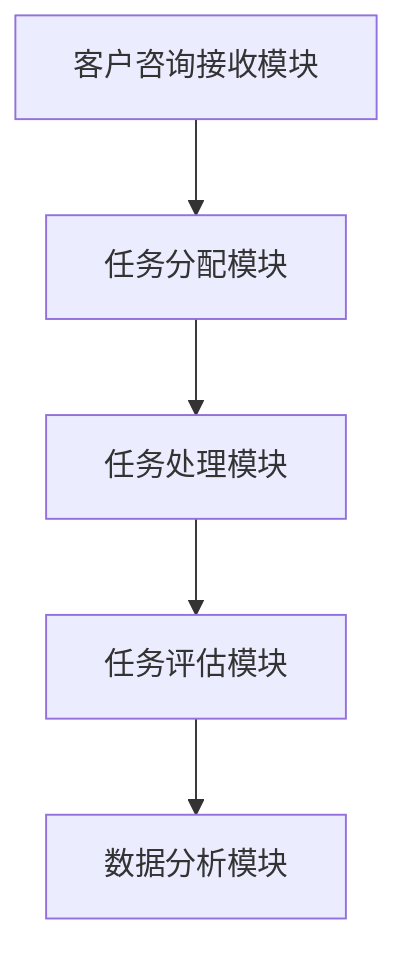

###### 3.3.2 人工智能在客服中的应用

人工智能在客户服务中扮演着关键角色，通过智能客服机器人、自然语言处理和机器学习等技术，提供高效、个性化的服务。

1. **智能客服机器人**：智能客服机器人可以自动接收和处理客户咨询，提供常见问题的自动解答，减轻人工客服的负担。
2. **自然语言处理**：自然语言处理技术用于理解和处理客户的自然语言咨询，实现语义理解和智能回复。
3. **机器学习**：机器学习技术用于分析客户咨询数据，发现客户需求和偏好，提供个性化的服务推荐。

以下是一个智能客服机器人的示例：

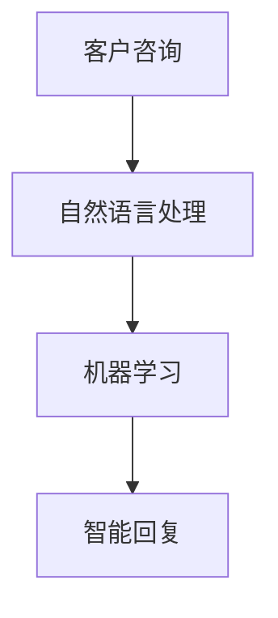

###### 3.3.3 众包客服系统的优化与挑战

优化众包客服系统以提高服务质量和客户满意度是关键目标。以下是一些优化策略和挑战：

1. **任务匹配**：通过智能匹配算法，确保咨询任务与参与者的技能和经验相匹配，提高任务处理质量。
2. **服务质量评估**：建立严格的质量评估机制，对参与者提交的解答和反馈进行评估，确保服务质量。
3. **参与者管理**：管理参与者的注册、认证、培训和奖励，确保参与者的质量和积极性。
4. **系统稳定性**：确保客服系统的稳定运行，处理高峰期的客户咨询量。
5. **数据安全**：保护客户隐私和数据安全，防止数据泄露和滥用。

以下是一个众包客服系统优化与挑战的示例：

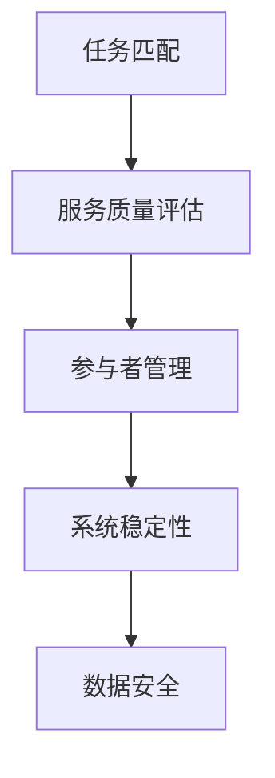

### 第三部分：AI驱动的众包生态系统

#### 第4章: AI驱动的众包生态系统

##### 4.1 众包社区建设

众包社区建设是构建AI驱动的众包生态系统的重要环节，通过建立有效的社区机制，可以激励参与者积极参与，提高众包平台的价值和影响力。

###### 4.1.1 众包社区的用户激励

用户激励是构建活跃众包社区的关键。以下是一些有效的用户激励策略：

1. **奖励制度**：为完成任务和提出有效建议的用户提供奖励，如虚拟货币、实物奖励和奖金等。
2. **排名机制**：通过用户积分和排名机制，激励用户参与度和竞争力，提高整体社区活跃度。
3. **社区荣誉**：设立社区荣誉奖项，表彰优秀用户和贡献者，提升用户的荣誉感和归属感。
4. **用户反馈**：定期收集用户反馈，及时回应用户需求和建议，增强用户的参与感和满意度。

以下是一个用户激励机制的示例：

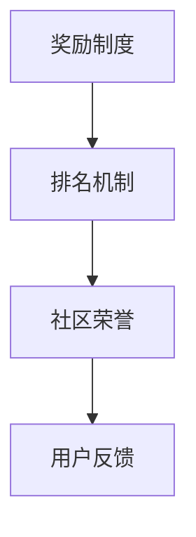

###### 4.1.2 社区管理与互动机制

社区管理和互动机制是维护和促进社区发展的关键。以下是一些关键策略：

1. **社区规则**：制定明确的社区规则，规范用户行为，维护社区秩序。
2. **管理员角色**：设立社区管理员，负责管理社区日常运营，处理用户问题和纠纷。
3. **用户互动**：鼓励用户之间的互动和合作，促进知识共享和经验交流。
4. **社区活动**：定期举办社区活动，如线上研讨会、知识竞赛和用户见面会等，增强用户参与感和归属感。

以下是一个社区管理和互动机制的示例：

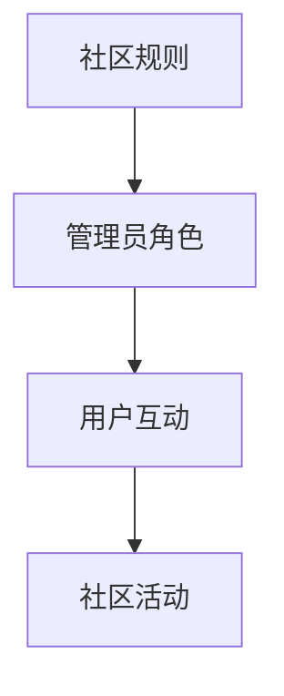

###### 4.1.3 社区成长与生态建设

社区成长和生态建设是众包社区长期发展的关键。以下是一些策略：

1. **用户增长**：通过市场营销、口碑传播和合作伙伴关系等手段，吸引更多用户参与。
2. **内容丰富**：鼓励用户提交高质量的内容和解决方案，丰富社区资源和知识库。
3. **合作伙伴**：与其他企业和组织建立合作关系，共同推动社区发展和生态建设。
4. **技术创新**：不断引入新技术和创新模式，提升社区的技术水平和竞争力。

以下是一个社区成长和生态建设的示例：

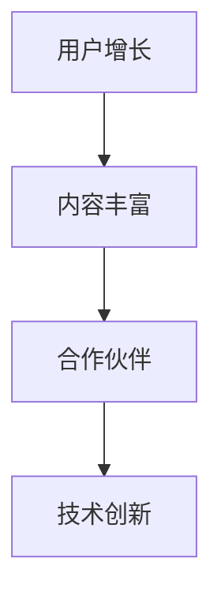

##### 4.2 AI驱动的协作创新

协作创新是AI驱动的众包生态系统中的重要组成部分，通过整合众包和人工智能技术，可以激发集体的智慧和创造力，实现更高效、更创新的工作方式。

###### 4.2.1 协作式创新的理论与实践

协作式创新（Collaborative Innovation）是指通过多方协作和知识共享，共同实现创新目标的过程。其理论基础包括：

1. **集体智慧**：集体智慧（Collective Wisdom）认为，集体的智慧和创造力远超过个体，通过协作可以产生更好的创新成果。
2. **知识共享**：知识共享（Knowledge Sharing）强调通过分享知识和经验，促进团队成员之间的协作和创新。
3. **社会网络分析**：社会网络分析（Social Network Analysis）用于分析协作网络中的关系和影响力，优化协作结构和流程。

以下是一个协作式创新的理论与实践的示例：

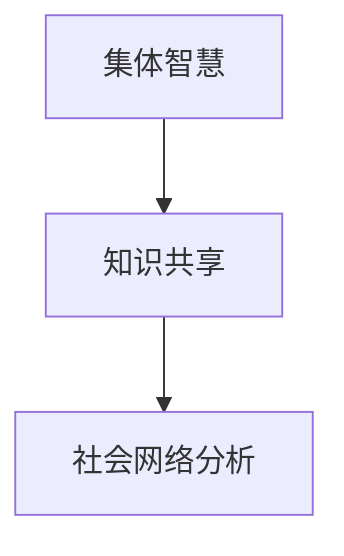

###### 4.2.2 众包与人工智能的协同效应

众包和人工智能技术在协作创新中可以相互补充，发挥协同效应。以下是一些关键协同效应：

1. **任务分解与分配**：人工智能可以自动分解大型任务，将其分配给合适的参与者，实现更高效的协作。
2. **实时反馈与优化**：人工智能可以实时收集和分析参与者提交的反馈，优化协作流程和任务分配。
3. **知识发现与整合**：人工智能可以分析大量数据，发现新的知识模式和机会，促进创新和协作。
4. **智能化决策支持**：人工智能可以提供数据分析和预测，为协作创新提供决策支持。

以下是一个众包与人工智能协同效应的示例：

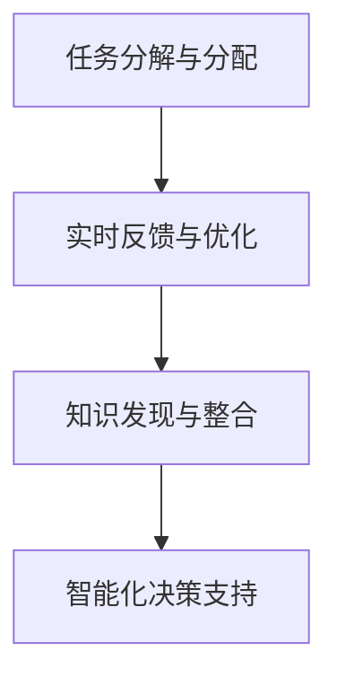

###### 4.2.3 创新生态系统的构建

构建创新生态系统是推动AI驱动的众包协作创新的关键。以下是一些关键步骤：

1. **明确创新目标**：明确创新目标和方向，确保协作创新与业务目标一致。
2. **建立协作平台**：建立支持协作创新的技术平台，包括众包平台、人工智能工具和数据分析平台等。
3. **激励与奖励机制**：建立有效的激励和奖励机制，激发参与者的积极性和创造力。
4. **知识共享与交流**：促进团队成员之间的知识共享和交流，建立学习型组织。
5. **持续改进与优化**：通过反馈和改进，不断优化创新生态系统，提升协作创新的效果。

以下是一个创新生态系统构建的示例：

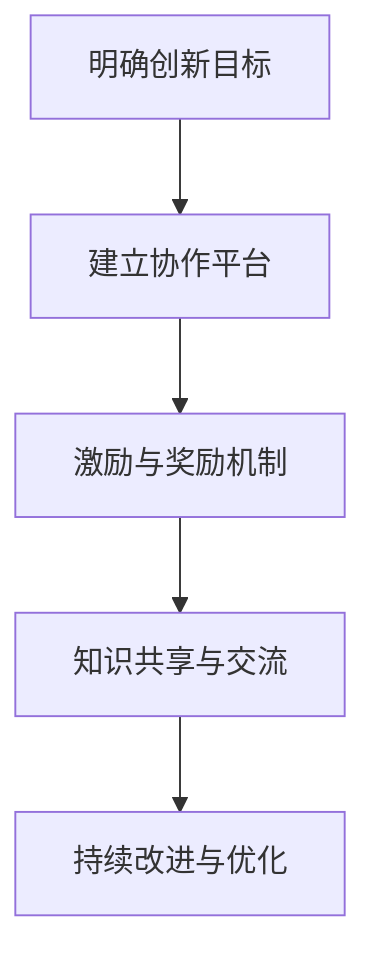

##### 4.3 AI驱动的众包平台案例分析

为了更好地理解AI驱动的众包平台在实践中的应用，我们可以分析一些典型的案例，了解其关键技术和成功策略。

###### 4.3.1 典型案例介绍

以下是一些AI驱动的众包平台典型案例：

1. **Topcoder**：Topcoder是一个全球性的在线众包平台，提供编程竞赛、软件开发和设计任务。通过众包模式，企业可以快速获得高质量的技术解决方案。
2. **Kaggle**：Kaggle是一个数据科学竞赛平台，提供各种数据科学和机器学习竞赛。参与者通过提交解决方案，共同推动数据科学领域的发展。
3. **Upwork**：Upwork是一个全球性的自由职业者平台，提供各种远程工作任务，包括编程、设计、写作等。企业可以通过众包模式快速找到合适的自由职业者。

以下是一个Topcoder案例介绍的示例：

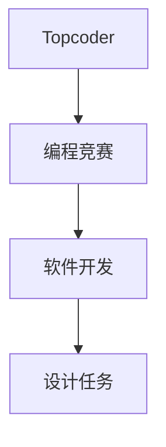

###### 4.3.2 案例中的关键技术与策略

以下是一些典型案例中的关键技术和成功策略：

1. **Topcoder**：利用人工智能算法（如协同过滤、聚类和预测模型）进行任务匹配和评估，提高任务完成质量和效率。
2. **Kaggle**：通过大数据分析和机器学习技术，对参赛者的解决方案进行评估和排名，推动数据科学领域的发展。
3. **Upwork**：采用智能匹配算法和用户评价体系，确保任务与参与者的匹配和质量。

以下是一个关键技术与策略的示例：

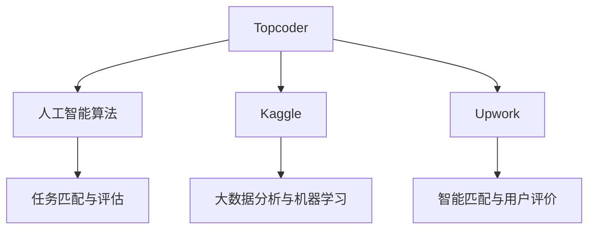

###### 4.3.3 案例的评价与启示

通过对典型AI驱动的众包平台案例的分析，我们可以得出以下评价与启示：

1. **成功因素**：成功案例的关键因素包括利用人工智能算法优化任务匹配和评估、建立有效的社区激励机制、以及提供优质的用户体验。
2. **挑战与机遇**：AI驱动的众包面临数据质量、隐私保护和安全风险等挑战，但也带来了提高效率、降低成本和创新的机会。
3. **发展建议**：未来，AI驱动的众包平台应进一步优化算法和技术，提高任务完成质量和效率；同时，加强社区建设和用户激励，提升用户体验和参与度。

以下是一个案例评价与启示的示例：

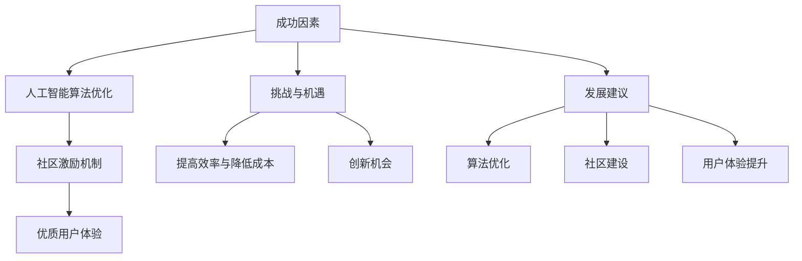

### 第四部分：AI驱动的众包实践

#### 第5章: AI驱动的众包项目规划与管理

##### 5.1 项目规划

项目规划是AI驱动的众包项目成功实施的关键环节，它涉及明确项目目标、确定资源需求、制定时间计划和风险管理等多个方面。以下是一个AI驱动的众包项目规划的具体步骤：

###### 5.1.1 项目目标与范围确定

项目目标应明确、具体、可衡量，并与组织的战略目标保持一致。以下步骤有助于确定项目目标和范围：

1. **目标设定**：确定项目的核心目标和预期成果，如提高产品创新效率、降低运营成本等。
2. **范围定义**：明确项目的范围，包括要解决的问题、涉及的领域、参与人员和任务等。
3. **利益相关者分析**：识别项目的利益相关者，包括任务发起者、参与者、平台运营商和监管机构等，了解他们的需求和期望。

以下是一个项目目标与范围确定的示例：

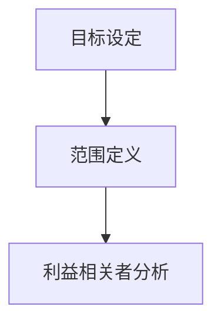

###### 5.1.2 项目资源与时间规划

资源规划和时间规划是确保项目顺利执行的重要保障。以下步骤有助于制定资源与时间规划：

1. **资源需求分析**：分析项目所需的资源，包括人力、资金、技术和设备等，并根据资源需求制定预算。
2. **时间线制定**：制定项目的时间线，包括关键里程碑、任务完成时间和项目交付时间。
3. **风险评估**：评估项目可能面临的风险，如技术挑战、资源不足、市场变化等，并制定相应的应对策略。

以下是一个资源与时间规划的示例：

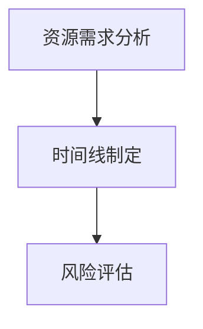

###### 5.1.3 风险管理与应对策略

风险管理是项目规划的重要组成部分，以下步骤有助于进行风险管理：

1. **风险识别**：识别项目可能面临的风险，如技术风险、市场风险、法律风险等。
2. **风险评估**：对识别出的风险进行评估，包括风险的发生概率和影响程度。
3. **应对策略制定**：制定应对策略，包括风险避免、风险转移、风险缓解和风险接受等。

以下是一个风险管理与应对策略的示例：

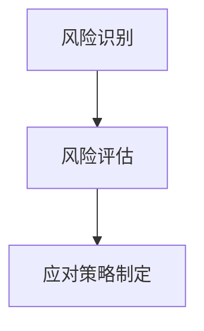

##### 5.2 项目执行

项目执行是项目规划的具体实施阶段，包括任务分配、任务执行、进度监控和质量控制等方面。以下是一个AI驱动的众包项目执行的具体步骤：

###### 5.2.1 任务分配与人员管理

任务分配是确保项目顺利进行的关键。以下步骤有助于任务分配和人员管理：

1. **任务分解**：将项目目标分解为具体的任务，明确任务的具体要求、时间和责任人。
2. **人员招募**：根据任务需求，招募合适的参与者，包括任务执行者、评估者和项目管理团队。
3. **角色分配**：明确每个参与者的角色和职责，确保任务的顺利执行。

以下是一个任务分配与人员管理的示例：

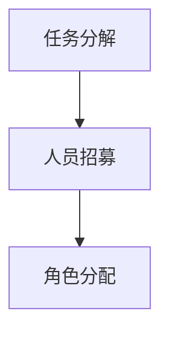

###### 5.2.2 进度监控与调整

进度监控是确保项目按时完成的重要手段。以下步骤有助于进度监控与调整：

1. **制定进度计划**：根据任务时间和责任人，制定项目进度计划，明确每个阶段的完成时间和里程碑。
2. **实时监控**：通过项目管理工具实时监控项目进度，及时发现和解决问题。
3. **进度调整**：根据实际情况调整进度计划，确保项目按时完成。

以下是一个进度监控与调整的示例：

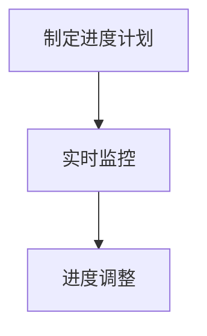

###### 5.2.3 质量控制与反馈循环

质量控制是确保项目成果符合预期的重要保障。以下步骤有助于质量控制与反馈循环：

1. **制定质量标准**：根据项目目标和需求，制定具体的质量标准，如任务完成质量、数据准确性和用户体验等。
2. **质量控制**：执行质量检查，确保项目成果符合质量标准。
3. **反馈循环**：收集用户和参与者的反馈，及时调整项目策略和流程，提高项目质量。

以下是一个质量控制与反馈循环的示例：

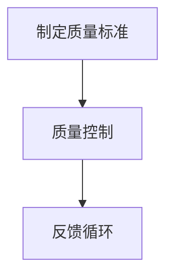

##### 5.3 项目评估

项目评估是项目执行结束后对项目成果和过程进行全面审查和总结，以评估项目的成功程度和提供改进建议。以下是一个AI驱动的众包项目评估的具体步骤：

###### 5.3.1 项目成果评估方法

项目成果评估方法包括以下几个方面：

1. **定量评估**：使用量化的指标，如任务完成率、数据准确率、用户满意度等，对项目成果进行评估。
2. **定性评估**：通过用户反馈、专家评审和访谈等方式，对项目成果进行定性评估，了解用户和参与者的真实体验和意见。
3. **成本效益分析**：计算项目的总成本和预期效益，进行成本效益分析，评估项目的经济合理性。

以下是一个项目成果评估方法的示例：

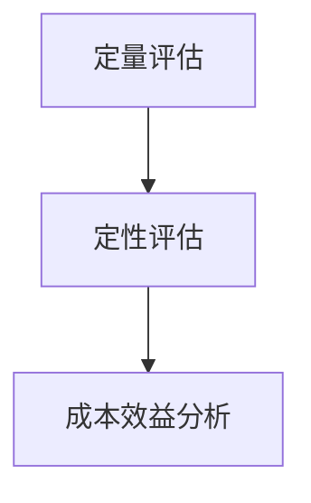

###### 5.3.2 项目成本效益分析

项目成本效益分析是评估项目价值的重要手段。以下步骤有助于进行成本效益分析：

1. **成本计算**：计算项目的总成本，包括人力成本、技术成本、设备成本等。
2. **效益计算**：计算项目的预期效益，如提高效率、降低成本、增加收入等。
3. **效益成本比分析**：计算效益成本比（B/C），评估项目的经济合理性。

以下是一个项目成本效益分析的示例：

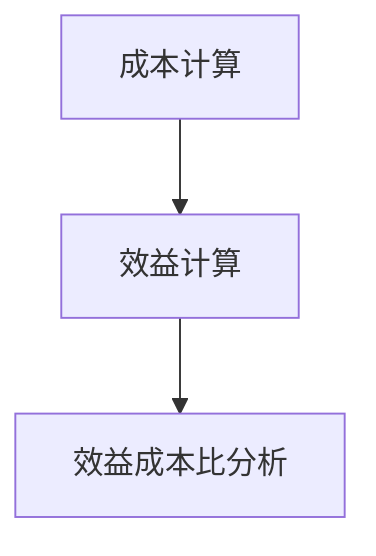

###### 5.3.3 项目持续改进策略

项目持续改进策略是确保项目长期成功的关键。以下步骤有助于制定持续改进策略：

1. **问题识别**：通过评估结果和用户反馈，识别项目中的问题和不足。
2. **原因分析**：分析问题产生的原因，确定改进的方向和目标。
3. **改进措施制定**：制定具体的改进措施，如优化任务分配、提高质量标准、改进用户界面等。
4. **实施与跟踪**：实施改进措施，并跟踪改进效果，确保持续改进的有效性。

以下是一个项目持续改进策略的示例：

```mermaid
graph TB
A[问题识别] --> B[原因分析]
B --> C[改进措施制定]
C --> D[实施与跟踪]
```

### 第五部分：AI驱动的众包项目案例实战

#### 第6章: AI驱动的众包项目案例实战

##### 6.1 创意设计众包案例

###### 6.1.1 项目背景与目标

某知名电子产品公司希望在产品外观设计方面进行创新，提升用户满意度，并希望通过众包平台收集全球设计师的创意。公司制定了以下项目目标：

1. **设计创新**：通过众包平台收集创新的、独特的外观设计方案。
2. **用户参与**：鼓励用户参与设计评审，提高用户满意度和忠诚度。
3. **降低成本**：通过众包模式降低外观设计成本。

###### 6.1.2 案例实施过程

该项目的实施过程分为以下几个阶段：

1. **任务发布**：公司通过众包平台发布外观设计任务，包括设计要求、奖励机制和时间限制。
2. **创意征集**：全球设计师在规定时间内提交设计作品，通过平台上传和展示。
3. **评审与投票**：公司内部评审团对提交的作品进行评审，用户在平台上进行投票，选出最佳设计。
4. **优化设计**：根据评审结果和用户反馈，对入选的设计方案进行优化，最终确定产品外观设计。
5. **反馈与奖励**：为获奖者颁发奖励，并收集用户反馈，为后续产品设计提供参考。

以下是一个创意设计众包案例实施过程的示例：

```mermaid
graph TB
A[任务发布] --> B[创意征集]
B --> C[评审与投票]
C --> D[优化设计]
D --> E[反馈与奖励]
```

###### 6.1.3 案例结果分析与总结

项目实施后，公司获得了大量高质量的设计方案，用户参与度和满意度显著提高。以下是对案例结果的分析和总结：

1. **设计创新**：通过众包平台，公司收集到多个创新的设计方案，部分设计甚至超越了公司内部设计师的能力。
2. **用户参与**：用户参与度显著提高，用户在投票和反馈环节中积极参与，提供了宝贵的意见和建议。
3. **成本降低**：通过众包模式，公司降低了设计成本，节省了人力资源和外部设计费用。
4. **持续改进**：基于用户反馈和优化结果，公司持续改进产品设计，提升用户体验。

以下是一个案例结果分析与总结的示例：

```mermaid
graph TB
A[设计创新] --> B[用户参与]
B --> C[成本降低]
C --> D[持续改进]
```

##### 6.2 数据标注众包案例

###### 6.2.1 项目背景与需求

某大型互联网公司计划开发一款智能助手，需要大量高质量的数据用于训练和优化机器学习模型。公司制定了以下项目目标：

1. **数据收集**：收集大量标注数据，包括文本、图像和语音等，用于训练机器学习模型。
2. **质量保证**：确保标注数据的准确性和一致性，提高模型性能。
3. **降低成本**：通过众包模式降低数据标注成本。

###### 6.2.2 案例实施过程

该项目的实施过程分为以下几个阶段：

1. **任务发布**：公司通过众包平台发布数据标注任务，包括任务说明、标注规则和奖励机制。
2. **标注任务分配**：根据任务类型和参与者技能，智能分配标注任务。
3. **标注与审核**：参与者进行标注工作，完成后提交标注结果。平台进行自动评估和人工审核，确保标注质量。
4. **数据整合**：将标注数据整合到公司的数据集中，用于训练和优化模型。
5. **反馈与改进**：根据模型训练结果和用户反馈，不断优化标注任务和审核机制。

以下是一个数据标注众包案例实施过程的示例：

```mermaid
graph TB
A[任务发布] --> B[标注任务分配]
B --> C[标注与审核]
C --> D[数据整合]
D --> E[反馈与改进]
```

###### 6.2.3 案例结果分析与总结

项目实施后，公司获得了高质量的数据集，用于训练和优化智能助手的机器学习模型。以下是对案例结果的分析和总结：

1. **数据质量**：通过自动评估和人工审核机制，确保标注数据的准确性和一致性，提高了模型性能。
2. **成本效益**：通过众包模式，公司有效降低了数据标注成本，提高了资源利用效率。
3. **参与者满意度**：参与者在任务完成后获得了奖励，满意度较高，部分参与者表示愿意再次参与类似任务。
4. **持续改进**：基于用户反馈和模型训练结果，公司不断优化标注任务和审核机制，提高数据标注质量。

以下是一个案例结果分析与总结的示例：

```mermaid
graph TB
A[数据质量] --> B[成本效益]
B --> C[参与者满意度]
C --> D[持续改进]
```

##### 6.3 客户服务众包案例

###### 6.3.1 项目背景与目标

某大型电商平台希望通过众包模式提升客户服务质量，提高用户满意度和忠诚度。公司制定了以下项目目标：

1. **服务质量提升**：通过众包客服系统，提供高效、个性化的客户服务。
2. **降低成本**：通过众包模式降低客服成本，提高资源利用效率。
3. **用户满意度**：提高用户满意度，降低客户投诉率。

###### 6.3.2 案例实施过程

该项目的实施过程分为以下几个阶段：

1. **任务发布**：公司通过众包平台发布客服任务，包括常见问题和标准答案，以及奖励机制。
2. **任务分配**：平台根据客户咨询内容，智能匹配客服任务和合适的参与者。
3. **客服处理**：参与者接收到任务后，提供解答和反馈，确保客户问题得到及时解决。
4. **任务评估**：平台对参与者提交的解答和反馈进行评估，确保服务质量。
5. **反馈与改进**：根据用户反馈和客服数据，优化客服任务和评估机制，提高客服质量。

以下是一个客户服务众包案例实施过程的示例：

```mermaid
graph TB
A[任务发布] --> B[任务分配]
B --> C[客服处理]
C --> D[任务评估]
D --> E[反馈与改进]
```

###### 6.3.3 案例结果分析与总结

项目实施后，电商平台的客户服务质量得到显著提升，以下是对案例结果的分析和总结：

1. **服务质量提升**：通过众包客服系统，公司提供了高效、个性化的客户服务，用户满意度和忠诚度显著提高。
2. **成本降低**：通过众包模式，公司有效降低了客服成本，提高了资源利用效率。
3. **用户满意度**：用户满意度显著提高，客户投诉率下降，电商平台在用户中的口碑得到改善。
4. **持续改进**：基于用户反馈和客服数据，公司不断优化客服任务和评估机制，提高客服质量和用户满意度。

以下是一个案例结果分析与总结的示例：

```mermaid
graph TB
A[服务质量提升] --> B[成本降低]
B --> C[用户满意度]
C --> D[持续改进]
```

### 第六部分：AI驱动的众包未来发展趋势

#### 第7章: AI驱动的众包未来发展趋势

##### 7.1 众包与人工智能融合的未来

在未来，AI驱动的众包将继续融合和发展，成为企业创新和协作的重要工具。以下是一些未来发展趋势：

1. **智能化任务匹配**：随着人工智能技术的发展，众包平台将实现更智能的任务匹配，提高任务完成的效率和准确性。
2. **个性化用户体验**：AI技术将帮助众包平台更好地理解用户需求和偏好，提供个性化的用户体验和服务。
3. **大规模协作创新**：AI驱动的众包将实现大规模协作创新，通过整合全球智慧和资源，推动创新和发展的边界。
4. **自动化任务执行**：AI技术将逐渐替代部分简单的众包任务，实现任务的自动化执行，提高众包效率和降低成本。

以下是一个AI驱动的众包未来发展趋势的示例：

```mermaid
graph TB
A[智能化任务匹配] --> B[个性化用户体验]
B --> C[大规模协作创新]
C --> D[自动化任务执行]
```

##### 7.2 AI驱动的众包在行业中的应用前景

AI驱动的众包在各个行业具有广泛的应用前景，以下是一些重点行业：

1. **制造业**：通过AI驱动的众包，企业可以优化产品设计、提高生产效率和降低成本，实现智能制造。
2. **建筑业**：AI驱动的众包可以帮助建筑企业优化工程设计、提高施工质量和降低成本，推动建筑行业的数字化转型。
3. **咨询服务业**：AI驱动的众包可以为咨询企业提供更广泛的数据和分析支持，提高咨询服务的质量和效率。
4. **医疗健康**：AI驱动的众包可以帮助医疗企业收集和分析大量医疗数据，提高疾病诊断和治疗水平。

以下是一个AI驱动的众包在行业中的应用前景的示例：

```mermaid
graph TB
A[制造业] --> B[建筑业]
B --> C[咨询服务业]
C --> D[医疗健康]
```

##### 7.3 AI驱动的众包面临的挑战与应对策略

尽管AI驱动的众包具有巨大的潜力，但也面临一些挑战。以下是一些关键挑战及其应对策略：

1. **数据质量与隐私保护**：数据质量和隐私保护是众包面临的主要挑战。应对策略包括建立完善的数据治理机制和隐私保护算法。
2. **安全风险与合规性**：众包平台可能面临安全风险和合规性挑战。应对策略包括加强安全防护和合规性管理，确保平台运营合法合规。
3. **技术门槛与普及**：AI驱动的众包需要较高的技术水平和专业知识。应对策略包括提供技术支持和培训，降低技术门槛，普及AI驱动的众包。
4. **用户体验与满意度**：用户体验和满意度是影响众包平台成功的关键。应对策略包括优化用户界面和服务，提高用户满意度和参与度。

以下是一个AI驱动的众包面临的挑战与应对策略的示例：

```mermaid
graph TB
A[数据质量与隐私保护] --> B[安全风险与合规性]
B --> C[技术门槛与普及]
C --> D[用户体验与满意度]
```

### 附录

#### 附录 A: AI驱动的众包资源与工具

为了更好地了解AI驱动的众包，以下列出了一些常用的开源众包平台、AI开发工具和数据集资源：

##### A.1 开源众包平台

1. **Mechanical Turk**：Amazon提供的众包平台，适用于各种短期、简单任务。
2. **Topcoder**：全球性的编程和设计竞赛平台，提供高质量的解决方案。
3. **Kaggle**：数据科学竞赛平台，提供丰富的数据集和工具。
4. **Upwork**：全球性的自由职业者平台，适用于各种远程工作任务。

##### A.2 AI开发工具

1. **TensorFlow**：Google开发的开源机器学习框架，适用于各种AI应用。
2. **PyTorch**：Facebook开发的深度学习框架，具有动态计算图和灵活的API。
3. **Keras**：基于TensorFlow和Theano的深度学习高级API，简化了深度学习模型的构建和训练。
4. **spaCy**：Python语言的高级自然语言处理库，提供快速、精确的文本解析和实体识别功能。

##### A.3 数据集与案例资源

1. **Common Crawl**：互联网上的大规模网页数据集，适用于自然语言处理和文本分析。
2. **ImageNet**：大规模的图像数据集，广泛用于计算机视觉研究。
3. **MOOC数据集**：大规模的在线开放课程数据集，适用于教育数据分析。

通过这些资源，开发者可以更好地了解和实践AI驱动的众包，推动创新和发展。

### 附录 B: 参考文献

为了支持本文的内容，以下列出了一些相关的参考文献：

1. **Jeff Howe**. (2006). **Crowdsourcing**. Wired Magazine, June.
2. **Ian Goodfellow, Yann LeCun, and Andrew Ng**. (2016). **Deep Learning**. MIT Press.
3. **Tom Mitchell**. (1997). **Machine Learning**. McGraw-Hill.
4. **Jurafsky, Daniel, and James H. Martin**. (2019). **Speech and Language Processing**. Pearson.
5. **Christopher M. Bishop**. (2006). **Pattern Recognition and Machine Learning**. Springer.
6. **Yaser Abu-Mostafa, Shai Shalev-Shwartz, and Amir Shpilka**. (2012). **Online Learning and Support Vector Machines**. Journal of Machine Learning Research.
7. **David S. brothers**. (2017). **Natural Language Processing with Python**. O'Reilly Media.

这些文献为本文提供了理论基础和实践指导，有助于读者深入了解AI驱动的众包和相关技术。

