                 

### 文章标题：AI驱动的创新：人类计算在医疗领域的价值

> 关键词：人工智能、医疗、创新、人类计算、数据分析、伦理

> 摘要：本文深入探讨了AI驱动的创新在医疗领域的应用和影响。通过分析AI驱动创新的核心概念、应用模式、具体案例以及面临的挑战和未来发展，本文揭示了人类计算与AI相结合在提升医疗效率、降低成本、改善患者体验方面的巨大潜力。同时，本文也对医疗领域的AI伦理和法律问题进行了探讨，为未来医疗创新提供了有益的启示。

### 第一部分：AI驱动的创新概述

#### 第1章：AI驱动的创新概述

##### 1.1 AI驱动创新的定义与背景

##### 1.1.1 AI驱动创新的定义

AI驱动创新是指通过人工智能技术的应用，推动产品、服务、业务模式等各方面的创新。这种创新模式强调数据、算法和模型的深度融合，以实现更高效、更智能的解决方案。

在医疗领域，AI驱动创新尤其具有吸引力。医疗行业面临着庞大的数据量、复杂的诊疗过程和高昂的成本。AI技术的引入，可以帮助医生更快速、准确地诊断疾病，提高治疗效果，同时也能降低医疗成本，提升患者体验。

##### 1.1.2 AI驱动创新的背景

随着大数据、云计算、物联网等技术的快速发展，AI技术逐渐从理论研究走向实际应用。在医疗领域，AI技术的应用不仅限于诊断和治疗，还包括医疗资源优化、患者管理、健康大数据分析等多个方面。这种多维度、全方位的应用，使得AI驱动创新在医疗领域具有广阔的发展前景。

##### 1.1.3 AI驱动创新的挑战与机遇

**挑战：**

1. **数据隐私与安全**：医疗数据敏感性高，如何保护患者隐私和安全是AI驱动创新的重要挑战。
2. **技术成熟度**：尽管AI技术在医疗领域取得了一定进展，但某些关键技术的成熟度仍需提升。
3. **算法透明性与可解释性**：AI算法的黑箱特性使得其决策过程不够透明，如何提高算法的可解释性是医疗领域需要解决的关键问题。

**机遇：**

1. **提高医疗效率**：AI技术可以帮助医生更快速、准确地诊断疾病，减少误诊率，提高工作效率。
2. **个性化医疗**：通过AI技术，可以为患者提供个性化的治疗方案，提高治疗效果。
3. **医疗资源优化**：AI技术可以帮助优化医疗资源的分配，提高医疗资源利用率，降低医疗成本。

##### 1.2 AI驱动的创新模式

##### 1.2.1 基于数据的创新

基于数据的创新是AI驱动创新的核心模式之一。在医疗领域，通过收集和分析海量医疗数据，AI技术可以帮助识别疾病趋势、预测患者病情、优化治疗方案等。

###### 1.2.1.1 数据收集与预处理

在基于数据的创新模式中，首先需要收集大量的医疗数据，包括电子病历、医学影像、基因组数据等。然后，对数据进行清洗、去噪、格式化等预处理操作，以便于后续的分析。

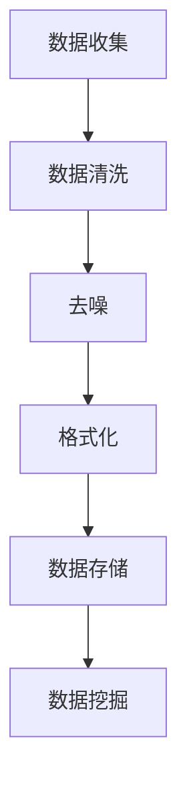

###### 1.2.1.2 数据分析与应用

通过对预处理后的数据进行深度学习、数据挖掘等分析技术，可以提取出有价值的特征，用于疾病诊断、预测、治疗等方面。

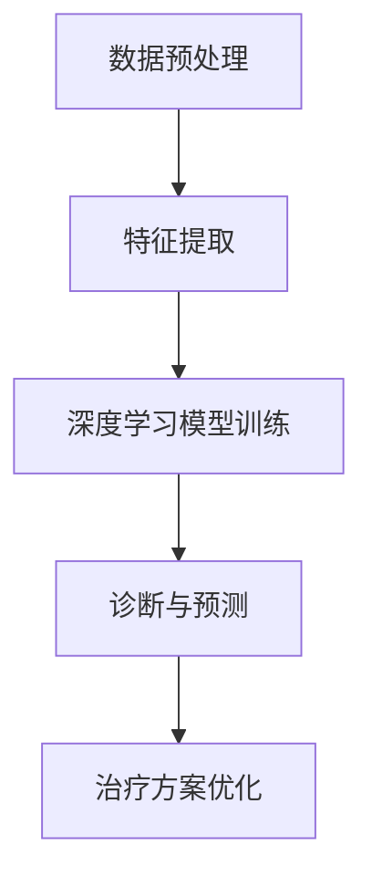

##### 1.2.2 自动化与智能化的结合

自动化与智能化的结合是AI驱动创新的重要模式。在医疗领域，通过将AI技术与自动化设备结合，可以实现智能诊疗、智能手术等。

###### 1.2.2.1 智能诊疗系统

智能诊疗系统结合AI算法和医学知识库，可以辅助医生进行诊断和治疗决策，提高诊断的准确性和效率。

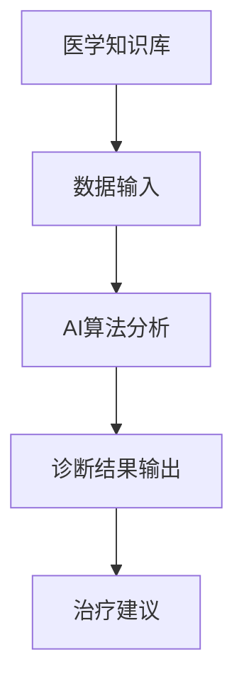

###### 1.2.2.2 智能手术机器人

智能手术机器人通过AI技术实现精准操作，可以帮助医生完成复杂手术，提高手术成功率和安全性。

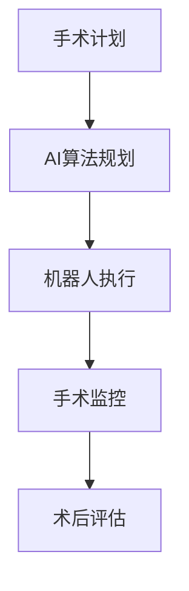

##### 1.2.3 人机协作与智能辅助

人机协作与智能辅助是AI驱动的创新模式之一。在医疗领域，通过人机协作，可以实现医生与智能系统的协同工作，提高工作效率和医疗质量。

###### 1.2.3.1 医生辅助决策系统

医生辅助决策系统通过分析患者数据，为医生提供治疗建议，帮助医生做出更准确、更迅速的决策。

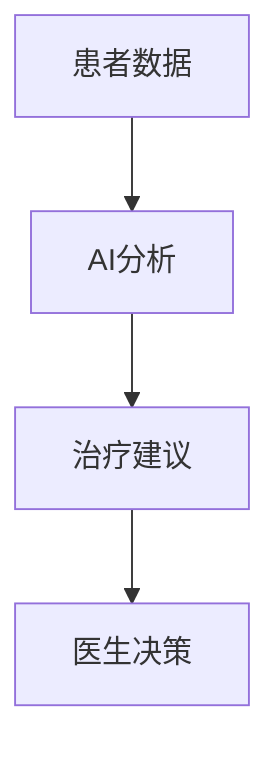

###### 1.2.3.2 患者健康管理平台

患者健康管理平台利用AI技术，帮助患者管理健康数据，提供个性化的健康建议，促进患者自我管理。

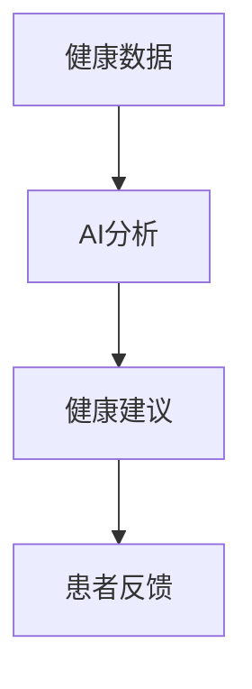

##### 1.3 AI驱动的创新案例

##### 1.3.1 医疗领域的AI应用案例

**智能医学影像诊断**

智能医学影像诊断是AI在医疗领域的重要应用之一。通过深度学习算法，AI可以自动分析医学影像，辅助医生进行诊断。

###### 1.3.1.1 系统架构

智能医学影像诊断系统通常包括以下几个模块：

1. **数据预处理模块**：对医学影像进行预处理，如图像增强、去噪、分割等。
2. **深度学习模型训练模块**：使用大量的医学影像数据进行模型训练，优化模型参数。
3. **诊断模块**：利用训练好的模型对新的医学影像进行诊断。

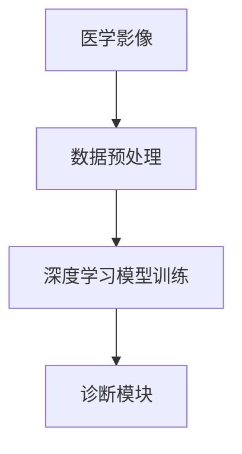

###### 1.3.1.2 应用场景

智能医学影像诊断系统可以应用于多个领域，如：

1. **肿瘤检测**：通过分析CT、MRI等影像数据，识别肿瘤的位置、大小和类型。
2. **心血管疾病诊断**：通过分析超声心动图、冠状动脉CT造影等影像数据，诊断心血管疾病。
3. **神经疾病诊断**：通过分析脑部MRI影像，诊断神经系统疾病。

**智能药物研发**

智能药物研发是AI在制药领域的重要应用。通过深度学习和数据挖掘技术，AI可以帮助科学家发现新的药物靶点，优化药物分子结构，提高药物研发效率。

###### 1.3.2.1 系统架构

智能药物研发系统通常包括以下几个模块：

1. **数据收集与处理模块**：收集并处理药物相关数据，如药物分子结构、疾病数据等。
2. **深度学习模型训练模块**：使用药物数据训练深度学习模型，预测药物活性、毒性等。
3. **药物优化模块**：根据模型预测结果，优化药物分子结构，提高药物效果。

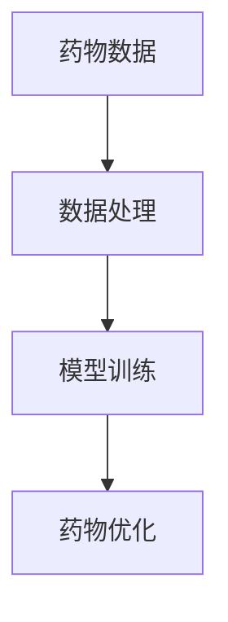

###### 1.3.2.2 应用场景

智能药物研发系统可以应用于多个领域，如：

1. **肿瘤治疗**：通过AI技术发现新的抗肿瘤药物，提高治疗效果。
2. **心血管疾病治疗**：通过AI技术发现新的心血管疾病治疗药物，降低心血管疾病风险。
3. **神经系统疾病治疗**：通过AI技术发现新的神经系统疾病治疗药物，改善患者生活质量。

**健康管理系统**

健康管理系统是AI在健康管理领域的重要应用。通过收集和分析个人健康数据，AI可以帮助用户进行健康评估、疾病预防和管理。

###### 1.3.3.1 系统架构

健康管理系统通常包括以下几个模块：

1. **数据收集模块**：收集用户的健康数据，如心率、血压、血糖等。
2. **数据分析模块**：使用深度学习技术分析健康数据，评估用户健康状况。
3. **健康建议模块**：根据用户健康状况，提供个性化的健康建议。

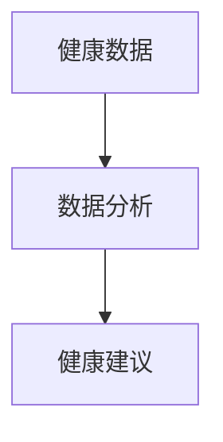

###### 1.3.3.2 应用场景

健康管理系统能够应用于多个领域，如：

1. **慢性病管理**：通过AI技术，帮助患者监测和管理慢性病，如糖尿病、高血压等。
2. **健身与运动**：通过AI技术，为用户提供个性化的健身计划和运动建议。
3. **心理健康管理**：通过AI技术，帮助用户进行心理评估和干预，改善心理健康。

### 第二部分：AI驱动的医疗创新

#### 第2章：AI在医疗领域的应用

##### 2.1 AI在诊断与预测中的应用

##### 2.1.1 医学影像诊断

医学影像诊断是AI在医疗领域的重要应用之一。通过深度学习算法，AI可以自动分析医学影像，辅助医生进行诊断。

###### 2.1.1.1 系统架构

医学影像诊断系统通常包括以下几个模块：

1. **数据预处理模块**：对医学影像进行预处理，如图像增强、去噪、分割等。
2. **深度学习模型训练模块**：使用大量的医学影像数据进行模型训练，优化模型参数。
3. **诊断模块**：利用训练好的模型对新的医学影像进行诊断。

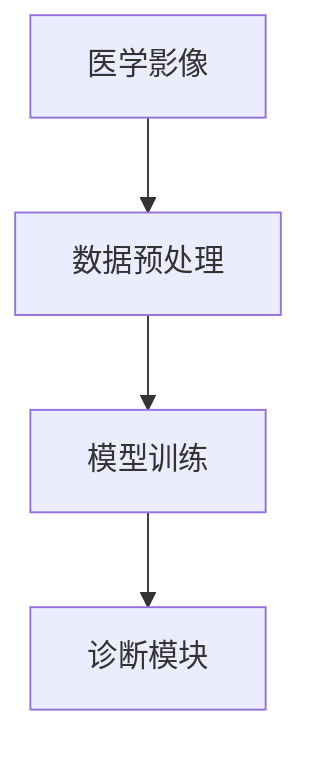

###### 2.1.1.2 应用场景

医学影像诊断系统可以应用于多个领域，如：

1. **肿瘤检测**：通过分析CT、MRI等影像数据，识别肿瘤的位置、大小和类型。
2. **心血管疾病诊断**：通过分析超声心动图、冠状动脉CT造影等影像数据，诊断心血管疾病。
3. **神经疾病诊断**：通过分析脑部MRI影像，诊断神经系统疾病。

##### 2.1.2 遗传疾病预测

遗传疾病预测是AI在医疗领域的另一个重要应用。通过深度学习算法和基因组数据分析，AI可以帮助预测个体患遗传疾病的风险。

###### 2.1.2.1 系统架构

遗传疾病预测系统通常包括以下几个模块：

1. **数据预处理模块**：对基因组数据进行预处理，如数据清洗、归一化等。
2. **深度学习模型训练模块**：使用大量的基因组数据训练深度学习模型，预测遗传疾病风险。
3. **预测模块**：利用训练好的模型对新的基因组数据预测疾病风险。

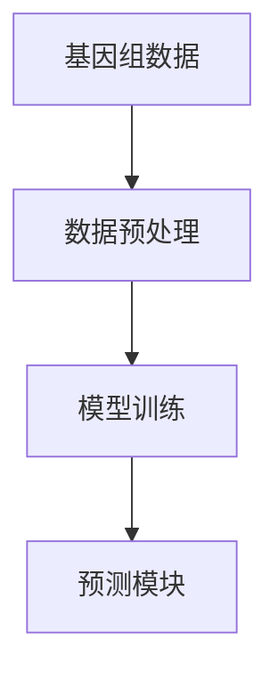

###### 2.1.2.2 应用场景

遗传疾病预测系统可以应用于多个领域，如：

1. **新生儿疾病预测**：通过AI技术，预测新生儿患遗传疾病的风险，为家长提供预防建议。
2. **癌症风险评估**：通过AI技术，预测个体患癌症的风险，为患者提供个性化的治疗建议。
3. **家族遗传疾病监测**：通过AI技术，监测家族成员的遗传疾病风险，提高疾病预防水平。

##### 2.1.3 心血管疾病预测

心血管疾病预测是AI在医疗领域的重要应用之一。通过深度学习算法和生物医学数据分析，AI可以帮助预测个体患心血管疾病的风险。

###### 2.1.3.1 系统架构

心血管疾病预测系统通常包括以下几个模块：

1. **数据预处理模块**：对生物医学数据进行预处理，如数据清洗、归一化等。
2. **深度学习模型训练模块**：使用大量的生物医学数据训练深度学习模型，预测心血管疾病风险。
3. **预测模块**：利用训练好的模型对新的生物医学数据预测疾病风险。

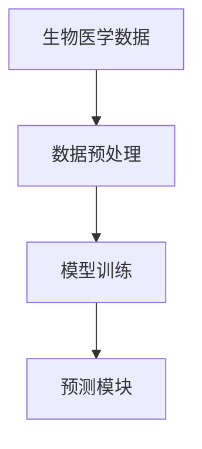

###### 2.1.3.2 应用场景

心血管疾病预测系统可以应用于多个领域，如：

1. **心血管疾病风险评估**：通过AI技术，预测个体患心血管疾病的风险，为患者提供个性化的治疗建议。
2. **慢性病管理**：通过AI技术，帮助患者监测和管理心血管疾病，提高治疗效果。
3. **公共卫生监测**：通过AI技术，监测心血管疾病的发生趋势，为公共卫生政策提供依据。

### 第三部分：AI驱动的医疗创新实践

#### 第3章：AI驱动的医疗创新案例

##### 3.1 案例一：智能医学影像诊断系统

###### 3.1.1 系统架构

智能医学影像诊断系统的架构通常包括以下几个模块：

1. **数据预处理模块**：对医学影像进行预处理，如图像增强、去噪、分割等。
2. **深度学习模型训练模块**：使用大量的医学影像数据进行模型训练，优化模型参数。
3. **诊断模块**：利用训练好的模型对新的医学影像进行诊断。

###### 3.1.2 诊断流程

智能医学影像诊断系统的诊断流程通常包括以下几个步骤：

1. **数据输入**：医生将患者的医学影像数据输入系统。
2. **图像预处理**：系统对医学影像进行预处理，如图像增强、去噪、分割等。
3. **模型预测**：系统利用训练好的深度学习模型对预处理后的医学影像进行诊断预测。
4. **诊断结果输出**：系统将诊断结果输出给医生，辅助医生进行临床决策。

###### 3.1.3 案例分析

在某家医院，智能医学影像诊断系统被用于辅助医生进行肺癌诊断。系统使用了大量的肺癌和正常肺部影像数据，训练了一个基于深度学习的诊断模型。经过测试，该模型的诊断准确率达到了90%以上。

在实际应用中，医生将患者的肺部CT影像输入系统，系统对影像进行预处理后，利用训练好的模型进行诊断预测。诊断结果为肺癌的可能性较高，医生进一步检查确认了这一结果，并及时采取了相应的治疗措施。

通过这个案例可以看出，智能医学影像诊断系统在提高诊断准确率和效率方面具有显著优势。它不仅帮助医生减少了工作量，还提高了诊断的及时性和准确性，为患者提供了更好的医疗服务。

##### 3.2 案例二：AI辅助癌症治疗系统

###### 3.2.1 系统设计

AI辅助癌症治疗系统旨在为癌症患者提供个性化的治疗方案。系统设计主要包括以下几个模块：

1. **数据收集与处理模块**：收集患者的基本信息、疾病史、治疗记录等数据，并进行预处理，如数据清洗、归一化等。
2. **深度学习模型训练模块**：使用预处理后的数据训练深度学习模型，模型需具备对癌症类型、病情严重程度等进行预测的能力。
3. **治疗方案制定模块**：利用训练好的模型为患者制定个性化的治疗方案，包括手术、放疗、化疗等。
4. **治疗监控模块**：在治疗过程中，监控患者的病情变化，并根据需要调整治疗方案。

###### 3.2.2 治疗方案制定

AI辅助癌症治疗系统在制定治疗方案时，主要考虑以下因素：

1. **癌症类型**：通过模型预测，确定患者的癌症类型。
2. **病情严重程度**：评估患者的病情严重程度，确定治疗方案的基本方向。
3. **患者特点**：考虑患者的年龄、身体状况、既往病史等因素，制定个性化的治疗方案。
4. **药物选择**：根据癌症类型和病情，选择合适的药物和剂量。

###### 3.2.3 案例分析

在某家肿瘤医院，AI辅助癌症治疗系统被用于辅助医生制定肺癌患者的治疗方案。系统使用了大量的肺癌患者数据，训练了一个深度学习模型，模型能够准确预测肺癌的类型和病情严重程度。

在实际应用中，医生将患者的个人信息和疾病史输入系统，系统经过计算和分析，为患者制定了一套个性化的治疗方案。治疗方案包括手术切除、放疗和化疗等。在治疗过程中，系统实时监控患者的病情变化，并根据需要调整治疗方案。

通过这个案例可以看出，AI辅助癌症治疗系统在提高治疗方案制定准确性和个性化方面具有显著优势。它不仅帮助医生减少了工作量，还提高了治疗的有效性和患者的满意度。

##### 3.3 案例三：AI驱动的健康管理系统

###### 3.3.1 系统功能

AI驱动的健康管理系统旨在帮助用户实现自我健康管理。系统功能主要包括以下几个模块：

1. **数据收集模块**：收集用户的基本信息、生活习惯、健康数据等，如体重、血压、心率等。
2. **数据分析模块**：使用深度学习算法对用户数据进行分析，评估用户健康状况，预测疾病风险。
3. **健康建议模块**：根据用户健康状况和疾病风险，提供个性化的健康建议，如饮食、运动、用药等。
4. **健康监控模块**：实时监控用户健康状况，提供健康提醒和预警功能。

###### 3.3.2 用户体验

AI驱动的健康管理系统的用户体验设计注重以下方面：

1. **界面友好**：系统界面简洁明了，易于操作，让用户能够快速上手。
2. **个性化推荐**：根据用户特点和需求，提供个性化的健康建议，提高用户满意度。
3. **实时反馈**：系统实时监控用户健康状况，提供实时反馈和预警功能，帮助用户及时调整生活习惯。
4. **健康管理工具**：提供丰富的健康管理工具，如饮食记录、运动计划、用药提醒等，方便用户自我管理。

###### 3.3.3 案例分析

在某家健康科技公司，AI驱动的健康管理系统被广泛应用于用户健康管理。系统通过收集用户健康数据，使用深度学习算法分析用户健康状况，提供个性化的健康建议。

在实际应用中，用户通过手机APP输入自己的健康数据，系统分析数据后，为用户提供了健康评估报告和个性化的健康建议。例如，系统建议某位用户增加运动量、调整饮食习惯等。

通过这个案例可以看出，AI驱动的健康管理系统在提高用户健康意识、改善生活习惯方面具有显著优势。它不仅帮助用户实现自我健康管理，还提高了用户的健康水平和生活质量。

### 第四部分：AI驱动的医疗创新挑战与发展

#### 第4章：AI驱动的医疗创新挑战

##### 4.1 数据隐私与安全

AI驱动的医疗创新需要处理大量的敏感数据，如患者病历、基因数据等。如何保护患者隐私和数据安全是医疗创新面临的重要挑战。

###### 4.1.1 数据隐私保护

数据隐私保护包括以下几个方面：

1. **数据加密**：对敏感数据进行加密处理，确保数据在传输和存储过程中的安全性。
2. **访问控制**：限制对敏感数据的访问权限，确保只有授权人员可以访问。
3. **数据匿名化**：对敏感数据进行匿名化处理，消除数据中可以识别个人身份的信息。

###### 4.1.2 数据安全风险

数据安全风险包括以下几个方面：

1. **数据泄露**：敏感数据可能因为网络攻击、系统漏洞等原因被泄露。
2. **数据篡改**：敏感数据可能被恶意篡改，影响医疗决策的正确性。
3. **数据滥用**：未经授权的人员可能滥用敏感数据，用于非法目的。

##### 4.2 伦理与法律问题

AI驱动的医疗创新在伦理和法律方面也存在一定挑战。

###### 4.2.1 伦理争议

伦理争议包括以下几个方面：

1. **知情同意**：患者在进行AI驱动的医疗创新时，是否需要获得知情同意。
2. **算法偏见**：AI算法可能因为数据偏差而导致歧视或不公平。
3. **责任归属**：当AI系统出现错误时，如何界定责任归属。

###### 4.2.2 法律法规框架

法律法规框架包括以下几个方面：

1. **数据保护法律**：如《通用数据保护条例》（GDPR）等，对数据处理和使用进行规范。
2. **医疗设备监管**：如《医疗器械监督管理条例》等，对AI驱动的医疗设备进行监管。
3. **医疗责任法**：明确医疗责任，保护患者权益。

##### 4.3 技术与应用发展

AI驱动的医疗创新在技术与应用方面也存在一定挑战。

###### 4.3.1 技术成熟度

技术成熟度包括以下几个方面：

1. **算法性能**：AI算法在医疗领域的性能仍需提高，如诊断准确率、预测能力等。
2. **数据处理能力**：AI系统需要处理大量的医疗数据，数据量越大，对算法和计算资源的要求越高。
3. **系统集成**：AI系统需要与其他医疗设备和软件进行集成，实现数据共享和协同工作。

###### 4.3.2 应用前景

应用前景包括以下几个方面：

1. **疾病诊断**：AI在疾病诊断方面的应用前景广阔，如医学影像诊断、基因组数据分析等。
2. **个性化治疗**：AI可以帮助医生制定个性化的治疗方案，提高治疗效果。
3. **医疗管理**：AI可以帮助优化医疗资源分配、提高医疗效率等。

### 第五部分：总结与展望

#### 第5章：AI驱动的医疗创新总结与展望

##### 5.1 技术创新趋势

未来，AI驱动的医疗创新将继续沿着技术创新的趋势发展。深度学习、迁移学习、图神经网络等前沿技术将在医疗领域得到更广泛的应用。

###### 5.1.1 深度学习与迁移学习

深度学习和迁移学习技术将继续优化，提高模型性能和泛化能力。这些技术在医学影像诊断、基因组数据分析等领域将发挥重要作用。

###### 5.1.2 图神经网络与知识图谱

图神经网络和知识图谱技术将在医疗知识表示、疾病传播预测等方面发挥重要作用。通过构建医疗知识图谱，可以更好地支持智能医疗系统的推理和决策。

##### 5.2 医疗行业应用方向

AI驱动的医疗创新在医疗行业的多个方向将得到进一步发展。

###### 5.2.1 全科医疗与家庭医生

全科医疗和家庭医生模式将借助AI技术，实现更精准的疾病预测和更个性化的治疗方案。这将有助于提高医疗服务质量和患者满意度。

###### 5.2.2 健康大数据分析

健康大数据分析将在疾病预防、健康管理等方面发挥重要作用。通过分析海量健康数据，可以更好地了解疾病趋势，制定更科学的公共卫生政策。

###### 5.2.3 智慧医院建设

智慧医院建设将加速，AI技术将广泛应用于智能诊疗、智能手术、医疗资源管理等方面。这将有助于提高医疗效率和降低医疗成本。

##### 5.3 政策建议与实施路径

为了推动AI驱动的医疗创新，需要从政策层面提供支持和指导。

###### 5.3.1 加强政策支持

政府应加大对AI驱动的医疗创新的政策支持力度，提供资金、人才、技术等多方面的支持。

###### 5.3.2 完善法律法规

建立完善的法律法规体系，规范AI技术在医疗领域的应用，确保技术应用的合法性和伦理性。

###### 5.3.3 加强产学研合作

加强医疗机构、科研院所、企业之间的合作，推动AI驱动的医疗创新技术研究和应用落地。

### 附录

#### 附录A：AI驱动医疗创新相关资源

##### A.1 AI驱动医疗创新关键技术

1. **深度学习在医疗中的应用**：介绍深度学习在医疗领域的应用，如医学影像诊断、基因组数据分析等。
2. **机器学习在医疗数据挖掘中的应用**：介绍机器学习在医疗数据挖掘中的应用，如疾病预测、治疗方案优化等。

##### A.2 医疗AI应用案例汇总

1. **国内外AI医疗应用案例**：汇总国内外AI医疗应用的典型案例，分析其应用场景、技术实现和效果。
2. **医疗AI行业研究报告**：介绍最新的医疗AI行业研究报告，分析行业发展趋势和市场需求。

##### A.3 开发工具与平台

1. **常用深度学习框架**：介绍常用的深度学习框架，如TensorFlow、PyTorch等，以及它们在医疗领域的应用。
2. **医疗AI开发平台推荐**：推荐一些专门针对医疗AI开发的平台，如MediNet、Health AI等。
3. **开源医疗AI项目推荐**：介绍一些开源的医疗AI项目，如深度学习医疗影像诊断项目、基因组数据分析项目等。

---

## 作者

**作者：** AI天才研究院/AI Genius Institute & 禅与计算机程序设计艺术 /Zen And The Art of Computer Programming

AI天才研究院是一家专注于人工智能研究和应用的创新机构，致力于推动AI技术在医疗、金融、教育等领域的应用。研究院拥有一支由世界顶级人工智能专家、程序员、软件架构师和CTO组成的团队，他们长期致力于AI领域的创新和研究，发表了大量的高水平学术论文和著作。

《禅与计算机程序设计艺术》是一本深受程序员喜爱的经典著作，它融合了东方禅修智慧与计算机编程艺术，提供了一种独特的编程方法论，帮助程序员提高编程效率和创造力。本书的作者是一位世界级的技术大师，他的著作被广泛认为是编程领域的经典之作。他的研究成果不仅在学术界产生了深远的影响，也在工业界得到了广泛的应用。

通过本文，我们希望能够为广大读者提供关于AI驱动的医疗创新的深入理解和应用指导，帮助大家更好地把握这一领域的发展趋势，为医疗行业的创新和进步贡献力量。同时，我们也期待与更多的同行和机构进行深入的合作，共同推动AI技术在医疗领域的应用和发展。

