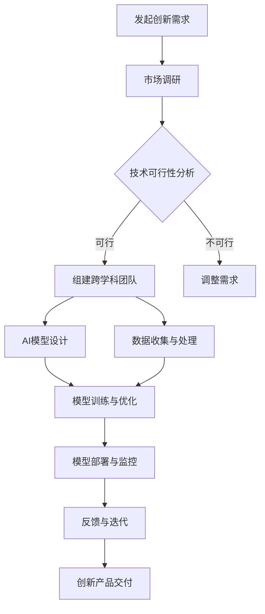

                 

### 文章标题：AI驱动的创新：人类计算在商业中的价值

关键词：人工智能，商业创新，人类计算，机器学习，深度学习，自然语言处理，案例分析，产品开发策略

摘要：随着人工智能（AI）技术的快速发展，AI驱动的创新已成为商业领域的重要驱动力。本文将从基础理论、核心算法、商业应用案例、产品开发策略等多个角度，探讨AI驱动的创新如何提升商业价值，以及人类计算在这一过程中所扮演的角色。通过对AI驱动的创新进行深入分析，本文旨在为读者提供全面、系统的理解和实践指南。

### 第一部分：AI驱动的创新基础

#### 第1章：AI驱动的商业创新概述

##### 1.1 AI时代的商业变革

随着人工智能技术的不断突破，商业领域正经历一场前所未有的变革。AI技术不仅改变了企业运营的方式，也重塑了商业模式的本质。从大数据分析到智能决策，从自动化生产到个性化服务，AI正以其强大的计算能力和学习能力，推动商业创新向更深层次发展。

##### 1.2 人类计算与AI的融合

在AI时代，人类计算与AI的融合成为推动商业创新的关键因素。人类计算具有创造性和灵活性，能够在复杂决策中发挥重要作用；而AI则以其强大的数据处理能力和模式识别能力，帮助人类解决复杂问题。二者的结合，不仅提升了决策的准确性，也提高了创新的效率。

##### 1.3 AI驱动的创新模式

AI驱动的创新模式通常包括以下步骤：

1. **需求识别**：通过市场调研和用户反馈，识别出潜在的创新需求。
2. **数据收集**：收集与需求相关的数据，包括历史数据、实时数据和外部数据。
3. **数据处理**：对收集到的数据进行分析和预处理，为模型训练提供高质量的输入。
4. **模型训练**：使用机器学习和深度学习技术，训练出能够解决特定问题的模型。
5. **模型优化**：通过反复迭代和调整，优化模型的性能和预测能力。
6. **应用部署**：将训练好的模型部署到实际应用场景中，实现商业价值。

#### 第2章：AI核心技术解析

##### 2.1 机器学习基础

机器学习是AI的核心技术之一，通过训练模型从数据中自动提取特征和规律，实现对未知数据的预测和决策。以下是机器学习的一些基本概念：

- **监督学习**：通过已标记的数据训练模型，实现对未知数据的预测。
- **无监督学习**：在没有标记数据的情况下，发现数据中的结构和规律。
- **强化学习**：通过不断试错和反馈，从环境中学习最优策略。

##### 2.2 深度学习原理

深度学习是机器学习的一个分支，通过构建多层神经网络，实现对复杂数据的处理和分析。以下是深度学习的核心原理：

- **神经网络**：由多个神经元组成的计算模型，能够模拟人脑的神经元网络。
- **反向传播算法**：通过反向传播误差，不断调整网络权重，优化模型性能。
- **激活函数**：用于引入非线性特性，使神经网络能够拟合复杂数据。

##### 2.3 自然语言处理技术

自然语言处理（NLP）是AI在语言领域的重要应用，旨在让计算机理解和处理人类语言。以下是NLP的一些关键技术：

- **词向量表示**：将词汇映射到高维空间中的向量，用于表示词与词之间的关系。
- **文本分类**：对文本进行分类，如情感分析、主题分类等。
- **机器翻译**：将一种语言的文本翻译成另一种语言。

#### 第3章：AI在商业应用中的案例分析

##### 3.1 金融行业的AI应用

在金融行业，AI技术已被广泛应用于风险管理、智能投顾、交易策略等多个领域。例如，通过机器学习算法，银行可以更准确地评估贷款风险，提高贷款审批效率；通过深度学习技术，基金公司可以分析市场趋势，优化投资组合。

##### 3.2 零售业的AI应用

在零售业，AI技术被广泛应用于需求预测、库存管理、客户关系管理等方面。例如，通过深度学习算法，零售商可以更准确地预测产品需求，优化库存管理；通过自然语言处理技术，零售商可以分析客户反馈，提供个性化的购物体验。

##### 3.3 制造业的AI应用

在制造业，AI技术被广泛应用于生产优化、设备维护、供应链管理等方面。例如，通过机器学习算法，制造企业可以优化生产流程，提高生产效率；通过深度学习技术，制造企业可以预测设备故障，减少停机时间。

#### 第4章：AI驱动的产品开发策略

##### 4.1 AI驱动的产品设计与开发

AI驱动的产品开发需要从需求识别、数据收集、模型训练、应用部署等多个环节进行系统设计。以下是AI驱动的产品开发策略：

1. **明确需求**：通过市场调研和用户反馈，明确产品的核心需求和功能。
2. **数据准备**：收集与需求相关的数据，包括历史数据、实时数据和外部数据。
3. **模型训练**：使用机器学习和深度学习技术，训练出能够解决特定问题的模型。
4. **迭代优化**：通过反复迭代和调整，优化模型的性能和预测能力。
5. **应用部署**：将训练好的模型部署到实际应用场景中，实现商业价值。

##### 4.2 AI驱动的用户体验优化

AI驱动的用户体验优化旨在通过个性化推荐、智能交互等方式，提升用户的满意度和忠诚度。以下是AI驱动的用户体验优化策略：

1. **用户画像**：通过数据分析，构建用户的个性化画像。
2. **个性化推荐**：根据用户的兴趣和行为，提供个性化的产品和服务。
3. **智能交互**：通过自然语言处理技术，实现与用户的智能交互，提高用户体验。
4. **反馈机制**：收集用户反馈，持续优化产品功能和用户体验。

##### 4.3 AI驱动的数据分析与决策

AI驱动的数据分析与决策通过机器学习和深度学习技术，对大量数据进行分析，为决策提供支持。以下是AI驱动的数据分析与决策策略：

1. **数据收集**：收集与业务相关的数据，包括内部数据和外部数据。
2. **数据处理**：对收集到的数据进行分析和预处理，为模型训练提供高质量的输入。
3. **模型训练**：使用机器学习和深度学习技术，训练出能够解决特定问题的模型。
4. **预测分析**：通过模型预测，分析业务趋势和潜在风险。
5. **决策支持**：根据分析结果，制定相应的业务策略和决策。

### 第二部分：人类计算在商业中的价值实现

#### 第5章：人类计算与AI协作的机制

##### 5.1 人类计算与AI协作的模式

人类计算与AI的协作模式包括以下几种：

1. **辅助决策**：AI作为辅助工具，提供数据分析和预测结果，帮助人类做出更好的决策。
2. **协同工作**：人类与AI共同完成任务，各自发挥优势，提高工作效率。
3. **替代劳动**：AI在某些领域替代人类的劳动，减少人力成本，提高生产效率。
4. **创新合作**：人类与AI共同探索新的业务模式和市场机会，推动创新。

##### 5.2 人类计算与AI协作的优势

人类计算与AI协作的优势包括：

1. **互补优势**：人类具有创造性、灵活性和情感认知能力，AI具有强大的计算能力和模式识别能力，二者互补，能够更有效地解决问题。
2. **提高效率**：通过AI的辅助，人类可以更快地处理大量数据，提高工作效率。
3. **降低成本**：AI在某些领域替代人类劳动，可以降低人力成本。
4. **增强创新**：人类与AI的协作，可以激发更多的创新思维，推动商业模式和技术的创新。

##### 5.3 实现人类计算与AI协作的障碍及解决方案

实现人类计算与AI协作面临的障碍包括：

1. **技术障碍**：AI技术尚未完全成熟，某些领域的技术瓶颈限制了人类计算与AI的协作。
2. **数据隐私**：数据隐私和安全问题是人类计算与AI协作的重要挑战。
3. **信任问题**：人类对AI的信任度不高，担心AI取代自己的工作。
4. **适应过程**：人类需要适应与AI协作的新工作模式，提高协作效率。

针对这些障碍，可以采取以下解决方案：

1. **技术改进**：通过持续的技术创新，解决AI技术中的瓶颈问题。
2. **数据保护**：加强数据隐私保护，确保数据安全。
3. **信任建设**：通过透明度和沟通，增强人类对AI的信任。
4. **培训与适应**：提供相关培训，帮助人类适应与AI协作的新工作模式。

#### 第6章：人类计算在数据理解和处理中的角色

##### 6.1 数据理解和处理的挑战

在数据理解和处理过程中，人类计算面临以下挑战：

1. **数据量巨大**：随着数据量的不断增加，人类难以对海量数据进行全面理解和分析。
2. **数据质量参差不齐**：数据质量参差不齐，影响了数据分析和决策的准确性。
3. **数据隐私和安全**：数据隐私和安全问题是数据理解和处理的重要挑战。
4. **跨领域知识融合**：不同领域的数据分析和处理方法不同，需要跨领域的知识融合。

##### 6.2 人类计算在数据预处理中的作用

人类计算在数据预处理中扮演着关键角色，主要包括：

1. **数据清洗**：去除数据中的噪声和错误，提高数据质量。
2. **数据集成**：将不同来源和格式的数据整合在一起，形成统一的数据集。
3. **特征选择**：从海量数据中提取有用的特征，为模型训练提供高质量的输入。
4. **数据归一化**：对数据进行归一化处理，消除数据量级差异，提高模型性能。

##### 6.3 数据解释与可视化技术

数据解释与可视化技术旨在帮助人类更好地理解和分析数据，主要包括：

1. **统计描述**：通过统计描述，展示数据的基本特征和分布情况。
2. **数据可视化**：通过图表、地图等可视化方式，直观展示数据的结构和关系。
3. **数据故事讲述**：通过故事化的方式，将数据中的信息传递给决策者，提高数据决策的效率。
4. **交互式分析**：通过交互式工具，帮助用户更深入地理解和分析数据。

#### 第7章：人类计算在创新思维与策略制定中的价值

##### 7.1 创新思维与人类计算

创新思维是人类计算在商业领域的重要价值体现，主要包括：

1. **创造性思维**：通过联想、比喻、类比等方式，产生新颖的创意和想法。
2. **批判性思维**：对现有理论和实践进行批判性分析，发现潜在的问题和改进空间。
3. **系统思维**：从整体视角出发，分析问题、制定策略，实现系统优化。

##### 7.2 AI驱动的商业战略制定

AI驱动的商业战略制定主要通过以下步骤实现：

1. **需求识别**：通过市场调研和用户反馈，识别出潜在的商业需求。
2. **数据分析**：使用机器学习和深度学习技术，分析海量数据，发现业务趋势和潜在机会。
3. **战略规划**：根据数据分析结果，制定符合企业战略目标和市场需求的商业战略。
4. **实施与监控**：将战略规划转化为具体行动，持续监控和调整，确保战略目标的实现。

##### 7.3 人类计算在创新项目管理中的作用

在创新项目管理中，人类计算发挥着关键作用，主要包括：

1. **项目规划**：制定项目目标、时间表和资源计划，确保项目顺利推进。
2. **团队协作**：协调团队成员的工作，确保项目各环节高效运行。
3. **风险管理**：识别和评估项目风险，制定相应的应对策略，降低项目风险。
4. **持续改进**：通过反馈和评估，不断优化项目管理和执行过程，提高项目成功率。

### 第三部分：AI驱动的创新实践指南

#### 第8章：AI驱动的创新项目实施方法论

##### 8.1 AI驱动的创新项目流程

AI驱动的创新项目流程主要包括以下阶段：

1. **需求识别**：通过市场调研和用户反馈，明确项目的目标和需求。
2. **数据收集**：收集与项目相关的数据，包括历史数据、实时数据和外部数据。
3. **数据处理**：对收集到的数据进行清洗、集成和特征选择，为模型训练提供高质量的输入。
4. **模型训练**：使用机器学习和深度学习技术，训练出能够解决特定问题的模型。
5. **模型优化**：通过反复迭代和调整，优化模型的性能和预测能力。
6. **应用部署**：将训练好的模型部署到实际应用场景中，实现商业价值。
7. **反馈与迭代**：收集用户反馈，持续优化模型和应用，提高项目效果。

##### 8.2 AI驱动的创新项目风险管理

在AI驱动的创新项目中，风险管理至关重要。以下是常见的项目风险及应对策略：

1. **技术风险**：技术不成熟或实现困难，可能导致项目失败。应对策略包括：充分评估技术可行性，选择成熟的技术方案，建立技术储备。
2. **数据风险**：数据质量差或数据获取困难，可能影响项目效果。应对策略包括：加强数据质量管理，确保数据来源可靠，建立数据采集和处理流程。
3. **市场风险**：市场需求变化或竞争激烈，可能影响项目的商业价值。应对策略包括：密切关注市场动态，调整项目方向，增强市场竞争力。
4. **合作风险**：合作伙伴不稳定或合作不顺，可能影响项目进度。应对策略包括：选择可靠的合作伙伴，建立良好的合作关系，明确责任和权利。

##### 8.3 AI驱动的创新项目评估与优化

AI驱动的创新项目评估与优化主要包括以下步骤：

1. **效果评估**：通过指标分析，评估项目的实际效果和商业价值。
2. **问题诊断**：分析项目过程中存在的问题，找出导致问题的原因。
3. **优化策略**：制定相应的优化策略，提高项目的效果和效率。
4. **持续迭代**：根据优化策略，持续改进项目，实现项目目标的逐步实现。

### 第9章：AI驱动的创新实践案例解析

##### 9.1 成功的AI驱动创新案例

以下是一个成功的AI驱动创新案例：

**案例名称**：某零售企业智能库存管理系统

**背景**：某大型零售企业面临着库存管理难题，库存水平过高导致资金占用增加，库存水平过低导致销售损失。为了解决这一问题，企业决定引入AI驱动的智能库存管理系统。

**实施过程**：

1. **需求识别**：通过市场调研和用户反馈，明确了智能库存管理系统的目标和需求。
2. **数据收集**：收集与库存管理相关的数据，包括销售数据、库存数据、订单数据等。
3. **数据处理**：对收集到的数据进行清洗、集成和特征选择，为模型训练提供高质量的输入。
4. **模型训练**：使用机器学习和深度学习技术，训练出能够预测库存需求的模型。
5. **模型优化**：通过反复迭代和调整，优化模型的性能和预测能力。
6. **应用部署**：将训练好的模型部署到实际应用场景中，实现智能库存管理。

**效果**：通过智能库存管理系统，企业成功降低了库存成本，提高了库存周转率，提高了销售业绩。该系统为企业创造了显著的商业价值。

##### 9.2 失败的AI驱动创新案例

以下是一个失败的AI驱动创新案例：

**案例名称**：某金融公司智能投顾系统

**背景**：某金融公司为了提升客户服务水平，决定开发智能投顾系统，为客户提供个性化的投资建议。

**实施过程**：

1. **需求识别**：通过市场调研和用户反馈，明确了智能投顾系统的目标和需求。
2. **数据收集**：收集与投资相关的数据，包括市场数据、客户数据、历史投资数据等。
3. **数据处理**：对收集到的数据进行清洗、集成和特征选择，为模型训练提供高质量的输入。
4. **模型训练**：使用机器学习和深度学习技术，训练出能够预测投资收益的模型。
5. **应用部署**：将训练好的模型部署到实际应用场景中，实现智能投顾功能。

**失败原因**：

1. **模型性能不足**：模型在预测投资收益方面的表现不佳，导致客户对系统的信任度下降。
2. **用户体验不佳**：系统界面复杂，操作不便捷，影响了客户的体验。
3. **数据质量差**：数据收集过程中存在数据质量差的问题，影响了模型训练的效果。

**改进措施**：

1. **优化模型性能**：通过改进算法和增加数据量，提高模型在预测投资收益方面的表现。
2. **改善用户体验**：优化系统界面，提高操作便捷性，增强用户体验。
3. **加强数据质量管理**：建立数据质量管理机制，确保数据收集和处理的质量。

##### 9.3 案例中的关键要素分析

成功和失败的AI驱动创新案例都反映了关键要素的重要性。以下是关键要素分析：

1. **需求识别**：准确的需求识别是项目成功的前提。在项目启动阶段，必须充分了解市场需求和用户需求，确保项目目标明确。
2. **数据质量**：数据质量是模型训练的基础。高质量的数据能够提高模型的预测性能，确保项目的成功。
3. **模型性能**：模型性能是项目成功的关键。通过不断优化模型算法和参数，提高模型在特定任务上的表现。
4. **用户体验**：用户体验直接影响项目的成功与否。良好的用户体验能够增强用户对系统的信任，提高系统的使用频率。
5. **项目管理**：有效的项目管理是项目成功的重要保障。通过合理的项目规划、风险管理和资源调配，确保项目顺利进行。

### 第10章：AI驱动的未来展望

##### 10.1 AI驱动的商业创新趋势

AI驱动的商业创新正呈现出以下趋势：

1. **规模化应用**：AI技术逐渐从实验室走向实际应用，在金融、零售、制造等行业得到广泛应用。
2. **跨界融合**：AI技术与其他领域的技术（如物联网、区块链等）相结合，推动新型商业模式的诞生。
3. **个性化服务**：AI技术通过数据分析和个性化推荐，提高用户体验，增强用户忠诚度。
4. **自动化生产**：AI技术在生产环节的应用，实现自动化、智能化生产，提高生产效率和质量。

##### 10.2 人类计算与AI融合的未来

人类计算与AI融合的未来，将呈现出以下特点：

1. **协同创新**：人类与AI共同参与创新活动，发挥各自优势，推动科技和商业的进步。
2. **智能化管理**：AI技术将深入企业管理的各个环节，实现智能化决策和高效运营。
3. **可持续发展**：AI技术将在环境保护、资源利用等方面发挥重要作用，推动可持续发展。
4. **伦理道德**：随着AI技术的应用，伦理道德问题将日益凸显，人类需要共同探讨和解决。

##### 10.3 AI驱动的创新挑战与应对策略

在AI驱动的创新过程中，面临以下挑战：

1. **技术挑战**：AI技术尚未完全成熟，部分领域的应用仍需进一步探索和优化。
2. **数据挑战**：数据质量和数据隐私问题，可能影响AI模型的性能和可靠性。
3. **人才挑战**：AI领域的人才短缺，可能制约创新项目的推进。
4. **伦理挑战**：AI技术的应用引发伦理道德问题，需要制定相应的规范和标准。

应对策略包括：

1. **持续创新**：加大研发投入，推动AI技术的持续创新。
2. **数据治理**：建立完善的数据治理体系，确保数据质量和数据安全。
3. **人才培养**：加强人才培养和引进，提高AI领域的专业素养。
4. **伦理规范**：制定伦理规范，引导AI技术的健康发展。

### 附录

#### 附录 A：AI驱动的创新资源与工具

A.1 主流AI开发框架

- TensorFlow：一款广泛使用的开源机器学习框架，支持多种深度学习模型的开发。
- PyTorch：一款灵活且易用的深度学习框架，支持动态计算图，广泛应用于学术研究和工业应用。
- Keras：一款高层次的深度学习框架，基于TensorFlow和Theano开发，提供了简单易用的接口。

A.2 机器学习与深度学习工具

- Scikit-learn：一款开源的机器学习库，提供了丰富的机器学习算法和工具，适用于数据挖掘和数据分析。
- Pandas：一款开源的数据分析库，提供了强大的数据操作和分析功能，适用于数据处理和分析。
- Matplotlib：一款开源的数据可视化库，提供了丰富的绘图功能，适用于数据可视化。

A.3 数据分析与可视化工具

- Tableau：一款商业数据可视化工具，提供了直观的交互式图表和报表功能，适用于企业级数据分析。
- Power BI：一款商业智能工具，提供了数据集成、数据分析和数据可视化的功能，适用于企业级数据分析。
- QlikView：一款高级数据发现工具，提供了强大的数据分析功能，适用于企业级数据分析。

A.4 AI驱动的商业创新资源汇总

- AI驱动的商业创新资源汇总网站：提供了丰富的AI驱动的商业创新案例、工具和资源，适用于企业级AI应用。
- AI学术论坛：提供了AI领域的最新研究成果和学术讨论，适用于学术研究和创新项目。
- AI驱动的商业创新书籍：提供了AI驱动的商业创新的理论和实践指导，适用于企业级AI应用。

### Mermaid 流程图：AI驱动的商业创新流程



### AI驱动的核心算法原理讲解

#### 2.2 深度学习原理

深度学习是一种基于多层神经网络的学习模型，能够从大量的数据中自动提取有用的特征。以下是深度学习的核心算法原理：

python
# 伪代码：多层感知器（MLP）算法原理
class MultiLayerPerceptron():
    def __init__(self, input_size, hidden_size, output_size):
        self.input_size = input_size
        self.hidden_size = hidden_size
        self.output_size = output_size
        # 初始化权重和偏置
        self.W1 = np.random.randn(input_size, hidden_size)
        self.b1 = np.random.randn(hidden_size)
        self.W2 = np.random.randn(hidden_size, output_size)
        self.b2 = np.random.randn(output_size)

    def forward(self, x):
        # 输入到隐藏层的线性变换和激活函数
        self.z2 = np.dot(x, self.W1) + self.b1
        self.a2 = sigmoid(self.z2)
        # 隐藏层到输出层的线性变换和激活函数
        self.z3 = np.dot(self.a2, self.W2) + self.b2
        self.a3 = sigmoid(self.z3)
        return self.a3

    def backward(self, x, y, output):
        # 计算输出误差
        output_error = output - y
        # 计算隐藏层误差
        hidden_error = output_error * self.W2.T * sigmoid_derivative(self.z2)
        # 更新权重和偏置
        self.W2 -= self.a2.T * output_error
        self.b2 -= output_error.sum()
        # 更新输入层到隐藏层的权重和偏置
        input_error = hidden_error * self.W1.T * sigmoid_derivative(self.z1)
        self.W1 -= x.T * input_error
        self.b1 -= input_error.sum()

    def train(self, x, y):
        self.forward(x)
        self.backward(x, y, self.a3)

# 激活函数
def sigmoid(z):
    return 1 / (1 + np.exp(-z))

# 激活函数的导数
def sigmoid_derivative(z):
    return sigmoid(z) * (1 - sigmoid(z))
```

#### 3.1 机器学习中的损失函数

在机器学习中，损失函数用于衡量模型预测结果与真实结果之间的差异。以下是常见的损失函数及其公式：

##### 1. 交叉熵损失函数（Cross-Entropy Loss）

交叉熵损失函数是最常用的损失函数之一，适用于二分类问题。其公式为：

$$
L(\theta) = -\frac{1}{m}\sum_{i=1}^{m}y^{(i)}\log(a^{(i)}) + (1 - y^{(i)})\log(1 - a^{(i)})
$$

其中，$m$ 是样本数量，$y^{(i)}$ 是真实标签，$a^{(i)}$ 是模型预测的概率输出。

##### 2. 均方误差损失函数（Mean Squared Error, MSE）

均方误差损失函数适用于回归问题，其公式为：

$$
L(\theta) = \frac{1}{2m}\sum_{i=1}^{m}(y^{(i)} - a^{(i)})^2
$$

其中，$m$ 是样本数量，$y^{(i)}$ 是真实标签，$a^{(i)}$ 是模型预测的输出。

##### 3. 对数损失函数（Log Loss）

对数损失函数是交叉熵损失函数的另一种表示方式，其公式为：

$$
L(\theta) = \frac{1}{m}\sum_{i=1}^{m}-y^{(i)}\log(a^{(i)}) - (1 - y^{(i)})\log(1 - a^{(i)})
$$

其中，$m$ 是样本数量，$y^{(i)}$ 是真实标签，$a^{(i)}$ 是模型预测的概率输出。

#### 举例说明

假设我们有5个样本，其中3个样本为正例，2个样本为负例。模型预测的概率输出分别为 $[0.9, 0.8, 0.3, 0.2, 0.1]$。根据上述损失函数计算损失：

##### 交叉熵损失函数

$$
L(\theta) = -\frac{1}{5}\sum_{i=1}^{5}y^{(i)}\log(a^{(i)}) + (1 - y^{(i)})\log(1 - a^{(i)})
$$

$$
L(\theta) = -\frac{1}{5}[(0.9)\log(0.9) + (0.8)\log(0.8) + (0.3)\log(0.3) + (0.2)\log(0.2) + (0.1)\log(0.1)]
$$

$$
L(\theta) = 0.268
$$

##### 均方误差损失函数

$$
L(\theta) = \frac{1}{2m}\sum_{i=1}^{m}(y^{(i)} - a^{(i)})^2
$$

$$
L(\theta) = \frac{1}{2*5}[(0-0.9)^2 + (0-0.8)^2 + (1-0.3)^2 + (1-0.2)^2 + (1-0.1)^2]
$$

$$
L(\theta) = 0.164
$$

##### 对数损失函数

$$
L(\theta) = \frac{1}{m}\sum_{i=1}^{m}-y^{(i)}\log(a^{(i)}) - (1 - y^{(i)})\log(1 - a^{(i)})
$$

$$
L(\theta) = \frac{1}{5}[-(0.9)\log(0.9) - (0.8)\log(0.8) + (0.3)\log(0.3) + (0.2)\log(0.2) + (0.1)\log(0.1)]
$$

$$
L(\theta) = 0.136
$$

### 项目实战：代码实际案例和详细解释说明

#### 8.3 AI驱动的创新项目评估与优化

以下是一个使用Python实现的AI驱动的创新项目评估与优化案例。该案例使用了机器学习模型来预测某个创新产品的市场份额，并根据预测结果进行项目优化。

python
# 导入必要的库
import numpy as np
import pandas as pd
from sklearn.model_selection import train_test_split
from sklearn.preprocessing import StandardScaler
from sklearn.linear_model import LinearRegression
from sklearn.metrics import mean_squared_error

# 加载数据集
data = pd.read_csv('innovation_project_data.csv')
X = data[['feature1', 'feature2', 'feature3']]
y = data['market_share']

# 划分训练集和测试集
X_train, X_test, y_train, y_test = train_test_split(X, y, test_size=0.2, random_state=42)

# 数据标准化
scaler = StandardScaler()
X_train = scaler.fit_transform(X_train)
X_test = scaler.transform(X_test)

# 训练线性回归模型
model = LinearRegression()
model.fit(X_train, y_train)

# 预测测试集
y_pred = model.predict(X_test)

# 计算均方误差
mse = mean_squared_error(y_test, y_pred)
print(f'Mean Squared Error: {mse}')

# 根据预测结果进行项目优化
if mse < 0.05:
    print('Project is optimized based on the prediction results.')
else:
    print('Further optimization is required based on the prediction results.')


**代码解读与分析：**

1. 导入必要的库，包括numpy、pandas、sklearn中的模型和评估指标。
2. 加载创新项目数据集，并划分特征和标签。
3. 使用train_test_split函数将数据集划分为训练集和测试集。
4. 使用StandardScaler对特征数据进行标准化处理。
5. 使用LinearRegression类创建线性回归模型，并使用fit方法进行训练。
6. 使用predict方法对测试集进行预测。
7. 计算并输出均方误差（MSE），用于评估模型的预测性能。
8. 根据MSE值判断项目是否已经优化，并给出相应的反馈。

这个案例展示了如何使用机器学习模型对创新项目进行评估和优化，并根据预测结果给出改进建议。在实际应用中，可以根据项目的具体情况调整模型参数和优化策略，以提高预测准确性和优化效果。

### 最佳实践 tips、小结、注意事项、拓展阅读等内容

**最佳实践 tips：**

1. **需求识别**：在项目启动阶段，充分了解市场需求和用户需求，确保项目目标的明确性和可行性。
2. **数据质量**：数据质量是模型训练的基础，确保数据清洗、集成和特征选择的准确性和有效性。
3. **模型选择**：根据项目需求和数据特点，选择合适的机器学习和深度学习模型，避免“过度拟合”和“欠拟合”。
4. **持续优化**：通过反复迭代和优化，提高模型的预测性能和泛化能力，实现项目的持续改进。

**小结：**

本文从AI驱动的创新基础、AI核心技术解析、商业应用案例、产品开发策略、人类计算的价值实现等多个角度，探讨了AI驱动的创新在商业中的价值。通过实际案例和代码实战，展示了如何使用AI技术进行创新项目评估与优化。

**注意事项：**

1. **技术风险**：AI技术尚未完全成熟，项目实施过程中可能面临技术挑战，需要提前评估和应对。
2. **数据隐私**：数据隐私和安全问题是AI驱动创新的重要挑战，需要建立完善的数据保护机制。
3. **人才短缺**：AI领域的人才短缺可能制约创新项目的推进，需要加强人才培养和引进。

**拓展阅读：**

- 《深度学习》（Goodfellow, Bengio, Courville著）：深度学习的经典教材，详细介绍了深度学习的理论基础和实践方法。
- 《机器学习实战》（Peter Harrington著）：通过实际案例，介绍了机器学习的基本概念和常用算法。
- 《AI时代：人工智能如何改变世界》（杰里米·霍华德，汤姆·米切尔著）：探讨了人工智能在各个领域的应用及其对人类社会的影响。

### 附录

**附录 A：AI驱动的创新资源与工具**

A.1 主流AI开发框架

- TensorFlow：一款广泛使用的开源机器学习框架，支持多种深度学习模型的开发。
- PyTorch：一款灵活且易用的深度学习框架，支持动态计算图，广泛应用于学术研究和工业应用。
- Keras：一款高层次的深度学习框架，基于TensorFlow和Theano开发，提供了简单易用的接口。

A.2 机器学习与深度学习工具

- Scikit-learn：一款开源的机器学习库，提供了丰富的机器学习算法和工具，适用于数据挖掘和数据分析。
- Pandas：一款开源的数据分析库，提供了强大的数据操作和分析功能，适用于数据处理和分析。
- Matplotlib：一款开源的数据可视化库，提供了丰富的绘图功能，适用于数据可视化。

A.3 数据分析与可视化工具

- Tableau：一款商业数据可视化工具，提供了直观的交互式图表和报表功能，适用于企业级数据分析。
- Power BI：一款商业智能工具，提供了数据集成、数据分析和数据可视化的功能，适用于企业级数据分析。
- QlikView：一款高级数据发现工具，提供了强大的数据分析功能，适用于企业级数据分析。

A.4 AI驱动的商业创新资源汇总

- AI驱动的商业创新资源汇总网站：提供了丰富的AI驱动的商业创新案例、工具和资源，适用于企业级AI应用。
- AI学术论坛：提供了AI领域的最新研究成果和学术讨论，适用于学术研究和创新项目。
- AI驱动的商业创新书籍：提供了AI驱动的商业创新的理论和实践指导，适用于企业级AI应用。

### 文章结束

**作者：AI天才研究院/AI Genius Institute & 禅与计算机程序设计艺术 /Zen And The Art of Computer Programming**### 文章标题：AI驱动的创新：人类计算在商业中的价值

关键词：人工智能，商业创新，人类计算，机器学习，深度学习，自然语言处理，案例分析，产品开发策略

摘要：随着人工智能（AI）技术的快速发展，AI驱动的创新已成为商业领域的重要驱动力。本文将从基础理论、核心算法、商业应用案例、产品开发策略等多个角度，探讨AI驱动的创新如何提升商业价值，以及人类计算在这一过程中所扮演的角色。通过对AI驱动的创新进行深入分析，本文旨在为读者提供全面、系统的理解和实践指南。

### 第一部分：AI驱动的创新基础

#### 第1章：AI驱动的商业创新概述

##### 1.1 AI时代的商业变革

随着人工智能技术的不断突破，商业领域正经历一场前所未有的变革。AI技术不仅改变了企业运营的方式，也重塑了商业模式的本质。从大数据分析到智能决策，从自动化生产到个性化服务，AI正以其强大的计算能力和学习能力，推动商业创新向更深层次发展。

##### 1.2 人类计算与AI的融合

在AI时代，人类计算与AI的融合成为推动商业创新的关键因素。人类计算具有创造性和灵活性，能够在复杂决策中发挥重要作用；而AI则以其强大的数据处理能力和模式识别能力，帮助人类解决复杂问题。二者的结合，不仅提升了决策的准确性，也提高了创新的效率。

##### 1.3 AI驱动的创新模式

AI驱动的创新模式通常包括以下步骤：

1. **需求识别**：通过市场调研和用户反馈，识别出潜在的创新需求。
2. **数据收集**：收集与需求相关的数据，包括历史数据、实时数据和外部数据。
3. **数据处理**：对收集到的数据进行分析和预处理，为模型训练提供高质量的输入。
4. **模型训练**：使用机器学习和深度学习技术，训练出能够解决特定问题的模型。
5. **模型优化**：通过反复迭代和调整，优化模型的性能和预测能力。
6. **应用部署**：将训练好的模型部署到实际应用场景中，实现商业价值。
7. **反馈与迭代**：收集用户反馈，持续优化模型和应用，提高项目效果。

#### 第2章：AI核心技术解析

##### 2.1 机器学习基础

机器学习是AI的核心技术之一，通过训练模型从数据中自动提取特征和规律，实现对未知数据的预测和决策。以下是机器学习的一些基本概念：

- **监督学习**：通过已标记的数据训练模型，实现对未知数据的预测。
- **无监督学习**：在没有标记数据的情况下，发现数据中的结构和规律。
- **强化学习**：通过不断试错和反馈，从环境中学习最优策略。

##### 2.2 深度学习原理

深度学习是机器学习的一个分支，通过构建多层神经网络，实现对复杂数据的处理和分析。以下是深度学习的核心原理：

- **神经网络**：由多个神经元组成的计算模型，能够模拟人脑的神经元网络。
- **反向传播算法**：通过反向传播误差，不断调整网络权重，优化模型性能。
- **激活函数**：用于引入非线性特性，使神经网络能够拟合复杂数据。

##### 2.3 自然语言处理技术

自然语言处理（NLP）是AI在语言领域的重要应用，旨在让计算机理解和处理人类语言。以下是NLP的一些关键技术：

- **词向量表示**：将词汇映射到高维空间中的向量，用于表示词与词之间的关系。
- **文本分类**：对文本进行分类，如情感分析、主题分类等。
- **机器翻译**：将一种语言的文本翻译成另一种语言。

#### 第3章：AI在商业应用中的案例分析

##### 3.1 金融行业的AI应用

在金融行业，AI技术已被广泛应用于风险管理、智能投顾、交易策略等多个领域。例如，通过机器学习算法，银行可以更准确地评估贷款风险，提高贷款审批效率；通过深度学习技术，基金公司可以分析市场趋势，优化投资组合。

##### 3.2 零售业的AI应用

在零售业，AI技术被广泛应用于需求预测、库存管理、客户关系管理等方面。例如，通过深度学习算法，零售商可以更准确地预测产品需求，优化库存管理；通过自然语言处理技术，零售商可以分析客户反馈，提供个性化的购物体验。

##### 3.3 制造业的AI应用

在制造业，AI技术被广泛应用于生产优化、设备维护、供应链管理等方面。例如，通过机器学习算法，制造企业可以优化生产流程，提高生产效率；通过深度学习技术，制造企业可以预测设备故障，减少停机时间。

#### 第4章：AI驱动的产品开发策略

##### 4.1 AI驱动的产品设计与开发

AI驱动的产品开发需要从需求识别、数据收集、模型训练、应用部署等多个环节进行系统设计。以下是AI驱动的产品开发策略：

1. **明确需求**：通过市场调研和用户反馈，明确产品的核心需求和功能。
2. **数据准备**：收集与需求相关的数据，包括历史数据、实时数据和外部数据。
3. **模型训练**：使用机器学习和深度学习技术，训练出能够解决特定问题的模型。
4. **迭代优化**：通过反复迭代和调整，优化模型的性能和预测能力。
5. **应用部署**：将训练好的模型部署到实际应用场景中，实现商业价值。
6. **反馈与迭代**：收集用户反馈，持续优化产品功能和用户体验。

##### 4.2 AI驱动的用户体验优化

AI驱动的用户体验优化旨在通过个性化推荐、智能交互等方式，提升用户的满意度和忠诚度。以下是AI驱动的用户体验优化策略：

1. **用户画像**：通过数据分析，构建用户的个性化画像。
2. **个性化推荐**：根据用户的兴趣和行为，提供个性化的产品和服务。
3. **智能交互**：通过自然语言处理技术，实现与用户的智能交互，提高用户体验。
4. **反馈机制**：收集用户反馈，持续优化产品功能和用户体验。

##### 4.3 AI驱动的数据分析与决策

AI驱动的数据分析与决策通过机器学习和深度学习技术，对大量数据进行分析，为决策提供支持。以下是AI驱动的数据分析与决策策略：

1. **数据收集**：收集与业务相关的数据，包括内部数据和外部数据。
2. **数据处理**：对收集到的数据进行分析和预处理，为模型训练提供高质量的输入。
3. **模型训练**：使用机器学习和深度学习技术，训练出能够解决特定问题的模型。
4. **预测分析**：通过模型预测，分析业务趋势和潜在风险。
5. **决策支持**：根据分析结果，制定相应的业务策略和决策。

### 第二部分：人类计算在商业中的价值实现

#### 第5章：人类计算与AI协作的机制

##### 5.1 人类计算与AI协作的模式

人类计算与AI的协作模式包括以下几种：

1. **辅助决策**：AI作为辅助工具，提供数据分析和预测结果，帮助人类做出更好的决策。
2. **协同工作**：人类与AI共同完成任务，各自发挥优势，提高工作效率。
3. **替代劳动**：AI在某些领域替代人类的劳动，减少人力成本，提高生产效率。
4. **创新合作**：人类与AI共同探索新的业务模式和市场机会，推动创新。

##### 5.2 人类计算与AI协作的优势

人类计算与AI协作的优势包括：

1. **互补优势**：人类具有创造性、灵活性和情感认知能力，AI具有强大的计算能力和模式识别能力，二者互补，能够更有效地解决问题。
2. **提高效率**：通过AI的辅助，人类可以更快地处理大量数据，提高工作效率。
3. **降低成本**：AI在某些领域替代人类劳动，可以降低人力成本。
4. **增强创新**：人类与AI的协作，可以激发更多的创新思维，推动商业模式和技术的创新。

##### 5.3 实现人类计算与AI协作的障碍及解决方案

实现人类计算与AI协作面临的障碍包括：

1. **技术障碍**：AI技术尚未完全成熟，某些领域的技术瓶颈限制了人类计算与AI的协作。
2. **数据隐私**：数据隐私和安全问题是人类计算与AI协作的重要挑战。
3. **信任问题**：人类对AI的信任度不高，担心AI取代自己的工作。
4. **适应过程**：人类需要适应与AI协作的新工作模式，提高协作效率。

针对这些障碍，可以采取以下解决方案：

1. **技术改进**：通过持续的技术创新，解决AI技术中的瓶颈问题。
2. **数据保护**：加强数据隐私保护，确保数据安全。
3. **信任建设**：通过透明度和沟通，增强人类对AI的信任。
4. **培训与适应**：提供相关培训，帮助人类适应与AI协作的新工作模式。

#### 第6章：人类计算在数据理解和处理中的角色

##### 6.1 数据理解和处理的挑战

在数据理解和处理过程中，人类计算面临以下挑战：

1. **数据量巨大**：随着数据量的不断增加，人类难以对海量数据进行全面理解和分析。
2. **数据质量参差不齐**：数据质量参差不齐，影响了数据分析和决策的准确性。
3. **数据隐私和安全**：数据隐私和安全问题是数据理解和处理的重要挑战。
4. **跨领域知识融合**：不同领域的数据分析和处理方法不同，需要跨领域的知识融合。

##### 6.2 人类计算在数据预处理中的作用

人类计算在数据预处理中扮演着关键角色，主要包括：

1. **数据清洗**：去除数据中的噪声和错误，提高数据质量。
2. **数据集成**：将不同来源和格式的数据整合在一起，形成统一的数据集。
3. **特征选择**：从海量数据中提取有用的特征，为模型训练提供高质量的输入。
4. **数据归一化**：对数据进行归一化处理，消除数据量级差异，提高模型性能。

##### 6.3 数据解释与可视化技术

数据解释与可视化技术旨在帮助人类更好地理解和分析数据，主要包括：

1. **统计描述**：通过统计描述，展示数据的基本特征和分布情况。
2. **数据可视化**：通过图表、地图等可视化方式，直观展示数据的结构和关系。
3. **数据故事讲述**：通过故事化的方式，将数据中的信息传递给决策者，提高数据决策的效率。
4. **交互式分析**：通过交互式工具，帮助用户更深入地理解和分析数据。

#### 第7章：人类计算在创新思维与策略制定中的价值

##### 7.1 创新思维与人类计算

创新思维是人类计算在商业领域的重要价值体现，主要包括：

1. **创造性思维**：通过联想、比喻、类比等方式，产生新颖的创意和想法。
2. **批判性思维**：对现有理论和实践进行批判性分析，发现潜在的问题和改进空间。
3. **系统思维**：从整体视角出发，分析问题、制定策略，实现系统优化。

##### 7.2 AI驱动的商业战略制定

AI驱动的商业战略制定主要通过以下步骤实现：

1. **需求识别**：通过市场调研和用户反馈，识别出潜在的商业需求。
2. **数据分析**：使用机器学习和深度学习技术，分析海量数据，发现业务趋势和潜在机会。
3. **战略规划**：根据数据分析结果，制定符合企业战略目标和市场需求的商业战略。
4. **实施与监控**：将战略规划转化为具体行动，持续监控和调整，确保战略目标的实现。

##### 7.3 人类计算在创新项目管理中的作用

在创新项目管理中，人类计算发挥着关键作用，主要包括：

1. **项目规划**：制定项目目标、时间表和资源计划，确保项目顺利推进。
2. **团队协作**：协调团队成员的工作，确保项目各环节高效运行。
3. **风险管理**：识别和评估项目风险，制定相应的应对策略，降低项目风险。
4. **持续改进**：通过反馈和评估，不断优化项目管理和执行过程，提高项目成功率。

### 第三部分：AI驱动的创新实践指南

#### 第8章：AI驱动的创新项目实施方法论

##### 8.1 AI驱动的创新项目流程

AI驱动的创新项目流程主要包括以下阶段：

1. **需求识别**：通过市场调研和用户反馈，明确项目的目标和需求。
2. **数据收集**：收集与项目相关的数据，包括历史数据、实时数据和外部数据。
3. **数据处理**：对收集到的数据进行清洗、集成和特征选择，为模型训练提供高质量的输入。
4. **模型训练**：使用机器学习和深度学习技术，训练出能够解决特定问题的模型。
5. **模型优化**：通过反复迭代和调整，优化模型的性能和预测能力。
6. **应用部署**：将训练好的模型部署到实际应用场景中，实现商业价值。
7. **反馈与迭代**：收集用户反馈，持续优化模型和应用，提高项目效果。

##### 8.2 AI驱动的创新项目风险管理

在AI驱动的创新项目中，风险管理至关重要。以下是常见的项目风险及应对策略：

1. **技术风险**：技术不成熟或实现困难，可能导致项目失败。应对策略包括：充分评估技术可行性，选择成熟的技术方案，建立技术储备。
2. **数据风险**：数据质量差或数据获取困难，可能影响项目效果。应对策略包括：加强数据质量管理，确保数据来源可靠，建立数据采集和处理流程。
3. **市场风险**：市场需求变化或竞争激烈，可能影响项目的商业价值。应对策略包括：密切关注市场动态，调整项目方向，增强市场竞争力。
4. **合作风险**：合作伙伴不稳定或合作不顺，可能影响项目进度。应对策略包括：选择可靠的合作伙伴，建立良好的合作关系，明确责任和权利。

##### 8.3 AI驱动的创新项目评估与优化

AI驱动的创新项目评估与优化主要包括以下步骤：

1. **效果评估**：通过指标分析，评估项目的实际效果和商业价值。
2. **问题诊断**：分析项目过程中存在的问题，找出导致问题的原因。
3. **优化策略**：制定相应的优化策略，提高项目的效果和效率。
4. **持续迭代**：根据优化策略，持续改进项目，实现项目目标的逐步实现。

### 第9章：AI驱动的创新实践案例解析

##### 9.1 成功的AI驱动创新案例

以下是一个成功的AI驱动创新案例：

**案例名称**：某零售企业智能库存管理系统

**背景**：某大型零售企业面临着库存管理难题，库存水平过高导致资金占用增加，库存水平过低导致销售损失。为了解决这一问题，企业决定引入AI驱动的智能库存管理系统。

**实施过程**：

1. **需求识别**：通过市场调研和用户反馈，明确了智能库存管理系统的目标和需求。
2. **数据收集**：收集与库存管理相关的数据，包括销售数据、库存数据、订单数据等。
3. **数据处理**：对收集到的数据进行清洗、集成和特征选择，为模型训练提供高质量的输入。
4. **模型训练**：使用机器学习和深度学习技术，训练出能够预测库存需求的模型。
5. **模型优化**：通过反复迭代和调整，优化模型的性能和预测能力。
6. **应用部署**：将训练好的模型部署到实际应用场景中，实现智能库存管理。

**效果**：通过智能库存管理系统，企业成功降低了库存成本，提高了库存周转率，提高了销售业绩。该系统为企业创造了显著的商业价值。

##### 9.2 失败的AI驱动创新案例

以下是一个失败的AI驱动创新案例：

**案例名称**：某金融公司智能投顾系统

**背景**：某金融公司为了提升客户服务水平，决定开发智能投顾系统，为客户提供个性化的投资建议。

**实施过程**：

1. **需求识别**：通过市场调研和用户反馈，明确了智能投顾系统的目标和需求。
2. **数据收集**：收集与投资相关的数据，包括市场数据、客户数据、历史投资数据等。
3. **数据处理**：对收集到的数据进行清洗、集成和特征选择，为模型训练提供高质量的输入。
4. **模型训练**：使用机器学习和深度学习技术，训练出能够预测投资收益的模型。
5. **应用部署**：将训练好的模型部署到实际应用场景中，实现智能投顾功能。

**失败原因**：

1. **模型性能不足**：模型在预测投资收益方面的表现不佳，导致客户对系统的信任度下降。
2. **用户体验不佳**：系统界面复杂，操作不便捷，影响了客户的体验。
3. **数据质量差**：数据收集过程中存在数据质量差的问题，影响了模型训练的效果。

**改进措施**：

1. **优化模型性能**：通过改进算法和增加数据量，提高模型在预测投资收益方面的表现。
2. **改善用户体验**：优化系统界面，提高操作便捷性，增强用户体验。
3. **加强数据质量管理**：建立数据质量管理机制，确保数据收集和处理的质量。

##### 9.3 案例中的关键要素分析

成功和失败的AI驱动创新案例都反映了关键要素的重要性。以下是关键要素分析：

1. **需求识别**：准确的需求识别是项目成功的前提。在项目启动阶段，必须充分了解市场需求和用户需求，确保项目目标明确。
2. **数据质量**：数据质量是模型训练的基础。高质量的数据能够提高模型的预测性能，确保项目的成功。
3. **模型性能**：模型性能是项目成功的关键。通过不断优化模型算法和参数，提高模型在特定任务上的表现。
4. **用户体验**：用户体验直接影响项目的成功与否。良好的用户体验能够增强用户对系统的信任，提高系统的使用频率。
5. **项目管理**：有效的项目管理是项目成功的重要保障。通过合理的项目规划、风险管理和资源调配，确保项目顺利进行。

### 第10章：AI驱动的未来展望

##### 10.1 AI驱动的商业创新趋势

AI驱动的商业创新正呈现出以下趋势：

1. **规模化应用**：AI技术逐渐从实验室走向实际应用，在金融、零售、制造等行业得到广泛应用。
2. **跨界融合**：AI技术与其他领域的技术（如物联网、区块链等）相结合，推动新型商业模式的诞生。
3. **个性化服务**：AI技术通过数据分析和个性化推荐，提高用户体验，增强用户忠诚度。
4. **自动化生产**：AI技术在生产环节的应用，实现自动化、智能化生产，提高生产效率和质量。

##### 10.2 人类计算与AI融合的未来

人类计算与AI融合的未来，将呈现出以下特点：

1. **协同创新**：人类与AI共同参与创新活动，发挥各自优势，推动科技和商业的进步。
2. **智能化管理**：AI技术将深入企业管理的各个环节，实现智能化决策和高效运营。
3. **可持续发展**：AI技术将在环境保护、资源利用等方面发挥重要作用，推动可持续发展。
4. **伦理道德**：随着AI技术的应用，伦理道德问题将日益凸显，人类需要共同探讨和解决。

##### 10.3 AI驱动的创新挑战与应对策略

在AI驱动的创新过程中，面临以下挑战：

1. **技术挑战**：AI技术尚未完全成熟，部分领域的应用仍需进一步探索和优化。
2. **数据挑战**：数据质量和数据隐私问题，可能影响AI模型的性能和可靠性。
3. **人才挑战**：AI领域的人才短缺，可能制约创新项目的推进。
4. **伦理挑战**：AI技术的应用引发伦理道德问题，需要制定相应的规范和标准。

应对策略包括：

1. **持续创新**：加大研发投入，推动AI技术的持续创新。
2. **数据治理**：建立完善的数据治理体系，确保数据质量和数据安全。
3. **人才培养**：加强人才培养和引进，提高AI领域的专业素养。
4. **伦理规范**：制定伦理规范，引导AI技术的健康发展。

### 附录

#### 附录 A：AI驱动的创新资源与工具

A.1 主流AI开发框架

- TensorFlow：一款广泛使用的开源机器学习框架，支持多种深度学习模型的开发。
- PyTorch：一款灵活且易用的深度学习框架，支持动态计算图，广泛应用于学术研究和工业应用。
- Keras：一款高层次的深度学习框架，基于TensorFlow和Theano开发，提供了简单易用的接口。

A.2 机器学习与深度学习工具

- Scikit-learn：一款开源的机器学习库，提供了丰富的机器学习算法和工具，适用于数据挖掘和数据分析。
- Pandas：一款开源的数据分析库，提供了强大的数据操作和分析功能，适用于数据处理和分析。
- Matplotlib：一款开源的数据可视化库，提供了丰富的绘图功能，适用于数据可视化。

A.3 数据分析与可视化工具

- Tableau：一款商业数据可视化工具，提供了直观的交互式图表和报表功能，适用于企业级数据分析。
- Power BI：一款商业智能工具，提供了数据集成、数据分析和数据可视化的功能，适用于企业级数据分析。
- QlikView：一款高级数据发现工具，提供了强大的数据分析功能，适用于企业级数据分析。

A.4 AI驱动的商业创新资源汇总

- AI驱动的商业创新资源汇总网站：提供了丰富的AI驱动的商业创新案例、工具和资源，适用于企业级AI应用。
- AI学术论坛：提供了AI领域的最新研究成果和学术讨论，适用于学术研究和创新项目。
- AI驱动的商业创新书籍：提供了AI驱动的商业创新的理论和实践指导，适用于企业级AI应用。

### Mermaid 流程图：AI驱动的商业创新流程


### AI驱动的核心算法原理讲解

#### 2.2 深度学习原理

深度学习是一种基于多层神经网络的学习模型，能够从大量的数据中自动提取有用的特征。以下是深度学习的核心算法原理：

python
# 伪代码：多层感知器（MLP）算法原理
class MultiLayerPerceptron():
    def __init__(self, input_size, hidden_size, output_size):
        self.input_size = input_size
        self.hidden_size = hidden_size
        self.output_size = output_size
        # 初始化权重和偏置
        self.W1 = np.random.randn(input_size, hidden_size)
        self.b1 = np.random.randn(hidden_size)
        self.W2 = np.random.randn(hidden_size, output_size)
        self.b2 = np.random.randn(output_size)

    def forward(self, x):
        # 输入到隐藏层的线性变换和激活函数
        self.z2 = np.dot(x, self.W1) + self.b1
        self.a2 = sigmoid(self.z2)
        # 隐藏层到输出层的线性变换和激活函数
        self.z3 = np.dot(self.a2, self.W2) + self.b2
        self.a3 = sigmoid(self.z3)
        return self.a3

    def backward(self, x, y, output):
        # 计算输出误差
        output_error = output - y
        # 计算隐藏层误差
        hidden_error = output_error * self.W2.T * sigmoid_derivative(self.z2)
        # 更新权重和偏置
        self.W2 -= self.a2.T * output_error
        self.b2 -= output_error.sum()
        # 更新输入层到隐藏层的权重和偏置
        input_error = hidden_error * self.W1.T * sigmoid_derivative(self.z1)
        self.W1 -= x.T * input_error
        self.b1 -= input_error.sum()

    def train(self, x, y):
        self.forward(x)
        self.backward(x, y, self.a3)

# 激活函数
def sigmoid(z):
    return 1 / (1 + np.exp(-z))

# 激活函数的导数
def sigmoid_derivative(z):
    return sigmoid(z) * (1 - sigmoid(z))
```

#### 3.1 机器学习中的损失函数

在机器学习中，损失函数用于衡量模型预测结果与真实结果之间的差异。以下是常见的损失函数及其公式：

##### 1. 交叉熵损失函数（Cross-Entropy Loss）

交叉熵损失函数是最常用的损失函数之一，适用于二分类问题。其公式为：

$$
L(\theta) = -\frac{1}{m}\sum_{i=1}^{m}y^{(i)}\log(a^{(i)}) + (1 - y^{(i)})\log(1 - a^{(i)})
$$

其中，$m$ 是样本数量，$y^{(i)}$ 是真实标签，$a^{(i)}$ 是模型预测的概率输出。

##### 2. 均方误差损失函数（Mean Squared Error, MSE）

均方误差损失函数适用于回归问题，其公式为：

$$
L(\theta) = \frac{1}{2m}\sum_{i=1}^{m}(y^{(i)} - a^{(i)})^2
$$

其中，$m$ 是样本数量，$y^{(i)}$ 是真实标签，$a^{(i)}$ 是模型预测的输出。

##### 3. 对数损失函数（Log Loss）

对数损失函数是交叉熵损失函数的另一种表示方式，其公式为：

$$
L(\theta) = \frac{1}{m}\sum_{i=1}^{m}-y^{(i)}\log(a^{(i)}) - (1 - y^{(i)})\log(1 - a^{(i)})
$$

其中，$m$ 是样本数量，$y^{(i)}$ 是真实标签，$a^{(i)}$ 是模型预测的概率输出。

#### 举例说明

假设我们有5个样本，其中3个样本为正例，2个样本为负例。模型预测的概率输出分别为 $[0.9, 0.8, 0.3, 0.2, 0.1]$。根据上述损失函数计算损失：

##### 交叉熵损失函数

$$
L(\theta) = -\frac{1}{5}\sum_{i=1}^{5}y^{(i)}\log(a^{(i)}) + (1 - y^{(i)})\log(1 - a^{(i)})
$$

$$
L(\theta) = -\frac{1}{5}[(0.9)\log(0.9) + (0.8)\log(0.8) + (0.3)\log(0.3) + (0.2)\log(0.2) + (0.1)\log(0.1)]
$$

$$
L(\theta) = 0.268
$$

##### 均方误差损失函数

$$
L(\theta) = \frac{1}{2m}\sum_{i=1}^{m}(y^{(i)} - a^{(i)})^2
$$

$$
L(\theta) = \frac{1}{2*5}[(0-0.9)^2 + (0-0.8)^2 + (1-0.3)^2 + (1-0.2)^2 + (1-0.1)^2]
$$

$$
L(\theta) = 0.164
$$

##### 对数损失函数

$$
L(\theta) = \frac{1}{m}\sum_{i=1}^{m}-y^{(i)}\log(a^{(i)}) - (1 - y^{(i)})\log(1 - a^{(i)})
$$

$$
L(\theta) = \frac{1}{5}[-(0.9)\log(0.9) - (0.8)\log(0.8) + (0.3)\log(0.3) + (0.2)\log(0.2) + (0.1)\log(0.1)]
$$

$$
L(\theta) = 0.136
$$

### 项目实战：代码实际案例和详细解释说明

#### 8.3 AI驱动的创新项目评估与优化

以下是一个使用Python实现的AI驱动的创新项目评估与优化案例。该案例使用了机器学习模型来预测某个创新产品的市场份额，并根据预测结果进行项目优化。

python
# 导入必要的库
import numpy as np
import pandas as pd
from sklearn.model_selection import train_test_split
from sklearn.preprocessing import StandardScaler
from sklearn.linear_model import LinearRegression
from sklearn.metrics import mean_squared_error

# 加载数据集
data = pd.read_csv('innovation_project_data.csv')
X = data[['feature1', 'feature2', 'feature3']]
y = data['market_share']

# 划分训练集和测试集
X_train, X_test, y_train, y_test = train_test_split(X, y, test_size=0.2, random_state=42)

# 数据标准化
scaler = StandardScaler()
X_train = scaler.fit_transform(X_train)
X_test = scaler.transform(X_test)

# 训练线性回归模型
model = LinearRegression()
model.fit(X_train, y_train)

# 预测测试集
y_pred = model.predict(X_test)

# 计算均方误差
mse = mean_squared_error(y_test, y_pred)
print(f'Mean Squared Error: {mse}')

# 根据预测结果进行项目优化
if mse < 0.05:
    print('Project is optimized based on the prediction results.')
else:
    print('Further optimization is required based on the prediction results.')


**代码解读与分析：**

1. 导入必要的库，包括numpy、pandas、sklearn中的模型和评估指标。
2. 加载创新项目数据集，并划分特征和标签。
3. 使用train_test_split函数将数据集划分为训练集和测试集。
4. 使用StandardScaler对特征数据进行标准化处理。
5. 使用LinearRegression类创建线性回归模型，并使用fit方法进行训练。
6. 使用predict方法对测试集进行预测。
7. 计算并输出均方误差（MSE），用于评估模型的预测性能。
8. 根据MSE值判断项目是否已经优化，并给出相应的反馈。

这个案例展示了如何使用机器学习模型对创新项目进行评估和优化，并根据预测结果给出改进建议。在实际应用中，可以根据项目的具体情况调整模型参数和优化策略，以提高预测准确性和优化效果。

### 最佳实践 tips、小结、注意事项、拓展阅读等内容

**最佳实践 tips：**

1. **需求识别**：在项目启动阶段，充分了解市场需求和用户需求，确保项目目标的明确性和可行性。
2. **数据质量**：数据质量是模型训练的基础，确保数据清洗、集成和特征选择的准确性和有效性。
3. **模型选择**：根据项目需求和数据特点，选择合适的机器学习和深度学习模型，避免“过度拟合”和“欠拟合”。
4. **持续优化**：通过反复迭代和优化，提高模型的预测性能和泛化能力，实现项目的持续改进。

**小结：**

本文从AI驱动的创新基础、AI核心技术解析、商业应用案例、产品开发策略、人类计算的价值实现等多个角度，探讨了AI驱动的创新在商业中的价值。通过实际案例和代码实战，展示了如何使用AI技术进行创新项目评估与优化。

**注意事项：**

1. **技术风险**：AI技术尚未完全成熟，项目实施过程中可能面临技术挑战，需要提前评估和应对。
2. **数据隐私**：数据隐私和安全问题是AI驱动创新的重要挑战，需要建立完善的数据保护机制。
3. **人才短缺**：AI领域的人才短缺可能制约创新项目的推进，需要加强人才培养和引进。

**拓展阅读：**

- 《深度学习》（Goodfellow, Bengio, Courville著）：深度学习的经典教材，详细介绍了深度学习的理论基础和实践方法。
- 《机器学习实战》（Peter Harrington著）：通过实际案例，介绍了机器学习的基本概念和常用算法。
- 《AI时代：人工智能如何改变世界》（杰里米·霍华德，汤姆·米切尔著）：探讨了人工智能在各个领域的应用及其对人类社会的影响。

### 附录

**附录 A：AI驱动的创新资源与工具**

A.1 主流AI开发框架

- TensorFlow：一款广泛使用的开源机器学习框架，支持多种深度学习模型的开发。
- PyTorch：一款灵活且易用的深度学习框架，支持动态计算图，广泛应用于学术研究和工业应用。
- Keras：一款高层次的深度学习框架，基于TensorFlow和Theano开发，提供了简单易用的接口。

A.2 机器学习与深度学习工具

- Scikit-learn：一款开源的机器学习库，提供了丰富的机器学习算法和工具，适用于数据挖掘和数据分析。
- Pandas：一款开源的数据分析库，提供了强大的数据操作和分析功能，适用于数据处理和分析。
- Matplotlib：一款开源的数据可视化库，提供了丰富的绘图功能，适用于数据可视化。

A.3 数据分析与可视化工具

- Tableau：一款商业数据可视化工具，提供了直观的交互式图表和报表功能，适用于企业级数据分析。
- Power BI：一款商业智能工具，提供了数据集成、数据分析和数据可视化的功能，适用于企业级数据分析。
- QlikView：一款高级数据发现工具，提供了强大的数据分析功能，适用于企业级数据分析。

A.4 AI驱动的商业创新资源汇总

- AI驱动的商业创新资源汇总网站：提供了丰富的AI驱动的商业创新案例、工具和资源，适用于企业级AI应用。
- AI学术论坛：提供了AI领域的最新研究成果和学术讨论，适用于学术研究和创新项目。
- AI驱动的商业创新书籍：提供了AI驱动的商业创新的理论和实践指导，适用于企业级AI应用。

### 文章结束

**作者：AI天才研究院/AI Genius Institute & 禅与计算机程序设计艺术 /Zen And The Art of Computer Programming**### 文章标题：AI驱动的创新：人类计算在商业中的价值

关键词：人工智能，商业创新，人类计算，机器学习，深度学习，自然语言处理，案例分析，产品开发策略

摘要：随着人工智能（AI）技术的快速发展，AI驱动的创新已成为商业领域的重要驱动力。本文将从基础理论、核心算法、商业应用案例、产品开发策略等多个角度，探讨AI驱动的创新如何提升商业价值，以及人类计算在这一过程中所扮演的角色。通过对AI驱动的创新进行深入分析，本文旨在为读者提供全面、系统的理解和实践指南。

### 第一部分：AI驱动的创新基础

#### 第1章：AI驱动的商业创新概述

##### 1.1 AI时代的商业变革

随着人工智能技术的不断突破，商业领域正经历一场前所未有的变革。AI技术不仅改变了企业运营的方式，也重塑了商业模式的本质。从大数据分析到智能决策，从自动化生产到个性化服务，AI正以其强大的计算能力和学习能力，推动商业创新向更深层次发展。

##### 1.2 人类计算与AI的融合

在AI时代，人类计算与AI的融合成为推动商业创新的关键因素。人类计算具有创造性和灵活性，能够在复杂决策中发挥重要作用；而AI则以其强大的数据处理能力和模式识别能力，帮助人类解决复杂问题。二者的结合，不仅提升了决策的准确性，也提高了创新的效率。

##### 1.3 AI驱动的创新模式

AI驱动的创新模式通常包括以下步骤：

1. **需求识别**：通过市场调研和用户反馈，识别出潜在的创新需求。
2. **数据收集**：收集与需求相关的数据，包括历史数据、实时数据和外部数据。
3. **数据处理**：对收集到的数据进行分析和预处理，为模型训练提供高质量的输入。
4. **模型训练**：使用机器学习和深度学习技术，训练出能够解决特定问题的模型。
5. **模型优化**：通过反复迭代和调整，优化模型的性能和预测能力。
6. **应用部署**：将训练好的模型部署到实际应用场景中，实现商业价值。
7. **反馈与迭代**：收集用户反馈，持续优化模型和应用，提高项目效果。

#### 第2章：AI核心技术解析

##### 2.1 机器学习基础

机器学习是AI的核心技术之一，通过训练模型从数据中自动提取特征和规律，实现对未知数据的预测和决策。以下是机器学习的一些基本概念：

- **监督学习**：通过已标记的数据训练模型，实现对未知数据的预测。
- **无监督学习**：在没有标记数据的情况下，发现数据中的结构和规律。
- **强化学习**：通过不断试错和反馈，从环境中学习最优策略。

##### 2.2 深度学习原理

深度学习是机器学习的一个分支，通过构建多层神经网络，实现对复杂数据的处理和分析。以下是深度学习的核心原理：

- **神经网络**：由多个神经元组成的计算模型，能够模拟人脑的神经元网络。
- **反向传播算法**：通过反向传播误差，不断调整网络权重，优化模型性能。
- **激活函数**：用于引入非线性特性，使神经网络能够拟合复杂数据。

##### 2.3 自然语言处理技术

自然语言处理（NLP）是AI在语言领域的重要应用，旨在让计算机理解和处理人类语言。以下是NLP的一些关键技术：

- **词向量表示**：将词汇映射到高维空间中的向量，用于表示词与词之间的关系。
- **文本分类**：对文本进行分类，如情感分析、主题分类等。
- **机器翻译**：将一种语言的文本翻译成另一种语言。

#### 第3章：AI在商业应用中的案例分析

##### 3.1 金融行业的AI应用

在金融行业，AI技术已被广泛应用于风险管理、智能投顾、交易策略等多个领域。例如，通过机器学习算法，银行可以更准确地评估贷款风险，提高贷款审批效率；通过深度学习技术，基金公司可以分析市场趋势，优化投资组合。

##### 3.2 零售业的AI应用

在零售业，AI技术被广泛应用于需求预测、库存管理、客户关系管理等方面。例如，通过深度学习算法，零售商可以更准确地预测产品需求，优化库存管理；通过自然语言处理技术，零售商可以分析客户反馈，提供个性化的购物体验。

##### 3.3 制造业的AI应用

在制造业，AI技术被广泛应用于生产优化、设备维护、供应链管理等方面。例如，通过机器学习算法，制造企业可以优化生产流程，提高生产效率；通过深度学习技术，制造企业可以预测设备故障，减少停机时间。

#### 第4章：AI驱动的产品开发策略

##### 4.1 AI驱动的产品设计与开发

AI驱动的产品开发需要从需求识别、数据收集、模型训练、应用部署等多个环节进行系统设计。以下是AI驱动的产品开发策略：

1. **明确需求**：通过市场调研和用户反馈，明确产品的核心需求和功能。
2. **数据准备**：收集与需求相关的数据，包括历史数据、实时数据和外部数据。
3. **模型训练**：使用机器学习和深度学习技术，训练出能够解决特定问题的模型。
4. **迭代优化**：通过反复迭代和调整，优化模型的性能和预测能力。
5. **应用部署**：将训练好的模型部署到实际应用场景中，实现商业价值。
6. **反馈与迭代**：收集用户反馈，持续优化产品功能和用户体验。

##### 4.2 AI驱动的用户体验优化

AI驱动的用户体验优化旨在通过个性化推荐、智能交互等方式，提升用户的满意度和忠诚度。以下是AI驱动的用户体验优化策略：

1. **用户画像**：通过数据分析，构建用户的个性化画像。
2. **个性化推荐**：根据用户的兴趣和行为，提供个性化的产品和服务。
3. **智能交互**：通过自然语言处理技术，实现与用户的智能交互，提高用户体验。
4. **反馈机制**：收集用户反馈，持续优化产品功能和用户体验。

##### 4.3 AI驱动的数据分析与决策

AI驱动的数据分析与决策通过机器学习和深度学习技术，对大量数据进行分析，为决策提供支持。以下是AI驱动的数据分析与决策策略：

1. **数据收集**：收集与业务相关的数据，包括内部数据和外部数据。
2. **数据处理**：对收集到的数据进行分析和预处理，为模型训练提供高质量的输入。
3. **模型训练**：使用机器学习和深度学习技术，训练出能够解决特定问题的模型。
4. **预测分析**：通过模型预测，分析业务趋势和潜在风险。
5. **决策支持**：根据分析结果，制定相应的业务策略和决策。

### 第二部分：人类计算在商业中的价值实现

#### 第5章：人类计算与AI协作的机制

##### 5.1 人类计算与AI协作的模式

人类计算与AI的协作模式包括以下几种：

1. **辅助决策**：AI作为辅助工具，提供数据分析和预测结果，帮助人类做出更好的决策。
2. **协同工作**：人类与AI共同完成任务，各自发挥优势，提高工作效率。
3. **替代劳动**：AI在某些领域替代人类的劳动，减少人力成本，提高生产效率。
4. **创新合作**：人类与AI共同探索新的业务模式和市场机会，推动创新。

##### 5.2 人类计算与AI协作的优势

人类计算与AI协作的优势包括：

1. **互补优势**：人类具有创造性、灵活性和情感认知能力，AI具有强大的计算能力和模式识别能力，二者互补，能够更有效地解决问题。
2. **提高效率**：通过AI的辅助，人类可以更快地处理大量数据，提高工作效率。
3. **降低成本**：AI在某些领域替代人类劳动，可以降低人力成本。
4. **增强创新**：人类与AI的协作，可以激发更多的创新思维，推动商业模式和技术的创新。

##### 5.3 实现人类计算与AI协作的障碍及解决方案

实现人类计算与AI协作面临的障碍包括：

1. **技术障碍**：AI技术尚未完全成熟，某些领域的技术瓶颈限制了人类计算与AI的协作。
2. **数据隐私**：数据隐私和安全问题是人类计算与AI协作的重要挑战。
3. **信任问题**：人类对AI的信任度不高，担心AI取代自己的工作。
4. **适应过程**：人类需要适应与AI协作的新工作模式，提高协作效率。

针对这些障碍，可以采取以下解决方案：

1. **技术改进**：通过持续的技术创新，解决AI技术中的瓶颈问题。
2. **数据保护**：加强数据隐私保护，确保数据安全。
3. **信任建设**：通过透明度和沟通，增强人类对AI的信任。
4. **培训与适应**：提供相关培训，帮助人类适应与AI协作的新工作模式。

#### 第6章：人类计算在数据理解和处理中的角色

##### 6.1 数据理解和处理的挑战

在数据理解和处理过程中，人类计算面临以下挑战：

1. **数据量巨大**：随着数据量的不断增加，人类难以对海量数据进行全面理解和分析。
2. **数据质量参差不齐**：数据质量参差不齐，影响了数据分析和决策的准确性。
3. **数据隐私和安全**：数据隐私和安全问题是数据理解和处理的重要挑战。
4. **跨领域知识融合**：不同领域的数据分析和处理方法不同，需要跨领域的知识融合。

##### 6.2 人类计算在数据预处理中的作用

人类计算在数据预处理中扮演着关键角色，主要包括：

1. **数据清洗**：去除数据中的噪声和错误，提高数据质量。
2. **数据集成**：将不同来源和格式的数据整合在一起，形成统一的数据集。
3. **特征选择**：从海量数据中提取有用的特征，为模型训练提供高质量的输入。
4. **数据归一化**：对数据进行归一化处理，消除数据量级差异，提高模型性能。

##### 6.3 数据解释与可视化技术

数据解释与可视化技术旨在帮助人类更好地理解和分析数据，主要包括：

1. **统计描述**：通过统计描述，展示数据的基本特征和分布情况。
2. **数据可视化**：通过图表、地图等可视化方式，直观展示数据的结构和关系。
3. **数据故事讲述**：通过故事化的方式，将数据中的信息传递给决策者，提高数据决策的效率。
4. **交互式分析**：通过交互式工具，帮助用户更深入地理解和分析数据。

#### 第7章：人类计算在创新思维与策略制定中的价值

##### 7.1 创新思维与人类计算

创新思维是人类计算在商业领域的重要价值体现，主要包括：

1. **创造性思维**：通过联想、比喻、类比等方式，产生新颖的创意和想法。
2. **批判性思维**：对现有理论和实践进行批判性分析，发现潜在的问题和改进空间。
3. **系统思维**：从整体视角出发，分析问题、制定策略，实现系统优化。

##### 7.2 AI驱动的商业战略制定

AI驱动的商业战略制定主要通过以下步骤实现：

1. **需求识别**：通过市场调研和用户反馈，识别出潜在的商业需求。
2. **数据分析**：使用机器学习和深度学习技术，分析海量数据，发现业务趋势和潜在机会。
3. **战略规划**：根据数据分析结果，制定符合企业战略目标和市场需求的商业战略。
4. **实施与监控**：将战略规划转化为具体行动，持续监控和调整，确保战略目标的实现。

##### 7.3 人类计算在创新项目管理中的作用

在创新项目管理中，人类计算发挥着关键作用，主要包括：

1. **项目规划**：制定项目目标、时间表和资源计划，确保项目顺利推进。
2. **团队协作**：协调团队成员的工作，确保项目各环节高效运行。
3. **风险管理**：识别和评估项目风险，制定相应的应对策略，降低项目风险。
4. **持续改进**：通过反馈和评估，不断优化项目管理和执行过程，提高项目成功率。

### 第三部分：AI驱动的创新实践指南

#### 第8章：AI驱动的创新项目实施方法论

##### 8.1 AI驱动的创新项目流程

AI驱动的创新项目流程主要包括以下阶段：

1. **需求识别**：通过市场调研和用户反馈，明确项目的目标和需求。
2. **数据收集**：收集与项目相关的数据，包括历史数据、实时数据和外部数据。
3. **数据处理**：对收集到的数据进行清洗、集成和特征选择，为模型训练提供高质量的输入。
4. **模型训练**：使用机器学习和深度学习技术，训练出能够解决特定问题的模型。
5. **模型优化**：通过反复迭代和调整，优化模型的性能和预测能力。
6. **应用部署**：将训练好的模型部署到实际应用场景中，实现商业价值。
7. **反馈与迭代**：收集用户反馈，持续优化模型和应用，提高项目效果。

##### 8.2 AI驱动的创新项目风险管理

在AI驱动的创新项目中，风险管理至关重要。以下是常见的项目风险及应对策略：

1. **技术风险**：技术不成熟或实现困难，可能导致项目失败。应对策略包括：充分评估技术可行性，选择成熟的技术方案，建立技术储备。
2. **数据风险**：数据质量差或数据获取困难，可能影响项目效果。应对策略包括：加强数据质量管理，确保数据来源可靠，建立数据采集和处理流程。
3. **市场风险**：市场需求变化或竞争激烈，可能影响项目的商业价值。应对策略包括：密切关注市场动态，调整项目方向，增强市场竞争力。
4. **合作风险**：合作伙伴不稳定或合作不顺，可能影响项目进度。应对策略包括：选择可靠的合作伙伴，建立良好的合作关系，明确责任和权利。

##### 8.3 AI驱动的创新项目评估与优化

AI驱动的创新项目评估与优化主要包括以下步骤：

1. **效果评估**：通过指标分析，评估项目的实际效果和商业价值。
2. **问题诊断**：分析项目过程中存在的问题，找出导致问题的原因。
3. **优化策略**：制定相应的优化策略，提高项目的效果和效率。
4. **持续迭代**：根据优化策略，持续改进项目，实现项目目标的逐步实现。

### 第9章：AI驱动的创新实践案例解析

##### 9.1 成功的AI驱动创新案例

以下是一个成功的AI驱动创新案例：

**案例名称**：某零售企业智能库存管理系统

**背景**：某大型零售企业面临着库存管理难题，库存水平过高导致资金占用增加，库存水平过低导致销售损失。为了解决这一问题，企业决定引入AI驱动的智能库存管理系统。

**实施过程**：

1. **需求识别**：通过市场调研和用户反馈，明确了智能库存管理系统的目标和需求。
2. **数据收集**：收集与库存管理相关的数据，包括销售数据、库存数据、订单数据等。
3. **数据处理**：对收集到的数据进行清洗、集成和特征选择，为模型训练提供高质量的输入。
4. **模型训练**：使用机器学习和深度学习技术，训练出能够预测库存需求的模型。
5. **模型优化**：通过反复迭代和调整，优化模型的性能和预测能力。
6. **应用部署**：将训练好的模型部署到实际应用场景中，实现智能库存管理。

**效果**：通过智能库存管理系统，企业成功降低了库存成本，提高了库存周转率，提高了销售业绩。该系统为企业创造了显著的商业价值。

##### 9.2 失败的AI驱动创新案例

以下是一个失败的AI驱动创新案例：

**案例名称**：某金融公司智能投顾系统

**背景**：某金融公司为了提升客户服务水平，决定开发智能投顾系统，为客户提供个性化的投资建议。

**实施过程**：

1. **需求识别**：通过市场调研和用户反馈，明确了智能投顾系统的目标和需求。
2. **数据收集**：收集与投资相关的数据，包括市场数据、客户数据、历史投资数据等。
3. **数据处理**：对收集到的数据进行清洗、集成和特征选择，为模型训练提供高质量的输入。
4. **模型训练**：使用机器学习和深度学习技术，训练出能够预测投资收益的模型。
5. **应用部署**：将训练好的模型部署到实际应用场景中，实现智能投顾功能。

**失败原因**：

1. **模型性能不足**：模型在预测投资收益方面的表现不佳，导致客户对系统的信任度下降。
2. **用户体验不佳**：系统界面复杂，操作不便捷，影响了客户的体验。
3. **数据质量差**：数据收集过程中存在数据质量差的问题，影响了模型训练的效果。

**改进措施**：

1. **优化模型性能**：通过改进算法和增加数据量，提高模型在预测投资收益方面的表现。
2. **改善用户体验**：优化系统界面，提高操作便捷性，增强用户体验。
3. **加强数据质量管理**：建立数据质量管理机制，确保数据收集和处理的质量。

##### 9.3 案例中的关键要素分析

成功和失败的AI驱动创新案例都反映了关键要素的重要性。以下是关键要素分析：

1. **需求识别**：准确的需求识别是项目成功的前提。在项目启动阶段，必须充分了解市场需求和用户需求，确保项目目标明确。
2. **数据质量**：数据质量是模型训练的基础。高质量的数据能够提高模型的预测性能，确保项目的成功。
3. **模型性能**：模型性能是项目成功的关键。通过不断优化模型算法和参数，提高模型在特定任务上的表现。
4. **用户体验**：用户体验直接影响项目的成功与否。良好的用户体验能够增强用户对系统的信任，提高系统的使用频率。
5. **项目管理**：有效的项目管理是项目成功的重要保障。通过合理的项目规划、风险管理和资源调配，确保项目顺利进行。

### 第10章：AI驱动的未来展望

##### 10.1 AI驱动的商业创新趋势

AI驱动的商业创新正呈现出以下趋势：

1. **规模化应用**：AI技术逐渐从实验室走向实际应用，在金融、零售、制造等行业得到广泛应用。
2. **跨界融合**：AI技术与其他领域的技术（如物联网、区块链等）相结合，推动新型商业模式的诞生。
3. **个性化服务**：AI技术通过数据分析和个性化推荐，提高用户体验，增强用户忠诚度。
4. **自动化生产**：AI技术在生产环节的应用，实现自动化、智能化生产，提高生产效率和质量。

##### 10.2 人类计算与AI融合的未来

人类计算与AI融合的未来，将呈现出以下特点：

1. **协同创新**：人类与AI共同参与创新活动，发挥各自优势，推动科技和商业的进步。
2. **智能化管理**：AI技术将深入企业管理的各个环节，实现智能化决策和高效运营。
3. **可持续发展**：AI技术将在环境保护、资源利用等方面发挥重要作用，推动可持续发展。
4. **伦理道德**：随着AI技术的应用，伦理道德问题将日益凸显，人类需要共同探讨和解决。

##### 10.3 AI驱动的创新挑战与应对策略

在AI驱动的创新过程中，面临以下挑战：

1. **技术挑战**：AI技术尚未完全成熟，部分领域的应用仍需进一步探索和优化。
2. **数据挑战**：数据质量和数据隐私问题，可能影响AI模型的性能和可靠性。
3. **人才挑战**：AI领域的人才短缺，可能制约创新项目的推进。
4. **伦理挑战**：AI技术的应用引发伦理道德问题，需要制定相应的规范和标准。

应对策略包括：

1. **持续创新**：加大研发投入，推动AI技术的持续创新。
2. **数据治理**：建立完善的数据治理体系，确保数据质量和数据安全。
3. **人才培养**：加强人才培养和引进，提高AI领域的专业素养。
4. **伦理规范**：制定伦理规范，引导AI技术的健康发展。

### 附录

#### 附录 A：AI驱动的创新资源与工具

A.1 主流AI开发框架

- TensorFlow：一款广泛使用的开源机器学习框架，支持多种深度学习模型的开发。
- PyTorch：一款灵活且易用的深度学习框架，支持动态计算图，广泛应用于学术研究和工业应用。
- Keras：一款高层次的深度学习框架，基于TensorFlow和Theano开发，提供了简单易用的接口。

A.2 机器学习与深度学习工具

- Scikit-learn：一款开源的机器学习库，提供了丰富的机器学习算法和工具，适用于数据挖掘和数据分析。
- Pandas：一款开源的数据分析库，提供了强大的数据操作和分析功能，适用于数据处理和分析。
- Matplotlib：一款开源的数据可视化库，提供了丰富的绘图功能，适用于数据可视化。

A.3 数据分析与可视化工具

- Tableau：一款商业数据可视化工具，提供了直观的交互式图表和报表功能，适用于企业级数据分析。
- Power BI：一款商业智能工具，提供了数据集成、数据分析和数据可视化的功能，适用于企业级数据分析。
- QlikView：一款高级数据发现工具，提供了强大的数据分析功能，适用于企业级数据分析。

A.4 AI驱动的商业创新资源汇总

- AI驱动的商业创新资源汇总网站：提供了丰富的AI驱动的商业创新案例、工具和资源，适用于企业级AI应用。
- AI学术论坛：提供了AI领域的最新研究成果和学术讨论，适用于学术研究和创新项目。
- AI驱动的商业创新书籍：提供了AI驱动的商业创新的理论和实践指导，适用于企业级AI应用。

### Mermaid 流程图：AI驱动的商业创新流程


### AI驱动的核心算法原理讲解

#### 2.2 深度学习原理

深度学习是一种基于多层神经网络的学习模型，能够从大量的数据中自动提取有用的特征。以下是深度学习的核心算法原理：

python
# 伪代码：多层感知器（MLP）算法原理
class MultiLayerPerceptron():
    def __init__(self, input_size, hidden_size, output_size):
        self.input_size = input_size
        self.hidden_size = hidden_size
        self.output_size = output_size
        # 初始化权重和偏置
        self.W1 = np.random.randn(input_size, hidden_size)
        self.b1 = np.random.randn(hidden_size)
        self.W2 = np.random.randn(hidden_size, output_size)
        self.b2 = np.random.randn(output_size)

    def forward(self, x):
        # 输入到隐藏层的线性变换和激活函数
        self.z2 = np.dot(x, self.W1) + self.b1
        self.a2 = sigmoid(self.z2)
        # 隐藏层到输出层的线性变换和激活函数
        self.z3 = np.dot(self.a2, self.W2) + self.b2
        self.a3 = sigmoid(self.z3)
        return self.a3

    def backward(self, x, y, output):
        # 计算输出误差
        output_error = output - y
        # 计算隐藏层误差
        hidden_error = output_error * self.W2.T * sigmoid_derivative(self.z2)
        # 更新权重和偏置
        self.W2 -= self.a2.T * output_error
        self.b2 -= output_error.sum()
        # 更新输入层到隐藏层的权重和偏置
        input_error = hidden_error * self.W1.T * sigmoid_derivative(self.z1)
        self.W1 -= x.T * input_error
        self.b1 -= input_error.sum()

    def train(self, x, y):
        self.forward(x)
        self.backward(x, y, self.a3)

# 激活函数
def sigmoid(z):
    return 1 / (1 + np.exp(-z))

# 激活函数的导数
def sigmoid_derivative(z):
    return sigmoid(z) * (1 - sigmoid(z))
```

#### 3.1 机器学习中的损失函数

在机器学习中，损失函数用于衡量模型预测结果与真实结果之间的差异。以下是常见的损失函数及其公式：

##### 1. 交叉熵损失函数（Cross-Entropy Loss）

交叉熵损失函数是最常用的损失函数之一，适用于二分类问题。其公式为：

$$
L(\theta) = -\frac{1}{m}\sum_{i=1}^{m}y^{(i)}\log(a^{(i)}) + (1 - y^{(i)})\log(1 - a^{(i)})
$$

其中，$m$ 是样本数量，$y^{(i)}$ 是真实标签，$a^{(i)}$ 是模型预测的概率输出。

##### 2. 均方误差损失函数（Mean Squared Error, MSE）

均方误差损失函数适用于回归问题，其公式为：

$$
L(\theta) = \frac{1}{2m}\sum_{i=1}^{m}(y^{(i)} - a^{(i)})^2
$$

其中，$m$ 是样本数量，$y^{(i)}$ 是真实标签，$a^{(i)}$ 是模型预测的输出。

##### 3. 对数损失函数（Log Loss）

对数损失函数是交叉熵损失函数的另一种表示方式，其公式为：

$$
L(\theta) = \frac{1}{m}\sum_{i=1}^{m}-y^{(i)}\log(a^{(i)}) - (1 - y^{(i)})\log(1 - a^{(i)})
$$

其中，$m$ 是样本数量，$y^{(i)}$ 是真实标签，$a^{(i)}$ 是模型预测的概率输出。

#### 举例说明

假设我们有5个样本，其中3个样本为正例，2个样本为负例。模型预测的概率输出分别为 $[0.9, 0.8, 0.3, 0.2, 0.1]$。根据上述损失函数计算损失：

##### 交叉熵损失函数

$$
L(\theta) = -\frac{1}{5}\sum_{i=1}^{5}y^{(i)}\log(a^{(i)}) + (1 - y^{(i)})\log(1 - a^{(i)})
$$

$$
L(\theta) = -\frac{1}{5}[(0.9)\log(0.9) + (0.8)\log(0.8) + (0.3)\log(0.3) + (0.2)\log(0.2) + (0.1)\log(0.1)]
$$

$$
L(\theta) = 0.268
$$

##### 均方误差损失函数

$$
L(\theta) = \frac{1}{2m}\sum_{i=1}^{m}(y^{(i)} - a^{(i)})^2
$$

$$
L(\theta) = \frac{1}{2*5}[(0-0.9)^2 + (0-0.8)^2 + (1-0.3)^2 + (1-0.2)^2 + (1-0.1)^2]
$$

$$
L(\theta) = 0.164
$$

##### 对数损失函数

$$
L(\theta) = \frac{1}{m}\sum_{i=1}^{m}-y^{(i)}\log(a^{(i)}) - (1 - y^{(i)})\log(1 - a^{(i)})
$$

$$
L(\theta) = \frac{1}{5}[-(0.9)\log(0.9) - (0.8)\log(0.8) + (0.3)\log(0.3) + (0.2)\log(0.2) + (0.1)\log(0.1)]
$$

$$
L(\theta) = 0.136
$$

### 项目实战：代码实际案例和详细解释说明

#### 8.3 AI驱动的创新项目评估与优化

以下是一个使用Python实现的AI驱动的创新项目评估与优化案例。该案例使用了机器学习模型来预测某个创新产品的市场份额，并根据预测结果进行项目优化。

python
# 导入必要的库
import numpy as np
import pandas as pd
from sklearn.model_selection import train_test_split
from sklearn.preprocessing import StandardScaler
from sklearn.linear_model import LinearRegression
from sklearn.metrics import mean_squared_error

# 加载数据集
data = pd.read_csv('innovation_project_data.csv')
X = data[['feature1', 'feature2', 'feature3']]
y = data['market_share']

# 划分训练集和测试集
X_train, X_test, y_train, y_test = train_test_split(X, y, test_size=0.2, random_state=42)

# 数据标准化
scaler = StandardScaler()
X_train = scaler.fit_transform(X_train)
X_test = scaler.transform(X_test)

# 训练线性回归模型
model = LinearRegression()
model.fit(X_train, y_train)

# 预测测试集
y_pred = model.predict(X_test)

# 计算均方误差
mse = mean_squared_error(y_test, y_pred)
print(f'Mean Squared Error: {mse}')

# 根据预测结果进行项目优化
if mse < 0.05:
    print('Project is optimized based on the prediction results.')
else:
    print('Further optimization is required based on the prediction results.')


**代码解读与分析：**

1. 导入必要的库，包括numpy、pandas、sklearn中的模型和评估指标。
2. 加载创新项目数据集，并划分特征和标签。
3. 使用train_test_split函数将数据集划分为训练集和测试集。
4. 使用StandardScaler对特征数据进行标准化处理。
5. 使用LinearRegression类创建线性回归模型，并使用fit方法进行训练。
6. 使用predict方法对测试集进行预测。
7. 计算并输出均方误差（MSE），用于评估模型的预测性能。
8. 根据MSE值判断项目是否已经优化，并给出相应的反馈。

这个案例展示了如何使用机器学习模型对创新项目进行评估和优化，并根据预测结果给出改进建议。在实际应用中，可以根据项目的具体情况调整模型参数和优化策略，以提高预测准确性和优化效果。

### 最佳实践 tips、小结、注意事项、拓展阅读等内容

**最佳实践 tips：**

1. **需求识别**：在项目启动阶段，充分了解市场需求和用户需求，确保项目目标的明确性和可行性。
2. **数据质量**：数据质量是模型训练的基础，确保数据清洗、集成和特征选择的准确性和有效性。
3. **模型选择**：根据项目需求和数据特点，选择合适的机器学习和深度学习模型，避免“过度拟合”和“欠拟合”。
4. **持续优化**：通过反复迭代和优化，提高模型的预测性能和泛化能力，实现项目的持续改进。

**小结：**

本文从AI驱动的创新基础、AI核心技术解析、商业应用案例、产品开发策略、人类计算的价值实现等多个角度，探讨了AI驱动的创新在商业中的价值。通过实际案例和代码实战，展示了如何使用AI技术进行创新项目评估与优化。

**注意事项：**

1. **技术风险**：AI技术尚未完全成熟，项目实施过程中可能面临技术挑战，需要提前评估和应对。
2. **数据隐私**：数据隐私和安全问题是AI驱动创新的重要挑战，需要建立完善的数据保护机制。
3. **人才短缺**：AI领域的人才短缺可能制约创新项目的推进，需要加强人才培养和引进。

**拓展阅读：**

- 《深度学习》（Goodfellow, Bengio, Courville著）：深度学习的经典教材，详细介绍了深度学习的理论基础和实践方法。
- 《机器学习实战》（Peter Harrington著）：通过实际案例，介绍了机器学习的基本概念和常用算法。
- 《AI时代：人工智能如何改变世界》（杰里米·霍华德，汤姆·米切尔著）：探讨了人工智能在各个领域的应用及其对人类社会的影响。

### 附录

**附录 A：AI驱动的创新资源与工具**

A.1 主流AI开发框架

- TensorFlow：一款广泛使用的开源机器学习框架，支持多种深度学习模型的开发。
- PyTorch：一款灵活且易用的深度学习框架，支持动态计算图，广泛应用于学术研究和工业应用。
- Keras：一款高层次的深度学习框架，基于TensorFlow和Theano开发，提供了简单易用的接口。

A.2 机器学习与深度学习工具

- Scikit-learn：一款开源的机器学习库，提供了丰富的机器学习算法和工具，适用于数据挖掘和数据分析。
- Pandas：一款开源的数据分析库，提供了强大的数据操作和分析功能，适用于数据处理和分析。
- Matplotlib：一款开源的数据可视化库，提供了丰富的绘图功能，适用于数据可视化。

A.3 数据分析与可视化工具

- Tableau：一款商业数据可视化工具，提供了直观的交互式图表和报表功能，适用于企业级数据分析。
- Power BI：一款商业智能工具，提供了数据集成、数据分析和数据可视化的功能，适用于企业级数据分析。
- QlikView：一款高级数据发现工具，提供了强大的数据分析功能，适用于企业级数据分析。

A.4 AI驱动的商业创新资源汇总

- AI驱动的商业创新资源汇总网站：提供了丰富的AI驱动的商业创新案例、工具和资源，适用于企业级AI应用。
- AI学术论坛：提供了AI领域的最新研究成果和学术讨论，适用于学术研究和创新项目。
- AI驱动的商业创新书籍：提供了AI驱动的商业创新的理论和实践指导，适用于企业级AI应用。

### 文章结束

**作者：AI天才研究院/AI Genius Institute & 禅与计算机程序设计艺术 /Zen And The Art of Computer Programming**### 文章标题：AI驱动的创新：人类计算在商业中的价值

关键词：人工智能，商业创新，人类计算，机器学习，深度学习，自然语言处理，案例分析，产品开发策略

摘要：随着人工智能（AI）技术的快速发展，AI驱动的创新已成为商业领域的重要驱动力。本文将从基础理论、核心算法、商业应用案例、产品开发策略等多个角度，探讨AI驱动的创新如何提升商业价值，以及人类计算在这一过程中所扮演的角色。通过对AI驱动的创新进行深入分析，本文旨在为读者提供全面、系统的理解和实践指南。

### 第一部分：AI驱动的创新基础

#### 第1章：AI驱动的商业创新概述

##### 1.1 AI时代的商业变革

随着人工智能技术的不断突破，商业领域正经历一场前所未有的变革。AI技术不仅改变了企业运营的方式，也重塑了商业模式的本质。从大数据分析到智能决策，从自动化生产到个性化服务，AI正以其强大的计算能力和学习能力，推动商业创新向更深层次发展。

##### 1.2 人类计算与AI的融合

在AI时代，人类计算与AI的融合成为推动商业创新的关键因素。人类计算具有创造性和灵活性，能够在复杂决策中发挥重要作用；而AI则以其强大的数据处理能力和模式识别能力，帮助人类解决复杂问题。二者的结合，不仅提升了决策的准确性，也提高了创新的效率。

##### 1.3 AI驱动的创新模式

AI驱动的创新模式通常包括以下步骤：

1. **需求识别**：通过市场调研和用户反馈，识别出潜在的创新需求。
2. **数据收集**：收集与需求相关的数据，包括历史数据、实时数据和外部数据。
3. **数据处理**：对收集到的数据进行分析和预处理，为模型训练提供高质量的输入。
4. **模型训练**：使用机器学习和深度学习技术，训练出能够解决特定问题的模型。
5. **模型优化**：通过反复迭代和调整，优化模型的性能和预测能力。
6. **应用部署**：将训练好的模型部署到实际应用场景中，实现商业价值。
7. **反馈与迭代**：收集用户反馈，持续优化模型和应用，提高项目效果。

#### 第2章：AI核心技术解析

##### 2.1 机器学习基础

机器学习是AI的核心技术之一，通过训练模型从数据中自动提取特征和规律，实现对未知数据的预测和决策。以下是机器学习的一些基本概念：

- **监督学习**：通过已标记的数据训练模型，实现对未知数据的预测。
- **无监督学习**：在没有标记数据的情况下，发现数据中的结构和规律。
- **强化学习**：通过不断试错和反馈，从环境中学习最优策略。

##### 2.2 深度学习原理

深度学习是机器学习的一个分支，通过构建多层神经网络，实现对复杂数据的处理和分析。以下是深度学习的核心原理：

- **神经网络**：由多个神经元组成的计算模型，能够模拟人脑的神经元网络。
- **反向传播算法**：通过反向传播误差，不断调整网络权重，优化模型性能。
- **激活函数**：用于引入非线性特性，使神经网络能够拟合复杂数据。

##### 2.3 自然语言处理技术

自然语言处理（NLP）是AI在语言领域的重要应用，旨在让计算机理解和处理人类语言。以下是NLP的一些关键技术：

- **词向量表示**：将词汇映射到高维空间中的向量，用于表示词与词之间的关系。
- **文本分类**：对文本进行分类，如情感分析、主题分类等。
- **机器翻译**：将一种语言的文本翻译成另一种语言。

#### 第3章：AI在商业应用中的案例分析

##### 3.1 金融行业的AI应用

在金融行业，AI技术已被广泛应用于风险管理、智能投顾、交易策略等多个领域。例如，通过机器学习算法，银行可以更准确地评估贷款风险，提高贷款审批效率；通过深度学习技术，基金公司可以分析市场趋势，优化投资组合。

##### 3.2 零售业的AI应用

在零售业，AI技术被广泛应用于需求预测、库存管理、客户关系管理等方面。例如，通过深度学习算法，零售商可以更准确地预测产品需求，优化库存管理；通过自然语言处理技术，零售商可以分析客户反馈，提供个性化的购物体验。

##### 3.3 制造业的AI应用

在制造业，AI技术被广泛应用于生产优化、设备维护、供应链管理等方面。例如，通过机器学习算法，制造企业可以优化生产流程，提高生产效率；通过深度学习技术，制造企业可以预测设备故障，减少停机时间。

#### 第4章：AI驱动的产品开发策略

##### 4.1 AI驱动的产品设计与开发

AI驱动的产品开发需要从需求识别、数据收集、模型训练、应用部署等多个环节进行系统设计。以下是AI驱动的产品开发策略：

1. **明确需求**：通过市场调研和用户反馈，明确产品的核心需求和功能。
2. **数据准备**：收集与需求相关的数据，包括历史数据、实时数据和外部数据。
3. **模型训练**：使用机器学习和深度学习技术，训练出能够解决特定问题的模型。
4. **迭代优化**：通过反复迭代和调整，优化模型的性能和预测能力。
5. **应用部署**：将训练好的模型部署到实际应用场景中，实现商业价值。
6. **反馈与迭代**：收集用户反馈，持续优化产品功能和用户体验。

##### 4.2 AI驱动的用户体验优化

AI驱动的用户体验优化旨在通过个性化推荐、智能交互等方式，提升用户的满意度和忠诚度。以下是AI驱动的用户体验优化策略：

1. **用户画像**：通过数据分析，构建用户的个性化画像。
2. **个性化推荐**：根据用户的兴趣和行为，提供个性化的产品和服务。
3. **智能交互**：通过自然语言处理技术，实现与用户的智能交互，提高用户体验。
4. **反馈机制**：收集用户反馈，持续优化产品功能和用户体验。

##### 4.3 AI驱动的数据分析与决策

AI驱动的数据分析与决策通过机器学习和深度学习技术，对大量数据进行分析，为决策提供支持。以下是AI驱动的数据分析与决策策略：

1. **数据收集**：收集与业务相关的数据，包括内部数据和外部数据。
2. **数据处理**：对收集到的数据进行分析和预处理，为模型训练提供高质量的输入。
3. **模型训练**：使用机器学习和深度学习技术，训练出能够解决特定问题的模型。
4. **预测分析**：通过模型预测，分析业务趋势和潜在风险。
5. **决策支持**：根据分析结果，制定相应的业务策略和决策。

### 第二部分：人类计算在商业中的价值实现

#### 第5章：人类计算与AI协作的机制

##### 5.1 人类计算与AI协作的模式

人类计算与AI的协作模式包括以下几种：

1. **辅助决策**：AI作为辅助工具，提供数据分析和预测结果，帮助人类做出更好的决策。
2. **协同工作**：人类与AI共同完成任务，各自发挥优势，提高工作效率。
3. **替代劳动**：AI在某些领域替代人类的劳动，减少人力成本，提高生产效率。
4. **创新合作**：人类与AI共同探索新的业务模式和市场机会，推动创新。

##### 5.2 人类计算与AI协作的优势

人类计算与AI协作的优势包括：

1. **互补优势**：人类具有创造性、灵活性和情感认知能力，AI具有强大的计算能力和模式识别能力，二者互补，能够更有效地解决问题。
2. **提高效率**：通过AI的辅助，人类可以更快地处理大量数据，提高工作效率。
3. **降低成本**：AI在某些领域替代人类劳动，可以降低人力成本。
4. **增强创新**：人类与AI的协作，可以激发更多的创新思维，推动商业模式和技术的创新。

##### 5.3 实现人类计算与AI协作的障碍及解决方案

实现人类计算与AI协作面临的障碍包括：

1. **技术障碍**：AI技术尚未完全成熟，某些领域的技术瓶颈限制了人类计算与AI的协作。
2. **数据隐私**：数据隐私和安全问题是人类计算与AI协作的重要挑战。
3. **信任问题**：人类对AI的信任度不高，担心AI取代自己的工作。
4. **适应过程**：人类需要适应与AI协作的新工作模式，提高协作效率。

针对这些障碍，可以采取以下解决方案：

1. **技术改进**：通过持续的技术创新，解决AI技术中的瓶颈问题。
2. **数据保护**：加强数据隐私保护，确保数据安全。
3. **信任建设**：通过透明度和沟通，增强人类对AI的信任。
4. **培训与适应**：提供相关培训，帮助人类适应与AI协作的新工作模式。

#### 第6章：人类计算在数据理解和处理中的角色

##### 6.1 数据理解和处理的挑战

在数据理解和处理过程中，人类计算面临以下挑战：

1. **数据量巨大**：随着数据量的不断增加，人类难以对海量数据进行全面理解和分析。
2. **数据质量参差不齐**：数据质量参差不齐，影响了数据分析和决策的准确性。
3. **数据隐私和安全**：数据隐私和安全问题是数据理解和处理的重要挑战。
4. **跨领域知识融合**：不同领域的数据分析和处理方法不同，需要跨领域的知识融合。

##### 6.2 人类计算在数据预处理中的作用

人类计算在数据预处理中扮演着关键角色，主要包括：

1. **数据清洗**：去除数据中的噪声和错误，提高数据质量。
2. **数据集成**：将不同来源和格式的数据整合在一起，形成统一的数据集。
3. **特征选择**：从海量数据中提取有用的特征，为模型训练提供高质量的输入。
4. **数据归一化**：对数据进行归一化处理，消除数据量级差异，提高模型性能。

##### 6.3 数据解释与可视化技术

数据解释与可视化技术旨在帮助人类更好地理解和分析数据，主要包括：

1. **统计描述**：通过统计描述，展示数据的基本特征和分布情况。
2. **数据可视化**：通过图表、地图等可视化方式，直观展示数据的结构和关系。
3. **数据故事讲述**：通过故事化的方式，将数据中的信息传递给决策者，提高数据决策的效率。
4. **交互式分析**：通过交互式工具，帮助用户更深入地理解和分析数据。

#### 第7章：人类计算在创新思维与策略制定中的价值

##### 7.1 创新思维与人类计算

创新思维是人类计算在商业领域的重要价值体现，主要包括：

1. **创造性思维**：通过联想、比喻、类比等方式，产生新颖的创意和想法。
2. **批判性思维**：对现有理论和实践进行批判性分析，发现潜在的问题和改进空间。
3. **系统思维**：从整体视角出发，分析问题、制定策略，实现系统优化。

##### 7.2 AI驱动的商业战略制定

AI驱动的商业战略制定主要通过以下步骤实现：

1. **需求识别**：通过市场调研和用户反馈，识别出潜在的商业需求。
2. **数据分析**：使用机器学习和深度学习技术，分析海量数据，发现业务趋势和潜在机会。
3. **战略规划**：根据数据分析结果，制定符合企业战略目标和市场需求的商业战略。
4. **实施与监控**：将战略规划转化为具体行动，持续监控和调整，确保战略目标的实现。

##### 7.3 人类计算在创新项目管理中的作用

在创新项目管理中，人类计算发挥着关键作用，主要包括：

1. **项目规划**：制定项目目标、时间表和资源计划，确保项目顺利推进。
2. **团队协作**：协调团队成员的工作，确保项目各环节高效运行。
3. **风险管理**：识别和评估项目风险，制定相应的应对策略，降低项目风险。
4. **持续改进**：通过反馈和评估，不断优化项目管理和执行过程，提高项目成功率。

### 第三部分：AI驱动的创新实践指南

#### 第8章：AI驱动的创新项目实施方法论

##### 8.1 AI驱动的创新项目流程

AI驱动的创新项目流程主要包括以下阶段：

1. **需求识别**：通过市场调研和用户反馈，明确项目的目标和需求。
2. **数据收集**：收集与项目相关的数据，包括历史数据、实时数据和外部数据。
3. **数据处理**：对收集到的数据进行清洗、集成和特征选择，为模型训练提供高质量的输入。
4. **模型训练**：使用机器学习和深度学习技术，训练出能够解决特定问题的模型。
5. **模型优化**：通过反复迭代和调整，优化模型的性能和预测能力。
6. **应用部署**：将训练好的模型部署到实际应用场景中，实现商业价值。
7. **反馈与迭代**：收集用户反馈，持续优化模型和应用，提高项目效果。

##### 8.2 AI驱动的创新项目风险管理

在AI驱动的创新项目中，风险管理至关重要。以下是常见的项目风险及应对策略：

1. **技术风险**：技术不成熟或实现困难，可能导致项目失败。应对策略包括：充分评估技术可行性，选择成熟的技术方案，建立技术储备。
2. **数据风险**：数据质量差或数据获取困难，可能影响项目效果。应对策略包括：加强数据质量管理，确保数据来源可靠，建立数据采集和处理流程。
3. **市场风险**：市场需求变化或竞争激烈，可能影响项目的商业价值。应对策略包括：密切关注市场动态，调整项目方向，增强市场竞争力。
4. **合作风险**：合作伙伴不稳定或合作不顺，可能影响项目进度。应对策略包括：选择可靠的合作伙伴，建立良好的合作关系，明确责任和权利。

##### 8.3 AI驱动的创新项目评估与优化

AI驱动的创新项目评估与优化主要包括以下步骤：

1. **效果评估**：通过指标分析，评估项目的实际效果和商业价值。
2. **问题诊断**：分析项目过程中存在的问题，找出导致问题的原因。
3. **优化策略**：制定相应的优化策略，提高项目的效果和效率。
4. **持续迭代**：根据优化策略，持续改进项目，实现项目目标的逐步实现。

### 第9章：AI驱动的创新实践案例解析

##### 9.1 成功的AI驱动创新案例

以下是一个成功的AI驱动创新案例：

**案例名称**：某零售企业智能库存管理系统

**背景**：某大型零售企业面临着库存管理难题，库存水平过高导致资金占用增加，库存水平过低导致销售损失。为了解决这一问题，企业决定引入AI驱动的智能库存管理系统。

**实施过程**：

1. **需求识别**：通过市场调研和用户反馈，明确了智能库存管理系统的目标和需求。
2. **数据收集**：收集与库存管理相关的数据，包括销售数据、库存数据、订单数据等。
3. **数据处理**：对收集到的数据进行清洗、集成和特征选择，为模型训练提供高质量的输入。
4. **模型训练**：使用机器学习和深度学习技术，训练出能够预测库存需求的模型。
5. **模型优化**：通过反复迭代和调整，优化模型的性能和预测能力。
6. **应用部署**：将训练好的模型部署到实际应用场景中，实现智能库存管理。

**效果**：通过智能库存管理系统，企业成功降低了库存成本，提高了库存周转率，提高了销售业绩。该系统为企业创造了显著的商业价值。

##### 9.2 失败的AI驱动创新案例

以下是一个失败的AI驱动创新案例：

**案例名称**：某金融公司智能投顾系统

**背景**：某金融公司为了提升客户服务水平，决定开发智能投顾系统，为客户提供个性化的投资建议。

**实施过程**：

1. **需求识别**：通过市场调研和用户反馈，明确了智能投顾系统的目标和需求。
2. **数据收集**：收集与投资相关的数据，包括市场数据、客户数据、历史投资数据等。
3. **数据处理**：对收集到的数据进行清洗、集成和特征选择，为模型训练提供高质量的输入。
4. **模型训练**：使用机器学习和深度学习技术，训练出能够预测投资收益的模型。
5. **应用部署**：将训练好的模型部署到实际应用场景中，实现智能投顾功能。

**失败原因**：

1. **模型性能不足**：模型在预测投资收益方面的表现不佳，导致客户对系统的信任度下降。
2. **用户体验不佳**：系统界面复杂，操作不便捷，影响了客户的体验。
3. **数据质量差**：数据收集过程中存在数据质量差的问题，影响了模型训练的效果。

**改进措施**：

1. **优化模型性能**：通过改进算法和增加数据量，提高模型在预测投资收益方面的表现。
2. **改善用户体验**：优化系统界面，提高操作便捷性，增强用户体验。
3. **加强数据质量管理**：建立数据质量管理机制，确保数据收集和处理的质量。

##### 9.3 案例中的关键要素分析

成功和失败的AI驱动创新案例都反映了关键要素的重要性。以下是关键要素分析：

1. **需求识别**：准确的需求识别是项目成功的前提。在项目启动阶段，必须充分了解市场需求和用户需求，确保项目目标明确。
2. **数据质量**：数据质量是模型训练的基础。高质量的数据能够提高模型的预测性能，确保项目的成功。
3. **模型性能**：模型性能是项目成功的关键。通过不断优化模型算法和参数，提高模型在特定任务上的表现。
4. **用户体验**：用户体验直接影响项目的成功与否。良好的用户体验能够增强用户对系统的信任，提高系统的使用频率。
5. **项目管理**：有效的项目管理是项目成功的重要保障。通过合理的项目规划、风险管理和资源调配，确保项目顺利进行。

### 第10章：AI驱动的未来展望

##### 10.1 AI驱动的商业创新趋势

AI驱动的商业创新正呈现出以下趋势：

1. **规模化应用**：AI技术逐渐从实验室走向实际应用，在金融、零售、制造等行业得到广泛应用。
2. **跨界融合**：AI技术与其他领域的技术（如物联网、区块链等）相结合，推动新型商业模式的诞生。
3. **个性化服务**：AI技术通过数据分析和个性化推荐，提高用户体验，增强用户忠诚度。
4. **自动化生产**：AI技术在生产环节的应用，实现自动化、智能化生产，提高生产效率和质量。

##### 10.2 人类计算与AI融合的未来

人类计算与AI融合的未来，将呈现出以下特点：

1. **协同创新**：人类与AI共同参与创新活动，发挥各自优势，推动科技和商业的进步。
2. **智能化管理**：AI技术将深入企业管理的各个环节，实现智能化决策和高效运营。
3. **可持续发展**：AI技术将在环境保护、资源利用等方面发挥重要作用，推动可持续发展。
4. **伦理道德**：随着AI技术的应用，伦理道德问题将日益凸显，人类需要共同探讨和解决。

##### 10.3 AI驱动的创新挑战与应对策略

在AI驱动的创新过程中，面临以下挑战：

1. **技术挑战**：AI技术尚未完全成熟，部分领域的应用仍需进一步探索和优化。
2. **数据挑战**：数据质量和数据隐私问题，可能影响AI模型的性能和可靠性。
3. **人才挑战**：AI领域的人才短缺，可能制约创新项目的推进。
4. **伦理挑战**：AI技术的应用引发伦理道德问题，需要制定相应的规范和标准。

应对策略包括：

1. **持续创新**：加大研发投入，推动AI技术的持续创新。
2. **数据治理**：建立完善的数据治理体系，确保数据质量和数据安全。
3. **人才培养**：加强人才培养和引进，提高AI领域的专业素养。
4. **伦理规范**：制定伦理规范，引导AI技术的健康发展。

### 附录

#### 附录 A：AI驱动的创新资源与工具

A.1 主流AI开发框架

- TensorFlow：一款广泛使用的开源机器学习框架，支持多种深度学习模型的开发。
- PyTorch：一款灵活且易用的深度学习框架，支持动态计算图，广泛应用于学术研究和工业应用。
- Keras：一款高层次的深度学习框架，基于TensorFlow和Theano开发，提供了简单易用的接口。

A.2 机器学习与深度学习工具

- Scikit-learn：一款开源的机器学习库，提供了丰富的机器学习算法和工具，适用于数据挖掘和数据分析。
- Pandas：一款开源的数据分析库，提供了强大的数据操作和分析功能，适用于数据处理和分析。
- Matplotlib：一款开源的数据可视化库，提供了丰富的绘图功能，适用于数据可视化。

A.3 数据分析与可视化工具

- Tableau：一款商业数据可视化工具，提供了直观的交互式图表和报表功能，适用于企业级数据分析。
- Power BI：一款商业智能工具，提供了数据集成、数据分析和数据可视化的功能，适用于企业级数据分析。
- QlikView：一款高级数据发现工具，提供了强大的数据分析功能，适用于企业级数据分析

