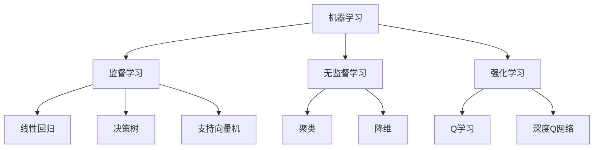
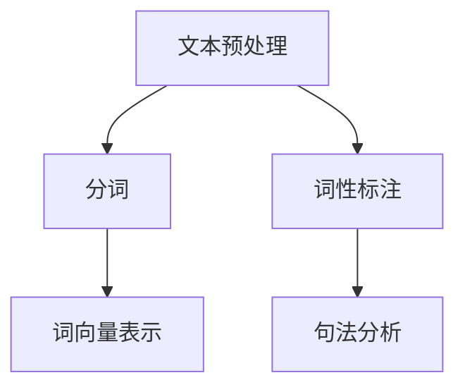
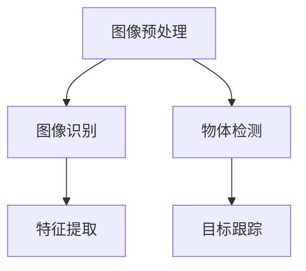
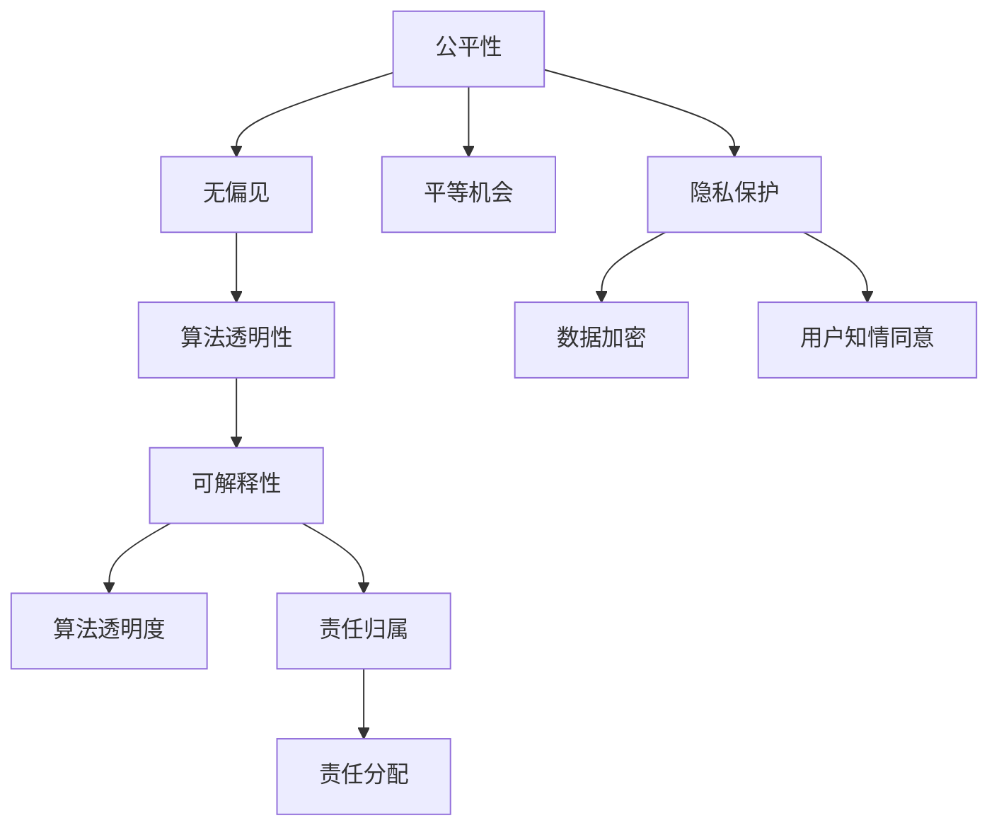
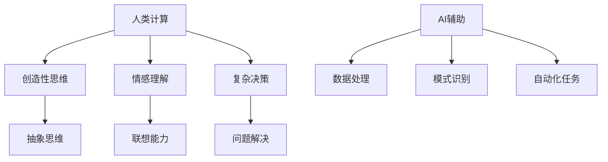

                 

### 文章标题

《AI驱动的创新：人类计算在商业中的道德考虑因素》

> 关键词：AI驱动的创新、商业应用、道德考量、人机协同、伦理原则、隐私保护

> 摘要：本文深入探讨了AI驱动的创新在商业领域的应用，强调了人类计算在AI发展中不可忽视的道德考量因素。通过分析AI驱动的创新背景、核心概念、原理及其与道德因素的关联，本文旨在为商业界提供一种全面、系统的思考框架，以指导未来AI技术的合理、道德应用。

## 第一部分：AI驱动的创新背景与概念

### 1.1 AI驱动的创新概述

#### 1.1.1 AI的发展趋势与影响

人工智能（AI）是计算机科学的一个分支，旨在创建智能代理（即能够感知环境、理解情境并采取相应行动的机器）。随着深度学习、自然语言处理和计算机视觉等领域的快速发展，AI在各个行业的应用越来越广泛。据统计，AI市场预计在未来几年内将保持高速增长，成为推动全球经济增长的重要动力。例如，在医疗领域，AI的应用从疾病预测到个性化治疗方案制定，大大提高了医疗效率和准确性；在金融领域，AI在风险管理、信用评估和欺诈检测等方面发挥着关键作用。

#### 1.1.2 商业中的AI应用案例

商业领域是AI应用的一个重要阵地。例如，在零售业，AI可以通过数据分析预测消费者行为，优化库存管理，提升客户体验；在制造业，AI技术用于质量检测、设备维护和供应链优化，提高了生产效率；在金融行业，AI在风险管理、信用评分和客户服务等方面发挥了重要作用。此外，AI还在自动驾驶、智能家居和智能城市等新兴领域展现出巨大的潜力。

### 1.2 人类计算的道德考虑

#### 1.2.1 伦理道德在AI应用中的重要性

随着AI技术的迅猛发展，伦理道德问题日益突出。AI的应用涉及到诸多伦理挑战，如数据隐私、算法偏见、自动化决策的影响等。因此，伦理道德在AI应用中具有重要意义。道德考量不仅可以确保AI技术的公平性、透明性和可解释性，还可以提升公众对AI技术的信任度。

#### 1.2.2 人类计算与AI合作的优势与挑战

人类计算与AI的协同工作是未来智能系统的发展趋势。人类计算在创造性思维、情感理解和复杂决策方面具有优势，而AI在数据处理、模式识别和自动化任务方面具有强大的能力。两者结合可以发挥各自的优势，实现更高效、更智能的决策。然而，这也带来了新的挑战，如如何确保AI的决策符合伦理标准、如何协调人类与AI的互动等。

### 1.3 AI驱动的创新框架

#### 1.3.1 创新过程与AI的结合

AI驱动的创新涉及从问题定义到解决方案设计的一系列过程。AI可以在这个过程中发挥重要作用，如通过数据分析识别问题、生成解决方案、评估方案的有效性等。AI驱动的创新框架包括以下几个关键步骤：

1. **问题定义**：明确创新目标，识别关键问题。
2. **数据收集**：收集与问题相关的数据，确保数据的质量和代表性。
3. **数据分析**：利用AI技术对数据进行处理和分析，识别潜在的模式和规律。
4. **方案生成**：基于数据分析结果，生成可能的解决方案。
5. **方案评估**：评估方案的有效性，选择最佳方案。
6. **实施与优化**：实施解决方案，并进行持续优化。

#### 1.3.2 创新评估方法与指标

在AI驱动的创新过程中，评估方法与指标至关重要。以下是一些常见的评估方法与指标：

1. **绩效指标**：衡量解决方案的实际效果，如提高效率、减少成本、提升客户满意度等。
2. **公平性指标**：评估解决方案是否公平，如是否存在算法偏见、是否侵犯用户隐私等。
3. **可持续性指标**：评估解决方案的长期影响，如是否有利于环境保护、是否促进社会公正等。
4. **可解释性指标**：评估AI系统的透明度和可解释性，如算法的决策过程是否容易理解等。

## 第二部分：核心概念与联系

### 2.1 AI驱动的创新原理

#### 2.1.1 AI基础理论

AI驱动的创新离不开对AI基础理论的了解。AI的基础理论主要包括机器学习、深度学习、自然语言处理和计算机视觉等领域。

1. **机器学习**：机器学习是一种通过算法让计算机从数据中学习规律和模式的方法。常见的机器学习算法包括线性回归、决策树、支持向量机等。

2. **深度学习**：深度学习是机器学习的一种子领域，主要利用多层神经网络进行学习。深度学习在图像识别、语音识别和自然语言处理等领域表现出色。

3. **自然语言处理**：自然语言处理旨在使计算机能够理解和处理自然语言。其应用包括语音识别、机器翻译、情感分析等。

4. **计算机视觉**：计算机视觉使计算机能够“看到”和理解现实世界的图像和视频。其应用包括图像识别、物体检测、人脸识别等。

#### 2.1.1.1 机器学习与深度学习

机器学习和深度学习是AI的两个重要分支。机器学习侧重于算法和模型的开发，而深度学习则侧重于通过多层神经网络进行学习。深度学习在处理复杂任务时表现更为出色，例如图像和语音识别。

#### 2.1.1.2 自然语言处理

自然语言处理涉及将自然语言转换为计算机可以理解和处理的形式。其核心技术包括分词、词性标注、句法分析等。

#### 2.1.1.3 计算机视觉

计算机视觉涉及从图像或视频中提取信息。其核心技术包括图像识别、物体检测和人脸识别。

### 2.2 道德考虑因素

#### 2.2.1 道德原则与准则

在AI驱动的创新过程中，道德原则与准则起着关键作用。以下是一些常见的道德原则与准则：

1. **公平性**：AI系统应公平对待所有用户，不应因种族、性别、年龄等因素产生偏见。
2. **隐私保护**：AI系统应保护用户的数据隐私，不得滥用用户数据。
3. **透明性与可解释性**：AI系统的决策过程应透明，用户应了解系统的决策依据。
4. **责任归属**：在AI系统的应用中，应明确责任归属，确保在出现问题时可以追究责任。

### 2.3 AI与人类计算的联系

#### 2.3.1 人机协同创新

人机协同创新是AI驱动的创新的重要方向。在这种模式下，人类计算与AI系统相互协作，共同实现创新目标。

#### 2.3.1.1 人类计算的优势

人类计算在以下方面具有优势：

1. **创造性思维**：人类能够进行抽象思维、联想和创新，是AI无法替代的。
2. **情感理解**：人类能够理解和表达情感，是AI难以实现的高级智能能力。
3. **复杂决策**：人类能够处理复杂、不确定的问题，是AI难以胜任的任务。

#### 2.3.1.2 AI在创新过程中的辅助作用

AI在创新过程中的辅助作用包括：

1. **数据处理**：AI能够高效处理海量数据，辅助人类进行数据分析。
2. **模式识别**：AI能够识别数据中的潜在模式，辅助人类发现问题和解决方案。
3. **自动化任务**：AI能够自动化执行重复性、繁琐的任务，提高工作效率。

## 结论

AI驱动的创新正在改变商业和社会的方方面面。然而，在这个过程中，人类计算的道德考量因素不可忽视。本文通过分析AI驱动的创新背景、核心概念、原理及其与道德因素的关联，为商业界提供了一种全面、系统的思考框架。未来，人类计算与AI的协同创新将继续推动社会进步，但必须在道德考量下进行，以确保AI技术的合理、道德应用。通过人机协同，我们可以期待一个更加智能、公正、透明和高效的未来。

## 参考文献

1. Russell, S., & Norvig, P. (2016). 《人工智能：一种现代的方法》（第3版）。
2. Norvig, P. (2015). 《机器学习》。
3. LeCun, Y., Bengio, Y., & Hinton, G. (2015). 《深度学习》。
4. Zaki, M. J., & Brown, G. (2013). 《数据挖掘：概念与技术》。
5. Vieira, R., & Paiva, A. (2020). 《人工智能伦理：道德考量与实践指南》。
6. Russell, S., & Norvig, P. (2010). 《人工智能：一种现代的方法》（第3版）。

## 作者信息

作者：AI天才研究院/AI Genius Institute & 禅与计算机程序设计艺术 /Zen And The Art of Computer Programming

AI天才研究院是一家专注于人工智能研究与教育的高科技公司，致力于推动人工智能技术在各个领域的创新应用。同时，作者也是《禅与计算机程序设计艺术》的作者，该书深入探讨了计算机编程与哲学、心理学之间的关系，对计算机科学领域产生了深远影响。

