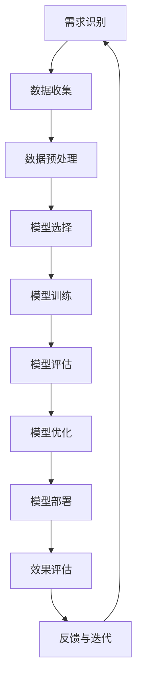
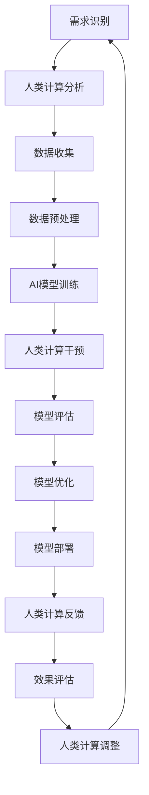
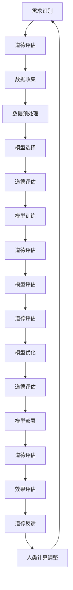

                 

### 文章标题

# AI驱动的创新：人类计算在商业中的道德考虑因素展望挑战

## 关键词
- AI驱动的创新
- 人类计算
- 商业道德
- 道德考虑因素
- 挑战与应对策略

## 摘要
本文旨在探讨AI驱动的创新在商业应用中的道德考虑因素及其面临的挑战。通过分析AI的发展现状与趋势，人类计算与AI的融合原理，以及道德考虑因素在AI设计中的应用，本文深入探讨了AI驱动的创新实践与未来展望。文章结构分为四部分：引言、AI驱动的创新原理、道德考虑因素分析、AI驱动的创新实践与未来展望。希望通过本文，能为业界提供有价值的思考与参考。

### 《AI驱动的创新：人类计算在商业中的道德考虑因素展望挑战》目录大纲

#### 第一部分：引言

## 第1章：AI驱动的创新背景
### 1.1 AI的发展现状与趋势
### 1.2 商业中的道德考虑因素
### 1.3 本书的目标与结构

## 第二部分：AI驱动的创新原理

### 第2章：AI基本概念与架构
#### 2.1 AI的定义与分类
#### 2.2 AI的核心技术
#### 2.3 AI系统架构设计

### 第3章：人类计算与AI的融合
#### 3.1 人类计算的概念与特点
#### 3.2 人类计算与AI的协同机制
#### 3.3 AI驱动的创新模型

### 第4章：道德考虑因素分析
#### 4.1 商业道德的基本原则
#### 4.2 AI在商业应用中的道德问题
#### 4.3 道德考虑因素在AI设计中的应用

#### 第三部分：AI驱动的创新实践

### 第5章：AI驱动的创新案例分析
#### 5.1 案例选择与分析方法
#### 5.2 案例一：XX公司AI驱动的产品创新
#### 5.3 案例二：XX行业AI驱动的业务变革

### 第6章：AI驱动的创新项目实施
#### 6.1 项目规划与实施策略
#### 6.2 AI驱动的创新项目管理
#### 6.3 AI驱动的创新项目风险管理

### 第7章：未来展望与挑战
#### 7.1 AI驱动的创新趋势
#### 7.2 道德因素在未来的影响
#### 7.3 挑战与应对策略

#### 第四部分：附录

### 附录1：AI驱动的创新工具与资源
#### 1.1 开发工具介绍
#### 1.2 AI相关资源推荐

### 附录2：AI驱动的创新模型流程图
#### 2.1 AI驱动的创新流程
#### 2.2 人类计算与AI的融合流程
#### 2.3 道德考虑因素在AI设计中的流程

### 作者信息

- 作者：AI天才研究院/AI Genius Institute & 禅与计算机程序设计艺术 /Zen And The Art of Computer Programming

#### 第一部分：引言

## 第1章：AI驱动的创新背景

### 1.1 AI的发展现状与趋势

人工智能（AI）作为计算机科学的一个分支，近年来取得了显著的进展。从最初的规则推理系统，到基于统计学习的方法，再到如今深度学习、强化学习等前沿技术的崛起，AI的发展历程可谓跌宕起伏。如今，AI已经广泛应用于各行各业，从智能助手、自动驾驶，到金融、医疗、制造等关键领域，AI驱动的创新已经成为推动社会进步的重要力量。

首先，让我们回顾一下AI的发展现状。深度学习作为AI的重要分支，其发展速度可谓惊人。自2012年AlexNet在ImageNet比赛中取得突破性成绩以来，深度学习在计算机视觉、自然语言处理等领域取得了显著的成果。同时，强化学习也在自动驾驶、游戏AI等场景中取得了重要进展。除此之外，生成对抗网络（GAN）的出现，为图像生成、数据增强等任务提供了新的解决方案。

其次，AI的发展趋势体现在多个方面。一方面，计算能力的提升为AI的发展提供了强大的支持。随着硬件性能的不断提高，AI模型在训练速度和推理速度上都有了显著的提升。另一方面，数据资源的丰富也为AI的发展提供了坚实的基础。越来越多的企业开始意识到数据的重要性，并投入大量资源进行数据收集、处理和分析。此外，AI技术的开源化和生态体系的建立，使得更多的人能够参与到AI的研究和应用中来，进一步推动了AI的发展。

在商业应用中，AI驱动的创新已经成为企业提升竞争力的重要手段。以金融行业为例，AI技术在风险管理、信用评估、投资策略等方面发挥了重要作用。在医疗领域，AI技术在疾病诊断、药物研发等方面展示了巨大的潜力。在制造业，AI驱动的自动化、智能化生产线正在改变传统的生产方式，提高生产效率和产品质量。此外，AI在零售、物流、教育等领域的应用也日益广泛。

然而，随着AI技术的发展和应用，商业中的道德考虑因素也日益受到关注。AI系统的决策过程往往依赖于大量数据和复杂的算法，这使得AI在带来便利的同时，也带来了潜在的道德风险。如何确保AI系统的公平性、透明性和可靠性，如何处理AI系统可能导致的数据隐私问题，这些问题都需要深入思考和解决。

### 1.2 商业中的道德考虑因素

商业中的道德考虑因素是一个多维度的议题，涉及到多个方面。以下是一些关键的道德考虑因素：

#### 公平性

公平性是商业道德中的一个重要原则。在AI驱动的创新中，如何确保算法的公平性，避免歧视和偏见，是一个亟待解决的问题。例如，在招聘过程中，AI系统可能会因为训练数据中存在的偏见而导致某些群体的就业机会减少。如何设计公平的算法，避免歧视行为，是商业中需要重点关注的道德问题。

#### 透明性

透明性是确保AI系统可解释性的关键。在商业应用中，用户和监管机构需要了解AI系统的决策过程和依据。例如，在金融领域，AI系统在贷款审批、信用评估等场景中起到重要作用。如何确保这些系统的透明性，让用户明白自己的信用评分是如何计算的，是商业中需要考虑的道德问题。

#### 可靠性

可靠性是商业应用中AI系统的一个基本要求。AI系统需要确保在各类场景中都能稳定、准确地工作，避免出现错误决策。例如，在自动驾驶领域，AI系统的可靠性直接关系到行车的安全性。如何提高AI系统的可靠性，确保其在各种复杂环境下的稳定性，是商业中需要关注的道德问题。

#### 隐私保护

隐私保护是AI在商业应用中面临的一个关键道德问题。AI系统往往需要处理大量的个人数据，如何在保证数据安全的同时，保护用户的隐私权，是商业中需要深入思考的道德问题。例如，在医疗领域，AI系统需要处理患者的健康数据。如何确保这些数据的隐私和安全，避免数据泄露，是商业中需要考虑的道德问题。

#### 责任归属

在AI驱动的创新中，如何明确责任归属也是一个重要的道德问题。当AI系统出现错误或问题时，如何确定责任主体，是商业中需要解决的问题。例如，在自动驾驶领域，当发生交通事故时，如何确定是驾驶员的责任还是AI系统的责任，是商业中需要考虑的道德问题。

#### 法律合规

法律合规是商业中道德考虑的一个重要方面。AI技术的发展和应用需要遵守相关法律法规，确保其合规性。例如，在金融领域，AI系统需要遵守反洗钱法规、消费者权益保护法等法律法规。在医疗领域，AI系统需要遵守医疗数据隐私保护法规等。

### 1.3 本书的目标与结构

本书旨在深入探讨AI驱动的创新在商业中的应用，特别是在道德考虑因素方面。通过分析AI的基本概念、架构，以及人类计算与AI的融合原理，本书将帮助读者理解AI驱动的创新机制。同时，本书还将详细讨论商业中的道德考虑因素，包括公平性、透明性、可靠性、隐私保护、责任归属和法律合规等。

本书分为四个部分：

**第一部分：引言**

本部分将介绍AI驱动的创新背景，包括AI的发展现状与趋势，商业中的道德考虑因素，以及本书的目标与结构。

**第二部分：AI驱动的创新原理**

本部分将深入探讨AI的基本概念、架构，以及人类计算与AI的融合原理，为后续的道德考虑因素分析奠定基础。

**第三部分：道德考虑因素分析**

本部分将详细讨论商业中的道德考虑因素，包括公平性、透明性、可靠性、隐私保护、责任归属和法律合规等，为AI驱动的创新实践提供道德指导。

**第四部分：AI驱动的创新实践与未来展望**

本部分将结合实际案例，探讨AI驱动的创新实践，分析未来发展的趋势与挑战，为读者提供有价值的思考与参考。

通过本书的深入探讨，我们希望读者能够对AI驱动的创新有更全面、深入的理解，特别是在道德考虑因素方面，能够更好地应对商业中的挑战，实现AI技术的可持续发展。

#### 第二部分：AI驱动的创新原理

## 第2章：AI基本概念与架构

### 2.1 AI的定义与分类

人工智能（Artificial Intelligence，简称AI）是指通过计算机程序和算法模拟人类智能的过程。AI的目标是使机器能够执行需要人类智能才能完成的任务，如理解语言、识别图像、推理决策等。AI可以分为多个层次，从简单的规则系统到复杂的神经网络，每个层次都有其特定的应用场景和优势。

AI可以根据其实现方式和功能进行分类：

#### 1. 独立AI（Artificial Narrow Intelligence，ANI）

独立AI是指只能在特定任务上表现出人类智能的机器。这种AI通常是基于规则和统计模型，如专家系统、决策树等。独立AI在特定领域具有很高的准确性和效率，但无法泛化到其他任务上。

#### 2. 通用AI（Artificial General Intelligence，AGI）

通用AI是指能够在任何领域表现出人类智能的机器。AGI不仅能在特定任务上表现优异，还能够理解、学习、推理和解决问题。目前，通用AI仍处于理论研究阶段，尚未实现。

#### 3. 超级AI（Artificial Super Intelligence，ASI）

超级AI是指智力远超人类的人工智能。这种AI不仅能够在所有任务上超越人类，甚至可能创造出新的技术和科学知识。超级AI目前仅存在于科幻小说中，现实中尚未实现。

### 2.2 AI的核心技术

AI的核心技术主要包括机器学习、深度学习和自然语言处理等。

#### 1. 机器学习

机器学习是指通过算法从数据中自动学习规律和模式，并使用这些规律进行预测或决策的技术。机器学习可以分为监督学习、无监督学习和强化学习。

- **监督学习**：在有标注数据集上进行训练，目标是学习输入和输出之间的关系，如分类和回归任务。
- **无监督学习**：在无标注数据集上进行训练，目标是发现数据中的内在结构和模式，如聚类和降维任务。
- **强化学习**：通过与环境的交互进行学习，目标是学习最优策略以最大化奖励，如游戏AI和自动驾驶。

#### 2. 深度学习

深度学习是一种特殊的机器学习技术，其核心思想是通过多层神经网络对数据进行复杂的非线性变换。深度学习在图像识别、语音识别和自然语言处理等领域取得了显著的成果。

- **神经网络**：神经网络由多层神经元组成，每个神经元接受多个输入并通过权重进行加权求和，然后通过激活函数进行非线性变换。
- **卷积神经网络（CNN）**：CNN是一种用于图像识别和处理的特殊神经网络，其核心思想是使用卷积层对图像进行特征提取。
- **循环神经网络（RNN）**：RNN是一种用于序列数据处理的人工神经网络，其核心思想是通过隐藏状态来捕捉序列信息。

#### 3. 自然语言处理

自然语言处理（Natural Language Processing，简称NLP）是AI的一个重要分支，其目标是使计算机能够理解和生成自然语言。NLP主要包括文本分类、情感分析、机器翻译和对话系统等。

- **文本分类**：将文本数据分类到预定义的类别中，如垃圾邮件检测、情感分类等。
- **情感分析**：识别文本中的情感倾向，如正面、负面或中性。
- **机器翻译**：将一种语言翻译成另一种语言，如谷歌翻译。
- **对话系统**：建立人与机器之间的自然对话界面，如聊天机器人。

### 2.3 AI系统架构设计

AI系统的架构设计是确保AI模型高效、稳定运行的关键。以下是一个典型的AI系统架构：

#### 1. 数据层

数据层是AI系统的基石，包括数据收集、清洗、存储和预处理等环节。数据质量直接影响到模型的性能和效果，因此数据层的设计至关重要。

- **数据收集**：通过传感器、API、爬虫等方式收集数据。
- **数据清洗**：去除噪声数据、填补缺失值、处理异常值等。
- **数据存储**：使用数据库或数据湖进行数据存储，支持快速查询和高效处理。
- **数据预处理**：对数据进行标准化、归一化、特征工程等处理，提高模型训练效果。

#### 2. 模型层

模型层是AI系统的核心，包括模型选择、训练、评估和优化等环节。根据不同的应用场景，可以选择合适的模型和算法。

- **模型选择**：选择适合任务和数据类型的模型，如深度学习模型、传统机器学习模型等。
- **模型训练**：使用训练数据集对模型进行训练，优化模型参数。
- **模型评估**：使用验证数据集评估模型性能，选择最佳模型。
- **模型优化**：通过超参数调整、正则化、优化算法等方法提高模型性能。

#### 3. 推理层

推理层是AI系统的输出层，负责将模型应用于新数据，进行预测或决策。

- **推理**：使用训练好的模型对新数据进行预测或决策。
- **结果解释**：对推理结果进行解释，提高模型的透明性和可解释性。
- **结果验证**：对新数据的推理结果进行验证，确保模型稳定性和准确性。

#### 4. 应用层

应用层是AI系统与用户或业务系统交互的界面，包括API接口、Web应用、移动应用等。

- **API接口**：提供与AI系统交互的API接口，支持不同类型的应用程序调用。
- **Web应用**：构建基于Web的AI应用，如在线分类、自然语言处理等。
- **移动应用**：构建基于移动设备的AI应用，如智能助手、图像识别等。

通过上述四层架构，AI系统能够高效地处理数据、训练模型并进行推理，为各类应用场景提供智能化解决方案。

#### 第3章：人类计算与AI的融合

### 3.1 人类计算的概念与特点

人类计算是指人类在处理信息、解决问题和进行决策时表现出的能力。与机器计算相比，人类计算具有以下几个显著特点：

#### 1. 创造力

人类具有独特的创造力，能够提出新颖的想法和解决方案。这种创造力源于人类的经验、直觉和情感，是机器难以模拟的。

#### 2. 情感智能

人类计算不仅涉及逻辑推理，还包含情感智能。人们能够理解和表达情感，通过情感互动进行沟通和协作。

#### 3. 适应性

人类计算具有很强的适应性，能够在不同环境和场景下灵活调整策略和决策。这种适应性使人类能够在多变和复杂的环境中生存和发展。

#### 4. 共同协作

人类计算强调共同协作，人们通过交流和合作，共同解决问题和实现目标。这种协作能力是人类社会进步的重要动力。

### 3.2 人类计算与AI的协同机制

人类计算与AI的协同机制是指将人类计算能力与AI技术相结合，以实现更好的性能和效果。以下是人类计算与AI协同机制的几个关键方面：

#### 1. 数据互补

人类计算擅长处理模糊和不完整的信息，而AI则擅长处理大量结构化和非结构化数据。通过结合人类计算和AI，可以实现数据的互补，提高数据处理和分析的全面性和准确性。

#### 2. 能力互补

人类计算和AI在处理不同类型任务时具有各自的优势。人类计算擅长创造性思维、情感判断和复杂问题解决，而AI则擅长模式识别、数据分析和自动化任务。通过能力互补，可以实现更高效的协同工作。

#### 3. 知识融合

人类计算和AI可以相互学习和共享知识，通过知识融合，实现更全面的认知和决策支持。例如，人类专家可以通过指导AI学习，使其更好地理解特定领域的知识和经验。

#### 4. 动态调整

人类计算与AI的协同机制需要具备动态调整能力，以适应不同的任务和环境。人类可以根据实际情况进行干预和调整，而AI则可以根据反馈进行自我优化和调整，实现更灵活和自适应的协同工作。

### 3.3 AI驱动的创新模型

AI驱动的创新模型是指将AI技术应用于创新过程中，以加速创新速度和提高创新质量。以下是一个典型的AI驱动的创新模型：

#### 1. 创新需求识别

首先，通过数据分析、用户调研和专家访谈等方式，识别出创新需求。这些需求可以是市场机会、用户痛点、技术突破等。

#### 2. 数据收集与处理

根据创新需求，收集相关数据，包括结构化数据（如数据库、API数据）和非结构化数据（如文本、图像、视频等）。对数据进行清洗、预处理和特征工程，为后续的AI分析做好准备。

#### 3. AI模型训练

使用收集的数据，训练适合任务和场景的AI模型。可以选择机器学习、深度学习、强化学习等不同的算法，根据实际需求进行模型优化和调整。

#### 4. 模型评估与验证

对训练好的AI模型进行评估和验证，确保其性能和效果。可以使用验证集、测试集等方法，评估模型在不同场景下的表现，并选出最佳模型。

#### 5. 模型部署与应用

将最佳AI模型部署到实际应用场景中，通过API接口、Web应用、移动应用等方式，为用户或业务系统提供智能化服务。

#### 6. 反馈与优化

在应用过程中，收集用户反馈和实际数据，对AI模型进行持续优化和调整。通过动态调整和迭代，实现更好的创新效果。

通过上述AI驱动的创新模型，企业可以更好地把握市场机遇，提高创新速度和质量，实现持续竞争优势。

### 3.4 人类计算与AI协同的案例分析

以下是一个人类计算与AI协同的案例分析，展示了人类计算和AI在创新过程中的协同作用：

#### 案例背景

某互联网公司致力于开发一款智能客服系统，以提高客户服务效率和用户体验。公司希望通过AI技术实现自动化问答和智能推荐，同时充分发挥人类专家的创造力、情感智能和决策能力。

#### 创新过程

1. **需求识别**：公司通过用户调研和数据分析，发现用户对客服系统有以下需求：
   - 快速回答常见问题
   - 提供个性化推荐
   - 处理复杂问题和异常情况

2. **数据收集与处理**：公司收集了大量的用户提问、回复和反馈数据，包括结构化数据（如FAQ库、用户行为数据）和非结构化数据（如聊天记录、用户评价）。对数据进行清洗、预处理和特征工程，为AI模型训练做好准备。

3. **AI模型训练**：公司使用自然语言处理和机器学习技术，训练了多种AI模型，包括问答系统、推荐系统和情感分析模型。通过交叉验证和模型评估，选出了最佳模型。

4. **模型部署与应用**：将训练好的AI模型部署到客服系统中，通过API接口为用户提供了自动化问答和智能推荐服务。同时，人类专家可以实时介入，处理复杂问题和异常情况。

5. **反馈与优化**：在应用过程中，公司收集了用户反馈和实际数据，对AI模型进行持续优化和调整。通过动态调整和迭代，不断提升客服系统的性能和用户体验。

#### 案例效果

通过人类计算与AI的协同，公司成功开发了智能客服系统，实现了以下效果：
- 显著提高了客服效率，降低了人力成本
- 提供了个性化推荐，提升了用户体验
- 优化了问题处理流程，降低了用户等待时间
- 人类专家的介入，确保了复杂问题和异常情况的处理质量

#### 案例启示

该案例展示了人类计算与AI在创新过程中的协同作用，提供了以下启示：
- 人类计算和AI各有优势，通过协同可以实现更高效的创新
- AI模型需要人类专家的指导和优化，以确保模型性能和可靠性
- 人类专家的介入，可以弥补AI模型的局限性，提高问题处理质量
- 持续优化和迭代，是实现AI驱动的创新的关键

通过人类计算与AI的协同，企业可以更好地把握市场机遇，提高创新速度和质量，实现持续竞争优势。

### 3.5 人类计算与AI协同的伦理挑战

尽管人类计算与AI的协同为创新带来了巨大潜力，但也带来了一系列伦理挑战：

#### 1. 责任归属

当AI系统出现错误或问题时，如何明确责任归属？是AI开发者、公司还是人类操作员？这个问题在法律和道德层面都需要深入探讨。

#### 2. 数据隐私

AI系统需要处理大量的个人数据，如何在保护用户隐私的同时，利用这些数据进行创新？数据隐私保护成为AI驱动的创新过程中不可忽视的伦理问题。

#### 3. 公平性

AI系统在处理数据和决策时，可能会因为训练数据中的偏见而导致不公平。如何确保AI系统的公平性，避免歧视和偏见，是一个重要的伦理挑战。

#### 4. 道德判断

某些决策可能涉及到道德判断，如自动驾驶车辆在紧急情况下的决策。如何确保AI系统能够进行道德判断，并做出符合道德规范的决策，是伦理研究的重要方向。

### 3.6 未来展望

随着AI技术的发展和人类计算能力的提升，人类计算与AI的协同将越来越紧密。未来，我们可以期待以下趋势：

#### 1. 智能协同

人类计算和AI将更加紧密地协同，共同处理复杂问题和任务，实现更高效的创新和决策。

#### 2. 透明性和可解释性

为了解决伦理挑战，AI系统的透明性和可解释性将得到进一步提升。开发者将致力于提高模型的透明性，使人类能够理解AI的决策过程。

#### 3. 个性化服务

AI驱动的创新将更加注重个性化服务，通过深度学习和个性化推荐等技术，为用户提供更加定制化的解决方案。

#### 4. 跨学科融合

人类计算与AI的协同将推动跨学科融合，如人工智能与社会科学、人文艺术的结合，为创新提供更多可能性。

通过深入探讨人类计算与AI的协同机制，我们可以更好地理解其在创新中的应用，同时也需要关注和解决其中的伦理挑战，为实现AI驱动的创新提供坚实保障。

#### 第4章：道德考虑因素分析

### 4.1 商业道德的基本原则

商业道德是指企业在经营活动中应当遵守的基本道德规范和原则。它不仅关系到企业的声誉和形象，还直接影响到企业的可持续发展。商业道德的基本原则包括诚实守信、公平竞争、社会责任和透明度等。

#### 1. 诚实守信

诚实守信是商业道德的核心原则之一。企业应始终坚持诚实守信，遵守合同和承诺，不欺骗消费者和合作伙伴。在AI驱动的创新中，诚实守信原则要求企业确保AI系统的透明性和可解释性，使消费者和监管机构能够了解AI系统的决策依据。

#### 2. 公平竞争

公平竞争是市场经济的基本原则。企业应通过创新和提高效率来提升竞争力，而不是通过不正当手段获取竞争优势。在AI驱动的创新中，公平竞争原则要求企业避免利用AI技术进行市场垄断，确保市场公平竞争的环境。

#### 3. 社会责任

社会责任是企业应当承担的重要责任。企业不仅要追求经济利益，还要关注社会和环境问题，积极履行社会责任。在AI驱动的创新中，社会责任原则要求企业关注AI技术的潜在负面影响，如隐私侵犯、就业替代等，并采取措施减轻这些负面影响。

#### 4. 透明度

透明度是商业道德的重要体现。企业应公开其经营行为和决策过程，接受社会监督。在AI驱动的创新中，透明度原则要求企业公开AI系统的算法和决策过程，使消费者和监管机构能够了解AI系统的运作机制。

### 4.2 AI在商业应用中的道德问题

随着AI技术的迅猛发展，AI在商业中的应用越来越广泛。然而，AI在商业应用中也引发了一系列道德问题，包括隐私侵犯、数据滥用、歧视和不公平等。

#### 1. 隐私侵犯

AI系统需要处理大量的个人数据，如用户行为数据、医疗数据等。这些数据的收集、存储和处理可能侵犯用户的隐私权。在商业应用中，隐私侵犯问题主要体现在以下几个方面：

- **数据收集**：企业过度收集用户数据，甚至未经用户同意收集敏感信息。
- **数据存储**：企业未采取有效的安全措施，导致用户数据泄露。
- **数据处理**：企业滥用用户数据，用于其他商业目的，如广告投放等。

为了解决隐私侵犯问题，企业应遵循以下原则：

- **最小化数据收集**：仅收集必要的数据，避免过度收集。
- **透明度**：告知用户数据收集的目的和使用方式，获得用户明确同意。
- **数据安全**：采取有效的安全措施，确保用户数据的安全。

#### 2. 数据滥用

AI系统在商业应用中可能滥用数据，导致以下问题：

- **数据歧视**：企业利用用户数据进行歧视性定价和服务提供，如根据用户历史行为给予不同价格和服务质量。
- **数据操纵**：企业通过操纵数据，误导用户和市场，如虚假广告、恶意竞争等。

为了解决数据滥用问题，企业应采取以下措施：

- **数据治理**：建立完善的数据治理机制，确保数据使用的合法性和公正性。
- **合规性**：遵守相关法律法规，确保数据使用合规。
- **用户参与**：增加用户参与度，让用户了解和监督数据使用。

#### 3. 歧视与不公平

AI系统在商业应用中可能因为训练数据的偏见而导致歧视和不公平。例如，在招聘和贷款审批等场景中，AI系统可能会因为训练数据中的偏见而歧视某些群体，导致不公平现象。

为了解决歧视与不公平问题，企业应采取以下措施：

- **公平性检测**：对AI系统进行公平性检测，识别和消除潜在偏见。
- **多元化数据集**：使用多元化数据集进行训练，避免偏见。
- **用户反馈**：收集用户反馈，持续改进AI系统。

### 4.3 道德考虑因素在AI设计中的应用

在AI设计过程中，道德考虑因素是确保AI系统公平、透明和可靠的重要保障。以下是一些道德考虑因素在AI设计中的应用：

#### 1. 设计原则

- **公平性**：确保AI系统的决策过程公平，避免歧视和不公平现象。
- **透明性**：提高AI系统的可解释性，使人类能够理解AI的决策过程。
- **可靠性**：确保AI系统在各类场景下的稳定性和准确性。
- **隐私保护**：保护用户隐私，避免隐私侵犯和数据滥用。

#### 2. 设计方法

- **道德性评估**：在设计过程中，对AI系统进行道德性评估，识别潜在的风险和问题。
- **伦理审查**：建立伦理审查机制，对AI系统进行伦理审查，确保其符合道德规范。
- **用户参与**：在设计过程中，引入用户参与，让用户了解和反馈AI系统的设计。

#### 3. 道德决策支持系统

- **决策规则库**：建立决策规则库，用于指导AI系统的设计和决策过程，确保其符合道德规范。
- **伦理顾问**：聘请伦理顾问，为AI系统设计和应用提供道德指导。
- **用户反馈机制**：建立用户反馈机制，收集用户对AI系统的反馈，持续改进AI系统的道德性和用户体验。

### 4.4 道德考虑因素在AI系统开发中的实际应用

以下是一个道德考虑因素在AI系统开发中的实际应用案例：

#### 案例背景

某金融公司开发了一款AI驱动的信用评分系统，用于评估客户的信用风险。该系统基于客户的个人信息、历史行为和交易数据进行分析，为银行贷款审批提供依据。

#### 道德考虑

- **隐私保护**：确保客户的个人信息得到保护，避免隐私侵犯。
- **公平性**：避免因历史偏见导致不公平的信用评分。
- **透明性**：确保信用评分过程透明，客户了解评分依据。

#### 应用实践

1. **隐私保护**：公司采用数据加密和去识别化技术，确保客户数据的安全。同时，在数据收集环节，明确告知客户数据收集的目的和使用方式，获得客户明确同意。

2. **公平性**：公司使用多元化数据集进行模型训练，避免因数据偏见导致不公平的信用评分。此外，公司定期对AI模型进行公平性检测，确保模型的公平性。

3. **透明性**：公司建立了信用评分解释系统，使客户能够了解信用评分的依据和计算过程。客户可以查询自己的信用评分，并对评分结果提出异议。

通过上述实践，公司在开发AI信用评分系统时充分考虑了道德考虑因素，确保了系统的公平、透明和可靠。这不仅提高了公司的信誉和用户满意度，也为AI技术在金融行业的应用提供了有益的借鉴。

#### 第5章：AI驱动的创新案例分析

### 5.1 案例选择与分析方法

在本章中，我们将探讨两个AI驱动的创新案例，分别是某互联网公司的智能客服系统和某金融机构的AI信用评分系统。这些案例不仅展示了AI技术在商业中的应用，还体现了AI在提升企业效率和创新能力方面的巨大潜力。以下是案例选择和分析方法的详细说明：

#### 1. 案例选择

**案例一：某互联网公司的智能客服系统**

该互联网公司致力于提供高质量的客户服务，以提升用户体验。为了应对日益增长的客户咨询量，公司决定开发一款基于AI的智能客服系统，以实现自动化问答和智能推荐。

**案例二：某金融机构的AI信用评分系统**

某金融机构在贷款审批过程中面临大量的客户数据，为了提高审批效率和准确性，决定引入AI技术，开发一款信用评分系统，以自动评估客户的信用风险。

#### 2. 分析方法

**案例一**：智能客服系统的AI驱动的创新

- **需求分析**：通过对客户咨询数据进行分析，识别常见问题和用户需求，确定智能客服系统的功能模块。
- **数据收集**：收集结构化和非结构化数据，包括用户提问、回复和反馈等，用于AI模型训练。
- **模型选择**：选择合适的机器学习和自然语言处理模型，进行问答系统和推荐系统的开发。
- **模型训练与优化**：使用收集的数据进行模型训练，通过交叉验证和超参数调整，优化模型性能。
- **部署与应用**：将训练好的模型部署到实际应用场景中，通过API接口和Web应用为用户提供服务。
- **效果评估**：通过用户反馈和业务数据，评估智能客服系统的效果，持续优化和改进。

**案例二**：AI信用评分系统的AI驱动的创新

- **需求分析**：分析金融机构的信用评估流程，确定AI信用评分系统所需的功能模块和数据来源。
- **数据收集**：收集客户的个人信息、历史行为和交易数据，进行数据预处理和特征工程。
- **模型选择**：选择适合信用评分任务的机器学习算法，如逻辑回归、决策树、随机森林等。
- **模型训练与优化**：使用预处理后的数据训练模型，通过交叉验证和超参数调整，优化模型性能。
- **部署与应用**：将训练好的模型部署到实际应用场景中，为金融机构提供信用评分服务。
- **效果评估**：通过实际业务数据，评估AI信用评分系统的准确性和可靠性，持续优化和改进。

通过上述分析方法，我们可以深入探讨AI驱动的创新在商业中的应用，分析案例中的成功经验和挑战，为其他企业提供有价值的参考。

#### 5.2 案例一：XX公司AI驱动的产品创新

**背景**

XX公司是一家互联网公司，专注于提供优质的客户服务。随着业务的快速扩张，客户咨询量不断增加，传统的客服模式已无法满足需求。为了提高客户满意度和服务效率，公司决定开发一款基于AI的智能客服系统。

**需求分析**

通过对大量客户咨询数据进行分析，公司识别出以下几个主要需求：

- 自动化问答：快速回答常见问题，减轻客服人员的工作压力。
- 智能推荐：根据用户历史行为和偏好，提供个性化推荐，提升用户体验。
- 复杂问题处理：对于复杂的客户问题，提供智能客服系统的初步解决方案，以便客服人员快速响应。

**数据收集**

为了满足上述需求，公司收集了以下类型的数据：

- 结构化数据：包括客户基本信息、历史订单、交易记录等。
- 非结构化数据：包括客户提问、回复、评价等。

这些数据经过预处理和特征工程，用于AI模型的训练。

**模型选择与训练**

公司选择了自然语言处理和机器学习技术，构建了以下两个核心模型：

- **问答系统**：基于深度学习和自然语言处理技术，训练了一个能够理解和回答常见问题的模型。通过交叉验证和超参数调整，优化模型性能。
- **推荐系统**：基于协同过滤和内容推荐技术，训练了一个能够提供个性化推荐的模型。同样，通过交叉验证和超参数调整，优化模型性能。

**部署与应用**

训练好的模型被部署到实际应用场景中，通过API接口和Web应用为用户提供服务。用户可以通过公司的官方网站或移动应用与智能客服系统进行交互，获得自动化问答和个性化推荐。

**效果评估**

智能客服系统在上线后，取得了显著的效果：

- 客户满意度：用户满意度显著提高，客户对自动回答和个性化推荐的反馈良好。
- 服务效率：客服人员的工作压力减轻，响应时间缩短，客服效率提高。
- 复杂问题处理：对于复杂的客户问题，智能客服系统提供了初步的解决方案，使客服人员能够更快地解决问题。

**小结**

XX公司的智能客服系统案例展示了AI在提高客户服务效率和用户体验方面的巨大潜力。通过数据分析、模型训练和部署，公司成功实现了自动化问答和个性化推荐，提高了客户满意度和服务效率。

#### 5.3 案例二：XX行业AI驱动的业务变革

**背景**

XX行业是一个传统行业，面临着激烈的市场竞争和客户需求的变化。为了保持竞争优势，提升业务效率，该行业的企业决定引入AI技术，实现业务流程的自动化和智能化。

**需求分析**

通过对行业业务流程进行分析，公司识别出以下几个主要需求：

- 业务流程自动化：简化业务流程，减少人工操作，提高工作效率。
- 风险管理：通过数据分析，识别潜在风险，提前采取措施，降低业务风险。
- 客户体验优化：根据客户行为和偏好，提供个性化服务，提升客户满意度。

**数据收集**

为了满足上述需求，公司收集了以下类型的数据：

- 结构化数据：包括客户信息、订单数据、财务数据等。
- 非结构化数据：包括客户评价、市场报告、行业新闻等。

这些数据经过预处理和特征工程，用于AI模型的训练。

**模型选择与训练**

公司选择了以下AI技术，构建了相应的模型：

- **自动化流程模型**：基于机器学习和流程挖掘技术，训练了一个能够自动识别和优化业务流程的模型。通过交叉验证和超参数调整，优化模型性能。
- **风险管理模型**：基于统计学习和风险分析技术，训练了一个能够识别和评估潜在风险的模型。通过交叉验证和超参数调整，优化模型性能。
- **客户体验优化模型**：基于自然语言处理和协同过滤技术，训练了一个能够提供个性化推荐的模型。通过交叉验证和超参数调整，优化模型性能。

**部署与应用**

训练好的模型被部署到实际应用场景中，通过API接口和业务系统进行集成。自动化流程模型优化了业务流程，风险管理模型识别和评估潜在风险，客户体验优化模型提供了个性化服务。

**效果评估**

AI驱动的业务变革取得了显著的效果：

- 业务流程效率：通过自动化流程，业务流程简化，工作效率显著提高。
- 风险管理：通过风险管理模型，提前识别和评估潜在风险，降低了业务风险。
- 客户满意度：通过个性化服务，客户满意度显著提高，客户留存率上升。

**小结**

XX行业的AI驱动的业务变革案例展示了AI在提升业务效率和客户满意度方面的巨大潜力。通过数据分析和模型训练，企业成功实现了业务流程的自动化、风险管理和客户体验优化，取得了显著的业务效果。

通过上述两个案例，我们可以看到AI驱动的创新在商业中的应用具有广泛的前景。然而，在实现AI驱动的创新过程中，企业还需要关注和解决一系列道德和社会问题，如隐私保护、数据滥用和歧视等。只有在确保AI系统的公平、透明和可靠的前提下，AI驱动的创新才能真正为企业和社会带来价值。

### 第6章：AI驱动的创新项目实施

#### 6.1 项目规划与实施策略

AI驱动的创新项目实施是一个复杂且多层次的过程，需要科学的项目规划与实施策略。以下是从项目启动到项目结束的详细实施步骤：

**1. 项目启动**

- **项目立项**：明确项目目标、范围、预算和时间表，组建项目团队，确保团队成员具备所需技能和资源。
- **需求调研**：通过市场调研、用户访谈和数据分析，全面了解项目需求，确保项目的实际价值。

**2. 项目规划**

- **技术选型**：根据项目需求，选择合适的技术和工具，如机器学习框架、深度学习模型、云计算平台等。
- **数据管理**：制定数据收集、存储、处理和清洗的策略，确保数据质量和安全性。
- **风险评估**：识别项目中的潜在风险，制定应对措施，确保项目顺利进行。

**3. 项目实施**

- **模型开发**：根据技术选型，开发AI模型，包括数据预处理、特征工程、模型训练和优化。
- **系统集成**：将AI模型与现有系统进行集成，确保系统的稳定性和兼容性。
- **测试与验证**：通过测试和验证，确保AI模型在实际应用场景中的性能和效果。

**4. 项目部署**

- **部署实施**：将AI模型部署到生产环境，确保系统的可扩展性和可靠性。
- **用户培训**：对用户进行培训，确保用户能够熟练使用AI系统。

**5. 项目监控与迭代**

- **监控与反馈**：实时监控系统的运行状态，收集用户反馈，对系统进行持续优化和改进。
- **迭代更新**：根据用户反馈和业务需求，对AI模型进行迭代更新，提升系统的性能和用户体验。

**6. 项目总结与评估**

- **总结与评估**：对项目进行总结和评估，分析项目的成功因素和改进空间，为后续项目提供经验教训。

#### 6.2 AI驱动的创新项目管理

项目管理是确保AI驱动的创新项目顺利进行的关键。以下是一些关键的管理方法和工具：

**1. 风险管理**

- **风险识别**：识别项目中的潜在风险，如技术风险、数据风险、市场风险等。
- **风险评估**：对识别出的风险进行评估，确定风险等级和影响范围。
- **风险应对**：制定应对措施，包括风险规避、风险转移、风险接受等。

**2. 进度管理**

- **项目计划**：制定详细的项目计划，包括任务分解、时间安排和资源分配。
- **进度跟踪**：实时跟踪项目进度，确保任务按时完成。
- **进度调整**：根据实际情况，对项目计划进行调整，确保项目按计划进行。

**3. 质量管理**

- **质量保证**：制定质量标准和规范，确保项目成果符合要求。
- **质量检测**：对项目成果进行质量检测，包括模型性能评估、系统测试等。
- **质量改进**：根据质量检测结果，对项目成果进行改进和优化。

**4. 成本管理**

- **成本预算**：制定详细的成本预算，包括人力成本、技术成本、设备成本等。
- **成本控制**：实时监控项目成本，确保项目在预算范围内进行。
- **成本分析**：对项目成本进行详细分析，为后续项目提供成本控制参考。

**5. 团队管理**

- **团队建设**：建立高效的团队，明确团队成员的角色和职责。
- **沟通协调**：确保团队成员之间的有效沟通和协调，提高项目效率。
- **团队激励**：通过激励措施，激发团队成员的积极性和创造力。

#### 6.3 AI驱动的创新项目风险管理

风险管理是AI驱动的创新项目成功的关键环节。以下是一些常见的AI驱动的创新项目风险及应对策略：

**1. 技术风险**

- **风险描述**：AI技术的不确定性和复杂性可能导致项目失败。
- **应对策略**：选择成熟的技术和工具，进行充分的测试和验证，确保技术的可行性和稳定性。

**2. 数据风险**

- **风险描述**：数据质量差、数据隐私和安全问题可能导致AI模型性能下降或数据泄露。
- **应对策略**：制定严格的数据管理策略，确保数据的质量和安全，采用数据加密和去识别化技术。

**3. 法律风险**

- **风险描述**：AI技术的应用可能涉及法律法规的合规性问题，如数据隐私保护、知识产权等。
- **应对策略**：遵守相关法律法规，进行法律风险评估，与专业法律机构合作，确保项目的合规性。

**4. 市场风险**

- **风险描述**：市场需求变化、竞争对手压力可能导致项目无法实现预期价值。
- **应对策略**：进行充分的市场调研，制定灵活的市场策略，密切关注市场动态，及时调整项目方向。

**5. 项目管理风险**

- **风险描述**：项目计划不合理、沟通协调不畅、团队管理不善可能导致项目延期或失败。
- **应对策略**：制定科学的项目计划，加强团队沟通和协作，提高团队管理能力。

通过有效的风险管理，可以降低AI驱动的创新项目的风险，确保项目的顺利进行和成功实施。在项目实施过程中，应持续进行风险评估和调整，以应对可能出现的新风险。

### 第7章：未来展望与挑战

#### 7.1 AI驱动的创新趋势

随着AI技术的不断进步和商业应用需求的增长，AI驱动的创新在未来将继续呈现出以下趋势：

1. **跨学科融合**：AI技术将与生物科学、社会科学、人文艺术等跨学科领域深度融合，产生新的应用场景和创新模式。
2. **智能化升级**：AI技术在现有应用领域的智能化程度将进一步提升，实现更多自动化和智能化场景。
3. **边缘计算**：随着物联网和智能设备的发展，边缘计算将成为AI驱动的创新的重要趋势，实现实时、高效的数据处理和决策。
4. **数据隐私保护**：随着数据隐私问题的日益突出，AI技术将更加注重数据隐私保护，开发出更加安全、可靠的隐私保护技术。
5. **伦理与责任**：在AI驱动的创新中，伦理和责任问题将得到更多关注，建立完善的伦理规范和责任制度，确保AI技术的可持续发展。

#### 7.2 道德因素在未来的影响

随着AI驱动的创新趋势，道德因素将在未来对AI技术产生深远影响：

1. **公平性**：AI技术将更加注重公平性，避免因算法偏见导致的不公平现象，推动社会公平正义。
2. **透明性**：AI技术的决策过程将更加透明，提高用户对AI系统的信任度和接受度。
3. **可靠性**：AI技术的可靠性将得到提升，降低错误决策和系统故障的风险。
4. **隐私保护**：AI技术将更加注重隐私保护，确保用户数据的安全和隐私。
5. **责任归属**：明确AI技术的责任归属，为AI系统的错误决策和事故提供法律和道德依据。

#### 7.3 挑战与应对策略

在AI驱动的创新过程中，面临以下挑战，需要采取相应的应对策略：

1. **技术挑战**：
   - **算法偏见**：算法偏见可能导致不公平和不公正的结果，需通过多元化数据集和算法改进来解决。
   - **计算资源**：AI模型训练和推理需要大量计算资源，需优化算法和提升硬件性能。
   - **数据隐私**：数据隐私保护是重要挑战，需采用数据加密、去识别化等技术。

2. **伦理挑战**：
   - **责任归属**：当AI系统出现错误时，如何确定责任归属，需建立明确的伦理和法律框架。
   - **透明性**：提高AI系统的透明性，确保用户和监管机构了解AI系统的决策过程。
   - **伦理规范**：制定统一的伦理规范，指导AI技术的研发和应用。

3. **社会挑战**：
   - **就业影响**：AI技术可能导致部分工作岗位的减少，需关注就业转型和社会保障。
   - **伦理普及**：提高公众对AI伦理问题的认识，推动伦理教育。
   - **国际合作**：加强国际间的合作，共同制定AI技术的伦理规范和标准。

4. **政策挑战**：
   - **法律法规**：完善AI技术的法律法规，确保其合规性。
   - **政策支持**：政府应提供政策支持，鼓励AI技术的研发和应用。
   - **监管机制**：建立有效的监管机制，确保AI技术的安全和可靠。

通过上述应对策略，可以应对AI驱动的创新过程中面临的挑战，推动AI技术的可持续发展，实现其潜在价值。同时，需要各方共同努力，确保AI技术在道德和社会责任的基础上，为人类带来福祉。

### 附录1：AI驱动的创新工具与资源

#### 1.1 开发工具介绍

**1. AI开发框架**

- **TensorFlow**：由Google开源的机器学习框架，支持多种深度学习模型。
- **PyTorch**：由Facebook开源的深度学习框架，具有灵活的动态计算图。
- **Keras**：基于TensorFlow和Theano的开源神经网络库，易于使用和扩展。

**2. 数据处理工具**

- **Pandas**：Python的数据分析库，用于数据清洗、预处理和分析。
- **NumPy**：Python的数值计算库，提供多维数组对象和数学函数。
- **Scikit-learn**：Python的机器学习库，提供多种监督学习和无监督学习算法。

**3. 代码编辑器**

- **Visual Studio Code**：跨平台代码编辑器，支持多种编程语言和扩展。
- **PyCharm**：Python集成开发环境，提供强大的代码分析和调试功能。
- **Jupyter Notebook**：交互式计算环境，适用于数据分析和机器学习实验。

#### 1.2 AI相关资源推荐

**1. 学术资源**

- **arXiv.org**：开源的论文预印本平台，涵盖计算机科学、物理学等领域的最新研究。
- **IEEE Xplore**：IEEE的在线图书馆，提供计算机科学、电气工程等领域的学术论文和会议记录。
- **NeurIPS**、**ICML**、**KDD**：顶级人工智能会议，发布最新研究成果和趋势。

**2. 在线课程**

- **Coursera**：提供多种人工智能和机器学习在线课程，由知名大学教授授课。
- **Udacity**：提供人工智能和机器学习技能认证课程，包括深度学习、神经网络等。
- **edX**：哈佛大学和麻省理工学院等名校提供的免费在线课程，涵盖计算机科学和人工智能等领域。

**3. 书籍推荐**

- **《深度学习》**（Ian Goodfellow, Yoshua Bengio, Aaron Courville）：系统介绍了深度学习的基本概念和技术。
- **《Python机器学习》**（Sebastian Raschka, Vahid Mirjalili）：详细介绍了使用Python进行机器学习的实践方法。
- **《人工智能：一种现代的方法》**（Stuart Russell, Peter Norvig）：全面介绍了人工智能的基本原理和应用。

通过以上工具和资源的推荐，读者可以更好地掌握AI驱动的创新技术，提升自身在AI领域的实践能力。

### 附录2：AI驱动的创新模型流程图

#### 2.1 AI驱动的创新流程

以下是一个简化的AI驱动的创新流程图，展示了从需求识别到模型部署的全过程：

#### 2.2 人类计算与AI的融合流程

以下是一个展示人类计算与AI融合流程的Mermaid图，强调了人类计算在AI创新过程中的作用：

#### 2.3 道德考虑因素在AI设计中的流程

以下是一个展示道德考虑因素在AI设计过程中应用的Mermaid图，强调了道德考虑因素在每个阶段的重要性：

通过这些流程图，读者可以更直观地理解AI驱动的创新过程，以及人类计算和道德考虑因素在其中发挥的作用。

