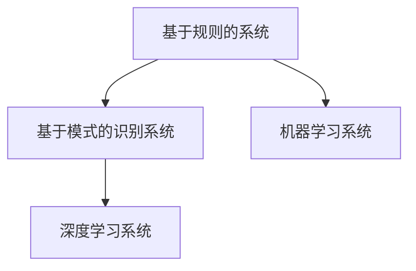
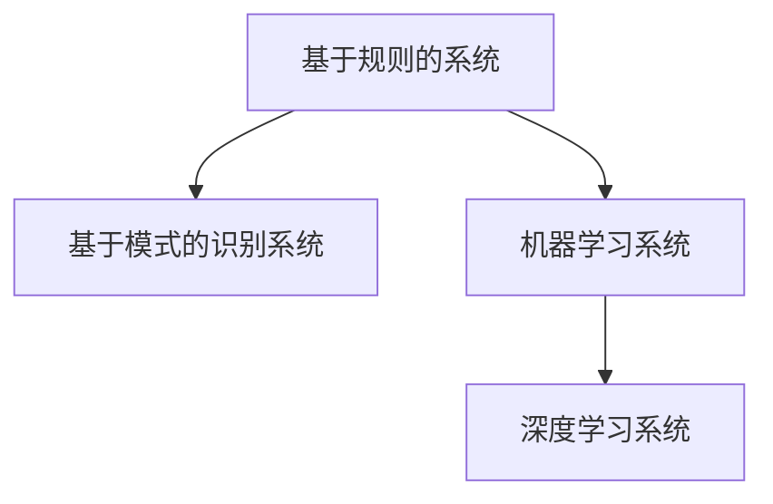
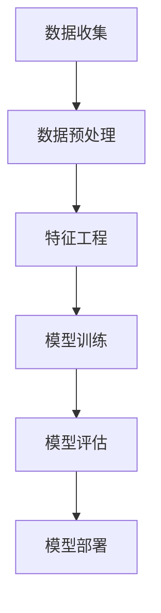

                 

### 文章标题：AI驱动的创新：人类计算在商业中的道德考虑因素预测

### 关键词：AI，商业创新，道德考虑，预测模型，人类计算

### 摘要：

随着人工智能（AI）技术的飞速发展，AI驱动的创新已成为推动商业进步的关键力量。然而，AI在商业中的应用不仅带来了机遇，也引发了诸多道德和伦理问题。本文旨在探讨AI驱动的创新过程中，人类计算在商业中的道德考虑因素预测。通过深入分析AI的基本原理、道德考虑因素、以及道德预测模型，本文将阐述人类计算在AI应用中的重要性，并提出策略建议，以实现商业中的道德预测和风险控制。

### 目录大纲：

1. **AI与商业创新概述**
    1.1 AI时代的商业创新趋势
    1.2 AI驱动的创新模式
    1.3 人类计算在AI驱动创新中的作用
2. **AI基础原理**
    2.1 AI的基本概念与分类
    2.2 机器学习原理
    2.3 深度学习框架与算法
3. **道德考虑因素的引入**
    3.1 道德考虑在AI中的重要性
    3.2 AI伦理原则与框架
    3.3 人类计算在道德评估中的角色
4. **AI驱动的商业道德预测模型**
    4.1 预测模型的基本框架
    4.2 常见的预测算法
    4.3 人类计算在模型构建中的贡献
5. **道德风险识别与评估**
    5.1 道德风险识别方法
    5.2 道德风险评估模型
    5.3 人类计算在风险评估中的作用
6. **AI应用中的道德监管**
    6.1 道德监管的必要性
    6.2 道德监管框架
    6.3 人类计算在道德监管中的职责
7. **实际案例研究**
    7.1 案例一：AI在金融行业的道德风险预测
    7.2 案例二：AI在医疗行业的道德考虑
    7.3 案例三：AI在社交网络平台的道德监管
8. **未来展望与策略建议**
    8.1 AI道德预测的未来趋势
    8.2 人类计算在AI道德预测中的未来角色
    8.3 商业决策中的道德预测策略
9. **策略建议与实践指导**
    9.1 企业在AI道德预测中的策略建议
    9.2 人类计算在AI道德预测中的实践指导
    9.3 道德预测在商业实践中的应用案例
10. **附录**
    10.1 AI道德预测相关工具与技术
    10.2 参考文献

## 第一部分：AI驱动的创新基础

### 第1章：AI与商业创新概述

在当今这个数据驱动的时代，人工智能（AI）已经成为商业创新的催化剂。AI技术不仅提高了企业的运营效率，还推动了新的商业模式的出现。然而，随着AI在商业领域的广泛应用，一系列道德和伦理问题也随之浮现。这些问题涉及隐私、偏见、透明度、责任等方面，对商业决策产生了深远的影响。因此，理解和预测AI在商业中的道德考虑因素，已成为确保AI驱动创新可持续发展的重要课题。

#### 1.1 AI时代的商业创新趋势

##### AI的基本概念与分类
AI是指使计算机系统能够执行通常需要人类智能的任务，如视觉识别、语言理解、决策制定等。AI可以分为多种类型，包括基于规则的系统、基于模式的识别系统、机器学习（ML）系统和深度学习（DL）系统。

- **Mermaid流程图**


##### 机器学习原理
机器学习是AI的一个分支，它使计算机系统能够从数据中学习并改进性能。机器学习主要分为监督学习、无监督学习和强化学习。

- **核心算法原理讲解**
```plaintext
算法：决策树
1. 根据特征集计算特征重要度
2. 选择最优特征作为切分变量
3. 将数据集切分为左右两个子集
4. 对子集递归执行1-3步骤
```

##### 深度学习框架与算法
深度学习是机器学习的一个子领域，它使用多层神经网络来提取数据中的复杂特征。深度学习在图像识别、语音识别和自然语言处理等领域取得了显著成果。

- **核心算法原理讲解**
```plaintext
算法：卷积神经网络(CNN)
1. 卷积层：使用卷积核在输入数据上滑动，计算局部特征
2. 池化层：将卷积层的结果进行下采样，减少数据维度
3. 全连接层：将池化层的结果映射到输出层
```

#### 1.2 AI驱动的创新模式

AI驱动的创新模式主要涉及以下几个方面：

- **AI驱动的商业模式**
AI可以帮助企业优化运营流程、降低成本、提高客户满意度和创新能力。例如，通过AI分析客户数据，企业可以更好地了解客户需求，从而提供个性化的产品和服务。

- **数学模型**
$$
收益 = 收入 - 成本
$$

- **举例说明**
假设某公司的AI系统降低了10%的成本，而收入增加了5%，则AI驱动的商业模式将带来15%的额外收益。

- **AI驱动的产品创新**
AI技术可以应用于产品设计、开发、测试和优化等环节，提高产品质量和用户体验。例如，通过AI进行代码审查，可以显著减少软件缺陷。

- **AI驱动的业务拓展**
AI可以帮助企业开拓新市场、发现新的商业机会。例如，通过AI分析市场数据，企业可以更好地定位目标客户和制定营销策略。

#### 1.3 人类计算在AI驱动创新中的作用

虽然AI技术在许多方面已经超越了人类计算，但人类计算在AI驱动创新中仍然扮演着重要角色：

- **协同作用**
人类计算与AI的结合可以显著提高效率和准确性。例如，AI可以处理大量数据，但需要人类专家进行解释和决策。

- **数学模型**
$$
效率 = 人机效率 \times AI效率
$$

- **举例说明**
如果人类计算的效率为80%，AI的效率为90%，则整体效率为$0.8 \times 0.9 = 0.72$，即提高了72%。

### 小结

AI驱动的创新已成为推动商业进步的关键力量。然而，AI在商业中的应用也引发了诸多道德和伦理问题。通过深入分析AI的基本原理和道德考虑因素，本文揭示了人类计算在AI驱动创新中的重要性。在接下来的章节中，我们将进一步探讨AI伦理原则、道德预测模型以及道德监管等方面的内容，以期为AI在商业中的可持续发展提供有益的指导。

### 第2章：AI基础原理

人工智能（AI）是现代技术发展的重要方向，其应用范围涵盖了从自动化、数据分析到复杂的决策支持系统。理解AI的基础原理对于探索其在商业中的潜力至关重要。本章将深入探讨AI的基本概念与分类、机器学习原理以及深度学习框架与算法，为后续章节的讨论奠定基础。

#### 2.1 AI的基本概念与分类

##### AI的定义
AI是指使计算机系统执行通常需要人类智能的任务的技术。这些任务包括但不限于感知、理解、学习、推理、决策和交流。

##### AI的分类
AI可以分为多种类型，每种类型都有其独特的应用场景和特点：

- **基于规则的系统**
基于规则的系统使用预定义的规则集来处理输入数据。这种系统的优点是易于理解和实现，但缺点是缺乏灵活性和适应性。


- **基于模式的识别系统**
基于模式的识别系统通过识别数据中的模式来进行分类或预测。这种系统通常用于图像识别、文本分类等任务。
- **机器学习系统**
机器学习系统通过从数据中学习来改进性能。根据学习方式的不同，机器学习系统可以分为监督学习、无监督学习和强化学习。
- **深度学习系统**
深度学习系统使用多层神经网络来提取数据中的复杂特征。深度学习在图像识别、语音识别和自然语言处理等领域取得了显著成果。

#### 2.2 机器学习原理

##### 监督学习
监督学习是一种最常见的机器学习方法，它使用标记数据集来训练模型，并在新的、未标记的数据上进行预测。

- **核心算法原理讲解**
```plaintext
算法：决策树
1. 根据特征集计算特征重要度
2. 选择最优特征作为切分变量
3. 将数据集切分为左右两个子集
4. 对子集递归执行1-3步骤
```

##### 无监督学习
无监督学习不使用标记数据集，而是通过发现数据中的内在结构来对数据进行分析。

- **核心算法原理讲解**
```plaintext
算法：K-均值聚类
1. 随机初始化中心点
2. 计算每个数据点与中心点的距离
3. 将数据点分配到最近的中心点
4. 更新中心点位置
5. 重复步骤2-4，直到收敛
```

##### 强化学习
强化学习通过奖励和惩罚来指导模型的行为，以实现特定的目标。

- **核心算法原理讲解**
```plaintext
算法：Q学习
1. 初始化Q值表
2. 选择动作a
3. 执行动作a，得到状态s'和奖励r
4. 更新Q值：Q(s, a) = Q(s, a) + α[r + γmax Q(s', a') - Q(s, a)]
5. 转到下一个状态s，重复步骤2-4
```

#### 2.3 深度学习框架与算法

##### 卷积神经网络（CNN）
卷积神经网络是深度学习中的一个重要分支，广泛应用于图像和视频处理。

- **核心算法原理讲解**
```plaintext
算法：卷积神经网络(CNN)
1. 卷积层：使用卷积核在输入数据上滑动，计算局部特征
2. 池化层：将卷积层的结果进行下采样，减少数据维度
3. 全连接层：将池化层的结果映射到输出层
```

##### 循环神经网络（RNN）
循环神经网络适用于处理序列数据，如自然语言处理和时间序列分析。

- **核心算法原理讲解**
```plaintext
算法：循环神经网络(RNN)
1. 初始化隐藏状态h0
2. 对于每个输入x_t，执行递归计算：
   h_t = tanh(W_h * [h_{t-1}, x_t]) + b_h
3. 输出y_t = W_o * h_t + b_o
```

##### 长短时记忆网络（LSTM）
长短时记忆网络是RNN的一个变种，用于解决RNN在处理长序列数据时的梯度消失和梯度爆炸问题。

- **核心算法原理讲解**
```plaintext
算法：长短时记忆网络(LSTM)
1. 初始化 forget gate、input gate 和 output gate 的权重和偏置
2. 对于每个输入x_t，执行以下步骤：
   - 计算遗忘门 f_t = sigmoid(W_f * [h_{t-1}, x_t]) * f_t-1
   - 计算输入门 i_t = sigmoid(W_i * [h_{t-1}, x_t]) * i_t
   - 计算新的单元状态 C_t = tanh(W_c * [h_{t-1}, x_t]) * i_t
   - 更新单元状态 C_t = f_t \* C_{t-1} + i_t \* C_t
   - 计算输出门 o_t = sigmoid(W_o * [h_{t-1}, x_t]) * o_t
   - 计算隐藏状态 h_t = o_t \* tanh(C_t)
3. 输出y_t = W_o * h_t + b_o
```

#### 小结

AI的基础原理涵盖了从简单的规则系统到复杂的深度学习框架。机器学习和无监督学习提供了自动从数据中学习的方法，而深度学习则通过多层神经网络提取复杂特征，显著提高了模型的性能。理解这些基础原理对于在商业中有效应用AI至关重要。在下一章中，我们将探讨道德考虑因素在AI中的重要性，以及人类计算在道德评估中的作用。

### 第3章：道德考虑因素的引入

人工智能（AI）的快速发展带来了前所未有的商业机遇，但也引发了一系列道德和伦理问题。这些问题不仅关乎技术的合法性和有效性，更涉及到人类的基本权利和价值。因此，在AI的应用过程中，道德考虑因素显得尤为重要。本章将深入探讨道德考虑在AI中的重要性、AI伦理原则与框架，以及人类计算在道德评估中的角色。

#### 3.1 道德考虑在AI中的重要性

##### 隐私问题
AI系统常常需要处理大量的个人数据，这可能侵犯用户的隐私权。例如，面部识别技术在公共安全中的应用可能会记录个人的行踪和行为习惯，这需要严格的隐私保护措施。

##### 偏见问题
AI系统在训练过程中可能会吸收和放大现有的社会偏见，导致不公平的决策。例如，招聘AI系统可能会无意中歧视某些性别或种族的候选人，这种偏见如果不加以纠正，将加剧社会不公。

##### 透明度和责任问题
AI系统的决策过程往往是不透明的，这给用户和监管机构带来了信任问题。例如，医疗AI系统在诊断疾病时可能会基于复杂的算法做出决策，但这些决策的逻辑和依据对用户是不透明的。此外，当AI系统发生错误时，责任的归属也成为一个复杂的问题。

##### 安全问题
AI系统在自动化决策过程中可能会引发新的安全风险。例如，自动驾驶汽车在处理突发情况时可能无法做出及时反应，导致交通事故。

##### 法律合规问题
AI的应用需要遵循相关的法律法规，例如数据保护法、消费者保护法等。违反这些法律可能会带来严重的法律后果。

#### 3.2 AI伦理原则与框架

为了解决上述问题，国际上提出了多种AI伦理原则和框架，以下是一些主要的：

- **可解释性（Explainability）**
AI系统的决策过程应该易于理解，以便用户和监管机构能够评估其合理性和公正性。例如，可解释性要求医疗AI系统提供详细的诊断逻辑。

- **公平性（Fairness）**
AI系统应该避免歧视，确保对所有用户公平对待。这可以通过算法透明化和偏见检测来实现。

- **隐私保护（Privacy Protection）**
AI系统应该保护用户的隐私，确保个人数据的安全和保密性。例如，采用加密技术和数据匿名化方法。

- **责任归属（Accountability）**
AI系统的设计者和运营者应该对其决策负责。当AI系统发生错误时，应该有明确的追溯机制。

- **透明度（Transparency）**
AI系统的决策过程应该公开透明，以便用户和监管机构能够审查。例如，通过开放算法代码和提供决策解释。

- **安全（Safety）**
AI系统应该能够识别和应对潜在的风险。例如，自动驾驶系统应该具备应对各种突发情况的能力。

- **合规性（Compliance）**
AI系统的设计、开发和部署应该遵循相关的法律法规和行业标准。

- **可追溯性（Traceability）**
AI系统的设计和应用应该具有可追溯性，以便在发生问题时能够追踪到具体的责任人和操作记录。

#### 3.3 人类计算在道德评估中的角色

##### 人类计算的优势
尽管AI系统在数据处理和模式识别方面表现出色，但在道德评估方面，人类计算仍然具有独特的优势：

- **复杂情境理解**
人类能够理解复杂的道德情境，而AI系统往往只能处理特定的问题。例如，在医疗诊断中，人类医生可以综合考虑患者的病史、症状、生活习惯等多方面因素，而AI系统可能仅依赖于数据。

- **情感判断**
人类能够基于情感和道德直觉做出判断，而AI系统缺乏这种能力。例如，在招聘过程中，人类可能能够识别到候选人的非语言信号，而AI系统可能无法完全捕捉到。

- **灵活性**
人类计算具有高度的灵活性，能够在不断变化的环境中适应和调整。而AI系统通常需要大量的数据和时间来适应新情况。

##### 人类计算的贡献
在AI驱动的商业中，人类计算可以发挥以下作用：

- **监督与审核**
人类可以监督AI系统的运行，确保其遵循道德原则和法律法规。

- **决策支持**
人类可以基于AI系统的输出提供进一步的分析和决策支持，特别是在需要复杂道德判断的情况下。

- **模型评估**
人类可以评估AI模型的效果和道德影响，提出改进建议。

- **用户沟通**
人类可以与用户沟通，解释AI系统的决策过程和依据，提高用户对AI系统的信任。

##### 人类计算与AI的协同作用
人类计算和AI可以相互补充，共同实现更好的道德评估：

- **人机协同**
人类和AI系统可以协同工作，AI系统负责处理大量数据和高强度计算任务，而人类负责复杂的道德判断和决策。

- **交叉验证**
人类和AI系统可以相互验证，提高决策的准确性和可靠性。例如，AI系统可以提供数据分析和预测，而人类可以基于这些结果进行进一步的道德评估。

#### 小结

道德考虑因素在AI应用中至关重要，涉及到隐私、偏见、透明度、责任等多个方面。AI伦理原则和框架为AI的应用提供了指导，而人类计算在道德评估中具有不可替代的优势。通过人类计算和AI的协同作用，可以更好地实现商业中的道德预测和风险控制，确保AI驱动的创新可持续发展。在下一章中，我们将探讨AI驱动的商业道德预测模型及其构建方法。

### 第4章：AI驱动的商业道德预测模型

在商业环境中，道德预测模型的重要性日益凸显。这些模型能够帮助企业预见潜在的风险，制定相应的策略，以保障商业活动符合道德和伦理标准。本章将详细探讨AI驱动的商业道德预测模型的基本框架、常见预测算法以及人类计算在模型构建中的贡献。

#### 4.1 预测模型的基本框架

##### 预测模型的概念
预测模型是一种基于历史数据和现有信息，对未来可能发生的事件进行预测的统计模型。在商业道德预测中，这些模型可以帮助企业评估其行为是否符合道德标准，从而避免潜在的法律风险和社会责任。

##### 预测模型的目标
商业道德预测模型的主要目标包括：
- 识别潜在的道德风险
- 预测行为是否符合道德标准
- 提供决策支持，帮助企业采取适当的措施

##### 预测模型的基本步骤
1. **数据收集**：收集与商业道德相关的历史数据，包括公司政策、员工行为、市场反馈等。
2. **数据预处理**：清洗数据，处理缺失值、异常值和噪声，将数据转换为适合模型训练的形式。
3. **特征工程**：选择和构造能够反映道德风险的变量，如员工满意度、投诉率、违规行为等。
4. **模型训练**：使用机器学习算法对数据集进行训练，构建预测模型。
5. **模型评估**：使用验证集和测试集评估模型的性能，确保其预测能力符合预期。
6. **模型部署**：将训练好的模型部署到生产环境中，实时预测道德风险。

##### 预测模型的核心架构


#### 4.2 常见的预测算法

##### 逻辑回归
逻辑回归是一种广泛使用的预测算法，尤其适用于分类问题。在商业道德预测中，逻辑回归可以用来预测员工是否违反公司道德规范。

- **核心算法原理讲解**
```plaintext
算法：逻辑回归
1. 定义输入特征矩阵X和标签向量y
2. 使用最小二乘法估计参数θ，使得预测概率P(y=1|X;θ)最大
3. 对新数据进行预测，计算P(y=1|X;θ)
```

- **数学模型**
$$
P(y=1|X;θ) = \frac{1}{1 + e^{-(θ^T X + b)}}
$$
其中，θ是参数向量，X是特征矩阵，b是偏置项。

##### 决策树
决策树通过一系列规则对数据进行划分，以便分类或回归。在商业道德预测中，决策树可以用于识别潜在的道德风险。

- **核心算法原理讲解**
```plaintext
算法：决策树
1. 根据特征集计算特征重要度
2. 选择最优特征作为切分变量
3. 划分数据集为左右子集
4. 对子集递归执行1-3步骤
```

##### 随机森林
随机森林是一种集成学习方法，通过构建多个决策树并投票来提高预测准确性。在商业道德预测中，随机森林可以用于处理高维数据和减少过拟合。

- **核心算法原理讲解**
```plaintext
算法：随机森林
1. 随机选择特征子集
2. 为每个特征子集构建决策树
3. 对测试数据进行预测，每个树输出一个类别
4. 取多数树预测结果作为最终预测结果
```

##### 支持向量机（SVM）
支持向量机是一种有效的分类算法，可以在高维空间中找到最佳分类边界。在商业道德预测中，SVM可以用于分类问题，例如判断员工行为是否符合道德标准。

- **核心算法原理讲解**
```plaintext
算法：支持向量机（SVM）
1. 定义输入特征矩阵X和标签向量y
2. 使用最大化间隔原则求解最优分类超平面
3. 对新数据进行预测，计算分类间隔
4. 判断新数据点属于哪个类别
```

- **数学模型**
$$
w^* = \arg\min_{w, b} \frac{1}{2} ||w||^2 + C \sum_{i=1}^{n} \xi_i
$$
其中，w是权重向量，b是偏置项，C是惩罚参数，ξ_i是松弛变量。

##### 神经网络
神经网络，特别是深度学习模型，可以用于复杂的非线性预测任务。在商业道德预测中，神经网络可以用于识别复杂的道德风险模式。

- **核心算法原理讲解**
```plaintext
算法：神经网络（NN）
1. 定义输入层、隐藏层和输出层
2. 使用激活函数（如ReLU、Sigmoid、Tanh）增加非线性
3. 训练模型以最小化损失函数（如均方误差、交叉熵损失）
4. 对新数据进行预测，计算输出概率
```

- **数学模型**
$$
\text{激活函数}: g(z) = \frac{1}{1 + e^{-z}}
$$
$$
\text{损失函数}: J(\theta) = -\frac{1}{m} \sum_{i=1}^{m} [y^{(i)} \log(a^{(i)}) + (1 - y^{(i)}) \log(1 - a^{(i)})]
$$
其中，m是样本数量，a^{(i)}是输出层的激活值。

#### 4.3 人类计算在模型构建中的贡献

##### 数据清洗与预处理
人类计算在数据清洗和预处理阶段起着关键作用。数据的质量直接影响模型的性能，因此人类需要处理缺失值、异常值和噪声，确保数据的质量和一致性。

##### 特征工程
特征工程是构建预测模型的重要环节。人类专家可以根据业务需求和数据特点，选择和构造有效的特征，从而提高模型的预测能力。

##### 模型选择与调优
人类计算在模型选择和调优过程中也发挥着重要作用。根据业务需求和数据特点，人类可以选择合适的算法，并通过交叉验证和超参数调整，优化模型的性能。

##### 道德评估与解释
虽然AI模型可以自动预测道德风险，但人类计算在道德评估和解释方面具有独特优势。人类可以根据预测结果，结合业务情境和道德原则，提供更全面和合理的解释。

##### 模型部署与监督
人类计算在模型部署和监督过程中也发挥着关键作用。模型部署后，人类需要监控其性能和稳定性，及时识别和解决问题，确保模型在业务中正常运行。

##### 交互与反馈
人类计算可以与AI模型进行交互，提供反馈和改进建议。通过不断的迭代和优化，人类和AI可以共同提高预测模型的准确性和可靠性。

#### 小结

AI驱动的商业道德预测模型是现代商业中不可或缺的工具。通过使用逻辑回归、决策树、随机森林、SVM和神经网络等常见算法，企业可以构建有效的道德预测模型。人类计算在模型构建过程中发挥着重要作用，包括数据清洗、特征工程、模型选择、道德评估和交互反馈等方面。通过人类和AI的协同作用，企业可以更好地预测和应对道德风险，确保商业活动的可持续发展。在下一章中，我们将进一步探讨道德风险识别与评估的方法和模型。

### 第5章：道德风险识别与评估

在商业环境中，道德风险的识别与评估是确保企业行为合规、维护良好声誉的关键环节。本章将详细讨论道德风险识别方法、道德风险评估模型，以及人类计算在风险评估中的作用。

#### 5.1 道德风险识别方法

##### 数据收集
道德风险的识别始于数据的收集。企业需要收集与潜在道德风险相关的各种信息，包括内部报告、外部调查、法律文件等。这些数据可以为识别风险提供基础。

##### 文本挖掘
文本挖掘是一种利用自然语言处理技术从文本数据中提取有用信息的方法。在道德风险识别中，文本挖掘可以用于分析员工反馈、新闻报道、社交媒体评论等，以发现潜在的道德问题。

- **核心算法原理讲解**
```plaintext
算法：情感分析
1. 定义情感词典，包含积极和消极的词汇
2. 对文本进行分词和词性标注
3. 计算文本中每个词汇的情感值
4. 综合所有词汇的情感值，判断文本的整体情感
```

##### 数据可视化
数据可视化是一种通过图表和图形展示数据的方法。在道德风险识别中，数据可视化可以帮助企业直观地了解风险分布和趋势。

- **核心算法原理讲解**
```plaintext
算法：热力图
1. 计算每个变量的分布情况
2. 根据分布情况生成热力图
3. 显示变量的分布和异常值
```

##### 实例分析
假设一家公司希望通过文本挖掘识别员工对公司道德政策的满意度。公司可以收集员工反馈，并使用情感分析算法分析文本。如果大量反馈显示负面情感，公司就需要调查原因并采取相应措施。

#### 5.2 道德风险评估模型

##### 模型构建
道德风险评估模型通常基于历史数据和道德风险的特征，使用机器学习算法构建。以下是一个简单的风险评估模型构建流程：

1. **数据预处理**：清洗数据，处理缺失值、异常值和噪声，将数据转换为适合模型训练的形式。
2. **特征工程**：选择和构造能够反映道德风险的变量，如员工违规行为记录、客户投诉率、公司政策执行情况等。
3. **模型选择**：选择合适的机器学习算法，如逻辑回归、决策树、支持向量机等。
4. **模型训练**：使用训练集数据训练模型，调整参数以优化模型性能。
5. **模型验证**：使用验证集评估模型性能，确保模型能够准确地识别道德风险。
6. **模型部署**：将训练好的模型部署到生产环境中，用于实时风险评估。

##### 模型应用
在构建道德风险评估模型后，企业可以使用该模型对潜在的风险进行预测。以下是一个简化的模型应用示例：

1. **输入数据**：收集与道德风险相关的数据，如员工行为记录、客户投诉等。
2. **特征提取**：将输入数据进行特征提取，构建特征向量。
3. **风险预测**：使用训练好的模型对特征向量进行预测，输出道德风险的评分。
4. **决策支持**：根据风险评分，企业可以采取相应的措施，如加强监管、培训员工等。

#### 5.3 人类计算在风险评估中的作用

##### 数据分析
在道德风险评估过程中，人类计算可以发挥重要作用，特别是在数据分析阶段。人类专家可以通过观察数据趋势、识别异常值等手段，发现潜在的风险。

- **实例说明**
假设一家公司希望识别员工违规行为的潜在风险。数据分析人员可以查看员工的历史违规记录，识别出高风险员工群体，并对其进行重点监控。

##### 模型解释
虽然AI模型可以自动预测道德风险，但其决策过程往往是黑箱的。人类计算可以解释模型决策，提供透明度，帮助企业理解模型是如何工作的。

- **实例说明**
假设一家公司使用逻辑回归模型预测员工违规风险。模型解释人员可以分析模型参数，解释每个特征对预测结果的影响，帮助企业管理层理解模型的决策逻辑。

##### 决策支持
人类计算在决策支持中起着关键作用。基于AI模型的预测结果，人类专家可以提供进一步的决策支持，如制定风险评估报告、提出改进措施等。

- **实例说明**
假设一家公司在进行产品开发时，使用AI模型预测潜在的市场风险。项目经理可以结合模型预测结果，制定详细的市场策略，以降低风险。

##### 模型监督
道德风险评估模型的准确性和稳定性需要定期监督。人类计算可以监控模型性能，识别异常情况，并采取相应措施进行调整。

- **实例说明**
假设一家公司的道德风险评估模型在某个时间段内预测准确率下降。数据科学家可以分析原因，调整模型参数或重新训练模型，以提高预测性能。

#### 小结

道德风险识别与评估是确保企业行为合规、维护良好声誉的重要环节。通过数据收集、文本挖掘、数据可视化等方法，企业可以识别潜在的道德风险。道德风险评估模型则通过机器学习算法，提供定量化的风险预测。人类计算在数据分析、模型解释、决策支持、模型监督等方面发挥着不可替代的作用，确保道德风险评估的有效性和合理性。在下一章中，我们将探讨AI应用中的道德监管及其框架。

### 第6章：AI应用中的道德监管

随着人工智能（AI）技术的广泛应用，其对商业和社会的影响日益显著。AI技术在带来巨大便利和效率提升的同时，也引发了诸多道德和伦理问题。为了确保AI在商业中的合法性和公正性，道德监管成为至关重要的一环。本章将讨论道德监管的必要性、道德监管框架以及人类计算在道德监管中的职责。

#### 6.1 道德监管的必要性

##### AI技术引发的道德挑战
AI技术在商业中的应用带来了以下道德挑战：

- **隐私侵犯**：AI系统需要处理大量个人数据，可能导致隐私泄露。
- **算法偏见**：AI算法可能放大现有的社会偏见，导致歧视和不公平。
- **决策透明度**：AI系统的决策过程往往是不透明的，难以解释和追溯。
- **责任归属**：当AI系统发生错误或导致不良后果时，责任的归属问题复杂。
- **安全风险**：AI系统在自动化决策过程中可能引发新的安全风险。

##### 法律合规性
为了确保AI技术的合法性和合规性，许多国家和地区制定了相关的法律法规。例如，欧盟的《通用数据保护条例》（GDPR）和美国的《消费者数据隐私保护法》（CCPA）都对数据处理和隐私保护提出了严格要求。道德监管有助于企业遵守这些法律法规，降低法律风险。

##### 社会信任
道德监管有助于提高公众对AI技术的信任。当企业能够展示其遵守道德标准和伦理原则时，消费者和社会的信任度将增加，从而促进AI技术的广泛应用。

##### 商业可持续发展
道德监管有助于企业建立良好的商业声誉，吸引客户和投资者。遵守道德标准不仅可以避免法律风险，还可以提升企业的市场竞争力和长期可持续性。

#### 6.2 道德监管框架

##### 道德监管原则
道德监管框架通常基于以下原则：

- **透明度**：确保AI系统的决策过程和依据对用户和监管机构是透明的。
- **公平性**：避免AI算法放大社会偏见，确保对所有用户公平对待。
- **隐私保护**：保护用户的个人数据，确保数据的安全和保密性。
- **责任归属**：明确AI系统开发者和使用者的责任，确保在发生问题时能够追溯和纠正。

##### 监管机构
许多国家和地区设立了专门的监管机构，负责监督AI技术的应用和合规性。例如，美国的联邦贸易委员会（FTC）和欧盟的数字市场法规（DMR）都对AI技术进行了监管。

##### 法律法规
各国和地区根据具体情况制定了不同的法律法规，以规范AI技术的应用。例如，欧盟的GDPR规定了数据处理的合规性，而美国的CCPA则保护了消费者的数据隐私。

##### 自律机制
除了法律法规和监管机构外，企业内部也建立了自律机制，以确保AI技术的道德应用。这些机制包括道德准则、内部审计和外部审计等。

#### 6.3 人类计算在道德监管中的职责

##### 道德评估
人类计算在道德监管中扮演着关键角色。人类专家可以评估AI系统的道德影响，识别潜在的风险和问题，并提出改进建议。

- **实例说明**
假设一家公司在开发AI招聘系统时，人类专家可以评估算法是否可能导致性别或种族歧视，并提出相应的改进措施。

##### 解释与沟通
AI系统的决策过程往往是不透明的，人类计算可以解释AI系统的决策逻辑和依据，提高用户和监管机构的理解。

- **实例说明**
在医疗诊断AI系统中，人类医生可以解释模型的诊断逻辑，帮助患者了解诊断过程和结果。

##### 监督与审核
人类计算负责监督AI系统的运行，确保其符合道德标准和法律法规。通过定期审计和评估，人类可以识别和纠正潜在的问题。

- **实例说明**
企业可以定期审计AI系统，检查其是否符合道德准则和法律法规，确保其合规运行。

##### 持续改进
人类计算可以参与AI系统的持续改进，根据反馈和评估结果，优化算法和模型，提高其道德合规性。

- **实例说明**
在金融AI系统中，人类分析师可以基于市场反馈和监管要求，优化风险模型，降低道德风险。

##### 法律合规性
人类计算负责确保AI系统的设计和应用符合法律法规。在法律要求发生变化时，人类可以调整系统以符合新的要求。

- **实例说明**
当GDPR更新时，企业可以调整数据处理流程，确保符合新的隐私保护要求。

#### 小结

道德监管是确保AI技术合法、公正和透明应用的关键环节。通过透明度、公平性、隐私保护和责任归属等原则，道德监管有助于降低AI技术的道德风险。人类计算在道德监管中发挥着不可替代的作用，包括道德评估、解释与沟通、监督与审核、持续改进和法律合规性等方面。通过人类和AI的协同作用，企业可以建立完善的道德监管体系，确保AI技术的可持续发展。在下一章中，我们将通过实际案例研究，深入探讨AI在金融、医疗和社交网络等领域的道德风险预测和应用。

### 第7章：实际案例研究

#### 7.1 案例一：AI在金融行业的道德风险预测

##### 背景
金融行业是一个高度依赖数据和信息准确性的领域，AI技术的引入为金融风险预测和管理带来了巨大变革。然而，AI系统在金融应用中也可能引发道德风险，如数据滥用、算法偏见等。

##### 道德风险识别
- **数据收集**：金融公司收集了大量的交易数据、客户行为数据等。
- **文本挖掘**：使用自然语言处理技术分析客户反馈和新闻报道，以识别潜在风险。
- **数据可视化**：通过热力图展示交易量、交易时间等数据，识别异常交易模式。

##### 道德风险评估
- **模型构建**：采用逻辑回归、决策树等算法构建道德风险评估模型。
- **模型训练与验证**：使用历史数据训练模型，并在验证集上评估其性能。
- **道德解释**：通过分析模型参数，解释哪些特征对道德风险预测有显著影响。

##### 人类计算的作用
- **道德评估**：人类专家对AI模型进行监督和审核，确保其预测符合道德标准。
- **决策支持**：基于AI模型的预测结果，人类专家提供进一步的决策支持，如调整风险控制策略。
- **模型监督**：人类计算定期监控AI模型的表现，及时调整和优化模型。

##### 案例小结
金融行业的AI道德风险预测需要结合人类计算和AI模型，通过数据收集、文本挖掘、模型构建和道德解释等多方面的协作，确保预测的准确性和道德合规性。

#### 7.2 案例二：AI在医疗行业的道德考虑

##### 背景
医疗行业的AI应用旨在提高诊断准确性、优化治疗方案和提升医疗效率。然而，AI在医疗中的应用也可能带来道德挑战，如数据隐私问题、算法偏见等。

##### 道德风险识别
- **数据保护**：确保患者数据的安全和隐私，防止数据泄露。
- **算法偏见**：识别AI模型中的潜在偏见，确保对所有患者公平对待。
- **透明度**：提高AI决策过程的透明度，让患者和医生了解诊断和治疗的依据。

##### 道德风险评估
- **模型构建**：采用深度学习模型进行医学图像分析，如癌症筛查。
- **模型验证**：在多个医疗中心验证模型的性能，确保其准确性和可靠性。
- **伦理审查**：通过伦理审查，确保AI应用符合医学伦理标准。

##### 人类计算的作用
- **道德监督**：人类专家负责监督AI系统的使用，确保其遵循医疗伦理规范。
- **解释与沟通**：医生使用AI诊断结果时，需要解释AI的决策逻辑，提高患者信任。
- **持续改进**：基于临床反馈，人类专家参与AI模型的持续优化，提高其道德合规性。

##### 案例小结
医疗行业的AI应用需要人类计算在数据保护、算法偏见、透明度等方面发挥关键作用，通过道德监督、解释与沟通和持续改进，确保AI技术在医疗中的道德应用。

#### 7.3 案例三：AI在社交网络平台的道德监管

##### 背景
社交网络平台通过AI技术进行内容审核和用户行为分析，以维护社区安全和遵守法律法规。然而，AI系统可能引发隐私侵犯、算法偏见等问题。

##### 道德风险识别
- **隐私保护**：确保用户数据的隐私和安全。
- **内容审核**：识别和过滤违规内容，如仇恨言论、虚假信息等。
- **用户权利**：尊重用户的表达自由和信息获取权。

##### 道德风险评估
- **模型构建**：采用机器学习算法进行内容分类和用户行为预测。
- **模型验证**：通过大规模数据集验证模型的性能和准确性。
- **伦理审查**：定期进行伦理审查，确保AI系统的道德合规性。

##### 人类计算的作用
- **道德监督**：人类专家负责监督AI系统的内容审核和用户行为分析，确保其遵守道德和伦理规范。
- **用户沟通**：与用户沟通，解释AI系统的决策逻辑和依据，提高用户信任。
- **持续改进**：基于用户反馈和伦理审查结果，人类专家参与AI系统的持续优化。

##### 案例小结
社交网络平台的AI道德监管需要人类计算在隐私保护、内容审核和用户权利等方面发挥关键作用，通过道德监督、用户沟通和持续改进，确保AI技术在社会网络平台中的合法和公正应用。

### 第8章：未来展望与策略建议

随着人工智能（AI）技术的不断进步，AI在商业中的应用前景令人期待。然而，AI技术的快速发展和广泛应用也带来了一系列道德和伦理问题。为了确保AI在商业中的可持续发展，我们需要对未来趋势进行展望，并提出具体的策略建议。

#### 8.1 AI道德预测的未来趋势

##### 人工智能伦理标准的完善
随着AI技术在商业中的广泛应用，各国政府和国际组织正在加速制定和完善人工智能伦理标准。这些标准将提供明确的行为准则，确保AI技术的合法、公正和透明应用。未来，企业需要遵守这些标准，以实现AI技术的道德预测和风险控制。

##### 人类计算与AI的深度融合
未来，人类计算与AI的深度融合将成为趋势。通过结合人类专家的知识和AI的计算能力，企业可以实现更精准的道德预测和决策支持。这种融合不仅提高了预测的准确性，还增强了系统的灵活性和适应性。

##### 自主道德决策系统的开发
随着AI技术的发展，未来可能会出现能够自主进行道德决策的系统。这些系统能够在复杂和动态的商业环境中，根据实时数据和道德原则，自动做出符合伦理标准的决策。这将极大地减轻人类专家的工作负担，提高决策效率。

##### 道德预测技术的多样化
未来，道德预测技术将更加多样化。除了传统的机器学习算法外，基于区块链、物联网和增强现实等新技术的方法也将被广泛应用于道德预测。这些技术的融合将使道德预测更加全面、准确和实时。

#### 8.2 人类计算在AI道德预测中的未来角色

##### 道德监督与审核
未来，人类计算在AI道德预测中的角色将更加重要。人类专家将继续负责监督AI系统的运行，确保其遵循道德和伦理标准。通过对AI系统的定期审核和评估，人类专家可以及时发现和纠正潜在问题，确保系统的道德合规性。

##### 解释与沟通
随着AI系统的复杂度增加，人类计算在解释和沟通AI决策过程中的作用将更加突出。人类专家需要向用户、监管机构和内部员工解释AI系统的决策逻辑和依据，提高透明度和信任度。

##### 持续改进与优化
未来，人类计算将继续参与AI道德预测的持续改进和优化。通过结合用户反馈、伦理审查和新技术，人类专家可以不断优化AI模型，提高其预测准确性和道德合规性。

##### 跨学科合作
为了应对AI道德预测中的复杂问题，未来需要更多的跨学科合作。人类计算需要与伦理学家、法学家、社会学家等多学科专家合作，共同研究和解决AI道德预测中的挑战。

#### 8.3 商业决策中的道德预测策略

##### 遵守伦理标准
企业在制定商业决策时，应严格遵守人工智能伦理标准。这包括确保AI系统的透明度、公平性、隐私保护和责任归属等方面。

##### 综合人类计算与AI
企业在进行道德预测时，应充分利用人类计算和AI的优势。通过结合人类专家的知识和AI的计算能力，企业可以实现更精准、更可靠的道德预测。

##### 建立道德预测体系
企业应建立完善的道德预测体系，包括数据收集、模型构建、道德评估、模型解释和持续改进等环节。通过这些环节的紧密协作，企业可以确保道德预测的有效性和合理性。

##### 强化员工培训
企业应加强对员工的道德教育和培训，提高其对AI道德问题的认识和理解。这不仅有助于员工在日常工作中的道德判断，还可以提高整个企业的道德预测能力。

##### 定期审查与评估
企业应定期审查和评估AI道德预测系统的性能和道德合规性。通过定期评估，企业可以及时发现和纠正问题，确保道德预测系统的持续改进。

##### 跨部门合作
企业应鼓励不同部门之间的跨部门合作，共同参与AI道德预测的工作。通过跨部门合作，企业可以汇集不同领域的知识和经验，提高道德预测的全面性和准确性。

#### 小结

随着AI技术的快速发展，AI在商业中的应用前景广阔。然而，AI技术的广泛应用也带来了诸多道德和伦理问题。为了确保AI在商业中的可持续发展，我们需要对未来趋势进行展望，并提出具体的策略建议。通过完善伦理标准、综合人类计算与AI、建立道德预测体系、强化员工培训、定期审查与评估和跨部门合作等策略，企业可以更好地应对AI道德预测中的挑战，实现商业决策的道德合规性和可持续发展。

### 第9章：策略建议与实践指导

为了确保人工智能（AI）在商业中的道德合规性和可持续发展，企业需要采取一系列策略和建议。本章将详细讨论企业如何在AI道德预测中制定策略、人类计算在AI道德预测中的具体实践指导，以及道德预测在商业实践中的应用案例。

#### 9.1 企业在AI道德预测中的策略建议

##### 1. 制定清晰的伦理标准和流程
企业应制定明确的AI伦理标准和操作流程，确保AI系统在设计、开发和部署过程中遵循这些标准。伦理标准应包括透明度、公平性、隐私保护和责任归属等方面。

- **示例流程**：
  - **伦理审查委员会**：成立专门的伦理审查委员会，负责审核AI项目的道德合规性。
  - **伦理培训**：对员工进行定期伦理培训，提高其对AI伦理问题的认识和理解。
  - **透明报告**：定期发布AI项目的伦理报告，向公众和监管机构展示企业的伦理承诺。

##### 2. 建立跨部门协作机制
AI道德预测涉及多个部门和职能，企业应建立跨部门协作机制，确保各方的有效沟通和合作。

- **示例机制**：
  - **跨部门工作小组**：成立跨部门工作小组，负责协调AI项目的道德风险评估和改进。
  - **定期会议**：定期召开跨部门会议，讨论AI项目的道德问题和解决方案。

##### 3. 强化数据管理和隐私保护
数据是AI系统的基础，企业应强化数据管理和隐私保护，确保数据的合法、安全使用。

- **示例措施**：
  - **数据加密**：对敏感数据进行加密，防止数据泄露。
  - **数据匿名化**：在数据处理过程中进行数据匿名化，减少隐私风险。

##### 4. 不断优化AI模型
AI模型需要不断优化和更新，以适应不断变化的商业环境和道德标准。

- **示例方法**：
  - **持续学习**：采用持续学习方法，使AI模型能够从新数据和反馈中不断学习，提高预测准确性。
  - **模型审查**：定期对AI模型进行审查和评估，确保其符合最新的伦理标准。

##### 5. 强化外部监管和合规性
企业应积极配合外部监管机构的审查和指导，确保AI系统的合规性。

- **示例行动**：
  - **合规培训**：对员工进行合规培训，提高其对相关法律法规的认识。
  - **合规审计**：定期进行合规审计，确保AI系统的设计和应用符合法律法规。

#### 9.2 人类计算在AI道德预测中的实践指导

##### 1. 道德风险评估
人类计算应积极参与AI道德风险评估，确保预测模型符合伦理标准。

- **具体步骤**：
  - **风险识别**：分析数据源、算法和业务流程，识别潜在道德风险。
  - **风险评估**：评估识别出的道德风险对业务和社会的影响。
  - **风险缓解**：制定和实施措施，减轻或消除识别出的道德风险。

##### 2. 模型解释与沟通
人类计算应负责解释AI模型的决策过程和结果，提高透明度和信任度。

- **具体措施**：
  - **透明报告**：生成透明的模型报告，详细描述模型的输入、输出和决策逻辑。
  - **用户教育**：向用户解释AI模型的运作方式和预测依据，提高用户对AI系统的信任。

##### 3. 持续监控与改进
人类计算应持续监控AI模型的表现，并根据反馈进行改进。

- **具体操作**：
  - **实时监控**：建立实时监控系统，监测AI模型的运行状态和预测性能。
  - **定期评估**：定期评估AI模型的性能和道德合规性，识别和解决潜在问题。

##### 4. 跨学科合作
人类计算应积极参与跨学科合作，吸收不同领域的知识和经验，提高道德预测的准确性。

- **合作方式**：
  - **专家委员会**：成立由伦理学家、法学家、社会学家等组成的专家委员会，提供专业意见和建议。
  - **跨学科研讨会**：定期举行跨学科研讨会，讨论AI道德预测中的挑战和解决方案。

#### 9.3 道德预测在商业实践中的应用案例

##### 1. 金融行业
在金融行业，AI道德预测用于风险管理、欺诈检测和信用评分等方面。

- **案例描述**：
  - **风险管理**：利用AI道德预测模型，金融机构可以预测潜在的市场风险，制定相应的风险控制策略。
  - **欺诈检测**：AI系统可以分析交易行为，识别异常交易模式，防止欺诈行为。
  - **信用评分**：基于AI道德预测模型，金融机构可以更准确地评估客户的信用状况，提高信用评分的准确性。

##### 2. 医疗行业
在医疗行业，AI道德预测用于疾病诊断、治疗方案推荐和患者隐私保护等方面。

- **案例描述**：
  - **疾病诊断**：AI系统可以分析医疗数据，预测患者的疾病风险，帮助医生制定更精准的治疗方案。
  - **治疗方案推荐**：基于患者的病史和基因信息，AI系统可以推荐最佳治疗方案，提高治疗效果。
  - **患者隐私保护**：通过AI道德预测模型，医疗机构可以识别和防止患者隐私泄露，确保数据安全。

##### 3. 社交网络平台
在社交网络平台，AI道德预测用于内容审核、用户行为分析和社区管理等方面。

- **案例描述**：
  - **内容审核**：AI系统可以自动识别和过滤违规内容，如仇恨言论、虚假信息等，维护社区安全和秩序。
  - **用户行为分析**：AI系统可以分析用户行为数据，预测潜在的风险用户，采取相应的管理措施。
  - **社区管理**：AI系统可以协助平台管理员识别和管理社区中的不良行为，提高社区用户体验。

#### 小结

企业在AI道德预测中应采取全面的策略，包括制定伦理标准、建立跨部门协作机制、强化数据管理和隐私保护、不断优化AI模型以及强化外部监管和合规性。人类计算在道德预测中扮演着关键角色，包括道德风险评估、模型解释与沟通、持续监控与改进和跨学科合作。通过实际案例可以看出，AI道德预测在金融、医疗和社交网络等领域具有重要应用价值，能够有效提高企业的道德合规性和运营效率。企业应结合自身特点和需求，灵活运用道德预测技术，实现商业中的可持续发展。

### 附录A：AI道德预测相关工具与技术

为了更好地实现AI道德预测，企业需要使用一系列工具和技术。以下是一些常见的AI道德预测工具与技术，以及人类计算与AI结合的技术，这些技术在实际项目中可以发挥重要作用。

#### 附录A.1 常见的AI道德预测工具

1. **数据分析工具**
   - **Python库**：如Pandas、NumPy和Scikit-learn，用于数据清洗、预处理和建模。
   - **R语言**：适用于统计分析、可视化和大数据处理。

2. **机器学习和深度学习框架**
   - **TensorFlow**：由Google开发，支持深度学习和传统机器学习算法。
   - **PyTorch**：由Facebook开发，提供灵活的深度学习框架。

3. **自动化机器学习（AutoML）工具**
   - **AutoML平台**：如H2O.ai、DataRobot，自动完成数据预处理、特征工程和模型选择。

4. **道德和伦理分析工具**
   - **FairML**：用于评估和纠正机器学习模型的偏见。
   - **AI Explainability 360**：提供多种方法来解释AI模型的决策过程。

#### 附录A.2 人类计算与AI结合的技术

1. **人机协同**
   - **协作平台**：如Jupyter Notebook，允许人类专家和AI系统共同工作。
   - **API集成**：通过API将人类专家的工具与AI系统集成，实现数据共享和协同分析。

2. **知识图谱**
   - **知识表示**：通过知识图谱将人类知识结构化，便于AI系统理解和利用。
   - **推理引擎**：用于在知识图谱中执行推理，提高AI系统的解释能力。

3. **自然语言处理（NLP）**
   - **文本分析**：用于处理文本数据，提取关键信息和情感。
   - **语言生成**：通过NLP技术生成自然语言解释，提高模型的可解释性。

#### 附录A.3 道德预测在实际项目中的应用案例

1. **金融行业**
   - **案例描述**：金融机构使用AI道德预测模型来评估贷款申请者的信用风险，同时确保决策的透明度和公平性。
   - **工具应用**：Pandas、NumPy、Scikit-learn、TensorFlow。

2. **医疗行业**
   - **案例描述**：医疗机构使用AI道德预测模型来预测患者的疾病风险，并制定个性化的治疗方案。
   - **工具应用**：R语言、TensorFlow、PyTorch。

3. **社交网络平台**
   - **案例描述**：社交网络平台使用AI道德预测模型来检测和过滤违规内容，维护社区安全和秩序。
   - **工具应用**：Pandas、NumPy、Scikit-learn、FairML。

### 小结

附录A提供了AI道德预测相关工具与技术，包括数据分析工具、机器学习和深度学习框架、自动化机器学习工具以及道德和伦理分析工具。同时，还介绍了人类计算与AI结合的技术，如人机协同、知识图谱和自然语言处理。在实际项目中，这些工具和技术可以发挥重要作用，帮助实现AI道德预测的目标。通过案例研究，可以看出这些工具和技术的具体应用，以及它们在提高道德预测准确性和可解释性方面的优势。

### 附录B：参考文献

1. **欧盟委员会**. (2019). 《人工智能伦理准则》. 欧洲联盟官方文件.
2. **美国国家科学院**. (2016). 《人工智能、自动化与经济机会》. 美国国家科学院报告.
3. **欧盟**. (2016). 《通用数据保护条例》（GDPR）. 欧洲联盟官方文件.
4. **美国联邦贸易委员会**. (2020). 《人工智能的伦理问题》. 美国联邦贸易委员会文件.
5. **微软研究院**. (2019). 《AI道德指南》. 微软研究院研究报告.
6. **OpenAI**. (2019). 《安全、透明和公平的人工智能》. OpenAI论文.
7. **卡内基梅隆大学**. (2020). 《人工智能伦理课程》. 卡内基梅隆大学公开课程.
8. **IBM**. (2020). 《人工智能伦理框架》. IBM研究报告.
9. **MIT Technology Review**. (2021). 《人工智能在金融行业的应用》. MIT技术评论杂志.
10. **哈佛商学院**. (2020). 《人工智能在医疗行业的挑战与机遇》. 哈佛商学院研究报告.

