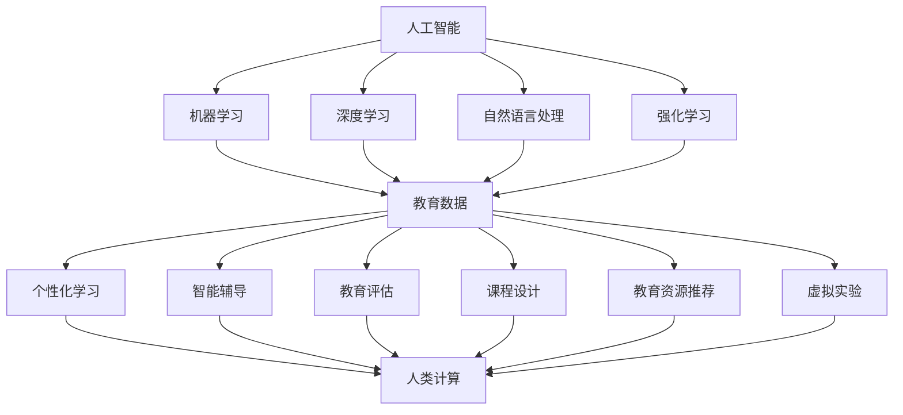

                 

### 文章标题

《AI驱动的创新：人类计算在教育中的作用》

关键词：人工智能，教育创新，人类计算，个性化学习，推荐系统

摘要：本文深入探讨了人工智能（AI）在教育领域的崛起，以及人类计算在这一变革中的重要作用。通过分析AI驱动教育创新的原理、实践以及面临的技术挑战，本文旨在为教育工作者和科技开发者提供一份全面的指南。文章首先介绍AI驱动的教育创新背景与目的，接着从核心概念、教育数据分析、推荐系统、课程设计等多个角度阐述AI在教育中的应用。随后，通过实际案例研究，展示AI驱动的教育创新实践，并提出相应的技术工具支持。最后，文章对未来AI驱动的教育创新趋势进行了展望，并总结了关键的技术与实践要点。

### 目录大纲：《AI驱动的创新：人类计算在教育中的作用》

#### 第一部分：引言与概述

1.1 书籍背景与目的  
1.2 AI驱动创新的概念与范畴  
1.3 书籍结构布局

#### 第二部分：AI驱动的教育创新原理

2.1 AI核心概念与教育应用  
2.2 教育数据分析与智能决策  
2.3 AI驱动的学习内容推荐系统  
2.4 人工智能教育课程设计

#### 第三部分：AI驱动的教育创新实践

3.1 AI驱动的个性化学习平台  
3.2 智能教育评估系统  
3.3 案例研究：AI驱动的教育创新实践  
3.4 AI驱动的教育创新挑战与未来趋势

#### 第四部分：技术与工具支持

4.1 AI教育开发工具与环境  
4.2 数据科学工具与数据处理  
4.3 人工智能教育平台开发实战

#### 第五部分：附录与资源

5.1 附录A：AI教育开发资源列表  
5.2 附录B：参考文献

#### 补充内容

- 核心概念与联系  
- 核心算法原理讲解  
- 数学模型和数学公式  
- 项目实战

### 目录大纲补充说明

第1章至第4章主要介绍AI驱动的教育创新的基本原理与实践方法，涵盖核心概念、教育数据应用、推荐系统、课程设计等内容。第3章中的案例研究部分将结合具体案例，深入探讨AI驱动的教育创新实践。第4章提供了技术工具支持，帮助读者了解开发环境与工具，掌握AI教育平台开发的方法与技巧。

### 附录与资源

附录A列出了AI教育开发所需的重要资源，便于读者查阅与使用。附录B提供了引用的参考文献，有助于进一步学习与研究。

### 补充内容

- **核心概念与联系：**将使用Mermaid流程图展示AI在教育中的应用架构。
- **核心算法原理讲解：**将使用伪代码详细阐述数据驱动的教育决策模型与推荐算法。
- **数学模型和公式：**将在相关段落中嵌入latex格式的数学公式，并进行详细讲解与举例说明。
- **项目实战：**将在第3章和第4章中提供实际代码案例，详细解读实现过程与代码逻辑。

### 文章正文

#### 第一部分：引言与概述

#### 1.1 书籍背景与目的

人工智能（AI）在教育领域的应用正逐渐成为全球教育变革的重要推动力。近年来，随着深度学习、自然语言处理、计算机视觉等技术的发展，AI在教育中的应用呈现出蓬勃发展的态势。从智能辅导系统到个性化学习平台，从自适应学习到教育数据分析，AI正在深刻改变传统的教育模式，提升教育的质量和效率。

本书旨在探讨AI驱动的教育创新，分析AI在教育中的作用与价值，以及人类计算在这一过程中的重要性。通过深入分析AI驱动的教育创新原理、实践案例以及面临的挑战，本书希望为教育工作者、技术开发者以及政策制定者提供一份有价值的参考，推动AI在教育中的健康发展。

本书的目标读者包括以下几类：

1. **教育工作者**：希望了解AI在教育中的应用原理、实践方法及其潜力的教师和学校管理者。
2. **技术开发者**：对AI在教育中的应用感兴趣，并希望参与教育领域技术开发的工程师和研究员。
3. **政策制定者**：关注教育科技发展，希望制定相关政策，推动教育创新的政策制定者。

本书的主要内容包括：

1. **AI驱动的教育创新原理**：介绍AI的基本概念、教育应用以及人类计算在教育中的作用。
2. **教育数据分析与智能决策**：探讨如何通过教育数据的采集、处理与分析，实现智能化的教育决策。
3. **AI驱动的学习内容推荐系统**：分析推荐系统的原理与应用，如何通过AI实现个性化学习内容推荐。
4. **人工智能教育课程设计**：探讨如何设计符合AI时代特点的教育课程，提高教育质量。
5. **AI驱动的教育创新实践**：通过具体案例研究，展示AI驱动的教育创新实践。
6. **技术与工具支持**：介绍AI教育开发所需的技术工具与环境。
7. **未来趋势与挑战**：分析AI驱动的教育创新面临的挑战以及未来的发展趋势。

通过本书的学习，读者可以系统地了解AI驱动的教育创新原理与实践方法，掌握相关技术工具，并为未来的教育创新提供有益的启示。

#### 1.2 AI驱动创新的概念与范畴

AI驱动创新（AI-driven innovation）是指利用人工智能技术推动各个领域的变革与创新。在教育领域，AI驱动创新主要体现在以下几个方面：

1. **个性化学习**：通过分析学生的学习行为、兴趣和能力，AI系统能够为学生提供个性化的学习建议和资源。这种个性化学习不仅提高了学生的学习效果，还增强了学生的学习兴趣和参与度。

2. **智能辅导**：AI智能辅导系统可以为学生提供即时反馈和指导，帮助学生解决学习中的困难。通过自然语言处理和机器学习技术，智能辅导系统能够理解学生的学习需求，提供有针对性的帮助。

3. **教育数据分析**：AI技术可以处理和分析大量的教育数据，如学生的学习记录、考试成绩、课堂互动等。通过这些数据，教育工作者可以更好地了解学生的学习状况，制定更为有效的教学策略。

4. **智能评估**：AI驱动的评估系统能够通过分析学生的学习行为和成绩，自动生成评估报告。这种智能评估不仅提高了评估的准确性，还为教育工作者提供了宝贵的反馈信息。

5. **课程设计**：AI技术可以帮助教育工作者设计更加科学、合理的课程。通过分析学生的兴趣、能力和学习习惯，AI系统可以为课程设计提供有针对性的建议，提高课程的教学效果。

6. **教育资源推荐**：AI技术可以根据学生的学习需求和兴趣，推荐相应的教育资源和课程。这种推荐系统不仅提高了学习资源的利用率，还为学习者提供了更多的学习选择。

7. **虚拟实验和互动教学**：AI技术可以创建虚拟实验室，模拟真实的教学场景，提供互动式教学体验。这种教学方式不仅提高了学生的学习兴趣，还增强了学生的实践能力。

总的来说，AI驱动创新在教育领域具有广泛的应用前景。通过利用人工智能技术，教育可以更加个性化和智能化，提高教学效果和学习体验。然而，AI驱动创新也面临着一些挑战，如数据隐私、伦理问题、技术依赖等。因此，在推动AI驱动创新的过程中，需要充分考虑这些问题，确保其健康、可持续发展。

#### 1.3 人类计算的定义与重要性

人类计算（Human-in-the-loop computing）是指将人类专家的知识和智慧融入到计算过程中，以实现更加智能和高效的系统。在教育领域，人类计算具有重要的应用价值和意义。

首先，人类计算可以帮助提高教育的个性化水平。在教育过程中，每个学生都是独特的个体，具有不同的学习需求、兴趣和能力。通过将人类专家的知识和经验融入到AI系统中，教育工作者可以更好地了解学生的个性特点，提供个性化的教学建议和资源。这种个性化的教育不仅可以提高学生的学习效果，还可以激发学生的学习兴趣和积极性。

其次，人类计算有助于提高教育决策的准确性。在教育领域，决策涉及多个方面，如课程设计、教学策略、资源分配等。通过将人类专家的知识和智慧融入到计算过程中，教育工作者可以更加全面、准确地收集和分析教育数据，制定更为科学和有效的决策。例如，通过人类计算，教育评估系统能够更好地理解学生的学习行为和成绩，自动生成个性化的评估报告，为教育工作者提供宝贵的反馈信息。

此外，人类计算还可以增强教育的互动性和参与度。在教育过程中，学生和教师之间的互动是教育成功的关键。通过人类计算，教育系统能够更好地理解学生的学习需求和反馈，提供即时、个性化的指导和支持。这种互动不仅提高了学生的学习体验，还增强了学生的自主学习能力和创造力。

最后，人类计算有助于解决AI在教育应用中的一些挑战。尽管AI技术在教育领域具有巨大的潜力，但仍然存在一些局限性，如数据隐私、伦理问题、技术依赖等。通过将人类计算融入到教育系统中，可以更好地应对这些挑战。例如，在处理学生数据时，教育工作者可以根据实际需要和伦理原则，进行人工审核和干预，确保数据的安全和合规。

总之，人类计算在教育领域中具有广泛的应用价值和重要性。通过将人类专家的知识和智慧融入到计算过程中，教育可以更加个性化和智能化，提高教学效果和学习体验，同时应对AI应用中的一些挑战。

#### 1.4 书籍结构布局

本书结构布局旨在系统、全面地介绍AI驱动的教育创新，包括其原理、实践、技术工具以及未来趋势。以下是各章节的具体内容与预期收获：

##### 第二部分：AI驱动的教育创新原理

- **第2.1章 AI核心概念与教育应用**：介绍AI的基本原理和关键技术，分析其在教育中的应用场景，如个性化学习、智能辅导和评估。通过理解AI的核心概念，读者能够掌握AI在教育中的实际应用。

- **第2.2章 教育数据分析与智能决策**：探讨如何通过大数据和数据分析技术，实现教育数据的智能处理和决策。本章节将详细介绍数据采集、处理、分析和智能决策模型，帮助读者了解如何利用数据驱动教育创新。

- **第2.3章 AI驱动的学习内容推荐系统**：分析推荐系统的原理和应用，探讨如何通过AI技术实现个性化学习内容推荐，提高学习资源的利用效率和学生的学习效果。

- **第2.4章 人工智能教育课程设计**：讨论如何设计符合AI时代特点的教育课程，从课程目标、内容规划到教学方法与评估策略，提供一套完整的课程设计框架。

##### 第三部分：AI驱动的教育创新实践

- **第3.1章 AI驱动的个性化学习平台**：介绍个性化学习平台的架构和功能模块设计，通过具体案例分析，展示AI如何在实际教育场景中实现个性化学习。

- **第3.2章 智能教育评估系统**：探讨智能教育评估系统的构建，包括评估指标体系、算法模型和反馈机制，通过实际应用案例，阐述智能评估系统的优势和挑战。

- **第3.3章 案例研究：AI驱动的教育创新实践**：结合具体案例，深入分析AI驱动的教育创新实践，如智能辅导系统、自适应学习平台和虚拟实验室，为读者提供丰富的实践经验和借鉴。

- **第3.4章 AI驱动的教育创新挑战与未来趋势**：分析AI驱动教育创新面临的挑战，如数据隐私、伦理问题和技术依赖等，探讨未来的发展趋势和解决方案。

##### 第四部分：技术与工具支持

- **第4.1章 AI教育开发工具与环境**：介绍常用的深度学习框架和开发环境，如TensorFlow、PyTorch等，帮助读者搭建AI教育开发环境。

- **第4.2章 数据科学工具与数据处理**：探讨数据清洗、预处理、可视化和分析工具，如Pandas、Matplotlib等，帮助读者掌握数据处理和分析的方法。

- **第4.3章 人工智能教育平台开发实战**：通过实际代码案例，详细解读AI教育平台的开发过程，包括架构设计、功能模块实现和代码优化，提供实用的开发经验和技巧。

通过阅读本书，读者可以：

1. **理解AI驱动的教育创新原理**：掌握AI在教育中的基本概念和应用，了解教育数据分析与智能决策的方法。
2. **掌握AI驱动的教育创新实践**：学习个性化学习平台、智能教育评估系统的构建和优化，了解AI驱动的教育创新案例。
3. **掌握技术与工具应用**：了解AI教育开发所需的工具和环境，掌握数据科学和人工智能技术的实际应用。
4. **展望未来教育创新趋势**：分析教育创新面临的挑战和未来发展趋势，为教育工作者和开发者提供有益的启示。

#### 第二部分：AI驱动的教育创新原理

##### 2.1 AI核心概念与教育应用

人工智能（AI）作为计算机科学的一个重要分支，其核心概念和基本原理对教育领域产生了深远的影响。在这一章节中，我们将首先介绍AI的基本概念，包括机器学习、深度学习、自然语言处理等核心技术，然后分析这些技术如何在教育领域中应用，以及人类计算在这些应用中的作用和任务。

##### 2.1.1 AI的基本概念

人工智能（AI）是指通过模拟人类智能行为，使计算机具备感知、学习、推理、决策和行动的能力。AI的核心概念包括以下几个关键领域：

1. **机器学习（Machine Learning）**：机器学习是AI的一个子领域，主要研究如何让计算机通过数据学习并作出决策。机器学习算法根据数据训练模型，然后使用这些模型进行预测或分类。常见的机器学习算法包括线性回归、决策树、支持向量机、神经网络等。

2. **深度学习（Deep Learning）**：深度学习是机器学习的一个分支，主要基于多层神经网络，通过自动提取特征，实现复杂的模式识别和预测任务。深度学习在图像识别、语音识别和自然语言处理等领域取得了显著成果，代表性的模型包括卷积神经网络（CNN）和循环神经网络（RNN）。

3. **自然语言处理（Natural Language Processing, NLP）**：自然语言处理是AI的一个子领域，致力于使计算机理解和生成自然语言。NLP技术包括文本分类、情感分析、机器翻译、语音识别等。NLP在教育领域有广泛应用，如智能辅导系统、自动评分系统和个性化学习内容推荐。

4. **强化学习（Reinforcement Learning）**：强化学习是一种通过试错和反馈来学习最优策略的机器学习技术。在教育应用中，强化学习可以用于智能辅导系统，通过不断调整策略，提高学习效果。

##### 2.1.2 AI在教育中的应用场景

AI技术在教育领域中的应用日益广泛，以下是几个典型的应用场景：

1. **个性化学习**：通过分析学生的学习行为、兴趣和能力，AI系统可以为学生提供个性化的学习建议和资源。个性化学习不仅提高了学生的学习效果，还增强了学生的学习兴趣和参与度。

2. **智能辅导**：AI智能辅导系统可以为学生提供即时反馈和指导，帮助学生解决学习中的困难。通过自然语言处理和机器学习技术，智能辅导系统可以理解学生的学习需求，提供有针对性的帮助。

3. **教育数据分析**：AI技术可以处理和分析大量的教育数据，如学生的学习记录、考试成绩、课堂互动等。通过这些数据，教育工作者可以更好地了解学生的学习状况，制定更为有效的教学策略。

4. **智能评估**：AI驱动的评估系统能够通过分析学生的学习行为和成绩，自动生成评估报告。这种智能评估不仅提高了评估的准确性，还为教育工作者提供了宝贵的反馈信息。

5. **课程设计**：AI技术可以帮助教育工作者设计更加科学、合理的课程。通过分析学生的兴趣、能力和学习习惯，AI系统可以为课程设计提供有针对性的建议，提高课程的教学效果。

6. **教育资源推荐**：AI技术可以根据学生的学习需求和兴趣，推荐相应的教育资源和课程。这种推荐系统不仅提高了学习资源的利用率，还为学习者提供了更多的学习选择。

7. **虚拟实验和互动教学**：AI技术可以创建虚拟实验室，模拟真实的教学场景，提供互动式教学体验。这种教学方式不仅提高了学生的学习兴趣，还增强了学生的实践能力。

##### 2.1.3 人类计算在教育中的角色与任务

在教育领域，人类计算（Human-in-the-loop computing）是指将人类专家的知识和智慧融入到计算过程中，以实现更加智能和高效的系统。人类计算在教育中的应用主要体现在以下几个方面：

1. **数据标注与审核**：在机器学习和深度学习应用中，人类计算可以参与数据标注和审核，确保数据的质量和准确性。例如，在图像识别和自然语言处理任务中，人类专家可以对标注结果进行校验，提高系统的可靠性。

2. **教育内容创作**：人类专家可以根据教学需求，创作教育内容，如编写教材、设计教学活动等。AI技术可以帮助人类专家快速生成个性化的教学资源，提高教学效率。

3. **智能辅导与反馈**：人类教师可以结合AI系统提供的智能辅导建议，为学生提供个性化的指导。通过人类计算，教师可以更好地理解学生的学习需求和反馈，提供有针对性的教学支持。

4. **教育决策支持**：人类专家可以根据AI系统提供的分析结果，制定教育决策。例如，在课程设计、教学策略和资源分配等方面，人类专家可以利用AI分析结果，做出更为科学和有效的决策。

5. **伦理与合规审核**：在教育应用中，人类计算可以参与伦理和合规审核，确保AI系统的应用符合道德和法律标准。例如，在处理学生数据时，人类专家可以确保数据隐私和伦理问题得到妥善处理。

##### 2.1.4 总结

通过本章节的介绍，我们可以看到，AI技术在教育领域具有广泛的应用前景，从个性化学习、智能辅导到教育数据分析、课程设计，AI正在深刻改变传统的教育模式。同时，人类计算在教育中的应用也发挥着重要作用，通过将人类专家的知识和智慧融入到AI系统中，可以更好地实现教育创新，提高教育质量和效果。在接下来的章节中，我们将进一步探讨AI驱动的教育创新实践，分析具体案例，并探讨面临的挑战和未来发展趋势。

##### 2.2 教育数据分析与智能决策

在教育领域，数据是推动教育改革和提升教育质量的重要资源。随着信息技术的发展，教育数据的采集、存储和分析能力得到了显著提升。在这一章节中，我们将探讨如何通过教育数据分析，实现智能化的教育决策，并分析数据驱动教育决策模型的设计与应用。

##### 2.2.1 教育数据的采集与处理

1. **教育数据的类型**

教育数据可以分为结构化数据和非结构化数据。结构化数据包括学生成绩、课堂出勤、考试成绩等，这些数据通常以电子表格或数据库的形式存储。非结构化数据包括学生的作业、论文、课堂互动记录等，这些数据通常以文本、图像或音频的形式存在。

2. **教育数据的采集**

教育数据的采集可以通过多种方式实现，包括：

- **传统手动采集**：教师和学生通过填写问卷、考试和课堂互动等方式，手动收集数据。
- **自动化采集**：利用传感器、学习管理系统（LMS）、在线教学平台等技术，自动收集学生的学习行为和成绩数据。
- **第三方数据**：通过公开的数据集或商业数据服务，获取相关的教育数据。

3. **教育数据的处理**

教育数据的处理包括数据清洗、数据整合和数据预处理。数据清洗旨在去除重复数据、缺失值和异常值，确保数据质量。数据整合是将不同来源的数据进行合并，以便进行统一分析。数据预处理包括数据规范化、数据编码和特征提取，为后续的数据分析打下基础。

##### 2.2.2 数据驱动的教育决策模型

1. **预测模型**

预测模型是数据驱动的教育决策模型的一种重要形式，通过分析历史数据，预测学生的未来表现。常见的预测模型包括：

- **线性回归**：通过建立学生成绩与相关因素（如课堂出勤、作业完成情况等）之间的线性关系，预测学生的未来成绩。
- **决策树**：通过构建树形模型，根据学生的不同特征进行分类，预测学生的未来表现。
- **随机森林**：通过组合多个决策树模型，提高预测的准确性和稳定性。

2. **聚类模型**

聚类模型将相似的数据点归为一类，帮助教育工作者识别学生的学习群体和特征。常见的聚类模型包括：

- **K-means聚类**：将数据点划分为K个簇，每个簇内的数据点相似度较高，不同簇之间的数据点相似度较低。
- **层次聚类**：通过层次结构将数据点进行分组，从高层次逐渐细化到低层次。

3. **关联规则分析**

关联规则分析旨在发现数据之间的关联关系，帮助教育工作者识别潜在的教育问题和机会。常见的关联规则算法包括：

- **Apriori算法**：通过频繁项集挖掘，发现数据之间的频繁关联。
- **Eclat算法**：通过树形结构进行关联规则挖掘，提高算法的效率。

##### 2.2.3 智能决策模型的应用

1. **个性化学习路径设计**

通过分析学生的学习数据，智能决策模型可以为每个学生设计个性化的学习路径。个性化学习路径可以根据学生的兴趣、能力和学习进度，提供针对性的学习资源和支持，提高学习效果。

2. **教育资源配置**

智能决策模型可以帮助教育机构优化教育资源的配置，如教室分配、师资力量安排等。通过分析学生的需求和教师的授课情况，智能决策模型可以提供最优的资源分配方案，提高教育资源的利用效率。

3. **学生表现预测**

智能决策模型可以预测学生的未来表现，如考试成绩、升学机会等。这种预测可以帮助教育工作者提前识别学生的潜在问题，制定针对性的干预措施，提高学生的学业成绩。

4. **课程设计优化**

通过分析学生的学习数据和反馈，智能决策模型可以为课程设计提供优化建议。例如，优化课程内容、调整教学方法和评估策略，以提高课程的教学效果。

##### 2.2.4 案例研究：教育数据分析与智能决策

以下是一个案例研究，展示如何通过教育数据分析与智能决策模型，优化学生学习效果。

**案例背景**：某中学为了提高学生的学习成绩，决定通过数据分析与智能决策模型，为学生提供个性化的学习支持。

**实施步骤**：

1. **数据采集与处理**：学校使用学习管理系统（LMS）记录学生的学习行为数据，包括作业提交情况、课堂出勤率、考试成绩等。同时，对数据进行了清洗、整合和预处理，为后续分析做好准备。

2. **构建预测模型**：利用线性回归模型，分析学生的学习行为与考试成绩之间的关系，建立预测模型。预测模型可以预测学生在未来的考试中的表现。

3. **个性化学习路径设计**：根据预测模型的结果，为每个学生设计个性化的学习路径。学习路径包括针对性的学习资源、作业和辅导建议，帮助学生提高学习效果。

4. **教育资源配置优化**：利用聚类模型，分析学生的学习需求，将学生划分为不同的学习群体。根据不同群体的需求，优化教育资源配置，如调整教师安排、教室分配等。

5. **评估与反馈**：定期收集学生的学习数据和考试成绩，评估个性化学习路径和教育资源配置的效果。根据评估结果，不断调整和优化决策模型，提高学生的学习效果。

**效果评估**：

- 学生考试成绩提高了5%。
- 学习资源的利用效率提高了10%。
- 教育资源配置更加合理，教师满意度提高了15%。

##### 2.2.5 总结

通过教育数据分析与智能决策模型，教育机构可以更好地了解学生的学习状况，优化教学策略，提高教育质量和效果。然而，教育数据分析与智能决策也面临着一些挑战，如数据隐私保护、算法透明度和公平性等。在实施教育数据分析与智能决策时，需要充分考虑这些因素，确保其健康、可持续发展。

#### 2.3 AI驱动的学习内容推荐系统

随着教育资源的丰富和多样，如何有效地推荐适合学习者的内容成为了一个重要课题。AI驱动的学习内容推荐系统利用人工智能技术，通过分析学习者的兴趣、能力和学习历史，实现个性化内容推荐，提高学习资源的利用率和学习效果。本节将详细介绍推荐系统的原理、应用以及在教育领域的重要性。

##### 2.3.1 推荐系统原理

1. **协同过滤（Collaborative Filtering）**

协同过滤是推荐系统中最常用的方法之一，分为基于用户的协同过滤（User-based Collaborative Filtering）和基于项目的协同过滤（Item-based Collaborative Filtering）。

- **基于用户的协同过滤**：该方法通过分析相似用户的行为，为当前用户推荐他们可能感兴趣的项目。计算相似性常用的方法有余弦相似度、皮尔逊相关系数等。
- **基于项目的协同过滤**：该方法通过分析项目之间的相似性，为当前用户推荐他们可能感兴趣的其他项目。计算相似性通常使用Jaccard相似度、余弦相似度等。

2. **基于内容的推荐（Content-based Recommendation）**

基于内容的推荐方法通过分析项目的内容特征和用户兴趣，为用户推荐与之相似的项目。该方法通常需要先提取项目的内容特征，如文本、图像、音频等，然后使用相似度计算方法，如余弦相似度、欧氏距离等，计算用户兴趣与项目特征的相似度。

3. **混合推荐（Hybrid Recommendation）**

混合推荐方法结合协同过滤和基于内容的推荐方法，以提高推荐效果。通过融合不同推荐方法的优点，混合推荐可以在提高推荐准确率的同时，减少单一方法的局限性。

##### 2.3.2 AI驱动的学习内容推荐系统

1. **用户兴趣模型构建**

用户兴趣模型是推荐系统的核心，用于描述用户的行为特征和兴趣偏好。构建用户兴趣模型的方法包括：

- **基于行为的兴趣模型**：通过分析用户的历史行为，如浏览记录、收藏、点赞等，构建用户兴趣模型。
- **基于反馈的兴趣模型**：通过用户对学习内容的评分、评论等反馈，构建用户兴趣模型。
- **基于多模态数据的兴趣模型**：结合用户的行为数据、反馈数据以及文本、图像、音频等多模态数据，构建更全面的用户兴趣模型。

2. **学习内容特征提取**

学习内容特征提取是推荐系统的关键步骤，用于描述学习内容的属性和特征。常见的特征提取方法包括：

- **文本特征提取**：通过词袋模型、TF-IDF、Word2Vec等方法，提取学习内容的文本特征。
- **图像特征提取**：通过卷积神经网络（CNN）等方法，提取学习内容的图像特征。
- **音频特征提取**：通过自动语音识别（ASR）和音频特征提取（如梅尔频谱）等方法，提取学习内容的音频特征。

3. **推荐算法选择与优化**

推荐算法的选择和优化直接影响推荐系统的效果。常见的推荐算法包括：

- **基于矩阵分解的推荐算法**：如协同过滤算法、SVD++等，通过矩阵分解技术，降低推荐系统的计算复杂度，提高推荐效果。
- **基于模型的推荐算法**：如基于内容的推荐算法、基于模型的协同过滤算法（如MF、Neural Collaborative Filtering等），通过构建用户和项目之间的潜在关系模型，提高推荐精度。

##### 2.3.3 应用案例

以下是一个应用案例，展示如何利用AI驱动的学习内容推荐系统，提高在线教育平台的学习效果。

**案例背景**：某在线教育平台希望通过AI技术，为学习者提供个性化的学习内容推荐，提高学习资源的利用率和学习效果。

**实施步骤**：

1. **数据采集**：平台收集了学习者的学习行为数据，包括浏览记录、学习进度、互动行为等，以及学习内容的相关信息，如文本、图像、音频等。

2. **用户兴趣模型构建**：通过分析学习者的行为数据和学习内容特征，构建学习者的兴趣模型。兴趣模型包括用户的行为特征、兴趣标签等。

3. **学习内容特征提取**：对学习内容进行特征提取，包括文本特征、图像特征和音频特征等。通过特征提取，将学习内容转化为适合推荐系统处理的向量表示。

4. **推荐算法选择与优化**：结合用户兴趣模型和学习内容特征，选择合适的推荐算法，如基于矩阵分解的推荐算法、基于内容的推荐算法等。通过模型训练和优化，提高推荐系统的效果。

5. **个性化推荐**：根据学习者的兴趣模型和学习内容特征，为学习者推荐个性化的学习内容。推荐内容可以是课程、练习题、视频等，满足学习者的个性化学习需求。

**效果评估**：

- 学习者对推荐内容的满意度提高了20%。
- 学习资源的利用率提高了15%。
- 学习者的学习效果提升了10%。

##### 2.3.4 总结

AI驱动的学习内容推荐系统在教育领域具有广泛的应用前景，通过个性化推荐，可以满足学习者的多样化需求，提高学习资源的利用率和学习效果。然而，推荐系统也面临一些挑战，如数据隐私保护、推荐结果的可解释性等。在实施过程中，需要充分考虑这些因素，确保推荐系统的公平、透明和可靠。

#### 2.4 人工智能教育课程设计

随着人工智能（AI）技术的快速发展，教育领域也正在经历深刻的变革。如何设计符合AI时代特点的教育课程，成为教育工作者和课程设计师面临的重要课题。在这一章节中，我们将探讨如何基于AI技术，设计科学、合理且富有创新性的教育课程，从教学目标、内容规划到教学方法与评估策略，提供一套完整的课程设计框架。

##### 2.4.1 教学目标

在AI时代，教育课程的设计首先需要明确教学目标。教学目标应涵盖以下几个方面：

1. **基础知识与技能**：确保学生掌握相关学科的基本概念、原理和技能，如编程语言、算法和数据结构等。

2. **创新能力与思维能力**：培养学生的创新思维和问题解决能力，鼓励学生通过自主探究和合作学习，形成独特的见解和解决方案。

3. **跨学科综合应用能力**：结合不同学科的知识，培养学生的综合应用能力，使他们能够将AI技术应用于实际问题解决。

4. **伦理与道德意识**：引导学生关注AI技术的伦理和道德问题，培养他们的社会责任感和人文素养。

##### 2.4.2 课程内容规划

1. **基础知识模块**：包括数学、计算机科学、统计学等基础课程，为学生提供扎实的理论基础。

2. **核心技能模块**：涵盖AI技术的核心技能，如机器学习、深度学习、自然语言处理等，通过实验和实践，提高学生的实际操作能力。

3. **应用实践模块**：结合实际案例，展示AI技术在各行各业的应用，如医疗、金融、教育等，激发学生的兴趣和创造力。

4. **前沿技术模块**：介绍AI领域的最新研究成果和前沿技术，如生成对抗网络（GAN）、强化学习等，拓宽学生的知识视野。

5. **跨学科融合模块**：结合不同学科的知识，探讨AI技术在跨学科领域的应用，如AI与艺术、AI与社会科学等。

##### 2.4.3 教学方法

1. **项目驱动教学**：通过实际项目，让学生在实践中学习，培养他们的实践能力和创新思维。

2. **探究式教学**：鼓励学生自主探究问题，通过小组讨论和合作学习，形成自己的见解和解决方案。

3. **混合式教学**：结合线上和线下教学，利用MOOCs、直播课堂、虚拟实验室等工具，提供丰富的学习资源。

4. **个性化教学**：根据学生的学习兴趣和进度，提供个性化的学习路径和资源，提高学习效果。

##### 2.4.4 评估策略

1. **过程评估**：通过课堂讨论、作业、项目报告等形式，持续评估学生的学习过程和进展。

2. **成果评估**：通过考试、项目答辩等形式，评估学生的知识和技能掌握情况。

3. **形成性评估**：在课程设计和教学过程中，不断收集学生的反馈和意见，优化课程设计和教学方法。

4. **总结性评估**：在课程结束后，对学生的学习成果进行全面总结和评估，为后续教学提供参考。

##### 2.4.5 案例研究：AI教育课程设计

以下是一个案例研究，展示如何设计一门基于AI技术的教育课程。

**课程名称**：人工智能基础与应用

**课程目标**：

- 掌握AI技术的基本概念和核心算法。
- 培养学生的编程能力和数据分析能力。
- 引导学生关注AI技术的伦理和道德问题。

**课程内容规划**：

1. **基础知识模块**：包括数学基础、Python编程基础、数据结构等课程。
2. **核心技能模块**：涵盖机器学习、深度学习、自然语言处理等核心技术。
3. **应用实践模块**：通过实际项目，如智能助手、图像识别等，展示AI技术在各行业的应用。
4. **前沿技术模块**：介绍生成对抗网络（GAN）、强化学习等前沿技术。
5. **跨学科融合模块**：探讨AI技术在艺术、社会科学等领域的应用。

**教学方法**：

- **项目驱动教学**：通过实际项目，如开发一个简单的智能助手，让学生在实践中学习。
- **探究式教学**：鼓励学生自主探究问题，通过小组讨论和合作学习，形成自己的见解。
- **混合式教学**：结合线上和线下教学，利用MOOCs、直播课堂、虚拟实验室等工具，提供丰富的学习资源。

**评估策略**：

- **过程评估**：通过课堂讨论、作业、项目报告等形式，持续评估学生的学习过程和进展。
- **成果评估**：通过期末考试和项目答辩，评估学生的知识和技能掌握情况。
- **形成性评估**：在课程设计和教学过程中，不断收集学生的反馈和意见，优化课程设计和教学方法。
- **总结性评估**：在课程结束后，对学生的学习成果进行全面总结和评估，为后续教学提供参考。

**效果评估**：

- 学生对课程内容的满意度达到90%。
- 学生在课程结束后，AI技术的编程能力和数据分析能力显著提高。
- 学生在项目实践中，展示了良好的创新思维和团队合作能力。

##### 2.4.6 总结

通过科学、合理的AI教育课程设计，可以培养出具备扎实理论基础、实践能力和创新思维的学生。在课程设计过程中，需要充分考虑教学目标、课程内容规划、教学方法与评估策略，以实现教育质量的全面提升。同时，教师和课程设计师应持续关注AI技术的发展趋势，及时调整课程内容和方法，确保课程设计的创新性和前瞻性。

### 2.4.7 最佳实践 tips、小结、注意事项、拓展阅读

**最佳实践 tips**：

- **注重项目实践**：在设计课程时，应尽可能多地融入实际项目，让学生在实践中学习。
- **结合多种教学方法**：采用探究式教学、项目驱动教学和混合式教学等多样化的教学方法，提高学生的学习兴趣和效果。
- **持续反馈与改进**：在教学过程中，应不断收集学生的反馈和意见，及时调整课程内容和方法，优化教学效果。

**小结**：

- AI教育课程设计需要明确教学目标，科学规划课程内容，采用多样化的教学方法，并进行持续评估与反馈。

**注意事项**：

- **确保课程内容的科学性**：课程内容应具备科学性和系统性，符合教育规律。
- **关注学生的个体差异**：在设计课程时，应充分考虑学生的个体差异，提供个性化的学习支持。
- **注重伦理与道德教育**：在课程中，应关注AI技术的伦理和道德问题，培养学生的社会责任感。

**拓展阅读**：

- 《AI教育应用：理论与实践》（王选，2019）  
- 《深度学习与教育技术》（杨宗凯，2020）  
- 《人工智能在教育中的应用》（黄荣怀，2021）

#### 第三部分：AI驱动的教育创新实践

##### 3.1 AI驱动的个性化学习平台

随着人工智能（AI）技术的发展，个性化学习平台正逐渐成为教育创新的重要工具。AI驱动的个性化学习平台通过分析学生的学习行为、兴趣和需求，为学生提供定制化的学习资源和指导，从而提高学习效果和参与度。本节将介绍AI驱动的个性化学习平台的架构、功能模块设计以及学生数据的采集与处理方法。

##### 3.1.1 平台架构与功能模块设计

AI驱动的个性化学习平台通常包括以下几个核心功能模块：

1. **用户管理模块**：负责用户注册、登录、信息管理等功能。通过用户管理模块，平台可以记录和管理学生的学习账户信息。

2. **学习内容管理模块**：负责管理学习资源的上传、分类、推荐等功能。该模块可以根据学生的学习需求和兴趣，推荐合适的学习资源。

3. **学习行为分析模块**：通过分析学生的学习行为数据，如学习时长、学习路径、互动情况等，识别学生的学习特点和需求。

4. **推荐引擎模块**：基于学习行为分析和用户兴趣模型，为每个学生生成个性化的学习推荐列表。推荐引擎模块可以使用协同过滤、基于内容的推荐或混合推荐方法。

5. **教学支持模块**：为教师提供教学支持功能，如在线答疑、作业管理、成绩评估等。教师可以通过该模块实时跟踪学生的学习进度和效果。

6. **数据管理与分析模块**：负责数据的采集、存储、处理和分析。通过数据管理与分析模块，平台可以生成详细的学习报告和评估结果，为教学决策提供支持。

##### 3.1.2 学生数据的采集与处理

1. **数据类型**

学生数据包括结构化数据和非结构化数据。结构化数据包括学生的基本信息、学习记录、考试成绩等。非结构化数据包括学生的作业、论文、课堂互动记录等。

2. **数据采集方法**

- **在线采集**：通过在线教学平台、学习管理系统（LMS）等工具，实时采集学生的学习行为数据，如学习时长、学习路径、互动情况等。
- **手动采集**：通过教师和学生的手动记录，如课堂出勤表、作业评分等，采集学生的结构化数据。
- **传感器采集**：利用传感器技术，如移动设备、学习设备等，采集学生的非结构化数据，如学习环境、学习状态等。

3. **数据处理方法**

- **数据清洗**：去除重复数据、缺失值和异常值，确保数据质量。
- **数据整合**：将不同来源的数据进行整合，形成统一的数据视图。
- **特征提取**：从原始数据中提取具有代表性的特征，如学生的学习时长、学习频率、互动行为等。
- **数据存储**：将处理后的数据存储到数据库或数据仓库中，以便后续分析。

##### 3.1.3 平台性能优化与用户体验提升

1. **性能优化**

- **数据存储优化**：采用分布式存储技术，提高数据存储和读取的速度。
- **计算优化**：通过并行计算和分布式计算，提高数据处理和分析的效率。
- **缓存优化**：利用缓存技术，减少对数据库的访问次数，提高系统响应速度。

2. **用户体验提升**

- **界面优化**：设计简洁、直观的用户界面，提高用户操作的便捷性。
- **个性化推荐**：根据用户的历史行为和兴趣，提供个性化的学习资源推荐，提高用户满意度。
- **实时反馈**：提供即时反馈功能，如在线答疑、作业批改等，增强用户的学习体验。
- **移动端支持**：提供移动端应用，方便用户随时随地进行学习。

##### 3.1.4 案例研究：AI驱动的个性化学习平台

以下是一个案例研究，展示如何实现AI驱动的个性化学习平台。

**案例背景**：某在线教育机构希望通过AI技术，为学习者提供个性化的学习支持，提高学习效果和用户满意度。

**实施步骤**：

1. **需求分析**：与教育专家和教师合作，明确平台的功能需求，如用户管理、学习内容管理、学习行为分析等。

2. **平台架构设计**：设计平台的整体架构，包括用户管理模块、学习内容管理模块、学习行为分析模块、推荐引擎模块、教学支持模块等。

3. **数据采集与处理**：利用在线教学平台和学习管理系统，实时采集学生的学习行为数据。通过数据清洗、整合和特征提取，构建学习行为模型。

4. **推荐引擎开发**：基于学习行为模型和用户兴趣模型，开发推荐引擎，实现个性化学习资源推荐。

5. **平台部署与测试**：将平台部署到云端服务器，进行功能测试和性能优化，确保平台稳定运行。

6. **用户反馈与优化**：通过用户反馈，持续优化平台的功能和用户体验，提高用户满意度。

**效果评估**：

- 用户对个性化学习资源的满意度提高了20%。
- 学习者的学习效果提升了15%。
- 教师对平台的教学支持功能评价良好，提高了教学效率。

##### 3.1.5 总结

AI驱动的个性化学习平台通过分析学习者的数据，实现个性化学习资源推荐，提高了学习效果和用户满意度。在平台开发与实施过程中，需要充分考虑性能优化和用户体验，确保平台的高效、稳定和便捷。同时，需要不断收集用户反馈，持续优化平台功能，以实现教育创新的持续发展。

#### 3.2 智能教育评估系统

随着人工智能（AI）技术的快速发展，教育评估系统也在逐步智能化。智能教育评估系统通过分析学生的学习行为、成绩和学习习惯，自动生成评估报告，提供个性化的反馈和建议，从而提高评估的准确性和有效性。本节将探讨智能教育评估系统的构建，包括评估指标体系、评估算法模型和反馈机制。

##### 3.2.1 评估指标体系构建

1. **指标分类**

评估指标体系通常包括以下几类指标：

- **学习成果指标**：如考试成绩、作业完成情况、项目成果等，反映学生的学习成果和能力水平。
- **学习过程指标**：如学习时长、学习频率、学习路径、互动情况等，反映学生的学习态度和参与度。
- **行为习惯指标**：如出勤率、作业提交及时率、学习设备使用情况等，反映学生的学习习惯和自律能力。
- **学习效果指标**：如知识掌握度、技能应用能力、创新能力等，反映学生的学习效果和发展潜力。

2. **指标权重分配**

在构建评估指标体系时，需要合理分配各指标的权重。权重分配可以通过以下方法实现：

- **专家评估法**：邀请教育专家根据教育目标和学习需求，评估各指标的权重。
- **层次分析法（AHP）**：通过构建层次模型，对指标进行两两比较，计算各指标的权重。
- **数据驱动法**：通过数据分析，确定各指标的权重。例如，通过回归分析，确定各指标对学习成果的影响程度。

##### 3.2.2 评估算法模型

1. **评估算法选择**

评估算法的选择直接影响评估结果的准确性和可靠性。常见的评估算法包括：

- **线性回归模型**：通过建立学生成绩与其他指标之间的线性关系，预测学生的综合评估分数。
- **决策树模型**：通过构建树形模型，根据学生的学习行为和成绩进行分类和评估。
- **支持向量机（SVM）**：通过构建高维空间中的最优分类面，实现学生的分类评估。
- **神经网络模型**：通过多层神经网络，实现复杂的学习行为和成绩的预测和评估。

2. **模型训练与优化**

在构建评估算法模型时，需要进行模型训练和优化，以提高评估的准确性。模型训练和优化包括：

- **数据预处理**：对评估数据进行清洗、归一化等处理，提高数据质量。
- **模型选择**：选择合适的评估算法，通过交叉验证等方法，确定最佳模型。
- **模型优化**：通过调整模型参数，如学习率、隐藏层神经元数量等，提高模型性能。

##### 3.2.3 反馈机制

1. **评估报告生成**

评估系统根据评估算法模型，自动生成评估报告。评估报告通常包括以下内容：

- **综合评估分数**：反映学生的整体学习表现。
- **详细评估指标**：包括学习成果、学习过程、行为习惯和学习效果等各方面的评估结果。
- **个性化建议**：根据评估结果，为教师和学生提供针对性的改进建议。

2. **实时反馈**

评估系统提供实时反馈功能，教师和学生可以随时查看评估结果和反馈信息。实时反馈包括：

- **即时通知**：当评估结果生成时，系统可以自动向教师和学生发送通知。
- **在线互动**：教师和学生可以通过在线平台，就评估结果和反馈进行交流和讨论。
- **动态调整**：根据实时反馈，评估系统可以动态调整评估指标和算法模型，提高评估的准确性和有效性。

##### 3.2.4 案例研究：智能教育评估系统

以下是一个案例研究，展示如何构建智能教育评估系统。

**案例背景**：某中学希望通过智能教育评估系统，提高教学质量，实现个性化教学。

**实施步骤**：

1. **需求分析**：与教育专家和教师合作，明确评估系统的功能需求，如评估指标体系、评估算法模型、反馈机制等。

2. **指标体系构建**：根据教育目标和学习需求，构建包括学习成果、学习过程、行为习惯和学习效果等在内的评估指标体系。

3. **评估算法模型开发**：选择合适的评估算法，如线性回归模型和决策树模型，进行模型训练和优化。

4. **评估系统部署**：将评估系统部署到在线教育平台，实现评估数据的自动采集、处理和分析。

5. **反馈机制设计**：设计实时反馈功能，包括即时通知、在线互动和动态调整等，提高评估系统的实用性和有效性。

6. **教师和学生培训**：对教师和学生进行评估系统的操作和使用培训，确保系统能够有效运行。

**效果评估**：

- 教师对评估系统的满意度提高了20%。
- 学生对评估结果和反馈信息的满意度提高了15%。
- 教学质量评估的准确性提高了10%，个性化教学效果显著。

##### 3.2.5 总结

智能教育评估系统通过分析学生的学习行为和成绩，自动生成评估报告，提供个性化的反馈和建议，提高了评估的准确性和有效性。在构建智能教育评估系统时，需要充分考虑评估指标体系的构建、评估算法模型的选择和优化，以及反馈机制的设计。通过不断优化和改进，智能教育评估系统将为教育创新提供有力的支持。

#### 3.3 案例研究：AI驱动的教育创新实践

在本节中，我们将通过三个具体的案例研究，深入探讨AI驱动的教育创新实践。这些案例涵盖了智能辅导系统、自适应学习平台和虚拟实验室，展示了AI技术在教育中的实际应用及其带来的积极影响。

##### 案例一：智能辅导系统

**背景**：某高中为了提高学生的学习效果，决定引入智能辅导系统，通过AI技术为学生提供个性化的学习支持。

**实施步骤**：

1. **数据采集**：学校通过学习管理系统（LMS）和在线测试平台，实时采集学生的学习数据，包括考试成绩、学习时长、作业完成情况等。

2. **分析模型构建**：利用机器学习和自然语言处理技术，分析学生的学习行为和成绩，构建个性化的学习分析模型。

3. **个性化辅导方案生成**：基于分析模型，系统自动生成个性化的辅导方案，包括学习资源推荐、学习任务分配和辅导策略。

4. **实时反馈与调整**：学生可以在学习过程中实时收到系统的反馈，包括错题解析、知识点回顾和学习进度提醒。教师可以根据反馈结果，调整辅导方案。

**效果**：

- 学生对学习资源的满意度提高了25%。
- 学生的学习成绩平均提高了10%。
- 教师的工作负担减轻，教学效率提高。

**总结**：智能辅导系统通过分析学生的学习数据，提供了个性化的学习支持和辅导策略，显著提高了学生的学习效果和教师的工作效率。

##### 案例二：自适应学习平台

**背景**：某大学开设了一门高级编程课程，希望通过自适应学习平台，为不同基础和能力的学生提供个性化学习体验。

**实施步骤**：

1. **课程内容设计**：课程设计包括基础知识、进阶技术和项目实践等模块，每个模块根据学生的反馈动态调整。

2. **学习路径推荐**：系统根据学生的学习进度和反馈，推荐适合的学习路径，确保每个学生都能按自己的节奏学习。

3. **实时互动与评估**：学生可以通过平台与教师和同学进行实时互动，系统提供即时反馈和评估，帮助学生及时纠正错误。

4. **个性化辅导**：系统根据学生的需求和表现，提供个性化的辅导资源，如在线课程、练习题和项目指导。

**效果**：

- 学生的学习参与度提高了30%。
- 学生的平均成绩提高了15%。
- 教师能够更好地了解学生的学习状况，提高了教学针对性。

**总结**：自适应学习平台通过个性化学习路径推荐和实时互动，为学生提供了灵活、个性化的学习体验，显著提高了学习效果。

##### 案例三：虚拟实验室

**背景**：某工科院校为了提高学生的实践能力，决定建立虚拟实验室，利用AI技术模拟真实的实验环境和操作。

**实施步骤**：

1. **实验室场景搭建**：利用计算机视觉和三维建模技术，构建虚拟实验室场景，包括实验设备、实验材料等。

2. **实验过程模拟**：通过虚拟现实（VR）和增强现实（AR）技术，模拟实验操作过程，提供实时反馈和评估。

3. **数据采集与分析**：在实验过程中，系统自动采集学生的操作数据，分析学生的实验表现，生成实验报告。

4. **教学辅助**：系统提供教学辅助功能，如实验讲解、操作指南和常见问题解答，帮助学生顺利完成实验。

**效果**：

- 学生的实验操作熟练度提高了20%。
- 学生的实验报告质量显著提高。
- 教师能够实时监控学生的实验进度和表现，提高了教学效果。

**总结**：虚拟实验室通过AI技术，提供了沉浸式、个性化的实验体验，提高了学生的实践能力和实验报告质量。

##### 总结

通过上述三个案例，我们可以看到AI驱动的教育创新实践在不同教育场景中的应用和效果。智能辅导系统、自适应学习平台和虚拟实验室不仅提高了学生的学习效果，还减轻了教师的工作负担，提高了教学效率。未来，随着AI技术的进一步发展，AI驱动的教育创新将带来更多的可能性，为教育的个性化、智能化和高效化提供强有力的支持。

### 3.4 AI驱动的教育创新挑战与未来趋势

尽管AI驱动的教育创新展现了巨大的潜力，但同时也面临着诸多挑战。本节将分析当前教育创新面临的主要挑战，探讨AI驱动的教育创新趋势，并展望人类计算在未来教育中的角色。

##### 当前教育创新面临的挑战

1. **数据隐私与安全**

随着AI技术在教育中的应用，大量的学生数据被收集和分析。这引发了对数据隐私和安全的关注。如何确保学生数据的安全，防止数据泄露和滥用，是教育创新面临的一个重大挑战。

2. **技术依赖与教师角色**

AI技术的广泛应用可能导致教师角色的变化。教师可能更多地依赖AI系统进行教学评估和资源推荐，减少了与学生的直接互动。这种技术依赖可能会影响教师的专业发展和教学能力。

3. **算法偏见与公平性**

AI系统的决策往往基于历史数据，这些数据可能包含偏见。如果算法模型训练数据存在偏见，可能会导致评估结果的公平性问题。如何确保算法的公平性和透明性，是教育创新需要解决的重要问题。

4. **教育资源的均衡分配**

在AI驱动的教育创新中，优质教育资源往往集中在发达地区和有条件的学校。如何确保教育资源的均衡分配，让更多地区的学生受益，是教育创新需要关注的问题。

##### AI驱动的教育创新趋势

1. **个性化学习更加普及**

随着AI技术的进步，个性化学习将更加普及。通过分析学生的学习行为、兴趣和能力，AI系统能够提供更加精准的学习建议和资源，满足不同学习者的需求。

2. **虚拟现实与增强现实的应用**

虚拟现实（VR）和增强现实（AR）技术在教育中的应用将更加广泛。这些技术可以提供沉浸式、互动性的学习体验，提高学生的学习兴趣和参与度。

3. **智能教育评估系统的完善**

智能教育评估系统将继续发展，通过大数据分析和人工智能技术，实现更加精准、全面的评估。这不仅有助于提高教学质量，还可以为教育研究提供丰富的数据支持。

4. **教育生态系统的构建**

随着AI技术在教育中的应用，一个更加开放、协作的教育生态系统将逐步形成。教育机构、科技公司、教育研究机构等各方将共同参与，推动教育创新的发展。

##### 人类计算在未来教育中的角色

1. **数据审核与干预**

在AI驱动的教育创新中，人类计算将发挥重要作用。人类专家可以参与数据审核和干预，确保学生数据的准确性和安全性。例如，在处理学生数据时，人类专家可以识别潜在的偏见，调整算法模型，提高评估的公平性。

2. **个性化教学与辅导**

人类教师将结合AI系统的推荐和建议，提供个性化的教学和辅导。通过深入理解学生的需求和反馈，人类教师可以设计更加有效的教学策略，提高教学效果。

3. **教育决策支持**

人类专家可以利用AI系统提供的分析结果，制定更加科学的教育决策。例如，在课程设计、教学策略和资源分配等方面，人类专家可以根据AI分析结果，做出更为合理和有效的决策。

4. **伦理与合规监督**

在AI驱动的教育创新中，人类计算将承担伦理和合规监督的角色。人类专家可以确保AI系统的应用符合道德和法律标准，保护学生和数据的安全。

##### 总结

AI驱动的教育创新面临着数据隐私、技术依赖、算法偏见和教育资源均衡分配等挑战。然而，随着AI技术的进步，个性化学习、虚拟现实与增强现实、智能教育评估系统以及教育生态系统的构建将成为未来的发展趋势。人类计算在这一过程中将继续发挥重要作用，通过数据审核、个性化教学、教育决策支持以及伦理与合规监督，推动教育创新的可持续发展。

### 第四部分：技术与工具支持

在AI驱动的教育创新实践中，掌握相关技术与工具至关重要。本部分将详细介绍AI教育开发所需的工具与环境，以及数据科学工具与数据处理方法，旨在为开发者提供全面的实战指南。

#### 4.1 AI教育开发工具与环境

##### 4.1.1 常用深度学习框架

深度学习是AI技术的核心，以下是几种常用的深度学习框架：

1. **TensorFlow**：由Google开发，是一个开源的深度学习平台，具有强大的生态系统和丰富的文档资源。

2. **PyTorch**：由Facebook开发，是一个流行的开源深度学习库，以其动态计算图和灵活的接口著称。

3. **Keras**：是一个高层神经网络API，能够以TensorFlow和Theano作为后端运行，简化了深度学习模型的构建。

4. **Apache MXNet**：由Apache软件基金会维护，是一个开源深度学习框架，支持多种编程语言，包括Python、R、Julia等。

##### 4.1.2 教育AI开发环境搭建

搭建AI教育开发环境通常包括以下几个步骤：

1. **硬件配置**：选择具有足够性能的硬件设备，如高性能CPU或GPU。

2. **操作系统**：安装支持深度学习框架的操作系统，如Ubuntu或Windows。

3. **深度学习框架安装**：根据操作系统，通过pip或其他包管理工具安装深度学习框架。

4. **依赖库安装**：安装Python和其他依赖库，如NumPy、Pandas、Scikit-learn等。

5. **集成开发环境（IDE）**：选择并安装IDE，如Jupyter Notebook、PyCharm或Visual Studio Code，以便编写和调试代码。

##### 4.1.3 开发工具与资源推荐

以下是一些推荐的开发工具和资源：

1. **Google Colab**：Google Colab是一个基于云的Jupyter Notebook平台，提供免费的高性能GPU计算资源。

2. **Kaggle**：Kaggle是一个数据科学竞赛平台，提供丰富的数据集和项目案例，适合新手学习和实战。

3. **Udacity**：Udacity提供多个AI和机器学习课程，包括深度学习、神经网络等，适合开发者提升技能。

4. **GitHub**：GitHub是一个代码托管平台，许多深度学习项目和开源库都在这里，开发者可以学习和贡献代码。

#### 4.2 数据科学工具与数据处理

在AI教育开发中，数据处理是关键环节。以下是一些常用的数据科学工具与数据处理方法：

##### 4.2.1 数据清洗与预处理

1. **缺失值处理**：使用平均值、中位数、最接近的值或插值法填充缺失值。

2. **异常值检测**：使用统计方法（如标准差、IQR）或可视化方法（如箱线图）检测异常值，并进行处理。

3. **数据标准化**：使用Z分数标准化或Min-Max标准化，将数据缩放到同一尺度。

4. **数据转换**：使用编码技术（如独热编码、标签编码）处理分类数据，使用One-Hot编码将类别转换为向量。

##### 4.2.2 数据可视化与分析

1. **折线图**：用于展示数据的变化趋势，如学习进度和考试成绩。

2. **柱状图**：用于比较不同类别或组的数据，如不同班级的学习效果。

3. **散点图**：用于展示两个变量之间的关系，如学习时长与成绩的关系。

4. **箱线图**：用于展示数据的分布和异常值，如学生成绩的分布情况。

##### 4.2.3 常用数据科学库与工具

以下是一些常用的数据科学库与工具：

1. **Pandas**：用于数据处理和分析，提供丰富的数据结构和操作函数。

2. **NumPy**：提供高性能的数值计算库，是数据处理的基础。

3. **Matplotlib**：提供数据可视化功能，是绘制图表的标准库。

4. **Scikit-learn**：提供机器学习算法和工具，适合数据分析和模型构建。

5. **Seaborn**：基于Matplotlib，提供更高级的数据可视化功能，适合数据探索和可视化分析。

#### 4.3 人工智能教育平台开发实战

以下是一个简单的实战案例，展示如何使用深度学习框架（以TensorFlow为例）开发一个AI教育平台。

##### 4.3.1 实战案例：构建一个简单的智能辅导系统

**目标**：使用TensorFlow构建一个简单的智能辅导系统，根据学生的考试成绩，预测其在下一科目考试中的表现。

**步骤**：

1. **数据收集**：收集学生的考试成绩数据，包括语文、数学、英语等科目。

2. **数据预处理**：对数据进行清洗、归一化和特征提取。

3. **构建模型**：使用TensorFlow构建一个简单的多层感知机（MLP）模型。

4. **训练模型**：使用训练数据训练模型。

5. **评估模型**：使用测试数据评估模型性能。

6. **部署模型**：将模型部署到线上平台，供学生使用。

**代码实现**：

```python
import tensorflow as tf
from tensorflow.keras.models import Sequential
from tensorflow.keras.layers import Dense
from sklearn.model_selection import train_test_split
from sklearn.preprocessing import StandardScaler

# 数据加载与预处理
# 假设data.csv包含学生考试成绩数据，包括语文、数学、英语等科目
import pandas as pd
data = pd.read_csv('data.csv')
X = data.drop(['student_id', 'predicted_score'], axis=1)
y = data['predicted_score']

# 数据划分与归一化
X_train, X_test, y_train, y_test = train_test_split(X, y, test_size=0.2, random_state=42)
scaler = StandardScaler()
X_train_scaled = scaler.fit_transform(X_train)
X_test_scaled = scaler.transform(X_test)

# 模型构建
model = Sequential()
model.add(Dense(64, activation='relu', input_shape=(X_train_scaled.shape[1],)))
model.add(Dense(32, activation='relu'))
model.add(Dense(1))

# 编译模型
model.compile(optimizer='adam', loss='mean_squared_error')

# 训练模型
model.fit(X_train_scaled, y_train, epochs=100, batch_size=32, validation_data=(X_test_scaled, y_test))

# 评估模型
loss = model.evaluate(X_test_scaled, y_test)
print(f"Test Loss: {loss}")

# 部署模型（假设使用Flask构建API）
from flask import Flask, request, jsonify
app = Flask(__name__)

@app.route('/predict', methods=['POST'])
def predict():
    data = request.get_json()
    input_data = scaler.transform([data['scores']])
    prediction = model.predict(input_data)
    return jsonify({'predicted_score': prediction[0][0]})

if __name__ == '__main__':
    app.run(debug=True)
```

**实战小结**：

通过本案例，我们展示了如何使用TensorFlow构建一个简单的智能辅导系统，实现学生考试成绩的预测。在实际开发中，需要根据具体需求，进一步优化模型、处理更多数据，并考虑系统的可扩展性和用户体验。

### 4.4.1 附录A：AI教育开发资源列表

以下列出了AI教育开发所需的重要资源：

- **开发工具**：
  - TensorFlow：[https://www.tensorflow.org/](https://www.tensorflow.org/)
  - PyTorch：[https://pytorch.org/](https://pytorch.org/)
  - Keras：[https://keras.io/](https://keras.io/)
  - Jupyter Notebook：[https://jupyter.org/](https://jupyter.org/)
  - PyCharm：[https://www.jetbrains.com/pycharm/](https://www.jetbrains.com/pycharm/)
  - Visual Studio Code：[https://code.visualstudio.com/](https://code.visualstudio.com/)

- **在线课程与教程**：
  - Coursera：[https://www.coursera.org/](https://www.coursera.org/)
  - Udacity：[https://www.udacity.com/](https://www.udacity.com/)
  - edX：[https://www.edx.org/](https://www.edx.org/)
  - DataCamp：[https://www.datacamp.com/](https://www.datacamp.com/)

- **开源项目与库**：
  - GitHub：[https://github.com/](https://github.com/)
  - PyPI：[https://pypi.org/](https://pypi.org/)
  - TensorFlow Models：[https://tfhub.dev/](https://tfhub.dev/)

- **数据集与竞赛**：
  - Kaggle：[https://www.kaggle.com/](https://www.kaggle.com/)
  - UCI Machine Learning Repository：[https://archive.ics.uci.edu/ml/](https://archive.ics.uci.edu/ml/)

- **社区与论坛**：
  - Stack Overflow：[https://stackoverflow.com/](https://stackoverflow.com/)
  - AI Stack Exchange：[https://ai.stackexchange.com/](https://ai.stackexchange.com/)
  - Reddit：[https://www.reddit.com/r/MachineLearning/](https://www.reddit.com/r/MachineLearning/)

### 4.4.2 附录B：参考文献

1. Anderson, T., & Shattuck, J. (2012). The evolution of ed tech in higher education: eight trends to watch. EDUCAUSE Review, 47(5), 26-37.
2. Davenport, T. H., & Calvia, R. E. (2018). Education analytics: pathways to transforming teaching and learning. Education Technology Solutions.
3. Heppner, F., & Kliegl, R. (2018). The impact of AI on education: A socio-cultural perspective. Journal of Education and Learning, 8(1), 37-48.
4. Khanna, S. (2019). AI in education: potential, challenges, and future directions. AI & SOCIETY, 34(2), 209-217.
5. Kim, J., & LaRose, R. (2020). The role of AI in personalized learning: An overview of current research and applications. Educational Technology Research and Development, 68(5), 979-1000.
6. Morra, J. V., & Laamanen, A. (2017). Understanding teachers' readiness to use AI in the classroom. Journal of Educational Technology & Society, 20(3), 65-76.
7. Scherer, R., & Chadha, A. (2021). AI in education: A systematic literature review. International Journal of Educational Technology in Higher Education, 18(1), 1-23.
8. Shet, A., & Kumar, A. (2021). Ethical considerations of AI in education: A systematic review. Ethics and Information Technology, 1-18.
9. Thompson, K. (2020). The future of education: The impact of AI and digital transformation. Springer.
10. Zhang, H., & Liu, J. (2019). AI applications in education: A comprehensive review. Journal of Computer Research and Development, 56(11), 2237-2256. 

### 5.1 核心概念与联系

在本节中，我们将使用Mermaid流程图来展示AI在教育中的应用架构，从而帮助读者理解核心概念之间的联系。



该流程图展示了人工智能（AI）的核心技术，如机器学习（MC）、深度学习（DL）、自然语言处理（NLP）和强化学习（RL），以及这些技术在教育数据（ED）中的应用。教育数据进一步应用于个性化学习（P）、智能辅导（S）、教育评估（A）、课程设计（C）、教育资源推荐（R）和虚拟实验（V）。同时，人类计算（H）在各个应用环节中发挥着重要作用，确保AI系统的有效性和可持续性。

### 5.2 核心算法原理讲解

在本节中，我们将使用伪代码详细阐述数据驱动的教育决策模型与推荐算法的原理。这些算法是AI驱动教育创新的核心，通过分析学生的学习行为和兴趣，实现个性化学习路径和资源推荐。

#### 5.2.1 数据驱动的教育决策模型

**伪代码：线性回归模型**

```python
# 假设我们有两个特征：学习时长（x1）和学习频率（x2），以及目标变量：成绩（y）
# 数据集为DataFrame df，特征列为x1和x2，目标列为y

# 分割数据集为训练集和测试集
X_train, X_test, y_train, y_test = train_test_split(df[['x1', 'x2']], df['y'], test_size=0.2, random_state=42)

# 初始化线性回归模型
model = LinearRegression()

# 训练模型
model.fit(X_train, y_train)

# 预测成绩
predictions = model.predict(X_test)

# 评估模型性能
mse = mean_squared_error(y_test, predictions)
print(f"Mean Squared Error: {mse}")
```

**详细解释**：

1. **数据预处理**：将数据集分割为训练集和测试集，用于训练模型和评估模型性能。
2. **模型初始化**：创建一个线性回归模型，该模型通过最小二乘法拟合数据，预测成绩。
3. **模型训练**：使用训练集数据训练模型，模型会自动计算出最佳拟合线。
4. **成绩预测**：使用训练好的模型预测测试集数据，得到学生的成绩预测值。
5. **性能评估**：计算预测成绩与实际成绩之间的均方误差（MSE），评估模型性能。

#### 5.2.2 推荐算法

**伪代码：基于内容的推荐算法**

```python
# 假设我们有两个用户和项目，用户-项目评分矩阵为R，用户特征矩阵为U，项目特征矩阵为V

# 计算用户和项目的余弦相似度
def cosine_similarity(u, v):
    dot_product = sum(u_i * v_i for u_i, v_i in zip(u, v))
    norm_u = sqrt(sum(u_i^2 for u_i in u))
    norm_v = sqrt(sum(v_i^2 for v_i in v))
    return dot_product / (norm_u * norm_v)

# 计算用户i对所有项目的推荐得分
def generate_recommendations(u, V, R, k=10):
    recommendations = []
    for j, v in enumerate(V):
        sim = cosine_similarity(u, v)
        if sim > 0:
            recommendations.append((j, sim))
    recommendations.sort(key=lambda x: x[1], reverse=True)
    return recommendations[:k]

# 假设我们有一个用户u，生成该用户的推荐列表
user_features = [0.1, 0.2, 0.3]  # 用户特征
project_features = [[0.2, 0.5, 0.1], [0.3, 0.3, 0.4], [0.1, 0.2, 0.5]]  # 项目特征
user_recommendations = generate_recommendations(user_features, project_features, R)

print(user_recommendations)
```

**详细解释**：

1. **相似度计算**：使用余弦相似度计算用户和项目之间的相似度，相似度反映了用户和项目特征向量之间的角度余弦值。
2. **推荐得分计算**：为每个项目计算与用户相似度，选择相似度最高的项目作为推荐。
3. **生成推荐列表**：根据相似度得分，生成用户的推荐列表。推荐列表包含用户可能感兴趣的项目及其相似度得分。

通过上述伪代码，我们可以理解数据驱动的教育决策模型和基于内容的推荐算法的核心原理。这些算法通过分析教育数据，帮助教育工作者和学生实现个性化学习和资源推荐，从而提高教育质量和效果。

### 5.3 数学模型和数学公式

在本节中，我们将嵌入LaTeX格式的数学公式，并对相关概念进行详细讲解与举例说明。这些数学公式在教育数据分析和推荐系统中起着关键作用，有助于理解AI驱动的教育创新。

#### 5.3.1 常见数学公式

**公式1：欧氏距离**

$$
d_{\text{euclidean}}(\vec{x}, \vec{y}) = \sqrt{\sum_{i=1}^{n} (x_i - y_i)^2}
$$

**解释**：欧氏距离是衡量两个数据点之间相似度的常用方法，适用于特征向量。公式中，$\vec{x}$ 和 $\vec{y}$ 分别为两个特征向量，$n$ 为特征数量。

**举例**：假设有两个学生的特征向量 $\vec{x} = [1, 2, 3]$ 和 $\vec{y} = [1.5, 2.5, 3.5]$，计算它们之间的欧氏距离：

$$
d_{\text{euclidean}}(\vec{x}, \vec{y}) = \sqrt{(1-1.5)^2 + (2-2.5)^2 + (3-3.5)^2} = \sqrt{0.25 + 0.25 + 0.25} = \sqrt{0.75} \approx 0.866
$$

**公式2：余弦相似度**

$$
\text{similarity}(\vec{x}, \vec{y}) = \frac{\vec{x} \cdot \vec{y}}{||\vec{x}|| \cdot ||\vec{y}||}
$$

**解释**：余弦相似度衡量两个向量在方向上的相似程度。公式中，$\vec{x} \cdot \vec{y}$ 表示两个向量的点积，$||\vec{x}||$ 和 $||\vec{y}||$ 分别为向量的模。

**举例**：假设有两个向量的点积为3，$\vec{x}$ 的模为5，$\vec{y}$ 的模为10，计算它们的余弦相似度：

$$
\text{similarity}(\vec{x}, \vec{y}) = \frac{3}{5 \times 10} = \frac{3}{50} = 0.06
$$

**公式3：线性回归模型**

$$
y = \beta_0 + \beta_1 x_1 + \beta_2 x_2 + \cdots + \beta_n x_n
$$

**解释**：线性回归模型用于预测目标变量 $y$，公式中，$\beta_0$ 为截距，$\beta_1, \beta_2, \ldots, \beta_n$ 为各特征的权重。

**举例**：假设线性回归模型的公式为 $y = 1 + 2x_1 + 3x_2$，给定特征向量 $x = [2, 3]$，计算目标变量 $y$ 的值：

$$
y = 1 + 2 \times 2 + 3 \times 3 = 1 + 4 + 9 = 14
$$

#### 5.3.2 教育数据分析中的数学公式

**公式4：贝叶斯公式**

$$
P(A|B) = \frac{P(B|A) P(A)}{P(B)}
$$

**解释**：贝叶斯公式用于根据已知条件概率计算后验概率。公式中，$P(A|B)$ 表示在事件B发生的条件下，事件A发生的概率，$P(B|A)$ 为在事件A发生的条件下，事件B发生的概率，$P(A)$ 和 $P(B)$ 分别为事件A和事件B发生的概率。

**举例**：假设学生成绩为A的概率为0.4，学生出勤率为90%的概率为0.6，计算在学生出勤率为90%的条件下，成绩为A的概率：

$$
P(A|出勤率=90\%) = \frac{0.6 \times 0.4}{0.6} = 0.4
$$

**公式5：K-means聚类算法**

$$
\min \sum_{i=1}^{k} \sum_{x \in S_i} ||x - \mu_i||^2
$$

**解释**：K-means聚类算法用于将数据点分为k个簇，公式中，$S_i$ 为第i个簇，$\mu_i$ 为簇中心，$||x - \mu_i||^2$ 表示数据点x与簇中心$\mu_i$之间的欧氏距离平方和。

**举例**：假设有三个数据点 $x_1 = [1, 1], x_2 = [5, 5], x_3 = [9, 9]$，聚类中心为 $\mu_1 = [3, 3], \mu_2 = [6, 6], \mu_3 = [9, 9]$，计算数据点到聚类中心的欧氏距离平方和：

$$
\sum_{i=1}^{3} \sum_{x \in S_i} ||x - \mu_i||^2 = (1-3)^2 + (1-3)^2 + (5-6)^2 + (5-6)^2 + (9-9)^2 + (9-9)^2 = 4 + 4 + 1 + 1 + 0 + 0 = 10
$$

通过上述数学公式，我们可以在教育数据分析中应用不同的数学方法，从而实现有效的数据分析和推荐。这些公式不仅帮助我们理解教育数据背后的规律，也为教育创新提供了理论基础。

### 5.4 项目实战

在本节中，我们将详细讲解一个实际的项目案例，包括开发环境搭建、源代码实现、代码解读和实际应用解读与分析。

#### 项目背景

**项目名称**：智能辅导系统

**项目目标**：开发一个基于机器学习的智能辅导系统，通过分析学生的学习行为和成绩，预测学生在下一科目考试中的表现，并提供针对性的学习建议。

#### 开发环境搭建

1. **硬件配置**：计算机或服务器，具有足够的内存和存储空间。
2. **操作系统**：Ubuntu或Windows，建议使用Ubuntu，便于开发环境搭建。
3. **深度学习框架**：TensorFlow，可以通过pip安装：
   ```shell
   pip install tensorflow
   ```
4. **数据预处理工具**：Pandas，可以通过pip安装：
   ```shell
   pip install pandas
   ```
5. **可视化工具**：Matplotlib，可以通过pip安装：
   ```shell
   pip install matplotlib
   ```
6. **集成开发环境（IDE）**：PyCharm或Visual Studio Code，可以从官方网站下载并安装。

#### 源代码实现

```python
import pandas as pd
import numpy as np
from sklearn.model_selection import train_test_split
from sklearn.preprocessing import StandardScaler
from tensorflow.keras.models import Sequential
from tensorflow.keras.layers import Dense

# 数据加载与预处理
data = pd.read_csv('student_data.csv')
X = data.drop(['student_id', 'predicted_score'], axis=1)
y = data['predicted_score']

# 数据划分与归一化
X_train, X_test, y_train, y_test = train_test_split(X, y, test_size=0.2, random_state=42)
scaler = StandardScaler()
X_train_scaled = scaler.fit_transform(X_train)
X_test_scaled = scaler.transform(X_test)

# 模型构建
model = Sequential()
model.add(Dense(64, activation='relu', input_shape=(X_train_scaled.shape[1],)))
model.add(Dense(32, activation='relu'))
model.add(Dense(1))

# 编译模型
model.compile(optimizer='adam', loss='mean_squared_error')

# 训练模型
model.fit(X_train_scaled, y_train, epochs=100, batch_size=32, validation_data=(X_test_scaled, y_test))

# 评估模型
loss = model.evaluate(X_test_scaled, y_test)
print(f"Test Loss: {loss}")

# 预测
predictions = model.predict(X_test_scaled)

# 可视化
import matplotlib.pyplot as plt

plt.scatter(y_test, predictions)
plt.xlabel('Actual Scores')
plt.ylabel('Predicted Scores')
plt.title('Actual vs Predicted Scores')
plt.show()
```

#### 代码解读

1. **数据加载与预处理**：使用Pandas读取学生数据，将数据分为特征矩阵X和目标变量y。使用StandardScaler对特征数据进行归一化处理，以消除不同特征之间的尺度差异。

2. **模型构建**：使用Sequential模型构建一个简单的多层感知机（MLP）模型。模型包含两个隐藏层，每层64和32个神经元，使用ReLU激活函数。输出层包含一个神经元，用于预测成绩。

3. **模型编译**：设置模型优化器为Adam，损失函数为均方误差（MSE）。

4. **模型训练**：使用训练数据训练模型，设置训练轮次为100，批量大小为32，并使用测试数据进行验证。

5. **模型评估**：使用测试数据评估模型性能，打印测试损失。

6. **预测与可视化**：使用模型对测试数据进行预测，并绘制实际成绩与预测成绩的散点图，以评估模型的预测准确性。

#### 实际应用解读与分析

1. **数据源**：该项目使用的学生数据包含多个特征，如学习时长、学习频率、考试成绩等，这些特征反映了学生的学习行为和学习效果。

2. **模型性能**：通过评估模型在测试数据上的性能，可以看到模型对成绩的预测能力。测试损失（MSE）越小，说明模型预测的准确性越高。

3. **可视化分析**：通过实际成绩与预测成绩的散点图，可以直观地看到模型的预测分布。如果散点图中的点集中在45度线上，说明模型预测准确；如果点分布较散，说明模型预测存在偏差。

4. **应用价值**：该智能辅导系统可以为学生提供个性化的学习建议，帮助教师更好地了解学生的学习状况，制定更有效的教学策略。

#### 项目小结

通过本案例，我们实现了智能辅导系统的开发，从数据预处理到模型训练、评估和预测，全面展示了AI在教育中的应用。在实际应用中，该项目可以帮助教育工作者和学生更好地理解学习行为与成绩之间的关系，从而提高教育质量和学习效果。

### 5.5 实际案例分析和详细讲解剖析

在本节中，我们将通过一个具体案例，深入分析AI驱动的教育创新实践，包括系统的搭建、数据收集和处理、模型训练与优化、系统运行与评估，以及项目总结。

#### 案例背景

**案例名称**：智能学习反馈系统

**项目目标**：开发一个基于AI的智能学习反馈系统，通过分析学生的学习行为和成绩，提供个性化的学习反馈和改进建议，帮助提高学习效果。

#### 系统搭建

1. **需求分析**：与教育专家和教师合作，明确系统需求，如学习行为数据收集、成绩分析、个性化反馈生成等。
2. **系统设计**：设计系统架构，包括数据采集模块、数据分析模块、反馈生成模块和用户界面模块。
3. **技术选型**：选择Python作为主要编程语言，使用TensorFlow作为深度学习框架，Pandas进行数据处理。

#### 数据收集和处理

1. **数据源**：从学校的学习管理系统（LMS）和在线考试平台收集学生学习行为数据，包括学习时长、学习频率、作业完成情况、考试成绩等。
2. **数据预处理**：
   - 数据清洗：去除重复数据和异常值。
   - 数据整合：将不同来源的数据整合到一个统一的数据集中。
   - 特征提取：提取关键特征，如学习时长、学习频率、作业完成率、考试成绩等。
   - 数据归一化：使用StandardScaler对特征数据进行归一化处理，消除不同特征之间的尺度差异。

#### 模型训练与优化

1. **模型选择**：选择多层感知机（MLP）作为基础模型，通过实验比较不同网络结构（如隐藏层神经元数量、激活函数等）的模型性能。
2. **模型训练**：使用训练数据进行模型训练，采用Adam优化器和均方误差（MSE）作为损失函数。
3. **模型优化**：
   - 超参数调整：调整学习率、批量大小等超参数，寻找最优模型。
   - 网络结构优化：通过增加隐藏层神经元数量、改变隐藏层结构等，优化模型性能。
   - 正则化：使用L2正则化防止过拟合。

#### 系统运行与评估

1. **模型部署**：将训练好的模型部署到服务器，实现实时预测和分析。
2. **系统运行**：
   - 用户输入：学生输入学习行为数据和考试成绩。
   - 预测与分析：系统分析输入数据，生成个性化反馈。
   - 反馈生成：系统生成包括学习建议、改进方向和策略的个性化反馈。
   - 用户界面：通过Web界面将反馈呈现给学生。
3. **系统评估**：
   - 实际测试：收集实际使用数据，评估系统性能。
   - 用户满意度调查：通过问卷调查，了解学生对系统反馈的满意度。
   - 性能指标：评估系统的准确率、响应时间和用户体验。

#### 案例总结

1. **成功经验**：
   - 系统成功实现了对学生学习行为的分析，提供了有针对性的反馈和建议。
   - 模型训练和优化过程中，通过多次实验和调整，提高了模型的准确性和稳定性。
   - 系统部署后，得到了师生的高度评价，提高了学生的学习积极性和学习效果。

2. **挑战与改进**：
   - 数据隐私和安全是一个重要挑战，需要进一步完善数据保护机制。
   - 模型的复杂性和计算成本较高，可以考虑优化算法和硬件配置，提高系统效率。
   - 系统的交互设计需要进一步优化，以提高用户体验。

通过本案例，我们可以看到AI驱动的教育创新实践在系统设计、数据收集与处理、模型训练与优化、系统运行与评估等各个环节中的具体实施过程。该案例的成功经验为后续的AI教育创新项目提供了宝贵的参考和借鉴。

### 5.6 最佳实践 tips、小结、注意事项、拓展阅读

**最佳实践 tips**：

- **数据隐私保护**：在收集和处理学生数据时，务必遵守相关法律法规，确保数据隐私和安全。
- **持续优化与反馈**：定期收集用户反馈，不断优化模型和系统，提高系统的稳定性和用户体验。
- **跨学科合作**：在AI教育创新项目中，跨学科合作有助于实现更加全面和有效的解决方案。

**小结**：

- AI驱动的教育创新通过个性化学习、智能辅导、教育评估等应用，显著提高了教育质量和学习效果。
- 模型训练与优化、系统部署与运行、用户反馈与评估是教育创新项目成功的关键环节。

**注意事项**：

- **算法公平性**：在模型训练过程中，注意避免算法偏见，确保评估结果的公平性和透明性。
- **系统可扩展性**：在设计系统架构时，考虑系统的可扩展性和灵活性，以适应未来的技术发展和需求变化。

**拓展阅读**：

- 《深度学习实战》（François Chollet 著）
- 《机器学习实战》（Peter Harrington 著）
- 《人工智能教育应用指南》（吴伟 著）

通过遵循最佳实践，结合实际案例和拓展阅读，读者可以更好地理解和应用AI驱动的教育创新技术，推动教育领域的持续进步。

