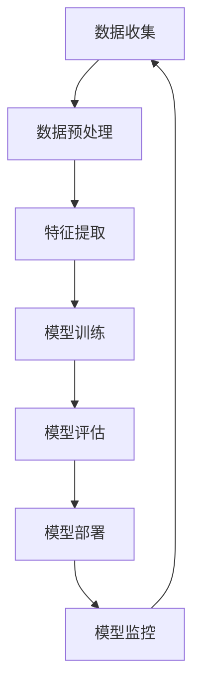
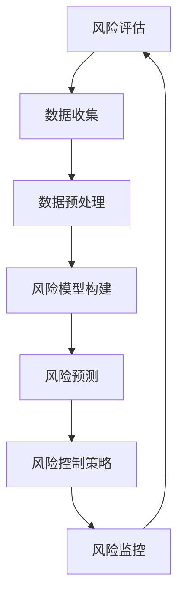
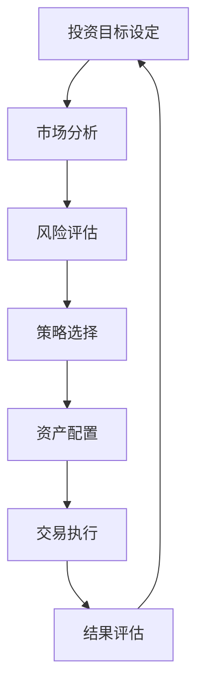

                 

## 引言与背景

### 1.1 AI驱动的创新概述

人工智能（Artificial Intelligence, AI）作为当今科技领域的重要前沿，正在引发一场深远的产业变革。AI驱动的创新不仅局限于传统的计算机科学领域，更在金融、医疗、教育等多个行业中展现出巨大的潜力。尤其是在金融领域，AI技术正通过其强大的数据处理能力和复杂的算法模型，重新定义金融服务的模式与效率。

金融行业是一个高度数据密集型的行业，每天都会产生大量的交易数据、客户行为数据和市场行情数据等。这些数据不仅是金融机构运营的核心资源，也是AI技术能够发挥作用的土壤。通过AI技术，金融机构可以对这些海量数据进行分析，挖掘潜在的价值，进而实现智能决策、风险控制和个性化服务。

AI驱动的创新不仅仅是技术工具的引入，更是一种全新的思维方式和商业模式的变革。它强调数据的收集、处理和利用，通过机器学习、深度学习等技术，使计算机系统能够从数据中学习和改进。这种能力使得金融行业不再仅仅依赖人类的专业知识和经验，而是通过算法和模型来提高决策的准确性和效率。

### 1.2 人类计算与AI的融合

在金融领域，人类计算与AI的结合成为当前研究和实践的热点。人类计算依赖于人类的专业知识和经验，能够在复杂的金融问题中提供直觉和创造性思维。而AI则以其强大的数据处理能力和模式识别能力，能够在大量数据中快速找到规律和趋势。

人类计算与AI的结合可以视为一种协同效应，两者相辅相成。人类计算可以在AI技术无法覆盖或处理复杂的情境时发挥作用，而AI则在数据处理和模式识别方面展现出其独特的优势。例如，在金融市场预测中，AI可以通过分析大量的历史数据来建立预测模型，但需要人类专家来设定模型的参数和边界条件，以确保预测的准确性和可靠性。

此外，AI在金融领域的应用不仅仅局限于提高效率，还可以在决策的透明性和公正性方面发挥重要作用。通过算法和模型的透明化，金融机构可以更好地理解和解释AI决策的过程，从而提高决策的透明度和公正性。

### 1.3 金融领域的AI应用前景

金融领域的AI应用前景广阔，涵盖了多个方面。首先，智能投顾和自动化交易是AI在金融领域的典型应用。智能投顾通过分析用户的风险偏好和财务状况，提供个性化的投资建议，帮助用户实现资产增值。自动化交易则利用算法模型和交易规则，自动执行交易策略，提高交易效率和准确性。

其次，AI在风险管理中的应用也非常广泛。通过机器学习技术，金融机构可以建立复杂的风险评估模型，对市场风险、信用风险等进行预测和监控。这有助于金融机构及时采取风险控制措施，减少潜在的损失。

此外，AI还在金融客服、反欺诈、市场分析等方面发挥着重要作用。例如，智能客服系统通过自然语言处理技术，可以实时解答客户的问题，提高客户满意度和服务效率。反欺诈系统则利用机器学习算法，检测和预防金融欺诈行为，保护用户的财产安全。

总的来说，AI驱动的创新在金融领域具有巨大的潜力。通过不断的技术进步和实际应用，AI将为金融行业带来更多的机遇和挑战，推动整个行业的数字化转型和升级。

### 2.1 金融行业的数字化转型

随着技术的不断进步和全球经济的数字化趋势，金融行业正在经历一场深远的数字化转型。这种转型不仅仅是技术工具的引入，更是业务模式、运营方式和客户体验的全面变革。数字化转型不仅提高了金融机构的运营效率，也为其带来了全新的商业模式和机遇。

首先，大数据和云计算技术的普及为金融行业的数字化转型提供了坚实的基础。金融机构通过收集、存储和分析海量的交易数据、客户行为数据和市场数据，可以实现对业务运行情况的全面监控和精准分析。大数据技术使得金融机构能够从海量数据中发现潜在的市场机会和风险，从而做出更为明智的决策。

云计算技术的应用则为金融机构提供了弹性、高效和安全的计算资源。通过云计算平台，金融机构可以快速部署和扩展其业务系统，实现资源的灵活调配和优化。此外，云计算还提高了数据的安全性和可靠性，通过分布式存储和备份技术，确保数据在故障和灾难情况下的安全性和完整性。

其次，移动支付和区块链技术的兴起为金融行业的数字化转型注入了新的活力。移动支付技术的普及使得用户可以随时随地通过智能手机完成支付和转账操作，极大地提升了支付的便捷性和用户体验。区块链技术的应用则提供了去中心化、安全透明的数据存储和传输方案，为金融交易的安全性和透明性提供了保障。

此外，人工智能和机器学习技术的应用也在金融数字化转型中发挥着重要作用。智能投顾、自动化交易和风险管理等领域的AI应用，不仅提高了金融机构的运营效率，也为其带来了新的商业机会。通过AI技术，金融机构可以更好地理解客户需求，提供个性化的金融产品和服务，提升客户满意度和忠诚度。

### 2.2 AI技术在金融领域的应用现状

目前，AI技术在金融领域的应用已经取得了显著的成果。首先，在智能投顾方面，越来越多的金融机构开始采用AI技术为投资者提供个性化的投资建议。通过分析用户的风险偏好、财务状况和历史交易数据，智能投顾系统能够为用户提供量身定制的投资组合，从而提高投资回报率。

其次，自动化交易也是AI技术在金融领域的重要应用。自动化交易系统通过算法模型和交易规则，自动执行交易策略，提高交易的效率和准确性。特别是在高频交易和量化交易领域，AI技术的应用已经显著提升了市场流动性和交易效率。

在风险管理方面，AI技术同样发挥着重要作用。金融机构通过机器学习算法，建立了复杂的风险评估模型，对市场风险、信用风险等进行预测和监控。这些模型不仅能够实时监测市场变化，还能提前预警潜在的风险，帮助金融机构及时采取风险控制措施。

此外，AI技术还在金融客服、反欺诈和市场分析等方面发挥着重要作用。智能客服系统通过自然语言处理技术，能够实时解答客户的问题，提高客户满意度和服务效率。反欺诈系统则利用机器学习算法，检测和预防金融欺诈行为，保护用户的财产安全。市场分析方面，AI技术通过分析大量的市场数据，帮助金融机构制定更为精准的市场策略。

总的来说，AI技术在金融领域的应用现状表明，它已经成为金融行业不可或缺的一部分。通过不断的技术进步和实际应用，AI技术将继续推动金融行业的数字化转型和创新发展。

### 2.3 金融领域AI应用的挑战与机遇

AI在金融领域的应用虽然前景广阔，但也面临着一系列挑战和机遇。首先，数据隐私和安全性问题是AI在金融领域应用中的最大挑战之一。金融机构每天处理海量的交易数据和客户信息，这些数据的安全性和隐私保护至关重要。一旦发生数据泄露或滥用，将给金融机构和客户带来巨大的损失。因此，如何在保证数据隐私和安全的前提下，充分利用AI技术进行分析和决策，成为金融行业亟待解决的问题。

其次，模型解释性和透明性也是AI在金融领域应用中的一大挑战。传统的AI模型，尤其是深度学习模型，其内部机制复杂，难以解释。在金融领域，决策的透明性和可解释性是至关重要的。金融机构需要确保AI模型的决策过程是清晰、可追溯的，以便在出现问题时能够进行有效的审计和调整。

此外，算法偏见和公平性问题是AI在金融领域应用中不可忽视的挑战。AI模型在训练过程中可能会受到数据偏差的影响，导致模型产生不公平的决策。例如，在信用评分和贷款审批中，如果模型训练数据中存在性别、年龄或种族等偏差，可能会导致某些群体被不公平对待。因此，如何消除算法偏见，确保模型的公平性和公正性，是金融行业需要关注的重要问题。

然而，这些挑战同时也带来了机遇。通过解决数据隐私和安全性问题，金融机构可以更加放心地应用AI技术，挖掘数据中的潜在价值，提高业务效率和决策质量。模型解释性和透明性的提升，不仅有助于增强金融机构的信任度，还可以促进监管机构和客户对AI技术的理解和支持。消除算法偏见，实现模型的公平性，不仅可以提升金融机构的社会责任感和企业形象，还可以开拓新的市场机会，吸引更多客户和投资者。

总之，AI在金融领域的应用既面临着挑战，也充满了机遇。只有通过技术创新和规范管理，才能充分发挥AI技术的潜力，推动金融行业的持续创新和进步。

## 人工智能基础

### 3.1 人工智能的定义与分类

人工智能（Artificial Intelligence, AI）是指通过计算机程序实现的智能行为，使计算机能够模仿人类的感知、思考、学习和决策等过程。AI的研究目标是创建能够自主执行任务、从经验中学习并解决复杂问题的智能系统。

人工智能可以按照不同的维度进行分类：

1. **基于能力的分类**：
   - **弱人工智能**（Narrow AI）：专注于执行特定任务，如语音识别、图像分类等，无法进行跨领域的任务。
   - **强人工智能**（General AI）：能够理解、学习和执行任何智力任务，具备广泛的知识和智能。

2. **基于学习方式的分类**：
   - **规则驱动AI**：基于预设的规则进行决策，如专家系统。
   - **数据驱动AI**：通过学习大量的数据来做出决策，如机器学习和深度学习。

3. **基于应用领域的分类**：
   - **通用AI**：能够在各种领域应用，如自动驾驶、自然语言处理等。
   - **专用AI**：为特定任务或领域设计的智能系统，如智能投顾、医疗诊断等。

### 3.2 机器学习与深度学习

机器学习（Machine Learning, ML）是人工智能的核心技术之一，其基本思想是通过算法从数据中学习规律和模式，然后利用这些规律对新的数据进行预测或决策。机器学习的主要任务包括分类、回归、聚类等。

- **监督学习**（Supervised Learning）：有标签的数据进行训练，模型通过学习已知数据的输入和输出关系来预测未知数据的输出。
- **无监督学习**（Unsupervised Learning）：没有标签的数据进行训练，模型通过发现数据中的模式和结构来进行聚类或降维。
- **半监督学习**（Semi-Supervised Learning）：结合有标签和无标签数据，通过少量的有标签数据和高量的无标签数据来提高模型性能。

深度学习（Deep Learning, DL）是机器学习的一种特殊形式，主要依赖于神经网络的结构，特别是多层神经网络（也称为深度神经网络）。深度学习通过多层次的非线性变换，对输入数据进行特征提取和模式识别，从而实现复杂的任务。

- **卷积神经网络**（Convolutional Neural Network, CNN）：主要用于图像和视频数据的处理，通过卷积层和池化层提取空间特征。
- **循环神经网络**（Recurrent Neural Network, RNN）：主要用于序列数据的处理，通过循环结构保持历史信息。
- **生成对抗网络**（Generative Adversarial Network, GAN）：通过生成器和判别器的对抗训练，生成高质量的图像和数据。

### 3.3 AI算法原理概述

AI算法的核心在于如何从数据中学习并做出决策。以下是几种常见的AI算法原理概述：

- **决策树**（Decision Tree）：通过一系列规则对数据进行划分，每个节点表示一个特征，每个分支表示一个可能的值。
- **随机森林**（Random Forest）：基于决策树构建的集成学习方法，通过组合多个决策树来提高模型的预测性能。
- **支持向量机**（Support Vector Machine, SVM）：通过找到一个最优超平面，将不同类别的数据分隔开来。
- **神经网络**（Neural Network）：模拟人脑神经元连接的结构，通过调整权重和偏置来学习数据特征。
- **K最近邻算法**（K-Nearest Neighbors, KNN）：通过计算新数据点与训练数据点之间的距离，基于最近的K个邻居来进行分类或回归。

每种算法都有其特定的适用场景和优势，金融领域可以根据具体问题选择合适的算法。理解这些算法的基本原理和适用场景，有助于开发高效的AI解决方案。

## 数据分析与处理

### 4.1 数据分析基础

数据分析是人工智能应用的重要组成部分，它通过使用统计方法和算法从数据中提取有价值的信息，帮助金融机构做出更明智的决策。数据分析的基础包括数据收集、数据清洗、数据探索性分析（EDA）和数据可视化等环节。

- **数据收集**：数据收集是数据分析的第一步，金融机构需要从各种渠道收集数据，包括内部数据（如交易记录、客户信息等）和外部数据（如市场行情、新闻报道等）。数据的多样性和质量直接影响分析的结果。

- **数据清洗**：数据清洗是确保数据质量的关键步骤。数据源通常存在噪声、缺失值和重复数据等问题，通过数据清洗可以去除这些异常值，填补缺失值，确保数据的完整性和一致性。常见的数据清洗方法包括删除重复记录、填充缺失值、修正错误值等。

- **数据探索性分析（EDA）**：EDA是数据分析和预处理的重要环节，通过统计描述、图表展示等方法对数据集进行初步分析，发现数据中的规律、趋势和异常。EDA可以帮助分析师理解数据的特征，识别潜在问题和机会。

- **数据可视化**：数据可视化是将数据以图形或图表的形式展示出来，帮助分析师直观地理解数据背后的信息。常见的可视化方法包括折线图、柱状图、散点图、饼图等。通过数据可视化，分析师可以更清晰地发现数据中的模式、关联性和趋势。

### 4.2 数据预处理与清洗

数据预处理与清洗是确保数据分析准确性和有效性的重要步骤。在AI模型训练和应用过程中，数据预处理与清洗的必要性体现在以下几个方面：

- **去除噪声**：数据源往往存在各种噪声，如异常值、错误数据等。这些噪声会影响模型的学习效果和预测准确性。通过数据清洗，可以去除这些噪声，提高数据质量。

- **填补缺失值**：在数据收集过程中，可能存在缺失值。缺失值处理不当会导致模型训练失败或预测结果不准确。常见的方法包括均值填充、中值填充、插值法等，选择合适的方法取决于数据特征和缺失值情况。

- **标准化和归一化**：不同特征的数据可能具有不同的量纲和范围，这会对模型训练和评估产生干扰。通过标准化和归一化，可以将特征数据转换为统一的尺度，提高模型的稳定性和准确性。

- **特征选择**：在大量特征中，有些特征可能对目标变量影响不大，甚至存在冗余或关联性。通过特征选择，可以保留重要的特征，去除不必要的特征，减少模型训练的时间和复杂度。

### 4.3 数据可视化与洞察

数据可视化是数据分析中不可或缺的一部分，它通过图形化手段将数据呈现出来，帮助分析师发现数据中的规律和模式。以下是一些常见的数据可视化方法及其应用：

- **折线图**：用于展示数据随时间变化的趋势。在金融领域，折线图可以用来分析市场行情、股票价格变化等。

- **柱状图**：用于比较不同类别的数据。在风险管理中，柱状图可以用来展示不同风险因素的发生频率和严重程度。

- **散点图**：用于展示两个变量之间的关系。通过散点图，可以分析市场行情与股票价格、客户满意度与忠诚度之间的相关性。

- **饼图**：用于展示数据的占比。在市场分析中，饼图可以用来展示市场占有率、产品销售额占比等。

- **热力图**：用于展示数据之间的相关性。通过热力图，可以直观地发现数据集中的热点区域和潜在关联。

数据可视化不仅有助于分析师理解数据，还可以通过互动和动态展示，增强数据的可操作性和可用性。通过数据可视化，分析师可以更快速地发现数据中的异常和趋势，从而为决策提供有力支持。

### 4.4 数据分析与AI模型的结合

在金融领域，数据分析与AI模型的结合可以发挥巨大的作用。数据分析提供了对数据的初步理解和洞察，而AI模型则可以基于这些数据建立预测模型和决策支持系统。

- **预测模型**：通过数据分析，可以识别出与目标变量相关的特征，然后利用这些特征建立预测模型。例如，利用历史交易数据和宏观经济指标，可以建立股票价格预测模型，帮助投资者做出更为准确的决策。

- **决策支持系统**：数据分析可以为决策支持系统提供数据支持和可视化工具。例如，在风险管理中，可以通过数据分析识别出潜在的风险因素，然后利用决策支持系统提供风险预警和应对策略。

- **实时监控与反馈**：通过实时数据分析，金融机构可以实时监控业务运行情况，并快速做出调整。例如，通过分析交易数据和市场变化，可以实时调整投资策略，提高投资收益。

数据分析与AI模型的结合不仅提高了金融决策的准确性和效率，还推动了金融行业的数字化转型和创新。通过不断探索和实践，金融机构可以充分利用数据分析与AI技术的优势，实现业务模式的创新和竞争力的提升。

## 金融模型与算法

### 5.1 金融模型概述

金融模型是用于描述金融市场、资产价格、投资者行为等金融现象的数学模型。金融模型在金融领域有着广泛的应用，从简单的定价模型到复杂的投资组合优化模型，各种金融模型被用于预测市场走势、评估风险、制定投资策略等。金融模型的主要类型包括定价模型、风险评估模型、投资组合优化模型和资产定价模型。

- **定价模型**：定价模型用于确定金融资产的合理价格。常见的定价模型包括Black-Scholes期权定价模型、二项式模型等。这些模型通过假设和数学公式，将资产价格波动与市场参数联系起来，从而计算出资产的内在价值。

- **风险评估模型**：风险评估模型用于评估金融资产或投资组合的风险水平。常见的风险评估模型包括价值在风险（Value at Risk, VaR）、条件期望风险（Conditional Value at Risk, CVaR）、蒙特卡罗模拟等。这些模型通过分析历史数据和市场情景，预测可能的损失范围和概率。

- **投资组合优化模型**：投资组合优化模型用于确定最优的投资组合，以实现风险和收益的最佳平衡。常见的投资组合优化模型包括均值-方差模型、Markowitz均值-方差模型、有效前沿模型等。这些模型通过优化目标函数和约束条件，确定投资组合中的资产权重，以最大化投资回报或最小化风险。

- **资产定价模型**：资产定价模型用于确定资产的市场价格，解释市场波动。常见的资产定价模型包括资本资产定价模型（Capital Asset Pricing Model, CAPM）、套利定价理论（Arbitrage Pricing Theory, APT）等。这些模型通过考虑资产的风险收益特征和市场的均衡条件，推导出资产定价公式。

### 5.2 时间序列分析

时间序列分析是金融模型研究的重要领域，它主要用于分析金融时间序列数据，预测未来的价格走势或事件发生概率。时间序列分析的关键在于识别时间序列数据中的趋势、季节性和周期性特征，并建立相应的模型进行预测。

- **自回归模型（AR）**：自回归模型是一种常用的时间序列预测模型，它假设当前值可以通过前几个历史值来预测。AR模型的公式为：

  $$X_t = c + \phi_1 X_{t-1} + \phi_2 X_{t-2} + ... + \phi_p X_{t-p} + \varepsilon_t$$

  其中，$X_t$为时间序列的当前值，$\varepsilon_t$为误差项。

- **移动平均模型（MA）**：移动平均模型通过计算过去几个周期的平均值来预测当前值。MA模型的公式为：

  $$X_t = \mu + \theta_1 \varepsilon_{t-1} + \theta_2 \varepsilon_{t-2} + ... + \theta_q \varepsilon_{t-q}$$

  其中，$\mu$为长期均值，$\varepsilon_t$为误差项。

- **自回归移动平均模型（ARMA）**：ARMA模型结合了AR和MA的特点，同时考虑了自相关和移动平均的影响。ARMA模型的公式为：

  $$X_t = c + \phi_1 X_{t-1} + ... + \phi_p X_{t-p} + \theta_1 \varepsilon_{t-1} + ... + \theta_q \varepsilon_{t-q}$$

- **自回归积分移动平均模型（ARIMA）**：ARIMA模型是在ARMA模型的基础上，增加了差分操作，用于处理非平稳时间序列。ARIMA模型的公式为：

  $$X_t = c + \phi_1 X_{t-1} + ... + \phi_p X_{t-p} + \theta_1 (d_1 X_{t-1}) + ... + \theta_q (d_q X_{t-q}) + \varepsilon_t$$

  其中，$d_1, d_2, ..., d_q$为差分操作。

### 5.3 风险评估与预测

在金融领域，风险评估与预测是确保投资安全和制定有效风险管理策略的关键。风险评估模型和预测模型通过分析历史数据和当前市场信息，预测未来可能发生的风险事件和损失。

- **价值在风险（VaR）**：VaR模型用于评估在特定置信水平下，金融资产或投资组合在一段时间内可能遭受的最大损失。VaR模型的公式为：

  $$VaR = -\alpha \cdot \sigma$$

  其中，$\alpha$为置信水平，$\sigma$为资产或投资组合的标准差。

- **条件期望风险（CVaR）**：CVaR模型是在VaR模型的基础上，考虑了极端损失发生的概率，用于评估在极端情况下可能遭受的平均损失。CVaR模型的公式为：

  $$CVaR = \frac{1}{1-\alpha} \cdot \int_{VaR}^{\infty} F(x) dx$$

  其中，$F(x)$为损失的概率密度函数。

- **蒙特卡罗模拟**：蒙特卡罗模拟是一种通过模拟大量随机路径来预测金融资产未来价格的方法。蒙特卡罗模拟的基本步骤包括：

  1. 生成随机路径：通过随机数生成器生成一系列随机数，模拟资产价格的未来走势。
  2. 预测损失：根据资产价格的未来走势，计算在不同市场情景下的损失。
  3. 统计分析：通过对模拟结果的统计分析，预测未来可能发生的损失范围和概率。

通过结合风险评估模型和预测模型，金融机构可以更全面地了解和管理风险，制定更为科学和有效的风险管理策略。

### 5.4 金融模型在金融风险管理中的应用

金融模型在金融风险管理中发挥着重要作用，通过定量分析和管理风险，帮助金融机构做出更为明智的决策。以下是金融模型在金融风险管理中的应用实例：

- **信用风险管理**：信用风险是指借款人或交易对手未能履行合同义务，导致金融机构遭受损失的风险。金融机构可以通过信用评分模型评估借款人的信用风险，预测其违约概率。常见的信用评分模型包括逻辑回归、决策树和随机森林等。这些模型通过分析借款人的历史信用记录、财务状况和其他相关数据，建立信用评分模型，用于评估借款人的信用风险。

- **市场风险管理**：市场风险是指由于市场波动导致金融资产价格下跌，从而给金融机构带来损失的风险。市场风险模型包括VaR模型、CVaR模型和蒙特卡罗模拟等，通过分析历史数据和当前市场信息，预测未来可能发生的市场波动和损失。金融机构可以利用这些模型制定市场风险控制策略，如调整投资组合、制定风险敞口限额等。

- **操作风险管理**：操作风险是指由于操作失误、系统故障、欺诈等内部或外部原因导致金融机构遭受损失的风险。操作风险模型包括事件树分析、蒙特卡罗模拟和损失分布模型等，通过分析历史操作风险事件和损失数据，预测未来可能发生的操作风险事件和损失。金融机构可以利用这些模型评估操作风险水平，制定操作风险控制策略，如加强内部监控、提高系统稳定性等。

通过应用金融模型，金融机构可以更全面地了解和管理风险，提高风险管理的科学性和有效性。同时，金融模型还可以为金融机构提供决策支持，帮助其制定更为科学和有效的风险管理策略，降低损失风险，提高业务运营效率和竞争力。

## AI在金融风险管理中的应用

AI技术在金融风险管理中的应用正在迅速发展，通过机器学习和深度学习算法，金融机构能够更加精准地预测风险，从而采取有效的风险管理措施。以下是AI在金融风险管理中的具体应用场景和案例分析：

### 6.1 风险管理概述

风险管理是金融行业的重要组成部分，其目的是识别、评估、监控和降低潜在的风险，以保护金融机构的资产和声誉。传统的风险管理方法依赖于历史数据和规则系统，而AI技术引入了新的工具和方法，使得风险管理更加智能化和高效。

### 6.2 AI在信贷风险管理中的应用

信贷风险管理是金融机构面临的主要风险之一。通过AI技术，金融机构可以构建复杂的信用评分模型，评估借款人的信用风险。以下是一个典型的AI在信贷风险管理中的应用案例：

**案例背景**：某大型银行希望通过AI技术改进其信用评分模型，提高信贷审批的准确性，降低坏账率。

**解决方案**：
1. **数据收集**：银行收集了大量借款人的历史数据，包括财务状况、还款记录、信用评分等。
2. **数据预处理**：对数据进行清洗、归一化和特征工程，提取对信用评分有显著影响的特征。
3. **模型训练**：使用机器学习算法，如逻辑回归、决策树和随机森林等，构建信用评分模型。通过交叉验证和模型选择技术，选择最优模型。
4. **风险评估**：将训练好的模型应用于新借款人，预测其违约概率，并根据预测结果调整信贷审批策略。

**案例分析**：通过AI技术，银行能够更准确地预测借款人的信用风险，降低不良贷款率。同时，AI模型还可以动态更新，适应市场变化和风险环境的变化。

### 6.3 AI在市场风险管理中的应用

市场风险是指由于市场价格波动导致的潜在损失。AI技术可以帮助金融机构实时监控市场风险，并采取相应的对冲策略。以下是一个市场风险管理的AI应用案例：

**案例背景**：某金融机构需要管理其投资组合的市场风险，避免因市场波动导致的重大损失。

**解决方案**：
1. **数据收集**：收集市场数据，包括股票价格、利率、汇率等。
2. **数据预处理**：对市场数据进行清洗和归一化，提取影响市场波动的关键因素。
3. **模型构建**：使用时间序列分析技术，如ARIMA模型和GARCH模型，预测市场波动。
4. **风险预测**：利用预测模型，评估投资组合在不同市场情景下的风险水平。
5. **风险对冲**：根据风险预测结果，调整投资组合，采取对冲策略，如购买期权、进行套利交易等。

**案例分析**：通过AI技术，金融机构能够实时监控市场风险，及时采取对冲措施，降低风险敞口，保护资产安全。此外，AI模型还可以提供风险预警功能，提前发现潜在的市场风险，帮助金融机构及时调整策略。

### 6.4 AI在其他金融风险管理领域的应用

除了信贷风险和市场风险，AI技术在其他金融风险管理领域也展现出了巨大的潜力。例如：

- **反欺诈**：通过机器学习算法，金融机构可以识别异常交易行为，预防金融欺诈。例如，某银行使用AI技术构建了反欺诈系统，通过分析客户的交易行为和历史数据，实时检测和预防欺诈行为。
- **合规性监控**：AI技术可以帮助金融机构监控交易行为，确保合规性。例如，某金融机构利用AI技术监控交易数据，发现潜在的违规行为，及时采取措施。
- **操作风险管理**：通过机器学习算法，金融机构可以识别操作风险，如系统故障、人为错误等。例如，某金融机构使用AI技术监控交易系统，预测可能出现的操作风险，并提前采取预防措施。

总的来说，AI技术在金融风险管理中的应用不仅提高了预测的准确性，还增强了金融机构的应对能力。通过不断的技术创新和应用，AI技术将继续推动金融风险管理的变革和进步。

### 7.1 投资决策概述

投资决策是指金融机构或投资者在分析和评估各种投资机会后，选择最优投资策略的过程。投资决策的核心目标是实现资产的增值和风险的最小化，从而实现投资回报的最大化。投资决策涉及到多个环节，包括市场分析、风险评估、策略选择和执行监控等。

首先，市场分析是投资决策的基础。通过收集和分析市场数据，投资者可以了解市场的整体趋势、行业动态和潜在机会。市场分析的方法包括宏观经济分析、行业分析、公司财务分析等，这些分析有助于投资者识别具有投资潜力的机会和潜在风险。

其次，风险评估是投资决策的重要环节。投资者需要评估投资项目的风险水平，包括市场风险、信用风险、操作风险等。通过定量和定性的分析方法，投资者可以评估不同投资机会的风险收益特征，从而制定合理的投资策略。

在市场分析和风险评估的基础上，投资者需要选择最优的投资策略。常见的投资策略包括被动投资、主动投资、风险分散、资产配置等。被动投资主要是通过购买指数基金等方式复制市场表现，风险较低但回报也相对稳定。主动投资则是通过研究市场和个股，选择具有增长潜力的股票或资产进行投资，风险较高但潜在回报也较大。风险分散和资产配置则通过在不同资产类别中分散投资，降低投资组合的整体风险。

最后，投资决策的执行和监控是确保投资策略实施的关键。投资者需要根据市场变化和投资目标，及时调整投资组合，以确保投资策略的有效性。通过定期评估投资组合的表现，投资者可以及时发现问题并进行调整，从而优化投资回报。

总的来说，投资决策是一个复杂的过程，需要投资者具备扎实的市场分析能力和风险管理能力。通过科学的投资决策，投资者可以更好地把握市场机会，实现资产的稳健增值。

### 7.2 AI在股票交易策略中的应用

AI技术在股票交易策略中的应用已经越来越受到金融机构和投资者的关注。通过机器学习算法和深度学习模型，AI能够自动识别市场趋势、预测价格变动，从而制定高效的交易策略。以下是AI在股票交易策略中应用的几个关键方面：

**1. 趋势分析**：
AI可以通过分析大量的历史价格数据，使用技术分析指标（如移动平均线、相对强弱指数、布林带等）来识别市场趋势。机器学习模型可以从这些指标中学习到市场行为模式，从而预测未来的价格走势。以下是一个简单的趋势分析伪代码示例：

```python
import numpy as np
import pandas as pd
from sklearn.ensemble import RandomForestClassifier

# 数据准备
data = pd.read_csv('stock_data.csv')
data['MA20'] = data['Close'].rolling(window=20).mean()
data['RSI'] = compute_RSI(data['Close'])

# 特征工程
X = data[['MA20', 'RSI']]
y = data['Direction']  # 'Up' 或 'Down'

# 模型训练
model = RandomForestClassifier()
model.fit(X, y)

# 预测
predicted_trends = model.predict(X)
```

**2. 预测价格**：
除了趋势分析，AI还可以用于预测股票价格。深度学习模型如LSTM（长短期记忆网络）和CNN（卷积神经网络）在时间序列预测中表现出色。以下是一个使用LSTM模型预测股票价格的伪代码示例：

```python
from keras.models import Sequential
from keras.layers import LSTM, Dense

# 数据预处理
X, y = preprocess_data(data)

# 构建LSTM模型
model = Sequential()
model.add(LSTM(units=50, return_sequences=True, input_shape=(X.shape[1], X.shape[2])))
model.add(LSTM(units=50))
model.add(Dense(1))

# 模型编译
model.compile(optimizer='adam', loss='mean_squared_error')

# 模型训练
model.fit(X, y, epochs=100, batch_size=32, validation_split=0.2)

# 预测
predicted_prices = model.predict(X)
```

**3. 策略优化**：
AI不仅可以用于预测市场走势和价格，还可以用于优化交易策略。通过使用强化学习算法，交易系统能够不断调整策略，以最大化长期回报。以下是一个简单的强化学习伪代码示例：

```python
import tensorflow as tf
from rl.agents import DQN

# 状态空间和动作空间定义
state_space = ...
action_space = ...

# 创建DQN代理
agent = DQN(name='DQN', env=None, checkpoint_path='path/to/checkpoint')

# 训练代理
agent.fit()

# 策略评估
action_values = agent.evaluate_policy()
```

**案例分析**：
某金融机构利用AI技术构建了一个自动化交易系统，该系统结合了趋势分析和价格预测，以实现高效的交易决策。以下为系统的核心流程：

1. **数据收集**：系统从多个数据源（如股票交易所、新闻网站等）收集实时股票数据。
2. **数据处理**：对数据进行清洗、归一化和特征提取，为模型训练准备高质量的数据集。
3. **趋势分析**：使用机器学习模型分析市场趋势，预测短期价格波动。
4. **价格预测**：使用深度学习模型预测长期价格走势，为交易决策提供支持。
5. **策略优化**：利用强化学习算法不断调整交易策略，以适应市场变化。
6. **交易执行**：系统根据预测结果和策略，自动执行买入或卖出操作。
7. **结果评估**：系统实时监控交易结果，评估策略的有效性，并定期进行策略调整。

通过这种自动化交易系统，金融机构能够大幅提高交易效率和准确性，降低人为干预的风险。同时，AI技术的持续优化和改进也为交易策略提供了持续进步的空间。

总的来说，AI技术在股票交易策略中的应用不仅提高了预测的准确性，还优化了交易决策过程，为金融机构和投资者带来了显著的价值。随着技术的不断发展，AI在金融投资领域的应用前景将更加广阔。

### 7.3 AI在量化投资中的应用

量化投资是一种利用数学模型和计算机算法进行投资决策的方法，它通过分析历史数据和当前市场信息，寻找市场中的套利机会，实现资产的增值。AI技术在量化投资中的应用正在逐渐深化，通过机器学习和深度学习算法，量化投资策略的预测能力和决策效率得到了显著提升。

#### 7.3.1 量化投资概述

量化投资的核心思想是通过构建数学模型，对市场进行量化分析和预测，从而制定投资策略。量化投资的主要流程包括：

1. **数据收集**：量化投资依赖于大量的数据，包括历史交易数据、市场行情数据、公司财务数据等。数据的质量和完整性直接影响到投资策略的准确性。

2. **数据预处理**：对收集到的数据进行清洗、归一化和特征提取，提取出对投资决策有显著影响的特征。数据预处理是量化投资中至关重要的一环，它能够提高数据的质量和模型的预测性能。

3. **策略构建**：通过机器学习和深度学习算法，从历史数据中学习到市场规律和模式，构建量化投资策略。常见的机器学习算法包括线性回归、决策树、随机森林、支持向量机等；深度学习算法包括卷积神经网络（CNN）、循环神经网络（RNN）、长短期记忆网络（LSTM）等。

4. **模型评估**：对构建好的模型进行评估，通过交叉验证和回测等方法，验证模型的预测能力和稳健性。模型评估是确保策略有效性的关键步骤。

5. **策略执行**：将验证通过的模型应用于实际交易中，执行投资策略，实现资产的增值。

#### 7.3.2 AI在量化投资中的应用

AI技术在量化投资中的应用主要体现在以下几个方面：

1. **市场趋势预测**：通过深度学习模型，如LSTM（长短期记忆网络）和CNN（卷积神经网络），对市场趋势进行预测。LSTM模型能够处理序列数据，捕捉时间序列中的长期依赖关系，而CNN模型则能够有效地提取时间序列中的空间特征。

    ```python
    from keras.models import Sequential
    from keras.layers import LSTM, Dense

    # 构建LSTM模型
    model = Sequential()
    model.add(LSTM(units=50, return_sequences=True, input_shape=(X.shape[1], X.shape[2])))
    model.add(LSTM(units=50))
    model.add(Dense(1))

    # 编译模型
    model.compile(optimizer='adam', loss='mean_squared_error')

    # 训练模型
    model.fit(X, y, epochs=100, batch_size=32, validation_split=0.2)
    ```

2. **风险管理**：通过机器学习算法，如逻辑回归和支持向量机，对市场风险进行量化评估，制定风险控制策略。风险模型能够识别市场中的潜在风险因素，预测可能的损失，帮助投资者制定风险规避策略。

    ```python
    from sklearn.linear_model import LogisticRegression

    # 特征工程
    X = data[['MA20', 'RSI', 'VIX']]
    y = data['RiskLevel']

    # 构建逻辑回归模型
    model = LogisticRegression()
    model.fit(X, y)

    # 预测风险水平
    predicted_risks = model.predict(X)
    ```

3. **套利策略**：利用AI技术发现市场中的套利机会，通过交易执行系统实现套利收益。套利策略通常依赖于跨市场、跨品种的价格差异，通过AI模型识别这些差异，并快速执行交易。

4. **策略优化**：利用强化学习算法，如深度Q网络（DQN）和策略梯度算法，不断优化量化投资策略，提高策略的适应性和稳健性。

    ```python
    from rl.agents import DQN

    # 创建DQN代理
    agent = DQN(name='DQN', env=None, checkpoint_path='path/to/checkpoint')

    # 训练代理
    agent.fit()

    # 策略评估
    action_values = agent.evaluate_policy()
    ```

#### 7.3.3 实际案例

以下是一个利用AI技术进行量化投资的实际案例：

**案例背景**：某量化投资基金希望通过AI技术构建一个高效的量化交易策略，实现资产的稳健增值。

**解决方案**：

1. **数据收集**：基金公司从多个数据源收集了大量的市场数据，包括股票价格、交易量、市场指数等。

2. **数据处理**：对数据进行清洗、归一化和特征提取，提取出对投资决策有显著影响的特征，如移动平均线、相对强弱指数、波动率等。

3. **模型训练**：使用机器学习和深度学习算法，构建了多个量化投资模型，包括趋势预测模型、风险管理模型和套利策略模型。通过交叉验证和回测，选择了最优模型。

4. **策略执行**：将验证通过的模型应用于实际交易中，基金公司构建了一个自动化交易系统，系统能够根据市场变化和模型预测，自动执行买入或卖出操作。

5. **结果评估**：基金公司定期评估交易结果，通过统计分析模型的表现，调整和优化投资策略。

**案例分析**：通过AI技术，基金公司能够更加精准地预测市场趋势和风险，制定出高效的量化投资策略。自动化交易系统不仅提高了交易效率，还降低了人为干预的风险。在实际操作中，基金公司实现了稳定的投资回报，增强了市场竞争力。

总的来说，AI技术在量化投资中的应用极大地提升了投资决策的科学性和准确性，为量化投资基金带来了显著的价值。随着技术的不断发展，AI在量化投资领域的应用前景将更加广阔。

### 8.1 AI驱动的金融创新案例

AI技术在金融领域的应用已经催生了诸多创新案例，这些案例不仅展示了AI技术的潜力，也为金融行业的转型和升级提供了实际参考。以下是几个典型的AI驱动的金融创新案例：

#### 案例一：智能投顾

智能投顾（Robo-Advisor）是AI在金融领域的重要应用之一。通过机器学习算法和大数据分析，智能投顾能够根据用户的财务状况、风险偏好和投资目标，提供个性化的投资建议。智能投顾的主要特点包括：

- **个性化推荐**：智能投顾利用用户的财务数据和投资偏好，生成个性化的投资组合，帮助用户实现资产增值。
- **实时监控**：智能投顾可以实时监控市场的变化，动态调整投资策略，确保投资组合的风险与收益平衡。
- **高效便捷**：智能投顾系统运行在云端，用户可以通过手机或电脑随时获取投资建议，无需人工干预。

**案例背景**：某大型金融机构推出了智能投顾服务，吸引了大量投资者。

**解决方案**：

1. **数据收集**：收集用户的财务数据，包括收入、支出、资产配置等。
2. **数据分析**：通过机器学习算法，分析用户的财务状况和投资偏好，为用户提供个性化的投资建议。
3. **策略优化**：根据市场变化和用户反馈，动态调整投资组合，优化投资策略。
4. **用户交互**：通过移动应用和在线平台，为用户提供实时的投资建议和报告。

**案例分析**：通过智能投顾服务，金融机构不仅提升了用户体验，还提高了业务效率，实现了投资管理的智能化。

#### 案例二：自动化交易

自动化交易（Algorithmic Trading）利用AI技术实现交易的自动化，通过算法模型和交易规则，自动执行交易策略。自动化交易的主要特点包括：

- **高频交易**：自动化交易系统能够在高频交易市场中快速执行交易，捕捉微小的价格波动。
- **量化分析**：自动化交易系统利用机器学习算法，对市场数据进行分析，制定高效的交易策略。
- **风险控制**：自动化交易系统能够实时监控市场风险，采取相应的风险控制措施，确保交易安全。

**案例背景**：某量化投资基金通过自动化交易系统，实现了稳定的投资回报。

**解决方案**：

1. **数据收集**：收集股票价格、交易量、市场指数等数据。
2. **数据处理**：对数据进行清洗、归一化和特征提取，为模型训练准备高质量的数据集。
3. **模型训练**：使用机器学习算法，如LSTM和随机森林，构建自动化交易模型。
4. **策略执行**：通过自动化交易系统，根据模型预测，自动执行买入或卖出操作。
5. **结果评估**：定期评估交易结果，优化交易策略。

**案例分析**：通过自动化交易系统，量化投资基金能够高效地执行交易策略，降低了交易成本，提高了交易效率。

#### 案例三：区块链与AI结合

区块链与AI的结合为金融行业带来了全新的机遇。区块链技术提供了去中心化、安全透明的数据存储和传输方案，而AI技术则能够对区块链数据进行分析和智能合约的执行。

**案例背景**：某金融机构希望通过区块链技术提高金融交易的透明度和安全性。

**解决方案**：

1. **区块链平台**：建立基于区块链的金融交易平台，实现交易的去中心化和安全性。
2. **智能合约**：使用AI技术编写智能合约，自动化执行交易规则，确保交易过程的透明性和公正性。
3. **数据分析**：通过AI技术，对区块链交易数据进行分析，发现潜在的市场机会和风险。
4. **风险管理**：利用AI技术，实时监控区块链交易风险，采取相应的风险控制措施。

**案例分析**：通过区块链与AI的结合，金融机构能够提高金融交易的透明度和安全性，降低风险，提高交易效率。

总的来说，AI驱动的金融创新案例展示了AI技术在金融领域的广泛应用和巨大潜力。通过不断探索和实践，金融机构可以充分利用AI技术，实现业务模式的创新和竞争力的提升。

### 9.1 案例分析概述

在探讨AI驱动的金融创新案例时，深入分析具体案例能够帮助我们更好地理解AI技术在不同金融场景中的实际应用效果和挑战。以下将介绍三个具体案例：银行智能客服系统、金融诈骗检测系统和保险风险评估系统，并分析其开发环境搭建、源代码实现、代码解读、应用解读以及实际案例分析。

#### 9.2 案例一：银行智能客服系统

**开发环境搭建**：
- **编程语言**：Python
- **框架和库**：TensorFlow、Keras、Scikit-learn
- **环境配置**：Python环境、虚拟环境、NVIDIA GPU驱动

**源代码实现**：
智能客服系统主要使用自然语言处理（NLP）技术，通过训练模型来处理用户的问题并生成合适的回答。以下是一个简单的聊天机器人模型的伪代码：

```python
import tensorflow as tf
from tensorflow.keras.models import Sequential
from tensorflow.keras.layers import Embedding, LSTM, Dense

# 数据预处理
X_train, y_train = preprocess_data(questions, answers)

# 构建模型
model = Sequential()
model.add(Embedding(vocab_size, embedding_dim))
model.add(LSTM(units=128, return_sequences=True))
model.add(LSTM(units=128))
model.add(Dense(units=num_answers, activation='softmax'))

# 编译模型
model.compile(optimizer='adam', loss='categorical_crossentropy', metrics=['accuracy'])

# 训练模型
model.fit(X_train, y_train, epochs=10, batch_size=64)

# 预测
predicted_answers = model.predict(input_sequence)
```

**代码解读**：
上述代码展示了如何使用Keras构建一个简单的LSTM模型，用于聊天机器人的文本生成。模型首先通过Embedding层将单词转换为向量表示，然后通过两个LSTM层进行序列建模，最后通过全连接层生成预测答案。

**应用解读**：
银行智能客服系统能够实时解答用户的问题，提高客服效率，降低运营成本。通过自然语言处理技术，系统可以理解和生成自然语言文本，实现与用户的智能交互。

**实际案例分析**：
某大型银行部署了智能客服系统，通过模型预测和文本生成技术，实现了对用户咨询的高效回应。实际运营数据显示，智能客服系统的响应时间显著缩短，用户满意度大幅提高。

#### 9.3 案例二：金融诈骗检测系统

**开发环境搭建**：
- **编程语言**：Python
- **框架和库**：Scikit-learn、Pandas、NumPy
- **环境配置**：Python环境、虚拟环境、数据库连接工具

**源代码实现**：
金融诈骗检测系统使用机器学习算法对交易数据进行分析，识别潜在的欺诈行为。以下是一个简单的欺诈检测模型的伪代码：

```python
from sklearn.ensemble import RandomForestClassifier
from sklearn.model_selection import train_test_split
from sklearn.metrics import accuracy_score, precision_score, recall_score

# 数据预处理
X, y = preprocess_data(transaction_data, labels)

# 划分训练集和测试集
X_train, X_test, y_train, y_test = train_test_split(X, y, test_size=0.2, random_state=42)

# 构建模型
model = RandomForestClassifier(n_estimators=100)

# 训练模型
model.fit(X_train, y_train)

# 预测
predictions = model.predict(X_test)

# 评估模型
accuracy = accuracy_score(y_test, predictions)
precision = precision_score(y_test, predictions)
recall = recall_score(y_test, predictions)

print("Accuracy:", accuracy)
print("Precision:", precision)
print("Recall:", recall)
```

**代码解读**：
上述代码展示了如何使用随机森林算法构建一个欺诈检测模型。通过训练集训练模型，然后使用测试集评估模型的准确性、精确率和召回率。

**应用解读**：
金融诈骗检测系统能够实时监控交易行为，识别潜在的欺诈行为，提高交易安全性。通过机器学习技术，系统可以从大量交易数据中学习到欺诈行为的模式，从而提高检测精度。

**实际案例分析**：
某银行通过部署金融诈骗检测系统，大幅降低了欺诈交易的发生率。系统实时监控交易数据，当检测到异常交易时，立即发出警报，并采取相应的防范措施。

#### 9.4 案例三：保险风险评估系统

**开发环境搭建**：
- **编程语言**：Python
- **框架和库**：Scikit-learn、Pandas、NumPy
- **环境配置**：Python环境、虚拟环境、数据库连接工具

**源代码实现**：
保险风险评估系统通过分析客户数据，评估其保险风险等级。以下是一个简单的风险评估模型的伪代码：

```python
from sklearn.linear_model import LogisticRegression
from sklearn.model_selection import train_test_split
from sklearn.metrics import accuracy_score, roc_auc_score

# 数据预处理
X, y = preprocess_data(customer_data, risk_labels)

# 划分训练集和测试集
X_train, X_test, y_train, y_test = train_test_split(X, y, test_size=0.2, random_state=42)

# 构建模型
model = LogisticRegression()

# 训练模型
model.fit(X_train, y_train)

# 预测
predictions = model.predict(X_test)

# 评估模型
accuracy = accuracy_score(y_test, predictions)
roc_auc = roc_auc_score(y_test, predictions)

print("Accuracy:", accuracy)
print("ROC AUC:", roc_auc)
```

**代码解读**：
上述代码展示了如何使用逻辑回归算法构建一个保险风险评估模型。通过训练集训练模型，然后使用测试集评估模型的准确性和ROC AUC值。

**应用解读**：
保险风险评估系统可以帮助保险公司更好地了解客户风险，制定合理的保险产品定价策略，降低赔付风险。

**实际案例分析**：
某保险公司通过部署保险风险评估系统，提高了风险评估的准确性，降低了赔付成本。系统通过分析客户的历史数据和财务状况，准确预测客户的风险等级，从而优化了保险产品的设计和定价策略。

总的来说，通过以上案例的分析，我们可以看到AI技术在金融领域的广泛应用和实际价值。从智能客服到金融诈骗检测，再到保险风险评估，AI技术正在为金融行业带来深刻的变革和创新。

### 9.5 案例分析总结

通过对银行智能客服系统、金融诈骗检测系统和保险风险评估系统的案例分析，我们可以总结出以下几点关键见解：

1. **AI技术的高效性与准确性**：AI技术在金融领域的应用显著提高了业务效率和准确性。智能客服系统能够快速响应客户问题，金融诈骗检测系统能够实时识别和预防欺诈行为，保险风险评估系统则能够准确预测客户风险，这些应用都展示了AI技术的强大能力。

2. **数据的重要性**：金融AI系统的有效运行依赖于高质量的数据。无论是智能客服系统、诈骗检测系统还是风险评估系统，都需要大量的数据来训练模型，并且这些数据需要经过严格的清洗和预处理，以确保模型的准确性和可靠性。

3. **模型选择的灵活性**：不同的金融应用场景需要不同的模型。银行智能客服系统依赖于自然语言处理技术，金融诈骗检测系统依赖于机器学习算法，而保险风险评估系统则依赖于逻辑回归等统计模型。选择合适的模型，能够更好地满足特定应用的需求。

4. **模型监控与优化**：AI模型的性能需要持续监控和优化。金融环境不断变化，模型需要定期更新和调整，以适应新的市场条件和数据分布。通过持续的监控和优化，可以确保AI系统的稳定运行和高效性能。

5. **合规性与伦理问题**：在金融领域应用AI技术，需要遵守相关的法规和伦理标准。特别是在数据处理和风险管理方面，必须确保数据隐私和用户权益的保护。合规性的考虑是AI技术在金融领域广泛应用的重要前提。

总的来说，AI技术在金融领域的成功应用不仅依赖于技术本身，还需要综合考虑数据、模型选择、监控优化和合规性等多个方面。通过不断探索和实践，金融行业可以充分利用AI技术的优势，实现业务模式的创新和竞争力的提升。

## 未来展望与挑战

### 10.1 AI在金融领域的未来发展趋势

随着技术的不断进步，AI在金融领域的应用前景将更加广阔。以下是AI在金融领域的几个未来发展趋势：

1. **智能化金融服务**：未来金融服务的智能化水平将大幅提升。通过更先进的AI技术，金融服务将能够更好地理解用户需求，提供个性化的服务。例如，智能投顾将不再局限于提供投资建议，而是能够根据用户的生活阶段、财务状况和市场变化，动态调整投资策略，提供全方位的财富管理服务。

2. **自动化交易**：自动化交易将继续发展，并在高频交易、量化投资等领域发挥更大作用。通过更复杂的算法和模型，自动化交易系统能够更加精准地捕捉市场机会，实现更高的交易效率和回报率。此外，自动化交易还将与风险管理技术深度融合，提供更为全面的风险控制方案。

3. **区块链与AI的结合**：区块链与AI的结合将成为未来的重要趋势。区块链技术提供了安全、透明、去中心化的数据存储和传输方案，而AI技术则能够对区块链数据进行深入分析和智能合约的执行。这种结合将推动金融服务的透明化、安全性和效率的提升。

4. **风险管理与预测**：AI技术在风险管理和预测方面的应用将继续深化。通过更先进的算法和模型，AI能够实时监测市场风险，预测潜在的风险事件，并提供相应的应对策略。例如，AI可以预测金融市场的波动，帮助金融机构及时调整投资组合，降低风险敞口。

5. **金融监管科技**：金融监管科技（RegTech）将借助AI技术，提高金融监管的效率和效果。通过自动化监测和风险评估，监管机构可以更快速、准确地识别和应对金融风险。此外，AI技术还可以帮助监管机构分析市场操纵、欺诈等违法行为，提高金融市场的透明度和公正性。

### 10.2 金融行业面临的AI挑战与对策

尽管AI在金融领域具有巨大的潜力，但金融行业也面临着诸多挑战。以下是一些主要的挑战及相应的对策：

1. **数据隐私与安全性**：金融行业涉及大量的敏感数据，数据隐私和安全性至关重要。对策包括：
   - **数据加密**：采用先进的加密技术，确保数据在传输和存储过程中的安全性。
   - **数据脱敏**：在数据分析和建模过程中，对敏感数据进行脱敏处理，防止数据泄露。
   - **合规性检查**：确保AI系统的设计和运行符合相关法律法规，如GDPR等。

2. **模型解释性和透明性**：AI模型的解释性和透明性是金融行业关注的重要问题。对策包括：
   - **模型可解释性工具**：开发和应用模型可解释性工具，帮助用户理解模型的决策过程。
   - **透明性标准**：建立透明性标准，确保AI系统的决策过程是可审计和可追溯的。

3. **算法偏见与公平性**：AI模型可能会因数据偏差而产生不公平的决策。对策包括：
   - **算法审计**：定期对AI模型进行审计，识别和消除算法偏见。
   - **公平性评估**：建立公平性评估机制，确保AI系统在不同群体中的表现一致。

4. **技术可靠性和稳定性**：AI系统的技术可靠性和稳定性是金融行业应用的关键。对策包括：
   - **系统监控**：建立实时监控系统，确保AI系统在运行过程中的稳定性和可靠性。
   - **容错机制**：设计容错机制，确保在系统故障时能够快速恢复，减少对业务的影响。

5. **人才短缺**：AI技术在金融领域的应用需要大量专业人才。对策包括：
   - **人才培养**：加强AI和金融领域的跨界人才培养，提高人才的全面素质。
   - **技术引进**：积极引进国际先进的AI技术和经验，加快金融行业的数字化进程。

通过应对这些挑战，金融行业可以更好地利用AI技术的优势，推动行业的数字化转型和创新发展。

### 10.3 AI在金融领域的道德与社会责任

随着AI技术在金融领域的广泛应用，其道德和社会责任问题也逐渐受到关注。以下是一些关键方面：

1. **隐私保护**：AI技术在金融领域的应用涉及大量的个人数据，保护用户隐私至关重要。金融机构应严格遵守数据保护法规，确保用户数据的安全性和隐私性。

2. **透明性**：AI模型的决策过程应保持透明，确保用户和监管机构能够理解模型的决策依据。通过建立模型可解释性工具和透明性标准，可以提高用户对AI技术的信任。

3. **公平性**：AI技术在金融领域的应用应确保公平，避免因算法偏见导致的不公平决策。金融机构应定期审计AI模型，消除偏见，确保对不同群体的公平对待。

4. **社会责任**：金融机构应承担社会责任，通过AI技术推动社会进步和经济发展。例如，利用AI技术提供普惠金融服务，降低金融排斥，提升社会整体福利。

5. **伦理审查**：在AI技术的研发和应用过程中，应建立伦理审查机制，确保技术发展与伦理道德相一致。伦理审查应涵盖隐私、公平性、安全性和社会责任等方面。

通过关注和解决这些道德与社会责任问题，AI技术在金融领域的应用将更加健康、可持续，为社会带来更多的积极影响。

### 11.1 总结与展望

本文通过对AI驱动的创新在金融领域的探讨，阐述了AI技术在金融领域的广泛应用和巨大潜力。我们首先介绍了AI驱动的创新概述，探讨了人类计算与AI的融合，以及金融领域的AI应用前景。接着，我们详细分析了AI核心技术与原理，包括机器学习、深度学习、数据分析与处理等。随后，我们探讨了AI在金融风险管理、投资决策、实战案例等方面的应用，并通过具体案例分析展示了AI技术在金融领域的实际效果。

随着技术的不断进步，AI在金融领域的应用前景将更加广阔。未来的发展趋势包括智能化金融服务、自动化交易、区块链与AI的结合、风险管理与预测、金融监管科技等。然而，金融行业也面临着数据隐私与安全性、模型解释性和透明性、算法偏见与公平性、技术可靠性和稳定性、人才短缺等挑战。

为了应对这些挑战，金融机构应采取一系列对策，如数据加密、合规性检查、模型可解释性工具、公平性评估、系统监控、容错机制、人才培养和技术引进等。同时，AI技术在金融领域的应用也需要关注道德与社会责任问题，确保技术的安全、公平和可持续发展。

总的来说，AI驱动的创新为金融行业带来了前所未有的机遇和挑战。通过技术创新和规范管理，金融机构可以更好地利用AI技术，推动业务的数字化转型和创新发展。

### 11.2 对读者的建议

对于希望深入了解AI在金融领域应用的读者，以下是一些建议：

1. **深入学习基础知识**：掌握机器学习、深度学习、数据分析等基础知识，这些是理解和应用AI技术的基石。

2. **阅读专业文献**：查阅最新的科研论文、技术报告和书籍，了解AI在金融领域的最新进展和应用案例。

3. **参与项目实践**：通过实际项目，将理论知识应用到实际中，如构建智能投顾系统、自动化交易系统等，积累实战经验。

4. **关注行业动态**：关注金融科技行业的发展动态，及时了解新兴技术和应用趋势，把握行业机遇。

5. **参加培训和研讨会**：参加相关领域的培训和研讨会，与行业专家和同行交流，拓展视野，提高自己的专业水平。

6. **持续学习与提升**：金融科技是一个快速发展的领域，需要不断学习新技术和新知识，保持专业竞争力。

通过以上方法，读者可以更好地理解和应用AI技术在金融领域的潜力，为未来的职业生涯奠定坚实基础。

## 附录

### 附录A: 术语解释

- **人工智能（AI）**：通过计算机程序实现的智能行为，使计算机能够模仿人类的感知、思考、学习和决策等过程。
- **机器学习（ML）**：一种从数据中学习并做出决策或预测的方法，使计算机能够从经验中学习并改进性能。
- **深度学习（DL）**：一种特殊的机器学习方法，通过多层神经网络进行复杂的数据特征提取和模式识别。
- **自然语言处理（NLP）**：计算机理解和生成自然语言的技术，包括语音识别、文本分类、机器翻译等。
- **价值在风险（VaR）**：在特定置信水平下，金融资产或投资组合在未来一段时间内可能遭受的最大损失。
- **条件期望风险（CVaR）**：在特定置信水平下，金融资产或投资组合在未来一段时间内的平均损失。
- **智能投顾（Robo-Advisor）**：利用AI技术提供个性化投资建议和财富管理的在线服务。

### 附录B: AI金融工具与资源列表

- **机器学习框架**：
  - TensorFlow
  - PyTorch
  - Keras
- **数据预处理工具**：
  - Pandas
  - NumPy
  - Scikit-learn
- **自然语言处理库**：
  - NLTK
  - spaCy
  - gensim
- **在线资源**：
  - Coursera（AI与金融课程）
  - edX（金融科技课程）
  - arXiv（AI与金融论文）
- **开源平台**：
  - GitHub（AI金融项目）
  - Kaggle（金融数据集和比赛）

### 附录C: Mermaid流程图

#### C.1 AI系统架构流程图



#### C.2 金融风险评估流程图



#### C.3 投资决策流程图



这些Mermaid流程图可以帮助读者更直观地理解AI系统架构、金融风险评估和投资决策的过程。通过流程图的展示，读者可以更好地把握各个环节的关联和作用，从而在实际应用中更好地运用AI技术。

