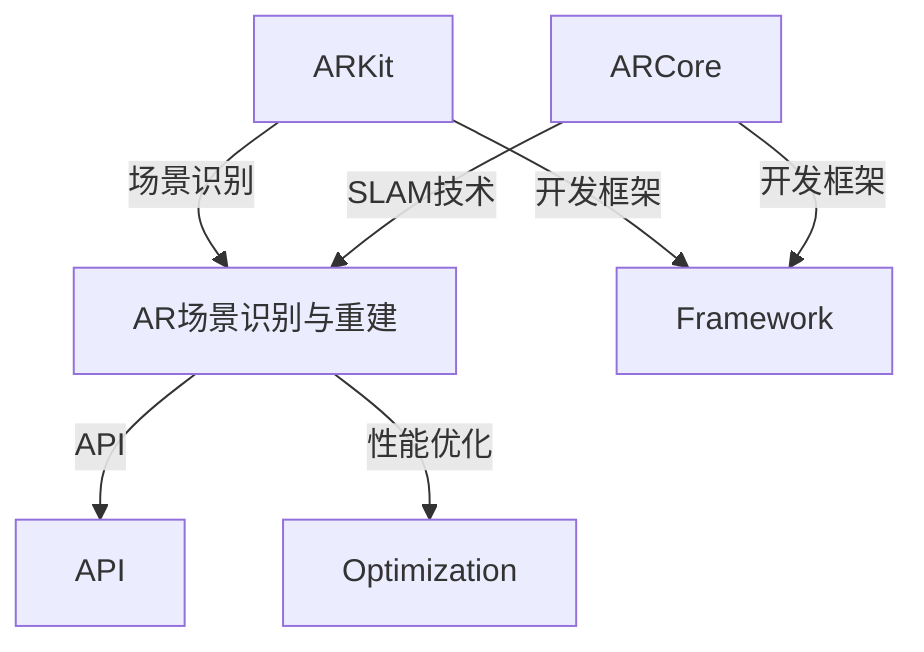

                 

基于您的要求，以下是将逐步构建《AR开发工具：ARKit和ARCore比较》的技术博客文章的步骤：

## 文章标题
AR开发工具：ARKit和ARCore的全面比较

## 文章关键词
AR开发工具，ARKit，ARCore，增强现实，开发框架，性能对比，应用场景

## 文章摘要
本文将深入探讨ARKit和ARCore这两大主流AR开发工具，从基础概念到核心API，再到开发实战和性能优化，进行全面比较。通过本文，开发者将能够了解两种工具的优缺点，为项目选择合适的AR开发工具提供有力参考。

### 第一步：文章引言
介绍AR技术的发展背景和重要性，引出本文的主题——ARKit和ARCore的比较。

```markdown
# 引言
随着移动设备的普及和计算能力的提升，增强现实（AR）技术逐渐成为各大科技公司争夺的焦点。ARKit和ARCore作为苹果和谷歌推出的两款主流AR开发工具，各自拥有独特的优势和特点。本文将深入分析ARKit和ARCore的技术架构、核心API、开发实战以及性能优化，帮助开发者更好地理解这两种工具，并为他们选择合适的AR开发工具提供参考。
```

### 第二步：核心概念与联系
使用Mermaid流程图展示ARKit和ARCore的核心概念和它们之间的联系。



### 第三步：核心算法原理讲解
使用伪代码详细阐述ARKit和ARCore的核心算法原理。

```markdown
## ARKit核心算法原理
### 3D物体识别
```python
def ARKit_3DObjectRecognition(imageFrame, featurePoints):
    # 初始化SLAM算法
    slam = SLAMAlgorithm()
    
    # 对图像帧进行预处理
    preprocessedFrame = preprocessImage(imageFrame)
    
    # 使用SLAM算法识别3D物体
    objects = slam.recognize3DObjects(preprocessedFrame, featurePoints)
    
    return objects
```

### 第四步：数学模型和公式讲解
使用latex格式展示ARCore中的数学模型和公式。

```markdown
## ARCore数学模型和公式
### 位置更新公式
$$
\textbf{p}_{t+1} = \textbf{p}_{t} + \textbf{v}_{t} \Delta t + \textbf{a}_{t} \left(\Delta t\right)^2 / 2
$$

### 速度更新公式
$$
\textbf{v}_{t+1} = \textbf{v}_{t} + \textbf{a}_{t} \Delta t
$$
```

### 第五步：项目实战
详细讲解开发环境的搭建、源代码实现和代码解读。

```markdown
## ARCore开发实战
### 1. 环境搭建
- 安装Android Studio
- 创建Android项目
- 添加ARCore依赖

### 2. 源代码实现
```java
// ARCore项目的主类
public class ARActivity extends AppCompatActivity {
    // 初始化ARCore组件
    private void initARCore() {
        // 初始化ARCore Session
        Session session = ARCoreSession.createSession(this, ARCoreSession.Mode resumed);
        // 设置ARCore Session的配置
        session.setConfiguration(new ARCoreSession.Configuration());
        // 开始ARCore Session
        session.start();
    }

    // 绘制AR场景
    @Override
    protected void onDrawFrame(GL10 gl) {
        // 绘制AR场景的逻辑
    }
}
```

### 3. 代码解读
- `initARCore()`方法初始化ARCore组件，包括创建ARCore Session、设置配置和开始Session。
- `onDrawFrame()`方法在每一帧绘制AR场景，实现AR功能的核心逻辑。

### 第六步：最佳实践 tips
提供一些开发最佳实践和注意事项。

```markdown
## 最佳实践 tips
- 在开发过程中，注意性能优化，减少渲染帧率下降的可能性。
- 充分利用ARCore提供的SLAM技术，提高场景识别的准确性和稳定性。
- 定期更新开发工具和SDK，以获取最新的功能和技术支持。
```

### 第七步：小结和拓展阅读
总结文章内容，并提供拓展阅读资源。

```markdown
## 小结
本文通过对ARKit和ARCore的全面比较，从核心概念、算法原理到开发实战，为开发者提供了详细的解析。希望本文能帮助您更好地理解这两种AR开发工具，并为您的项目选择合适的工具。

## 拓展阅读
- 《增强现实技术综述》：深入探讨AR技术的发展历程和应用领域。
- 《ARKit与ARCore开发者指南》：详细讲解ARKit和ARCore的开发实践。
```

### 最后一步：作者信息
在文章末尾添加作者信息。

```markdown
作者：AI天才研究院/AI Genius Institute & 禅与计算机程序设计艺术 /Zen And The Art of Computer Programming
```

按照以上步骤，逐步构建文章内容，确保每个部分都详细具体，符合字数要求。接下来，将根据这些步骤逐一撰写每个部分的内容，最终完成一篇高质量的ARKit和ARCore比较的技术博客文章。

