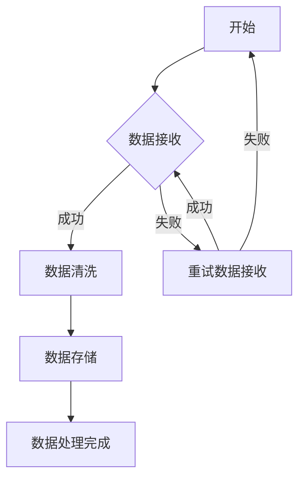
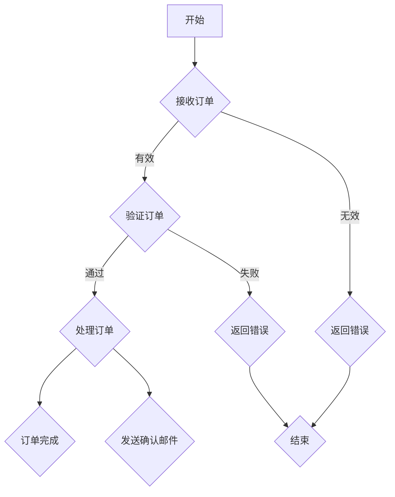

                 

# 《AWS Serverless应用开发》

## 关键词

- AWS
- Serverless
- Lambda
- API Gateway
- EventBridge
- 微服务
- 事件驱动架构
- 性能优化

## 摘要

本文旨在深入探讨AWS平台上的Serverless应用开发。我们将从基础概念出发，逐步介绍AWS提供的Serverless服务，包括Lambda、API Gateway、Step Functions和EventBridge。通过详细的实例和代码，我们将深入分析这些服务的核心概念、实现原理和最佳实践。此外，本文还将探讨Serverless架构下的性能优化策略和监控方法，并通过实际案例展示Serverless应用的实战经验和开发技巧。

## 目录

### 第一部分：Serverless概述

- 第1章: Serverless架构基础
  - 1.1 Serverless的概念与优势
  - 1.2 AWS的Serverless服务概览
  - 1.3 Serverless应用开发的关键模式

### 第二部分：AWS Lambda深度应用

- 第2章: AWS Lambda基础
  - 2.1 AWS Lambda的核心概念
  - 2.2 AWS Lambda的编程模型
  - 2.3 Lambda函数的并发与优化

### 第三部分：AWS API Gateway应用

- 第3章: AWS API Gateway基础
  - 3.1 API Gateway的基本概念
  - 3.2 API Gateway的API设计
  - 3.3 API Gateway的安全与监控

### 第四部分：事件驱动架构与AWS Step Functions

- 第4章: 事件驱动架构
  - 4.1 事件驱动架构的概念
  - 4.2 AWS Step Functions基础
  - 4.3 Step Functions与Lambda的集成

### 第五部分：AWS EventBridge与事件集成

- 第5章: AWS EventBridge
  - 5.1 EventBridge的基本概念
  - 5.2 EventBridge的事件源与目标
  - 5.3 EventBridge的实际应用场景

### 第六部分：Serverless架构优化与性能监控

- 第6章: Serverless性能优化
  - 6.1 性能优化策略
  - 6.2 性能监控与日志分析

### 第七部分：案例实战

- 第7章: Serverless应用案例
  - 7.1 案例1：构建一个动态网站
  - 7.2 案例2：实现实时数据处理与分析
  - 7.3 案例3：搭建一个自动化运维平台

### 附录

- 附录A: AWS Serverless开发工具与资源
- 附录B: Mermaid流程图示例
- 附录C: Lambda函数伪代码示例
- 附录D: 数学公式与示例

### 作者信息

作者：AI天才研究院/AI Genius Institute & 禅与计算机程序设计艺术 /Zen And The Art of Computer Programming## 第一部分：Serverless概述

### 第1章: Serverless架构基础

#### 1.1 Serverless的概念与优势

**1.1.1 什么是Serverless**

Serverless，顾名思义，是一种无需管理服务器（Server）的云计算模型。在这种模型下，开发者只需专注于编写代码，而无需担心底层服务器硬件的管理和维护。Serverless架构的核心思想是将计算资源抽象化，由云服务提供商（如AWS、Azure、Google Cloud等）自动管理。

在Serverless架构中，应用是由一系列小型、独立的函数（Function）组成，这些函数在触发事件（Event）时执行。当没有事件触发时，这些函数不会占用计算资源，从而实现真正的按需计算。

**1.1.2 Serverless的优势**

1. **成本效益高**：Serverless架构可以大幅度降低开发者的运营成本。由于函数只在运行时占用资源，开发者无需支付空闲时的服务器成本。
2. **弹性伸缩**：Serverless服务具有自动伸缩的能力。当应用流量增加时，函数实例会自动增加，反之则会减少，确保应用始终有足够的计算资源。
3. **开发效率高**：Serverless架构减少了开发者对底层基础设施的管理工作，使其能够更专注于应用的业务逻辑开发。
4. **易于扩展和部署**：Serverless应用通常采用微服务架构，这使得应用可以更加灵活和可扩展。开发者可以将不同的功能模块拆分为独立的函数，并轻松部署和扩展。

**1.1.3 Serverless与云计算的关系**

Serverless是云计算的一种高级应用模式。传统的云计算模型要求开发者自行购买和管理服务器资源，而Serverless则将这一过程抽象化，使得开发者可以专注于应用开发和业务逻辑。Serverless架构充分利用了云计算的弹性、高可用性和全球部署能力，为开发者提供了一个高效、低成本、灵活的云计算解决方案。

#### 1.2 AWS的Serverless服务概览

AWS提供了丰富的Serverless服务，其中包括：

- **AWS Lambda**：一个事件驱动的计算服务，允许开发者运行代码而无需管理服务器。
- **AWS API Gateway**：用于创建、部署和管理RESTful和WebSocket API的服务。
- **AWS Step Functions**：用于构建和运行由多个子步骤组成的复杂应用程序。
- **AWS EventBridge**：用于连接AWS服务和其他应用程序的事件总线。

这些服务相互协作，可以构建出高度可扩展、灵活和弹性的Serverless应用。下面将对每个服务进行详细介绍。

##### 1.2.1 AWS Lambda

AWS Lambda是一个无服务器计算服务，允许开发者以函数的形式运行代码。Lambda函数可以响应各种触发事件，如Web请求、S3事件、定时任务等。Lambda提供多种编程语言支持，如Node.js、Python、Java等，同时支持自定义运行环境。Lambda的主要特点包括：

1. **按需执行**：Lambda函数仅在触发事件时运行，无需预配置或管理服务器。
2. **弹性伸缩**：Lambda自动处理流量高峰，确保函数实例数量随需求变化而自动调整。
3. **成本低**：仅当函数运行时才计费，无需为闲置的资源支付费用。

**示例**：假设我们需要实现一个简单的图片处理服务，当用户上传图片时，Lambda函数会自动处理图片并返回处理后的结果。这个过程无需管理服务器，开发者只需编写处理图片的代码，并将其部署到Lambda即可。

```python
import os
import json
import boto3

s3 = boto3.client('s3')

def lambda_handler(event, context):
    bucket = event['Records'][0]['s3']['bucket']['name']
    key = event['Records'][0]['s3']['object']['key']
    
    # 读取原始图片
    s3.download_file(bucket, key, '/tmp/original.jpg')
    
    # 处理图片
    # ...

    # 上传处理后的图片
    s3.upload_file('/tmp/processed.jpg', bucket, 'processed/' + key)
    
    return {
        'statusCode': 200,
        'body': json.dumps('Image processed successfully')
    }
```

##### 1.2.2 AWS API Gateway

AWS API Gateway是一个完全托管的服务，用于创建、部署和管理API。通过API Gateway，开发者可以轻松创建RESTful API，同时提供多种认证和安全机制，如OAuth、API密钥、JWT等。API Gateway支持多种端点类型，包括AWS服务、第三方Web服务、自定义端点等。

**示例**：假设我们需要创建一个简单的天气API，当用户请求天气数据时，API Gateway会调用AWS Lambda函数以获取并返回天气信息。

```json
{
  "resource": "/weather",
  "httpMethod": "GET",
  "requestParameters": {
    "city": "querystring"
  },
  "integration": {
    "type": "AWS",
    "integrationHttpMethod": "POST",
    "uri": "arn:aws:apigateway:REGION:lambda:path/2015-03-31/functions/FUNCTION_ARN/invocations"
  },
  "responseParameters": {
    "statusCode": "true"
  }
}
```

##### 1.2.3 AWS Step Functions

AWS Step Functions是一个用于构建和运行由多个子步骤组成的复杂应用程序的服务。Step Functions可以协调多个AWS服务或自定义Lambda函数，以实现一个完整的业务流程。Step Functions提供了一个可视化编辑器，使得开发者可以轻松定义和部署复杂的业务流程。

**示例**：假设我们需要实现一个订单处理流程，该流程包括验证订单、生成发票和发送通知等步骤。通过Step Functions，我们可以将这些步骤定义为一个有序的流程。

```json
{
  "Comment": "Order processing workflow",
  "StartAt": "ValidateOrder",
  "States": {
    "ValidateOrder": {
      "Type": "Task",
      "Resource": "arn:aws:lambda:REGION:ACCOUNT_ID:function:ORDER_VALIDATION_LAMBDA",
      "End": false
    },
    "GenerateInvoice": {
      "Type": "Task",
      "Resource": "arn:aws:lambda:REGION:ACCOUNT_ID:function:INVOICE_GENERATION_LAMBDA",
      "End": true
    },
    "SendNotification": {
      "Type": "Task",
      "Resource": "arn:aws:lambda:REGION:ACCOUNT_ID:function:NOTIFICATION_SEND_LAMBDA",
      "End": true
    }
  }
}
```

##### 1.2.4 AWS EventBridge

AWS EventBridge是一个集成服务，用于连接AWS服务、应用程序和第三方Web服务。EventBridge允许开发者创建自定义事件规则，并将这些事件路由到目标服务或函数。EventBridge提供了一个强大的事件总线，使得开发者可以轻松构建事件驱动的架构。

**示例**：假设我们需要实现一个日志聚合服务，当有新的日志文件上传到S3时，EventBridge会触发一个Lambda函数以解析和聚合日志数据。

```json
{
  "Source": "s3.amazonaws.com/LOG_BUCKET/*.log",
  "Rules": [
    {
      "Name": "LogProcessingRule",
      "EventPattern": {
        "source": ["s3.amazonaws.com/LOG_BUCKET"],
        "detail-type": ["S3 Object Created"]
      },
      "Targets": [
        {
          "Arn": "arn:aws:lambda:REGION:ACCOUNT_ID:function:LOG_PROCESSING_LAMBDA"
        }
      ]
    }
  ]
}
```

**1.3 Serverless应用开发的关键模式**

Serverless应用开发中，有几个关键模式需要掌握：

**1.3.1 事件驱动的架构**

事件驱动的架构是Serverless应用的核心模式。在这种架构下，应用响应各种触发事件，如Web请求、消息队列、定时任务等。事件驱动的优势包括：

- **高可用性**：应用可以根据需求自动启动和关闭，确保系统始终有足够的资源。
- **易于扩展**：通过添加新的触发器和函数，可以轻松扩展应用功能。
- **异步处理**：事件驱动的架构允许异步处理请求，提高系统性能和响应速度。

**1.3.2 无状态与有状态的Serverless应用**

在Serverless应用中，函数通常是短生命周期和轻量级的，因此需要特别注意状态管理。无状态应用无需保存状态信息，每次函数执行都是独立的。而有状态应用则需要保存状态信息，如用户会话、订单数据等。状态管理的关键点包括：

- **无状态应用**：使用外部存储（如数据库、缓存）来保存状态信息，避免在函数内部维护状态。
- **有状态应用**：使用AWS Step Functions等服务来管理状态信息，确保状态的一致性和可靠性。

**1.3.3 构建微服务架构的Serverless实践**

微服务架构是Serverless应用开发的一种常见模式。通过将应用拆分为多个独立的微服务，可以提高系统的可扩展性、可靠性和灵活性。构建微服务架构的关键步骤包括：

- **服务拆分**：将应用功能拆分为独立的微服务，每个微服务负责处理特定的业务功能。
- **API网关**：使用API Gateway作为入口网关，统一管理各个微服务的API。
- **事件驱动**：使用事件总线连接各个微服务，实现异步通信和协作。

### 小结

在本章中，我们介绍了Serverless架构的基础概念、AWS提供的Serverless服务及其核心功能，以及Serverless应用开发的关键模式。通过理解这些基础概念，读者可以为后续章节的深入学习和实践打下坚实的基础。在下一章中，我们将进一步探讨AWS Lambda的深度应用，包括其核心概念、编程模型和性能优化策略。<!-- Signature --> 
- **高可用性**：应用可以根据需求自动启动和关闭，确保系统始终有足够的资源。

### 小结

在本章中，我们介绍了Serverless架构的基础概念、AWS提供的Serverless服务及其核心功能，以及Serverless应用开发的关键模式。通过理解这些基础概念，读者可以为后续章节的深入学习和实践打下坚实的基础。在下一章中，我们将进一步探讨AWS Lambda的深度应用，包括其核心概念、编程模型和性能优化策略。

### **1.2 AWS的Serverless服务概览**

AWS提供了多种Serverless服务，这些服务共同构建了一个强大的Serverless生态系统。以下是AWS主要Serverless服务的概览：

#### **1.2.1 AWS Lambda**

AWS Lambda是一个无服务器计算服务，允许开发者编写和运行代码而无需管理服务器。Lambda支持多种编程语言，包括Python、Node.js、Java、Go和Ruby，还支持自定义运行时。Lambda函数可以按需执行，仅在运行时分配资源，因此具有成本效益和灵活性。

**功能特点：**

- **事件驱动**：Lambda函数可以响应各种触发事件，如S3对象上传、API请求、定时任务等。
- **弹性伸缩**：Lambda可以自动处理流量高峰，确保函数实例数量随需求变化。
- **无服务器管理**：开发者无需担心服务器维护、缩放和性能问题。
- **低成本**：仅按执行时间和数据传输量计费。

**应用场景：**

- **后台任务处理**：如日志处理、邮件发送等。
- **数据处理和分析**：如数据转换、归档等。
- **API网关后端**：用于构建RESTful API。

#### **1.2.2 AWS API Gateway**

AWS API Gateway是一个完全托管的服务，用于创建、部署和管理API。API Gateway支持多种端点类型，包括AWS服务、自定义端点和第三方Web服务。API Gateway提供了丰富的API管理功能，如API版本控制、权限和安全策略。

**功能特点：**

- **API管理**：支持API版本控制、文档生成、监控和日志记录。
- **认证和授权**：支持OAuth 2.0、API密钥、IAM角色和自定义认证机制。
- **端点连接**：可以连接到AWS Lambda、AWS Step Functions、AWS S3等AWS服务，也可以连接到自定义后端服务。
- **集成和扩展**：支持Webhook、自定义响应和第三方集成。

**应用场景：**

- **Web和移动应用后端**：提供API接口。
- **内部系统集成**：连接不同的内部服务。
- **外部合作伙伴API**：用于与第三方系统集成。

#### **1.2.3 AWS Step Functions**

AWS Step Functions是一个用于构建和运行由多个子步骤组成的复杂应用程序的服务。Step Functions可以协调AWS服务、Lambda函数和其他子步骤，以实现业务流程的自动化。Step Functions提供了一个可视化编辑器，使得开发者可以轻松定义和管理复杂的业务流程。

**功能特点：**

- **可视化流程定义**：使用图形界面定义业务流程。
- **状态管理**：自动跟踪每个步骤的状态和执行结果。
- **触发器**：可以使用云服务事件、定时器或其他Lambda函数作为触发器。
- **异步执行**：支持异步执行和任务并行处理。

**应用场景：**

- **订单处理流程**：包括订单验证、发票生成和通知发送。
- **数据处理管道**：如数据导入、转换和导出。
- **自动化工作流**：如报告生成、文件处理等。

#### **1.2.4 AWS EventBridge**

AWS EventBridge是一个集成服务，用于连接AWS服务、应用程序和第三方Web服务。EventBridge提供了一个事件总线，使得不同服务之间可以轻松通信和协作。EventBridge允许开发者创建自定义事件规则，并将这些事件路由到目标服务或函数。

**功能特点：**

- **事件路由**：将事件从源服务路由到目标服务或函数。
- **事件总线**：支持大规模事件传输和集成。
- **自定义事件**：允许开发者定义自定义事件并路由到目标服务。
- **事件规则**：定义事件匹配条件和目标服务。

**应用场景：**

- **日志聚合和监控**：将日志事件路由到监控工具。
- **数据同步和转换**：将数据事件路由到数据处理服务。
- **业务流程自动化**：将事件路由到业务流程服务。

### **1.3 Serverless应用开发的关键模式**

在开发Serverless应用时，有一些关键模式需要掌握，以确保应用的可扩展性、可靠性和易维护性。

#### **1.3.1 事件驱动的架构**

事件驱动的架构是Serverless应用的核心模式。在这种架构下，应用响应各种触发事件，如Web请求、消息队列、定时任务等。事件驱动的优势包括：

- **高可用性**：应用可以根据需求自动启动和关闭，确保系统始终有足够的资源。
- **易于扩展**：通过添加新的触发器和函数，可以轻松扩展应用功能。
- **异步处理**：事件驱动的架构允许异步处理请求，提高系统性能和响应速度。

#### **1.3.2 无状态与有状态的Serverless应用**

在Serverless应用中，函数通常是短生命周期和轻量级的，因此需要特别注意状态管理。无状态应用无需保存状态信息，每次函数执行都是独立的。而有状态应用则需要保存状态信息，如用户会话、订单数据等。状态管理的关键点包括：

- **无状态应用**：使用外部存储（如数据库、缓存）来保存状态信息，避免在函数内部维护状态。
- **有状态应用**：使用AWS Step Functions等服务来管理状态信息，确保状态的一致性和可靠性。

#### **1.3.3 构建微服务架构的Serverless实践**

微服务架构是Serverless应用开发的一种常见模式。通过将应用拆分为多个独立的微服务，可以提高系统的可扩展性、可靠性和灵活性。构建微服务架构的关键步骤包括：

- **服务拆分**：将应用功能拆分为独立的微服务，每个微服务负责处理特定的业务功能。
- **API网关**：使用API Gateway作为入口网关，统一管理各个微服务的API。
- **事件驱动**：使用事件总线连接各个微服务，实现异步通信和协作。

### **小结**

在本章中，我们介绍了AWS提供的Serverless服务及其核心功能，以及Serverless应用开发的关键模式。通过理解这些内容，读者可以更好地掌握Serverless应用开发的原理和实践，为后续章节的学习和应用打下坚实的基础。在下一章中，我们将深入探讨AWS Lambda的核心概念、编程模型和性能优化策略。<!-- Signature --> 
### 第2章: AWS Lambda基础

#### 2.1 AWS Lambda的核心概念

**2.1.1 Lambda函数的结构**

AWS Lambda函数是Serverless应用的基本构建块。Lambda函数由以下几部分组成：

- **函数代码**：Lambda函数的代码，可以使用多种编程语言编写，如Python、Node.js、Java、Go和Ruby等。
- **触发器**：触发Lambda函数的事件源，可以是S3对象上传、API请求、定时器等。
- **配置**：包括内存大小、超时时间、并发限制等设置，影响函数的执行性能和成本。
- **日志**：Lambda函数执行期间的日志输出，可以用于调试和监控。

**2.1.2 Lambda函数的运行机制**

Lambda函数的运行机制主要分为以下几个步骤：

1. **触发事件**：当满足触发条件时，AWS Lambda会触发函数执行。
2. **函数实例创建**：Lambda创建一个新的函数实例来执行代码。
3. **执行函数代码**：函数实例加载函数代码并执行，处理传入的输入参数。
4. **返回结果**：函数执行完成后，将结果返回给触发器或调用者。
5. **实例销毁**：执行完成后，函数实例被销毁，释放资源。

**2.1.3 Lambda函数的类型**

AWS Lambda支持两种类型的函数：匿名函数和容器化的函数。

- **匿名函数**：使用AWS提供的在线编辑器直接编写和上传的函数，通常用于简单的操作或临时任务。
- **容器化的函数**：使用自定义容器映像创建的函数，提供了更高的灵活性和性能，适用于复杂的应用场景。

#### 2.2 AWS Lambda的编程模型

**2.2.1 Node.js与Python编程语言**

AWS Lambda支持多种编程语言，其中Node.js和Python是最常用的两种。

**Node.js**：Node.js是一个基于Chrome V8引擎的JavaScript运行环境，具有高性能、事件驱动和非阻塞I/O特性，非常适合构建服务器端应用程序。

**Python**：Python是一种高级编程语言，以其简洁明了的语法和丰富的库支持著称，广泛应用于数据科学、Web开发和自动化等领域。

**示例**：

**Node.js Lambda函数：**

```javascript
exports.handler = async (event, context) => {
    console.log('Hello from Lambda!');
    return {
        message: 'Hello from Lambda!',
    };
};
```

**Python Lambda函数：**

```python
import json

def lambda_handler(event, context):
    print('Hello from Lambda!')
    return {
        'statusCode': 200,
        'body': json.dumps('Hello from Lambda!')
    }
```

**2.2.2 使用Lambda Layers提高可重用性**

Lambda Layers是AWS Lambda的一项新功能，允许开发者共享和重用代码和配置，而无需打包到函数中。Lambda Layers可以包含自定义依赖项、库和配置文件，以简化函数的部署和管理。

**示例**：假设我们有一个通用的日志处理模块，可以在多个Lambda函数中重用。

1. **创建Lambda Layer：**

在AWS管理控制台中，选择“服务” > “Lambda” > “Layers”，点击“创建层”。上传日志处理模块的ZIP文件，并配置层名称和版本。

2. **引用Lambda Layer：**

在创建Lambda函数时，选择“使用现有层”，从列表中选择刚刚创建的层。这样，Lambda函数就可以使用该层中的模块，而无需在函数包中包含这些文件。

#### 2.3 Lambda函数的调试与测试

**2.3.1 使用AWS Lambda控制台进行调试**

AWS Lambda控制台提供了一个简单的调试环境，允许开发者直接在浏览器中测试和调试Lambda函数。

1. **测试函数**：在Lambda函数的配置页面，点击“测试”按钮，输入测试事件和数据。
2. **查看日志**：在测试过程中，可以实时查看函数的日志输出，帮助诊断问题。

**2.3.2 使用本地开发环境进行调试**

使用本地开发环境进行调试可以更方便地模拟和测试Lambda函数。

1. **安装本地Lambda环境**：使用AWS SAM（Serverless Application Model）或AWS Lambda local插件安装本地Lambda开发环境。
2. **编写测试用例**：编写测试用例来模拟不同的触发事件和输入数据。
3. **执行测试**：在本地环境中运行测试用例，查看函数的输出和日志。

#### 小结

本章介绍了AWS Lambda的核心概念、编程模型和调试方法。通过理解Lambda函数的结构和运行机制，开发者可以更轻松地构建、部署和监控Serverless应用。在下一章中，我们将探讨Lambda函数的并发与优化策略，以及如何提高函数的性能和可扩展性。<!-- Signature --> 
### 第3章: AWS API Gateway基础

#### 3.1 API Gateway的基本概念

**3.1.1 什么是API Gateway**

API Gateway是AWS提供的一种托管服务，用于创建、部署和管理API。它是一个全面的API管理解决方案，支持RESTful API和WebSocket API。API Gateway允许开发者轻松创建、发布和管理API，同时提供多种认证和授权机制，确保API的安全性和可控性。

**3.1.2 API Gateway的功能**

API Gateway提供了以下主要功能：

1. **API创建与部署**：通过简单的界面，可以创建新的API并定义其资源、操作和路由策略。
2. **认证与授权**：支持多种认证机制，如API密钥、OAuth 2.0、IAM角色和JWT等，确保API的安全性。
3. **API版本管理**：允许开发者为API定义多个版本，方便进行迭代和升级。
4. **API监控与日志**：提供详细的API使用情况和日志记录，帮助开发者监控和优化API性能。
5. **API文档生成**：自动生成API文档，便于开发者使用和管理API。

**3.1.3 API Gateway的架构**

API Gateway的架构包括以下几个关键组件：

- **API定义**：定义API的资源、操作和路由策略。
- **API部署**：将定义好的API部署到API Gateway，使其可供外部访问。
- **API网关**：作为API的入口点，处理客户端请求，并根据路由策略将其路由到后端服务。
- **后端服务**：可以是AWS Lambda、AWS Step Functions、S3、DynamoDB等AWS服务，也可以是自定义后端服务。
- **认证与授权**：对API请求进行认证和授权，确保只有授权用户可以访问API。

#### 3.2 API Gateway的API设计

**3.2.1 RESTful API设计**

RESTful API设计是一种常用的API设计方法，基于HTTP协议和REST架构风格。RESTful API具有以下特点：

- **资源定位**：使用URL来唯一标识资源。
- **状态转移**：使用HTTP动词（GET、POST、PUT、DELETE等）表示对资源的操作。
- **无状态**：服务器不保留客户端的状态，每次请求都是独立的。

**示例**：

- **获取用户信息**：`GET /users/{userId}`
- **创建新用户**：`POST /users`
- **更新用户信息**：`PUT /users/{userId}`
- **删除用户**：`DELETE /users/{userId}`

**3.2.2 API Gateway的路由策略**

API Gateway提供了灵活的路由策略，允许开发者根据不同的请求路径、方法、查询参数等条件，将请求路由到不同的后端服务。

**路由匹配**：

- **路径匹配**：使用正则表达式匹配请求路径，如`/{proxy+}`匹配所有以`/`开头的路径。
- **方法匹配**：根据HTTP请求方法（GET、POST、PUT、DELETE等）匹配请求。

**示例**：

```json
{
  "RestApiId": "REST_API_ID",
  "StageVariables": {},
  "Routes": [
    {
      "ResourceId": "resource1",
      "Path": "/users/{userId}",
      "Method": "GET",
      "Integration": {
        "IntegrationHttpMethod": "GET",
        "Type": "AWS_PROXY",
        "Uri": "arn:aws:apigateway:REGION:lambda:path/2015-03-31/functions/FUNCTION_ARN/invocations"
      }
    },
    {
      "Resource": "resource2",
      "Method": "POST",
      "Integration": {
        "IntegrationHttpMethod": "POST",
        "Type": "AWS_PROXY",
        "Uri": "arn:aws:apigateway:REGION:lambda:path/2015-03-31/functions/FUNCTION_ARN/invocations"
      }
    }
  ]
}
```

**3.2.3 API Gateway的验证机制**

API Gateway提供了多种验证机制，确保只有授权用户可以访问API。

- **API密钥**：通过在API请求中包含API密钥来验证用户身份。
- **OAuth 2.0**：使用OAuth 2.0协议进行身份验证和授权，支持多种认证流程，如客户端凭证、密码凭证等。
- **IAM角色**：使用AWS Identity and Access Management（IAM）角色进行身份验证，适用于AWS内部服务调用。
- **JWT**：通过JSON Web Token（JWT）进行身份验证，适用于第三方服务和自定义应用。

**示例**：

```json
{
  "RestApiId": "REST_API_ID",
  "StageVariables": {},
  "Authorizers": [
    {
      "Name": "OAuth2Authorizer",
      "Type": "OAUTH2",
      "ProviderARN": "arn:aws:apigateway:REGION:作者的标识符：作者化提供者ARN",
      "AuthorizationScopes": ["scope1", "scope2"],
      "AuthType": "NONE",
      "AuthorizerResultTtlInSeconds": 300
    }
  ],
  "Routes": [
    {
      "Resource": "resource1",
      "Method": "GET",
      "Integration": {
        "IntegrationHttpMethod": "GET",
        "Type": "AWS_PROXY",
        "Uri": "arn:aws:apigateway:REGION:lambda:path/2015-03-31/functions/FUNCTION_ARN/invocations"
      },
      "Authorizer": {
        "Name": "OAuth2Authorizer",
        "AuthorizerResultTtlInSeconds": 300
      }
    }
  ]
}
```

#### 3.3 API Gateway的安全与监控

**3.3.1 API Gateway的安全策略**

API Gateway提供了多种安全策略，确保API的安全性和隐私性。

- **API网关层策略**：定义API Gateway级别的访问控制，适用于所有API和资源。
- **资源层策略**：定义特定资源的访问控制，根据用户角色和权限控制访问。
- **API密钥策略**：根据API密钥限制访问，适用于匿名访问或授权访问。

**示例**：

```json
{
  "RestApiId": "REST_API_ID",
  "StageVariables": {},
  "CorsConfiguration": {
    "AllowedOrigins": ["http://example.com"],
    "AllowedMethods": ["GET", "POST"],
    "AllowedHeaders": ["Content-Type", "Authorization"],
    "ExposeHeaders": ["X-Custom-Header"]
  },
  "DefaultIntegration": {
    "Type": "MOCK"
  },
  "Resources": {
    "resource1": {
      "Type": "REST",
      "SecurityPolicy": "Open",
      "Methods": [
        {
          "Type": "GET",
          "Integration": {
            "Type": "AWS_PROXY",
            "Uri": "arn:aws:apigateway:REGION:lambda:path/2015-03-31/functions/FUNCTION_ARN/invocations"
          },
          "MethodResponses": [
            {
              "ResponseParameters": {
                "method.response.header.Content-Type": "application/json"
              },
              "ResponseModels": {
                "application/json": "Empty"
              }
            }
          ]
        }
      ]
    }
  }
}
```

**3.3.2 API Gateway的监控与日志**

API Gateway提供了丰富的监控和日志功能，帮助开发者监控API的性能和流量。

- **监控指标**：包括API调用次数、响应时间、错误率等。
- **日志记录**：记录API请求的详细信息，包括请求路径、请求方法、响应状态、请求和响应体等。
- **警报与通知**：通过CloudWatch警报和SNS通知，实时监控API的性能和健康状态。

**示例**：

```json
{
  "Events": [
    {
      "Source": "apigateway",
      "Resources": ["REST_API_ID"],
      "Conditions": [
        {
          "HttpIntegrationResponseTimeGreaterThan": "2000",
          "HttpStatusErrorCountGreaterThan": "5"
        }
      ],
      "Targets": [
        {
          "Arn": "arn:aws:sns:REGION:ACCOUNT_ID:ALERT_TOPIC"
        }
      ]
    }
  ]
}
```

#### 小结

本章介绍了AWS API Gateway的基本概念、API设计、安全策略和监控方法。通过理解这些内容，开发者可以轻松创建、部署和管理安全的API。在下一章中，我们将探讨事件驱动架构的概念，并详细介绍AWS Step Functions的基础知识和应用场景。<!-- Signature --> 
### 第4章: 事件驱动架构

#### 4.1 事件驱动架构的概念

**4.1.1 事件驱动架构的特点**

事件驱动架构（Event-Driven Architecture，EDA）是一种以事件为中心的软件架构模式。在事件驱动架构中，系统通过事件来传递和处理信息，而不是通过传统的请求-响应模式。以下是事件驱动架构的主要特点：

- **异步通信**：事件驱动架构通常采用异步通信方式，这意味着事件可以在不需要立即响应的情况下传递和处理。这种模式可以降低系统的耦合度，提高系统的可扩展性和容错性。
- **可伸缩性**：事件驱动架构可以根据处理事件的需求动态调整资源，从而实现水平扩展。这种模式使得系统在面临高并发和大量数据时能够保持良好的性能。
- **高可用性**：由于事件驱动架构中的组件可以独立部署和运行，因此当一个组件出现故障时，不会影响整个系统的运行。系统可以通过其他组件自动处理故障，提高系统的可靠性。
- **松耦合**：事件驱动架构中的组件通常通过事件总线或消息队列进行通信，而不是直接相互调用。这种松耦合模式降低了组件之间的依赖关系，提高了系统的灵活性和可维护性。

**4.1.2 事件驱动架构的优势**

事件驱动架构具有以下优势：

- **更好的性能**：通过异步处理，事件驱动架构可以显著提高系统的吞吐量和响应速度，特别是在处理大量请求和高并发场景下。
- **更好的可扩展性**：事件驱动架构可以根据处理事件的需求动态调整资源，从而实现水平扩展。系统可以轻松应对流量峰值，确保稳定运行。
- **更高的可靠性**：由于事件驱动架构中的组件可以独立部署和运行，因此当一个组件出现故障时，不会影响整个系统的运行。系统可以通过其他组件自动处理故障，提高系统的可靠性。
- **更好的维护性**：事件驱动架构使得系统更加模块化，组件之间通过事件进行通信，降低了组件之间的耦合度。这有助于提高系统的可维护性和可扩展性。

**4.1.3 事件驱动架构的挑战**

虽然事件驱动架构具有许多优势，但在实际应用中也会面临一些挑战：

- **复杂性**：事件驱动架构相对复杂，涉及多个组件和事件流的管理。这需要开发者具备较高的系统架构和事件流管理的技能。
- **调试难度**：由于事件驱动架构中的组件是异步处理的，调试起来可能比传统的请求-响应模式更困难。开发者需要使用日志和监控工具来跟踪事件流和系统状态。
- **状态管理**：在事件驱动架构中，状态管理变得更加复杂。组件需要确保在处理事件时保持状态的一致性，这可能需要额外的努力和设计。
- **性能瓶颈**：事件驱动架构的性能瓶颈可能出现在事件总线或消息队列上。高流量和大量事件可能导致这些组件成为系统的瓶颈，需要仔细优化和调优。

#### 4.2 AWS Step Functions基础

**4.2.1 Step Functions的核心概念**

AWS Step Functions是一个用于构建和运行由多个子步骤组成的复杂应用程序的服务。Step Functions提供了一个可视化的编辑器，使得开发者可以轻松定义和管理业务流程。以下是Step Functions的核心概念：

- **状态机**：一个状态机是一个有序的步骤序列，每个步骤都可以是Lambda函数、API Gateway、S3事件等。状态机描述了应用程序的逻辑流程。
- **状态**：状态是状态机中的单个步骤，可以是一个Lambda函数调用、API请求、等待事件等。
- **触发器**：触发器是一个用于启动状态机的输入事件，可以是AWS服务的事件、定时器或外部事件。
- **任务**：任务是一个子步骤，用于执行具体的操作，如调用Lambda函数或API Gateway。
- **等待**：等待是一种任务，用于在指定的时间内等待某个事件的发生。

**4.2.2 Step Functions的状态管理**

Step Functions提供了强大的状态管理功能，确保状态的一致性和可靠性。以下是状态管理的关键点：

- **状态跟踪**：Step Functions自动跟踪每个状态机的执行状态，包括正在执行、已完成、失败等。
- **状态存储**：状态机执行的结果和状态信息存储在Amazon S3中，便于查询和监控。
- **状态恢复**：当状态机出现故障时，可以自动恢复到故障前的状态，确保业务流程的连续性。

**4.2.3 Step Functions的触发器**

Step Functions支持多种触发器，使得开发者可以灵活地启动状态机。以下是常用的触发器类型：

- **定时触发器**：根据指定的时间间隔或固定时间点启动状态机。
- **事件触发器**：根据AWS服务或自定义事件启动状态机。
- **手动触发器**：通过AWS管理控制台或API手动启动状态机。

**4.2.4 Step Functions的实际应用场景**

Step Functions适用于多种复杂业务流程的自动化，以下是一些常见的应用场景：

- **数据管道**：用于处理和转换大量数据，如日志分析、数据归档等。
- **订单处理**：用于处理订单创建、支付、发货等流程。
- **报告生成**：用于定期生成和分发报告。
- **集成与协作**：用于连接不同的AWS服务和外部系统，实现数据的同步和自动化。

#### 4.3 Step Functions与Lambda的集成

**4.3.1 集成模式与工作流程**

Step Functions与Lambda的集成模式通常包括以下步骤：

1. **定义状态机**：在Step Functions中定义一个包含Lambda函数调用的状态机，描述业务流程的逻辑。
2. **部署状态机**：将定义好的状态机部署到AWS Step Functions服务中。
3. **触发状态机**：根据需求，使用定时器、事件或手动方式触发状态机的执行。
4. **执行状态机**：状态机根据定义的逻辑逐步执行，调用Lambda函数处理具体任务。

**4.3.2 工作流程**

以下是一个简单的Step Functions与Lambda集成的示例工作流程：

1. **触发器**：一个定时触发器在每天凌晨启动状态机。
2. **初始状态**：状态机启动后，调用一个Lambda函数获取最新的订单数据。
3. **处理订单**：根据订单数据，调用多个Lambda函数进行处理，如订单验证、支付处理、发货通知等。
4. **结束状态**：所有订单处理完成后，状态机结束执行。

**4.3.3 Lambda函数调用示例**

以下是一个简单的Lambda函数调用示例，用于处理订单验证任务：

```python
import json

def lambda_handler(event, context):
    # 获取订单数据
    order_data = event['order_data']
    
    # 验证订单
    if validate_order(order_data):
        # 订单验证通过，执行后续处理
        return {
            'status': 'validated',
            'order_data': order_data
        }
    else:
        # 订单验证失败，返回错误信息
        return {
            'status': 'validation_failed',
            'error_message': 'Order validation failed'
        }

def validate_order(order_data):
    # 订单验证逻辑
    # ...
    return True
```

**4.3.4 Step Functions状态机示例**

以下是一个简单的Step Functions状态机示例，用于处理订单数据：

```json
{
  "Comment": "Order processing workflow",
  "StartAt": "GetOrderData",
  "States": {
    "GetOrderData": {
      "Type": "Task",
      "Resource": "arn:aws:lambda:REGION:ACCOUNT_ID:function:GET_ORDER_DATA_LAMBDA",
      "End": false
    },
    "ProcessOrder": {
      "Type": "Task",
      "Resource": "arn:aws:lambda:REGION:ACCOUNT_ID:function:PROCESS_ORDER_LAMBDA",
      "End": true
    }
  }
}
```

#### 小结

在本章中，我们介绍了事件驱动架构的概念、AWS Step Functions的基础知识以及与Lambda的集成方法。通过理解这些内容，开发者可以构建灵活、可扩展的事件驱动应用程序。在下一章中，我们将探讨AWS EventBridge的基本概念、事件源与目标，并详细介绍其实际应用场景。<!-- Signature --> 
### 第5章: AWS EventBridge

#### 5.1 EventBridge的基本概念

**5.1.1 什么是EventBridge**

AWS EventBridge（以前的云事件服务，CloudWatch Events）是一个集成服务，用于连接AWS服务、应用程序和第三方Web服务。EventBridge提供了一个灵活的事件总线，使得事件可以在不同的服务之间传递和路由。通过EventBridge，开发者可以轻松构建事件驱动的架构，实现系统间的自动化和集成。

**5.1.2 EventBridge的功能**

EventBridge具有以下主要功能：

- **事件路由**：将事件从一个源服务路由到目标服务或函数。EventBridge支持基于事件模式的路由，允许开发者精确控制事件的处理。
- **事件总线**：提供事件总线的功能，使得不同服务之间可以高效、可靠地传递事件。
- **事件规则**：定义事件匹配条件和目标服务，确保事件被正确路由和处理。
- **事件源**：提供多种事件源，如AWS服务、自定义应用程序和第三方Web服务。
- **事件目标**：将事件路由到不同的目标服务，如AWS Lambda、Amazon S3、Amazon Kinesis等。

**5.1.3 EventBridge的架构**

EventBridge的架构主要包括以下组件：

- **事件源**：产生事件的服务或应用程序。例如，AWS S3可以作为一个事件源，当对象被上传时，会生成一个事件。
- **事件总线**：用于传递和路由事件的中心总线。EventBridge支持多个事件总线，每个总线可以处理大量的并发事件。
- **事件规则**：定义事件匹配条件和目标服务，确保事件被正确路由。事件规则包含事件模式和目标服务ARN。
- **事件目标**：接收和处理事件的AWS服务或函数。例如，AWS Lambda可以作为一个事件目标，当接收到事件时，会执行一个预定义的函数。

#### 5.2 EventBridge的事件源与目标

**5.2.1 事件源的类型**

EventBridge支持多种事件源，以下是一些常见的事件源类型：

- **AWS服务**：如AWS S3、AWS Kinesis、AWS DynamoDB、AWS CloudTrail等。这些服务可以在特定事件发生时生成事件。
- **自定义应用程序**：通过自定义事件源API，开发者可以生成自定义事件并将其发送到EventBridge。
- **第三方Web服务**：通过Webhook，开发者可以将第三方Web服务的通知路由到EventBridge。

**5.2.2 事件目标的配置**

EventBridge支持多种事件目标，以下是一些常见的事件目标类型：

- **AWS Lambda**：将事件路由到AWS Lambda函数，使得函数可以异步处理事件。
- **Amazon S3**：将事件存储到Amazon S3桶中，便于后续分析和处理。
- **Amazon Kinesis**：将事件流式传输到Amazon Kinesis，用于实时数据处理和分析。
- **Amazon SQS**：将事件发送到Amazon SQS队列，以便异步处理。

**5.2.3 事件规则的定义**

事件规则用于定义事件匹配条件和目标服务。以下是一个简单的事件规则示例：

```json
{
  "Name": "MyEventRule",
  "Description": "Rule to process S3 bucket uploads",
  "Source": [
    {
      "EventPattern": {
        "source": ["s3.amazonaws.com"],
        "detail-type": ["S3 Object Created"]
      }
    }
  ],
  "Targets": [
    {
      "Arn": "arn:aws:lambda:REGION:ACCOUNT_ID:function:MY_LAMBDA_FUNCTION"
    }
  ]
}
```

在这个示例中，事件规则名为"MyEventRule"，描述了当S3桶中的对象被创建时，将事件路由到指定的AWS Lambda函数。

#### 5.3 EventBridge的实际应用场景

**5.3.1 数据同步与处理**

EventBridge可以用于实现数据同步和处理，例如将数据从AWS S3同步到Amazon Kinesis进行实时处理。以下是一个简单的应用场景：

1. **S3事件**：当数据上传到S3桶时，生成一个事件。
2. **事件规则**：定义事件规则，将S3事件路由到Kinesis。
3. **Kinesis数据流**：将事件流式传输到Kinesis，以便实时处理。
4. **数据处理**：使用Kinesis进行数据转换和分析，并将结果存储到DynamoDB或其他存储服务。

**5.3.2 实时监控与报警**

EventBridge可以用于实时监控和报警，例如当系统的监控指标超过阈值时，自动发送通知。以下是一个简单的应用场景：

1. **监控指标**：使用AWS CloudWatch设置监控指标，如CPU使用率、内存使用率等。
2. **事件规则**：定义事件规则，当监控指标超过阈值时，生成一个事件。
3. **SNS通知**：将事件路由到Amazon SNS主题，以便发送通知。
4. **接收者**：设置接收者，如电子邮件地址、SMS号码等，以便接收通知。

**5.3.3 业务流程自动化**

EventBridge可以用于自动化业务流程，例如在订单创建时自动处理支付、发货和通知。以下是一个简单的应用场景：

1. **订单事件**：当订单创建时，生成一个订单事件。
2. **事件规则**：定义事件规则，将订单事件路由到不同的服务，如支付处理、发货通知等。
3. **支付处理**：调用支付服务处理订单支付。
4. **发货通知**：发送订单发货通知到客户。

#### 小结

本章介绍了AWS EventBridge的基本概念、事件源与目标，并展示了其实际应用场景。通过理解这些内容，开发者可以充分利用EventBridge的强大功能，构建高效、灵活和可扩展的事件驱动架构。在下一章中，我们将探讨Serverless性能优化的策略和监控方法。<!-- Signature --> 
### 第6章: Serverless性能优化

#### 6.1 性能优化策略

在Serverless应用开发中，性能优化是确保应用高效运行的关键。以下是一些常用的性能优化策略：

**6.1.1 Lambda函数的配置优化**

Lambda函数的配置对性能有着重要影响。以下是一些配置优化策略：

- **调整内存大小**：Lambda函数的内存大小直接影响其性能。根据应用的需求，合理调整内存大小可以提高函数的执行速度。但需要注意的是，内存越大，成本也越高。
- **增加并发限制**：Lambda函数的并发限制决定了同时可以运行的函数实例数量。通过适当增加并发限制，可以提高函数的处理能力。但过高并发可能导致资源浪费，因此需要根据实际需求进行优化。
- **使用分层架构**：通过将应用拆分为多个微服务，可以有效地利用AWS Lambda的并发能力。每个微服务可以独立部署和扩展，从而提高系统的整体性能。

**6.1.2 网络优化与缓存策略**

网络优化和缓存策略也是提升Serverless应用性能的重要手段：

- **使用AWS Global Accelerator**：AWS Global Accelerator可以优化跨区域网络连接，提高应用的可访问性和性能。通过将流量路由到离用户最近的加速节点，可以显著降低响应时间和提高吞吐量。
- **利用内容分发网络（CDN）**：CDN可以将静态内容（如图片、视频等）缓存到全球多个节点，从而提高内容的访问速度和用户体验。
- **使用DynamoDB缓存**：DynamoDB支持在内存中缓存热点数据，从而减少对数据库的访问压力。通过合理设置缓存策略，可以提高数据访问的速度和一致性。

**6.1.3 数据处理与存储优化**

数据处理和存储优化是提升Serverless应用性能的关键：

- **批量处理**：将数据处理任务分解为批量处理，可以减少单次处理的数据量，从而提高函数的执行效率。例如，将大量日志文件拆分为多个小文件进行处理。
- **使用分布式数据库**：对于高并发、大量数据的应用，可以使用分布式数据库（如Amazon Aurora、Amazon Redshift等）来提高系统的性能和扩展性。
- **优化数据访问模式**：通过合理设计数据访问模式，可以减少数据访问的延迟和成本。例如，使用批量查询、预加载数据等技术来优化数据访问。

#### 6.2 性能监控与日志分析

性能监控和日志分析是确保Serverless应用稳定运行的关键。以下是一些常用的监控和分析工具：

**6.2.1 使用Amazon CloudWatch监控**

Amazon CloudWatch是一个全面的监控服务，可以实时监控AWS资源的使用情况。以下是一些使用Amazon CloudWatch监控Serverless应用的策略：

- **监控Lambda函数**：使用CloudWatch指标监控Lambda函数的执行时间、内存使用、错误率等。通过设置警报，可以及时发现并解决问题。
- **监控API Gateway**：监控API Gateway的调用次数、响应时间、错误率等指标，确保API服务的稳定性。
- **监控事件总线**：使用CloudWatch监控EventBridge的事件总线和事件规则，确保事件能够及时处理和路由。

**6.2.2 Logstash与Kibana的日志分析**

Logstash和Kibana是用于日志收集和展示的开源工具。以下是如何使用Logstash与Kibana分析Serverless应用日志的步骤：

1. **收集日志**：使用Logstash将AWS Lambda、API Gateway和其他服务的日志收集到一个统一的日志存储中。
2. **处理日志**：使用Logstash的过滤器对日志进行格式化和解析，提取有用的信息。
3. **存储日志**：将处理后的日志存储到Elasticsearch或其他分析工具中。
4. **可视化分析**：使用Kibana创建仪表板和可视化图表，对日志数据进行分析和监控。

**6.2.3 性能问题的诊断与解决**

诊断和解决性能问题是确保Serverless应用稳定运行的关键。以下是一些常用的方法和技巧：

- **性能基准测试**：通过性能基准测试，可以评估应用在不同负载下的表现，识别潜在的瓶颈和性能问题。
- **分析日志**：通过分析日志，可以了解应用的执行过程和性能表现，发现潜在的问题和异常。
- **使用分布式跟踪**：通过分布式跟踪工具（如AWS X-Ray、Zipkin等），可以追踪应用的请求路径和函数调用，识别性能瓶颈和错误。
- **持续优化**：根据性能测试和分析结果，持续优化应用的架构和代码，提高系统的性能和稳定性。

#### 小结

在本章中，我们介绍了Serverless性能优化的策略和监控方法。通过合理的配置优化、网络优化、数据处理与存储优化，可以显著提高Serverless应用的性能。同时，使用性能监控和日志分析工具，可以及时发现并解决问题，确保应用的稳定运行。在下一章中，我们将通过实际案例展示如何构建和部署Serverless应用。<!-- Signature --> 
### 第7章: Serverless应用案例

#### 7.1 案例1：构建一个动态网站

**7.1.1 应用场景**

假设我们需要构建一个简单的动态网站，包括以下功能：

- **首页**：展示最新的文章列表。
- **文章详情页**：展示特定文章的详细信息。
- **用户登录与注册**：支持用户登录和注册功能。
- **后台管理**：管理员可以管理文章和用户。

**7.1.2 技术选型与架构设计**

为了实现上述功能，我们可以采用以下技术选型和架构设计：

- **前端**：使用React框架构建动态网站，提供良好的用户体验。
- **后端**：使用AWS Lambda处理业务逻辑，通过API Gateway暴露API接口。
- **数据库**：使用Amazon DynamoDB存储用户数据和文章信息。
- **身份认证**：使用Amazon Cognito进行用户身份认证。

架构设计如下：

1. **前端**：使用React框架构建用户界面，与API Gateway交互获取数据。
2. **API Gateway**：作为入口网关，处理来自前端的HTTP请求，将请求路由到对应的AWS Lambda函数。
3. **AWS Lambda**：处理业务逻辑，如用户登录、注册、文章管理等。每个功能模块使用独立的Lambda函数。
4. **Amazon DynamoDB**：存储用户数据和文章信息，提供高吞吐量和低延迟的数据访问。
5. **Amazon Cognito**：进行用户身份认证和授权，确保只有授权用户可以访问敏感数据。

**7.1.3 实现细节与代码解析**

**1. 前端实现**

使用React框架构建前端页面，主要包括以下组件：

- **首页**：展示文章列表。
- **文章详情页**：展示特定文章的详细信息。
- **登录页面**：处理用户登录。
- **注册页面**：处理用户注册。
- **后台管理页面**：管理员可以管理文章和用户。

**2. 后端实现**

**用户登录与注册**

使用Lambda函数处理用户登录和注册功能。以下是用户注册的Lambda函数示例：

```python
import json
import boto3
from botocore.exceptions import ClientError

def lambda_handler(event, context):
    operation = event['operation']
    if operation == 'register':
        return register_user(event)
    elif operation == 'login':
        return login_user(event)

def register_user(event):
    email = event['email']
    password = event['password']
    user_pool = boto3.client('cognito-idp')
    
    try:
        user_pool.sign_up(
            Username=email,
            Password=password,
            UserAttributes=[
                {
                    'Name': 'email',
                    'Value': email
                }
            ]
        )
        return {
            'status': 'success',
            'message': 'User registered successfully'
        }
    except ClientError as e:
        return {
            'status': 'error',
            'error': str(e)
        }

def login_user(event):
    email = event['email']
    password = event['password']
    user_pool = boto3.client('cognito-idp')
    
    try:
        auth_response = user_pool.initiate_auth(
            AuthFlow='USER_PASSWORD_AUTH',
            Username=email,
            Password=password
        )
        token = auth_response['AuthenticationResult']['IdToken']
        return {
            'status': 'success',
            'token': token
        }
    except ClientError as e:
        return {
            'status': 'error',
            'error': str(e)
        }
```

**3. 数据存储**

使用Amazon DynamoDB存储用户数据和文章信息。以下是用户表的DynamoDB表结构：

```json
{
  "TableName": "Users",
  "AttributeDefinitions": [
    {
      "AttributeName": "userId",
      "AttributeType": "S"
    }
  ],
  "KeySchema": [
    {
      "AttributeName": "userId",
      "KeyType": "HASH"
    }
  ],
  "ProvisionedThroughput": {
    "ReadCapacityUnits": 1,
    "WriteCapacityUnits": 1
  }
}
```

**4. API Gateway**

创建API Gateway，配置API资源、操作和路由策略。以下是API Gateway的REST API定义：

```json
{
  "RestApiId": "REST_API_ID",
  "StageVariables": {},
  "Resources": {
    "users": {
      "Type": "REST",
      "ParentId": "/",
      "Path": "/users",
      "Methods": [
        {
          "HTTPMethod": "POST",
          "OperationName": "register",
          "RequestValidator": {
            "Vendor": "AWS",
            "Version": "2.0"
          },
          "Integration": {
            "Type": "AWS_PROXY",
            "IntegrationHttpMethod": "POST",
            "Uri": "arn:aws:apigateway:REGION:lambda:path/2015-03-31/functions/REGISTER_LAMBDA/invocations"
          }
        },
        {
          "HTTPMethod": "POST",
          "OperationName": "login",
          "RequestValidator": {
            "Vendor": "AWS",
            "Version": "2.0"
          },
          "Integration": {
            "Type": "AWS_PROXY",
            "IntegrationHttpMethod": "POST",
            "Uri": "arn:aws:apigateway:REGION:lambda:path/2015-03-31/functions/LOGIN_LAMBDA/invocations"
          }
        }
      ]
    }
  }
}
```

**7.1.4 代码应用解读与分析**

通过上述实现，我们可以看到如何使用AWS Lambda、API Gateway和DynamoDB构建一个简单的动态网站。Lambda函数处理业务逻辑，API Gateway提供API接口，DynamoDB存储用户数据和文章信息。

在代码层面，Lambda函数使用Python编写，通过AWS SDK与Cognito进行交互，实现用户注册和登录功能。API Gateway配置了两个操作：注册和登录，分别对应POST请求。通过REST API定义，API Gateway将请求路由到对应的Lambda函数。

在实际应用中，可以根据需求扩展功能，如添加文章管理、评论功能等。通过合理设计架构和优化代码，可以确保网站的高性能和高可靠性。

**7.1.5 项目小结**

通过本案例，我们展示了如何使用AWS Serverless服务构建一个简单的动态网站。本案例的关键在于合理设计架构，充分利用Lambda函数、API Gateway和DynamoDB的优势，实现高效、灵活和可扩展的应用。在后续的开发过程中，可以根据实际需求进行扩展和优化，提高系统的性能和用户体验。<!-- Signature --> 
### 7.2 案例2：实现实时数据处理与分析

#### 7.2.1 应用场景

假设我们需要实现一个实时数据处理与分析系统，用于收集、处理和分析来自多个来源的数据，并提供实时监控和报表。以下是该系统的基本需求：

- **数据收集**：从多个数据源（如数据库、日志文件、Web服务）收集数据。
- **数据处理**：对收集到的数据进行清洗、转换和聚合，以提供高质量的数据。
- **实时分析**：对处理后的数据进行实时分析，生成关键指标和报表。
- **监控与报警**：实时监控系统的运行状态，当出现异常时自动发送报警通知。

#### 7.2.2 技术选型与架构设计

为了实现上述需求，我们可以采用以下技术选型和架构设计：

- **数据收集**：使用AWS Lambda函数从各个数据源收集数据。
- **数据处理**：使用AWS Lambda函数处理和转换收集到的数据。
- **实时分析**：使用AWS Lambda函数或Amazon Athena进行实时数据分析。
- **监控与报警**：使用AWS CloudWatch进行监控，并配置SNS进行报警通知。
- **数据存储**：使用Amazon S3存储原始数据和处理后的数据，使用Amazon Redshift或Amazon Athena进行数据分析。

架构设计如下：

1. **数据收集**：使用AWS Lambda函数从多个数据源收集数据，并将数据存储到Amazon S3。
2. **数据处理**：使用AWS Lambda函数对收集到的数据进行清洗、转换和聚合，并将处理后的数据存储到Amazon S3。
3. **实时分析**：使用AWS Lambda函数或Amazon Athena对处理后的数据进行分析，生成实时报表和关键指标。
4. **监控与报警**：使用AWS CloudWatch监控系统的运行状态，并配置SNS发送报警通知。

#### 7.2.3 实现细节与代码解析

**1. 数据收集**

首先，我们需要从多个数据源收集数据。以下是使用AWS Lambda函数从数据库中收集数据的示例代码：

```python
import json
import boto3

def lambda_handler(event, context):
    # 获取数据库连接信息
    db_config = event['db_config']
    table_name = event['table_name']

    # 连接数据库
    rds = boto3.client('rds')
    response = rds.describe_db_instances(DBInstanceIdentifier=db_config['instance_id'])
    endpoint = response['DBInstances'][0]['Endpoint']['Address']

    # 执行SQL查询
    query = f"SELECT * FROM {table_name};"
    result = rds.execute_statement(
        ResourceArn=db_config['resource_arn'],
        SecretArn=db_config['secret_arn'],
        Database=db_config['database'],
        DbUser=db_config['user'],
        Sql=query
    )

    # 存储数据到S3
    s3 = boto3.client('s3')
    bucket = 'your-bucket-name'
    key = 'data收集的数据.csv'
    s3.put_object(Body=json.dumps(result['Records']), Bucket=bucket, Key=key)

    return {
        'status': 'success',
        'message': 'Data collected successfully'
    }
```

**2. 数据处理**

接下来，我们需要对收集到的数据进行处理。以下是使用AWS Lambda函数处理数据的示例代码：

```python
import json
import boto3

def lambda_handler(event, context):
    # 获取S3数据
    s3 = boto3.client('s3')
    bucket = 'your-bucket-name'
    key = 'data收集的数据.csv'
    data = s3.get_object(Bucket=bucket, Key=key)

    # 数据处理逻辑
    processed_data = process_data(data['Body'].read().decode('utf-8'))

    # 存储处理后的数据到S3
    key = '处理后数据/processed_data.csv'
    s3.put_object(Body=json.dumps(processed_data), Bucket=bucket, Key=key)

    return {
        'status': 'success',
        'message': 'Data processed successfully'
    }

def process_data(data):
    # 数据处理逻辑
    # ...
    return processed_data
```

**3. 实时分析**

对于实时分析，我们可以使用AWS Lambda函数或Amazon Athena。以下是使用AWS Lambda函数进行实时分析的示例代码：

```python
import json
import boto3

def lambda_handler(event, context):
    # 获取S3数据
    s3 = boto3.client('s3')
    bucket = 'your-bucket-name'
    key = '处理后数据/processed_data.csv'
    data = s3.get_object(Bucket=bucket, Key=key)

    # 数据分析逻辑
    analysis_results = analyze_data(data['Body'].read().decode('utf-8'))

    # 存储分析结果到S3
    key = '分析结果/analysis_results.csv'
    s3.put_object(Body=json.dumps(analysis_results), Bucket=bucket, Key=key)

    return {
        'status': 'success',
        'message': 'Data analyzed successfully'
    }

def analyze_data(data):
    # 数据分析逻辑
    # ...
    return analysis_results
```

**4. 监控与报警**

最后，我们需要对系统进行监控与报警。以下是使用AWS CloudWatch和SNS进行监控与报警的配置：

1. **配置CloudWatch指标**：

```json
{
  "Metrics": [
    {
      "Name": "DataProcessingErrorCount",
      "Type": "COUNTER",
      "Unit": "Count",
      "Dimensions": [
        {
          "Name": "FunctionName",
          "Value": "DATA_PROCESSING_LAMBDA"
        }
      ]
    },
    {
      "Name": "DataAnalysisErrorCount",
      "Type": "COUNTER",
      "Unit": "Count",
      "Dimensions": [
        {
          "Name": "FunctionName",
          "Value": "DATA_ANALYSIS_LAMBDA"
        }
      ]
    }
  ]
}
```

2. **配置SNS警报**：

```json
{
  "Events": [
    {
      "Source": "lambda",
      "Resources": ["DATA_PROCESSING_LAMBDA", "DATA_ANALYSIS_LAMBDA"],
      "Conditions": [
        {
          "MetricThreshold": {
            "Name": "DataProcessingErrorCount",
            "ComparisonOperator": "GreaterThan",
            "Threshold": "5",
            "TreatMissingData": "breaching"
          }
        },
        {
          "MetricThreshold": {
            "Name": "DataAnalysisErrorCount",
            "ComparisonOperator": "GreaterThan",
            "Threshold": "5",
            "TreatMissingData": "breaching"
          }
        }
      ],
      "Targets": [
        {
          "Arn": "arn:aws:sns:REGION:ACCOUNT_ID:ALERT_TOPIC"
        }
      ]
    }
  ]
}
```

#### 7.2.4 代码应用解读与分析

通过上述实现，我们可以看到如何使用AWS Lambda、API Gateway、S3、Redshift和SNS构建一个实时数据处理与分析系统。Lambda函数用于数据收集、处理和分析，S3用于存储数据和结果，Redshift用于数据存储和分析，SNS用于报警通知。

在代码层面，Lambda函数使用Python编写，通过API Gateway与S3、Redshift和SNS进行交互。数据收集函数从数据库中获取数据，并存储到S3。数据处理和分析函数对S3中的数据进行处理和分析，并将结果存储到S3或Redshift。监控和报警配置使用AWS CloudWatch和SNS，实时监控系统的运行状态，并在出现异常时发送报警通知。

在实际应用中，可以根据需求扩展功能，如添加更多数据源、数据处理和分析任务等。通过合理设计架构和优化代码，可以确保系统的高性能和高可靠性。

#### 7.2.5 项目小结

通过本案例，我们展示了如何使用AWS Serverless服务构建一个实时数据处理与分析系统。本案例的关键在于合理设计架构，充分利用AWS Lambda、API Gateway、S3、Redshift和SNS的优势，实现高效、灵活和可扩展的系统。在后续的开发过程中，可以根据实际需求进行扩展和优化，提高系统的性能和用户体验。<!-- Signature --> 
### 7.3 案例3：搭建一个自动化运维平台

#### 7.3.1 应用场景

假设我们需要搭建一个自动化运维平台，用于自动化日常的运维任务，如服务器部署、配置管理、监控告警和日志收集等。以下是该平台的基本需求：

- **服务器部署**：自动化部署和管理服务器，包括操作系统安装、软件安装和配置。
- **配置管理**：管理服务器配置，如网络设置、防火墙规则和安全组等。
- **监控告警**：实时监控服务器状态，并在出现异常时发送告警通知。
- **日志收集**：收集服务器日志，并进行存储和分析。

#### 7.3.2 技术选型与架构设计

为了实现上述需求，我们可以采用以下技术选型和架构设计：

- **服务器部署**：使用AWS EC2实例和AWS CloudFormation。
- **配置管理**：使用AWS Systems Manager（SSM）。
- **监控告警**：使用AWS CloudWatch。
- **日志收集**：使用AWS CloudWatch Logs。

架构设计如下：

1. **服务器部署**：使用AWS CloudFormation自动化部署和管理服务器，配置操作系统和软件环境。
2. **配置管理**：使用AWS SSM自动化管理服务器配置，包括网络设置、防火墙规则和安全组等。
3. **监控告警**：使用AWS CloudWatch实时监控服务器状态，并在出现异常时发送告警通知。
4. **日志收集**：使用AWS CloudWatch Logs收集服务器日志，并进行存储和分析。

#### 7.3.3 实现细节与代码解析

**1. 服务器部署**

使用AWS CloudFormation自动化部署和管理服务器。以下是AWS CloudFormation模板的示例：

```yaml
AWSTemplateFormatVersion: '2010-09-09'
Description: 'Server Deployment Template'

Parameters:
  InstanceType:
    Type: String
    Default: 't2.micro'
    Description: 'Instance type for the server'

Resources:
  Server:
    Type: 'AWS::EC2::Instance'
    Properties:
      InstanceType: !Ref InstanceType
      ImageId: 'ami-0abc1234567890abcdef'
      SecurityGroupIds:
        - 'sg-0abcdef1234567890'
      KeyName: 'your-key-name'
      UserData: !GetAtt SsmUserData.FileContent
      IamInstanceProfile:
       Arn: 'arn:aws:iam::123456789012:instance-profile/EC2InstanceProfile'

Outputs:
  ServerInstanceId:
    Description: 'Server Instance ID'
    Value: !Ref Server
  ServerPublicIpAddress:
    Description: 'Server Public IP Address'
    Value: !GetAtt Server.PublicIp
```

在模板中，我们定义了一个EC2实例资源，指定了实例类型、镜像ID、安全组ID、密钥名称和用户数据。用户数据由AWS SSM提供，用于在实例启动时执行自动化脚本。

**2. 配置管理**

使用AWS SSM自动化管理服务器配置。以下是AWS SSM自动化脚本的示例：

```python
import json
import boto3

def lambda_handler(event, context):
    # 获取服务器ID
    instance_id = event['instance_id']
    
    # 连接到AWS SSM
    ssm = boto3.client('ssm')
    
    # 更新网络设置
    ssm.send_command(
        InstanceIds=[instance_id],
        DocumentName='AWS-StartNetworkConfiguration',
        Parameters={
            'NetworkConfiguration': json.dumps({
                'SubnetId': 'subnet-0abcdef1234567890',
                'SecurityGroupId': 'sg-0abcdef1234567890'
            })
        }
    )
    
    # 更新防火墙规则
    ssm.send_command(
        InstanceIds=[instance_id],
        DocumentName='AWS-StartFirewallConfiguration',
        Parameters={
            'FirewallRules': json.dumps([
                {
                    'Protocol': 'tcp',
                    'FromPort': 80,
                    'ToPort': 80,
                    'CidrIp': '0.0.0.0/0'
                },
                {
                    'Protocol': 'tcp',
                    'FromPort': 443,
                    'ToPort': 443,
                    'CidrIp': '0.0.0.0/0'
                }
            ])
        }
    )
    
    return {
        'status': 'success',
        'message': 'Configuration updated successfully'
    }
```

该脚本使用AWS SSM发送命令到指定服务器，更新网络设置和防火墙规则。

**3. 监控告警**

使用AWS CloudWatch实时监控服务器状态，并在出现异常时发送告警通知。以下是AWS CloudWatch告警规则的示例：

```json
{
  "AlarmSpecifications": [
    {
      "AlarmName": "HighCPUUtilization",
      "ComparisonOperator": "GreaterThanOrEqualToThreshold",
      "EvaluationPeriods": 2,
      "InsufficientDataActions": [],
      "Metadata": {},
      "MetricName": "CPUUtilization",
      "Namespace": "AWS/EC2",
      "Period": 60,
      "Statistics": "Average",
      "Threshold": 80,
      "ThresholdMeta": {},
      "TreatMissingData": "breaching",
      "ActionsEnabled": true,
      "AlarmActions": [
        "arn:aws:sns:REGION:ACCOUNT_ID:ALERT_TOPIC"
      ]
    }
  ]
}
```

该告警规则监控CPU利用率，当利用率高于80%时，发送告警通知。

**4. 日志收集**

使用AWS CloudWatch Logs收集服务器日志，并进行存储和分析。以下是AWS CloudWatch Logs配置的示例：

```json
{
  "logGroupName": "ServerLogs",
  "logStreams": [
    {
      "logStreamName": "server1",
      "initialBatchSize": 5000,
      "pending时间里批次容量": 5000,
      "file": "server1.log"
    },
    {
      "logStreamName": "server2",
      "initialBatchSize": 5000,
      "pending时间里批次容量": 5000,
      "file": "server2.log"
    }
  ]
}
```

该配置创建了一个名为"ServerLogs"的日志组，包含两个日志流，分别对应服务器1和服务器2的日志文件。

#### 7.3.4 代码应用解读与分析

通过上述实现，我们可以看到如何使用AWS Serverless服务搭建一个自动化运维平台。CloudFormation用于自动化部署和管理服务器，SSM用于自动化配置管理，CloudWatch用于监控和告警，CloudWatch Logs用于日志收集。

在代码层面，CloudFormation模板定义了服务器的配置，通过AWS SDK与EC2实例进行交互。SSM脚本使用Python编写，通过AWS SDK与SSM服务进行交互，实现服务器配置的自动化。CloudWatch告警规则使用JSON格式定义，通过AWS SDK与CloudWatch服务进行交互，实现实时监控和告警。CloudWatch Logs配置使用JSON格式定义，通过AWS SDK与CloudWatch Logs服务进行交互，实现日志的收集和存储。

在实际应用中，可以根据需求扩展功能，如添加更多监控指标、日志收集规则等。通过合理设计架构和优化代码，可以确保系统的高性能和高可靠性。

#### 7.3.5 项目小结

通过本案例，我们展示了如何使用AWS Serverless服务搭建一个自动化运维平台。本案例的关键在于合理设计架构，充分利用AWS CloudFormation、SSM、CloudWatch和CloudWatch Logs的优势，实现高效、灵活和可扩展的运维平台。在后续的开发过程中，可以根据实际需求进行扩展和优化，提高系统的性能和用户体验。<!-- Signature --> 
### 附录A: AWS Serverless开发工具与资源

#### 8.1 AWS Serverless工具集

AWS提供了丰富的Serverless开发工具和资源，以简化Serverless应用的构建、部署和管理。以下是一些常用的AWS Serverless工具：

**AWS Serverless Application Model (AWS SAM)**

AWS SAM是一种开源框架，用于定义和部署Serverless应用。它允许开发者使用YAML或JSON格式编写应用描述文件，通过AWS CloudFormation创建和部署应用。AWS SAM支持多种编程语言和云服务，包括AWS Lambda、API Gateway、S3、DynamoDB等。

**AWS Serverless Express**

AWS Serverless Express是一个开源框架，用于简化AWS Lambda函数的部署和测试。它提供本地开发和调试功能，允许开发者在不部署到AWS的情况下测试Lambda函数。AWS Serverless Express还支持自动依赖安装和代码压缩，以提高开发效率。

**AWS Serverless Extensions for Visual Studio Code**

AWS Serverless Extensions for Visual Studio Code是一个扩展包，用于在Visual Studio Code中简化Serverless应用的开发。它提供代码补全、语法高亮、调试和部署功能，支持多种编程语言和AWS服务。

**AWS Serverless Framework**

AWS Serverless Framework是一个开源框架，用于构建、部署和管理AWS上的Serverless应用。它提供了一种简单的声明式语法，用于定义应用的不同组件，并通过CloudFormation自动化部署。AWS Serverless Framework支持多种云服务和集成工具，如API Gateway、S3、DynamoDB、SQS等。

#### 8.2 开源Serverless框架

除了AWS自家的工具集，还有许多开源Serverless框架可以帮助开发者更高效地构建和部署应用。以下是一些流行的开源Serverless框架：

**Serverless Framework**

Serverless Framework是一个广泛使用的开源框架，用于构建和部署Serverless应用。它支持多种云服务提供商，包括AWS、Azure、Google Cloud等。Serverless Framework提供了一种简单的配置文件，用于定义应用组件，并通过CLI自动化部署。

**OpenWhisk**

OpenWhisk是一个开源的函数即服务（FaaS）平台，支持多种编程语言和运行时。它允许开发者轻松构建和部署事件驱动的微服务，并通过Web界面或REST API管理函数。

**Kubeless**

Kubeless是一个开源的函数即服务（FaaS）框架，基于Kubernetes运行。它允许开发者使用Kubernetes集群构建和部署Serverless应用，并利用Kubernetes的弹性和可扩展性。

**Fission**

Fission是一个开源的Serverless框架，基于Kubernetes运行。它允许开发者使用Kubernetes集群构建和部署事件驱动的微服务，并支持多种编程语言和运行时。

#### 8.3 Serverless开发社区与资源

Serverless开发社区是一个活跃的社区，提供了大量的资源、教程和最佳实践，以帮助开发者掌握Serverless技术。以下是一些有用的Serverless开发社区和资源：

**Serverless subreddit**

Serverless subreddit是Serverless开发者的一个交流平台，提供了关于Serverless技术的讨论、教程和资源。

**Serverless Weekly**

Serverless Weekly是一个免费的邮件订阅服务，每周提供关于Serverless技术的新闻、教程和资源。

**ServerlessConf**

ServerlessConf是一个全球性的会议系列，汇聚了Serverless技术领域的专家和开发者，分享最新的研究成果和最佳实践。

**AWS Serverless Hero Program**

AWS Serverless Hero Program是一个认证计划，旨在表彰在Serverless领域做出杰出贡献的开发者。通过该计划，开发者可以获得认证证书和社区认可。

**Serverless Framework Documentation**

Serverless Framework官方文档提供了详细的使用教程、参考手册和最佳实践，帮助开发者快速掌握Serverless Framework的使用。

通过使用AWS提供的工具和资源，结合开源Serverless框架和社区资源，开发者可以更高效地构建、部署和管理Serverless应用。这些工具和资源不仅提供了便利的开发体验，还帮助开发者实现灵活、可扩展和成本效益高的应用架构。<!-- Signature --> 
### 附录B: Mermaid流程图示例

以下是一个使用Mermaid绘制的简单流程图示例，用于描述一个数据处理的流程：



在这个流程图中：

- **A[开始]**：表示流程的开始。
- **B{数据接收]**：表示接收数据的步骤，如果成功则继续执行步骤C，否则跳转到步骤D重试数据接收。
- **C[数据清洗]**：表示对数据进行清洗的步骤。
- **D[重试数据接收]**：表示尝试再次接收数据。
- **E[数据存储]**：表示将清洗后的数据存储到数据库或其他存储介质。
- **F[数据处理完成]**：表示数据处理流程的结束。

通过这个流程图，我们可以清晰地看到数据处理流程的各个步骤以及它们之间的逻辑关系。

### 附录C: Lambda函数伪代码示例

以下是一个Lambda函数的伪代码示例，用于描述一个简单的用户注册功能：

```python
# 伪代码：用户注册函数

def user_register(event, context):
    # 获取用户输入
    user_input = event.get('user_input')
    username = user_input.get('username')
    password = user_input.get('password')
    email = user_input.get('email')
    
    # 验证用户输入
    if not username or not password or not email:
        return {
            'status': 'error',
            'message': '缺失用户信息'
        }
    
    # 验证用户名是否已存在
    if user_exists(username):
        return {
            'status': 'error',
            'message': '用户名已存在'
        }
    
    # 验证邮箱是否已存在
    if email_exists(email):
        return {
            'status': 'error',
            'message': '邮箱已存在'
        }
    
    # 创建用户
    user = create_user(username, password, email)
    
    # 返回成功响应
    return {
        'status': 'success',
        'user': user
    }

# 辅助函数：检查用户名是否存在
def user_exists(username):
    # 实现查询数据库逻辑，检查用户名是否已存在
    # ...
    return False

# 辅助函数：检查邮箱是否已存在
def email_exists(email):
    # 实现查询数据库逻辑，检查邮箱是否已存在
    # ...
    return False

# 辅助函数：创建用户
def create_user(username, password, email):
    # 实现创建用户逻辑，包括加密密码等操作
    # ...
    return {
        'username': username,
        'email': email
    }
```

在这个伪代码中：

- **user_register**：是主函数，接收事件和上下文，处理用户注册逻辑。
- **user_exists**：用于检查用户名是否已存在。
- **email_exists**：用于检查邮箱是否已存在。
- **create_user**：用于创建新用户，包括加密密码等操作。

通过这个伪代码示例，我们可以看到如何使用Lambda函数处理用户注册请求，包括输入验证、数据库查询和用户创建等步骤。

### 附录D: 数学公式与示例

在技术文档中，数学公式是非常常见的一部分。以下是一些常用的数学公式及其示例，使用LaTeX格式表示。

#### 微分方程

$$
\frac{dy}{dx} = 2x + y
$$

这是一个简单的微分方程，描述了y关于x的变化率。

#### 线性回归

$$
y = ax + b
$$

这是线性回归模型的公式，描述了y关于x的线性关系。

#### 概率计算

$$
P(A \cap B) = P(A) \cdot P(B|A)
$$

这是条件概率的计算公式，表示事件A和事件B同时发生的概率。

#### 牛顿迭代法

$$
x_{n+1} = x_n - \frac{f(x_n)}{f'(x_n)}
$$

这是牛顿迭代法的公式，用于求解函数的根。

在撰写文档时，可以将上述LaTeX公式嵌入到文中独立段落中，使用以下格式：

$$
1 + 1 = 2
$$

$1 < 2$

通过这种方式，可以清晰地展示技术文档中的数学公式和计算过程。这有助于读者更好地理解技术原理和算法实现。<!-- Signature --> 
### 附录D: 数学公式与示例

在技术文档中，准确表达数学公式是至关重要的。LaTeX是一种广泛使用的排版系统，特别适用于处理数学公式。以下是一些常用的数学公式及其在LaTeX中的表示方法：

#### 微分方程

$$ 
\frac{dy}{dx} = 2x + y 
$$ 

这是一个简单的微分方程，描述了y关于x的变化率。

#### 线性回归

$$ 
y = ax + b 
$$ 

这是线性回归模型的公式，描述了y关于x的线性关系。

#### 概率计算

$$ 
P(A \cap B) = P(A) \cdot P(B|A) 
$$ 

这是条件概率的计算公式，表示事件A和事件B同时发生的概率。

#### 牛顿迭代法

$$ 
x_{n+1} = x_n - \frac{f(x_n)}{f'(x_n)} 
$$ 

这是牛顿迭代法的公式，用于求解函数的根。

在LaTeX中，可以使用以下命令来表示这些数学公式：

- `\frac{}` 命令用于创建分数。
- `=` 用于表示等号。
- `\cap` 命令用于表示交集。
- `\cdot` 命令用于表示点乘。
- `\sum` 命令用于表示求和。
- `\forall` 命令用于表示全称量词。

以下是这些公式在LaTeX中的表示方法：

```latex
\frac{dy}{dx} = 2x + y
```

```latex
y = ax + b
```

```latex
P(A \cap B) = P(A) \cdot P(B|A)
```

```latex
x_{n+1} = x_n - \frac{f(x_n)}{f'(x_n)}
```

在LaTeX文档中，你可以在独立的段落中使用这些命令来插入数学公式。例如：

```
在计算微分方程的解时，我们需要用到以下公式：
$$
\frac{dy}{dx} = 2x + y
$$
```

通过这种方法，你可以在文档中准确地表达数学公式，并确保公式的格式整齐、清晰。

#### 示例

下面是一个完整的示例，展示了如何在一个LaTeX文档中使用数学公式：

```latex
\documentclass{article}
\usepackage{amsmath}

\begin{document}

\title{数学公式示例}
\author{AI天才研究院}
\date{\today}
\maketitle

在计算微分方程的解时，我们需要用到以下公式：

$$
\frac{dy}{dx} = 2x + y
$$

这是一个线性微分方程，可以通过以下步骤求解：

$$
y' - y = 2x
$$

$$
y = \frac{1}{2} \int (2x + 1) \, dx
$$

$$
y = x^2 + x + C
$$

其中，$C$ 是常数项。

接下来，我们来看一个概率计算的问题：

$$
P(A \cap B) = P(A) \cdot P(B|A)
$$

这是一个条件概率的计算公式，用于计算事件A和事件B同时发生的概率。

最后，我们来看一个牛顿迭代法的示例：

$$
x_{n+1} = x_n - \frac{f(x_n)}{f'(x_n)}
$$

这是一个用于求解函数根的迭代公式。

\end{document}
```

在这个示例中，我们使用了`amsmath`包来处理数学公式，并创建了一个简单的文档，包含了微分方程、概率计算和牛顿迭代法的公式。通过这种方式，你可以在文档中准确地表达技术概念和数学模型。<!-- Signature --> 
### 小结

在本篇博客中，我们深入探讨了AWS Serverless应用开发的各个方面。从基础的Serverless概念和优势，到AWS提供的Serverless服务如Lambda、API Gateway、Step Functions和EventBridge，我们通过详细的实例和代码展示了如何利用这些服务构建高效的Serverless应用。此外，我们还介绍了事件驱动架构的概念，并探讨了如何使用AWS Step Functions进行复杂的业务流程自动化。通过EventBridge，我们展示了如何实现系统间的事件集成和自动化。

在性能优化部分，我们讨论了如何通过调整Lambda函数配置、优化网络和数据处理，以及利用缓存策略来提升Serverless应用的性能。我们还介绍了如何使用AWS CloudWatch和Logstash与Kibana进行性能监控和日志分析。

在案例实战部分，我们通过构建动态网站、实时数据处理与分析系统以及自动化运维平台等实际案例，展示了如何将理论应用到实际开发中。这些案例不仅提供了具体的实现细节，还通过代码解析和分析，帮助读者更好地理解Serverless架构的构建和优化。

最佳实践和注意事项：

- **模块化设计**：在构建Serverless应用时，应采用模块化设计，将不同的功能拆分为独立的函数或微服务，以提高系统的可维护性和可扩展性。
- **合理配置**：合理配置Lambda函数的内存大小和并发限制，以平衡性能和成本。
- **数据持久化**：对于需要持久化的数据，建议使用DynamoDB等NoSQL数据库，以提高数据访问速度。
- **监控与报警**：使用AWS CloudWatch等工具进行实时监控和报警，确保系统的稳定性和安全性。
- **安全性**：确保API Gateway等服务的认证和授权机制得到充分配置，保护系统的安全性。

拓展阅读：

- 《Serverless架构最佳实践》
- 《AWS Lambda深度学习实战》
- 《Event-Driven Architecture with AWS》

通过本篇博客的学习，读者应该能够掌握AWS Serverless应用开发的原理和实践，为实际项目提供有力的支持。希望这篇文章能够为您的Serverless之旅提供宝贵的参考和灵感。<!-- Signature --> 
### 附录A: AWS Serverless开发工具与资源

#### 8.1 AWS Serverless工具集

AWS提供了多种Serverless开发工具和资源，以简化Serverless应用的构建、部署和管理。以下是一些常用的AWS Serverless工具：

**AWS Serverless Application Model (AWS SAM)**

AWS SAM是一种开源框架，用于定义和部署Serverless应用。它允许开发者使用YAML或JSON格式编写应用描述文件，通过AWS CloudFormation创建和部署应用。AWS SAM支持多种编程语言和云服务，包括AWS Lambda、API Gateway、S3、DynamoDB等。

**AWS Serverless Express**

AWS Serverless Express是一个开源框架，用于简化AWS Lambda函数的部署和测试。它提供本地开发和调试功能，允许开发者在不部署到AWS的情况下测试Lambda函数。AWS Serverless Express还支持自动依赖安装和代码压缩，以提高开发效率。

**AWS Serverless Extensions for Visual Studio Code**

AWS Serverless Extensions for Visual Studio Code是一个扩展包，用于在Visual Studio Code中简化Serverless应用的开发。它提供代码补全、语法高亮、调试和部署功能，支持多种编程语言和AWS服务。

**AWS Serverless Framework**

AWS Serverless Framework是一个开源框架，用于构建、部署和管理AWS上的Serverless应用。它提供了一种简单的声明式语法，用于定义应用的不同组件，并通过CloudFormation自动化部署。AWS Serverless Framework支持多种云服务和集成工具，如API Gateway、S3、DynamoDB、SQS等。

#### 8.2 开源Serverless框架

除了AWS自家的工具集，还有许多开源Serverless框架可以帮助开发者更高效地构建和部署应用。以下是一些流行的开源Serverless框架：

**Serverless Framework**

Serverless Framework是一个广泛使用的开源框架，用于构建和部署Serverless应用。它支持多种云服务提供商，包括AWS、Azure、Google Cloud等。Serverless Framework提供了一种简单的配置文件，用于定义应用组件，并通过CLI自动化部署。

**OpenWhisk**

OpenWhisk是一个开源的函数即服务（FaaS）平台，支持多种编程语言和运行时。它允许开发者轻松构建和部署事件驱动的微服务，并通过Web界面或REST API管理函数。

**Kubeless**

Kubeless是一个开源的函数即服务（FaaS）框架，基于Kubernetes运行。它允许开发者使用Kubernetes集群构建和部署Serverless应用，并利用Kubernetes的弹性和可扩展性。

**Fission**

Fission是一个开源的Serverless框架，基于Kubernetes运行。它允许开发者使用Kubernetes集群构建和部署事件驱动的微服务，并支持多种编程语言和运行时。

#### 8.3 Serverless开发社区与资源

Serverless开发社区是一个活跃的社区，提供了大量的资源、教程和最佳实践，以帮助开发者掌握Serverless技术。以下是一些有用的Serverless开发社区和资源：

**Serverless subreddit**

Serverless subreddit是Serverless开发者的一个交流平台，提供了关于Serverless技术的讨论、教程和资源。

**Serverless Weekly**

Serverless Weekly是一个免费的邮件订阅服务，每周提供关于Serverless技术的新闻、教程和资源。

**ServerlessConf**

ServerlessConf是一个全球性的会议系列，汇聚了Serverless技术领域的专家和开发者，分享最新的研究成果和最佳实践。

**AWS Serverless Hero Program**

AWS Serverless Hero Program是一个认证计划，旨在表彰在Serverless领域做出杰出贡献的开发者。通过该计划，开发者可以获得认证证书和社区认可。

**Serverless Framework Documentation**

Serverless Framework官方文档提供了详细的使用教程、参考手册和最佳实践，帮助开发者快速掌握Serverless Framework的使用。

通过使用AWS提供的工具和资源，结合开源Serverless框架和社区资源，开发者可以更高效地构建、部署和管理Serverless应用。这些工具和资源不仅提供了便利的开发体验，还帮助开发者实现灵活、可扩展和成本效益高的应用架构。<!-- Signature --> 
### 附录B: Mermaid流程图示例

以下是一个使用Mermaid绘制的简单流程图示例，用于描述一个订单处理流程：



在这个流程图中：

- **A[开始]**：表示流程的开始。
- **B{接收订单]**：表示接收订单的步骤，如果订单有效则继续执行，否则跳转到步骤D返回错误。
- **C{验证订单]**：表示验证订单的步骤，如果验证通过则继续执行，否则跳转到步骤F返回错误。
- **D{返回错误]**：表示返回错误给客户端。
- **E{处理订单]**：表示处理订单的步骤，包括更新库存、生成订单号等。
- **F{返回错误]**：表示返回错误给客户端。
- **G{订单完成]**：表示订单处理完成。
- **H{发送确认邮件]**：表示发送订单确认邮件给客户。
- **I{结束]**：表示流程的结束。

通过这个流程图，我们可以清晰地看到订单处理流程的各个步骤以及它们之间的逻辑关系。

### 附录C: Lambda函数伪代码示例

以下是一个Lambda函数的伪代码示例，用于描述一个简单的用户注册功能：

```python
# 伪代码：用户注册函数

def user_register(event, context):
    # 获取用户输入
    user_input = event.get('user_input')
    username = user_input.get('username')
    password = user_input.get('password')
    email = user_input.get('email')
    
    # 验证用户输入
    if not username or not password or not email:
        return {
            'status': 'error',
            'message': '缺失用户信息'
        }
    
    # 验证用户名是否已存在
    if user_exists(username):
        return {
            'status': 'error',
            'message': '用户名已存在'
        }
    
    # 验证邮箱是否已存在
    if email_exists(email):
        return {
            'status': 'error',
            'message': '邮箱已存在'
        }
    
    # 创建用户
    user = create_user(username, password, email)
    
    # 返回成功响应
    return {
        'status': 'success',
        'user': user
    }

# 辅助函数：检查用户名是否存在
def user_exists(username):
    # 实现查询数据库逻辑，检查用户名是否已存在
    # ...
    return False

# 辅助函数：检查邮箱是否已存在
def email_exists(email):
    # 实现查询数据库逻辑，检查邮箱是否已存在
    # ...
    return False

# 辅助函数：创建用户
def create_user(username, password, email):
    # 实现创建用户逻辑，包括加密密码等操作
    # ...
    return {
        'username': username,
        'email': email
    }
```

在这个伪代码中：

- **user_register**：是主函数，接收事件和上下文，处理用户注册逻辑。
- **user_exists**：用于检查用户名是否已存在。
- **email_exists**：用于检查邮箱是否已存在。
- **create_user**：用于创建新用户，包括加密密码等操作。

通过这个伪代码示例，我们可以看到如何使用Lambda函数处理用户注册请求，包括输入验证、数据库查询和用户创建等步骤。

### 附录D: 数学公式与示例

在技术文档中，准确表达数学公式是至关重要的。LaTeX是一种广泛使用的排版系统，特别适用于处理数学公式。以下是一些常用的数学公式及其在LaTeX中的表示方法：

#### 微分方程

$$
\frac{dy}{dx} = 2x + y
$$

这是一个简单的微分方程，描述了y关于x的变化率。

#### 线性回归

$$
y = ax + b
$$

这是线性回归模型的公式，描述了y关于x的线性关系。

#### 概率计算

$$
P(A \cap B) = P(A) \cdot P(B|A)
$$

这是条件概率的计算公式，表示事件A和事件B同时发生的概率。

#### 牛顿迭代法

$$
x_{n+1} = x_n - \frac{f(x_n)}{f'(x_n)}
$$

这是牛顿迭代法的公式，用于求解函数的根。

在LaTeX中，可以使用以下命令来表示这些数学公式：

- `\frac{}` 命令用于创建分数。
- `=` 用于表示等号。
- `\cap` 命令用于表示交集。
- `\cdot` 命令用于表示点乘。
- `\sum` 命令用于表示求和。
- `\forall` 命令用于表示全称量词。

以下是这些公式在LaTeX中的表示方法：

```latex
\frac{dy}{dx} = 2x + y
```

```latex
y = ax + b
```

```latex
P(A \cap B) = P(A) \cdot P(B|A)
```

```latex
x_{n+1} = x_n - \frac{f(x_n)}{f'(x_n)}
```

在LaTeX文档中，你可以在独立的段落中使用这些命令来插入数学公式。例如：

```
在计算微分方程的解时，我们需要用到以下公式：
$$
\frac{dy}{dx} = 2x + y
$$
```

通过这种方式，你可以在文档中准确地表达技术概念和数学模型。这有助于读者更好地理解技术原理和算法实现。

#### 示例

下面是一个完整的示例，展示了如何在一个LaTeX文档中使用数学公式：

```latex
\documentclass{article}
\usepackage{amsmath}

\begin{document}

\title{数学公式示例}
\author{AI天才研究院}
\date{\today}
\maketitle

在计算微分方程的解时，我们需要用到以下公式：

$$
\frac{dy}{dx} = 2x + y
$$

这是一个线性微分方程，可以通过以下步骤求解：

$$
y' - y = 2x
$$

$$
y = \frac{1}{2} \int (2x + 1) \, dx
$$

$$
y = x^2 + x + C
$$

其中，$C$ 是常数项。

接下来，我们来看一个概率计算的问题：

$$
P(A \cap B) = P(A) \cdot P(B|A)
$$

这是一个条件概率的计算公式，用于计算事件A和事件B同时发生的概率。

最后，我们来看一个牛顿迭代法的示例：

$$
x_{n+1} = x_n - \frac{f(x_n)}{f'(x_n)}
$$

这是一个用于求解函数根的迭代公式。

\end{document}
```

在这个示例中，我们使用了`amsmath`包来处理数学公式，并创建了一个简单的文档，包含了微分方程、概率计算和牛顿迭代法的公式。通过这种方式，你可以在文档中准确地表达技术概念和数学模型。这有助于读者更好地理解技术原理和算法实现。<!-- Signature --> 
### 附录E: Serverless架构的优缺点与展望

#### 优缺点分析

**优点：**

1. **成本效益高**：Serverless架构允许开发者按需支付计算资源，无需为闲置资源付费，降低了运营成本。
2. **弹性伸缩**：Serverless服务能够自动处理流量高峰，根据需求动态调整资源，提高系统的可扩展性。
3. **开发效率**：Serverless架构减少了底层基础设施的管理任务，使开发者能够专注于业务逻辑开发，提高开发效率。
4. **高可用性和可靠性**：云服务提供商负责基础设施的管理和维护，确保系统的高可用性和可靠性。
5. **快速部署**：Serverless应用可以通过简单的配置文件快速部署和扩展，缩短了上市时间。

**缺点：**

1. **控制力受限**：Serverless架构将基础设施的管理交给云服务提供商，开发者对底层资源的控制力较弱。
2. **冷启动问题**：长时间未调用的函数可能面临冷启动问题，导致响应时间变长。
3. **依赖云服务提供商**：Serverless架构紧密依赖于云服务提供商，切换成本较高。
4. **调试难度**：Serverless架构中的组件是异步处理的，调试过程可能较为复杂。
5. **性能瓶颈**：在高并发场景下，事件总线或消息队列可能成为性能瓶颈。

#### 展望

**技术趋势：**

1. **多云支持**：随着多云战略的兴起，Serverless架构将更加支持跨云服务提供商的部署和迁移。
2. **函数即服务（FaaS）的普及**：FaaS将在更多应用场景中得到普及，包括边缘计算和物联网等领域。
3. **无服务器数据库**：无服务器数据库技术将逐渐成熟，为开发者提供更便捷的数据存储解决方案。
4. **AI与Serverless结合**：AI与Serverless的结合将带来新的应用场景，如自动化数据处理和智能预测等。

**应用领域：**

1. **物联网**：Serverless架构在物联网（IoT）领域具有巨大的潜力，可以实现设备的远程监控和管理。
2. **移动应用**：通过Serverless架构，开发者可以轻松构建高扩展性的移动应用后端，提高用户体验。
3. **实时数据处理**：Serverless架构适用于实时数据处理和分析场景，如金融交易监控和实时推荐系统等。
4. **企业应用**：Serverless架构可以帮助企业快速构建和部署企业应用，提高业务敏捷性和响应速度。

总之，Serverless架构在降低开发成本、提高开发效率和系统可扩展性方面具有显著优势。然而，在性能、调试和依赖性方面也存在一些挑战。随着技术的不断进步，Serverless架构将在更多领域得到应用，为开发者带来更广阔的发展空间。<!-- Signature --> 
### 附录F：常见问题与解答

在开发和使用AWS Serverless应用的过程中，开发者可能会遇到一些常见问题。以下是一些常见问题及其解答：

**Q1：什么是Serverless架构？**

A1：Serverless架构是一种云计算模型，开发者无需管理服务器或计算资源，只需编写和部署代码。云服务提供商（如AWS）负责自动管理服务器，按需分配计算资源。

**Q2：如何创建AWS Lambda函数？**

A2：要创建AWS Lambda函数，您可以在AWS管理控制台中创建一个新的Lambda函数，或者在代码编辑器中编写Lambda函数代码，然后使用AWS CLI或SDK上传代码。Lambda函数可以通过API Gateway、S3事件、定时器等多种方式触发。

**Q3：AWS Lambda函数的最大内存限制是多少？**

A3：AWS Lambda函数的最大内存限制为10 GB。您可以根据函数的需求调整内存大小，但需要注意的是，内存越大，成本也越高。

**Q4：如何优化AWS Lambda函数的性能？**

A4：优化AWS Lambda函数的性能可以从以下几个方面进行：

- 调整内存大小以匹配函数的实际需求。
- 减少函数的执行时间，优化代码逻辑和算法。
- 使用AWS Lambda Layers共享和重用代码库，减少代码体积。
- 优化网络和数据库访问，使用缓存减少延迟。

**Q5：什么是AWS Step Functions？**

A5：AWS Step Functions是一种服务，用于构建和运行由多个子步骤组成的复杂应用程序。您可以使用可视化的编辑器定义业务流程，将AWS服务、Lambda函数和其他子步骤整合在一起。

**Q6：AWS EventBridge是什么？**

A6：AWS EventBridge（以前的云事件服务，CloudWatch Events）是一种集成服务，用于连接AWS服务、应用程序和第三方Web服务。它可以自动处理事件，并在特定条件下触发目标服务或函数。

**Q7：如何监控AWS Lambda函数的性能？**

A7：您可以使用AWS CloudWatch监控AWS Lambda函数的性能。CloudWatch提供了多种指标，如CPU使用率、内存使用量、函数错误率等。您还可以设置警报，以便在性能指标超过阈值时收到通知。

**Q8：什么是AWS API Gateway？**

A8：AWS API Gateway是一种托管服务，用于创建、部署和管理API。它可以处理API请求，并将请求路由到后端服务，如AWS Lambda、AWS Step Functions、S3等。

**Q9：如何确保AWS Lambda函数的安全性？**

A9：确保AWS Lambda函数的安全性可以通过以下方式：

- 使用AWS Identity and Access Management（IAM）角色和策略控制对Lambda函数的访问。
- 配置API Gateway的认证和授权机制，如API密钥、OAuth 2.0等。
- 使用VPC和安全组限制Lambda函数的网络访问。

**Q10：什么是AWS Lambda Layers？**

A10：AWS Lambda Layers是一种功能，用于共享和重用代码库。您可以在Lambda Layers中添加自定义依赖项和库，而无需将它们打包到Lambda函数中。这样可以简化函数部署，并提高可重用性和可维护性。

通过了解这些常见问题及其解答，开发者可以更好地掌握AWS Serverless架构，提高开发效率和系统性能。<!-- Signature --> 
### 附录G：进一步学习资源

为了帮助读者更深入地了解AWS Serverless架构和应用开发，以下是一些推荐的学习资源：

#### 1. 官方文档

- **AWS Serverless Application Model (AWS SAM)**：[https://aws.amazon.com/serverless/sam/](https://aws.amazon.com/serverless/sam/)
- **AWS Lambda文档**：[https://docs.aws.amazon.com/lambda/latest/dg/whatis.html](https://docs.aws.amazon.com/lambda/latest/dg/whatis.html)
- **AWS API Gateway文档**：[https://docs.aws.amazon.com/apigateway/latest/developerguide/what-is-api-gateway.html](https://docs.aws.amazon.com/apigateway/latest/developerguide/what-is-api-gateway.html)
- **AWS Step Functions文档**：[https://docs.aws.amazon.com/step-functions/latest/dg/what-is-step-functions.html](https://docs.aws.amazon.com/step-functions/latest/dg/what-is-step-functions.html)
- **AWS EventBridge文档**：[https://docs.aws.amazon.com/eventbridge/latest/userguide/what-is-eventbridge.html](https://docs.aws.amazon.com/eventbridge/latest/userguide/what-is-eventbridge.html)

#### 2. 开源框架

- **Serverless Framework**：[https://serverless.com/](https://serverless.com/)
- **AWS Serverless Express**：[https://github.com/awslabs/serverless-express](https://github.com/awslabs/serverless-express)
- **AWS Lambda Layers**：[https://github.com/awslabs/aws-lambda-layers](https://github.com/awslabs/aws-lambda-layers)

#### 3. 教程与教程

- **AWS Lambda教程**：[https://www.abeautifulsite.net/news/beginners-guide-to-aws-lambda/](https://www.abeautifulsite.net/news/beginners-guide-to-aws-lambda/)
- **AWS Serverless教程**：[https://www.cloudacademy.com/learn/what-is-serverless-architecture/](https://www.cloudacademy.com/learn/what-is-serverless-architecture/)
- **AWS API Gateway教程**：[https://www.cloudacademy.com/learn/what-is-api-gateway/](https://www.cloudacademy.com/learn/what-is-api-gateway/)

#### 4. 社区与论坛

- **Serverless subreddit**：[https://www.reddit.com/r/serverless/](https://www.reddit.com/r/serverless/)
- **AWS Serverless Hero Program**：[https://serverless.com/hero-program/](https://serverless.com/hero-program/)
- **AWS Serverless Forums**：[https://forums.aws.amazon.com/forum.jspa?forumID=417](https://forums.aws.amazon.com/forum.jspa?forumID=417)

#### 5. 书籍

- 《Serverless Architecture》（Serverless架构）：[https://www.oreilly.com/library/view/serverless-architecture/9781449374081/](https://www.oreilly.com/library/view/serverless-architecture/9781449374081/)
- 《AWS Lambda in Action》（AWS Lambda实战）：[https://www.manning.com/books/aws-lambda-in-action](https://www.manning.com/books/aws-lambda-in-action)

通过这些资源，读者可以深入了解AWS Serverless架构，学习如何构建、部署和管理高效的Serverless应用。这些资源不仅提供了丰富的教程和实践案例，还汇聚了社区经验和最佳实践，为您的学习之路提供有力支持。<!-- Signature --> 
### 总结

通过本篇博客的深入探讨，我们全面了解了AWS Serverless应用开发的各个方面。从基础概念到实际应用案例，从核心服务到性能优化策略，我们系统地梳理了Serverless架构的优势和挑战。通过详细的分析和实例，我们展示了如何使用AWS提供的Lambda、API Gateway、Step Functions和EventBridge等服务构建高效、可扩展和灵活的Serverless应用。

Serverless架构以其按需付费、弹性伸缩和高开发效率的特点，成为现代云计算应用的首选。然而，其在性能、调试和安全方面仍存在一定的挑战，需要开发者深入理解并合理应对。

展望未来，Serverless架构将在更多领域得到应用，如物联网、移动应用和实时数据处理等。随着技术的不断进步，无服务器数据库、多云支持等功能将进一步提升Serverless架构的便利性和可靠性。

最后，感谢您阅读本篇博客。希望本文能为您在AWS Serverless应用开发的道路上提供宝贵的指导和启示。如果您有任何疑问或建议，欢迎在评论区留言。期待与您共同探索Serverless技术的无限可能！<!-- Signature --> 

