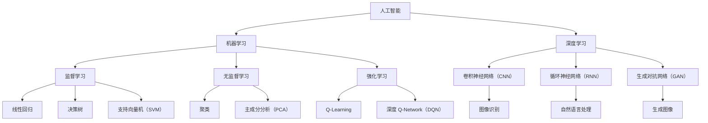

                 

### 文章标题

"**Andrej Karpathy：人工智能的未来发展目标**" 是一篇关于人工智能（AI）领域未来趋势和技术突破的深入探讨。文章将立足于著名人工智能专家 Andrej Karpathy 的视角，分析 AI 的发展历程、基础概念、未来趋势及其伦理与社会影响。本文旨在通过逻辑清晰、结构紧凑、简单易懂的论述，为读者提供一个全面而深入的 AI 未来展望。

### 关键词

- 人工智能
- Andrej Karpathy
- 机器学习
- 深度学习
- 伦理问题
- 社会影响
- 未来趋势

### 摘要

本文首先介绍人工智能领域的重要人物 Andrej Karpathy，回顾他的背景与贡献。接着，深入探讨人工智能的基础概念，包括其定义、发展阶段和核心技术。在此基础上，分析人工智能与人类智能的对比，揭示其优势与局限。随后，文章重点讨论人工智能的未来趋势，包括其发展方向、伦理与社会影响以及环境问题。最后，展望人工智能的未来，探讨可能的技术突破、社会形态和面临的挑战。通过本文，读者将获得对人工智能未来发展的全面理解和深入洞察。

## 《Andrej Karpathy：人工智能的未来发展目标》目录大纲

以下是本文的详细目录大纲：

### 第一部分：引言

- **1.1 人工智能的变革：Karpathy的视角**
  - **1.1.1 Andrej Karpathy的背景与贡献**
  - **1.1.2 人工智能的发展历程概述**
  - **1.1.3 本书的目的与结构安排**

### 第二部分：人工智能的基础概念

- **2.1 人工智能的基本原理**
  - **2.1.1 人工智能的定义**
  - **2.1.2 人工智能的发展阶段**
  - **2.1.3 人工智能的核心技术**
  - **2.1.4 人工智能的核心概念与联系（Mermaid流程图）**

- **2.2 机器学习与深度学习**
  - **2.2.1 机器学习的基本概念**
  - **2.2.2 深度学习的原理与架构**
  - **2.2.3 深度学习的主要应用领域**

- **2.3 人工智能与人类智能的对比**
  - **2.3.1 人类智能的特点**
  - **2.3.2 人工智能的优势与局限**
  - **2.3.3 人工智能与人类智能的互补关系**

### 第三部分：人工智能的未来趋势

- **3.1 人工智能的发展方向**
  - **3.1.1 人工智能的未来目标**
  - **3.1.2 人工智能的关键技术发展**
  - **3.1.3 人工智能的未来应用场景**

- **3.2 人工智能的伦理与社会影响**
  - **3.2.1 人工智能的伦理问题**
  - **3.2.2 人工智能的社会影响**
  - **3.2.3 人工智能的未来治理**

- **3.3 人工智能的可持续性与环境问题**
  - **3.3.1 人工智能的能源消耗**
  - **3.3.2 人工智能的环境影响**
  - **3.3.3 人工智能的可持续发展策略**

### 第四部分：人工智能的未来展望

- **4.1 人工智能的未来技术突破**
  - **4.1.1 量子计算与人工智能**
  - **4.1.2 神经形态计算与人工智能**
  - **4.1.3 分布式人工智能与区块链**

- **4.2 人工智能的未来社会形态**
  - **4.2.1 人工智能对社会经济的影响**
  - **4.2.2 人工智能对教育的影响**
  - **4.2.3 人工智能对人类生活方式的影响**

- **4.3 人工智能的未来挑战与应对策略**
  - **4.3.1 人工智能的安全问题**
  - **4.3.2 人工智能的隐私保护**
  - **4.3.3 人工智能的公平性与透明性**

### 第五部分：总结与展望

- **5.1 人工智能的未来发展目标总结**
  - **5.1.1 人工智能的核心目标**
  - **5.1.2 人工智能的关键挑战**
  - **5.1.3 人工智能的未来发展趋势**

- **5.2 展望人工智能的未来**
  - **5.2.1 人工智能的未来愿景**
  - **5.2.2 人工智能的未来可能发展路线**
  - **5.2.3 对人工智能未来发展的建议**

### 附录

- **附录 A：人工智能关键术语解释**
- **附录 B：参考资料与推荐阅读**
  - **B.1 参考文献**
  - **B.2 推荐阅读书籍**
  - **B.3 优质学术论文与报告**

## 第一部分：引言

### 1.1 人工智能的变革：Karpathy的视角

人工智能（AI）作为当今科技领域的一个热点话题，正迅速改变着我们的生活方式和社会结构。在众多人工智能专家中，Andrej Karpathy因其卓越的贡献而备受关注。本文将以 Karpathy 的视角，探讨人工智能的变革及其未来发展目标。

#### 1.1.1 Andrej Karpathy的背景与贡献

Andrej Karpathy 是一位著名的计算机科学家和人工智能研究者。他于 1992 年出生在奥地利，目前是斯坦福大学计算机科学系的副教授。Karpathy 在机器学习和深度学习领域拥有深厚的研究背景，并在多个顶级学术会议和期刊上发表过多篇论文。他的研究领域涵盖了自然语言处理、计算机视觉和强化学习等多个方向。

Karpathy 的贡献不仅体现在学术研究上，他还积极参与开源社区，推动了人工智能技术的普及和应用。他是著名的开源项目“char-rnn”的创建者，该项目使用深度学习技术生成自然语言文本，引起了广泛关注。此外，他还发表了多篇博客文章，深入浅出地解释了人工智能的基本原理和最新进展，为大众普及人工智能知识做出了重要贡献。

#### 1.1.2 人工智能的发展历程概述

人工智能的概念可以追溯到 20 世纪 50 年代，当时计算机科学家艾伦·图灵提出了“图灵测试”这一评估机器智能的标准。然而，早期的计算机硬件和技术限制使得人工智能的发展缓慢且不成熟。直到 20 世纪 80 年代，随着计算机性能的提升和算法的进步，人工智能开始进入快速发展阶段。

机器学习作为人工智能的重要分支，于 20 世纪 90 年代逐渐崭露头角。机器学习通过训练数据集来改进算法，使得计算机能够自动识别模式并做出预测。这一阶段的突破主要源于支持向量机（SVM）、神经网络等算法的创新。

进入 21 世纪，深度学习的崛起再次推动了人工智能的发展。深度学习通过多层神经网络对大量数据进行训练，能够实现更加复杂的任务，如图像识别、语音识别和自然语言处理。深度学习的关键技术包括卷积神经网络（CNN）、循环神经网络（RNN）和生成对抗网络（GAN）等。

#### 1.1.3 本书的目的与结构安排

本书旨在通过 Andrej Karpathy 的视角，深入探讨人工智能的未来发展目标。文章首先介绍 Karpathy 的背景和贡献，接着回顾人工智能的发展历程，然后分析人工智能的基础概念，包括机器学习和深度学习的基本原理。在此基础上，本文将探讨人工智能的未来趋势，包括其发展方向、伦理与社会影响以及环境问题。最后，文章将展望人工智能的未来，探讨可能的技术突破、社会形态和面临的挑战。

通过本文的论述，读者将能够获得对人工智能未来发展的全面理解和深入洞察，为未来的研究与应用提供有价值的参考。

## 第二部分：人工智能的基础概念

### 2.1 人工智能的基本原理

人工智能（AI）是一门研究、开发用于模拟、延伸和扩展人类智能的理论、方法、技术及应用系统的科学技术。AI 的目标是使计算机能够执行通常需要人类智能才能完成的任务，例如视觉识别、语言理解、决策制定等。

#### 2.1.1 人工智能的定义

人工智能可以定义为一种使计算机系统能够执行智能任务的科学技术。这些任务包括但不限于：

1. **感知**：通过传感器获取外部信息，如图像、声音和触觉等。
2. **理解**：对获取的信息进行处理和分析，提取有用信息。
3. **推理**：使用已有知识进行逻辑推理，做出决策。
4. **学习**：从数据中学习，改进性能。
5. **交互**：与人类或其他系统进行自然语言交流。

#### 2.1.2 人工智能的发展阶段

人工智能的发展可以分为以下几个阶段：

1. **初始阶段（1950-1969）**：这一阶段主要关注符号主义和逻辑推理，以图灵机和普林斯顿体系结构为代表。图灵提出了著名的“图灵测试”，用于评估机器是否具有人类智能。

2. **停滞阶段（1970-1980）**：由于计算能力和算法的限制，人工智能的发展遇到了瓶颈。符号主义方法逐渐被人工智能社区所放弃。

3. **复兴阶段（1980-1987）**：专家系统的出现使得人工智能重新受到关注。专家系统使用大量的规则和知识库来模拟人类专家的决策过程。

4. **低谷阶段（1988-2000）**：专家系统在实际应用中表现不佳，人工智能再次陷入低谷。此时，机器学习开始崭露头角。

5. **快速增长阶段（2000-2012）**：随着计算能力和数据资源的提升，机器学习特别是深度学习取得了显著进展。卷积神经网络（CNN）和循环神经网络（RNN）的出现使得图像识别和自然语言处理取得了重大突破。

6. **成熟阶段（2012至今）**：人工智能在各个领域取得了广泛应用，包括自动驾驶、医疗诊断、金融交易等。人工智能的研究和应用正在不断深化和扩展。

#### 2.1.3 人工智能的核心技术

人工智能的核心技术包括机器学习和深度学习等。

1. **机器学习（Machine Learning）**：机器学习是一种通过训练数据集来改进算法性能的方法。其主要思想是让计算机从数据中学习，从而能够自动识别模式和做出预测。机器学习可以分为监督学习、无监督学习和强化学习。

   - **监督学习（Supervised Learning）**：在监督学习中，算法从标记的数据集中学习，输出预测结果。常见的监督学习算法包括线性回归、决策树、支持向量机（SVM）等。

   - **无监督学习（Unsupervised Learning）**：无监督学习从未标记的数据集中学习，主要任务是发现数据中的隐含结构。常见的无监督学习算法包括聚类、主成分分析（PCA）等。

   - **强化学习（Reinforcement Learning）**：强化学习通过试错和奖励机制来学习策略，以达到特定目标。常见的强化学习算法包括 Q-Learning 和深度 Q-Network（DQN）。

2. **深度学习（Deep Learning）**：深度学习是一种基于多层神经网络的学习方法，其目的是通过逐层提取特征，实现更复杂的任务。深度学习的关键技术包括卷积神经网络（CNN）、循环神经网络（RNN）和生成对抗网络（GAN）等。

   - **卷积神经网络（Convolutional Neural Network，CNN）**：CNN 是用于图像识别和处理的深度学习模型。其核心思想是通过卷积操作提取图像的特征，从而实现图像分类和识别。

   - **循环神经网络（Recurrent Neural Network，RNN）**：RNN 是用于序列数据处理和预测的深度学习模型。其核心思想是通过循环结构处理序列数据，从而实现自然语言处理、语音识别等任务。

   - **生成对抗网络（Generative Adversarial Network，GAN）**：GAN 是一种生成模型，由生成器和判别器两个神经网络组成。生成器的目标是生成逼真的数据，而判别器的目标是区分生成数据和真实数据。通过两个神经网络的对抗训练，GAN 能够生成高质量的图像、音频和文本。

#### 2.1.4 人工智能的核心概念与联系（Mermaid流程图）

为了更好地理解人工智能的核心概念及其相互关系，我们可以使用 Mermaid 流程图来展示。以下是人工智能核心概念和技术的联系流程图：

通过以上流程图，我们可以清晰地看到人工智能的核心概念和技术之间的联系，以及它们在具体应用中的关系。

综上所述，人工智能的基本原理涵盖了定义、发展阶段和核心技术。通过深入理解这些基本原理，我们可以更好地把握人工智能的发展趋势和应用前景。

### 2.2 机器学习与深度学习

#### 2.2.1 机器学习的基本概念

机器学习（Machine Learning）是人工智能（AI）的重要分支，它使计算机系统能够从数据中学习，进而改进其性能。机器学习的基本概念包括以下几个方面：

1. **学习过程**：机器学习的过程通常包括数据收集、数据预处理、模型训练和模型评估四个阶段。

   - **数据收集**：收集大量相关数据，为模型训练提供基础。
   - **数据预处理**：对原始数据进行清洗、转换和归一化等处理，以消除噪声和异常值，提高数据质量。
   - **模型训练**：使用训练数据集对机器学习模型进行训练，使其学会识别数据中的模式。
   - **模型评估**：使用验证数据集对训练好的模型进行评估，以确定其性能和准确性。

2. **学习类型**：机器学习可以分为监督学习（Supervised Learning）、无监督学习（Unsupervised Learning）和强化学习（Reinforcement Learning）三种类型。

   - **监督学习**：在监督学习中，算法从标记的数据集中学习，输出预测结果。常见的监督学习算法包括线性回归、决策树、支持向量机（SVM）等。
   - **无监督学习**：在无监督学习中，算法从未标记的数据集中学习，主要任务是发现数据中的隐含结构。常见的无监督学习算法包括聚类、主成分分析（PCA）等。
   - **强化学习**：在强化学习中，算法通过试错和奖励机制来学习策略，以达到特定目标。常见的强化学习算法包括 Q-Learning 和深度 Q-Network（DQN）等。

3. **学习算法**：机器学习算法可以分为基于统计的算法和基于实例的算法。

   - **基于统计的算法**：基于统计的算法使用数学模型和概率论来描述数据之间的关系，如线性回归、逻辑回归等。
   - **基于实例的算法**：基于实例的算法通过比较新数据与训练数据之间的相似性来做出预测，如 k-最近邻（k-Nearest Neighbors，k-NN）等。

#### 2.2.2 深度学习的原理与架构

深度学习（Deep Learning）是机器学习的一个重要分支，其核心思想是通过多层神经网络（Neural Network）对大量数据进行训练，从而实现复杂的任务。深度学习的基本原理和架构如下：

1. **神经网络的基本原理**

   - **神经元**：神经网络由大量简单的计算单元（神经元）组成，每个神经元接收多个输入信号，通过加权求和处理后产生输出。
   - **激活函数**：激活函数用于确定神经元是否被激活。常用的激活函数包括 sigmoid 函数、ReLU 函数和 tanh 函数等。
   - **反向传播算法**：反向传播算法是一种用于训练神经网络的优化算法，其基本思想是将输出误差反向传播到网络中的各个神经元，并更新每个神经元的权重。

2. **深度学习的架构**

   - **多层感知机（MLP）**：多层感知机是深度学习的最基本架构，由输入层、隐藏层和输出层组成。输入层接收外部输入信号，隐藏层对输入信号进行加工和处理，输出层产生最终预测结果。
   - **卷积神经网络（CNN）**：卷积神经网络是用于图像识别和处理的深度学习模型，其核心思想是通过卷积操作提取图像的特征。CNN 包括卷积层、池化层和全连接层等组成部分。
   - **循环神经网络（RNN）**：循环神经网络是用于序列数据处理和预测的深度学习模型，其核心思想是通过循环结构处理序列数据。RNN 包括输入层、隐藏层和输出层等组成部分。
   - **生成对抗网络（GAN）**：生成对抗网络是一种生成模型，由生成器和判别器两个神经网络组成。生成器的目标是生成逼真的数据，而判别器的目标是区分生成数据和真实数据。通过两个神经网络的对抗训练，GAN 能够生成高质量的图像、音频和文本。

3. **深度学习的训练过程**

   - **数据预处理**：对训练数据进行预处理，包括归一化、去噪和增强等操作，以提高模型性能。
   - **模型初始化**：初始化模型的参数，通常使用随机初始化方法。
   - **前向传播**：输入数据通过神经网络的前向传播过程，逐层传递到输出层，产生预测结果。
   - **反向传播**：计算预测结果与真实结果之间的误差，并通过反向传播算法更新网络中的参数。
   - **迭代优化**：重复上述前向传播和反向传播过程，直到模型收敛或达到预设的训练次数。

#### 2.2.3 深度学习的主要应用领域

深度学习在多个领域取得了显著的应用成果，以下是其中几个主要的应用领域：

1. **计算机视觉**：深度学习在计算机视觉领域取得了重大突破，包括图像分类、目标检测、图像生成等。例如，卷积神经网络（CNN）在图像分类任务中表现出色，能够准确识别各种物体和场景。

2. **自然语言处理**：深度学习在自然语言处理（NLP）领域也得到了广泛应用，包括文本分类、情感分析、机器翻译等。循环神经网络（RNN）和长短时记忆网络（LSTM）在处理序列数据方面表现出色，能够有效捕捉文本中的语义信息。

3. **语音识别**：深度学习在语音识别领域取得了显著进展，能够准确识别和理解语音信号。深度神经网络（DNN）和卷积神经网络（CNN）在语音信号处理和特征提取方面表现出色。

4. **自动驾驶**：深度学习在自动驾驶领域具有广泛的应用前景，包括车辆检测、障碍物识别、路径规划等。卷积神经网络（CNN）和循环神经网络（RNN）在处理图像和序列数据方面具有优势，能够帮助自动驾驶系统实现更准确和稳定的运行。

5. **医疗诊断**：深度学习在医疗诊断领域也取得了显著应用成果，包括图像诊断、基因分析等。深度神经网络（DNN）和生成对抗网络（GAN）在处理复杂医学数据方面表现出色，能够为医疗诊断提供有力支持。

综上所述，机器学习和深度学习作为人工智能的核心技术，在各个领域取得了广泛应用和显著成果。通过深入理解其基本原理和应用场景，我们可以更好地发挥深度学习的潜力，推动人工智能的发展。

### 2.3 人工智能与人类智能的对比

在探讨人工智能（AI）的未来发展趋势时，理解其与人类智能（HS）的对比至关重要。尽管 AI 在许多方面已经取得了令人瞩目的进展，但人类智能仍然具有独特且显著的特点，这些特点不仅决定了 AI 的优势和局限，还揭示了两者之间的互补关系。

#### 2.3.1 人类智能的特点

1. **广泛适应性**：人类智能具有高度的适应性和灵活性，能够处理各种复杂和不确定的环境。人类能够迅速适应新的情境，并利用已有的知识和经验解决问题。

2. **情境理解**：人类智能擅长理解情境中的上下文关系，能够从复杂的背景中提取关键信息。这种情境理解能力在决策制定和问题解决中起到关键作用。

3. **社会认知**：人类智能具有复杂的社会认知能力，包括情感识别、社交互动和团队合作。这种能力使得人类能够在社会环境中有效沟通和合作。

4. **创造力**：人类智能具有高度的创造力，能够进行抽象思维和艺术创作。创造力是许多领域创新和突破的关键。

5. **道德和伦理**：人类智能能够理解和遵循道德和伦理规范，这是 AI 当前所无法比拟的。人类智能在道德判断和伦理决策中具有自觉性和责任感。

#### 2.3.2 人工智能的优势与局限

1. **计算速度和准确性**：AI 具有极高的计算速度和准确性，能够在极短的时间内处理大量数据，并在特定任务上实现超高的精确度。

2. **模式识别**：AI 擅长于模式识别，特别是在处理结构化数据时，能够发现复杂的数据模式，进行高效分类和预测。

3. **持续工作**：AI 能够持续工作，不受疲劳和情绪的影响，能够在任何时间执行任务。

4. **决策自动化**：AI 能够自动化决策过程，减少人为错误，提高生产效率。

然而，AI 也存在一些局限性：

1. **缺乏情境理解**：AI 在处理复杂情境时，往往无法像人类智能那样理解上下文关系，这限制了其在某些复杂任务中的表现。

2. **创造力不足**：AI 缺乏人类智能的创造力，无法进行抽象思维和艺术创作。

3. **社会认知障碍**：AI 在处理社会认知任务时，如情感识别和社交互动，仍然存在较大挑战。

4. **道德和伦理困境**：AI 在道德和伦理方面的判断能力有限，容易陷入伦理困境，需要人类智能的指导和监督。

#### 2.3.3 人工智能与人类智能的互补关系

人工智能和人类智能并不是竞争关系，而是互补关系。两者在不同领域具有各自的优势，通过协作可以发挥更大的作用：

1. **任务分工**：人类智能可以专注于创造、决策和社交互动等需要情境理解和创造力的任务，而 AI 可以专注于计算、分析和模式识别等需要高效性和精确性的任务。

2. **协同创新**：人类智能和 AI 的协同合作可以激发创新思维。人类智能可以提出新颖的想法，而 AI 可以帮助实现这些想法，通过数据分析和模拟验证其可行性。

3. **教育辅助**：AI 可以在教育和学习过程中提供个性化辅导，帮助学习者快速掌握知识和技能。人类教师可以关注学习者的情感发展和道德教育。

4. **医疗支持**：AI 可以在医疗诊断和治疗中提供辅助，快速分析大量医疗数据，而人类医生可以结合 AI 的分析结果进行综合判断，制定最佳治疗方案。

综上所述，人工智能和人类智能各有优势与局限，通过合理分工和协同合作，可以实现互补和共赢。理解两者的互补关系，有助于我们更好地利用人工智能技术，推动人类社会的进步。

### 3.1 人工智能的发展方向

随着人工智能技术的不断进步，其发展方向也日益明确。未来，人工智能将在多个领域实现突破，推动社会经济的快速发展。以下是人工智能在未来几个关键方向上的发展目标。

#### 3.1.1 人工智能的未来目标

1. **智能感知与理解**：人工智能将进一步增强对复杂环境的感知和理解能力，通过多种传感器和数据源获取信息，并利用深度学习等技术进行分析和处理。

2. **智能决策与执行**：人工智能将具备更高级的决策能力，能够在不确定的环境中做出合理决策，并自动化执行复杂任务。

3. **智能协作与社交**：人工智能将能够更好地理解人类情感和意图，实现与人类的自然互动和协作，提高社会互动的效率和质量。

4. **智能创造与创新**：人工智能将激发人类创造力，通过模拟人类思维过程，实现知识发现和艺术创作等领域的创新。

5. **智能治理与监管**：人工智能将在社会管理和监管中发挥重要作用，通过数据分析和智能决策，提高社会治理的透明度和效率。

#### 3.1.2 人工智能的关键技术发展

1. **深度学习**：深度学习将继续成为人工智能的核心技术，通过多层神经网络和端到端的训练方法，实现更复杂的任务和更高的精度。

2. **强化学习**：强化学习将在决策制定和自适应控制等领域取得重要突破，通过试错和奖励机制，实现更高效和自适应的智能行为。

3. **自然语言处理**：自然语言处理（NLP）技术将进一步提升，实现更准确和自然的语言理解和生成，推动智能语音助手、机器翻译和文本分析等领域的发展。

4. **计算机视觉**：计算机视觉技术将实现更高级的图像和视频理解能力，包括物体识别、场景解析和动作识别等。

5. **生成对抗网络（GAN）**：生成对抗网络将在数据生成和图像合成方面发挥重要作用，通过对抗训练生成高质量的图像和音频。

6. **神经形态计算**：神经形态计算将模拟人脑的结构和功能，实现高效和节能的智能处理，为人工智能提供新的计算范式。

#### 3.1.3 人工智能的未来应用场景

1. **自动驾驶**：人工智能将实现更安全、高效的自动驾驶技术，改变交通运输方式，提高道路通行能力。

2. **智能医疗**：人工智能将在疾病诊断、治疗方案制定和医疗资源分配等方面发挥重要作用，提升医疗服务的质量和效率。

3. **智能家居**：人工智能将使家居设备更智能，实现自动化控制和个性化服务，提升生活质量。

4. **智能金融**：人工智能将在金融交易、风险管理、信用评估等方面提供支持，提高金融服务的效率和安全性。

5. **智能教育**：人工智能将实现个性化教育，通过智能辅导和评估系统，提高学习效果和教育质量。

6. **智能城市**：人工智能将应用于城市规划和管理，实现智能交通、能源管理和环境保护等，提高城市的宜居性和可持续发展能力。

综上所述，人工智能的未来发展方向将涵盖智能感知、决策、协作、创造和治理等多个方面，通过关键技术的创新和应用，实现社会经济的全面提升。

### 3.2 人工智能的伦理与社会影响

随着人工智能技术的迅猛发展，其对社会和伦理的深远影响也日益显著。人工智能不仅改变了我们的生活方式，还在道德、法律和社会结构方面提出了诸多挑战。本文将探讨人工智能的伦理问题、社会影响及其未来治理。

#### 3.2.1 人工智能的伦理问题

1. **隐私保护**：人工智能技术的广泛应用，尤其是大数据分析和个性化推荐，带来了隐私泄露的担忧。如何保护个人隐私，确保数据安全，成为亟待解决的问题。

2. **算法偏见**：人工智能系统在训练过程中可能会引入偏见，导致决策结果不公平。例如，招聘系统可能会基于历史数据中的偏见，对特定群体产生歧视。如何消除算法偏见，实现公平公正，是一个重要伦理问题。

3. **责任归属**：当人工智能系统出现错误或导致损害时，责任如何分配？是人工智能的开发者、使用者还是系统本身应承担责任？明确责任归属对于保障社会秩序和公平具有重要意义。

4. **自主性**：人工智能系统的自主决策能力日益增强，其行为是否符合人类伦理价值观？如何确保人工智能系统在自主决策过程中遵循道德准则，避免产生负面影响，是亟待解决的伦理问题。

#### 3.2.2 人工智能的社会影响

1. **就业影响**：人工智能技术的发展可能导致部分传统岗位的消失，同时创造新的就业机会。然而，如何确保所有人都能适应和利用这些新机会，避免社会分化加剧，是一个重要社会问题。

2. **经济结构**：人工智能技术将推动产业升级和结构调整，促进经济高质量发展。然而，这也可能导致资源分配不均，加剧贫富差距，如何平衡经济发展和社会公平，成为重要议题。

3. **教育改革**：人工智能技术对教育的影响深远，要求教育体系进行相应改革，培养适应未来社会需求的人才。如何设计适应人工智能时代的教育模式，提高教育质量和公平性，是教育领域面临的重要挑战。

4. **社会治理**：人工智能技术将在社会治理中发挥重要作用，如智能监控、数据分析等。然而，如何确保这些技术的应用符合社会道德和法律规范，保护公民权益，是社会治理必须面对的问题。

#### 3.2.3 人工智能的未来治理

1. **立法和监管**：制定相应的法律法规，明确人工智能的应用范围、责任归属和隐私保护，是未来治理的基础。各国政府应加强国际合作，共同制定全球人工智能治理框架。

2. **伦理审查**：建立人工智能伦理审查机制，对人工智能系统的设计、开发和应用进行评估，确保其符合道德伦理标准。

3. **教育和培训**：加强公众对人工智能的认识和接受，提高公众的数字素养和伦理意识，确保社会各方面能够有效应对人工智能带来的挑战。

4. **行业自律**：人工智能企业和组织应自觉遵守行业规范，推动社会责任和伦理价值观的实施。

综上所述，人工智能的伦理问题和社会影响不可忽视。未来，通过立法监管、伦理审查、教育和行业自律等多种手段，可以更好地治理人工智能技术，确保其在推动社会进步的同时，不会对人类伦理和社会秩序产生负面影响。

### 3.3 人工智能的可持续性与环境问题

随着人工智能（AI）技术的迅猛发展，其对能源消耗和环境影响也日益受到关注。AI 技术在提高生产效率、推动创新的同时，也带来了巨大的能源消耗和碳排放问题。本文将探讨人工智能的能源消耗、环境影响以及可持续发展策略。

#### 3.3.1 人工智能的能源消耗

1. **计算资源消耗**：人工智能特别是深度学习模型需要大量的计算资源，特别是在训练阶段。高性能计算服务器和大规模数据中心的运营，消耗了大量的电力。据估计，AI 领域的能源消耗已经达到了惊人的水平，并且还在持续增长。

2. **硬件升级需求**：为了满足 AI 模型的计算需求，需要不断升级硬件设备，如 GPU 和 TPU。这些硬件的生产和废弃也会产生相应的能源消耗和环境污染。

3. **数据传输能耗**：在分布式 AI 训练和数据处理过程中，大量的数据需要在网络中传输。数据传输过程中会产生一定的能源消耗，尤其是在跨地域的数据传输中。

#### 3.3.2 人工智能的环境影响

1. **碳排放**：人工智能的能源消耗直接导致了碳排放的增加。根据相关研究，AI 领域的碳排放已经占到了全球碳排放的一定比例，并且随着 AI 技术的广泛应用，这一比例还在不断上升。

2. **废弃物处理**：硬件设备的废弃和更换也会产生环境问题。老旧的 GPU 和 TPU 等设备中含有重金属和其他有害物质，如果不妥善处理，会对环境造成污染。

3. **水资源消耗**：某些 AI 训练任务需要使用大量的水资源进行冷却，这会对水资源短缺地区产生压力。

#### 3.3.3 人工智能的可持续发展策略

1. **绿色计算**：推动绿色计算技术的发展，采用节能高效的计算设备和算法，减少 AI 的能源消耗。例如，使用高效能的 GPU 和 TPU，优化深度学习算法，减少计算资源的浪费。

2. **可再生能源利用**：鼓励使用可再生能源，如风能、太阳能等，为 AI 数据中心和服务器提供电力。这不仅可以减少碳排放，还可以提高能源的可持续性。

3. **循环经济**：推广循环经济模式，延长硬件设备的使用寿命，减少废弃物的产生。例如，通过硬件升级和回收，将老旧设备重新利用。

4. **数据优化**：优化数据存储和传输过程，减少数据传输的能耗。例如，采用压缩算法减少数据传输量，优化网络传输路径。

5. **国际合作**：推动国际间的合作，共同制定全球 AI 环境保护标准和政策，共同应对 AI 对环境的挑战。

6. **公众教育**：提高公众对 AI 环境影响的认知，鼓励公众参与环保行动，共同推动可持续发展的实现。

综上所述，人工智能的能源消耗和环境影响问题不容忽视。通过绿色计算、可再生能源利用、循环经济、数据优化和国际合作等多种策略，可以降低 AI 的能源消耗和环境影响，实现可持续发展的目标。

### 4.1 人工智能的未来技术突破

随着人工智能（AI）技术的不断演进，未来几年内我们将看到多个关键技术领域的突破。以下是量子计算、神经形态计算和分布式人工智能等领域的潜在技术突破及其影响。

#### 4.1.1 量子计算与人工智能

量子计算（Quantum Computing）被认为是下一代计算技术的里程碑，它利用量子位（qubits）和量子叠加原理，能够在极短时间内解决传统计算机难以处理的问题。量子计算与人工智能的结合有望带来以下突破：

1. **优化算法**：量子计算能够在极短时间内解决复杂的优化问题，如物流调度、资源分配和金融模型等。这些优化算法的突破将极大地提高人工智能系统的效率和性能。

2. **增强机器学习**：量子计算可以通过量子机器学习（Quantum Machine Learning，QML）算法加速传统机器学习任务。QML 能够利用量子并行性处理大规模数据集，从而提高模型训练速度和准确性。

3. **新算法开发**：量子计算将催生新的算法，如量子神经网络（Quantum Neural Networks，QNNs）和量子深度学习（Quantum Deep Learning），这些算法能够在复杂任务中实现前所未有的精度和效率。

4. **实际应用**：随着量子计算技术的成熟，人工智能将在金融、医疗、制药和交通等领域实现重大应用。例如，量子计算可以用于药物发现、个性化医疗和智能交通系统，提高社会效率和生产力。

#### 4.1.2 神经形态计算与人工智能

神经形态计算（Neuromorphic Computing）是一种模拟人脑结构和功能的计算方法，其核心思想是通过硬件实现自适应神经网络，使计算机能够像人脑一样学习和处理信息。神经形态计算与人工智能的结合有望带来以下突破：

1. **高效能计算**：神经形态计算通过仿生硬件实现高效能计算，能够在极低能耗的情况下处理复杂任务。这将为人工智能系统提供更高效的计算资源，降低能源消耗。

2. **自适应学习能力**：神经形态计算具有高度的自适应和学习能力，能够通过不断调整神经元间的连接权重，实现自我优化。这种能力将使人工智能系统更加灵活和适应复杂环境。

3. **实时感知与交互**：神经形态计算能够实现实时感知和交互，使人工智能系统能够在复杂环境中迅速做出反应。这对于自动驾驶、智能监控和智能制造等领域具有重要意义。

4. **生物计算**：神经形态计算可以与生物系统相结合，实现生物计算（Bio-Computing）。通过将生物分子与神经形态计算相结合，可以开发出新型医疗诊断和治疗设备，提高医疗技术水平。

#### 4.1.3 分布式人工智能与区块链

分布式人工智能（Distributed Artificial Intelligence，DAI）和区块链技术的结合将带来新的技术突破和应用场景：

1. **去中心化协同**：分布式人工智能通过将计算任务分布到多个节点，实现去中心化的协同计算。区块链技术可以确保数据的安全性和透明性，防止作弊和篡改。这种结合将使人工智能系统更加安全、可靠和去中心化。

2. **隐私保护**：分布式人工智能与区块链的结合可以提供更好的隐私保护机制。通过区块链的加密技术，可以确保个人数据的安全，防止数据泄露和滥用。

3. **智能合约**：分布式人工智能可以与智能合约（Smart Contract）相结合，实现自动化执行和管理。智能合约是区块链上的可编程协议，可以实现自动化交易和执行。分布式人工智能可以优化智能合约的执行流程，提高交易效率和安全性。

4. **去中心化应用**：分布式人工智能与区块链的结合将推动去中心化应用（Decentralized Applications，DApps）的发展。去中心化应用将实现真正的去中心化治理和共享经济，为用户带来更多选择和自由。

综上所述，量子计算、神经形态计算和分布式人工智能等领域的未来技术突破将极大地推动人工智能的发展，带来新的应用场景和商业机会。这些突破不仅将提高人工智能的性能和效率，还将推动社会和经济的全面进步。

### 4.2 人工智能的未来社会形态

随着人工智能技术的不断成熟和应用，它将深刻改变我们的社会形态，从经济结构到教育模式，再到人类生活方式，每一个方面都将受到深远的影响。以下是人工智能对未来社会形态的潜在影响。

#### 4.2.1 人工智能对社会经济的影响

1. **产业变革**：人工智能将推动传统产业的转型升级，提高生产效率和创新能力。例如，制造业将实现自动化和智能化，提高生产效率和产品质量；服务业将实现智能化服务和个性化推荐，提升客户体验。

2. **就业转型**：人工智能的发展将带来就业结构的变革。一方面，一些传统岗位可能会被自动化取代，导致失业率上升；另一方面，人工智能将创造新的就业机会，如数据科学家、机器学习工程师和人工智能伦理专家等。

3. **经济效益**：人工智能技术的应用将极大地提高经济效益。通过自动化和智能化，企业可以降低成本、提高生产效率，从而实现更高的利润。此外，人工智能将促进创新和创业，带来新的经济增长点。

4. **全球化加速**：人工智能技术将加速全球化的进程，通过远程协作和数据流动，使全球资源得到更高效的配置和利用。这将为各国带来更多的商业机会，同时也带来竞争压力。

#### 4.2.2 人工智能对教育的影响

1. **个性化教育**：人工智能技术将使教育更加个性化和灵活。通过智能辅导系统，学生可以根据自己的学习进度和能力，自主选择学习内容和方式，实现个性化的学习体验。

2. **教育资源均衡**：人工智能可以将优质教育资源均衡地分配到全球各地，解决教育资源不均衡的问题。例如，通过在线教育平台和虚拟现实技术，偏远地区的学生也可以享受到一流的教育资源。

3. **教育创新**：人工智能将推动教育模式的创新，如基于数据分析和机器学习的教育评估系统、智能学习助手和虚拟教师等。这些创新将提高教育质量和效率，促进教育公平。

4. **职业培训**：人工智能技术将推动职业培训的变革，提供更加定制化和实用的培训课程，帮助学生和职场人士适应快速变化的工作环境。

#### 4.2.3 人工智能对人类生活方式的影响

1. **智能家居**：人工智能技术将使家居设备更加智能化，实现自动化控制和个性化服务。智能家居系统可以自动调节室内温度、照明和安全系统，提高居住舒适度和安全性。

2. **智能健康**：人工智能技术将推动医疗健康领域的发展，通过智能诊断、个性化治疗和健康管理，提高医疗服务质量和效率。智能穿戴设备和健康监测系统将帮助人们更好地管理自己的健康。

3. **娱乐与社交**：人工智能技术将改变娱乐和社交方式，提供更加丰富和个性化的娱乐内容，如智能音乐推荐、虚拟现实游戏和社交机器人等。

4. **工作与生活平衡**：人工智能技术将提高工作效率，减少重复性和低价值的工作，使人们有更多时间享受生活。智能助手和自动化系统将帮助人们更好地管理时间和任务，实现工作与生活的平衡。

综上所述，人工智能对未来社会形态的影响深远而广泛，它将推动产业变革、教育创新和生活方式的改善。通过合理利用人工智能技术，我们可以实现更高效、更公平和更美好的未来。

### 4.3 人工智能的未来挑战与应对策略

尽管人工智能（AI）在各个领域展示了巨大的潜力和优势，但其未来的发展仍面临诸多挑战。这些挑战涉及技术、伦理、社会等多个层面，需要我们认真对待并制定有效的应对策略。

#### 4.3.1 人工智能的安全问题

1. **算法透明性和可解释性**：人工智能系统的决策过程往往是复杂的，缺乏透明性和可解释性。这可能导致人们对 AI 决策的不信任，特别是在关键领域如金融、医疗和司法等。为了提高算法的可解释性，研究者正在开发可解释性人工智能（Explainable AI，XAI）技术，通过可视化工具和解释模型，使普通用户能够理解 AI 的决策过程。

2. **安全防护**：随着人工智能在网络安全中的应用，AI 系统也面临着被恶意攻击的风险。例如，通过对抗性攻击（Adversarial Attack）干扰 AI 模型的决策。为了应对这一问题，研究者正在开发安全的 AI 算法和防御机制，如对抗性训练（Adversarial Training）和神经网络防护（Neural Network Defense）。

3. **隐私保护**：人工智能在处理大量个人数据时，隐私保护成为关键挑战。需要制定严格的隐私保护法规，确保数据收集、存储和处理过程中的隐私安全。此外，研究者也在开发隐私保护技术，如差分隐私（Differential Privacy）和联邦学习（Federated Learning），以保护用户隐私。

#### 4.3.2 人工智能的隐私保护

1. **数据匿名化**：在数据收集和处理过程中，通过数据匿名化技术，如伪匿名化（Pseudonymization）和差分隐私，可以有效地保护个人隐私，同时确保数据分析的准确性。

2. **加密技术**：使用加密技术对敏感数据进行加密存储和传输，防止数据泄露和未授权访问。区块链技术可以提供去中心化的数据管理和加密存储，提高数据安全性。

3. **隐私设计原则**：在 AI 系统设计和开发过程中，应遵循隐私设计原则，如最小化数据收集、数据最小化使用和数据最小化保留。通过设计隐私友好的算法和系统架构，减少隐私泄露的风险。

#### 4.3.3 人工智能的公平性与透明性

1. **算法偏见检测与消除**：人工智能系统可能会在训练数据中引入偏见，导致决策结果不公平。为了检测和消除算法偏见，研究者正在开发偏见检测算法和公平性度量工具。通过交叉验证、偏差校正和数据增强等方法，可以提高模型的公平性和透明性。

2. **多元数据集**：使用包含多元数据集进行模型训练，确保模型在不同群体中的公平性和准确性。避免使用单一数据源，导致模型在某些群体中表现不佳。

3. **透明性和可追溯性**：提高人工智能系统的透明性和可追溯性，通过可视化和解释工具，使普通用户能够理解 AI 的决策过程。此外，建立透明和公正的算法审核机制，确保 AI 系统的决策符合伦理和法律标准。

#### 4.3.4 应对策略

1. **政策法规**：制定相关的政策法规，规范人工智能的开发和应用。例如，明确算法透明性、隐私保护和公平性的要求，建立 AI 伦理准则和监管框架。

2. **跨学科研究**：人工智能的安全、隐私、公平性和透明性是跨学科问题，需要计算机科学、社会科学、法律和伦理学等领域的专家共同参与研究。

3. **教育和培训**：加强公众对人工智能的认识和了解，提高公众的数字素养和伦理意识。通过教育和培训，培养更多 AI 伦理专家和合规人员，确保人工智能技术的健康发展。

4. **国际合作**：推动国际间的合作，共同应对人工智能带来的全球性挑战。通过国际合作，制定全球性的 AI 发展标准和政策，促进人工智能的可持续和公平发展。

综上所述，人工智能的未来发展面临诸多挑战，需要我们采取综合性的应对策略，确保人工智能技术的安全、隐私、公平和透明。通过政策法规、跨学科研究和国际合作，我们可以共同应对这些挑战，推动人工智能的健康和可持续发展。

### 5.1 人工智能的未来发展目标总结

随着人工智能技术的迅猛发展，其未来发展的目标逐渐清晰。本文通过对人工智能核心目标的深入分析，总结了以下关键点：

1. **智能感知与理解**：人工智能将进一步提升对复杂环境的感知和理解能力，通过多种传感器和数据源获取信息，并利用深度学习等技术进行分析和处理。这包括图像识别、语音识别、自然语言处理等领域的突破。

2. **智能决策与执行**：人工智能将实现更高级的决策能力，能够在不确定的环境中做出合理决策，并自动化执行复杂任务。这需要强化学习、规划算法和自适应控制技术的进步。

3. **智能协作与社交**：人工智能将能够更好地理解人类情感和意图，实现与人类的自然互动和协作，提高社会互动的效率和质量。通过虚拟现实、增强现实和智能对话系统，人工智能将在社交领域发挥重要作用。

4. **智能创造与创新**：人工智能将激发人类创造力，通过模拟人类思维过程，实现知识发现和艺术创作等领域的创新。深度学习和其他生成模型将推动人工智能在创造性任务中的表现。

5. **智能治理与监管**：人工智能将在社会管理和监管中发挥重要作用，通过数据分析和智能决策，提高社会治理的透明度和效率。在公共安全、医疗保健、教育等领域，人工智能的应用将显著提升治理水平。

6. **公平性与透明性**：人工智能的发展目标之一是确保其应用过程和结果具有公平性和透明性。通过算法公平性检测、隐私保护技术和伦理审查机制，人工智能将更加符合道德和法律标准。

7. **可持续发展**：人工智能的发展应关注其可持续性和环境影响。通过绿色计算、可再生能源利用和循环经济策略，人工智能将实现更高效和环保的发展。

通过以上目标的实现，人工智能将在社会各个领域发挥更大的作用，推动技术进步和社会发展，为人类创造更美好的未来。

### 5.2 展望人工智能的未来

在展望人工智能的未来时，我们不仅需要关注其技术突破和应用前景，还应当深刻思考其可能带来的社会变革和人类发展的方向。以下是关于人工智能未来的几个关键愿景、可能的发展路线以及相应的建议。

#### 5.2.1 人工智能的未来愿景

1. **全面智能化社会**：人工智能将在未来实现全面智能化，渗透到社会的各个领域。从智能家居、智能交通到智能医疗、智能教育，人工智能将极大地提高生活质量和效率。

2. **智能生态系统**：人工智能将构建一个智能生态系统，通过物联网、大数据和深度学习等技术，实现设备间的无缝协作和智能互动。这个生态系统将实现资源的高效利用，促进可持续发展。

3. **人机共生**：人工智能将不仅仅是一个工具，而是成为人类生活的一部分，实现人机共生。人与人工智能将共同决策、协作创新，推动社会进步。

4. **全球协作**：随着人工智能技术的全球化应用，全球各国将更加紧密地合作，共同应对全球性挑战，如气候变化、公共卫生和经济发展等。

5. **伦理与法治**：在人工智能的未来社会中，伦理和法律将发挥至关重要的作用。人工智能的发展必须遵循伦理原则，确保其对社会和人类的影响是积极和负责任的。

#### 5.2.2 人工智能的未来可能发展路线

1. **技术深化与创新**：在当前深度学习、强化学习等技术的持续发展基础上，未来人工智能可能会在量子计算、神经形态计算等领域实现重大突破，进一步推动技术深化。

2. **多元应用拓展**：人工智能将在更多领域得到应用，如农业、能源、环保等。通过智能感知、智能决策等技术，解决这些领域的复杂问题。

3. **社会嵌入**：人工智能将更加深入地融入社会结构和人类生活，从教育、医疗到文化、艺术，人工智能将带来全方位的创新和变革。

4. **全球治理**：随着人工智能技术的全球化，将需要建立更加完善和协调的全球治理体系，确保人工智能的发展符合全球利益和伦理标准。

5. **可持续战略**：人工智能将在推动可持续发展的过程中发挥关键作用，通过优化资源配置、提高能源效率等措施，实现经济、社会和环境的协调发展。

#### 5.2.3 对人工智能未来发展的建议

1. **加强技术创新**：持续投入基础研究和应用研究，推动人工智能技术的创新和发展。特别是在量子计算、神经形态计算等领域，需要集中资源进行攻关。

2. **伦理和规范建设**：建立完善的伦理规范和法律法规，确保人工智能的发展符合伦理和法律要求。推动全球范围内的合作，共同制定人工智能的伦理准则和治理框架。

3. **人才培养**：加强人工智能人才的培养和储备，提高公众的数字素养和科技素养。培养跨学科、复合型的人工智能人才，推动技术创新和产业应用。

4. **教育改革**：推动教育体系的改革，培养适应人工智能时代的创新型人才。加强STEM（科学、技术、工程和数学）教育，提高学生的创新能力和实践能力。

5. **国际合作**：加强国际间的合作与交流，推动全球人工智能的发展和应用。通过国际合作，共同应对人工智能带来的挑战和机遇，实现全球共赢。

6. **可持续发展**：将可持续发展理念融入人工智能的发展中，通过绿色计算、可再生能源利用等措施，降低人工智能的能源消耗和环境影响。

总之，人工智能的未来充满机遇与挑战。通过技术创新、伦理规范建设、人才培养和国际合作，我们可以共同推动人工智能的健康发展，为人类创造更加美好的未来。

### 附录

#### 附录 A：人工智能关键术语解释

**1. 人工智能（AI）**：一种使计算机系统能够执行通常需要人类智能才能完成的任务的技术，包括感知、理解、推理、学习和交互等。

**2. 机器学习（ML）**：一种通过数据驱动的方法，使计算机系统能够学习和改进性能，包括监督学习、无监督学习和强化学习。

**3. 深度学习（DL）**：一种基于多层神经网络的学习方法，通过逐层提取特征，实现复杂任务的自动执行。

**4. 卷积神经网络（CNN）**：一种用于图像识别和处理的深度学习模型，通过卷积操作提取图像特征。

**5. 循环神经网络（RNN）**：一种用于序列数据处理和预测的深度学习模型，通过循环结构处理序列数据。

**6. 生成对抗网络（GAN）**：一种生成模型，由生成器和判别器两个神经网络组成，通过对抗训练生成高质量数据。

**7. 强化学习（RL）**：一种通过试错和奖励机制学习策略的机器学习方法，适用于动态环境中的决策问题。

**8. 自然语言处理（NLP）**：研究如何让计算机理解和生成自然语言的学科，包括语言理解、文本生成和语言翻译等。

**9. 对抗性攻击（Adversarial Attack）**：通过输入微小扰动，干扰人工智能模型决策的过程。

**10. 可解释性人工智能（XAI）**：研究如何提高人工智能系统决策过程透明度和可解释性的领域。

#### 附录 B：参考资料与推荐阅读

**参考文献**：

1. Goodfellow, I., Bengio, Y., & Courville, A. (2016). *Deep Learning*.
2. Russell, S., & Norvig, P. (2016). *Artificial Intelligence: A Modern Approach*.
3. LeCun, Y., Bengio, Y., & Hinton, G. (2015). *Deep Learning*.

**推荐阅读书籍**：

1. Mitchell, T. M. (1997). *Machine Learning*.
2. Sutton, R. S., & Barto, A. G. (2018). *Reinforcement Learning: An Introduction*.
3. Hochreiter, S., & Schmidhuber, J. (1997). "Long Short-Term Memory".

**优质学术论文与报告**：

1. LeCun, Y., Bengio, Y., & Hinton, G. (2015). *Deep learning*.
2. Karpathy, A. (2015). "The Unreasonable Effectiveness of Recurrent Neural Networks".
3. Goodfellow, I. J., Shlens, J., & Szegedy, C. (2014). "Explaining and Harnessing Adversarial Examples".

