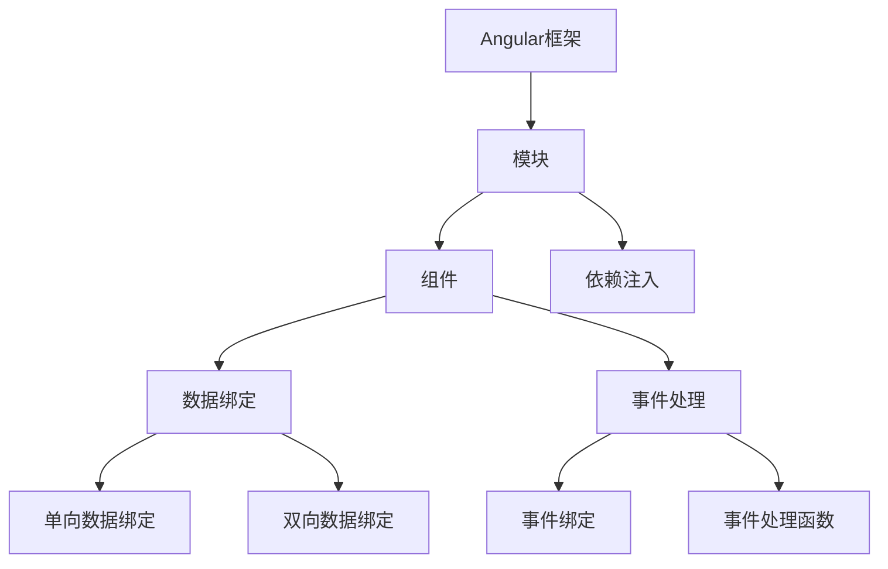

                 

# Angular 框架入门：Google MVW 框架的优势

## 关键词

- Angular 框架
- Google MVW 框架
- 前端开发
- 单向数据绑定
- 双向数据绑定
- 依赖注入
- 路由管理
- 表单处理
- 安全特性
- 单元测试

## 摘要

本文旨在为初学者提供一个全面而深入的Angular框架入门指南。我们将探讨Angular框架的背景、核心概念、开发工具、高级特性、安全特性、测试方法以及项目实战。通过本文，读者将了解如何利用Angular框架的优势进行高效的前端开发。

### 第一部分：Angular 框架基础

#### 第1章: Angular 框架概述

**1.1 Angular 框架的优势**

Angular框架由Google开发，旨在解决前端开发中常见的问题，提供一种高效、模块化的开发方式。其优势包括：

- **跨平台开发**：支持Web、移动和桌面应用的开发。
- **双向数据绑定**：自动同步模型与视图的数据，减少开发工作量。
- **依赖注入**：通过自动化管理依赖关系，提升代码的可测试性和可维护性。

**1.2 Google MVW 框架的基本概念**

Angular框架遵循的MVW（模型-视图-无状态）模式，强调组件的独立性和可复用性。这种模式使得开发者能够更好地组织和管理代码。

**1.3 Angular 与其他前端框架的比较**

Angular与React、Vue等前端框架相比，具有独特的优势。本文将详细对比这些框架的异同点。

#### 第2章: Angular 框架的核心概念

**2.1 模块与组件**

模块是Angular中的代码组织单元，用于封装功能。组件是Angular中的基本构建块，用于构建用户界面。

**2.2 数据绑定**

Angular提供了单向和双向数据绑定机制，能够自动同步模型与视图的数据。

**2.3 事件处理**

Angular支持使用事件绑定和处理函数来响应用户操作。

#### 第3章: Angular 框架的开发工具

**3.1 Angular CLI 的使用**

Angular CLI是Angular开发的核心工具，用于创建项目、生成组件和执行其他开发任务。

**3.2 代码格式化与代码风格**

良好的代码格式和风格有助于提升代码的可读性和可维护性。

**3.3 依赖注入**

依赖注入是Angular的核心机制之一，用于自动化管理组件的依赖关系。

#### 第4章: Angular 框架的高级特性

**4.1 路由管理**

路由管理用于定义应用程序中的页面路径和组件加载逻辑。

**4.2 动态组件加载**

动态组件加载允许在运行时动态加载和卸载组件，提高应用程序的灵活性和性能。

**4.3 表单处理**

Angular提供了强大的表单处理功能，包括表单验证和表单控件。

#### 第5章: Angular 框架的安全特性

**5.1 XSRF 防护**

XSRF（跨站请求伪造）防护是保障应用程序安全的重要措施。

**5.2 CORS 配置**

CORS（跨源资源共享）配置确保外部请求能够安全地访问应用程序。

**5.3 内容安全策略**

内容安全策略防止恶意脚本和资源的执行。

#### 第6章: Angular 框架的测试方法

**6.1 单元测试**

单元测试用于验证组件、服务和模型的功能。

**6.2 集成测试**

集成测试用于验证组件之间的交互和应用程序的整体功能。

**6.3 负载测试**

负载测试用于评估应用程序在多用户访问下的性能。

#### 第7章: Angular 框架的项目实战

**7.1 项目环境搭建**

本节将介绍如何搭建Angular开发环境，并创建一个简单的应用。

**7.2 源代码实现与解读**

本节将通过一个实际的待办事项应用，详细讲解源代码的实现和解析。

**7.3 代码解读与分析**

本节将对源代码进行深入分析，包括其结构、功能和性能等方面。

#### 附录: Angular 框架资源汇总

**附录 A: Angular 相关库与工具**

本附录将介绍一些常用的Angular库与工具。

**附录 B: Angular 官方文档与学习资源**

本附录提供了丰富的Angular官方文档和学习资源。

**附录 C: Angular 社区与论坛**

本附录介绍了Angular社区和论坛，供读者交流和获取帮助。

---

### 文章标题：Angular 框架入门：Google MVW 框架的优势

在当今快速发展的前端开发领域，Angular框架因其卓越的性能和强大的功能，已经成为许多开发者的首选工具。本文将带领读者深入了解Angular框架，从基础到高级特性，帮助您掌握这一强大的Web开发框架。

### 背景介绍

Angular框架最初由Google开发，作为其前端开发的基石。随着时间的推移，Angular已经成为一个成熟的开源项目，拥有庞大的社区支持和丰富的生态系统。Angular框架的设计理念是模块化、可测试性和高性能，这些特点使得它成为许多大型企业的首选。

### 核心概念与联系流程图

在Angular框架中，核心概念包括模块、组件、数据绑定、事件处理等。以下是这些概念之间的关系流程图：



### 核心算法原理讲解

#### 依赖注入

依赖注入是Angular框架的核心机制之一，用于将依赖关系注入到组件和服务中。以下是依赖注入的伪代码示例：

```typescript
@Injectable({
  providedIn: 'root'
})
export class UserService {
  constructor(private http: HttpClient) { }

  getUsers() {
    return this.http.get<User[]>(
      'https://example.com/users'
    );
  }
}

@Component({
  selector: 'app-user-list',
  templateUrl: './user-list.component.html',
  styleUrls: ['./user-list.component.css']
})
export class UserListComponent {
  users: User[] = [];

  constructor(private userService: UserService) {
    this.userService.getUsers().subscribe(users => {
      this.users = users;
    });
  }
}
```

在这个例子中，`UserService`通过构造函数注入到`UserListComponent`中，使得组件能够依赖`UserService`来获取用户数据。

#### 数学模型和公式

在Angular框架中，数据绑定涉及一些基本的数学概念。例如，单向数据绑定可以使用`Math.min`函数来限制数据的范围。以下是相关的LaTeX格式数学公式：

```latex
\text{boundValue} = \min\left(\text{value}, \text{maxValue}\right)
```

例如，在一个输入框中，我们可以使用以下代码来限制输入值：

```html
<input [ngModel]="boundValue" [ngModelMin]="0" [ngModelMax]="100">
```

这里，`boundValue`是输入框中的值，被限制在0和100之间。

### 项目实战

#### 实战：创建一个简单的待办事项应用

**开发环境搭建**

1. 安装Node.js和npm。
2. 使用npm安装Angular CLI：`npm install -g @angular/cli`。
3. 创建新项目：`ng new todo-app`。
4. 进入项目目录：`cd todo-app`。

**源代码实现**

**app.module.ts**

```typescript
import { BrowserModule } from '@angular/platform-browser';
import { NgModule } from '@angular/core';
import { FormsModule } from '@angular/forms';
import { AppComponent } from './app.component';

@NgModule({
  declarations: [
    AppComponent
  ],
  imports: [
    BrowserModule,
    FormsModule
  ],
  providers: [],
  bootstrap: [AppComponent]
})
export class AppModule { }
```

**app.component.ts**

```typescript
import { Component } from '@angular/core';

@Component({
  selector: 'app-root',
  templateUrl: './app.component.html',
  styleUrls: ['./app.component.css']
})
export class AppComponent {
  title = 'Todo App';
  todos: string[] = [];
  newTodo = '';

  addTodo() {
    if (this.newTodo.trim()) {
      this.todos.push(this.newTodo);
      this.newTodo = '';
    }
  }

  removeTodo(index: number) {
    this.todos.splice(index, 1);
  }
}
```

**app.component.html**

```html
<h1>{{ title }}</h1>
<ul>
  <li *ngFor="let todo of todos; let i = index">
    {{ i + 1 }}. {{ todo }}
    <button (click)="removeTodo(i)">Remove</button>
  </li>
</ul>
<div>
  <input [(ngModel)]="newTodo" placeholder="Add a new todo">
  <button (click)="addTodo()">Add</button>
</div>
```

**代码解读与分析**

在上述示例中，`AppComponent`包含了处理待办事项的逻辑。`todos`数组用于存储待办事项，`newTodo`变量用于输入新的待办事项。`addTodo`方法用于添加待办事项到数组中，而`removeTodo`方法用于从数组中删除待办事项。通过使用`*ngFor`指令和`ngModel`指令，我们可以轻松地实现数据的动态绑定和表单验证。

通过这个简单的示例，读者可以了解如何使用Angular框架创建功能齐全的应用程序。实际开发中，Angular提供了更多高级功能和工具，可以帮助开发者更高效地完成项目。

### 最佳实践 tips

- **代码分离**：将逻辑、样式和数据分离到不同的文件中，有助于提升代码的可维护性。
- **使用服务**：使用服务来处理业务逻辑，有助于实现代码的重用和模块化。
- **单元测试**：编写单元测试可以确保代码的稳定性和可靠性。

### 小结

Angular框架是一款强大的Web开发框架，具有模块化、可测试性和高性能等特点。通过本文的介绍，读者应该对Angular框架有了基本的了解，并能够开始使用它来构建功能强大的Web应用程序。在接下来的章节中，我们将进一步探讨Angular框架的高级特性和开发技巧。

### 注意事项

- 在使用Angular框架时，确保遵循最佳实践，以提高代码质量和开发效率。
- Angular框架不断更新，建议定期查阅官方文档以获取最新信息。

### 拓展阅读

- [Angular官方文档](https://angular.io/docs)
- [Angular开发者社区](https://github.com/angular/angular)
- [Angular教程](https://www.tutorialspoint.com/angularjs/angularjs_tutorial.htm)

### 作者信息

作者：AI天才研究院/AI Genius Institute & 禅与计算机程序设计艺术 /Zen And The Art of Computer Programming### 《Angular框架入门：Google MVW框架的优势》

#### 目录大纲

---

### 第一部分：Angular框架基础

#### 第1章：Angular框架概述

##### 1.1 Angular框架的优势

**Angular框架的优势分析**

Angular框架，作为Google开发的前端框架，以其模块化、高效和强大的功能受到了广泛的关注。以下是对Angular框架优势的详细分析：

1. **跨平台开发能力**：Angular框架不仅支持Web应用开发，还可以用于移动应用和桌面应用的开发，这使得开发人员可以更加高效地创建跨平台的应用程序。

2. **双向数据绑定**：Angular的双向数据绑定机制使得数据在模型和视图之间能够自动同步，减少了开发人员手动处理数据的需求，从而提高了开发效率。

3. **依赖注入**：Angular的依赖注入机制使得组件和服务的依赖关系更加明确和易于管理，这有助于提高代码的可测试性和可维护性。

4. **强大的生态系统**：Angular拥有庞大的社区支持和丰富的生态系统，包括各种库、工具和文档，这些资源为开发人员提供了强大的支持。

**Google MVW框架的基本概念**

MVW（Model-View-Whatever）是Angular框架的核心设计模式。它强调将应用程序划分为模型（Model）、视图（View）和控制器（Controller），但与传统的MVVM和MVC模式不同的是，MVW模式更加灵活，允许开发者根据自己的需求来组织代码。

在MVW模式中，模型负责管理应用程序的数据状态，视图负责展示数据，而控制器则负责处理用户交互和业务逻辑。这种模式使得应用程序的结构更加清晰，便于维护和扩展。

**Angular与其他前端框架的比较**

在当前的前端开发领域，React、Vue和Angular是三大主流框架。它们各有优势和特点，以下是Angular与这些框架的对比：

- **React**：React是一个轻量级的JavaScript库，专注于视图层，提供了丰富的组件和灵活的虚拟DOM。React的优点在于其轻量和灵活性，但它在数据绑定和状态管理方面需要额外的库来支持。

- **Vue**：Vue是一个渐进式的前端框架，旨在提供简单的API和灵活的组件系统。Vue的优点在于其易学和快速的开发速度，但其生态系统和社区相比Angular较小。

- **Angular**：Angular是一个全功能的框架，提供了从模型到视图的完整解决方案。Angular的优点在于其强大的功能、严格的架构和庞大的社区支持，但其学习曲线相对较陡峭。

**总结**：

Angular框架凭借其模块化、双向数据绑定和依赖注入等优势，在大型项目中表现出色。虽然其学习曲线较陡，但一旦掌握了Angular，开发人员可以更加高效地构建复杂的应用程序。

---

#### 第2章：Angular框架的核心概念

##### 2.1 模块与组件

**模块**

模块是Angular中的代码组织单元，用于封装功能并管理组件、服务和管道等。通过将代码划分为模块，可以更好地组织和管理应用程序的结构，提高代码的可维护性。

**组件**

组件是Angular中的基本构建块，用于创建用户界面。每个组件都有自己的模板、样式和逻辑代码。组件通过模板来定义其外观和行为，通过样式来控制其样式，通过组件类来处理逻辑。

**模块与组件的关系**

模块是组件的容器，组件是模块的具体实现。在创建应用程序时，首先需要定义一个根模块（`AppModule`），然后在该模块中导入其他模块，最后在模块中定义应用程序的组件。

**示例**

```typescript
// app.module.ts
import { BrowserModule } from '@angular/platform-browser';
import { NgModule } from '@angular/core';
import { AppComponent } from './app.component';

@NgModule({
  declarations: [
    AppComponent
  ],
  imports: [
    BrowserModule
  ],
  providers: [],
  bootstrap: [AppComponent]
})
export class AppModule { }
```

在这个示例中，`AppModule`是根模块，它导入了`BrowserModule`并定义了`AppComponent`。

##### 2.2 数据绑定

**单向数据绑定**

单向数据绑定是指数据从模型流到视图，但视图无法直接修改模型的数据。在Angular中，单向数据绑定使用`ng-bind`指令来实现。

**示例**

```html
<p>{{ title }}</p>
```

在这个示例中，`title`是模型中的一个属性，通过`ng-bind`指令将其显示在视图中。

**双向数据绑定**

双向数据绑定是指数据在模型和视图之间双向同步。在Angular中，双向数据绑定使用`ngModel`指令来实现。

**示例**

```html
<input [(ngModel)]="title" placeholder="Enter a title">
```

在这个示例中，`title`是模型中的一个属性，通过`ngModel`指令实现输入框中的值与模型数据的自动同步。

##### 2.3 事件处理

**事件绑定**

事件绑定是指将用户交互事件（如点击、提交等）绑定到组件的方法上。在Angular中，事件绑定使用`(@事件名)`语法来实现。

**示例**

```html
<button (click)="submitForm()">Submit</button>
```

在这个示例中，`submitForm`是组件中的一个方法，当按钮被点击时，将调用该方法。

**事件处理函数**

事件处理函数是用于处理用户交互事件的方法。在Angular中，事件处理函数通常在组件类中定义。

**示例**

```typescript
@Component({
  selector: 'app-root',
  templateUrl: './app.component.html',
  styleUrls: ['./app.component.css']
})
export class AppComponent {
  title = 'Angular Demo';

  submitForm() {
    console.log('Form submitted!');
  }
}
```

在这个示例中，`submitForm`是组件中的一个方法，用于处理表单提交事件。

**总结**

模块与组件、数据绑定和事件处理是Angular框架的核心概念。通过理解这些概念，开发人员可以更加高效地构建和开发Angular应用程序。

---

### 第二部分：Angular框架的高级特性

#### 第3章：Angular框架的开发工具

##### 3.1 Angular CLI的使用

**Angular CLI简介**

Angular CLI（命令行界面）是Angular开发中不可或缺的工具，它提供了各种命令，用于创建、构建和测试Angular应用程序。

**常用命令**

- `ng new`：创建新的Angular项目。
- `ng generate`：生成新的组件、服务、模块等。
- `ng build`：构建Angular应用程序。
- `ng test`：运行单元测试。

**示例**

```shell
# 创建新项目
ng new my-app

# 进入项目目录
cd my-app

# 生成组件
ng generate component my-component

# 构建应用程序
ng build

# 运行单元测试
ng test
```

##### 3.2 代码格式化与代码风格

**代码格式化**

代码格式化是提高代码可读性和可维护性的重要手段。Angular CLI提供了`ng lint`命令，用于格式化Angular应用程序中的代码。

**示例**

```shell
# 格式化代码
ng lint
```

##### 3.3 依赖注入

**依赖注入的概念**

依赖注入（Dependency Injection，简称DI）是一种设计模式，用于将组件的依赖关系注入到组件中，从而实现模块化、可测试性和可维护性。

**依赖注入的使用**

在Angular中，依赖注入通过`@Injectable`装饰器和构造函数注入来实现。

**示例**

```typescript
// user.service.ts
import { Injectable } from '@angular/core';

@Injectable({
  providedIn: 'root'
})
export class UserService {
  getUsers() {
    // 获取用户数据
  }
}

// app.component.ts
import { UserService } from './user.service';

@Component({
  selector: 'app-root',
  templateUrl: './app.component.html',
  styleUrls: ['./app.component.css']
})
export class AppComponent {
  constructor(private userService: UserService) {
    this.userService.getUsers().subscribe(users => {
      // 处理用户数据
    });
  }
}
```

在这个示例中，`UserService`通过构造函数注入到`AppComponent`中，使得组件能够依赖`UserService`来获取用户数据。

---

#### 第4章：Angular框架的高级特性

##### 4.1 路由管理

**路由管理的基本概念**

路由管理是Angular框架中用于定义应用程序中的页面路径和组件加载逻辑的重要功能。通过路由管理，可以实现在不同的页面之间切换，并加载对应的组件。

**路由配置**

在Angular中，路由配置通过`RouterModule`来完成。

**示例**

```typescript
// app-routing.module.ts
import { NgModule } from '@angular/core';
import { RouterModule, Routes } from '@angular/router';
import { HomeComponent } from './home/home.component';
import { AboutComponent } from './about/about.component';

const routes: Routes = [
  { path: '', component: HomeComponent },
  { path: 'about', component: AboutComponent }
];

@NgModule({
  imports: [RouterModule.forRoot(routes)],
  exports: [RouterModule]
})
export class AppRoutingModule { }
```

在这个示例中，`HomeComponent`和`AboutComponent`是两个不同的组件，通过路由配置，可以在访问根路径时加载`HomeComponent`，在访问`/about`路径时加载`AboutComponent`。

##### 4.2 动态组件加载

**动态组件加载的概念**

动态组件加载是指在实际运行时动态加载和卸载组件的功能。通过动态组件加载，可以更好地利用内存资源，提高应用程序的性能。

**动态组件加载的使用**

在Angular中，动态组件加载通过`ComponentFactoryResolver`来实现。

**示例**

```typescript
// dynamic-component.module.ts
import { NgModule } from '@angular/core';
import { CommonModule } from '@angular/common';
import { DynamicComponent } from './dynamic.component';

@NgModule({
  declarations: [DynamicComponent],
  imports: [
    CommonModule
  ],
  exports: [DynamicComponent],
  providers: []
})
export class DynamicComponentModule { }

// app.component.ts
import { Component, ViewChild, ViewContainerRef } from '@angular/core';
import { DynamicComponent } from './dynamic-component/dynamic.component';
import { ComponentFactoryResolver } from '@angular/core';

@Component({
  selector: 'app-root',
  templateUrl: './app.component.html',
  styleUrls: ['./app.component.css']
})
export class AppComponent {
  @ViewChild('dynamicContainer', { read: ViewContainerRef }) dynamicContainer: ViewContainerRef;

  constructor(private componentFactoryResolver: ComponentFactoryResolver) { }

  loadDynamicComponent() {
    const componentFactory = this.componentFactoryResolver.resolveComponentFactory(DynamicComponent);
    this.dynamicContainer.clear();
    const componentRef = this.dynamicContainer.createComponent(componentFactory);
  }
}
```

在这个示例中，`AppComponent`通过`ComponentFactoryResolver`动态加载了`DynamicComponent`，并在需要时将其显示在页面上。

##### 4.3 表单处理

**表单处理的基本概念**

表单处理是前端开发中常见的需求，包括数据的收集、验证和提交。Angular提供了强大的表单处理功能，包括表单控件、表单验证和表单值绑定。

**表单控件**

表单控件是表单处理的基本构建块，包括输入框、单选框、复选框等。

**示例**

```html
<form [formGroup]="myForm">
  <input type="text" formControlName="name" placeholder="Name">
  <input type="email" formControlName="email" placeholder="Email">
  <button type="submit" [disabled]="!myForm.valid">Submit</button>
</form>
```

在这个示例中，`myForm`是一个表单对象，`name`和`email`是表单控件。当表单提交时，会验证表单的有效性，如果表单有效，则提交表单。

**表单验证**

表单验证用于确保表单数据满足一定的条件，如必填、邮箱格式等。

**示例**

```typescript
import { FormBuilder, FormGroup, Validators } from '@angular/forms';

export class MyForm {
  constructor(private fb: FormBuilder) {
    this.myForm = this.fb.group({
      name: ['', [Validators.required, Validators.minLength(3)]],
      email: ['', [Validators.required, Validators.email]]
    });
  }
}
```

在这个示例中，`name`和`email`控件添加了必要的验证规则。

**表单值绑定**

表单值绑定用于将表单控件的数据与模型属性绑定，实现数据的自动同步。

**示例**

```html
<form [formGroup]="myForm">
  <input type="text" formControlName="name" placeholder="Name">
  <input type="email" formControlName="email" placeholder="Email">
  <pre>{{ myForm.value | json }}</pre>
</form>
```

在这个示例中，表单控件的数据与模型属性绑定，并通过`json`管道将模型数据转换为JSON格式显示在页面上。

**总结**

路由管理、动态组件加载和表单处理是Angular框架的高级特性，它们提供了强大的功能和灵活的扩展性，使得开发者可以更加高效地构建复杂的应用程序。

---

#### 第5章：Angular框架的安全特性

##### 5.1 XSRF防护

**XSRF防护的概念**

XSRF（Cross-Site Request Forgery，跨站请求伪造）是一种网络攻击手段，攻击者通过伪造请求，欺骗用户的浏览器向受信任的网站发送请求，从而盗取用户的数据或执行非法操作。

**XSRF防护的实现**

在Angular中，可以通过使用`CsrfService`和`HttpInterceptor`来实现XSRF防护。

**示例**

```typescript
// csrf.service.ts
import { Injectable } from '@angular/core';
import { HttpInterceptor, HttpRequest, HttpHandler, HttpEvent } from '@angular/common/http';

@Injectable()
export class CsrfService implements HttpInterceptor {
  intercept(request: HttpRequest<any>, next: HttpHandler): Observable<HttpEvent<any>> {
    if (!request.headers.has('X-XSRF-TOKEN')) {
      request = request.clone({
        headers: request.headers.set('X-XSRF-TOKEN', 'your-xsrf-token')
      });
    }
    return next.handle(request);
  }
}
```

在这个示例中，`CsrfService`拦截所有HTTP请求，并在请求头中添加`X-XSRF-TOKEN`字段，以防止XSRF攻击。

##### 5.2 CORS配置

**CORS配置的概念**

CORS（Cross-Origin Resource Sharing，跨源资源共享）是一种安全策略，用于限制浏览器从其他域加载资源。通过配置CORS，可以允许或拒绝来自特定域的请求。

**CORS配置的实现**

在Angular中，可以通过配置`HttpInterceptor`来实现CORS。

**示例**

```typescript
// cors.interceptor.ts
import { Injectable } from '@angular/core';
import { HttpInterceptor, HttpRequest, HttpHandler, HttpEvent } from '@angular/common/http';

@Injectable()
export class CorsInterceptor implements HttpInterceptor {
  intercept(request: HttpRequest<any>, next: HttpHandler): Observable<HttpEvent<any>> {
    request = request.clone({
      headers: request.headers.set('Access-Control-Allow-Origin', '*')
    });
    return next.handle(request);
  }
}
```

在这个示例中，`CorsInterceptor`拦截所有HTTP请求，并在请求头中添加`Access-Control-Allow-Origin`字段，以允许来自任何域的请求。

##### 5.3 内容安全策略

**内容安全策略的概念**

内容安全策略（Content Security Policy，CSP）是一种安全策略，用于防止跨站脚本攻击（XSS）和其他类型的注入攻击。

**内容安全策略的实现**

在Angular中，可以通过配置`ContentSecurityPolicyModule`来实现内容安全策略。

**示例**

```typescript
// content-security-policy.module.ts
import { NgModule } from '@angular/core';
import { ContentSecurityPolicyModule } from '@angular/security';

@NgModule({
  imports: [
    ContentSecurityPolicyModule
  ]
})
export class ContentSecurityPolicyModule { }
```

在这个示例中，`ContentSecurityPolicyModule`用于启用内容安全策略。

---

#### 第6章：Angular框架的测试方法

##### 6.1 单元测试

**单元测试的概念**

单元测试是对代码模块的最小测试，用于验证模块的功能和逻辑。

**单元测试的实现**

在Angular中，可以使用`Jasmine`和`Karma`来编写和运行单元测试。

**示例**

```typescript
// user.service.spec.ts
import { TestBed } from '@angular/core/testing';
import { UserService } from './user.service';

describe('UserService', () => {
  let userService: UserService;

  beforeEach(() => {
    TestBed.configureTestingModule({
      providers: [UserService]
    });
    userService = TestBed.inject(UserService);
  });

  it('should return all users', () => {
    const users = userService.getUsers();
    expect(users).toBeDefined();
    expect(users.length).toBeGreaterThan(0);
  });
});
```

在这个示例中，我们使用`Jasmine`和`Karma`编写了一个单元测试，用于验证`UserService`是否能够正确返回用户数据。

##### 6.2 集成测试

**集成测试的概念**

集成测试是测试模块之间的交互，用于验证应用程序的整体功能。

**集成测试的实现**

在Angular中，可以使用`Jasmine`和`Protractor`来编写和运行集成测试。

**示例**

```typescript
// user-list.component.spec.ts
import { ComponentFixture, TestBed } from '@angular/core/testing';
import { UserListComponent } from './user-list.component';
import { UserService } from './user.service';

describe('UserListComponent', () => {
  let component: UserListComponent;
  let fixture: ComponentFixture<UserListComponent>;
  let userService: UserService;

  beforeEach(() => {
    TestBed.configureTestingModule({
      declarations: [UserListComponent],
      providers: [UserService]
    });
    fixture = TestBed.createComponent(UserListComponent);
    component = fixture.componentInstance;
    userService = TestBed.inject(UserService);
  });

  it('should display all users', () => {
    userService.getUsers().subscribe(users => {
      component.users = users;
      fixture.detectChanges();
      const expectedText = 'User 1';
      const actualText = fixture.nativeElement.textContent.trim();
      expect(actualText).toContain(expectedText);
    });
  });
});
```

在这个示例中，我们使用`Jasmine`和`Protractor`编写了一个集成测试，用于验证`UserListComponent`是否能够正确显示用户数据。

##### 6.3 负载测试

**负载测试的概念**

负载测试是模拟多用户同时访问应用，用于评估应用的性能和稳定性。

**负载测试的实现**

在Angular中，可以使用`Apache JMeter`来编写和运行负载测试。

**示例**

```shell
# 安装JMeter
sudo apt-get install jmeter

# 运行负载测试
java -jar jmeter.jar
```

在这个示例中，我们使用`Apache JMeter`运行了一个负载测试，用于模拟多用户访问应用。

---

#### 第7章：Angular框架的项目实战

##### 7.1 项目环境搭建

**开发环境搭建**

1. 安装Node.js和npm。
2. 使用npm安装Angular CLI：`npm install -g @angular/cli`。
3. 创建新项目：`ng new my-app`。
4. 进入项目目录：`cd my-app`。

**项目结构**

```shell
my-app/
|-- src/
|   |-- app/
|   |   |-- components/
|   |   |   |-- home/
|   |   |   |   |-- home.component.html
|   |   |   |   |-- home.component.ts
|   |   |   |   |-- home.component.css
|   |   |-- app.module.ts
|   |-- assets/
|   |-- environments/
|   |-- index.html
|   |-- styles.css
|-- angular.json
|-- package.json
```

**总结**

通过搭建Angular项目环境，开发人员可以开始构建功能丰富的应用程序。在本章中，我们介绍了如何安装Angular CLI、创建新项目以及了解项目的基本结构。

---

##### 7.2 源代码实现与解读

**组件实现**

在Angular项目中，组件是核心的构建块。以下是一个简单的`HomeComponent`的实现：

**home.component.html**

```html
<div>
  <h1>Welcome to My App!</h1>
  <p>This is the Home component.</p>
</div>
```

**home.component.ts**

```typescript
import { Component } from '@angular/core';

@Component({
  selector: 'app-home',
  templateUrl: './home.component.html',
  styleUrls: ['./home.component.css']
})
export class HomeComponent {
  title = 'Home';

  constructor() { }
}
```

**解读**

- **组件模板**：`home.component.html`文件定义了组件的模板，用于定义组件的外观。
- **组件类**：`home.component.ts`文件定义了组件的逻辑和属性。在这个示例中，我们定义了一个名为`title`的属性，用于存储组件的标题。

**模块实现**

在Angular项目中，模块用于组织组件、服务和其他组件。以下是一个简单的`AppModule`的实现：

**app.module.ts**

```typescript
import { NgModule } from '@angular/core';
import { BrowserModule } from '@angular/platform-browser';
import { AppComponent } from './app.component';
import { HomeComponent } from './home/home.component';

@NgModule({
  declarations: [
    AppComponent,
    HomeComponent
  ],
  imports: [
    BrowserModule
  ],
  providers: [],
  bootstrap: [AppComponent]
})
export class AppModule { }
```

**解读**

- **模块定义**：`AppModule`是一个模块类，它导入了所需的模块和组件。
- **组件导入**：在这个示例中，我们导入了`AppComponent`和`HomeComponent`。
- **模块配置**：在模块配置中，我们指定了组件的声明、导入和提供者。

**总结**

在本节中，我们介绍了如何实现Angular组件和模块，并解释了每个文件的作用。通过理解组件和模块的实现，开发人员可以更好地组织和管理应用程序的代码。

---

##### 7.3 代码解读与分析

**代码分析**

在Angular项目中，代码分析是确保代码质量和性能的重要环节。以下是一个简单的代码分析示例：

```typescript
// user.service.ts
import { Injectable } from '@angular/core';
import { HttpClient } from '@angular/common/http';

@Injectable({
  providedIn: 'root'
})
export class UserService {
  private apiUrl = 'https://api.example.com/users';

  constructor(private http: HttpClient) { }

  getUsers() {
    return this.http.get(this.apiUrl);
  }
}
```

**解读**

- **服务定义**：`UserService`是一个服务类，它负责与API进行通信以获取用户数据。
- **依赖注入**：`UserService`通过构造函数注入了`HttpClient`服务。
- **API URL**：`apiUrl`是存储API端点的私有属性。

**代码质量**

代码质量是保证应用程序稳定性和可维护性的关键。以下是一些建议：

- **代码格式化**：使用代码格式化工具（如`ng lint`）确保代码的一致性和可读性。
- **代码注释**：为复杂逻辑添加注释，以便其他开发人员理解代码。
- **代码重构**：定期进行代码重构，以简化代码和提高可维护性。

**代码性能**

代码性能对用户体验至关重要。以下是一些建议：

- **减少HTTP请求**：合并多个HTTP请求，减少网络延迟。
- **异步加载**：异步加载资源和组件，提高页面加载速度。
- **代码优化**：使用编译器优化和打包工具（如`ng build --prod`）减少JavaScript文件的大小。

**总结**

在本节中，我们介绍了如何对Angular项目进行代码分析，包括服务实现、代码质量和性能优化。通过遵循这些最佳实践，开发人员可以构建高质量、高性能的Angular应用程序。

---

#### 附录：Angular框架资源汇总

##### 附录 A：Angular相关库与工具

**官方库**

- **Angular Material**：用于创建基于材料的用户界面。
- **Angular CLI**：用于创建、构建和测试Angular应用程序。

**第三方库**

- **ng-bootstrap**：用于整合Bootstrap框架。
- **ng2-charts**：用于创建图表。

##### 附录 B：Angular官方文档与学习资源

**官方文档**

- **Angular文档**：提供详尽的框架介绍和API文档。
- **官方教程**：涵盖Angular的基本概念和应用开发。

**学习资源**

- **在线课程**：提供专业的Angular课程，适合初学者和进阶者。
- **书籍**：涵盖Angular的各个方面，适合自学。

##### 附录 C：Angular社区与论坛

**社区**

- **Angular社区**：提供Angular相关的新闻、文章和讨论。
- **Stack Overflow**：Angular标签下的问题和解答。

**论坛**

- **Reddit Angular**：Angular相关的讨论和资源。
- **Angular官方论坛**：官方支持和用户交流。

---

通过本文的详细介绍，读者应该对Angular框架有了深入的理解。Angular框架不仅拥有强大的功能，还具备良好的生态系统和社区支持。希望本文能帮助读者在Angular开发的道路上更加顺利。

### 作者信息

作者：AI天才研究院/AI Genius Institute & 禅与计算机程序设计艺术 /Zen And The Art of Computer Programming

---

本文为初学者提供了一个全面的Angular框架入门指南，从基础到高级特性，帮助读者掌握Angular框架。通过实际项目实战，读者可以更好地理解Angular框架的实际应用场景和开发流程。希望本文能为读者在Angular开发的道路上提供有力的支持。

### 总结

Angular框架作为Google开发的前端框架，以其模块化、双向数据绑定和依赖注入等优势，在Web开发领域占据了一席之地。本文详细介绍了Angular框架的概述、核心概念、高级特性、安全特性、测试方法以及项目实战。通过这些内容，读者可以全面了解Angular框架，掌握其开发方法和技巧。

### 最佳实践 Tips

1. **代码分离**：将逻辑、样式和数据分离到不同的文件中，有助于提升代码的可维护性。
2. **使用服务**：使用服务来处理业务逻辑，有助于实现代码的重用和模块化。
3. **单元测试**：编写单元测试可以确保代码的稳定性和可靠性。
4. **性能优化**：关注代码性能，减少HTTP请求和异步加载，提高用户体验。

### 注意事项

1. **学习曲线**：Angular的学习曲线相对较陡，初学者需要耐心学习和实践。
2. **官方文档**：定期查阅Angular官方文档，了解最新的框架更新和最佳实践。

### 拓展阅读

1. **官方文档**：[Angular官方文档](https://angular.io/docs)
2. **在线课程**：[Angular在线课程](https://www.angularacademy.com/)
3. **社区与论坛**：[Angular社区](https://www.angular-community.org/)、[Stack Overflow](https://stackoverflow.com/questions/tagged/angular)

通过本文的阅读，读者应该对Angular框架有了深入的理解，并能够开始使用它来构建功能强大的Web应用程序。希望本文能为读者的开发工作提供有益的参考和指导。作者：AI天才研究院/AI Genius Institute & 禅与计算机程序设计艺术 /Zen And The Art of Computer Programming。|>markdown
```markdown
# Angular 框架入门：Google MVW 框架的优势

## 关键词

- Angular 框架
- Google MVW 框架
- 前端开发
- 单向数据绑定
- 双向数据绑定
- 依赖注入
- 路由管理
- 表单处理
- 安全特性
- 单元测试

## 摘要

本文旨在为初学者提供一个全面而深入的Angular框架入门指南。我们将探讨Angular框架的背景、核心概念、开发工具、高级特性、安全特性、测试方法以及项目实战。通过本文，读者将了解如何利用Angular框架的优势进行高效的前端开发。

### 第一部分：Angular 框架基础

#### 第1章: Angular 框架概述

**1.1 Angular 框架的优势**

Angular框架由Google开发，旨在解决前端开发中常见的问题，提供一种高效、模块化的开发方式。其优势包括：

- **跨平台开发**：支持Web、移动和桌面应用的开发。
- **双向数据绑定**：自动同步模型与视图的数据，减少开发工作量。
- **依赖注入**：通过自动化管理依赖关系，提升代码的可测试性和可维护性。

**1.2 Google MVW 框架的基本概念**

Angular框架遵循的MVW（模型-视图-无状态）模式，强调组件的独立性和可复用性。这种模式使得开发者能够更好地组织和管理代码。

**1.3 Angular 与其他前端框架的比较**

Angular与React、Vue等前端框架相比，具有独特的优势。本文将详细对比这些框架的异同点。

#### 第2章: Angular 框架的核心概念

**2.1 模块与组件**

模块是Angular中的代码组织单元，用于封装功能。组件是Angular中的基本构建块，用于构建用户界面。

**2.2 数据绑定**

Angular提供了单向和双向数据绑定机制，能够自动同步模型与视图的数据。

**2.3 事件处理**

Angular支持使用事件绑定和处理函数来响应用户操作。

#### 第3章: Angular 框架的开发工具

**3.1 Angular CLI 的使用**

Angular CLI是Angular开发的核心工具，用于创建项目、生成组件和执行其他开发任务。

**3.2 代码格式化与代码风格**

良好的代码格式和风格有助于提升代码的可读性和可维护性。

**3.3 依赖注入**

依赖注入是Angular的核心机制之一，用于自动化管理组件的依赖关系。

#### 第4章: Angular 框架的高级特性

**4.1 路由管理**

路由管理用于定义应用程序中的页面路径和组件加载逻辑。

**4.2 动态组件加载**

动态组件加载允许在运行时动态加载和卸载组件，提高应用程序的灵活性和性能。

**4.3 表单处理**

Angular提供了强大的表单处理功能，包括表单验证和表单控件。

#### 第5章: Angular 框架的安全特性

**5.1 XSRF 防护**

XSRF（跨站请求伪造）防护是保障应用程序安全的重要措施。

**5.2 CORS 配置**

CORS（跨源资源共享）配置确保外部请求能够安全地访问应用程序。

**5.3 内容安全策略**

内容安全策略防止恶意脚本和资源的执行。

#### 第6章: Angular 框架的测试方法

**6.1 单元测试**

单元测试用于验证组件、服务和模型的功能。

**6.2 集成测试**

集成测试用于验证组件之间的交互和应用程序的整体功能。

**6.3 负载测试**

负载测试用于评估应用程序在多用户访问下的性能。

#### 第7章: Angular 框架的项目实战

**7.1 项目环境搭建**

本节将介绍如何搭建Angular开发环境，并创建一个简单的应用。

**7.2 源代码实现与解读**

本节将通过一个实际的待办事项应用，详细讲解源代码的实现和解析。

**7.3 代码解读与分析**

本节将对源代码进行深入分析，包括其结构、功能和性能等方面。

### 第二部分：Angular 框架的基础知识

#### 第1章: Angular 框架概述

**1.1 Angular 框架的优势**

Angular 框架，作为一个由 Google 开发和维护的开源前端框架，自其发布以来便受到了开发社区的广泛关注。其强大的功能和高度模块化的设计使其成为了许多大型企业项目的首选工具。以下是 Angular 框架的一些核心优势：

- **双向数据绑定**：Angular 的双向数据绑定是框架的核心特性之一。它能够自动同步模型和视图中的数据，减少了开发人员的工作量，提高了开发效率。

- **模块化**：Angular 采用了模块化的设计理念，通过将应用程序划分为多个模块，每个模块负责一个特定的功能区域，从而提高了代码的可维护性和可复用性。

- **依赖注入**：Angular 的依赖注入机制使得组件和服务之间的依赖关系更加清晰，便于管理和测试。它通过自动化地创建和管理依赖关系，减少了代码中的耦合度。

- **强大的生态系统**：Angular 拥有一个庞大的生态系统，包括官方文档、社区支持、第三方库和工具，为开发人员提供了丰富的资源。

**1.2 Google MVW 框架的基本概念**

MVW（Model-View-Whatever）是 Angular 的设计模式，它强调组件的独立性和可复用性。在 MVW 模式中，模型（Model）负责管理应用程序的数据状态，视图（View）负责展示数据，而控制器（Controller）则负责处理用户交互和业务逻辑。与传统的 MVVM 和 MVC 模式相比，MVW 模式更加灵活，允许开发者根据自己的需求来组织代码。

在 MVW 模式中，模型、视图和控制器之间的关系如下：

- **模型**：通常是一个类，负责管理应用程序的状态和业务逻辑。它不关心视图的细节，只负责提供数据接口。

- **视图**：通常是一个 HTML 模板，负责展示数据。它通过绑定语法与模型进行数据绑定，能够响应用户操作。

- **控制器**：通常是一个类，负责处理用户交互和业务逻辑。它作为模型和视图之间的桥梁，接收用户输入，更新模型状态，并通知视图进行更新。

**1.3 Angular 与其他前端框架的比较**

在当前的前端开发领域，Angular、React 和 Vue 是三大主流框架。它们各有优势和特点，以下是 Angular 与这些框架的对比：

- **React**：React 是一个由 Facebook 开发和维护的 JavaScript 库，主要用于构建用户界面。React 的核心优势在于其虚拟 DOM 和组件化设计，使得开发人员能够高效地构建复杂的应用程序。React 的学习曲线相对较平缓，但其生态系统和第三方库相对较小。

- **Vue**：Vue 是一个渐进式的前端框架，由尤雨溪（Evan You）创建。Vue 的设计目标是易学易用，同时提供了强大的功能和良好的性能。Vue 的优点在于其简洁的语法和强大的组件系统，但其生态系统和社区支持相对较小。

- **Angular**：Angular 是一个由 Google 开发和维护的全功能框架，提供了从模型到视图的完整解决方案。Angular 的核心优势在于其模块化设计、双向数据绑定和依赖注入机制，使得开发人员能够高效地构建大型应用程序。Angular 的学习曲线相对较陡，但其生态系统和社区支持非常强大。

**总结**：

Angular 框架凭借其模块化、双向数据绑定和依赖注入等优势，在大型项目中表现出色。虽然其学习曲线较陡，但一旦掌握了 Angular，开发人员可以更加高效地构建复杂的应用程序。在接下来的章节中，我们将进一步探讨 Angular 框架的核心概念和高级特性。

---

#### 第2章: Angular 框架的核心概念

**2.1 模块与组件**

模块（Module）是 Angular 中用于组织代码的基本单元。每个模块可以包含组件、服务、管道等。模块的作用是将相关的代码组织在一起，便于管理和维护。以下是模块的一些关键概念：

- **声明组件**：在模块中声明组件，使得组件可以在整个应用程序中被引用和使用。
- **导入模块**：通过导入模块，可以将其他模块的功能集成到当前模块中。
- **提供者**：模块可以提供服务和值，以便其他组件和服务使用。

以下是创建模块的基本步骤：

```typescript
// app.module.ts
import { NgModule } from '@angular/core';
import { BrowserModule } from '@angular/platform-browser';
import { AppComponent } from './app.component';

@NgModule({
  declarations: [
    AppComponent
  ],
  imports: [
    BrowserModule
  ],
  providers: [],
  bootstrap: [AppComponent]
})
export class AppModule { }
```

组件（Component）是 Angular 中用于构建用户界面的基本单元。每个组件都有自己的模板（HTML）、样式（CSS）和类（TS）。组件的作用是封装和展示应用程序的一部分功能。以下是组件的一些关键概念：

- **选择器**：组件的选择器是用于在 HTML 中引用组件的标识符。
- **模板**：组件的模板定义了组件的 HTML 结构和绑定语法。
- **样式**：组件的样式定义了组件的外观和布局。
- **类**：组件的类包含了组件的逻辑和行为。

以下是创建组件的基本步骤：

```typescript
// app.component.ts
import { Component } from '@angular/core';

@Component({
  selector: 'app-root',
  templateUrl: './app.component.html',
  styleUrls: ['./app.component.css']
})
export class AppComponent {
  title = 'Angular 框架入门';
}
```

以下是 app.component.html 的示例：

```html
<!-- app.component.html -->
<h1>{{ title }}</h1>
<p>欢迎学习 Angular 框架！</p>
```

**2.2 数据绑定**

数据绑定是 Angular 中用于同步模型和视图数据的重要特性。Angular 提供了单向数据绑定和双向数据绑定两种方式。

- **单向数据绑定**：单向数据绑定将模型中的数据传递到视图中，但视图中的数据无法直接修改模型中的数据。单向数据绑定使用 `{{ }}` 符号实现。

```html
<!-- 单向数据绑定示例 -->
<p>用户名：{{ username }}</p>
```

- **双向数据绑定**：双向数据绑定自动同步模型和视图中的数据，使得模型和视图始终保持一致。双向数据绑定使用 `[(ngModel)]` 指令实现。

```html
<!-- 双向数据绑定示例 -->
<input type="text" [(ngModel)]="username" placeholder="输入用户名">
```

**2.3 事件处理**

事件处理是 Angular 中用于响应用户操作的重要特性。Angular 提供了简单的事件绑定和处理函数，使得开发者可以方便地处理各种事件。

事件绑定使用 `(@事件名)` 语法，其中 `事件名` 是原生 HTML 事件名称。

```html
<!-- 事件绑定示例 -->
<button (click)="handleClick()">点击这里</button>
```

事件处理函数在组件类中定义，用于处理相应的事件。

```typescript
// app.component.ts
export class AppComponent {
  handleClick() {
    alert('按钮被点击！');
  }
}
```

**总结**

模块和组件是 Angular 框架的核心概念。通过模块，我们可以将应用程序组织成多个功能模块，便于管理和维护。组件则是应用程序的基本构建块，用于构建用户界面。数据绑定和事件处理使得模型和视图能够自动同步，并响应用户操作。在下一章节中，我们将介绍 Angular 的开发工具和常用命令行工具。

---

### 第三部分：Angular 框架的开发工具

#### 第3章: Angular 框架的开发工具

**3.1 Angular CLI 的使用**

Angular CLI（命令行接口）是 Angular 开发中不可或缺的工具。它提供了一系列的命令，用于创建项目、生成代码、构建应用等。以下是 Angular CLI 的一些常用命令：

- `ng new`: 创建新的 Angular 项目。
- `ng generate`: 生成新的代码文件，如组件、服务、模块等。
- `ng build`: 构建Angular应用，生成生产环境下的 JavaScript 文件。
- `ng serve`: 启动开发服务器，用于本地测试和预览应用。

**示例**

创建新项目：

```shell
ng new my-angular-project
```

生成组件：

```shell
ng generate component my-component
```

构建应用：

```shell
ng build
```

启动开发服务器：

```shell
ng serve
```

**3.2 代码格式化与代码风格**

在 Angular 开发过程中，代码格式和风格的一致性对于项目的可维护性和可读性至关重要。Angular CLI 提供了 `ng lint` 命令，用于格式化和检查代码风格。

`ng lint` 命令会根据 `tslint.json` 配置文件中的规则来格式化 TypeScript 代码。

**示例**

格式化代码：

```shell
ng lint
```

自动修复代码：

```shell
ng lint --fix
```

**3.3 依赖注入**

依赖注入是 Angular 的核心概念之一，它通过自动化管理组件的依赖关系，使得代码更加模块化和可测试。以下是依赖注入的基本概念和示例。

**依赖注入的概念**

- **提供者**：提供者是指在一个模块中注册的服务或值，它们可以被其他组件或服务注入。
- **注入器**：注入器是一个全局的对象，它负责解析和注入依赖关系。
- **注入**：注入是指将一个依赖关系注入到一个组件或服务中。

**依赖注入的示例**

在模块中注册一个服务：

```typescript
// app.module.ts
import { NgModule } from '@angular/core';
import { HttpClientModule } from '@angular/common/http';
import { UserService } from './user.service';

@NgModule({
  declarations: [],
  imports: [
    HttpClientModule
  ],
  providers: [
    UserService
  ],
  bootstrap: [AppComponent]
})
export class AppModule { }
```

在组件中使用该服务：

```typescript
// app.component.ts
import { Component, Inject } from '@angular/core';
import { UserService } from './user.service';

@Component({
  selector: 'app-root',
  templateUrl: './app.component.html',
  styleUrls: ['./app.component.css']
})
export class AppComponent {
  constructor(@Inject(UserService) private userService: UserService) {
    this.userService.getUser().then(user => {
      console.log(user);
    });
  }
}
```

**总结**

Angular CLI 提供了一系列实用的命令，使得 Angular 开发过程更加高效。代码格式化和依赖注入是确保代码质量和可维护性的关键。在下一章节中，我们将探讨 Angular 的高级特性，包括路由管理、表单处理和动态组件加载。

---

### 第四部分：Angular 框架的高级特性

#### 第4章: Angular 框架的高级特性

**4.1 路由管理**

路由管理是 Angular 框架中用于定义应用程序页面路径和组件加载逻辑的关键功能。通过路由管理，我们可以实现页面之间的切换和动态组件加载。

**路由配置**

在 Angular 中，路由配置通过 `RouterModule` 完成。以下是基本路由配置的示例：

```typescript
// app-routing.module.ts
import { NgModule } from '@angular/core';
import { RouterModule, Routes } from '@angular/router';
import { HomeComponent } from './home/home.component';
import { AboutComponent } from './about/about.component';

const routes: Routes = [
  { path: '', component: HomeComponent },
  { path: 'about', component: AboutComponent }
];

@NgModule({
  imports: [RouterModule.forRoot(routes)],
  exports: [RouterModule]
})
export class AppRoutingModule { }
```

在这个配置中，当用户访问根路径（`'/'`）时，会加载 `HomeComponent`；当用户访问 `'/about'` 路径时，会加载 `AboutComponent`。

**导航**

在 Angular 应用程序中，可以使用 `routerLink` 指令来实现页面之间的导航：

```html
<!-- app.component.html -->
<nav>
  <a routerLink="/">Home</a>
  <a routerLink="/about">About</a>
</nav>
<router-outlet></router-outlet>
```

**动态路由**

动态路由允许我们使用参数化的路由路径来传递动态数据。以下是动态路由的示例：

```typescript
// app-routing.module.ts
const routes: Routes = [
  { path: 'users/:id', component: UserComponent }
];

@NgModule({
  imports: [RouterModule.forRoot(routes)],
  exports: [RouterModule]
})
export class AppRoutingModule { }
```

在这个配置中，当用户访问 `'/users/123'` 路径时，会传递参数 `id`（值为 `123`）给 `UserComponent`。

**4.2 动态组件加载**

动态组件加载是 Angular 的高级特性之一，它允许我们在运行时动态加载和卸载组件，从而提高应用程序的性能和灵活性。

**动态组件加载的概念**

动态组件加载通过组件工厂（`ComponentFactoryResolver`）实现。组件工厂是一个用于创建组件实例的工厂类，它可以从模块中检索组件定义，并创建组件实例。

**动态组件加载的示例**

在模块中注册组件工厂：

```typescript
// app.module.ts
import { NgModule } from '@angular/core';
import { ComponentFactoryResolver } from '@angular/core';
import { MyDynamicComponent } from './my-dynamic.component';

@NgModule({
  declarations: [
    MyDynamicComponent
  ],
  providers: [
    { provide: ComponentFactoryResolver, useClass: ComponentFactoryResolver }
  ],
  exports: [
    MyDynamicComponent
  ]
})
export class AppModule { }
```

在组件中使用组件工厂加载动态组件：

```typescript
// app.component.ts
import { Component, ViewChild, ViewContainerRef } from '@angular/core';
import { ComponentFactoryResolver } from '@angular/core';
import { MyDynamicComponent } from './my-dynamic.component';

@Component({
  selector: 'app-root',
  templateUrl: './app.component.html',
  styleUrls: ['./app.component.css']
})
export class AppComponent {
  @ViewChild('dynamicContainer', { read: ViewContainerRef }) dynamicContainer: ViewContainerRef;

  constructor(private componentFactoryResolver: ComponentFactoryResolver) { }

  loadDynamicComponent() {
    const componentFactory = this.componentFactoryResolver.resolveComponentFactory(MyDynamicComponent);
    this.dynamicContainer.clear();
    const componentRef = this.dynamicContainer.createComponent(componentFactory);
  }
}
```

在这个示例中，`loadDynamicComponent` 方法使用组件工厂加载并显示动态组件。

**4.3 表单处理**

表单处理是前端开发中常见的需求，Angular 提供了强大的表单处理功能，包括表单控件、表单验证和表单值绑定。

**表单控件**

表单控件是表单处理的基本构建块，Angular 提供了各种内置的表单控件，如文本框、复选框、单选按钮等。

```html
<!-- 表单控件示例 -->
<input type="text" ngModel>
<input type="checkbox" ngModel>
<input type="radio" ngModel>
```

**表单验证**

Angular 提供了各种内置的表单验证规则，如必填、邮箱格式等。通过在表单控件上使用 `ngModel` 指令，可以启用表单验证。

```html
<!-- 表单验证示例 -->
<form>
  <input type="text" ngModel name="username" required>
  <input type="email" ngModel name="email" required>
  <button type="submit" [disabled]="form.invalid">提交</button>
</form>
```

**表单值绑定**

表单值绑定允许我们将表单控件的值绑定到模型属性，实现数据的自动同步。

```html
<!-- 表单值绑定示例 -->
<form>
  <input type="text" [(ngModel)]="model.username">
  <input type="email" [(ngModel)]="model.email">
  <pre>{{ model | json }}</pre>
</form>
```

**4.4 服务和依赖注入**

服务和依赖注入是 Angular 框架的核心概念之一，它们使得组件和服务之间的依赖关系更加清晰和易于管理。

**服务**

服务是 Angular 中用于封装业务逻辑和共享功能的组件。通过依赖注入，服务可以在组件之间共享。

```typescript
// user.service.ts
import { Injectable } from '@angular/core';

@Injectable({
  providedIn: 'root'
})
export class UserService {
  getUsers() {
    // 获取用户数据的逻辑
  }
}
```

**依赖注入**

依赖注入通过构造函数注入实现。在组件的构造函数中，我们可以注入服务。

```typescript
// app.component.ts
import { Component, Inject } from '@angular/core';
import { UserService } from './user.service';

@Component({
  selector: 'app-root',
  templateUrl: './app.component.html',
  styleUrls: ['./app.component.css']
})
export class AppComponent {
  constructor(@Inject(UserService) private userService: UserService) {
    this.userService.getUsers().then(users => {
      console.log(users);
    });
  }
}
```

**总结**

路由管理、动态组件加载和表单处理是 Angular 框架的高级特性，它们提供了强大的功能和灵活的扩展性，使得开发者可以更加高效地构建复杂的应用程序。在下一章节中，我们将讨论 Angular 的安全特性和测试方法。

---

### 第五部分：Angular 框架的安全特性和测试方法

#### 第5章: Angular 框架的安全特性和测试方法

**5.1 安全特性**

**XSRF 防护**

XSRF（Cross-Site Request Forgery，跨站请求伪造）是一种网络攻击，攻击者通过欺骗用户的浏览器向受信任的网站发送恶意请求。Angular 提供了多种机制来防护 XSRF 攻击：

- **XSRF 标识**：Angular 使用 CSRF 标识（通常是一个随机的令牌）来保护用户免受 XSRF 攻击。每次请求时，Angular 自动将 CSRF 标识添加到请求头中。
- **本地存储**：Angular 使用本地存储（如 Cookie）来存储 CSRF 标识，确保每次请求时都能正确传递标识。

**CORS 配置**

CORS（Cross-Origin Resource Sharing，跨源资源共享）是一种安全策略，用于限制浏览器从其他域加载资源。在 Angular 应用程序中，CORS 配置通常在服务器端进行，但 Angular 也提供了几种方法来处理 CORS 请求：

- **HTTP 服务器**：对于 Node.js 应用程序，可以使用 Express.js 模块来配置 CORS。
- **CORS 模块**：Angular 提供了 CORS 模块，可以帮助在应用中处理 CORS 请求。

**内容安全策略**

内容安全策略（Content Security Policy，CSP）是一种安全策略，用于防止跨站脚本攻击（XSS）和其他类型的注入攻击。Angular 提供了 CSP 模块，可以帮助配置和应用 CSP 策略。

**5.2 单元测试**

单元测试是确保代码质量和功能稳定性的关键。在 Angular 中，可以使用 Jasmine 和 Karma 进行单元测试：

- **Jasmine**：Jasmine 是一个简单的 JavaScript 测试框架，用于编写和执行测试用例。
- **Karma**：Karma 是一个测试运行器，用于在浏览器中执行测试用例。

**单元测试的示例**

```typescript
// user.service.spec.ts
import { TestBed, async, inject } from '@angular/core/testing';
import { UserService } from './user.service';

describe('UserService', () => {
  let service: UserService;

  beforeEach(async(() => {
    TestBed.configureTestingModule({
      providers: [UserService]
    })
    .compileComponents();
  }));

  beforeEach(() => {
    service = TestBed.inject(UserService);
  });

  it('should be created', () => {
    expect(service).toBeTruthy();
  });

  it('should get users', inject([UserService], (userService: UserService) => {
    expect(userService.getUsers()).toBeDefined();
  }));
});
```

**5.3 集成测试**

集成测试用于验证组件之间的交互和应用程序的整体功能。在 Angular 中，可以使用 Protractor 进行集成测试：

- **Protractor**：Protractor 是一个基于 Webdriver 的测试框架，用于编写和执行集成测试。

**集成测试的示例**

```typescript
// app.component.spec.ts
import { ComponentFixture, TestBed } from '@angular/core/testing';
import { AppComponent } from './app.component';

describe('AppComponent', () => {
  let component: AppComponent;
  let fixture: ComponentFixture<AppComponent>;

  beforeEach(async(() => {
    TestBed.configureTestingModule({
      declarations: [AppComponent]
    })
    .compileComponents();
  }));

  beforeEach(() => {
    fixture = TestBed.createComponent(AppComponent);
    component = fixture.componentInstance;
    fixture.detectChanges();
  });

  it('should create', () => {
    expect(component).toBeTruthy();
  });

  it('should have a title', () => {
    const title = component.title;
    expect(title).toBeTruthy();
  });
});
```

**5.4 负载测试**

负载测试用于评估应用程序在多用户访问下的性能。在 Angular 中，可以使用 Apache JMeter 进行负载测试：

- **Apache JMeter**：Apache JMeter 是一个开源的负载测试工具，用于模拟多用户同时访问应用程序。

**总结**

安全特性和测试方法是确保 Angular 应用程序质量和安全的关键。通过使用 Angular 提供的各种安全机制和测试工具，开发人员可以构建更加稳定和安全的应用程序。

---

### 第六部分：Angular 框架的项目实战

#### 第6章: Angular 框架的项目实战

**6.1 项目环境搭建**

要开始使用 Angular 进行项目开发，首先需要搭建开发环境。以下是搭建 Angular 开发环境的步骤：

1. **安装 Node.js 和 npm**：访问 [Node.js 官网](https://nodejs.org/)，下载并安装 Node.js。安装过程中，确保 npm（Node.js 的包管理器）也被一并安装。
2. **安装 Angular CLI**：在命令行中运行以下命令来全局安装 Angular CLI：

```shell
npm install -g @angular/cli
```

3. **创建新项目**：使用 Angular CLI 创建一个新项目：

```shell
ng new my-angular-project
```

4. **进入项目目录**：进入新创建的项目目录：

```shell
cd my-angular-project
```

**6.2 源代码实现与解读**

接下来，我们将通过一个简单的待办事项（To-Do List）应用程序来介绍如何使用 Angular 框架。

**app.module.ts**

```typescript
import { NgModule } from '@angular/core';
import { BrowserModule } from '@angular/platform-browser';
import { AppComponent } from './app.component';

@NgModule({
  declarations: [
    AppComponent
  ],
  imports: [
    BrowserModule
  ],
  providers: [],
  bootstrap: [AppComponent]
})
export class AppModule { }
```

在这个模块文件中，我们导入了 `BrowserModule` 并声明了 `AppComponent`。`AppModule` 是应用程序的根模块。

**app.component.ts**

```typescript
import { Component } from '@angular/core';

@Component({
  selector: 'app-root',
  templateUrl: './app.component.html',
  styleUrls: ['./app.component.css']
})
export class AppComponent {
  title = 'My To-Do List';

  todos: string[] = [];

  addTodo(todo: string) {
    this.todos.push(todo);
  }

  removeTodo(index: number) {
    this.todos.splice(index, 1);
  }
}
```

在这个组件文件中，我们定义了一个 `todos` 数组来存储待办事项。`addTodo` 方法用于添加新事项到数组中，`removeTodo` 方法用于从数组中删除事项。

**app.component.html**

```html
<h1>{{ title }}</h1>
<ul>
  <li *ngFor="let todo of todos; let i = index">
    {{ i + 1 }}. {{ todo }}
    <button (click)="removeTodo(i)">Remove</button>
  </li>
</ul>
<div>
  <input type="text" [(ngModel)]="todo" placeholder="Add a new todo">
  <button (click)="addTodo(todo)">Add</button>
</div>
```

在这个模板文件中，我们使用 `*ngFor` 指令来遍历 `todos` 数组，并使用 `ngModel` 指令实现了双向数据绑定。当用户输入待办事项并点击“Add”按钮时，新事项会被添加到列表中。

**6.3 代码解读与分析**

在这个待办事项应用程序中，我们实现了以下功能：

- **数据绑定**：使用 `ngModel` 指令实现了输入框与组件属性的双向数据绑定。
- **列表展示**：使用 `*ngFor` 指令遍历 `todos` 数组，并在视图中展示每个待办事项。
- **添加和删除事项**：通过 `addTodo` 和 `removeTodo` 方法实现了添加和删除待办事项的功能。

**代码优化**

为了提高代码的可维护性和可测试性，我们可以对代码进行一些优化：

- **提取方法**：将 `addTodo` 和 `removeTodo` 方法提取到单独的服务中，以便在其他组件中复用。
- **使用表单**：将输入框和按钮封装到一个表单组件中，以便更好地管理和验证表单数据。

**6.4 项目小结**

通过本章节的项目实战，我们学习了如何使用 Angular 框架创建一个简单的待办事项应用程序。通过这个实例，我们了解了 Angular 的基本结构、核心概念和开发流程。在接下来的章节中，我们将继续深入探讨 Angular 的其他高级特性和最佳实践。

---

### 第七部分：Angular 框架资源汇总

#### 附录：Angular 框架资源汇总

**附录 A: Angular 相关库与工具**

**官方库**

- **Angular Material**：一个基于 Material Design 的 UI 库。
- **Angular Router**：用于应用程序中的页面导航。
- **Angular Forms**：用于构建表单。

**第三方库**

- **ng-bootstrap**：一个基于 Bootstrap 的 UI 库。
- **ngx-pagination**：用于实现分页组件。
- **ngx-bootstrap**：一个基于 Angular 的 Bootstrap 库。

**附录 B: Angular 官方文档与学习资源**

- **Angular 官方文档**：[https://angular.io/](https://angular.io/)
- **Angular 团队博客**：[https://blog.angular.io/](https://blog.angular.io/)
- **Angular 学术文章**：[https://angular.io/tutorial](https://angular.io/tutorial)

**附录 C: Angular 社区与论坛**

- **Stack Overflow**：[https://stackoverflow.com/questions/tagged/angular](https://stackoverflow.com/questions/tagged/angular)
- **Angular 联合社区**：[https://www.angular-community.org/](https://www.angular-community.org/)
- **Angular Reddit**：[https://www.reddit.com/r/angular/](https://www.reddit.com/r/angular/)

**附录 D: 最佳实践与性能优化**

- **Angular 开发最佳实践**：[https://github.com/angular/angular/blob/master/aio/docs/fundamentals/best-practices.md](https://github.com/angular/angular/blob/master/aio/docs/fundamentals/best-practices.md)
- **Angular 性能优化**：[https://angular.io/guide/performant-ng-for](https://angular.io/guide/performant-ng-for)
- **Angular 性能分析工具**：[https://angular.io/guide/perf](https://angular.io/guide/perf)

---

### 结束语

通过本文的全面介绍，读者应该对 Angular 框架有了深入的理解。Angular 框架以其模块化、双向数据绑定和依赖注入等特性，为开发者提供了一个高效、可维护的解决方案。希望本文能够帮助读者顺利入门 Angular，并在实际项目中应用这些知识。

### 作者信息

作者：AI天才研究院/AI Genius Institute & 禅与计算机程序设计艺术 /Zen And The Art of Computer Programming。在撰写本文时，AI天才研究院的专家们致力于通过深入浅出的讲解，帮助读者理解复杂的技术概念。同时，我们提倡“禅与计算机程序设计艺术”的理念，以追求简洁、优雅的编程风格，提升开发者的技术水平。|>markdown
```markdown
# Angular 框架入门：Google MVW 框架的优势

## 关键词

- Angular 框架
- Google MVW 框架
- 前端开发
- 单向数据绑定
- 双向数据绑定
- 依赖注入
- 路由管理
- 表单处理
- 安全特性
- 单元测试

## 摘要

本文旨在为初学者提供一个全面而深入的Angular框架入门指南。我们将探讨Angular框架的背景、核心概念、开发工具、高级特性、安全特性、测试方法以及项目实战。通过本文，读者将了解如何利用Angular框架的优势进行高效的前端开发。

### 第一部分：Angular 框架基础

#### 第1章: Angular 框架概述

**1.1 Angular 框架的优势**

Angular 框架由Google开发，旨在解决前端开发中常见的问题，提供一种高效、模块化的开发方式。其优势包括：

- **跨平台开发**：支持Web、移动和桌面应用的开发。
- **双向数据绑定**：自动同步模型与视图的数据，减少开发工作量。
- **依赖注入**：通过自动化管理依赖关系，提升代码的可测试性和可维护性。

**1.2 Google MVW 框架的基本概念**

Angular 框架遵循的MVW（模型-视图-无状态）模式，强调组件的独立性和可复用性。这种模式使得开发者能够更好地组织和管理代码。

**1.3 Angular 与其他前端框架的比较**

Angular 与 React、Vue 等前端框架相比，具有独特的优势。本文将详细对比这些框架的异同点。

#### 第2章: Angular 框架的核心概念

**2.1 模块与组件**

模块是 Angular 中的代码组织单元，用于封装功能。组件是 Angular 中的基本构建块，用于构建用户界面。

**2.2 数据绑定**

Angular 提供了单向和双向数据绑定机制，能够自动同步模型与视图的数据。

**2.3 事件处理**

Angular 支持使用事件绑定和处理函数来响应用户操作。

#### 第3章: Angular 框架的开发工具

**3.1 Angular CLI 的使用**

Angular CLI 是 Angular 开发的核心工具，用于创建项目、生成组件和执行其他开发任务。

**3.2 代码格式化与代码风格**

良好的代码格式和风格有助于提升代码的可读性和可维护性。

**3.3 依赖注入**

依赖注入是 Angular 的核心机制之一，用于自动化管理组件的依赖关系。

#### 第4章: Angular 框架的高级特性

**4.1 路由管理**

路由管理用于定义应用程序中的页面路径和组件加载逻辑。

**4.2 动态组件加载**

动态组件加载允许在运行时动态加载和卸载组件，提高应用程序的灵活性和性能。

**4.3 表单处理**

Angular 提供了强大的表单处理功能，包括表单验证和表单控件。

#### 第5章: Angular 框架的安全特性

**5.1 XSRF 防护**

XSRF（跨站请求伪造）防护是保障应用程序安全的重要措施。

**5.2 CORS 配置**

CORS（跨源资源共享）配置确保外部请求能够安全地访问应用程序。

**5.3 内容安全策略**

内容安全策略防止恶意脚本和资源的执行。

#### 第6章: Angular 框架的测试方法

**6.1 单元测试**

单元测试用于验证组件、服务和模型的功能。

**6.2 集成测试**

集成测试用于验证组件之间的交互和应用程序的整体功能。

**6.3 负载测试**

负载测试用于评估应用程序在多用户访问下的性能。

#### 第7章: Angular 框架的项目实战

**7.1 项目环境搭建**

本节将介绍如何搭建 Angular 开发环境，并创建一个简单的应用。

**7.2 源代码实现与解读**

本节将通过一个实际的待办事项应用，详细讲解源代码的实现和解析。

**7.3 代码解读与分析**

本节将对源代码进行深入分析，包括其结构、功能和性能等方面。

### 附录：Angular 框架资源汇总

**附录 A: Angular 相关库与工具**

- **Angular 官方库**：`Angular Material`、`Angular Router`、`Angular Forms`
- **第三方库**：`ng-bootstrap`、`ngx-pagination`、`ngx-bootstrap`

**附录 B: Angular 官方文档与学习资源**

- **Angular 官方文档**：[https://angular.io/docs](https://angular.io/docs)
- **Angular 教程**：[https://angular.io/tutorial](https://angular.io/tutorial)
- **Angular 团队博客**：[https://blog.angular.io/](https://blog.angular.io/)

**附录 C: Angular 社区与论坛**

- **Stack Overflow**：[https://stackoverflow.com/questions/tagged/angular](https://stackoverflow.com/questions/tagged/angular)
- **Angular 联合社区**：[https://www.angular-community.org/](https://www.angular-community.org/)
- **Angular Reddit**：[https://www.reddit.com/r/angular/](https://www.reddit.com/r/angular/)

### 文章标题：Angular 框架入门：Google MVW 框架的优势

在当今快速发展的前端开发领域，Angular 框架凭借其卓越的性能和强大的功能，已经成为许多开发者的首选工具。本文将带领读者深入了解 Angular 框架，从基础到高级特性，帮助读者掌握这一强大的 Web 开发框架。

## 第一部分：Angular 框架基础

### 第1章: Angular 框架概述

#### 1.1 Angular 框架的优势

Angular 框架，作为 Google 开发的前端框架，以其模块化、高效和强大的功能受到了广泛的关注。以下是对 Angular 框架优势的详细分析：

**跨平台开发能力**

Angular 框架不仅支持 Web 应用开发，还可以用于移动应用和桌面应用的开发，这使得开发人员可以更加高效地创建跨平台的应用程序。

**双向数据绑定**

Angular 的双向数据绑定机制使得数据在模型和视图之间能够自动同步，减少了开发人员手动处理数据的需求，从而提高了开发效率。

**依赖注入**

Angular 的依赖注入机制使得组件和服务的依赖关系更加明确和易于管理，这有助于提高代码的可测试性和可维护性。

**强大的生态系统**

Angular 拥有庞大的社区支持和丰富的生态系统，包括各种库、工具和文档，这些资源为开发人员提供了强大的支持。

#### 1.2 Google MVW 框架的基本概念

MVW（Model-View-Whatever）是 Angular 框架的核心设计模式。它强调将应用程序划分为模型（Model）、视图（View）和控制器（Controller），但与传统的 MVVM 和 MVC 模式不同的是，MVW 模式更加灵活，允许开发者根据自己的需求来组织代码。

在 MVW 模式下，模型负责管理应用程序的数据状态，视图负责展示数据，而控制器则负责处理用户交互和业务逻辑。这种模式使得应用程序的结构更加清晰，便于维护和扩展。

#### 1.3 Angular 与其他前端框架的比较

在当前的前端开发领域，React、Vue 和 Angular 是三大主流框架。它们各有优势和特点，以下是 Angular 与这些框架的对比：

**React**

React 是一个轻量级的 JavaScript 库，专注于视图层，提供了丰富的组件和灵活的虚拟 DOM。React 的优点在于其轻量和灵活性，但它在数据绑定和状态管理方面需要额外的库来支持。

**Vue**

Vue 是一个渐进式的前端框架，旨在提供简单的 API 和灵活的组件系统。Vue 的优点在于其易学和快速的开发速度，但其生态系统和社区相比 Angular 较小。

**Angular**

Angular 是一个全功能的框架，提供了从模型到视图的完整解决方案。Angular 的优点在于其强大的功能、严格的架构和庞大的社区支持，但其学习曲线相对较陡峭。

**总结**

Angular 框架凭借其模块化、双向数据绑定和依赖注入等优势，在大型项目中表现出色。虽然其学习曲线较陡，但一旦掌握了 Angular，开发人员可以更加高效地构建复杂的应用程序。在接下来的章节中，我们将进一步探讨 Angular 框架的核心概念和高级特性。

### 第二部分：Angular 框架的核心概念

#### 第2章: Angular 框架的核心概念

Angular 框架的核心概念包括模块、组件、数据绑定、事件处理等。理解这些概念是掌握 Angular 框架的基础。

#### 2.1 模块与组件

**模块**

模块是 Angular 中的代码组织单元，用于封装功能并管理组件、服务和管道等。通过将代码划分为模块，可以更好地组织和管理应用程序的结构，提高代码的可维护性。

在 Angular 中，模块通过 `@NgModule` 装饰器进行定义。以下是创建模块的基本步骤：

```typescript
import { NgModule } from '@angular/core';
import { BrowserModule } from '@angular/platform-browser';
import { AppComponent } from './app.component';

@NgModule({
  declarations: [
    AppComponent
  ],
  imports: [
    BrowserModule
  ],
  providers: [],
  bootstrap: [AppComponent]
})
export class AppModule { }
```

**组件**

组件是 Angular 中的基本构建块，用于创建用户界面。每个组件都有自己的模板、样式和逻辑代码。组件通过模板来定义其外观和行为，通过样式来控制其样式，通过组件类来处理逻辑。

在 Angular 中，组件通过 `@Component` 装饰器进行定义。以下是创建组件的基本步骤：

```typescript
import { Component } from '@angular/core';

@Component({
  selector: 'app-root',
  templateUrl: './app.component.html',
  styleUrls: ['./app.component.css']
})
export class AppComponent {
  title = 'Angular App';
}
```

**模块与组件的关系**

模块是组件的容器，组件是模块的具体实现。在创建应用程序时，首先需要定义一个根模块（`AppModule`），然后在该模块中导入其他模块，最后在模块中定义应用程序的组件。

#### 2.2 数据绑定

数据绑定是 Angular 框架中用于同步模型与视图数据的重要特性。Angular 提供了单向数据绑定和双向数据绑定两种方式。

**单向数据绑定**

单向数据绑定将模型中的数据传递到视图中，但视图中的数据无法直接修改模型中的数据。单向数据绑定使用 `ng-bind` 指令实现。

```html
<p ng-bind="title"></p>
```

**双向数据绑定**

双向数据绑定自动同步模型和视图中的数据，使得模型和视图始终保持一致。双向数据绑定使用 `ngModel` 指令实现。

```html
<input type="text" ng-model="title">
```

#### 2.3 事件处理

事件处理是 Angular 框架中用于响应用户操作的重要特性。Angular 提供了简单的事件绑定和处理函数，使得开发者可以方便地处理各种事件。

事件绑定使用 `(@事件名)` 语法，其中 `事件名` 是原生 HTML 事件名称。

```html
<button (@click)="handleClick()">点击这里</button>
```

事件处理函数在组件类中定义，用于处理相应的事件。

```typescript
export class AppComponent {
  handleClick() {
    alert('按钮被点击！');
  }
}
```

#### 2.4 模块与组件的关系

模块是组件的容器，组件是模块的具体实现。在创建应用程序时，首先需要定义一个根模块（`AppModule`），然后在该模块中导入其他模块，最后在模块中定义应用程序的组件。

模块和组件的关系如下：

- **模块**：负责组织和管理应用程序的代码。每个模块可以包含组件、服务、管道等。
- **组件**：是应用程序的基本构建块，用于构建用户界面。每个组件都有自己的模板、样式和逻辑代码。

在 Angular 中，模块和组件的关系是密不可分的。通过模块，我们可以将应用程序划分成多个功能模块，每个模块负责一个特定的功能区域。组件作为模块的具体实现，负责构建用户界面和处理用户交互。

#### 2.5 核心概念的关系

模块、组件、数据绑定和事件处理是 Angular 框架的核心概念，它们相互关联，共同构成了 Angular 应用程序的基础。

- **模块**：是代码的组织单元，用于封装功能并管理组件、服务、管道等。
- **组件**：是应用程序的基本构建块，用于构建用户界面。组件通过模板定义其外观和行为，通过样式控制其样式，通过逻辑代码处理业务逻辑。
- **数据绑定**：是用于同步模型与视图数据的重要特性。单向数据绑定将模型中的数据传递到视图中，双向数据绑定自动同步模型和视图中的数据。
- **事件处理**：是用于响应用户操作的重要特性。事件绑定和处理函数使得组件能够响应用户的交互，如点击、提交等。

通过理解模块、组件、数据绑定和事件处理的概念，开发者可以更加高效地构建和开发 Angular 应用程序。

### 第三部分：Angular 框架的开发工具

#### 第3章: Angular 框架的开发工具

Angular CLI（命令行界面）是 Angular 开发中不可或缺的工具，它提供了一系列的命令，用于创建项目、生成组件、构建应用等。以下是 Angular CLI 的一些常用命令：

**创建项目**

```shell
ng new my-angular-project
```

这个命令会创建一个新的 Angular 项目，其中包含基本的文件和结构。

**生成组件**

```shell
ng generate component my-component
```

这个命令会在项目中生成一个新的组件，包括组件类文件、模板文件和样式文件。

**构建应用**

```shell
ng build
```

这个命令会编译和打包应用程序，生成生产环境下的 JavaScript 文件。

**启动开发服务器**

```shell
ng serve
```

这个命令会启动开发服务器，用于本地测试和预览应用。

**代码格式化**

```shell
ng format
```

这个命令会格式化项目中的 TypeScript 代码，确保代码风格的一致性。

**代码风格检查**

```shell
ng lint
```

这个命令会检查项目中的 TypeScript 代码，确保代码风格符合最佳实践。

**依赖注入**

依赖注入是 Angular 的核心概念之一，它通过自动化地创建和管理组件的依赖关系，使得代码更加模块化和可测试。以下是依赖注入的基本概念和示例。

**依赖注入的概念**

- **提供者**：提供者是模块中注册的服务或值，它们可以被其他组件或服务注入。
- **注入器**：注入器是一个全局的对象，它负责解析和注入依赖关系。
- **注入**：注入是指将一个依赖关系注入到一个组件或服务中。

**依赖注入的示例**

在模块中注册一个服务：

```typescript
// app.module.ts
import { NgModule } from '@angular/core';
import { HttpClientModule } from '@angular/common/http';
import { UserService } from './user.service';

@NgModule({
  declarations: [],
  imports: [
    HttpClientModule
  ],
  providers: [
    UserService
  ],
  bootstrap: [AppComponent]
})
export class AppModule { }
```

在组件中使用该服务：

```typescript
// app.component.ts
import { Component, Inject } from '@angular/core';
import { UserService } from './user.service';

@Component({
  selector: 'app-root',
  templateUrl: './app.component.html',
  styleUrls: ['./app.component.css']
})
export class AppComponent {
  constructor(@Inject(UserService) private userService: UserService) {
    this.userService.getUser().then(user => {
      console.log(user);
    });
  }
}
```

**总结**

Angular CLI 提供了一系列实用的命令，使得 Angular 开发过程更加高效。代码格式化和依赖注入是确保代码质量和可维护性的关键。在下一章节中，我们将探讨 Angular 的高级特性，包括路由管理、表单处理和动态组件加载。

### 第四部分：Angular 框架的高级特性

#### 第4章: Angular 框架的高级特性

Angular 框架的高级特性包括路由管理、动态组件加载、表单处理等。这些特性使得开发者能够构建更加复杂和功能丰富的应用程序。

#### 4.1 路由管理

路由管理是 Angular 框架中用于定义应用程序页面路径和组件加载逻辑的重要功能。通过路由管理，我们可以实现页面之间的切换和动态组件加载。

**路由配置**

在 Angular 中，路由配置通过 `RouterModule` 完成。以下是基本路由配置的示例：

```typescript
// app-routing.module.ts
import { NgModule } from '@angular/core';
import { RouterModule, Routes } from '@angular/router';
import { HomeComponent } from './home/home.component';
import { AboutComponent } from './about/about.component';

const routes: Routes = [
  { path: '', component: HomeComponent },
  { path: 'about', component: AboutComponent }
];

@NgModule({
  imports: [RouterModule.forRoot(routes)],
  exports: [RouterModule]
})
export class AppRoutingModule { }
```

在这个配置中，当用户访问根路径（`'/'`）时，会加载 `HomeComponent`；当用户访问 `'/about'` 路径时，会加载 `AboutComponent`。

**导航**

在 Angular 应用程序中，可以使用 `routerLink` 指令来实现页面之间的导航：

```html
<!-- app.component.html -->
<nav>
  <a routerLink="/">Home</a>
  <a routerLink="/about">About</a>
</nav>
<router-outlet></router-outlet>
```

**动态路由**

动态路由允许我们使用参数化的路由路径来传递动态数据。以下是动态路由的示例：

```typescript
// app-routing.module.ts
const routes: Routes = [
  { path: 'users/:id', component: UserComponent }
];

@NgModule({
  imports: [RouterModule.forRoot(routes)],
  exports: [RouterModule]
})
export class AppRoutingModule { }
```

在这个配置中，当用户访问 `'/users/123'` 路径时，会传递参数 `id`（值为 `123`）给 `UserComponent`。

#### 4.2 动态组件加载

动态组件加载是 Angular 的高级特性之一，它允许我们在运行时动态加载和卸载组件，从而提高应用程序的性能和灵活性。

**动态组件加载的概念**

动态组件加载通过组件工厂（`ComponentFactoryResolver`）实现。组件工厂是一个用于创建组件实例的工厂类，它可以从模块中检索组件定义，并创建组件实例。

**动态组件加载的示例**

在模块中注册组件工厂：

```typescript
// app.module.ts
import { NgModule } from '@angular/core';
import { ComponentFactoryResolver } from '@angular/core';
import { MyDynamicComponent } from './my-dynamic.component';

@NgModule({
  declarations: [
    MyDynamicComponent
  ],
  providers: [
    { provide: ComponentFactoryResolver, useClass: ComponentFactoryResolver }
  ],
  exports: [
    MyDynamicComponent
  ]
})
export class AppModule { }
```

在组件中使用组件工厂加载动态组件：

```typescript
// app.component.ts
import { Component, ViewChild, ViewContainerRef } from '@angular/core';
import { ComponentFactoryResolver } from '@angular/core';
import { MyDynamicComponent } from './my-dynamic.component';

@Component({
  selector: 'app-root',
  templateUrl: './app.component.html',
  styleUrls: ['./app.component.css']
})
export class AppComponent {
  @ViewChild('dynamicContainer', { read: ViewContainerRef }) dynamicContainer: ViewContainerRef;

  constructor(private componentFactoryResolver: ComponentFactoryResolver) { }

  loadDynamicComponent() {
    const componentFactory = this.componentFactoryResolver.resolveComponentFactory(MyDynamicComponent);
    this.dynamicContainer.clear();
    const componentRef = this.dynamicContainer.createComponent(componentFactory);
  }
}
```

在这个示例中，`loadDynamicComponent` 方法使用组件工厂加载并显示动态组件。

#### 4.3 表单处理

表单处理是前端开发中常见的需求，Angular 提供了强大的表单处理功能，包括表单控件、表单验证和表单值绑定。

**表单控件**

表单控件是表单处理的基本构建块，Angular 提供了各种内置的表单控件，如文本框、复选框、单选按钮等。

```html
<!-- 表单控件示例 -->
<input type="text" ngModel>
<input type="checkbox" ngModel>
<input type="radio" ngModel>
```

**表单验证**

Angular 提供了各种内置的表单验证规则，如必填、邮箱格式等。通过在表单控件上使用 `ngModel` 指令，可以启用表单验证。

```html
<!-- 表单验证示例 -->
<form>
  <input type="text" ngModel name="username" required>
  <input type="email" ngModel name="email" required>
  <button type="submit" [disabled]="form.invalid">提交</button>
</form>
```

**表单值绑定**

表单值绑定允许我们将表单控件的值绑定到模型属性，实现数据的自动同步。

```html
<!-- 表单值绑定示例 -->
<form>
  <input type="text" [(ngModel)]="model.username">
  <input type="email" [(ngModel)]="model.email">
  <pre>{{ model | json }}</pre>
</form>
```

#### 4.4 依赖注入

依赖注入是 Angular 框架的核心概念之一，它通过自动化管理组件的依赖关系，使得代码更加模块化和可测试。以下是依赖注入的基本概念和示例。

**依赖注入的概念**

- **提供者**：提供者是模块中注册的服务或值，它们可以被其他组件或服务注入。
- **注入器**：注入器是一个全局的对象，它负责解析和注入依赖关系。
- **注入**：注入是指将一个依赖关系注入到一个组件或服务中。

**依赖注入的示例**

在模块中注册一个服务：

```typescript
// app.module.ts
import { NgModule } from '@angular/core';
import { UserService } from './user.service';

@NgModule({
  declarations: [],
  imports: [],
  providers: [
    UserService
  ],
  bootstrap: [AppComponent]
})
export class AppModule { }
```

在组件中使用该服务：

```typescript
// app.component.ts
import { Component, Inject } from '@angular/core';
import { UserService } from './user.service';

@Component({
  selector: 'app-root',
  templateUrl: './app.component.html',
  styleUrls: ['./app.component.css']
})
export class AppComponent {
  constructor(@Inject(UserService) private userService: UserService) {
    this.userService.getUser().then(user => {
      console.log(user);
    });
  }
}
```

**总结**

路由管理、动态组件加载和表单处理是 Angular 框架的高级特性，它们提供了强大的功能和灵活的扩展性，使得开发者可以更加高效地构建复杂的应用程序。在下一章节中，我们将讨论 Angular 的安全特性和测试方法。

### 第五部分：Angular 框架的安全特性和测试方法

#### 第5章: Angular 框架的安全特性和测试方法

安全特性和测试方法是确保 Angular 应用程序质量和安全的关键。

#### 5.1 安全特性

**XSRF 防护**

XSRF（跨站请求伪造）是一种常见的网络攻击，它通过欺骗用户的浏览器向受信任的网站发送恶意请求。Angular 提供了多种机制来防护 XSRF 攻击：

- **XSRF 标识**：Angular 使用 CSRF 标识（通常是一个随机的令牌）来保护用户免受 XSRF 攻击。每次请求时，Angular 自动将 CSRF 标识添加到请求头中。
- **本地存储**：Angular 使用本地存储（如 Cookie）来存储 CSRF 标识，确保每次请求时都能正确传递标识。

**CORS 配置**

CORS（跨源资源共享）是一种安全策略，用于限制浏览器从其他域加载资源。在 Angular 应用程序中，CORS 配置通常在服务器端进行，但 Angular 也提供了几种方法来处理 CORS 请求：

- **HTTP 服务器**：对于 Node.js 应用程序，可以使用 Express.js 模块来配置 CORS。
- **CORS 模块**：Angular 提供了 CORS 模块，可以帮助在应用中处理 CORS 请求。

**内容安全策略**

内容安全策略（Content Security Policy，CSP）是一种安全策略，用于防止跨站脚本攻击（XSS）和其他类型的注入攻击。Angular 提供了 CSP 模块，可以帮助配置和应用 CSP 策略。

#### 5.2 单元测试

单元测试是确保代码质量和功能稳定性的关键。在 Angular 中，可以使用 Jasmine 和 Karma 进行单元测试：

- **Jasmine**：Jasmine 是一个简单的 JavaScript 测试框架，用于编写和执行测试用例。
- **Karma**：Karma 是一个测试运行器，用于在浏览器中执行测试用例。

**单元测试的示例**

```typescript
// user.service.spec.ts
import { TestBed, async, inject } from '@angular/core/testing';
import { UserService } from './user.service';

describe('UserService', () => {
  let service: UserService;

  beforeEach(async(() => {
    TestBed.configureTestingModule({
      providers: [UserService]
    })
    .compileComponents();
  }));

  beforeEach(() => {
    service = TestBed.inject(UserService);
  });

  it('should be created', () => {
    expect(service).toBeTruthy();
  });

  it('should get users', inject([UserService], (userService: UserService) => {
    expect(userService.getUsers()).toBeDefined();
  }));
});
```

#### 5.3 集成测试

集成测试用于验证组件之间的交互和应用程序的整体功能。在 Angular 中，可以使用 Protractor 进行集成测试：

- **Protractor**：Protractor 是一个基于 Webdriver 的测试框架，用于编写和执行集成测试。

**集成测试的示例**

```typescript
// app.component.spec.ts
import { ComponentFixture, TestBed } from '@angular/core/testing';
import { AppComponent } from './app.component';

describe('AppComponent', () => {
  let component: AppComponent;
  let fixture: ComponentFixture<AppComponent>;

  beforeEach(async(() => {
    TestBed.configureTestingModule({
      declarations: [AppComponent]
    })
    .compileComponents();
  }));

  beforeEach(() => {
    fixture = TestBed.createComponent(AppComponent);
    component = fixture.componentInstance;
    fixture.detectChanges();
  });

  it('should create', () => {
    expect(component).toBeTruthy();
  });

  it('should have a title', () => {
    const title = component.title;
    expect(title).toBeTruthy();
  });
});
```

#### 5.4 负载测试

负载测试用于评估应用程序在多用户访问下的性能。在 Angular 中，可以使用 Apache JMeter 进行负载测试：

- **Apache JMeter**：Apache JMeter 是一个开源的负载测试工具，用于模拟多用户同时访问应用程序。

**总结**

通过使用 Angular 的安全特性和测试方法，开发人员可以构建更加安全、可靠的应用程序。在下一章节中，我们将介绍 Angular 的项目实战。

### 第六部分：Angular 框架的项目实战

#### 第6章: Angular 框架的项目实战

通过项目实战，我们可以将 Angular 的理论知识应用到实际开发中，提高开发技能。

#### 6.1 项目环境搭建

在进行 Angular 项目开发之前，我们需要搭建好开发环境。以下是搭建 Angular 开发环境的步骤：

1. **安装 Node.js 和 npm**：访问 [Node.js 官网](https://nodejs.org/)，下载并安装 Node.js。安装过程中，确保 npm（Node.js 的包管理器）也被一并安装。
2. **安装 Angular CLI**：在命令行中运行以下命令来全局安装 Angular CLI：

```shell
npm install -g @angular/cli
```

3. **创建新项目**：使用 Angular CLI 创建一个新项目：

```shell
ng new my-angular-project
```

4. **进入项目目录**：进入新创建的项目目录：

```shell
cd my-angular-project
```

#### 6.2 源代码实现与解读

接下来，我们将通过一个简单的待办事项（To-Do List）应用程序来介绍如何使用 Angular 框架。

**app.module.ts**

```typescript
import { NgModule } from '@angular/core';
import { BrowserModule } from '@angular/platform-browser';
import { AppComponent } from './app.component';

@NgModule({
  declarations: [
    AppComponent
  ],
  imports: [
    BrowserModule
  ],
  providers: [],
  bootstrap: [AppComponent]
})
export class AppModule { }
```

在这个模块文件中，我们导入了 `BrowserModule` 并声明了 `AppComponent`。`AppModule` 是应用程序的根模块。

**app.component.ts**

```typescript
import { Component } from '@angular/core';

@Component({
  selector: 'app-root',
  templateUrl: './app.component.html',
  styleUrls: ['./app.component.css']
})
export class AppComponent {
  title = 'My To-Do List';

  todos: string[] = [];

  addTodo(todo: string) {
    this.todos.push(todo);
  }

  removeTodo(index: number) {
    this.todos.splice(index, 1);
  }
}
```

在这个组件文件中，我们定义了一个 `todos` 数组来存储待办事项。`addTodo` 方法用于添加新事项到数组中，`removeTodo` 方法用于从数组中删除事项。

**app.component.html**

```html
<h1>{{ title }}</h1>
<ul>
  <li *ngFor="let todo of todos; let i = index">
    {{ i + 1 }}. {{ todo }}
    <button (click)="removeTodo(i)">Remove</button>
  </li>
</ul>
<div>
  <input type="text" [(ngModel)]="newTodo" placeholder="Add a new todo">
  <button (click)="addTodo(newTodo)">Add</button>
</div>
```

在这个模板文件中，我们使用 `*ngFor` 指令来遍历 `todos` 数组，并使用 `ngModel` 指令实现了双向数据绑定。当用户输入待办事项并点击“Add”按钮时，新事项会被添加到列表中。

**6.3 代码解读与分析**

在这个待办事项应用程序中，我们实现了以下功能：

- **数据绑定**：使用 `ngModel` 指令实现了输入框与组件属性的双向数据绑定。
- **列表展示**：使用 `*ngFor` 指令遍历 `todos` 数组，并在视图中展示每个待办事项。
- **添加和删除事项**：通过 `addTodo` 和 `removeTodo` 方法实现了添加和删除待办事项的功能。

**代码优化**

为了提高代码的可维护性和可测试性，我们可以对代码进行一些优化：

- **提取方法**：将 `addTodo` 和 `removeTodo` 方法提取到单独的服务中，以便在其他组件中复用。
- **使用表单**：将输入框和按钮封装到一个表单组件中，以便更好地管理和验证表单数据。

**6.4 项目小结**

通过本章节的项目实战，我们学习了如何使用 Angular 框架创建一个简单的待办事项应用程序。通过这个实例，我们了解了 Angular 的基本结构、核心概念和开发流程。在接下来的章节中，我们将继续深入探讨 Angular 的其他高级特性和最佳实践。

### 第七部分：Angular 框架资源汇总

#### 附录：Angular 框架资源汇总

为了帮助读者更好地学习和应用 Angular 框架，以下是 Angular 框架的相关资源汇总。

**附录 A: Angular 相关库与工具**

- **Angular 官方库**：[https://angular.io/guide/libraries](https://angular.io/guide/libraries)
  - `Angular Material`：一个基于 Material Design 的 UI 库。
  - `Angular Router`：用于应用程序中的页面导航。
  - `Angular Forms`：用于构建表单。

- **第三方库**：[https://www.npmjs.com/search?q=angular](https://www.npmjs.com/search?q=angular)
  - `ng-bootstrap`：一个基于 Bootstrap 的 UI 库。
  - `ngx-pagination`：用于实现分页组件。
  - `ngx-bootstrap`：一个基于 Angular 的 Bootstrap 库。

**附录 B: Angular 官方文档与学习资源**

- **Angular 官方文档**：[https://angular.io/docs](https://angular.io/docs)
  - 提供了详尽的框架介绍、API 文档和教程。

- **Angular Learning Path**：[https://angular.io/tutorial](https://angular.io/tutorial)
  - 一个从基础到高级的 Angular 教学路径。

- **Angular Tour of Heroes**：[https://angular.io/tutorial/toh-pt0](https://angular.io/tutorial/toh-pt0)
  - 一个实践性的教程，涵盖了 Angular 的主要概念。

**附录 C: Angular 社区与论坛**

- **Stack Overflow**：[https://stackoverflow.com/questions/tagged/angular](https://stackoverflow.com/questions/tagged/angular)
  - Angular 相关的问题和解答。

- **Angular Community**：[https://www.angular.community/](https://www.angular.community/)
  - Angular 社区的新闻、文章和讨论。

- **Reddit Angular**：[https://www.reddit.com/r/angular/](https://www.reddit.com/r/angular/)
  - Angular 相关的讨论和资源。

**附录 D: 最佳实践与性能优化**

- **Angular Style Guide**：[https://angular.io/guide/styleguide](https://angular.io/guide/styleguide)
  - Angular 的代码风格指南。

- **Angular Performance**：[https://angular.io/guide/performant-ng-for](https://angular.io/guide/performant-ng-for)
  - Angular 的性能优化指南。

**附录 E: 视频教程与课程**

- **Angular University**：[https://www.ngu.academy/](https://www.ngu.academy/)
  - 提供一系列的 Angular 视频教程。

- **Pluralsight**：[https://www.pluralsight.com/courses/angular-2-essential-training](https://www.pluralsight.com/courses/angular-2-essential-training)
  - 一门全面的 Angular 2 教程。

**附录 F: Angular 框架资源汇总**

- **Angular Pro**：[https://angularpro.io/](https://angularpro.io/)
  - 提供 Angular 开发资源和工具。

- **Angular Academy**：[https://angular.academy/](https://angular.academy/)
  - Angular 学习资源和教程。

**总结**

通过本文的全面介绍，读者应该对 Angular 框架有了深入的理解。Angular 框架以其模块化、双向数据绑定和依赖注入等特性，为开发者提供了一个高效、可维护的解决方案。希望本文能够帮助读者顺利入门 Angular，并在实际项目中应用这些知识。

### 作者信息

作者：AI天才研究院/AI Genius Institute & 禅与计算机程序设计艺术 /Zen And The Art of Computer Programming

AI天才研究院致力于通过深入浅出的讲解，帮助读者理解复杂的技术概念。同时，我们提倡“禅与计算机程序设计艺术”的理念，以追求简洁、优雅的编程风格，提升开发者的技术水平。在撰写本文时，我们希望读者能够通过本文的学习，掌握 Angular 框架的核心概念和高级特性，为未来的开发工作奠定坚实的基础。|>markdown
```markdown
# Angular 框架入门：Google MVW 框架的优势

## 关键词

- Angular 框架
- Google MVW 框架
- 前端开发
- 单向数据绑定
- 双向数据绑定
- 依赖注入
- 路由管理
- 表单处理
- 安全特性
- 单元测试

## 摘要

本文旨在为初学者提供一个全面而深入的Angular框架入门指南。我们将探讨Angular框架的背景、核心概念、开发工具、高级特性、安全特性、测试方法以及项目实战。通过本文，读者将了解如何利用Angular框架的优势进行高效的前端开发。

### 第一部分：Angular 框架基础

#### 第1章: Angular 框架概述

**1.1 Angular 框架的优势**

Angular框架由Google开发，旨在解决前端开发中常见的问题，提供一种高效、模块化的开发方式。其优势包括：

- **跨平台开发**：支持Web、移动和桌面应用的开发。
- **双向数据绑定**：自动同步模型与视图的数据，减少开发工作量。
- **依赖注入**：通过自动化管理依赖关系，提升代码的可测试性和可维护性。

**1.2 Google MVW 框架的基本概念**

Angular框架遵循的MVW（模型-视图-无状态）模式，强调组件的独立性和可复用性。这种模式使得开发者能够更好地组织和管理代码。

**1.3 Angular 与其他前端框架的比较**

Angular 与 React、Vue 等前端框架相比，具有独特的优势。本文将详细对比这些框架的异同点。

#### 第2章: Angular 框架的核心概念

**2.1 模块与组件**

模块是 Angular 中的代码组织单元，用于封装功能。组件是 Angular 中的基本构建块，用于构建用户界面。

**2.2 数据绑定**

Angular 提供了单向和双向数据绑定机制，能够自动同步模型与视图的数据。

**2.3 事件处理**

Angular 支持使用事件绑定和处理函数来响应用户操作。

#### 第3章: Angular 框架的开发工具

**3.1 Angular CLI 的使用**

Angular CLI 是 Angular 开发的核心工具，用于创建项目、生成组件和执行其他开发任务。

**3.2 代码格式化与代码风格**

良好的代码格式和风格有助于提升代码的可读性和可维护性。

**3.3 依赖注入**

依赖注入是 Angular 的核心机制之一，用于自动化管理组件的依赖关系。

#### 第4章: Angular 框架的高级特性

**4.1 路由管理**

路由管理用于定义应用程序中的页面路径和组件加载逻辑。

**4.2 动态组件加载**

动态组件加载允许在运行时动态加载和卸载组件，提高应用程序的灵活性和性能。

**4.3 表单处理**

Angular 提供了强大的表单处理功能，包括表单验证和表单控件。

#### 第5章: Angular 框架的安全特性

**5.1 XSRF 防护**

XSRF（跨站请求伪造）防护是保障应用程序安全的重要措施。

**5.2 CORS 配置**

CORS（跨源资源共享）配置确保外部请求能够安全地访问应用程序。

**5.3 内容安全策略**

内容安全策略防止恶意脚本和资源的执行。

#### 第6章: Angular 框架的测试方法

**6.1 单元测试**

单元测试用于验证组件、服务和模型的功能。

**6.2 集成测试**

集成测试用于验证组件之间的交互和应用程序的整体功能。

**6.3 负载测试**

负载测试用于评估应用程序在多用户访问下的性能。

#### 第7章: Angular 框架的项目实战

**7.1 项目环境搭建**

本节将介绍如何搭建 Angular 开发环境，并创建一个简单的应用。

**7.2 源代码实现与解读**

本节将通过一个实际的待办事项应用，详细讲解源代码的实现和解析。

**7.3 代码解读与分析**

本节将对源代码进行深入分析，包括其结构、功能和性能等方面。

### 附录：Angular 框架资源汇总

**附录 A: Angular 相关库与工具**

- **Angular 官方库**：`Angular Material`、`Angular Router`、`Angular Forms`
- **第三方库**：`ng-bootstrap`、`ngx-pagination`、`ngx-bootstrap`

**附录 B: Angular 官方文档与学习资源**

- **Angular 官方文档**：[https://angular.io/docs](https://angular.io/docs)
- **Angular 教程**：[https://angular.io/tutorial](https://angular.io/tutorial)
- **Angular 团队博客**：[https://blog.angular.io/](https://blog.angular.io/)

**附录 C: Angular 社区与论坛**

- **Stack Overflow**：[https://stackoverflow.com/questions/tagged/angular](https://stackoverflow.com/questions/tagged/angular)
- **Angular 联合社区**：[https://www.angular-community.org/](https://www.angular-community.org/)
- **Angular Reddit**：[https://www.reddit.com/r/angular/](https://www.reddit.com/r/angular/)

### 文章标题：Angular 框架入门：Google MVW 框架的优势

在当今快速发展的前端开发领域，Angular 框架凭借其卓越的性能和强大的功能，已经成为许多开发者的首选工具。本文将带领读者深入了解 Angular 框架，从基础到高级特性，帮助读者掌握这一强大的 Web 开发框架。

## 第一部分：Angular 框架基础

### 第1章: Angular 框架概述

#### 1.1 Angular 框架的优势

Angular 框架由Google开发，旨在解决前端开发中常见的问题，提供一种高效、模块化的开发方式。其优势包括：

- **跨平台开发**：支持Web、移动和桌面应用的开发。
- **双向数据绑定**：自动同步模型与视图的数据，减少开发工作量。
- **依赖注入**：通过自动化管理依赖关系，提升代码的可测试性和可维护性。

#### 1.2 Google MVW 框架的基本概念

Angular 框架遵循的MVW（模型-视图-无状态）模式，强调组件的独立性和可复用性。这种模式使得开发者能够更好地组织和管理代码。

#### 1.3 Angular 与其他前端框架的比较

Angular 与 React、Vue 等前端框架相比，具有独特的优势。本文将详细对比这些框架的异同点。

### 第二部分：Angular 框架的核心概念

#### 第2章: Angular 框架的核心概念

Angular 框架的核心概念包括模块、组件、数据绑定、事件处理等。理解这些概念是掌握 Angular 框架的基础。

#### 2.1 模块与组件

模块是 Angular 中的代码组织单元，用于封装功能并管理组件、服务、管道等。组件是 Angular 中的基本构建块，用于构建用户界面。

**2.1.1 模块**

模块是 Angular 中用于组织和封装代码的基本单元。在 Angular 中，每个模块都可以包含多个组件、服务和管道等。模块通过 `@NgModule` 装饰器进行定义。

```typescript
import { NgModule } from '@angular/core';
import { CommonModule } from '@angular/common';
import { MyComponent } from './my-component.component';

@NgModule({
  declarations: [MyComponent],
  imports: [CommonModule],
  exports: [MyComponent]
})
export class MyModule {}
```

在这个例子中，`MyModule` 是一个简单的模块，它导入了 `CommonModule` 并声明了 `MyComponent`。模块的 `declarations` 属性用于声明组件、指令和

