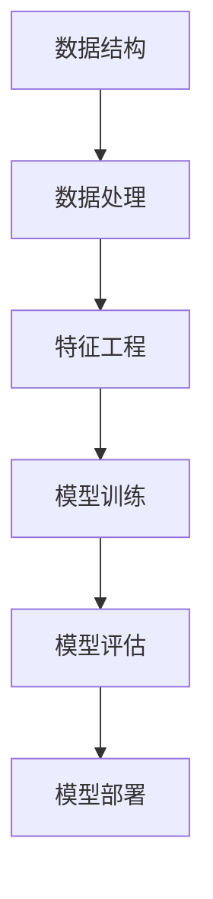

                 

### 《Apache Spark MLlib》

#### 关键词：
Apache Spark，MLlib，机器学习，大数据，分布式计算，算法优化

#### 摘要：
本文将深入探讨Apache Spark MLlib，一个强大的分布式机器学习库。文章将从MLlib的概述、核心概念、常见算法详解、实战案例、高级应用与优化以及未来发展趋势等方面进行全面剖析，帮助读者深入了解MLlib的核心原理和实际应用。

### 《Apache Spark MLlib》目录大纲

#### 第一部分：Apache Spark MLlib简介

**第1章：Apache Spark MLlib概述**

1.1 Apache Spark MLlib简介

- Apache Spark简介
- MLlib的功能与特性
- MLlib在机器学习中的优势

1.2 Apache Spark MLlib的发展历程

- 诞生背景
- 发展历程
- 未来发展趋势

1.3 Apache Spark MLlib的应用场景

- 数据预处理
- 分类
- 回归
- 聚类
- 协同过滤
- 特征提取

**第2章：Apache Spark MLlib核心概念**

2.1 数据结构与算法

- DataFrame与Dataset
- MLlib常用数据结构
- MLlib算法分类

2.2 特征工程

- 特征提取
- 特征选择
- 特征标准化

2.3 模型评估与优化

- 模型评估指标
- 模型选择与调参
- 模型融合

#### 第二部分：Apache Spark MLlib常见算法详解

**第3章：分类算法**

3.1 K近邻（KNN）

- 原理
- 伪代码
- 数学模型

3.2 决策树（DT）

- 原理
- 伪代码
- 数学模型

3.3 随机森林（RF）

- 原理
- 伪代码
- 数学模型

3.4 支持向量机（SVM）

- 原理
- 伪代码
- 数学模型

**第4章：回归算法**

4.1 线性回归（LR）

- 原理
- 伪代码
- 数学模型

4.2 逻辑回归（LR）

- 原理
- 伪代码
- 数学模型

4.3 回归树（RT）

- 原理
- 伪代码
- 数学模型

4.4 随机森林回归（RF-Regression）

- 原理
- 伪代码
- 数学模型

**第5章：聚类算法**

5.1 K均值（K-Means）

- 原理
- 伪代码
- 数学模型

5.2 层次聚类（Hierarchical Clustering）

- 原理
- 伪代码
- 数学模型

5.3 密度聚类（DBSCAN）

- 原理
- 伪代码
- 数学模型

**第6章：协同过滤**

6.1 用户基于物品的协同过滤

- 原理
- 伪代码
- 数学模型

6.2 物品基于用户的协同过滤

- 原理
- 伪代码
- 数学模型

#### 第三部分：高级应用与优化

**第7章：Apache Spark MLlib高级应用**

7.1 流数据机器学习

- 原理
- 应用场景

7.2 图机器学习

- 原理
- 应用场景

7.3 大规模机器学习

- 原理
- 应用场景

**第8章：Apache Spark MLlib性能优化**

8.1 算法选择与调优

- 原则
- 方法

8.2 代码优化

- 数据局部性优化
- 线程优化
- 内存管理优化

8.3 集群资源管理

- Spark资源管理
- 作业调度策略
- 集群性能优化

#### 第四部分：未来发展趋势

**第9章：Apache Spark MLlib未来发展趋势**

9.1 MLlib与深度学习集成

- 应用场景
- 融合方向

9.2 MLlib在工业界的应用

- 产业应用案例
- 产业趋势分析

9.3 MLlib开源生态

- 生态圈概述
- 开源项目推荐
- 生态圈发展趋势

#### 附录

**附录A：常用工具与资源**

- MLlib相关工具
- MLlib学习资源
- MLlib开源项目

**附录B：MLlib常用API参考**

- DataFrame API
- MLlib算法API
- 模型评估API

**附录C：习题与答案**

- 习题及解答
- 实践项目建议

**核心概念与联系流程图：**

**核心算法原理伪代码、数学模型和公式、项目实战**

请按照每个章节的结构，逐步深入分析每个算法的原理，使用伪代码和数学模型进行详细阐述，并在附录中提供相关的代码示例和实践项目建议。

---

**作者：** AI天才研究院/AI Genius Institute & 禅与计算机程序设计艺术 /Zen And The Art of Computer Programming

