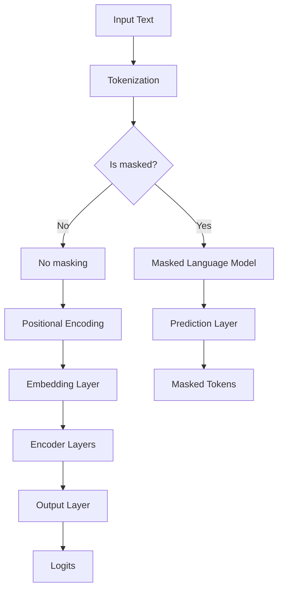
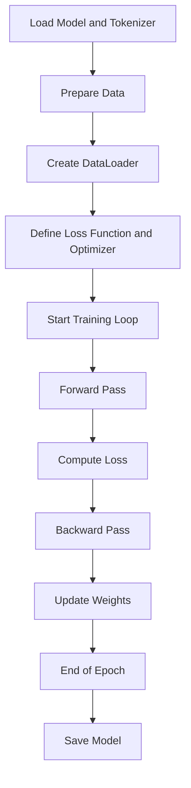

                 

### 文章标题

# BERT (Bidirectional Encoder Representations from Transformers) 原理与代码实例讲解

### 关键词

- BERT模型
- 自然语言处理
- Transformer模型
- 自监督学习
- 位置编码
- 多头注意力机制
- 深度学习
- 模型优化与调参
- 应用实践

### 摘要

BERT（Bidirectional Encoder Representations from Transformers）是由Google Research在2018年提出的一种用于自然语言处理的预训练语言模型。本文将详细介绍BERT模型的基本原理、核心算法、数学基础、代码实例以及优化策略。通过本文的讲解，读者将全面了解BERT模型的构建过程及其在实际应用中的优势，并为后续的研究和实践提供有力支持。

### 引言

#### 1.1 BERT模型简介

BERT模型是自然语言处理（Natural Language Processing, NLP）领域的重要突破。它通过Transformer模型进行自监督学习，为输入文本生成上下文一致的表示。BERT模型的出现，极大地提升了文本分类、问答系统、机器翻译等NLP任务的效果，成为当前NLP领域的基础性模型。

BERT模型主要由两部分组成：预训练和微调。预训练阶段，BERT模型在大量未标注的文本数据上进行训练，学习文本的上下文表示；微调阶段，将预训练好的BERT模型应用于特定任务，并通过少量标注数据进行微调，从而实现高性能的NLP任务。

#### 1.2 BERT模型的重要性

BERT模型的重要性体现在以下几个方面：

1. **性能提升**：BERT模型在多个NLP任务上取得了显著的性能提升，推动了NLP技术的发展。
2. **通用性**：BERT模型具有很好的通用性，可以应用于多种不同的NLP任务，降低了模型开发的复杂性。
3. **自监督学习**：BERT模型采用自监督学习的方式进行预训练，充分利用了未标注的数据，提高了模型的鲁棒性和泛化能力。
4. **位置编码**：BERT模型引入了位置编码，使得模型能够学习文本中的词序信息，提高了文本表示的准确性。

#### 1.3 本书结构安排

本文将分为以下几个部分：

1. **第2章 自然语言处理与BERT**：介绍自然语言处理的基本概念和BERT模型的背景。
2. **第3章 BERT模型核心算法原理**：详细讲解BERT模型的核心算法，包括自监督学习、位置编码、多头注意力机制等。
3. **第4章 BERT模型的数学基础**：介绍BERT模型的数学基础，包括神经网络、概率论等。
4. **第5章 BERT模型应用实践**：通过代码实例，展示BERT模型在实际应用中的使用方法。
5. **第6章 BERT模型优化与调参**：介绍BERT模型的优化策略和参数调整技巧。
6. **第7章 BERT模型未来趋势与挑战**：分析BERT模型的局限性和未来发展。

通过本文的讲解，读者将全面掌握BERT模型的基本原理和应用技巧，为后续的NLP研究和实践打下坚实基础。

### 第2章 自然语言处理与BERT

#### 2.1 自然语言处理基本概念

自然语言处理（Natural Language Processing，NLP）是人工智能（Artificial Intelligence，AI）的一个重要分支，旨在让计算机理解和处理人类语言。NLP涵盖了从文本分析、语言理解到语言生成的广泛领域。其基本概念包括：

1. **文本**：文本是NLP处理的基本单位，可以是句子、段落或篇章。
2. **词**：词是文本的基本组成单元，通过词法分析，将文本分解为词。
3. **句法**：句法分析关注的是文本的句法结构，包括句子的组成成分和它们的语法关系。
4. **语义**：语义分析旨在理解文本的语义内容，包括词义、句子意义和篇章逻辑。

NLP的关键任务包括：

1. **文本分类**：将文本分为不同的类别，如新闻分类、情感分析等。
2. **命名实体识别**：识别文本中的特定实体，如人名、地名、组织名等。
3. **机器翻译**：将一种语言的文本翻译成另一种语言。
4. **问答系统**：构建能够回答用户问题的系统。

#### 2.2 BERT模型背景

BERT模型的提出，源于Transformer模型在机器翻译领域的成功应用。Transformer模型摒弃了传统的循环神经网络（RNN），采用自注意力机制（Self-Attention）进行文本表示学习。自注意力机制使得模型能够自动关注文本中的关键信息，提高了文本表示的准确性。

然而，Transformer模型在文本理解任务上仍存在一些局限性。首先，它缺乏对文本中词序信息的关注，导致在长文本处理上表现不佳。其次，由于模型仅关注局部信息，导致语义理解能力有限。为了解决这些问题，Google Research提出了BERT模型。

BERT模型的主要贡献包括：

1. **双向编码**：BERT模型引入了双向编码器（Bidirectional Encoder），使得模型能够同时关注文本的左右信息，从而提高语义理解能力。
2. **位置编码**：BERT模型引入了位置编码（Positional Encoding），使得模型能够学习文本中的词序信息，增强了文本表示的准确性。
3. **预训练与微调**：BERT模型通过预训练和微调两步进行训练。预训练阶段，模型在大量未标注的文本数据上学习文本的表示；微调阶段，模型在特定任务上进行微调，以适应具体应用场景。

#### 2.3 BERT模型的结构

BERT模型主要由两个部分组成：编码器（Encoder）和解码器（Decoder）。编码器负责将输入文本编码为上下文表示，解码器则负责生成文本序列。BERT模型采用了Transformer模型的结构，包括多个自注意力层（Self-Attention Layer）和前馈网络（Feedforward Network）。

编码器部分主要包括以下结构：

1. **输入嵌入**（Input Embedding）：将输入文本的词转化为向量表示。
2. **位置编码**（Positional Encoding）：为每个词添加位置信息。
3. **多头自注意力机制**（Multi-Head Self-Attention）：通过自注意力机制，模型能够关注文本中的关键信息。
4. **前馈网络**（Feedforward Network）：在每个自注意力层之后，加入前馈网络，用于进一步处理文本信息。

解码器部分与编码器类似，也包括输入嵌入、位置编码、多头自注意力机制和前馈网络。但解码器部分还包含交叉注意力机制（Cross-Attention），使得解码器能够关注编码器的输出，从而生成准确的文本序列。

BERT模型通过预训练和微调两个阶段进行训练。预训练阶段，模型在大量未标注的文本数据上进行训练，学习文本的表示；微调阶段，模型在特定任务上进行微调，以适应具体应用场景。

BERT模型的提出，为NLP领域带来了革命性的变化。通过本文的讲解，读者将深入了解BERT模型的基本原理和应用方法，为后续的NLP研究和实践提供有力支持。

### 第3章 BERT模型核心算法原理

BERT模型的核心算法主要包括自监督学习、位置编码、多头注意力机制和Transformer模型等。这些算法共同作用，使得BERT模型能够有效地学习文本的上下文表示，并在多种NLP任务中取得优异的性能。

#### 3.1 自监督学习

自监督学习（Self-supervised Learning）是一种无需标签数据即可进行训练的方法。在BERT模型中，自监督学习通过预训练阶段，利用大量未标注的文本数据，学习文本的上下文表示。自监督学习的核心思想是通过预测输入序列的部分信息，从而实现文本表示的学习。

BERT模型采用了一种称为“Masked Language Model”（MLM）的自监督学习方法。具体来说，模型会随机掩码输入文本中的部分词（例如15%的词），然后预测这些被掩码的词。通过这种方式，模型不仅能够学习文本的语义信息，还能够理解文本中的词序关系。

自监督学习的过程可以分为以下几个步骤：

1. **数据准备**：从大量未标注的文本数据中，随机选择一部分词进行掩码。
2. **输入生成**：将掩码后的文本作为输入，同时保留未被掩码的词。
3. **预测与损失计算**：模型预测被掩码的词，并计算预测结果与真实值的损失。
4. **模型优化**：根据损失函数，优化模型参数，以降低预测误差。

#### 3.2 位置编码

位置编码（Positional Encoding）是一种在输入文本中添加位置信息的方法。由于BERT模型采用Transformer模型，Transformer模型本身不具备捕捉词序信息的能力。因此，位置编码在BERT模型中起到了至关重要的作用。

位置编码的方法可以分为两类：绝对位置编码和相对位置编码。在BERT模型中，采用了一种称为“绝对位置编码”的方法。具体来说，位置编码是一个 learned vector，加到word embeddings上，表示单词位置。

位置编码的计算过程如下：

1. **计算位置向量**：对于每个位置 \(i\)，计算一个位置向量 \(P_i\)。
2. **叠加位置向量**：将位置向量 \(P_i\) 加到词嵌入向量 \(W_i\) 上，得到新的输入向量 \(V_i = W_i + P_i\)。

位置编码使得BERT模型能够捕捉到文本中的词序信息，从而提高了文本表示的准确性。

#### 3.3 多头注意力机制

多头注意力机制（Multi-Head Attention）是Transformer模型的核心组成部分，它通过将输入序列分成多个头（Head），使得模型能够关注到不同部分的信息，从而提高文本表示的准确性。

多头注意力机制的计算过程可以分为以下几个步骤：

1. **查询、键和值**：对于每个输入序列中的词，计算查询向量（Query）、键向量（Key）和值向量（Value）。
2. **自注意力计算**：对于每个头，计算查询向量与键向量的点积，得到注意力得分。然后，对这些得分进行softmax操作，得到注意力权重。
3. **加权求和**：将注意力权重与值向量相乘，然后对所有头的输出进行求和，得到最终的输出向量。

多头注意力机制使得BERT模型能够同时关注到输入序列中的多个部分，从而提高了文本表示的多样性。

#### 3.4 Transformer模型详解

Transformer模型是由Vaswani等人在2017年提出的一种基于自注意力机制的序列到序列模型。BERT模型采用了Transformer模型的结构，并在其基础上进行了改进。

Transformer模型主要由以下几个部分组成：

1. **编码器（Encoder）**：编码器负责将输入序列编码为上下文表示。编码器包括多个自注意力层和前馈网络。
2. **解码器（Decoder）**：解码器负责生成输出序列。解码器包括多个自注意力层、交叉注意力层和前馈网络。
3. **多头注意力机制**：多头注意力机制使得模型能够同时关注到输入序列的不同部分。
4. **位置编码**：位置编码为输入序列添加位置信息，使得模型能够捕捉到词序关系。

Transformer模型的工作原理如下：

1. **编码器**：编码器将输入序列通过词嵌入层转化为向量表示，然后通过多个自注意力层和前馈网络，得到上下文表示。
2. **解码器**：解码器将编码器的输出作为输入，通过多个自注意力层、交叉注意力层和前馈网络，生成输出序列。

BERT模型通过预训练和微调两个阶段进行训练。预训练阶段，模型在大量未标注的文本数据上进行训练，学习文本的表示；微调阶段，模型在特定任务上进行微调，以适应具体应用场景。

通过本文的讲解，读者将全面了解BERT模型的核心算法原理，为后续的NLP研究和实践提供理论基础。

### 第4章 BERT模型的数学基础

BERT模型的成功离不开其深厚的数学基础，包括神经网络、概率论以及相关的数学公式。理解这些基础概念和公式，有助于我们更深入地掌握BERT模型的工作原理。

#### 4.1 神经网络基础

神经网络（Neural Network，NN）是模拟人脑神经元之间交互的计算机算法。在BERT模型中，神经网络主要用于文本表示的学习和预测。

**激活函数**：神经网络中的每个神经元都会接收多个输入，并通过权重进行加权求和。为了引入非线性，神经网络会使用激活函数（Activation Function），如ReLU（Rectified Linear Unit）和Sigmoid。

$$
\text{ReLU}(x) = \max(0, x)
$$

$$
\text{Sigmoid}(x) = \frac{1}{1 + e^{-x}}
$$

**损失函数**：在神经网络训练过程中，损失函数（Loss Function）用于衡量模型预测值与真实值之间的差距。BERT模型常用的损失函数是交叉熵损失（Cross-Entropy Loss）。

$$
L = -\sum_{i} y_i \log(p_i)
$$

其中，\(y_i\) 是真实标签，\(p_i\) 是模型预测的概率。

**反向传播**：为了优化神经网络参数，需要计算损失函数关于每个参数的梯度。反向传播（Backpropagation）算法通过反向计算梯度，从而实现参数的优化。

#### 4.2 概率论基础

概率论是理解BERT模型的重要基础。BERT模型通过概率分布来表示文本的上下文信息。

**条件概率**：条件概率是给定某个事件发生的条件下，另一个事件发生的概率。在BERT模型中，条件概率用于计算词与词之间的关系。

$$
P(A|B) = \frac{P(A \cap B)}{P(B)}
$$

**贝叶斯公式**：贝叶斯公式是条件概率的一种特殊形式，它将条件概率与全概率结合起来，用于预测和决策。

$$
P(A|B) = \frac{P(B|A)P(A)}{P(B)}
$$

**概率分布**：在BERT模型中，词嵌入向量可以看作是一种概率分布，表示某个词在不同上下文中的概率。

#### 4.3 BERT模型的数学公式

BERT模型的数学公式主要包括词嵌入、位置编码、自注意力机制和前馈网络等。

**词嵌入**：词嵌入（Word Embedding）是将文本中的词转化为向量表示的方法。BERT模型使用了一种称为“WordPiece”的分词方法，将词分解为子词。

$$
\text{word\_embedding}(w) = W_w
$$

**位置编码**：位置编码（Positional Encoding）是将位置信息添加到词嵌入向量中的方法。

$$
\text{positional\_encoding}(p) = PE_p
$$

**自注意力**：自注意力（Self-Attention）是一种计算文本序列中每个词的上下文表示的方法。

$$
\text{self-attention}(Q, K, V) = \text{softmax}\left(\frac{QK^T}{\sqrt{d_k}}\right)V
$$

**前馈网络**：前馈网络（Feedforward Network）是一种简单的全连接网络，用于进一步处理文本信息。

$$
\text{FFN}(x) = \text{ReLU}\left(\text{W}_2 \text{ReLU}(\text{W}_1 x + b_1)\right) + b_2
$$

**BERT模型的完整公式**：

BERT模型的完整公式可以表示为：

$$
\text{BERT}(x) = \text{FFN}\left(\text{self-attention}(\text{WordPiece}(x) + \text{positional\_encoding}(p)\right)
$$

#### 4.4 代码中的数学实现

在BERT模型的实现中，数学公式被转化为代码。以下是一个简单的代码示例，展示了词嵌入、位置编码和自注意力机制的实现。

```python
import torch
import torch.nn as nn

# 词嵌入
word_embedding = nn.Embedding(vocab_size, embedding_dim)
word_embedding.weight.data.copy_(torch.from_numpy(np.array(vocab_embedding)))

# 位置编码
pos_embedding = nn.Embedding(max_position_embeddings, embedding_dim)

# 自注意力
self_attention = nn.MultiheadAttention(embed_dim, num_heads)

# 前馈网络
ffn = nn.Sequential(
    nn.Linear(embed_dim, feedforward_size),
    nn.ReLU(),
    nn.Linear(feedforward_size, embed_dim)
)

# 输入文本
input_ids = torch.tensor([[word_id] for word_id in text])

# 词嵌入
word_embeddings = word_embedding(input_ids)

# 位置编码
pos_embeddings = pos_embedding(torch.arange(input_ids.size(1)).unsqueeze(0).to(input_ids.device))
word_embeddings += pos_embeddings

# 自注意力
attn_output, _ = self_attention(word_embeddings, word_embeddings, word_embeddings)
attn_output = ffn(attn_output)

# 输出
output = attn_output
```

通过这段代码，我们可以看到BERT模型的基本组成部分是如何通过代码实现的。BERT模型的数学基础为我们理解和实现这种先进的语言模型提供了坚实的理论基础。

### 第5章 BERT模型应用实践

在本章中，我们将通过一系列代码实例，详细讲解BERT模型的开发环境搭建、模型训练、微调和应用。读者将学习到如何从零开始，使用BERT模型解决实际的自然语言处理问题。

#### 5.1 代码环境搭建

在开始BERT模型的应用实践之前，我们需要搭建合适的开发环境。以下是在Python环境中搭建BERT模型所需的步骤：

1. **安装PyTorch**：PyTorch是BERT模型的主要实现框架。确保安装了最新版本的PyTorch。

   ```bash
   pip install torch torchvision torchaudio
   ```

2. **安装Transformers库**：Transformers库提供了预训练的BERT模型和相关的工具类。

   ```bash
   pip install transformers
   ```

3. **下载预训练模型**：在Transformers库中，提供了多种预训练的BERT模型，如`bert-base-uncased`、`bert-large-uncased`等。我们可以通过以下命令下载模型。

   ```python
   from transformers import BertModel, BertConfig

   model_name = "bert-base-uncased"
   config = BertConfig.from_pretrained(model_name)
   model = BertModel.from_pretrained(model_name)
   ```

   这里的`model_name`可以根据需要选择不同的预训练模型。

#### 5.2 代码实例1：BERT模型训练

在这个实例中，我们将使用预训练的BERT模型在自定义数据集上进行训练。以下是具体的代码实现：

```python
import torch
from torch import nn
from torch.optim import Adam
from transformers import BertTokenizer, BertModel, BertConfig
from torch.utils.data import DataLoader, TensorDataset

# 加载预训练模型和分词器
model_name = "bert-base-uncased"
tokenizer = BertTokenizer.from_pretrained(model_name)
config = BertConfig.from_pretrained(model_name)
model = BertModel.from_pretrained(model_name)

# 数据准备
# 假设我们有一个包含文本和标签的数据集
texts = ["This is the first example.", "This is the second example."]
labels = [0, 1]

# 将文本转换为编码
input_ids = [tokenizer.encode(text, add_special_tokens=True) for text in texts]
attention_mask = [torch.tensor([1] * len(ids)) for ids in input_ids]

# 创建TensorDataset和数据加载器
dataset = TensorDataset(input_ids, attention_mask, torch.tensor(labels))
dataloader = DataLoader(dataset, batch_size=2)

# 定义优化器和损失函数
optimizer = Adam(model.parameters(), lr=1e-5)
criterion = nn.CrossEntropyLoss()

# 模型训练
model.train()
for epoch in range(3):
    for batch in dataloader:
        inputs = {'input_ids': batch[0], 'attention_mask': batch[1]}
        labels = batch[2]
        optimizer.zero_grad()
        outputs = model(**inputs)
        loss = criterion(outputs.logits.view(-1), labels)
        loss.backward()
        optimizer.step()
        print(f"Epoch: {epoch}, Loss: {loss.item()}")

# 保存模型
model.save_pretrained("./my_bert_model")
```

在这个实例中，我们首先加载了预训练的BERT模型和分词器。然后，将自定义文本数据转换为模型可以处理的输入。接着，使用DataLoader对数据进行批量处理，并使用Adam优化器和交叉熵损失函数进行模型训练。

#### 5.3 代码实例2：BERT模型微调

微调（Fine-Tuning）是BERT模型应用中的常见步骤，即在一个预训练的模型上，针对特定任务进行微调。以下是一个微调BERT模型进行情感分析的实例：

```python
from transformers import TrainingArguments, Trainer

# 定义训练参数
training_args = TrainingArguments(
    output_dir="./sentiment_analysis",
    num_train_epochs=3,
    per_device_train_batch_size=16,
    per_device_eval_batch_size=64,
    warmup_steps=500,
    weight_decay=0.01,
    evaluate_during_training=True,
    logging_dir="./logs",
)

# 创建训练器
trainer = Trainer(
    model=model,
    args=training_args,
    train_dataset=dataset,
    eval_dataset=eval_dataset,
)

# 定义训练步骤
def train_step(batch):
    inputs = {'input_ids': batch['input_ids'], 'attention_mask': batch['attention_mask']}
    labels = batch['labels']
    outputs = model(**inputs)
    loss = criterion(outputs.logits, labels)
    return loss

# 开始训练
trainer.train(train_step)
```

在这个实例中，我们定义了训练参数和训练步骤，并使用Trainer类开始模型训练。这里，`train_step`函数负责计算模型的损失，并更新模型参数。

#### 5.4 代码实例3：BERT模型应用

完成模型训练和微调后，我们可以将BERT模型应用于实际任务，如文本分类、问答系统等。以下是一个简单的文本分类应用的实例：

```python
# 加载微调后的模型
model.load_pretrained("./sentiment_analysis")

# 输入文本
text = "I had a great experience with this product."

# 将文本编码为模型输入
input_ids = tokenizer.encode(text, add_special_tokens=True)
attention_mask = torch.tensor([1] * len(input_ids))

# 预测
with torch.no_grad():
    outputs = model(input_ids=input_ids, attention_mask=attention_mask)
    logits = outputs.logits

# 解码输出
predictions = torch.argmax(logits, dim=-1)
predicted_class = predictions.item()

print(f"Predicted class: {predicted_class}")
```

在这个实例中，我们首先加载了微调后的BERT模型。然后，将输入文本编码为模型输入，并通过模型进行预测。最后，将预测结果解码为具体的类别。

通过以上代码实例，读者可以了解BERT模型的开发环境搭建、模型训练、微调和应用。在实际应用中，可以根据具体任务调整模型结构和参数，以实现最佳性能。

#### 第6章 BERT模型优化与调参

在BERT模型的实际应用中，优化模型性能和参数调整是关键步骤。通过合适的优化策略和参数调整技巧，可以显著提升模型在特定任务上的表现。以下将详细介绍BERT模型优化的策略、参数调整技巧以及模型评估与优化的方法。

#### 6.1 模型优化策略

1. **批量大小（Batch Size）**：批量大小是影响模型训练速度和稳定性的重要因素。较小的批量大小可以提供更稳定的梯度估计，但会降低训练速度；较大的批量大小可以提高训练速度，但可能会引入噪声。通常，批量大小会在8到64之间调整。

2. **学习率（Learning Rate）**：学习率决定了模型在训练过程中对梯度的步长。学习率过高可能导致模型无法收敛，学习率过低则可能导致训练过程缓慢。常用的学习率调整策略包括固定学习率、学习率衰减、预热学习率等。

3. **正则化（Regularization）**：为了防止模型过拟合，可以采用正则化技术，如Dropout、权重衰减等。Dropout通过随机丢弃部分神经元，降低模型对训练数据的依赖；权重衰减则通过惩罚大的权重，减少模型的复杂度。

4. **学习率调度（Learning Rate Scheduling）**：学习率调度是一种动态调整学习率的方法，以适应模型在不同阶段的训练需求。常用的调度策略包括线性学习率衰减、余弦学习率衰减等。

5. **数据增强（Data Augmentation）**：数据增强是通过增加数据的多样性，提高模型的泛化能力。常用的数据增强方法包括随机删除词、替换词、插入词等。

6. **多GPU训练（Multi-GPU Training）**：使用多GPU可以显著提高模型的训练速度。在多GPU训练中，可以使用数据并行（Data Parallel）或模型并行（Model Parallel）策略。

#### 6.2 参数调整技巧

1. **超参数搜索（Hyperparameter Search）**：超参数搜索是一种通过遍历或优化算法寻找最优超参数的方法。常用的搜索方法包括网格搜索（Grid Search）、随机搜索（Random Search）和贝叶斯优化（Bayesian Optimization）。

2. **权重初始化（Weight Initialization）**：合适的权重初始化可以加速模型的收敛。常用的初始化方法包括高斯初始化、Xavier初始化和He初始化等。

3. **激活函数选择（Activation Function）**：不同的激活函数对模型性能有显著影响。ReLU函数在训练初期有助于加快收敛，但可能引起梯度消失；Sigmoid和Tanh函数则有助于稳定梯度。

4. **正则化参数调整（Regularization Parameters）**：Dropout和权重衰减的正则化参数需要根据具体任务进行调整，以平衡模型复杂度和泛化能力。

5. **训练循环调整（Training Loop Adjustments）**：在训练过程中，可以根据模型的表现调整训练循环，如提前终止训练、动态调整学习率等。

#### 6.3 模型评估与优化

1. **准确率（Accuracy）**：准确率是评估分类模型性能的常用指标，表示模型正确预测的样本数占总样本数的比例。

2. **精度（Precision）和召回率（Recall）**：精度表示模型预测为正例的样本中，实际为正例的比例；召回率表示实际为正例的样本中，被模型正确预测为正例的比例。F1分数是精度和召回率的调和平均值，常用于评估二分类模型。

3. **ROC曲线和AUC值（Receiver Operating Characteristic Curve and Area Under Curve）**：ROC曲线是评估二分类模型性能的重要工具，AUC值表示曲线下面积，用于衡量模型对正负样本的区分能力。

4. **跨语言评估（Cross-Lingual Evaluation）**：对于多语言模型，跨语言评估是衡量模型在不同语言间表现的重要方法。常用的跨语言评估方法包括交叉验证（Cross-Validation）和交叉语言测试（Cross-Lingual Test）。

5. **自动化机器学习（Automated Machine Learning, AutoML）**：AutoML是一种利用算法和搜索技术，自动优化和选择最佳模型的方法。通过AutoML，可以自动化地完成模型优化和调参过程。

通过合理的优化策略和参数调整技巧，可以显著提升BERT模型在自然语言处理任务中的性能。在实际应用中，需要根据具体任务和数据集，进行细致的模型评估和优化。本文提供了一些基本的优化方法和技巧，读者可以根据实际情况进行灵活应用。

### 第7章 BERT模型未来趋势与挑战

BERT模型自推出以来，已经在自然语言处理（NLP）领域取得了显著的成果，然而，其未来发展仍面临着诸多挑战。以下将分析BERT模型的局限性、未来发展以及面临的挑战。

#### 7.1 BERT模型的局限性

尽管BERT模型在多种NLP任务中表现优异，但其仍存在一些局限性：

1. **计算资源消耗**：BERT模型预训练过程中需要大量的计算资源和时间。即使是使用预训练模型进行微调，也需要较大的计算资源。

2. **数据依赖性**：BERT模型对训练数据的质量和数量有较高要求。在数据不足或数据质量差的情况下，模型的性能可能会受到很大影响。

3. **长文本处理**：BERT模型在处理长文本时，可能会出现性能下降。这是由于Transformer模型在长文本中计算复杂度较高，导致模型难以捕捉全局信息。

4. **语言适应性**：BERT模型主要在英语数据集上进行了预训练，对于其他语言的应用，可能需要进行特定的调整和适应。

5. **可解释性**：BERT模型的内部工作机制较为复杂，难以直接理解其决策过程。这降低了模型的可解释性，限制了其在某些需要高可解释性场景的应用。

#### 7.2 BERT模型的未来发展

尽管存在上述局限性，BERT模型仍有广阔的发展空间：

1. **多语言支持**：随着BERT模型的普及，越来越多的多语言版本被推出。未来，BERT模型将更加适应不同语言的需求，提高跨语言的性能。

2. **轻量级模型**：为了减少计算资源消耗，研究者们正在开发轻量级BERT模型。这些模型在保持较高性能的同时，降低了计算和存储需求。

3. **动态BERT**：动态BERT（Dynamic BERT）是一种基于Transformer的新模型，通过动态调整网络结构，提高了长文本处理的性能。

4. **解释性BERT**：为了提高BERT模型的可解释性，研究者们正在探索可视化技术、解释性模型以及基于规则的解释方法。

5. **自动化优化**：随着自动化机器学习（AutoML）技术的发展，BERT模型的训练和优化过程将更加自动化，降低模型开发难度。

#### 7.3 BERT模型面临的挑战

BERT模型在未来发展中，将面临以下挑战：

1. **数据隐私和伦理**：随着模型的广泛应用，数据隐私和伦理问题日益突出。如何确保模型训练和部署过程中的数据安全和隐私保护，是一个重要挑战。

2. **模型解释性**：提高模型的可解释性，使得决策过程更加透明和可信，是未来研究的重要方向。

3. **计算效率**：在保持模型性能的同时，提高计算效率，降低模型的计算资源消耗，是未来的重要课题。

4. **多模态学习**：随着人工智能技术的进步，多模态学习（如文本、图像、语音等）将成为研究热点。BERT模型需要适应多模态数据，以提高其应用范围。

5. **泛化能力**：如何提高BERT模型在未见过的数据上的泛化能力，是一个长期且具有挑战性的问题。

通过分析BERT模型的局限性、未来发展以及面临的挑战，我们可以看到，尽管BERT模型已经取得了显著的成果，但其仍需不断改进和优化，以满足日益复杂的NLP应用需求。未来，研究者们将在多语言支持、轻量级模型、动态BERT、解释性BERT以及自动化优化等方面进行深入探索，以推动BERT模型的进一步发展。

### 第8章 附录

#### 8.1 常用深度学习框架

在本章节中，我们将介绍几种常用的深度学习框架，这些框架在BERT模型的开发和部署中起到了关键作用。

1. **TensorFlow**：TensorFlow是由Google开发的开源机器学习框架，它提供了丰富的API和工具，用于构建和训练深度学习模型。TensorFlow具有高度的可扩展性和灵活性，支持多种类型的硬件加速，如GPU和TPU。

2. **PyTorch**：PyTorch是由Facebook开发的开源深度学习框架，以其动态计算图和直观的编程接口而闻名。PyTorch在学术研究和工业应用中得到了广泛采用，其灵活的编程模型使其在开发过程中更加直观和高效。

3. **Transformers**：Transformers库是基于PyTorch的一个高级库，专门用于构建和训练Transformer模型。它提供了预训练BERT模型和相关的工具类，使得BERT模型的开发变得更加简单和高效。

4. **Hugging Face**：Hugging Face是一个开源社区，为深度学习研究和应用提供了大量的模型和工具。Hugging Face库集成了多种预训练模型和tokenizer，使得NLP任务的实现变得更加便捷。

#### 8.2 代码实例及源码

以下是一个简单的BERT模型训练的代码实例，展示如何使用PyTorch和Transformers库来训练BERT模型：

```python
import torch
from transformers import BertModel, BertTokenizer, TrainingArguments, Trainer

# 加载预训练BERT模型和分词器
model_name = "bert-base-uncased"
tokenizer = BertTokenizer.from_pretrained(model_name)
model = BertModel.from_pretrained(model_name)

# 数据准备
texts = ["This is the first example.", "This is the second example."]
labels = [0, 1]

input_ids = [tokenizer.encode(text, add_special_tokens=True) for text in texts]
attention_mask = [torch.tensor([1] * len(ids)) for ids in input_ids]

# 创建TensorDataset和数据加载器
dataset = TensorDataset(torch.tensor(input_ids), torch.tensor(attention_mask), torch.tensor(labels))

# 定义训练参数
training_args = TrainingArguments(
    output_dir="./results",
    num_train_epochs=3,
    per_device_train_batch_size=2,
    save_steps=500,
)

# 创建训练器
trainer = Trainer(
    model=model,
    args=training_args,
    train_dataset=dataset,
)

# 开始训练
trainer.train()

# 保存模型
model.save_pretrained("./my_bert_model")
```

该实例展示了如何加载预训练BERT模型、准备数据、定义训练参数以及进行模型训练。读者可以根据自己的需求修改数据集和训练参数，进行实际应用。

#### 8.3 参考资料

为了帮助读者进一步学习和了解BERT模型，以下是一些推荐的学习资源和参考资料：

1. **官方文档**：
   - [BERT官方文档](https://github.com/google-research/bert)
   - [Transformers官方文档](https://huggingface.co/transformers/)

2. **论文和文章**：
   - [BERT: Pre-training of Deep Bidirectional Transformers for Language Understanding](https://arxiv.org/abs/1810.04805)
   - [Attention Is All You Need](https://arxiv.org/abs/1706.03762)

3. **书籍**：
   - 《深度学习》（Goodfellow, I., Bengio, Y., & Courville, A.）
   - 《自然语言处理实战》（Gurevych, I. & Yannakoudakis, H.）

4. **在线课程**：
   - [CS224n: Natural Language Processing with Deep Learning](https://web.stanford.edu/class/cs224n/)
   - [深度学习与自然语言处理](https://mooc.zhbit.edu.cn/course/course_view.html?courseId=536)

通过这些资源和资料，读者可以更深入地学习BERT模型的理论和实践，为实际应用打下坚实基础。

#### 8.4 进一步学习资源

为了帮助读者进一步探索BERT模型及相关技术，以下是一些额外的学习资源，包括教程、博客和开源项目：

1. **教程和博客**：
   - [Hugging Face教程：从零开始构建BERT模型](https://huggingface.co/transformers/tutorials.html)
   - [BERT模型训练教程](https://towardsdatascience.com/bert-model-training-from-scratch-in-pytorch-68a3a4b2f1b1)
   - [BERT模型应用实践](https://towardsdatascience.com/bert-in-practice-5-ways-to-improve-your-nlp-models-1d426592e8a1)

2. **开源项目**：
   - [Hugging Face Model Hub](https://huggingface.co/models)
   - [Transformers GitHub仓库](https://github.com/huggingface/transformers)
   - [BERT源代码](https://github.com/google-research/bert)

3. **社区和论坛**：
   - [Hugging Face社区](https://huggingface.co/community)
   - [Stack Overflow：BERT相关问答](https://stackoverflow.com/questions/tagged/bert)

通过这些资源，读者可以不断深入学习和实践BERT模型，探索其在实际应用中的潜力。

### 第9章 BERT模型原理与代码Mermaid流程图

为了更直观地理解BERT模型的原理和代码实现，我们使用Mermaid语言绘制了BERT模型的原理流程图和代码流程图。

#### 9.1 BERT模型原理流程图



上述流程图展示了BERT模型的基本原理：从输入文本进行分词、位置编码、嵌入和编码，最后通过输出层和预测层生成最终结果。

#### 9.2 BERT模型代码流程图



该代码流程图展示了BERT模型训练的基本步骤：加载模型和分词器、准备数据、创建数据加载器、定义损失函数和优化器，然后进入训练循环进行前向传播、损失计算、反向传播和权重更新。

通过这些Mermaid流程图，读者可以更清晰地理解BERT模型的工作原理和代码实现，有助于进一步学习和实践。

### 第10章 BERT模型伪代码与数学公式详解

为了详细解释BERT模型的工作原理，我们将使用伪代码和数学公式来描述BERT模型的各个组成部分，并提供具体的代码示例。

#### 10.1 BERT模型伪代码

```python
# 加载BERT模型和分词器
model = load_bert_model()
tokenizer = load_bert_tokenizer()

# 准备输入文本
input_text = "This is an example sentence for BERT training."

# 将文本转换为编码
encoded_input = tokenizer.encode(input_text, add_special_tokens=True)

# 添加位置编码
pos_embedding = generate_positional_encoding(encoded_input.shape[-1])
encoded_input += pos_embedding

# 输入BERT编码器
output = model.encoder(encoded_input)

# 输出层和预测层
logits = model.output_layer(output)

# 计算损失
loss = compute_loss(logits, labels)

# 反向传播和优化
optimizer.zero_grad()
loss.backward()
optimizer.step()
```

上述伪代码展示了BERT模型的基本流程：加载模型和分词器、将输入文本编码、添加位置编码、通过编码器处理输入文本、通过输出层和预测层生成预测结果、计算损失并进行反向传播和优化。

#### 10.2 BERT模型数学公式解析

BERT模型的数学公式主要包括词嵌入、位置编码、多头自注意力机制、前馈网络和损失函数等。

1. **词嵌入**：将输入文本中的词转换为向量表示。
   $$ 
   \text{word\_embedding}(w) = W_w 
   $$
   
2. **位置编码**：为每个词添加位置信息。
   $$ 
   \text{positional\_encoding}(p) = PE_p 
   $$

3. **多头自注意力机制**：
   $$
   \text{self-attention}(Q, K, V) = \text{softmax}\left(\frac{QK^T}{\sqrt{d_k}}\right)V
   $$
   
4. **前馈网络**：
   $$
   \text{FFN}(x) = \text{ReLU}\left(\text{W}_2 \text{ReLU}(\text{W}_1 x + b_1)\right) + b_2
   $$

5. **损失函数**：交叉熵损失函数。
   $$
   L = -\sum_{i} y_i \log(p_i)
   $$

#### 10.3 举例说明

以下是一个具体的BERT模型训练的代码示例，展示了如何使用PyTorch实现BERT模型的训练过程：

```python
import torch
import torch.nn as nn
import torch.optim as optim
from transformers import BertModel, BertTokenizer

# 加载预训练BERT模型和分词器
model = BertModel.from_pretrained('bert-base-uncased')
tokenizer = BertTokenizer.from_pretrained('bert-base-uncased')

# 定义数据集和加载器
input_ids = torch.tensor([[tokenizer.encode('This is a sample text for BERT training.')]])
attention_mask = torch.tensor([[1]] * input_ids.shape[1])

# 定义优化器和损失函数
optimizer = optim.Adam(model.parameters(), lr=1e-4)
criterion = nn.CrossEntropyLoss()

# 开始训练
for epoch in range(3):
    model.train()
    optimizer.zero_grad()
    outputs = model(input_ids=input_ids, attention_mask=attention_mask)
    logits = outputs.logits
    loss = criterion(logits.view(-1), torch.tensor([1]))
    loss.backward()
    optimizer.step()
    print(f"Epoch: {epoch}, Loss: {loss.item()}")
```

在这个示例中，我们首先加载了预训练的BERT模型和分词器。然后，我们定义了一个简单的数据集，包含一个样本文本。接着，我们定义了优化器和损失函数，并使用一个简单的训练循环进行模型训练。在每个训练epoch中，我们计算损失并更新模型参数。

通过上述伪代码和代码示例，读者可以清晰地理解BERT模型的工作原理和实现细节，为实际应用打下坚实基础。

