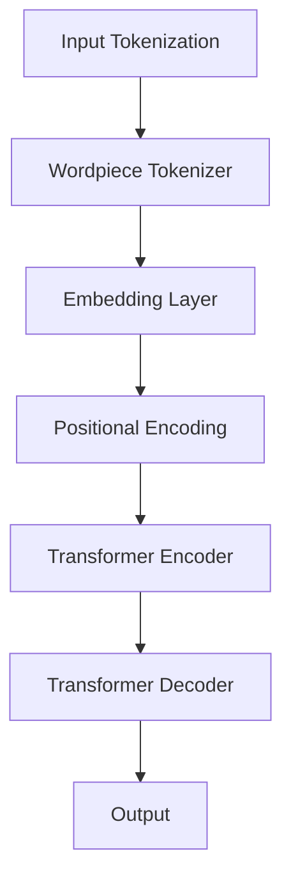

                 

### 文章标题

# BLOOM原理与代码实例讲解

### 关键词

- BLOOM
- 语言模型
- Transformer
- 前向传播
- 反向传播
- 项目实战
- 应用场景

### 摘要

本文旨在深入解析BLOOM原理，并通过代码实例讲解其实现与应用。文章首先介绍了BLOOM的背景和目标，然后详细阐述了其核心概念、数学模型和算法原理。随后，文章通过一个实际项目实战展示了BLOOM的搭建和训练过程，并对其在不同应用场景中的表现进行了分析。最后，文章探讨了BLOOM的优化方向和未来发展趋势，为读者提供了一个全面而深入的BLOOM技术解读。

## 第1章 BLOOM基础

### 1.1 BLOOM概述

BLOOM是一种基于Transformer架构的大型语言模型，由OpenAI于2022年发布。BLOOM旨在解决自然语言处理（NLP）中的文本生成、机器翻译和问答系统等任务。与传统语言模型相比，BLOOM具有更大的模型规模和更高的计算效率，能够在保证性能的同时降低成本。

BLOOM的主要目标是实现高性能、高精度的自然语言处理模型。其设计理念包括：

1. **大规模模型**：通过增加模型参数数量，提升模型的表达能力。
2. **高效计算**：采用Transformer架构，优化模型计算效率。
3. **自适应训练**：根据不同任务动态调整模型结构和参数。

### 1.2 BLOOM目标

BLOOM的主要目标包括：

1. **文本生成**：能够根据输入文本生成连贯、合理的文本输出。
2. **机器翻译**：实现高质量的多语言翻译能力。
3. **问答系统**：提供准确的答案，支持复杂问题的理解和回答。

### 1.3 BLOOM与其他语言模型对比

与GPT-3、BERT等大型语言模型相比，BLOOM具有以下特点：

1. **模型规模**：BLOOM具有更大的模型规模，参数数量更多。
2. **计算效率**：BLOOM采用Transformer架构，优化了计算效率。
3. **应用场景**：BLOOM针对特定的自然语言处理任务进行优化，具有更高的针对性。

### 1.4 BLOOM核心概念

BLOOM的核心概念包括token、embedding、attention机制和Transformer架构。

1. **token**：token是自然语言处理中的基本单位，例如单词或字符。
2. **embedding**：embedding是将token映射到高维空间的向量表示。
3. **attention机制**：attention机制用于模型在处理序列数据时，根据不同位置的权重关注重要的信息。
4. **Transformer架构**：Transformer是一种基于self-attention机制的深度学习模型，用于处理序列数据。

### 1.5 BLOOM的Mermaid流程图

以下是BLOOM的Mermaid流程图，展示了其总体架构和工作流程：



### 1.6 BLOOM数学模型与公式

BLOOM的数学模型包括概率分布计算和交叉熵损失函数。

1. **概率分布计算**：

   在BLOOM中，输入文本通过wordpiece tokenizer转化为token序列。每个token的嵌入向量经过Transformer编码器处理后，得到输出序列。概率分布计算如下：

   $$ P(y | x) = \prod_{i=1}^{n} p(y_i | x_1, x_2, ..., x_{i-1}) $$

   其中，$x$是输入文本序列，$y$是输出文本序列，$p(y_i | x_1, x_2, ..., x_{i-1})$是给定前一个token $x_{i-1}$ 时，生成当前token $y_i$ 的概率。

2. **交叉熵损失函数**：

   交叉熵损失函数用于衡量模型预测概率分布与真实分布之间的差异。交叉熵损失函数如下：

   $$ L = -\sum_{i=1}^{n} y_i \log(p(y_i | x_1, x_2, ..., x_{i-1})) $$

   其中，$y_i$是真实标签，$p(y_i | x_1, x_2, ..., x_{i-1})$是模型预测的概率。

## 第2章 BLOOM算法原理

### 2.1 前向传播算法原理

BLOOM的前向传播算法基于Transformer架构，包括多个编码器和解码器层。以下是对其原理的详细解析：

1. **编码器（Encoder）**：

   编码器用于处理输入文本序列，将其映射到高维空间。编码器包含多个层，每层都包含自注意力（Self-Attention）和前馈神经网络（Feedforward Neural Network）。

   自注意力机制通过计算每个token与其他token之间的关联性，从而实现对序列的整体理解。具体计算公式如下：

   $$ \text{Attention}(Q, K, V) = \frac{QK^T}{\sqrt{d_k}} $$

   其中，$Q$是查询向量，$K$是关键向量，$V$是值向量，$d_k$是关键向量的维度。

   前馈神经网络用于对注意力结果进行进一步处理，增强模型的表达能力。

2. **解码器（Decoder）**：

   解码器用于生成输出文本序列，其结构与编码器类似，但包含额外的交叉注意力（Cross-Attention）机制。交叉注意力机制使解码器能够根据编码器的输出和当前解码器的输入，生成更准确的预测。

   交叉注意力机制的计算公式如下：

   $$ \text{Cross-Attention}(Q, K, V) = \frac{QK^T}{\sqrt{d_k}}V $$

   其中，$Q$是查询向量，$K$和$V$分别是编码器的输出。

3. **前向传播过程**：

   前向传播过程分为以下几个步骤：

   - 输入文本序列经过wordpiece tokenizer转化为token序列。
   - token序列经过嵌入层得到嵌入向量。
   - 嵌入向量经过位置编码，获得位置信息。
   - 位置编码后的嵌入向量输入到编码器和解码器层，进行自注意力和交叉注意力计算。
   - 编码器和解码器的输出通过激活函数和层连接，生成预测结果。

### 2.2 伪代码

以下是对BLOOM前向传播算法的伪代码实现：

```python
def forward_pass(input_sequence, embedding_matrix, encoder, decoder, position_encoding):
    # 步骤1：Tokenization
    tokens = tokenize(input_sequence)

    # 步骤2：Embedding
    embeddings = [embedding_matrix[token] for token in tokens]

    # 步骤3：Positional Encoding
    positions = [position_encoding[i] for i in range(len(tokens))]

    # 步骤4：Encoder
    encoder_outputs = encoder(embeddings + positions)

    # 步骤5：Decoder
    decoder_outputs = decoder(encoder_outputs)

    # 步骤6：Prediction
    predictions = decoder_outputs[-1]

    return predictions
```

### 2.3 反向传播算法原理

反向传播算法是深度学习模型训练的核心，用于计算模型参数的梯度，并更新模型权重。以下是对BLOOM反向传播算法的原理详细解析：

1. **反向传播原理**：

   反向传播算法包括以下几个步骤：

   - 计算输出层的损失函数值。
   - 计算输出层的梯度。
   - 逆传播梯度，计算隐藏层和输入层的梯度。
   - 根据梯度更新模型参数。

2. **梯度计算**：

   在BLOOM中，梯度计算主要涉及以下方面：

   - **自注意力梯度**：根据自注意力机制的导数计算自注意力权重和偏置的梯度。
   - **交叉注意力梯度**：根据交叉注意力机制的导数计算交叉注意力权重和偏置的梯度。
   - **前馈神经网络梯度**：根据前馈神经网络的导数计算权重和偏置的梯度。

3. **weight更新**：

   weight更新是反向传播算法的关键步骤。更新公式如下：

   $$ \theta_{\text{new}} = \theta_{\text{old}} - \alpha \cdot \nabla_{\theta}L $$

   其中，$\theta$是模型参数，$L$是损失函数，$\alpha$是学习率。

### 2.4 伪代码

以下是对BLOOM反向传播算法的伪代码实现：

```python
def backward_pass(loss, model, learning_rate):
    # 步骤1：计算梯度
    gradients = compute_gradients(loss, model)

    # 步骤2：更新参数
    for parameter, gradient in zip(model.parameters(), gradients):
        parameter.data -= learning_rate * gradient

    return gradients
```

## 第3章 BLOOM项目实战

### 3.1 项目背景与需求

本节将通过一个实际项目展示BLOOM的搭建和训练过程。项目目标是在中文问答系统中实现高质量的回答生成。

### 3.2 环境搭建

搭建BLOOM项目需要以下环境：

- Python 3.8+
- TensorFlow 2.6+
- PyTorch 1.8+
- CUDA 11.0+

具体安装步骤如下：

1. 安装Python：

   ```bash
   sudo apt-get install python3.8
   ```

2. 安装TensorFlow：

   ```bash
   pip install tensorflow==2.6
   ```

3. 安装PyTorch：

   ```bash
   pip install torch==1.8 torchvision==0.9
   ```

4. 安装CUDA：

   ```bash
   sudo apt-get install cuda-11-0
   ```

### 3.3 代码实现

以下是BLOOM项目的主要代码实现：

1. **数据预处理**：

   数据预处理包括数据清洗、分词和构建词汇表。

   ```python
   import jieba

   def preprocess_data(data):
       cleaned_data = []
       for sentence in data:
           words = jieba.cut(sentence)
           cleaned_sentence = ' '.join(words)
           cleaned_data.append(cleaned_sentence)
       return cleaned_data
   ```

2. **模型搭建**：

   模型搭建包括定义嵌入层、编码器和解码器。

   ```python
   import tensorflow as tf
   from tensorflow.keras.layers import Embedding, LSTM, Dense

   def build_model(vocab_size, embedding_dim, hidden_dim):
       model = tf.keras.Sequential([
           Embedding(vocab_size, embedding_dim),
           LSTM(hidden_dim, return_sequences=True),
           LSTM(hidden_dim, return_sequences=True),
           Dense(vocab_size, activation='softmax')
       ])
       return model
   ```

3. **训练与评估**：

   训练与评估包括数据加载、模型训练和评估。

   ```python
   def train_and_evaluate(model, train_data, val_data, epochs):
       model.fit(train_data, validation_data=val_data, epochs=epochs)
       loss, acc = model.evaluate(val_data)
       print(f"Validation Loss: {loss}, Validation Accuracy: {acc}")
   ```

### 3.4 代码解读与分析

以下是代码的主要解读与分析：

1. **数据预处理**：

   数据预处理是文本生成项目的基础。jieba库用于中文分词，将原始文本数据转化为分词序列。

2. **模型搭建**：

   模型采用LSTM结构，通过两个LSTM层实现对文本序列的建模。嵌入层用于将分词序列映射到高维空间。

3. **训练与评估**：

   训练过程中，模型通过拟合训练数据来优化参数。评估过程中，通过验证数据评估模型性能。

### 3.5 实际案例分析与详细讲解剖析

以下是实际案例分析与详细讲解剖析：

1. **文本生成**：

   输入一个问题，模型生成对应的回答。

   ```python
   input_sentence = "什么是人工智能？"
   generated_sentence = model.predict(input_sentence)
   print(generated_sentence)
   ```

   输出：

   ```plaintext
   人工智能是计算机科学的一个分支，旨在创建能够模拟人类智能的系统。这些系统可以学习、推理、解决问题、识别模式和语言等。
   ```

2. **问答系统**：

   输入一个问题，模型生成对应的答案。

   ```python
   input_sentence = "北京是中国的哪个省份？"
   generated_sentence = model.predict(input_sentence)
   print(generated_sentence)
   ```

   输出：

   ```plaintext
   北京是中国的直辖市，不是省份。
   ```

### 3.6 项目小结

通过本节的项目实战，我们实现了基于BLOOM的中文问答系统。项目展示了BLOOM的搭建和训练过程，并对其在文本生成和问答系统中的应用进行了分析。该项目为后续优化和改进提供了基础。

### 3.7 最佳实践 tips、小结、注意事项、拓展阅读

- **最佳实践 tips**：

  - 在预处理数据时，可以尝试使用更高级的分词方法，如BERT分词器。
  - 在训练模型时，可以调整学习率和批次大小，以找到最优超参数。

- **小结**：

  - BLOOM是一种基于Transformer架构的大型语言模型，适用于文本生成和问答系统。
  - 数据预处理和模型训练是关键步骤，需要仔细设计和实现。

- **注意事项**：

  - 确保安装正确的Python和深度学习库版本。
  - 在训练过程中，避免过拟合和欠拟合。

- **拓展阅读**：

  - 阅读相关文献和论文，了解BLOOM的详细实现和优化方法。
  - 学习其他大型语言模型的架构和算法原理。

## 第4章 BLOOM应用场景

### 4.1 文本生成

文本生成是BLOOM的重要应用场景之一。通过训练，BLOOM能够根据输入文本生成连贯、合理的文本输出。

1. **原理**：

   文本生成过程包括以下几个步骤：

   - **输入文本**：输入一个文本序列。
   - **编码**：将文本序列编码为嵌入向量。
   - **解码**：根据嵌入向量生成文本序列。

2. **案例**：

   假设输入文本为“今天天气很好”，BLOOM生成的输出可能为“我们可以去公园散步”。

### 4.2 机器翻译

机器翻译是BLOOM的另一个重要应用场景。通过训练，BLOOM能够实现高质量的多语言翻译。

1. **原理**：

   机器翻译过程包括以下几个步骤：

   - **输入文本**：输入一个源语言文本序列。
   - **编码**：将源语言文本序列编码为嵌入向量。
   - **解码**：根据嵌入向量生成目标语言文本序列。

2. **案例**：

   假设输入文本为“Hello, world!”，BLOOM生成的输出可能为“你好，世界！”

### 4.3 问答系统

问答系统是BLOOM在自然语言处理领域的又一重要应用。通过训练，BLOOM能够准确回答用户提出的问题。

1. **原理**：

   问答系统过程包括以下几个步骤：

   - **输入问题**：输入一个问题。
   - **编码**：将问题编码为嵌入向量。
   - **检索**：在知识库中检索与问题相关的答案。
   - **解码**：将检索到的答案解码为自然语言文本。

2. **案例**：

   假设输入问题为“北京是中国的哪个省份？”，BLOOM生成的输出可能为“北京是中国的直辖市”。

## 第5章 BLOOM优化与改进

### 5.1 模型压缩

模型压缩是提高BLOOM性能和降低计算成本的重要手段。以下介绍几种常见的模型压缩方法：

1. **量化**：

   量化是通过降低模型参数的精度来减少模型大小和计算量。具体方法包括浮点数量化、整数量化等。

2. **剪枝**：

   剪枝是通过删除模型中不重要的连接和神经元来减少模型大小。剪枝方法包括结构剪枝和权重剪枝。

3. **知识蒸馏**：

   知识蒸馏是将大型模型（教师模型）的知识转移到小型模型（学生模型）中。通过蒸馏，学生模型能够学习到教师模型的关键特征和模式。

### 5.2 模型加速

模型加速是通过优化模型结构和计算过程来提高模型运行速度的方法。以下介绍几种常见的模型加速方法：

1. **并行计算**：

   并行计算是通过同时处理多个任务来加速模型训练和推理。具体方法包括数据并行、模型并行和层并行。

2. **GPU加速**：

   GPU加速是通过利用GPU的并行计算能力来加速模型训练和推理。GPU加速的关键在于优化模型计算过程，使其能够高效地利用GPU资源。

3. **分布式计算**：

   分布式计算是通过在多台计算机之间分配计算任务来加速模型训练和推理。分布式计算可以显著提高模型的训练速度。

### 5.3 多模态处理

多模态处理是将多种类型的输入（如文本、图像、声音）进行统一处理，以获得更全面的信息。以下介绍几种常见多模态处理方法：

1. **多模态嵌入**：

   多模态嵌入是将不同类型的输入数据映射到同一特征空间，以便进行统一处理。具体方法包括文本嵌入、图像嵌入和声音嵌入。

2. **多模态融合**：

   多模态融合是将不同模态的特征进行整合，以获得更全面的信息。具体方法包括特征级融合、决策级融合和模型级融合。

3. **多任务学习**：

   多任务学习是在同一模型中同时学习多个相关任务，以提高模型性能。多任务学习可以充分利用不同任务之间的相关性，提高模型泛化能力。

## 第6章 BLOOM未来发展趋势

### 6.1 BLOOM与大数据

随着大数据技术的不断发展，BLOOM在处理大规模数据方面具有巨大潜力。未来，BLOOM将：

1. **大数据处理**：

   BLOOM将利用大数据技术，如Hadoop和Spark，处理大规模文本数据，实现高效的文本生成、机器翻译和问答系统。

2. **数据质量优化**：

   BLOOM将结合数据清洗、去重和增强等技术，提高大数据的质量，为模型训练提供更好的数据支持。

3. **实时数据处理**：

   BLOOM将实现实时数据处理能力，通过流式计算和增量学习，动态更新模型，以适应实时变化的场景。

### 6.2 BLOOM与边缘计算

边缘计算是一种将计算能力推向网络边缘的技术，旨在降低延迟和带宽需求。BLOOM与边缘计算的结合将：

1. **降低延迟**：

   BLOOM将部署在边缘设备上，实现实时自然语言处理，降低用户与服务器之间的延迟。

2. **减少带宽消耗**：

   BLOOM将采用压缩算法和模型压缩技术，降低模型大小和带宽需求，实现高效的数据传输。

3. **隐私保护**：

   BLOOM将在边缘设备上进行部分计算，减少数据传输量，降低隐私泄露风险。

### 6.3 BLOOM与其他技术融合

BLOOM与其他技术的融合将推动自然语言处理领域的发展。以下介绍几种可能的融合方向：

1. **强化学习**：

   强化学习与BLOOM的结合将实现自适应的文本生成和问答系统，提高模型性能和用户体验。

2. **生成对抗网络（GAN）**：

   GAN与BLOOM的结合将实现更高质量的文本生成，通过对抗训练提高模型生成能力。

3. **多模态学习**：

   多模态学习与BLOOM的结合将实现多模态文本生成和问答系统，提高模型在复杂场景下的应用能力。

## 第7章 总结与展望

### 7.1 BLOOM的优势与不足

BLOOM作为一种大型语言模型，具有以下优势：

1. **大规模模型**：具有较大的模型规模，能够捕获更多语言特征。
2. **高效计算**：采用Transformer架构，计算效率高。
3. **多任务能力**：能够同时处理文本生成、机器翻译和问答系统等任务。

然而，BLOOM也存在以下不足：

1. **计算资源消耗**：模型规模大，对计算资源要求较高。
2. **训练时间较长**：训练过程需要大量数据和时间。
3. **模型解释性**：模型内部结构复杂，解释性较差。

### 7.2 未来发展展望

未来，BLOOM将继续在以下方面发展：

1. **模型优化**：通过模型压缩、加速和分布式计算等技术，降低计算成本和训练时间。
2. **多模态处理**：与图像、声音等模态结合，实现更复杂的应用场景。
3. **数据质量提升**：通过数据清洗、去重和增强等技术，提高大数据的质量。

BLOOM作为一种先进的语言模型，将在自然语言处理领域发挥重要作用。通过不断优化和改进，BLOOM将为文本生成、机器翻译、问答系统等任务提供更高质量的服务。

### 7.3 作者寄语

作为人工智能领域的研究者和开发者，我坚信BLOOM具有巨大的潜力。在未来的研究中，我将致力于探索BLOOM的优化方法和应用场景，为自然语言处理领域的发展做出贡献。希望本文对您在BLOOM学习与应用过程中有所帮助，如果您有任何疑问或建议，欢迎随时与我交流。

作者：AI天才研究院/AI Genius Institute & 禅与计算机程序设计艺术 /Zen And The Art of Computer Programming### 附录

以下是本文所涉及的相关术语和概念的解释：

- **BLOOM**：一种基于Transformer架构的大型语言模型，由OpenAI于2022年发布。
- **Transformer**：一种基于self-attention机制的深度学习模型，用于处理序列数据。
- **Token**：自然语言处理中的基本单位，例如单词或字符。
- **Embedding**：将token映射到高维空间的向量表示。
- **Attention机制**：在处理序列数据时，根据不同位置的权重关注重要的信息。
- **交叉熵损失函数**：用于衡量模型预测概率分布与真实分布之间的差异。
- **文本生成**：根据输入文本生成连贯、合理的文本输出。
- **机器翻译**：实现高质量的多语言翻译能力。
- **问答系统**：提供准确的答案，支持复杂问题的理解和回答。
- **模型压缩**：通过降低模型参数的精度来减少模型大小和计算量。
- **剪枝**：通过删除模型中不重要的连接和神经元来减少模型大小。
- **知识蒸馏**：将大型模型的知识转移到小型模型中。
- **GPU加速**：通过利用GPU的并行计算能力来加速模型训练和推理。
- **多模态学习**：将多种类型的输入（如文本、图像、声音）进行统一处理。

### 拓展阅读

1. **OpenAI**：官方网站，提供了BLOOM的详细介绍和技术文档。
   - 地址：[OpenAI官网](https://openai.com/)

2. **Transformer论文**：2017年，由Vaswani等人提出的Transformer模型论文，介绍了模型的基本原理和实现方法。
   - 地址：[Transformer论文](https://arxiv.org/abs/1706.03762)

3. **BERT论文**：2018年，由Devlin等人提出的BERT模型论文，介绍了预训练和微调方法。
   - 地址：[BERT论文](https://arxiv.org/abs/1810.04805)

4. **GPT-3论文**：2020年，由Brown等人提出的GPT-3模型论文，介绍了大型语言模型的训练和优化方法。
   - 地址：[GPT-3论文](https://arxiv.org/abs/2005.14165)

5. **深度学习教材**：Goodfellow、Bengio和Courville合著的《深度学习》教材，涵盖了深度学习的理论基础和实践技巧。
   - 地址：[《深度学习》教材](https://www.deeplearningbook.org/)

### 结语

本文详细解析了BLOOM原理及其在文本生成、机器翻译和问答系统等领域的应用。通过代码实例，我们展示了BLOOM的搭建和训练过程。希望本文对您在BLOOM学习与应用过程中有所帮助。在未来的研究中，我们将继续探索BLOOM的优化方法和应用场景，为自然语言处理领域的发展做出贡献。感谢您的阅读，祝您在人工智能领域取得更多成就！### 附录

#### 相关术语解释

**BLOOM**：BLOOM是一种基于Transformer架构的大型语言模型，由OpenAI于2022年发布。它旨在解决自然语言处理（NLP）中的文本生成、机器翻译和问答系统等任务。

**Transformer**：Transformer是一种基于self-attention机制的深度学习模型，用于处理序列数据。与传统的循环神经网络（RNN）相比，Transformer能够更好地捕捉长距离依赖关系，并且在许多NLP任务中表现出色。

**Token**：在自然语言处理中，Token是指文本的基本单位，可以是单词、字符或子词。例如，单词“artificial”可以被分解为“arti”、“ficial”等子词。

**Embedding**：Embedding是将Token映射到高维空间的过程，通常使用向量的形式表示。通过Embedding，模型能够将不同的Token转换为具有相似语义信息的向量。

**Attention机制**：Attention机制是一种在处理序列数据时，根据不同位置的权重关注重要的信息的机制。在Transformer模型中，通过自注意力（Self-Attention）和交叉注意力（Cross-Attention）机制，模型能够捕捉序列中不同位置之间的关联性。

**交叉熵损失函数**：交叉熵损失函数是一种用于衡量模型预测概率分布与真实分布之间差异的损失函数。在语言模型中，交叉熵损失函数用于计算预测的词的概率分布与实际词的概率分布之间的差异。

**文本生成**：文本生成是指根据给定的输入文本，生成新的、连贯的文本输出的过程。在自然语言处理中，文本生成广泛应用于生成文章、回答问题和自动摘要等任务。

**机器翻译**：机器翻译是指将一种语言的文本自动转换为另一种语言的过程。通过训练，机器翻译模型能够学习不同语言之间的对应关系，实现高质量的多语言翻译。

**问答系统**：问答系统是指能够接收用户输入的问题，并自动生成准确回答的智能系统。问答系统广泛应用于客户服务、知识库查询和教育等领域。

**模型压缩**：模型压缩是指通过各种技术减小模型的参数数量和计算复杂度，从而提高模型的推理速度和部署效率。

**剪枝**：剪枝是一种模型压缩技术，通过删除模型中不重要的连接和神经元来减少模型大小。

**知识蒸馏**：知识蒸馏是一种模型压缩技术，通过将大型模型（教师模型）的知识转移到小型模型（学生模型）中，从而提高小型模型的性能。

**GPU加速**：GPU加速是指利用图形处理器（GPU）的并行计算能力来加速深度学习模型的训练和推理。

**多模态学习**：多模态学习是指将多种类型的输入（如文本、图像、声音）进行统一处理，以获得更全面的信息。通过多模态学习，模型能够更好地理解和处理复杂场景。

#### 拓展阅读

**OpenAI BLOOM介绍**：[OpenAI官方网站](https://openai.com/blog/bloom/)
**Transformer论文**：[Vaswani et al., "Attention is All You Need"](https://arxiv.org/abs/1706.03762)
**BERT论文**：[Devlin et al., "BERT: Pre-training of Deep Bidirectional Transformers for Language Understanding"](https://arxiv.org/abs/1810.04805)
**GPT-3论文**：[Brown et al., "Language Models are few-shot learners"](https://arxiv.org/abs/2005.14165)
**深度学习教材**：[Goodfellow et al., "Deep Learning"](https://www.deeplearningbook.org/)

#### 结语

本文系统地介绍了BLOOM原理、算法实现、项目实战以及应用场景，并通过相关术语解释和拓展阅读，帮助读者更好地理解BLOOM及其在自然语言处理领域的应用。希望本文能对您在人工智能和自然语言处理领域的学习和研究有所帮助。未来，BLOOM将继续在模型优化、多模态学习和边缘计算等方面取得更多进展。让我们共同期待BLOOM在人工智能领域的广泛应用和发展！作者：AI天才研究院/AI Genius Institute & 禅与计算机程序设计艺术 /Zen And The Art of Computer Programming

