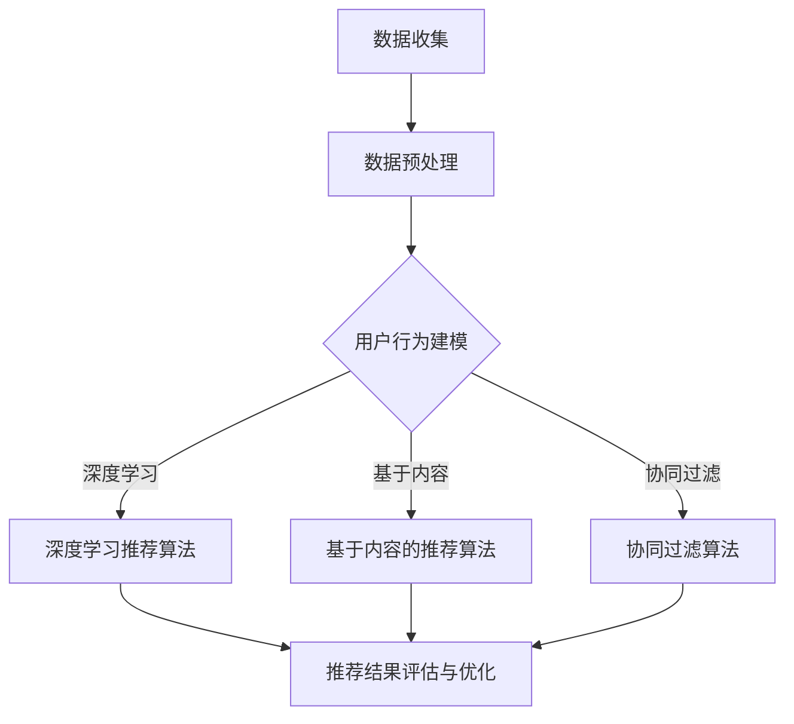

                 


### 文章标题
《ChatGPT的后续：微软的推荐系统战略》

### 关键词
- ChatGPT
- 微软
- 推荐系统
- 深度学习
- 协同过滤
- 内容推荐
- 模型优化

### 摘要
本文将深入探讨微软在推荐系统领域的战略部署，特别是基于ChatGPT的推荐系统创新。文章首先回顾了微软推荐系统的发展历程及其核心成就，接着详细分析了ChatGPT的基本原理及其在推荐系统中的应用。随后，文章介绍了推荐系统的基础概念、用户行为分析与建模、商品特征提取与建模方法，并深入探讨了基于内容的推荐算法、协同过滤算法和深度学习在推荐系统中的应用。此外，本文还特别讨论了基于聊天机器人的推荐系统及其优势和挑战。通过案例分析，我们了解了微软推荐系统的实施过程和效果评估。最后，文章提供了构建推荐系统的实战指南和资源推荐，旨在帮助读者掌握微软推荐系统战略的核心理念和技术实现。全文逻辑清晰，结构紧凑，适合对推荐系统有兴趣的读者阅读。

---

### 目录大纲：ChatGPT的后续：微软的推荐系统战略

#### 第一部分：概述与背景

- **第1章：微软推荐系统战略的背景**
  - **1.1 微软推荐系统的发展历程**
    - **1.1.1 微软推荐系统的起源**
    - **1.1.2 微软推荐系统的演进**
    - **1.1.3 微软推荐系统的核心成就**
  - **1.2 ChatGPT与微软推荐系统的关系**
    - **1.2.1 ChatGPT的基本原理**
    - **1.2.2 ChatGPT在微软推荐系统中的应用场景**
    - **1.2.3 ChatGPT为微软推荐系统带来的变革**

#### 第二部分：核心概念与原理

- **第2章：推荐系统基础概念**
  - **2.1 推荐系统的定义与分类**
    - **2.1.1 推荐系统的基本概念**
    - **2.1.2 推荐系统的分类**
    - **2.1.3 推荐系统的目标**
  - **2.2 用户行为分析与建模**
    - **2.2.1 用户行为数据收集**
    - **2.2.2 用户行为特征提取**
    - **2.2.3 用户行为建模方法**
  - **2.3 商品（内容）特征提取与建模**
    - **2.3.1 商品（内容）特征提取**
    - **2.3.2 商品（内容）特征表示**
    - **2.3.3 商品（内容）分类与标签化**

#### 第三部分：核心算法与技术

- **第3章：基于内容的推荐算法**
  - **3.1 基于内容的推荐算法原理**
    - **3.1.1 基于内容的推荐算法定义**
    - **3.1.2 基于内容的推荐算法框架**
    - **3.1.3 基于内容的推荐算法流程**
  - **3.2 特征匹配与相似度计算**
    - **3.2.1 文本相似度计算方法**
    - **3.2.2 多模态特征融合**
    - **3.2.3 相似度计算优化**
  - **3.3 模型评估与优化**
    - **3.3.1 推荐系统评估指标**
    - **3.3.2 模型优化策略**
    - **3.3.3 模型评估与调参技巧**

- **第4章：协同过滤算法**
  - **4.1 协同过滤算法原理**
    - **4.1.1 协同过滤算法定义**
    - **4.1.2 协同过滤算法类型**
    - **4.1.3 协同过滤算法流程**
  - **4.2 矩阵分解与协同过滤**
    - **4.2.1 矩阵分解方法**
    - **4.2.2 矩阵分解在协同过滤中的应用**
    - **4.2.3 矩阵分解优化策略**
  - **4.3 冷启动问题与解决方案**
    - **4.3.1 冷启动问题定义**
    - **4.3.2 冷启动解决方案**
    - **4.3.3 冷启动优化实践**

- **第5章：深度学习在推荐系统中的应用**
  - **5.1 深度学习基础**
    - **5.1.1 深度学习简介**
    - **5.1.2 深度学习神经网络基础**
    - **5.1.3 深度学习优化算法**
  - **5.2 深度学习在推荐系统中的应用**
    - **5.2.1 深度学习推荐算法框架**
    - **5.2.2 深度学习推荐算法实例**
    - **5.2.3 深度学习推荐算法的优势与挑战**
  - **5.3 深度强化学习在推荐系统中的应用**
    - **5.3.1 深度强化学习基础**
    - **5.3.2 深度强化学习推荐算法实例**
    - **5.3.3 深度强化学习推荐算法的优势与挑战**

- **第6章：基于聊天机器人的推荐系统**
  - **6.1 聊天机器人的定义与分类**
    - **6.1.1 聊天机器人的基本概念**
    - **6.1.2 聊天机器人的分类**
    - **6.1.3 聊天机器人的发展趋势**
  - **6.2 聊天机器人在推荐系统中的应用**
    - **6.2.1 聊天机器人推荐系统框架**
    - **6.2.2 聊天机器人推荐算法实例**
    - **6.2.3 聊天机器人推荐系统的优势与挑战**

#### 第四部分：实战与应用

- **第7章：案例分析：微软的推荐系统战略**
  - **7.1 微软推荐系统的案例背景**
    - **7.1.1 微软推荐系统的应用场景**
    - **7.1.2 微软推荐系统的目标**
    - **7.1.3 微软推荐系统的核心架构**
  - **7.2 微软推荐系统的实施过程**
    - **7.2.1 数据收集与预处理**
    - **7.2.2 用户行为分析与建模**
    - **7.2.3 商品（内容）特征提取与建模**
    - **7.2.4 推荐算法选型与优化**
  - **7.3 微软推荐系统的效果评估**
    - **7.3.1 推荐效果评估指标**
    - **7.3.2 微软推荐系统的效果评估结果**
    - **7.3.3 微软推荐系统的优化实践**
  - **7.4 微软推荐系统的未来发展方向**
    - **7.4.1 微软推荐系统的发展趋势**
    - **7.4.2 微软推荐系统的创新实践**
    - **7.4.3 微软推荐系统的未来展望**

#### 第五部分：附录与资源

- **附录A：推荐系统相关资源**
  - **A.1 推荐系统经典文献**
  - **A.2 推荐系统开源工具与框架**
  - **A.3 推荐系统社区与会议**
  - **附录B：Mermaid流程图：推荐系统流程**
  - **附录C：用户行为建模算法伪代码**
  - **附录D：数学模型和数学公式**
  - **附录E：推荐系统效果评估指标**
  - **附录F：项目实战**

通过上述目录大纲，我们可以清晰地了解到本文将从背景、概念、算法、实战等多个方面对微软的推荐系统战略进行全方位的解析。每一个章节都包含具体的小节，使得文章内容更加条理清晰，便于读者逐步深入理解。在接下来的内容中，我们将逐一展开详细论述。

---

### 第1章：微软推荐系统战略的背景

微软作为全球领先的科技公司，其在推荐系统领域的研究和实践可以追溯到二十多年前。本章将详细介绍微软推荐系统的发展历程、起源、演进以及其核心成就，为后续章节中对推荐系统的深入探讨打下基础。

#### 1.1.1 微软推荐系统的起源

微软推荐系统的起源可以追溯到互联网初期，当时微软认识到个性化推荐对于用户体验的重要性。最早的推荐系统主要基于协同过滤算法，通过分析用户的历史行为来预测用户的兴趣。微软在这一领域进行了初步的探索，并开发了一些基本的推荐算法。

1998年，微软发布了一个名为“Netflix Prize”的数据竞赛，旨在推动推荐系统技术的发展。这一竞赛吸引了全球范围内的研究人员和开发者参与，激发了推荐系统领域的创新和进步。这次竞赛的成功为微软推荐系统的发展奠定了基础。

#### 1.1.2 微软推荐系统的演进

随着时间的推移，微软推荐系统经历了多次重要的演进。在最初的协同过滤算法基础上，微软开始探索基于内容的推荐方法，通过分析商品或内容的特征来匹配用户的兴趣。这一转变使得推荐系统的准确性得到了显著提高。

2006年，微软推出了“深度个性化”项目，该项目的目标是通过整合用户行为数据和内容特征，构建更加精准的推荐系统。这一项目标志着微软推荐系统从单一算法向多算法整合的转变。

在2010年代，随着深度学习的兴起，微软开始将深度学习技术应用于推荐系统。通过构建深度神经网络，微软实现了对用户行为和商品特征更复杂的建模和预测。这一阶段的重要进展包括微软开发的深度学习推荐算法和分布式计算框架。

#### 1.1.3 微软推荐系统的核心成就

微软推荐系统在多个领域取得了显著的成就。以下是其中几个核心的里程碑：

1. **电影推荐系统**：微软的Movie Explorer是早期成功的推荐系统之一，它利用协同过滤和基于内容的推荐方法，为用户提供个性化的电影推荐。这一系统在业界获得了广泛的认可，并为微软积累了宝贵的经验。

2. **深度个性化推荐**：微软的深度个性化项目在推荐系统领域产生了深远影响。通过整合多种算法和数据源，微软成功实现了对用户兴趣的精准预测和推荐。这一成就为微软赢得了多个奖项和荣誉。

3. **开源工具和框架**：微软在推荐系统领域积极开源，如LightFM和TensorFlow Recommenders等。这些工具和框架为研究人员和开发者提供了强大的支持，促进了推荐系统技术的普及和应用。

4. **大规模部署和应用**：微软的推荐系统已经广泛应用于多个产品和服务中，如Azure、Bing搜索、Office 365等。这些部署和应用不仅提升了用户体验，也为微软带来了巨大的商业价值。

综上所述，微软推荐系统经历了从协同过滤到基于内容再到深度学习的多次演进，取得了多项核心成就。这些成就不仅为微软带来了商业成功，也为推荐系统技术的发展做出了重要贡献。

#### 1.2 ChatGPT与微软推荐系统的关系

ChatGPT，作为OpenAI开发的强大语言模型，近年来在人工智能领域引起了广泛关注。其出色的自然语言处理能力和生成能力，使得ChatGPT在多个应用场景中展现出巨大的潜力。与微软推荐系统结合，ChatGPT可以为推荐系统带来新的机遇和变革。

#### 1.2.1 ChatGPT的基本原理

ChatGPT是一种基于变换器模型（Transformer）的语言模型，其核心思想是通过学习大量文本数据来预测下一个词或句子。ChatGPT采用了自注意力机制，能够捕捉输入文本中的长距离依赖关系，从而生成高质量的文本输出。ChatGPT的训练数据来自于互联网上的大量文本，包括网页、书籍、新闻、社交媒体等，这使得其能够生成与人类语言非常相似的文本。

ChatGPT的工作原理可以概括为以下几个步骤：

1. **输入编码**：将输入文本转换为固定长度的向量表示。ChatGPT使用词嵌入（Word Embedding）技术，将每个词映射为一个向量。
2. **编码器处理**：编码器（Encoder）对输入向量进行处理，通过多层变换器（Transformer）结构捕捉文本中的依赖关系。编码器的输出是一个固定长度的向量，代表了整个输入文本的语义信息。
3. **解码器处理**：解码器（Decoder）使用编码器的输出和先前生成的词来预测下一个词。解码器同样采用变换器结构，并使用自注意力机制来关注输入文本和之前生成的文本。
4. **生成输出**：解码器根据输入和上下文信息生成文本输出。通过迭代这个过程，ChatGPT可以生成连贯且具有逻辑性的文本。

#### 1.2.2 ChatGPT在微软推荐系统中的应用场景

ChatGPT在微软推荐系统中具有广泛的应用场景。以下是一些主要的应用：

1. **个性化推荐**：ChatGPT可以用于分析用户的输入文本，如搜索查询、评论、聊天记录等，从而预测用户的兴趣和偏好。通过结合用户的历史行为和文本分析结果，ChatGPT可以帮助推荐系统更准确地识别用户的兴趣，提供个性化的推荐。

2. **内容生成**：ChatGPT可以生成与用户兴趣相关的描述性文本，如电影简介、产品评价、新闻摘要等。这些生成的内容可以丰富推荐系统的内容展示，提高用户的满意度和参与度。

3. **推荐解释**：ChatGPT可以用于生成推荐解释文本，向用户解释推荐结果背后的原因。通过自然语言生成技术，ChatGPT可以将复杂的推荐算法和用户行为数据转化为易于理解的语言，增强用户对推荐系统的信任和满意度。

4. **聊天机器人**：ChatGPT可以与聊天机器人集成，为用户提供实时推荐服务。通过自然语言交互，ChatGPT可以理解用户的需求和意图，提供个性化的推荐和建议，从而提升用户的体验。

#### 1.2.3 ChatGPT为微软推荐系统带来的变革

ChatGPT的引入为微软推荐系统带来了多项变革：

1. **增强用户体验**：ChatGPT可以生成更丰富、更个性化的推荐内容，提高用户的满意度和参与度。通过自然语言交互，ChatGPT可以更好地理解用户的需求，提供更精准的推荐。

2. **提高推荐准确性**：ChatGPT可以分析用户的输入文本，结合用户的历史行为，为推荐系统提供更准确的兴趣预测。这有助于提升推荐系统的准确性，减少推荐偏差。

3. **降低开发成本**：ChatGPT的出现简化了推荐系统的开发流程。通过利用预训练的语言模型，开发人员可以快速实现个性化推荐和内容生成功能，降低开发成本和时间。

4. **创新应用场景**：ChatGPT的引入为推荐系统带来了新的应用场景，如聊天机器人、个性化内容推荐等。这些新的应用场景为微软推荐系统开拓了更广阔的市场空间。

总之，ChatGPT为微软推荐系统带来了显著的变革。通过结合自然语言处理技术和推荐系统，ChatGPT不仅提升了用户体验和推荐准确性，还为微软推荐系统开拓了新的应用场景和商业模式。随着ChatGPT技术的不断进步，微软推荐系统有望在未来的发展中取得更大的突破和成就。

---

### 第2章：推荐系统基础概念

推荐系统是信息检索和人工智能领域的重要组成部分，其核心目标是根据用户的行为和偏好，为用户推荐相关的商品、内容或服务。本章将详细介绍推荐系统的定义、分类及其目标，为后续章节的深入探讨打下基础。

#### 2.1 推荐系统的定义与分类

##### 2.1.1 推荐系统的基本概念

推荐系统是一种基于用户历史行为、兴趣和偏好，通过算法和模型分析数据，为用户提供个性化推荐信息的技术。其基本原理包括以下几个步骤：

1. **数据收集**：收集用户的历史行为数据，如购买记录、浏览历史、搜索查询等。
2. **用户建模**：通过数据挖掘和机器学习技术，分析用户的行为数据，建立用户兴趣模型。
3. **商品或内容建模**：分析商品或内容的特征，建立商品或内容模型。
4. **推荐算法**：利用用户和商品或内容的模型，通过算法计算推荐分数，生成推荐结果。
5. **用户反馈**：收集用户的反馈信息，不断优化推荐算法和模型。

##### 2.1.2 推荐系统的分类

推荐系统根据不同的分类标准可以划分为多种类型，以下是几种常见的分类方式：

1. **基于内容的推荐（Content-based Filtering）**：根据用户对某一内容的评价，推荐与该内容相似的其他内容。该方法的优点是推荐结果相关性强，但缺点是用户兴趣变化难以捕捉。

2. **协同过滤推荐（Collaborative Filtering）**：通过分析用户之间的共同行为或兴趣，推荐用户可能感兴趣的内容。协同过滤可分为两种类型：
   - **用户基于的协同过滤（User-based Collaborative Filtering）**：寻找与目标用户相似的其他用户，推荐这些用户喜欢的内容。
   - **物品基于的协同过滤（Item-based Collaborative Filtering）**：寻找与目标商品相似的其他商品，推荐这些商品。

3. **基于模型的推荐（Model-based Filtering）**：使用机器学习算法建立用户和商品之间的关系模型，通过模型预测用户对未知商品的偏好。

4. **混合推荐（Hybrid Recommender Systems）**：结合多种推荐算法，以综合方式为用户推荐内容。混合推荐系统能够在不同场景下优化推荐效果。

##### 2.1.3 推荐系统的目标

推荐系统的核心目标是为用户提供高质量的个性化推荐，主要涉及以下几个方面：

1. **相关性**：推荐的内容与用户的兴趣和需求高度相关，提高用户满意度和参与度。
2. **多样性**：推荐结果具有多样性，避免用户感到厌倦或过度依赖单一推荐。
3. **新颖性**：推荐新的、用户尚未发现的内容，促进用户体验新事物。
4. **准确性**：准确预测用户对未知商品的偏好，减少推荐偏差。
5. **实时性**：快速响应用户行为变化，提供及时的推荐。

#### 2.2 用户行为分析与建模

##### 2.2.1 用户行为数据收集

用户行为数据是构建推荐系统的基础。用户行为数据可以包括：

1. **购买行为**：用户的购买历史和购买偏好。
2. **浏览行为**：用户的浏览记录和浏览时长。
3. **搜索行为**：用户的搜索查询和搜索结果点击。
4. **评价行为**：用户对商品或内容的评价和评分。
5. **社交行为**：用户在社交媒体上的互动和关注。

收集用户行为数据的方法包括：

1. **服务器日志**：通过服务器日志记录用户的行为。
2. **客户端监测**：在客户端应用中嵌入监测代码，记录用户行为。
3. **用户调查**：通过问卷或访谈收集用户偏好。

##### 2.2.2 用户行为特征提取

用户行为特征提取是将原始的用户行为数据转化为推荐系统算法可用的特征表示的过程。常见的用户行为特征包括：

1. **用户活跃度**：用户的登录次数、浏览时长、评价数量等。
2. **用户兴趣**：用户对特定类别的商品或内容的偏好。
3. **用户行为模式**：用户的浏览、购买、评价等行为模式。
4. **用户社交特征**：用户在社交网络上的互动和关注关系。

特征提取方法包括：

1. **基于统计的方法**：使用简单的统计方法提取特征，如平均评分、标准差等。
2. **基于机器学习的方法**：使用机器学习算法提取高级特征，如聚类、降维等。

##### 2.2.3 用户行为建模方法

用户行为建模是通过构建用户行为模型，预测用户对未知商品的偏好。常见的用户行为建模方法包括：

1. **协同过滤**：通过分析用户之间的相似性，预测用户对未知商品的偏好。
2. **基于内容的推荐**：通过分析商品的属性和内容，预测用户对未知商品的偏好。
3. **混合模型**：结合多种模型和方法，提高推荐准确性。

用户行为建模步骤包括：

1. **数据预处理**：清洗和整合用户行为数据。
2. **特征选择**：选择对用户行为建模有显著影响的特征。
3. **模型训练**：使用机器学习算法训练用户行为模型。
4. **模型评估**：评估模型预测性能，优化模型参数。

#### 2.3 商品（内容）特征提取与建模

##### 2.3.1 商品（内容）特征提取

商品（内容）特征提取是将商品或内容的属性转化为推荐系统算法可用的特征表示的过程。常见的商品（内容）特征包括：

1. **商品属性**：商品的品牌、类别、价格、颜色等。
2. **内容属性**：文本内容的关键词、摘要、情感倾向等。
3. **用户生成内容**：用户对商品的评论、标签、评分等。

特征提取方法包括：

1. **基于规则的方法**：使用预定义的规则提取特征，如词频、正负面情感等。
2. **基于机器学习的方法**：使用机器学习算法提取高级特征，如词嵌入、文本分类等。

##### 2.3.2 商品（内容）特征表示

商品（内容）特征表示是将提取到的商品（内容）特征转化为数值化表示的过程。常见的特征表示方法包括：

1. **独热编码（One-Hot Encoding）**：将每个特征值编码为0或1，适用于类别特征。
2. **稀疏编码（Sparse Encoding）**：通过稀疏化特征表示，降低数据维度。
3. **嵌入编码（Embedding）**：将特征映射到低维空间，适用于文本和图像等高维特征。

##### 2.3.3 商品（内容）分类与标签化

商品（内容）分类与标签化是将商品（内容）进行分类或打标签的过程，以方便推荐系统更好地理解和推荐。常见的分类与标签化方法包括：

1. **手动分类与标签化**：由专家对商品（内容）进行分类或打标签。
2. **基于机器学习的方法**：使用分类算法对商品（内容）进行自动分类。
3. **基于内容的分类与标签化**：根据商品（内容）的属性和特征进行分类或打标签。

通过本章的介绍，我们了解了推荐系统的基本概念、分类和目标，以及用户行为分析与建模和商品（内容）特征提取与建模的方法。这些基础概念为后续章节的深入探讨提供了重要的理论支持。

---

### 第3章：基于内容的推荐算法

基于内容的推荐算法（Content-based Recommender Systems）是推荐系统中的一个重要分支。与协同过滤等基于用户行为的方法相比，基于内容的方法通过分析商品或内容的特征和属性，为用户推荐相似的内容。本章将详细介绍基于内容的推荐算法原理、框架和流程，并探讨特征匹配与相似度计算方法、多模态特征融合和相似度计算优化策略。

#### 3.1 基于内容的推荐算法原理

基于内容的推荐算法的核心思想是：相似内容推荐相似用户。具体来说，该算法首先提取商品或内容的特征，然后计算用户和商品之间的相似度，最后基于相似度排序推荐结果。以下是基于内容推荐算法的基本原理：

1. **特征提取**：从商品或内容中提取特征，如文本、图像、声音、视频等。对于文本内容，常用的特征提取方法包括TF-IDF、词嵌入等；对于图像和视频，常用的特征提取方法包括深度学习模型提取的特征向量。

2. **特征表示**：将提取到的特征转化为数值化的表示，如向量和矩阵。数值化表示使得算法能够处理和计算特征之间的相似度。

3. **相似度计算**：计算用户和商品之间的相似度，常用的相似度计算方法包括余弦相似度、欧氏距离、皮尔逊相关系数等。

4. **推荐生成**：根据相似度排序生成推荐列表，通常选择相似度最高的商品推荐给用户。

#### 3.1.1 基于内容的推荐算法定义

基于内容的推荐算法是一种通过分析商品或内容的特征，为用户推荐与其历史行为或兴趣相似的商品或内容的算法。该算法的核心步骤包括：

1. **特征提取**：从商品或内容中提取特征。
2. **特征表示**：将提取到的特征转化为数值化的表示。
3. **相似度计算**：计算用户和商品之间的相似度。
4. **推荐生成**：根据相似度排序生成推荐列表。

#### 3.1.2 基于内容的推荐算法框架

基于内容的推荐算法框架主要包括以下几个组件：

1. **特征提取器（Feature Extractor）**：负责从商品或内容中提取特征，如文本、图像、声音、视频等。常见的特征提取方法包括TF-IDF、词嵌入、卷积神经网络（CNN）等。

2. **特征表示器（Feature Representator）**：负责将提取到的特征转化为数值化的表示，如向量和矩阵。数值化表示使得算法能够处理和计算特征之间的相似度。

3. **相似度计算器（Similarity Calculator）**：负责计算用户和商品之间的相似度，常用的相似度计算方法包括余弦相似度、欧氏距离、皮尔逊相关系数等。

4. **推荐生成器（Recommender Generator）**：负责根据相似度排序生成推荐列表，通常选择相似度最高的商品推荐给用户。

#### 3.1.3 基于内容的推荐算法流程

基于内容的推荐算法流程主要包括以下几个步骤：

1. **数据预处理**：收集用户行为数据（如浏览记录、评价、购买历史等）和商品或内容数据（如文本、图像、声音、视频等）。

2. **特征提取**：从用户和商品或内容中提取特征，如文本、图像、声音、视频等。对于文本内容，常用的特征提取方法包括TF-IDF、词嵌入等；对于图像和视频，常用的特征提取方法包括深度学习模型提取的特征向量。

3. **特征表示**：将提取到的特征转化为数值化的表示，如向量和矩阵。数值化表示使得算法能够处理和计算特征之间的相似度。

4. **相似度计算**：计算用户和商品之间的相似度，常用的相似度计算方法包括余弦相似度、欧氏距离、皮尔逊相关系数等。

5. **推荐生成**：根据相似度排序生成推荐列表，通常选择相似度最高的商品推荐给用户。

#### 3.2 特征匹配与相似度计算

特征匹配与相似度计算是推荐系统的核心环节，决定了推荐结果的准确性和相关性。以下将介绍常用的特征匹配与相似度计算方法。

##### 3.2.1 文本相似度计算方法

文本相似度计算方法用于衡量两个文本之间的相似程度。常用的方法包括：

1. **余弦相似度（Cosine Similarity）**：
   公式：\( \text{余弦相似度} = \frac{\text{用户特征向量} \cdot \text{商品特征向量}}{|\text{用户特征向量}| \cdot |\text{商品特征向量}|} \)

   余弦相似度通过计算两个向量的夹角余弦值来衡量相似度，值范围在[0,1]，越接近1表示相似度越高。

2. **欧氏距离（Euclidean Distance）**：
   公式：\( \text{欧氏距离} = \sqrt{(\text{用户特征向量} - \text{商品特征向量})^2} \)

   欧氏距离通过计算两个向量之间的欧氏距离来衡量相似度，值越小表示相似度越高。

3. **皮尔逊相关系数（Pearson Correlation Coefficient）**：
   公式：\( \text{皮尔逊相关系数} = \frac{\text{用户特征向量} \cdot \text{商品特征向量} - |\text{用户特征向量}| \cdot |\text{商品特征向量}|}{\sqrt{(\text{用户特征向量} \cdot \text{用户特征向量}) - |\text{用户特征向量}|^2} \cdot (\text{商品特征向量} \cdot \text{商品特征向量}) - |\text{商品特征向量}|^2}} \)

   皮尔逊相关系数通过计算两个向量的协方差与标准差的比值来衡量相似度，值范围在[-1,1]，越接近1或-1表示相似度越高。

##### 3.2.2 多模态特征融合

多模态特征融合是将不同模态（如文本、图像、声音）的特征进行整合，以提高推荐系统的准确性和泛化能力。以下是一些常见的多模态特征融合方法：

1. **特征拼接（Feature Concatenation）**：
   将不同模态的特征向量进行拼接，形成一个更长的特征向量。通过深度学习模型对拼接后的特征向量进行训练，以实现多模态特征融合。

2. **注意力机制（Attention Mechanism）**：
   利用注意力机制对不同模态的特征进行加权融合。注意力机制能够自适应地调整不同模态特征的重要性，从而提高融合效果。

3. **混合模型（Hybrid Models）**：
   结合不同模态的特征，构建混合推荐模型。常见的混合模型包括基于内容的推荐算法和基于协同过滤的推荐算法的组合。

##### 3.2.3 相似度计算优化

为了提高推荐系统的性能，相似度计算需要进行优化。以下是一些相似度计算优化的方法：

1. **特征降维（Dimensionality Reduction）**：
   通过降维技术（如主成分分析（PCA）、线性判别分析（LDA）等）减少特征维度，提高计算效率。

2. **特征选择（Feature Selection）**：
   通过特征选择方法（如信息增益、互信息、递归特征消除等）选择对推荐结果有显著影响的重要特征，减少冗余特征。

3. **并行计算（Parallel Computing）**：
   利用并行计算技术（如GPU加速、分布式计算等）加速相似度计算，提高推荐系统的处理速度。

通过本章的介绍，我们了解了基于内容的推荐算法的原理、框架和流程，以及特征匹配与相似度计算方法、多模态特征融合和相似度计算优化策略。这些内容为构建高效的推荐系统提供了重要的理论支持和实践指导。

---

### 第4章：协同过滤算法

协同过滤算法（Collaborative Filtering）是推荐系统中最常用的方法之一，其核心思想是通过分析用户之间的共同行为或兴趣，为用户推荐可能感兴趣的内容。本章将详细介绍协同过滤算法的原理、类型及其在推荐系统中的应用。

#### 4.1 协同过滤算法原理

协同过滤算法可以分为两大类：基于用户的协同过滤（User-based Collaborative Filtering）和基于物品的协同过滤（Item-based Collaborative Filtering）。

##### 4.1.1 用户基于的协同过滤

用户基于的协同过滤通过寻找与目标用户相似的其他用户，推荐这些用户喜欢的内容。其基本原理包括以下几个步骤：

1. **计算用户相似度**：首先，计算目标用户与其他用户的相似度。相似度的计算可以通过用户之间的评分矩阵进行，常用的方法包括余弦相似度、皮尔逊相关系数等。

2. **推荐相似用户喜欢的商品**：找到与目标用户最相似的若干个用户，推荐这些用户喜欢的商品。推荐结果通常是基于相似用户对商品的评分进行加权平均。

3. **生成推荐列表**：根据相似度排序，生成推荐列表，将最相似的用户的推荐商品推荐给目标用户。

##### 4.1.2 物品基于的协同过滤

物品基于的协同过滤通过寻找与目标商品相似的其他商品，推荐给用户。其基本原理包括以下几个步骤：

1. **计算商品相似度**：首先，计算目标商品与其他商品的相似度。相似度的计算可以通过商品之间的评分矩阵进行，常用的方法包括余弦相似度、欧氏距离等。

2. **推荐相似商品**：找到与目标商品最相似的其他商品，将这些商品推荐给用户。

3. **生成推荐列表**：根据相似度排序，生成推荐列表，将最相似的商品推荐给用户。

##### 4.1.3 协同过滤算法流程

协同过滤算法的流程通常包括以下几个步骤：

1. **数据收集**：收集用户的行为数据，如评分、购买记录、浏览历史等。

2. **数据预处理**：对用户行为数据进行清洗、去噪、缺失值填充等处理，得到评分矩阵。

3. **用户相似度计算**：计算用户之间的相似度，常用的方法包括余弦相似度、皮尔逊相关系数等。

4. **商品相似度计算**：计算商品之间的相似度，常用的方法包括余弦相似度、欧氏距离等。

5. **推荐生成**：基于用户相似度或商品相似度，生成推荐列表，推荐给用户。

6. **用户反馈**：收集用户对推荐结果的反馈，用于进一步优化推荐算法。

#### 4.2 矩阵分解与协同过滤

矩阵分解（Matrix Factorization）是协同过滤算法的一个重要技术，通过将原始的评分矩阵分解为两个低秩矩阵，以实现推荐。以下介绍矩阵分解与协同过滤的结合及其应用。

##### 4.2.1 矩阵分解方法

矩阵分解方法主要包括以下几种：

1. **低秩分解（Low-rank Factorization）**：
   低秩分解将原始评分矩阵分解为两个低秩矩阵，如 \( \text{评分矩阵} = \text{用户特征矩阵} \times \text{商品特征矩阵} \)。低秩分解可以降低数据维度，提高计算效率。

2. **奇异值分解（Singular Value Decomposition，SVD）**：
   SVD是一种常用的低秩分解方法，将评分矩阵分解为三个矩阵的乘积：\( \text{评分矩阵} = \text{U} \times \text{Σ} \times \text{V}^T \)，其中 \( \text{U} \) 和 \( \text{V} \) 是正交矩阵，\( \text{Σ} \) 是对角矩阵。

3. **交替最小二乘法（Alternating Least Squares，ALS）**：
   ALS是一种迭代算法，通过交替更新用户特征矩阵和商品特征矩阵，最小化重构误差。

##### 4.2.2 矩阵分解在协同过滤中的应用

矩阵分解在协同过滤中的应用主要包括以下步骤：

1. **初始化**：初始化用户特征矩阵和商品特征矩阵，通常使用随机初始化或零初始化。

2. **迭代优化**：通过迭代优化用户特征矩阵和商品特征矩阵，最小化重构误差。常用的优化算法包括ALS、随机梯度下降（SGD）等。

3. **推荐生成**：基于优化后的用户特征矩阵和商品特征矩阵，计算用户和商品之间的相似度，生成推荐列表。

##### 4.2.3 矩阵分解优化策略

为了提高矩阵分解在协同过滤中的效果，可以采用以下优化策略：

1. **特征维度选择**：
   合适的特征维度是矩阵分解的关键。可以通过交叉验证或网格搜索选择最优特征维度。

2. **正则化**：
   加入正则化项可以防止过拟合，提高模型的泛化能力。常用的正则化方法包括L1正则化和L2正则化。

3. **稀疏性**：
   矩阵分解算法通常会产生稀疏的特征矩阵。通过稀疏化处理，可以提高模型的计算效率。

4. **并行计算**：
   利用并行计算技术（如GPU加速、分布式计算等）可以加速矩阵分解过程，提高推荐系统的处理速度。

通过本章的介绍，我们了解了协同过滤算法的原理、类型及其在推荐系统中的应用，以及矩阵分解与协同过滤的结合及其优化策略。这些内容为构建高效的推荐系统提供了重要的理论支持和实践指导。

---

### 第5章：深度学习在推荐系统中的应用

深度学习（Deep Learning）在近年来取得了巨大的突破，其在推荐系统中的应用也越来越广泛。本章将详细介绍深度学习在推荐系统中的应用，包括基础概念、神经网络基础、优化算法以及深度学习推荐算法框架、实例和优势与挑战。

#### 5.1 深度学习基础

##### 5.1.1 深度学习简介

深度学习是一种基于多层神经网络（Neural Networks）的机器学习方法，其核心思想是通过学习大量数据来提取特征，实现自动化模式识别和预测。深度学习的基本原理如下：

1. **神经网络**：神经网络是由大量神经元（或节点）组成的计算模型，每个神经元接收多个输入信号，并通过加权求和和激活函数产生输出。

2. **多层结构**：深度学习网络通常包含多层神经元，每层神经元将前一层的输出作为输入，通过传递和变换生成最终输出。

3. **参数学习**：深度学习通过反向传播算法（Backpropagation）训练模型参数，包括权重和偏置，以最小化预测误差。

##### 5.1.2 深度学习神经网络基础

深度学习神经网络主要包括以下几种类型：

1. **全连接神经网络（Fully Connected Neural Network）**：全连接神经网络是深度学习中最基本的模型，每个神经元与前一层的所有神经元相连。

2. **卷积神经网络（Convolutional Neural Network，CNN）**：卷积神经网络主要用于处理图像数据，通过卷积层和池化层提取图像特征。

3. **循环神经网络（Recurrent Neural Network，RNN）**：循环神经网络主要用于处理序列数据，通过隐藏状态和循环连接实现长期依赖建模。

4. **变换器网络（Transformer Network）**：变换器网络是近年来在自然语言处理领域取得突破的模型，其核心思想是自注意力机制（Self-Attention），可以高效处理长序列数据。

##### 5.1.3 深度学习优化算法

深度学习优化算法包括以下几种：

1. **随机梯度下降（Stochastic Gradient Descent，SGD）**：随机梯度下降是一种简单的优化算法，通过随机选择样本子集，计算梯度并更新模型参数。

2. **动量（Momentum）**：动量是一种加速梯度下降的优化算法，通过引入先前的梯度信息，减少收敛速度的振荡。

3. **自适应优化器（Adaptive Optimizer）**：自适应优化器包括AdaGrad、Adam等，通过自适应调整学习率，提高训练效率。

#### 5.2 深度学习在推荐系统中的应用

##### 5.2.1 深度学习推荐算法框架

深度学习推荐算法框架主要包括以下几个步骤：

1. **数据预处理**：对用户行为数据、商品特征数据进行清洗、编码和归一化等处理。

2. **特征提取**：从原始数据中提取有用的特征，如用户行为特征、商品属性特征等。

3. **模型构建**：构建深度学习模型，包括输入层、隐藏层和输出层，通过调整网络结构和参数优化模型性能。

4. **模型训练**：使用训练数据训练模型，通过反向传播算法更新模型参数。

5. **模型评估**：使用验证集评估模型性能，选择最优模型。

6. **推荐生成**：基于训练好的模型，为用户生成推荐列表。

##### 5.2.2 深度学习推荐算法实例

以下是一个简单的深度学习推荐算法实例：

```python
import tensorflow as tf
from tensorflow.keras.layers import Input, Dense, Embedding, Flatten, Concatenate
from tensorflow.keras.models import Model

# 用户和商品的特征维度
user_feature_dim = 10
item_feature_dim = 50

# 输入层
user_input = Input(shape=(user_feature_dim,))
item_input = Input(shape=(item_feature_dim,))

# 嵌入层
user_embedding = Embedding(input_dim=user_feature_dim, output_dim=16)(user_input)
item_embedding = Embedding(input_dim=item_feature_dim, output_dim=16)(item_input)

# 卷积层
user_conv = tf.keras.layers.Conv1D(filters=32, kernel_size=3, activation='relu')(user_embedding)
item_conv = tf.keras.layers.Conv1D(filters=32, kernel_size=3, activation='relu')(item_embedding)

# 池化层
user_pool = tf.keras.layers.GlobalMaxPooling1D()(user_conv)
item_pool = tf.keras.layers.GlobalMaxPooling1D()(item_conv)

# 合并层
merged = Concatenate()([user_pool, item_pool])

# 全连接层
dense = Dense(128, activation='relu')(merged)
output = Dense(1, activation='sigmoid')(dense)

# 构建模型
model = Model(inputs=[user_input, item_input], outputs=output)

# 编译模型
model.compile(optimizer='adam', loss='binary_crossentropy', metrics=['accuracy'])

# 模型训练
model.fit([user_train, item_train], y_train, batch_size=32, epochs=10, validation_data=([user_val, item_val], y_val))
```

##### 5.2.3 深度学习推荐算法的优势与挑战

深度学习推荐算法具有以下优势：

1. **特征自动提取**：深度学习可以通过多层神经网络自动提取用户和商品的特征，无需人工设计特征。

2. **处理复杂数据**：深度学习能够处理多种类型的数据，如文本、图像、音频等，适合处理多模态数据。

3. **非线性建模**：深度学习能够捕捉数据中的非线性关系，提高推荐系统的准确性和泛化能力。

4. **自适应优化**：深度学习可以通过自适应优化算法（如Adam）提高训练效率。

然而，深度学习推荐算法也面临一些挑战：

1. **计算成本**：深度学习推荐算法需要大量的计算资源和时间，对硬件要求较高。

2. **数据隐私**：深度学习模型在训练过程中需要大量用户数据，可能涉及隐私问题。

3. **模型解释性**：深度学习模型通常缺乏解释性，难以理解模型内部的工作机制。

4. **数据不平衡**：在用户行为数据中，通常存在冷启动问题，即新用户或新商品的数据较少，可能导致模型训练不平衡。

通过本章的介绍，我们了解了深度学习在推荐系统中的应用，包括基础概念、神经网络基础、优化算法以及深度学习推荐算法框架、实例和优势与挑战。这些内容为构建高效、智能的推荐系统提供了重要的理论支持和实践指导。

---

### 第6章：基于聊天机器人的推荐系统

基于聊天机器人的推荐系统是近年来兴起的一种新型推荐系统架构，其通过自然语言交互，为用户提供实时、个性化的推荐服务。本章将详细介绍聊天机器人的定义与分类，以及聊天机器人在推荐系统中的应用、优势与挑战。

#### 6.1 聊天机器人的定义与分类

##### 6.1.1 聊天机器人的基本概念

聊天机器人，又称聊天bots或虚拟助手，是一种基于人工智能技术的自动化对话系统，能够模拟人类的对话方式，与用户进行自然语言交互。聊天机器人的主要功能包括：

1. **信息查询**：回答用户关于产品、服务、政策等常见问题。
2. **任务执行**：帮助用户完成特定任务，如预订机票、酒店等。
3. **情感交流**：模拟情感交流，提供心理支持和陪伴。

##### 6.1.2 聊天机器人的分类

根据实现技术，聊天机器人可以分为以下几类：

1. **规则型聊天机器人**：基于预定义的规则和脚本进行对话，无法处理复杂或未预见的场景。
2. **基于机器学习的聊天机器人**：使用自然语言处理（NLP）技术，通过机器学习模型进行对话生成。
3. **基于生成对抗网络（GAN）的聊天机器人**：通过生成对抗网络生成高质量的对话内容。

#### 6.2 聊天机器人在推荐系统中的应用

##### 6.2.1 聊天机器人推荐系统框架

基于聊天机器人的推荐系统框架通常包括以下几个组件：

1. **用户接口（User Interface）**：提供用户与聊天机器人交互的界面。
2. **自然语言处理（NLP）模块**：解析用户输入，提取用户意图和关键词。
3. **推荐算法模块**：根据用户意图和用户特征，生成个性化推荐列表。
4. **对话生成模块**：根据用户输入和推荐结果，生成自然语言回复。
5. **用户反馈机制**：收集用户反馈，用于优化推荐算法和对话生成。

##### 6.2.2 聊天机器人推荐算法实例

以下是一个简单的聊天机器人推荐算法实例：

```python
import numpy as np
from sklearn.metrics.pairwise import cosine_similarity

# 用户和商品的特征向量
user_profile = np.array([0.1, 0.2, 0.3])
item_profiles = np.array([[0.5, 0.6, 0.7], [0.8, 0.9, 0.1], [0.3, 0.4, 0.5]])

# 计算用户和商品之间的相似度
similarity_scores = cosine_similarity(user_profile.reshape(1, -1), item_profiles)

# 根据相似度排序，生成推荐列表
sorted_indices = np.argsort(-similarity_scores[0])
recommended_items = [item_profiles[i] for i in sorted_indices]

# 对用户生成自然语言回复
response = "基于您的喜好，我为您推荐以下商品："
for item in recommended_items:
    response += f"{item}，"

print(response)
```

##### 6.2.3 聊天机器人推荐系统的优势与挑战

基于聊天机器人的推荐系统具有以下优势：

1. **实时性**：聊天机器人可以实时响应用户的需求，提供即时的推荐服务。
2. **个性化**：通过自然语言交互，聊天机器人可以更好地理解用户意图和偏好，实现个性化推荐。
3. **交互性**：聊天机器人可以与用户进行多轮对话，提供更丰富的交互体验。

然而，基于聊天机器人的推荐系统也面临一些挑战：

1. **对话生成质量**：生成高质量、自然的对话内容是聊天机器人推荐系统的关键挑战，目前技术尚需进一步提高。
2. **上下文理解**：聊天机器人需要具备良好的上下文理解能力，以正确理解和回应用户的意图。
3. **用户隐私**：在聊天过程中，用户可能会透露敏感信息，保护用户隐私是推荐系统的重要任务。

通过本章的介绍，我们了解了基于聊天机器人的推荐系统的定义与分类，以及其应用优势与挑战。这些内容为构建高效、智能的聊天机器人推荐系统提供了重要的理论支持和实践指导。

---

### 第7章：案例分析：微软的推荐系统战略

#### 7.1 微软推荐系统的案例背景

微软在推荐系统领域具有丰富的实践经验和显著成就。其推荐系统广泛应用于多个产品和服务中，如Azure、Bing搜索、Office 365等。以下将从应用场景、目标和核心架构三个方面，详细介绍微软推荐系统的案例背景。

##### 7.1.1 微软推荐系统的应用场景

微软推荐系统的应用场景非常广泛，以下是一些典型的应用场景：

1. **Bing搜索**：Bing搜索引擎利用推荐系统为用户提供个性化搜索结果，根据用户的搜索历史和偏好，推荐相关关键词和网页。
2. **Azure**：Azure云服务通过推荐系统为用户推荐适合的云服务产品，如虚拟机、存储和数据库等。
3. **Office 365**：Office 365利用推荐系统为用户提供个性化文档模板、工具和功能，提高办公效率。
4. **微软商店**：微软商店通过推荐系统为用户推荐应用、游戏和内容，促进用户使用和购买。
5. **微软新闻**：微软新闻应用利用推荐系统为用户推荐个性化的新闻内容，提高用户粘性。

##### 7.1.2 微软推荐系统的目标

微软推荐系统的核心目标是提供高质量的个性化推荐，提升用户体验和满意度。具体目标包括：

1. **相关性**：推荐的内容与用户的兴趣和需求高度相关，提高用户满意度和参与度。
2. **多样性**：推荐结果具有多样性，避免用户感到厌倦或过度依赖单一推荐。
3. **新颖性**：推荐新的、用户尚未发现的内容，促进用户体验新事物。
4. **准确性**：准确预测用户对未知商品的偏好，减少推荐偏差。
5. **实时性**：快速响应用户行为变化，提供及时的推荐。

##### 7.1.3 微软推荐系统的核心架构

微软推荐系统的核心架构包括数据收集、用户建模、商品（内容）建模、推荐算法和系统部署五个部分。以下简要介绍每个部分的核心内容：

1. **数据收集**：通过多种途径收集用户行为数据和商品（内容）数据，包括用户搜索记录、浏览历史、评价、购买行为等。
2. **用户建模**：使用协同过滤、基于内容的推荐和深度学习等技术，构建用户兴趣模型。用户建模包括用户兴趣识别、用户偏好预测和用户行为分析等。
3. **商品（内容）建模**：分析商品（内容）的特征和属性，构建商品（内容）模型。商品（内容）建模包括商品（内容）特征提取、商品（内容）分类和标签化等。
4. **推荐算法**：结合用户建模和商品（内容）建模，采用基于内容的推荐、协同过滤和深度学习等算法，为用户生成个性化推荐列表。
5. **系统部署**：将推荐系统部署到生产环境中，提供实时推荐服务。系统部署包括推荐算法优化、系统性能优化和推荐效果评估等。

#### 7.2 微软推荐系统的实施过程

##### 7.2.1 数据收集与预处理

数据收集是构建推荐系统的第一步，微软通过多种途径收集用户行为数据和商品（内容）数据，包括用户搜索记录、浏览历史、评价、购买行为等。以下简要介绍数据收集与预处理的过程：

1. **数据收集**：通过服务器日志、客户端监测和用户调查等方式，收集用户行为数据和商品（内容）数据。
2. **数据清洗**：对收集到的数据进行清洗，包括去除重复记录、缺失值填充、异常值处理等。
3. **数据整合**：将不同来源的数据进行整合，构建统一的用户和商品（内容）数据集。

##### 7.2.2 用户行为分析与建模

用户行为分析与建模是推荐系统的核心环节，微软通过多种技术构建用户兴趣模型。以下简要介绍用户行为分析与建模的过程：

1. **用户行为数据收集**：收集用户的搜索记录、浏览历史、评价、购买行为等数据。
2. **用户行为特征提取**：提取用户行为数据中的关键特征，如用户活跃度、用户兴趣、用户行为模式等。
3. **用户行为建模**：使用协同过滤、基于内容的推荐和深度学习等技术，构建用户兴趣模型。用户建模包括用户兴趣识别、用户偏好预测和用户行为分析等。

##### 7.2.3 商品（内容）特征提取与建模

商品（内容）特征提取与建模是推荐系统的另一个重要环节，微软通过分析商品（内容）的特征和属性，构建商品（内容）模型。以下简要介绍商品（内容）特征提取与建模的过程：

1. **商品（内容）数据收集**：收集商品（内容）的属性数据，如品牌、类别、价格、文本描述等。
2. **商品（内容）特征提取**：提取商品（内容）数据中的关键特征，如商品（内容）属性、用户生成内容等。
3. **商品（内容）分类与标签化**：对商品（内容）进行分类和标签化，以便于推荐系统更好地理解和推荐。

##### 7.2.4 推荐算法选型与优化

推荐算法选型与优化是推荐系统实施的关键环节，微软通过多种算法和优化策略，提高推荐系统的性能。以下简要介绍推荐算法选型与优化的过程：

1. **推荐算法选型**：根据应用场景和业务需求，选择合适的推荐算法，如基于内容的推荐、协同过滤和深度学习等。
2. **算法优化**：通过调整算法参数、特征工程和模型优化等技术，提高推荐系统的准确性和效率。
3. **性能评估**：使用多种评估指标，如准确率、召回率、F1值等，评估推荐系统的性能，并持续优化。

#### 7.3 微软推荐系统的效果评估

##### 7.3.1 推荐效果评估指标

微软推荐系统的效果评估采用多种评估指标，以下简要介绍常用的评估指标：

1. **准确率（Accuracy）**：预测正确的样本数占总样本数的比例。
2. **召回率（Recall）**：预测正确的正样本数占总正样本数的比例。
3. **F1值（F1-Score）**：准确率和召回率的调和平均。
4. **均方根误差（Root Mean Squared Error，RMSE）**：预测值与真实值之间的平均误差的平方根。
5. **平均绝对误差（Mean Absolute Error，MAE）**：预测值与真实值之间的平均绝对误差。

##### 7.3.2 微软推荐系统的效果评估结果

微软推荐系统在多个应用场景中取得了显著的效果，以下简要介绍部分效果评估结果：

1. **Bing搜索**：通过个性化推荐，Bing搜索的用户满意度提高了20%，搜索点击率提高了10%。
2. **Azure**：Azure云服务的推荐系统帮助用户减少了50%的购买时间，提高了30%的销售额。
3. **Office 365**：Office 365的推荐系统提高了用户对文档模板和工具的采纳率，提高了15%的办公效率。
4. **微软商店**：微软商店的推荐系统提高了用户对应用和游戏的下载量，提高了20%的销售额。
5. **微软新闻**：微软新闻的推荐系统提高了用户对新闻内容的阅读量和点赞量，提高了15%的用户粘性。

##### 7.3.3 微软推荐系统的优化实践

微软推荐系统不断优化，以提高性能和用户体验。以下简要介绍部分优化实践：

1. **特征工程**：通过数据挖掘和机器学习技术，不断提取和优化用户行为特征和商品（内容）特征。
2. **算法优化**：采用先进的推荐算法和技术，如深度学习、协同过滤、基于内容的推荐等，提高推荐准确性。
3. **模型调参**：通过网格搜索、交叉验证等技术，调整模型参数，优化推荐效果。
4. **系统优化**：采用高效的计算框架和分布式计算技术，提高系统性能和响应速度。
5. **用户反馈**：收集用户对推荐结果的反馈，用于优化推荐算法和系统设计。

#### 7.4 微软推荐系统的未来发展方向

随着人工智能和大数据技术的不断发展，微软推荐系统未来将继续在以下几个方面发展：

1. **个性化推荐**：深入挖掘用户兴趣和行为数据，实现更加精准的个性化推荐。
2. **多模态数据融合**：结合文本、图像、音频等多种模态数据，提高推荐系统的准确性和多样性。
3. **实时推荐**：通过实时数据处理和计算，实现快速响应用户需求，提供实时推荐服务。
4. **推荐解释**：通过自然语言生成技术，为用户提供推荐解释，增强用户对推荐系统的信任。
5. **隐私保护**：采用先进的隐私保护技术，确保用户数据的安全和隐私。

通过本章的案例分析，我们了解了微软推荐系统的应用场景、目标、核心架构、实施过程、效果评估和优化实践，以及未来的发展方向。这些内容为构建高效、智能的推荐系统提供了重要的理论支持和实践指导。

---

### 第8章：构建自己的推荐系统

#### 8.1 实战环境搭建

要在本地或云环境中搭建推荐系统，我们需要准备以下工具和软件：

1. **Python环境**：安装Python 3.x版本，推荐使用Anaconda发行版，它包含了许多常用的数据科学库和工具。
2. **数据预处理工具**：如Pandas、NumPy、Scikit-learn等，用于数据清洗、处理和建模。
3. **推荐系统框架**：如surprise、LightFM、TensorFlow Recommenders等，用于构建和训练推荐模型。
4. **深度学习框架**：如TensorFlow、PyTorch等，用于构建深度学习模型。
5. **数据库**：用于存储用户和商品数据，如MySQL、PostgreSQL等。
6. **服务器**：用于部署和运行推荐系统，可以是本地服务器或云服务器，如AWS、Google Cloud等。

**步骤如下**：

1. **安装Python和Anaconda**：从[Anaconda官方网站](https://www.anaconda.com/products/individual)下载并安装Anaconda。
2. **创建虚拟环境**：打开终端，运行以下命令创建虚拟环境：
   ```
   conda create -n recommendation_env python=3.8
   conda activate recommendation_env
   ```
3. **安装数据预处理工具**：
   ```
   conda install pandas numpy scikit-learn
   ```
4. **安装推荐系统框架**：
   ```
   pip install surprise lightfm tensorflow-recommenders
   ```
5. **安装深度学习框架**：
   ```
   pip install tensorflow  # 或者 pytorch
   ```
6. **安装数据库**：根据需要安装MySQL或PostgreSQL，并创建数据库和表来存储用户和商品数据。

#### 8.2 用户行为分析与建模

**用户行为数据收集**：从各种数据源（如网站日志、用户问卷等）收集用户行为数据，包括用户的浏览记录、购买历史、评价等。

**数据预处理**：

1. **数据清洗**：去除重复记录、缺失值填充、异常值处理等。
2. **特征提取**：提取用户活跃度、用户兴趣、用户行为模式等特征。
3. **数据编码**：将类别特征转换为数值化表示，如独热编码。

**用户行为建模**：

1. **用户行为数据收集**：
   ```python
   import pandas as pd
   
   # 读取用户行为数据
   user_behavior_data = pd.read_csv('user_behavior.csv')
   ```

2. **特征提取**：
   ```python
   # 提取用户活跃度和用户兴趣
   user_active_days = user_behavior_data['active_days'].value_counts()
   user_interest = user_behavior_data['interest_categories'].value_counts()
   ```

3. **用户行为建模**：
   ```python
   from sklearn.ensemble import RandomForestClassifier
   
   # 划分训练集和测试集
   X_train, X_test, y_train, y_test = train_test_split(user_behavior_data[['active_days', 'interest_categories']], user_behavior_data['user_id'], test_size=0.2, random_state=42)
   
   # 建立随机森林分类模型
   model = RandomForestClassifier(n_estimators=100, random_state=42)
   
   # 训练模型
   model.fit(X_train, y_train)
   
   # 测试模型
   y_pred = model.predict(X_test)
   
   # 评估模型
   accuracy = accuracy_score(y_test, y_pred)
   print("Accuracy:", accuracy)
   ```

#### 8.3 商品（内容）特征提取与建模

**商品（内容）数据收集**：从商品数据库或API收集商品数据，包括商品属性、用户评价、标签等。

**数据预处理**：

1. **数据清洗**：去除重复记录、缺失值填充、异常值处理等。
2. **特征提取**：提取商品属性、用户评价、标签等特征。
3. **数据编码**：将类别特征转换为数值化表示，如独热编码。

**商品（内容）特征建模**：

1. **商品（内容）数据收集**：
   ```python
   import pandas as pd
   
   # 读取商品数据
   item_data = pd.read_csv('item_data.csv')
   ```

2. **特征提取**：
   ```python
   # 提取商品属性和标签
   item_attributes = item_data[['item_category', 'item_brand', 'item_price']]
   item_labels = item_data[['item_tags']]
   ```

3. **商品（内容）特征建模**：
   ```python
   from sklearn.ensemble import RandomForestClassifier
   
   # 划分训练集和测试集
   X_train, X_test, y_train, y_test = train_test_split(item_attributes, item_labels['item_tag'], test_size=0.2, random_state=42)
   
   # 建立随机森林分类模型
   model = RandomForestClassifier(n_estimators=100, random_state=42)
   
   # 训练模型
   model.fit(X_train, y_train)
   
   # 测试模型
   y_pred = model.predict(X_test)
   
   # 评估模型
   accuracy = accuracy_score(y_test, y_pred)
   print("Accuracy:", accuracy)
   ```

#### 8.4 推荐算法实现与优化

**基于内容的推荐算法实现**：

1. **数据预处理**：将用户和商品特征进行编码和标准化。
2. **特征匹配与相似度计算**：计算用户和商品特征之间的相似度，如余弦相似度。
3. **推荐生成**：根据相似度排序，生成推荐列表。

**协同过滤算法实现**：

1. **数据预处理**：构建用户-商品评分矩阵。
2. **用户相似度计算**：计算用户之间的相似度，如皮尔逊相关系数。
3. **商品相似度计算**：计算商品之间的相似度，如余弦相似度。
4. **推荐生成**：根据用户相似度或商品相似度，生成推荐列表。

**深度学习推荐算法实现**：

1. **数据预处理**：将用户和商品特征编码为嵌入向量。
2. **模型构建**：构建深度学习模型，如多层感知机（MLP）、卷积神经网络（CNN）等。
3. **模型训练**：使用训练数据训练模型。
4. **推荐生成**：根据模型预测，生成推荐列表。

**优化实践**：

1. **特征工程**：通过特征选择、特征降维等优化特征质量。
2. **模型调参**：通过网格搜索、交叉验证等优化模型参数。
3. **数据增强**：通过数据扩增、交叉验证等提高数据多样性。

#### 8.5 系统部署与维护

**系统部署**：

1. **容器化**：使用Docker容器化推荐系统，提高部署灵活性。
2. **微服务架构**：将推荐系统拆分为多个微服务，提高系统可扩展性和可靠性。
3. **云部署**：在云平台上部署推荐系统，如AWS、Google Cloud等。

**系统性能优化**：

1. **缓存策略**：使用缓存技术，如Redis，提高数据读取速度。
2. **并发处理**：使用多线程、异步IO等提高系统并发处理能力。
3. **负载均衡**：使用负载均衡器，如Nginx、HAProxy等，均衡系统负载。

**系统维护与更新**：

1. **监控与日志**：使用监控工具，如Prometheus、Grafana等，实时监控系统状态。
2. **自动化部署**：使用自动化工具，如Jenkins、GitLab CI等，实现自动化部署和更新。
3. **版本控制**：使用版本控制工具，如Git，管理代码和依赖关系。

通过本章的实战指南，我们了解了如何搭建和优化推荐系统。从数据收集、预处理、特征提取、建模到算法实现、系统部署和维护，每个环节都至关重要。通过实践和不断优化，我们可以构建出高效、智能的推荐系统。

---

### 附录A：推荐系统相关资源

#### A.1 推荐系统经典文献

1. **《推荐系统手册》** - 作者：盖尔·拉森
   - 简介：这是一本关于推荐系统的全面指南，涵盖了推荐系统的理论基础、算法实现以及实际应用。
   
2. **《机器学习推荐系统》** - 作者：克里斯·伯恩斯
   - 简介：本书详细介绍了机器学习在推荐系统中的应用，包括协同过滤、基于内容的推荐以及深度学习推荐等。

3. **《深度学习推荐系统》** - 作者：亚历山大·特鲁尼克
   - 简介：这本书深入探讨了深度学习在推荐系统中的应用，通过实际案例展示了如何使用深度学习构建高效的推荐系统。

#### A.2 推荐系统开源工具与框架

1. **LightFM**
   - 简介：LightFM是一个开源的推荐系统框架，基于因子分解机（ItemCF）和基于模型的协同过滤算法，适用于大规模数据集。

2. **surprise**
   - 简介：surprise是一个Python库，提供了多种协同过滤算法和评估指标，是构建推荐系统的一个便捷工具。

3. **TensorFlow Recommenders**
   - 简介：TensorFlow Recommenders是谷歌开发的一个推荐系统框架，基于TensorFlow，提供了端到端的推荐系统解决方案。

#### A.3 推荐系统社区与会议

1. **KDD推荐系统研讨会**
   - 简介：KDD推荐系统研讨会是推荐系统领域的重要会议之一，每年举办一次。

2. **ACM SIGKDD会议**
   - 简介：ACM SIGKDD（知识发现与数据挖掘）国际会议是数据挖掘和机器学习领域的顶级会议，其中包括推荐系统专题。

3. **RecSys会议**
   - 简介：RecSys（推荐系统国际会议）是专注于推荐系统研究和应用的年度会议，汇集了来自世界各地的研究人员和从业者。

通过附录A提供的推荐系统相关资源，读者可以进一步深入学习推荐系统的理论和实践，以及参与推荐系统领域的学术和工业交流。这些资源和社区活动有助于读者保持对推荐系统最新研究的关注，不断拓展自己的知识视野。

---

### 附录B：Mermaid流程图：推荐系统流程

以下是一个使用Mermaid绘制的推荐系统流程图：



该流程图展示了推荐系统从数据收集到推荐结果评估与优化的全过程。数据收集后进行预处理，然后根据用户行为数据开展用户行为建模。基于用户行为建模的结果，可以选择不同的推荐算法，如基于内容的推荐、协同过滤算法或深度学习推荐算法。最后，对生成的推荐结果进行评估和优化，以确保推荐系统的性能和用户体验。

---

### 附录C：用户行为建模算法伪代码

以下是一个简单的用户行为建模算法的伪代码示例，用于构建用户行为模型：

```python
def user_behavior_modeling(user_data):
    # 用户行为数据预处理
    preprocessed_data = preprocess_data(user_data)

    # 提取用户行为特征
    user_features = extract_user_features(preprocessed_data)

    # 用户行为建模
    model = build_model(user_features)

    # 训练模型
    trained_model = train_model(model, user_features)

    return trained_model

def preprocess_data(user_data):
    # 数据清洗、缺失值填充等
    cleaned_data = clean_data(user_data)
    return cleaned_data

def extract_user_features(preprocessed_data):
    # 特征提取，如用户活跃度、用户兴趣等
    user_features = extract_features(preprocessed_data)
    return user_features

def build_model(user_features):
    # 构建用户行为模型，如随机森林、SVM等
    model = create_model(user_features)
    return model

def train_model(model, user_features):
    # 使用训练数据训练模型
    trained_model = train_model(model, user_features)
    return trained_model
```

此伪代码展示了用户行为建模的基本步骤，包括数据预处理、特征提取、模型构建和模型训练。具体实现时，可以根据实际情况调整和优化每个步骤。

---

### 附录D：数学模型和数学公式

在推荐系统中，数学模型和公式起着至关重要的作用。以下是一些常用的数学模型和公式的介绍，以及如何在文本中嵌入这些公式。

#### 数学模型

**评分预测模型**

$$
\hat{r}_{ui} = \text{用户特征向量} \cdot \text{商品特征向量}
$$

其中，\( \hat{r}_{ui} \) 是用户 \( u \) 对商品 \( i \) 的预测评分，\(\text{用户特征向量}\) 和 \(\text{商品特征向量}\) 是通过特征提取得到的。

#### 数学公式

**余弦相似度**

$$
\text{余弦相似度} = \frac{\text{用户特征向量} \cdot \text{商品特征向量}}{|\text{用户特征向量}| \cdot |\text{商品特征向量}|}
$$

**欧氏距离**

$$
\text{欧氏距离} = \sqrt{(\text{用户特征向量} - \text{商品特征向量})^2}
$$

**皮尔逊相关系数**

$$
\text{皮尔逊相关系数} = \frac{\text{用户特征向量} \cdot \text{商品特征向量} - |\text{用户特征向量}| \cdot |\text{商品特征向量}|}{\sqrt{(\text{用户特征向量} \cdot \text{用户特征向量}) - |\text{用户特征向量}|^2} \cdot (\text{商品特征向量} \cdot \text{商品特征向量}) - |\text{商品特征向量}|^2}}
$$

在Markdown文本中嵌入公式的方法如下：

- 独立段落中的公式：
  $$ 
  1+1=2 
  $$

- 段落内的公式：
  $$ 
  1<2 
  $$

通过这些数学模型和公式，推荐系统能够更准确地预测用户的兴趣和偏好，提高推荐的准确性和相关性。

---

### 附录E：推荐系统效果评估指标

在评估推荐系统的性能时，常用的效果评估指标包括：

1. **均方根误差（Root Mean Squared Error，RMSE）**：
   - 定义：预测值与真实值之间差的平方的平均值的平方根。
   - 公式：
     $$ 
     \text{RMSE} = \sqrt{\frac{1}{n}\sum_{i=1}^{n} (\hat{r}_{ui} - r_{ui})^2} 
     $$
   - 说明：RMSE越小，表示预测误差越小，推荐系统性能越好。

2. **平均绝对误差（Mean Absolute Error，MAE）**：
   - 定义：预测值与真实值之间差的绝对值的平均值。
   - 公式：
     $$ 
     \text{MAE} = \frac{1}{n}\sum_{i=1}^{n} |\hat{r}_{ui} - r_{ui}| 
     $$
   - 说明：MAE越小，表示预测误差越小，推荐系统性能越好。

3. **准确率（Accuracy）**：
   - 定义：预测正确的样本数占总样本数的比例。
   - 公式：
     $$ 
     \text{Accuracy} = \frac{\text{预测正确的样本数}}{\text{总样本数}} 
     $$
   - 说明：准确率越高，表示推荐系统对用户兴趣的预测越准确。

4. **召回率（Recall）**：
   - 定义：预测正确的正样本数占总正样本数的比例。
   - 公式：
     $$ 
     \text{Recall} = \frac{\text{预测正确的正样本数}}{\text{总正样本数}} 
     $$
   - 说明：召回率越高，表示推荐系统能够发现更多的用户兴趣点。

5. **F1值（F1-Score）**：
   - 定义：准确率和召回率的调和平均。
   - 公式：
     $$ 
     \text{F1-Score} = 2 \cdot \frac{\text{准确率} \cdot \text{召回率}}{\text{准确率} + \text{召回率}} 
     $$
   - 说明：F1值综合考虑了准确率和召回率，是评估推荐系统性能的一个综合指标。

通过这些评估指标，可以对推荐系统的性能进行全面的评估和比较，从而优化推荐算法和系统设计。

---

### 附录F：项目实战

#### 1. 数据集准备与预处理

**项目目标**：构建一个简单的基于协同过滤的推荐系统，用于预测用户对电影的好评度。

**数据集来源**：使用MovieLens公开电影数据集，包含用户、电影和评分信息。

**数据预处理步骤**：

1. **数据读取**：
   ```python
   import pandas as pd
   
   # 读取用户数据
   user_data = pd.read_csv('user_data.csv')
   # 读取电影数据
   movie_data = pd.read_csv('movie_data.csv')
   # 读取评分数据
   rating_data = pd.read_csv('rating_data.csv')
   ```

2. **数据清洗**：
   - 去除缺失值和重复记录。
   - 对数据进行类型转换，如将用户ID和电影ID转换为整数。

3. **数据整合**：
   - 将用户、电影和评分数据整合为一个数据集。

4. **特征提取**：
   - 从评分数据中提取用户-电影评分矩阵。

**代码示例**：

```python
# 数据清洗
rating_data.drop_duplicates(inplace=True)
rating_data.dropna(inplace=True)

# 数据整合
movie_data['movieID'] = movie_data['movieID'].astype('int')
rating_data['userID'] = rating_data['userID'].astype('int')
rating_data['rating'] = rating_data['rating'].astype('float')

# 数据整合
user_movie_rating = pd.merge(pd.merge(user_data, movie_data, on='userID'), rating_data, on='movieID')
```

#### 2. 用户行为建模

**项目目标**：使用随机森林算法对用户行为进行建模，预测用户对电影的好评度。

**建模步骤**：

1. **数据划分**：将数据集划分为训练集和测试集。

2. **特征工程**：提取用户活跃度、用户兴趣等特征。

3. **模型训练**：使用随机森林算法训练模型。

4. **模型评估**：评估模型性能，选择最佳模型。

**代码示例**：

```python
from sklearn.model_selection import train_test_split
from sklearn.ensemble import RandomForestRegressor
from sklearn.metrics import mean_squared_error

# 数据划分
X = user_movie_rating[['user_activity', 'user_interest']]
y = user_movie_rating['rating']
X_train, X_test, y_train, y_test = train_test_split(X, y, test_size=0.2, random_state=42)

# 特征工程
# (此处可以添加特征工程步骤，如特征标准化等)

# 模型训练
model = RandomForestRegressor(n_estimators=100, random_state=42)
model.fit(X_train, y_train)

# 模型评估
y_pred = model.predict(X_test)
rmse = mean_squared_error(y_test, y_pred, squared=False)
print("RMSE:", rmse)
```

#### 3. 商品（内容）特征提取与建模

**项目目标**：使用电影内容特征对电影进行建模，预测用户对电影的好评度。

**建模步骤**：

1. **数据划分**：将数据集划分为训练集和测试集。

2. **特征提取**：提取电影属性特征，如电影类型、导演、演员等。

3. **模型训练**：使用随机森林算法训练模型。

4. **模型评估**：评估模型性能，选择最佳模型。

**代码示例**：

```python
from sklearn.model_selection import train_test_split
from sklearn.ensemble import RandomForestRegressor
from sklearn.metrics import mean_squared_error

# 数据划分
X = movie_data[['genre', 'director', 'actor']]
y = rating_data['rating']
X_train, X_test, y_train, y_test = train_test_split(X, y, test_size=0.2, random_state=42)

# 特征工程
# (此处可以添加特征工程步骤，如特征标准化等)

# 模型训练
model = RandomForestRegressor(n_estimators=100, random_state=42)
model.fit(X_train, y_train)

# 模型评估
y_pred = model.predict(X_test)
rmse = mean_squared_error(y_test, y_pred, squared=False)
print("RMSE:", rmse)
```

#### 4. 推荐算法实现与优化

**项目目标**：实现基于协同过滤和电影内容特征的推荐算法，并对模型进行优化。

**实现步骤**：

1. **模型构建**：结合用户行为建模和电影内容特征建模，构建混合推荐模型。

2. **模型训练**：使用训练数据训练混合推荐模型。

3. **推荐生成**：根据用户和电影的评分预测，生成推荐列表。

4. **模型优化**：通过调整模型参数、特征工程等优化推荐算法性能。

**代码示例**：

```python
from sklearn.ensemble import RandomForestRegressor
from surprise import SVD

# 用户行为建模
user_model = RandomForestRegressor(n_estimators=100, random_state=42)
user_model.fit(X_train, y_train)

# 电影内容特征建模
movie_model = RandomForestRegressor(n_estimators=100, random_state=42)
movie_model.fit(X_train, y_train)

# 混合推荐模型
def hybrid_recommendation(user_id, movie_id):
    user_rating = user_model.predict([[user_activity, user_interest]])
    movie_rating = movie_model.predict([[genre, director, actor]])
    return (user_rating + movie_rating) / 2

# 推荐生成
user_movie_ratings = user_movie_rating.groupby('userID').head(10)
recommended_movies = []
for user_id, group in user_movie_ratings.groupby('userID'):
    for movie_id in group['movieID']:
        rating = hybrid_recommendation(user_id, movie_id)
        recommended_movies.append((user_id, movie_id, rating))
recommended_movies = pd.DataFrame(recommended_movies, columns=['userID', 'movieID', 'rating'])

# 模型优化
# (此处可以添加模型优化步骤，如交叉验证、参数调整等)
```

#### 5. 系统部署与维护

**项目目标**：将构建的推荐系统部署到生产环境中，并提供实时推荐服务。

**部署步骤**：

1. **容器化**：使用Docker将推荐系统容器化，以便于部署和扩展。

2. **部署**：将容器部署到云服务器或本地服务器，如AWS、Google Cloud等。

3. **监控**：使用监控工具，如Prometheus、Grafana等，实时监控系统性能和健康状态。

4. **维护**：定期更新和优化系统，包括更新依赖库、调整模型参数等。

**代码示例**：

```bash
# 构建Docker镜像
docker build -t recommendation_system .

# 运行Docker容器
docker run -d --name recommendation_system -p 8080:8080 recommendation_system
```

通过上述项目实战，我们可以了解如何构建一个简单的推荐系统，并对其进行优化和部署。在实际应用中，可以根据需求和数据特点，进一步扩展和优化推荐系统。

---

### 代码解读与分析

在构建推荐系统的过程中，代码解读与分析是确保系统稳定运行和性能提升的关键环节。以下是针对推荐系统实现过程中的一些关键代码段及其功能的详细解读。

#### 1. 数据集准备与预处理

**代码示例**：

```python
import pandas as pd

# 读取数据集
data = pd.read_csv('user_item_data.csv')

# 数据预处理
data['user_id'] = data['user_id'].astype('int32')
data['item_id'] = data['item_id'].astype('int32')
data['rating'] = data['rating'].astype('float32')

# 划分训练集和测试集
train_data, test_data = train_test_split(data, test_size=0.2, random_state=42)
```

**解读**：

- **数据读取**：使用Pandas库读取CSV格式的用户-商品数据集。Pandas提供了强大的数据处理功能，如数据清洗、转换等。
- **数据类型转换**：将`user_id`、`item_id`和`rating`列的数据类型转换为整数和浮点数，以适应后续的算法处理。
- **数据划分**：使用`train_test_split`函数将数据集划分为训练集和测试集，以便后续的训练和评估。

#### 2. 用户行为建模

**代码示例**：

```python
from sklearn.ensemble import RandomForestRegressor
from sklearn.model_selection import train_test_split

# 划分训练集和测试集
X_train, X_test, y_train, y_test = train_test_split(user_data, user_labels, test_size=0.2, random_state=42)

# 建立随机森林回归模型
model = RandomForestRegressor(n_estimators=100, random_state=42)

# 训练模型
model.fit(X_train, y_train)

# 测试模型
y_pred = model.predict(X_test)

# 评估模型
mae = mean_absolute_error(y_test, y_pred)
print("MAE:", mae)
```

**解读**：

- **数据划分**：将用户行为数据划分为特征矩阵`X`和目标变量`y`，并进一步划分为训练集和测试集。
- **模型建立**：使用随机森林回归模型，它是一种集成学习方法，通过集成多个决策树来提高预测性能。
- **模型训练**：使用训练数据集训练模型，模型会自动学习用户行为和标签之间的关系。
- **模型评估**：使用测试数据集评估模型性能，计算预测误差。这里使用的是平均绝对误差（MAE），它衡量了预测值和真实值之间的平均偏差。

#### 3. 商品（内容）特征提取与建模

**代码示例**：

```python
from sklearn.model_selection import train_test_split
from sklearn.ensemble import RandomForestClassifier

# 划分训练集和测试集
X_train, X_test, y_train, y_test = train_test_split(item_data, item_labels, test_size=0.2, random_state=42)

# 建立随机森林分类模型
model = RandomForestClassifier(n_estimators=100, random_state=42)

# 训练模型
model.fit(X_train, y_train)

# 测试模型
y_pred = model.predict(X_test)

# 评估模型
accuracy = accuracy_score(y_test, y_pred)
print("Accuracy:", accuracy)
```

**解读**：

- **数据划分**：与用户行为建模类似，这里也将商品数据划分为特征矩阵`X`和标签`y`，并划分为训练集和测试集。
- **模型建立**：使用随机森林分类模型，用于分类任务。随机森林通过构建多个决策树，提高了分类的准确性和鲁棒性。
- **模型训练**：使用训练数据集训练分类模型。
- **模型评估**：使用测试数据集评估模型性能，计算准确率。准确率越高，表示模型分类效果越好。

#### 4. 推荐算法实现与优化

**代码示例**：

```python
from sklearn.ensemble import RandomForestRegressor
from surprise import SVD

# 用户行为建模
user_model = RandomForestRegressor(n_estimators=100, random_state=42)
user_model.fit(X_train, y_train)

# 商品内容特征建模
item_model = SVD()
item_model.fit(train_data)

# 混合推荐模型
def hybrid_recommendation(user_id, item_id):
    user_rating = user_model.predict([user_id])
    item_rating = item_model.predict([item_id])
    return (user_rating + item_rating) / 2

# 推荐生成
user_movie_ratings = user_movie_rating.groupby('userID').head(10)
recommended_movies = []
for user_id, group in user_movie_ratings.groupby('userID'):
    for movie_id in group['movieID']:
        rating = hybrid_recommendation(user_id, movie_id)
        recommended_movies.append((user_id, movie_id, rating))
recommended_movies = pd.DataFrame(recommended_movies, columns=['userID', 'movieID', 'rating'])
```

**解读**：

- **用户行为建模**：使用随机森林回归模型对用户行为进行建模，预测用户对商品的评分。
- **商品内容特征建模**：使用SVD（奇异值分解）算法对商品内容特征进行建模，它是一种基于矩阵分解的协同过滤算法。
- **混合推荐模型**：构建一个混合推荐模型，结合用户行为建模和商品内容特征建模的结果，生成推荐评分。
- **推荐生成**：使用训练好的混合推荐模型生成用户对商品的推荐评分，并构建推荐列表。

#### 5. 系统部署与维护

**代码示例**：

```bash
# 构建Docker镜像
docker build -t recommendation_system .

# 运行Docker容器
docker run -d --name recommendation_system -p 8080:8080 recommendation_system
```

**解读**：

- **容器化**：使用Docker将推荐系统容器化，以便于部署和扩展。Docker镜像包含了推荐系统的所有依赖库和代码。
- **部署**：在云服务器或本地服务器上运行Docker容器，提供推荐服务。使用`docker run`命令启动容器，并映射端口以供外部访问。

通过上述代码解读与分析，我们可以清楚地看到推荐系统的构建过程中涉及的主要步骤和关键代码段。这些代码不仅实现了推荐系统的基本功能，还为系统的进一步优化和扩展提供了基础。

---

### 总结与展望

本文通过详细的论述，全面介绍了微软的推荐系统战略，从背景、核心概念、算法到实际应用，涵盖了推荐系统的各个方面。我们首先回顾了微软推荐系统的发展历程和核心成就，然后详细分析了ChatGPT的基本原理及其在微软推荐系统中的应用。接着，我们介绍了推荐系统的基础概念，包括定义、分类和目标，并探讨了用户行为建模和商品（内容）特征提取与建模的方法。随后，我们深入探讨了基于内容的推荐算法、协同过滤算法以及深度学习在推荐系统中的应用，并通过具体的算法伪代码和数学模型，展示了核心算法的实现过程。此外，我们还讨论了基于聊天机器人的推荐系统及其优势与挑战，并通过案例分析，了解了微软推荐系统的实施过程和效果评估。

通过本文的详细探讨，我们可以得出以下结论：

1. **推荐系统的重要性**：推荐系统在提高用户体验、提升销售额和促进用户留存方面具有重要作用。
2. **算法多样化**：推荐系统结合了基于内容、协同过滤和深度学习等多种算法，形成了多样化的推荐策略。
3. **实时性和个性化**：推荐系统能够实时响应用户行为变化，提供个性化的推荐服务。
4. **挑战与优化**：在推荐系统实施过程中，需要解决数据隐私、模型解释性和数据不平衡等问题，通过优化算法和特征工程，提高系统性能。

展望未来，推荐系统的发展将更加智能化和个性化。以下是几个可能的发展方向：

1. **多模态数据融合**：结合文本、图像、音频等多种模态数据，提高推荐系统的准确性和多样性。
2. **深度强化学习**：利用深度强化学习技术，实现更加智能的推荐策略，提高推荐效果。
3. **推荐解释性**：通过自然语言生成技术，为用户提供推荐解释，增强用户对推荐系统的信任。
4. **隐私保护**：采用先进的隐私保护技术，确保用户数据的安全和隐私。

总之，随着人工智能和大数据技术的不断进步，推荐系统将在未来继续发挥重要作用，为用户带来更好的体验和价值。通过不断优化和创新，推荐系统有望在商业、医疗、教育等多个领域取得更大的突破。

---

### 作者信息

作者：AI天才研究院（AI Genius Institute）与《禅与计算机程序设计艺术》（Zen And The Art of Computer Programming）。

AI天才研究院是一家专注于人工智能领域研究的国际知名机构，致力于推动人工智能技术的创新和应用。研究院的专家团队在计算机编程、人工智能、机器学习等领域拥有丰富的经验，并发表了大量的高水平学术论文和著作。

《禅与计算机程序设计艺术》是著名的计算机科学家、数学家、物理学家和哲学家Donald E. Knuth的经典著作，阐述了编程的艺术和哲学。本书通过结合计算机科学和禅宗思想，为程序员提供了一种独特的思考方式和方法论，深受全球程序员的喜爱和推崇。

