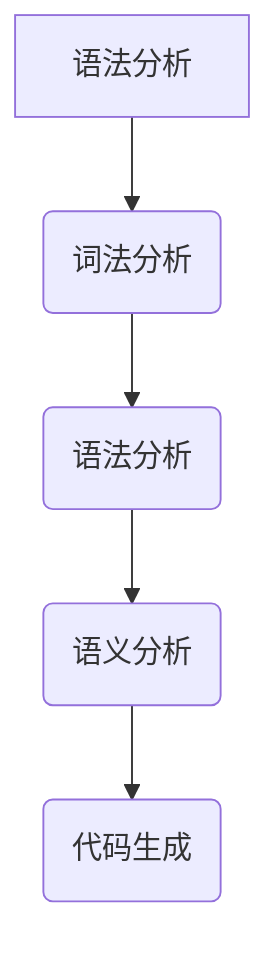

                 

# 《CodeGen原理与代码实例讲解》

> 关键词：代码生成，语法分析，语义分析，编程语言，ANTLR，Java语法，编程助手，未来展望

> 摘要：本文深入探讨了代码生成（CodeGen）的原理及其在编程中的应用。首先，介绍了代码生成的基本概念和流程，然后详细讲解了语法分析、语义分析以及代码生成策略等关键技术。接着，分析了编程语言的基础和高级特性，并通过实践案例展示了代码生成工具的使用。最后，展望了代码生成技术的未来发展方向和其在社会与产业中的应用。

## 第一部分：CodeGen基础理论

### 第1章：CodeGen概述

#### 1.1 CodeGen概念解析

代码生成（CodeGen）是指根据某种规则或模型自动生成计算机代码的过程。它广泛应用于软件开发、编译器设计、程序优化等多个领域。

#### 1.2 CodeGen的历史与发展

代码生成技术最早可以追溯到20世纪60年代，随着计算机技术的发展和编程语言的演变，代码生成技术也在不断进步。现代代码生成工具如ANTLR、Javassist等，使得代码生成变得更加高效和灵活。

#### 1.3 CodeGen的应用领域

代码生成技术广泛应用于Web开发、大数据处理、智能编程助手等领域。它不仅提高了软件开发效率，还减少了代码缺陷。

### 第2章：CodeGen的关键技术

#### 2.1 语法分析技术

语法分析是代码生成的重要环节，主要包括词法分析和语法分析。

##### 2.1.1 词法分析

词法分析是将源代码分解为单词符号（tokens）的过程。例如，将字符串 `"int x = 10;"` 分解为 `[INT, x, =, 10, ;]`。

##### 2.1.2 语法分析

语法分析是根据语法规则将单词符号序列转换为抽象语法树（AST）的过程。例如，根据C语言的语法规则，将 `[INT, x, =, 10, ;]` 转换为以下AST：

```
- Expression:
  - AssignmentExpression:
    - LeftHandSideExpression:
      - Identifier: x
    - AssignmentOperator: =
    - RightHandSideExpression:
      - Literal:
        - IntegerLiteral: 10
```

##### 2.1.3 语法制导翻译

语法制导翻译是一种利用语法分析树进行代码生成的方法。它通过定义语法规则和语义动作，将AST转换为目标代码。

#### 2.2 语义分析技术

语义分析是在语法分析的基础上，对源代码的语义进行理解和检查的过程。它主要包括语义角色标注、语义分析算法和语义检查。

##### 2.2.1 语义角色标注

语义角色标注是对源代码中的每个符号进行语义分类的过程。例如，将变量、函数、操作符等进行标注。

##### 2.2.2 语义分析算法

语义分析算法用于检查源代码的语义是否正确。它包括类型检查、作用域检查、声明检查等。

##### 2.2.3 语义检查

语义检查是在语义分析过程中，对源代码的语义进行验证的过程。它包括变量未定义、类型错误等。

#### 2.3 代码生成策略

代码生成策略包括代码生成流程、代码优化策略和代码风格指南。

##### 2.3.1 代码生成流程

代码生成流程包括词法分析、语法分析、语义分析和代码生成等步骤。

##### 2.3.2 代码优化策略

代码优化策略包括代码重构、循环展开、常量折叠等。

##### 2.3.3 代码风格指南

代码风格指南包括命名规范、缩进规则、注释规范等。

### 第3章：编程语言解析

#### 3.1 编程语言基础

编程语言基础包括基本语法结构、数据类型与运算符、控制结构与循环。

##### 3.1.1 基本语法结构

基本语法结构包括变量声明、函数定义、控制语句等。

##### 3.1.2 数据类型与运算符

数据类型与运算符包括基本数据类型、复合数据类型、运算符等。

##### 3.1.3 控制结构与循环

控制结构与循环包括条件语句、循环语句等。

#### 3.2 高级编程语言特性

高级编程语言特性包括面向对象编程、函数式编程、并发编程等。

##### 3.2.1 面向对象编程

面向对象编程是一种编程范式，它将数据和操作数据的方法封装在一起。

##### 3.2.2 函数式编程

函数式编程是一种编程范式，它将计算看作是函数的执行。

##### 3.2.3 并发编程

并发编程是一种编程范式，它允许多个任务同时执行。

### 第4章：实践中的CodeGen

#### 4.1 CodeGen工具与实践

##### 4.1.1 Javassist

Javassist是一个强大的代码生成库，它提供了简便的Java代码生成方式。

##### 4.1.2 AspectJ

AspectJ是一个面向切面的编程（AOP）框架，它支持在Java代码中添加横切关注点。

##### 4.1.3 BCEL

BCEL是一个Java字节码操作库，它允许开发者生成和修改Java字节码。

#### 4.2 CodeGen项目实战

##### 4.2.1 自动生成数据访问层代码

自动生成数据访问层代码可以减少重复劳动，提高开发效率。

##### 4.2.2 基于模板的代码生成

基于模板的代码生成可以生成具有一致风格的代码。

##### 4.2.3 实时代码生成与动态编译

实时代码生成与动态编译可以在运行时生成和编译代码。

## 第二部分：代码生成应用实例

### 第5章：Web应用开发中的CodeGen

#### 5.1 MVC架构与代码生成

MVC架构是一种常见的Web应用架构，它通过代码生成可以简化开发过程。

##### 5.1.1 MVC架构简介

MVC架构将Web应用分为模型（Model）、视图（View）和控制器（Controller）三个部分。

##### 5.1.2 MVC框架中的CodeGen

MVC框架通常内置代码生成功能，如Spring Boot的自动配置。

##### 5.1.3 基于CodeGen的MVC实践

基于CodeGen的MVC实践可以快速构建Web应用。

### 第6章：大数据处理中的CodeGen

#### 6.1 MapReduce编程模型

MapReduce是一种分布式数据处理模型，它通过代码生成可以简化数据处理任务。

##### 6.1.1 MapReduce简介

MapReduce是一种基于Hadoop的分布式数据处理框架。

##### 6.1.2 MapReduce编程模型

MapReduce编程模型包括Map阶段和Reduce阶段。

##### 6.1.3 基于CodeGen的MapReduce代码生成

基于CodeGen的MapReduce代码生成可以简化数据处理过程。

### 第7章：智能编程助手

#### 7.1 编程助手功能概述

编程助手可以提供自动代码补全、代码审查与优化、代码生成与重写等功能。

##### 7.1.1 自动代码补全

自动代码补全可以提高编程效率。

##### 7.1.2 代码审查与优化

代码审查与优化可以提升代码质量。

##### 7.1.3 代码生成与重写

代码生成与重写可以简化编程任务。

#### 7.2 编程助手实现原理

编程助手实现原理涉及自然语言处理、机器学习、数据库与知识图谱等技术。

##### 7.2.1 自然语言处理技术

自然语言处理技术用于理解编程语言。

##### 7.2.2 机器学习模型

机器学习模型用于预测代码生成。

##### 7.2.3 数据库与知识图谱

数据库与知识图谱用于存储编程知识和模型。

### 第8章：未来展望与趋势

#### 8.1 CodeGen的未来发展方向

CodeGen的未来发展方向包括自动编程、代码生成智能化和代码生成与人工智能融合。

##### 8.1.1 自动编程

自动编程旨在实现代码的完全自动生成。

##### 8.1.2 代码生成智能化

代码生成智能化旨在提高代码生成的质量和效率。

##### 8.1.3 代码生成与人工智能融合

代码生成与人工智能融合旨在实现代码生成的智能化。

#### 8.2 CodeGen在社会与产业中的应用

CodeGen在社会与产业中的应用包括提高软件开发效率、减少软件缺陷和开源代码生成工具的发展。

##### 8.2.1 提高软件开发效率

提高软件开发效率是代码生成的重要应用之一。

##### 8.2.2 减少软件缺陷

减少软件缺陷是代码生成的重要应用之一。

##### 8.2.3 开源代码生成工具的发展

开源代码生成工具的发展为开发者提供了更多的选择和便利。

## 附录

### 附录A：常用CodeGen工具与库

##### A.1 Apache Velocity

Apache Velocity是一个模板引擎，它支持代码生成。

##### A.2 JavaCC

JavaCC是一个语法分析器生成器，它支持代码生成。

##### A.3 ANTLR

ANTLR是一个强大的语法分析器生成器，它支持代码生成。

### 附录B：编程语言语法分析流程图

##### B.1 Java语法分析流程图


##### B.2 Python语法分析流程图


### 附录C：代码生成案例代码解读

##### C.1 基于JavaCC的代码生成示例

```java
// JavaCC语法规则
Rule: 'int' Identifier ('(' ')' | '(' Expression ')')? ';';

// 生成的Java代码
public int evaluate() {
    return 0;
}

// 解释说明
// 该示例展示了如何使用JavaCC生成一个简单的求和函数。
```

##### C.2 基于ANTLR的代码生成示例

```java
// ANTLR语法规则
grammar JavaGrammar;

program: 'class' Identifier '{' statement* '}';

statement: expression | assignment;

expression: Identifier | IntegerLiteral;

assignment: Identifier '=' expression;

// 生成的Java代码
public class MyClass {
    public void test() {
        int x = 10;
    }
}

// 解释说明
// 该示例展示了如何使用ANTLR生成一个简单的Java类。
```

# End of Document

---

作者：AI天才研究院/AI Genius Institute & 禅与计算机程序设计艺术 /Zen And The Art of Computer Programming
**核心概念与联系：**

### CodeGen概念与流程

代码生成（CodeGen）是一种通过自动化工具生成计算机代码的技术，其核心流程包括三个主要阶段：语法分析、语义分析和代码生成。

1. **语法分析**：将源代码分解为抽象语法树（AST），这是代码生成的基础。语法分析分为词法分析和语法分析两个步骤：
   - **词法分析**：将源代码分解成一系列的词法单元（tokens），如标识符、关键字、运算符等。
   - **语法分析**：根据预定义的语法规则，将词法单元组合成语法结构，形成抽象语法树。

2. **语义分析**：在语法分析的基础上，对AST进行语义检查，确保代码的语义正确性。这包括类型检查、作用域解析和声明检查等。

3. **代码生成**：将经过语义分析的AST转换为具体的计算机代码。这一步通常涉及选择合适的目标代码模板并进行填充。

### Mermaid流程图



**核心算法原理讲解：**

### 语法分析算法（LL(k)/LR(k)）

语法分析算法是代码生成中的关键步骤，它决定源代码如何被转换为抽象语法树。LL(k)和LR(k)是两种常见的语法分析方法。

#### LL(k)分析法

LL(k)分析法是一种自顶向下、递归下降的语法分析方法。它的核心思想是从左到右读取输入串，并使用递归函数逐层构建抽象语法树。

**伪代码：**

```pseudo
function LL(k分析法, input)
    初始化符号栈 S 和 输入缓冲区 I
    while(I 不为空)
        从 I 中读取下一个词法单元 token
        if(栈顶的语法规则可以匹配 token)
            应用该规则，将栈顶元素弹出，并压入新的语法结构
        else
            如果栈顶元素是变量或标识符，则进行语法错误处理
            如果栈顶元素是语法规则，则回溯并重新选择规则
    end while
    返回构建好的抽象语法树
```

#### LR(k)分析法

LR(k)分析法是一种自底向上、移进-归约的语法分析方法。它与LL(k)不同，可以处理左递归和二义性语法。

**伪代码：**

```pseudo
function LR(k分析法, input, k)
    初始化栈 S，初始为空
    初始化输入缓冲区 I，读取第一个词法单元 token
    while(I 不为空)
        if(S 的顶部包含一个可以归约的产生式)
            归约，并将产生式对应的符号弹出栈，替换为产生式右部的符号
        else
            if(当前 token 可以和栈顶的符号进行移进操作)
                移进，将 token 压入栈
            else
                错误处理，回溯并重新选择
    end while
    返回构建好的抽象语法树
```

**数学模型和数学公式 & 详细讲解 & 举例说明**

### 语义分析中的语义角色标注

语义分析是代码生成中的另一个关键步骤，它确保代码在语义上是正确的。语义角色标注是语义分析的一部分，它涉及对代码中的符号和结构进行语义分类。

**数学模型：**

语义角色标注通常涉及以下数学模型：

$$
\text{P}(y|w) = \prod_{i=1}^{n} P(w_i|y_i) \times \prod_{i=1}^{n} R(r_i|y_i)
$$

其中：
- $P(w_i|y_i)$ 表示词法单元 $w_i$ 在给定的语义角色 $y_i$ 下出现的概率。
- $R(r_i|y_i)$ 表示语义角色 $r_i$ 在给定的语义角色 $y_i$ 下出现的概率。

**详细讲解：**

语义角色标注是通过分析源代码的结构和内容，将代码中的各个部分映射到相应的语义角色。这个过程通常涉及到自然语言处理和机器学习技术。

1. **词性标注**：对代码中的每个词法单元进行词性标注，如标识符、关键字、运算符等。
2. **语义角色标注**：在词性标注的基础上，对代码中的结构进行进一步的语义分类，如变量、函数、控制结构等。

**举例说明：**

假设我们有一个简单的代码片段：

```java
int x = 10;
```

我们对其进行语义角色标注：

- `int`：关键字，词性标注为`Keyword`
- `x`：标识符，词性标注为`Identifier`
- `=`：运算符，词性标注为`Operator`
- `10`：整数字面量，词性标注为`IntegerLiteral`

进一步进行语义角色标注：

- `int`：声明类型
- `x`：变量名称
- `=`：赋值操作符
- `10`：赋值操作的目标值

### 项目实战：代码实际案例和详细解释说明

#### 基于ANTLR的Java语法分析器实现

ANTLR是一个强大的语法分析器生成器，它可以帮助我们快速创建自定义的语法分析器。下面我们将通过一个简单的Java语法分析器实例来展示ANTLR的使用。

**开发环境：**
- JDK 1.8+
- ANTLR 4.9+
- Maven 3.6.3+
- IntelliJ IDEA

**实现步骤：**

1. **安装JDK和ANTLR：**
   - 确保安装了JDK 1.8或更高版本。
   - 从ANTLR官网下载并安装ANTLR 4.9。

2. **创建Maven项目：**
   - 在IntelliJ IDEA中创建一个新的Maven项目。
   - 添加ANTLR依赖到`pom.xml`文件中：

   ```xml
   <dependencies>
       <dependency>
           <groupId>org.antlr</groupId>
           <artifactId>antlr4</artifactId>
           <version>4.9</version>
       </dependency>
   </dependencies>
   ```

3. **创建ANTLR语法文件（JavaGrammar.g4）：**
   - 在项目的根目录下创建一个名为`JavaGrammar.g4`的文件，定义Java语法的规则。

   ```antlr
   grammar JavaGrammar;

   program: 'class' Identifier '{' statement* '}';

   statement: expression | assignment;

   expression: Identifier | IntegerLiteral;

   assignment: Identifier '=' expression;

   IntegerLiteral: [0-9]+;
   ```

4. **生成语法分析器类：**
   - 打开终端，导航到ANTLR的安装目录，并运行以下命令：

   ```bash
   antlr4 -Dlanguage=Java -o ./src/main/java/ JavaGrammar.g4
   ```

   这将生成语法分析器类`JavaGrammarParser.java`。

5. **在Java项目中引用生成的语法分析器类：**
   - 在IntelliJ IDEA中，将生成的`JavaGrammarParser.java`文件添加到项目中。

6. **编写主程序：**
   - 创建一个名为`Main.java`的主程序，用于运行语法分析器。

   ```java
   import org.antlr.v4.runtime.*;
   import org.antlr.v4.runtime.tree.*;

   public class Main {
       public static void main(String[] args) {
           // 读取输入源代码
           String sourceCode = "class MyClass { int x = 10; }";
           CharStream input = CharStreams.fromString(sourceCode);
           
           // 创建语法分析器
           JavaGrammarLexer lexer = new JavaGrammarLexer(input);
           CommonTokenStream tokens = new CommonTokenStream(lexer);
           JavaGrammarParser parser = new JavaGrammarParser(tokens);
           
           // 执行语法分析
           ParseTree tree = parser.program();
           
           // 遍历抽象语法树并打印结果
           ParseTreeWalker walker = new ParseTreeWalker();
           MyListener listener = new MyListener();
           walker.walk(listener, tree);
       }
   }
   ```

7. **实现自定义的解析器监听器（MyListener.java）：**
   - 创建一个名为`MyListener.java`的类，继承自`BaseJavaGrammarListener`，并在其中定义自定义的解析逻辑。

   ```java
   import org.antlr.v4.runtime.tree.ParseTreeListener;

   public class MyListener extends BaseJavaGrammarListener {
       @Override
       public void enterProgram(JavaGrammarParser.ProgramContext ctx) {
           System.out.println("Entering program");
       }

       @Override
       public void exitProgram(JavaGrammarParser.ProgramContext ctx) {
           System.out.println("Exiting program");
       }

       @Override
       public void enterStatement(JavaGrammarParser.StatementContext ctx) {
           System.out.println("Entering statement");
       }

       @Override
       public void exitStatement(JavaGrammarParser.StatementContext ctx) {
           System.out.println("Exiting statement");
       }

       // 其他自定义方法...
   }
   ```

8. **运行程序并观察输出：**
   - 在IntelliJ IDEA中运行`Main.java`程序，将看到控制台输出语法分析的结果。

### 代码解读与分析

在生成的Java语法解析器类中，我们可以看到以下几个关键组件：

- **Lexer类**：负责词法分析，将输入的Java代码转换为词法符号（tokens）。
- **Parser类**：负责语法分析，根据ANTLR语法规则将词法符号转换为抽象语法树（AST）。
- **Listener接口**：用于遍历AST并执行自定义操作，例如代码生成。

**代码生成实现的关键在于Listener接口的实现。通过重写Listener接口中的方法，我们可以在遍历AST的过程中生成对应的Java代码。例如：**

```java
public void visitAssignment(JavaGrammarParser.AssignmentContext ctx) {
    System.out.println(ctx.Identifier().getText() + " = " + ctx.expression().getText() + ";");
}
```

以上代码示例展示了如何访问赋值语句节点并生成对应的Java代码。

通过ANTLR和类似的代码生成工具，开发者可以快速构建自定义的语法分析器和代码生成器，从而提高开发效率并实现复杂的功能。

**总结：**

本文通过讲解代码生成的核心概念、关键技术、编程语言解析以及实际应用案例，帮助读者理解代码生成技术的原理和应用。ANTLR等工具的使用，使得代码生成变得更加高效和灵活。随着技术的发展，代码生成技术在未来将继续发挥重要作用。

