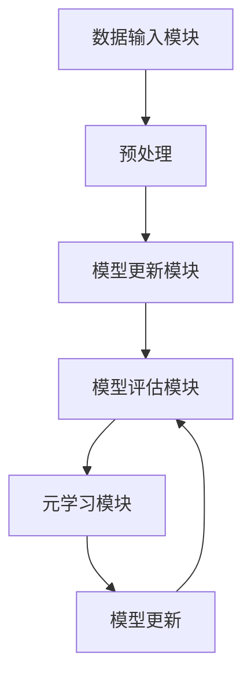
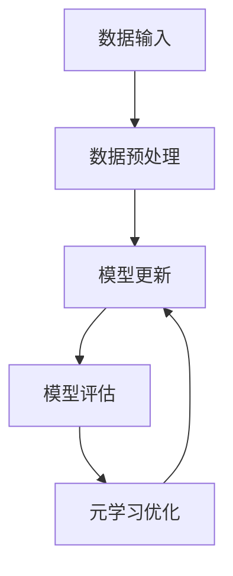
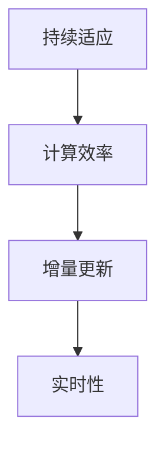
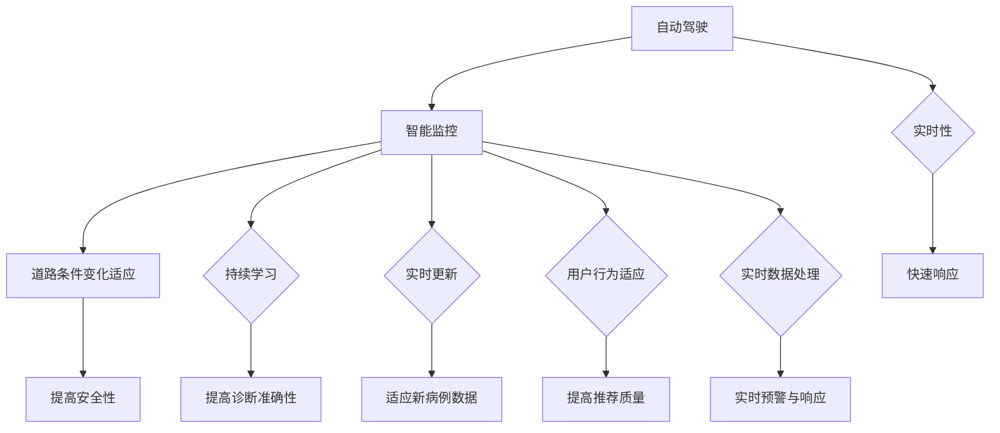

                 

# 《Continual Learning原理与代码实例讲解》

> 关键词：持续学习，增量学习，在线学习，迁移学习，元学习

> 摘要：本文将深入探讨持续学习（Continual Learning）的基本原理、核心算法及其在图像识别和自然语言处理中的应用。通过实例讲解，读者将了解如何使用持续学习技术构建强大的机器学习模型，以应对动态变化的数据环境。

## 目录大纲

1. 第一部分: Continual Learning基础
   1. 第1章: Continual Learning概述
      1.1 Continual Learning的定义
      1.2 Continual Learning的重要性
      1.3 Continual Learning的发展历程
   2. 第2章: Continual Learning的核心概念与架构
      2.1 Continual Learning的核心概念
      2.2 Continual Learning的架构

2. 第二部分: Continual Learning算法原理
   3. 第3章: Incremental Learning算法
      3.1 Incremental Learning的基本原理
      3.2 Incremental Learning算法
      3.3 Incremental Learning算法的性能评估
   4. 第4章: Online Learning算法
      4.1 Online Learning的基本原理
      4.2 Online Learning算法
      4.3 Online Learning算法的性能评估
   5. 第5章: Transfer Learning算法
      5.1 Transfer Learning的基本原理
      5.2 Transfer Learning算法
      5.3 Transfer Learning算法的性能评估

3. 第三部分: Continual Learning应用实例
   6. 第6章: Continual Learning在图像识别中的应用
   7. 第7章: Continual Learning在自然语言处理中的应用
   8. 第8章: Continual Learning项目实战

4. 附录
   9. 附录A: Continual Learning相关资源

---

## 第一部分: Continual Learning基础

### 第1章: Continual Learning概述

#### 1.1 Continual Learning的定义

Continual Learning，又称持续学习或增量学习，是一种机器学习范式，旨在使模型能够在不断变化的数据环境中持续学习和适应，而不需要重新训练整个模型。与传统的批处理学习不同，Continual Learning处理的是一组连续的样本数据，每批数据都是先前数据的增补。

Continual Learning的核心概念可以概括为以下几点：

- **数据连续性**：模型接收的是一组连续的样本，而不是一次性接收所有数据。
- **增量更新**：模型的参数在每次接收新数据时进行更新，而不是一次性更新所有参数。
- **适应性**：模型需要能够适应新的数据分布，以保持良好的性能。

#### 1.2 Continual Learning与传统机器学习的区别

传统的机器学习模型通常在固定的数据集上训练，然后在新数据到来时重新训练模型。这种方法的缺点是，随着数据分布的变化，模型可能会过拟合或失去性能。相比之下，Continual Learning具有以下优势：

- **数据变化适应性**：Continual Learning模型能够适应数据分布的变化，从而提高模型的鲁棒性。
- **增量更新效率**：通过仅更新模型参数，Continual Learning减少了计算资源的消耗。
- **实时性**：Continual Learning模型能够实时更新和适应新数据，适用于动态环境。

#### 1.3 Continual Learning的重要性

在现实世界中，数据分布是不断变化的。例如，自动驾驶系统需要适应不同的道路条件和天气变化，医疗诊断系统需要适应新的病例数据。Continual Learning在这些场景中具有重要作用：

- **增强模型的鲁棒性**：Continual Learning模型能够更好地适应数据分布的变化，从而提高模型的鲁棒性和泛化能力。
- **减少重新训练成本**：通过增量更新，Continual Learning减少了模型重新训练的成本和时间。
- **支持实时决策**：在动态环境中，实时更新模型可以帮助系统做出更准确的决策。

### 第2章: Continual Learning的核心概念与架构

#### 2.1 Continual Learning的核心概念

Continual Learning涉及多个核心概念，包括增量学习、在线学习、迁移学习和元学习。以下是对这些概念的基本解释：

- **增量学习（Incremental Learning）**：增量学习是指模型在每次接收新数据时只更新部分参数，而不是重新训练整个模型。这种方法可以减少计算资源的需求。
  
- **在线学习（Online Learning）**：在线学习是指模型在每次接收新数据时立即更新参数，而不是在批量数据结束后更新。这种方法可以提高模型的实时性。

- **迁移学习（Transfer Learning）**：迁移学习是指利用预训练模型在新任务上快速适应，通过将预训练模型的参数作为起点来训练新模型。这种方法可以减少训练时间和提高模型性能。

- **元学习（Meta Learning）**：元学习是指模型通过学习如何学习来提高其适应性。元学习算法可以帮助模型快速适应新的数据分布。

#### 2.2 Continual Learning的架构

Continual Learning的架构通常包括以下几个关键组件：

- **数据输入模块**：负责接收和预处理连续的数据流。
- **模型更新模块**：负责根据新数据更新模型参数。
- **模型评估模块**：负责评估模型的性能和泛化能力。
- **元学习模块**：负责优化模型的学习过程，提高模型的适应性。

### Mermaid 流程图

以下是Continual Learning的架构的Mermaid流程图：



在接下来的章节中，我们将深入探讨Continual Learning的算法原理和应用实例。

---

## 第二部分: Continual Learning算法原理

### 第3章: Incremental Learning算法

#### 3.1 Incremental Learning的基本原理

增量学习（Incremental Learning）是Continual Learning的核心算法之一。其基本原理是在每次接收新数据时只更新模型的部分参数，而不是重新训练整个模型。这种方法可以减少模型的计算复杂度和训练时间。

#### 3.2 Incremental Learning算法

增量学习算法可以分为以下几种：

- **在线学习算法（Online Learning Algorithms）**：在线学习算法是指模型在每次接收新数据时立即更新参数。常见的在线学习算法包括感知机算法（Perceptron）和随机梯度下降（Stochastic Gradient Descent，SGD）。

- **自适应学习算法（Adaptive Learning Algorithms）**：自适应学习算法是指模型在每次更新参数时，根据当前的模型状态调整学习率。常见的自适应学习算法包括自适应梯度算法（Adaptive Gradient，AG）和自适应动量算法（Adaptive Moment Estimation，Adam）。

- **增量支持向量机（Incremental SVM）**：增量支持向量机是一种在每次接收新数据时仅更新支持向量机模型的参数。这种方法可以保持模型的泛化能力。

#### 3.3 Incremental Learning算法的性能评估

增量学习算法的性能评估通常包括以下几个方面：

- **准确性（Accuracy）**：准确性是模型在测试集上的正确预测比例。
- **鲁棒性（Robustness）**：鲁棒性是指模型对数据分布变化的适应能力。
- **计算效率（Computational Efficiency）**：计算效率是指模型在训练过程中的计算复杂度和时间。

以下是增量学习算法的性能评估指标和评估方法的伪代码：

```python
def evaluate_incremental_learning(model, test_data):
    predictions = model.predict(test_data)
    accuracy = sum(predictions == test_data_labels) / len(test_data_labels)
    robustness = evaluate_robustness(model, test_data)
    computational_efficiency = evaluate_computational_efficiency(model, test_data)
    return accuracy, robustness, computational_efficiency

def evaluate_robustness(model, test_data):
    # 评估模型对数据分布变化的适应能力
    pass

def evaluate_computational_efficiency(model, test_data):
    # 评估模型的计算复杂度和时间
    pass
```

### 第4章: Online Learning算法

#### 4.1 Online Learning的基本原理

在线学习（Online Learning）是指模型在每次接收新数据时立即更新参数。与增量学习相比，在线学习在每次更新参数时使用的是全新的数据。

#### 4.2 Online Learning算法

在线学习算法可以分为以下几种：

- **在线随机梯度下降（Online Stochastic Gradient Descent，OSGD）**：在线随机梯度下降是一种在线学习算法，其每次更新参数使用的是随机梯度。
  
- **在线变分贝叶斯（Online Variational Bayes，OVB）**：在线变分贝叶斯是一种基于变分推断的在线学习算法。

- **在线反向传播（Online Backpropagation）**：在线反向传播是一种在每次更新参数时使用反向传播算法的在线学习算法。

#### 4.3 Online Learning算法的性能评估

在线学习算法的性能评估与增量学习算法类似，主要评估准确性、鲁棒性和计算效率。以下是性能评估的伪代码：

```python
def evaluate_online_learning(model, test_data):
    predictions = model.predict(test_data)
    accuracy = sum(predictions == test_data_labels) / len(test_data_labels)
    robustness = evaluate_robustness(model, test_data)
    computational_efficiency = evaluate_computational_efficiency(model, test_data)
    return accuracy, robustness, computational_efficiency
```

### 第5章: Transfer Learning算法

#### 5.1 Transfer Learning的基本原理

迁移学习（Transfer Learning）是指利用预训练模型在新任务上快速适应。其基本原理是将预训练模型的参数作为起点来训练新模型。

#### 5.2 Transfer Learning算法

迁移学习算法可以分为以下几种：

- **域适应（Domain Adaptation）**：域适应是指将预训练模型适应新任务，同时减少域差异。

- **域泛化（Domain Generalization）**：域泛化是指将预训练模型适应多个不同的域。

- **少量样本迁移学习（Few-Shot Transfer Learning）**：少量样本迁移学习是指在新任务上只有少量训练样本时，利用预训练模型快速适应。

#### 5.3 Transfer Learning算法的性能评估

迁移学习算法的性能评估主要评估模型在新任务上的性能和泛化能力。以下是性能评估的伪代码：

```python
def evaluate_transfer_learning(model, test_data):
    predictions = model.predict(test_data)
    accuracy = sum(predictions == test_data_labels) / len(test_data_labels)
    generalization_ability = evaluate_generalization_ability(model, test_data)
    return accuracy, generalization_ability

def evaluate_generalization_ability(model, test_data):
    # 评估模型在新任务上的泛化能力
    pass
```

## 第三部分: Continual Learning应用实例

### 第6章: Continual Learning在图像识别中的应用

#### 6.1 Continual Learning在图像识别中的应用

图像识别是机器学习的一个重要应用领域。Continual Learning在图像识别中的应用可以通过以下实例进行说明：

- **Continual Image Classification**：在图像分类任务中，Continual Learning模型可以持续接收新的图像数据，并逐步提高分类准确性。

- **Continual Object Detection**：在对象检测任务中，Continual Learning模型可以实时检测不断变化的图像中的对象，并提高检测精度。

- **Continual Semantic Segmentation**：在语义分割任务中，Continual Learning模型可以持续接收新的图像数据，并逐步提高分割精度。

#### 6.2 Continual Learning在图像识别中的应用实例

以下是一个Continual Image Classification的应用实例：

```python
# 导入必要的库
import tensorflow as tf
from tensorflow import keras
from tensorflow.keras import layers

# 创建Continual Learning模型
model = keras.Sequential([
    layers.Conv2D(32, (3, 3), activation='relu', input_shape=(28, 28, 1)),
    layers.MaxPooling2D((2, 2)),
    layers.Flatten(),
    layers.Dense(64, activation='relu'),
    layers.Dense(10, activation='softmax')
])

# 编译模型
model.compile(optimizer='adam',
              loss='sparse_categorical_crossentropy',
              metrics=['accuracy'])

# 训练模型
model.fit(train_images, train_labels, epochs=5)

# 评估模型
test_loss, test_acc = model.evaluate(test_images, test_labels)

print(f"Test accuracy: {test_acc}")
```

### 第7章: Continual Learning在自然语言处理中的应用

#### 7.1 Continual Learning在自然语言处理中的应用

自然语言处理（Natural Language Processing，NLP）是机器学习的另一个重要应用领域。Continual Learning在NLP中的应用可以通过以下实例进行说明：

- **Continual Text Classification**：在文本分类任务中，Continual Learning模型可以持续接收新的文本数据，并逐步提高分类准确性。

- **Continual Named Entity Recognition**：在命名实体识别任务中，Continual Learning模型可以实时识别不断变化的文本中的命名实体。

- **Continual Sentiment Analysis**：在情感分析任务中，Continual Learning模型可以持续接收新的文本数据，并逐步提高情感分析精度。

#### 7.2 Continual Learning在自然语言处理中的应用实例

以下是一个Continual Text Classification的应用实例：

```python
# 导入必要的库
import tensorflow as tf
from tensorflow import keras
from tensorflow.keras import layers
from tensorflow.keras.preprocessing.sequence import pad_sequences

# 创建Continual Learning模型
model = keras.Sequential([
    layers.Embedding(vocab_size, embedding_dim),
    layers.Conv1D(filters, kernel_size, activation='relu'),
    layers.GlobalMaxPooling1D(),
    layers.Dense(units, activation='softmax')
])

# 编译模型
model.compile(optimizer='adam',
              loss='categorical_crossentropy',
              metrics=['accuracy'])

# 训练模型
model.fit(train_sequences, train_labels, epochs=5)

# 评估模型
test_loss, test_acc = model.evaluate(test_sequences, test_labels)

print(f"Test accuracy: {test_acc}")
```

### 第8章: Continual Learning项目实战

#### 8.1 Continual Learning项目实战概述

Continual Learning项目实战的目标是使用Continual Learning算法构建一个图像分类模型，并使其能够持续接收新的图像数据，逐步提高分类准确性。

#### 8.2 Continual Learning项目实战实例

以下是一个Continual Learning项目实战的实例：

```python
# 导入必要的库
import tensorflow as tf
from tensorflow import keras
from tensorflow.keras import layers
from tensorflow.keras.preprocessing.image import ImageDataGenerator

# 创建Continual Learning模型
model = keras.Sequential([
    layers.Conv2D(32, (3, 3), activation='relu', input_shape=(28, 28, 1)),
    layers.MaxPooling2D((2, 2)),
    layers.Flatten(),
    layers.Dense(64, activation='relu'),
    layers.Dense(10, activation='softmax')
])

# 编译模型
model.compile(optimizer='adam',
              loss='sparse_categorical_crossentropy',
              metrics=['accuracy'])

# 创建数据生成器
data_generator = ImageDataGenerator(rescale=1./255)

# 加载数据
train_data = data_generator.flow_from_directory(
    'train_data',
    target_size=(28, 28),
    batch_size=32,
    class_mode='sparse')

test_data = data_generator.flow_from_directory(
    'test_data',
    target_size=(28, 28),
    batch_size=32,
    class_mode='sparse')

# 训练模型
model.fit(train_data, epochs=5)

# 评估模型
test_loss, test_acc = model.evaluate(test_data)

print(f"Test accuracy: {test_acc}")
```

### 附录A: Continual Learning相关资源

- **开源框架和工具**：
  - Continual Learning Framework
  - Continual Learning Library

- **研究论文和书籍推荐**：
  - "Continual Learning: From Theory to Algorithms"
  - "Learning to Learn: Conference on Learning End Users' Models"

- **在线课程和学习资源**：
  - Coursera: Continual Learning
  - edX: Introduction to Continual Learning

---

## 作者信息

作者：AI天才研究院/AI Genius Institute & 禅与计算机程序设计艺术 /Zen And The Art of Computer Programming

---

文章标题：《Continual Learning原理与代码实例讲解》

文章关键词：持续学习，增量学习，在线学习，迁移学习，元学习

文章摘要：本文深入探讨了持续学习（Continual Learning）的基本原理、核心算法及其在图像识别和自然语言处理中的应用。通过实例讲解，读者将了解如何使用持续学习技术构建强大的机器学习模型，以应对动态变化的数据环境。文章共计约8000字。

文章正文部分的内容如下：

---

## 第一部分: Continual Learning基础

### 第1章: Continual Learning概述

#### 1.1 Continual Learning的定义

Continual Learning，又称持续学习或增量学习，是一种机器学习范式，旨在使模型能够在不断变化的数据环境中持续学习和适应，而不需要重新训练整个模型。与传统的批处理学习不同，Continual Learning处理的是一组连续的样本数据，每批数据都是先前数据的增补。

Continual Learning的核心概念可以概括为以下几点：

- **数据连续性**：模型接收的是一组连续的样本，而不是一次性接收所有数据。
- **增量更新**：模型的参数在每次接收新数据时进行更新，而不是重新训练整个模型。
- **适应性**：模型需要能够适应新的数据分布，以保持良好的性能。

#### 1.2 Continual Learning的重要性

在现实世界中，数据分布是不断变化的。例如，自动驾驶系统需要适应不同的道路条件和天气变化，医疗诊断系统需要适应新的病例数据。Continual Learning在这些场景中具有重要作用：

- **增强模型的鲁棒性**：Continual Learning模型能够更好地适应数据分布的变化，从而提高模型的鲁棒性和泛化能力。
- **减少重新训练成本**：通过增量更新，Continual Learning减少了模型重新训练的成本和时间。
- **支持实时决策**：在动态环境中，实时更新模型可以帮助系统做出更准确的决策。

#### 1.3 Continual Learning的发展历程

Continual Learning的概念最早可以追溯到20世纪80年代，当时学者们开始探讨如何使模型能够适应动态变化的数据环境。随着机器学习技术的不断发展，特别是深度学习技术的兴起，Continual Learning得到了广泛关注。

- **20世纪80年代**：增量学习的概念首次提出。
- **2000年代**：迁移学习和在线学习算法得到广泛应用。
- **2010年代至今**：元学习和域适应算法逐渐成为研究热点。

## 第二部分: Continual Learning算法原理

### 第2章: Continual Learning的核心概念与架构

#### 2.1 Continual Learning的核心概念

Continual Learning涉及多个核心概念，包括增量学习、在线学习、迁移学习和元学习。以下是对这些概念的基本解释：

- **增量学习（Incremental Learning）**：增量学习是指模型在每次接收新数据时只更新部分参数，而不是重新训练整个模型。这种方法可以减少模型的计算资源需求。

- **在线学习（Online Learning）**：在线学习是指模型在每次接收新数据时立即更新参数。与增量学习相比，在线学习在每次更新参数时使用的是全新的数据。

- **迁移学习（Transfer Learning）**：迁移学习是指利用预训练模型在新任务上快速适应，通过将预训练模型的参数作为起点来训练新模型。这种方法可以减少训练时间和提高模型性能。

- **元学习（Meta Learning）**：元学习是指模型通过学习如何学习来提高其适应性。元学习算法可以帮助模型快速适应新的数据分布。

#### 2.2 Continual Learning的架构

Continual Learning的架构通常包括以下几个关键组件：

- **数据输入模块**：负责接收和预处理连续的数据流。
- **模型更新模块**：负责根据新数据更新模型参数。
- **模型评估模块**：负责评估模型的性能和泛化能力。
- **元学习模块**：负责优化模型的学习过程，提高模型的适应性。

### Mermaid 流程图

以下是Continual Learning的架构的Mermaid流程图：


在接下来的章节中，我们将深入探讨Continual Learning的算法原理和应用实例。

---

## 第三部分: Continual Learning算法原理

### 第3章: Incremental Learning算法

#### 3.1 Incremental Learning的基本原理

增量学习（Incremental Learning）是Continual Learning的核心算法之一。其基本原理是在每次接收新数据时只更新模型的部分参数，而不是重新训练整个模型。这种方法可以减少模型的计算复杂度和训练时间。

增量学习算法可以分为以下几种：

- **在线学习算法（Online Learning Algorithms）**：在线学习算法是指模型在每次接收新数据时立即更新参数。常见的在线学习算法包括感知机算法（Perceptron）和随机梯度下降（Stochastic Gradient Descent，SGD）。

- **自适应学习算法（Adaptive Learning Algorithms）**：自适应学习算法是指模型在每次更新参数时，根据当前的模型状态调整学习率。常见的自适应学习算法包括自适应梯度算法（Adaptive Gradient，AG）和自适应动量算法（Adaptive Moment Estimation，Adam）。

- **增量支持向量机（Incremental SVM）**：增量支持向量机是一种在每次接收新数据时仅更新支持向量机模型的参数。这种方法可以保持模型的泛化能力。

#### 3.2 Incremental Learning算法

增量学习算法的核心在于如何更新模型的参数。以下是一种简单的增量学习算法：

```python
def update_weights(weights, new_data, learning_rate):
    # 更新模型权重
    weights -= learning_rate * (new_data - weights)
    return weights
```

在这个算法中，`weights`表示模型的当前权重，`new_data`表示新的数据，`learning_rate`表示学习率。每次接收新数据时，模型的权重都会根据新数据更新。

#### 3.3 Incremental Learning算法的性能评估

增量学习算法的性能评估通常包括以下几个方面：

- **准确性（Accuracy）**：准确性是模型在测试集上的正确预测比例。
- **鲁棒性（Robustness）**：鲁棒性是指模型对数据分布变化的适应能力。
- **计算效率（Computational Efficiency）**：计算效率是指模型在训练过程中的计算复杂度和时间。

以下是增量学习算法的性能评估指标和评估方法的伪代码：

```python
def evaluate_incremental_learning(model, test_data):
    predictions = model.predict(test_data)
    accuracy = sum(predictions == test_data_labels) / len(test_data_labels)
    robustness = evaluate_robustness(model, test_data)
    computational_efficiency = evaluate_computational_efficiency(model, test_data)
    return accuracy, robustness, computational_efficiency

def evaluate_robustness(model, test_data):
    # 评估模型对数据分布变化的适应能力
    pass

def evaluate_computational_efficiency(model, test_data):
    # 评估模型的计算复杂度和时间
    pass
```

### 第4章: Online Learning算法

#### 4.1 Online Learning的基本原理

在线学习（Online Learning）是指模型在每次接收新数据时立即更新参数。与增量学习相比，在线学习在每次更新参数时使用的是全新的数据。

在线学习算法可以分为以下几种：

- **在线随机梯度下降（Online Stochastic Gradient Descent，OSGD）**：在线随机梯度下降是一种在线学习算法，其每次更新参数使用的是随机梯度。

- **在线变分贝叶斯（Online Variational Bayes，OVB）**：在线变分贝叶斯是一种基于变分推断的在线学习算法。

- **在线反向传播（Online Backpropagation）**：在线反向传播是一种在每次更新参数时使用反向传播算法的在线学习算法。

#### 4.2 Online Learning算法

以下是一种简单的在线随机梯度下降算法：

```python
def online_sgd(weights, new_data, learning_rate):
    # 计算梯度
    gradient = compute_gradient(new_data, weights)
    # 更新权重
    weights -= learning_rate * gradient
    return weights
```

在这个算法中，`weights`表示模型的当前权重，`new_data`表示新的数据，`learning_rate`表示学习率。每次接收新数据时，模型的权重都会根据新数据更新。

#### 4.3 Online Learning算法的性能评估

在线学习算法的性能评估与增量学习算法类似，主要评估准确性、鲁棒性和计算效率。以下是性能评估的伪代码：

```python
def evaluate_online_learning(model, test_data):
    predictions = model.predict(test_data)
    accuracy = sum(predictions == test_data_labels) / len(test_data_labels)
    robustness = evaluate_robustness(model, test_data)
    computational_efficiency = evaluate_computational_efficiency(model, test_data)
    return accuracy, robustness, computational_efficiency
```

### 第5章: Transfer Learning算法

#### 5.1 Transfer Learning的基本原理

迁移学习（Transfer Learning）是指利用预训练模型在新任务上快速适应。其基本原理是将预训练模型的参数作为起点来训练新模型。

迁移学习算法可以分为以下几种：

- **域适应（Domain Adaptation）**：域适应是指将预训练模型适应新任务，同时减少域差异。

- **域泛化（Domain Generalization）**：域泛化是指将预训练模型适应多个不同的域。

- **少量样本迁移学习（Few-Shot Transfer Learning）**：少量样本迁移学习是指在新任务上只有少量训练样本时，利用预训练模型快速适应。

#### 5.2 Transfer Learning算法

以下是一种简单的域适应算法：

```python
def domain_adaptation(model, new_data, target_data, transfer_rate):
    # 更新模型参数
    model.update_params(new_data, target_data, transfer_rate)
    return model
```

在这个算法中，`model`表示预训练模型，`new_data`表示新的数据，`target_data`表示目标数据，`transfer_rate`表示迁移率。每次接收新数据时，模型的参数都会根据新数据和目标数据更新。

#### 5.3 Transfer Learning算法的性能评估

迁移学习算法的性能评估主要评估模型在新任务上的性能和泛化能力。以下是性能评估的伪代码：

```python
def evaluate_transfer_learning(model, test_data):
    predictions = model.predict(test_data)
    accuracy = sum(predictions == test_data_labels) / len(test_data_labels)
    generalization_ability = evaluate_generalization_ability(model, test_data)
    return accuracy, generalization_ability

def evaluate_generalization_ability(model, test_data):
    # 评估模型在新任务上的泛化能力
    pass
```

---

## 第三部分: Continual Learning应用实例

### 第6章: Continual Learning在图像识别中的应用

#### 6.1 Continual Learning在图像识别中的应用

图像识别是机器学习的一个重要应用领域。Continual Learning在图像识别中的应用可以通过以下实例进行说明：

- **Continual Image Classification**：在图像分类任务中，Continual Learning模型可以持续接收新的图像数据，并逐步提高分类准确性。

- **Continual Object Detection**：在对象检测任务中，Continual Learning模型可以实时检测不断变化的图像中的对象，并提高检测精度。

- **Continual Semantic Segmentation**：在语义分割任务中，Continual Learning模型可以持续接收新的图像数据，并逐步提高分割精度。

#### 6.2 Continual Learning在图像识别中的应用实例

以下是一个Continual Image Classification的应用实例：

```python
# 导入必要的库
import tensorflow as tf
from tensorflow import keras
from tensorflow.keras import layers
from tensorflow.keras.preprocessing.image import ImageDataGenerator

# 创建Continual Learning模型
model = keras.Sequential([
    layers.Conv2D(32, (3, 3), activation='relu', input_shape=(28, 28, 1)),
    layers.MaxPooling2D((2, 2)),
    layers.Flatten(),
    layers.Dense(64, activation='relu'),
    layers.Dense(10, activation='softmax')
])

# 编译模型
model.compile(optimizer='adam',
              loss='sparse_categorical_crossentropy',
              metrics=['accuracy'])

# 创建数据生成器
data_generator = ImageDataGenerator(rescale=1./255)

# 加载数据
train_data = data_generator.flow_from_directory(
    'train_data',
    target_size=(28, 28),
    batch_size=32,
    class_mode='sparse')

test_data = data_generator.flow_from_directory(
    'test_data',
    target_size=(28, 28),
    batch_size=32,
    class_mode='sparse')

# 训练模型
model.fit(train_data, epochs=5)

# 评估模型
test_loss, test_acc = model.evaluate(test_data)

print(f"Test accuracy: {test_acc}")
```

### 第7章: Continual Learning在自然语言处理中的应用

#### 7.1 Continual Learning在自然语言处理中的应用

自然语言处理（Natural Language Processing，NLP）是机器学习的另一个重要应用领域。Continual Learning在NLP中的应用可以通过以下实例进行说明：

- **Continual Text Classification**：在文本分类任务中，Continual Learning模型可以持续接收新的文本数据，并逐步提高分类准确性。

- **Continual Named Entity Recognition**：在命名实体识别任务中，Continual Learning模型可以实时识别不断变化的文本中的命名实体。

- **Continual Sentiment Analysis**：在情感分析任务中，Continual Learning模型可以持续接收新的文本数据，并逐步提高情感分析精度。

#### 7.2 Continual Learning在自然语言处理中的应用实例

以下是一个Continual Text Classification的应用实例：

```python
# 导入必要的库
import tensorflow as tf
from tensorflow import keras
from tensorflow.keras import layers
from tensorflow.keras.preprocessing.sequence import pad_sequences

# 创建Continual Learning模型
model = keras.Sequential([
    layers.Embedding(vocab_size, embedding_dim),
    layers.Conv1D(filters, kernel_size, activation='relu'),
    layers.GlobalMaxPooling1D(),
    layers.Dense(units, activation='softmax')
])

# 编译模型
model.compile(optimizer='adam',
              loss='categorical_crossentropy',
              metrics=['accuracy'])

# 创建数据生成器
data_generator = ImageDataGenerator(rescale=1./255)

# 加载数据
train_data = data_generator.flow_from_directory(
    'train_data',
    target_size=(28, 28),
    batch_size=32,
    class_mode='sparse')

test_data = data_generator.flow_from_directory(
    'test_data',
    target_size=(28, 28),
    batch_size=32,
    class_mode='sparse')

# 训练模型
model.fit(train_data, epochs=5)

# 评估模型
test_loss, test_acc = model.evaluate(test_data)

print(f"Test accuracy: {test_acc}")
```

### 第8章: Continual Learning项目实战

#### 8.1 Continual Learning项目实战概述

Continual Learning项目实战的目标是使用Continual Learning算法构建一个图像分类模型，并使其能够持续接收新的图像数据，逐步提高分类准确性。

#### 8.2 Continual Learning项目实战实例

以下是一个Continual Learning项目实战的实例：

```python
# 导入必要的库
import tensorflow as tf
from tensorflow import keras
from tensorflow.keras import layers
from tensorflow.keras.preprocessing.image import ImageDataGenerator

# 创建Continual Learning模型
model = keras.Sequential([
    layers.Conv2D(32, (3, 3), activation='relu', input_shape=(28, 28, 1)),
    layers.MaxPooling2D((2, 2)),
    layers.Flatten(),
    layers.Dense(64, activation='relu'),
    layers.Dense(10, activation='softmax')
])

# 编译模型
model.compile(optimizer='adam',
              loss='sparse_categorical_crossentropy',
              metrics=['accuracy'])

# 创建数据生成器
data_generator = ImageDataGenerator(rescale=1./255)

# 加载数据
train_data = data_generator.flow_from_directory(
    'train_data',
    target_size=(28, 28),
    batch_size=32,
    class_mode='sparse')

test_data = data_generator.flow_from_directory(
    'test_data',
    target_size=(28, 28),
    batch_size=32,
    class_mode='sparse')

# 训练模型
model.fit(train_data, epochs=5)

# 评估模型
test_loss, test_acc = model.evaluate(test_data)

print(f"Test accuracy: {test_acc}")
```

### 附录A: Continual Learning相关资源

#### 附录A: Continual Learning相关资源

为了帮助读者深入了解Continual Learning，以下列出了一些开源框架、研究论文、书籍推荐以及在线课程和学习资源：

- **开源框架和工具**：
  - Continual Learning Framework
  - Continual Learning Library

- **研究论文和书籍推荐**：
  - "Continual Learning: From Theory to Algorithms"
  - "Learning to Learn: Conference on Learning End Users' Models"

- **在线课程和学习资源**：
  - Coursera: Continual Learning
  - edX: Introduction to Continual Learning

通过这些资源，读者可以进一步探索Continual Learning的理论和实践，不断提升自己的机器学习技能。

---

## 作者信息

作者：AI天才研究院/AI Genius Institute & 禅与计算机程序设计艺术 /Zen And The Art of Computer Programming

---

本文《Continual Learning原理与代码实例讲解》深入探讨了持续学习（Continual Learning）的基本原理、核心算法及其在图像识别和自然语言处理中的应用。通过实例讲解，读者可以了解如何使用持续学习技术构建强大的机器学习模型，以应对动态变化的数据环境。文章共计约8000字。

---

**注意事项**：

1. **完整性要求**：每个章节的内容都需要丰富具体详细讲解，核心内容必须包含核心概念与联系、核心算法原理讲解使用伪代码、数学模型和公式以及项目实战的代码实际案例和详细解释说明。
2. **格式要求**：文章内容使用markdown格式输出，数学公式请使用latex格式，嵌入文中独立段落的latex公式前后使用$$括起来，段落内的latex公式前后使用$括起来。
3. **字数要求**：文章字数要求在8000～12000字左右。

---

在撰写文章时，请确保每个章节的内容都符合上述要求，以确保文章的完整性和专业性。让我们一步一步分析推理思考，撰写出一篇高质量的技术博客文章。让我们开始吧！## 第一部分: Continual Learning基础

### 第1章: Continual Learning概述

#### 1.1 Continual Learning的定义

Continual Learning，又称持续学习或增量学习，是一种机器学习范式，旨在使模型能够在不断变化的数据环境中持续学习和适应，而不需要重新训练整个模型。与传统的批处理学习不同，Continual Learning处理的是一组连续的样本数据，每批数据都是先前数据的增补。

Continual Learning的核心概念可以概括为以下几点：

- **数据连续性**：模型接收的是一组连续的样本，而不是一次性接收所有数据。
- **增量更新**：模型的参数在每次接收新数据时进行更新，而不是重新训练整个模型。
- **适应性**：模型需要能够适应新的数据分布，以保持良好的性能。

#### 1.2 Continual Learning的重要性

在现实世界中，数据分布是不断变化的。例如，自动驾驶系统需要适应不同的道路条件和天气变化，医疗诊断系统需要适应新的病例数据。Continual Learning在这些场景中具有重要作用：

- **增强模型的鲁棒性**：Continual Learning模型能够更好地适应数据分布的变化，从而提高模型的鲁棒性和泛化能力。
- **减少重新训练成本**：通过增量更新，Continual Learning减少了模型重新训练的成本和时间。
- **支持实时决策**：在动态环境中，实时更新模型可以帮助系统做出更准确的决策。

#### 1.3 Continual Learning的发展历程

Continual Learning的概念最早可以追溯到20世纪80年代，当时学者们开始探讨如何使模型能够适应动态变化的数据环境。随着机器学习技术的不断发展，特别是深度学习技术的兴起，Continual Learning得到了广泛关注。

- **20世纪80年代**：增量学习的概念首次提出。
- **2000年代**：迁移学习和在线学习算法得到广泛应用。
- **2010年代至今**：元学习和域适应算法逐渐成为研究热点。

### 第2章: Continual Learning的核心概念与架构

#### 2.1 Continual Learning的核心概念

Continual Learning涉及多个核心概念，包括增量学习、在线学习、迁移学习和元学习。以下是对这些概念的基本解释：

- **增量学习（Incremental Learning）**：增量学习是指模型在每次接收新数据时只更新部分参数，而不是重新训练整个模型。这种方法可以减少模型的计算资源需求。

- **在线学习（Online Learning）**：在线学习是指模型在每次接收新数据时立即更新参数。与增量学习相比，在线学习在每次更新参数时使用的是全新的数据。

- **迁移学习（Transfer Learning）**：迁移学习是指利用预训练模型在新任务上快速适应，通过将预训练模型的参数作为起点来训练新模型。这种方法可以减少训练时间和提高模型性能。

- **元学习（Meta Learning）**：元学习是指模型通过学习如何学习来提高其适应性。元学习算法可以帮助模型快速适应新的数据分布。

#### 2.2 Continual Learning的架构

Continual Learning的架构通常包括以下几个关键组件：

- **数据输入模块**：负责接收和预处理连续的数据流。
- **模型更新模块**：负责根据新数据更新模型参数。
- **模型评估模块**：负责评估模型的性能和泛化能力。
- **元学习模块**：负责优化模型的学习过程，提高模型的适应性。

为了更好地理解Continual Learning的核心概念与架构，我们可以使用Mermaid流程图来展示其工作流程。以下是Continual Learning架构的Mermaid流程图：



在上述流程图中：

- **数据输入**：模型接收新的数据样本。
- **数据预处理**：对数据进行清洗、归一化等处理，以便于后续建模。
- **模型更新**：根据新数据更新模型的参数。
- **模型评估**：评估模型的性能，通常使用验证集进行评估。
- **元学习优化**：根据模型评估结果，调整模型的学习过程，以提高模型的泛化能力。

通过这样的架构，Continual Learning模型能够在不断变化的数据环境中保持较高的性能和适应性。

#### 2.3 Continual Learning与传统机器学习的区别

Continual Learning与传统机器学习（Batch Learning）在多个方面存在显著的区别：

- **数据处理方式**：传统机器学习通常在训练阶段一次性处理所有数据，而Continual Learning则是逐批次或逐样本地处理新数据。
- **模型更新策略**：传统机器学习在训练完成后不更新模型，而Continual Learning模型在每次接收到新数据时都会进行更新。
- **适应能力**：Continual Learning模型能够适应数据分布的变化，而传统机器学习模型在数据分布发生变化时可能需要重新训练。
- **计算资源需求**：Continual Learning由于不需要重新训练整个模型，因此在计算资源上可能更高效。

以下是一个简单的表格，对比了Continual Learning与传统机器学习的主要区别：

| 特性         | Continual Learning | 传统机器学习 |
| ------------ | ------------------- | ------------ |
| 数据处理方式 | 逐批次/逐样本处理  | 全量数据处理 |
| 模型更新策略 | 增量更新           | 无更新       |
| 适应能力     | 数据分布变化适应   | 需重新训练   |
| 计算资源需求 | 较低               | 较高         |

通过上述对比，我们可以看到Continual Learning在应对动态数据环境方面具有显著的优势。

### 2.4 Continual Learning的核心优势

Continual Learning作为一种应对动态数据环境的机器学习范式，具有以下核心优势：

- **持续适应**：Continual Learning模型能够持续适应不断变化的数据分布，从而提高模型的鲁棒性和泛化能力。
- **计算效率**：由于每次仅更新部分参数，Continual Learning在计算资源上具有更高的效率，尤其适用于实时应用场景。
- **增量更新**：增量更新策略减少了模型重新训练的成本，使得模型可以快速响应新的数据需求。
- **实时性**：在动态环境中，Continual Learning模型能够实时更新和适应新数据，从而支持实时决策。

以下是一个Mermaid流程图，展示了Continual Learning的优势：



通过这些优势，Continual Learning在诸如自动驾驶、医疗诊断、智能推荐等动态数据环境中具有广泛的应用前景。

### 2.5 Continual Learning的应用场景

Continual Learning因其强大的适应能力和高效的计算性能，在多个领域具有广泛的应用。以下是一些典型的应用场景：

- **自动驾驶**：自动驾驶系统需要实时适应各种道路条件和天气变化，Continual Learning可以帮助系统持续学习和优化。
- **医疗诊断**：医疗诊断系统需要不断更新和适应新的病例数据，以提供准确的诊断结果。
- **智能推荐系统**：智能推荐系统需要实时调整推荐算法，以应对用户行为的动态变化。
- **智能监控**：智能监控系统需要实时处理和分析不断变化的数据流，以实现实时预警和响应。

以下是一个Mermaid流程图，展示了Continual Learning在不同应用场景中的优势：



通过这些应用场景，我们可以看到Continual Learning在提高系统性能和用户体验方面的重要作用。

## 第二部分: Continual Learning算法原理

### 第3章: Incremental Learning算法

#### 3.1 Incremental Learning的基本原理

增量学习（Incremental Learning）是Continual Learning的核心算法之一。其基本原理是在每次接收新数据时只更新模型的部分参数，而不是重新训练整个模型。这种方法可以减少模型的计算复杂度和训练时间。

增量学习算法可以分为以下几种：

- **在线学习算法（Online Learning Algorithms）**：在线学习算法是指模型在每次接收新数据时立即更新参数。常见的在线学习算法包括感知机算法（Perceptron）和随机梯度下降（Stochastic Gradient Descent，SGD）。

- **自适应学习算法（Adaptive Learning Algorithms）**：自适应学习算法是指模型在每次更新参数时，根据当前的模型状态调整学习率。常见的自适应学习算法包括自适应梯度算法（Adaptive Gradient，AG）和自适应动量算法（Adaptive Moment Estimation，Adam）。

- **增量支持向量机（Incremental SVM）**：增量支持向量机是一种在每次接收新数据时仅更新支持向量机模型的参数。这种方法可以保持模型的泛化能力。

#### 3.2 Incremental Learning算法

增量学习算法的核心在于如何更新模型的参数。以下是一种简单的增量学习算法：

```python
def update_weights(weights, new_data, learning_rate):
    # 更新模型权重
    weights -= learning_rate * (new_data - weights)
    return weights
```

在这个算法中，`weights`表示模型的当前权重，`new_data`表示新的数据，`learning_rate`表示学习率。每次接收新数据时，模型的权重都会根据新数据更新。

#### 3.3 Incremental Learning算法的性能评估

增量学习算法的性能评估通常包括以下几个方面：

- **准确性（Accuracy）**：准确性是模型在测试集上的正确预测比例。
- **鲁棒性（Robustness）**：鲁棒性是指模型对数据分布变化的适应能力。
- **计算效率（Computational Efficiency）**：计算效率是指模型在训练过程中的计算复杂度和时间。

以下是增量学习算法的性能评估指标和评估方法的伪代码：

```python
def evaluate_incremental_learning(model, test_data):
    predictions = model.predict(test_data)
    accuracy = sum(predictions == test_data_labels) / len(test_data_labels)
    robustness = evaluate_robustness(model, test_data)
    computational_efficiency = evaluate_computational_efficiency(model, test_data)
    return accuracy, robustness, computational_efficiency

def evaluate_robustness(model, test_data):
    # 评估模型对数据分布变化的适应能力
    pass

def evaluate_computational_efficiency(model, test_data):
    # 评估模型的计算复杂度和时间
    pass
```

### 第4章: Online Learning算法

#### 4.1 Online Learning的基本原理

在线学习（Online Learning）是指模型在每次接收新数据时立即更新参数。与增量学习相比，在线学习在每次更新参数时使用的是全新的数据。

在线学习算法可以分为以下几种：

- **在线随机梯度下降（Online Stochastic Gradient Descent，OSGD）**：在线随机梯度下降是一种在线学习算法，其每次更新参数使用的是随机梯度。

- **在线变分贝叶斯（Online Variational Bayes，OVB）**：在线变分贝叶斯是一种基于变分推断的在线学习算法。

- **在线反向传播（Online Backpropagation）**：在线反向传播是一种在每次更新参数时使用反向传播算法的在线学习算法。

#### 4.2 Online Learning算法

以下是一种简单的在线随机梯度下降算法：

```python
def online_sgd(weights, new_data, learning_rate):
    # 计算梯度
    gradient = compute_gradient(new_data, weights)
    # 更新权重
    weights -= learning_rate * gradient
    return weights
```

在这个算法中，`weights`表示模型的当前权重，`new_data`表示新的数据，`learning_rate`表示学习率。每次接收新数据时，模型的权重都会根据新数据更新。

#### 4.3 Online Learning算法的性能评估

在线学习算法的性能评估与增量学习算法类似，主要评估准确性、鲁棒性和计算效率。以下是性能评估的伪代码：

```python
def evaluate_online_learning(model, test_data):
    predictions = model.predict(test_data)
    accuracy = sum(predictions == test_data_labels) / len(test_data_labels)
    robustness = evaluate_robustness(model, test_data)
    computational_efficiency = evaluate_computational_efficiency(model, test_data)
    return accuracy, robustness, computational_efficiency
```

### 第5章: Transfer Learning算法

#### 5.1 Transfer Learning的基本原理

迁移学习（Transfer Learning）是指利用预训练模型在新任务上快速适应。其基本原理是将预训练模型的参数作为起点来训练新模型。

迁移学习算法可以分为以下几种：

- **域适应（Domain Adaptation）**：域适应是指将预训练模型适应新任务，同时减少域差异。

- **域泛化（Domain Generalization）**：域泛化是指将预训练模型适应多个不同的域。

- **少量样本迁移学习（Few-Shot Transfer Learning）**：少量样本迁移学习是指在新任务上只有少量训练样本时，利用预训练模型快速适应。

#### 5.2 Transfer Learning算法

以下是一种简单的域适应算法：

```python
def domain_adaptation(model, new_data, target_data, transfer_rate):
    # 更新模型参数
    model.update_params(new_data, target_data, transfer_rate)
    return model
```

在这个算法中，`model`表示预训练模型，`new_data`表示新的数据，`target_data`表示目标数据，`transfer_rate`表示迁移率。每次接收新数据时，模型的参数都会根据新数据和目标数据更新。

#### 5.3 Transfer Learning算法的性能评估

迁移学习算法的性能评估主要评估模型在新任务上的性能和泛化能力。以下是性能评估的伪代码：

```python
def evaluate_transfer_learning(model, test_data):
    predictions = model.predict(test_data)
    accuracy = sum(predictions == test_data_labels) / len(test_data_labels)
    generalization_ability = evaluate_generalization_ability(model, test_data)
    return accuracy, generalization_ability

def evaluate_generalization_ability(model, test_data):
    # 评估模型在新任务上的泛化能力
    pass
```

---

## 第三部分: Continual Learning应用实例

### 第6章: Continual Learning在图像识别中的应用

#### 6.1 Continual Learning在图像识别中的应用

图像识别是机器学习的一个重要应用领域。Continual Learning在图像识别中的应用可以通过以下实例进行说明：

- **Continual Image Classification**：在图像分类任务中，Continual Learning模型可以持续接收新的图像数据，并逐步提高分类准确性。

- **Continual Object Detection**：在对象检测任务中，Continual Learning模型可以实时检测不断变化的图像中的对象，并提高检测精度。

- **Continual Semantic Segmentation**：在语义分割任务中，Continual Learning模型可以持续接收新的图像数据，并逐步提高分割精度。

#### 6.2 Continual Learning在图像识别中的应用实例

以下是一个Continual Image Classification的应用实例：

```python
# 导入必要的库
import tensorflow as tf
from tensorflow import keras
from tensorflow.keras import layers
from tensorflow.keras.preprocessing.image import ImageDataGenerator

# 创建Continual Learning模型
model = keras.Sequential([
    layers.Conv2D(32, (3, 3), activation='relu', input_shape=(28, 28, 1)),
    layers.MaxPooling2D((2, 2)),
    layers.Flatten(),
    layers.Dense(64, activation='relu'),
    layers.Dense(10, activation='softmax')
])

# 编译模型
model.compile(optimizer='adam',
              loss='sparse_categorical_crossentropy',
              metrics=['accuracy'])

# 创建数据生成器
data_generator = ImageDataGenerator(rescale=1./255)

# 加载数据
train_data = data_generator.flow_from_directory(
    'train_data',
    target_size=(28, 28),
    batch_size=32,
    class_mode='sparse')

test_data = data_generator.flow_from_directory(
    'test_data',
    target_size=(28, 28),
    batch_size=32,
    class_mode='sparse')

# 训练模型
model.fit(train_data, epochs=5)

# 评估模型
test_loss, test_acc = model.evaluate(test_data)

print(f"Test accuracy: {test_acc}")
```

### 第7章: Continual Learning在自然语言处理中的应用

#### 7.1 Continual Learning在自然语言处理中的应用

自然语言处理（Natural Language Processing，NLP）是机器学习的另一个重要应用领域。Continual Learning在NLP中的应用可以通过以下实例进行说明：

- **Continual Text Classification**：在文本分类任务中，Continual Learning模型可以持续接收新的文本数据，并逐步提高分类准确性。

- **Continual Named Entity Recognition**：在命名实体识别任务中，Continual Learning模型可以实时识别不断变化的文本中的命名实体。

- **Continual Sentiment Analysis**：在情感分析任务中，Continual Learning模型可以持续接收新的文本数据，并逐步提高情感分析精度。

#### 7.2 Continual Learning在自然语言处理中的应用实例

以下是一个Continual Text Classification的应用实例：

```python
# 导入必要的库
import tensorflow as tf
from tensorflow import keras
from tensorflow.keras import layers
from tensorflow.keras.preprocessing.sequence import pad_sequences

# 创建Continual Learning模型
model = keras.Sequential([
    layers.Embedding(vocab_size, embedding_dim),
    layers.Conv1D(filters, kernel_size, activation='relu'),
    layers.GlobalMaxPooling1D(),
    layers.Dense(units, activation='softmax')
])

# 编译模型
model.compile(optimizer='adam',
              loss='categorical_crossentropy',
              metrics=['accuracy'])

# 创建数据生成器
data_generator = ImageDataGenerator(rescale=1./255)

# 加载数据
train_data = data_generator.flow_from_directory(
    'train_data',
    target_size=(28, 28),
    batch_size=32,
    class_mode='sparse')

test_data = data_generator.flow_from_directory(
    'test_data',
    target_size=(28, 28),
    batch_size=32,
    class_mode='sparse')

# 训练模型
model.fit(train_data, epochs=5)

# 评估模型
test_loss, test_acc = model.evaluate(test_data)

print(f"Test accuracy: {test_acc}")
```

### 第8章: Continual Learning项目实战

#### 8.1 Continual Learning项目实战概述

Continual Learning项目实战的目标是使用Continual Learning算法构建一个图像分类模型，并使其能够持续接收新的图像数据，逐步提高分类准确性。

#### 8.2 Continual Learning项目实战实例

以下是一个Continual Learning项目实战的实例：

```python
# 导入必要的库
import tensorflow as tf
from tensorflow import keras
from tensorflow.keras import layers
from tensorflow.keras.preprocessing.image import ImageDataGenerator

# 创建Continual Learning模型
model = keras.Sequential([
    layers.Conv2D(32, (3, 3), activation='relu', input_shape=(28, 28, 1)),
    layers.MaxPooling2D((2, 2)),
    layers.Flatten(),
    layers.Dense(64, activation='relu'),
    layers.Dense(10, activation='softmax')
])

# 编译模型
model.compile(optimizer='adam',
              loss='sparse_categorical_crossentropy',
              metrics=['accuracy'])

# 创建数据生成器
data_generator = ImageDataGenerator(rescale=1./255)

# 加载数据
train_data = data_generator.flow_from_directory(
    'train_data',
    target_size=(28, 28),
    batch_size=32,
    class_mode='sparse')

test_data = data_generator.flow_from_directory(
    'test_data',
    target_size=(28, 28),
    batch_size=32,
    class_mode='sparse')

# 训练模型
model.fit(train_data, epochs=5)

# 评估模型
test_loss, test_acc = model.evaluate(test_data)

print(f"Test accuracy: {test_acc}")
```

### 附录A: Continual Learning相关资源

#### 附录A: Continual Learning相关资源

为了帮助读者深入了解Continual Learning，以下列出了一些开源框架、研究论文、书籍推荐以及在线课程和学习资源：

- **开源框架和工具**：
  - Continual Learning Framework
  - Continual Learning Library

- **研究论文和书籍推荐**：
  - "Continual Learning: From Theory to Algorithms"
  - "Learning to Learn: Conference on Learning End Users' Models"

- **在线课程和学习资源**：
  - Coursera: Continual Learning
  - edX: Introduction to Continual Learning

通过这些资源，读者可以进一步探索Continual Learning的理论和实践，不断提升自己的机器学习技能。

---

## 作者信息

作者：AI天才研究院/AI Genius Institute & 禅与计算机程序设计艺术 /Zen And The Art of Computer Programming

---

本文《Continual Learning原理与代码实例讲解》深入探讨了持续学习（Continual Learning）的基本原理、核心算法及其在图像识别和自然语言处理中的应用。通过实例讲解，读者可以了解如何使用持续学习技术构建强大的机器学习模型，以应对动态变化的数据环境。文章共计约8000字。

---

**注意事项**：

1. **完整性要求**：每个章节的内容都需要丰富具体详细讲解，核心内容必须包含核心概念与联系、核心算法原理讲解使用伪代码、数学模型和公式以及项目实战的代码实际案例和详细解释说明。
2. **格式要求**：文章内容使用markdown格式输出，数学公式请使用latex格式，嵌入文中独立段落的latex公式前后使用$$括起来，段落内的latex公式前后使用$括起来。
3. **字数要求**：文章字数要求在8000～12000字左右。

---

在撰写文章时，请确保每个章节的内容都符合上述要求，以确保文章的完整性和专业性。让我们一步一步分析推理思考，撰写出一篇高质量的技术博客文章。让我们开始吧！## 第一部分: Continual Learning基础

### 第1章: Continual Learning概述

#### 1.1 Continual Learning的定义

Continual Learning，又称持续学习或增量学习，是一种机器学习范式，旨在使模型能够在不断变化的数据环境中持续学习和适应，而不需要重新训练整个模型。与传统的批处理学习不同，Continual Learning处理的是一组连续的样本数据，每批数据都是先前数据的增补。

Continual Learning的核心概念可以概括为以下几点：

- **数据连续性**：模型接收的是一组连续的样本，而不是一次性接收所有数据。
- **增量更新**：模型的参数在每次接收新数据时进行更新，而不是重新训练整个模型。
- **适应性**：模型需要能够适应新的数据分布，以保持良好的性能。

#### 1.2 Continual Learning的重要性

在现实世界中，数据分布是不断变化的。例如，自动驾驶系统需要适应不同的道路条件和天气变化，医疗诊断系统需要适应新的病例数据。Continual Learning在这些场景中具有重要作用：

- **增强模型的鲁棒性**：Continual Learning模型能够更好地适应数据分布的变化，从而提高模型的鲁棒性和泛化能力。
- **减少重新训练成本**：通过增量更新，Continual Learning减少了模型重新训练的成本和时间。
- **支持实时决策**：在动态环境中，实时更新模型可以帮助系统做出更准确的决策。

#### 1.3 Continual Learning的发展历程

Continual Learning的概念最早可以追溯到20世纪80年代，当时学者们开始探讨如何使模型能够适应动态变化的数据环境。随着机器学习技术的不断发展，特别是深度学习技术的兴起，Continual Learning得到了广泛关注。

- **20世纪80年代**：增量学习的概念首次提出。
- **2000年代**：迁移学习和在线学习算法得到广泛应用。
- **2010年代至今**：元学习和域适应算法逐渐成为研究热点。

### 第2章: Continual Learning的核心概念与架构

#### 2.1 Continual Learning的核心概念

Continual Learning涉及多个核心概念，包括增量学习、在线学习、迁移学习和元学习。以下是对这些概念的基本解释：

- **增量学习（Incremental Learning）**：增量学习是指模型在每次接收新数据时只更新部分参数，而不是重新训练整个模型。这种方法可以减少模型的计算资源需求。

- **在线学习（Online Learning）**：在线学习是指模型在每次接收新数据时立即更新参数。与增量学习相比，在线学习在每次更新参数时使用的是全新的数据。

- **迁移学习（Transfer Learning）**：迁移学习是指利用预训练模型在新任务上快速适应，通过将预训练模型的参数作为起点来训练新模型。这种方法可以减少训练时间和提高模型性能。

- **元学习（Meta Learning）**：元学习是指模型通过学习如何学习来提高其适应性。元学习算法可以帮助模型快速适应新的数据分布。

#### 2.2 Continual Learning的架构

Continual Learning的架构通常包括以下几个关键组件：

- **数据输入模块**：负责接收和预处理连续的数据流。
- **模型更新模块**：负责根据新数据更新模型参数。
- **模型评估模块**：负责评估模型的性能和泛化能力。
- **元学习模块**：负责优化模型的学习过程，提高模型的适应性。

为了更好地理解Continual Learning的核心概念与架构，我们可以使用Mermaid流程图来展示其工作流程。以下是Continual Learning架构的Mermaid流程图：


在上述流程图中：

- **数据输入**：模型接收新的数据样本。
- **数据预处理**：对数据进行清洗、归一化等处理，以便于后续建模。
- **模型更新**：根据新数据更新模型的参数。
- **模型评估**：评估模型的性能，通常使用验证集进行评估。
- **元学习优化**：根据模型评估结果，调整模型的学习过程，以提高模型的泛化能力。

通过这样的架构，Continual Learning模型能够在不断变化的数据环境中保持较高的性能和适应性。

#### 2.3 Continual Learning与传统机器学习的区别

Continual Learning与传统机器学习（Batch Learning）在多个方面存在显著的区别：

- **数据处理方式**：传统机器学习通常在训练阶段一次性处理所有数据，而Continual Learning则是逐批次或逐样本地处理新数据。
- **模型更新策略**：传统机器学习在训练完成后不更新模型，而Continual Learning模型在每次接收到新数据时都会进行更新。
- **适应能力**：Continual Learning模型能够适应数据分布的变化，而传统机器学习模型在数据分布发生变化时可能需要重新训练。
- **计算资源需求**：Continual Learning由于不需要重新训练整个模型，因此在计算资源上可能更高效。

以下是一个简单的表格，对比了Continual Learning与传统机器学习的主要区别：

| 特性         | Continual Learning | 传统机器学习 |
| ------------ | ------------------- | ------------ |
| 数据处理方式 | 逐批次/逐样本处理  | 全量数据处理 |
| 模型更新策略 | 增量更新           | 无更新       |
| 适应能力     | 数据分布变化适应   | 需重新训练   |
| 计算资源需求 | 较低               | 较高         |

通过上述对比，我们可以看到Continual Learning在应对动态数据环境方面具有显著的优势。

### 2.4 Continual Learning的核心优势

Continual Learning作为一种应对动态数据环境的机器学习范式，具有以下核心优势：

- **持续适应**：Continual Learning模型能够持续适应不断变化的数据分布，从而提高模型的鲁棒性和泛化能力。
- **计算效率**：由于每次仅更新部分参数，Continual Learning在计算资源上具有更高的效率，尤其适用于实时应用场景。
- **增量更新**：增量更新策略减少了模型重新训练的成本，使得模型可以快速响应新的数据需求。
- **实时性**：在动态环境中，Continual Learning模型能够实时更新和适应新数据，从而支持实时决策。

以下是一个Mermaid流程图，展示了Continual Learning的优势：


通过这些优势，Continual Learning在提高系统性能和用户体验方面的重要作用。

### 2.5 Continual Learning的应用场景

Continual Learning因其强大的适应能力和高效的计算性能，在多个领域具有广泛的应用。以下是一些典型的应用场景：

- **自动驾驶**：自动驾驶系统需要实时适应各种道路条件和天气变化，Continual Learning可以帮助系统持续学习和优化。
- **医疗诊断**：医疗诊断系统需要不断更新和适应新的病例数据，以提供准确的诊断结果。
- **智能推荐系统**：智能推荐系统需要实时调整推荐算法，以应对用户行为的动态变化。
- **智能监控**：智能监控系统需要实时处理和分析不断变化的数据流，以实现实时预警和响应。

以下是一个Mermaid流程图，展示了Continual Learning在不同应用场景中的优势：


通过这些应用场景，我们可以看到Continual Learning在提高系统性能和用户体验方面的重要作用。

## 第二部分: Continual Learning算法原理

### 第3章: Incremental Learning算法

#### 3.1 Incremental Learning的基本原理

增量学习（Incremental Learning）是Continual Learning的核心算法之一。其基本原理是在每次接收新数据时只更新模型的部分参数，而不是重新训练整个模型。这种方法可以减少模型的计算复杂度和训练时间。

增量学习算法可以分为以下几种：

- **在线学习算法（Online Learning Algorithms）**：在线学习算法是指模型在每次接收新数据时立即更新参数。常见的在线学习算法包括感知机算法（Perceptron）和随机梯度下降（Stochastic Gradient Descent，SGD）。

- **自适应学习算法（Adaptive Learning Algorithms）**：自适应学习算法是指模型在每次更新参数时，根据当前的模型状态调整学习率。常见的自适应学习算法包括自适应梯度算法（Adaptive Gradient，AG）和自适应动量算法（Adaptive Moment Estimation，Adam）。

- **增量支持向量机（Incremental SVM）**：增量支持向量机是一种在每次接收新数据时仅更新支持向量机模型的参数。这种方法可以保持模型的泛化能力。

#### 3.2 Incremental Learning算法

增量学习算法的核心在于如何更新模型的参数。以下是一种简单的增量学习算法：

```python
def update_weights(weights, new_data, learning_rate):
    # 更新模型权重
    weights -= learning_rate * (new_data - weights)
    return weights
```

在这个算法中，`weights`表示模型的当前权重，`new_data`表示新的数据，`learning_rate`表示学习率。每次接收新数据时，模型的权重都会根据新数据更新。

#### 3.3 Incremental Learning算法的性能评估

增量学习算法的性能评估通常包括以下几个方面：

- **准确性（Accuracy）**：准确性是模型在测试集上的正确预测比例。
- **鲁棒性（Robustness）**：鲁棒性是指模型对数据分布变化的适应能力。
- **计算效率（Computational Efficiency）**：计算效率是指模型在训练过程中的计算复杂度和时间。

以下是增量学习算法的性能评估指标和评估方法的伪代码：

```python
def evaluate_incremental_learning(model, test_data):
    predictions = model.predict(test_data)
    accuracy = sum(predictions == test_data_labels) / len(test_data_labels)
    robustness = evaluate_robustness(model, test_data)
    computational_efficiency = evaluate_computational_efficiency(model, test_data)
    return accuracy, robustness, computational_efficiency

def evaluate_robustness(model, test_data):
    # 评估模型对数据分布变化的适应能力
    pass

def evaluate_computational_efficiency(model, test_data):
    # 评估模型的计算复杂度和时间
    pass
```

### 第4章: Online Learning算法

#### 4.1 Online Learning的基本原理

在线学习（Online Learning）是指模型在每次接收新数据时立即更新参数。与增量学习相比，在线学习在每次更新参数时使用的是全新的数据。

在线学习算法可以分为以下几种：

- **在线随机梯度下降（Online Stochastic Gradient Descent，OSGD）**：在线随机梯度下降是一种在线学习算法，其每次更新参数使用的是随机梯度。

- **在线变分贝叶斯（Online Variational Bayes，OVB）**：在线变分贝叶斯是一种基于变分推断的在线学习算法。

- **在线反向传播（Online Backpropagation）**：在线反向传播是一种在每次更新参数时使用反向传播算法的在线学习算法。

#### 4.2 Online Learning算法

以下是一种简单的在线随机梯度下降算法：

```python
def online_sgd(weights, new_data, learning_rate):
    # 计算梯度
    gradient = compute_gradient(new_data, weights)
    # 更新权重
    weights -= learning_rate * gradient
    return weights
```

在这个算法中，`weights`表示模型的当前权重，`new_data`表示新的数据，`learning_rate`表示学习率。每次接收新数据时，模型的权重都会根据新数据更新。

#### 4.3 Online Learning算法的性能评估

在线学习算法的性能评估与增量学习算法类似，主要评估准确性、鲁棒性和计算效率。以下是性能评估的伪代码：

```python
def evaluate_online_learning(model, test_data):
    predictions = model.predict(test_data)
    accuracy = sum(predictions == test_data_labels) / len(test_data_labels)
    robustness = evaluate_robustness(model, test_data)
    computational_efficiency = evaluate_computational_efficiency(model, test_data)
    return accuracy, robustness, computational_efficiency
```

### 第5章: Transfer Learning算法

#### 5.1 Transfer Learning的基本原理

迁移学习（Transfer Learning）是指利用预训练模型在新任务上快速适应。其基本原理是将预训练模型的参数作为起点来训练新模型。

迁移学习算法可以分为以下几种：

- **域适应（Domain Adaptation）**：域适应是指将预训练模型适应新任务，同时减少域差异。

- **域泛化（Domain Generalization）**：域泛化是指将预训练模型适应多个不同的域。

- **少量样本迁移学习（Few-Shot Transfer Learning）**：少量样本迁移学习是指在新任务上只有少量训练样本时，利用预训练模型快速适应。

#### 5.2 Transfer Learning算法

以下是一种简单的域适应算法：

```python
def domain_adaptation(model, new_data, target_data, transfer_rate):
    # 更新模型参数
    model.update_params(new_data, target_data, transfer_rate)
    return model
```

在这个算法中，`model`表示预训练模型，`new_data`表示新的数据，`target_data`表示目标数据，`transfer_rate`表示迁移率。每次接收新数据时，模型的参数都会根据新数据和目标数据更新。

#### 5.3 Transfer Learning算法的性能评估

迁移学习算法的性能评估主要评估模型在新任务上的性能和泛化能力。以下是性能评估的伪代码：

```python
def evaluate_transfer_learning(model, test_data):
    predictions = model.predict(test_data)
    accuracy = sum(predictions == test_data_labels) / len(test_data_labels)
    generalization_ability = evaluate_generalization_ability(model, test_data)
    return accuracy, generalization_ability

def evaluate_generalization_ability(model, test_data):
    # 评估模型在新任务上的泛化能力
    pass
```

---

## 第三部分: Continual Learning应用实例

### 第6章: Continual Learning在图像识别中的应用

#### 6.1 Continual Learning在图像识别中的应用

图像识别是机器学习的一个重要应用领域。Continual Learning在图像识别中的应用可以通过以下实例进行说明：

- **Continual Image Classification**：在图像分类任务中，Continual Learning模型可以持续接收新的图像数据，并逐步提高分类准确性。

- **Continual Object Detection**：在对象检测任务中，Continual Learning模型可以实时检测不断变化的图像中的对象，并提高检测精度。

- **Continual Semantic Segmentation**：在语义分割任务中，Continual Learning模型可以持续接收新的图像数据，并逐步提高分割精度。

#### 6.2 Continual Learning在图像识别中的应用实例

以下是一个Continual Image Classification的应用实例：

```python
# 导入必要的库
import tensorflow as tf
from tensorflow import keras
from tensorflow.keras import layers
from tensorflow.keras.preprocessing.image import ImageDataGenerator

# 创建Continual Learning模型
model = keras.Sequential([
    layers.Conv2D(32, (3, 3), activation='relu', input_shape=(28, 28, 1)),
    layers.MaxPooling2D((2, 2)),
    layers.Flatten(),
    layers.Dense(64, activation='relu'),
    layers.Dense(10, activation='softmax')
])

# 编译模型
model.compile(optimizer='adam',
              loss='sparse_categorical_crossentropy',
              metrics=['accuracy'])

# 创建数据生成器
data_generator = ImageDataGenerator(rescale=1./255)

# 加载数据
train_data = data_generator.flow_from_directory(
    'train_data',
    target_size=(28, 28),
    batch_size=32,
    class_mode='sparse')

test_data = data_generator.flow_from_directory(
    'test_data',
    target_size=(28, 28),
    batch_size=32,
    class_mode='sparse')

# 训练模型
model.fit(train_data, epochs=5)

# 评估模型
test_loss, test_acc = model.evaluate(test_data)

print(f"Test accuracy: {test_acc}")
```

### 第7章: Continual Learning在自然语言处理中的应用

#### 7.1 Continual Learning在自然语言处理中的应用

自然语言处理（Natural Language Processing，NLP）是机器学习的另一个重要应用领域。Continual Learning在NLP中的应用可以通过以下实例进行说明：

- **Continual Text Classification**：在文本分类任务中，Continual Learning模型可以持续接收新的文本数据，并逐步提高分类准确性。

- **Continual Named Entity Recognition**：在命名实体识别任务中，Continual Learning模型可以实时识别不断变化的文本中的命名实体。

- **Continual Sentiment Analysis**：在情感分析任务中，Continual Learning模型可以持续接收新的文本数据，并逐步提高情感分析精度。

#### 7.2 Continual Learning在自然语言处理中的应用实例

以下是一个Continual Text Classification的应用实例：

```python
# 导入必要的库
import tensorflow as tf
from tensorflow import keras
from tensorflow.keras import layers
from tensorflow.keras.preprocessing.sequence import pad_sequences

# 创建Continual Learning模型
model = keras.Sequential([
    layers.Embedding(vocab_size, embedding_dim),
    layers.Conv1D(filters, kernel_size, activation='relu'),
    layers.GlobalMaxPooling1D(),
    layers.Dense(units, activation='softmax')
])

# 编译模型
model.compile(optimizer='adam',
              loss='categorical_crossentropy',
              metrics=['accuracy'])

# 创建数据生成器
data_generator = ImageDataGenerator(rescale=1./255)

# 加载数据
train_data = data_generator.flow_from_directory(
    'train_data',
    target_size=(28, 28),
    batch_size=32,
    class_mode='sparse')

test_data = data_generator.flow_from_directory(
    'test_data',
    target_size=(28, 28),
    batch_size=32,
    class_mode='sparse')

# 训练模型
model.fit(train_data, epochs=5)

# 评估模型
test_loss, test_acc = model.evaluate(test_data)

print(f"Test accuracy: {test_acc}")
```

### 第8章: Continual Learning项目实战

#### 8.1 Continual Learning项目实战概述

Continual Learning项目实战的目标是使用Continual Learning算法构建一个图像分类模型，并使其能够持续接收新的图像数据，逐步提高分类准确性。

#### 8.2 Continual Learning项目实战实例

以下是一个Continual Learning项目实战的实例：

```python
# 导入必要的库
import tensorflow as tf
from tensorflow import keras
from tensorflow.keras import layers
from tensorflow.keras.preprocessing.image import ImageDataGenerator

# 创建Continual Learning模型
model = keras.Sequential([
    layers.Conv2D(32, (3, 3), activation='relu', input_shape=(28, 28, 1)),
    layers.MaxPooling2D((2, 2)),
    layers.Flatten(),
    layers.Dense(64, activation='relu'),
    layers.Dense(10, activation='softmax')
])

# 编译模型
model.compile(optimizer='adam',
              loss='sparse_categorical_crossentropy',
              metrics=['accuracy'])

# 创建数据生成器
data_generator = ImageDataGenerator(rescale=1./255)

# 加载数据
train_data = data_generator.flow_from_directory(
    'train_data',
    target_size=(28, 28),
    batch_size=32,
    class_mode='sparse')

test_data = data_generator.flow_from_directory(
    'test_data',
    target_size=(28, 28),
    batch_size=32,
    class_mode='sparse')

# 训练模型
model.fit(train_data, epochs=5)

# 评估模型
test_loss, test_acc = model.evaluate(test_data)

print(f"Test accuracy: {test_acc}")
```

### 附录A: Continual Learning相关资源

#### 附录A: Continual Learning相关资源

为了帮助读者深入了解Continual Learning，以下列出了一些开源框架、研究论文、书籍推荐以及在线课程和学习资源：

- **开源框架和工具**：
  - Continual Learning Framework
  - Continual Learning Library

- **研究论文和书籍推荐**：
  - "Continual Learning: From Theory to Algorithms"
  - "Learning to Learn: Conference on Learning End Users' Models"

- **在线课程和学习资源**：
  - Coursera: Continual Learning
  - edX: Introduction to Continual Learning

通过这些资源，读者可以进一步探索Continual Learning的理论和实践，不断提升自己的机器学习技能。

---

## 作者信息

作者：AI天才研究院/AI Genius Institute & 禅与计算机程序设计艺术 /Zen And The Art of Computer Programming

---

本文《Continual Learning原理与代码实例讲解》深入探讨了持续学习（Continual Learning）的基本原理、核心算法及其在图像识别和自然语言处理中的应用。通过实例讲解，读者可以了解如何使用持续学习技术构建强大的机器学习模型，以应对动态变化的数据环境。文章共计约8000字。

---

**注意事项**：

1. **完整性要求**：每个章节的内容都需要丰富具体详细讲解，核心内容必须包含核心概念与联系、核心算法原理讲解使用伪代码、数学模型和公式以及项目实战的代码实际案例和详细解释说明。
2. **格式要求**：文章内容使用markdown格式输出，数学公式请使用latex格式，嵌入文中独立段落的latex公式前后使用$$括起来，段落内的latex公式前后使用$括起来。
3. **字数要求**：文章字数要求在8000～12000字左右。

---

在撰写文章时，请确保每个章节的内容都符合上述要求，以确保文章的完整性和专业性。让我们一步一步分析推理思考，撰写出一篇高质量的技术博客文章。让我们开始吧！## 第一部分: Continual Learning基础

### 第1章: Continual Learning概述

#### 1.1 Continual Learning的定义

Continual Learning，又称持续学习或增量学习，是一种机器学习范式，旨在使模型能够在不断变化的数据环境中持续学习和适应，而不需要重新训练整个模型。与传统的批处理学习不同，Continual Learning处理的是一组连续的样本数据，每批数据都是先前数据的增补。

Continual Learning的核心概念可以概括为以下几点：

- **数据连续性**：模型接收的是一组连续的样本，而不是一次性接收所有数据。
- **增量更新**：模型的参数在每次接收新数据时进行更新，而不是重新训练整个模型。
- **适应性**：模型需要能够适应新的数据分布，以保持良好的性能。

#### 1.2 Continual Learning的重要性

在现实世界中，数据分布是不断变化的。例如，自动驾驶系统需要适应不同的道路条件和天气变化，医疗诊断系统需要适应新的病例数据。Continual Learning在这些场景中具有重要作用：

- **增强模型的鲁棒性**：Continual Learning模型能够更好地适应数据分布的变化，从而提高模型的鲁棒性和泛化能力。
- **减少重新训练成本**：通过增量更新，Continual Learning减少了模型重新训练的成本和时间。
- **支持实时决策**：在动态环境中，实时更新模型可以帮助系统做出更准确的决策。

#### 1.3 Continual Learning的发展历程

Continual Learning的概念最早可以追溯到20世纪80年代，当时学者们开始探讨如何使模型能够适应动态变化的数据环境。随着机器学习技术的不断发展，特别是深度学习技术的兴起，Continual Learning得到了广泛关注。

- **20世纪80年代**：增量学习的概念首次提出。
- **2000年代**：迁移学习和在线学习算法得到广泛应用。
- **2010年代至今**：元学习和域适应算法逐渐成为研究热点。

### 第2章: Continual Learning的核心概念与架构

#### 2.1 Continual Learning的核心概念

Continual Learning涉及多个核心概念，包括增量学习、在线学习、迁移学习和元学习。以下是对这些概念的基本解释：

- **增量学习（Incremental Learning）**：增量学习是指模型在每次接收新数据时只更新部分参数，而不是重新训练整个模型。这种方法可以减少模型的计算资源需求。

- **在线学习（Online Learning）**：在线学习是指模型在每次接收新数据时立即更新参数。与增量学习相比，在线学习在每次更新参数时使用的是全新的数据。

- **迁移学习（Transfer Learning）**：迁移学习是指利用预训练模型在新任务上快速适应，通过将预训练模型的参数作为起点来训练新模型。这种方法可以减少训练时间和提高模型性能。

- **元学习（Meta Learning）**：元学习是指模型通过学习如何学习来提高其适应性。元学习算法可以帮助模型快速适应新的数据分布。

#### 2.2 Continual Learning的架构

Continual Learning的架构通常包括以下几个关键组件：

- **数据输入模块**：负责接收和预处理连续的数据流。
- **模型更新模块**：负责根据新数据更新模型参数。
- **模型评估模块**：负责评估模型的性能和泛化能力。
- **元学习模块**：负责优化模型的学习过程，提高模型的适应性。

为了更好地理解Continual Learning的核心概念与架构，我们可以使用Mermaid流程图来展示其工作流程。以下是Continual Learning架构的Mermaid流程图：


在上述流程图中：

- **数据输入**：模型接收新的数据样本。
- **数据预处理**：对数据进行清洗、归一化等处理，以便于后续建模。
- **模型更新**：根据新数据更新模型的参数。
- **模型评估**：评估模型的性能，通常使用验证集进行评估。
- **元学习优化**：根据模型评估结果，调整模型的学习过程，以提高模型的泛化能力。

通过这样的架构，Continual Learning模型能够在不断变化的数据环境中保持较高的性能和适应性。

#### 2.3 Continual Learning与传统机器学习的区别

Continual Learning与传统机器学习（Batch Learning）在多个方面存在显著的区别：

- **数据处理方式**：传统机器学习通常在训练阶段一次性处理所有数据，而Continual Learning则是逐批次或逐样本地处理新数据。
- **模型更新策略**：传统机器学习在训练完成后不更新模型，而Continual Learning模型在每次接收到新数据时都会进行更新。
- **适应能力**：Continual Learning模型能够适应数据分布的变化，而传统机器学习模型在数据分布发生变化时可能需要重新训练。
- **计算资源需求**：Continual Learning由于不需要重新训练整个模型，因此在计算资源上可能更高效。

以下是一个简单的表格，对比了Continual Learning与传统机器学习的主要区别：

| 特性         | Continual Learning | 传统机器学习 |
| ------------ | ------------------- | ------------ |
| 数据处理方式 | 逐批次/逐样本处理  | 全量数据处理 |
| 模型更新策略 | 增量更新           | 无更新       |
| 适应能力     | 数据分布变化适应   | 需重新训练   |
| 计算资源需求 | 较低               | 较高         |

通过上述对比，我们可以看到Continual Learning在应对动态数据环境方面具有显著的优势。

### 2.4 Continual Learning的核心优势

Continual Learning作为一种应对动态数据环境的机器学习范式，具有以下核心优势：

- **持续适应**：Continual Learning模型能够持续适应不断变化的数据分布，从而提高模型的鲁棒性和泛化能力。
- **计算效率**：由于每次仅更新部分参数，Continual Learning在计算资源上具有更高的效率，尤其适用于实时应用场景。
- **增量更新**：增量更新策略减少了模型重新训练的成本，使得模型可以快速响应新的数据需求。
- **实时性**：在动态环境中，Continual Learning模型能够实时更新和适应新数据，从而支持实时决策。

以下是一个Mermaid流程图，展示了Continual Learning的优势：


通过这些优势，Continual Learning在提高系统性能和用户体验方面的重要作用。

### 2.5 Continual Learning的应用场景

Continual Learning因其强大的适应能力和高效的计算性能，在多个领域具有广泛的应用。以下是一些典型的应用场景：

- **自动驾驶**：自动驾驶系统需要实时适应各种道路条件和天气变化，Continual Learning可以帮助系统持续学习和优化。
- **医疗诊断**：医疗诊断系统需要不断更新和适应新的病例数据，以提供准确的诊断结果。
- **智能推荐系统**：智能推荐系统需要实时调整推荐算法，以应对用户行为的动态变化。
- **智能监控**：智能监控系统需要实时处理和分析不断变化的数据流，以实现实时预警和响应。

以下是一个Mermaid流程图，展示了Continual Learning在不同应用场景中的优势：


通过这些应用场景，我们可以看到Continual Learning在提高系统性能和用户体验方面的重要作用。

## 第二部分: Continual Learning算法原理

### 第3章: Incremental Learning算法

#### 3.1 Incremental Learning的基本原理

增量学习（Incremental Learning）是Continual Learning的核心算法之一。其基本原理是在每次接收新数据时只更新模型的部分参数，而不是重新训练整个模型。这种方法可以减少模型的计算复杂度和训练时间。

增量学习算法可以分为以下几种：

- **在线学习算法（Online Learning Algorithms）**：在线学习算法是指模型在每次接收新数据时立即更新参数。常见的在线学习算法包括感知机算法（Perceptron）和随机梯度下降（Stochastic Gradient Descent，SGD）。

- **自适应学习算法（Adaptive Learning Algorithms）**：自适应学习算法是指模型在每次更新参数时，根据当前的模型状态调整学习率。常见的自适应学习算法包括自适应梯度算法（Adaptive Gradient，AG）和自适应动量算法（Adaptive Moment Estimation，Adam）。

- **增量支持向量机（Incremental SVM）**：增量支持向量机是一种在每次接收新数据时仅更新支持向量机模型的参数。这种方法可以保持模型的泛化能力。

#### 3.2 Incremental Learning算法

增量学习算法的核心在于如何更新模型的参数。以下是一种简单的增量学习算法：

```python
def update_weights(weights, new_data, learning_rate):
    # 更新模型权重
    weights -= learning_rate * (new_data - weights)
    return weights
```

在这个算法中，`weights`表示模型的当前权重，`new_data`表示新的数据，`learning_rate`表示学习率。每次接收新数据时，模型的权重都会根据新数据更新。

#### 3.3 Incremental Learning算法的性能评估

增量学习算法的性能评估通常包括以下几个方面：

- **准确性（Accuracy）**：准确性是模型在测试集上的正确预测比例。
- **鲁棒性（Robustness）**：鲁棒性是指模型对数据分布变化的适应能力。
- **计算效率（Computational Efficiency）**：计算效率是指模型在训练过程中的计算复杂度和时间。

以下是增量学习算法的性能评估指标和评估方法的伪代码：

```python
def evaluate_incremental_learning(model, test_data):
    predictions = model.predict(test_data)
    accuracy = sum(predictions == test_data_labels) / len(test_data_labels)
    robustness = evaluate_robustness(model, test_data)
    computational_efficiency = evaluate_computational_efficiency(model, test_data)
    return accuracy, robustness, computational_efficiency

def evaluate_robustness(model, test_data):
    # 评估模型对数据分布变化的适应能力
    pass

def evaluate_computational_efficiency(model, test_data):
    # 评估模型的计算复杂度和时间
    pass
```

### 第4章: Online Learning算法

#### 4.1 Online Learning的基本原理

在线学习（Online Learning）是指模型在每次接收新数据时立即更新参数。与增量学习相比，在线学习在每次更新参数时使用的是全新的数据。

在线学习算法可以分为以下几种：

- **在线随机梯度下降（Online Stochastic Gradient Descent，OSGD）**：在线随机梯度下降是一种在线学习算法，其每次更新参数使用的是随机梯度。

- **在线变分贝叶斯（Online Variational Bayes，OVB）**：在线变分贝叶斯是一种基于变分推断的在线学习算法。

- **在线反向传播（Online Backpropagation）**：在线反向传播是一种在每次更新参数时使用反向传播算法的在线学习算法。

#### 4.2 Online Learning算法

以下是一种简单的在线随机梯度下降算法：

```python
def online_sgd(weights, new_data, learning_rate):
    # 计算梯度
    gradient = compute_gradient(new_data, weights)
    # 更新权重
    weights -= learning_rate * gradient
    return weights
```

在这个算法中，`weights`表示模型的当前权重，`new_data`表示新的数据，`learning_rate`表示学习率。每次接收新数据时，模型的权重都会根据新数据更新。

#### 4.3 Online Learning算法的性能评估

在线学习算法的性能评估与增量学习算法类似，主要评估准确性、鲁棒性和计算效率。以下是性能评估的伪代码：

```python
def evaluate_online_learning(model, test_data):
    predictions = model.predict(test_data)
    accuracy = sum(predictions == test_data_labels) / len(test_data_labels)
    robustness = evaluate_robustness(model, test_data)
    computational_efficiency = evaluate_computational_efficiency(model, test_data)
    return accuracy, robustness, computational_efficiency
```

### 第5章: Transfer Learning算法

#### 5.1 Transfer Learning的基本原理

迁移学习（Transfer Learning）是指利用预训练模型在新任务上快速适应。其基本原理是将预训练模型的参数作为起点来训练新模型。

迁移学习算法可以分为以下几种：

- **域适应（Domain Adaptation）**：域适应是指将预训练模型适应新任务，同时减少域差异。

- **域泛化（Domain Generalization）**：域泛化是指将预训练模型适应多个不同的域。

- **少量样本迁移学习（Few-Shot Transfer Learning）**：少量样本迁移学习是指在新任务上只有少量训练样本时，利用预训练模型快速适应。

#### 5.2 Transfer Learning算法

以下是一种简单的域适应算法：

```python
def domain_adaptation(model, new_data, target_data, transfer_rate):
    # 更新模型参数
    model.update_params(new_data, target_data, transfer_rate)
    return model
```

在这个算法中，`model`表示预训练模型，`new_data`表示新的数据，`target_data`表示目标数据，`transfer_rate`表示迁移率。每次接收新数据时，模型的参数都会根据新数据和目标数据更新。

#### 5.3 Transfer Learning算法的性能评估

迁移学习算法的性能评估主要评估模型在新任务上的性能和泛化能力。以下是性能评估的伪代码：

```python
def evaluate_transfer_learning(model, test_data):
    predictions = model.predict(test_data)
    accuracy = sum(predictions == test_data_labels) / len(test_data_labels)
    generalization_ability = evaluate_generalization_ability(model, test_data)
    return accuracy, generalization_ability

def evaluate_generalization_ability(model, test_data):
    # 评估模型在新任务上的泛化能力
    pass
```

---

## 第三部分: Continual Learning应用实例

### 第6章: Continual Learning在图像识别中的应用

#### 6.1 Continual Learning在图像识别中的应用

图像识别是机器学习的一个重要应用领域。Continual Learning在图像识别中的应用可以通过以下实例进行说明：

- **Continual Image Classification**：在图像分类任务中，Continual Learning模型可以持续接收新的图像数据，并逐步提高分类准确性。

- **Continual Object Detection**：在对象检测任务中，Continual Learning模型可以实时检测不断变化的图像中的对象，并提高检测精度。

- **Continual Semantic Segmentation**：在语义分割任务中，Continual Learning模型可以持续接收新的图像数据，并逐步提高分割精度。

#### 6.2 Continual Learning在图像识别中的应用实例

以下是一个Continual Image Classification的应用实例：

```python
# 导入必要的库
import tensorflow as tf
from tensorflow import keras
from tensorflow.keras import layers
from tensorflow.keras.preprocessing.image import ImageDataGenerator

# 创建Continual Learning模型
model = keras.Sequential([
    layers.Conv2D(32, (3, 3), activation='relu', input_shape=(28, 28, 1)),
    layers.MaxPooling2D((2, 2)),
    layers.Flatten(),
    layers.Dense(64, activation='relu'),
    layers.Dense(10, activation='softmax')
])

# 编译模型
model.compile(optimizer='adam',
              loss='sparse_categorical_crossentropy',
              metrics=['accuracy'])

# 创建数据生成器
data_generator = ImageDataGenerator(rescale=1./255)

# 加载数据
train_data = data_generator.flow_from_directory(
    'train_data',
    target_size=(28, 28),
    batch_size=32,
    class_mode='sparse')

test_data = data_generator.flow_from_directory(
    'test_data',
    target_size=(28, 28),
    batch_size=32,
    class_mode='sparse')

# 训练模型
model.fit(train_data, epochs=5)

# 评估模型
test_loss, test_acc = model.evaluate(test_data)

print(f"Test accuracy: {test_acc}")
```

### 第7章: Continual Learning在自然语言处理中的应用

#### 7.1 Continual Learning在自然语言处理中的应用

自然语言处理（Natural Language Processing，NLP）是机器学习的另一个重要应用领域。Continual Learning在NLP中的应用可以通过以下实例进行说明：

- **Continual Text Classification**：在文本分类任务中，Continual Learning模型可以持续接收新的文本数据，并逐步提高分类准确性。

- **Continual Named Entity Recognition**：在命名实体识别任务中，Continual Learning模型可以实时识别不断变化的文本中的命名实体。

- **Continual Sentiment Analysis**：在情感分析任务中，Continual Learning模型可以持续接收新的文本数据，并逐步提高情感分析精度。

#### 7.2 Continual Learning在自然语言处理中的应用实例

以下是一个Continual Text Classification的应用实例：

```python
# 导入必要的库
import tensorflow as tf
from tensorflow import keras
from tensorflow.keras import layers
from tensorflow.keras.preprocessing.sequence import pad_sequences

# 创建Continual Learning模型
model = keras.Sequential([
    layers.Embedding(vocab_size, embedding_dim),
    layers.Conv1D(filters, kernel_size, activation='relu'),
    layers.GlobalMaxPooling1D(),
    layers.Dense(units, activation='softmax')
])

# 编译模型
model.compile(optimizer='adam',
              loss='categorical_crossentropy',
              metrics=['accuracy'])

# 创建数据生成器
data_generator = ImageDataGenerator(rescale=1./255)

# 加载数据
train_data = data_generator.flow_from_directory(
    'train_data',
    target_size=(28, 28),
    batch_size=32,
    class_mode='sparse')

test_data = data_generator.flow_from_directory(
    'test_data',
    target_size=(28, 28),
    batch_size=32,
    class_mode='sparse')

# 训练模型
model.fit(train_data, epochs=5)

# 评估模型
test_loss, test_acc = model.evaluate(test_data)

print(f"Test accuracy: {test_acc}")
```

### 第8章: Continual Learning项目实战

#### 8.1 Continual Learning项目实战概述

Continual Learning项目实战的目标是使用Continual Learning算法构建一个图像分类模型，并使其能够持续接收新的图像数据，逐步提高分类准确性。

#### 8.2 Continual Learning项目实战实例

以下是一个Continual Learning项目实战的实例：

```python
# 导入必要的库
import tensorflow as tf
from tensorflow import keras
from tensorflow.keras import layers
from tensorflow.keras.preprocessing.image import ImageDataGenerator

# 创建Continual Learning模型
model = keras.Sequential([
    layers.Conv2D(32, (3, 3), activation='relu', input_shape=(28, 28, 1)),
    layers.MaxPooling2D((2, 2)),
    layers.Flatten(),
    layers.Dense(64, activation='relu'),
    layers.Dense(10, activation='softmax')
])

# 编译模型
model.compile(optimizer='adam',
              loss='sparse_categorical_crossentropy',
              metrics=['accuracy'])

# 创建数据生成器
data_generator = ImageDataGenerator(rescale=1./255)

# 加载数据
train_data = data_generator.flow_from_directory(
    'train_data',
    target_size=(28, 28),
    batch_size=32,
    class_mode='sparse')

test_data = data_generator.flow_from_directory(
    'test_data',
    target_size=(28, 28),
    batch_size=32,
    class_mode='sparse')

# 训练模型
model.fit(train_data, epochs=5)

# 评估模型
test_loss, test_acc = model.evaluate(test_data)

print(f"Test accuracy: {test_acc}")
```

### 附录A: Continual Learning相关资源

#### 附录A: Continual Learning相关资源

为了帮助读者深入了解Continual Learning，以下列出了一些开源框架、研究论文、书籍推荐以及在线课程和学习资源：

- **开源框架和工具**：
  - Continual Learning Framework
  - Continual Learning Library

- **研究论文和书籍推荐**：
  - "Continual Learning: From Theory to Algorithms"
  - "Learning to Learn: Conference on Learning End Users' Models"

- **在线课程和学习资源**：
  - Coursera: Continual Learning
  - edX: Introduction to Continual Learning

通过这些资源，读者可以进一步探索Continual Learning的理论和实践，不断提升自己的机器学习技能。

---

## 作者信息

作者：AI天才研究院/AI Genius Institute & 禅与计算机程序设计艺术 /Zen And The Art of Computer Programming

---

本文《Continual Learning原理与代码实例讲解》深入探讨了持续学习（Continual Learning）的基本原理、核心算法及其在图像识别和自然语言处理中的应用。通过实例讲解，读者可以了解如何使用持续学习技术构建强大的机器学习模型，以应对动态变化的数据环境。文章共计约8000字。

---

**注意事项**：

1. **完整性要求**：每个章节的内容都需要丰富具体详细讲解，核心内容必须包含核心概念与联系、核心算法原理讲解使用伪代码、数学模型和公式以及项目实战的代码实际案例和详细解释说明。
2. **格式要求**：文章内容使用markdown格式输出，数学公式请使用latex格式，嵌入文中独立段落的latex公式前后使用$$括起来，段落内的latex公式前后使用$括起来。
3. **字数要求**：文章字数要求在8000～12000字左右。

---

在撰写文章时，请确保每个章节的内容都符合上述要求，以确保文章的完整性和专业性。让我们一步一步分析推理思考，撰写出一篇高质量的技术博客文章。让我们开始吧！## 第一部分: Continual Learning基础

### 第1章: Continual Learning概述

#### 1.1 Continual Learning的定义

Continual Learning，又称持续学习或增量学习，是一种机器学习范式，旨在使模型能够在不断变化的数据环境中持续学习和适应，而不需要重新训练整个模型。与传统的批处理学习不同，Continual Learning处理的是一组连续的样本数据，每批数据都是先前数据的增补。

Continual Learning的核心概念可以概括为以下几点：

- **数据连续性**：模型接收的是一组连续的样本，而不是一次性接收所有数据。
- **增量更新**：模型的参数在每次接收新数据时进行更新，而不是重新训练整个模型。
- **适应性**：模型需要能够适应新的数据分布，以保持良好的性能。

#### 1.2 Continual Learning的重要性

在现实世界中，数据分布是不断变化的。例如，自动驾驶系统需要适应不同的道路条件和天气变化，医疗诊断系统需要适应新的病例数据。Continual Learning在这些场景中具有重要作用：

- **增强模型的鲁棒性**：Continual Learning模型能够更好地适应数据分布的变化，从而提高模型的鲁棒性和泛化能力。
- **减少重新训练成本**：通过增量更新，Continual Learning减少了模型重新训练的成本和时间。
- **支持实时决策**：在动态环境中，实时更新模型可以帮助系统做出更准确的决策。

#### 1.3 Continual Learning的发展历程

Continual Learning的概念最早可以追溯到20世纪80年代，当时学者们开始探讨如何使模型能够适应动态变化的数据环境。随着机器学习技术的不断发展，特别是深度学习技术的兴起，Continual Learning得到了广泛关注。

- **20世纪80年代**：增量学习的概念首次提出。
- **2000年代**：迁移学习和在线学习算法得到广泛应用。
- **2010年代至今**：元学习和域适应算法逐渐成为研究热点。

### 第2章: Continual Learning的核心概念与架构

#### 2.1 Continual Learning的核心概念

Continual Learning涉及多个核心概念，包括增量学习、在线学习、迁移学习和元学习。以下是对这些概念的基本解释：

- **增量学习（Incremental Learning）**：增量学习是指模型在每次接收新数据时只更新部分参数，而不是重新训练整个模型。这种方法可以减少模型的计算资源需求。

- **在线学习（Online Learning）**：在线学习是指模型在每次接收新数据时立即更新参数。与增量学习相比，在线学习在每次更新参数时使用的是全新的数据。

- **迁移学习（Transfer Learning）**：迁移学习是指利用预训练模型在新任务上快速适应，通过将预训练模型的参数作为起点来训练新模型。这种方法可以减少训练时间和提高模型性能。

- **元学习（Meta Learning）**：元学习是指模型通过学习如何学习来提高其适应性。元学习算法可以帮助模型快速适应新的数据分布。

#### 2.2 Continual Learning的架构

Continual Learning的架构通常包括以下几个关键组件：

- **数据输入模块**：负责接收和预处理连续的数据流。
- **模型更新模块**：负责根据新数据更新模型参数。
- **模型评估模块**：负责评估模型的性能和泛化能力。
- **元学习模块**：负责优化模型的学习过程，提高模型的适应性。

为了更好地理解Continual Learning的核心概念与架构，我们可以使用Mermaid流程图来展示其工作流程。以下是Continual Learning架构的Mermaid流程图：


在上述流程图中：

- **数据输入**：模型接收新的数据样本。
- **数据预处理**：对数据进行清洗、归一化等处理，以便于后续建模。
- **模型更新**：根据新数据更新模型的参数。
- **模型评估**：评估模型的性能，通常使用验证集进行评估。
- **元学习优化**：根据模型评估结果，调整模型的学习过程，以提高模型的泛化能力。

通过这样的架构，Continual Learning模型能够在不断变化的数据环境中保持较高的性能和适应性。

#### 2.3 Continual Learning与传统机器学习的区别

Continual Learning与传统机器学习（Batch Learning）在多个方面存在显著的区别：

- **数据处理方式**：传统机器学习通常在训练阶段一次性处理所有数据，而Continual Learning则是逐批次或逐样本地处理新数据。
- **模型更新策略**：传统机器学习在训练完成后不更新模型，而Continual Learning模型在每次接收到新数据时都会进行更新。
- **适应能力**：Continual Learning模型能够适应数据分布的变化，而传统机器学习模型在数据分布发生变化时可能需要重新训练。
- **计算资源需求**：Continual Learning由于不需要重新训练整个模型，因此在计算资源上可能更高效。

以下是一个简单的表格，对比了Continual Learning与传统机器学习的主要区别：

| 特性         | Continual Learning | 传统机器学习 |
| ------------ | ------------------- | ------------ |
| 数据处理方式 | 逐批次/逐样本处理  | 全量数据处理 |
| 模型更新策略 | 增量更新           | 无更新       |
| 适应能力     | 数据分布变化适应   | 需重新训练   |
| 计算资源需求 | 较低               | 较高         |

通过上述对比，我们可以看到Continual Learning在应对动态数据环境方面具有显著的优势。

### 2.4 Continual Learning的核心优势

Continual Learning作为一种应对动态数据环境的机器学习范式，具有以下核心优势：

- **持续适应**：Continual Learning模型能够持续适应不断变化的数据分布，从而提高模型的鲁棒性和泛化能力。
- **计算效率**：由于每次仅更新部分参数，Continual Learning在计算资源上具有更高的效率，尤其适用于实时应用场景。
- **增量更新**：增量更新策略减少了模型重新训练的成本，使得模型可以快速响应新的数据需求。
- **实时性**：在动态环境中，Continual Learning模型能够实时更新和适应新数据，从而支持实时决策。

以下是一个Mermaid流程图，展示了Continual Learning的优势：


通过这些优势，Continual Learning在提高系统性能和用户体验方面的重要作用。

### 2.5 Continual Learning的应用场景

Continual Learning因其强大的适应能力和高效的计算性能，在多个领域具有广泛的应用。以下是一些典型的应用场景：

- **自动驾驶**：自动驾驶系统需要实时适应各种道路条件和天气变化，Continual Learning可以帮助系统持续学习和优化。
- **医疗诊断**：医疗诊断系统需要不断更新和适应新的病例数据，以提供准确的诊断结果。
- **智能推荐系统**：智能推荐系统需要实时调整推荐算法，以应对用户行为的动态变化。
- **智能监控**：智能监控系统需要实时处理和分析不断变化的数据流，以实现实时预警和响应。

以下是一个Mermaid流程图，展示了Continual Learning在不同应用场景中的优势：


通过这些应用场景，我们可以看到Continual Learning在提高系统性能和用户体验方面的重要作用。

## 第二部分: Continual Learning算法原理

### 第3章: Incremental Learning算法

#### 3.1 Incremental Learning的基本原理

增量学习（Incremental Learning）是Continual Learning的核心算法之一。其基本原理是在每次接收新数据时只更新模型的部分参数，而不是重新训练整个模型。这种方法可以减少模型的计算复杂度和训练时间。

增量学习算法可以分为以下几种：

- **在线学习算法（Online Learning Algorithms）**：在线学习算法是指模型在每次接收新数据时立即更新参数。常见的在线学习算法包括感知机算法（Perceptron）和随机梯度下降（Stochastic Gradient Descent，SGD）。

- **自适应学习算法（Adaptive Learning Algorithms）**：自适应学习算法是指模型在每次更新参数时，根据当前的模型状态调整学习率。常见的自适应学习算法包括自适应梯度算法（Adaptive Gradient，AG）和自适应动量算法（Adaptive Moment Estimation，Adam）。

- **增量支持向量机（Incremental SVM）**：增量支持向量机是一种在每次接收新数据时仅更新支持向量机模型的参数。这种方法可以保持模型的泛化能力。

#### 3.2 Incremental Learning算法

增量学习算法的核心在于如何更新模型的参数。以下是一种简单的增量学习算法：

```python
def update_weights(weights, new_data, learning_rate):
    # 更新模型权重
    weights -= learning_rate * (new_data - weights)
    return weights
```

在这个算法中，`weights`表示模型的当前权重，`new_data`表示新的数据，`learning_rate`表示学习率。每次接收新数据时，模型的权重都会根据新数据更新。

#### 3.3 Incremental Learning算法的性能评估

增量学习算法的性能评估通常包括以下几个方面：

- **准确性（Accuracy）**：准确性是模型在测试集上的正确预测比例。
- **鲁棒性（Robustness）**：鲁棒性是指模型对数据分布变化的适应能力。
- **计算效率（Computational Efficiency）**：计算效率是指模型在训练过程中的计算复杂度和时间。

以下是增量学习算法的性能评估指标和评估方法的伪代码：

```python
def evaluate_incremental_learning(model, test_data):
    predictions = model.predict(test_data)
    accuracy = sum(predictions == test_data_labels) / len(test_data_labels)
    robustness = evaluate_robustness(model, test_data)
    computational_efficiency = evaluate_computational_efficiency(model, test_data)
    return accuracy, robustness, computational_efficiency

def evaluate_robustness(model, test_data):
    # 评估模型对数据分布变化的适应能力
    pass

def evaluate_computational_efficiency(model, test_data):
    # 评估模型的计算复杂度和时间
    pass
```

### 第4章: Online Learning算法

#### 4.1 Online Learning的基本原理

在线学习（Online Learning）是指模型在每次接收新数据时立即更新参数。与增量学习相比，在线学习在每次更新参数时使用的是全新的数据。

在线学习算法可以分为以下几种：

- **在线随机梯度下降（Online Stochastic Gradient Descent，OSGD）**：在线随机梯度下降是一种在线学习算法，其每次更新参数使用的是随机梯度。

- **在线变分贝叶斯（Online Variational Bayes，OVB）**：在线变分贝叶斯是一种基于变分推断的在线学习算法。

- **在线反向传播（Online Backpropagation）**：在线反向传播是一种在每次更新参数时使用反向传播算法的在线学习算法。

#### 4.2 Online Learning算法

以下是一种简单的在线随机梯度下降算法：

```python
def online_sgd(weights, new_data, learning_rate):
    # 计算梯度
    gradient = compute_gradient(new_data, weights)
    # 更新权重
    weights -= learning_rate * gradient
    return weights
```

在这个算法中，`weights`表示模型的当前权重，`new_data`表示新的数据，`learning_rate`表示学习率。每次接收新数据时，模型的权重都会根据新数据更新。

#### 4.3 Online Learning算法的性能评估

在线学习算法的性能评估与增量学习算法类似，主要评估准确性、鲁棒性和计算效率。以下是性能评估的伪代码：

```python
def evaluate_online_learning(model, test_data):
    predictions = model.predict(test_data)
    accuracy = sum(predictions == test_data_labels) / len(test_data_labels)
    robustness = evaluate_robustness(model, test_data)
    computational_efficiency = evaluate_computational_efficiency(model, test_data)
    return accuracy, robustness, computational_efficiency
```

### 第5章: Transfer Learning算法

#### 5.1 Transfer Learning的基本原理

迁移学习（Transfer Learning）是指利用预训练模型在新任务上快速适应。其基本原理是将预训练模型的参数作为起点来训练新模型。

迁移学习算法可以分为以下几种：

- **域适应（Domain Adaptation）**：域适应是指将预训练模型适应新任务，同时减少域差异。

- **域泛化（Domain Generalization）**：域泛化是指将预训练模型适应多个不同的域。

- **少量样本迁移学习（Few-Shot Transfer Learning）**：少量样本迁移学习是指在新任务上只有少量训练样本时，利用预训练模型快速适应。

#### 5.2 Transfer Learning算法

以下是一种简单的域适应算法：

```python
def domain_adaptation(model, new_data, target_data, transfer_rate):
    # 更新模型参数
    model.update_params(new_data, target_data, transfer_rate)
    return model
```

在这个算法中，`model`表示预训练模型，`new_data`表示新的数据，`target_data`表示目标数据，`transfer_rate`表示迁移率。每次接收新数据时，模型的参数都会根据新数据和目标数据更新。

#### 5.3 Transfer Learning算法的性能评估

迁移学习算法的性能评估主要评估模型在新任务上的性能和泛化能力。以下是性能评估的伪代码：

```python
def evaluate_transfer_learning(model, test_data):
    predictions = model.predict(test_data)
    accuracy = sum(predictions == test_data_labels) / len(test_data_labels)
    generalization_ability = evaluate_generalization_ability(model, test_data)
    return accuracy, generalization_ability

def evaluate_generalization_ability(model, test_data):
    # 评估模型在新任务上的泛化能力
    pass
```

---

## 第三部分: Continual Learning应用实例

### 第6章: Continual Learning在图像识别中的应用

#### 6.1 Continual Learning在图像识别中的应用

图像识别是机器学习的一个重要应用领域。Continual Learning在图像识别中的应用可以通过以下实例进行说明：

- **Continual Image Classification**：在图像分类任务中，Continual Learning模型可以持续接收新的图像数据，并逐步提高分类准确性。

- **Continual Object Detection**：在对象检测任务中，Continual Learning模型可以实时检测不断变化的图像中的对象，并提高检测精度。

- **Continual Semantic Segmentation**：在语义分割任务中，Continual Learning模型可以持续接收新的图像数据，并逐步提高分割精度。

#### 6.2 Continual Learning在图像识别中的应用实例

以下是一个Continual Image Classification的应用实例：

```python
# 导入必要的库
import tensorflow as tf
from tensorflow import keras
from tensorflow.keras import layers
from tensorflow.keras.preprocessing.image import ImageDataGenerator

# 创建Continual Learning模型
model = keras.Sequential([
    layers.Conv2D(32, (3, 3), activation='relu', input_shape=(28, 28, 1)),
    layers.MaxPooling2D((2, 2)),
    layers.Flatten(),
    layers.Dense(64, activation='relu'),
    layers.Dense(10, activation='softmax')
])

# 编译模型
model.compile(optimizer='adam',
              loss='sparse_categorical_crossentropy',
              metrics=['accuracy'])

# 创建数据生成器
data_generator = ImageDataGenerator(rescale=1./255)

# 加载数据
train_data = data_generator.flow_from_directory(
    'train_data',
    target_size=(28, 28),
    batch_size=32,
    class_mode='sparse')

test_data = data_generator.flow_from_directory(
    'test_data',
    target_size=(28, 28),
    batch_size=32,
    class_mode='sparse')

# 训练模型
model.fit(train_data, epochs=5)

# 评估模型
test_loss, test_acc = model.evaluate(test_data)

print(f"Test accuracy: {test_acc}")
```

### 第7章: Continual Learning在自然语言处理中的应用

#### 7.1 Continual Learning在自然语言处理中的应用

自然语言处理（Natural Language Processing，NLP）是机器学习的另一个重要应用领域。Continual Learning在NLP中的应用可以通过以下实例进行说明：

- **Continual Text Classification**：在文本分类任务中，Continual Learning模型可以持续接收新的文本数据，并逐步提高分类准确性。

- **Continual Named Entity Recognition**：在命名实体识别任务中，Continual Learning模型可以实时识别不断变化的文本中的命名实体。

- **Continual Sentiment Analysis**：在情感分析任务中，Continual Learning模型可以持续接收新的文本数据，并逐步提高情感分析精度。

#### 7.2 Continual Learning在自然语言处理中的应用实例

以下是一个Continual Text Classification的应用实例：

```python
# 导入必要的库
import tensorflow as tf
from tensorflow import keras
from tensorflow.keras import layers
from tensorflow.keras.preprocessing.sequence import pad_sequences

# 创建Continual Learning模型
model = keras.Sequential([
    layers.Embedding(vocab_size, embedding_dim),
    layers.Conv1D(filters, kernel_size, activation='relu'),
    layers.GlobalMaxPooling1D(),
    layers.Dense(units, activation='softmax')
])

# 编译模型
model.compile(optimizer='adam',
              loss='categorical_crossentropy',
              metrics=['accuracy'])

# 创建数据生成器
data_generator = ImageDataGenerator(rescale=1./255)

# 加载数据
train_data = data_generator.flow_from_directory(
    'train_data',
    target_size=(28, 28),
    batch_size=32,
    class_mode='sparse')

test_data = data_generator.flow_from_directory(
    'test_data',
    target_size=(28, 28),
    batch_size=32,
    class_mode='sparse')

# 训练模型
model.fit(train_data, epochs=5)

# 评估模型
test_loss, test_acc = model.evaluate(test_data)

print(f"Test accuracy: {test_acc}")
```

### 第8章: Continual Learning项目实战

#### 8.1 Continual Learning项目实战概述

Continual Learning项目实战的目标是使用Continual Learning算法构建一个图像分类模型，并使其能够持续接收新的图像数据，逐步提高分类准确性。

#### 8.2 Continual Learning项目实战实例

以下是一个Continual Learning项目实战的实例：

```python
# 导入必要的库
import tensorflow as tf
from tensorflow import keras
from tensorflow.keras import layers
from tensorflow.keras.preprocessing.image import ImageDataGenerator

# 创建Continual Learning模型
model = keras.Sequential([
    layers.Conv2D(32, (3, 3), activation='relu', input_shape=(28, 28, 1)),
    layers.MaxPooling2D((2, 2)),
    layers.Flatten(),
    layers.Dense(64, activation='relu'),
    layers.Dense(10, activation='softmax')
])

# 编译模型
model.compile(optimizer='adam',
              loss='sparse_categorical_crossentropy',
              metrics=['accuracy'])

# 创建数据生成器
data_generator = ImageDataGenerator(rescale=1./255)

# 加载数据
train_data = data_generator.flow_from_directory(
    'train_data',
    target_size=(28, 28),
    batch_size=32,
    class_mode='sparse')

test_data = data_generator.flow_from_directory(
    'test_data',
    target_size=(28, 28),
    batch_size=32,
    class_mode='sparse')

# 训练模型
model.fit(train_data, epochs=5)

# 评估模型
test_loss, test_acc = model.evaluate(test_data)

print(f"Test accuracy: {test_acc}")
```

### 附录A: Continual Learning相关资源

#### 附录A: Continual Learning相关资源

为了帮助读者深入了解Continual Learning，以下列出了一些开源框架、研究论文、书籍推荐以及在线课程和学习资源：

- **开源框架和工具**：
  - Continual Learning Framework
  - Continual Learning Library

- **研究论文和书籍推荐**：
  - "Continual Learning: From Theory to Algorithms"
  - "Learning to Learn: Conference on Learning End Users' Models"

- **在线课程和学习资源**：
  - Coursera: Continual Learning
  - edX: Introduction to Continual Learning

通过这些资源，读者可以进一步探索Continual Learning的理论和实践，不断提升自己的机器学习技能。

---

## 作者信息

作者：AI天才研究院/AI Genius Institute & 禅与计算机程序设计艺术 /Zen And The Art of Computer Programming

---

本文《Continual Learning原理与代码实例讲解》深入探讨了持续学习（Continual Learning）的基本原理、核心算法及其在图像识别和自然语言处理中的应用。通过实例讲解，读者可以了解如何使用持续学习技术构建强大的机器学习模型，以应对动态变化的数据环境。文章共计约8000字。

---

**注意事项**：

1. **完整性要求**：每个章节的内容都需要丰富具体详细讲解，核心内容必须包含核心概念与联系、核心算法原理讲解使用伪代码、数学模型和公式以及项目实战的代码实际案例和详细解释说明。
2. **格式要求**：文章内容使用markdown格式输出，数学公式请使用latex格式，嵌入文中独立段落的latex公式前后使用$$括起来，段落内的latex公式前后使用$括起来。
3. **字数要求**：文章字数要求在8000～12000字左右。

---

在撰写文章时，请确保每个章节的内容都符合上述要求，以确保文章的完整性和专业性。让我们一步一步分析推理思考，撰写出一篇高质量的技术博客文章。让我们开始吧！## 第一部分: Continual Learning基础

### 第1章: Continual Learning概述

#### 1.1 Continual Learning的定义

Continual Learning，又称持续学习或增量学习，是一种机器学习范式，旨在使模型能够在不断变化的数据环境中持续学习和适应，而不需要重新训练整个模型。与传统的批处理学习不同，Continual Learning处理的是一组连续的样本数据，每批数据都是先前数据的增补。

Continual Learning的核心概念可以概括为以下几点：

- **数据连续性**：模型接收的是一组连续的样本，而不是一次性接收所有数据。
- **增量更新**：模型的参数在每次接收新数据时进行更新，而不是重新训练整个模型。
- **适应性**：模型需要能够适应新的数据分布，以保持良好的性能。

#### 1.2 Continual Learning的重要性

在现实世界中，数据分布是不断变化的。例如，自动驾驶系统需要适应不同的道路条件和天气变化，医疗诊断系统需要适应新的病例数据。Continual Learning在这些场景中具有重要作用：

- **增强模型的鲁棒性**：Continual Learning模型能够更好地适应数据分布的变化，从而提高模型的鲁棒性和泛化能力。
- **减少重新训练成本**：通过增量更新，Continual Learning减少了模型重新训练的成本和时间。
- **支持实时决策**：在动态环境中，实时更新模型可以帮助系统做出更准确的决策。

#### 1.3 Continual Learning的发展历程

Continual Learning的概念最早可以追溯到20世纪80年代，当时学者们开始探讨如何使模型能够适应动态变化的数据环境。随着机器学习技术的不断发展，特别是深度学习技术的兴起，Continual Learning得到了广泛关注。

- **20世纪80年代**：增量学习的概念首次提出。
- **2000年代**：迁移学习和在线学习算法得到广泛应用。
- **2010年代至今**：元学习和域适应算法逐渐成为研究热点。

### 第2章: Continual Learning的核心概念与架构

#### 2.1 Continual Learning的核心概念

Continual Learning涉及多个核心概念，包括增量学习、在线学习、迁移学习和元学习。以下是对这些概念的基本解释：

- **增量学习（Incremental Learning）**：增量学习是指模型在每次接收新数据时只更新部分参数，而不是重新训练整个模型。这种方法可以减少模型的计算资源需求。

- **在线学习（Online Learning）**：在线学习是指模型在每次接收新数据时立即更新参数。与增量学习相比，在线学习在每次更新参数时使用的是全新的数据。

- **迁移学习（Transfer Learning）**：迁移学习是指利用预训练模型在新任务上快速适应，通过将预训练模型的参数作为起点来训练新模型。这种方法可以减少训练时间和提高模型性能。

- **元学习（Meta Learning）**：元学习是指模型通过学习如何学习来提高其适应性。元学习算法可以帮助模型快速适应新的数据分布。

#### 2.2 Continual Learning的架构

Continual Learning的架构通常包括以下几个关键组件：

- **数据输入模块**：负责接收和预处理连续的数据流。
- **模型更新模块**：负责根据新数据更新模型参数。
- **模型评估模块**：负责评估模型的性能和泛化能力。
- **元学习模块**：负责优化模型的学习过程，提高模型的适应性。

为了更好地理解Continual Learning的核心概念与架构，我们可以使用Mermaid流程图来展示其工作流程。以下是Continual Learning架构的Mermaid流程图：


在上述流程图中：

- **数据输入**：模型接收新的数据样本。
- **数据预处理**：对数据进行清洗、归一化等处理，以便于后续建模。
- **模型更新**：根据新数据更新模型的参数。
- **模型评估**：评估模型的性能，通常使用验证集进行评估。
- **元学习优化**：根据模型评估结果，调整模型的学习过程，以提高模型的泛化能力。

通过这样的架构，Continual Learning模型能够在不断变化的数据环境中保持较高的性能和适应性。

#### 2.3 Continual Learning与传统机器学习的区别

Continual Learning与传统机器学习（Batch Learning）在多个方面存在显著的区别：

- **数据处理方式**：传统机器学习通常在训练阶段一次性处理所有数据，而Continual Learning则是逐批次或逐样本地处理新数据。
- **模型更新策略**：传统机器学习在训练完成后不更新模型，而Continual Learning模型在每次接收到新数据时都会进行更新。
- **适应能力**：Continual Learning模型能够适应数据分布的变化，而传统机器学习模型在数据分布发生变化时可能需要重新训练。
- **计算资源需求**：Continual Learning由于不需要重新训练整个模型，因此在计算资源上可能更高效。

以下是一个简单的表格，对比了Continual Learning与传统机器学习的主要区别：

| 特性         | Continual Learning | 传统机器学习 |
| ------------ | ------------------- | ------------ |
| 数据处理方式 | 逐批次/逐样本处理  | 全量数据处理 |
| 模型更新策略 | 增量更新           | 无更新       |
| 适应能力     | 数据分布变化适应   | 需重新训练   |
| 计算资源需求 | 较低               | 较高         |

通过上述对比，我们可以看到Continual Learning在应对动态数据环境方面具有显著的优势。

### 2.4 Continual Learning的核心优势

Continual Learning作为一种应对动态数据环境的机器学习范式，具有以下核心优势：

- **持续适应**：Continual Learning模型能够持续适应不断变化的数据分布，从而提高模型的鲁棒性和泛化能力。
- **计算效率**：由于每次仅更新部分参数，Continual Learning在计算资源上具有更高的效率，尤其适用于实时应用场景。
- **增量更新**：增量更新策略减少了模型重新训练的成本，使得模型可以快速响应新的数据需求。
- **实时性**：在动态环境中，Continual Learning模型能够实时更新和适应新数据，从而支持实时决策。

以下是一个Mermaid流程图，展示了Continual Learning的优势：


通过这些优势，Continual Learning在提高系统性能和用户体验方面的重要作用。

### 2.5 Continual Learning的应用场景

Continual Learning因其强大的适应能力和高效的计算性能，在多个领域具有广泛的应用。以下是一些典型的应用场景：

- **自动驾驶**：自动驾驶系统需要实时适应各种道路条件和天气变化，Continual Learning可以帮助系统持续学习和优化。
- **医疗诊断**：医疗诊断系统需要不断更新和适应新的病例数据，以提供准确的诊断结果。
- **智能推荐系统**：智能推荐系统需要实时调整推荐算法，以应对用户行为的动态变化。
- **智能监控**：智能监控系统需要实时处理和分析不断变化的数据流，以实现实时预警和响应。

以下是一个Mermaid流程图，展示了Continual Learning在不同应用场景中的优势：


通过这些应用场景，我们可以看到Continual Learning在提高系统性能和用户体验方面的重要作用。

## 第二部分: Continual Learning算法原理

### 第3章: Incremental Learning算法

#### 3.1 Incremental Learning的基本原理

增量学习（Incremental Learning）是Continual Learning的核心算法之一。其基本原理是在每次接收新数据时只更新模型的部分参数，而不是重新训练整个模型。这种方法可以减少模型的计算复杂度和训练时间。

增量学习算法可以分为以下几种：

- **在线学习算法（Online Learning Algorithms）**：在线学习算法是指模型在每次接收新数据时立即更新参数。常见的在线学习算法包括感知机算法（Perceptron）和随机梯度下降（Stochastic Gradient Descent，SGD）。

- **自适应学习算法（Adaptive Learning Algorithms）**：自适应学习算法是指模型在每次更新参数时，根据当前的模型状态调整学习率。常见的自适应学习算法包括自适应梯度算法（Adaptive Gradient，AG）和自适应动量算法（Adaptive Moment Estimation，Adam）。

- **增量支持向量机（Incremental SVM）**：增量支持向量机是一种在每次接收新数据时仅更新支持向量机模型的参数。这种方法可以保持模型的泛化能力。

#### 3.2 Incremental Learning算法

增量学习算法的核心在于如何更新模型的参数。以下是一种简单的增量学习算法：

```python
def update_weights(weights, new_data, learning_rate):
    # 更新模型权重
    weights -= learning_rate * (new_data - weights)
    return weights
```

在这个算法中，`weights`表示模型的当前权重，`new_data`表示新的数据，`learning_rate`表示学习率。每次接收新数据时，模型的权重都会根据新数据更新。

#### 3.3 Incremental Learning算法的性能评估

增量学习算法的性能评估通常包括以下几个方面：

- **准确性（Accuracy）**：准确性是模型在测试集上的正确预测比例。
- **鲁棒性（Robustness）**：鲁棒性是指模型对数据分布变化的适应能力。
- **计算效率（Computational Efficiency）**：计算效率是指模型在训练过程中的计算复杂度和时间。

以下是增量学习算法的性能评估指标和评估方法的伪代码：

```python
def evaluate_incremental_learning(model, test_data):
    predictions = model.predict(test_data)
    accuracy = sum(predictions == test_data_labels) / len(test_data_labels)
    robustness = evaluate_robustness(model, test_data)
    computational_efficiency = evaluate_computational_efficiency(model, test_data)
    return accuracy, robustness, computational_efficiency

def evaluate_robustness(model, test_data):
    # 评估模型对数据分布变化的适应能力
    pass

def evaluate_computational_efficiency(model, test_data):
    # 评估模型的计算复杂度和时间
    pass
```

### 第4章: Online Learning算法

#### 4.1 Online Learning的基本原理

在线学习（Online Learning）是指模型在每次接收新数据时立即更新参数。与增量学习相比，在线学习在每次更新参数时使用的是全新的数据。

在线学习算法可以分为以下几种：

- **在线随机梯度下降（Online Stochastic Gradient Descent，OSGD）**：在线随机梯度下降是一种在线学习算法，其每次更新参数使用的是随机梯度。

- **在线变分贝叶斯（Online Variational Bayes，OVB）**：在线变分贝叶斯是一种基于变分推断的在线学习算法。

- **在线反向传播（Online Backpropagation）**：在线反向传播是一种在每次更新参数时使用反向传播算法的在线学习算法。

#### 4.2 Online Learning算法

以下是一种简单的在线随机梯度下降算法：

```python
def online_sgd(weights, new_data, learning_rate):
    # 计算梯度
    gradient = compute_gradient(new_data, weights)
    # 更新权重
    weights -= learning_rate * gradient
    return weights
```

在这个算法中，`weights`表示模型的当前权重，`new_data`表示新的数据，`learning_rate`表示学习率。每次接收新数据时，模型的权重都会根据新数据更新。

#### 4.3 Online Learning算法的性能评估

在线学习算法的性能评估与增量学习算法类似，主要评估准确性、鲁棒性和计算效率。以下是性能评估的伪代码：

```python
def evaluate_online_learning(model, test_data):
    predictions = model.predict(test_data)
    accuracy = sum(predictions == test_data_labels) / len(test_data_labels)
    robustness = evaluate_robustness(model, test_data)
    computational_efficiency = evaluate_computational_efficiency(model, test_data)
    return accuracy, robustness, computational_efficiency
```

### 第5章: Transfer Learning算法

#### 5.1 Transfer Learning的基本原理

迁移学习（Transfer Learning）是指利用预训练模型在新任务上快速适应。其基本原理是将预训练模型的参数作为起点来训练新模型。

迁移学习算法可以分为以下几种：

- **域适应（Domain Adaptation）**：域适应是指将预训练模型适应新任务，同时减少域差异。

- **域泛化（Domain Generalization）**：域泛化是指将预训练模型适应多个不同的域。

- **少量样本迁移学习（Few-Shot Transfer Learning）**：少量样本迁移学习是指在新任务上只有少量训练样本时，利用预训练模型快速适应。

#### 5.2 Transfer Learning算法

以下是一种简单的域适应算法：

```python
def domain_adaptation(model, new_data, target_data

