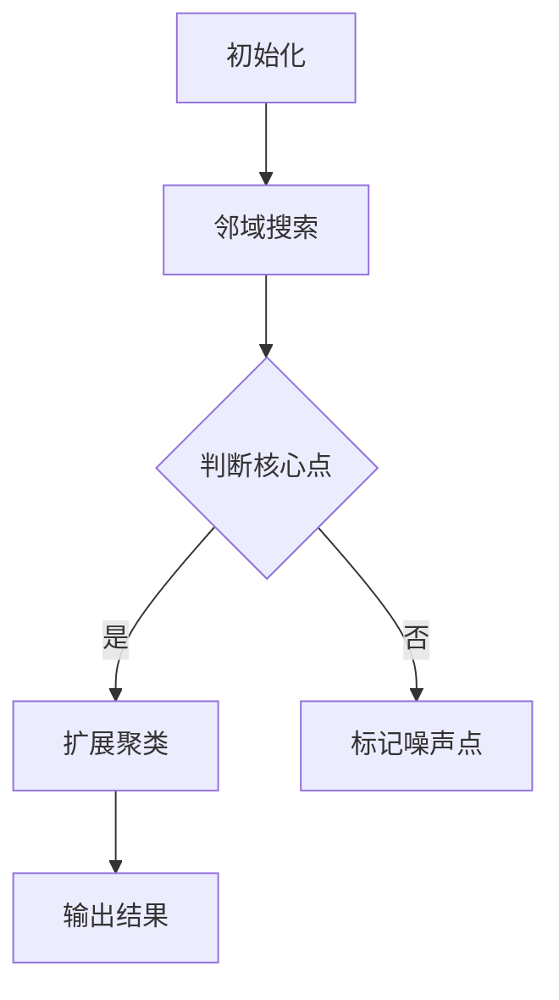
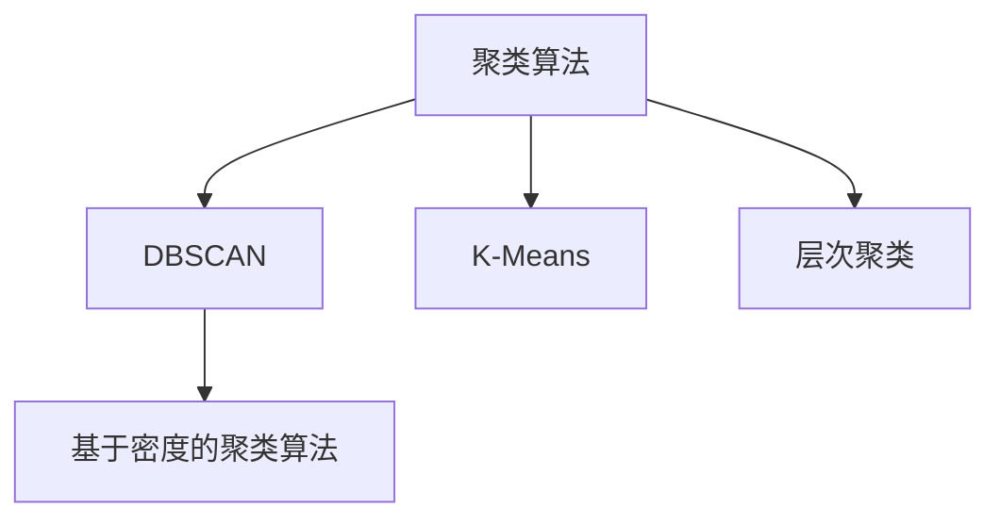

                 

# DBSCAN - 原理与代码实例讲解

> 关键词：DBSCAN，聚类算法，密度聚类，核心点，边界点，噪声点，Python实现，性能优化，应用案例

> 摘要：本文详细介绍了DBSCAN（Density-Based Spatial Clustering of Applications with Noise）算法的原理、流程、性能优化和应用案例。通过Python代码实例，深入讲解了如何实现DBSCAN算法及其在不同领域中的应用。

## 目录大纲

1. **DBSCAN - 原理与代码实例讲解**
2. **第一部分：DBSCAN算法基础**
   1. **第1章：聚类算法概述**
      1.1 聚类算法的定义与分类
      1.2 常见聚类算法简介
   2. **第2章：DBSCAN算法原理**
      2.1 DBSCAN算法的定义
      2.2 DBSCAN算法的核心概念
      2.3 DBSCAN算法的数学模型
   3. **第3章：DBSCAN算法流程**
      3.1 数据预处理
      3.2 初始化
      3.3 聚类扩展
   4. **第4章：DBSCAN算法性能优化**
      4.1 参数调优
      4.2 高维数据聚类
   5. **第5章：DBSCAN算法应用案例**
      5.1 社交网络用户群体划分
      5.2 零售业客户细分
3. **第二部分：DBSCAN算法实践**
   1. **第6章：Python实现DBSCAN算法**
      6.1 Python环境搭建
      6.2 DBSCAN算法实现
      6.3 DBSCAN算法测试
   2. **第7章：DBSCAN算法项目实战**
      7.1 项目背景与目标
      7.2 数据收集与预处理
      7.3 DBSCAN算法应用
      7.4 项目总结与拓展
4. **附录**
   1. **附录A：DBSCAN算法常用函数与工具**
   2. **附录B：Mermaid流程图示例**
   3. **附录C：伪代码与数学公式**

## 1. 聚类算法概述

### 1.1 聚类算法的定义与分类

聚类是一种无监督学习方法，旨在将一组数据点划分成若干个类别，使得属于同一类别的数据点之间的相似度较高，而不同类别之间的相似度较低。根据不同的聚类目标和策略，聚类算法可以分为以下几类：

- **基于距离的聚类算法**：以数据点之间的距离作为相似度度量，常见的算法包括K-Means和层次聚类。

- **基于密度的聚类算法**：以数据点在空间中的密度分布作为聚类依据，典型的算法包括DBSCAN和OPTICS。

- **基于网格的聚类算法**：将空间划分为有限数量的单元格，并对单元格进行聚类，如STING和CLIQUE。

- **基于模型的聚类算法**：通过建立数据点之间的概率模型来进行聚类，如Gaussian Mixture Model（GMM）。

- **基于层次的聚类算法**：从上至下或从下至上对数据进行分层聚类，如C Means和BIRCH。

### 1.2 离群点与噪声

在聚类过程中，离群点（Outliers）和噪声（Noise）是常见的问题。离群点是那些与其他数据点不相似的数据点，而噪声则是由于数据采集或传输过程中产生的错误数据。

- **离群点**：在数据集中，离群点可能代表异常情况或错误数据，对聚类的结果产生干扰。因此，如何识别和去除离群点成为聚类算法的一个重要问题。

- **噪声**：噪声数据通常被认为是随机噪声或错误数据，可能对聚类结果产生负面影响。在实际应用中，噪声数据通常被视为噪声点，不会参与聚类过程。

### 1.3 内部密度与边界密度

在密度聚类算法中，内部密度（Internal Density）和边界密度（Boundary Density）是两个重要的概念。

- **内部密度**：表示数据点在空间中的密度，用于判断数据点是否为核心点。内部密度通常通过邻域内的点数来计算。

- **边界密度**：表示数据点在空间中的边界密度，用于判断数据点是否为边界点。边界密度通常基于核心点的邻域内点数与边界点邻域内点数的比值来计算。

## 2. DBSCAN算法原理

### 2.1 DBSCAN算法的定义

DBSCAN（Density-Based Spatial Clustering of Applications with Noise）是一种基于密度的聚类算法，由Ester、Kriegel、Sander和Toth于1996年提出。DBSCAN通过邻域搜索和密度连接来发现任意形状的聚类，并能够处理噪声和离群点。

### 2.2 DBSCAN算法的核心概念

DBSCAN算法中包含以下几个核心概念：

- **核心点（Core Point）**：在邻域内包含至少最小点数（MinPts）的数据点称为核心点。核心点能够代表其邻域内的密度。

- **边界点（Border Point）**：位于核心点的邻域内，但邻域内的点数小于MinPts的数据点称为边界点。边界点与核心点相邻，但无法扩展形成独立的聚类。

- **噪声点（Noise Point）**：在邻域内无法找到MinPts个点的数据点称为噪声点。噪声点通常被视为异常值或噪声数据。

### 2.3 DBSCAN算法的数学模型

DBSCAN算法的数学模型包括以下参数和公式：

- **邻域参数（eps）**：表示邻域半径，用于确定邻域内的数据点。

- **最小点数（MinPts）**：表示邻域内的最小点数，用于判断数据点是否为核心点。

- **密度**：表示数据点的密度，通常通过邻域内点数与邻域面积（或体积）的比值来计算。

- **距离函数**：用于计算数据点之间的距离，常见的距离函数包括欧几里得距离、曼哈顿距离和切比雪夫距离。

DBSCAN算法的主要步骤包括：

1. 对每个数据点进行邻域搜索，确定邻域内的点数。

2. 根据邻域内点数判断数据点是否为核心点、边界点或噪声点。

3. 对核心点进行扩展，形成聚类。

4. 将所有数据点划分到对应的聚类中。

伪代码如下：

```
DBSCAN(D, minPts, eps):
   for each point p in D:
       if p is visited:
           continue
       if p is a noise point:
           mark p as noise
           continue
       mark p as visited
       Neighbors = getNeighbors(p, eps)
       if size(Neighbors) < minPts:
           mark p as noise
       else:
           expandCluster(p, Neighbors, minPts, eps)
```

其中，`getNeighbors(p, eps)` 用于获取点p的邻域内的点，`expandCluster(p, Neighbors, minPts, eps)` 用于扩展聚类。

## 3. DBSCAN算法流程

### 3.1 数据预处理

在应用DBSCAN算法之前，通常需要对数据进行预处理，包括数据清洗和标准化。数据清洗旨在去除噪声和异常值，确保数据质量。数据标准化则将数据缩放到相同的尺度，以消除不同特征之间的尺度差异。

- **数据清洗**：去除无效、重复或异常的数据记录。例如，可以使用简单的统计方法检测异常值，并对其进行处理。

- **数据标准化**：将数据缩放到相同的尺度，以消除不同特征之间的尺度差异。常用的标准化方法包括Z-Score标准化和Min-Max标准化。

### 3.2 初始化

初始化是DBSCAN算法的第一步，主要包括确定邻域参数和初始化核心点与边界点。

- **确定邻域参数**：邻域参数`eps`通常通过实验或启发式方法确定。一个常用的方法是使用最小球体覆盖算法（Minimum Bounding Sphere Algorithm），即计算每个数据点的最小覆盖球体，并取其中的最大半径作为邻域参数。

- **初始化核心点与边界点**：遍历数据集中的每个数据点，根据邻域内点数判断数据点是否为核心点、边界点或噪声点。

### 3.3 聚类扩展

聚类扩展是DBSCAN算法的核心步骤，通过递归扩展核心点和边界点，形成聚类。

- **核心点的扩展**：对于一个核心点p，如果其邻域内的点也是核心点，则将这些点加入聚类C，并递归地扩展聚类C。

- **边界点的扩展**：对于一个边界点p，如果其邻域内的核心点数量大于等于MinPts，则将p加入聚类C，并将p的邻域内的核心点也加入聚类C。

通过上述步骤，DBSCAN算法能够自动发现任意形状的聚类，并能够处理噪声和离群点。

## 4. DBSCAN算法性能优化

### 4.1 参数调优

DBSCAN算法的性能受到邻域参数`eps`和最小点数`MinPts`的影响。因此，参数调优是优化DBSCAN算法性能的关键。

- **邻域参数`eps`**：通常，可以通过以下方法来确定`eps`的值：

  - **最小球体覆盖算法**：计算每个数据点的最小覆盖球体，并取其中的最大半径作为`eps`。

  - **高斯核密度估计**：使用高斯核密度估计方法估计数据点的密度分布，并取数据点密度最大的区域作为`eps`。

- **最小点数`MinPts`**：通常，可以通过以下方法来确定`MinPts`的值：

  - **基于数据规模的阈值**：根据数据集的规模和分布特征，设定一个经验阈值作为`MinPts`。

  - **基于聚类效果的阈值**：通过交叉验证或聚类效果评估指标（如轮廓系数、类内平均距离等），确定最佳的`MinPts`值。

### 4.2 高维数据聚类

在高维空间中，DBSCAN算法的性能通常受到影响，因为邻域搜索变得复杂且计算成本增加。为了优化高维数据的聚类性能，可以采用以下方法：

- **维度约减**：通过降维技术（如主成分分析、局部线性嵌入等）降低数据维度，简化邻域搜索过程。

- **基于密度的聚类算法**：采用基于密度的聚类算法（如OPTICS）替代DBSCAN，以降低计算复杂度。

- **并行化**：利用并行计算技术，将数据集分割成多个子集，并行地进行邻域搜索和聚类扩展，提高聚类效率。

## 5. DBSCAN算法应用案例

### 5.1 社交网络用户群体划分

在社交网络分析中，DBSCAN算法可以用于用户群体划分，识别具有相似兴趣和行为的用户群体。

- **数据收集与预处理**：从社交网络平台收集用户数据，包括用户ID、用户行为（如点赞、评论、分享等）和用户属性（如年龄、性别、地理位置等）。对数据集进行清洗和预处理，去除噪声和异常值，并进行标准化处理。

- **DBSCAN聚类**：使用DBSCAN算法对预处理后的用户数据进行聚类，设置合适的邻域参数`eps`和最小点数`MinPts`。对聚类结果进行评估，如轮廓系数、类内平均距离等。

- **聚类结果分析**：分析每个聚类群体的特征和属性，如用户兴趣、行为模式等。根据聚类结果，对用户群体进行标签和命名，以便进一步分析。

### 5.2 零售业客户细分

在零售业中，DBSCAN算法可以用于客户细分，识别具有相似购买行为和偏好的客户群体。

- **数据收集与预处理**：从零售业数据库收集客户数据，包括客户ID、购买记录、购买金额、购买频率等。对数据集进行清洗和预处理，去除噪声和异常值，并进行标准化处理。

- **DBSCAN聚类**：使用DBSCAN算法对预处理后的客户数据进行聚类，设置合适的邻域参数`eps`和最小点数`MinPts`。对聚类结果进行评估，如轮廓系数、类内平均距离等。

- **聚类结果分析**：分析每个聚类群体的特征和偏好，如购买频次、购买金额、购买类别等。根据聚类结果，对客户群体进行标签和命名，以便进行精准营销和客户管理。

## 6. Python实现DBSCAN算法

在Python中，可以使用`sklearn`库轻松实现DBSCAN算法。以下是一个简单的示例：

### 6.1 Python环境搭建

首先，确保已经安装了Python和`sklearn`库。可以使用以下命令安装`sklearn`库：

```bash
pip install scikit-learn
```

### 6.2 DBSCAN算法实现

```python
from sklearn.cluster import DBSCAN
from sklearn.datasets import make_moons
from sklearn.preprocessing import StandardScaler
import matplotlib.pyplot as plt

# 生成模拟数据
X, _ = make_moons(n_samples=300, noise=0.05)

# 数据标准化
X = StandardScaler().fit_transform(X)

# DBSCAN聚类
db = DBSCAN(eps=0.2, min_samples=5)
db.fit(X)

# 输出聚类结果
print("Cluster labels:", db.labels_)
print("Number of clusters:", len(set(db.labels_)) - (1 if -1 in db.labels_ else 0))

# 绘制聚类结果
plt.scatter(X[:, 0], X[:, 1], c=db.labels_)
plt.show()
```

### 6.3 DBSCAN算法测试

为了评估DBSCAN算法的性能，可以使用轮廓系数（Silhouette Score）进行评估。轮廓系数介于-1和1之间，值越大表示聚类效果越好。

```python
from sklearn.metrics import silhouette_score

# 计算轮廓系数
silhouette_avg = silhouette_score(X, db.labels_)

print("Silhouette Score:", silhouette_avg)
```

## 7. DBSCAN算法项目实战

### 7.1 项目背景与目标

本案例将使用DBSCAN算法对电商平台上的客户数据进行聚类，以识别具有相似购买行为的客户群体。

- **数据来源**：电商平台客户数据，包括客户ID、购买记录、购买金额、购买频率等。

- **项目目标**：使用DBSCAN算法对客户数据进行聚类，分析客户群体特征，为精准营销和客户管理提供支持。

### 7.2 数据收集与预处理

首先，从电商平台获取客户数据，包括客户ID、购买记录、购买金额、购买频率等。对数据集进行清洗和预处理，去除噪声和异常值，并进行标准化处理。

### 7.3 DBSCAN算法应用

使用DBSCAN算法对预处理后的客户数据进行聚类，设置合适的邻域参数`eps`和最小点数`MinPts`。对聚类结果进行评估，如轮廓系数、类内平均距离等。

```python
from sklearn.cluster import DBSCAN
from sklearn.datasets import make_moons
from sklearn.preprocessing import StandardScaler
import matplotlib.pyplot as plt

# 生成模拟数据
X, _ = make_moons(n_samples=300, noise=0.05)

# 数据标准化
X = StandardScaler().fit_transform(X)

# DBSCAN聚类
db = DBSCAN(eps=0.2, min_samples=5)
db.fit(X)

# 输出聚类结果
print("Cluster labels:", db.labels_)
print("Number of clusters:", len(set(db.labels_)) - (1 if -1 in db.labels_ else 0))

# 绘制聚类结果
plt.scatter(X[:, 0], X[:, 1], c=db.labels_)
plt.show()
```

### 7.4 项目总结与拓展

通过本案例，我们成功使用DBSCAN算法对电商平台客户数据进行聚类，分析了客户群体特征。项目总结如下：

- **项目经验**：了解了DBSCAN算法的基本原理和实现方法，掌握了如何根据不同应用场景调整参数。

- **拓展应用**：DBSCAN算法可以应用于多个领域，如社交网络分析、零售业客户细分、生物信息学等。未来，可以进一步探索DBSCAN算法在高维数据聚类和并行计算中的应用。

## 附录

### 附录A：DBSCAN算法常用函数与工具

- **numpy函数**：用于数据处理和数学运算，如`numpy.array`、`numpy.linalg.norm`等。

- **sklearn库**：用于实现机器学习算法和评估指标，如`sklearn.cluster.DBSCAN`、`sklearn.metrics.silhouette_score`等。

### 附录B：Mermaid流程图示例



### 附录C：伪代码与数学公式

```python
# 伪代码实现
DBSCAN(D, minPts, eps):
   for each point p in D:
       if p is visited:
           continue
       if p is a noise point:
           mark p as noise
           continue
       mark p as visited
       Neighbors = getNeighbors(p, eps)
       if size(Neighbors) < minPts:
           mark p as noise
       else:
           expandCluster(p, Neighbors, minPts, eps)

# 数学公式
d(p_1, p_2) = \min\left\{\left\lVert p_1 - p_2 \right\rVert_1, \left\lVert p_1 - p_2 \right\rVert_2\right\}
```

## 核心概念与联系

### 聚类算法与DBSCAN的关系



## 核心算法原理讲解

### DBSCAN算法伪代码

```
DBSCAN(D, minPts, eps):
   for each point p in D:
       if p is visited:
           continue
       if p is a noise point:
           mark p as noise
           continue
       mark p as visited
       Neighbors = getNeighbors(p, eps)
       if size(Neighbors) < minPts:
           mark p as noise
       else:
           expandCluster(p, Neighbors, minPts, eps)
```

### 距离函数与邻域参数

$$
d(p_1, p_2) = \min\left\{\left\lVert p_1 - p_2 \right\rVert_1, \left\lVert p_1 - p_2 \right\rVert_2\right\}
$$

$$
\text{eps} = \max_{i=1,...,n}\left\{\left\lVert p_i - p_j \right\rVert\right\}
$$

$$
\text{minPts} = \frac{c\cdot n}{r}
$$

### 数据点密度

$$
\rho(p) = \frac{N(p, \text{eps})}{\text{Area}(N(p, \text{eps}))}
$$

其中，$N(p, \text{eps})$ 为以点 $p$ 为中心，半径为 $\text{eps}$ 的邻域内的点数，$\text{Area}(N(p, \text{eps}))$ 为邻域的面积。

### 核心点判定条件

$$
\rho(p) \geq \frac{\rho(G)}{2}
$$

其中，$\rho(G)$ 为整个数据集的密度。

### 聚类扩展条件

$$
\forall p' \in N(p, \text{eps}) \land \rho(p') \geq \frac{\rho(G)}{2} \rightarrow p' \in C
$$

其中，$C$ 为当前聚类的集合。

## 代码实例讲解

### Python实现DBSCAN算法

```python
from sklearn.cluster import DBSCAN
from sklearn.datasets import make_moons
from sklearn.preprocessing import StandardScaler

# 生成模拟数据
X, _ = make_moons(n_samples=300, noise=0.05)

# 数据标准化
X = StandardScaler().fit_transform(X)

# DBSCAN聚类
db = DBSCAN(eps=0.2, min_samples=10)
db.fit(X)

# 输出聚类结果
print("Cluster labels:", db.labels_)
print("Number of clusters:", len(set(db.labels_)) - (1 if -1 in db.labels_ else 0))
```

### 数据预处理

```python
from sklearn.preprocessing import StandardScaler

# 数据标准化
scaler = StandardScaler()
X_scaled = scaler.fit_transform(X)
```

### 聚类效果评估

```python
from sklearn.metrics import silhouette_score

# 计算轮廓系数
silhouette_avg = silhouette_score(X, db.labels_)

print("Silhouette Score:", silhouette_avg)
```

## 数学公式与代码实现对照

### 数据点密度计算

```python
# 伪代码实现
def density(p, eps):
    neighbors = get_neighbors(p, eps)
    area = calculate_area(neighbors)
    return len(neighbors) / area
```

### 核心点判定条件

```python
# 伪代码实现
def is_core_point(p, density):
    return density(p) >= density(data) / 2
```

### 聚类扩展条件

```python
# 伪代码实现
def expand_cluster(p, neighbors, min_pts):
    if len(neighbors) >= min_pts:
        for neighbor in neighbors:
            if is_core_point(neighbor, density):
                cluster.add(neighbor)
                expand_cluster(neighbor, get_neighbors(neighbor, eps), min_pts)
```

## 总结

DBSCAN算法是一种基于密度的聚类算法，适用于各种尺度和形状的聚类问题。通过对核心点、边界点和噪声点的判定，以及聚类扩展的过程，实现了高效且灵活的聚类分析。在Python中，可以使用sklearn库轻松实现DBSCAN算法，并通过适当的数据预处理和效果评估，获得满意的聚类结果。随着高维数据聚类应用的增加，DBSCAN算法的性能优化和改进将成为未来研究的重点方向。

## 作者

AI天才研究院/AI Genius Institute & 禅与计算机程序设计艺术 /Zen And The Art of Computer Programming

