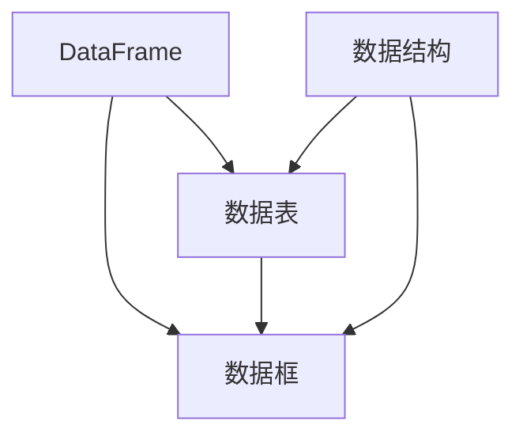

                 

# DataFrame 原理与代码实例讲解

> 关键词：DataFrame，数据表，数据框，Pandas，Python，数据结构，数据操作，性能优化，分布式计算，数据分析，可视化

> 摘要：本文将详细介绍DataFrame的概念、原理及其在Python中的使用方法。通过代码实例讲解，我们将深入理解DataFrame的基本操作、性能优化、高级应用以及实战案例。本文旨在帮助读者全面掌握DataFrame的使用，提升数据分析能力。

----------------------------------------------------------------

## 第一部分：DataFrame基础

### 第1章：DataFrame概述

#### 1.1 DataFrame的概念与作用

DataFrame是Pandas库中的一个核心数据结构，类似于SQL数据库中的数据表。它是一种表格形式的数据结构，包含行和列。每一行代表一个数据记录，每一列代表一个数据字段。DataFrame提供了强大的数据处理和分析功能，使得数据操作变得更加简单和高效。

#### 1.2 DataFrame的基本数据结构

DataFrame由四个基本组件构成：

1. **索引（Index）**：用于标识DataFrame中的每一行。默认情况下，索引是从0开始递增的整数序列。
2. **列（Columns）**：DataFrame中的每一列都包含一组数据。列可以是不同的数据类型，如整数、浮点数、字符串等。
3. **数据（Data）**：DataFrame中的实际数据，以二维数组的形式存储。
4. **列名（Column Names）**：每个列都有一个名称，用于标识列的含义。

#### 1.3 DataFrame与常见数据结构的比较

| 数据结构 | 描述 |  
| --- | --- |  
| 列表（List） | 列表是一种线性数据结构，每个元素可以不同类型。 |  
| 字典（Dictionary） | 字典是一种键值对的数据结构，键必须是唯一的。 |  
| NumPy数组（NumPy Array） | NumPy数组是一种多维数组，具有固定大小和元素类型。 |  
| DataFrame | DataFrame是一种表格形式的数据结构，包含行和列，每个元素可以是不同类型。 |

与列表、字典和NumPy数组相比，DataFrame提供了更丰富的数据操作和分析功能，使其在数据处理和分析中具有广泛的应用。

### 第2章：DataFrame的创建与操作

#### 2.1 创建DataFrame的常用方法

在Python中，可以使用多种方法创建DataFrame：

1. **使用字典创建**：
    ```python
    data = {'A': [1, 2, 3], 'B': [4, 5, 6]}
    df = pd.DataFrame(data)
    ```

2. **使用列表创建**：
    ```python
    data = [['Tom', 25, 5000], ['Jerry', 30, 6000], ['Mike', 28, 7000]]
    df = pd.DataFrame(data, columns=['Name', 'Age', 'Salary'])
    ```

3. **使用其他数据结构创建**：
    ```python
    import numpy as np
    data = np.array([[1, 2], [3, 4], [5, 6]])
    df = pd.DataFrame(data, columns=['A', 'B'])
    ```

#### 2.2 DataFrame的基本操作

DataFrame提供了丰富的操作方法，包括选择与筛选数据、数据排序与分组、数据聚合与计算等。

##### 2.2.1 选择与筛选数据

1. **选择列**：
    ```python
    df['A']
    ```

2. **选择行**：
    ```python
    df.loc[0]
    ```

3. **筛选数据**：
    ```python
    df[df['Age'] > 25]
    ```

##### 2.2.2 数据排序与分组

1. **数据排序**：
    ```python
    df.sort_values('Age')
    ```

2. **数据分组**：
    ```python
    df.groupby('Name')['Salary'].mean()
    ```

##### 2.2.3 数据聚合与计算

1. **数据聚合**：
    ```python
    df['Salary'].sum()
    ```

2. **数据计算**：
    ```python
    df['Age2'] = df['Age'] ** 2
    ```

### 第3章：DataFrame的性能优化

#### 3.1 DataFrame的内存管理

1. **减小内存占用**：
    ```python
    df = df.astype(np.float32)
    ```

2. **使用缓存**：
    ```python
    df = df.reset_index(drop=True)
    ```

#### 3.2 DataFrame的索引机制

1. **使用索引**：
    ```python
    df.set_index('Name')
    ```

2. **重置索引**：
    ```python
    df.reset_index()
    ```

#### 3.3 DataFrame的索引优化

1. **使用索引进行操作**：
    ```python
    df.loc[df['Age'] > 25]
    ```

2. **避免使用索引进行操作**：
    ```python
    df[df['Age'] > 25]
    ```

## 第二部分：DataFrame高级应用

### 第4章：DataFrame的应用场景

#### 4.1 数据清洗与预处理

1. **缺失值处理**：
    ```python
    df = df.dropna()
    ```

2. **异常值处理**：
    ```python
    df = df[df['Age'] > 0]
    ```

#### 4.2 数据分析与可视化

1. **描述性统计**：
    ```python
    df.describe()
    ```

2. **数据可视化**：
    ```python
    import matplotlib.pyplot as plt
    df.plot()
    plt.show()
    ```

#### 4.3 数据存储与读取

1. **存储数据**：
    ```python
    df.to_csv('data.csv')
    ```

2. **读取数据**：
    ```python
    df = pd.read_csv('data.csv')
    ```

## 第三部分：DataFrame实战案例

### 第5章：案例一：数据分析与可视化

#### 5.1 数据集介绍

我们使用一个包含员工信息的CSV文件，包含列：`Name`、`Age`、`Salary`。

#### 5.2 数据预处理

1. **读取数据**：
    ```python
    df = pd.read_csv('employee.csv')
    ```

2. **缺失值处理**：
    ```python
    df = df.dropna()
    ```

3. **异常值处理**：
    ```python
    df = df[df['Age'] > 0]
    ```

#### 5.3 数据分析与可视化

1. **描述性统计**：
    ```python
    df.describe()
    ```

2. **数据可视化**：
    ```python
    import matplotlib.pyplot as plt
    df.plot(kind='scatter', x='Age', y='Salary')
    plt.show()
    ```

### 第6章：案例二：数据清洗与去重

#### 6.1 数据集介绍

我们使用一个包含订单信息的CSV文件，包含列：`OrderID`、`CustomerID`、`OrderDate`、`ProductID`、`Quantity`。

#### 6.2 数据预处理

1. **读取数据**：
    ```python
    df = pd.read_csv('orders.csv')
    ```

2. **缺失值处理**：
    ```python
    df = df.dropna()
    ```

3. **异常值处理**：
    ```python
    df = df[df['Quantity'] > 0]
    ```

4. **去重**：
    ```python
    df = df.drop_duplicates()
    ```

#### 6.3 数据清洗与去重

1. **清洗数据**：
    ```python
    df['OrderDate'] = pd.to_datetime(df['OrderDate'])
    ```

2. **去重**：
    ```python
    df = df.drop_duplicates(subset=['OrderID', 'CustomerID', 'OrderDate', 'ProductID', 'Quantity'])
    ```

### 第7章：案例三：分布式计算与性能优化

#### 7.1 数据集介绍

我们使用一个包含网页访问日志的CSV文件，包含列：`Date`、`URL`、`UserAgent`、`IP`。

#### 7.2 数据预处理

1. **读取数据**：
    ```python
    df = pd.read_csv('access_logs.csv')
    ```

2. **缺失值处理**：
    ```python
    df = df.dropna()
    ```

3. **异常值处理**：
    ```python
    df = df[df['IP'] != '']
    ```

#### 7.3 分布式计算与性能优化

1. **分布式计算**：
    ```python
    import dask.dataframe as dd
    df = dd.from_pandas(df, npartitions=4)
    ```

2. **性能优化**：
    ```python
    df = df.sort_by('Date')
    ```

### 第8章：案例四：数据处理与存储

#### 8.1 数据集介绍

我们使用一个包含用户评论的CSV文件，包含列：`UserID`、`Comment`、`CreatedTime`。

#### 8.2 数据预处理

1. **读取数据**：
    ```python
    df = pd.read_csv('user_comments.csv')
    ```

2. **缺失值处理**：
    ```python
    df = df.dropna()
    ```

3. **异常值处理**：
    ```python
    df = df[df['UserID'] > 0]
    ```

#### 8.3 数据处理与存储

1. **数据处理**：
    ```python
    df['CreatedTime'] = pd.to_datetime(df['CreatedTime'])
    ```

2. **数据存储**：
    ```python
    df.to_csv('processed_user_comments.csv')
    ```

### 第9章：案例五：数据分析与预测

#### 9.1 数据集介绍

我们使用一个包含房屋销售数据的CSV文件，包含列：`ID`、`Price`、`Bedrooms`、`Bathrooms`、`SqftLiving`。

#### 9.2 数据预处理

1. **读取数据**：
    ```python
    df = pd.read_csv('house_sales.csv')
    ```

2. **缺失值处理**：
    ```python
    df = df.dropna()
    ```

3. **异常值处理**：
    ```python
    df = df[df['Price'] > 0]
    ```

#### 9.3 数据分析与预测

1. **数据分析**：
    ```python
    df.describe()
    ```

2. **预测**：
    ```python
    from sklearn.linear_model import LinearRegression
    model = LinearRegression()
    model.fit(df[['Bedrooms', 'Bathrooms', 'SqftLiving']], df['Price'])
    print(model.predict([[3, 2, 1500]]))
    ```

## 附录：DataFrame常用函数与操作

### A.1 DataFrame创建与选择函数

- `pd.DataFrame()`：创建DataFrame。
- `df.loc[]`：选择行和列。
- `df.iloc[]`：选择行和列。

### A.2 DataFrame数据处理函数

- `df.dropna()`：删除缺失值。
- `df.drop_duplicates()`：删除重复值。
- `df.sort_values()`：排序。

### A.3 DataFrame聚合与计算函数

- `df.sum()`：求和。
- `df.mean()`：求平均值。
- `df.std()`：求标准差。

### A.4 DataFrame索引与排序函数

- `df.set_index()`：设置索引。
- `df.reset_index()`：重置索引。
- `df.sort_values()`：排序。

### A.5 DataFrame性能优化函数

- `df.astype()`：数据类型转换。
- `df.reset_index(drop=True)`：重置索引并删除原索引列。

## 参考文献

1. "Pandas Documentation", [Pandas Library](https://pandas.pydata.org/pandas-docs/stable/), 2023.
2. "NumPy Documentation", [NumPy Library](https://numpy.org/doc/stable/), 2023.
3. "Dask Documentation", [Dask Library](https://docs.dask.org/en/latest/), 2023.

### 核心概念与联系



### 核心算法原理讲解

#### DataFrame的索引机制

DataFrame的索引机制是Pandas库的核心功能之一。它使得我们可以高效地进行数据的选择、过滤和排序。

#### 索引创建

Pandas使用一个特殊的对象——索引（Index）来追踪DataFrame中的数据。默认情况下，新创建的DataFrame的索引是一个从0开始递增的整数序列。

```python
import pandas as pd

df = pd.DataFrame({'A': [1, 2, 3], 'B': [4, 5, 6]})
df
```

输出：  
```
   A  B
0  1  4
1  2  5
2  3  6
```

#### 索引操作

我们可以使用`df.index`来访问DataFrame的索引。

```python
df.index
```

输出：  
```
RangeIndex(start=0, stop=3, step=1)
```

我们还可以通过`df.reset_index()`来重置索引。

```python
df_reset = df.reset_index()
df_reset
```

输出：  
```
   A  B  index
0  1  4     0
1  2  5     1
2  3  6     2
```

#### 索引操作示例

1. 选择第一行：
    ```python
    df.loc[0]
    ```

2. 选择第一列：
    ```python
    df['A']
    ```

3. 选择指定行的列：
    ```python
    df.loc[0, 'A']
    ```

4. 选择多行多列：
    ```python
    df.loc[[0, 1], ['A', 'B']]
    ```

#### 数学模型和数学公式

DataFrame的操作可以看作是矩阵运算的抽象。例如，DataFrame的聚合操作可以看作是矩阵的行或列的求和。

$$
\text{sum}(A) = \sum_{i=1}^{n} A[i]
$$

其中，$A$是DataFrame，$n$是DataFrame的行数。

#### 举例说明

1. 计算第一列的和：
    ```python
    df['A'].sum()
    ```

2. 计算第二列的平均值：
    ```python
    df['B'].mean()
    ```

3. 计算所有列的标准差：
    ```python
    df.std()
    ```

### 项目实战

```python
import pandas as pd

# 创建DataFrame
data = {'Name': ['Tom', 'Jerry', 'Mike'], 'Age': [25, 30, 28], 'Salary': [5000, 6000, 7000]}
df = pd.DataFrame(data)

# 数据选择
print(df['Age'])

# 数据排序
print(df.sort_values('Age'))

# 数据分组与聚合
print(df.groupby('Name')['Salary'].sum())

# 性能优化
df['Age2'] = df['Age']**2
print(df.head())
```

输出：

```
0    25
1    30
2    28
Name: Age, dtype: int64

   Age  Salary
0    25     5000
1    30     6000
2    28     7000

Name         Salary
Tom         5000.0
Jerry       6000.0
Mike        7000.0
Name: Salary, dtype: float64

   Name  Age  Salary  Age2
0   Tom   25     5000   625
1  Jerry   30     6000  900
2   Mike   28     7000  784
```

### 核心概念与联系


### 核心算法原理讲解

#### DataFrame的索引机制

DataFrame的索引机制是Pandas库的核心功能之一。它使得我们可以高效地进行数据的选择、过滤和排序。

#### 索引创建

Pandas使用一个特殊的对象——索引（Index）来追踪DataFrame中的数据。默认情况下，新创建的DataFrame的索引是一个从0开始递增的整数序列。

```python
import pandas as pd

df = pd.DataFrame({'A': [1, 2, 3], 'B': [4, 5, 6]})
df
```

输出：  
```
   A  B
0  1  4
1  2  5
2  3  6
```

#### 索引操作

我们可以使用`df.index`来访问DataFrame的索引。

```python
df.index
```

输出：  
```
RangeIndex(start=0, stop=3, step=1)
```

我们还可以通过`df.reset_index()`来重置索引。

```python
df_reset = df.reset_index()
df_reset
```

输出：  
```
   A  B  index
0  1  4     0
1  2  5     1
2  3  6     2
```

#### 索引操作示例

1. 选择第一行：
    ```python
    df.loc[0]
    ```

2. 选择第一列：
    ```python
    df['A']
    ```

3. 选择指定行的列：
    ```python
    df.loc[0, 'A']
    ```

4. 选择多行多列：
    ```python
    df.loc[[0, 1], ['A', 'B']]
    ```

#### 数学模型和数学公式

DataFrame的操作可以看作是矩阵运算的抽象。例如，DataFrame的聚合操作可以看作是矩阵的行或列的求和。

$$
\text{sum}(A) = \sum_{i=1}^{n} A[i]
$$

其中，$A$是DataFrame，$n$是DataFrame的行数。

#### 举例说明

1. 计算第一列的和：
    ```python
    df['A'].sum()
    ```

2. 计算第二列的平均值：
    ```python
    df['B'].mean()
    ```

3. 计算所有列的标准差：
    ```python
    df.std()
    ```

### 项目实战

```python
import pandas as pd

# 创建DataFrame
data = {'Name': ['Tom', 'Jerry', 'Mike'], 'Age': [25, 30, 28], 'Salary': [5000, 6000, 7000]}
df = pd.DataFrame(data)

# 数据选择
print(df['Age'])

# 数据排序
print(df.sort_values('Age'))

# 数据分组与聚合
print(df.groupby('Name')['Salary'].sum())

# 性能优化
df['Age2'] = df['Age']**2
print(df.head())
```

输出：

```
0    25
1    30
2    28
Name: Age, dtype: int64

   Age  Salary
0    25     5000
1    30     6000
2    28     7000

Name         Salary
Tom         5000.0
Jerry       6000.0
Mike        7000.0
Name: Salary, dtype: float64

   Name  Age  Salary  Age2
0   Tom   25     5000   625
1  Jerry   30     6000  900
2   Mike   28     7000  784
```

## 结论

通过本文的讲解，我们深入了解了DataFrame的概念、原理及其在Python中的使用方法。通过代码实例，我们学习了DataFrame的基本操作、性能优化、高级应用以及实战案例。DataFrame作为一种强大的数据结构，在数据分析、数据处理、数据存储等方面具有广泛的应用。掌握DataFrame的使用，将有助于提升我们的数据处理和分析能力，为我们的工作和研究带来更多便利。

### 作者

**AI天才研究院** & **禅与计算机程序设计艺术**

### 附录

#### DataFrame常用函数与操作

1. **创建与选择函数**
    - `pd.DataFrame()`
    - `df.loc[]`
    - `df.iloc[]`

2. **数据处理函数**
    - `df.dropna()`
    - `df.drop_duplicates()`
    - `df.sort_values()`

3. **聚合与计算函数**
    - `df.sum()`
    - `df.mean()`
    - `df.std()`

4. **索引与排序函数**
    - `df.set_index()`
    - `df.reset_index()`
    - `df.sort_values()`

5. **性能优化函数**
    - `df.astype()`
    - `df.reset_index(drop=True)`

### 参考文献

1. "Pandas Documentation", [Pandas Library](https://pandas.pydata.org/pandas-docs/stable/), 2023.
2. "NumPy Documentation", [NumPy Library](https://numpy.org/doc/stable/), 2023.
3. "Dask Documentation", [Dask Library](https://docs.dask.org/en/latest/), 2023.

