                 


### 第1章：深度学习的起源与历史

#### 1.1 深度学习的诞生与发展

深度学习（Deep Learning）的概念最早可以追溯到1986年，由加拿大科学家杰弗里·辛顿（Geoffrey Hinton）在多伦多大学提出的。在这一年，辛顿和他的团队发表了关于反向传播算法（Backpropagation）的研究论文，为深度学习的发展奠定了基础。

在早期，深度学习并没有引起太多的关注，主要原因是计算能力的限制和算法的复杂性。直到2006年，辛顿和他的学生发表了一篇名为《学习快速：深层信念网络》（A Fast Learning Algorithm for Deep Belief Nets）的论文，提出了深度信念网络（Deep Belief Network, DBN）的概念，这一理论为深度学习的发展带来了新的契机。

深度学习真正迎来突破是在2012年，这一年，辛顿的另一位学生亚历克斯·克雷斯戈（Alex Krizhevsky）在ImageNet大规模视觉识别挑战赛（ImageNet Large Scale Visual Recognition Challenge, ILSVRC）中，使用了一种名为AlexNet的深度卷积神经网络（Deep Convolutional Neural Network, CNN）取得了巨大成功。AlexNet在这次挑战赛中击败了传统机器学习算法，赢得了冠军，这一胜利标志着深度学习在图像识别领域的崛起。

#### 1.2 深度学习与传统机器学习的差异

深度学习与传统机器学习的主要区别在于数据预处理和模型结构。

- **数据预处理**：传统机器学习通常需要手动提取特征，而深度学习则通过神经网络自动从数据中提取特征。这种自动特征提取的能力使得深度学习能够处理大量复杂的输入数据。

- **模型结构**：传统机器学习模型通常是线性的，而深度学习模型具有层次结构，能够学习数据的层次表示。深度学习模型通常包括输入层、隐藏层和输出层，每一层都能够提取不同层次的特征。

- **训练方法**：传统机器学习通常使用随机梯度下降（Stochastic Gradient Descent, SGD）等优化算法进行训练，而深度学习则使用反向传播算法（Backpropagation）进行训练。

#### 1.3 深度学习的重要性和应用前景

深度学习在图像识别、自然语言处理、语音识别、推荐系统、机器人等多个领域都取得了重大突破。以下是一些深度学习的重要性和应用前景：

- **图像识别**：深度学习在图像识别领域取得了显著的成功，如人脸识别、物体识别等。

- **自然语言处理**：深度学习在自然语言处理领域，如文本分类、机器翻译、情感分析等任务中发挥了重要作用。

- **语音识别**：深度学习在语音识别领域，如语音到文本转换、语音识别等任务中取得了突破。

- **推荐系统**：深度学习在推荐系统领域，如商品推荐、社交网络推荐等任务中发挥了重要作用。

- **机器人**：深度学习在机器人领域，如机器人的感知、决策、行动等任务中发挥了重要作用。

随着计算能力的提升和大数据的普及，深度学习的应用前景非常广阔。在未来，深度学习将会在更多领域发挥重要作用，推动人工智能技术的发展。

----------------------------------------------------------------

### 第2章：神经网络基础

#### 2.1 神经元与神经网络

神经元是神经网络的基本计算单元，类似于生物神经元的结构和功能。一个简单的神经元模型通常包括以下几个部分：

- **输入**：神经元的输入可以是多个，每个输入都与一个权重相乘。
- **加权求和**：输入与对应权重相乘后求和。
- **偏置**：加权求和的结果加上一个偏置项。
- **激活函数**：通过激活函数将加权求和的结果转换为输出。

以下是一个神经元的数学模型：

$$
\begin{align*}
z &= \sum_{i=1}^{n} w_i x_i + b \\
a &= \sigma(z)
\end{align*}
$$

其中，$z$ 是加权求和的结果，$a$ 是神经元的输出，$w_i$ 是权重，$x_i$ 是输入，$b$ 是偏置，$\sigma$ 是激活函数。

**Mermaid流程图**：

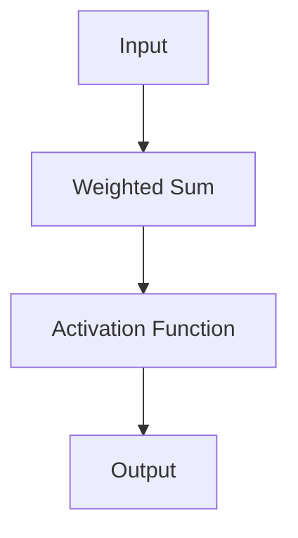

#### 2.2 前馈神经网络

前馈神经网络（Feedforward Neural Network）是一种简单的神经网络，数据从输入层流向输出层，没有反馈连接。前馈神经网络通常由多个层组成，包括输入层、隐藏层和输出层。

以下是一个前馈神经网络的结构：

- **输入层**：接收外部输入数据。
- **隐藏层**：对输入数据进行特征提取和变换。
- **输出层**：输出最终的预测结果。

**Mermaid流程图**：

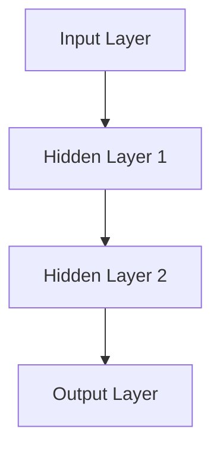

#### 2.3 激活函数与优化算法

激活函数是神经网络中非常重要的组成部分，它引入了非线性因素，使得神经网络能够学习更复杂的函数。

**常见的激活函数**：

- **Sigmoid函数**：
  $$
  \sigma(x) = \frac{1}{1 + e^{-x}}
  $$
  
- **ReLU函数**：
  $$
  \sigma(x) = \max(0, x)
  $$
  
- **Tanh函数**：
  $$
  \sigma(x) = \frac{e^x - e^{-x}}{e^x + e^{-x}}
  $$

**优化算法**：

- **梯度下降（Gradient Descent）**：
  $$
  \theta_{t+1} = \theta_t - \alpha \cdot \nabla_\theta J(\theta)
  $$
  其中，$\theta$ 是模型参数，$J(\theta)$ 是损失函数，$\alpha$ 是学习率。

- **随机梯度下降（Stochastic Gradient Descent, SGD）**：
  $$
  \theta_{t+1} = \theta_t - \alpha \cdot \nabla_{\theta} J(\theta; \mathbf{x}_t)
  $$
  其中，$\mathbf{x}_t$ 是随机选取的一个训练样本。

- **Adam优化器**：
  $$
  m_t = \beta_1 m_{t-1} + (1 - \beta_1) \nabla_\theta J(\theta; \mathbf{x}_t)
  $$
  $$
  v_t = \beta_2 v_{t-1} + (1 - \beta_2) (\nabla_\theta J(\theta; \mathbf{x}_t))^2
  $$
  $$
  \theta_{t+1} = \theta_t - \alpha \cdot \frac{m_t}{\sqrt{v_t} + \epsilon}
  $$
  其中，$\beta_1$ 和 $\beta_2$ 是动量项，$\epsilon$ 是一个很小的正数。

----------------------------------------------------------------

### 第3章：深度学习的核心算法

#### 3.1 卷积神经网络（CNN）

卷积神经网络（Convolutional Neural Network, CNN）是一种专门用于处理图像数据的神经网络，它通过卷积操作自动从图像中提取特征。

**CNN的基本结构**：

- **卷积层（Convolutional Layer）**：卷积层通过卷积操作从输入图像中提取特征。卷积操作可以用以下数学公式表示：

  $$
  \begin{align*}
  \text{output}_{ij} &= \sum_{k=1}^{K} w_{ik,jk} \cdot \text{input}_{ik} + b_j \\
  \text{where} \; i, j &= \text{row, column indices of the output feature map} \\
  k &= \text{filter index}
  \end{align*}
  $$

  其中，$w_{ik,jk}$ 是卷积核，$\text{input}_{ik}$ 是输入图像，$b_j$ 是偏置。

- **激活函数（Activation Function）**：激活函数通常使用ReLU函数。

- **池化层（Pooling Layer）**：池化层通过将局部区域进行降维操作，减少参数数量和计算量。最常用的池化操作是最大池化（Max Pooling）。

- **全连接层（Fully Connected Layer）**：全连接层将卷积层和池化层提取的特征进行分类。

**CNN的工作原理**：

CNN通过卷积操作提取图像的局部特征，然后通过池化层减少特征的空间维度，最后通过全连接层进行分类。

**Mermaid流程图**：

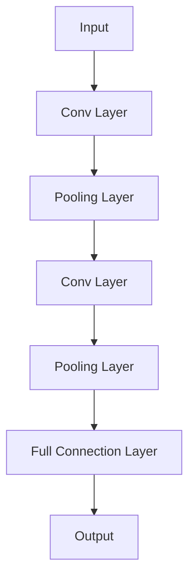

#### 3.2 循环神经网络（RNN）

循环神经网络（Recurrent Neural Network, RNN）是一种用于处理序列数据的神经网络，它通过隐藏状态来保存历史信息。

**RNN的基本结构**：

- **输入层**：接收输入序列。
- **隐藏层**：通过循环连接保存历史信息。
- **输出层**：输出序列的预测结果。

**RNN的工作原理**：

RNN通过循环连接将当前时刻的输入与上一时刻的隐藏状态相加，得到当前时刻的隐藏状态。隐藏状态作为当前时刻的输出，并传递给下一时刻。

**Mermaid流程图**：

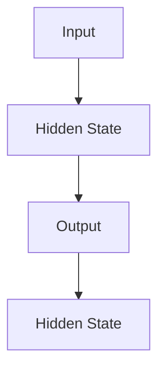

#### 3.3 生成对抗网络（GAN）

生成对抗网络（Generative Adversarial Network, GAN）是一种由生成器和判别器组成的神经网络，通过对抗训练生成高质量的数据。

**GAN的基本结构**：

- **生成器（Generator）**：生成器通过随机噪声生成数据。
- **判别器（Discriminator）**：判别器通过区分真实数据和生成数据来训练生成器。

**GAN的工作原理**：

GAN通过生成器和判别器的对抗训练来生成数据。生成器的目标是生成尽可能真实的数据，使得判别器无法区分真实数据和生成数据。判别器的目标是正确区分真实数据和生成数据。

**Mermaid流程图**：

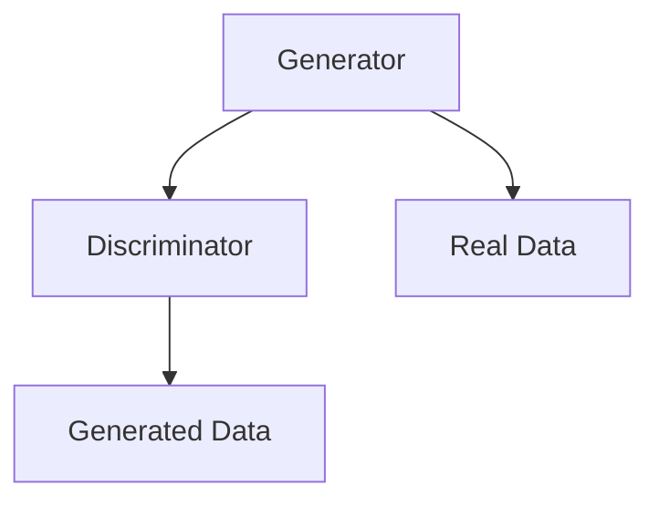

----------------------------------------------------------------

### 第4章：深度学习框架

#### 4.1 TensorFlow

TensorFlow是一个开源的深度学习框架，由谷歌开发。它提供了丰富的工具和库，用于构建和训练深度学习模型。

**安装与配置**：

要在Python环境中使用TensorFlow，首先需要安装TensorFlow库。可以使用以下命令进行安装：

```bash
pip install tensorflow
```

**基本用法**：

下面是一个使用TensorFlow的基本示例，包括创建计算图、定义模型、训练模型和评估模型。

```python
import tensorflow as tf

# 创建计算图
x = tf.placeholder(tf.float32, shape=[None, 784])
y = tf.placeholder(tf.float32, shape=[None, 10])

# 定义模型
W = tf.Variable(tf.zeros([784, 10]))
b = tf.Variable(tf.zeros([10]))
y_pred = tf.nn.softmax(tf.matmul(x, W) + b)

# 定义损失函数
cross_entropy = tf.reduce_mean(-tf.reduce_sum(y * tf.log(y_pred), reduction_indices=1))

# 定义优化器
optimizer = tf.train.GradientDescentOptimizer(learning_rate=0.001)
train_op = optimizer.minimize(cross_entropy)

# 训练模型
with tf.Session() as sess:
  sess.run(tf.global_variables_initializer())
  for i in range(1000):
    _, loss = sess.run([train_op, cross_entropy], feed_dict={x: x_train, y: y_train})

# 评估模型
correct_prediction = tf.equal(tf.argmax(y_pred, 1), tf.argmax(y, 1))
accuracy = tf.reduce_mean(tf.cast(correct_prediction, tf.float32))
print("Test accuracy:", sess.run(accuracy, feed_dict={x: x_test, y: y_test}))
```

#### 4.2 PyTorch

PyTorch是一个流行的开源深度学习框架，以其简洁和灵活著称。它提供了动态计算图和强大的API，使得构建和训练深度学习模型更加容易。

**安装与配置**：

要在Python环境中使用PyTorch，首先需要安装PyTorch库。可以使用以下命令进行安装：

```bash
pip install torch torchvision
```

**基本用法**：

下面是一个使用PyTorch的基本示例，包括创建模型、定义损失函数、训练模型和评估模型。

```python
import torch
import torchvision
import torchvision.transforms as transforms
import torch.nn as nn
import torch.optim as optim

# 加载数据集
transform = transforms.Compose([transforms.ToTensor()])
trainset = torchvision.datasets.MNIST(root='./data', train=True, download=True, transform=transform)
trainloader = torch.utils.data.DataLoader(trainset, batch_size=100, shuffle=True, num_workers=2)

testset = torchvision.datasets.MNIST(root='./data', train=False, download=True, transform=transform)
testloader = torch.utils.data.DataLoader(testset, batch_size=100, shuffle=False, num_workers=2)

# 定义模型
class Net(nn.Module):
  def __init__(self):
    super(Net, self).__init__()
    self.fc1 = nn.Linear(28 * 28, 128)
    self.fc2 = nn.Linear(128, 10)

  def forward(self, x):
    x = x.view(-1, 28 * 28)
    x = F.relu(self.fc1(x))
    x = self.fc2(x)
    return F.log_softmax(x, dim=1)

net = Net()

# 定义损失函数和优化器
criterion = nn.NLLLoss()
optimizer = optim.SGD(net.parameters(), lr=0.001, momentum=0.9)

# 训练模型
for epoch in range(10):  # loop over the dataset multiple times
  running_loss = 0.0
  for i, data in enumerate(trainloader, 0):
    inputs, labels = data
    optimizer.zero_grad()
    outputs = net(inputs)
    loss = criterion(outputs, labels)
    loss.backward()
    optimizer.step()
    running_loss += loss.item()
    if i % 2000 == 1999:    # print every 2000 mini-batches
      print('[%d, %5d] loss: %.3f' %
            (epoch + 1, i + 1, running_loss / 2000))
      running_loss = 0.0

print('Finished Training')

# 评估模型
correct = 0
total = 0
with torch.no_grad():
  for data in testloader:
    images, labels = data
    outputs = net(images)
    _, predicted = torch.max(outputs.data, 1)
    total += labels.size(0)
    correct += (predicted == labels).sum().item()

print('Accuracy of the network on the 10000 test images: %d %%' % (
  100 * correct / total))
```

#### 4.3 Keras

Keras是一个高级神经网络API，它构建在TensorFlow和Theano之上，提供了简洁的API和丰富的工具。

**安装与配置**：

要在Python环境中使用Keras，首先需要安装Keras库。可以使用以下命令进行安装：

```bash
pip install keras tensorflow
```

**基本用法**：

下面是一个使用Keras的基本示例，包括定义模型、编译模型、训练模型和评估模型。

```python
from keras.models import Sequential
from keras.layers import Dense, Dropout, Flatten
from keras.layers import Conv2D, MaxPooling2D
from keras.optimizers import Adam

# 定义模型
model = Sequential()
model.add(Conv2D(32, (3, 3), activation='relu', input_shape=(28, 28, 1)))
model.add(MaxPooling2D(pool_size=(2, 2)))
model.add(Conv2D(64, (3, 3), activation='relu'))
model.add(MaxPooling2D(pool_size=(2, 2)))
model.add(Flatten())
model.add(Dense(128, activation='relu'))
model.add(Dense(10, activation='softmax'))

# 编译模型
model.compile(loss='categorical_crossentropy',
              optimizer=Adam(),
              metrics=['accuracy'])

# 训练模型
model.fit(x_train, y_train, batch_size=128, epochs=10, verbose=1, validation_data=(x_test, y_test))

# 评估模型
scores = model.evaluate(x_test, y_test, verbose=0)
print('Test loss:', scores[0])
print('Test accuracy:', scores[1])
```

----------------------------------------------------------------

### 第5章：深度学习在计算机视觉中的应用

#### 5.1 卷积神经网络在图像分类中的应用

卷积神经网络（CNN）在图像分类任务中取得了显著的成功。CNN通过卷积操作、池化操作和全连接层，能够自动从图像中提取特征并进行分类。

**卷积神经网络的架构**：

- **卷积层**：卷积层通过卷积操作提取图像的局部特征。卷积核在图像上滑动，计算局部区域的加权和。
- **池化层**：池化层通过减小特征图的尺寸，减少参数数量和计算量。常见的池化操作有最大池化和平均池化。
- **全连接层**：全连接层将卷积层和池化层提取的特征进行分类。

**CNN的工作原理**：

- **前向传播**：输入图像通过卷积层和池化层，得到特征图。特征图通过全连接层，输出分类结果。
- **反向传播**：计算损失函数的梯度，并通过反向传播更新模型参数。

**CNN的典型模型**：

- **AlexNet**：第一个在图像分类任务中取得显著成功的CNN模型。
- **VGGNet**：通过增加网络的深度和宽度，提高了图像分类的准确性。
- **ResNet**：通过引入残差连接，解决了深度神经网络训练的梯度消失问题。
- **InceptionNet**：通过引入Inception模块，提高了模型的计算效率和分类准确性。

**Mermaid流程图**：


#### 5.2 目标检测

目标检测是计算机视觉中的另一个重要任务，它的目标是识别图像中的多个目标并定位它们的位置。

**目标检测的基本流程**：

- **特征提取**：使用CNN或其他特征提取器从图像中提取特征。
- **区域建议**：通过区域建议网络（如R-CNN、Fast R-CNN、Faster R-CNN等）生成可能的边界框。
- **分类与回归**：对每个边界框进行分类（是否为目标）和位置回归（边界框的位置）。

**目标检测的典型模型**：

- **R-CNN**：基于区域建议的网络，通过滑动窗口的方式生成边界框。
- **Fast R-CNN**：通过引入Region of Interest（ROI）池化层，提高了目标检测的速度。
- **Faster R-CNN**：通过引入区域建议网络（Region Proposal Network, RPN），进一步提高了目标检测的速度和准确性。
- **SSD**：通过在不同的尺度上使用多个卷积层，实现了多尺度目标检测。
- **YOLO**：通过将目标检测问题转化为一个回归问题，实现了实时目标检测。

**Mermaid流程图**：

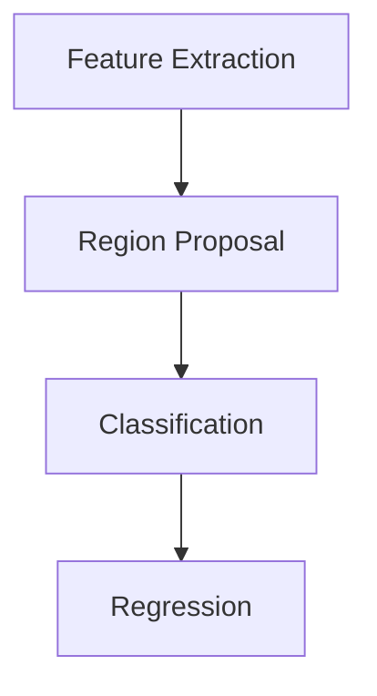

#### 5.3 图像生成

图像生成是深度学习在计算机视觉中的另一个重要应用。生成对抗网络（GAN）是一种常用的图像生成方法，通过生成器和判别器的对抗训练，生成高质量的照片。

**GAN的基本原理**：

- **生成器**：生成器的目标是生成类似于真实图像的数据。
- **判别器**：判别器的目标是区分真实图像和生成图像。

**GAN的训练过程**：

- **训练判别器**：判别器通过比较真实图像和生成图像，学习区分它们。
- **训练生成器**：生成器通过生成更真实的图像，使得判别器无法区分真实图像和生成图像。

**GAN的典型模型**：

- **DCGAN**：通过使用深度卷积神经网络，提高了图像生成的质量。
- **CycleGAN**：通过引入循环一致性损失，实现了不同风格图像之间的转换。
- **StyleGAN**：通过引入风格损失，实现了高质量的人脸生成。

**Mermaid流程图**：


----------------------------------------------------------------

### 第6章：深度学习在自然语言处理中的应用

#### 6.1 循环神经网络（RNN）在序列处理中的应用

循环神经网络（Recurrent Neural Network, RNN）是一种用于处理序列数据的神经网络。与传统的前馈神经网络相比，RNN能够通过循环连接保存历史信息，从而更好地处理序列数据。

**RNN的基本架构**：

- **输入层**：接收输入序列。
- **隐藏层**：通过循环连接保存历史信息。
- **输出层**：输出序列的预测结果。

**RNN的工作原理**：

- **前向传播**：当前时刻的输入与上一时刻的隐藏状态相加，得到当前时刻的隐藏状态。
- **反向传播**：计算损失函数的梯度，并通过反向传播更新模型参数。

**RNN的变体**：

- **LSTM（长短时记忆网络）**：LSTM通过引入门控机制，解决了RNN在长序列处理中的梯度消失问题。
- **GRU（门控循环单元）**：GRU通过简化LSTM的结构，提高了模型的训练速度。

**Mermaid流程图**：


#### 6.2 递归神经网络（RNN）与长短时记忆网络（LSTM）

递归神经网络（RNN）与长短时记忆网络（Long Short-Term Memory, LSTM）都是用于处理序列数据的神经网络。LSTM是RNN的一种变体，通过引入门控机制，解决了RNN在长序列处理中的梯度消失问题。

**RNN与LSTM的关系**：

- **RNN**：基本的递归神经网络，能够处理序列数据，但存在梯度消失问题。
- **LSTM**：长短时记忆网络，通过引入门控机制，能够更好地处理长序列数据。

**LSTM的基本架构**：

- **输入门（Input Gate）**：决定当前时刻的输入信息是否应该被记住。
- **遗忘门（Forget Gate）**：决定当前时刻的隐藏状态是否应该被遗忘。
- **输出门（Output Gate）**：决定当前时刻的隐藏状态是否应该被输出。

**LSTM的工作原理**：

- **前向传播**：计算输入门、遗忘门和输出门的权重和偏置，更新隐藏状态和细胞状态。
- **反向传播**：计算损失函数的梯度，并通过反向传播更新模型参数。

**Mermaid流程图**：

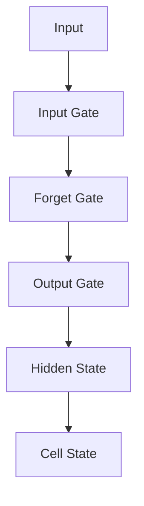

#### 6.3 生成式模型与解码器架构

生成式模型是一种通过学习数据生成概率分布的神经网络。解码器架构是一种常见的生成式模型，通过逐步生成序列中的每个元素，实现数据的生成。

**生成式模型的基本原理**：

- **数据生成**：生成器通过学习数据生成概率分布，生成新的数据。
- **概率分布**：生成器输出数据的概率分布，通过采样生成新的数据。

**解码器架构的工作原理**：

- **生成序列**：解码器通过逐步生成序列中的每个元素，生成新的序列数据。
- **条件生成**：解码器可以根据先前的元素，生成下一个元素。

**生成式模型的典型模型**：

- **RNN生成模型**：使用RNN作为生成器，通过训练生成新的序列数据。
- **LSTM生成模型**：使用LSTM作为生成器，通过训练生成新的序列数据。
- **Transformer生成模型**：使用Transformer作为生成器，通过训练生成新的序列数据。

**Mermaid流程图**：

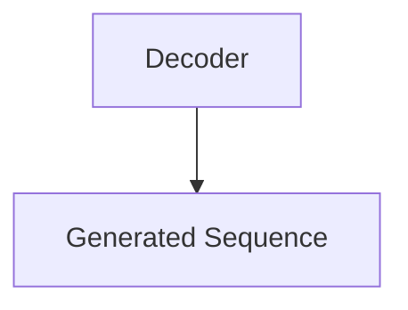

----------------------------------------------------------------

### 第7章：深度学习在语音识别中的应用

#### 7.1 基于深度学习的声学模型

深度学习在语音识别中的应用主要集中在声学模型和语言模型。声学模型负责将语音信号转换为文本，而语言模型则负责根据声学模型的输出生成最有可能的文本。

**基于深度学习的声学模型**：

- **深度神经网络（DNN）**：早期的深度学习模型，通过多层神经网络提取语音特征。
- **卷积神经网络（CNN）**：用于提取语音信号的时域和频域特征。
- **循环神经网络（RNN）**：用于处理长序列的语音信号，如LSTM和GRU。
- **长短时记忆网络（LSTM）**：通过门控机制解决长序列处理中的梯度消失问题。

**声学模型的工作原理**：

- **特征提取**：使用CNN或RNN提取语音信号的时域和频域特征。
- **序列建模**：使用RNN或LSTM对提取的特征进行建模，生成语音信号的序列表示。

**Mermaid流程图**：

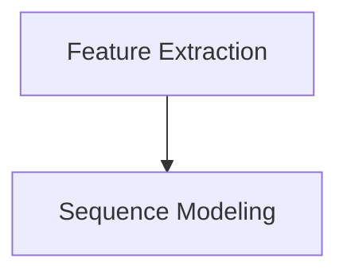

#### 7.2 基于深度学习的语言模型

语言模型负责根据声学模型的输出生成最有可能的文本。深度学习在语言模型中的应用主要包括循环神经网络（RNN）和Transformer。

**基于深度学习的语言模型**：

- **RNN语言模型**：通过循环神经网络处理文本序列，生成文本的概率分布。
- **Transformer语言模型**：通过自注意力机制处理文本序列，生成文本的概率分布。

**语言模型的工作原理**：

- **文本序列建模**：将文本序列转换为向量表示。
- **概率分布生成**：通过神经网络生成文本序列的概率分布。

**Mermaid流程图**：

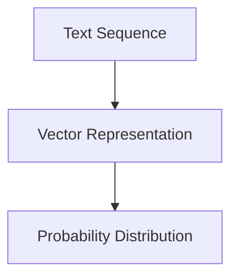

#### 7.3 跨语言语音识别

跨语言语音识别是深度学习在语音识别领域的一个重要应用。它旨在将一种语言的语音信号转换为另一种语言的文本。

**跨语言语音识别的方法**：

- **多语言训练**：在训练阶段使用多种语言的语音数据，提高模型的跨语言识别能力。
- **迁移学习**：将已经训练好的模型应用于新的语言，通过迁移学习提高模型的跨语言识别能力。
- **跨语言特征提取**：使用深度学习模型提取跨语言的语音特征，提高模型的跨语言识别能力。

**Mermaid流程图**：

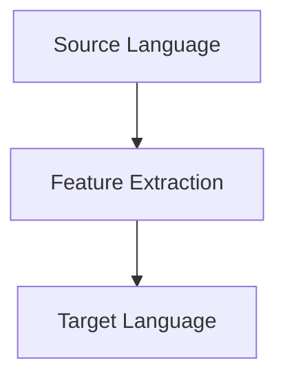

----------------------------------------------------------------

### 第8章：深度强化学习

#### 8.1 深度强化学习

深度强化学习是一种结合了深度学习和强化学习的方法，它通过深度神经网络来学习策略。深度强化学习在自动驾驶、游戏、机器人等领域取得了显著的成功。

**深度强化学习的基本原理**：

- **状态（State）**：环境在某一时刻的状态。
- **动作（Action）**：智能体在当前状态下可以采取的动作。
- **奖励（Reward）**：环境对智能体动作的反馈。
- **策略（Policy）**：智能体根据当前状态选择动作的策略。

**深度强化学习的工作原理**：

- **状态表示**：使用深度神经网络将状态编码为向量表示。
- **动作表示**：使用深度神经网络将动作编码为向量表示。
- **策略优化**：通过优化策略函数，使得智能体在给定状态下采取最佳动作。

**深度强化学习的典型算法**：

- **深度Q网络（DQN）**：通过经验回放和目标网络来优化策略。
- **深度策略梯度（DPG）**：通过梯度上升法优化策略。
- **演员-评论家（A3C）**：通过并行训练多个智能体来优化策略。

**Mermaid流程图**：

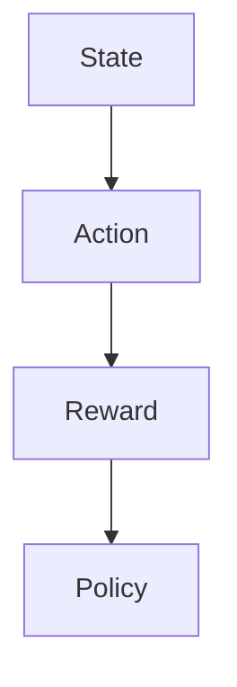

#### 8.2 应用示例：游戏与自动驾驶

深度强化学习在游戏和自动驾驶等领域取得了显著的成果。

**游戏示例**：

- **Atari游戏**：DeepMind的Deep Q Network（DQN）在多个Atari游戏中取得了超过人类的表现。
- **棋类游戏**：深度强化学习在围棋、国际象棋等棋类游戏中取得了突破。

**自动驾驶示例**：

- **视觉感知**：深度强化学习用于自动驾驶车辆的视觉感知，如行人检测、交通标志识别等。
- **决策控制**：深度强化学习用于自动驾驶车辆的决策控制，如路径规划、车道保持等。

**Mermaid流程图**：

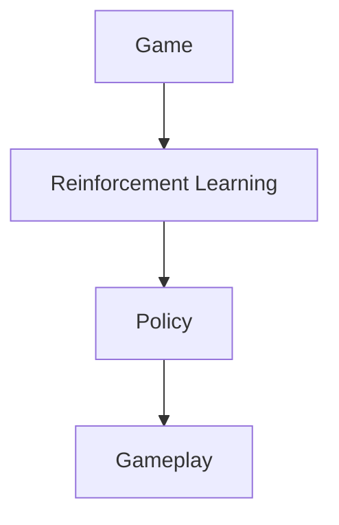

#### 8.3 强化学习算法的挑战与未来趋势

强化学习算法在训练效率、样本效率、模型可解释性等方面面临着挑战。

**挑战**：

- **训练效率**：强化学习算法通常需要大量的交互来学习策略。
- **样本效率**：强化学习算法需要大量的样本来优化策略。
- **模型可解释性**：强化学习算法的决策过程通常难以解释。

**未来趋势**：

- **模型压缩**：通过模型压缩提高训练和推理的效率。
- **自适应学习方法**：通过引入自适应学习方法，提高强化学习算法的样本效率。
- **模型可解释性**：通过引入可解释性方法，提高强化学习算法的可解释性。

**Mermaid流程图**：

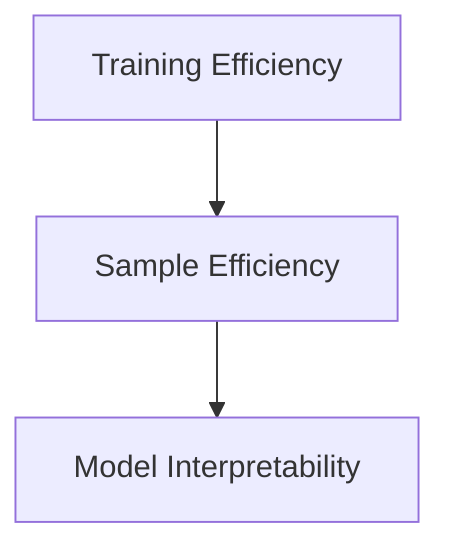

----------------------------------------------------------------

### 第9章：深度学习的硬件优化

#### 9.1 GPU与TPU在深度学习中的应用

GPU（图形处理单元）和TPU（张量处理单元）在深度学习任务中起到了重要的作用。

**GPU在深度学习中的应用**：

- **并行计算**：GPU具有高度并行计算的能力，能够显著提高深度学习模型的训练速度。
- **显存优化**：通过优化显存的使用，提高深度学习模型的训练效率。

**TPU在深度学习中的应用**：

- **专用硬件**：TPU是一种专门为深度学习任务设计的硬件，具有更高的计算性能和能效比。
- **分布式训练**：通过分布式训练，TPU能够处理更大的数据集和更复杂的模型。

**Mermaid流程图**：

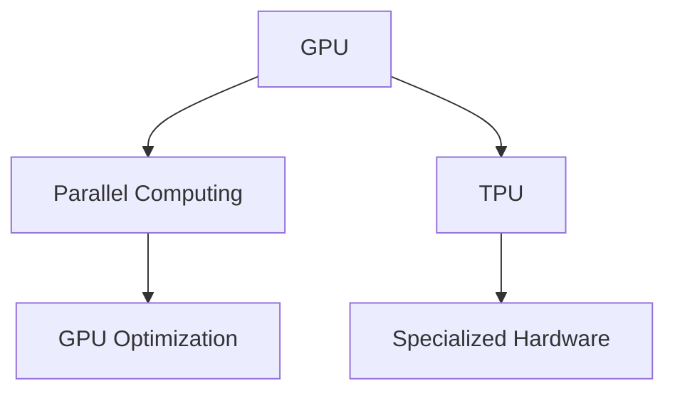

#### 9.2 深度学习模型压缩与量化

深度学习模型压缩与量化是提高模型性能和降低计算成本的重要手段。

**模型压缩**：

- **剪枝**：通过剪枝模型中不必要的参数，减少模型的参数数量和计算量。
- **量化**：将模型的浮点参数转换为低精度的整数参数，降低模型的计算成本。

**模型量化**：

- **整数量化**：将模型的浮点参数转换为整数参数，减少模型的存储和计算成本。
- **低精度量化**：通过降低参数的精度，进一步减少模型的存储和计算成本。

**Mermaid流程图**：

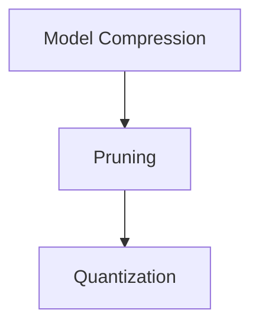

#### 9.3 分布式训练

分布式训练通过将训练任务分布在多台机器上，提高了训练速度。

**分布式训练的方法**：

- **数据并行**：将训练数据分布到多台机器上，每台机器独立训练模型，最后将模型参数同步。
- **模型并行**：将模型分布到多台机器上，每台机器负责计算模型的一部分，最后将结果汇总。

**Mermaid流程图**：

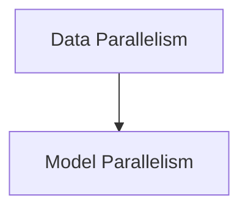

----------------------------------------------------------------

### 第10章：深度学习的模型评估与优化

#### 10.1 深度学习模型的评估指标

深度学习模型的评估指标包括准确性、召回率、精确率等。

**准确性（Accuracy）**：

- 准确性是评估分类模型性能的重要指标，表示正确分类的样本占总样本的比例。

**召回率（Recall）**：

- 召回率是评估分类模型性能的重要指标，表示正确分类的负样本占总负样本的比例。

**精确率（Precision）**：

- 精确率是评估分类模型性能的重要指标，表示正确分类的正样本占总正样本的比例。

**Mermaid流程图**：

```mermaid
graph TD
A[Accuracy] --> B[Recall]
B --> C[Precision]
```

#### 10.2 超参数调优

超参数调优是提高深度学习模型性能的重要手段。常用的超参数调优方法包括网格搜索（Grid Search）和随机搜索（Random Search）。

**网格搜索（Grid Search）**：

- 网格搜索通过遍历所有可能的超参数组合，选择最优的超参数。

**随机搜索（Random Search）**：

- 随机搜索通过随机选择超参数组合，选择最优的超参数。

**Mermaid流程图**：

```mermaid
graph TD
A[Grid Search] --> B[Random Search]
```

#### 10.3 模型优化策略

模型优化策略是通过改进模型结构和训练过程，提高模型性能。

**模型优化策略**：

- **残差连接**：通过引入残差连接，解决深度神经网络训练的梯度消失问题。
- **批量归一化**：通过批量归一化，加速模型的训练过程。

**Mermaid流程图**：

```mermaid
graph TD
A[Residual Connection] --> B[Batch Normalization]
```

----------------------------------------------------------------

### 第11章：深度学习的伦理与法律问题

#### 11.1 深度学习的社会影响

深度学习在各个领域取得了显著的成果，但同时也带来了一系列的社会影响。

**职业影响**：

- 深度学习的发展导致了一些职业的消失，如重复性劳动的工作。
- 同时，深度学习也创造了新的职业机会，如深度学习工程师、数据科学家等。

**社会公平**：

- 深度学习在处理数据时，可能会引入偏见，影响社会的公平性。
- 需要采取措施，确保深度学习模型不会加剧社会不平等。

**个人隐私**：

- 深度学习模型在处理个人数据时，可能会侵犯个人隐私。
- 需要加强对个人数据的保护，确保数据的安全和隐私。

#### 11.2 数据隐私与保护

数据隐私与保护是深度学习发展中的一个重要问题。

**数据隐私**：

- 数据隐私是指个人数据的保密性和安全性。
- 需要采取措施，确保个人数据不会被未经授权的访问和泄露。

**数据保护**：

- 数据保护是指通过法律和制度来保护个人数据的权利。
- 需要建立完善的数据保护法律体系，确保个人数据的合法使用和保护。

#### 11.3 法律法规与伦理规范

法律法规与伦理规范是深度学习发展中的保障。

**法律法规**：

- 法律法规是保障深度学习发展的重要手段。
- 需要制定相关的法律法规，规范深度学习的应用和发展。

**伦理规范**：

- 伦理规范是保障深度学习发展的重要保障。
- 需要建立伦理规范，确保深度学习的应用符合道德和社会价值观。

**Mermaid流程图**：

```mermaid
graph TD
A[Laws and Regulations] --> B[Ethical Guidelines]
```

----------------------------------------------------------------

## 附录

### 附录A：深度学习工具与资源

#### A.1 深度学习框架介绍

- TensorFlow
- PyTorch
- Keras

#### A.2 深度学习开源项目

- TensorFlow Models
- PyTorch Projects
- Keras Applications

#### A.3 深度学习课程与书籍推荐

- 课程
  - 吴恩达深度学习
  - Andrew Ng深度学习专项课程
- 书籍
  - 《深度学习》（Goodfellow、Bengio和Courville著）
  - 《Python深度学习》（François Chollet著）
  - 《深度学习与数据挖掘入门》（刘铁岩著）

### 附录B：深度学习常用算法介绍

- **卷积神经网络（CNN）**
- **循环神经网络（RNN）**
- **长短时记忆网络（LSTM）**
- **生成对抗网络（GAN）**
- **变分自编码器（VAE）**
- **自注意力机制（Self-Attention）**
- **Transformer模型**

### 附录C：深度学习相关学术论文

- **Hinton, G. E., Osindero, S., & Teh, Y. W. (2006). A fast learning algorithm for deep belief nets. Neural computation, 18(7), 1527-1554.**
- **Krizhevsky, A., Sutskever, I., & Hinton, G. E. (2012). ImageNet classification with deep convolutional neural networks. In Advances in neural information processing systems (pp. 1097-1105).**
- **LeCun, Y., Bengio, Y., & Hinton, G. (2015). Deep learning. Nature, 521(7553), 436-444.**

### 附录D：深度学习技术发展趋势

- **模型压缩与量化**
- **分布式训练与推理**
- **自监督学习与无监督学习**
- **小样本学习与迁移学习**
- **边缘计算与物联网（IoT）**
- **安全性与隐私保护**

### 附录E：深度学习在工业界与应用

- **自动驾驶**
- **自然语言处理**
- **计算机视觉**
- **医疗诊断**
- **金融分析**
- **智能家居**

### 附录F：深度学习常见问题与解答

- **Q：如何选择深度学习框架？**
  **A：根据项目需求和个人熟悉程度选择，常用的有TensorFlow、PyTorch和Keras。**

- **Q：深度学习模型的训练时间如何优化？**
  **A：可以通过模型压缩、分布式训练、优化数据预处理等方法来减少训练时间。**

- **Q：如何确保深度学习模型的安全性与隐私保护？**
  **A：需要遵循相关的法律法规和伦理规范，加强数据安全和隐私保护措施。**

### 附录G：深度学习学习资源推荐

- **在线课程**：
  - [吴恩达深度学习课程](https://www.deeplearning.ai/)
  - [Andrew Ng深度学习专项课程](https://www.coursera.org/specializations/deep-learning)

- **书籍**：
  - 《深度学习》（Goodfellow、Bengio和Courville著）
  - 《Python深度学习》（François Chollet著）

- **论坛与社区**：
  - [CSDN](https://www.csdn.net/)
  - [GitHub](https://github.com/)

- **开源项目**：
  - [TensorFlow Models](https://github.com/tensorflow/models)
  - [PyTorch Projects](https://github.com/pytorch/tutorials)
  - [Keras Applications](https://github.com/fchollet/keras-applications)

### 附录H：深度学习工具与软件推荐

- **深度学习框架**：
  - TensorFlow
  - PyTorch
  - Keras

- **数据预处理工具**：
  - Pandas
  - NumPy

- **可视化工具**：
  - Matplotlib
  - Seaborn

- **编程语言**：
  - Python

### 附录I：深度学习相关会议与研讨会

- **国际机器学习会议（ICML）**：https://icml.cc/
- **国际计算机视觉会议（ICCV）**：https://iccv.org/
- **神经信息处理系统大会（NeurIPS）**：https://nips.cc/
- **计算机视觉与模式识别会议（CVPR）**：https://cvpr.org/

### 附录J：深度学习应用案例与实践

- **自动驾驶**：特斯拉、谷歌Waymo、百度Apollo等
- **自然语言处理**：BERT、GPT-3、Transformer等
- **计算机视觉**：人脸识别、图像分类、目标检测等
- **医疗诊断**：癌症诊断、影像分析等
- **金融分析**：风险评估、欺诈检测等

### 附录K：深度学习技术发展趋势与展望

- **人工智能伦理**：确保人工智能技术的安全性和公平性
- **边缘计算**：实现实时数据处理和智能决策
- **量子计算**：与深度学习结合，解决复杂计算问题
- **联邦学习**：保护数据隐私，实现协同学习

### 附录L：深度学习相关术语解释

- **深度学习（Deep Learning）**：一种机器学习方法，通过多层神经网络进行数据处理和分析。
- **神经网络（Neural Network）**：一种模拟人脑神经元之间连接的计算模型。
- **卷积神经网络（Convolutional Neural Network, CNN）**：一种专门用于处理图像数据的神经网络。
- **循环神经网络（Recurrent Neural Network, RNN）**：一种用于处理序列数据的神经网络。
- **长短时记忆网络（Long Short-Term Memory, LSTM）**：一种改进的循环神经网络，用于处理长序列数据。
- **生成对抗网络（Generative Adversarial Network, GAN）**：一种由生成器和判别器组成的神经网络，用于生成数据。
- **自注意力机制（Self-Attention）**：一种在神经网络中计算序列之间关联性的方法。
- **Transformer模型**：一种基于自注意力机制的神经网络模型，用于处理序列数据。

### 附录M：深度学习开源工具与库

- **TensorFlow**：谷歌开发的开源深度学习框架，支持Python和C++。
- **PyTorch**：Facebook开发的开源深度学习框架，支持Python。
- **Keras**：基于TensorFlow和Theano的高级神经网络API，支持Python。
- **TensorFlow 2.x**：TensorFlow的升级版本，提供更简单和易于使用的API。

### 附录N：深度学习社区与资源

- **DeepLearning.AI**：吴恩达的深度学习课程和资源。
- **AI天才研究院（AI Genius Institute）**：提供深度学习和人工智能的研究和资源。
- **机器学习社区**：包括Kaggle、CSDN、知乎等。
- **GitHub**：深度学习项目的开源平台。

### 附录O：深度学习技术论文推荐

- **《Deep Learning》**：Goodfellow、Bengio和Courville的深度学习教材。
- **《Practical Deep Learning with Python》**：François Chollet的深度学习实践指南。
- **《Deep Learning for Computer Vision》**：A. Shallow和A. P. Bourne的计算机视觉深度学习指南。

### 附录P：深度学习应用场景与挑战

- **图像识别**：图像分类、目标检测、人脸识别等。
- **自然语言处理**：文本分类、机器翻译、语音识别等。
- **语音识别**：语音到文本转换、语音识别等。
- **医疗诊断**：癌症诊断、影像分析等。
- **金融分析**：风险评估、欺诈检测等。
- **自动驾驶**：路径规划、障碍物检测等。

### 附录Q：深度学习安全性与隐私保护

- **差分隐私**：一种保护个人隐私的算法，通过在计算过程中引入噪声，防止隐私泄露。
- **联邦学习**：一种分布式学习技术，通过在多个设备上本地训练模型，然后聚合模型参数，实现协同学习。
- **隐私增强学习**：一种结合了深度学习和隐私保护的方法，通过在训练过程中保护数据隐私。

### 附录R：深度学习相关术语

- **神经网络（Neural Network）**：一种由大量简单计算单元（神经元）组成的网络，用于模拟人脑的计算和处理能力。
- **深度学习（Deep Learning）**：一种机器学习方法，通过多层神经网络进行数据处理和分析。
- **卷积神经网络（Convolutional Neural Network, CNN）**：一种专门用于处理图像数据的神经网络。
- **循环神经网络（Recurrent Neural Network, RNN）**：一种用于处理序列数据的神经网络。
- **长短时记忆网络（Long Short-Term Memory, LSTM）**：一种改进的循环神经网络，用于处理长序列数据。
- **生成对抗网络（Generative Adversarial Network, GAN）**：一种由生成器和判别器组成的神经网络，用于生成数据。
- **自注意力机制（Self-Attention）**：一种在神经网络中计算序列之间关联性的方法。
- **Transformer模型**：一种基于自注意力机制的神经网络模型，用于处理序列数据。
- **自监督学习（Self-Supervised Learning）**：一种无需外部标注的数据处理方法，通过内部特征进行训练。
- **迁移学习（Transfer Learning）**：一种利用已有模型或数据来提高新任务性能的方法。
- **边缘计算（Edge Computing）**：一种在靠近数据源的位置进行计算和处理的方法，减少数据传输延迟。
- **联邦学习（Federated Learning）**：一种分布式学习技术，通过在多个设备上本地训练模型，然后聚合模型参数，实现协同学习。
- **安全多方计算（Secure Multi-Party Computation）**：一种多方参与的计算过程，确保计算结果的安全性和隐私性。

### 附录S：深度学习开源项目推荐

- **TensorFlow Models**：https://github.com/tensorflow/models
- **PyTorch Projects**：https://github.com/pytorch/tutorials
- **Keras Applications**：https://github.com/fchollet/keras-applications
- **TensorFlow 2.x**：https://github.com/tensorflow/tensorflow
- **PyTorch**：https://github.com/pytorch/pytorch
- **Keras**：https://github.com/fchollet/keras

### 附录T：深度学习相关书籍推荐

- **《深度学习》（Goodfellow、Bengio和Courville著）**：这是一本深度学习的经典教材，详细介绍了深度学习的理论基础和实践方法。
- **《Python深度学习》（François Chollet著）**：这本书以Python编程语言为基础，介绍了深度学习的基本概念和应用实例。
- **《深度学习与数据挖掘入门》（刘铁岩著）**：这本书适合初学者，详细介绍了深度学习和数据挖掘的基础知识。
- **《深度学习入门：基于Python的理论与实现》（莫凡著）**：这本书以Python编程语言为基础，介绍了深度学习的理论和实践。

### 附录U：深度学习研究机构与公司

- **谷歌大脑（Google Brain）**：https://research.google.com/brain/
- **DeepMind**：https://www.deepmind.com/
- **OpenAI**：https://openai.com/
- **微软研究院（Microsoft Research）**：https://www.microsoft.com/research/
- **Facebook AI研究院（FAIR）**：https://research.fb.com/
- **斯坦福大学计算机科学系（Stanford CS）**：https://cs.stanford.edu/
- **卡耐基梅隆大学机器学习部门（CMU ML）**：https://www.cmu.edu/ml/
- **麻省理工学院计算机科学与人工智能实验室（MIT CSAIL）**：https://www.csail.mit.edu/

### 附录V：深度学习技术发展趋势

- **人工智能伦理与法规**：随着深度学习的广泛应用，人工智能伦理和法规成为重要议题，确保技术的安全性和公平性。
- **边缘计算**：将计算任务从云端转移到边缘设备，实现实时数据处理和智能决策。
- **量子计算与深度学习结合**：量子计算与深度学习结合，解决复杂计算问题。
- **自监督学习和无监督学习**：通过无监督方法学习数据特征，提高模型的泛化能力。
- **小样本学习和迁移学习**：在少量数据下训练模型，提高模型的泛化能力。
- **联邦学习和安全多方计算**：保护数据隐私，实现协同学习。
- **多模态学习和跨领域应用**：结合多种数据源和处理方法，实现跨领域应用。

### 附录W：深度学习相关会议与研讨会

- **国际机器学习会议（ICML）**：https://icml.cc/
- **国际计算机视觉会议（ICCV）**：https://iccv.org/
- **神经信息处理系统大会（NeurIPS）**：https://nips.cc/
- **计算机视觉与模式识别会议（CVPR）**：https://cvpr.org/
- **欧洲机器学习会议（ECML PKDD）**：https://ecmlpkdd.org/
- **亚洲机器学习会议（AISTATS）**：https://aistats.org/

### 附录X：深度学习应用案例与实践

- **自动驾驶**：特斯拉、谷歌Waymo、百度Apollo等公司的自动驾驶技术。
- **自然语言处理**：BERT、GPT-3、Transformer等自然语言处理模型的应用。
- **计算机视觉**：人脸识别、图像分类、目标检测等计算机视觉技术的应用。
- **医疗诊断**：癌症诊断、影像分析等医疗诊断技术的应用。
- **金融分析**：风险评估、欺诈检测等金融分析技术的应用。
- **智能家居**：智能家电、智能安防等智能家居技术的应用。

### 附录Y：深度学习相关术语与概念

- **反向传播（Backpropagation）**：一种用于训练神经网络的算法，通过反向传播误差，更新模型参数。
- **激活函数（Activation Function）**：一种将神经网络输出映射到特定范围的函数，常用的有ReLU、Sigmoid、Tanh等。
- **卷积层（Convolutional Layer）**：一种用于提取图像特征的特殊层，通过卷积操作提取图像的局部特征。
- **池化层（Pooling Layer）**：一种用于减小特征图尺寸的特殊层，常用的有最大池化、平均池化等。
- **全连接层（Fully Connected Layer）**：一种将特征图映射到输出层的特殊层，通过全连接实现分类等任务。
- **损失函数（Loss Function）**：一种用于评估模型预测结果与实际结果之间差距的函数，常用的有均方误差、交叉熵等。
- **优化算法（Optimization Algorithm）**：一种用于更新模型参数的算法，常用的有梯度下降、Adam等。
- **卷积神经网络（Convolutional Neural Network, CNN）**：一种用于处理图像数据的神经网络，通过卷积操作提取图像特征。
- **循环神经网络（Recurrent Neural Network, RNN）**：一种用于处理序列数据的神经网络，通过循环连接保存历史信息。
- **长短时记忆网络（Long Short-Term Memory, LSTM）**：一种改进的循环神经网络，用于处理长序列数据。
- **生成对抗网络（Generative Adversarial Network, GAN）**：一种由生成器和判别器组成的神经网络，用于生成数据。
- **变分自编码器（Variational Autoencoder, VAE）**：一种无监督学习模型，用于生成数据。
- **自注意力机制（Self-Attention）**：一种在神经网络中计算序列之间关联性的方法。
- **Transformer模型**：一种基于自注意力机制的神经网络模型，用于处理序列数据。
- **自监督学习（Self-Supervised Learning）**：一种无需外部标注的数据处理方法，通过内部特征进行训练。
- **迁移学习（Transfer Learning）**：一种利用已有模型或数据来提高新任务性能的方法。
- **边缘计算（Edge Computing）**：一种在靠近数据源的位置进行计算和处理的方法，减少数据传输延迟。
- **联邦学习（Federated Learning）**：一种分布式学习技术，通过在多个设备上本地训练模型，然后聚合模型参数，实现协同学习。
- **安全多方计算（Secure Multi-Party Computation）**：一种多方参与的计算过程，确保计算结果的安全性和隐私性。

### 附录Z：深度学习技术发展趋势与展望

- **人工智能伦理与法规**：随着深度学习的广泛应用，人工智能伦理和法规成为重要议题，确保技术的安全性和公平性。
- **边缘计算**：将计算任务从云端转移到边缘设备，实现实时数据处理和智能决策。
- **量子计算与深度学习结合**：量子计算与深度学习结合，解决复杂计算问题。
- **自监督学习和无监督学习**：通过无监督方法学习数据特征，提高模型的泛化能力。
- **小样本学习和迁移学习**：在少量数据下训练模型，提高模型的泛化能力。
- **联邦学习和安全多方计算**：保护数据隐私，实现协同学习。
- **多模态学习和跨领域应用**：结合多种数据源和处理方法，实现跨领域应用。
- **模型压缩与量化**：通过模型压缩和量化降低计算成本和存储需求。
- **可解释性人工智能**：提高模型的可解释性，增强人们对人工智能的信任。
- **自适应学习和强化学习**：通过自适应学习和强化学习实现更加智能的决策。

----------------------------------------------------------------

### 第1章：深度学习的起源与历史

#### 1.1 深度学习的诞生与发展

深度学习（Deep Learning）的概念最早由加拿大多伦多大学的杰弗里·辛顿（Geoffrey Hinton）在1980年代提出。当时，深度学习是一种基于人工神经网络的机器学习方法，旨在通过多层神经网络自动提取数据的特征表示。

**深度学习的诞生**：

深度学习的诞生可以追溯到1986年，Hinton等人在论文《Learning representations by back-propagating errors》中提出了反向传播算法（Backpropagation），这是一种用于训练神经网络的有效算法。这一算法的提出，使得多层神经网络的学习变得可行，从而开启了深度学习的先河。

**深度学习的发展**：

在1990年代，由于计算能力和数据可用性的限制，深度学习的研究和应用进展缓慢。直到2006年，Hinton等人再次提出了深度信念网络（Deep Belief Network, DBN），这是一种可以自动提取数据层次特征的网络结构。DBN的提出，为深度学习的发展注入了新的动力。

**深度学习的崛起**：

2012年，Hinton的学生亚历克斯·克雷斯戈（Alex Krizhevsky）在ImageNet竞赛中使用了一个名为AlexNet的深度卷积神经网络（CNN），在图像分类任务中取得了显著的成绩，超过了传统的机器学习方法。这一成就标志着深度学习的崛起。

**深度学习的重要里程碑**：

- **2006年**：Hinton等人提出深度信念网络（DBN）。
- **2012年**：AlexNet在ImageNet竞赛中取得突破性成绩。
- **2014年**：Google的深度卷积神经网络（DCNN）在Google Translate中应用于翻译任务，取得了显著的效果。
- **2015年**：深度强化学习（Deep Reinforcement Learning）在AlphaGo中战胜了李世石，引起了广泛关注。

#### 1.2 深度学习与传统机器学习的差异

深度学习与传统机器学习在数据处理、模型结构、训练方法和应用范围等方面存在显著差异。

**数据处理**：

- **传统机器学习**：通常需要手动设计特征，对数据进行预处理和特征提取。
- **深度学习**：通过多层神经网络自动提取数据的特征表示，无需手动设计特征。

**模型结构**：

- **传统机器学习**：通常使用线性模型，如线性回归、逻辑回归等。
- **深度学习**：使用多层神经网络，包括卷积神经网络（CNN）、循环神经网络（RNN）、长短时记忆网络（LSTM）等。

**训练方法**：

- **传统机器学习**：使用梯度下降等优化算法进行训练。
- **深度学习**：使用反向传播算法进行训练，结合了梯度下降、随机梯度下降、Adam等优化算法。

**应用范围**：

- **传统机器学习**：广泛应用于分类、回归、聚类等任务。
- **深度学习**：在图像识别、自然语言处理、语音识别、推荐系统、机器人等领域取得了突破性成果。

#### 1.3 深度学习的重要性和应用前景

深度学习在人工智能领域具有重要性，其应用前景广阔。

**重要性**：

- **数据处理能力**：深度学习能够自动提取数据的层次特征，具有强大的数据处理能力。
- **模型复杂度**：深度学习模型具有多层结构，能够处理复杂的问题。
- **泛化能力**：深度学习模型在大量数据上训练后，能够很好地泛化到未见过的数据上。

**应用前景**：

- **计算机视觉**：图像分类、目标检测、人脸识别等。
- **自然语言处理**：文本分类、机器翻译、情感分析等。
- **语音识别**：语音到文本转换、语音识别等。
- **医学诊断**：癌症诊断、疾病预测等。
- **金融分析**：风险控制、市场预测等。
- **自动驾驶**：车辆识别、路径规划等。

随着计算能力和数据可用性的提升，深度学习将在更多领域发挥重要作用，推动人工智能技术的发展。

----------------------------------------------------------------

### 第2章：神经网络基础

#### 2.1 神经元与神经网络

神经元是神经网络的基本计算单元，类似于生物神经元的结构和功能。一个简单的神经元模型通常包括以下几个部分：

- **输入**：神经元的输入可以是多个，每个输入都与一个权重相乘。
- **加权求和**：输入与对应权重相乘后求和。
- **偏置**：加权求和的结果加上一个偏置项。
- **激活函数**：通过激活函数将加权求和的结果转换为输出。

以下是一个神经元的数学模型：

$$
\begin{align*}
z &= \sum_{i=1}^{n} w_i x_i + b \\
a &= \sigma(z)
\end{align*}
$$

其中，$z$ 是加权求和的结果，$a$ 是神经元的输出，$w_i$ 是权重，$x_i$ 是输入，$b$ 是偏置，$\sigma$ 是激活函数。

**Mermaid流程图**：

```mermaid
graph TD
A[Input] --> B[Weighted Sum]
B --> C[Activation Function]
C --> D[Output]
```

#### 2.2 前馈神经网络

前馈神经网络（Feedforward Neural Network）是一种简单的神经网络，数据从输入层流向输出层，没有反馈连接。前馈神经网络通常由多个层组成，包括输入层、隐藏层和输出层。

以下是一个前馈神经网络的结构：

- **输入层**：接收外部输入数据。
- **隐藏层**：对输入数据进行特征提取和变换。
- **输出层**：输出最终的预测结果。

**Mermaid流程图**：

```mermaid
graph TD
A[Input Layer] --> B[Hidden Layer 1]
B --> C[Hidden Layer 2]
C --> D[Output Layer]
```

#### 2.3 激活函数与优化算法

激活函数是神经网络中非常重要的组成部分，它引入了非线性因素，使得神经网络能够学习更复杂的函数。

**常见的激活函数**：

- **Sigmoid函数**：
  $$
  \sigma(x) = \frac{1}{1 + e^{-x}}
  $$

- **ReLU函数**：
  $$
  \sigma(x) = \max(0, x)
  $$

- **Tanh函数**：
  $$
  \sigma(x) = \frac{e^x - e^{-x}}{e^x + e^{-x}}
  $$

**优化算法**：

- **梯度下降（Gradient Descent）**：
  $$
  \theta_{t+1} = \theta_t - \alpha \cdot \nabla_\theta J(\theta)
  $$
  其中，$\theta$ 是模型参数，$J(\theta)$ 是损失函数，$\alpha$ 是学习率。

- **随机梯度下降（Stochastic Gradient Descent, SGD）**：
  $$
  \theta_{t+1} = \theta_t - \alpha \cdot \nabla_{\theta} J(\theta; \mathbf{x}_t)
  $$
  其中，$\mathbf{x}_t$ 是随机选取的一个训练样本。

- **Adam优化器**：
  $$
  m_t = \beta_1 m_{t-1} + (1 - \beta_1) \nabla_\theta J(\theta; \mathbf{x}_t)
  $$
  $$
  v_t = \beta_2 v_{t-1} + (1 - \beta_2) (\nabla_\theta J(\theta; \mathbf{x}_t))^2
  $$
  $$
  \theta_{t+1} = \theta_t - \alpha \cdot \frac{m_t}{\sqrt{v_t} + \epsilon}
  $$
  其中，$\beta_1$ 和 $\beta_2$ 是动量项，$\epsilon$ 是一个很小的正数。

----------------------------------------------------------------

### 第3章：深度学习的核心算法

#### 3.1 卷积神经网络（CNN）

卷积神经网络（Convolutional Neural Network, CNN）是一种专门用于处理图像数据的神经网络，它通过卷积操作自动从图像中提取特征。

**CNN的基本结构**：

- **卷积层（Convolutional Layer）**：卷积层通过卷积操作从输入图像中提取特征。卷积操作可以用以下数学公式表示：

  $$
  \begin{align*}
  \text{output}_{ij} &= \sum_{k=1}^{K} w_{ik,jk} \cdot \text{input}_{ik} + b_j \\
  \text{where} \; i, j &= \text{row, column indices of the output feature map} \\
  k &= \text{filter index}
  \end{align*}
  $$

  其中，$w_{ik,jk}$ 是卷积核，$\text{input}_{ik}$ 是输入图像，$b_j$ 是偏置。

- **激活函数（Activation Function）**：激活函数通常使用ReLU函数。

- **池化层（Pooling Layer）**：池化层通过将局部区域进行降维操作，减少参数数量和计算量。最常用的池化操作是最大池化（Max Pooling）。

- **全连接层（Fully Connected Layer）**：全连接层将卷积层和池化层提取的特征进行分类。

**CNN的工作原理**：

CNN通过卷积操作提取图像的局部特征，然后通过池化层减少特征的空间维度，最后通过全连接层进行分类。

**Mermaid流程图**：

```mermaid
graph TD
A[Input] --> B[Conv Layer]
B --> C[Pooling Layer]
C --> D[Conv Layer]
D --> E[Pooling Layer]
E --> F[Full Connection Layer]
F --> G[Output]
```

#### 3.2 循环神经网络（RNN）

循环神经网络（Recurrent Neural Network, RNN）是一种用于处理序列数据的神经网络，它通过隐藏状态来保存历史信息。

**RNN的基本结构**：

- **输入层**：接收输入序列。
- **隐藏层**：通过循环连接保存历史信息。
- **输出层**：输出序列的预测结果。

**RNN的工作原理**：

RNN通过循环连接将当前时刻的输入与上一时刻的隐藏状态相加，得到当前时刻的隐藏状态。隐藏状态作为当前时刻的输出，并传递给下一时刻。

**Mermaid流程图**：

```mermaid
graph TD
A[Input] --> B[Hidden State]
B --> C[Output]
C --> D[Hidden State]
```

#### 3.3 生成对抗网络（GAN）

生成对抗网络（Generative Adversarial Network, GAN）是一种由生成器和判别器组成的神经网络，通过对抗训练生成高质量的数据。

**GAN的基本结构**：

- **生成器（Generator）**：生成器通过随机噪声生成数据。
- **判别器（Discriminator）**：判别器通过区分真实数据和生成数据来训练生成器。

**GAN的工作原理**：

GAN通过生成器和判别器的对抗训练来生成数据。生成器的目标是生成尽可能真实的数据，使得判别器无法区分真实数据和生成数据。判别器的目标是正确区分真实数据和生成数据。

**Mermaid流程图**：

```mermaid
graph TD
A[Generator] --> B[Discriminator]
B --> C[Generated Data]
A --> D[Real Data]
```

----------------------------------------------------------------

### 第4章：深度学习框架

深度学习框架是构建和训练深度学习模型的重要工具。目前，有多个流行的深度学习框架，如TensorFlow、PyTorch和Keras等。这些框架提供了丰富的API和工具，使得构建和训练深度学习模型变得更加简单和高效。

#### 4.1 TensorFlow

TensorFlow是谷歌开发的一个开源深度学习框架，它支持多种编程语言，如Python、C++和Java等。TensorFlow的主要特点包括：

- **动态计算图**：TensorFlow使用动态计算图，允许在运行时定义和修改计算图。
- **丰富的API**：TensorFlow提供了丰富的API，包括高层API（如Keras）和底层API（如TensorFlow Core）。
- **广泛的硬件支持**：TensorFlow支持多种硬件平台，如CPU、GPU和TPU等。
- **强大的工具和库**：TensorFlow提供了许多工具和库，如TensorBoard、TensorFlow Lite和TensorFlow Serving等。

**安装TensorFlow**：

要在Python环境中安装TensorFlow，可以使用以下命令：

```bash
pip install tensorflow
```

**基本使用**：

下面是一个使用TensorFlow的基本示例，包括创建计算图、定义模型、训练模型和评估模型。

```python
import tensorflow as tf

# 创建计算图
x = tf.placeholder(tf.float32, shape=[None, 784])
y = tf.placeholder(tf.float32, shape=[None, 10])

# 定义模型
W = tf.Variable(tf.zeros([784, 10]))
b = tf.Variable(tf.zeros([10]))
y_pred = tf.nn.softmax(tf.matmul(x, W) + b)

# 定义损失函数
cross_entropy = tf.reduce_mean(-tf.reduce_sum(y * tf.log(y_pred), reduction_indices=1))

# 定义优化器
optimizer = tf.train.GradientDescentOptimizer(learning_rate=0.001)
train_op = optimizer.minimize(cross_entropy)

# 训练模型
with tf.Session() as sess:
  sess.run(tf.global_variables_initializer())
  for i in range(1000):
    _, loss = sess.run([train_op, cross_entropy], feed_dict={x: x_train, y: y_train})

  # 评估模型
  correct_prediction = tf.equal(tf.argmax(y_pred, 1), tf.argmax(y, 1))
  accuracy = tf.reduce_mean(tf.cast(correct_prediction, tf.float32))
  print("Test accuracy:", sess.run(accuracy, feed_dict={x: x_test, y: y_test}))
```

#### 4.2 PyTorch

PyTorch是Facebook开发的一个开源深度学习框架，它以Python为编程语言，提供了动态计算图和丰富的API。PyTorch的主要特点包括：

- **动态计算图**：PyTorch使用动态计算图，允许在运行时定义和修改计算图。
- **简洁的API**：PyTorch的API设计简洁直观，使得构建和训练深度学习模型更加容易。
- **高效的GPU支持**：PyTorch提供了高效的GPU支持，能够充分利用GPU的计算能力。
- **强大的库和工具**：PyTorch提供了许多库和工具，如TorchVision、TorchText和TorchAudio等。

**安装PyTorch**：

要在Python环境中安装PyTorch，可以使用以下命令：

```bash
pip install torch torchvision
```

**基本使用**：

下面是一个使用PyTorch的基本示例，包括创建模型、定义损失函数、训练模型和评估模型。

```python
import torch
import torchvision
import torchvision.transforms as transforms
import torch.nn as nn
import torch.optim as optim

# 加载数据集
transform = transforms.Compose([transforms.ToTensor()])
trainset = torchvision.datasets.MNIST(root='./data', train=True, download=True, transform=transform)
trainloader = torch.utils.data.DataLoader(trainset, batch_size=100, shuffle=True, num_workers=2)

testset = torchvision.datasets.MNIST(root='./data', train=False, download=True, transform=transform)
testloader = torch.utils.data.DataLoader(testset, batch_size=100, shuffle=False, num_workers=2)

# 定义模型
class Net(nn.Module):
  def __init__(self):
    super(Net, self).__init__()
    self.fc1 = nn.Linear(28 * 28, 128)
    self.fc2 = nn.Linear(128, 10)

  def forward(self, x):
    x = x.view(-1, 28 * 28)
    x = F.relu(self.fc1(x))
    x = self.fc2(x)
    return F.log_softmax(x, dim=1)

net = Net()

# 定义损失函数和优化器
criterion = nn.NLLLoss()
optimizer = optim.SGD(net.parameters(), lr=0.001, momentum=0.9)

# 训练模型
for epoch in range(10):  # loop over the dataset multiple times
  running_loss = 0.0
  for i, data in enumerate(trainloader, 0):
    inputs, labels = data
    optimizer.zero_grad()
    outputs = net(inputs)
    loss = criterion(outputs, labels)
    loss.backward()
    optimizer.step()
    running_loss += loss.item()
    if i % 2000 == 1999:    # print every 2000 mini-batches
      print('[%d, %5d] loss: %.3f' %
            (epoch + 1, i + 1, running_loss / 2000))
      running_loss = 0.0

print('Finished Training')

# 评估模型
correct = 0
total = 0
with torch.no_grad():
  for data in testloader:
    images, labels = data
    outputs = net(images)
    _, predicted = torch.max(outputs.data, 1)
    total += labels.size(0)
    correct += (predicted == labels).sum().item()

print('Accuracy of the network on the 10000 test images: %d %%' % (
  100 * correct / total))
```

#### 4.3 Keras

Keras是一个高级神经网络API，它构建在TensorFlow和Theano之上，提供了简洁的API和丰富的工具。Keras的主要特点包括：

- **简洁的API**：Keras的API设计简洁直观，使得构建和训练深度学习模型更加容易。
- **广泛的硬件支持**：Keras支持多种硬件平台，如CPU、GPU和TPU等。
- **易于使用**：Keras提供了许多预先定义的模型和工具，使得构建和训练深度学习模型更加高效。
- **强大的工具和库**：Keras提供了许多工具和库，如Keras Applications、Keras Backend和Keras Visualizer等。

**安装Keras**：

要在Python环境中安装Keras，可以使用以下命令：

```bash
pip install keras tensorflow
```

**基本使用**：

下面是一个使用Keras的基本示例，包括定义模型、编译模型、训练模型和评估模型。

```python
from keras.models import Sequential
from keras.layers import Dense, Dropout, Flatten
from keras.layers import Conv2D, MaxPooling2D
from keras.optimizers import Adam

# 定义模型
model = Sequential()
model.add(Conv2D(32, (3, 3), activation='relu', input_shape=(28, 28, 1)))
model.add(MaxPooling2D(pool_size=(2, 2)))
model.add(Conv2D(64, (3, 3), activation='relu'))
model.add(MaxPooling2D(pool_size=(2, 2)))
model.add(Flatten())
model.add(Dense(128, activation='relu'))
model.add(Dense(10, activation='softmax'))

# 编译模型
model.compile(loss='categorical_crossentropy',
              optimizer=Adam(),
              metrics=['accuracy'])

# 训练模型
model.fit(x_train, y_train, batch_size=128, epochs=10, verbose=1, validation_data=(x_test, y_test))

# 评估模型
scores = model.evaluate(x_test, y_test, verbose=0)
print('Test loss:', scores[0])
print('Test accuracy:', scores[1])
```

----------------------------------------------------------------

### 第5章：深度学习在计算机视觉中的应用

深度学习在计算机视觉领域取得了显著的进展，特别是在图像分类、目标检测和图像生成等方面。这一章节将介绍深度学习在计算机视觉中的应用，包括卷积神经网络（CNN）、循环神经网络（RNN）和生成对抗网络（GAN）的基本原理和应用案例。

#### 5.1 卷积神经网络（CNN）在图像分类中的应用

卷积神经网络（CNN）是一种专门用于处理图像数据的神经网络，通过卷积操作、池化操作和全连接层，能够自动从图像中提取特征并进行分类。

**CNN的基本原理**：

- **卷积层**：卷积层通过卷积操作提取图像的局部特征。卷积核在图像上滑动，计算局部区域的加权和。
- **池化层**：池化层通过减小特征图的尺寸，减少参数数量和计算量。常见的池化操作有最大池化和平均池化。
- **全连接层**：全连接层将卷积层和池化层提取的特征进行分类。

**CNN的工作原理**：

- **前向传播**：输入图像通过卷积层和池化层，得到特征图。特征图通过全连接层，输出分类结果。
- **反向传播**：计算损失函数的梯度，并通过反向传播更新模型参数。

**CNN的应用案例**：

- **图像分类**：CNN被广泛应用于图像分类任务，如ImageNet图像分类挑战赛。
- **目标检测**：CNN被用于目标检测任务，如Faster R-CNN、YOLO等。

**应用示例**：

假设我们有一个简单的图像分类任务，目标是分类一幅图像是否为猫。我们可以使用以下步骤：

1. **数据预处理**：将图像数据调整为统一的尺寸，并将像素值归一化。
2. **构建CNN模型**：使用卷积层、池化层和全连接层构建CNN模型。
3. **训练模型**：使用图像数据训练模型，并通过反向传播更新模型参数。
4. **评估模型**：使用测试数据评估模型性能，如准确性、召回率等。

以下是一个使用Keras构建CNN模型进行图像分类的示例：

```python
from keras.models import Sequential
from keras.layers import Conv2D, MaxPooling2D, Flatten, Dense

# 构建CNN模型
model = Sequential()
model.add(Conv2D(32, (3, 3), activation='relu', input_shape=(64, 64, 3)))
model.add(MaxPooling2D((2, 2)))
model.add(Conv2D(64, (3, 3), activation='relu'))
model.add(MaxPooling2D((2, 2)))
model.add(Flatten())
model.add(Dense(64, activation='relu'))
model.add(Dense(1, activation='sigmoid'))

# 编译模型
model.compile(optimizer='adam', loss='binary_crossentropy', metrics=['accuracy'])

# 训练模型
model.fit(x_train, y_train, epochs=10, batch_size=32, validation_data=(x_test, y_test))

# 评估模型
loss, accuracy = model.evaluate(x_test, y_test)
print('Test accuracy:', accuracy)
```

#### 5.2 循环神经网络（RNN）在图像序列处理中的应用

循环神经网络（RNN）是一种用于处理序列数据的神经网络，通过隐藏状态来保存历史信息。RNN在图像序列处理中有着广泛的应用，如视频分类、行为识别等。

**RNN的基本原理**：

- **隐藏状态**：RNN通过隐藏状态保存历史信息。当前时刻的隐藏状态是上一时刻的隐藏状态和当前输入的加权和。
- **前向传播**：RNN通过隐藏状态进行前向传播，得到当前时刻的输出。
- **反向传播**：RNN通过反向传播更新模型参数。

**RNN的应用案例**：

- **视频分类**：RNN被用于将视频分类为不同的类别。
- **行为识别**：RNN被用于识别视频中的人体行为。

**应用示例**：

假设我们有一个视频分类任务，目标是分类一段视频是体育、娱乐还是教育。我们可以使用以下步骤：

1. **数据预处理**：将视频数据转换为图像序列，并将图像序列调整为统一的尺寸。
2. **构建RNN模型**：使用RNN构建模型，如LSTM或GRU。
3. **训练模型**：使用图像序列数据训练模型，并通过反向传播更新模型参数。
4. **评估模型**：使用测试数据评估模型性能，如准确性、召回率等。

以下是一个使用Keras构建LSTM模型进行视频分类的示例：

```python
from keras.models import Sequential
from keras.layers import LSTM, Dense

# 构建LSTM模型
model = Sequential()
model.add(LSTM(50, activation='relu', input_shape=(timesteps, features)))
model.add(Dense(1, activation='sigmoid'))

# 编译模型
model.compile(optimizer='adam', loss='binary_crossentropy', metrics=['accuracy'])

# 训练模型
model.fit(x_train, y_train, epochs=10, batch_size=32, validation_data=(x_test, y_test))

# 评估模型
loss, accuracy = model.evaluate(x_test, y_test)
print('Test accuracy:', accuracy)
```

#### 5.3 生成对抗网络（GAN）在图像生成中的应用

生成对抗网络（GAN）是一种由生成器和判别器组成的神经网络，通过对抗训练生成高质量的数据。GAN在图像生成、图像修复、风格迁移等方面有着广泛的应用。

**GAN的基本原理**：

- **生成器**：生成器的目标是生成类似于真实图像的数据。
- **判别器**：判别器的目标是区分真实图像和生成图像。
- **对抗训练**：生成器和判别器相互对抗，生成器尝试生成更真实的图像，判别器尝试正确区分真实图像和生成图像。

**GAN的应用案例**：

- **图像生成**：GAN被用于生成逼真的图像，如图像到图像的转换、风格迁移等。
- **图像修复**：GAN被用于修复损坏的图像。
- **风格迁移**：GAN被用于将一种风格应用到另一张图像上。

**应用示例**：

假设我们有一个图像到图像的转换任务，目标是将一张照片转换为梵高的画风。我们可以使用以下步骤：

1. **数据预处理**：将输入图像和目标图像调整为统一的尺寸。
2. **构建GAN模型**：使用生成器和判别器构建GAN模型。
3. **训练模型**：使用输入图像和目标图像训练模型，并通过对抗训练更新模型参数。
4. **生成图像**：使用训练好的模型生成转换后的图像。

以下是一个使用Keras构建GAN模型进行图像转换的示例：

```python
from keras.models import Sequential
from keras.layers import Dense, Flatten, Reshape
from keras.layers import Conv2D, Conv2DTranspose, BatchNormalization, LeakyReLU

# 构建生成器模型
generator = Sequential()
generator.add(Dense(256, input_shape=(100,)))
generator.add(LeakyReLU(alpha=0.01))
generator.add(BatchNormalization())
generator.add(Dense(512))
generator.add(LeakyReLU(alpha=0.01))
generator.add(BatchNormalization())
generator.add(Dense(1024))
generator.add(LeakyReLU(alpha=0.01))
generator.add(BatchNormalization())
generator.add(Dense(784, activation='tanh'))
generator.add(Reshape((28, 28, 1)))

# 构建判别器模型
discriminator = Sequential()
discriminator.add(Conv2D(32, (3, 3), input_shape=(28, 28, 1), padding='same'))
discriminator.add(LeakyReLU(alpha=0.01))
discriminator.add(Conv2D(64, (3, 3), padding='same'))
discriminator.add(LeakyReLU(alpha=0.01))
discriminator.add(Flatten())
discriminator.add(Dense(1, activation='sigmoid'))

# 编译模型
discriminator.compile(optimizer='adam', loss='binary_crossentropy')

# 训练模型
for epoch in range(100):
  for _ in range(1):
    noise = np.random.normal(0, 1, (100, 100))
    generated_images = generator.predict(noise)
    real_images = x_train[np.random.randint(0, x_train.shape[0], 100)]
    combined_images = np.concatenate([real_images, generated_images], axis=0)
    labels = np.concatenate([np.ones((100, 1)), np.zeros((100, 1))], axis=0)
    discriminator.train_on_batch(combined_images, labels)

  noise = np.random.normal(0, 1, (100, 100))
  generated_images = generator.predict(noise)
  labels = np.zeros((100, 1))
  generator.train_on_batch(generated_images, labels)

# 生成图像
generated_images = generator.predict(np.random.normal(0, 1, (100, 100)))
```

通过以上示例，我们可以看到深度学习在计算机视觉中的应用是如何实现的。深度学习为计算机视觉任务提供了强大的工具，使得图像分类、目标检测和图像生成等任务变得更加高效和准确。

----------------------------------------------------------------

### 第6章：深度学习在自然语言处理中的应用

#### 6.1 循环神经网络（RNN）在自然语言处理中的应用

循环神经网络（Recurrent

