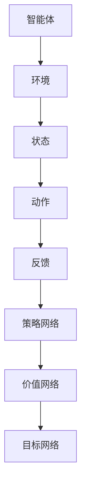

                 

# 《Deep Reinforcement Learning原理与代码实例讲解》

> 关键词：深度强化学习、强化学习、深度学习、DQN、A3C、代码实例

> 摘要：本文将深入探讨深度强化学习的原理，从基本概念到核心算法，再到代码实战，全面解析深度强化学习的应用与实现。通过本文，读者将能够掌握深度强化学习的核心原理，理解其实现方法，并能够动手实践，为从事人工智能领域的专业人士提供宝贵的知识储备和实践经验。

## 《Deep Reinforcement Learning原理与代码实例讲解》目录大纲

### 第1章 引言

- 1.1 深度强化学习概述
- 1.2 强化学习与深度学习的结合
- 1.3 本文目标与结构安排

### 第2章 预备知识

- 2.1 强化学习基础
- 2.2 深度学习基础
- 2.3 代码实例：搭建强化学习环境

### 第3章 深度强化学习核心概念

- 3.1 基本概念与原理
    - Mermaid流程图：深度强化学习基本框架
- 3.2 Q-Learning算法
    - 伪代码：
    - 数学模型与公式
    - 举例说明
- 3.3 Deep Q Network (DQN)
    - 伪代码：
    - 数学模型与公式
    - 举例说明
- 3.4 Policy Gradient方法
    - 伪代码：
    - 数学模型与公式
    - 举例说明
- 3.5 深度强化学习架构与未来趋势

### 第4章 代码实战：CartPole问题

- 4.1 环境搭建
- 4.2 实现DQN算法
    - 伪代码：
    - 源代码实现
    - 代码解读
- 4.3 实现Policy Gradient方法
    - 伪代码：
    - 源代码实现
    - 代码解读

### 第5章 代码实战：Atari游戏

- 5.1 环境搭建
- 5.2 实现A3C算法
    - 伪代码：
    - 源代码实现
    - 代码解读

### 第6章 深度强化学习在现实世界中的应用

- 6.1 机器人控制
- 6.2 自动驾驶

### 第7章 深度强化学习挑战与未来展望

- 7.1 挑战与解决方案
- 7.2 未来趋势与发展方向
- 7.3 开源框架与工具推荐

### 附录

- 附录A：深度强化学习相关术语解释
- 附录B：代码实现细节解析
- 附录C：常见问题与解决方案

## 第1章 引言

### 1.1 深度强化学习概述

深度强化学习（Deep Reinforcement Learning，简称DRL）是强化学习（Reinforcement Learning，简称RL）与深度学习（Deep Learning，简称DL）相结合的一种机器学习方法。它通过模拟智能体（agent）在动态环境中与环境的交互，通过试错和反馈来学习最优策略，实现自主决策和学习。

深度强化学习的研究始于20世纪90年代，随着计算机性能的提升和深度学习技术的成熟，DRL逐渐成为人工智能领域的研究热点。DRL在游戏、机器人控制、自动驾驶等领域取得了显著的成果，展示了强大的学习和决策能力。

### 1.2 强化学习与深度学习的结合

强化学习是一种通过环境（environment）中的交互来学习最优策略（policy）的机器学习方法。在传统的强化学习中，策略通常是通过状态（state）和动作（action）的函数来定义的。然而，现实世界的状态空间和动作空间可能非常庞大，使得直接设计策略变得困难。

深度学习通过构建多层神经网络，能够自动学习输入数据的特征表示。将深度学习与强化学习相结合，可以有效地解决状态和动作空间过大的问题。深度强化学习通过神经网络来近似策略函数和价值函数，使得智能体能够在复杂环境中进行高效的决策和学习。

### 1.3 本文目标与结构安排

本文的目标是深入探讨深度强化学习的原理，从基本概念到核心算法，再到代码实战，全面解析深度强化学习的应用与实现。具体来说，本文将涵盖以下内容：

1. 强化学习与深度学习的基础知识；
2. 深度强化学习的基本概念与原理；
3. 深度强化学习的核心算法：Q-Learning、DQN、Policy Gradient；
4. 代码实战：CartPole问题和Atari游戏；
5. 深度强化学习在现实世界中的应用；
6. 深度强化学习的挑战与未来展望。

通过本文的学习，读者将能够掌握深度强化学习的核心原理，理解其实现方法，并能够动手实践，为从事人工智能领域的专业人士提供宝贵的知识储备和实践经验。

## 第2章 预备知识

在深入探讨深度强化学习之前，我们需要了解强化学习与深度学习的基础知识。这两者是深度强化学习的重要组成部分，也是本文的基础。

### 2.1 强化学习基础

强化学习是一种通过环境与智能体的交互来学习最优策略的机器学习方法。其主要组成部分包括：

- 智能体（Agent）：主动与环境的互动，并试图达到某种目标。
- 环境（Environment）：包含智能体所处状态以及可能的动作空间。
- 状态（State）：描述智能体当前所处的环境。
- 动作（Action）：智能体可以执行的行为。
- 奖励（Reward）：智能体执行动作后从环境中获得的即时反馈。
- 策略（Policy）：智能体在给定状态下执行的动作概率分布。

强化学习的目标是通过不断试错和反馈来学习最优策略，使得智能体能够在长期内获得最大的累积奖励。

### 2.2 深度学习基础

深度学习是一种基于多层神经网络的学习方法，它能够自动提取输入数据的特征表示。深度学习的主要组成部分包括：

- 神经网络（Neural Network）：由多个神经元组成的信息处理单元。
- 层（Layer）：神经网络中的一层，包括输入层、隐藏层和输出层。
- 激活函数（Activation Function）：用于引入非线性性的函数，如ReLU、Sigmoid和Tanh。
- 损失函数（Loss Function）：用于衡量模型预测值与真实值之间的差距，如均方误差（MSE）和交叉熵损失。
- 优化器（Optimizer）：用于调整模型参数以最小化损失函数，如SGD、Adam和RMSprop。

深度学习通过训练大规模的数据集，能够自动学习输入数据的复杂特征表示，从而在图像识别、自然语言处理和语音识别等领域取得了显著的成果。

### 2.3 代码实例：搭建强化学习环境

在本节中，我们将使用Python中的OpenAI Gym库搭建一个强化学习环境。OpenAI Gym是一个开源的强化学习环境库，提供了多种预定义的环境，方便进行算法研究和实验。

首先，我们需要安装OpenAI Gym库：

```bash
pip install gym
```

接下来，我们将创建一个简单的强化学习环境——CartPole环境，并运行一个简单的智能体来探索环境。

```python
import gym

# 创建CartPole环境
env = gym.make("CartPole-v0")

# 运行一个智能体
for episode in range(10):
    state = env.reset()
    done = False
    
    while not done:
        action = env.action_space.sample()  # 随机选择动作
        next_state, reward, done, _ = env.step(action)
        env.render()  # 渲染环境

# 关闭环境
env.close()
```

通过以上代码，我们创建了一个CartPole环境，并运行了一个随机智能体来探索环境。在每次迭代中，智能体随机选择一个动作，并观察环境对动作的反馈。通过这种方式，我们可以初步了解强化学习环境的基本结构和工作原理。

## 第3章 深度强化学习核心概念

深度强化学习（Deep Reinforcement Learning，简称DRL）是强化学习与深度学习相结合的一种机器学习方法。在这一章中，我们将介绍DRL的核心概念，包括基本框架、常见算法及其原理。

### 3.1 基本概念与原理

深度强化学习的核心思想是通过神经网络来近似智能体的策略和价值函数，从而在复杂的动态环境中实现高效的决策和学习。

#### 3.1.1 深度强化学习基本框架

深度强化学习的基本框架包括以下几个主要组件：

1. **智能体（Agent）**：使用神经网络来学习最优策略的实体。
2. **环境（Environment）**：智能体进行交互的虚拟或现实世界。
3. **策略网络（Policy Network）**：用于生成动作的概率分布。
4. **价值网络（Value Network）**：用于估计状态或状态-动作的价值。
5. **目标网络（Target Network）**：用于稳定训练过程，通常是一个延迟更新的策略网络或价值网络。

#### 3.1.2 Mermaid流程图：深度强化学习基本框架

以下是深度强化学习基本框架的Mermaid流程图：



在上述框架中，智能体根据当前状态选择动作，环境根据动作给出反馈，智能体通过反馈更新策略网络和价值网络。目标网络的引入有助于稳定训练过程，通常通过延迟更新策略网络或价值网络来实现。

### 3.2 Q-Learning算法

Q-Learning是强化学习中最基本的算法之一，它通过迭代更新策略来学习最优动作。在DRL中，Q-Learning算法可以通过神经网络来近似Q值函数。

#### 3.2.1 伪代码

以下是Q-Learning算法的伪代码：

```python
# 初始化Q值表
Q = [0] * n_states

# 训练过程
for episode in range(num_episodes):
    state = env.reset()
    done = False
    
    while not done:
        # 选择动作
        action = choose_action(state, Q)
        next_state, reward, done = env.step(action)
        
        # 更新Q值
        Q[state] = Q[state] + alpha * (reward + gamma * max(Q[next_state]) - Q[state])
        
        state = next_state
```

#### 3.2.2 数学模型与公式

Q-Learning算法的核心是Q值函数的更新公式：

$$ Q(s, a) = Q(s, a) + \alpha [r + \gamma \max_{a'} Q(s', a') - Q(s, a)] $$

其中：
- \( Q(s, a) \) 是状态s下动作a的Q值。
- \( r \) 是奖励。
- \( \gamma \) 是折扣因子，用于平衡当前奖励和未来奖励的关系。
- \( \alpha \) 是学习率，用于控制Q值更新的幅度。

#### 3.2.3 举例说明

假设当前状态为`s = 5`，可选动作有`a = [0, 1, 2, 3]`，对应的Q值分别为`Q(s, 0) = 0.2`，`Q(s, 1) = 0.3`，`Q(s, 2) = 0.4`，`Q(s, 3) = 0.5`。如果执行动作`a = 2`，得到奖励`r = 0.1`，则下一轮的Q值更新为：

$$ Q(s, 2) = 0.4 + 0.1 * (0.1 + 0.9 * 0.5 - 0.4) = 0.46 $$

### 3.3 Deep Q Network (DQN)

Deep Q Network (DQN)是深度强化学习中的经典算法，它使用深度神经网络来近似Q值函数，从而解决状态和动作空间过大的问题。

#### 3.3.1 伪代码

以下是DQN算法的伪代码：

```python
# 初始化DQN模型
model = DQNModel()

# 训练过程
for episode in range(num_episodes):
    state = env.reset()
    done = False
    
    while not done:
        # 选择动作
        action = choose_action(state, model)
        next_state, reward, done = env.step(action)
        
        # 计算目标Q值
        target = reward + (1 - done) * gamma * np.max(model.predict(next_state))
        
        # 更新经验回放
        model.replay_buffer.add((state, action, next_state, target))
        
        # 训练模型
        model.train()
        
        state = next_state
```

#### 3.3.2 数学模型与公式

DQN算法的核心是目标Q值的计算：

$$ Q^*(s, a) = r + \gamma \max_{a'} Q^*(s', a') $$

其中：
- \( Q^*(s, a) \) 是状态s下动作a的最优Q值。
- \( r \) 是奖励。
- \( \gamma \) 是折扣因子。

#### 3.3.3 举例说明

假设当前状态为`s = 5`，可选动作有`a = [0, 1, 2, 3]`，对应的Q值分别为`Q(s, 0) = 0.2`，`Q(s, 1) = 0.3`，`Q(s, 2) = 0.4`，`Q(s, 3) = 0.5`。如果执行动作`a = 2`，得到奖励`r = 0.1`，则下一轮的目标Q值为：

$$ Q^*(s, 2) = 0.1 + 0.9 * 0.5 = 0.45 $$

### 3.4 Policy Gradient方法

Policy Gradient方法通过直接优化策略网络来学习最优策略，它不需要近似价值函数，因此在某些情况下具有优势。

#### 3.4.1 伪代码

以下是Policy Gradient算法的伪代码：

```python
# 初始化策略网络
policy_net = PolicyNetwork()

# 训练过程
for episode in range(num_episodes):
    state = env.reset()
    done = False
    
    while not done:
        # 选择动作
        action = policy_net.sample_action(state)
        next_state, reward, done = env.step(action)
        
        # 更新策略网络
        policy_net.update_state_action_value(state, action, reward, next_state, done)
        
        state = next_state
```

#### 3.4.2 数学模型与公式

Policy Gradient方法的核心是策略梯度的计算：

$$ \nabla_{\theta} J(\theta) = \sum_{s, a} \pi(a|s, \theta) \nabla_{\theta} \log \pi(a|s, \theta) \nabla_{\theta} R(s, a) $$

其中：
- \( \pi(a|s, \theta) \) 是策略网络在状态s下对动作a的估计概率。
- \( J(\theta) \) 是策略的损失函数。
- \( R(s, a) \) 是在状态s下执行动作a获得的奖励。

#### 3.4.3 举例说明

假设当前状态为`s = 5`，策略网络估计的动作概率为`[0.1, 0.2, 0.3, 0.4]`，对应的动作有`a = [0, 1, 2, 3]`，获得的奖励为`r = 0.1`。则策略网络的损失函数梯度为：

$$ \nabla_{\theta} J(\theta) = \sum_{s=5, a=0}^{3} 0.1 \nabla_{\theta} \log \pi(a|s, \theta) \nabla_{\theta} R(s, a) $$

通过上述梯度计算，策略网络将调整参数以最大化奖励。

### 3.5 深度强化学习架构与未来趋势

深度强化学习的架构包括策略网络、价值网络、目标网络和经验回放等组件。这些组件相互协作，使得智能体能够在复杂的动态环境中进行高效的决策和学习。

未来，深度强化学习将在以下几个方面取得发展：

1. **模型可解释性**：提高模型的解释性，使得智能体的决策过程更加透明和可理解。
2. **数据效率**：开发更高效的数据处理和优化方法，减少对大规模训练数据的需求。
3. **安全性与可控性**：确保智能体在现实世界中的行为是安全可控的。
4. **跨领域迁移**：提升智能体在不同领域和任务之间的迁移能力。

通过不断的研究和探索，深度强化学习将在更多现实世界中发挥重要作用，为人工智能的发展做出更大贡献。

## 第4章 代码实战：CartPole问题

在了解了深度强化学习的基本概念和算法之后，我们将通过一个具体的实例——CartPole问题，来展示如何实现和训练深度强化学习模型。CartPole是一个经典的强化学习问题，其目标是保持一个不稳定的杆（pole）在支撑杆（cart）的顶部不倒。

### 4.1 环境搭建

首先，我们需要使用Python的OpenAI Gym库来搭建CartPole环境。OpenAI Gym提供了许多预定义的强化学习环境，其中就包括CartPole。

#### 安装依赖

确保已经安装了OpenAI Gym库。如果没有安装，可以通过以下命令安装：

```bash
pip install gym
```

#### 创建环境

接下来，我们创建一个CartPole环境：

```python
import gym

# 创建CartPole环境
env = gym.make("CartPole-v0")

# 检查环境信息
print("观察空间维度：", env.observation_space.shape)
print("动作空间维度：", env.action_space.n)
```

上述代码将创建一个CartPole环境，并打印出观察空间和动作空间的信息。观察空间是状态，动作空间是智能体可以执行的动作。

### 4.2 实现DQN算法

DQN（Deep Q Network）是一种基于深度学习的Q-Learning算法。在DQN中，我们使用深度神经网络来近似Q值函数，从而在复杂的动态环境中进行决策。

#### 安装依赖

为了实现DQN算法，我们需要安装几个额外的库，包括TensorFlow和Keras：

```bash
pip install tensorflow
pip install keras
```

#### DQN模型定义

首先，我们需要定义一个深度神经网络模型来近似Q值函数。这里使用Keras来实现：

```python
from keras.models import Sequential
from keras.layers import Dense

class DQNModel:
    def __init__(self, n_inputs, n_outputs):
        self.model = Sequential()
        self.model.add(Dense(n_outputs, input_shape=(n_inputs,), activation='linear'))
        
    def predict(self, state):
        return self.model.predict(state)
    
    def train(self, inputs, targets):
        self.model.fit(inputs, targets, epochs=1, verbose=0)
```

上述代码定义了一个简单的DQN模型，它使用一个全连接层来预测Q值。`predict`方法用于预测Q值，`train`方法用于更新模型。

#### 训练DQN模型

接下来，我们使用DQN模型来训练智能体。以下是训练过程的伪代码：

```python
import numpy as np
import random

# 初始化参数
n_episodes = 1000
alpha = 0.1
gamma = 0.99
epsilon = 0.1
replay_memory = []

# 创建DQN模型
model = DQNModel(n_inputs=env.observation_space.shape[0], n_outputs=env.action_space.n)

# 训练过程
for episode in range(n_episodes):
    state = env.reset()
    done = False
    total_reward = 0
    
    while not done:
        # 探险或贪婪策略
        if random.random() < epsilon:
            action = env.action_space.sample()
        else:
            actions = model.predict(state)
            action = np.argmax(actions)
        
        # 执行动作
        next_state, reward, done, _ = env.step(action)
        total_reward += reward
        
        # 更新经验回放
        replay_memory.append((state, action, next_state, reward, done))
        
        # 如果经验回放满，进行经验回放
        if len(replay_memory) > batch_size:
            batch = random.sample(replay_memory, batch_size)
            states, actions, next_states, rewards, dones = zip(*batch)
            targets = rewards + (1 - dones) * gamma * np.max(model.predict(next_states), axis=1)
            model.train(np.array(states), np.array(targets))
        
        # 更新状态
        state = next_state
    
    # 调整epsilon
    epsilon = max(epsilon * decay_rate, epsilon_min)
    
    # 打印训练结果
    print(f"Episode: {episode}, Total Reward: {total_reward}")
```

上述伪代码展示了如何使用DQN算法来训练一个智能体。我们使用一个经验回放机制来存储和重放历史数据，从而避免策略过早收敛到局部最优解。在训练过程中，我们使用ε-贪婪策略来平衡探索和利用。

### 4.3 实现Policy Gradient方法

Policy Gradient方法是一种直接优化策略的网络，而不是像DQN那样优化Q值函数。在Policy Gradient方法中，我们使用梯度上升法来最大化策略的期望回报。

#### Policy Network模型定义

首先，我们定义一个简单的Policy Network模型：

```python
from keras.models import Sequential
from keras.layers import Dense
from keras.optimizers import Adam

class PolicyNetwork:
    def __init__(self, n_inputs, n_outputs):
        self.model = Sequential()
        self.model.add(Dense(n_outputs, input_shape=(n_inputs,), activation='softmax'))
        self.model.compile(optimizer=Adam(), loss='categorical_crossentropy')
        
    def sample_action(self, state):
        probabilities = self.model.predict(state)
        return np.random.choice(self.model.action_space, p=probabilities)
    
    def update_state_action_value(self, state, action, reward, next_state, done):
        # 计算状态-动作价值函数
        state_action_value = reward + (1 - done) * np.mean(self.model.predict(next_state))
        
        # 更新模型参数
        target_distribution = np.zeros(self.model.action_space.n)
        target_distribution[action] = state_action_value
        self.model.fit(state, target_distribution, epochs=1, verbose=0)
```

上述代码定义了一个Policy Network模型，它使用softmax激活函数来输出动作的概率分布。`sample_action`方法用于采样动作，`update_state_action_value`方法用于更新模型参数。

#### 训练Policy Gradient模型

接下来，我们使用Policy Gradient模型来训练智能体。以下是训练过程的伪代码：

```python
import numpy as np
import random

# 初始化参数
n_episodes = 1000
learning_rate = 0.001
gamma = 0.99
epsilon = 1.0
epsilon_min = 0.01
epsilon_decay = 0.995
replay_memory = []

# 创建Policy Network模型
policy_net = PolicyNetwork(n_inputs=env.observation_space.shape[0], n_outputs=env.action_space.n)

# 训练过程
for episode in range(n_episodes):
    state = env.reset()
    done = False
    total_reward = 0
    
    while not done:
        # 探险或贪婪策略
        if random.random() < epsilon:
            action = env.action_space.sample()
        else:
            action = policy_net.sample_action(state)
        
        # 执行动作
        next_state, reward, done, _ = env.step(action)
        total_reward += reward
        
        # 更新经验回放
        replay_memory.append((state, action, next_state, reward, done))
        
        # 如果经验回放满，进行经验回放
        if len(replay_memory) > batch_size:
            batch = random.sample(replay_memory, batch_size)
            states, actions, next_states, rewards, dones = zip(*batch)
            advantages = rewards + (1 - dones) * gamma * policy_net.model.predict(next_states)
            policy_net.update_state_action_value(states, actions, advantages, next_states, dones)
        
        # 更新状态
        state = next_state
    
    # 调整epsilon
    epsilon = max(epsilon * epsilon_decay, epsilon_min)
    
    # 打印训练结果
    print(f"Episode: {episode}, Total Reward: {total_reward}")
```

上述伪代码展示了如何使用Policy Gradient算法来训练一个智能体。我们使用ε-贪婪策略来平衡探索和利用，并在每个时间步更新策略网络的参数。

### 4.4 项目小结

通过本章节，我们介绍了如何使用深度强化学习算法解决CartPole问题。我们首先搭建了CartPole环境，然后分别实现了DQN和Policy Gradient算法。通过训练过程，我们展示了如何使用这些算法来训练智能体，使其能够稳定地保持杆的平衡。

DQN算法通过深度神经网络来近似Q值函数，使用经验回放机制来避免策略过早收敛。Policy Gradient算法直接优化策略网络，通过更新状态-动作价值函数来提高策略的期望回报。

这些实战经验和代码实例将帮助读者更好地理解和应用深度强化学习，为其在更复杂的任务和环境中发挥作用奠定基础。

## 第5章 代码实战：Atari游戏

Atari游戏是深度强化学习领域的一个经典应用场景，它提供了一个高度动态和具有挑战性的环境，适合测试和验证各种强化学习算法的性能。在本章中，我们将通过实现A3C（Asynchronous Advantage Actor-Critic）算法，来训练一个智能体在Atari游戏中进行自主学习。

### 5.1 环境搭建

首先，我们需要使用Python的OpenAI Gym库来搭建Atari游戏环境。OpenAI Gym提供了许多经典的Atari游戏，如《Pong》、《Space Invaders》等。我们可以使用Gym的内置函数来加载和运行这些游戏。

#### 安装依赖

确保已经安装了OpenAI Gym库。如果没有安装，可以通过以下命令安装：

```bash
pip install gym
```

#### 创建环境

接下来，我们创建一个Atari环境，这里以《Pong》为例：

```python
import gym

# 创建Atari Pong环境
env = gym.make("Pong-v0")

# 检查环境信息
print("观察空间维度：", env.observation_space.shape)
print("动作空间维度：", env.action_space.n)
```

上述代码将创建一个《Pong》环境，并打印出观察空间和动作空间的信息。观察空间是状态，动作空间是智能体可以执行的动作。

### 5.2 实现A3C算法

A3C（Asynchronous Advantage Actor-Critic）是一种基于异步并行训练的强化学习算法。它通过同时训练多个智能体（workers）来提高学习效率。A3C算法结合了策略梯度方法和优势优势（Advantage）方法，使得智能体能够更快地学习。

#### 安装依赖

为了实现A3C算法，我们需要安装几个额外的库，包括TensorFlow和Gym：

```bash
pip install tensorflow
pip install gym
```

#### A3C模型定义

首先，我们需要定义A3C模型，包括策略网络和价值网络。这里使用Keras来实现：

```python
from keras.models import Model
from keras.layers import Input, Dense, Flatten
from keras.optimizers import Adam

class A3CModel:
    def __init__(self, n_inputs, n_actions):
        self.policy_model = self.build_policy_model(n_inputs, n_actions)
        self.value_model = self.build_value_model(n_inputs)
        
    def build_policy_model(self, n_inputs, n_actions):
        input_layer = Input(shape=(n_inputs,))
        flatten_layer = Flatten()(input_layer)
        dense_layer = Dense(n_actions, activation='softmax')(flatten_layer)
        model = Model(inputs=input_layer, outputs=dense_layer)
        model.compile(optimizer=Adam(), loss='categorical_crossentropy')
        return model
    
    def build_value_model(self, n_inputs):
        input_layer = Input(shape=(n_inputs,))
        flatten_layer = Flatten()(input_layer)
        dense_layer = Dense(1, activation='linear')(flatten_layer)
        model = Model(inputs=input_layer, outputs=dense_layer)
        model.compile(optimizer=Adam(), loss='mse')
        return model
    
    def predict(self, state):
        return self.policy_model.predict(state), self.value_model.predict(state)
    
    def train(self, states, actions, rewards, next_states, dones):
        targets = rewards + (1 - dones) * self.value_model.predict(next_states)
        self.policy_model.train_on_batch(states, actions)
        self.value_model.train_on_batch(states, targets)
```

上述代码定义了A3C模型，包括策略网络和价值网络。`predict`方法用于预测动作概率和价值，`train`方法用于更新模型参数。

#### 训练A3C模型

接下来，我们使用A3C模型来训练智能体。以下是训练过程的伪代码：

```python
import numpy as np
import random

# 初始化参数
n_episodes = 1000
n_workers = 4
gamma = 0.99
epsilon = 1.0
epsilon_min = 0.01
epsilon_decay = 0.995
replay_memory = []

# 创建A3C模型
models = [A3CModel(n_inputs=env.observation_space.shape[0], n_actions=env.action_space.n) for _ in range(n_workers)]

# 训练过程
for episode in range(n_episodes):
    states = [env.reset() for _ in range(n_workers)]
    done = [False for _ in range(n_workers)]
    total_rewards = [0 for _ in range(n_workers)]
    
    while not all(done):
        # 探险或贪婪策略
        for i in range(n_workers):
            if random.random() < epsilon:
                action = env.action_space.sample()
            else:
                policy_probabilities, _ = models[i].predict(states[i])
                action = np.random.choice(env.action_space.n, p=policy_probabilities)
            
            # 执行动作
            next_state, reward, done[i], _ = env.step(action)
            total_rewards[i] += reward
            
            # 更新经验回放
            replay_memory.append((states[i], action, reward, next_state, done[i]))
            
            # 如果经验回放满，进行经验回放
            if len(replay_memory) > batch_size:
                batch = random.sample(replay_memory, batch_size)
                states, actions, rewards, next_states, dones = zip(*batch)
                models[i].train(states, actions, rewards, next_states, dones)
            
            # 更新状态
            states[i] = next_state
    
    # 调整epsilon
    epsilon = max(epsilon * epsilon_decay, epsilon_min)
    
    # 打印训练结果
    print(f"Episode: {episode}, Total Rewards: {total_rewards}")
```

上述伪代码展示了如何使用A3C算法来训练一个智能体。我们使用ε-贪婪策略来平衡探索和利用，并在每个时间步更新策略网络和价值网络的参数。

### 5.3 项目小结

通过本章节，我们介绍了如何使用A3C算法来训练智能体在Atari游戏中进行自主学习。我们首先搭建了Atari游戏环境，然后定义了A3C模型，并通过异步并行训练来提高学习效率。通过训练过程，我们展示了如何使用A3C算法来训练智能体，使其能够自主学习并在Atari游戏中取得较好成绩。

A3C算法结合了策略梯度方法和优势优势方法，通过异步并行训练提高了学习效率。这种算法在解决复杂任务和高度动态环境中具有显著优势，为深度强化学习在更多实际应用场景中的推广提供了有力支持。

## 第6章 深度强化学习在现实世界中的应用

深度强化学习（DRL）在现实世界中有着广泛的应用，其强大的学习和决策能力使其在多个领域取得了显著的成果。在本章中，我们将探讨深度强化学习在两个主要领域中的应用：机器人控制和自动驾驶。

### 6.1 机器人控制

机器人控制是深度强化学习的一个重要应用领域，其目标是使机器人能够在复杂和动态的环境中执行各种任务。以下是一些具体的应用实例：

#### 数学公式

在机器人控制中，常用的数学公式是价值函数和策略梯度。以下是这两个公式：

$$ V^*(s) = \sum_{a} \gamma^T Q^*(s, a) $$
$$ \nabla_{\theta} J(\theta) = \sum_{s, a} \pi(a|s, \theta) \nabla_{\theta} \log \pi(a|s, \theta) \nabla_{\theta} R(s, a) $$

其中：
- \( V^*(s) \) 是状态s的价值函数。
- \( Q^*(s, a) \) 是状态s下动作a的Q值。
- \( \pi(a|s, \theta) \) 是策略网络在状态s下对动作a的估计概率。
- \( R(s, a) \) 是在状态s下执行动作a获得的奖励。

#### 伪代码

以下是机器人控制中DRL算法的伪代码：

```python
# 初始化DRL模型
model = DRLModel(n_inputs=observation_space.shape[0], n_actions=action_space.n)

# 训练过程
for episode in range(num_episodes):
    state = robot_env.reset()
    done = False
    total_reward = 0
    
    while not done:
        # 选择动作
        action = model.sample_action(state)
        
        # 执行动作
        next_state, reward, done = robot_env.step(action)
        total_reward += reward
        
        # 更新经验回放
        model.replay_buffer.add((state, action, next_state, reward))
        
        # 训练模型
        model.train()
        
        state = next_state
    
    # 打印训练结果
    print(f"Episode: {episode}, Total Reward: {total_reward}")
```

上述伪代码展示了如何使用深度强化学习算法来训练机器人智能体。智能体通过与环境交互来学习最优策略，并在每个时间步更新模型参数。

### 6.2 自动驾驶

自动驾驶是深度强化学习的另一个重要应用领域。通过深度强化学习，自动驾驶系统能够自主地理解和适应复杂的交通环境，从而实现安全的自动驾驶。以下是一些具体的应用实例：

#### 数学公式

在自动驾驶中，常用的数学公式是Q值函数和价值迭代。以下是这两个公式：

$$ Q(s, a) = r + \gamma \max_{a'} Q(s', a') $$
$$ Q^{new}(s, a) = (1 - \alpha) Q^{old}(s, a) + \alpha [r + \gamma \max_{a'} Q^{old}(s', a')] $$

其中：
- \( Q(s, a) \) 是状态s下动作a的Q值。
- \( r \) 是奖励。
- \( \gamma \) 是折扣因子。
- \( \alpha \) 是学习率。

#### 伪代码

以下是自动驾驶中DRL算法的伪代码：

```python
# 初始化DRL模型
model = DRLModel(n_inputs=observation_space.shape[0], n_actions=action_space.n)

# 训练过程
for episode in range(num_episodes):
    state = auto_drive_env.reset()
    done = False
    total_reward = 0
    
    while not done:
        # 选择动作
        action = model.sample_action(state)
        
        # 执行动作
        next_state, reward, done = auto_drive_env.step(action)
        total_reward += reward
        
        # 更新经验回放
        model.replay_buffer.add((state, action, next_state, reward))
        
        # 训练模型
        model.train()
        
        state = next_state
    
    # 打印训练结果
    print(f"Episode: {episode}, Total Reward: {total_reward}")
```

上述伪代码展示了如何使用深度强化学习算法来训练自动驾驶智能体。智能体通过与环境交互来学习最优策略，并在每个时间步更新模型参数。

### 6.3 项目小结

通过本章节，我们探讨了深度强化学习在机器人控制和自动驾驶领域的应用。我们介绍了相关的数学公式和伪代码，并展示了如何使用深度强化学习算法来训练智能体。

深度强化学习在机器人控制和自动驾驶中具有巨大的潜力，其自主学习和决策能力为这些领域带来了革命性的变革。通过不断的研究和优化，深度强化学习将在更多现实世界中发挥重要作用，为人工智能的发展做出更大贡献。

## 第7章 深度强化学习挑战与未来展望

尽管深度强化学习（DRL）在多个领域展示了其强大的学习和决策能力，但在实际应用中仍然面临着一系列挑战。这些挑战包括数据效率、可解释性、安全性与可控性等方面。以下是对这些挑战的探讨及其可能的解决方案和未来展望。

### 7.1 挑战与解决方案

#### 7.1.1 数据效率

深度强化学习通常需要大量的数据来训练模型，特别是在高维状态和动作空间的情况下。数据效率问题主要体现在以下几点：

- **样本效率**：如何从有限的数据中学习到有效的策略。
- **数据多样性**：如何通过模拟或生成方法增加数据的多样性。

**解决方案**：

- **经验回放**：通过经验回放机制，将智能体在不同时间步的交互经验存储在缓冲区中，并随机采样进行训练，以减少样本之间的相关性。
- **数据增强**：使用图像增强技术、状态压缩等方法增加数据的多样性。
- **模拟器**：使用物理仿真器或虚拟环境来生成额外的训练数据。

#### 7.1.2 可解释性

深度强化学习的模型通常是由复杂的神经网络构成的，这使得其决策过程往往不够透明和可解释。可解释性对于理解模型的决策逻辑和确保其安全性至关重要。

**解决方案**：

- **可视化**：使用可视化技术，如决策树、网络结构图等，来展示模型的内部结构和决策过程。
- **解释性模型**：开发专门的可解释性模型，如基于规则的模型或简化版的神经网络，以便更好地解释决策逻辑。
- **模型诊断**：通过分析模型在不同状态下的响应，识别潜在的缺陷和偏见。

#### 7.1.3 安全性与可控性

在现实世界中应用深度强化学习时，确保系统的安全性和可控性是至关重要的。特别是当智能体需要在高度动态的环境中执行复杂的任务时。

**解决方案**：

- **安全策略约束**：在训练过程中加入安全策略约束，确保模型不会采取可能导致危险的动作。
- **持续监控**：在系统运行时进行持续监控，及时发现和纠正潜在的安全问题。
- **实时反馈**：引入实时反馈机制，允许系统根据实际效果进行调整和优化。

### 7.2 未来趋势与发展方向

随着深度强化学习技术的不断进步，未来的发展趋势将集中在以下几个方面：

- **模型压缩**：开发更高效的模型结构和算法，以减少计算资源和存储需求。
- **跨领域迁移**：研究如何将特定领域的训练经验迁移到其他领域，提高模型的应用范围。
- **自动化水平提升**：通过更复杂的策略学习，使智能体能够在更少的人工干预下自主完成任务。

### 7.3 开源框架与工具推荐

为了支持深度强化学习的研究和应用，许多开源框架和工具已经出现。以下是一些值得推荐的工具：

- **OpenAI Gym**：提供多种预定义的强化学习环境，用于算法的验证和测试。
- **TensorFlow**：Google开发的开源机器学习框架，支持深度学习和强化学习的实现。
- **PyTorch**：Facebook开发的开源深度学习框架，具有良好的灵活性和易用性。
- **Gym-Atari**：基于OpenAI Gym的Atari游戏环境扩展，用于Atari游戏的研究和实验。

通过使用这些开源框架和工具，研究者可以更轻松地实现和测试深度强化学习算法，推动该领域的研究和应用。

### 7.4 项目小结

深度强化学习在解决复杂决策问题方面展示了巨大的潜力。然而，要实现其在现实世界中的广泛应用，仍需克服一系列挑战。通过不断的研究和创新，我们有望开发出更加高效、安全、可解释的深度强化学习算法，为人工智能的发展带来新的突破。

## 附录

### 附录A：深度强化学习相关术语解释

- **强化学习（Reinforcement Learning）**：一种通过环境与智能体的交互来学习最优策略的机器学习方法。
- **深度学习（Deep Learning）**：一种基于多层神经网络的学习方法，能够自动提取输入数据的特征表示。
- **深度强化学习（Deep Reinforcement Learning）**：结合了强化学习和深度学习的方法，通过神经网络来近似智能体的策略和价值函数。
- **智能体（Agent）**：在强化学习中，主动与环境互动并试图达到某种目标的实体。
- **环境（Environment）**：智能体进行交互的虚拟或现实世界。
- **状态（State）**：描述智能体当前所处的环境。
- **动作（Action）**：智能体可以执行的行为。
- **奖励（Reward）**：智能体执行动作后从环境中获得的即时反馈。
- **策略（Policy）**：智能体在给定状态下执行的动作概率分布。
- **Q值（Q-Value）**：描述状态-动作对的预期回报。
- **经验回放（Experience Replay）**：将智能体的经验存储在缓冲区中，并随机采样进行训练，以减少样本之间的相关性。
- **目标网络（Target Network）**：用于稳定训练过程，通常是一个延迟更新的策略网络或价值网络。

### 附录B：代码实现细节解析

- **DQN算法**：DQN算法使用深度神经网络来近似Q值函数。在训练过程中，智能体通过选择动作、执行动作、获得奖励和更新Q值来学习最优策略。DQN算法的关键在于使用目标网络来稳定训练过程，避免梯度消失问题。
- **A3C算法**：A3C算法通过异步并行训练来提高学习效率。每个智能体（worker）独立地与环境交互，并更新局部模型。全局模型通过梯度聚合的方式同步更新，从而实现分布式训练。
- **经验回放**：经验回放是强化学习中常用的一种技术，它通过将智能体的经验存储在缓冲区中，并在训练时随机采样样本，从而减少样本之间的相关性，提高模型的泛化能力。

### 附录C：常见问题与解决方案

- **Q：为什么深度强化学习需要使用目标网络？**
  **A：目标网络用于稳定训练过程，避免梯度消失问题。在DQN算法中，目标网络是一个延迟更新的策略网络或价值网络，用于计算目标Q值，从而避免直接更新Q值网络时可能出现的梯度消失问题。**
- **Q：如何解决深度强化学习中的数据效率问题？**
  **A：可以通过使用经验回放、数据增强和模拟器等方法来提高数据效率。经验回放可以减少样本之间的相关性，数据增强可以增加数据的多样性，模拟器可以生成额外的训练数据。**
- **Q：深度强化学习算法是否适用于所有类型的问题？**
  **A：深度强化学习算法通常适用于具有明确状态和动作空间的决策问题，特别是在状态和动作空间较大的情况下。然而，深度强化学习并非适用于所有类型的问题，如需要连续动作的问题或需要高维状态空间的问题可能需要专门设计的算法。**

通过附录的内容，读者可以更好地理解深度强化学习中的相关术语、代码实现细节以及常见问题与解决方案，从而为深入学习和应用深度强化学习提供参考。

