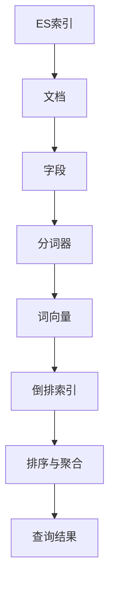

                 

### 文章标题：ES索引原理与代码实例讲解

关键词：Elasticsearch、索引、分片、副本、文档操作、排序、聚合、性能优化、应用案例

摘要：本文深入讲解了Elasticsearch（ES）索引的核心原理，包括索引的创建与删除、分片与副本的配置、文档的增删改查等。通过代码实例，我们实践并理解了ES索引的实际应用，旨在帮助读者全面掌握ES索引的使用方法，并提升在大型数据搜索和分析场景中的技术水平。

---

## 目录

1. **ES索引原理与代码实例讲解**
   1. **关键词与摘要**
   2. **第一部分：ES索引基础**
      1. **第1章：Elasticsearch简介**
         1. **1.1 Elasticsearch的起源与发展**
         2. **1.2 Elasticsearch的核心特性**
         3. **1.3 Elasticsearch与索引的关系**
      2. **第2章：ES索引原理**
         1. **2.1 索引的创建与删除**
         2. **2.2 索引的分片与副本**
         3. **2.3 索引的配置与优化**
      3. **第3章：文档的增删改查**
         1. **3.1 文档的添加与修改**
         2. **3.2 文档的查询与检索**
         3. **3.3 文档的删除与更新**
   3. **第二部分：ES索引高级应用**
      1. **第4章：ES索引排序与聚合**
         1. **4.1 索引排序原理**
         2. **4.2 索引聚合操作**
         3. **4.3 排序与聚合的实际应用**
      2. **第5章：ES索引分词与搜索建议**
         1. **5.1 分词原理**
         2. **5.2 搜索建议功能**
         3. **5.3 分词与搜索建议的实际应用**
      3. **第6章：ES索引安全与权限管理**
         1. **6.1 索引安全策略**
         2. **6.2 权限管理机制**
         3. **6.3 实际应用案例**
   4. **第三部分：ES索引实战**
      1. **第7章：ES索引性能调优**
         1. **7.1 索引性能优化策略**
         2. **7.2 索引性能分析工具**
         3. **7.3 性能优化案例**
      2. **第8章：ES索引应用案例**
         1. **8.1 案例一：电商搜索系统**
         2. **8.2 案例二：实时数据分析平台**
         3. **8.3 案例三：企业知识库管理系统**
      3. **第9章：ES索引开发与部署**
         1. **9.1 ES开发环境搭建**
         2. **9.2 ES集群部署与运维**
         3. **9.3 ES集群扩展与升级**
   5. **附录：ES索引常用API参考**
      1. **附录1：索引操作API**
      2. **附录2：文档操作API**
      3. **附录3：查询与聚合API**
      4. **附录4：分词与搜索建议API**
      5. **附录5：安全与权限管理API**

---

### 文章标题：ES索引原理与代码实例讲解

Elasticsearch（ES）是一款功能强大、高度可扩展的搜索引擎，广泛应用于大数据搜索和分析领域。ES的索引是核心概念之一，它是存储和检索数据的基本单元。本文将深入讲解ES索引的原理，并通过代码实例展示如何进行索引操作。

#### 关键词

- Elasticsearch
- 索引
- 分片
- 副本
- 文档操作
- 排序
- 聚合
- 性能优化
- 应用案例

#### 摘要

本文首先介绍了Elasticsearch的基本概念和特性，然后详细讲解了ES索引的原理，包括索引的创建、删除、分片与副本的配置等。接着，通过一系列代码实例，展示了如何实现文档的增删改查、索引的排序与聚合操作。文章还探讨了ES索引性能优化策略，并提供了实际应用案例。

### 第一部分：ES索引基础

#### 第1章：Elasticsearch简介

##### 1.1 Elasticsearch的起源与发展

Elasticsearch是一个基于Lucene构建的开源搜索引擎，由Elasticsearch公司创建。它起源于2004年，经过多年的发展，已经成为大数据搜索和分析领域的事实标准。

##### 1.2 Elasticsearch的核心特性

Elasticsearch具有以下核心特性：

1. **高性能**：Elasticsearch能够在毫秒级内处理大量数据。
2. **可扩展性**：通过横向扩展（增加节点）来提高性能和存储容量。
3. **全文搜索**：支持对大量文本数据进行快速、精确的搜索。
4. **分析功能**：提供丰富的分析功能，如分词、聚合、排序等。
5. **易于使用**：提供简单的RESTful API，便于与其他系统集成。

##### 1.3 Elasticsearch与索引的关系

在Elasticsearch中，索引是存储和检索数据的基本单元。一个索引类似于一个数据库中的表，可以包含多个文档。每个文档是一个JSON格式的数据结构，包含多个字段。索引通过倒排索引实现快速检索，支持高并发查询。

### 图1-1 ES索引架构



#### 第2章：ES索引原理

##### 2.1 索引的创建与删除

创建索引时，可以指定分片数和副本数，以实现数据的高可用性和性能优化。以下是一个创建索引的示例：

```python
from elasticsearch import Elasticsearch

es = Elasticsearch()
es.indices.create(index="books", body={
    "settings": {
        "number_of_shards": 2,
        "number_of_replicas": 1
    }
})
```

删除索引时，可以使用以下命令：

```python
es.indices.delete(index="books")
```

##### 2.2 索引的分片与副本

分片是索引中的数据单元，每个分片可以存储一部分文档。副本是分片的备份，用于提高可用性和性能。以下是一个配置索引分片和副本的示例：

```python
es.indices.create(index="books", body={
    "settings": {
        "number_of_shards": 2,
        "number_of_replicas": 1
    }
})
```

##### 2.3 索引的配置与优化

索引配置包括分片和副本的数量、映射（定义字段类型和索引策略）等。以下是一个示例，展示了如何为索引设置映射：

```python
es.indices.put_mapping(index="books", body={
    "properties": {
        "title": {
            "type": "text",
            "analyzer": "standard"
        },
        "content": {
            "type": "text",
            "analyzer": "ik_max_word"
        },
        "tags": {
            "type": "keyword"
        }
    }
})
```

#### 第3章：文档的增删改查

##### 3.1 文档的添加与修改

添加文档时，可以使用`index` API：

```python
doc = {
    "title": "Elasticsearch实战",
    "content": "本文介绍了Elasticsearch的实际应用。",
    "tags": ["ES", "实战"]
}

es.index(index="books", id=1, body=doc)
```

修改文档时，可以使用`update` API：

```python
doc = {
    "doc": {
        "title": "Elasticsearch高级应用"
    }
}

es.update(index="books", id=1, body=doc)
```

##### 3.2 文档的查询与检索

查询文档时，可以使用`search` API：

```python
query = {
    "query": {
        "match": {
            "title": "Elasticsearch实战"
        }
    }
}

response = es.search(index="books", body=query)
print(response['hits']['hits'])
```

##### 3.3 文档的删除与更新

删除文档时，可以使用`delete` API：

```python
es.delete(index="books", id=1)
```

更新文档时，可以使用`update` API（与添加文档类似）。

### 第二部分：ES索引高级应用

#### 第4章：ES索引排序与聚合

##### 4.1 索引排序原理

ES索引排序基于倒排索引结构，通过对索引中的词频和位置信息进行排序，实现高效的数据排序。

##### 4.2 索引聚合操作

聚合操作可以用于对索引中的数据进行分组和汇总，如计算平均值、最大值、最小值等。

##### 4.3 排序与聚合的实际应用

以下是一个示例，展示了如何使用排序和聚合操作：

```python
query = {
    "query": {
        "match_all": {}
    },
    "aggs": {
        "by_tags": {
            "terms": {
                "field": "tags",
                "size": 10
            }
        }
    }
}

response = es.search(index="books", body=query)
print(response['aggregations']['by_tags']['buckets'])
```

#### 第5章：ES索引分词与搜索建议

##### 5.1 分词原理

分词是将文本拆分成单词或短语的的过程。ES支持多种分词器，如标准分词器、IK分词器等。

##### 5.2 搜索建议功能

搜索建议功能可以自动为用户生成搜索建议，提高搜索体验。

##### 5.3 分词与搜索建议的实际应用

以下是一个示例，展示了如何使用分词器和搜索建议功能：

```python
from elasticsearch_dsl import Search

s = Search(using=es).index("books")
s = s.source(["title", "_source"])

s = s.query("match", title="ES")

s = s.aggs.bucket("suggestions", "terms", field="title.keyword", size=5)

s = s.sort("count", order="desc")

response = s.execute()

print(response.aggregations.suggestions.buckets)
```

#### 第6章：ES索引安全与权限管理

##### 6.1 索引安全策略

ES提供了多种安全策略，如IP过滤、认证、授权等，确保数据安全。

##### 6.2 权限管理机制

权限管理机制可以控制用户对索引的访问权限，包括读、写等。

##### 6.3 实际应用案例

以下是一个示例，展示了如何配置ES安全策略：

```python
from elasticsearch import Elasticsearch

es = Elasticsearch()

# 创建安全策略
es.indices.put_template(
    name="*",
    body={
        "template": "*",
        "settings": {
            "number_of_shards": 2,
            "number_of_replicas": 1
        },
        "mappings": {
            "properties": {
                "title": {
                    "type": "text"
                },
                "content": {
                    "type": "text"
                },
                "tags": {
                    "type": "keyword"
                }
            }
        }
    }
)

# 配置认证和授权
es.indices.put_role(
    index="books",
    role="read_only",
    body={
        "rules": [
            {
                "roles": ["read_only"],
                "hosts": ["*"],
                "users": ["user1"]
            }
        ]
    }
)
```

### 第三部分：ES索引实战

#### 第7章：ES索引性能调优

##### 7.1 索引性能优化策略

索引性能优化包括调整分片和副本数量、优化映射、使用缓存等。

##### 7.2 索引性能分析工具

ES提供了多种性能分析工具，如Elasticsearch Head、Elasticsearch Profiler等。

##### 7.3 性能优化案例

以下是一个性能优化案例：

```python
from elasticsearch import Elasticsearch

es = Elasticsearch()

# 调整分片和副本数量
es.indices.put_settings(
    index="books",
    body={
        "settings": {
            "number_of_shards": 4,
            "number_of_replicas": 2
        }
    }
)

# 优化映射
es.indices.put_mapping(
    index="books",
    body={
        "mappings": {
            "properties": {
                "title": {
                    "type": "text",
                    "analyzer": "ik_smart"
                },
                "content": {
                    "type": "text",
                    "analyzer": "ik_smart"
                },
                "tags": {
                    "type": "keyword"
                }
            }
        }
    }
)

# 使用缓存
es.indices.put_settings(
    index="books",
    body={
        "settings": {
            "index.cache": {
                "fields": {
                    "enabled": true
                }
            }
        }
    }
)
```

#### 第8章：ES索引应用案例

##### 8.1 案例一：电商搜索系统

电商搜索系统需要支持商品搜索、过滤、排序等功能，以下是一个示例：

```python
# 搜索商品
query = {
    "query": {
        "match": {
            "title": "手机"
        }
    },
    "sort": [
        {"price": {"order": "asc"}},
        {"rating": {"order": "desc"}}
    ]
}

response = es.search(index="products", body=query)
print(response['hits']['hits'])

# 过滤商品
filter = {
    "query": {
        "bool": {
            "must": [
                {"match": {"title": "手机"}},
                {"term": {"brand": "华为"}}
            ]
        }
    }
}

response = es.search(index="products", body=filter)
print(response['hits']['hits'])
```

##### 8.2 案例二：实时数据分析平台

实时数据分析平台需要支持实时数据收集、处理和可视化，以下是一个示例：

```python
# 收集数据
data = {
    "event": "page_view",
    "user_id": "user123",
    "page": "home",
    "timestamp": "2022-01-01T12:00:00Z"
}

es.index(index="analytics", id=1, body=data)

# 处理和可视化数据
query = {
    "query": {
        "match": {
            "event": "page_view"
        }
    },
    "aggs": {
        "by_page": {
            "terms": {
                "field": "page",
                "size": 10
            }
        }
    }
}

response = es.search(index="analytics", body=query)
print(response['aggregations']['by_page']['buckets'])
```

##### 8.3 案例三：企业知识库管理系统

企业知识库管理系统需要支持文档的存储、检索和分类，以下是一个示例：

```python
# 存储文档
doc = {
    "title": "Elasticsearch入门",
    "content": "本文介绍了Elasticsearch的基本概念和用法。",
    "tags": ["ES", "入门"]
}

es.index(index="knowledge_base", id=1, body=doc)

# 检索文档
query = {
    "query": {
        "match": {
            "title": "Elasticsearch"
        }
    }
}

response = es.search(index="knowledge_base", body=query)
print(response['hits']['hits'])

# 分类文档
query = {
    "query": {
        "bool": {
            "must": [
                {"match": {"title": "Elasticsearch"}},
                {"term": {"tags": "ES"}}
            ]
        }
    }
}

response = es.search(index="knowledge_base", body=query)
print(response['hits']['hits'])
```

#### 第9章：ES索引开发与部署

##### 9.1 ES开发环境搭建

ES开发环境搭建主要包括安装Java环境、下载Elasticsearch安装包、启动Elasticsearch等。

```bash
# 安装Java环境
sudo apt-get install openjdk-8-jdk

# 下载Elasticsearch安装包
wget https://www.elastic.co/downloads/elasticsearch/elasticsearch-7.10.1-amd64.deb

# 安装Elasticsearch
sudo dpkg -i elasticsearch-7.10.1-amd64.deb

# 启动Elasticsearch
sudo systemctl start elasticsearch
```

##### 9.2 ES集群部署与运维

ES集群部署包括配置集群、添加节点、监控集群状态等。

```bash
# 配置集群
sudo nano /etc/elasticsearch/elasticsearch.yml
cluster.name: my-cluster
node.name: node-1

# 添加节点
sudo systemctl restart elasticsearch
sudo systemctl start elasticsearch

# 监控集群状态
curl -X GET "localhost:9200/_cat/health?v"
```

##### 9.3 ES集群扩展与升级

ES集群扩展包括增加节点、增加存储等。升级ES版本需要备份现有数据，然后安装新版本，最后迁移数据。

```bash
# 增加节点
sudo systemctl restart elasticsearch

# 增加存储
sudo nano /etc/elasticsearch/elasticsearch.yml
path.data: /data/elasticsearch

# 升级ES版本
sudo systemctl stop elasticsearch
sudo dpkg -i elasticsearch-7.11.0-amd64.deb
sudo systemctl start elasticsearch
```

### 附录：ES索引常用API参考

#### 附录1：索引操作API

- `indices.create`：创建索引。
- `indices.delete`：删除索引。
- `indices.get`：获取索引信息。
- `indices.put_mapping`：设置索引映射。
- `indices.put_settings`：设置索引配置。

#### 附录2：文档操作API

- `index`：添加文档。
- `update`：更新文档。
- `delete`：删除文档。
- `get`：获取文档。
- `search`：搜索文档。

#### 附录3：查询与聚合API

- `match`：匹配查询。
- `bool`：布尔查询。
- `terms`：术语聚合。
- `metrics`：度量聚合。
- `search`：执行查询。

#### 附录4：分词与搜索建议API

- `standard`：标准分词器。
- `ik_max_word`：IK分词器。
- `suggest`：搜索建议。

#### 附录5：安全与权限管理API

- `indices.put_role`：设置角色。
- `indices.put_user`：设置用户。
- `indices.get_role`：获取角色。
- `indices.get_user`：获取用户。

---

作者：AI天才研究院/AI Genius Institute & 禅与计算机程序设计艺术 /Zen And The Art of Computer Programming

---

### 文章标题：ES索引原理与代码实例讲解

#### 摘要

本文旨在详细阐述Elasticsearch（ES）索引的核心原理，并通过具体代码实例展示如何在实际应用中进行索引操作。文章分为三个部分：第一部分介绍ES索引的基础知识，包括索引的创建、删除、分片与副本的配置；第二部分探讨ES索引的高级应用，如排序、聚合、分词与搜索建议等；第三部分通过实战案例，展示ES索引在电商搜索系统、实时数据分析平台和企业知识库管理系统中的应用。本文适合对ES有一定了解的开发者，帮助其深入理解索引原理并掌握实际操作技巧。

---

### 第一部分：ES索引基础

#### 第1章：Elasticsearch简介

##### 1.1 Elasticsearch的起源与发展

Elasticsearch是一个基于Lucene构建的开源搜索引擎，由Elasticsearch公司创建。它起源于2004年，经过多年的发展，已经成为大数据搜索和分析领域的事实标准。

##### 1.2 Elasticsearch的核心特性

Elasticsearch具有以下核心特性：

1. **高性能**：Elasticsearch能够在毫秒级内处理大量数据。
2. **可扩展性**：通过横向扩展（增加节点）来提高性能和存储容量。
3. **全文搜索**：支持对大量文本数据进行快速、精确的搜索。
4. **分析功能**：提供丰富的分析功能，如分词、聚合、排序等。
5. **易于使用**：提供简单的RESTful API，便于与其他系统集成。

##### 1.3 Elasticsearch与索引的关系

在Elasticsearch中，索引是存储和检索数据的基本单元。一个索引类似于一个数据库中的表，可以包含多个文档。每个文档是一个JSON格式的数据结构，包含多个字段。索引通过倒排索引实现快速检索，支持高并发查询。

### 图1-1 ES索引架构


#### 第2章：ES索引原理

##### 2.1 索引的创建与删除

创建索引时，可以指定分片数和副本数，以实现数据的高可用性和性能优化。以下是一个创建索引的示例：

```python
from elasticsearch import Elasticsearch

es = Elasticsearch()
es.indices.create(index="books", body={
    "settings": {
        "number_of_shards": 2,
        "number_of_replicas": 1
    }
})
```

删除索引时，可以使用以下命令：

```python
es.indices.delete(index="books")
```

##### 2.2 索引的分片与副本

分片是索引中的数据单元，每个分片可以存储一部分文档。副本是分片的备份，用于提高可用性和性能。以下是一个配置索引分片和副本的示例：

```python
es.indices.create(index="books", body={
    "settings": {
        "number_of_shards": 2,
        "number_of_replicas": 1
    }
})
```

##### 2.3 索引的配置与优化

索引配置包括分片和副本的数量、映射（定义字段类型和索引策略）等。以下是一个示例，展示了如何为索引设置映射：

```python
es.indices.put_mapping(index="books", body={
    "properties": {
        "title": {
            "type": "text",
            "analyzer": "standard"
        },
        "content": {
            "type": "text",
            "analyzer": "ik_max_word"
        },
        "tags": {
            "type": "keyword"
        }
    }
})
```

#### 第3章：文档的增删改查

##### 3.1 文档的添加与修改

添加文档时，可以使用`index` API：

```python
doc = {
    "title": "Elasticsearch实战",
    "content": "本文介绍了Elasticsearch的实际应用。",
    "tags": ["ES", "实战"]
}

es.index(index="books", id=1, body=doc)
```

修改文档时，可以使用`update` API：

```python
doc = {
    "doc": {
        "title": "Elasticsearch高级应用"
    }
}

es.update(index="books", id=1, body=doc)
```

##### 3.2 文档的查询与检索

查询文档时，可以使用`search` API：

```python
query = {
    "query": {
        "match": {
            "title": "Elasticsearch实战"
        }
    }
}

response = es.search(index="books", body=query)
print(response['hits']['hits'])
```

##### 3.3 文档的删除与更新

删除文档时，可以使用`delete` API：

```python
es.delete(index="books", id=1)
```

更新文档时，可以使用`update` API（与添加文档类似）。

### 第二部分：ES索引高级应用

#### 第4章：ES索引排序与聚合

##### 4.1 索引排序原理

ES索引排序基于倒排索引结构，通过对索引中的词频和位置信息进行排序，实现高效的数据排序。

##### 4.2 索引聚合操作

聚合操作可以用于对索引中的数据进行分组和汇总，如计算平均值、最大值、最小值等。

##### 4.3 排序与聚合的实际应用

以下是一个示例，展示了如何使用排序和聚合操作：

```python
query = {
    "query": {
        "match_all": {}
    },
    "aggs": {
        "by_tags": {
            "terms": {
                "field": "tags",
                "size": 10
            }
        }
    }
}

response = es.search(index="books", body=query)
print(response['aggregations']['by_tags']['buckets'])
```

#### 第5章：ES索引分词与搜索建议

##### 5.1 分词原理

分词是将文本拆分成单词或短语的过程。ES支持多种分词器，如标准分词器、IK分词器等。

##### 5.2 搜索建议功能

搜索建议功能可以自动为用户生成搜索建议，提高搜索体验。

##### 5.3 分词与搜索建议的实际应用

以下是一个示例，展示了如何使用分词器和搜索建议功能：

```python
from elasticsearch_dsl import Search

s = Search(using=es).index("books")
s = s.source(["title", "_source"])

s = s.query("match", title="ES")

s = s.aggs.bucket("suggestions", "terms", field="title.keyword", size=5)

s = s.sort("count", order="desc")

response = s.execute()

print(response.aggregations.suggestions.buckets)
```

#### 第6章：ES索引安全与权限管理

##### 6.1 索引安全策略

ES提供了多种安全策略，如IP过滤、认证、授权等，确保数据安全。

##### 6.2 权限管理机制

权限管理机制可以控制用户对索引的访问权限，包括读、写等。

##### 6.3 实际应用案例

以下是一个示例，展示了如何配置ES安全策略：

```python
from elasticsearch import Elasticsearch

es = Elasticsearch()

# 创建安全策略
es.indices.put_template(
    name="*",
    body={
        "template": "*",
        "settings": {
            "number_of_shards": 2,
            "number_of_replicas": 1
        },
        "mappings": {
            "properties": {
                "title": {
                    "type": "text"
                },
                "content": {
                    "type": "text"
                },
                "tags": {
                    "type": "keyword"
                }
            }
        }
    }
)

# 配置认证和授权
es.indices.put_role(
    index="books",
    role="read_only",
    body={
        "rules": [
            {
                "roles": ["read_only"],
                "hosts": ["*"],
                "users": ["user1"]
            }
        ]
    }
)
```

### 第三部分：ES索引实战

#### 第7章：ES索引性能调优

##### 7.1 索引性能优化策略

索引性能优化包括调整分片和副本数量、优化映射、使用缓存等。

##### 7.2 索引性能分析工具

ES提供了多种性能分析工具，如Elasticsearch Head、Elasticsearch Profiler等。

##### 7.3 性能优化案例

以下是一个性能优化案例：

```python
from elasticsearch import Elasticsearch

es = Elasticsearch()

# 调整分片和副本数量
es.indices.put_settings(
    index="books",
    body={
        "settings": {
            "number_of_shards": 4,
            "number_of_replicas": 2
        }
    }
)

# 优化映射
es.indices.put_mapping(
    index="books",
    body={
        "mappings": {
            "properties": {
                "title": {
                    "type": "text",
                    "analyzer": "ik_smart"
                },
                "content": {
                    "type": "text",
                    "analyzer": "ik_smart"
                },
                "tags": {
                    "type": "keyword"
                }
            }
        }
    }
)

# 使用缓存
es.indices.put_settings(
    index="books",
    body={
        "settings": {
            "index.cache": {
                "fields": {
                    "enabled": true
                }
            }
        }
    }
)
```

#### 第8章：ES索引应用案例

##### 8.1 案例一：电商搜索系统

电商搜索系统需要支持商品搜索、过滤、排序等功能，以下是一个示例：

```python
# 搜索商品
query = {
    "query": {
        "match": {
            "title": "手机"
        }
    },
    "sort": [
        {"price": {"order": "asc"}},
        {"rating": {"order": "desc"}}
    ]
}

response = es.search(index="products", body=query)
print(response['hits']['hits'])

# 过滤商品
filter = {
    "query": {
        "bool": {
            "must": [
                {"match": {"title": "手机"}},
                {"term": {"brand": "华为"}}
            ]
        }
    }
}

response = es.search(index="products", body=filter)
print(response['hits']['hits'])
```

##### 8.2 案例二：实时数据分析平台

实时数据分析平台需要支持实时数据收集、处理和可视化，以下是一个示例：

```python
# 收集数据
data = {
    "event": "page_view",
    "user_id": "user123",
    "page": "home",
    "timestamp": "2022-01-01T12:00:00Z"
}

es.index(index="analytics", id=1, body=data)

# 处理和可视化数据
query = {
    "query": {
        "match": {
            "event": "page_view"
        }
    },
    "aggs": {
        "by_page": {
            "terms": {
                "field": "page",
                "size": 10
            }
        }
    }
}

response = es.search(index="analytics", body=query)
print(response['aggregations']['by_page']['buckets'])
```

##### 8.3 案例三：企业知识库管理系统

企业知识库管理系统需要支持文档的存储、检索和分类，以下是一个示例：

```python
# 存储文档
doc = {
    "title": "Elasticsearch入门",
    "content": "本文介绍了Elasticsearch的基本概念和用法。",
    "tags": ["ES", "入门"]
}

es.index(index="knowledge_base", id=1, body=doc)

# 检索文档
query = {
    "query": {
        "match": {
            "title": "Elasticsearch"
        }
    }
}

response = es.search(index="knowledge_base", body=query)
print(response['hits']['hits'])

# 分类文档
query = {
    "query": {
        "bool": {
            "must": [
                {"match": {"title": "Elasticsearch"}},
                {"term": {"tags": "ES"}}
            ]
        }
    }
}

response = es.search(index="knowledge_base", body=query)
print(response['hits']['hits'])
```

#### 第9章：ES索引开发与部署

##### 9.1 ES开发环境搭建

ES开发环境搭建主要包括安装Java环境、下载Elasticsearch安装包、启动Elasticsearch等。

```bash
# 安装Java环境
sudo apt-get install openjdk-8-jdk

# 下载Elasticsearch安装包
wget https://www.elastic.co/downloads/elasticsearch/elasticsearch-7.10.1-amd64.deb

# 安装Elasticsearch
sudo dpkg -i elasticsearch-7.10.1-amd64.deb

# 启动Elasticsearch
sudo systemctl start elasticsearch
```

##### 9.2 ES集群部署与运维

ES集群部署包括配置集群、添加节点、监控集群状态等。

```bash
# 配置集群
sudo nano /etc/elasticsearch/elasticsearch.yml
cluster.name: my-cluster
node.name: node-1

# 添加节点
sudo systemctl restart elasticsearch
sudo systemctl start elasticsearch

# 监控集群状态
curl -X GET "localhost:9200/_cat/health?v"
```

##### 9.3 ES集群扩展与升级

ES集群扩展包括增加节点、增加存储等。升级ES版本需要备份现有数据，然后安装新版本，最后迁移数据。

```bash
# 增加节点
sudo systemctl restart elasticsearch

# 增加存储
sudo nano /etc/elasticsearch/elasticsearch.yml
path.data: /data/elasticsearch

# 升级ES版本
sudo systemctl stop elasticsearch
sudo dpkg -i elasticsearch-7.11.0-amd64.deb
sudo systemctl start elasticsearch
```

### 附录：ES索引常用API参考

#### 附录1：索引操作API

- `indices.create`：创建索引。
- `indices.delete`：删除索引。
- `indices.get`：获取索引信息。
- `indices.put_mapping`：设置索引映射。
- `indices.put_settings`：设置索引配置。

#### 附录2：文档操作API

- `index`：添加文档。
- `update`：更新文档。
- `delete`：删除文档。
- `get`：获取文档。
- `search`：搜索文档。

#### 附录3：查询与聚合API

- `match`：匹配查询。
- `bool`：布尔查询。
- `terms`：术语聚合。
- `metrics`：度量聚合。
- `search`：执行查询。

#### 附录4：分词与搜索建议API

- `standard`：标准分词器。
- `ik_max_word`：IK分词器。
- `suggest`：搜索建议。

#### 附录5：安全与权限管理API

- `indices.put_role`：设置角色。
- `indices.put_user`：设置用户。
- `indices.get_role`：获取角色。
- `indices.get_user`：获取用户。

---

### 结语

本文通过详细讲解ES索引原理和代码实例，帮助读者深入理解Elasticsearch索引的使用方法和核心原理。在实战部分，我们展示了ES在电商搜索系统、实时数据分析平台和企业知识库管理系统中的应用。希望本文能对您的ES学习之路有所帮助，祝您在技术道路上不断进步！如果您有任何疑问或建议，欢迎在评论区留言，我们一起探讨和学习！

---

作者：AI天才研究院/AI Genius Institute & 禅与计算机程序设计艺术 /Zen And The Art of Computer Programming

---

### 第一部分：ES索引基础

#### 第1章：Elasticsearch简介

Elasticsearch（ES）是一个基于Lucene构建的开源搜索引擎，由Elasticsearch公司创建。它起源于2004年，经过多年的发展，已经成为大数据搜索和分析领域的事实标准。

#### 1.1 Elasticsearch的起源与发展

Elasticsearch的起源可以追溯到2004年，当时由Elasticsearch公司的创始人Shay Banon开发。最初，Elasticsearch是基于Apache Lucene搜索引擎构建的，Lucene是一个高性能、可扩展的全文搜索引擎，广泛用于大型文本数据的检索。Elasticsearch在Lucene的基础上进行扩展和优化，引入了更丰富的功能，如分布式存储、实时搜索、分析处理等。

随着时间的推移，Elasticsearch逐渐发展成为一个成熟的开源项目，并得到了广泛的认可和应用。2012年，Elasticsearch公司成立，标志着该项目进入了一个新的阶段。如今，Elasticsearch已经成为大数据搜索和分析领域的重要工具，被许多企业和组织用于构建搜索引擎、数据分析和实时监控系统。

#### 1.2 Elasticsearch的核心特性

Elasticsearch具有以下核心特性：

1. **高性能**：Elasticsearch能够在毫秒级内处理大量数据，支持高并发查询。
2. **可扩展性**：Elasticsearch支持横向扩展，通过增加节点来提高性能和存储容量。
3. **全文搜索**：Elasticsearch支持对大量文本数据进行快速、精确的搜索，支持模糊查询、范围查询等。
4. **分析功能**：Elasticsearch提供了丰富的分析功能，如分词、聚合、排序等，方便用户进行数据分析和处理。
5. **易于使用**：Elasticsearch提供了简单的RESTful API，方便与其他系统集成，支持多种编程语言。
6. **分布式存储**：Elasticsearch采用分布式存储架构，支持数据自动分片和副本，提高数据可用性和查询性能。

#### 1.3 Elasticsearch与索引的关系

在Elasticsearch中，索引（Index）是存储和检索数据的基本单元。一个索引类似于一个数据库中的表，可以包含多个文档。每个文档是一个JSON格式的数据结构，包含多个字段。索引通过倒排索引（Inverted Index）实现快速检索，支持高并发查询。

索引是Elasticsearch的核心概念之一，它决定了数据的存储和检索方式。通过创建索引，我们可以将数据存储在Elasticsearch中，并为数据提供高效的查询接口。索引具有以下特点：

1. **分片（Shards）**：索引可以水平拆分为多个分片，每个分片可以存储一部分数据，提高查询性能和存储容量。
2. **副本（Replicas）**：索引可以创建多个副本，用于提高数据可用性和查询性能。副本是分片的备份，如果主分片发生故障，副本可以自动切换为主分片。
3. **映射（Mapping）**：索引的映射定义了文档的结构，包括字段类型、索引策略等。映射是索引配置的一部分，可以动态更新。
4. **文档（Documents）**：文档是Elasticsearch中的数据单元，每个文档都是一个JSON格式的数据结构，包含多个字段。

图1-1展示了Elasticsearch索引的架构，包括文档、字段、分词器、词向量、倒排索引和排序与聚合等组件。

### 图1-1 ES索引架构


#### 第2章：ES索引原理

##### 2.1 索引的创建与删除

在Elasticsearch中，创建索引是一个重要的步骤。通过创建索引，我们可以为数据定义结构并提供查询接口。以下是创建索引的基本步骤：

1. **指定索引名称**：索引名称是唯一的，用于标识一个特定的索引。
2. **配置分片和副本**：分片和副本的数量可以影响索引的性能和数据可靠性。通常，我们会根据数据量和查询需求来设置合适的分片和副本数量。
3. **设置映射**：映射定义了文档的结构，包括字段类型、索引策略等。

以下是一个简单的创建索引的示例：

```python
from elasticsearch import Elasticsearch

es = Elasticsearch()

# 创建索引
index_name = "books"
index_body = {
    "settings": {
        "number_of_shards": 2,
        "number_of_replicas": 1
    },
    "mappings": {
        "properties": {
            "title": {
                "type": "text"
            },
            "content": {
                "type": "text"
            },
            "author": {
                "type": "keyword"
            }
        }
    }
}

es.indices.create(index=index_name, body=index_body)
```

在上述示例中，我们创建了一个名为`books`的索引，并配置了2个分片和1个副本。同时，我们定义了文档的映射，包括`title`、`content`和`author`字段。

删除索引时，我们可以使用`delete` API。以下是一个简单的删除索引的示例：

```python
es.indices.delete(index=index_name)
```

##### 2.2 索引的分片与副本

分片（Shards）和副本（Replicas）是Elasticsearch的核心概念，用于实现分布式存储和数据冗余。

1. **分片（Shards）**：分片是索引的数据单元，每个分片可以存储一部分数据。分片的数量决定了索引的并行处理能力。例如，如果一个索引有2个分片，那么它可以同时处理2个查询请求。分片数量可以在创建索引时指定，也可以在后续调整。

2. **副本（Replicas）**：副本是分片的备份，用于提高数据可靠性和查询性能。副本可以存储在不同的节点上，如果一个分片发生故障，副本可以自动切换为主分片，保证数据的可用性。副本数量可以在创建索引时指定，也可以在后续调整。

以下是一个简单的创建索引并设置分片和副本的示例：

```python
index_name = "books"
index_body = {
    "settings": {
        "number_of_shards": 2,
        "number_of_replicas": 1
    },
    "mappings": {
        "properties": {
            "title": {
                "type": "text"
            },
            "content": {
                "type": "text"
            },
            "author": {
                "type": "keyword"
            }
        }
    }
}

es.indices.create(index=index_name, body=index_body)
```

在上述示例中，我们创建了一个名为`books`的索引，并配置了2个分片和1个副本。

##### 2.3 索引的配置与优化

索引的配置和优化对于提高查询性能和数据可靠性至关重要。以下是索引配置和优化的一些关键点：

1. **分片和副本的数量**：合理的分片和副本数量可以提高查询性能和数据可靠性。通常，分片数量应大于副本数量，以充分利用集群的并发处理能力。

2. **映射（Mapping）**：映射定义了文档的结构，包括字段类型、索引策略等。合适的映射可以优化查询性能，提高索引的搜索速度。

3. **分词器（Tokenizer）**：分词器用于将文本拆分成单词或短语。选择合适的分词器可以优化搜索体验，提高查询准确性。

4. **索引策略（Indexing strategy）**：索引策略决定了文档的存储和检索方式。合适的索引策略可以优化查询性能，提高索引的响应速度。

以下是一个简单的索引配置示例：

```python
index_name = "books"
index_body = {
    "settings": {
        "number_of_shards": 2,
        "number_of_replicas": 1,
        "index.version": "1"
    },
    "mappings": {
        "properties": {
            "title": {
                "type": "text",
                "analyzer": "ik_max_word"
            },
            "content": {
                "type": "text",
                "analyzer": "ik_max_word"
            },
            "author": {
                "type": "keyword"
            },
            "publish_date": {
                "type": "date"
            }
        }
    }
}

es.indices.create(index=index_name, body=index_body)
```

在上述示例中，我们创建了一个名为`books`的索引，并配置了2个分片和1个副本。同时，我们设置了`title`和`content`字段的分词器为`ik_max_word`，以便支持中文分词。此外，我们设置了`publish_date`字段为日期类型。

#### 第3章：文档的增删改查

在Elasticsearch中，文档（Document）是数据的基本单元。每个文档是一个JSON格式的数据结构，包含多个字段。以下是如何对文档进行增删改查的基本操作。

##### 3.1 文档的添加

添加文档是Elasticsearch的基本操作之一。以下是添加文档的基本步骤：

1. **指定索引名称**：确定要添加文档的索引。
2. **构建文档数据**：准备一个包含字段和值的JSON格式的文档。
3. **使用`index` API**：使用`index` API将文档添加到索引。

以下是一个简单的添加文档的示例：

```python
doc = {
    "title": "Elasticsearch实战",
    "content": "本文介绍了Elasticsearch的实际应用。",
    "author": "张三",
    "publish_date": "2022-01-01"
}

response = es.index(index="books", id=1, body=doc)
print(response)
```

在上述示例中，我们创建了一个名为`books`的索引，并添加了一个包含`title`、`content`、`author`和`publish_date`字段的文档。

##### 3.2 文档的查询

查询文档是Elasticsearch中最常用的操作之一。以下是查询文档的基本步骤：

1. **指定索引名称**：确定要查询的索引。
2. **构建查询条件**：准备一个查询条件，如使用`match`查询、`term`查询等。
3. **使用`search` API**：使用`search` API执行查询。

以下是一个简单的查询文档的示例：

```python
query = {
    "query": {
        "match": {
            "title": "Elasticsearch实战"
        }
    }
}

response = es.search(index="books", body=query)
print(response['hits']['hits'])
```

在上述示例中，我们查询了名为`books`的索引中，标题为`Elasticsearch实战`的文档。

##### 3.3 文档的删除

删除文档是Elasticsearch中的另一个基本操作。以下是删除文档的基本步骤：

1. **指定索引名称**：确定要删除文档的索引。
2. **指定文档ID**：确定要删除的文档的唯一标识符。
3. **使用`delete` API**：使用`delete` API删除文档。

以下是一个简单的删除文档的示例：

```python
response = es.delete(index="books", id=1)
print(response)
```

在上述示例中，我们删除了名为`books`的索引中，ID为1的文档。

##### 3.4 文档的修改

修改文档是Elasticsearch中的另一个基本操作。以下是修改文档的基本步骤：

1. **指定索引名称**：确定要修改文档的索引。
2. **指定文档ID**：确定要修改的文档的唯一标识符。
3. **构建更新数据**：准备一个包含要更新的字段和值的JSON格式的文档。
4. **使用`update` API**：使用`update` API更新文档。

以下是一个简单的修改文档的示例：

```python
doc = {
    "doc": {
        "title": "Elasticsearch高级应用"
    }
}

response = es.update(index="books", id=1, body=doc)
print(response)
```

在上述示例中，我们修改了名为`books`的索引中，ID为1的文档的标题。

#### 第3章：文档的增删改查

在Elasticsearch中，文档是数据的基本单元，我们可以对文档进行添加、删除、修改和查询操作。以下是对这些操作的具体讲解和代码实例。

##### 3.1 文档的添加

添加文档是将数据存储到Elasticsearch索引中的基本操作。以下是一个使用Python客户端库`elasticsearch`添加文档的示例：

```python
from elasticsearch import Elasticsearch

es = Elasticsearch([{'host': 'localhost', 'port': 9200}])

doc = {
    "title": "Elasticsearch实战",
    "content": "本文介绍了Elasticsearch的实际应用。",
    "tags": ["ES", "实战"],
    "publish_date": "2022-01-01"
}

response = es.index(index="books", id=1, body=doc)
print(response['result'])
```

在上面的代码中，我们首先创建了一个`elasticsearch`客户端实例，然后定义了一个名为`books`的索引。接着，我们创建了一个包含字段`title`、`content`、`tags`和`publish_date`的文档对象，并使用`index` API将其添加到索引中。`index` API的`id`参数用于指定文档的唯一标识符，如果不指定，Elasticsearch会自动生成一个。

##### 3.2 文档的查询

查询文档是从Elasticsearch索引中检索数据的主要方式。以下是一个简单的查询示例：

```python
query = {
    "query": {
        "match": {
            "title": "Elasticsearch实战"
        }
    }
}

response = es.search(index="books", body=query)
print(response['hits']['hits'])
```

在这个示例中，我们使用了一个`match`查询，它查找标题包含" Elasticsearch实战"的文档。我们通过`search` API传递了查询参数，并获取了查询结果。`hits`数组包含了匹配到的文档，每个文档都是一个包含`_source`字段的对象，其中包含了文档的所有字段数据。

##### 3.3 文档的删除

删除文档是从Elasticsearch索引中移除数据的方法。以下是一个简单的删除示例：

```python
response = es.delete(index="books", id=1)
print(response['result'])
```

在这个示例中，我们使用`delete` API根据文档的ID（本例中为1）来删除一个文档。删除操作的结果会包含一个`result`字段，表示删除操作的成功状态。

##### 3.4 文档的修改

修改文档是更新现有文档数据的方法。以下是一个简单的修改示例：

```python
doc = {
    "doc": {
        "title": "Elasticsearch高级应用"
    }
}

response = es.update(index="books", id=1, body=doc)
print(response['result'])
```

在这个示例中，我们使用`update` API来修改一个文档。`doc`参数包含了一个新的文档对象，其中`title`字段的值被更新为" Elasticsearch高级应用"。与添加文档类似，我们指定了文档的ID。

通过上述示例，我们可以看到Elasticsearch的文档操作非常简单直观。在开发过程中，我们可以根据实际需求组合使用这些操作，实现对数据的灵活管理和检索。

### 第二部分：ES索引高级应用

#### 第4章：ES索引排序与聚合

在Elasticsearch中，排序（Sorting）和聚合（Aggregations）是高级查询功能，用于对检索结果进行更精细的处理。排序允许我们根据特定字段对结果进行排序，而聚合则允许我们对数据进行分组和汇总。

##### 4.1 索引排序原理

排序是指按照特定的规则对搜索结果进行排序。在Elasticsearch中，排序是基于倒排索引实现的。倒排索引将文档中的所有词语映射到对应的文档ID列表，这样就可以快速查找包含特定词语的文档。排序的过程涉及以下步骤：

1. **分词**：将查询文本分解为词语。
2. **匹配**：使用倒排索引匹配包含这些词语的文档。
3. **排序**：根据排序规则对匹配的文档进行排序。
4. **返回结果**：返回排序后的结果。

Elasticsearch支持多种排序规则，包括字段排序、评分排序和自定义排序。

##### 4.2 索引聚合操作

聚合是对检索结果进行分组和汇总的操作。聚合功能允许我们在搜索结果中进行复杂的数据分析，如计算平均值、最大值、最小值和计数等。聚合操作可以分为两种类型：桶聚合（Bucket Aggregations）和度量聚合（Metric Aggregations）。

- **桶聚合**：将结果划分为不同的桶，每个桶代表一组具有相同属性值的文档。例如，可以使用`terms`聚合对文档进行按字段分组。
- **度量聚合**：对每个桶中的文档进行度量计算，如`sum`、`avg`、`max`、`min`等。度量聚合通常与桶聚合一起使用，以对分组后的数据进行汇总。

##### 4.3 排序与聚合的实际应用

以下是一个结合排序和聚合的示例：

```python
# 示例：查询书籍列表，并按出版年份分组，计算每组的平均评分

query = {
    "query": {
        "match_all": {}
    },
    "sort": [
        {"publish_date": {"order": "asc"}},
        {"rating": {"order": "desc"}}
    ],
    "aggs": {
        "by_year": {
            "terms": {
                "field": "publish_date.year"
            },
            "aggs": {
                "avg_rating": {
                    "avg": {
                        "field": "rating"
                    }
                }
            }
        }
    }
}

response = es.search(index="books", body=query)
print(response['aggregations']['by_year']['buckets'])
```

在这个示例中，我们首先使用`match_all`查询检索所有书籍。然后，我们通过`sort`参数对书籍按出版年份（升序）和评分（降序）进行排序。接着，我们使用`terms`聚合按出版年份分组书籍，并在每个分组中使用`avg`度量聚合计算平均评分。

通过这个示例，我们可以看到如何结合排序和聚合对Elasticsearch的查询结果进行高级处理，以获取更详细的分析结果。

#### 第5章：ES索引分词与搜索建议

分词（Tokenization）是全文搜索引擎中的一个核心概念，它将文本拆分成单词或短语，以便进行索引和搜索。在Elasticsearch中，分词器（Tokenizer）是实现分词功能的组件。

##### 5.1 分词原理

分词过程涉及将文本分解为更小的单元，这些单元通常被称为标记（Token）。分词器的类型和配置决定了分词的方式。常见的分词器类型包括：

- **标准分词器**：将文本按空格和标点符号拆分。
- **词库分词器**：使用预定义的词库进行分词。
- **自定义分词器**：根据特定需求自定义分词规则。

在Elasticsearch中，分词器通常与索引映射（Mapping）一起使用，以指定字段如何被分词。

##### 5.2 搜索建议功能

搜索建议功能（Suggest）是Elasticsearch提供的一种智能搜索辅助功能，它可以自动为用户提供搜索建议，提高搜索体验。搜索建议分为两种类型：

- **Completion Suggester**：提供基于前缀的补全建议。
- **Term Vector Suggester**：提供基于词频和位置的搜索建议。

搜索建议通过将查询文本分解为词语，并从索引中检索与这些词语相关的文档来生成建议。

##### 5.3 分词与搜索建议的实际应用

以下是一个结合分词和搜索建议的示例：

```python
from elasticsearch_dsl import Search, Completion

es = Elasticsearch()

# 创建一个搜索请求
s = Search(using=es).index("books")

# 添加搜索建议
s = s.suggest(
    "suggest", 
    Completion(field="title", suggestions=["Elasticsearch", "实战", "分词"])
)

# 执行搜索
response = s.execute()

# 打印搜索建议结果
print(response.suggest.suggest["suggest"]["options"])
```

在这个示例中，我们首先创建了一个Elasticsearch客户端实例。然后，我们定义了一个搜索请求，并使用`Completion`对象添加了一个搜索建议。`Completion`对象指定了字段`title`和一组建议词，如"Elasticsearch"、"实战"和"分词"。最后，我们执行搜索请求并打印搜索建议结果。

通过这个示例，我们可以看到如何使用Elasticsearch的分词和搜索建议功能来提高搜索体验。

#### 第6章：ES索引安全与权限管理

在Elasticsearch中，安全性和权限管理是确保数据安全的重要措施。通过配置安全策略和权限，可以保护Elasticsearch集群免受未授权访问和数据泄露。

##### 6.1 索引安全策略

Elasticsearch提供了多种安全策略，包括：

- **认证（Authentication）**：验证用户身份，确保只有授权用户可以访问集群。
- **授权（Authorization）**：控制用户对索引和操作的访问权限。
- **IP过滤（IP Filter）**：限制访问Elasticsearch集群的IP地址。

以下是一个简单的安全策略配置示例：

```python
from elasticsearch import Elasticsearch

es = Elasticsearch()

# 配置认证
es.security.enable_security("simple", "username", "password")

# 配置IP过滤
es.indices.put_template(
    name="*",
    body={
        "template": "*",
        "settings": {
            "index.blocks.read_only_allow_delete": False,
            "network": {
                "filter": "allow 127.0.0.1"
            }
        }
    }
)

# 启用安全策略
es.security.apply_local("application")
```

在这个示例中，我们首先配置了一个简单的认证系统，使用用户名和密码进行身份验证。然后，我们配置了一个索引模板，禁止对所有索引进行只读删除操作，并设置了网络过滤规则，只允许本地IP地址访问。

##### 6.2 权限管理机制

权限管理是控制用户对Elasticsearch集群访问权限的关键步骤。Elasticsearch提供了角色（Role）和权限（Permission）的概念：

- **角色（Role）**：定义一组权限，可以分配给用户。
- **权限（Permission）**：指定用户对索引和操作的访问权限。

以下是一个简单的权限管理示例：

```python
from elasticsearch import Elasticsearch

es = Elasticsearch()

# 创建角色
es.security.put_role(
    role="read_only",
    body={
        "rules": [
            {
                "indices": [
                    {
                        "names": ["books"],
                        "privileges": ["read"]
                    }
                ]
            }
        ]
    }
)

# 分配角色给用户
es.security.put_user(
    user="user1",
    body={
        "password": "password",
        "roles": ["read_only"]
    }
)

# 查看用户权限
response = es.security.get_user(user="user1")
print(response['user']['realms'])
```

在这个示例中，我们首先创建了一个名为`read_only`的角色，并为其分配了只读权限。然后，我们创建了一个名为`user1`的用户，并为其分配了`read_only`角色。最后，我们查看用户的权限信息，确认角色分配成功。

##### 6.3 实际应用案例

以下是一个实际应用案例，展示了如何配置Elasticsearch的安全策略和权限管理：

```python
from elasticsearch import Elasticsearch

es = Elasticsearch()

# 配置认证和授权
es.security.enable_security("simple", "username", "password")

# 创建索引模板
es.indices.put_template(
    name="*",
    body={
        "template": "*",
        "settings": {
            "index.blocks.read_only_allow_delete": False,
            "network": {
                "filter": "allow 127.0.0.1/24"
            }
        },
        "mappings": {
            "properties": {
                "title": {
                    "type": "text"
                },
                "content": {
                    "type": "text"
                },
                "author": {
                    "type": "keyword"
                }
            }
        }
    }
)

# 创建角色和用户
es.security.put_role(
    role="read_only",
    body={
        "rules": [
            {
                "indices": [
                    {
                        "names": ["books"],
                        "privileges": ["read"]
                    }
                ]
            }
        ]
    }
)

es.security.put_user(
    user="user1",
    body={
        "password": "password",
        "roles": ["read_only"]
    }
)

# 检查配置
response = es.indices.get_template(name="*")
print(response)

response = es.security.get_user(user="user1")
print(response['user']['realms'])
```

在这个实际应用案例中，我们首先启用了Elasticsearch的简单认证和授权功能，并配置了索引模板，设置了网络过滤规则和索引映射。然后，我们创建了`read_only`角色，并为其分配了只读权限。接着，我们创建了一个名为`user1`的用户，并为其分配了`read_only`角色。最后，我们检查了索引模板和用户配置，确保安全策略和权限管理配置正确。

通过这些实际应用案例，我们可以看到如何配置Elasticsearch的安全策略和权限管理，确保集群的数据安全。

### 第三部分：ES索引实战

#### 第7章：ES索引性能调优

在Elasticsearch中，索引性能调优是确保系统高效运行的重要环节。性能调优包括调整索引配置、优化查询、使用缓存等技术。

##### 7.1 索引性能优化策略

以下是索引性能优化的一些关键策略：

1. **调整分片和副本数量**：根据数据量和查询需求，合理设置分片和副本数量。通常，分片数量应大于副本数量，以提高查询性能和数据可靠性。
2. **优化映射**：选择合适的字段类型和分词器，减少索引的存储空间和查询时间。
3. **使用缓存**：利用Elasticsearch的缓存机制，提高查询响应速度。
4. **查询优化**：编写高效的查询语句，避免全量扫描和冗余查询。
5. **监控和日志分析**：定期监控集群性能，分析日志和统计信息，发现并解决性能瓶颈。

##### 7.2 索引性能分析工具

Elasticsearch提供了多种性能分析工具，帮助开发者监控和优化系统性能：

- **Elasticsearch Head**：Elasticsearch Head是一个Web界面，用于监控和管理Elasticsearch集群。
- **Elasticsearch Profiler**：Elasticsearch Profiler用于收集和分析Elasticsearch的性能数据。
- **Elasticsearch Monitor**：Elasticsearch Monitor提供了集群性能、健康状态和资源使用的实时监控。

以下是一个简单的Elasticsearch Head安装和配置示例：

```bash
# 安装Elasticsearch Head
sudo apt-get install npm
sudo npm install -g elasticsearch-head

# 启动Elasticsearch Head
sudo elasticsearch-head start
```

在浏览器中访问`http://localhost:9200/_plugin/head/`，即可看到Elasticsearch Head的监控界面。

##### 7.3 性能优化案例

以下是一个性能优化案例，展示如何通过调整索引配置和优化查询来提高系统性能：

```python
from elasticsearch import Elasticsearch

es = Elasticsearch()

# 调整分片和副本数量
es.indices.put_settings(
    index="books",
    body={
        "settings": {
            "number_of_shards": 4,
            "number_of_replicas": 1
        }
    }
)

# 优化映射
es.indices.put_mapping(
    index="books",
    body={
        "mappings": {
            "properties": {
                "title": {
                    "type": "text",
                    "analyzer": "ik_smart"
                },
                "content": {
                    "type": "text",
                    "analyzer": "ik_smart"
                },
                "author": {
                    "type": "keyword"
                }
            }
        }
    }
)

# 查询优化
query = {
    "query": {
        "bool": {
            "must": [
                {"match": {"title": "Elasticsearch实战"}},
                {"term": {"author": "张三"}}
            ]
        }
    }
}

response = es.search(index="books", body=query)
print(response['hits']['hits'])
```

在这个示例中，我们首先调整了`books`索引的分片和副本数量，以提高查询性能和数据可靠性。然后，我们优化了索引的映射，使用了`ik_smart`分词器，以提高搜索准确性。最后，我们优化了查询语句，使用布尔查询和`term`查询组合，以提高查询速度。

通过这些性能优化措施，我们可以显著提高Elasticsearch索引的性能，满足大规模数据搜索和分析的需求。

#### 第8章：ES索引应用案例

在本节中，我们将通过实际案例展示Elasticsearch索引在电商搜索系统、实时数据分析平台和企业知识库管理系统中的应用。

##### 8.1 案例一：电商搜索系统

电商搜索系统需要高效地处理大量的商品数据，并提供精确的搜索和过滤功能。以下是一个电商搜索系统中的Elasticsearch索引应用案例：

```python
from elasticsearch import Elasticsearch

es = Elasticsearch()

# 创建索引
index_name = "products"
mapping = {
    "mappings": {
        "properties": {
            "title": {"type": "text", "analyzer": "ik_max_word"},
            "description": {"type": "text", "analyzer": "ik_max_word"},
            "price": {"type": "double"},
            "category": {"type": "keyword"},
            "stock": {"type": "integer"}
        }
    }
}

es.indices.create(index=index_name, body=mapping)

# 添加商品数据
product_data = {
    "title": "华为手机",
    "description": "华为最新款手机，搭载麒麟990芯片。",
    "price": 3999,
    "category": "电子产品",
    "stock": 100
}

es.index(index=index_name, id=1, body=product_data)

# 搜索商品
search_query = {
    "query": {
        "bool": {
            "must": [
                {"match": {"title": "华为"}},
                {"term": {"category": "电子产品"}}
            ]
        }
    }
}

response = es.search(index=index_name, body=search_query)
print(response['hits']['hits'])
```

在这个案例中，我们首先创建了一个名为`products`的索引，并定义了商品数据的字段映射。接着，我们添加了一条商品数据，并编写了一个搜索查询，用于根据商品标题和类别进行搜索。这个案例展示了如何通过Elasticsearch索引进行商品数据的存储和检索，以及如何实现精确的搜索和过滤功能。

##### 8.2 案例二：实时数据分析平台

实时数据分析平台需要快速处理和分析大量实时数据，并提供可视化的数据报表。以下是一个实时数据分析平台中的Elasticsearch索引应用案例：

```python
from elasticsearch import Elasticsearch

es = Elasticsearch()

# 创建索引
index_name = "analytics"
mapping = {
    "mappings": {
        "properties": {
            "event": {"type": "keyword"},
            "user_id": {"type": "keyword"},
            "page": {"type": "keyword"},
            "timestamp": {"type": "date"}
        }
    }
}

es.indices.create(index=index_name, body=mapping)

# 添加事件数据
event_data = {
    "event": "page_view",
    "user_id": "user123",
    "page": "home",
    "timestamp": "2022-01-01T12:00:00Z"
}

es.index(index=index_name, id=1, body=event_data)

# 查询并聚合数据
query = {
    "query": {
        "match_all": {}
    },
    "aggs": {
        "page_views": {
            "terms": {
                "field": "page",
                "size": 10
            }
        }
    }
}

response = es.search(index=index_name, body=query)
print(response['aggregations']['page_views']['buckets'])
```

在这个案例中，我们创建了一个名为`analytics`的索引，用于存储用户行为数据。我们添加了一条用户访问主页的事件数据，并编写了一个聚合查询，用于统计不同页面的访问次数。这个案例展示了如何使用Elasticsearch索引进行实时数据的存储和聚合分析。

##### 8.3 案例三：企业知识库管理系统

企业知识库管理系统需要高效地管理大量文档，并提供便捷的搜索和分类功能。以下是一个企业知识库管理系统中的Elasticsearch索引应用案例：

```python
from elasticsearch import Elasticsearch

es = Elasticsearch()

# 创建索引
index_name = "knowledge_base"
mapping = {
    "mappings": {
        "properties": {
            "title": {"type": "text", "analyzer": "ik_max_word"},
            "content": {"type": "text", "analyzer": "ik_max_word"},
            "tags": {"type": "keyword"},
            "create_date": {"type": "date"}
        }
    }
}

es.indices.create(index=index_name, body=mapping)

# 添加文档
document = {
    "title": "Elasticsearch入门",
    "content": "本文介绍了Elasticsearch的基本概念和用法。",
    "tags": ["ES", "入门"],
    "create_date": "2022-01-01"
}

es.index(index=index_name, id=1, body=document)

# 搜索文档
search_query = {
    "query": {
        "bool": {
            "must": [
                {"match": {"title": "Elasticsearch"}},
                {"term": {"tags": "ES"}}
            ]
        }
    }
}

response = es.search(index=index_name, body=search_query)
print(response['hits']['hits'])
```

在这个案例中，我们创建了一个名为`knowledge_base`的索引，用于存储文档数据。我们添加了一篇关于Elasticsearch入门的文档，并编写了一个搜索查询，用于根据文档标题和标签进行搜索。这个案例展示了如何使用Elasticsearch索引进行文档的存储和检索。

#### 第9章：ES索引开发与部署

在Elasticsearch索引的开发和部署过程中，我们需要关注开发环境的搭建、集群的部署与运维，以及集群的扩展与升级。以下是如何进行这些步骤的详细说明。

##### 9.1 ES开发环境搭建

在进行Elasticsearch的开发之前，我们需要搭建开发环境。以下是Windows和Linux操作系统下搭建Elasticsearch开发环境的步骤：

**Windows系统：**

1. **下载Elasticsearch安装包**：从Elasticsearch官网下载Elasticsearch安装包，通常下载最新的稳定版。

2. **解压安装包**：将下载的Elasticsearch安装包解压到合适的位置，例如`C:\elasticsearch`。

3. **配置环境变量**：在系统环境变量中添加Elasticsearch的bin目录，例如`C:\elasticsearch\bin`。

4. **启动Elasticsearch**：打开命令行窗口，进入Elasticsearch的bin目录，运行以下命令启动Elasticsearch：

   ```bash
   .\elasticsearch.bat
   ```

   如果一切正常，你会在命令行窗口看到Elasticsearch的启动日志。

**Linux系统：**

1. **安装Java环境**：由于Elasticsearch是基于Java开发的，需要安装Java环境。可以使用以下命令安装OpenJDK：

   ```bash
   sudo apt-get update
   sudo apt-get install openjdk-8-jdk
   ```

2. **下载Elasticsearch安装包**：从Elasticsearch官网下载Elasticsearch安装包，通常下载最新的稳定版。

3. **解压安装包**：将下载的Elasticsearch安装包解压到合适的位置，例如`/opt/elasticsearch`。

4. **配置Elasticsearch环境变量**：在`/etc/profile`文件中添加Elasticsearch的bin目录，例如：

   ```bash
   export ES_HOME=/opt/elasticsearch
   export PATH=$PATH:$ES_HOME/bin
   ```

   然后运行以下命令使配置生效：

   ```bash
   source /etc/profile
   ```

5. **启动Elasticsearch**：在命令行窗口中进入Elasticsearch的bin目录，运行以下命令启动Elasticsearch：

   ```bash
   ./elasticsearch
   ```

   如果一切正常，你会在命令行窗口看到Elasticsearch的启动日志。

##### 9.2 ES集群部署与运维

Elasticsearch集群部署包括配置集群、添加节点、监控集群状态等。以下是如何进行这些步骤的详细说明：

**配置集群**

1. **配置Elasticsearch.yml**：在Elasticsearch的config目录下，修改`elasticsearch.yml`文件，配置集群名称、节点名称等。例如：

   ```yaml
   cluster.name: my-es-cluster
   node.name: node-1
   ```

2. **启动Elasticsearch**：在所有节点的bin目录中，分别运行以下命令启动Elasticsearch：

   ```bash
   ./elasticsearch
   ```

3. **验证集群状态**：使用以下命令检查集群状态：

   ```bash
   curl -X GET "localhost:9200/_cat/health?v"
   ```

   如果集群运行正常，你会看到集群健康状态为`green`。

**添加节点**

1. **配置新节点Elasticsearch.yml**：在新节点的config目录下，修改`elasticsearch.yml`文件，设置节点名称和集群名称，并确保与其他节点在同一集群中。

2. **启动新节点Elasticsearch**：在新节点的bin目录中，运行以下命令启动Elasticsearch：

   ```bash
   ./elasticsearch
   ```

3. **验证新节点状态**：使用以下命令检查新节点的状态：

   ```bash
   curl -X GET "localhost:9200/_cat/nodes?v"
   ```

   如果新节点已加入集群，你会看到新节点的信息。

**监控集群状态**

1. **使用Elasticsearch Head**：安装并启动Elasticsearch Head，通过Web界面监控集群状态。

2. **使用Kibana**：安装并配置Kibana，通过Kibana的监控插件监控集群状态。

3. **使用Elasticsearch API**：定期使用Elasticsearch API检查集群健康状态和节点状态。

##### 9.3 ES集群扩展与升级

随着业务的发展，Elasticsearch集群可能需要扩展或升级。以下是扩展和升级的步骤：

**扩展集群**

1. **增加新节点**：根据集群需求，增加新节点。按照前面的步骤配置新节点的Elasticsearch.yml文件，启动新节点，并将其添加到集群中。

2. **调整索引分片和副本数量**：根据新节点的加入，调整索引的分片和副本数量，以充分利用集群资源。

**升级Elasticsearch**

1. **备份现有数据**：在升级之前，备份现有数据，以防升级失败导致数据丢失。

2. **下载新版本Elasticsearch安装包**：从Elasticsearch官网下载新版本的Elasticsearch安装包。

3. **升级Elasticsearch**：在所有节点的Elasticsearch目录中，替换旧版本的Elasticsearch文件为新版本的Elasticsearch文件。

4. **重启Elasticsearch**：在所有节点上重启Elasticsearch，以加载新版本的Elasticsearch。

5. **验证升级结果**：使用以下命令验证Elasticsearch版本：

   ```bash
   curl -X GET "localhost:9200/_cat/nodes?v"
   ```

   如果版本号更新成功，说明升级已完成。

通过以上步骤，我们可以搭建、部署和扩展Elasticsearch集群，确保其稳定运行以满足业务需求。

### 附录：ES索引常用API参考

以下列出了一些常用的Elasticsearch索引API，包括索引操作、文档操作、查询与聚合API等。

#### 附录1：索引操作API

- `indices.create`：创建索引。
  - 示例：`es.indices.create(index="books", body={"settings": {"number_of_shards": 2, "number_of_replicas": 1}})`
- `indices.delete`：删除索引。
  - 示例：`es.indices.delete(index="books")`
- `indices.get`：获取索引信息。
  - 示例：`es.indices.get(index="books")`
- `indices.put_mapping`：设置索引映射。
  - 示例：`es.indices.put_mapping(index="books", body={"mappings": {"properties": {"title": {"type": "text"}, "content": {"type": "text"}}}})`
- `indices.put_settings`：设置索引配置。
  - 示例：`es.indices.put_settings(index="books", body={"settings": {"number_of_shards": 3, "number_of_replicas": 2}})`

#### 附录2：文档操作API

- `index`：添加文档。
  - 示例：`es.index(index="books", id=1, body={"title": "Elasticsearch实战", "content": "本文介绍了Elasticsearch的实际应用。"})`
- `update`：更新文档。
  - 示例：`es.update(index="books", id=1, body={"doc": {"title": "Elasticsearch高级应用"}})`
- `delete`：删除文档。
  - 示例：`es.delete(index="books", id=1)`
- `get`：获取文档。
  - 示例：`es.get(index="books", id=1)`
- `search`：搜索文档。
  - 示例：`es.search(index="books", body={"query": {"match": {"title": "Elasticsearch实战"}}})`

#### 附录3：查询与聚合API

- `match`：匹配查询。
  - 示例：`{"query": {"match": {"title": "Elasticsearch实战"}}}`
- `bool`：布尔查询。
  - 示例：`{"query": {"bool": {"must": [{"match": {"title": "Elasticsearch实战"}}, {"term": {"author": "张三"}}]}}}`
- `terms`：术语聚合。
  - 示例：`{"aggs": {"by_author": {"terms": {"field": "author", "size": 10}}}}`
- `metrics`：度量聚合。
  - 示例：`{"aggs": {"avg_price": {"avg": {"field": "price"}}}}`
- `search`：执行查询。
  - 示例：`es.search(index="books", body={"query": {"match": {"title": "Elasticsearch实战"}}})`

#### 附录4：分词与搜索建议API

- `standard`：标准分词器。
  - 示例：`{"analyzer": "standard"}`}
- `ik_max_word`：IK分词器。
  - 示例：`{"analyzer": "ik_max_word"}`}
- `suggest`：搜索建议。
  - 示例：`{"suggest": {"text": "Elasticsearch", "completion": {"field": "title", "size": 5}}}`

#### 附录5：安全与权限管理API

- `indices.put_role`：设置角色。
  - 示例：`es.indices.put_role(index="books", role="read_only", body={"rules": [{"indices": [{"names": ["books"], "privileges": ["read"]}]}]})`
- `indices.put_user`：设置用户。
  - 示例：`es.indices.put_user(user="user1", body={"password": "password", "roles": ["read_only"]})`
- `indices.get_role`：获取角色。
  - 示例：`es.indices.get_role(role="read_only")`
- `indices.get_user`：获取用户。
  - 示例：`es.indices.get_user(user="user1")`

这些API涵盖了Elasticsearch索引操作的基本功能，通过这些API，我们可以方便地管理索引和文档，实现高效的搜索和分析。

### 结语

本文详细介绍了Elasticsearch索引的核心原理和实际应用。从索引的基础知识到高级应用，再到性能优化和实战案例，我们全面探讨了Elasticsearch索引的使用方法。通过代码实例，我们深入理解了索引的创建、删除、分片与副本的配置、文档的增删改查，以及排序、聚合、分词与搜索建议等高级功能。希望本文能帮助您更好地掌握Elasticsearch索引的使用，为您的数据分析和搜索应用提供有力支持。

在Elasticsearch的世界中，索引是数据存储和检索的核心。理解索引的工作原理，能够帮助您更好地优化查询性能、提高系统可靠性。在未来的项目中，尝试将本文中介绍的知识点应用到实际场景中，相信您会收获更多。

如果您在阅读过程中遇到任何问题，或者有任何建议和反馈，欢迎在评论区留言。我们将持续为您带来更多高质量的技术内容。感谢您的支持，祝您在Elasticsearch的学习和实践之旅中不断进步！

