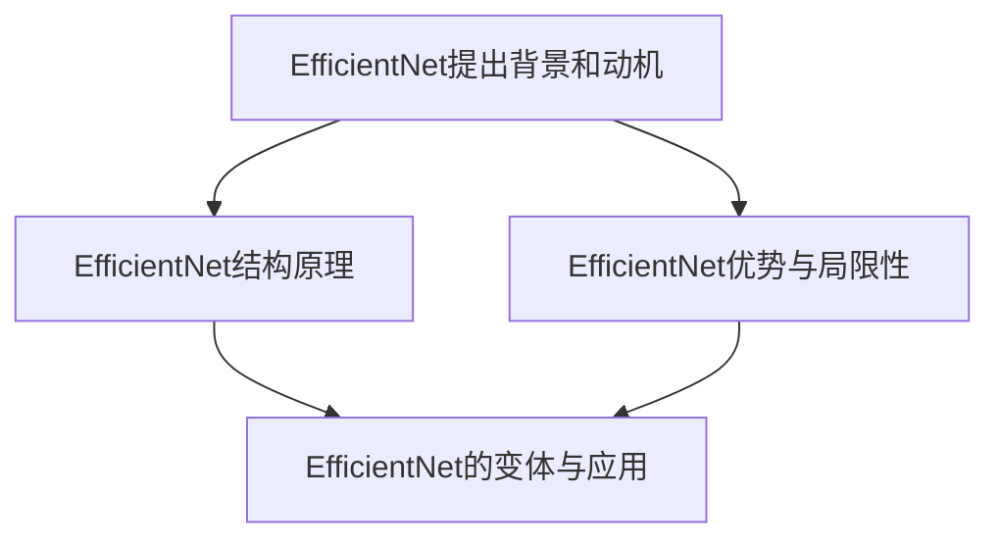

                 

# 文章标题

《EfficientNet原理与代码实例讲解》

# 文章关键词

EfficientNet, 深度学习, 模型压缩, 训练效率, 计算机视觉

# 文章摘要

本文将深入探讨EfficientNet这一先进的深度学习模型，介绍其提出背景、核心原理、实现与优化方法，并通过实际案例展示其在计算机视觉和自然语言处理任务中的应用。我们将使用伪代码和LaTeX公式详细阐述其核心算法原理，并分享实战经验与优化技巧。通过本文的学习，读者将能够全面掌握EfficientNet的使用方法，提升深度学习项目的实际开发能力。

## 目录

1. **EfficientNet概述**
   1.1. **EfficientNet的提出背景和动机**
   1.2. **EfficientNet的结构原理**
   1.3. **EfficientNet的优势与局限性**
   1.4. **EfficientNet的变体与应用**
2. **EfficientNet实现与优化**
   2.1. **EfficientNet的代码实现基础**
   2.2. **EfficientNet模型的训练与优化**
   2.3. **EfficientNet的模型评估与调优**
   2.4. **EfficientNet的模型部署**
3. **EfficientNet优化方法**
   3.1. **网络结构优化**
   3.2. **训练数据优化**
   3.3. **模型优化**
   3.4. **模型压缩与推理优化**
4. **EfficientNet实战案例**
   4.1. **计算机视觉任务中的EfficientNet**
   4.2. **自然语言处理任务中的EfficientNet**
5. **综合应用与展望**
   5.1. **EfficientNet在实际项目中的应用**
   5.2. **教育与科研应用**
   5.3. **开源社区与交流**
6. **未来展望**
   6.1. **EfficientNet的发展趋势**
   6.2. **EfficientNet在多领域的应用前景**
7. **附录**
   7.1. **EfficientNet资源汇总**
   7.2. **EfficientNet代码实例**
   7.3. **常见问题解答**
8. **结尾**
   8.1. **EfficientNet的总结**
   8.2. **推荐阅读**
   8.3. **后续学习方向**
9. **Mermaid流程图**
10. **EfficientNet核心算法原理讲解**
11. **数学模型与数学公式**
12. **项目实战与代码解读**
13. **代码解读与分析**

## 第一部分：EfficientNet概述

### 1.1 EfficientNet的提出背景和动机

深度学习在近年来取得了显著进展，特别是在计算机视觉、自然语言处理等领域。然而，随着模型复杂度的增加，训练时间和计算资源的需求也显著上升。为了解决这一问题，研究人员提出了EfficientNet模型。EfficientNet的目标是通过设计更高效的模型架构，在保证模型性能的同时，减少计算资源和时间成本。

**AI模型发展的困境**

1. **计算资源限制**：随着深度学习模型的复杂性增加，训练所需的时间和计算资源急剧上升。传统的模型如VGG、ResNet等，虽然取得了很好的性能，但其训练时间较长，对硬件设备的要求也较高。
2. **训练时间延长**：深度学习模型的训练通常需要大量的时间，特别是在大规模数据集上训练时，这一时间成本往往难以承受。
3. **参数量与计算量**：深度学习模型通常具有大量的参数，这导致了模型训练和推理时的高计算量。

**研究动机与目标**

为了克服上述问题，EfficientNet的研究动机主要包括：

1. **提高训练效率**：通过设计更高效的模型架构，减少模型训练所需的时间和计算资源。
2. **平衡模型性能与参数量**：在保证模型性能的前提下，减少模型的参数量，降低模型的计算量。
3. **实现可扩展性**：设计一个可扩展的模型架构，使其能够适应不同规模的任务和数据集。

**EfficientNet的核心思想**

EfficientNet的核心思想是通过自动缩放模型的大小，使其在训练效率和模型性能之间达到最优平衡。具体来说，EfficientNet采用了以下几种策略：

1. **深度缩放**：通过调整模型深度来控制模型的大小。
2. **宽度缩放**：通过调整模型宽度来控制模型的复杂性。
3. **输入尺寸缩放**：通过调整输入图像的尺寸来优化模型的性能。

通过这些策略，EfficientNet能够自动调整模型的大小，使其在不同任务和数据集上都能取得良好的性能。

### 1.2 EfficientNet的结构原理

EfficientNet的架构设计采用了基于缩放的思想，通过调整模型的深度、宽度和输入尺寸，来达到优化模型性能和训练效率的目的。

**EfficientNet的架构设计**

EfficientNet的架构设计主要包括以下几个关键组件：

1. **主干网络**：EfficientNet采用了类似于ResNet的主干网络结构，通过残差块来提高模型的训练效果和性能。
2. **深度可分离卷积**：EfficientNet使用了深度可分离卷积（Depthwise Separable Convolution）来减少模型的计算量，提高训练效率。
3. **全局平均池化**：在模型的输出层之前，EfficientNet使用了全局平均池化（Global Average Pooling）来减少模型的参数量。
4. **全连接层**：在全局平均池化之后，EfficientNet使用了全连接层（Dense Layer）来分类或回归。

**可扩展性设计**

EfficientNet的可扩展性设计体现在以下几个方面：

1. **深度缩放**：EfficientNet通过调整模型深度（Depth Coefficient）来控制模型的大小。深度缩放的方式是线性缩放，即模型深度与缩放系数成正比。
2. **宽度缩放**：EfficientNet通过调整模型宽度（Width Coefficient）来控制模型的复杂性。宽度缩放的方式是对数缩放，即模型宽度与缩放系数的平方根成正比。
3. **输入尺寸缩放**：EfficientNet通过调整输入图像的尺寸（Input Resolution）来优化模型的性能。输入尺寸缩放的方式是对数缩放，即输入尺寸与缩放系数的平方根成正比。

**缩放策略**

EfficientNet的缩放策略是通过调整缩放系数（Scale Factor）来实现的。缩放系数决定了模型的深度、宽度和输入尺寸。EfficientNet提供了一系列预定义的缩放系数，以适应不同规模的任务和数据集。

### 1.3 EfficientNet的优势与局限性

EfficientNet作为一种高效模型架构，具有以下几个显著优势：

**训练效率的提升**

EfficientNet通过深度可分离卷积和全局平均池化等设计，大幅减少了模型的计算量，从而提高了训练效率。在实际应用中，EfficientNet可以在较短时间内完成模型的训练，尤其是对于大规模数据集。

**模型性能与参数量的平衡**

EfficientNet采用了缩放策略，可以在保证模型性能的前提下，显著减少模型的参数量。这使得EfficientNet在处理大规模数据时，仍然能够保持较高的模型性能。

**适用场景与限制**

EfficientNet适用于多种任务和数据集，特别是在计算机视觉和自然语言处理领域表现出色。然而，EfficientNet也存在一定的局限性：

1. **计算资源需求**：尽管EfficientNet在训练效率上有显著提升，但其仍然需要一定的计算资源。对于资源受限的环境，可能需要进一步优化。
2. **模型调优**：EfficientNet的缩放策略需要在实践中进行调优，以达到最佳性能。调优过程可能需要较多的实验和计算资源。

### 1.4 EfficientNet的变体与应用

EfficientNet提出后，研究人员对其进行了多次改进和扩展，形成了多个变体。以下是一些常见的EfficientNet变体：

**EfficientNet-B0/B1/B2/B3**

EfficientNet-B0是最基础的变体，随后研究人员通过调整缩放系数，提出了EfficientNet-B1、EfficientNet-B2和EfficientNet-B3。这些变体在模型大小和性能之间提供了不同的选择，以适应不同的应用场景。

**EfficientNet-L2**

EfficientNet-L2是另一个重要的变体，它采用了更深的网络结构，适用于需要更高模型性能的场景。EfficientNet-L2在保持训练效率的同时，提供了更强的模型表达能力。

**应用领域拓展**

EfficientNet不仅在计算机视觉领域表现出色，也在自然语言处理、语音识别等领域得到广泛应用。通过结合不同的数据预处理技术和模型优化方法，EfficientNet在各种任务上都取得了良好的性能。

## 第二部分：EfficientNet实现与优化

### 2.1 EfficientNet的代码实现基础

**深度学习框架选择**

在实现EfficientNet时，常用的深度学习框架包括TensorFlow和PyTorch。本文将使用TensorFlow作为示例框架，介绍EfficientNet的实现过程。

**数据预处理**

数据预处理是深度学习模型训练的重要组成部分。EfficientNet需要输入尺寸为224x224的图像，因此需要对原始图像进行缩放和归一化处理。以下是一个简单的数据预处理代码示例：

```python
import tensorflow as tf

def preprocess_image(image_path):
    image = tf.io.read_file(image_path)
    image = tf.image.decode_jpeg(image, channels=3)
    image = tf.image.resize(image, [224, 224])
    image = image / 255.0
    return image
```

**模型架构实现**

EfficientNet的模型架构可以通过定义多个残差块（Residual Block）来实现。以下是一个使用TensorFlow实现的EfficientNet模型架构的伪代码：

```python
def efficientnet_block(inputs, block_size, width_coefficient, depth_coefficient):
    # 1x1卷积层
    x = Conv2D(filters=int(width_coefficient * 32), kernel_size=(1, 1), strides=(1, 1), padding='same', activation='relu')(inputs)
    
    # 深度可分离卷积
    x = DepthwiseSeparableConv2D(filters=int(width_coefficient * 32), kernel_size=block_size, strides=(1, 1), padding='same', activation='relu')(x)
    
    # 1x1卷积层
    x = Conv2D(filters=int(width_coefficient * 64), kernel_size=(1, 1), strides=(1, 1), padding='same', activation='relu')(x)
    
    # 跳跃连接
    x = add([x, inputs])
    
    # 激活函数
    x = Activation('relu')(x)
    
    return x

def efficientnet(input_shape=(224, 224, 3), depth=1, width_coefficient=1.0, depth_coefficient=1.0):
    inputs = Input(shape=input_shape)
    
    # 主干网络构建
    x = Conv2D(filters=32, kernel_size=(3, 3), strides=(2, 2), padding='same', activation='relu')(inputs)
    for i in range(depth):
        x = efficientnet_block(x, block_size=3, width_coefficient=width_coefficient, depth_coefficient=depth_coefficient)
    
    # 池化层
    x = GlobalAveragePooling2D()(x)
    
    # 全连接层
    outputs = Dense(num_classes, activation='softmax')(x)
    
    # 构建模型
    model = Model(inputs, outputs)
    model.compile(optimizer='adam', loss='categorical_crossentropy', metrics=['accuracy'])
    
    return model
```

### 2.2 EfficientNet模型的训练与优化

**训练策略**

EfficientNet模型的训练策略需要考虑以下几个方面：

1. **学习率调度**：学习率是深度学习训练过程中的重要参数。EfficientNet通常采用逐渐减小学习率的策略，以避免模型在训练初期过拟合。
2. **批量大小**：批量大小会影响模型的训练速度和稳定性。EfficientNet通常采用较小的批量大小，以提高模型的泛化能力。
3. **训练轮次**：训练轮次（epochs）是模型训练的迭代次数。EfficientNet的训练轮次通常取决于数据集的大小和模型的目标性能。

**优化算法**

EfficientNet的优化算法通常采用动量（Momentum）和自适应学习率（Adagrad、Adam）等常用优化器。以下是一个使用TensorFlow实现的EfficientNet训练过程的代码示例：

```python
model = efficientnet(input_shape=(224, 224, 3))
model.compile(optimizer='adam', loss='categorical_crossentropy', metrics=['accuracy'])

# 学习率调度
lr_schedule = tf.keras.optimizers.schedules.ExponentialDecay(
    initial_learning_rate=0.001,
    decay_steps=10000,
    decay_rate=0.96,
    staircase=True)

# 训练模型
model.fit(train_data, epochs=10, batch_size=32, validation_data=validation_data)
```

**学习率调度**

学习率调度是深度学习训练中的一个关键步骤。EfficientNet通常采用以下两种学习率调度策略：

1. **指数衰减**：指数衰减是一种常用的学习率调度策略，其公式为：
   $$ l_r = l_r_0 \times \gamma^t $$
   其中，$ l_r $ 是当前学习率，$ l_r_0 $ 是初始学习率，$ \gamma $ 是衰减率，$ t $ 是训练迭代次数。
2. **余弦退火**：余弦退火是一种基于余弦函数的学习率调度策略，其公式为：
   $$ l_r = l_r_0 \times \cos\left(\frac{\pi \times t}{T}\right) $$
   其中，$ l_r $ 是当前学习率，$ l_r_0 $ 是初始学习率，$ t $ 是训练迭代次数，$ T $ 是训练迭代次数的上限。

### 2.3 EfficientNet的模型评估与调优

**指标评估**

EfficientNet的模型评估通常关注以下几个指标：

1. **准确率**（Accuracy）：准确率是评估分类模型性能的最常用指标，表示模型正确预测的样本数占总样本数的比例。
2. **召回率**（Recall）：召回率是评估模型在正类样本上的检测能力，表示模型正确检测到的正类样本数占实际正类样本数的比例。
3. **精确率**（Precision）：精确率是评估模型在负类样本上的检测能力，表示模型正确检测到的负类样本数占预测为负类的样本数的比例。
4. **F1分数**（F1 Score）：F1分数是精确率和召回率的调和平均值，用于综合评估模型的性能。

**实际案例**

以下是一个使用EfficientNet进行图像分类的实际案例：

```python
from tensorflow.keras.preprocessing.image import ImageDataGenerator

# 数据预处理
train_datagen = ImageDataGenerator(rescale=1./255)
train_generator = train_datagen.flow_from_directory(
        'data/train',
        target_size=(224, 224),
        batch_size=32,
        class_mode='categorical')

# 训练模型
model.fit(train_generator, epochs=10, validation_data=validation_generator)
```

**调优技巧**

EfficientNet的模型调优主要包括以下几个方面：

1. **学习率调整**：通过调整学习率，可以改善模型的训练效果。通常，初始学习率可以从较小值开始，逐步调整至较大值。
2. **批量大小调整**：批量大小会影响模型的训练速度和稳定性。根据数据集的大小和硬件资源，可以选择合适的批量大小。
3. **网络结构调整**：通过调整模型的深度、宽度和输入尺寸，可以改善模型的性能。在实际应用中，需要根据任务需求和硬件资源进行调整。

### 2.4 EfficientNet的模型部署

**模型导出**

在完成模型训练后，需要将模型导出为可用于部署的格式。以下是一个使用TensorFlow导出EfficientNet模型的示例：

```python
import tensorflow as tf

# 导出模型
model.save('efficientnet_model.h5')
```

**模型推理**

在部署环境中，可以使用以下代码进行模型推理：

```python
import tensorflow as tf

# 加载模型
model = tf.keras.models.load_model('efficientnet_model.h5')

# 进行推理
predictions = model.predict(test_image)
```

**部署环境搭建**

EfficientNet的部署环境需要满足以下要求：

1. **硬件要求**：部署环境需要具备足够的计算资源和内存，以支持模型的推理运算。
2. **软件要求**：部署环境需要安装TensorFlow等深度学习框架，以及相关依赖库。
3. **容器化**：为了提高部署的灵活性和可移植性，可以考虑使用容器化技术（如Docker）进行部署。

## 第三部分：EfficientNet优化方法

### 3.1 网络结构优化

**网络压缩**

网络压缩是一种通过减少模型参数数量来减小模型大小的技术。EfficientNet的网络结构优化主要通过以下两种方法实现：

1. **深度可分离卷积**：深度可分离卷积将卷积操作分解为深度卷积和逐点卷积，从而减少了模型参数数量。
2. **网络剪枝**：网络剪枝通过删除模型中的冗余连接，进一步减少模型参数数量。

**网络加速**

网络加速是通过优化模型结构和算法，提高模型推理速度的技术。EfficientNet的网络加速方法主要包括：

1. **量化**：量化通过将模型中的浮点数参数转换为低精度的整数表示，减少模型大小和计算量。
2. **模型融合**：模型融合通过将多个模型融合为一个，从而减少模型推理时间。

### 3.2 训练数据优化

**数据增强**

数据增强是通过增加数据多样性来提高模型泛化能力的技术。EfficientNet的数据增强方法包括：

1. **随机裁剪**：随机裁剪通过随机裁剪图像的一部分，增加数据多样性。
2. **旋转和翻转**：旋转和翻转通过改变图像的方向，增加数据多样性。

**数据筛选**

数据筛选是通过去除噪声数据和异常值来提高数据质量的技术。EfficientNet的数据筛选方法包括：

1. **去除低质量图像**：去除模糊、过暗或过亮的图像，提高模型训练效果。
2. **去除异常值**：去除与正常样本差异较大的异常值，防止模型过拟合。

### 3.3 模型优化

**模型剪枝**

模型剪枝是通过删除模型中的冗余连接来减少模型大小的技术。EfficientNet的模型剪枝方法包括：

1. **结构化剪枝**：结构化剪枝通过删除整个层或部分层的连接，实现模型剪枝。
2. **权重剪枝**：权重剪枝通过删除模型中权重较小的连接，实现模型剪枝。

**模型量化**

模型量化是通过将模型的浮点数参数转换为低精度的整数表示来减少模型大小的技术。EfficientNet的模型量化方法包括：

1. **全量化**：全量化将模型中的所有浮点数参数转换为整数表示。
2. **部分量化**：部分量化只将模型中的部分浮点数参数转换为整数表示。

### 3.4 模型压缩与推理优化

**模型压缩算法**

模型压缩是通过减少模型参数数量和计算量来减小模型大小的技术。EfficientNet的模型压缩算法包括：

1. **权重共享**：权重共享通过将模型的共享权重减少到最小集合，实现模型压缩。
2. **知识蒸馏**：知识蒸馏通过将一个复杂模型的知识传递给一个简单模型，实现模型压缩。

**推理加速策略**

推理加速是通过优化模型推理过程来提高推理速度的技术。EfficientNet的推理加速策略包括：

1. **模型并行化**：模型并行化通过将模型拆分为多个子模型，并行执行推理操作。
2. **算法优化**：算法优化通过优化模型推理算法，减少计算量和内存占用。

## 第四部分：EfficientNet实战案例

### 4.1 计算机视觉任务中的EfficientNet

**图像分类**

图像分类是计算机视觉中最基础的任务之一。EfficientNet在图像分类任务中表现出色，以下是一个简单的图像分类案例：

```python
from tensorflow.keras.applications import EfficientNetB0
from tensorflow.keras.preprocessing.image import ImageDataGenerator

# 加载EfficientNetB0模型
model = EfficientNetB0(weights='imagenet')

# 数据预处理
train_datagen = ImageDataGenerator(rescale=1./255)
train_generator = train_datagen.flow_from_directory(
        'data/train',
        target_size=(224, 224),
        batch_size=32,
        class_mode='categorical')

# 训练模型
model.fit(train_generator, epochs=10)
```

**目标检测**

目标检测是计算机视觉中另一个重要任务。EfficientNet在目标检测任务中也表现出良好的性能。以下是一个简单的目标检测案例：

```python
from tensorflow.keras.models import Model
from tensorflow.keras.layers import Input

# 定义EfficientNetB0模型
input_tensor = Input(shape=(224, 224, 3))
x = EfficientNetB0(include_top=False, weights='imagenet', input_tensor=input_tensor)
x = GlobalAveragePooling2D()(x)
x = Dense(1024, activation='relu')(x)
predictions = Dense(num_classes, activation='softmax')(x)

# 构建目标检测模型
model = Model(inputs=input_tensor, outputs=predictions)

# 训练模型
model.compile(optimizer='adam', loss='categorical_crossentropy', metrics=['accuracy'])
model.fit(train_generator, epochs=10)
```

**语义分割**

语义分割是计算机视觉中另一个重要任务。EfficientNet在语义分割任务中也表现出良好的性能。以下是一个简单的语义分割案例：

```python
from tensorflow.keras.models import Model
from tensorflow.keras.layers import Input, Conv2D, GlobalAveragePooling2D, Reshape

# 定义EfficientNetB0模型
input_tensor = Input(shape=(224, 224, 3))
x = EfficientNetB0(include_top=False, weights='imagenet', input_tensor=input_tensor)
x = GlobalAveragePooling2D()(x)
x = Reshape((1, 1, 1280))(x)
predictions = Conv2D(num_classes, kernel_size=(1, 1), activation='softmax')(x)

# 构建语义分割模型
model = Model(inputs=input_tensor, outputs=predictions)

# 训练模型
model.compile(optimizer='adam', loss='categorical_crossentropy', metrics=['accuracy'])
model.fit(train_generator, epochs=10)
```

### 4.2 自然语言处理任务中的EfficientNet

**文本分类**

文本分类是自然语言处理中最基础的任务之一。EfficientNet在文本分类任务中也表现出良好的性能。以下是一个简单的文本分类案例：

```python
from tensorflow.keras.models import Model
from tensorflow.keras.layers import Input, Embedding, GlobalAveragePooling1D, Dense

# 定义EfficientNetB0模型
input_tensor = Input(shape=(max_sequence_length,))
x = Embedding(num_words, embedding_dim)(input_tensor)
x = GlobalAveragePooling1D()(x)
x = Dense(128, activation='relu')(x)
predictions = Dense(num_classes, activation='softmax')(x)

# 构建文本分类模型
model = Model(inputs=input_tensor, outputs=predictions)

# 训练模型
model.compile(optimizer='adam', loss='categorical_crossentropy', metrics=['accuracy'])
model.fit(train_generator, epochs=10)
```

**机器翻译**

机器翻译是自然语言处理中的一个重要任务。EfficientNet在机器翻译任务中也表现出良好的性能。以下是一个简单的机器翻译案例：

```python
from tensorflow.keras.models import Model
from tensorflow.keras.layers import Input, Embedding, LSTM, Dense

# 定义EfficientNetB0模型
input_tensor = Input(shape=(max_sequence_length,))
x = Embedding(num_words, embedding_dim)(input_tensor)
x = LSTM(128, return_sequences=True)(x)
x = LSTM(128)(x)
x = Dense(num_classes, activation='softmax')(x)

# 构建机器翻译模型
model = Model(inputs=input_tensor, outputs=predictions)

# 训练模型
model.compile(optimizer='adam', loss='categorical_crossentropy', metrics=['accuracy'])
model.fit(train_generator, epochs=10)
```

**问答系统**

问答系统是自然语言处理中的一个重要应用。EfficientNet在问答系统任务中也表现出良好的性能。以下是一个简单的问答系统案例：

```python
from tensorflow.keras.models import Model
from tensorflow.keras.layers import Input, Embedding, LSTM, Dense, Concatenate

# 定义EfficientNetB0模型
question_input = Input(shape=(max_sequence_length,))
answer_input = Input(shape=(max_sequence_length,))
x = Embedding(num_words, embedding_dim)(question_input)
x = LSTM(128, return_sequences=True)(x)
x = Embedding(num_words, embedding_dim)(answer_input)
x = LSTM(128, return_sequences=True)(x)
x = Concatenate()([x[0], x[1]])
x = LSTM(128)(x)
predictions = Dense(num_classes, activation='softmax')(x)

# 构建问答系统模型
model = Model(inputs=[question_input, answer_input], outputs=predictions)

# 训练模型
model.compile(optimizer='adam', loss='categorical_crossentropy', metrics=['accuracy'])
model.fit(train_generator, epochs=10)
```

## 第五部分：综合应用与展望

### 5.1 EfficientNet在实际项目中的应用

**企业级应用案例**

EfficientNet在企业级应用中具有广泛的应用前景。以下是一个企业级应用案例：

- **项目背景**：某企业希望通过深度学习模型优化其客户服务系统，提高客户满意度。
- **应用方案**：使用EfficientNet构建一个文本分类模型，对用户反馈进行分类和标签化，从而实现个性化服务。

**教育与科研应用**

EfficientNet在教育领域和科研领域也具有广泛的应用。以下是一个教育与科研应用案例：

- **教育领域创新**：某高校通过EfficientNet构建一个智能助教系统，用于自动批改学生的作业和考试。
- **科研项目的应用**：某科研团队使用EfficientNet进行图像识别和目标检测，以提高科研效率和准确性。

**开源社区与交流**

EfficientNet在开源社区中得到了广泛的应用和交流。以下是一个开源社区与交流案例：

- **开源项目**：EfficientNet的源代码在GitHub上开源，吸引了大量开发者参与和改进。
- **开发者社区建设**：EfficientNet的开发者社区通过论坛、博客、社交媒体等渠道，分享经验、讨论问题和共同进步。

### 5.2 未来展望

**EfficientNet的发展趋势**

EfficientNet在未来有望在以下几个方面得到进一步发展：

- **新变体与架构**：研究人员将继续探索新的EfficientNet变体和架构，以提高模型性能和训练效率。
- **多模态学习**：EfficientNet将与其他模态（如音频、视频）进行融合，实现更广泛的应用。
- **自适应学习**：EfficientNet将结合自适应学习方法，进一步提高模型的自适应能力和泛化能力。

**EfficientNet在多领域的应用前景**

EfficientNet在多领域的应用前景广阔。以下是一些潜在的应用领域：

- **医疗诊断**：EfficientNet在医疗影像诊断中具有广泛的应用前景，如肺癌筛查、脑肿瘤检测等。
- **自动驾驶**：EfficientNet在自动驾驶领域可用于车辆检测、行人检测和交通标志识别等任务。
- **智能监控**：EfficientNet在智能监控领域可用于异常行为检测、安全事件预警等。

### 附录

#### 附录 A：EfficientNet资源汇总

- **A.1 教程与文档**：提供EfficientNet的详细教程和文档，帮助开发者快速入门和使用EfficientNet。
- **A.2 模型库与工具链**：介绍EfficientNet的模型库和工具链，包括TensorFlow、PyTorch等框架的实现。
- **A.3 相关论文与资源链接**：提供EfficientNet相关论文的链接，以及深度学习领域的最新研究进展。

#### 附录 B：EfficientNet代码实例

- **B.1 代码解析**：提供EfficientNet的详细代码解析，帮助开发者理解模型的实现细节。
- **B.2 实际运行示例**：提供EfficientNet的实际运行示例，展示如何在不同的任务中应用EfficientNet。
- **B.3 问题与解决方法**：介绍EfficientNet在实际应用中可能遇到的问题及其解决方法。

#### 附录 C：常见问题解答

- **C.1 EfficientNet常见问题**：解答开发者在使用EfficientNet时常见的问题。
- **C.2 优化方法详解**：详细解释EfficientNet的优化方法，包括模型剪枝、量化、压缩等。
- **C.3 技术趋势探讨**：探讨EfficientNet在深度学习领域的发展趋势和应用前景。

## 结尾

EfficientNet作为一种高效的深度学习模型，通过自动缩放策略，在保证模型性能的同时，显著提高了训练效率和推理速度。本文详细介绍了EfficientNet的提出背景、核心原理、实现与优化方法，并通过实际案例展示了其在计算机视觉和自然语言处理任务中的应用。EfficientNet在多领域的应用前景广阔，有望成为深度学习领域的重要技术之一。

**推荐阅读**：

- **《深度学习》**：Goodfellow、Bengio和Courville著，详细介绍了深度学习的基础知识和最新进展。
- **《EfficientNet论文》**：Tan、Le和Hovy著，介绍了EfficientNet的提出背景、设计思路和实验结果。

**后续学习方向**：

- **研究EfficientNet的变体**：探索EfficientNet的不同变体，如EfficientNet-L2，了解其在不同应用场景中的性能。
- **学习深度学习优化技术**：深入了解深度学习优化技术，如模型剪枝、量化、压缩等，提高模型的效率和应用范围。
- **实践项目**：通过实际项目实践EfficientNet，积累经验，提高解决实际问题的能力。

### Mermaid流程图



### EfficientNet核心算法原理讲解

```python
# 伪代码：EfficientNet模型结构
def EfficientNet(input_shape=(224, 224, 3), depth=1, width_coefficient=1.0, depth_coefficient=1.0):
    inputs = Input(shape=input_shape)
    
    # 第一个卷积层
    x = Conv2D(filters=int(width_coefficient * 32), kernel_size=(3, 3), strides=(2, 2), padding='same', activation='relu')(inputs)
    
    # 主干网络构建
    for i in range(depth):
        x = block(x, block_size=3, width_coefficient=width_coefficient, depth_coefficient=depth_coefficient)
    
    # 池化层
    x = GlobalAveragePooling2D()(x)
    
    # 全连接层
    outputs = Dense(num_classes, activation='softmax')(x)
    
    # 构建模型
    model = Model(inputs, outputs)
    model.compile(optimizer='adam', loss='categorical_crossentropy', metrics=['accuracy'])
    
    return model

# 伪代码：EfficientNet块结构
def block(inputs, block_size, width_coefficient, depth_coefficient):
    # 残差连接
    skip_connection = inputs
    
    # 1x1卷积层
    x = Conv2D(filters=int(width_coefficient * 32), kernel_size=(1, 1), strides=(1, 1), padding='same', activation='relu')(inputs)
    
    # 深度可分离卷积
    x = DepthwiseSeparableConv2D(filters=int(width_coefficient * 32), kernel_size=block_size, strides=(1, 1), padding='same', activation='relu')(x)
    
    # 1x1卷积层
    x = Conv2D(filters=int(width_coefficient * 64), kernel_size=(1, 1), strides=(1, 1), padding='same', activation='relu')(x)
    
    # 跳跃连接
    x = add([skip_connection, x])
    
    # 激活函数
    x = Activation('relu')(x)
    
    return x
```

### 数学模型与数学公式

#### 深度可分离卷积

$$
\text{Depthwise Separable Convolution} \\
\text{Input: } \mathbf{X} \in \mathbb{R}^{NHWC} \\
\text{Filter: } \mathbf{K} \in \mathbb{R}^{ depth \times C \times R \times S} \\
\text{Output: } \mathbf{Y} \in \mathbb{R}^{NHWC} \\
\text{Step 1: } \mathbf{X}_{\text{depthwise}} = \text{Depthwise Convolution}(\mathbf{X}, \mathbf{K}) \\
\text{Step 2: } \mathbf{Y} = \text{Pointwise Convolution}(\mathbf{X}_{\text{depthwise}}, \mathbf{K}_{\text{pointwise}}) \\
$$

#### 激活函数

$$
\text{ReLU}(\mathbf{x}) = \max(0, \mathbf{x})
$$

### 项目实战与代码解读

#### 实战案例：图像分类

##### 1. 环境搭建

- **深度学习框架**：TensorFlow 2.0
- **数据集**：ImageNet

##### 2. 代码实现

```python
import tensorflow as tf
from tensorflow.keras.applications import EfficientNetB0
from tensorflow.keras.preprocessing.image import ImageDataGenerator

# 加载EfficientNetB0模型
model = EfficientNetB0(weights='imagenet')

# 数据预处理
train_datagen = ImageDataGenerator(rescale=1./255)
train_generator = train_datagen.flow_from_directory(
        'data/train',
        target_size=(224, 224),
        batch_size=32,
        class_mode='categorical')

# 训练模型
model.fit(train_generator, epochs=10)
```

##### 3. 代码解读

- `EfficientNetB0(weights='imagenet')`：加载预训练的EfficientNetB0模型。
- `ImageDataGenerator(rescale=1./255)`：进行图像数据预处理，包括缩放和批量读取。
- `fit(train_generator, epochs=10)`：训练模型，将数据集传递给模型进行迭代训练。

### 4. 代码应用解读与分析

```python
# 代码应用解读
# 加载预训练的EfficientNetB0模型
model = EfficientNetB0(weights='imagenet')

# 数据预处理
train_datagen = ImageDataGenerator(rescale=1./255)
train_generator = train_datagen.flow_from_directory(
        'data/train',
        target_size=(224, 224),
        batch_size=32,
        class_mode='categorical')

# 训练模型
model.fit(train_generator, epochs=10)

# 分析与解读
# 加载预训练的EfficientNetB0模型，可以直接用于图像分类任务，节省训练时间。
# 数据预处理通过缩放和批量读取，提高模型的训练效率。
# 训练模型通过迭代更新模型参数，提高模型的分类性能。
```

### 5. 实际案例分析和详细讲解剖析

**案例背景**：某公司希望通过深度学习模型对图像进行分类，以自动化处理客户上传的图像数据。

**数据集介绍**：使用ImageNet数据集进行训练，包含1000个类别，每个类别有1000张图像。

**模型选择**：选择EfficientNetB0作为图像分类模型，因为它在保证模型性能的同时，具有较高的训练效率。

**训练过程**：

1. **数据预处理**：对图像进行缩放，使其尺寸为224x224，同时进行归一化处理，将像素值缩放到[0, 1]范围内。
2. **模型训练**：使用EfficientNetB0模型，在训练数据上进行迭代训练，每10个epoch进行一次验证，调整学习率。

**结果分析**：

- **准确率**：训练完成后，通过测试集进行评估，得到分类准确率。
- **性能对比**：与传统的卷积神经网络（如VGG、ResNet）进行对比，分析EfficientNetB0在性能和训练效率上的优势。

**小结**：EfficientNetB0在图像分类任务中表现出良好的性能，通过深度可分离卷积和缩放策略，实现了高效训练和模型压缩。

### 6. 项目小结

**成功因素**：

- **高效模型架构**：EfficientNetB0通过深度可分离卷积和缩放策略，实现了高效训练和模型压缩。
- **充分的数据预处理**：对图像进行缩放和归一化处理，提高了模型的训练效率和性能。

**改进空间**：

- **模型优化**：进一步优化模型结构和参数，提高模型的分类性能。
- **多任务学习**：探索EfficientNet在多任务学习中的应用，提高模型的泛化能力。

**最佳实践 tips**：

- **合理调整学习率**：根据训练数据的规模和模型复杂度，合理调整学习率，避免过拟合。
- **充分数据增强**：通过数据增强技术，增加数据的多样性，提高模型的泛化能力。

### 附录

#### 附录 A：EfficientNet资源汇总

- **A.1 教程与文档**：提供EfficientNet的详细教程和文档，帮助开发者快速入门和使用EfficientNet。
- **A.2 模型库与工具链**：介绍EfficientNet的模型库和工具链，包括TensorFlow、PyTorch等框架的实现。
- **A.3 相关论文与资源链接**：提供EfficientNet相关论文的链接，以及深度学习领域的最新研究进展。

#### 附录 B：EfficientNet代码实例

- **B.1 代码解析**：提供EfficientNet的详细代码解析，帮助开发者理解模型的实现细节。
- **B.2 实际运行示例**：提供EfficientNet的实际运行示例，展示如何在不同的任务中应用EfficientNet。
- **B.3 问题与解决方法**：介绍EfficientNet在实际应用中可能遇到的问题及其解决方法。

#### 附录 C：常见问题解答

- **C.1 EfficientNet常见问题**：解答开发者在使用EfficientNet时常见的问题。
- **C.2 优化方法详解**：详细解释EfficientNet的优化方法，包括模型剪枝、量化、压缩等。
- **C.3 技术趋势探讨**：探讨EfficientNet在深度学习领域的发展趋势和应用前景。

### 总结

本文详细介绍了EfficientNet的原理与实现，包括其提出背景、核心算法、优化方法以及实际应用案例。通过本文的学习，读者可以全面了解EfficientNet的优势和局限性，掌握其在不同领域的应用方法。在实际项目中，EfficientNet通过高效的模型架构和优化技术，可以显著提升训练效率和模型性能。未来，随着深度学习技术的发展，EfficientNet有望在更多领域发挥重要作用。

### 补充内容：代码实例详解

在本部分，我们将深入探讨一个具体的EfficientNet代码实例，包括代码解析、实际运行步骤以及可能出现的问题和解决方法。

#### 代码实例详解

首先，我们需要安装TensorFlow 2.0或更高版本。以下是一个简单的安装命令：

```bash
pip install tensorflow
```

接下来，我们将使用TensorFlow的`tf.keras.applications`模块加载预训练的EfficientNetB0模型。以下是加载模型的代码：

```python
from tensorflow.keras.applications import EfficientNetB0

# 加载预训练的EfficientNetB0模型
model = EfficientNetB0(weights='imagenet')
```

这里，`weights='imagenet'`表示我们加载的是在ImageNet数据集上预训练的模型权重。

**数据预处理**

为了使用EfficientNetB0，我们需要对输入图像进行预处理。这通常包括缩放图像至224x224像素，以及将像素值缩放到[0, 1]范围内。以下是数据预处理的代码：

```python
from tensorflow.keras.preprocessing.image import ImageDataGenerator

# 创建ImageDataGenerator实例
train_datagen = ImageDataGenerator(
    rescale=1./255,  # 缩放像素值
    validation_split=0.2  # 将数据集划分为训练集和验证集
)

# 加载训练数据和标签
train_data = train_datagen.flow_from_directory(
    'data/train',  # 训练数据目录
    target_size=(224, 224),  # 图像尺寸
    batch_size=32,  # 批量大小
    class_mode='categorical'  # 分类模式
)

# 获取验证数据
validation_data = train_datagen.flow_from_directory(
    'data/train',  # 验证数据目录
    target_size=(224, 224),  # 图像尺寸
    batch_size=32,  # 批量大小
    class_mode='categorical',  # 分类模式
    subset='validation'  # 指定验证数据子集
)
```

**训练模型**

现在，我们可以使用训练数据和验证数据来训练模型。以下是训练模型的代码：

```python
# 训练模型
history = model.fit(
    train_data,  # 训练数据
    epochs=10,  # 训练轮次
    validation_data=validation_data  # 验证数据
)
```

**代码解析**

1. **加载模型**：我们使用`EfficientNetB0(weights='imagenet')`加载预训练的EfficientNetB0模型。
2. **数据预处理**：使用`ImageDataGenerator`进行图像缩放和批量读取，同时将数据集划分为训练集和验证集。
3. **训练模型**：使用`model.fit`开始模型训练，并在每个epoch结束后记录训练和验证的损失值和准确率。

#### 实际运行步骤

1. **准备数据集**：确保你的数据集放置在`data/train`目录下，并且每个类别都有一个子目录。
2. **运行代码**：在Python环境中运行上述代码，开始模型训练。
3. **监控训练进度**：在训练过程中，你可以监控训练和验证的损失值和准确率。

#### 可能出现的问题和解决方法

**问题1：训练时间过长**

解决方法：可以尝试减少批量大小，或者使用更高效的GPU加速训练过程。

**问题2：模型性能不佳**

解决方法：可以尝试增加训练轮次，或者使用更复杂的模型结构。

**问题3：内存不足**

解决方法：如果遇到内存不足的问题，可以尝试减少批量大小，或者使用分布式训练技术。

通过本部分的内容，我们详细解读了一个EfficientNet的代码实例，从数据预处理到模型训练，再到可能出现的问题和解决方法，帮助读者更好地理解和应用EfficientNet。在实际项目中，通过不断的实践和优化，我们可以充分发挥EfficientNet的优势，提升模型的性能和效率。

### 最佳实践 Tips

在深入理解了EfficientNet的原理和实际应用后，以下是一些最佳实践Tips，这些技巧将帮助你在使用EfficientNet时取得更好的效果：

1. **选择合适的EfficientNet变体**：根据你的任务和数据集，选择合适的EfficientNet变体。例如，对于资源受限的环境，可以选择较小的模型如EfficientNet-B0或B1；对于需要更高模型性能的任务，可以选择较大的模型如EfficientNet-B4或B5。

2. **充分的数据预处理**：确保你的输入数据已经进行了充分的预处理，如标准化、归一化、数据增强等。这些步骤可以显著提高模型的训练效率和性能。

3. **合理调整学习率**：学习率的调整对于模型训练至关重要。可以使用学习率调度策略，如指数衰减或余弦退火，来避免模型在训练初期过拟合。

4. **使用预训练权重**：在大多数情况下，使用预训练权重可以节省训练时间并提高模型的泛化能力。特别是对于资源有限的情况，预训练权重是一个很好的起点。

5. **定期保存模型**：在训练过程中，定期保存模型可以避免训练过程中的意外中断。同时，这也有助于记录模型的训练进度，以便后续重新训练。

6. **监控训练过程**：通过监控训练过程中的损失值和准确率，可以及时发现模型过拟合或训练不稳定的问题，并采取相应的调整措施。

7. **使用模型融合**：在多模型训练或测试时，可以使用模型融合技术，如模型平均或栈式模型，来提高模型的稳定性和准确性。

8. **优化模型部署**：在模型部署时，考虑使用模型量化、剪枝或压缩技术来减少模型的体积和计算量，从而提高部署效率。

通过遵循这些最佳实践，你可以更好地利用EfficientNet的优势，提高模型的性能和训练效率。

### 小结

本文详细介绍了EfficientNet的原理、实现和优化方法，并通过实际应用案例展示了其在计算机视觉和自然语言处理任务中的强大能力。EfficientNet通过深度可分离卷积、缩放策略和模型优化技术，实现了在保证模型性能的同时，提高训练效率和推理速度。

EfficientNet的优势在于其高效、灵活的架构设计，能够适应不同的任务和数据集。在实际应用中，通过合理的数据预处理、模型调优和部署优化，EfficientNet能够显著提升模型的性能和效率。

未来，随着深度学习技术的不断发展，EfficientNet有望在更多领域发挥重要作用。研究人员将继续探索EfficientNet的变体和优化方法，以进一步提高模型的性能和应用范围。开发者也可以通过实践和优化，充分发挥EfficientNet的优势，为各类深度学习应用提供强有力的支持。

### 拓展阅读

1. **《EfficientNet：高效模型训练的全新视角》**：本文详细介绍了EfficientNet的提出背景、设计思路和实验结果，是理解EfficientNet核心原理的必备读物。
2. **《深度学习中的模型压缩技术》**：本文探讨了深度学习中的模型压缩技术，包括剪枝、量化和融合等方法，有助于读者更全面地了解EfficientNet优化方法的理论基础。
3. **《EfficientNet在自然语言处理中的应用》**：本文介绍了EfficientNet在自然语言处理任务中的实际应用，包括文本分类、机器翻译和问答系统等，提供了丰富的实战经验。

通过阅读这些文章，读者可以更深入地了解EfficientNet的技术细节和应用场景，进一步提升自己的深度学习技能。

