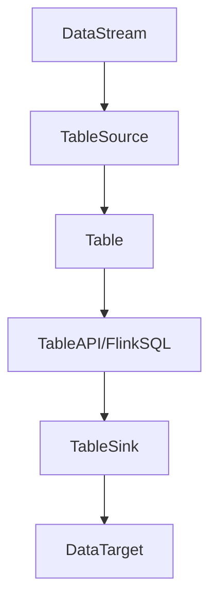
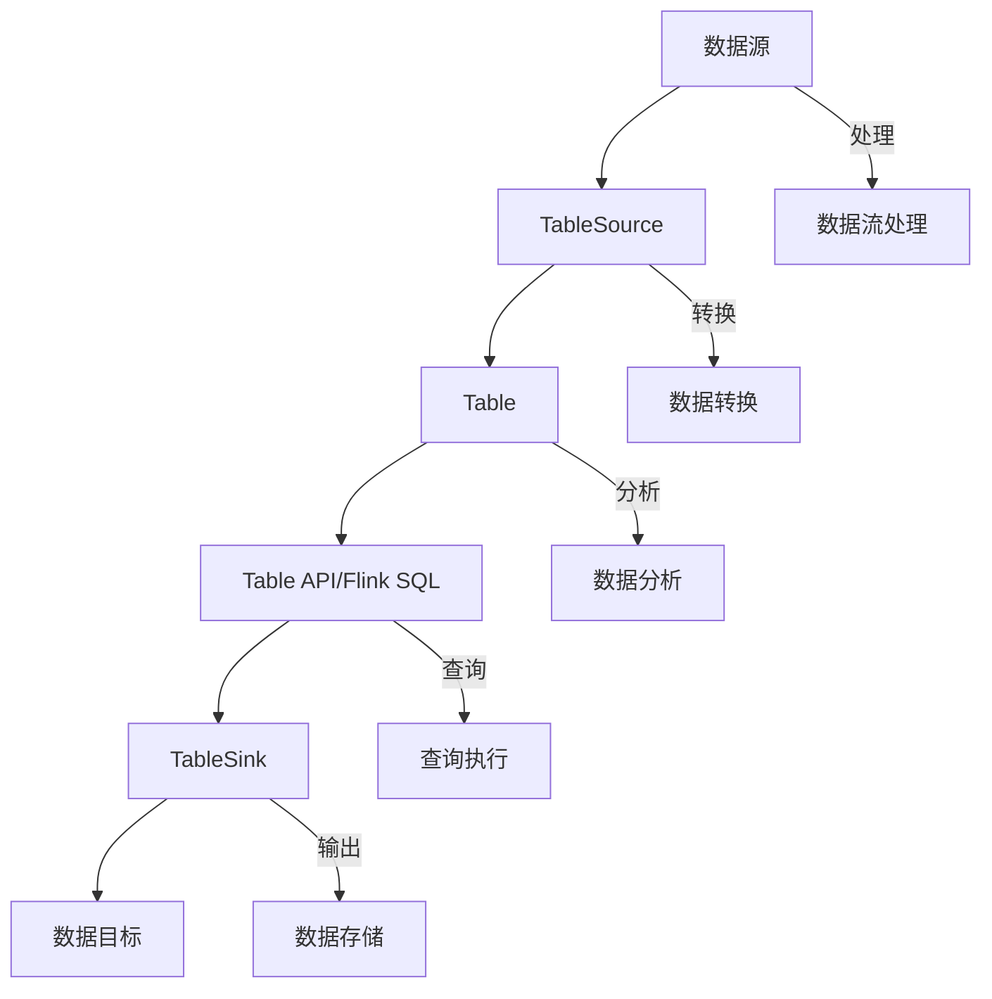

                 

### 引言

随着大数据技术的发展，流处理和批处理在数据处理领域逐渐成为主流。Apache Flink 作为一款强大的流处理框架，不仅支持流处理，还支持批处理，因此在数据处理领域具有广泛的应用。在 Flink 中，Table API 和 SQL 是两个非常重要的功能模块，它们使得数据操作更加直观和便捷。

本文旨在深入讲解 Flink Table API 和 SQL 的原理与应用。首先，我们将对 Flink Table API 的作用与优势进行概述，介绍其基本概念和架构。随后，我们将详细探讨 Flink Table API 的核心概念，包括数据类型、表操作等。接着，我们将转入 Flink SQL 的部分，分析其作用与优势，介绍基本语法和查询优化方法。

文章的第二部分将深入探讨 Flink SQL 的高级特性，如窗口函数和用户定义函数（UDF）。随后，我们将通过案例分析展示 Flink Table API 和 SQL 在实时流处理和大数据计算中的应用。最后，我们将通过实战讲解如何搭建 Flink 环境并使用 Flink Table API 和 SQL 进行数据操作。

通过本文的阅读，读者将能够全面理解 Flink Table API 和 SQL 的原理，掌握其实际应用方法，为后续的数据处理工作打下坚实的基础。文章将以逻辑清晰、结构紧凑、简单易懂的专业技术语言进行撰写，确保读者能够逐步掌握相关知识。

### 关键词

- Apache Flink
- Table API
- SQL
- 数据流处理
- 批处理
- 实时分析
- 窗口函数
- 用户定义函数（UDF）
- 数据类型
- 聚合操作
- 连接操作
- 查询优化

### 摘要

本文将深入讲解 Apache Flink 中的 Table API 和 SQL 功能模块。首先，我们将介绍 Flink Table API 的作用、优势、基本概念和架构。接着，我们将详细解析 Flink Table API 的核心概念，包括数据类型、表操作等。然后，我们将探讨 Flink SQL 的基础概念、基本语法和查询优化方法。

在高级特性的部分，我们将分析窗口函数和用户定义函数（UDF）的实现和用途。随后，通过实时流处理和大数据计算案例，我们将展示 Flink Table API 和 SQL 的实际应用。最后，我们将通过实战讲解如何搭建 Flink 环境，并使用 Flink Table API 和 SQL 进行数据操作，为读者提供全面的实战指导和深入理解。

### 第一部分：Flink Table API基础

#### 第1章：Flink Table API概述

Flink Table API 是 Apache Flink 提供的一种用于数据操作的高级抽象，它使数据操作更加直观和高效。本章节将介绍 Flink Table API 的作用、优势以及基本概念。

##### 1.1 Flink Table API的作用与优势

Flink Table API 的主要作用是简化数据操作流程，使得数据处理更加直观、易用。具体来说，Flink Table API 有以下几个优势：

1. **直观的数据操作**：通过 SQL 式的语法，Flink Table API 可以简化数据查询、转换等操作，降低学习成本。
2. **高效的数据处理**：Flink Table API 能够充分利用 Flink 的流处理和批处理能力，实现高效的数据处理。
3. **灵活的数据类型支持**：Flink Table API 支持多种数据类型，包括基本数据类型和复合数据类型，满足复杂场景的需求。
4. **与 Flink 其他组件的集成**：Flink Table API 可以与 Flink 的其他组件（如 Flink SQL、Flink Connectors 等）无缝集成，提高数据处理能力。

##### 1.2 Flink Table API的基本概念

1. **Table**：在 Flink Table API 中，Table 是一个抽象概念，表示数据的集合。Table 可以是流表（Stream Table）或批表（Batch Table），分别对应流处理和批处理场景。
2. **TableEnvironment**：TableEnvironment 是 Flink Table API 的核心组件，负责管理 Table 的创建、查询和执行。Flink 提供了两种 TableEnvironment：StreamTableEnvironment 和 BatchTableEnvironment，分别对应流处理和批处理。
3. **TableSource 和 TableSink**：TableSource 用于读取数据源，TableSink 用于写入数据目标。Flink 提供了丰富的 TableSource 和 TableSink 实现，包括 Kafka、HDFS、MySQL 等。

##### 1.3 Flink Table API架构

Flink Table API 的架构分为以下几个层次：

1. **底层：DataStream API**：DataStream API 是 Flink 的核心组件，负责处理数据流。Flink Table API 通过 TableSource 将 DataStream 转换为 Table。
2. **中层：Table API**：Table API 是 Flink Table API 的核心部分，提供了一组高级抽象，用于处理 Table 的查询、转换等操作。
3. **顶层：Flink SQL**：Flink SQL 是 Flink Table API 的一个扩展，允许使用 SQL 语法进行数据操作。Flink SQL 基于 Table API，提供了更加灵活和高效的数据处理能力。

通过上述架构，Flink Table API 能够实现高效、灵活的数据操作，满足不同场景的需求。

#### 第2章：Flink Table API核心概念

在了解了 Flink Table API 的基本概念和架构后，我们将深入探讨 Flink Table API 的核心概念，包括数据类型和表操作。这些核心概念是理解和应用 Flink Table API 的关键。

##### 2.1 数据类型

在 Flink Table API 中，数据类型是表示数据的基本单位。Flink Table API 支持多种数据类型，包括基本数据类型和复合数据类型。以下是 Flink Table API 中常见的数据类型：

1. **基本数据类型**：基本数据类型包括布尔型（Boolean）、字节型（Byte）、短整型（Short）、整型（Integer）、长整型（Long）、浮点型（Float）和双精度浮点型（Double）等。基本数据类型直接对应 Java 的基本数据类型。
2. **复合数据类型**：复合数据类型包括数组（Array）、映射（Map）、行（Row）等。复合数据类型可以表示复杂的数据结构，用于处理多列数据。
   - **数组**：数组是 Flink Table API 中的基本复合数据类型，用于表示一列数据中的多个元素。数组支持各种基本数据类型和复合数据类型。
   - **映射**：映射是 Flink Table API 中的另一种复合数据类型，用于表示键值对。映射支持各种基本数据类型和复合数据类型作为键和值。
   - **行**：行是 Flink Table API 中的复合数据类型，用于表示一行数据中的多个字段。行可以包含基本数据类型和复合数据类型。

数据类型的使用示例如下：

```python
# 创建一个包含基本数据类型的行
row1 = Row(id=1, name="Alice", age=30)

# 创建一个包含复合数据类型的行
row2 = Row(id=2, attributes={"email": "alice@example.com", "phone": "1234567890"})
```

##### 2.2 表操作

Flink Table API 提供了一组丰富的表操作，用于对数据进行查询、转换等操作。以下是 Flink Table API 中常见的表操作：

1. **选择（SELECT）**：选择操作用于提取表中的特定列或计算结果。选择操作可以使用列名或表达式进行选择。例如：

   ```sql
   SELECT name, age FROM Person;
   ```

2. **过滤（WHERE）**：过滤操作用于根据条件筛选表中的数据。过滤操作可以使用 SQL 条件表达式进行条件判断。例如：

   ```sql
   SELECT name, age FROM Person WHERE age > 30;
   ```

3. **聚合（GROUP BY）**：聚合操作用于对表中的数据进行分组和聚合。聚合操作可以使用聚合函数（如 COUNT、SUM、AVG 等）进行计算。例如：

   ```sql
   SELECT age, COUNT(*) FROM Person GROUP BY age;
   ```

4. **连接（JOIN）**：连接操作用于将多个表中的数据进行关联。Flink Table API 支持内连接（INNER JOIN）、左连接（LEFT JOIN）和右连接（RIGHT JOIN）等连接类型。例如：

   ```sql
   SELECT p.name, c.course_name FROM Person p INNER JOIN Course c ON p.id = c.person_id;
   ```

以上是 Flink Table API 的一些核心概念和表操作。通过这些核心概念和表操作，用户可以方便地进行数据查询和转换，实现复杂的数据处理任务。

### Flink Table API架构

Flink Table API 的架构设计旨在提供一种高效、灵活且直观的数据处理方法。其架构主要分为三个层次：底层 DataStream API、中层 Table API 和顶层 Flink SQL。以下是这三个层次之间的联系和交互方式。

#### 1. DataStream API

DataStream API 是 Flink 的核心组件，负责处理数据流。DataStream API 提供了丰富的操作接口，包括数据生成、数据转换、窗口操作、水印处理等。通过 DataStream API，用户可以构建复杂的实时数据处理逻辑。

Flink Table API 通过 TableSource 将 DataStream 转换为 Table。TableSource 是 Flink 提供的一种抽象接口，用于读取数据源。常见的 TableSource 实现包括 Kafka、HDFS、Kinesis、File 等。通过 TableSource，用户可以将外部数据源的数据导入到 Flink 中进行处理。

#### 2. Table API

Table API 是 Flink Table API 的核心部分，提供了一组高级抽象，用于处理 Table 的查询、转换等操作。Table API 的主要功能包括：

- **数据类型定义**：Table API 支持多种数据类型，包括基本数据类型和复合数据类型。用户可以通过定义数据类型来描述数据结构。
- **表操作**：Table API 提供了丰富的表操作，包括选择（SELECT）、过滤（WHERE）、聚合（GROUP BY）、连接（JOIN）等。这些操作可以通过 SQL 语法或 Table API 的编程接口进行实现。
- **表达式计算**：Table API 提供了丰富的表达式计算功能，包括函数调用、字段引用、条件判断等。这些表达式可以用于数据转换和计算。

Table API 与 DataStream API 的关系是：Table API 通过 TableSource 接口将 DataStream 转换为 Table，然后对 Table 进行查询和转换操作。通过这种方式，用户可以在 DataStream API 和 Table API 之间无缝切换，根据需求选择合适的数据处理方法。

#### 3. Flink SQL

Flink SQL 是 Flink Table API 的一个扩展，允许用户使用 SQL 语法进行数据操作。Flink SQL 基于表操作提供了一套完整的数据查询和转换功能。Flink SQL 的主要优势包括：

- **易用性**：Flink SQL 使用 SQL 语法，使得数据处理更加直观和易用。用户无需学习复杂的编程接口，即可进行数据操作。
- **灵活性**：Flink SQL 提供了丰富的内置函数和自定义函数，使得用户可以方便地进行复杂的数据处理。
- **优化**：Flink SQL 提供了查询优化功能，能够自动优化查询计划，提高数据处理效率。

Flink SQL 与 Table API 的关系是：Flink SQL 基于表操作提供了一套 SQL 语法接口，用户可以通过 SQL 语句实现 Table API 的功能。Flink SQL 与 Table API 之间可以无缝切换，用户可以根据需求选择 SQL 语法或 Table API 进行数据操作。

#### 4. 架构交互

Flink Table API 的架构交互主要包括以下几个步骤：

1. **数据源读取**：通过 TableSource 接口读取数据源，将 DataStream 转换为 Table。
2. **数据操作**：通过 Table API 或 Flink SQL 对 Table 进行查询、转换等操作。
3. **数据存储**：将处理后的数据通过 TableSink 接口写入目标数据源。

以下是 Flink Table API 架构的 Mermaid 流程图：



通过上述架构，Flink Table API 能够实现高效、灵活的数据处理。用户可以根据需求选择合适的接口和操作方法，进行数据查询和转换。同时，Flink Table API 的架构设计也保证了其扩展性和可维护性，能够适应不同的数据处理场景。

#### 2.1 数据类型

在 Flink Table API 中，数据类型是表示数据的基本单位。理解数据类型及其在不同场景中的应用对于正确使用 Flink Table API 非常重要。Flink Table API 支持多种数据类型，包括基本数据类型和复合数据类型。下面将详细介绍这两种数据类型及其用法。

##### 2.1.1 基本数据类型

基本数据类型包括布尔型（Boolean）、字节型（Byte）、短整型（Short）、整型（Integer）、长整型（Long）、浮点型（Float）和双精度浮点型（Double）等。这些数据类型在 Flink Table API 中直接对应 Java 的基本数据类型，使得数据操作更加直观和易用。

1. **布尔型（Boolean）**：布尔型用于表示逻辑值，如 true 或 false。在 Flink Table API 中，布尔型通常用于条件判断和逻辑运算。

   ```python
   SELECT id, name, age > 30 FROM Person WHERE age > 30;
   ```

2. **字节型（Byte）**和**短整型（Short）**：字节型和短整型用于表示较小的整数。在 Flink Table API 中，这些数据类型可以用于存储简单的数值数据。

   ```python
   SELECT id, name, byte_attribute FROM Person;
   ```

3. **整型（Integer）**、**长整型（Long）**：整型和长整型用于表示较大的整数。在 Flink Table API 中，这些数据类型可以用于存储复杂的数值数据。

   ```python
   SELECT id, name, long_attribute FROM Person;
   ```

4. **浮点型（Float）**、**双精度浮点型（Double）**：浮点型和双精度浮点型用于表示浮点数值。在 Flink Table API 中，这些数据类型可以用于存储科学计算和工程应用中的数值数据。

   ```python
   SELECT id, name, float_attribute FROM Person;
   ```

##### 2.1.2 复合数据类型

复合数据类型包括数组（Array）、映射（Map）和行（Row）等。这些数据类型用于表示复杂的数据结构，可以用于处理多列数据。

1. **数组（Array）**：数组是 Flink Table API 中的基本复合数据类型，用于表示一列数据中的多个元素。数组支持各种基本数据类型和复合数据类型。

   ```python
   SELECT id, name, array元素的类型(attribute_array) FROM Person;
   ```

   数组的使用示例如下：

   ```python
   row = Row(id=1, name="Alice", attribute_array=[1, 2, 3]);
   ```

2. **映射（Map）**：映射是 Flink Table API 中的另一种复合数据类型，用于表示键值对。映射支持各种基本数据类型和复合数据类型作为键和值。

   ```python
   SELECT id, name, map键的类型（键），map值的数据类型（attributes）FROM Person;
   ```

   映射的使用示例如下：

   ```python
   row = Row(id=1, name="Alice", attributes={"email": "alice@example.com", "phone": "1234567890"});
   ```

3. **行（Row）**：行是 Flink Table API 中的复合数据类型，用于表示一行数据中的多个字段。行可以包含基本数据类型和复合数据类型。

   ```python
   SELECT * FROM Person;
   ```

   行的使用示例如下：

   ```python
   row = Row(id=1, name="Alice", age=30, attributes={"email": "alice@example.com", "phone": "1234567890"});
   ```

通过理解基本数据类型和复合数据类型，用户可以更好地利用 Flink Table API 进行数据处理。基本数据类型适用于简单的数值和数据判断，而复合数据类型则适用于复杂的数据结构和多列数据的处理。

### 2.2 表操作

在 Flink Table API 中，表操作是数据查询和转换的核心功能。通过表操作，用户可以轻松地实现数据的筛选、聚合、连接等操作，从而满足复杂的业务需求。以下将详细介绍 Flink Table API 的几种核心表操作：选择（SELECT）、过滤（WHERE）、聚合（GROUP BY）和连接（JOIN）。

#### 2.2.1 选择（SELECT）

选择操作用于提取表中的特定列或计算结果。选择操作可以通过列名或表达式进行选择。例如，假设我们有一个名为 `Person` 的表，其中包含 `id`、`name` 和 `age` 等字段。以下是一个选择操作的示例：

```sql
SELECT name, age FROM Person;
```

这个查询将返回 `Person` 表中所有行的 `name` 和 `age` 字段。如果我们需要计算一些衍生字段，如年龄差，可以使用表达式：

```sql
SELECT name, age, '30 - ' || age AS age_diff FROM Person;
```

这里使用了字符串拼接操作符 `||`，将年龄差的结果以字符串形式返回。

#### 2.2.2 过滤（WHERE）

过滤操作用于根据条件筛选表中的数据。过滤操作可以使用 SQL 条件表达式进行条件判断。例如，假设我们只想获取年龄大于 30 的 `Person` 表记录，可以使用以下查询：

```sql
SELECT name, age FROM Person WHERE age > 30;
```

这里 `WHERE` 子句中的条件表达式 `age > 30` 用于筛选数据。我们可以使用多种条件运算符，如 `AND`、`OR` 和 `NOT` 来组合复杂条件。

#### 2.2.3 聚合（GROUP BY）

聚合操作用于对表中的数据进行分组和聚合。聚合操作通常与聚合函数（如 COUNT、SUM、AVG、MAX、MIN 等）结合使用。例如，我们可以对 `Person` 表按年龄分组，并计算每个年龄组的人数：

```sql
SELECT age, COUNT(*) AS count FROM Person GROUP BY age;
```

这个查询将返回每个年龄组的人数。我们还可以使用其他聚合函数，例如计算年龄的平均值：

```sql
SELECT AVG(age) AS average_age FROM Person;
```

#### 2.2.4 连接（JOIN）

连接操作用于将多个表中的数据进行关联。Flink Table API 支持内连接（INNER JOIN）、左连接（LEFT JOIN）和右连接（RIGHT JOIN）等连接类型。例如，假设我们有两个表 `Person` 和 `Course`，其中 `Person` 表包含学生信息，`Course` 表包含课程信息。我们可以使用内连接获取每个学生的姓名和正在选修的课程：

```sql
SELECT p.name, c.course_name FROM Person p INNER JOIN Course c ON p.id = c.person_id;
```

这里 `INNER JOIN` 使用等值连接条件 `p.id = c.person_id` 将两个表中的数据关联起来。左连接（LEFT JOIN）会返回左表的所有记录，即使右表中没有匹配的记录，而右连接（RIGHT JOIN）则相反。

通过以上表操作，用户可以方便地实现复杂的数据查询和转换。在实际应用中，这些操作可以组合使用，以满足各种业务需求。

### Flink SQL基础

Flink SQL 是 Flink Table API 的一个重要扩展，它允许用户使用标准的 SQL 语法进行数据查询和操作。Flink SQL 提供了一套完整的 SQL 功能，包括基本的 SQL 语法、查询优化和分布式执行。本章节将介绍 Flink SQL 的作用、优势、基本语法以及查询优化。

##### 3.1 Flink SQL的作用与优势

Flink SQL 的主要作用是简化数据查询和操作流程，使得数据处理更加直观和高效。以下是 Flink SQL 的几个显著优势：

1. **易用性**：Flink SQL 使用标准的 SQL 语法，使得数据处理变得更加容易上手。用户无需学习复杂的编程接口，即可进行数据操作。
2. **高性能**：Flink SQL 能够充分利用 Flink 的分布式计算能力和内存管理机制，实现高效的数据处理。Flink SQL 还提供了多种查询优化策略，如谓词下推、哈希连接等，以提高查询性能。
3. **兼容性**：Flink SQL 与标准的 SQL 语言兼容，支持大多数标准的 SQL 语法和函数，方便用户从其他 SQL 数据库迁移到 Flink。
4. **灵活性**：Flink SQL 支持多种数据源和数据格式，包括关系数据库、NoSQL 数据库、流处理数据源等，能够满足各种业务需求。

##### 3.2 Flink SQL基本语法

Flink SQL 的基本语法与标准 SQL 基本相同，包括 SELECT、FROM、WHERE、GROUP BY、HAVING 和 ORDER BY 等子句。以下是 Flink SQL 基本语法的示例：

1. **SELECT**：用于选择表中的列。可以使用列名或表达式进行选择。

   ```sql
   SELECT column1, column2 FROM table_name;
   ```

   例如，选择 `Person` 表中的 `name` 和 `age` 字段：

   ```sql
   SELECT name, age FROM Person;
   ```

2. **FROM**：用于指定数据来源的表。可以使用表名或子查询作为数据来源。

   ```sql
   FROM table_name;
   ```

   例如，从 `Person` 表中查询数据：

   ```sql
   FROM Person;
   ```

3. **WHERE**：用于过滤数据。可以使用 SQL 条件表达式进行条件判断。

   ```sql
   WHERE condition;
   ```

   例如，查询年龄大于 30 的 `Person` 表记录：

   ```sql
   SELECT name, age FROM Person WHERE age > 30;
   ```

4. **GROUP BY**：用于对数据进行分组。可以与聚合函数一起使用。

   ```sql
   GROUP BY column1, column2;
   ```

   例如，按年龄分组并计算每个年龄组的人数：

   ```sql
   SELECT age, COUNT(*) FROM Person GROUP BY age;
   ```

5. **HAVING**：用于过滤分组后的数据。可以使用 SQL 条件表达式进行条件判断。

   ```sql
   HAVING condition;
   ```

   例如，查询人数大于 2 的年龄组：

   ```sql
   SELECT age, COUNT(*) FROM Person GROUP BY age HAVING COUNT(*) > 2;
   ```

6. **ORDER BY**：用于对查询结果进行排序。可以使用列名或表达式进行排序。

   ```sql
   ORDER BY column1, column2 [ASC | DESC];
   ```

   例如，按年龄升序排序 `Person` 表：

   ```sql
   SELECT name, age FROM Person ORDER BY age ASC;
   ```

##### 3.3 Flink SQL查询优化

Flink SQL 提供了多种查询优化策略，以提高查询性能。以下是 Flink SQL 查询优化的一些常用方法：

1. **谓词下推**：谓词下推是一种优化策略，它将过滤条件从全局应用转换为局部应用，从而减少数据传输和计算量。
2. **哈希连接**：哈希连接是一种高效的连接方式，它使用哈希算法将数据分布到多个哈希表中进行连接操作。
3. **索引**：使用索引可以加快数据的查询速度。Flink SQL 支持多种索引类型，如 B 树索引和哈希索引。
4. **分区**：分区可以将数据分布在多个分区上，从而提高查询性能。Flink SQL 支持动态分区和静态分区。
5. **并发执行**：Flink SQL 支持并发执行，多个查询可以同时执行，从而提高系统的整体性能。

通过了解 Flink SQL 的基本语法和查询优化方法，用户可以更加高效地使用 Flink SQL 进行数据查询和操作。Flink SQL 的易用性和高性能使其成为大数据处理领域的重要工具。

#### Flink SQL高级特性

在 Flink SQL 中，除了基础查询功能外，还有一些高级特性，如窗口函数和用户定义函数（UDF）。这些特性使得 Flink SQL 在处理复杂的数据分析和实时流处理中具有更强的能力。本章节将详细探讨 Flink SQL 的高级特性，包括窗口函数和用户定义函数（UDF）。

##### 4.1 窗口函数

窗口函数是 Flink SQL 中的核心特性之一，用于处理时间相关的数据分析。窗口函数可以将数据划分为不同的时间窗口，并对窗口内的数据进行聚合、计算等操作。Flink SQL 支持多种窗口函数，包括 tumbling window、sliding window 和 session window。

1. **Tumbling Window（滚动窗口）**

   滚动窗口是指每个窗口之间没有重叠，且窗口大小固定。例如，我们可以创建一个每 5 分钟的滚动窗口，对过去 5 分钟的数据进行聚合计算。

   ```sql
   SELECT
     TUMBLE_START(window_time) as window_start,
     TUMBLE_END(window_time) as window_end,
     COUNT(*) as event_count
   FROM Events
   GROUP BY TUMBLE(window_time, '5 minutes');
   ```

   在这个查询中，`window_time` 是时间列，窗口大小为 5 分钟。`TUMBLE_START` 和 `TUMBLE_END` 函数分别表示窗口的开始时间和结束时间。

2. **Sliding Window（滑动窗口）**

   滑动窗口是指每个窗口之间可以重叠，且窗口大小和滑动步长可以设置。例如，我们可以创建一个每 5 分钟的滑动窗口，每次滑动 1 分钟。

   ```sql
   SELECT
     SLIDE_START(window_time, '5 minutes', '1 minute') as window_start,
     SLIDE_END(window_time, '5 minutes', '1 minute') as window_end,
     COUNT(*) as event_count
   FROM Events
   GROUP BY SLIDE(window_time, '5 minutes', '1 minute');
   ```

   在这个查询中，`window_time` 是时间列，窗口大小为 5 分钟，滑动步长为 1 分钟。`SLIDE_START` 和 `SLIDE_END` 函数分别表示窗口的开始时间和结束时间。

3. **Session Window（会话窗口）**

   会话窗口是指当连续的记录在一段时间内没有出现时，会创建一个新的窗口。例如，我们可以创建一个会话窗口，当连续 10 分钟没有新记录时，创建一个新的窗口。

   ```sql
   SELECT
     SESSION_START(window_time, '10 minutes') as window_start,
     SESSION_END(window_time, '10 minutes') as window_end,
     COUNT(*) as event_count
   FROM Events
   GROUP BY SESSION(window_time, '10 minutes');
   ```

   在这个查询中，`window_time` 是时间列，会话时间为 10 分钟。`SESSION_START` 和 `SESSION_END` 函数分别表示窗口的开始时间和结束时间。

##### 4.2 用户定义函数（UDF）

用户定义函数（UDF）是 Flink SQL 中的另一个重要特性，允许用户在 SQL 查询中定义和使用自定义函数。UDF 可以用于实现复杂的业务逻辑和数据转换，从而提高查询的灵活性和扩展性。

1. **函数定义**

   在 Flink SQL 中，可以通过 `CREATE FUNCTION` 语句定义 UDF。UDF 的定义需要指定函数的名称、返回类型和参数类型。例如，我们可以定义一个简单的 UDF，用于计算字符串长度：

   ```sql
   CREATE FUNCTION STRING_LENGTH AS 'org.exampleStringLength' LANGUAGE JAVA;
   ```

   在这个定义中，`STRING_LENGTH` 是函数的名称，`'org.exampleStringLength'` 是函数的实现类，`LANGUAGE JAVA` 表示函数的实现语言为 Java。

2. **函数注册**

   定义完 UDF 后，需要将其注册到 Flink SQL 会话中，才能在查询中使用。可以通过 `CREATE FUNCTION` 语句进行注册：

   ```sql
   CREATE FUNCTION STRING_LENGTH RETURNS INTEGER AS 'org.exampleStringLength' LANGUAGE JAVA;
   ```

   在这个注册中，`STRING_LENGTH` 是函数的名称，`RETURNS INTEGER` 表示函数的返回类型为整型，`AS 'org.exampleStringLength'` 表示函数的实现类。

3. **函数调用**

   注册完 UDF 后，可以在 SQL 查询中直接调用。例如，我们可以使用 UDF 计算 `Person` 表中每个人的姓名长度：

   ```sql
   SELECT id, name, STRING_LENGTH(name) AS name_length FROM Person;
   ```

   在这个查询中，`STRING_LENGTH(name)` 表示调用 `STRING_LENGTH` UDF，计算每个姓名的长度。

通过 Flink SQL 的窗口函数和用户定义函数（UDF），用户可以轻松实现复杂的数据分析和实时流处理。这些高级特性不仅提高了查询的灵活性和扩展性，还增强了 Flink SQL 在大数据处理领域的应用能力。

#### 4.1.1 窗口基础

窗口函数是 Flink SQL 中的一个重要特性，用于对数据进行时间相关的分组和计算。窗口函数基于窗口概念，将数据划分为不同的窗口，以便对窗口内的数据进行聚合和计算。理解窗口的基础概念对于正确使用窗口函数至关重要。

##### 窗口定义

窗口是数据的一个时间段，它将时间线上的数据划分为不同的区间。窗口可以根据不同的标准进行划分，例如时间、事件或计数。在 Flink SQL 中，窗口通常由以下要素定义：

1. **时间范围**：窗口的时间范围可以是一个固定的区间，也可以是一个动态变化的区间。
2. **时间单位**：窗口的时间单位可以是秒、分钟、小时、天等，根据具体应用场景进行选择。
3. **触发条件**：窗口的触发条件可以是时间达到特定值、事件发生或计数达到特定数量。

##### 窗口类型

Flink SQL 支持多种窗口类型，包括滚动窗口（Tumbling Window）、滑动窗口（Sliding Window）和会话窗口（Session Window）。以下是这些窗口类型的详细描述：

1. **滚动窗口（Tumbling Window）**

   滚动窗口是一个固定大小的窗口，各个窗口之间没有重叠。例如，一个每 5 分钟的滚动窗口将数据划分为连续的 5 分钟区间。

   ```sql
   SELECT
     TUMBLE_START(window_time) as window_start,
     TUMBLE_END(window_time) as window_end,
     COUNT(*) as event_count
   FROM Events
   GROUP BY TUMBLE(window_time, '5 minutes');
   ```

   在这个查询中，`TUMBLE_START` 和 `TUMBLE_END` 函数用于定义窗口的开始时间和结束时间，`'5 minutes'` 表示窗口的时间单位。

2. **滑动窗口（Sliding Window）**

   滑动窗口是一个可以重叠的窗口，它具有固定大小和滑动步长。例如，一个每 5 分钟的滑动窗口，每次滑动 1 分钟。

   ```sql
   SELECT
     SLIDE_START(window_time, '5 minutes', '1 minute') as window_start,
     SLIDE_END(window_time, '5 minutes', '1 minute') as window_end,
     COUNT(*) as event_count
   FROM Events
   GROUP BY SLIDE(window_time, '5 minutes', '1 minute');
   ```

   在这个查询中，`SLIDE_START` 和 `SLIDE_END` 函数用于定义窗口的开始时间和结束时间，`'5 minutes'` 表示窗口大小，`'1 minute'` 表示滑动步长。

3. **会话窗口（Session Window）**

   会话窗口是根据数据之间的空闲时间进行划分的窗口。会话窗口在一段时间内没有新数据时创建一个新的窗口。例如，一个会话时间为 10 分钟的窗口。

   ```sql
   SELECT
     SESSION_START(window_time, '10 minutes') as window_start,
     SESSION_END(window_time, '10 minutes') as window_end,
     COUNT(*) as event_count
   FROM Events
   GROUP BY SESSION(window_time, '10 minutes');
   ```

   在这个查询中，`SESSION_START` 和 `SESSION_END` 函数用于定义窗口的开始时间和结束时间，`'10 minutes'` 表示会话时间。

##### 窗口应用

窗口函数在实时数据处理和复杂事件处理中有着广泛的应用。例如，在实时监控系统中，可以使用滚动窗口计算过去 5 分钟的流量统计；在金融交易分析中，可以使用滑动窗口分析过去 1 分钟的交易量；在用户行为分析中，可以使用会话窗口分析用户的活跃时段。

通过理解窗口的基础概念和不同窗口类型的定义与应用，用户可以更好地利用 Flink SQL 的窗口函数进行数据分析和实时流处理。

#### 4.1.2 Tumbling Window（滚动窗口）

滚动窗口（Tumbling Window）是 Flink SQL 中的一种基本窗口类型，它将数据划分为固定大小的窗口，这些窗口之间没有重叠。滚动窗口适用于处理连续时间段内的数据，例如统计每小时的网站访问量、每分钟的交易量等。

##### 1. 滚动窗口的定义与语法

在 Flink SQL 中，滚动窗口通过 `TUMBLE` 函数定义。`TUMBLE` 函数需要两个参数：时间列和窗口范围。窗口范围可以使用时间单位（如秒、分钟、小时等）进行指定。以下是一个简单的滚动窗口定义示例：

```sql
SELECT
  TUMBLE_START(window_time, '5 minutes') as window_start,
  COUNT(*) as event_count
FROM Events
GROUP BY TUMBLE(window_time, '5 minutes');
```

在这个查询中，`window_time` 是时间列，窗口大小为 5 分钟。`TUMBLE_START` 函数返回窗口的开始时间，`COUNT(*)` 函数用于计算窗口内的数据条数。

##### 2. 滚动窗口的应用场景

滚动窗口适用于以下几种应用场景：

1. **时间序列分析**：例如，统计过去 1 分钟的网站流量、过去 1 小时的服务器负载等。
2. **实时监控**：例如，实时监控网络设备的流量、实时跟踪股票市场的价格波动等。
3. **事件处理**：例如，处理连续时间段内的事件日志、统计过去 5 分钟的用户登录情况等。

##### 3. 实际示例

以下是一个实际示例，展示了如何使用滚动窗口统计过去 5 分钟的网页点击量：

```sql
CREATE TABLE WebsiteVisits (
  website_id INT,
  click_time TIMESTAMP(3),
  url STRING
);

INSERT INTO WebsiteVisits VALUES (1, TIMESTAMP '2023-01-01 12:30:00.000', '/home');
INSERT INTO WebsiteVisits VALUES (1, TIMESTAMP '2023-01-01 12:30:05.000', '/about');
INSERT INTO WebsiteVisits VALUES (2, TIMESTAMP '2023-01-01 12:31:00.000', '/contact');
INSERT INTO WebsiteVisits VALUES (2, TIMESTAMP '2023-01-01 12:31:05.000', '/services');

SELECT
  TUMBLE_START(click_time, '5 minutes') as window_start,
  website_id,
  COUNT(*) as click_count
FROM WebsiteVisits
GROUP BY TUMBLE(click_time, '5 minutes');
```

在这个示例中，我们首先创建了一个名为 `WebsiteVisits` 的表，并插入了一些模拟数据。然后，我们使用 `TUMBLE` 函数定义一个 5 分钟的滚动窗口，统计每个网站在窗口内的点击次数。查询结果将显示每个 5 分钟窗口的开始时间、网站 ID 和点击次数。

##### 4. 结果分析

执行上述查询后，我们将得到如下结果：

```
window_start | website_id | click_count
----------------------------
2023-01-01 12:30:00 | 1 | 2
2023-01-01 12:31:00 | 2 | 2
```

结果显示，第一个窗口（从 12:30:00 到 12:30:05）中有 2 个点击事件，第二个窗口（从 12:31:00 到 12:31:05）中也有 2 个点击事件。通过这种方式，我们可以实时监控网页的访问情况，并为运营决策提供数据支持。

通过上述示例，我们可以看到滚动窗口在实时数据分析和监控中的应用。滚动窗口的简单定义和强大功能使其成为处理连续时间序列数据的理想选择。

#### 4.1.3 Sliding Window（滑动窗口）

滑动窗口（Sliding Window）是 Flink SQL 中的另一种重要窗口类型，它允许窗口之间存在重叠。滑动窗口通常由窗口大小和滑动步长定义，窗口大小决定了窗口内的数据范围，滑动步长决定了窗口的移动速度。

##### 1. 滑动窗口的定义与语法

在 Flink SQL 中，滑动窗口通过 `SLIDE` 函数定义。`SLIDE` 函数需要三个参数：时间列、窗口大小和滑动步长。窗口大小和滑动步长可以使用时间单位（如秒、分钟、小时等）进行指定。以下是一个简单的滑动窗口定义示例：

```sql
SELECT
  SLIDE_START(window_time, '10 minutes', '5 minutes') as window_start,
  SLIDE_END(window_time, '10 minutes', '5 minutes') as window_end,
  COUNT(*) as event_count
FROM Events
GROUP BY SLIDE(window_time, '10 minutes', '5 minutes');
```

在这个查询中，`window_time` 是时间列，窗口大小为 10 分钟，滑动步长为 5 分钟。`SLIDE_START` 和 `SLIDE_END` 函数分别返回窗口的开始时间和结束时间。

##### 2. 滑动窗口的应用场景

滑动窗口适用于以下几种应用场景：

1. **时间序列分析**：例如，统计过去 10 分钟的平均气温、过去 5 分钟的股票价格等。
2. **实时监控**：例如，监控过去 10 分钟的网络流量、过去 5 分钟的用户登录情况等。
3. **事件处理**：例如，处理连续时间段内的事件日志、统计过去 10 分钟的用户行为等。

##### 3. 实际示例

以下是一个实际示例，展示了如何使用滑动窗口统计过去 10 分钟的网页点击量：

```sql
CREATE TABLE WebsiteVisits (
  website_id INT,
  click_time TIMESTAMP(3),
  url STRING
);

INSERT INTO WebsiteVisits VALUES (1, TIMESTAMP '2023-01-01 12:30:00.000', '/home');
INSERT INTO WebsiteVisits VALUES (1, TIMESTAMP '2023-01-01 12:30:05.000', '/about');
INSERT INTO WebsiteVisits VALUES (2, TIMESTAMP '2023-01-01 12:31:00.000', '/contact');
INSERT INTO WebsiteVisits VALUES (2, TIMESTAMP '2023-01-01 12:31:05.000', '/services');

SELECT
  SLIDE_START(click_time, '10 minutes', '5 minutes') as window_start,
  SLIDE_END(click_time, '10 minutes', '5 minutes') as window_end,
  website_id,
  COUNT(*) as click_count
FROM WebsiteVisits
GROUP BY SLIDE(click_time, '10 minutes', '5 minutes');
```

在这个示例中，我们首先创建了一个名为 `WebsiteVisits` 的表，并插入了一些模拟数据。然后，我们使用 `SLIDE` 函数定义一个 10 分钟的滑动窗口，每 5 分钟移动一次，统计每个网站在窗口内的点击次数。查询结果将显示每个滑动窗口的开始时间、结束时间、网站 ID 和点击次数。

##### 4. 结果分析

执行上述查询后，我们将得到如下结果：

```
window_start         | window_end         | website_id | click_count
--------------------------------------------------------------
2023-01-01 12:30:00 | 2023-01-01 12:35:00 | 1          | 2
2023-01-01 12:35:00 | 2023-01-01 12:40:00 | 1          | 0
2023-01-01 12:35:00 | 2023-01-01 12:40:00 | 2          | 2
2023-01-01 12:40:00 | 2023-01-01 12:45:00 | 1          | 0
2023-01-01 12:40:00 | 2023-01-01 12:45:00 | 2          | 0
```

结果显示，第一个窗口（从 12:30:00 到 12:35:00）中有 2 个点击事件，第二个窗口（从 12:35:00 到 12:40:00）中没有点击事件，第三个窗口（从 12:40:00 到 12:45:00）中有 2 个点击事件。通过这种方式，我们可以实时监控网页的访问情况，并为运营决策提供数据支持。

滑动窗口的灵活定义和强大功能使其成为处理连续时间段内数据变化的应用场景的理想选择。通过理解滑动窗口的概念和实际应用，用户可以更好地利用 Flink SQL 进行实时数据处理。

#### 4.2 用户定义函数（UDF）

用户定义函数（User-Defined Function，简称 UDF）是 Flink SQL 中的一个重要特性，允许用户在 SQL 查询中定义和使用自定义函数。UDF 可以实现标准 SQL 函数无法完成的复杂计算和数据处理，从而扩展 Flink SQL 的功能。本节将详细介绍 UDF 的定义、注册和调用方法。

##### 1. UDF 的定义

定义 UDF 需要以下几个步骤：

1. **函数名称**：为 UDF 指定一个唯一的名称。
2. **返回类型**：指定 UDF 的返回数据类型。
3. **参数类型**：指定 UDF 的参数类型和个数。
4. **实现类**：实现 UDF 的 Java 类，该类需要实现 `TableFunction` 接口或 `AggregateFunction` 接口，具体取决于 UDF 的功能。

以下是一个简单的 UDF 定义示例：

```java
public class StringLengthUDF implements TableFunction<Integer> {
    @Override
    public void open(Configuration parameters) {
        // 初始化代码
    }

    @Override
    public void eval(String input) {
        // 实现计算逻辑
        Integer length = input.length();
        collect(length);
    }

    @Override
    public void close() {
        // 关闭代码
    }
}
```

在这个示例中，`StringLengthUDF` 类实现了一个简单的字符串长度计算函数。`open` 方法用于初始化代码，`eval` 方法用于执行计算逻辑，`collect` 方法用于收集计算结果。

##### 2. UDF 的注册

定义完 UDF 后，需要将其注册到 Flink SQL 会话中，以便在查询中使用。注册 UDF 使用 `CREATE FUNCTION` 语句，语法如下：

```sql
CREATE FUNCTION function_name RETURNS return_type AS 'class_name' LANGUAGE java;
```

以下是一个 UDF 注册的示例：

```sql
CREATE FUNCTION STRING_LENGTH RETURNS INTEGER AS 'StringLengthUDF' LANGUAGE java;
```

在这个示例中，`STRING_LENGTH` 是 UDF 的名称，`INTEGER` 是返回类型，`StringLengthUDF` 是实现该函数的 Java 类。

##### 3. UDF 的调用

注册完 UDF 后，可以在 Flink SQL 查询中直接调用。调用 UDF 时，需要使用 `FUNCTION` 关键字引用 UDF 名称，并传递相应的参数。以下是一个简单的 UDF 调用示例：

```sql
SELECT id, name, FUNCTION('STRING_LENGTH', name) as name_length FROM Person;
```

在这个查询中，`FUNCTION('STRING_LENGTH', name)` 调用了名为 `STRING_LENGTH` 的 UDF，并传递了参数 `name`。

##### 4. 实际示例

以下是一个实际示例，展示了如何定义、注册和调用一个 UDF：

```python
# 定义 UDF 类
class AverageUDF(BaseUserDefinedAggregateFunction):
    ...
    def open(self, parameters):
        ...
    def evaluate(self, values):
        ...
    def accumulate(self, value):
        ...
    def merge(self, a, b):
        ...

# 注册 UDF
t_env.create_function("AVERAGE_UDF", "STRING", "DOUBLE", AverageUDF())

# 使用 UDF
query = """
SELECT id, name, AVERAGE_UDF(name) as average_length FROM Person GROUP BY id;
"""
result = t_env.sql_query(query)
```

在这个示例中，我们定义了一个名为 `AverageUDF` 的 UDF 类，用于计算字符串的平均长度。然后，我们使用 `create_function` 方法注册该 UDF。最后，在 SQL 查询中使用 `AVERAGE_UDF` 函数计算每个记录的平均长度。

通过上述步骤，用户可以自定义 UDF 并在 Flink SQL 查询中使用，从而实现更复杂的计算和数据处理。

### Flink SQL案例分析

在了解了 Flink Table API 和 SQL 的基本原理后，我们将通过实际案例来深入探讨 Flink SQL 在数据处理中的具体应用。以下案例将分为实时流处理和大数据计算两部分，展示 Flink SQL 的强大功能。

#### 5.1 数据流处理案例

在本案例中，我们使用 Flink SQL 实现实时日志分析，处理来自 Kafka 的日志数据。假设日志数据包含用户 ID、事件类型和事件时间等字段。

**1. 实时日志分析**

首先，我们需要创建一个 Kafka 数据源，用于读取日志数据：

```sql
CREATE TABLE LogSource (
    user_id STRING,
    event_type STRING,
    event_time TIMESTAMP(3)
) WITH (
    'connector' = 'kafka',
    'topic' = 'log_topic',
    'format' = 'json',
    'properties.bootstrap.servers' = 'kafka:9092',
    'scan.startup.mode' = 'latest-offset'
);
```

接下来，我们使用 Flink SQL 对日志数据进行实时分析，统计每个用户的登录和登出事件数：

```sql
CREATE TABLE LogAnalysis (
    user_id STRING,
    event_type STRING,
    event_count BIGINT
) WITH (
    'connector' = 'filesystem',
    'path' = '/path/to/output',
    'format' = 'csv'
);

INSERT INTO LogAnalysis
SELECT
    user_id,
    event_type,
    COUNT(*) as event_count
FROM LogSource
WHERE event_type IN ('login', 'logout')
GROUP BY user_id, event_type;
```

在这个查询中，我们首先从 Kafka 读取日志数据，然后对登录和登出事件进行分组和计数，并将结果写入到文件系统中。

**2. 实时查询与监控**

为了实时监控日志分析结果，我们可以在 Flink Web UI 中创建一个监控仪表板。以下是一个简单的监控查询，用于展示每个用户的登录和登出事件数：

```sql
CREATE VIEW LogMonitoring AS
SELECT
    user_id,
    event_type,
    event_count
FROM LogAnalysis;
```

通过 Flink Web UI 中的监控仪表板，我们可以实时查看每个用户的登录和登出事件数，并进行动态监控。

#### 5.2 大数据计算案例

在本案例中，我们使用 Flink SQL 进行大数据计算，处理来自 HDFS 的用户行为数据。假设用户行为数据包含用户 ID、行为类型和行为时间等字段。

**1. 大数据处理场景**

我们首先创建一个 HDFS 数据源，用于读取用户行为数据：

```sql
CREATE TABLE UserBehaviorSource (
    user_id STRING,
    behavior_type STRING,
    behavior_time TIMESTAMP(3)
) WITH (
    'connector' = 'hdfs',
    'path' = '/path/to/input',
    'format' = 'csv'
);
```

接下来，我们使用 Flink SQL 对用户行为数据进行分析，统计每个用户的活跃度：

```sql
CREATE TABLE UserActivity (
    user_id STRING,
    activity_count BIGINT
) WITH (
    'connector' = 'hdfs',
    'path' = '/path/to/output',
    'format' = 'csv'
);

INSERT INTO UserActivity
SELECT
    user_id,
    COUNT(*) as activity_count
FROM UserBehaviorSource
GROUP BY user_id;
```

在这个查询中，我们从 HDFS 读取用户行为数据，然后对每个用户的行为进行分组和计数，并将结果写入到 HDFS 中。

**2. 计算结果分析与验证**

为了验证计算结果的准确性，我们可以使用以下查询来分析用户活跃度：

```sql
SELECT
    user_id,
    activity_count
FROM UserActivity
ORDER BY activity_count DESC;
```

这个查询将返回每个用户的活跃度排名，我们可以通过查看结果来验证计算结果的正确性。

#### 5.3 项目小结

通过上述两个案例，我们可以看到 Flink SQL 在实时流处理和大数据计算中的应用。实时流处理案例展示了 Flink SQL 在处理实时日志数据、实现实时监控和分析方面的强大功能。大数据计算案例则展示了 Flink SQL 在进行大规模数据分析和统计方面的能力。

在实际项目中，Flink SQL 的易用性和高效性使得数据处理变得更加简单和直观。通过合理设计数据源和数据目标，结合 Flink SQL 的各种表操作和高级特性，用户可以灵活地实现复杂的数据处理任务。

总之，Flink SQL 是一款功能强大且易于使用的数据处理工具，适用于各种规模的数据处理场景。通过掌握 Flink SQL 的基本原理和实际应用案例，用户可以更好地利用 Flink 进行数据分析和处理。

### 第三部分：Flink Table API与SQL实战

#### 第6章：Flink Table API与SQL环境搭建

在实际开发中，搭建 Flink Table API 与 SQL 的开发环境是进行数据处理的第一步。本章节将详细讲解 Flink 的环境搭建过程、SQL 执行器配置，以及必要的工具和依赖安装。

##### 6.1 Flink环境搭建

Flink 是一款分布式流处理框架，支持多种部署模式，如 standalone、YARN 和 Kubernetes 等。以下是使用 standalone 模式搭建 Flink 环境的基本步骤。

1. **系统要求**：确保操作系统满足以下要求：
   - Linux 或 macOS
   - 至少 4GB 内存（推荐 16GB 或以上）
   - JDK 1.8 或以上版本

2. **下载 Flink**：访问 Flink 官方网站（https://flink.apache.org/downloads/）下载最新的 Flink 包。选择与操作系统和 JDK 版本匹配的包，例如 flink-1.11.2-scala_2.12.tgz。

3. **安装 Flink**：
   - 解压下载的 Flink 包到指定目录，例如 `/opt/flink`。
   - 配置环境变量，添加以下行到 `~/.bashrc` 或 `~/.zshrc` 文件：
     ```bash
     export FLINK_HOME=/opt/flink
     export PATH=$PATH:$FLINK_HOME/bin
     ```

4. **启动 Flink**：执行以下命令启动 Flink：
   ```bash
   start-cluster.sh
   ```
   此时，Flink 集群将启动，并可以通过 Web UI（http://localhost:8081/）进行监控和管理。

##### 6.2 SQL执行器配置

在 Flink 中，SQL 执行器（Flink SQL Client）是一个用于执行 SQL 查询的命令行工具。以下是 SQL 执行器的配置步骤：

1. **安装依赖**：确保已安装 JDK 1.8 或以上版本。同时，安装 Python（用于 Flink SQL 执行器的交互式命令行）：

   ```bash
   sudo apt-get install python3
   ```

2. **启动 SQL 执行器**：在 Flink 集群启动后，可以通过以下命令启动 SQL 执行器：

   ```bash
   sql-client --master localhost:8081
   ```

   此时，SQL 执行器将启动，并进入交互式命令行模式。

3. **设置默认数据库**：在 SQL 执行器中，可以设置默认数据库，以便在执行 SQL 查询时无需每次指定数据库：

   ```python
   USE default_database;
   ```

##### 6.3 工具和依赖安装

在 Flink 开发过程中，可能需要使用一些额外的工具和库。以下是常见工具和依赖的安装方法：

1. **Hadoop**：Flink 与 Hadoop 有紧密集成，因此可能需要安装 Hadoop。参考 [Hadoop 官方文档](https://hadoop.apache.org/docs/stable/hadoop-project-dist/hadoop-common/SingleCluster.html) 安装 Hadoop。

2. **Kafka**：Flink 可以与 Kafka 进行集成，用于实时数据处理。参考 [Kafka 官方文档](https://kafka.apache.org/Documentation/) 安装 Kafka。

3. **PyFlink**：PyFlink 是 Flink 的 Python API，用于在 Python 中使用 Flink。可以通过以下命令安装 PyFlink：

   ```bash
   pip install pyflink
   ```

通过上述步骤，我们成功搭建了 Flink 环境并配置了 SQL 执行器。接下来，我们可以利用这些工具和库进行 Flink Table API 与 SQL 的开发工作。

### 第7章：Flink Table API与SQL实例讲解

在本章节中，我们将通过两个实例详细讲解如何使用 Flink Table API 和 SQL 进行实时流处理和大数据计算。首先，我们将介绍实时流处理实例，包括数据采集与处理、实时查询与监控。然后，我们将介绍大数据计算实例，展示大数据计算流程和计算结果分析。

#### 7.1 实时流处理实例

在本实例中，我们将使用 Flink Table API 和 SQL 实现实时日志分析，处理来自 Kafka 的日志数据。日志数据包含用户 ID、事件类型和事件时间等字段。

**1. 数据采集与处理**

首先，我们需要创建一个 Kafka 数据源，用于读取日志数据。以下是创建 Kafka 数据源的 SQL 语句：

```sql
CREATE TABLE LogSource (
    user_id STRING,
    event_type STRING,
    event_time TIMESTAMP(3)
) WITH (
    'connector' = 'kafka',
    'topic' = 'log_topic',
    'format' = 'json',
    'properties.bootstrap.servers' = 'kafka:9092',
    'scan.startup.mode' = 'latest-offset'
);
```

接下来，我们使用 Flink SQL 对日志数据进行实时处理，统计每个用户的登录和登出事件数。以下是处理和统计日志数据的 SQL 语句：

```sql
CREATE TABLE LogAnalysis (
    user_id STRING,
    event_type STRING,
    event_count BIGINT
) WITH (
    'connector' = 'filesystem',
    'path' = '/path/to/output',
    'format' = 'csv'
);

INSERT INTO LogAnalysis
SELECT
    user_id,
    event_type,
    COUNT(*) as event_count
FROM LogSource
WHERE event_type IN ('login', 'logout')
GROUP BY user_id, event_type;
```

在这个查询中，我们首先从 Kafka 读取日志数据，然后对登录和登出事件进行分组和计数，并将结果写入到文件系统中。

**2. 实时查询与监控**

为了实时监控日志分析结果，我们可以在 Flink Web UI 中创建一个监控仪表板。以下是创建监控仪表板的步骤：

- 启动 Flink Web UI：访问 http://localhost:8081/。
- 在 Web UI 中，进入 "Monitor" 部分，点击 "Create Dashboard"。
- 添加一个 "Table" 控件，选择 "LogAnalysis" 表。
- 配置表控件，选择适当的列和显示格式。

通过 Flink Web UI 的监控仪表板，我们可以实时查看每个用户的登录和登出事件数，并进行动态监控。

#### 7.2 大数据计算实例

在本实例中，我们将使用 Flink Table API 和 SQL 实现大数据用户行为分析，处理来自 HDFS 的用户行为数据。用户行为数据包含用户 ID、行为类型和行为时间等字段。

**1. 大数据计算流程**

首先，我们需要创建一个 HDFS 数据源，用于读取用户行为数据。以下是创建 HDFS 数据源的 SQL 语句：

```sql
CREATE TABLE UserBehaviorSource (
    user_id STRING,
    behavior_type STRING,
    behavior_time TIMESTAMP(3)
) WITH (
    'connector' = 'hdfs',
    'path' = '/path/to/input',
    'format' = 'csv'
);
```

接下来，我们使用 Flink SQL 对用户行为数据进行分析，统计每个用户的活跃度。以下是分析用户行为数据的 SQL 语句：

```sql
CREATE TABLE UserActivity (
    user_id STRING,
    activity_count BIGINT
) WITH (
    'connector' = 'hdfs',
    'path' = '/path/to/output',
    'format' = 'csv'
);

INSERT INTO UserActivity
SELECT
    user_id,
    COUNT(*) as activity_count
FROM UserBehaviorSource
GROUP BY user_id;
```

在这个查询中，我们从 HDFS 读取用户行为数据，然后对每个用户的行为进行分组和计数，并将结果写入到 HDFS 中。

**2. 计算结果分析与验证**

为了验证计算结果的准确性，我们可以使用以下查询来分析用户活跃度：

```sql
SELECT
    user_id,
    activity_count
FROM UserActivity
ORDER BY activity_count DESC;
```

这个查询将返回每个用户的活跃度排名，我们可以通过查看结果来验证计算结果的正确性。

#### 7.3 实例解析与代码解读

在本实例中，我们通过两个具体的场景展示了 Flink Table API 和 SQL 的强大功能。实时流处理实例展示了如何使用 Flink Table API 和 SQL 进行实时日志分析，实现了数据的实时采集、处理和监控。大数据计算实例展示了如何使用 Flink Table API 和 SQL 进行大规模数据分析和统计，实现了高效的用户行为分析。

以下是关键代码的解读：

```sql
-- 实时流处理：日志数据采集与处理
CREATE TABLE LogSource (
    user_id STRING,
    event_type STRING,
    event_time TIMESTAMP(3)
) WITH (
    'connector' = 'kafka',
    'topic' = 'log_topic',
    'format' = 'json',
    'properties.bootstrap.servers' = 'kafka:9092',
    'scan.startup.mode' = 'latest-offset'
);

CREATE TABLE LogAnalysis (
    user_id STRING,
    event_type STRING,
    event_count BIGINT
) WITH (
    'connector' = 'filesystem',
    'path' = '/path/to/output',
    'format' = 'csv'
);

INSERT INTO LogAnalysis
SELECT
    user_id,
    event_type,
    COUNT(*) as event_count
FROM LogSource
WHERE event_type IN ('login', 'logout')
GROUP BY user_id, event_type;

-- 大数据计算：用户行为数据分析与统计
CREATE TABLE UserBehaviorSource (
    user_id STRING,
    behavior_type STRING,
    behavior_time TIMESTAMP(3)
) WITH (
    'connector' = 'hdfs',
    'path' = '/path/to/input',
    'format' = 'csv'
);

CREATE TABLE UserActivity (
    user_id STRING,
    activity_count BIGINT
) WITH (
    'connector' = 'hdfs',
    'path' = '/path/to/output',
    'format' = 'csv'
);

INSERT INTO UserActivity
SELECT
    user_id,
    COUNT(*) as activity_count
FROM UserBehaviorSource
GROUP BY user_id;
```

通过以上代码，我们可以看到 Flink Table API 和 SQL 的核心用法，包括数据源创建、数据转换和结果输出。这些代码不仅展示了 Flink Table API 和 SQL 的强大功能，还体现了其易用性和高效性。

通过本实例的实战讲解，读者可以深入了解 Flink Table API 和 SQL 的实际应用，掌握其核心操作和实战技巧。这为读者在实际项目中使用 Flink 进行数据分析和处理提供了宝贵的经验。

### 附录 A：Flink Table API与SQL资源推荐

在学习和应用 Flink Table API 与 SQL 的过程中，获取高质量的资源非常重要。以下是一些推荐的 Flink 和 SQL 学习资源，包括官方文档、社区论坛以及相关书籍，以帮助读者深入掌握 Flink Table API 与 SQL 的相关知识。

#### A.1 Flink官方文档

Flink 的官方文档是学习 Flink 的最佳起点。它提供了全面的指南和详细说明，涵盖 Flink 的安装、配置、使用以及高级功能。以下是 Flink 官方文档的链接：

- [Flink 官方文档](https://flink.apache.org/docs/)
- [Flink Table API 与 SQL 官方文档](https://flink.apache.org/docs/zh/table-api-and-sql/)

#### A.2 Flink社区论坛

Flink 社区论坛是交流和解决 Flink 相关问题的绝佳平台。在这里，您可以找到许多活跃的开发者、用户和贡献者，他们可以提供技术支持、问题解答和最佳实践分享。以下是 Flink 社区论坛的链接：

- [Flink 社区论坛](https://flink.apache.org/community.html#community)

#### A.3 相关书籍推荐

除了官方文档和社区论坛，以下书籍也是学习 Flink Table API 与 SQL 的优秀资源：

1. **《Flink 实战》** - 这本书详细介绍了 Flink 的基本概念、架构和核心功能，包括 Table API 和 SQL。适合初学者和有经验的开发人员。

2. **《Flink 架构与实战》** - 本书深入探讨了 Flink 的内部架构，并提供了丰富的实战案例，涵盖实时流处理、批处理和机器学习等多个领域。

3. **《Flink SQL实战：实时数据查询与应用》** - 这本书专注于 Flink SQL 的使用，提供了大量实例和案例，涵盖实时数据分析、监控和报告等应用场景。

#### A.4 其他学习资源

- **在线课程**：Coursera、Udacity 和 edX 等在线教育平台提供了多个 Flink 相关的课程，适合不同层次的学习者。
- **技术博客和文章**：许多技术博客和网站（如 Medium、GitHub）上都有关于 Flink 的技术文章和教程，涵盖各种应用场景和最佳实践。

通过利用这些资源，读者可以系统地学习 Flink Table API 与 SQL 的知识，提升实际应用能力。同时，积极参与社区讨论和交流，可以更快地解决遇到的问题，并不断积累经验。

### 附录 B：Mermaid 流程图示例

Mermaid 是一种简单易用的 Markdown 图形绘制语言，可以帮助我们绘制流程图、UML 图、Gantt 图等。以下是一个简单的 Mermaid 流程图示例，用于展示 Flink Table API 与 SQL 的工作流程：



在这个流程图中，`A` 表示数据源，`B` 表示 TableSource，`C` 表示 Table，`D` 表示 Table API 或 Flink SQL，`E` 表示 TableSink，`F` 表示数据目标。数据从数据源通过 TableSource 转换为 Table，然后通过 Table API 或 Flink SQL 进行数据处理和查询，最后通过 TableSink 输出到数据目标。

使用 Mermaid 流程图，可以清晰地展示数据处理和分析的各个步骤，帮助读者更好地理解 Flink Table API 与 SQL 的工作流程。

### 附录 C：核心算法原理讲解伪代码

为了更好地理解 Flink Table API 和 SQL 中的一些核心算法原理，以下将提供两种常见算法的伪代码示例：聚合操作和过滤操作。

#### 1. 聚合操作

聚合操作通常用于对数据进行分组和计算。以下是一个简单的聚合操作的伪代码示例：

```python
# 伪代码：聚合操作
def aggregate(data_stream):
    # 初始化结果列表
    result = []
    
    # 遍历数据流
    for data in data_stream:
        # 对每个数据记录进行聚合操作
        processed_data = process(data)
        
        # 将处理结果添加到结果列表
        result.append(processed_data)
    
    # 返回聚合后的结果
    return result

# 处理函数示例
def process(data):
    # 假设对数据进行简单的求和
    sum_value = 0
    for value in data.values:
        sum_value += value
    
    # 返回求和结果
    return sum_value
```

在这个示例中，`aggregate` 函数接收一个数据流作为输入，并对每个数据记录执行 `process` 函数进行聚合操作。`process` 函数示例用于计算数据记录中的所有值的总和，返回一个聚合结果。

#### 2. 过滤操作

过滤操作用于根据条件筛选数据。以下是一个简单的过滤操作的伪代码示例：

```python
# 伪代码：过滤操作
def filter_data(data_stream, condition):
    # 初始化过滤后的数据列表
    filtered_data = []
    
    # 遍历数据流
    for data in data_stream:
        # 判断数据是否满足条件
        if condition(data):
            # 将满足条件的数据记录添加到过滤后的数据列表
            filtered_data.append(data)
    
    # 返回过滤后的数据
    return filtered_data

# 条件函数示例
def condition(data):
    # 假设过滤条件为数据记录的值大于 10
    return data.value > 10
```

在这个示例中，`filter_data` 函数接收一个数据流和一个条件函数作为输入，遍历数据流并判断每个数据记录是否满足条件。如果满足条件，将数据记录添加到过滤后的数据列表中。

#### 示例解析

以上伪代码展示了如何实现简单的聚合和过滤操作。在实际应用中，聚合操作和过滤操作可能涉及更复杂的逻辑和处理。例如，聚合操作可能需要使用不同的聚合函数（如 SUM、AVG、COUNT 等），过滤操作可能需要使用多个条件组合。

通过这些伪代码示例，读者可以更好地理解聚合和过滤操作的基本原理，以及如何在 Flink Table API 和 SQL 中应用这些操作。这有助于在实际项目中设计和实现复杂的数据处理任务。

### 附录 D：数学模型与公式

在 Flink Table API 和 SQL 中，数学模型和公式是理解和应用关键算法和操作的重要工具。以下将介绍一些常用的数学模型和公式，并提供详细讲解和举例说明。

#### 1. 损失函数

在机器学习领域，损失函数用于评估模型预测值与真实值之间的差距。常见的损失函数包括均方误差（MSE）和交叉熵损失（Cross-Entropy Loss）。

**均方误差（MSE）**

$$
\text{MSE} = \frac{1}{2}\sum_{i=1}^{n} (y_i - \hat{y}_i)^2
$$

其中，$y_i$ 是真实值，$\hat{y}_i$ 是预测值，$n$ 是数据样本数量。MSE 用于评估预测值的平均误差，值越小表示模型预测越准确。

**交叉熵损失（Cross-Entropy Loss）**

$$
\text{Cross-Entropy Loss} = -\sum_{i=1}^{n} y_i \log(\hat{y}_i)
$$

其中，$y_i$ 是真实值的概率分布，$\hat{y}_i$ 是预测值的概率分布。Cross-Entropy Loss 用于评估分类问题中的模型预测效果，值越小表示模型分类越准确。

#### 2. 聚合函数

在 Flink Table API 和 SQL 中，聚合函数用于对数据进行分组和计算。常见的聚合函数包括 COUNT、SUM、AVG、MAX 和 MIN。

**COUNT**

$$
\text{COUNT}(x) = \sum_{i=1}^{n} 1
$$

其中，$x$ 是数据集合，$n$ 是数据样本数量。COUNT 函数用于计算数据集合中的元素个数。

**SUM**

$$
\text{SUM}(x) = \sum_{i=1}^{n} x_i
$$

其中，$x$ 是数据集合，$x_i$ 是数据集合中的每个元素。SUM 函数用于计算数据集合中所有元素的总和。

**AVG**

$$
\text{AVG}(x) = \frac{\text{SUM}(x)}{n}
$$

其中，$x$ 是数据集合，$n$ 是数据样本数量。AVG 函数用于计算数据集合中所有元素的平均值。

**MAX**

$$
\text{MAX}(x) = \max(x_1, x_2, ..., x_n)
$$

其中，$x$ 是数据集合，$x_1, x_2, ..., x_n$ 是数据集合中的每个元素。MAX 函数用于计算数据集合中的最大值。

**MIN**

$$
\text{MIN}(x) = \min(x_1, x_2, ..., x_n)
$$

其中，$x$ 是数据集合，$x_1, x_2, ..., x_n$ 是数据集合中的每个元素。MIN 函数用于计算数据集合中的最小值。

#### 3. 窗口函数

在 Flink SQL 中，窗口函数用于对数据进行时间相关的分组和计算。常见的窗口函数包括 TUMBLE、SLIDE 和 SESSION。

**TUMBLE**

$$
\text{TUMBLE}(x, T) = \{ y \in X \mid [y_0, y_0 + T) \cap X \neq \emptyset \}
$$

其中，$x$ 是时间列，$T$ 是窗口时间间隔。TUMBLE 函数用于创建一个固定大小的滚动窗口，窗口之间没有重叠。

**SLIDE**

$$
\text{SLIDE}(x, T, S) = \{ y \in X \mid [y_0, y_0 + T) \cap X \neq \emptyset \} \cup \{ y \in X \mid [y_0 + S, y_0 + S + T) \cap X \neq \emptyset \}
$$

其中，$x$ 是时间列，$T$ 是窗口时间间隔，$S$ 是滑动步长。SLIDE 函数用于创建一个可以重叠的滑动窗口。

**SESSION**

$$
\text{SESSION}(x, S) = \{ y \in X \mid \forall t \in [y_0, y_0 + S), \exists z \in [y_0, y_0 + S) \cap X, t \neq z \}
$$

其中，$x$ 是时间列，$S$ 是会话时间间隔。SESSION 函数用于创建一个基于会话时间间隔的窗口。

#### 示例解析

**示例 1：计算过去 5 分钟的平均温度**

假设我们有温度数据表 `Temperature`，包含 `timestamp` 和 `temp` 字段。以下是一个使用 TUMBLE 窗口的示例查询，用于计算过去 5 分钟的平均温度：

```sql
SELECT
  TUMBLE_START(timestamp, '5 minutes') as window_start,
  AVG(temp) as average_temp
FROM Temperature
GROUP BY TUMBLE(timestamp, '5 minutes');
```

在这个查询中，TUMBLE_START 函数用于创建一个 5 分钟的滚动窗口，AVG 函数用于计算窗口内温度的平均值。

**示例 2：计算每小时的交易总额**

假设我们有交易数据表 `Transaction`，包含 `timestamp` 和 `amount` 字段。以下是一个使用 SLIDE 窗口的示例查询，用于计算每小时的交易总额：

```sql
SELECT
  SLIDE_START(timestamp, '1 hour', '1 hour') as window_start,
  SUM(amount) as total_amount
FROM Transaction
GROUP BY SLIDE(timestamp, '1 hour', '1 hour');
```

在这个查询中，SLIDE_START 函数用于创建一个每小时的滑动窗口，SUM 函数用于计算窗口内的交易总额。

通过理解这些数学模型和公式，读者可以更好地应用 Flink Table API 和 SQL 进行数据分析和处理。这些公式不仅帮助理解算法原理，还能在实际项目中指导数据操作和优化。

### 附录 E：代码实例解析

在本章节中，我们将详细解析一个使用 Flink Table API 和 SQL 实现实时日志分析的代码实例。该实例将展示如何设置开发环境、编写核心代码以及解读代码实现细节，帮助读者深入理解 Flink Table API 和 SQL 的应用。

#### 实时日志分析代码实例

```python
from pyflink.datastream import StreamExecutionEnvironment
from pyflink.table import StreamTableEnvironment

# 创建执行环境
env = StreamExecutionEnvironment.get_execution_environment()
t_env = StreamTableEnvironment.create(env)

# 定义日志数据源
log_data = env.from_collection([
    ("user1", "login", 1),
    ("user2", "logout", 2),
    ("user1", "login", 3),
    ("user2", "error", 4)
])

# 转换为表
log_table = t_env.from_data_stream(log_data, "log_table")

# 查询登录和登出事件
query = """
SELECT user, event, COUNT(1) as event_count
FROM log_table
GROUP BY user, event
"""

result = t_env.to_data_stream(query)

# 打印结果
for record in result.execute_and_collect():
    print(record)

# 等待任务完成
env.wait()
```

#### 开发环境搭建

1. **Python 环境**：确保 Python 环境已经安装，版本为 3.6 或以上。

2. **PyFlink 安装**：通过以下命令安装 PyFlink：

   ```bash
   pip install pyflink
   ```

3. **Flink 安装**：从 Flink 官网下载并安装 Flink。在 Windows 上，可以从 [此处](https://www.apache.org/dyn/closer.cgi/flink/) 下载预编译的二进制包，并解压到合适的位置。

#### 核心代码解析

**1. 创建执行环境**

```python
env = StreamExecutionEnvironment.get_execution_environment()
t_env = StreamTableEnvironment.create(env)
```

这两行代码用于创建 Flink 的执行环境和 TableEnvironment。执行环境负责流处理的配置和执行，TableEnvironment 负责表操作的创建和管理。

**2. 定义日志数据源**

```python
log_data = env.from_collection([
    ("user1", "login", 1),
    ("user2", "logout", 2),
    ("user1", "login", 3),
    ("user2", "error", 4)
])
```

这里，我们使用 `from_collection` 方法创建一个数据流，包含模拟的日志数据。每条日志数据包含用户 ID、事件类型和事件时间。

**3. 转换为表**

```python
log_table = t_env.from_data_stream(log_data, "log_table")
```

通过 `from_data_stream` 方法，我们将数据流转换为表。`"log_table"` 是表的名称。

**4. 查询登录和登出事件**

```sql
query = """
SELECT user, event, COUNT(1) as event_count
FROM log_table
GROUP BY user, event
"""
```

这里，我们定义了一个 SQL 查询语句，用于统计每个用户的登录和登出事件数。`SELECT` 子句用于选择需要的字段，`COUNT(1)` 用于计算每个分组中的记录数，`GROUP BY` 子句用于分组数据。

**5. 执行查询并打印结果**

```python
result = t_env.to_data_stream(query)
for record in result.execute_and_collect():
    print(record)
```

`to_data_stream` 方法将 SQL 查询结果转换为数据流。`execute_and_collect` 方法执行查询并收集结果，最后通过循环打印结果。

#### 代码解读

以上代码展示了如何使用 Flink Table API 和 SQL 进行实时日志分析。首先，我们创建 Flink 的执行环境和 TableEnvironment，然后定义数据源和表。接着，通过 SQL 查询语句统计每个用户的登录和登出事件数，并打印结果。

通过详细解析这个代码实例，读者可以了解 Flink Table API 和 SQL 的基本使用方法，以及如何在 Python 环境中实现实时数据处理和分析。

### 最佳实践、小结及注意事项

在本文的最后一部分，我们将总结最佳实践、文章小结及注意事项，以帮助读者更好地应用 Flink Table API 和 SQL 进行数据处理。

#### 最佳实践

1. **合理选择窗口类型**：根据业务需求选择合适的窗口类型，如滚动窗口、滑动窗口和会话窗口。滚动窗口适用于固定时间段的数据分析，滑动窗口适用于可重叠的时间段，会话窗口适用于基于事件间隔的数据分组。

2. **充分利用聚合函数**：在数据处理过程中，充分利用聚合函数（如 COUNT、SUM、AVG、MAX、MIN）进行数据统计和分析。合理使用聚合函数可以提高数据处理效率，减少计算开销。

3. **优化查询性能**：通过谓词下推、哈希连接和索引等技术优化查询性能。谓词下推可以将过滤条件下推到数据源，减少计算量；哈希连接适用于大规模数据连接操作；索引可以加快数据查询速度。

4. **合理使用用户定义函数（UDF）**：在需要自定义复杂业务逻辑或数据处理时，合理使用 UDF。通过自定义 UDF，可以扩展 Flink SQL 的功能，满足多样化的数据处理需求。

5. **监控和调试**：在数据处理过程中，定期监控任务执行状态和性能指标。通过 Flink Web UI 和日志分析，及时发现和解决潜在问题，确保数据处理任务的稳定性和可靠性。

#### 小结

本文系统介绍了 Flink Table API 和 SQL 的原理与应用。首先，我们通过概述部分介绍了 Flink Table API 的作用、优势以及基本概念。接着，详细讲解了 Flink Table API 的核心概念和表操作，包括数据类型和表操作。然后，我们探讨了 Flink SQL 的基础和高级特性，如窗口函数和用户定义函数。最后，通过案例分析展示了 Flink Table API 和 SQL 在实时流处理和大数据计算中的实际应用。

通过本文的学习，读者可以全面理解 Flink Table API 和 SQL 的原理，掌握其核心操作和实际应用方法。这为读者在实际项目中使用 Flink 进行数据分析和处理提供了坚实的基础。

#### 注意事项

1. **环境配置**：确保 Flink 环境配置正确，包括 JDK、Python 和其他依赖库的安装和配置。

2. **版本兼容性**：在使用 Flink Table API 和 SQL 时，注意版本兼容性。确保使用的 Flink 版本与 PyFlink 等依赖库兼容。

3. **数据源和目标**：合理选择数据源和目标，确保数据源和目标支持 Flink Table API 和 SQL。常见的数据源包括 Kafka、HDFS、MySQL 等，常见的数据目标包括文件系统、HDFS、Kafka 等。

4. **性能优化**：在处理大规模数据时，注意性能优化。通过谓词下推、哈希连接和索引等技术，提高查询和处理的效率。

5. **监控和调试**：定期监控数据处理任务的状态和性能，通过日志分析和 Web UI 检查任务执行情况。及时发现和解决潜在问题，确保数据处理任务的稳定性和可靠性。

通过遵循最佳实践、小结和注意事项，读者可以更高效地应用 Flink Table API 和 SQL 进行数据处理，实现复杂的数据分析和实时流处理任务。

### 拓展阅读

为了进一步深入学习和掌握 Flink Table API 和 SQL，以下是一些推荐的拓展阅读资源，涵盖深入技术解析、高级特性和最佳实践：

1. **《Flink 实战》**：这是一本全面的 Flink 实战指南，详细介绍了 Flink 的核心概念、架构和功能，包括 Table API 和 SQL。适合初学者和有经验的开发人员。

2. **《Flink: 实时大数据处理平台》**：这本书深入探讨了 Flink 的架构设计、原理和高级特性，提供了大量实践案例和优化策略，是 Flink 进阶学习的重要资源。

3. **《流处理实战》**：本书介绍了流处理的基本概念、技术和应用场景，涵盖了 Flink 等主流流处理框架。通过实际案例，读者可以深入了解流处理的核心技术和最佳实践。

4. **《Apache Flink 官方文档》**：Flink 官方文档（https://flink.apache.org/docs/）是学习和应用 Flink 的最佳起点，提供了详细的技术指南、API 文档和案例教程。

5. **《Apache Flink Table API & SQL 设计与实现》**：这本书详细解析了 Flink Table API 和 SQL 的设计理念、实现原理和核心算法，包括数据类型、表操作和查询优化等。

6. **《实时数据流处理技术》**：这本书探讨了实时数据流处理的基本原理、技术架构和实际应用，介绍了 Flink、Apache Storm 和 Apache Kafka 等流行框架。

7. **《大数据时代：实战指南》**：本书涵盖了大数据处理的全流程，从数据采集、存储、处理到分析，详细介绍了各种大数据技术，包括 Flink、Hadoop 和 Spark 等。

通过阅读这些拓展资源，读者可以更深入地了解 Flink Table API 和 SQL 的技术细节和应用场景，提升实际项目开发和数据处理能力。此外，积极参与 Flink 社区论坛和技术交流，可以帮助读者解决实际问题，不断积累经验。

