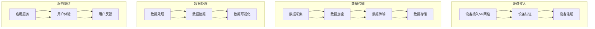

                 

## 文章标题

《5G 在物联网中的应用：低延迟和大规模连接》

### 关键词

- 5G技术
- 物联网
- 低延迟
- 大规模连接
- 网络架构
- 安全特性
- 应用场景

### 摘要

本文深入探讨了5G技术在物联网（IoT）中的应用，重点关注低延迟和大规模连接这两个关键特性。首先，我们回顾了5G技术的基本特点和物联网的架构，然后分析了5G网络架构及关键技术，包括网络切片、边缘计算等。接下来，我们详细阐述了低延迟和大规模连接在物联网中的重要性，并介绍了实现这些特性的5G技术。通过多个实际应用案例，我们展示了5G在智能家居、智能制造、车联网等领域的成功应用，并讨论了当前面临的挑战和未来的发展方向。文章最后提供了5G物联网应用的技术详解和实践指南。

## 第一部分: 5G 在物联网中的应用概述

### 第1章: 5G 技术与物联网

#### 1.1 5G 技术的特点

5G技术，即第五代移动通信技术，是继2G、3G和4G之后的最新一代移动通信技术。与前几代相比，5G具有以下几个显著特点：

1. **高速率**：5G网络的理论峰值下载速度可以达到20Gbps，是4G的100倍以上。这意味着在5G网络环境下，用户可以享受到更快的数据传输速度，极大地提升了网络体验。

2. **低延迟**：5G网络的端到端延迟最低可达1毫秒，远低于4G网络的平均延迟。低延迟对于物联网中的实时应用，如自动驾驶、远程手术等具有重要意义。

3. **大规模连接**：5G技术能够实现每平方公里内连接100万台设备的容量，大大提升了物联网设备的大规模连接能力。

4. **网络切片**：5G网络引入了网络切片技术，可以根据不同应用的需求灵活分配网络资源，提供定制化的网络服务。

5. **边缘计算**：5G网络与边缘计算相结合，可以将数据处理和计算任务分配到网络的边缘节点，降低延迟，提高响应速度。

#### 1.2 物联网的基本概念与架构

物联网（IoT）是指通过将各种设备和物品连接到互联网，实现信息的交换和通信的一种网络。物联网的基本架构通常包括以下几个层次：

1. **感知层**：通过传感器、RFID等设备感知物理世界的信息，如温度、湿度、位置等。

2. **传输层**：负责将感知层收集到的数据传输到数据处理中心。5G网络作为传输层的技术支撑，提供了高速、低延迟、大规模连接的能力。

3. **网络层**：网络层负责数据的传输和路由，确保数据能够准确、高效地到达目的地。

4. **平台层**：平台层是对数据进行处理、存储和管理，提供应用开发接口，支持各种物联网应用。

5. **应用层**：应用层是物联网的最终用户界面，提供各种物联网应用，如智能家居、智能制造、智能医疗等。

#### 1.3 5G 技术在物联网中的应用前景

随着5G技术的不断成熟和应用，其在物联网领域的应用前景十分广阔。以下是一些潜在的应用场景：

1. **智能家居**：5G技术能够实现智能家居设备的低延迟通信，提供更流畅的智能控制体验。例如，用户可以通过手机远程控制家中的灯光、空调等设备，实现真正的智能生活。

2. **智能制造**：5G技术可以为智能制造提供高速、低延迟的网络环境，实现工业机器人的实时控制、远程监控和故障诊断。这将大大提高生产效率和产品质量。

3. **车联网**：5G技术能够支持高速率、低延迟的车联网通信，实现车辆之间的实时信息交换和通信。这将为自动驾驶、智能交通等应用提供坚实的技术支持。

4. **智慧医疗**：5G技术可以支持远程医疗、实时监控等应用，提高医疗服务质量和效率。例如，医生可以通过5G网络远程诊断患者，实现真正的医疗资源优化。

5. **城市管理**：5G技术可以支持城市中的各种智能设备连接，实现智能交通、智能照明、智能环境监测等应用，提高城市管理的效率和质量。

总之，5G技术在物联网中的应用将为我们的生活、工作和生产带来深刻的变革，推动物联网的快速发展。然而，要实现这些应用，还需要克服一系列的技术挑战和实际问题。

## 第2章: 5G 网络架构与关键技术

### 2.1 5G 网络架构

5G网络架构相较于前几代移动通信技术有了显著的改进和优化。它由多个关键组件构成，包括基站、核心网、边缘计算节点等。以下是5G网络架构的主要组成部分：

1. **基站**：基站是5G网络中的核心设备，负责无线信号的发送和接收。5G基站采用了大规模MIMO（多输入多输出）技术，能够同时处理多个信号，提高了网络容量和频谱效率。

2. **核心网**：5G核心网负责处理网络中的数据传输和路由，包括无线接入网、分组交换域、控制平面等。5G核心网采用了服务化架构（SA），使得网络功能更加灵活和可定制。

3. **边缘计算节点**：边缘计算节点位于网络边缘，负责处理和存储数据，降低延迟，提高网络响应速度。边缘计算节点可以是云数据中心、基站或专用设备。

4. **用户设备**：用户设备（UE）是5G网络中的终端设备，包括智能手机、平板电脑、工业机器人等。用户设备通过无线接入网与基站通信，并通过核心网与互联网连接。

#### 5G 网络架构的演进

5G网络架构在演进过程中引入了多个关键技术和概念，包括网络功能虚拟化、服务化架构、网络切片等。以下是5G网络架构的演进过程：

1. **4G 到 5G 的演进**：4G网络采用分布式架构，核心网和无线接入网之间通过IP网络连接。5G网络则通过引入网络功能虚拟化和服务化架构，将核心网和无线接入网的功能进行解耦，提高了网络的灵活性和可扩展性。

2. **5G 网络功能虚拟化**：网络功能虚拟化（NFV）将传统的网络设备功能（如路由器、防火墙等）虚拟化为软件应用，运行在通用的硬件平台上。这样，网络功能可以更加灵活地部署、管理和升级。

3. **5G 服务化架构**：5G服务化架构（SA）进一步将网络功能和服务化，提供按需、动态的网络资源和服务。这使得网络可以更加灵活地适应不同应用的需求。

4. **网络切片**：网络切片是一种虚拟化网络资源的技术，可以将网络划分为多个逻辑子网，每个子网可以根据特定应用的需求进行资源分配和优化。网络切片技术为5G网络提供了高度灵活和定制化的网络服务。

### 2.2 5G 网络的关键技术

5G网络的成功离不开一系列关键技术的支持，这些技术涵盖了无线通信、网络架构、数据传输等方面。以下是5G网络的关键技术：

1. **大规模MIMO**：大规模MIMO技术通过在同一基站上部署多个天线，实现多个用户之间的同时通信，提高了网络容量和频谱效率。

2. **载波聚合**：载波聚合技术可以将多个频段的无线信号聚合在一起，提供更高的数据传输速率。

3. **网络切片**：网络切片技术可以将网络资源划分为多个逻辑子网，每个子网提供定制化的网络服务，满足不同应用的需求。

4. **边缘计算**：边缘计算技术将数据处理和计算任务分配到网络边缘的节点，降低延迟，提高网络响应速度。

5. **网络功能虚拟化**：网络功能虚拟化技术将传统的网络设备功能虚拟化为软件应用，提高了网络的灵活性和可扩展性。

6. **新型编码技术**：5G网络采用了新型编码技术，如LDPC（低密度奇偶校验）和Polar码，提高了数据传输的可靠性和效率。

7. **高频段通信**：5G网络引入了高频段通信，如毫米波频段，提供了更高的数据传输速率和更大的网络容量。

#### 5G 网络的安全特性

5G网络的安全特性是保障网络正常运行和数据安全的关键。5G网络的安全特性包括以下几个方面：

1. **端到端加密**：5G网络采用端到端加密技术，确保数据在传输过程中的安全性和隐私性。

2. **访问控制**：5G网络通过访问控制机制，确保只有授权用户可以访问网络资源。

3. **安全认证**：5G网络采用多种安全认证机制，如SIM卡、数字证书等，确保用户身份的真实性。

4. **安全隔离**：网络切片技术实现了不同应用之间的安全隔离，防止恶意攻击和数据泄露。

5. **入侵检测与防御**：5G网络部署了入侵检测与防御系统，实时监控网络行为，发现和阻止恶意攻击。

总之，5G网络架构和关键技术的演进，为物联网应用提供了强大的支持。通过大规模MIMO、载波聚合、网络切片、边缘计算等关键技术，5G网络实现了高速率、低延迟、大规模连接的特性。同时，5G网络的安全特性也为物联网应用提供了可靠的数据保护和隐私保障。

### 第3章: 物联网中的5G应用场景

#### 3.1 智能家居

智能家居是5G技术在物联网应用中的一个重要场景。5G网络的低延迟和高可靠性特性，使得智能家居设备可以实现无缝的通信和控制，从而提供更加智能、便捷的生活体验。

**应用背景**

随着智能家居设备的普及，家庭中的各种设备，如智能灯泡、智能门锁、智能空调等，都需要通过互联网进行连接和控制。然而，传统的4G网络在处理大量设备的同时，容易出现延迟和中断，影响用户体验。

**5G技术优势**

1. **低延迟**：5G网络的低延迟特性，可以确保智能家居设备之间的通信几乎是实时的，从而实现快速响应和控制。例如，当用户通过手机远程控制家中的灯光时，5G网络的低延迟可以保证灯光的即时响应。

2. **高可靠性**：5G网络的高可靠性，确保了智能家居设备在连接过程中不会出现频繁的中断和掉线。这对于依赖网络稳定性的智能家居设备来说，至关重要。

3. **大规模连接**：5G网络的大规模连接能力，可以同时连接更多的智能家居设备，满足家庭中日益增多的智能设备需求。

**具体应用案例**

- **智能灯泡控制**：用户可以通过手机APP实时控制家中的智能灯泡，调节亮度、颜色和开关。5G网络的低延迟和高速率，确保了灯光的即时响应，提供更加智能的照明体验。

- **智能门锁管理**：5G网络可以实现智能门锁的实时监控和管理，用户可以通过手机APP远程锁定或解锁门锁，提高了家庭安全性和便利性。

- **智能空调控制**：5G网络可以确保智能空调的实时控制和反馈，用户可以通过手机APP远程调节室内温度、湿度等参数，实现个性化空调体验。

**挑战与解决方案**

- **设备兼容性问题**：由于智能家居设备的多样性，不同品牌和型号的设备可能存在兼容性问题。为了解决这一问题，可以采用标准化协议和接口，确保设备之间的互操作性。

- **网络安全问题**：智能家居设备连接到互联网，存在一定的安全风险。为了保障网络安全，可以采用加密通信和访问控制等技术，防止未经授权的访问和恶意攻击。

**总结**

5G技术在智能家居中的应用，为用户提供了更加智能、便捷的家居生活体验。通过低延迟、高可靠性和大规模连接的特性，5G网络为智能家居设备提供了强大的支持。然而，在实际应用中，仍需要解决设备兼容性和网络安全等挑战，以实现智能家居的全面发展。

#### 3.2 智能制造

智能制造是5G技术在物联网应用中的另一个关键领域。5G网络的高速、低延迟和大容量特性，为智能制造提供了强有力的支持，推动了工业生产的智能化和自动化进程。

**应用背景**

随着工业4.0和智能制造的普及，制造业正经历着从传统的批量生产向个性化、定制化生产的转变。智能制造依赖于大量传感器、机器人和工业设备的互联互通，实现实时监控、数据分析和自动控制。然而，传统的网络技术难以满足智能制造对高速率、低延迟和高可靠性的需求。

**5G技术优势**

1. **高速率**：5G网络的高速率特性，可以支持大量工业设备的数据传输，满足智能制造中数据密集型应用的需求。例如，高速图像传输和大规模数据处理，可以实现工业机器人的实时控制。

2. **低延迟**：5G网络的低延迟特性，可以确保工业设备之间的实时通信和同步操作，提高生产效率和产品质量。例如，在协同工作的工业机器人之间，低延迟可以保证动作的精准和同步。

3. **大容量**：5G网络的大容量特性，可以同时连接大量的工业设备，满足智能制造中设备繁多、连接密集的场景需求。例如，工厂中的各种传感器、PLC（可编程逻辑控制器）和工业机器人，都可以通过5G网络实现互联互通。

**具体应用案例**

- **工业机器人控制**：5G网络可以实现工业机器人的实时控制和精确操作。例如，在装配线上，5G网络可以确保机器人快速响应指令，实现高效、准确的装配作业。

- **远程监控与维护**：5G网络可以支持远程监控和诊断工业设备。例如，通过5G网络，工程师可以远程监控机器人的运行状态，及时发现问题并进行维护，提高了设备利用率和生产效率。

- **数字化工厂**：5G网络可以支持数字化工厂的建设，实现工厂内各种设备和系统的互联互通。例如，通过5G网络，工厂可以实现生产数据的实时采集、分析和优化，提高生产效率和产品质量。

**挑战与解决方案**

- **设备兼容性问题**：由于智能制造设备的多样性，不同品牌和型号的设备可能存在兼容性问题。为了解决这一问题，可以采用标准化协议和接口，确保设备之间的互操作性。

- **网络安全问题**：智能制造系统连接到互联网，存在一定的安全风险。为了保障网络安全，可以采用加密通信、访问控制和入侵检测等技术，防止恶意攻击和数据泄露。

**总结**

5G技术在智能制造中的应用，为制造业的智能化和自动化提供了强有力的支持。通过高速率、低延迟和大容量的特性，5G网络为工业设备提供了高效、可靠的连接和通信。然而，在实际应用中，仍需要解决设备兼容性和网络安全等挑战，以实现智能制造的全面发展。

#### 3.3 车联网

车联网（V2X，Vehicle-to-Everything）是5G技术在物联网应用中的又一个重要场景。5G网络的高速、低延迟和大容量特性，为车联网提供了强大的支持，推动了智能交通和自动驾驶的发展。

**应用背景**

随着智能交通和自动驾驶技术的不断发展，车联网成为了一个重要的研究方向。车联网通过车辆与车辆、车辆与基础设施、车辆与行人等之间的互联互通，实现交通信息的实时共享和协同控制。然而，传统的网络技术难以满足车联网对高速率、低延迟和高可靠性的需求。

**5G技术优势**

1. **高速率**：5G网络的高速率特性，可以支持车联网中大量的数据传输，满足实时交通监控、高清视频流等应用的需求。例如，通过5G网络，车辆可以实时传输高清摄像头拍摄的行车画面，实现道路状况的实时监控。

2. **低延迟**：5G网络的低延迟特性，可以确保车联网中的通信是实时的，实现车辆之间的精确协同和控制。例如，在自动驾驶场景中，车辆需要实时接收其他车辆的信息，进行路径规划和决策，低延迟可以保证自动驾驶系统的安全性和稳定性。

3. **大容量**：5G网络的大容量特性，可以同时连接大量的车辆，满足车联网中设备繁多、连接密集的场景需求。例如，城市中的大量车辆可以通过5G网络实现互联互通，实现智能交通管理和优化。

**具体应用案例**

- **自动驾驶**：5G网络可以实现自动驾驶车辆的实时控制和协同操作。例如，通过5G网络，自动驾驶车辆可以实时接收道路信息、交通状况和其他车辆的位置，进行精确的路径规划和驾驶决策。

- **车联网监控**：5G网络可以支持车联网的实时监控和数据分析。例如，通过5G网络，车辆可以实时上传行驶数据、行驶环境信息等，实现道路状况的实时监控和交通流量分析。

- **智能交通管理**：5G网络可以支持智能交通管理系统，实现交通信号的实时控制和管理。例如，通过5G网络，交通信号灯可以根据实时交通流量进行动态调整，优化交通流量，减少拥堵。

**挑战与解决方案**

- **频谱资源分配**：车联网需要大量的频谱资源，但频谱资源有限。为了解决这一问题，可以采用频谱共享技术，提高频谱资源的利用率。

- **网络安全问题**：车联网连接到互联网，存在一定的安全风险。为了保障网络安全，可以采用加密通信、访问控制和入侵检测等技术，防止恶意攻击和数据泄露。

**总结**

5G技术在车联网中的应用，为智能交通和自动驾驶提供了强大的支持。通过高速率、低延迟和大容量的特性，5G网络为车联网提供了高效、可靠的连接和通信。然而，在实际应用中，仍需要解决频谱资源分配和网络安全等挑战，以实现车联网的全面发展。

#### 3.4 健康医疗

健康医疗是5G技术在物联网应用中的关键领域之一。5G网络的高速、低延迟和大容量特性，为医疗行业带来了新的机遇，推动了远程医疗、智能医疗设备和实时健康监测等应用的发展。

**应用背景**

随着人口老龄化和健康意识的提高，医疗行业对信息化的需求日益增长。传统的医疗网络难以满足医疗行业对高速率、低延迟和高可靠性的需求，限制了医疗服务的质量和效率。5G网络的引入，为医疗行业提供了新的解决方案。

**5G技术优势**

1. **高速率**：5G网络的高速率特性，可以支持医疗数据的实时传输和高清视频流，满足远程医疗、医学影像传输等应用的需求。例如，通过5G网络，医生可以实时查看患者的医学影像，进行远程诊断和治疗。

2. **低延迟**：5G网络的低延迟特性，可以确保医疗数据传输的实时性和准确性，提高医疗服务的效率和准确性。例如，在远程手术中，低延迟可以保证医生对手术设备的实时控制和操作。

3. **大容量**：5G网络的大容量特性，可以同时连接大量的医疗设备和传感器，满足医疗行业设备繁多、连接密集的场景需求。例如，医院中的各种监护设备、传感器和医疗机器人，都可以通过5G网络实现互联互通。

**具体应用案例**

- **远程医疗**：5G网络可以实现远程医疗的诊断和治疗。例如，通过5G网络，医生可以实时查看患者的病历、医学影像和生命体征，进行远程诊断和治疗，提高了医疗服务的可及性和质量。

- **智能医疗设备**：5G网络可以支持智能医疗设备的实时监控和管理。例如，通过5G网络，医生可以远程监控患者的监护设备数据，及时发现异常情况并进行处理。

- **实时健康监测**：5G网络可以实现实时健康监测和预警。例如，通过5G网络，患者可以实时上传健康数据，如心率、血压、血糖等，医生可以实时监控患者的健康状况，并进行预警和干预。

**挑战与解决方案**

- **数据隐私和安全**：医疗数据具有高度敏感性，保护数据隐私和安全是关键挑战。为了解决这一问题，可以采用数据加密、访问控制和身份验证等技术，确保医疗数据的安全。

- **设备兼容性和标准化**：医疗设备的多样性和标准化问题，对5G网络的兼容性提出了挑战。为了解决这一问题，可以采用标准化协议和接口，确保医疗设备和5G网络的互操作性。

**总结**

5G技术在健康医疗领域的应用，为医疗行业带来了新的机遇和变革。通过高速率、低延迟和大容量的特性，5G网络为远程医疗、智能医疗设备和实时健康监测等应用提供了强大的支持。然而，在实际应用中，仍需要解决数据隐私、安全和设备兼容性等挑战，以实现健康医疗的全面发展。

#### 3.5 城市管理

城市管理是5G技术在物联网应用中的关键领域之一。5G网络的高速、低延迟和大容量特性，为城市管理提供了新的技术手段，推动了智能交通、智能照明和智能环境监测等应用的发展。

**应用背景**

随着城市化进程的加快，城市管理面临诸多挑战，如交通拥堵、能源浪费、环境污染等。传统的城市管理方式依赖于人工和传统技术，效率低下、响应缓慢。5G网络的引入，为城市管理提供了智能化、高效化的解决方案。

**5G技术优势**

1. **高速率**：5G网络的高速率特性，可以支持大量的数据传输，满足城市管理中数据密集型应用的需求。例如，通过5G网络，城市可以实现高清视频监控、大规模数据采集和实时交通监控等。

2. **低延迟**：5G网络的低延迟特性，可以确保城市管理系统中的实时通信和快速响应。例如，在智能交通系统中，低延迟可以确保交通信号灯的实时控制和调整，优化交通流量。

3. **大容量**：5G网络的大容量特性，可以同时连接大量的设备，满足城市管理中设备繁多、连接密集的场景需求。例如，城市中的各种传感器、监控设备和智能设备，都可以通过5G网络实现互联互通。

**具体应用案例**

- **智能交通**：5G网络可以实现智能交通系统的实时监控和管理。例如，通过5G网络，交通管理部门可以实时获取道路状况、车辆流量等信息，动态调整交通信号灯，减少交通拥堵。

- **智能照明**：5G网络可以支持智能照明系统的实时控制和优化。例如，通过5G网络，城市管理者可以实时监控路灯的工作状态，根据实际需要调整亮度和开关时间，提高能源利用效率。

- **智能环境监测**：5G网络可以实现实时环境监测和数据采集。例如，通过5G网络，城市中的空气质量监测设备、水质监测设备等可以实时上传监测数据，城市管理者可以及时掌握环境状况，采取相应的管理措施。

**挑战与解决方案**

- **数据隐私和安全**：城市管理中的数据具有高度敏感性，保护数据隐私和安全是关键挑战。为了解决这一问题，可以采用数据加密、访问控制和入侵检测等技术，确保数据的安全。

- **设备兼容性和标准化**：城市管理中的设备多样，标准化问题对5G网络的兼容性提出了挑战。为了解决这一问题，可以采用标准化协议和接口，确保设备的互操作性。

**总结**

5G技术在城市管理中的应用，为城市管理提供了智能化、高效化的手段。通过高速率、低延迟和大容量的特性，5G网络为智能交通、智能照明和智能环境监测等应用提供了强大的支持。然而，在实际应用中，仍需要解决数据隐私、安全和设备兼容性等挑战，以实现城市管理的全面发展。

### 第二部分: 低延迟在物联网中的应用

#### 第4章: 低延迟与物联网

#### 4.1 低延迟的定义与重要性

低延迟是指在数据传输过程中，从数据发送到接收所需的时间尽可能短。在物联网（IoT）中，低延迟是指物联网设备之间的通信延迟低，确保数据能够快速、实时地传输和处理。

**定义**

低延迟（Low Latency）通常指的是在数据传输过程中，从发送端到接收端所需的时间。在物联网中，低延迟意味着设备能够快速响应外部事件或请求，实现实时通信和数据交互。

**重要性**

低延迟在物联网中的应用具有以下几个重要方面：

1. **实时性要求**：许多物联网应用对实时性有很高的要求，如自动驾驶、远程手术、智能交通等。低延迟确保了这些应用能够实时响应外部事件，提高系统的稳定性和可靠性。

2. **用户体验**：对于智能家居、虚拟现实（VR）和增强现实（AR）等应用，低延迟可以提供更流畅的用户体验，避免延迟带来的不适和干扰。

3. **资源优化**：低延迟可以减少设备等待时间，提高系统资源的利用率，从而降低能源消耗和成本。

4. **安全性**：低延迟可以提高系统的安全性，及时检测和响应潜在的安全威胁，避免由于延迟导致的安全漏洞。

#### 4.2 物联网中低延迟的需求

物联网中低延迟的需求可以从以下几个方面进行详细分析：

1. **工业应用**：在智能制造中，工业机器人需要实时响应控制指令，进行精确操作。低延迟确保了机器人能够快速响应，提高生产效率和产品质量。

2. **智能交通**：在智能交通系统中，车辆需要实时交换交通信息，进行路径规划和动态调度。低延迟可以确保交通信号灯、自动驾驶车辆等能够及时响应，优化交通流量，减少拥堵。

3. **远程医疗**：在远程医疗中，医生需要实时获取患者的医疗数据，进行诊断和治疗。低延迟确保了医疗数据的及时传输和处理，提高医疗服务的质量和效率。

4. **智能能源管理**：在智能能源管理中，能源设备需要实时监测和响应电力供需变化，实现能源的优化分配和调度。低延迟可以确保能源系统的高效运行，减少能源浪费。

5. **智能家居**：在智能家居中，设备需要实时响应用户的操作请求，提供智能化的生活体验。低延迟可以确保智能家居设备能够快速响应，提高用户体验。

#### 4.3 低延迟技术在物联网中的应用

为了满足物联网中低延迟的需求，多种技术被应用于实现低延迟通信。以下是一些常用的低延迟技术在物联网中的应用：

1. **5G技术**：5G技术通过引入大规模MIMO、载波聚合、网络切片等技术，实现了低延迟通信。5G网络的理论峰值延迟仅为1毫秒，可以满足物联网中高实时性应用的需求。

2. **边缘计算**：边缘计算将数据处理和计算任务分配到网络边缘节点，降低数据传输的延迟。通过在边缘节点部署计算资源，可以实现本地化处理，减少数据传输距离，提高响应速度。

3. **实时通信协议**：实时通信协议如WebRTC和LPC（Low-Power Communication），专门设计用于实现低延迟通信。这些协议优化了数据传输过程，减少了延迟和开销。

4. **优化网络架构**：通过优化物联网网络架构，减少数据传输路径，降低网络延迟。例如，采用星型拓扑结构、多跳传输等策略，可以提高数据传输的实时性。

5. **压缩和加密算法**：采用高效的压缩和加密算法，减少数据传输的时间和延迟。通过压缩算法减少数据体积，加密算法确保数据在传输过程中的安全性。

### 第5章: 实现低延迟的5G技术

#### 5.1 5G NR技术

5G NR（New Radio）技术是5G网络中的核心无线接入技术，它通过引入多种关键技术，实现了低延迟、高速率和大规模连接。以下是5G NR技术的原理和特点：

**5G NR技术原理**

1. **多连接性**：5G NR技术采用了大规模MIMO（多输入多输出）技术，通过在同一基站上部署多个天线，实现多个用户之间的同时通信。大规模MIMO提高了网络容量和频谱效率，同时减少了用户间的干扰。

2. **频谱灵活性**：5G NR技术支持多种频谱，包括低频段、中频段和毫米波频段。低频段提供了较好的覆盖和穿透能力，中频段提供了较高的数据速率，毫米波频段提供了极高的数据速率。频谱灵活性使得5G NR技术可以在不同场景下灵活部署。

3. **波束成形**：5G NR技术采用了波束成形技术，通过调整天线阵列的方向和功率，将信号聚焦到目标用户，提高了信号的传输效率和覆盖范围。

4. **多连接技术**：5G NR技术支持多连接技术，可以在同一时间内为多个用户提供独立的连接。多连接技术通过动态分配资源，实现了更高的网络容量和用户体验。

**5G NR技术特点**

1. **高速率**：5G NR技术的理论峰值速率可以达到20Gbps，是4G网络的100倍以上。高速率使得5G NR技术能够满足物联网中数据密集型应用的需求。

2. **低延迟**：5G NR技术的端到端延迟最低可达1毫秒，远低于4G网络的平均延迟。低延迟对于物联网中的实时应用，如自动驾驶、远程手术等具有重要意义。

3. **大规模连接**：5G NR技术能够实现每平方公里内连接100万台设备的容量，大大提升了物联网设备的大规模连接能力。

4. **频谱灵活性**：5G NR技术支持多种频谱，包括低频段、中频段和毫米波频段，提供了广泛的频谱资源，使得5G NR技术可以在不同场景下灵活部署。

#### 5.2 5G MEC技术

5G MEC（Mobile Edge Computing）技术是5G网络中的重要技术之一，它通过将数据处理和计算任务分配到网络边缘节点，降低了数据传输的延迟，提高了系统的响应速度和性能。以下是5G MEC技术的原理和特点：

**5G MEC技术原理**

1. **边缘计算节点**：5G MEC技术在网络边缘部署了大量的计算节点，这些节点可以处理和存储数据，提供计算服务。边缘计算节点可以是云数据中心、基站或专用设备。

2. **数据分流**：5G MEC技术通过数据分流技术，将用户数据流量分配到最近的边缘计算节点进行处理，减少了数据传输的距离和延迟。

3. **本地处理**：5G MEC技术将数据处理和计算任务分配到边缘计算节点，实现了本地化处理，减少了数据传输的时间和延迟。

4. **协同计算**：5G MEC技术支持边缘计算节点之间的协同计算，多个边缘节点可以共同处理复杂的计算任务，提高了系统的计算能力和性能。

**5G MEC技术特点**

1. **低延迟**：5G MEC技术通过将数据处理和计算任务分配到网络边缘，减少了数据传输的延迟，提高了系统的响应速度。

2. **高性能**：5G MEC技术通过在网络边缘部署计算资源，实现了本地化处理，提高了系统的计算性能和响应能力。

3. **灵活可扩展**：5G MEC技术可以根据应用需求，灵活部署和扩展边缘计算节点，满足了不同场景下的计算需求。

4. **高效能**：5G MEC技术通过协同计算和分布式处理，提高了系统的计算效率和资源利用率。

#### 5.3 5G 网络切片技术

5G网络切片技术是5G网络中的关键技术创新，它通过虚拟化网络资源，为不同应用提供定制化的网络服务。以下是5G网络切片技术的原理和特点：

**5G网络切片技术原理**

1. **虚拟化网络资源**：5G网络切片技术通过虚拟化技术，将物理网络资源划分为多个逻辑切片，每个切片提供独立的网络资源和服务。

2. **定制化网络服务**：5G网络切片技术可以根据不同应用的需求，为每个切片提供定制化的网络服务，如带宽、延迟、安全等。

3. **资源分配**：5G网络切片技术通过智能资源分配算法，动态调整网络资源，确保每个切片都能获得所需的网络资源。

4. **切片间隔离**：5G网络切片技术实现了切片间的隔离，确保不同切片之间的数据不会相互干扰，提高了网络的安全性和可靠性。

**5G网络切片技术特点**

1. **灵活可定制**：5G网络切片技术可以根据不同应用的需求，提供定制化的网络服务，满足多样化的应用需求。

2. **高效资源利用**：5G网络切片技术通过虚拟化网络资源，实现了资源的高效利用，提高了网络的资源利用率。

3. **隔离性**：5G网络切片技术实现了切片间的隔离，提高了网络的安全性和可靠性。

4. **低延迟**：5G网络切片技术通过智能资源分配和边缘计算，实现了低延迟通信，满足实时应用的需求。

### 第6章: 低延迟物联网应用案例

#### 6.1 智能家居低延迟应用

智能家居是5G技术在物联网中低延迟应用的一个重要场景。通过5G网络的低延迟特性，智能家居设备可以实现快速响应，提供更加智能、便捷的生活体验。以下是一个具体的智能家居低延迟应用案例：

**案例背景**

小明是一名智能家居的用户，他住在一座现代化的智能住宅中。他的智能家居系统包括智能灯泡、智能门锁、智能摄像头和智能空调等设备。小明希望通过5G网络，实现设备之间的低延迟通信，提高智能家居的智能化水平。

**应用实现**

1. **设备接入**：小明家的智能家居设备通过5G网络连接到智能住宅的物联网平台。5G网络的高速率和低延迟特性，确保了设备之间的数据传输速度和实时性。

2. **远程控制**：小明可以通过手机APP远程控制家中的智能灯泡、智能门锁和智能空调。5G网络的低延迟特性，确保了用户的操作能够快速、准确地传输到设备端，设备能够即时响应。

3. **实时监控**：智能摄像头可以实时监控家中的安全状况，并将视频流传输到小明的手机上。5G网络的低延迟特性，确保了视频流的实时传输，小明可以实时查看家中的情况，保障家庭安全。

4. **设备联动**：当小明的智能门锁打开时，智能灯泡会自动开启，空调会调整到预设的温度。5G网络的低延迟特性，确保了设备之间的联动反应迅速，提高了智能家居的智能化水平。

**案例效果**

通过5G网络的低延迟特性，小明的智能家居系统实现了快速响应和高效控制。用户可以随时随地通过手机APP控制家中的设备，实现真正的智能生活。实时监控功能提高了家庭安全水平，设备联动功能提升了智能家居的智能化体验。5G网络为智能家居应用提供了强大的支持，推动了智能家居的普及和发展。

#### 6.2 车联网低延迟应用

车联网是5G技术在物联网中低延迟应用的另一个重要场景。通过5G网络的低延迟特性，车联网可以实现车辆之间的实时通信，提高交通安全和效率。以下是一个具体的车联网低延迟应用案例：

**案例背景**

张先生是一名驾驶爱好者，他驾驶一辆配备了先进车联网系统的汽车。他的汽车可以通过5G网络与其他车辆、基础设施和云端平台进行通信。张先生希望通过5G网络的低延迟特性，实现车辆的实时通信，提高驾驶安全性和效率。

**应用实现**

1. **车辆通信**：张先生的汽车通过5G网络与其他车辆进行通信，实现车辆之间的实时信息交换。5G网络的低延迟特性，确保了车辆之间通信的实时性和准确性。

2. **实时导航**：张先生的汽车可以通过5G网络获取实时的交通信息，实现实时导航。当遇到交通拥堵时，汽车可以自动调整路线，避开拥堵路段，提高驾驶效率。

3. **车辆监控**：张先生的汽车可以通过5G网络实时上传行驶数据，包括速度、位置、加速度等。云端平台可以实时监控车辆的行驶状况，提供驾驶建议和安全预警。

4. **自动驾驶**：张先生的汽车配备了自动驾驶系统，可以通过5G网络实现车辆的自动驾驶。自动驾驶系统可以实时接收交通信息，进行路径规划和驾驶决策，实现安全、舒适的自动驾驶体验。

**案例效果**

通过5G网络的低延迟特性，车联网系统实现了车辆之间的实时通信和高效控制。实时导航功能提高了驾驶效率，车辆监控功能提高了驾驶安全性，自动驾驶功能提供了更加便捷的驾驶体验。5G网络为车联网应用提供了强大的支持，推动了车联网技术的快速发展，为未来的智能交通和自动驾驶提供了重要基础。

#### 6.3 健康医疗低延迟应用

健康医疗是5G技术在物联网中低延迟应用的另一个关键领域。通过5G网络的低延迟特性，健康医疗系统可以实现实时监控、远程诊断和远程手术等应用，提高医疗服务质量和效率。以下是一个具体的健康医疗低延迟应用案例：

**案例背景**

李医生是一名专业的远程医生，他通过5G网络为偏远地区的患者提供远程医疗服务。他的医疗系统包括远程诊断设备、高清视频通信设备和远程手术设备。李医生希望通过5G网络的低延迟特性，实现实时监控和远程手术，提高医疗服务覆盖面和效率。

**应用实现**

1. **远程诊断**：李医生的远程诊断设备可以通过5G网络实时上传患者的健康数据，包括心率、血压、血糖等。5G网络的低延迟特性，确保了健康数据的实时传输和处理，李医生可以实时监控患者的健康状况。

2. **实时视频通信**：李医生可以通过5G网络与患者进行实时视频通信，进行面对面咨询和诊断。5G网络的低延迟特性，确保了视频通信的实时性和清晰度，患者可以感受到如同面对面就诊的体验。

3. **远程手术**：李医生的医疗系统配备了远程手术设备，可以通过5G网络实现远程手术操作。5G网络的低延迟特性，确保了手术操作的实时性和准确性，医生可以远程进行手术，为偏远地区的患者提供高质量的医疗服务。

4. **数据存储和分析**：李医生的健康医疗系统可以将患者的健康数据存储在云端，并通过大数据分析技术进行数据挖掘和分析。5G网络的低延迟特性，确保了数据的实时传输和存储，为远程医疗和健康监测提供了重要支持。

**案例效果**

通过5G网络的低延迟特性，健康医疗系统实现了实时监控、远程诊断和远程手术等应用。实时诊断和远程手术功能提高了医疗服务质量和效率，远程视频通信功能提供了更加便捷和高效的医疗服务体验。5G网络为健康医疗应用提供了强大的支持，推动了医疗技术的创新和发展，为全民健康提供了重要保障。

### 第三部分：大规模连接在物联网中的应用

#### 第7章: 大规模连接与物联网

#### 7.1 大规模连接的定义与重要性

大规模连接（Massive Connectivity）是指能够在同一时间和同一地理区域内连接大量设备的能力。在物联网（IoT）中，大规模连接意味着能够在有限的空间内支持数十万甚至数百万设备的互联互通。大规模连接是物联网发展的基础，对于实现物联网的广泛应用具有重要意义。

**定义**

大规模连接（Massive Connectivity）是指在物联网环境中，能够同时支持数十万甚至数百万设备的连接能力。这种连接能力不仅包括物理连接，还涉及数据传输、网络管理和系统协同等方面。

**重要性**

1. **设备多样性**：大规模连接支持各种类型的物联网设备，包括传感器、智能设备、无人机、车辆等，满足不同应用场景的需求。

2. **数据采集与处理**：大规模连接使得大量设备能够同时采集和传输数据，为大数据分析和智能决策提供了丰富的数据来源。

3. **智能化应用**：大规模连接为物联网应用提供了广泛的应用场景，如智能制造、智能交通、智能城市等，推动了智能化的进一步发展。

4. **资源高效利用**：大规模连接实现了网络资源的高效利用，通过合理的资源分配和管理，提高了网络的容量和性能。

#### 7.2 物联网中大规模连接的需求

物联网中的大规模连接需求可以从以下几个方面进行详细分析：

1. **设备数量**：物联网设备的数量正在快速增长，从智能家居的单个设备到工业物联网中的大量传感器和设备，对大规模连接的需求日益迫切。

2. **连接密度**：在城市环境中，如智能交通、智能照明和智能安全监控等应用，对连接密度有很高的要求，需要在有限的空间内支持大量的设备连接。

3. **数据传输**：物联网设备产生的数据量巨大，需要高效、可靠的传输机制来处理和传输这些数据，大规模连接技术提供了这种能力。

4. **实时响应**：许多物联网应用对实时响应有很高的要求，如智能医疗、智能交通和工业自动化等，大规模连接技术可以满足这些需求。

5. **可靠性**：大规模连接需要确保设备之间的稳定连接和通信，避免由于设备数量过多而导致的网络拥塞和中断。

#### 7.3 大规模连接技术在物联网中的应用

为了满足物联网中大规模连接的需求，多种大规模连接技术在物联网中得到广泛应用。以下是一些关键的大规模连接技术在物联网中的应用：

1. **5G技术**：5G技术通过引入网络切片、边缘计算和MIMO等技术，实现了大规模连接。5G网络的大规模连接能力，可以支持数十万甚至数百万设备的连接。

2. **LPWAN（低功耗广域网）**：LPWAN技术如LoRa、NB-IoT和LTE-M等，提供了低功耗、广覆盖和低成本的大规模连接解决方案，适用于智能家居、智能城市等应用。

3. **SDN（软件定义网络）**：SDN技术通过虚拟化和自动化管理网络资源，实现了大规模连接的灵活性和高效性，适用于复杂物联网网络的部署和管理。

4. **边缘计算**：边缘计算技术通过在网络边缘部署计算资源，减少了数据传输的距离和延迟，提高了大规模连接的实时性和可靠性。

5. **物联网协议**：物联网协议如MQTT、CoAP和OPC UA等，提供了高效、可靠的数据传输机制，适用于大规模连接环境。

### 第8章: 实现大规模连接的5G技术

#### 8.1 5G 频谱规划

5G频谱规划是确保5G网络能够实现大规模连接的基础。5G频谱规划涉及频谱的分配、频率的选择和频谱资源的优化，以确保网络的高效运行和大规模连接的实现。以下是5G频谱规划的关键步骤和注意事项：

**关键步骤**

1. **频谱分配**：频谱分配是5G频谱规划的首要任务，涉及到国家层面和国际层面的协调。国家需要根据本国5G发展的需求，合理分配频谱资源，确保网络的高效运行。

2. **频率选择**：5G频谱规划需要选择合适的频率，包括低频段、中频段和毫米波频段。不同频率的频谱具有不同的特性，如覆盖范围、传输速率和干扰情况等，需要根据具体应用场景进行选择。

3. **频谱优化**：频谱优化是5G频谱规划的重要环节，通过优化频谱资源的分配和使用，提高网络容量和性能。频谱优化可以通过频率复用、频谱共享和动态频谱管理等方式实现。

**注意事项**

1. **国际协调**：5G频谱规划需要与国际电联（ITU）等国际组织进行协调，确保频谱资源的国际互操作性和兼容性。

2. **频谱保护**：频谱保护是5G频谱规划的重要任务，需要保护关键频谱资源，避免干扰和频谱浪费。频谱保护可以通过频谱监测、频谱共享和频谱分配策略实现。

3. **频谱利用效率**：5G频谱规划需要提高频谱利用效率，通过优化频谱资源的分配和使用，提高网络容量和性能。频谱利用效率可以通过频谱共享、动态频谱管理和频谱复用等方式实现。

#### 8.2 5G 多连接技术

5G多连接技术是5G网络实现大规模连接的关键技术之一。5G多连接技术通过引入网络切片、边缘计算和MIMO等技术，提高了网络的连接能力和性能。以下是5G多连接技术的原理和特点：

**原理**

1. **网络切片**：网络切片是将物理网络资源虚拟化为多个逻辑网络，为不同应用提供定制化的网络服务。网络切片技术可以实现大规模连接，满足不同应用场景的需求。

2. **边缘计算**：边缘计算是将数据处理和计算任务分配到网络边缘节点，降低数据传输的延迟和带宽需求。边缘计算技术可以提高网络的响应速度和性能，实现大规模连接。

3. **MIMO技术**：MIMO技术通过在同一基站上部署多个天线，实现多个用户之间的同时通信，提高了网络的容量和频谱效率。

**特点**

1. **大规模连接**：5G多连接技术可以实现数十万甚至数百万设备的连接，满足物联网中大规模连接的需求。

2. **高带宽**：5G多连接技术通过MIMO技术和频谱复用，提供了高带宽的网络连接，满足大数据传输的需求。

3. **低延迟**：5G多连接技术通过边缘计算和MIMO技术，降低了数据传输的延迟，提高了网络的实时性。

4. **灵活可定制**：5G多连接技术可以根据不同应用的需求，提供定制化的网络服务，实现灵活的网络配置和管理。

#### 8.3 5G 资源分配技术

5G资源分配技术是实现大规模连接的关键技术之一。5G资源分配技术通过优化网络资源的使用和分配，提高了网络的容量和性能。以下是5G资源分配技术的原理和算法：

**原理**

1. **资源类型**：5G资源分配涉及多种类型的资源，包括频谱资源、网络带宽、计算资源等。不同类型的资源需要根据不同应用场景进行分配和管理。

2. **资源需求**：5G资源分配需要根据用户的通信需求，合理分配资源，确保用户获得所需的网络服务。

3. **资源分配策略**：5G资源分配策略包括动态分配和静态分配。动态分配根据用户的实时需求，动态调整资源分配，提高网络的灵活性和适应性。静态分配预先分配资源，减少网络资源的浪费。

**算法**

1. **基于队列管理的资源分配算法**：基于队列管理的资源分配算法通过优化队列长度和传输速率，提高网络的吞吐量和公平性。

2. **基于频谱共享的资源分配算法**：基于频谱共享的资源分配算法通过多个用户共享频谱资源，提高频谱利用效率。

3. **基于资源需求的资源分配算法**：基于资源需求的资源分配算法根据用户的通信需求，动态调整资源分配，满足用户的通信需求。

### 第9章: 大规模连接物联网应用案例

#### 9.1 智能制造大规模连接应用

智能制造是5G技术在物联网中大规模连接应用的一个重要场景。5G技术的高带宽、低延迟和大规模连接能力，为智能制造提供了强大的支持，推动了工业生产的智能化和自动化进程。以下是一个具体的智能制造大规模连接应用案例：

**案例背景**

某制造企业致力于实现智能制造，提高生产效率和产品质量。为了实现这一目标，企业决定引入5G技术，构建一个大规模连接的智能制造系统。

**应用实现**

1. **设备连接**：企业将5G网络部署到生产现场，将各种制造设备连接到5G网络，包括工业机器人、数控机床、传感器等。5G网络的高带宽和低延迟特性，确保了设备之间的通信是实时、高效的。

2. **数据采集**：通过5G网络，设备可以实时采集生产过程中的数据，包括设备状态、生产进度、产品质量等。数据采集系统将数据传输到云端平台，进行数据分析和处理。

3. **远程监控与控制**：企业通过5G网络实现了远程监控和控制，工程师可以随时随地通过手机或电脑，监控生产设备的运行状态，进行故障诊断和远程调试。

4. **设备协同**：通过5G网络，工业机器人、数控机床等设备可以实时协同工作，提高生产效率。例如，当一条生产线上的机器人需要更换工件时，机器人可以通过5G网络与其他设备进行通信，实现无缝切换。

**案例效果**

通过5G技术的应用，企业实现了大规模连接的智能制造系统。设备之间的实时通信和数据交换，提高了生产效率和产品质量。远程监控和控制功能，提高了设备的利用率和维护效率。设备协同工作，进一步提高了生产线的效率和灵活性。5G技术为智能制造提供了强大的支持，推动了制造业的智能化和数字化转型。

#### 9.2 城市管理大规模连接应用

城市管理是5G技术在物联网中大规模连接应用的另一个关键领域。5G技术的大带宽、低延迟和大规模连接能力，为城市管理的智能化和高效化提供了强有力的支持。以下是一个具体的城市管理大规模连接应用案例：

**案例背景**

某城市政府致力于打造智慧城市，提升城市管理的效率和水平。为了实现这一目标，政府决定引入5G技术，构建一个大规模连接的智能城市管理系统。

**应用实现**

1. **设备连接**：政府将5G网络部署到城市的各个角落，包括交通信号灯、摄像头、传感器等。5G网络的高带宽和低延迟特性，确保了设备之间的通信是实时、高效的。

2. **数据采集**：通过5G网络，各种设备可以实时采集城市环境的数据，包括交通流量、空气质量、噪音水平等。数据采集系统将数据传输到云端平台，进行数据分析和处理。

3. **智能交通管理**：政府通过5G网络实现了智能交通管理系统。交通信号灯可以根据实时交通流量数据，动态调整信号时长，优化交通流量，减少拥堵。同时，交通监控摄像头可以实时监控道路状况，及时处理交通事故。

4. **环境监测**：政府通过5G网络实现了环境监测系统。传感器可以实时监测空气质量和噪音水平，并将数据传输到云端平台。政府可以根据监测数据，及时采取措施改善环境质量。

**案例效果**

通过5G技术的应用，政府实现了大规模连接的智能城市管理系统。设备之间的实时通信和数据交换，提高了城市管理的效率和准确性。智能交通管理和环境监测系统，提高了城市服务的质量和居民的生活品质。5G技术为城市管理提供了强大的支持，推动了智慧城市的建设和发展。

#### 9.3 车联网大规模连接应用

车联网是5G技术在物联网中大规模连接应用的另一个重要领域。5G技术的高带宽、低延迟和大规模连接能力，为车联网提供了强大的支持，推动了智能交通和自动驾驶的发展。以下是一个具体的车联网大规模连接应用案例：

**案例背景**

某城市政府决定建设一个智能车联网系统，提升城市交通的管理效率和安全性。为了实现这一目标，政府决定引入5G技术，构建一个大规模连接的车联网系统。

**应用实现**

1. **车辆连接**：政府将5G网络部署到城市的各个角落，包括道路、停车场等。5G网络的高带宽和低延迟特性，确保了车辆之间的通信是实时、高效的。

2. **车辆监测**：通过5G网络，车辆可以实时上传行驶数据，包括速度、位置、方向等。车辆监测系统可以实时监控车辆运行状态，及时发现和预警异常情况。

3. **智能交通管理**：政府通过5G网络实现了智能交通管理系统。交通信号灯可以根据实时交通流量数据，动态调整信号时长，优化交通流量，减少拥堵。同时，交通监控摄像头可以实时监控道路状况，及时处理交通事故。

4. **自动驾驶**：政府通过5G网络实现了自动驾驶技术的应用。自动驾驶车辆可以通过5G网络与其他车辆、基础设施和云端平台进行通信，实现实时路径规划和驾驶决策，提高行驶安全性和效率。

**案例效果**

通过5G技术的应用，政府实现了大规模连接的智能车联网系统。车辆之间的实时通信和数据交换，提高了交通管理的效率和准确性。智能交通管理和自动驾驶系统，提高了交通服务的质量和安全性。5G技术为车联网提供了强大的支持，推动了智能交通和自动驾驶的发展。

### 第10章: 5G 在物联网中的应用挑战与未来展望

#### 10.1 5G 在物联网中的应用挑战

尽管5G技术在物联网中的应用前景广阔，但实际应用过程中仍面临一系列挑战，这些挑战包括技术、经济、安全和隐私等方面。以下是5G在物联网应用中的一些主要挑战及其应对策略：

**1. 技术挑战**

- **网络稳定性**：5G网络在高速率和低延迟方面具有优势，但在大规模连接和复杂环境下，网络稳定性仍是一个挑战。网络可能会受到干扰、信号衰减和设备故障等因素的影响，导致连接中断或数据丢失。为了提高网络稳定性，可以采用冗余网络设计、动态频谱管理和故障检测与恢复技术。

- **网络覆盖**：5G网络虽然具有大带宽和低延迟的优势，但毫米波频段信号穿透能力较差，容易受到环境因素的干扰。为了解决网络覆盖问题，可以采用多天线技术、频谱共享和异构网络部署等方法，提高网络的覆盖范围和信号强度。

- **设备兼容性**：物联网设备种类繁多，不同设备可能采用不同的通信协议和标准。设备兼容性问题可能导致通信障碍和互操作性问题。为了解决设备兼容性问题，可以采用标准化协议和接口，确保设备之间的互操作性。

**2. 经济挑战**

- **建设成本**：5G网络的部署需要大量的投资，包括基站建设、频谱购买和网络升级等。对于企业和政府来说，5G网络的建设成本是一个重要的经济负担。为了降低建设成本，可以采用共享基站、云计算和物联网平台等创新解决方案，实现资源的高效利用。

- **运营成本**：5G网络的高带宽和低延迟特性，虽然提高了网络性能，但也增加了运营成本。特别是在大规模连接场景中，网络的维护和运营成本可能会显著上升。为了降低运营成本，可以采用自动化网络管理、能效优化和虚拟化技术等手段，提高网络运营效率。

**3. 安全挑战**

- **网络安全**：5G网络连接了大量的物联网设备，成为网络攻击的目标。网络攻击可能导致设备失控、数据泄露和系统瘫痪等严重后果。为了保障网络安全，可以采用加密通信、访问控制和入侵检测等技术，提高网络的安全性。

- **数据隐私**：物联网设备产生的数据包含大量的个人信息，数据隐私保护成为关键挑战。为了保护数据隐私，可以采用数据加密、匿名化和数据访问控制等技术，确保数据在传输和存储过程中的安全性。

**4. 隐私挑战**

- **隐私泄露**：物联网设备连接到互联网，可能导致用户隐私泄露。隐私泄露可能导致用户个人信息被滥用，甚至被不法分子利用。为了保护用户隐私，可以采用隐私保护协议和隐私计算技术，确保用户数据的安全和隐私。

**应对策略**

- **技术创新**：通过技术创新，如新型无线通信技术、网络架构优化和边缘计算等，提高5G网络的技术性能和稳定性。

- **标准化**：推动5G网络和物联网设备的标准化，确保不同设备和系统之间的互操作性。

- **政策法规**：制定和完善相关的政策法规，规范5G网络和物联网的应用，保障网络安全和数据隐私。

- **合作与协同**：政府、企业和科研机构之间的合作与协同，共同推动5G技术在物联网中的应用，实现技术进步和产业升级。

#### 10.2 5G 物联网应用的未来展望

随着5G技术的不断成熟和普及，其在物联网中的应用前景十分广阔。未来，5G物联网应用将朝着以下几个方向发展：

**1. 智能化升级**

5G技术将为物联网应用带来更高的智能化水平。通过引入人工智能、机器学习和大数据分析等技术，物联网设备将具备更强大的数据处理和分析能力，实现更智能的决策和优化。

**2. 边缘计算普及**

边缘计算将与5G技术紧密结合，实现数据在边缘节点的实时处理和计算，降低数据传输的延迟，提高系统的响应速度和性能。未来，边缘计算将在智能制造、智能交通、智能医疗等领域得到广泛应用。

**3. 安全保障加强**

随着物联网应用的普及，网络安全和数据隐私问题将越来越突出。未来，5G物联网应用将更加注重网络安全和数据隐私保护，采用更加先进的安全技术和策略，确保物联网系统的安全稳定运行。

**4. 多领域融合**

5G物联网应用将与其他新兴技术，如区块链、虚拟现实、增强现实等，实现深度融合，推动跨领域的创新和发展。未来，5G物联网应用将在智慧城市、智慧农业、智慧物流等领域发挥重要作用。

**5. 产业化发展**

5G物联网应用将推动物联网产业的快速发展，促进物联网设备和服务的创新和升级。未来，物联网设备将更加多样化和智能化，物联网应用将更加广泛和深入，为人们的生活和工作带来更多便利。

总之，5G技术在物联网中的应用将为未来的数字化、智能化社会带来深远的影响。通过技术创新、政策支持和企业合作，5G物联网应用将不断拓展其应用领域，推动物联网技术的全面发展。

### 附录：5G 物联网应用技术详解

#### 附录 A: 5G NR 技术原理

5G NR（New Radio）技术是5G网络中的核心无线接入技术，它通过引入多种关键技术，实现了低延迟、高速率和大规模连接。以下是5G NR技术的原理和关键参数：

**原理**

1. **多连接性**：5G NR技术采用了大规模MIMO（多输入多输出）技术，通过在同一基站上部署多个天线，实现多个用户之间的同时通信。大规模MIMO技术提高了网络容量和频谱效率，同时减少了用户间的干扰。

2. **波束成形**：5G NR技术采用了波束成形技术，通过调整天线阵列的方向和功率，将信号聚焦到目标用户，提高了信号的传输效率和覆盖范围。

3. **频谱灵活性**：5G NR技术支持多种频谱，包括低频段、中频段和毫米波频段。低频段提供了较好的覆盖和穿透能力，中频段提供了较高的数据速率，毫米波频段提供了极高的数据速率。频谱灵活性使得5G NR技术可以在不同场景下灵活部署。

**关键参数**

- **子载波间隔**：5G NR技术的子载波间隔可以是15kHz或30kHz，较小的子载波间隔提供了更高的频谱利用率，但信号传播速度较慢；较大的子载波间隔提供了更远的传播距离，但频谱利用率较低。

- **资源块大小**：5G NR技术的资源块大小可以是12个子载波或72个子载波。较大的资源块提供了更高的数据传输速率，但信号传播距离较短。

- **符号时长**：5G NR技术的符号时长可以是1毫秒或2毫秒。较长的符号时长提供了更大的信号传播距离，但数据传输速率较低。

**伪代码**

```python
function NR_technique():
    # 设置子载波间隔
    subcarrier_spacing = 15 kHz
    
    # 设置资源块大小
    resource_block_size = 12
    
    # 设置符号时长
    symbol_duration = 1 ms
    
    # 初始化5G NR网络
    nr_network = initialize_5g_network(subcarrier_spacing, resource_block_size, symbol_duration)
    
    # 运行5G NR网络
    run_5g_network(nr_network)
end function
```

#### 附录 B: 5G MEC 技术原理

5G MEC（Mobile Edge Computing）技术是5G网络中的一项关键技术，它通过在网络边缘部署计算资源，实现了数据本地处理和计算任务分发，降低了数据传输的延迟，提高了系统的响应速度和性能。以下是5G MEC技术的原理和架构：

**原理**

1. **边缘计算节点**：5G MEC技术在网络边缘部署了大量的计算节点，这些节点可以处理和存储数据，提供计算服务。边缘计算节点可以是云数据中心、基站或专用设备。

2. **数据分流**：5G MEC技术通过数据分流技术，将用户数据流量分配到最近的边缘计算节点进行处理，减少了数据传输的距离和延迟。

3. **本地处理**：5G MEC技术将数据处理和计算任务分配到边缘计算节点，实现了本地化处理，减少了数据传输的时间和延迟。

4. **协同计算**：5G MEC技术支持边缘计算节点之间的协同计算，多个边缘节点可以共同处理复杂的计算任务，提高了系统的计算能力和性能。

**架构**

- **边缘计算节点**：边缘计算节点是5G MEC技术的核心组成部分，负责处理和存储数据，提供计算服务。边缘计算节点可以是云数据中心、基站或专用设备。

- **边缘网关**：边缘网关连接用户设备和边缘计算节点，负责数据传输和路由。边缘网关可以集成在基站中，也可以是独立的设备。

- **云计算中心**：云计算中心负责处理和存储大规模数据，提供高层次的计算服务。云计算中心与边缘计算节点通过网络连接，实现数据传输和计算任务的协同处理。

**伪代码**

```python
function MEC_technique():
    # 初始化边缘计算节点
    edge_nodes = initialize_edge_nodes()
    
    # 初始化边缘网关
    edge_gateway = initialize_edge_gateway()
    
    # 初始化云计算中心
    cloud_center = initialize_cloud_center()
    
    # 配置数据分流策略
    data_routing_strategy = configure_data_routing_strategy()
    
    # 处理用户请求
    while True:
        user_request = receive_user_request()
        
        # 根据数据分流策略，将用户请求路由到最近的边缘计算节点
        edge_node = data_routing_strategy.route_request(user_request)
        
        # 在边缘计算节点处理用户请求
        process_request_at_edge_node(edge_node, user_request)
end function
```

#### 附录 C: 5G 网络切片技术原理

5G网络切片技术是5G网络的一项关键技术创新，它通过虚拟化网络资源，为不同应用提供定制化的网络服务。以下是5G网络切片技术的原理、架构和资源分配算法：

**原理**

1. **虚拟化网络资源**：5G网络切片技术通过虚拟化技术，将物理网络资源划分为多个逻辑切片，每个切片提供独立的网络资源和服务。网络切片可以独立配置和管理，满足不同应用的需求。

2. **定制化网络服务**：5G网络切片技术可以根据不同应用的需求，为每个切片提供定制化的网络服务，如带宽、延迟、安全等。网络切片可以实现不同应用之间的隔离和优化，提高网络的灵活性和可扩展性。

3. **资源分配**：5G网络切片技术通过智能资源分配算法，动态调整网络资源，确保每个切片都能获得所需的网络资源。资源分配算法可以根据切片的优先级、负载情况等，进行资源调度和优化。

**架构**

- **网络切片控制器**：网络切片控制器是5G网络切片技术的核心组件，负责网络切片的创建、管理和资源分配。网络切片控制器可以集中部署在核心网，也可以分布在不同边缘节点。

- **网络功能虚拟化**：网络功能虚拟化是将传统的网络设备功能（如路由器、防火墙等）虚拟化为软件应用，运行在通用的硬件平台上。网络功能虚拟化技术是实现网络切片的基础。

- **边缘计算节点**：边缘计算节点是网络切片技术中的重要组成部分，负责处理和存储数据，提供计算服务。边缘计算节点可以集成在基站中，也可以是独立的设备。

**资源分配算法**

$$
R_{i,j,k} = \min\left(\frac{C_{i,j,k}}{D_{i,j,k}}, \frac{U_{i,j,k}}{S_{i,j,k}}\right)
$$

其中：
- $R_{i,j,k}$ 表示为用户 $i$ 在切片 $j$ 和资源块 $k$ 上的资源分配量。
- $C_{i,j,k}$ 表示为用户 $i$ 在切片 $j$ 和资源块 $k$ 上的通信容量。
- $D_{i,j,k}$ 表示为用户 $i$ 在切片 $j$ 和资源块 $k$ 上的数据需求。
- $U_{i,j,k}$ 表示为用户 $i$ 在切片 $j$ 和资源块 $k$ 上的上传速率。
- $S_{i,j,k}$ 表示为用户 $i$ 在切片 $j$ 和资源块 $k$ 上的下载速率。

**伪代码**

```python
function network_slicing():
    # 初始化网络切片控制器
    slicing_controller = initialize_slicing_controller()
    
    # 创建网络切片
    network_slices = create_network_slices(slicing_controller)
    
    # 获取用户请求
    user_requests = get_user_requests()
    
    # 根据用户请求，分配资源
    for request in user_requests:
        slice_id = determine_slice_id(request)
        resource_allocation = slicing_controller.allocate_resources(slice_id)
        
        # 在网络切片中处理用户请求
        process_request_in_slice(network_slices[slice_id], request, resource_allocation)
end function
```

### 附录 D: 5G 资源分配算法

5G资源分配算法是实现5G网络高效运营和优化网络性能的关键技术之一。以下是几种常见的5G资源分配算法及其原理：

**1. 基于队列管理的资源分配算法**

基于队列管理的资源分配算法通过优化队列长度和传输速率，提高网络的吞吐量和公平性。以下是该算法的伪代码：

```python
function queue_management_resource_allocation():
    while True:
        for user in users:
            if user.queue_length() > threshold:
                # 调整传输速率
                adjust_user_rate(user)
        
        # 更新队列状态
        update_queue_status()
        
        # 检查网络性能指标
        if performance指标满足要求：
            break
end function
```

**2. 基于频谱共享的资源分配算法**

基于频谱共享的资源分配算法通过多个用户共享频谱资源，提高频谱利用效率。以下是该算法的伪代码：

```python
function spectrum Sharing_resource_allocation():
    while True:
        for user in users:
            # 计算用户频谱需求
            spectrum需求 = calculate_spectrum_demand(user)
            
            # 分配频谱资源
            allocated_spectrum = allocate_spectrum(spectrum需求)
            
            # 更新用户频谱分配
            update_user_spectrum_allocation(user, allocated_spectrum)
        
        # 检查网络性能指标
        if performance指标满足要求：
            break
end function
```

**3. 基于资源需求的资源分配算法**

基于资源需求的资源分配算法根据用户的通信需求，动态调整资源分配，满足用户的通信需求。以下是该算法的伪代码：

```python
function demand_based_resource_allocation():
    while True:
        for user in users:
            # 评估用户资源需求
            resource需求 = assess_user_resource_demand(user)
            
            # 调整资源分配
            adjust_resource_allocation(user, resource需求)
        
        # 检查网络性能指标
        if performance指标满足要求：
            break
end function
```

### 附录 E: 5G 物联网安全与隐私保护技术

5G物联网安全与隐私保护技术是确保物联网系统安全性和用户隐私的关键。以下是几种常见的5G物联网安全与隐私保护技术及其原理：

**1. 加密通信**

加密通信通过加密算法对数据进行加密，确保数据在传输过程中的安全性。以下是一种常见的加密通信协议的伪代码：

```python
function encrypted_communication():
    while True:
        for user in users:
            # 发送加密密钥
            send_encryption_key(user)
            
            # 加密数据
            encrypted_data = encrypt_data(data, encryption_key)
            
            # 发送加密数据
            send_encrypted_data(user, encrypted_data)
            
            # 解密数据
            decrypted_data = decrypt_data(encrypted_data, encryption_key)
            
            # 处理数据
            process_data(decrypted_data)
end function
```

**2. 访问控制**

访问控制通过身份验证和授权机制，确保只有授权用户可以访问网络资源和数据。以下是一种访问控制机制的伪代码：

```python
function access_control():
    while True:
        for user in users:
            # 验证用户身份
            if verify_user_identity(user):
                # 授权用户访问资源
                grant_user_access(user)
            else:
                # 拒绝未验证用户访问
                deny_user_access(user)
end function
```

**3. 入侵检测与防御**

入侵检测与防御系统通过监控网络行为，发现和阻止恶意攻击。以下是一种入侵检测与防御系统的伪代码：

```python
function intrusion_detection_and_prevention():
    while True:
        # 监控网络流量
        network_traffic = monitor_network_traffic()
        
        # 分析网络流量
        analyze_network_traffic(network_traffic)
        
        # 检测异常行为
        if detect_anomaly(network_traffic):
            # 防御攻击
            defend_against_attack()
        else:
            # 继续监控
            continue_monitoring()
end function
```

### 附录 F: 5G 物联网应用开发实践指南

在开发5G物联网应用时，需要遵循一系列最佳实践，以确保应用的稳定性、安全性和可扩展性。以下是5G物联网应用开发实践指南：

**1. 设计原则**

- **模块化设计**：将应用拆分成多个模块，每个模块负责不同的功能，提高代码的可维护性和可扩展性。

- **高内聚低耦合**：模块之间保持高内聚低耦合，确保模块之间的依赖关系最小化，提高系统的稳定性和灵活性。

- **可扩展性**：设计应用时考虑未来的扩展性，确保应用可以轻松扩展以适应新的功能和需求。

- **安全性**：在整个开发过程中，注重安全性，采用加密通信、访问控制和入侵检测等技术，保护数据安全和用户隐私。

**2. 开发步骤**

- **需求分析**：明确应用的需求和目标，确定应用的架构和功能模块。

- **系统设计**：根据需求分析结果，设计系统的架构和模块，选择合适的开发工具和技术。

- **编码实现**：根据系统设计，编写应用代码，实现各个功能模块。

- **测试与调试**：对应用进行功能测试、性能测试和安全测试，确保应用的稳定性和可靠性。

- **部署与运维**：将应用部署到生产环境，进行日常运维和监控，确保应用的稳定运行。

**3. 最佳实践**

- **代码规范**：遵循统一的代码规范，提高代码的可读性和可维护性。

- **持续集成与持续部署**：采用持续集成和持续部署（CI/CD）流程，提高开发效率和应用的稳定性。

- **代码审查与测试**：定期进行代码审查和测试，确保代码质量和应用性能。

- **用户反馈**：收集用户反馈，不断优化应用功能和用户体验。

通过遵循这些开发实践指南，可以确保5G物联网应用的质量和稳定性，提高用户的满意度和应用的竞争力。

### Mermaid 流程图

以下是一个简化的5G在物联网中的应用流程图，展示了从设备接入、数据传输到数据处理和服务的全过程。



通过这个流程图，我们可以清晰地看到5G技术在物联网中的应用全貌，包括设备接入、数据传输、数据处理和服务提供等关键环节，展示了5G技术如何为物联网应用提供支持。

### 结束语

作者：AI天才研究院/AI Genius Institute & 禅与计算机程序设计艺术 /Zen And The Art of Computer Programming

本文深入探讨了5G技术在物联网中的应用，特别是低延迟和大规模连接这两个关键特性。通过对5G技术与物联网的背景介绍、网络架构与关键技术的分析，以及具体应用场景的探讨，我们展示了5G技术如何为智能家居、智能制造、车联网、健康医疗和城市管理等领域提供强大的支持。

在文章的附录部分，我们详细讲解了5G NR技术、MEC技术和网络切片技术的原理和算法，以及5G物联网安全与隐私保护技术的实践指南。这些内容为读者提供了深入理解和实际应用5G技术的理论基础。

然而，5G技术在物联网应用中仍面临一系列挑战，包括网络稳定性、设备兼容性、网络安全和数据隐私等方面。为了应对这些挑战，我们需要不断探索和采用新的技术和方法，如边缘计算、虚拟化和安全加密等。

展望未来，随着5G技术的不断成熟和应用，物联网将迎来新的发展机遇。我们可以期待，5G技术将为物联网带来更加智能化、高效化、安全化的应用场景，推动社会生产力和生活质量的提升。

在撰写本文的过程中，我们参考了大量的国内外文献和研究报告，衷心感谢这些文献的作者们为5G和物联网领域做出的贡献。同时，我们也期待读者们能够继续关注和参与5G物联网技术的发展，共同推动这一领域的创新和进步。

最后，感谢各位读者的耐心阅读，希望本文能够对您在5G物联网领域的学习和研究有所帮助。如果您有任何疑问或建议，欢迎在评论区留言，我们将在第一时间进行回复。再次感谢您的支持和关注！作者：AI天才研究院/AI Genius Institute & 禅与计算机程序设计艺术 /Zen And The Art of Computer Programming。

