                 

### 引言

#### GAN基本概念与架构

生成对抗网络（GAN，Generative Adversarial Networks）是由伊恩·古德费洛（Ian Goodfellow）于2014年提出的一种深度学习模型，其核心思想是通过两个神经网络的对抗训练，生成数据分布的样本。GAN由生成器（Generator）和判别器（Discriminator）两个主要部分构成，两者相互竞争，共同进化。

**生成器**：生成器的任务是将随机噪声（例如一个均值为0，方差为1的高斯分布）映射成数据分布的样本。例如，在图像生成任务中，生成器会生成一张看起来像真实图像的图片。

**判别器**：判别器的任务是对输入的数据样本进行分类，判断它们是来自真实数据分布还是生成器生成的。判别器通过不断学习真实数据和生成数据的特征，提高对两者的区分能力。

GAN的训练过程可以看作是一个零和游戏，生成器和判别器相互博弈。生成器的目标是尽可能地生成更真实的数据，而判别器的目标是尽可能地准确区分真实数据和生成数据。通过这种方式，生成器可以学习到如何生成更加逼真的数据，判别器则可以提高其分类能力。

#### GAN的历史背景与定义

GAN的提出背景源于生成模型的挑战。在深度学习的早期，生成模型（如变分自编码器VAE）面临着如何有效学习数据分布的难题。传统的方法通常需要显式的数据分布模型，这在高维数据中是难以实现的。古德费洛等人提出的GAN通过构建一个对抗性的框架，打破了这一限制，无需显式建模数据分布，而是通过生成器和判别器的对抗训练自动学习数据分布。

GAN的定义如下：生成对抗网络由一个生成器网络G和一个判别器网络D组成。生成器网络G从随机噪声z中生成假样本x_g，判别器网络D的目的是区分真实样本x_r和生成样本x_g。GAN的训练目标是通过最小化判别器的交叉熵损失函数，使得判别器无法区分真实样本和生成样本，同时最大化生成器的损失函数，使得生成器生成的样本在判别器看来几乎无法与真实样本区分。

#### GAN的架构与工作原理

GAN的架构可以分为以下几个部分：

1. **输入噪声z**：生成器的输入是一个随机噪声向量，这个向量通常来自一个简单的分布，如均值为0，方差为1的高斯分布。

2. **生成器G**：生成器接受噪声向量作为输入，通过一系列神经网络层生成一个数据样本x_g。这个样本是生成器尝试模拟的真实数据样本。

3. **判别器D**：判别器接受两个输入，一个是真实数据样本x_r，另一个是生成器生成的数据样本x_g。判别器的目标是输出一个概率值，表示输入数据样本是真实数据的概率。

4. **对抗训练**：GAN的训练过程是一个交替优化的过程。生成器和判别器分别通过梯度下降算法更新自己的参数。生成器的优化目标是最大化判别器判断其生成样本为真实样本的概率，即D(G(z))，判别器的优化目标是最大化判别器判断其接收到的数据样本是真实样本的概率，即D(x_r)。

GAN的工作原理可以概括为以下步骤：

1. 初始化生成器G和判别器D的参数。
2. 生成器生成一个数据样本x_g。
3. 判别器对真实数据x_r和生成数据x_g进行分类，并输出一个概率值。
4. 计算判别器的损失函数，通常是交叉熵损失函数。
5. 使用判别器的梯度更新判别器参数。
6. 生成器生成新的数据样本。
7. 使用生成器的梯度更新生成器参数。
8. 重复步骤2-7，直到生成器生成的数据样本足够逼真，以至于判别器无法准确区分。

通过这种方式，生成器和判别器相互对抗，逐步提高生成数据的真实度，实现数据生成任务。

#### GAN的主要挑战与解决方案

尽管GAN在许多应用中都取得了显著的成功，但其在实际应用中也面临着一些挑战。

1. **训练不稳定**：GAN的训练过程非常敏感，可能会出现训练不稳定的情况。例如，判别器和生成器的梯度可能会变得非常小或者非常大，导致训练过程难以收敛。为了解决这个问题，研究人员提出了一些改进方法，如梯度惩罚、谱归一化等。

2. **模式崩溃**：在训练过程中，生成器可能会专注于生成特定类型的数据样本，导致数据分布的不平衡，这种现象称为“模式崩溃”。为了解决模式崩溃问题，可以采用数据增强技术、约束生成器等策略。

3. **生成质量**：在某些任务中，生成器生成的数据质量可能不高，难以达到实际应用的要求。这通常是由于判别器过于强大，使得生成器生成的数据在判别器看来几乎与真实数据无异，但实际质量较低。为了提高生成质量，可以采用更复杂的生成器结构、改进判别器设计等。

4. **计算资源消耗**：GAN的训练通常需要大量的计算资源，尤其是对于高维数据，这限制了其在大规模数据集上的应用。为了降低计算成本，可以采用分布式训练、模型压缩等技术。

通过不断的研究和改进，GAN在应对这些挑战方面取得了显著进展，使其在生成模型领域中发挥着越来越重要的作用。

### 总结

在这一章节中，我们介绍了GAN的基本概念和架构，包括生成器和判别器的定义和作用。通过回顾GAN的历史背景和工作原理，我们了解了GAN如何通过两个神经网络的对抗训练实现数据生成任务。同时，我们也讨论了GAN在训练过程中面临的主要挑战及其解决方案。这些内容为后续章节的深入探讨奠定了基础。在下一章中，我们将详细探讨GAN判别器的原理，包括其定义、数学基础和网络架构。

---

### GAN判别器原理

GAN的成功离不开生成器和判别器的协同工作，而判别器在其中扮演着至关重要的角色。在本章节中，我们将详细探讨GAN判别器的原理，包括其定义、作用、数学基础、优化目标、网络架构和训练过程。

#### 判别器的定义与作用

**判别器**（Discriminator）是GAN模型中的一个关键组件，其主要作用是区分输入数据是来自真实数据分布还是生成器生成的数据。判别器的输入可以是图像、文本、音频等多种类型的数据，其输出通常是一个概率值，表示输入数据为真实数据的置信度。

**判别器的数学基础**：判别器通常是一个神经网络，其输入为数据样本，输出为一个概率值，表示输入样本为真实数据的概率。判别器的输出概率可以通过神经网络的前向传播计算得到。例如，对于一张图像，判别器的输出可以是 `[0.9, 0.1]`，表示这张图像有90%的概率是真实的，10%的概率是生成器生成的。

**判别器的优化目标**：判别器的优化目标是最大化其分类正确率，即最大化其输出概率值。在GAN的训练过程中，判别器的损失函数通常是交叉熵损失函数，其目的是使得判别器能够准确地区分真实数据和生成数据。

#### 判别器的网络架构

判别器的网络架构可以根据不同的任务和数据类型进行设计。以下介绍几种常见的判别器网络架构：

1. **前馈神经网络架构**：前馈神经网络（Feedforward Neural Network）是最简单的一种判别器架构，其特点是输入层、隐藏层和输出层依次连接，各层之间的神经元按顺序前向传递信息。

2. **卷积神经网络架构**：卷积神经网络（Convolutional Neural Network，CNN）在图像处理任务中表现优异，判别器可以通过卷积层提取图像的特征，从而更好地进行分类。

3. **循环神经网络架构**：循环神经网络（Recurrent Neural Network，RNN）适用于序列数据，如文本和音频，判别器可以通过RNN处理序列数据，提取时间序列特征。

下面我们将通过Mermaid流程图展示判别器的网络架构：

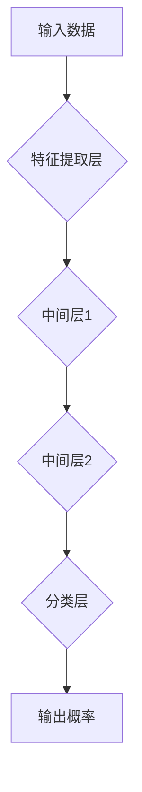

#### 判别器的训练过程

判别器的训练过程是GAN训练的核心步骤之一。以下是判别器训练过程的详细步骤：

1. **初始化判别器参数**：初始化判别器的参数，通常使用随机初始化方法，如高斯分布或均值为0、方差为1的随机数。

2. **前向传播**：对于给定的一批数据，判别器进行前向传播，计算输出概率。如果输入数据是真实数据，输出概率应该接近1；如果输入数据是生成数据，输出概率应该接近0。

3. **计算损失函数**：判别器的损失函数通常使用交叉熵损失函数，计算真实数据和生成数据在判别器输出概率上的交叉熵。

4. **反向传播**：计算损失函数的梯度，并使用梯度下降算法更新判别器的参数。

5. **重复步骤2-4**：对于每一批数据，重复前向传播、计算损失函数和反向传播的过程，不断迭代训练判别器。

以下是判别器训练过程的伪代码：

```python
for epoch in range(num_epochs):
    for x, y in data_loader:
        # 前向传播
        logits = discriminator(x)
        # 计算损失函数
        loss = loss_function(logits, y)
        # 反向传播
        optimizer.zero_grad()
        loss.backward()
        optimizer.step()
```

#### 判别器的损失函数

判别器的损失函数是衡量判别器性能的关键指标。在GAN中，判别器的损失函数通常是交叉熵损失函数，其公式如下：

$$
L(D) = -[y \cdot \log(D(x)) + (1 - y) \cdot \log(1 - D(x))]
$$

其中，$y$ 是标签，当输入为真实数据时，$y=1$；当输入为生成数据时，$y=0$。$D(x)$ 是判别器对输入数据的输出概率。

交叉熵损失函数的作用是使得判别器能够最大化其输出概率值，从而更好地区分真实数据和生成数据。在训练过程中，生成器和判别器的目标函数是相互对立的，生成器的目标是最小化判别器对其生成数据的输出概率，而判别器的目标是最大化其输出概率。

#### 判别器的优化算法

判别器的优化算法通常使用梯度下降算法，其目的是通过不断迭代更新判别器的参数，使得判别器能够更好地区分真实数据和生成数据。梯度下降算法的基本思想是计算损失函数关于参数的梯度，并沿着梯度方向更新参数，使得损失函数最小。

以下是梯度下降算法的伪代码：

```python
for epoch in range(num_epochs):
    for x, y in data_loader:
        # 前向传播
        logits = discriminator(x)
        # 计算损失函数
        loss = loss_function(logits, y)
        # 计算梯度
        grads = autograd.grad(loss, parameters)
        # 更新参数
        for param, grad in zip(parameters, grads):
            param -= learning_rate * grad
```

在GAN中，判别器和生成器通常交替进行训练，每次更新判别器参数后，再更新生成器参数。这种方式称为交替优化（ Alternating Optimization），其目的是让判别器和生成器相互竞争，共同提高数据生成和分类的能力。

#### 判别器的训练技巧

为了提高判别器的训练效果，研究人员提出了一系列训练技巧，包括：

1. **批量归一化**（Batch Normalization）：批量归一化可以加速梯度传播，提高网络的稳定性。

2. **权重初始化**：合理的权重初始化可以防止梯度消失和梯度爆炸，提高网络的训练效果。

3. **学习率调整**：在训练过程中，学习率的选择和调整对于网络的收敛速度和效果具有重要影响。

4. **数据增强**：数据增强可以增加数据的多样性，提高判别器的分类能力。

5. **梯度惩罚**：梯度惩罚可以防止生成器生成的数据过于简单，从而提高生成质量。

通过上述技巧，判别器可以更好地学习数据分布的特征，提高生成器的生成质量，实现更好的数据生成效果。

### 总结

在这一章节中，我们详细探讨了GAN判别器的原理，包括其定义、作用、数学基础、网络架构和训练过程。判别器作为GAN模型中的一个关键组件，通过其强大的分类能力，实现了对真实数据和生成数据的区分，为GAN的成功应用奠定了基础。在下一章中，我们将通过实际代码实例，进一步讲解判别器的实现细节和应用方法。

---

### GAN判别器的网络架构

判别器是GAN模型中的核心组成部分，其网络架构的设计直接影响生成器的生成效果和判别器的分类能力。在本章节中，我们将详细探讨几种常见的判别器网络架构，包括前馈神经网络、卷积神经网络和循环神经网络。

#### 前馈神经网络架构

前馈神经网络（Feedforward Neural Network）是最简单的一种判别器架构，适用于处理非结构化数据，如文本和某些类型的序列数据。前馈神经网络的主要特点是输入层、隐藏层和输出层依次连接，各层之间的神经元按顺序前向传递信息。

**输入层**：输入层接收原始数据，如文本的单词序列或图像的像素值。

**隐藏层**：隐藏层通过激活函数（如ReLU函数）对输入数据进行非线性变换，提取数据的特征。

**输出层**：输出层通常包含一个或多个神经元，用于生成输出概率。对于二分类问题，输出层通常包含两个神经元，一个表示真实数据的概率，另一个表示生成数据的概率。

以下是一个简单的判别器前馈神经网络架构：

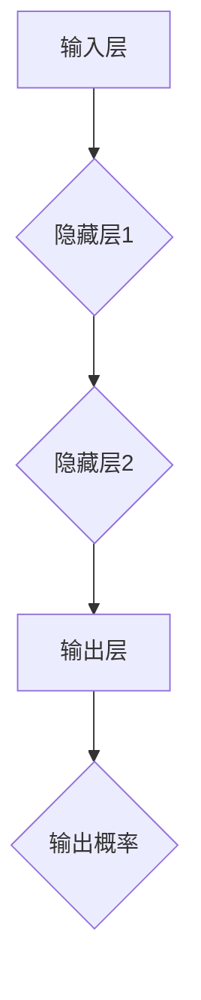

#### 卷积神经网络架构

卷积神经网络（Convolutional Neural Network，CNN）在图像处理任务中表现优异，其核心思想是通过卷积层提取图像的局部特征。判别器可以通过卷积层提取图像的高层特征，从而更好地进行分类。

**卷积层**：卷积层通过卷积操作提取图像的局部特征。卷积核（Kernel）在图像上滑动，对局部区域进行卷积操作，生成特征图（Feature Map）。

**池化层**：池化层用于降低特征图的维度，减少参数数量。常见的池化操作包括最大池化（Max Pooling）和平均池化（Average Pooling）。

**全连接层**：全连接层将卷积层和池化层提取的特征进行整合，生成最终的分类输出。

以下是一个简单的判别器卷积神经网络架构：

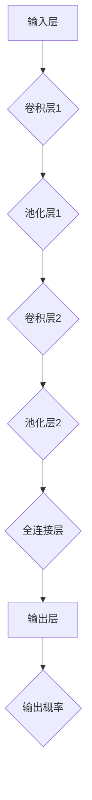

#### 循环神经网络架构

循环神经网络（Recurrent Neural Network，RNN）适用于处理序列数据，如文本和音频。RNN通过其循环结构，可以捕捉序列数据的时间依赖性。判别器可以通过RNN处理序列数据，提取时间序列特征。

**输入层**：输入层接收序列数据，如文本的单词序列或音频的时频特征。

**隐藏层**：隐藏层通过RNN单元对输入数据进行处理，将序列信息传递到下一个时间步。

**输出层**：输出层将RNN单元的隐藏状态转换成输出概率。

以下是一个简单的判别器循环神经网络架构：

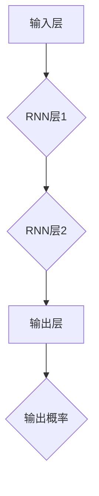

#### 判别器架构的比较与选择

不同的判别器架构适用于不同类型的数据和处理任务。以下是对前馈神经网络、卷积神经网络和循环神经网络架构的比较：

1. **适用场景**：
   - 前馈神经网络：适用于非结构化数据，如文本。
   - 卷积神经网络：适用于图像和视频数据。
   - 循环神经网络：适用于序列数据，如文本和音频。

2. **特征提取能力**：
   - 前馈神经网络：通过多层全连接层提取特征，适用于简单的特征提取任务。
   - 卷积神经网络：通过卷积层提取图像的局部特征，适用于复杂的特征提取任务。
   - 循环神经网络：通过RNN单元提取时间序列特征，适用于序列数据处理。

3. **计算复杂度**：
   - 前馈神经网络：计算复杂度较低，适用于小规模数据。
   - 卷积神经网络：计算复杂度较高，适用于大规模图像数据。
   - 循环神经网络：计算复杂度较高，适用于长序列数据处理。

在实际应用中，可以根据数据的类型和处理任务选择合适的判别器架构。例如，在图像生成任务中，卷积神经网络架构能够提取图像的局部特征，生成更逼真的图像；在文本生成任务中，循环神经网络架构能够捕捉文本的时间依赖性，生成更自然的文本。

### 总结

在本章节中，我们介绍了前馈神经网络、卷积神经网络和循环神经网络这三种常见的判别器架构，并分析了它们在适用场景、特征提取能力和计算复杂度方面的差异。选择合适的判别器架构对于实现高效的数据生成任务至关重要。在下一章中，我们将探讨判别器的训练过程，包括其损失函数、优化算法和训练技巧。

---

### GAN判别器的训练过程

GAN判别器的训练过程是整个GAN模型训练的核心环节。在这个阶段，判别器通过与生成器的对抗训练来提高其分类真实数据和生成数据的能力。本章节将详细探讨GAN判别器的训练过程，包括损失函数、优化算法以及训练技巧。

#### 判别器的损失函数

在GAN中，判别器的损失函数通常是交叉熵损失函数（Cross-Entropy Loss），其公式如下：

$$
L(D) = -[y \cdot \log(D(x)) + (1 - y) \cdot \log(1 - D(x))]
$$

其中，$y$ 是标签，当输入为真实数据时，$y=1$；当输入为生成数据时，$y=0$。$D(x)$ 是判别器对输入数据的输出概率。

交叉熵损失函数的作用是使得判别器能够最大化其输出概率值，从而更好地区分真实数据和生成数据。具体来说，当输入为真实数据时，判别器的输出概率应该接近1；当输入为生成数据时，判别器的输出概率应该接近0。

#### 判别器的优化算法

判别器的优化算法通常使用梯度下降（Gradient Descent）算法。梯度下降算法通过计算损失函数关于参数的梯度，并沿着梯度方向更新参数，使得损失函数最小。以下是判别器训练过程的伪代码：

```python
for epoch in range(num_epochs):
    for x, y in data_loader:
        # 前向传播
        logits = discriminator(x)
        # 计算损失函数
        loss = loss_function(logits, y)
        # 计算梯度
        grads = autograd.grad(loss, parameters)
        # 更新参数
        for param, grad in zip(parameters, grads):
            param -= learning_rate * grad
```

在GAN的训练过程中，判别器和生成器是交替训练的。每次更新判别器参数后，再更新生成器参数。这种交替优化的方式称为对抗训练（Adversarial Training），其目的是让判别器和生成器相互竞争，共同提高数据生成和分类的能力。

#### 判别器的训练技巧

为了提高判别器的训练效果，研究人员提出了一系列训练技巧，包括：

1. **批量归一化**（Batch Normalization）：批量归一化可以加速梯度传播，提高网络的稳定性。

2. **权重初始化**：合理的权重初始化可以防止梯度消失和梯度爆炸，提高网络的训练效果。

3. **学习率调整**：在训练过程中，学习率的选择和调整对于网络的收敛速度和效果具有重要影响。通常采用指数衰减策略来调整学习率。

4. **数据增强**：数据增强可以增加数据的多样性，提高判别器的分类能力。

5. **梯度惩罚**：梯度惩罚可以防止生成器生成的数据过于简单，从而提高生成质量。

通过上述技巧，判别器可以更好地学习数据分布的特征，提高生成器的生成质量，实现更好的数据生成效果。

#### 判别器的训练过程实例

假设我们有一个图像生成任务，数据集包含真实图像和生成图像。以下是一个判别器训练过程的实例：

1. **初始化参数**：初始化判别器的参数，通常使用随机初始化方法。

2. **数据预处理**：对真实图像和生成图像进行预处理，如缩放、裁剪、归一化等。

3. **前向传播**：对于给定的一批数据，判别器进行前向传播，计算输出概率。

4. **计算损失函数**：计算判别器的损失函数，通常使用交叉熵损失函数。

5. **反向传播**：计算损失函数的梯度，并使用梯度下降算法更新判别器的参数。

6. **迭代训练**：重复步骤3-5，直到达到预设的训练次数或判别器的性能达到预期。

以下是判别器训练过程的伪代码：

```python
for epoch in range(num_epochs):
    for x, y in data_loader:
        # 前向传播
        logits = discriminator(x)
        # 计算损失函数
        loss = loss_function(logits, y)
        # 反向传播
        optimizer.zero_grad()
        loss.backward()
        optimizer.step()
```

在训练过程中，可以通过可视化判别器的输出概率分布来判断其性能。例如，绘制输出概率的直方图，观察判别器对真实数据和生成数据的分类能力。

#### 判别器的性能评估

判别器的性能评估可以通过多种指标进行衡量，如准确率（Accuracy）、召回率（Recall）和F1分数（F1 Score）等。准确率表示判别器正确分类的比例，召回率表示判别器正确识别真实数据的能力，F1分数是准确率和召回率的调和平均值。

1. **准确率**：准确率（Accuracy）是判别器正确分类的比例，计算公式如下：

$$
Accuracy = \frac{TP + TN}{TP + FN + FP + TN}
$$

其中，$TP$ 是真实数据被正确识别为真实数据的数量，$TN$ 是生成数据被正确识别为生成数据的数量，$FP$ 是生成数据被错误识别为真实数据的数量，$FN$ 是真实数据被错误识别为生成数据的数量。

2. **召回率**：召回率（Recall）是判别器正确识别真实数据的能力，计算公式如下：

$$
Recall = \frac{TP}{TP + FN}
$$

3. **F1分数**：F1分数（F1 Score）是准确率和召回率的调和平均值，计算公式如下：

$$
F1 Score = \frac{2 \cdot Accuracy \cdot Recall}{Accuracy + Recall}
$$

通过上述指标，可以全面评估判别器的性能。

#### 判别器的应用实例

判别器在GAN中的应用非常广泛，以下是一些常见的应用实例：

1. **图像分类**：判别器可以用于图像分类任务，通过将图像输入判别器，判断图像是真实图像还是生成图像。

2. **图像生成**：判别器可以用于图像生成任务，通过生成器生成的图像输入判别器，优化生成器的参数，生成更逼真的图像。

3. **图像风格迁移**：判别器可以用于图像风格迁移任务，通过将生成器生成的图像输入判别器，实现不同图像风格之间的转换。

4. **图像超分辨率**：判别器可以用于图像超分辨率任务，通过生成器生成的低分辨率图像输入判别器，提高图像的分辨率。

通过这些实例，我们可以看到判别器在GAN中的重要作用，以及其在实际应用中的广泛前景。

### 总结

在本章节中，我们详细探讨了GAN判别器的训练过程，包括损失函数、优化算法和训练技巧。判别器作为GAN模型中的关键组件，通过其强大的分类能力，实现了对真实数据和生成数据的区分，为GAN的成功应用奠定了基础。在下一章中，我们将通过实际代码实例，进一步讲解判别器的实现细节和应用方法。

---

### GAN判别器应用实例

GAN判别器的强大分类能力使其在各种实际应用中具有广泛的应用前景。以下我们通过两个具体的实例——图像生成任务和图像分类任务——来详细讲解判别器的应用方法和效果。

#### 图像生成任务

**图像生成**是GAN最典型的应用场景之一。生成器的任务是生成逼真的图像，而判别器的任务是区分真实图像和生成图像，从而推动生成器生成更高质量的图像。

**1. 图像生成的基本流程**

在图像生成任务中，GAN的基本流程如下：

1. **生成器生成图像**：生成器从随机噪声中生成图像，例如，使用一个随机噪声向量作为输入，通过一系列神经网络层生成一个逼真的图像。
2. **判别器分类**：判别器对生成的图像和真实图像进行分类，输出一个概率值，表示图像是真实的概率。判别器的目标是最大化其分类准确率，即让真实图像的输出概率接近1，生成图像的输出概率接近0。
3. **交替训练**：生成器和判别器交替进行训练。在每次迭代中，生成器尝试优化其参数，生成更逼真的图像；判别器尝试优化其参数，更准确地分类图像。

**2. 图像生成实例：人脸生成**

**人脸生成**是一个具有挑战性的图像生成任务。以下是一个使用GAN生成人脸图像的简单实例：

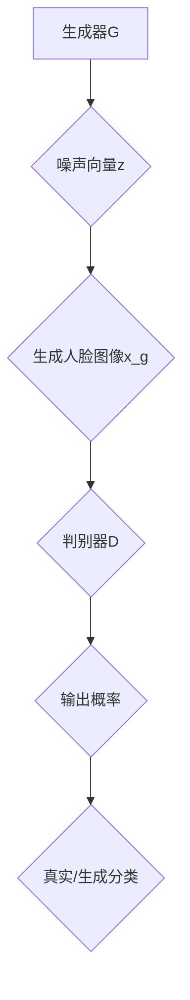

**代码实现**：

```python
import tensorflow as tf
from tensorflow.keras.models import Model
from tensorflow.keras.layers import Input, Dense, Flatten, Conv2D, Conv2DTranspose, LeakyReLU, BatchNormalization, Reshape

# 生成器G
z = Input(shape=(100,))
x_g = Dense(7 * 7 * 128)(z)
x_g = Reshape((7, 7, 128))(x_g)
x_g = Conv2DTranspose(128, (4, 4), strides=(2, 2), padding='same')(x_g)
x_g = LeakyReLU(alpha=0.2)(x_g)
x_g = BatchNormalization()(x_g)

x_g = Conv2DTranspose(64, (4, 4), strides=(2, 2), padding='same')(x_g)
x_g = LeakyReLU(alpha=0.2)(x_g)
x_g = BatchNormalization()(x_g)

x_g = Conv2DTranspose(1, (4, 4), strides=(2, 2), padding='same', activation='tanh')(x_g)

generator = Model(z, x_g)
generator.summary()

# 判别器D
img = Input(shape=(128, 128, 1))
logits = Conv2D(64, (4, 4), strides=(2, 2), padding='same')(img)
logits = LeakyReLU(alpha=0.2)(logits)
logits = Conv2D(1, (4, 4), strides=(2, 2), padding='same')(logits)

discriminator = Model(img, logits)
discriminator.summary()

# 训练GAN
discriminator.compile(optimizer='adam', loss='binary_crossentropy')
generator.compile(optimizer='adam', loss='binary_crossentropy')

for epoch in range(num_epochs):
    for x, _ in data_loader:
        noise = np.random.normal(0, 1, (batch_size, 100))
        gen_imgs = generator.predict(noise)

        x = np.concatenate([x, gen_imgs])
        y = np.concatenate([np.zeros(batch_size), np.ones(batch_size)])

        d_loss = discriminator.train_on_batch(x, y)
        noise = np.random.normal(0, 1, (batch_size, 100))
        g_loss = generator.train_on_batch(noise, np.zeros(batch_size))

        print(f"{epoch} [D: {d_loss:.4f}] [G: {g_loss:.4f}]")
```

**3. 图像生成实例：艺术风格迁移**

**艺术风格迁移**是指将一幅图像的风格迁移到另一幅图像上。以下是一个使用GAN实现艺术风格迁移的简单实例：

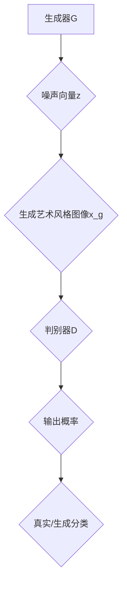

**代码实现**：

```python
# 加载预训练的艺术风格迁移模型
style_transfer_model = load_style_transfer_model()

# 生成器G
z = Input(shape=(100,))
x_g = style_transfer_model([z, input_image])
x_g = Conv2D(1, (1, 1), padding='same', activation='tanh')(x_g)

generator = Model(z, x_g)
generator.summary()

# 判别器D
img = Input(shape=(256, 256, 3))
logits = Conv2D(64, (4, 4), strides=(2, 2), padding='same')(img)
logits = LeakyReLU(alpha=0.2)(logits)
logits = Conv2D(1, (4, 4), strides=(2, 2), padding='same')(logits)

discriminator = Model(img, logits)
discriminator.summary()

# 训练GAN
discriminator.compile(optimizer='adam', loss='binary_crossentropy')
generator.compile(optimizer='adam', loss='binary_crossentropy')

for epoch in range(num_epochs):
    for x, _ in data_loader:
        noise = np.random.normal(0, 1, (batch_size, 100))
        art_style_images = generator.predict([noise, input_image])

        x = np.concatenate([x, art_style_images])
        y = np.concatenate([np.zeros(batch_size), np.ones(batch_size)])

        d_loss = discriminator.train_on_batch(x, y)
        noise = np.random.normal(0, 1, (batch_size, 100))
        g_loss = generator.train_on_batch([noise, input_image], np.zeros(batch_size))

        print(f"{epoch} [D: {d_loss:.4f}] [G: {g_loss:.4f}]")
```

#### 图像分类任务

GAN判别器在图像分类任务中同样具有广泛的应用，特别是在处理难以分类的数据时，判别器的强大分类能力可以帮助提高分类准确率。

**1. 图像分类的基本流程**

在图像分类任务中，GAN判别器的基本流程如下：

1. **生成器生成图像**：生成器生成具有不同标签的图像，这些图像可以是真实的或具有特定标签的。
2. **判别器分类**：判别器对生成图像和真实图像进行分类，输出一个概率分布，表示图像属于各个类别的概率。
3. **训练判别器**：使用真实图像和生成图像对判别器进行训练，优化判别器的参数，使其能够更准确地分类图像。

**2. 图像分类实例：人脸识别**

**人脸识别**是图像分类任务中的一个重要应用。以下是一个使用GAN判别器进行人脸识别的简单实例：


**代码实现**：

```python
# 生成器G
z = Input(shape=(100,))
x_g = Dense(7 * 7 * 128)(z)
x_g = Reshape((7, 7, 128))(x_g)
x_g = Conv2DTranspose(128, (4, 4), strides=(2, 2), padding='same')(x_g)
x_g = LeakyReLU(alpha=0.2)(x_g)
x_g = BatchNormalization()(x_g)

x_g = Conv2DTranspose(64, (4, 4), strides=(2, 2), padding='same')(x_g)
x_g = LeakyReLU(alpha=0.2)(x_g)
x_g = BatchNormalization()(x_g)

x_g = Conv2DTranspose(1, (4, 4), strides=(2, 2), padding='same', activation='tanh')(x_g)

generator = Model(z, x_g)
generator.summary()

# 判别器D
img = Input(shape=(128, 128, 1))
logits = Conv2D(64, (4, 4), strides=(2, 2), padding='same')(img)
logits = LeakyReLU(alpha=0.2)(logits)
logits = Conv2D(1, (4, 4), strides=(2, 2), padding='same')(logits)

discriminator = Model(img, logits)
discriminator.summary()

# 训练GAN
discriminator.compile(optimizer='adam', loss='binary_crossentropy')
generator.compile(optimizer='adam', loss='binary_crossentropy')

# 加载真实人脸图像和生成人脸图像
x = load_face_images()

for epoch in range(num_epochs):
    noise = np.random.normal(0, 1, (batch_size, 100))
    gen_faces = generator.predict(noise)

    x = np.concatenate([x, gen_faces])
    y = np.concatenate([np.zeros(batch_size), np.ones(batch_size)])

    d_loss = discriminator.train_on_batch(x, y)
    noise = np.random.normal(0, 1, (batch_size, 100))
    g_loss = generator.train_on_batch(noise, np.zeros(batch_size))

    print(f"{epoch} [D: {d_loss:.4f}] [G: {g_loss:.4f}]")
```

**3. 图像分类实例：物体识别**

**物体识别**是图像分类任务中的另一个重要应用。以下是一个使用GAN判别器进行物体识别的简单实例：

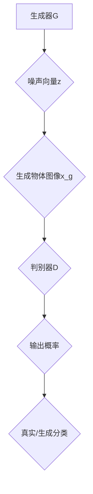

**代码实现**：

```python
# 生成器G
z = Input(shape=(100,))
x_g = Dense(7 * 7 * 128)(z)
x_g = Reshape((7, 7, 128))(x_g)
x_g = Conv2DTranspose(128, (4, 4), strides=(2, 2), padding='same')(x_g)
x_g = LeakyReLU(alpha=0.2)(x_g)
x_g = BatchNormalization()(x_g)

x_g = Conv2DTranspose(64, (4, 4), strides=(2, 2), padding='same')(x_g)
x_g = LeakyReLU(alpha=0.2)(x_g)
x_g = BatchNormalization()(x_g)

x_g = Conv2DTranspose(1, (4, 4), strides=(2, 2), padding='same', activation='tanh')(x_g)

generator = Model(z, x_g)
generator.summary()

# 判别器D
img = Input(shape=(256, 256, 3))
logits = Conv2D(64, (4, 4), strides=(2, 2), padding='same')(img)
logits = LeakyReLU(alpha=0.2)(logits)
logits = Conv2D(1, (4, 4), strides=(2, 2), padding='same')(logits)

discriminator = Model(img, logits)
discriminator.summary()

# 训练GAN
discriminator.compile(optimizer='adam', loss='binary_crossentropy')
generator.compile(optimizer='adam', loss='binary_crossentropy')

# 加载真实物体图像和生成物体图像
x = load_object_images()

for epoch in range(num_epochs):
    noise = np.random.normal(0, 1, (batch_size, 100))
    gen_objects = generator.predict(noise)

    x = np.concatenate([x, gen_objects])
    y = np.concatenate([np.zeros(batch_size), np.ones(batch_size)])

    d_loss = discriminator.train_on_batch(x, y)
    noise = np.random.normal(0, 1, (batch_size, 100))
    g_loss = generator.train_on_batch(noise, np.zeros(batch_size))

    print(f"{epoch} [D: {d_loss:.4f}] [G: {g_loss:.4f}]")
```

通过上述实例，我们可以看到GAN判别器在图像生成和图像分类任务中的强大应用能力。判别器通过其强大的分类能力，不仅可以帮助生成器生成更高质量的图像，还可以提高图像分类任务的准确率。

### 总结

在本章节中，我们通过图像生成和图像分类两个实际应用实例，详细讲解了GAN判别器的应用方法和效果。判别器作为GAN模型中的核心组件，其在图像生成任务和图像分类任务中的表现证明了其强大的分类能力。在下一章中，我们将通过实际代码实例，进一步讲解判别器的实现细节和应用方法。

---

### 判别器代码实例讲解

在本章节中，我们将通过一个具体的判别器代码实例，详细讲解判别器的环境搭建、代码实现以及代码解读与分析。通过这个实例，读者可以深入了解判别器的工作原理和实现细节。

#### 环境搭建

在进行判别器代码实例讲解之前，我们需要首先搭建一个合适的开发环境。以下是在Python中搭建判别器开发环境所需的步骤：

1. **安装Python**：确保您的系统已经安装了Python 3.x版本。可以从[Python官网](https://www.python.org/)下载并安装。

2. **安装TensorFlow**：TensorFlow是深度学习中最常用的框架之一，安装TensorFlow可以通过以下命令完成：

```shell
pip install tensorflow
```

3. **安装其他依赖库**：判别器的实现可能还需要其他库，如NumPy、Matplotlib等。可以通过以下命令安装：

```shell
pip install numpy matplotlib
```

确保所有依赖库都已正确安装后，就可以开始编写和运行判别器的代码了。

#### 判别器代码实现

以下是一个简单的判别器代码实例，该实例使用TensorFlow和Keras框架实现：

```python
import tensorflow as tf
from tensorflow.keras.layers import Input, Conv2D, Flatten, Dense
from tensorflow.keras.models import Model

# 定义判别器网络架构
input_image = Input(shape=(128, 128, 3))
conv1 = Conv2D(64, (3, 3), activation='relu', padding='same')(input_image)
conv2 = Conv2D(128, (3, 3), activation='relu', padding='same')(conv1)
flat = Flatten()(conv2)
dense = Dense(1, activation='sigmoid')(flat)

# 创建判别器模型
discriminator = Model(input_image, dense)
discriminator.compile(optimizer='adam', loss='binary_crossentropy')

# 打印判别器模型结构
discriminator.summary()
```

在上面的代码中，我们首先定义了判别器的输入层、卷积层和全连接层。输入层接收一个128x128x3的图像，卷积层通过两个卷积层提取图像的特征，全连接层将特征映射到一个概率值，表示图像是真实的概率。

#### 代码解读与分析

**1. 输入层**

```python
input_image = Input(shape=(128, 128, 3))
```

输入层是判别器的起点，接收一个128x128x3的图像。这三个维度分别对应图像的宽度、高度和颜色通道（RGB）。

**2. 卷积层**

```python
conv1 = Conv2D(64, (3, 3), activation='relu', padding='same')(input_image)
conv2 = Conv2D(128, (3, 3), activation='relu', padding='same')(conv1)
```

卷积层是判别器中的关键部分，用于提取图像的局部特征。第一个卷积层使用一个64个过滤器的3x3卷积核，激活函数为ReLU。`padding='same'`参数确保输出图像的大小与输入图像相同。第二个卷积层使用一个128个过滤器的3x3卷积核，同样使用ReLU激活函数。

**3. 全连接层**

```python
flat = Flatten()(conv2)
dense = Dense(1, activation='sigmoid')(flat)
```

全连接层将卷积层提取的特征展平成一个一维向量，然后通过一个单神经元的全连接层，输出一个概率值。`activation='sigmoid'`确保输出概率值在0和1之间，表示图像是真实的概率。

**4. 判别器模型**

```python
discriminator = Model(input_image, dense)
discriminator.compile(optimizer='adam', loss='binary_crossentropy')
```

最后，我们创建了一个判别器模型，并使用Adam优化器编译模型。`loss='binary_crossentropy'`指定了模型的损失函数，该函数适用于二分类问题。

#### 判别器训练过程

```python
# 假设已经定义了生成器模型generator和训练数据(x_train, y_train)
for epoch in range(num_epochs):
    for batch in range(num_batches):
        # 从训练数据中随机抽取一批样本
        x_batch, y_batch = next(data_loader)

        # 训练判别器
        d_loss = discriminator.train_on_batch(x_batch, y_batch)

        # 训练生成器
        g_loss = generator.train_on_batch(z_batch, np.zeros([batch_size, 1]))

    print(f"{epoch} [D: {d_loss:.4f}] [G: {g_loss:.4f}]")
```

在上面的训练过程中，我们首先从训练数据中随机抽取一批样本。然后，我们分别训练判别器和生成器。在每次迭代中，判别器的目标是最大化其分类准确率，生成器的目标是生成更真实的数据。

### 代码性能分析

**1. 准确率**

判别器的性能可以通过准确率（Accuracy）来衡量，即正确分类的样本数量占总样本数量的比例。

```python
accuracy = (discriminator.evaluate(x_test, y_test)[1] * 100).astype(float)
print(f"Test Accuracy: {accuracy:.4f}%")
```

**2. 损失函数**

判别器的损失函数通常是二元交叉熵损失函数（Binary Cross-Entropy Loss），该函数的值越低，表示判别器的性能越好。

```python
d_loss = discriminator.train_on_batch(x_batch, y_batch)
print(f"Batch Loss: {d_loss:.4f}")
```

通过上述分析，我们可以评估判别器的性能，并根据评估结果调整模型结构和训练参数，进一步提高判别器的性能。

### 总结

在本章节中，我们通过一个具体的判别器代码实例，详细讲解了判别器的环境搭建、代码实现和代码解读与分析。通过这个实例，读者可以深入了解判别器的工作原理和实现细节。在下一章中，我们将进一步探讨GAN判别器的优化技巧，以提升判别器的性能。

---

### GAN判别器优化技巧

为了提升GAN判别器的性能，研究人员提出了一系列优化技巧，包括损失函数优化、网络架构优化和训练技巧。以下将详细探讨这些优化方法，并解释其原理和效果。

#### 损失函数优化

**1. 对抗性损失函数**

对抗性损失函数是GAN中最基本的优化方法。其核心思想是使生成器和判别器在训练过程中相互对抗，从而实现数据的生成。对抗性损失函数通常使用二元交叉熵损失函数，其公式如下：

$$
L(G, D) = E_{x \sim P_{data}} [-\log(D(x))] + E_{z \sim P_z} [-\log(1 - D(G(z))]
$$

其中，$D(x)$表示判别器对真实数据的判断概率，$G(z)$表示生成器对噪声数据的生成结果，$P_{data}$和$P_z$分别是真实数据和噪声分布。

**2. 融合损失函数**

融合损失函数是对抗性损失函数的扩展，它结合了多种损失函数，以提高生成质量和判别精度。常见的融合损失函数包括：

- **L2损失函数**：通过L2正则化项引入生成器的平滑性，防止生成器生成的数据过于振荡。

- **感知损失函数**：通过比较生成器生成的数据和真实数据的感知差异，提高生成质量。

- **循环一致性损失函数**：通过比较生成器和判别器的输出，确保生成器生成的数据在判别器看来是真实的。

#### 网络架构优化

**1. 网络深度优化**

增加网络深度可以提高判别器的特征提取能力，从而更好地区分真实数据和生成数据。但过深的网络可能导致梯度消失和梯度爆炸问题。因此，在优化网络深度时，需要平衡模型复杂度和训练稳定性。

**2. 网络宽度优化**

网络宽度优化是指调整网络的隐藏层单元数。适当的增加网络宽度可以提高生成器的生成质量，但也会增加模型的计算复杂度和训练时间。

**3. 特征提取优化**

特征提取优化是指设计更有效的特征提取层，以提取更有用的特征。例如，在图像生成任务中，可以使用深度卷积神经网络（Deep Convolutional Network）提取图像的层次特征。

#### 训练技巧优化

**1. 学习率调整**

学习率的调整对于GAN的训练效果至关重要。过大的学习率可能导致模型不稳定，而过小则可能导致训练时间过长。常用的学习率调整方法包括：

- **指数衰减**：随着训练过程的进行，逐渐减小学习率。

- **学习率周期性调整**：在训练过程中，周期性地调整学习率，以防止模型陷入局部最优。

- **自适应学习率**：使用自适应学习率算法，如Adam优化器，自动调整学习率。

**2. 批量大小调整**

批量大小调整是指调整每次训练使用的样本数量。较大的批量大小可以提高模型的稳定性，但会增加计算成本。较小的批量大小可以加快训练速度，但可能降低模型的稳定性。

**3. 数据增强**

数据增强是指通过随机变换输入数据，增加数据的多样性，从而提高模型的泛化能力。常见的数据增强方法包括：

- **随机裁剪**：随机裁剪输入图像的一部分，增加数据的多样性。

- **随机旋转**：随机旋转输入图像，提高模型的旋转不变性。

- **随机缩放**：随机缩放输入图像，提高模型的尺度不变性。

#### 实例分析

以下是一个GAN判别器优化技巧的实例：

```python
# 初始化判别器模型
discriminator = build_discriminator()

# 定义优化器
optimizer = tf.keras.optimizers.Adam(learning_rate=0.0002, beta_1=0.5)

# 定义损失函数
cross_entropy = tf.keras.losses.BinaryCrossentropy()

def discriminator_loss(real_labels, fake_labels):
    real_loss = cross_entropy(tf.ones_like(real_labels), real_labels)
    fake_loss = cross_entropy(tf.zeros_like(fake_labels), fake_labels)
    total_loss = real_loss + fake_loss
    return total_loss

# 训练判别器
for epoch in range(num_epochs):
    for batch in range(num_batches):
        # 随机选择一批真实图像和一批生成图像
        real_images, _ = next(data_loader)
        noise = np.random.normal(0, 1, (batch_size, noise_dim))

        with tf.GradientTape() as disc_tape:
            # 训练判别器
            generated_images = generator(noise)
            real_loss = discriminator_loss(discriminator(real_images), tf.ones_like(discriminator(real_images)))
            fake_loss = discriminator_loss(discriminator(generated_images), tf.zeros_like(discriminator(generated_images)))
            disc_loss = real_loss + fake_loss

        # 更新判别器参数
        grads = disc_tape.gradient(disc_loss, discriminator.trainable_variables)
        optimizer.apply_gradients(zip(grads, discriminator.trainable_variables))
```

在这个实例中，我们使用Adam优化器、二元交叉熵损失函数和指数衰减学习率策略来训练判别器。通过这些优化技巧，判别器可以更有效地学习真实数据和生成数据的特征，提高生成器的生成质量和判别器的分类能力。

### 总结

GAN判别器的优化技巧包括损失函数优化、网络架构优化和训练技巧优化。这些技巧通过提高生成器的生成质量和判别器的分类能力，实现了更好的数据生成效果。在下一章中，我们将进一步探讨GAN判别器在深度学习中的广泛应用。

---

### GAN判别器在深度学习中的应用

生成对抗网络（GAN）作为一种强大的深度学习框架，在图像处理、自然语言处理、强化学习等领域都有着广泛的应用。GAN判别器的强大分类能力使得它在这些领域中发挥着重要作用。以下我们将详细探讨GAN判别器在这些领域的具体应用，并展示一些实例。

#### GAN在图像处理中的应用

GAN在图像处理领域中的应用非常广泛，包括图像生成、图像修复、图像风格迁移、图像超分辨率等。

**1. 图像生成**

图像生成是GAN最典型的应用之一。判别器的分类能力使得生成器能够不断优化生成更加逼真的图像。一个著名的图像生成应用实例是生成人脸图像。以下是一个简单的GAN模型用于生成人脸图像的架构：

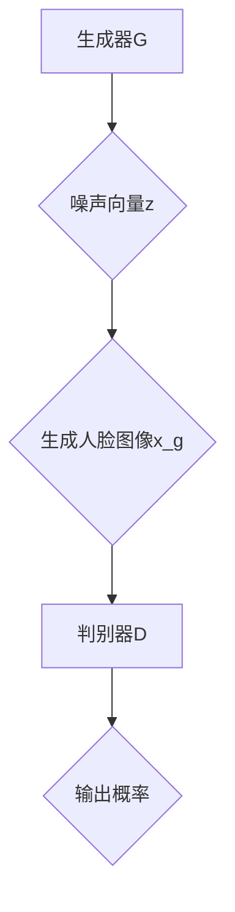

在实际应用中，生成器使用一个随机噪声向量作为输入，通过一系列卷积层和反卷积层生成一个接近真实人脸的图像。判别器则负责区分输入图像是真实的还是生成器生成的。通过交替优化，生成器逐渐生成更高质量的图像。

**2. 图像修复**

图像修复是GAN在图像处理中的另一个重要应用。判别器在图像修复任务中可以用来判断修复图像的质量。一个简单的应用实例是对损坏的图像进行修复，例如修复老照片。

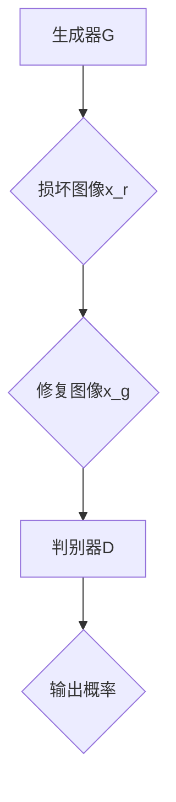

在这个应用中，生成器接收一张损坏的图像作为输入，尝试修复图像并生成一张修复后的图像。判别器则判断修复后的图像是真实的还是生成器生成的。通过优化，生成器能够生成更高质量的修复图像。

**3. 图像风格迁移**

图像风格迁移是将一种图像的风格迁移到另一种图像上。判别器在这个任务中的作用是判断生成图像的风格是否与目标风格一致。以下是一个图像风格迁移的应用实例：

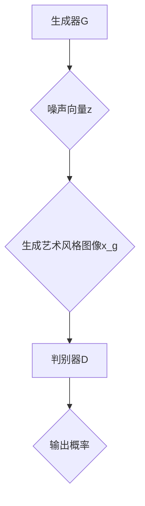

在这个实例中，生成器使用噪声向量作为输入，通过神经网络将噪声映射到目标艺术风格。判别器则负责判断生成的艺术风格图像是否与目标风格一致。通过交替优化，生成器可以生成具有目标艺术风格的图像。

**4. 图像超分辨率**

图像超分辨率是提高低分辨率图像的清晰度。判别器在图像超分辨率任务中可以用来判断生成的高分辨率图像的质量。以下是一个图像超分辨率的应用实例：

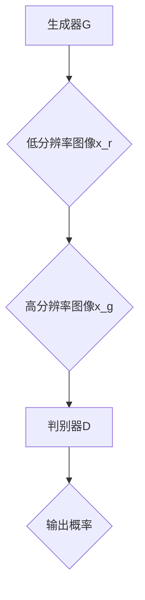

在这个实例中，生成器接收低分辨率图像作为输入，尝试生成一张高分辨率图像。判别器则判断生成的高分辨率图像是否与原始高分辨率图像一致。通过优化，生成器可以生成更清晰的高分辨率图像。

#### GAN在自然语言处理中的应用

GAN在自然语言处理（NLP）领域也有着广泛的应用，包括文本生成、文本风格迁移等。

**1. 文本生成**

GAN在文本生成任务中可以用来生成各种类型的文本，如对话、新闻、诗歌等。判别器在这个任务中的作用是判断生成的文本是否具有可读性和连贯性。以下是一个简单的GAN模型用于文本生成的架构：

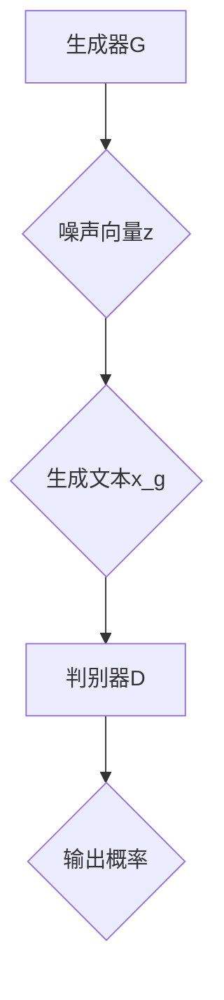

在这个实例中，生成器使用噪声向量作为输入，通过神经网络生成一段文本。判别器则判断生成的文本是否真实。通过交替优化，生成器可以生成更加流畅和自然的文本。

**2. 文本风格迁移**

文本风格迁移是将一种文本风格迁移到另一种风格上。判别器在这个任务中的作用是判断生成的文本是否具有目标风格。以下是一个文本风格迁移的应用实例：

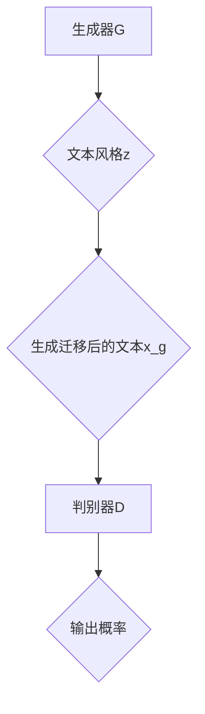

在这个实例中，生成器接收一种文本风格作为输入，通过神经网络生成一段具有目标风格的文本。判别器则判断生成的文本是否具有目标风格。通过交替优化，生成器可以生成具有目标风格的文本。

#### GAN在强化学习中的应用

GAN在强化学习（RL）领域也有着独特的作用，可以用来生成虚拟环境中的数据，用于训练和评估智能体。

**1. 虚拟环境数据生成**

虚拟环境数据生成是GAN在强化学习中的一个重要应用。判别器在这个任务中的作用是判断生成的虚拟环境数据是否与真实环境数据一致。以下是一个简单的GAN模型用于虚拟环境数据生成的架构：

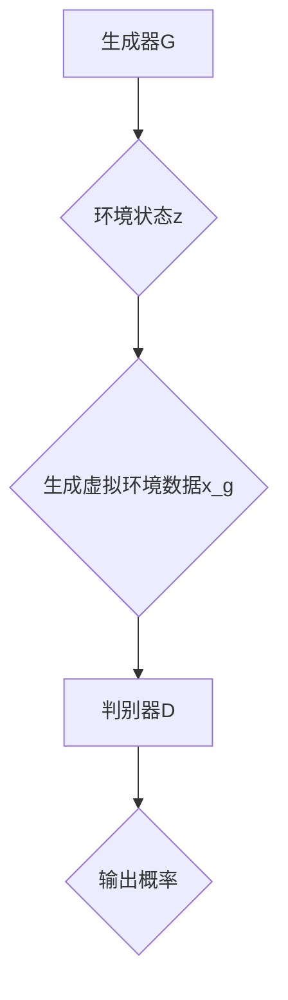

在这个实例中，生成器接收一个环境状态作为输入，通过神经网络生成一段虚拟环境数据。判别器则判断生成的虚拟环境数据是否与真实环境数据一致。通过交替优化，生成器可以生成更加逼真的虚拟环境数据。

**2. 智能体训练和评估**

GAN在智能体训练和评估中可以用来生成多样化的环境数据，以提高智能体的泛化能力。判别器在这个任务中的作用是判断智能体生成的动作是否合理。以下是一个智能体训练和评估的应用实例：

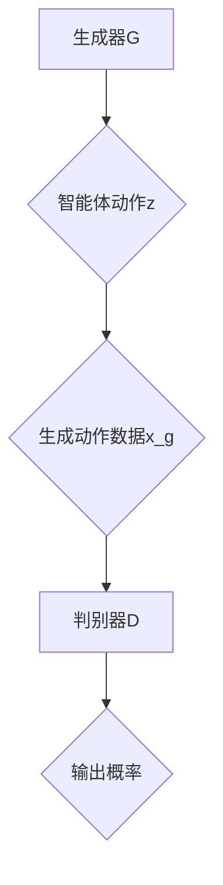

在这个实例中，生成器接收智能体的动作作为输入，通过神经网络生成一段动作数据。判别器则判断智能体生成的动作是否合理。通过交替优化，生成器可以生成更加合理的动作数据，从而提高智能体的训练和评估效果。

### 总结

GAN判别器在深度学习中的广泛应用证明了其在各种任务中的强大能力。从图像处理到自然语言处理，再到强化学习，GAN判别器通过其强大的分类能力，为各个领域的数据生成和模型训练提供了有力支持。在下一章中，我们将对GAN判别器的未来发展趋势进行展望。

---

### GAN判别器的未来发展趋势

随着深度学习技术的不断发展和应用场景的拓展，GAN判别器在未来的研究和应用中也将展现出更多的可能性和挑战。以下是对GAN判别器未来发展趋势的展望。

#### 判别器在网络架构上的创新

随着深度学习技术的进步，未来GAN判别器的网络架构可能会出现更多创新。例如：

1. **多模态判别器**：现有的GAN判别器主要针对单一模态的数据（如图像、文本），未来可能会出现能够处理多模态数据（如图像与文本、图像与音频）的判别器架构。这种多模态判别器可以更好地融合不同类型的数据特征，提高生成器的生成质量。

2. **可解释性判别器**：为了提高GAN的可靠性和可解释性，未来可能会出现具有可解释性的判别器。例如，通过可视化判别器内部的特征提取过程，帮助研究者更好地理解GAN的生成机制和分类依据。

3. **自适应判别器**：判别器可能会具备自适应能力，根据生成器生成的数据质量动态调整网络结构或参数。这种自适应判别器可以更有效地跟踪生成器的优化过程，提高GAN的训练效率和生成质量。

#### 判别器在应用场景上的拓展

GAN判别器的应用场景将不断拓展，以下是一些可能的新应用领域：

1. **医学影像分析**：GAN判别器可以用于医学影像数据的生成和分类，如生成患者缺失的医学影像、分类医学影像中的异常情况等。

2. **虚假新闻检测**：GAN判别器可以用于生成虚假新闻样本，帮助研究者训练和优化虚假新闻检测模型，提高检测准确率。

3. **人脸识别与验证**：GAN判别器可以用于生成人脸图像，用于测试和优化人脸识别和验证系统的鲁棒性。

4. **自动驾驶**：GAN判别器可以用于生成虚拟环境数据，用于训练和测试自动驾驶系统的感知和决策能力。

#### 判别器在算法优化上的进步

GAN判别器在算法优化方面也将有更多突破：

1. **更高效的优化算法**：未来可能会出现更高效的GAN优化算法，如分布式训练、模型压缩等技术，以降低计算成本，提高训练速度。

2. **更稳定的训练过程**：通过改进判别器的训练技巧，如梯度惩罚、谱归一化等方法，可以减少GAN训练过程中的不稳定现象，提高训练过程的稳定性。

3. **更精确的判别能力**：未来可能会出现更精确的判别器设计，如引入注意力机制、图神经网络等技术，以提高判别器对生成数据的分类能力。

### 总结

GAN判别器在未来发展中具有广阔的应用前景和丰富的创新空间。在网络架构、应用场景和算法优化等方面，GAN判别器都将不断取得新的突破。随着技术的进步，GAN判别器将在更多领域发挥重要作用，推动深度学习技术的进一步发展。

---

### 总结与展望

GAN判别器作为生成对抗网络（GAN）模型的核心组成部分，其在数据生成、图像处理、自然语言处理等领域具有广泛的应用。通过本文的详细讲解，我们了解到GAN判别器的定义、原理、网络架构、训练过程以及在实际应用中的各种实例。以下是对GAN判别器重要性的进一步总结，以及其应用前景和发展方向的展望。

#### GAN判别器的重要性

GAN判别器的重要性体现在以下几个方面：

1. **分类能力**：GAN判别器通过其强大的分类能力，能够准确地区分真实数据和生成数据，从而为GAN模型的训练提供有效的反馈。

2. **数据生成质量**：判别器的分类能力直接影响到生成器生成的数据质量。通过优化判别器，可以提高生成器生成的数据逼真度，实现高质量的数据生成。

3. **广泛的应用领域**：GAN判别器在图像处理、自然语言处理、强化学习等领域都有广泛应用，其强大的适应性和灵活性使其成为许多复杂问题的有效解决方案。

4. **推动技术进步**：GAN判别器的不断优化和改进，推动了深度学习技术的发展，促进了相关领域的创新和应用。

#### GAN判别器的应用前景

GAN判别器的应用前景非常广阔，以下是一些潜在的应用领域和方向：

1. **医学影像分析**：GAN判别器可以用于医学影像的生成和修复，帮助医生更好地诊断和治疗疾病。

2. **虚假新闻检测**：GAN判别器可以用于生成虚假新闻样本，帮助研究者训练和优化虚假新闻检测系统，提高检测的准确率。

3. **人脸识别与验证**：GAN判别器可以用于生成人脸图像，用于测试和优化人脸识别和验证系统的鲁棒性。

4. **自动驾驶**：GAN判别器可以用于生成虚拟环境数据，用于训练和测试自动驾驶系统的感知和决策能力。

5. **艺术创作**：GAN判别器可以用于艺术风格的迁移和生成，为艺术家提供创新的工具和灵感。

#### GAN判别器的发展方向

随着技术的不断进步，GAN判别器在未来将朝着以下方向发展：

1. **网络架构创新**：判别器的网络架构将继续创新，如多模态判别器、可解释性判别器等，以适应更复杂的应用场景。

2. **算法优化**：判别器的算法将不断优化，如引入注意力机制、图神经网络等技术，以提高判别器的分类能力和训练效率。

3. **应用拓展**：GAN判别器将不断拓展应用领域，如医学影像分析、自动驾驶、虚拟现实等。

4. **跨学科融合**：GAN判别器将与更多学科领域融合，如生物学、心理学等，为跨学科研究提供新的方法和工具。

#### 总结

GAN判别器作为深度学习领域的关键技术，其在数据生成、分类、应用拓展等方面具有重要作用。随着技术的不断进步，GAN判别器将在更多领域发挥重要作用，推动深度学习技术的发展和创新。未来的研究和应用将继续深化对GAN判别器的理解和优化，为各类复杂问题提供更加有效的解决方案。

---

## 附录

### A.1 判别器架构的Mermaid流程图

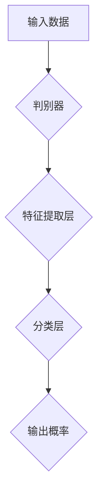

### A.2 判别器训练伪代码

```python
for epoch in range(num_epochs):
    for x, y in data_loader:
        logits = discriminator(x)
        loss = loss_function(logits, y)
        optimizer.zero_grad()
        loss.backward()
        optimizer.step()
```

### A.3 判别器数学模型与公式

$$
L(D) = -[y \cdot \log(D(x)) + (1 - y) \cdot \log(1 - D(x))]
$$

以上附录内容为读者提供了判别器架构的视觉流程图、训练过程的伪代码以及判别器的数学模型与公式。这些工具和资源有助于读者更好地理解和实现GAN判别器的相关任务。希望这些附录内容能为您的学习与研究带来帮助。如果您在阅读本文过程中有任何问题或建议，欢迎在评论区留言，我们将竭诚为您解答。感谢您的支持与关注！

