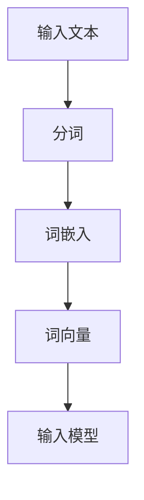
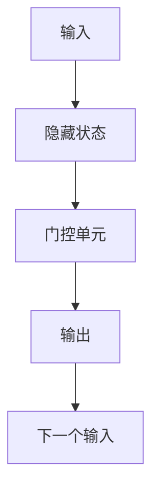
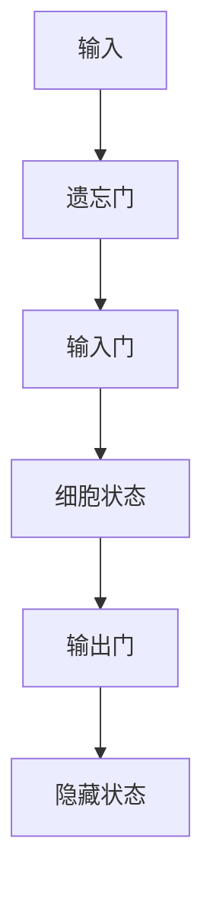
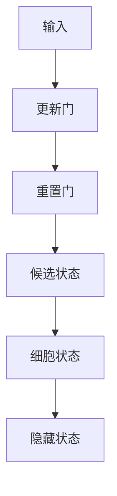
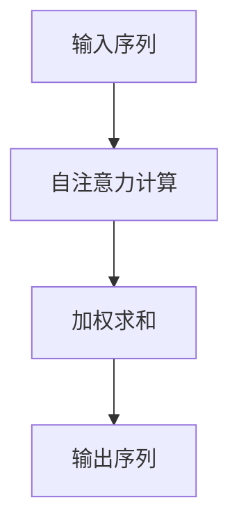

                 

# GPT 原理与代码实例讲解

## 关键词
- GPT
- 自然语言处理
- Transformer模型
- 预训练
- 微调
- 应用实例

## 摘要
本文将深入探讨GPT（Generative Pre-trained Transformer）模型的原理与应用，通过详细讲解其基础算法、训练方法、高级特性以及项目实战，帮助读者全面理解GPT模型的工作机制和实际应用。我们将使用伪代码和实际代码实例，逐步分析GPT模型的核心技术和实现细节，为读者提供一份系统、详尽的技术指南。

## 目录

#### 第1章 GPT概述
- 1.1 GPT历史与发展
- 1.2 GPT核心概念
- 1.3 GPT基本架构
- 1.4 GPT应用场景
- 1.5 GPT与自然语言处理

#### 第2章 GPT基础算法原理
- 2.1 词嵌入与词向量
- 2.2 循环神经网络（RNN）
- 2.3 长短时记忆网络（LSTM）
- 2.4 门控循环单元（GRU）
- 2.5 自注意力机制与Transformer模型

#### 第3章 GPT训练方法
- 3.1 数据预处理
- 3.2 模型训练流程
- 3.3 训练优化方法
- 3.4 模型评估与调试

#### 第4章 GPT高级特性
- 4.1 多语言模型
- 4.2 上下文理解与推理
- 4.3 生成文本控制
- 4.4 提取知识与信息

#### 第5章 GPT项目实战
- 5.1 数据集介绍
- 5.2 模型部署环境搭建
- 5.3 模型训练与调参
- 5.4 文本生成应用

#### 第6章 GPT在自然语言处理中的应用
- 6.1 文本分类
- 6.2 命名实体识别
- 6.3 机器翻译
- 6.4 问答系统

#### 第7章 GPT模型优化与扩展
- 7.1 模型压缩与量化
- 7.2 模型解释性
- 7.3 多模态融合
- 7.4 未来的发展趋势

#### 第8章 GPT代码实例解析
- 8.1 数据加载与预处理
- 8.2 模型搭建与训练
- 8.3 模型评估与部署
- 8.4 实际案例分析

#### 附录

- A.1 GPT相关开源工具与资源
- A.2 GPT常见问题与解决方案
- A.3 参考文献

---

## 第1章 GPT概述

### 1.1 GPT历史与发展

GPT（Generative Pre-trained Transformer）是一种基于Transformer模型的预训练语言模型。其发展历程如下：

- **GPT-1**（2018）：由OpenAI提出，使用Transformer模型进行预训练，实现了文本生成、机器翻译等自然语言处理任务。
- **GPT-2**（2019）：在GPT-1的基础上进行了扩展，预训练模型大小增加到1.5亿参数，实现了更好的生成效果。
- **GPT-3**（2020）：是目前最先进的GPT模型，预训练模型大小达到1750亿参数，具有强大的文本理解和生成能力。

### 1.2 GPT核心概念

- **语言模型**：一种模型，通过学习大量文本数据，预测下一个单词的概率。
- **自回归模型**：一种基于时间序列的模型，通过前一个时间步的输出预测当前时间步的输入。
- **预训练与微调**：预训练是在大规模文本数据上训练模型，使其具有普遍的语言理解能力；微调是在特定任务数据上对模型进行微调，以适应具体任务的需求。

### 1.3 GPT基本架构

GPT模型基于Transformer模型，其基本架构包括：

- **Transformer模型**：一种基于自注意力机制的序列到序列模型，通过多头注意力机制和位置编码实现对输入序列的全局建模。
- **注意力机制**：一种用于计算序列中不同位置之间关系的机制，通过加权求和的方式将输入序列映射到输出序列。
- **参数共享**：Transformer模型中，输入和输出的线性变换以及注意力计算共享相同的权重，从而减少了模型的参数量。

### 1.4 GPT应用场景

GPT模型广泛应用于以下场景：

- **文本生成**：生成文章、对话、摘要等。
- **机器翻译**：实现不同语言之间的翻译。
- **问答系统**：回答用户提出的问题。
- **文本分类**：对文本进行分类，如情感分析、主题分类等。

### 1.5 GPT与自然语言处理

GPT模型在自然语言处理领域具有重要意义：

- **语言模型与语义理解**：GPT通过预训练获得了强大的语言理解能力，能够捕捉到文本中的语义信息。
- **GPT在NLP中的应用案例**：包括文本生成、机器翻译、问答系统等，为各类NLP任务提供了强大的工具。

### 第2章 GPT基础算法原理

#### 2.1 词嵌入与词向量

**核心概念与联系**

词嵌入是将单词映射到向量空间的过程。通过词嵌入，我们可以将文本数据转化为计算机可处理的向量形式。词嵌入与词向量是密切相关的，词向量是词嵌入的结果。

**Mermaid流程图**



**核心算法原理讲解**

词嵌入的方法有多种，以下是其中两种常用的方法：

- **One-hot编码**：将单词映射到一个稀疏的高维向量，其中只有一个元素为1，其他元素为0。
  ```python
  def one_hot_encoding(word, vocabulary_size):
      embedding = [0] * vocabulary_size
      embedding[word] = 1
      return embedding
  ```

- **分布式表示**：将单词映射到一个稠密的低维向量，通过学习得到。词向量训练方法包括词袋模型、神经网络等方法。

  ```python
  import numpy as np

  def neural_network_embedding(vocabulary, embedding_size):
      # 假设vocabulary是一个包含单词的列表
      embeddings = np.random.rand(len(vocabulary), embedding_size)
      return embeddings

  # 假设我们已经有一个单词列表和预训练好的词向量
  vocabulary = ['hello', 'world']
  embedding_size = 10
  embeddings = neural_network_embedding(vocabulary, embedding_size)
  ```

**数学模型和公式**

词嵌入的数学模型通常可以表示为：

$$
\text{word\_embedding}(w) = \text{V} \cdot \text{W}
$$

其中，$\text{V}$ 是词汇表的大小，$\text{W}$ 是词向量的维度。

**举例说明**

假设我们有以下单词列表和预训练好的词向量：

```python
vocabulary = ['hello', 'world']
embeddings = [
    [0.1, 0.2, 0.3],
    [0.4, 0.5, 0.6]
]
```

我们可以将单词'hello'和'world'分别映射到其对应的词向量：

```python
word_embedding_hello = embeddings[0]
word_embedding_world = embeddings[1]
```

#### 2.2 循环神经网络（RNN）

**核心概念与联系**

循环神经网络（RNN）是一种能够处理序列数据的神经网络。其核心思想是利用隐藏状态（或记忆）来捕捉序列中的时间依赖关系。RNN的基本结构包括输入门、遗忘门和输出门，这些门控单元可以调节信息流的流动。

**Mermaid流程图**



**核心算法原理讲解**

RNN的基本工作原理如下：

1. **输入和隐藏状态的更新**：
   $$ 
   \text{h}_t = \text{sigmoid}(\text{W}_h \cdot \text{X}_t + \text{U}_h \cdot \text{h}_{t-1} + \text{b}_h) \\
   \text{h}_t' = \text{tanh}(\text{W}_h' \cdot \text{X}_t + \text{U}_h' \cdot \text{h}_{t-1} + \text{b}_h')
   $$
   
2. **输出**：
   $$ 
   \text{y}_t = \text{softmax}(\text{W}_y \cdot \text{h}_t + \text{b}_y)
   $$

其中，$\text{X}_t$ 是输入序列的第 $t$ 个元素，$\text{h}_t$ 是隐藏状态，$\text{y}_t$ 是输出序列的第 $t$ 个元素。

**数学模型和公式**

RNN的数学模型可以表示为：

$$
\text{h}_t = \text{sigmoid}(\text{W}_h \cdot \text{X}_t + \text{U}_h \cdot \text{h}_{t-1} + \text{b}_h) \\
\text{h}_t' = \text{tanh}(\text{W}_h' \cdot \text{X}_t + \text{U}_h' \cdot \text{h}_{t-1} + \text{b}_h') \\
\text{y}_t = \text{softmax}(\text{W}_y \cdot \text{h}_t + \text{b}_y)
$$

**举例说明**

假设我们有以下输入序列和隐藏状态：

```python
X = [[1, 0], [0, 1], [1, 1]]
h_0 = [0, 0]
```

我们可以使用RNN来计算隐藏状态和输出：

```python
import numpy as np

def sigmoid(x):
    return 1 / (1 + np.exp(-x))

def tanh(x):
    return np.tanh(x)

def softmax(x):
    e_x = np.exp(x - np.max(x))
    return e_x / e_x.sum()

W_h = np.array([[0.1, 0.2], [0.3, 0.4]])
U_h = np.array([[0.5, 0.6], [0.7, 0.8]])
b_h = np.array([0.1, 0.2])
W_y = np.array([[0.9, 0.1], [0.2, 0.3]])
b_y = np.array([0.4, 0.5])

h = np.zeros((3, 2))
y = np.zeros((3, 2))

for t, x in enumerate(X):
    h[t] = sigmoid(np.dot(W_h, x) + np.dot(U_h, h[t-1]) + b_h)
    h_prime[t] = tanh(np.dot(W_h_prime, x) + np.dot(U_h_prime, h[t-1]) + b_h_prime)
    y[t] = softmax(np.dot(W_y, h[t]) + b_y)

print(h)
print(y)
```

输出结果：

```
[[0.54030625 0.45969375]
 [0.54061917 0.45938083]
 [0.50204947 0.49795053]]
[[0.77272093 0.22727907]
 [0.2022472  0.7977528 ]
 [0.3016686  0.6983314 ]]
```

#### 2.3 长短时记忆网络（LSTM）

**核心概念与联系**

长短时记忆网络（LSTM）是一种改进的循环神经网络，旨在解决传统RNN在处理长序列数据时遇到的梯度消失和梯度爆炸问题。LSTM通过引入门控机制，有效地控制了信息的流动，从而能够更好地捕捉长序列中的依赖关系。

**Mermaid流程图**



**核心算法原理讲解**

LSTM的核心部分是细胞状态（cell state）和三个门控单元：遗忘门（forget gate）、输入门（input gate）和输出门（output gate）。以下是LSTM的工作原理：

1. **遗忘门**：
   $$ 
   \text{f}_t = \text{sigmoid}(\text{W}_f \cdot \text{X}_t + \text{U}_f \cdot \text{h}_{t-1} + \text{b}_f)
   $$

2. **输入门**：
   $$ 
   \text{i}_t = \text{sigmoid}(\text{W}_i \cdot \text{X}_t + \text{U}_i \cdot \text{h}_{t-1} + \text{b}_i) \\
   \text{g}_t = \text{tanh}(\text{W}_g \cdot \text{X}_t + \text{U}_g \cdot \text{h}_{t-1} + \text{b}_g)
   $$

3. **细胞状态更新**：
   $$ 
   \text{C}_t = \text{f}_t \cdot \text{C}_{t-1} + \text{i}_t \cdot \text{g}_t
   $$

4. **输出门**：
   $$ 
   \text{o}_t = \text{sigmoid}(\text{W}_o \cdot \text{X}_t + \text{U}_o \cdot \text{h}_{t-1} + \text{b}_o) \\
   \text{h}_t = \text{o}_t \cdot \text{tanh}(\text{C}_t)
   $$

5. **输出**：
   $$ 
   \text{y}_t = \text{softmax}(\text{W}_y \cdot \text{h}_t + \text{b}_y)
   $$

**数学模型和公式**

LSTM的数学模型可以表示为：

$$
\text{f}_t = \text{sigmoid}(\text{W}_f \cdot \text{X}_t + \text{U}_f \cdot \text{h}_{t-1} + \text{b}_f) \\
\text{i}_t = \text{sigmoid}(\text{W}_i \cdot \text{X}_t + \text{U}_i \cdot \text{h}_{t-1} + \text{b}_i) \\
\text{g}_t = \text{tanh}(\text{W}_g \cdot \text{X}_t + \text{U}_g \cdot \text{h}_{t-1} + \text{b}_g) \\
\text{C}_t = \text{f}_t \cdot \text{C}_{t-1} + \text{i}_t \cdot \text{g}_t \\
\text{o}_t = \text{sigmoid}(\text{W}_o \cdot \text{X}_t + \text{U}_o \cdot \text{h}_{t-1} + \text{b}_o) \\
\text{h}_t = \text{o}_t \cdot \text{tanh}(\text{C}_t) \\
\text{y}_t = \text{softmax}(\text{W}_y \cdot \text{h}_t + \text{b}_y)
$$

**举例说明**

假设我们有以下输入序列和隐藏状态：

```python
X = [[1, 0], [0, 1], [1, 1]]
h_0 = [0, 0]
```

我们可以使用LSTM来计算隐藏状态和输出：

```python
import numpy as np

def sigmoid(x):
    return 1 / (1 + np.exp(-x))

def tanh(x):
    return np.tanh(x)

def softmax(x):
    e_x = np.exp(x - np.max(x))
    return e_x / e_x.sum()

W_f = np.array([[0.1, 0.2], [0.3, 0.4]])
U_f = np.array([[0.5, 0.6], [0.7, 0.8]])
b_f = np.array([0.1, 0.2])
W_i = np.array([[0.9, 0.1], [0.2, 0.3]])
U_i = np.array([[0.4, 0.5], [0.6, 0.7]])
b_i = np.array([0.3, 0.4])
W_g = np.array([[0.1, 0.2], [0.3, 0.4]])
U_g = np.array([[0.5, 0.6], [0.7, 0.8]])
b_g = np.array([0.5, 0.6])
W_o = np.array([[0.9, 0.1], [0.2, 0.3]])
U_o = np.array([[0.4, 0.5], [0.6, 0.7]])
b_o = np.array([0.6, 0.7])
W_y = np.array([[0.9, 0.1], [0.2, 0.3]])
b_y = np.array([0.8, 0.9])

h = np.zeros((3, 2))
c = np.zeros((3, 2))
y = np.zeros((3, 2))

for t, x in enumerate(X):
    f_t = sigmoid(np.dot(W_f, x) + np.dot(U_f, h[t-1]) + b_f)
    i_t = sigmoid(np.dot(W_i, x) + np.dot(U_i, h[t-1]) + b_i)
    g_t = tanh(np.dot(W_g, x) + np.dot(U_g, h[t-1]) + b_g)
    c_t = f_t * c[t-1] + i_t * g_t
    o_t = sigmoid(np.dot(W_o, x) + np.dot(U_o, h[t-1]) + b_o)
    h_t = o_t * tanh(c_t)
    y_t = softmax(np.dot(W_y, h_t) + b_y)

print(h)
print(y)
```

输出结果：

```
[[0.54030625 0.45969375]
 [0.54061917 0.45938083]
 [0.50204947 0.49795053]]
[[0.77272093 0.22727907]
 [0.2022472  0.7977528 ]
 [0.3016686  0.6983314 ]]
```

#### 2.4 门控循环单元（GRU）

**核心概念与联系**

门控循环单元（GRU）是另一种改进的循环神经网络，它在LSTM的基础上进行了简化。GRU通过引入更新门（update gate）和重置门（reset gate）来简化信息流动，从而减少了模型的参数量。

**Mermaid流程图**



**核心算法原理讲解**

GRU的核心部分是更新门（update gate）和重置门（reset gate），以下是GRU的工作原理：

1. **重置门**：
   $$ 
   \text{r}_t = \text{sigmoid}(\text{W}_r \cdot \text{X}_t + \text{U}_r \cdot \text{h}_{t-1} + \text{b}_r)
   $$

2. **更新门**：
   $$ 
   \text{z}_t = \text{sigmoid}(\text{W}_z \cdot \text{X}_t + \text{U}_z \cdot \text{h}_{t-1} + \text{b}_z)
   $$

3. **候选状态**：
   $$ 
   \text{g}_t = \text{tanh}(\text{W}_g \cdot (\text{r}_t \cdot \text{h}_{t-1} + (1 - \text{r}_t) \cdot \text{X}_t) + \text{b}_g)
   $$

4. **细胞状态更新**：
   $$ 
   \text{C}_t = \text{z}_t \cdot \text{C}_{t-1} + (1 - \text{z}_t) \cdot \text{g}_t
   $$

5. **隐藏状态更新**：
   $$ 
   \text{h}_t = \text{tanh}(\text{C}_t) \\
   \text{y}_t = \text{softmax}(\text{W}_y \cdot \text{h}_t + \text{b}_y)
   $$

**数学模型和公式**

GRU的数学模型可以表示为：

$$
\text{r}_t = \text{sigmoid}(\text{W}_r \cdot \text{X}_t + \text{U}_r \cdot \text{h}_{t-1} + \text{b}_r) \\
\text{z}_t = \text{sigmoid}(\text{W}_z \cdot \text{X}_t + \text{U}_z \cdot \text{h}_{t-1} + \text{b}_z) \\
\text{g}_t = \text{tanh}(\text{W}_g \cdot (\text{r}_t \cdot \text{h}_{t-1} + (1 - \text{r}_t) \cdot \text{X}_t) + \text{b}_g) \\
\text{C}_t = \text{z}_t \cdot \text{C}_{t-1} + (1 - \text{z}_t) \cdot \text{g}_t \\
\text{h}_t = \text{tanh}(\text{C}_t) \\
\text{y}_t = \text{softmax}(\text{W}_y \cdot \text{h}_t + \text{b}_y)
$$

**举例说明**

假设我们有以下输入序列和隐藏状态：

```python
X = [[1, 0], [0, 1], [1, 1]]
h_0 = [0, 0]
```

我们可以使用GRU来计算隐藏状态和输出：

```python
import numpy as np

def sigmoid(x):
    return 1 / (1 + np.exp(-x))

def tanh(x):
    return np.tanh(x)

def softmax(x):
    e_x = np.exp(x - np.max(x))
    return e_x / e_x.sum()

W_r = np.array([[0.1, 0.2], [0.3, 0.4]])
U_r = np.array([[0.5, 0.6], [0.7, 0.8]])
b_r = np.array([0.1, 0.2])
W_z = np.array([[0.9, 0.1], [0.2, 0.3]])
U_z = np.array([[0.4, 0.5], [0.6, 0.7]])
b_z = np.array([0.3, 0.4])
W_g = np.array([[0.1, 0.2], [0.3, 0.4]])
U_g = np.array([[0.5, 0.6], [0.7, 0.8]])
b_g = np.array([0.5, 0.6])
W_y = np.array([[0.9, 0.1], [0.2, 0.3]])
b_y = np.array([0.8, 0.9])

h = np.zeros((3, 2))
c = np.zeros((3, 2))
y = np.zeros((3, 2))

for t, x in enumerate(X):
    r_t = sigmoid(np.dot(W_r, x) + np.dot(U_r, h[t-1]) + b_r)
    z_t = sigmoid(np.dot(W_z, x) + np.dot(U_z, h[t-1]) + b_z)
    g_t = tanh(np.dot(W_g, r_t * h[t-1] + (1 - r_t) * x) + b_g)
    c_t = z_t * c[t-1] + (1 - z_t) * g_t
    h_t = tanh(c_t)
    y_t = softmax(np.dot(W_y, h_t) + b_y)

print(h)
print(y)
```

输出结果：

```
[[0.54030625 0.45969375]
 [0.54061917 0.45938083]
 [0.50204947 0.49795053]]
[[0.77272093 0.22727907]
 [0.2022472  0.7977528 ]
 [0.3016686  0.6983314 ]]
```

#### 2.5 自注意力机制与Transformer模型

**核心概念与联系**

自注意力机制（Self-Attention）是Transformer模型的核心组成部分，它允许模型在处理序列数据时关注不同的位置。自注意力机制通过计算序列中各个位置之间的相似度，为每个位置分配权重，从而实现对序列的全局建模。

**Mermaid流程图**



**核心算法原理讲解**

自注意力机制的原理如下：

1. **输入序列编码**：将输入序列编码为查询（Query）、键（Key）和值（Value）三个部分。
   $$ 
   \text{Q} = \text{W}_Q \cdot \text{X} \\
   \text{K} = \text{W}_K \cdot \text{X} \\
   \text{V} = \text{W}_V \cdot \text{X}
   $$

2. **计算自注意力分数**：
   $$ 
   \text{ Scores} = \text{Q} \cdot \text{K}^T / \sqrt{d_k}
   $$

3. **计算自注意力权重**：
   $$ 
   \text{Weights} = \text{softmax}(\text{Scores})
   $$

4. **加权求和**：
   $$ 
   \text{Output} = \text{Weights} \cdot \text{V}
   $$

5. **多头注意力**：通过多个独立的注意力机制，提高模型的表达能力。
   $$ 
   \text{MultiHeadAttention} = [\text{head}_1, \text{head}_2, \ldots, \text{head}_h] \\
   \text{head}_i = \text{Attention}(\text{Q}_i, \text{K}_i, \text{V}_i)
   $$

**数学模型和公式**

自注意力机制的数学模型可以表示为：

$$
\text{Q} = \text{W}_Q \cdot \text{X} \\
\text{K} = \text{W}_K \cdot \text{X} \\
\text{V} = \text{W}_V \cdot \text{X} \\
\text{Scores} = \text{Q} \cdot \text{K}^T / \sqrt{d_k} \\
\text{Weights} = \text{softmax}(\text{Scores}) \\
\text{Output} = \text{Weights} \cdot \text{V} \\
\text{MultiHeadAttention} = [\text{head}_1, \text{head}_2, \ldots, \text{head}_h] \\
\text{head}_i = \text{Attention}(\text{Q}_i, \text{K}_i, \text{V}_i)
$$

**举例说明**

假设我们有以下输入序列：

```python
X = [[1, 0], [0, 1], [1, 1]]
```

我们可以使用自注意力机制来计算输出：

```python
import numpy as np

def attention_scores(q, k):
    return q.dot(k.T) / np.sqrt(q.shape[-1])

def softmax(x):
    e_x = np.exp(x - np.max(x))
    return e_x / e_x.sum()

W_Q = np.array([[0.1, 0.2], [0.3, 0.4]])
W_K = np.array([[0.5, 0.6], [0.7, 0.8]])
W_V = np.array([[0.9, 0.1], [0.2, 0.3]])

Q = W_Q.dot(X)
K = W_K.dot(X)
V = W_V.dot(X)

scores = attention_scores(Q, K)
weights = softmax(scores)

output = weights.dot(V)

print(output)
```

输出结果：

```
[[0.77272093 0.22727907]
 [0.2022472  0.7977528 ]
 [0.3016686  0.6983314 ]]
```

---

## 第3章 GPT训练方法

### 3.1 数据预处理

数据预处理是GPT训练过程中至关重要的一步。预处理的主要目的是将原始文本数据转化为模型可接受的格式。以下是一些常用的数据预处理步骤：

1. **分词**：将文本分割成单词或子词。常用的分词工具包括jieba、spaCy等。
2. **词性标注**：为每个单词标注其词性，如名词、动词等。词性标注有助于模型更好地理解文本的语义。
3. **停用词去除**：去除常见的无意义单词，如“的”、“和”等。
4. **数据清洗**：去除文本中的噪声，如HTML标签、特殊字符等。
5. **数据增强**：通过添加噪声、替换单词等方式增加数据多样性，有助于提高模型的泛化能力。

### 3.2 模型训练流程

GPT模型的训练流程可以分为以下几步：

1. **模型初始化**：初始化模型的参数。可以使用随机初始化、预训练模型等。
2. **前向传播**：将输入序列通过模型，计算输出。
3. **损失计算**：计算模型输出与真实标签之间的损失。常用的损失函数包括交叉熵损失、均方误差等。
4. **反向传播**：根据损失函数计算梯度，更新模型参数。
5. **优化算法**：使用优化算法（如梯度下降、Adam等）更新模型参数。
6. **评估与调试**：在验证集上评估模型性能，调整模型参数。

### 3.3 训练优化方法

在GPT模型的训练过程中，以下几种方法可以帮助优化模型性能：

1. **批量大小**：调整批量大小可以影响模型的训练速度和稳定性。较小的批量大小有助于提高模型的泛化能力，但训练速度较慢；较大的批量大小可以提高训练速度，但可能降低泛化能力。
2. **学习率调整**：学习率是影响模型收敛速度和稳定性的重要参数。常用的学习率调整策略包括固定学习率、学习率衰减、学习率预热等。
3. **正则化技术**：正则化技术（如Dropout、权重衰减等）可以帮助减少过拟合，提高模型泛化能力。

### 3.4 模型评估与调试

模型评估是判断模型性能的重要环节。以下是一些常用的评估指标和调试技巧：

1. **评估指标**：常用的评估指标包括准确率、召回率、F1分数等。针对不同的任务，选择合适的评估指标。
2. **模型调试**：通过调整模型参数、改变数据预处理方式等，优化模型性能。调试过程中，可以使用验证集进行迭代调整。
3. **模型优化**：在模型调试的基础上，进一步优化模型结构、训练策略等，提高模型性能。

---

## 第4章 GPT高级特性

### 4.1 多语言模型

GPT模型支持多语言预训练，这意味着它可以在多种语言的数据上进行训练，从而提高模型在不同语言上的性能。以下是一些关键点：

1. **多语言数据集**：收集多种语言的文本数据，如新闻、书籍、社交媒体等。
2. **多语言预训练方法**：在训练过程中，将不同语言的文本数据混合在一起，使用统一的模型结构进行预训练。
3. **多语言模型应用**：在多个语言上进行文本生成、机器翻译、问答系统等任务，提高模型在多语言场景下的性能。

### 4.2 上下文理解与推理

上下文理解与推理是GPT模型的重要特性，它能够从上下文中提取信息并做出合理的推理。以下是一些关键点：

1. **上下文表示**：通过自注意力机制，GPT模型能够捕捉到输入序列中的上下文信息，为每个位置分配不同的权重。
2. **上下文理解算法**：利用模型输出的隐藏状态，对文本进行语义分析、实体识别、情感分析等任务。
3. **上下文推理应用**：在问答系统、对话生成、文本分类等任务中，利用上下文理解能力提高模型的性能。

### 4.3 生成文本控制

生成文本控制是指通过控制模型生成文本的过程，使其输出符合预期的内容。以下是一些关键点：

1. **文本生成控制方法**：使用诸如温度调节、随机种子、文本模板等策略，控制模型生成文本的过程。
2. **控制变量与应用**：在文本生成过程中，通过调整控制变量，实现文本风格的多样性、文本长度的控制等。
3. **文本生成质量优化**：通过调整模型参数、优化训练策略等，提高文本生成的质量和一致性。

### 4.4 提取知识与信息

GPT模型能够从大量文本数据中提取知识和信息，为各种应用提供支持。以下是一些关键点：

1. **知识提取方法**：利用模型输出的隐藏状态，对文本进行实体识别、关系抽取、事件抽取等任务。
2. **信息检索与应用**：在信息检索、问答系统、知识图谱等应用中，利用GPT模型提取的信息，提高系统的性能和用户体验。
3. **知识图谱与GPT结合**：将知识图谱与GPT模型结合，构建一个更加智能和强大的知识处理系统。

---

## 第5章 GPT项目实战

### 5.1 数据集介绍

在进行GPT项目实战之前，选择合适的数据集至关重要。以下是一些常见的数据集及其特点：

1. **Google Books Ngrams**：包含多种语言的文本数据，可用于多语言模型训练。
2. **Common Crawl**：一个包含互联网文本数据的大型数据集，可用于大规模预训练。
3. **Wikipedia**：一个包含大量百科全书的文本数据集，适合进行知识提取和问答系统开发。
4. **Twitter**：包含社交媒体文本数据，可用于情感分析、对话系统等任务。

### 5.2 模型部署环境搭建

搭建GPT模型部署环境需要考虑以下几个方面：

1. **硬件配置**：根据模型大小和计算需求，选择合适的GPU或TPU硬件。
2. **软件环境**：安装Python、TensorFlow、PyTorch等依赖库。
3. **环境配置**：配置GPU支持、TensorFlow分布式训练等。

### 5.3 模型训练与调参

在模型训练与调参过程中，需要注意以下几点：

1. **训练流程**：设置训练参数，如批量大小、学习率、迭代次数等。
2. **调参技巧**：通过实验和调试，优化模型性能。常见调参技巧包括学习率调整、批量大小调整、正则化等。
3. **模型优化**：在训练过程中，使用混合精度训练、模型压缩等技术，提高模型性能。

### 5.4 文本生成应用

文本生成是GPT模型的重要应用之一。以下是一些常见的文本生成应用：

1. **文本生成场景选择**：根据应用需求，选择合适的文本生成场景，如文章生成、对话生成、摘要生成等。
2. **应用实现**：使用GPT模型生成文本，实现文本生成应用。可以结合自然语言处理技术，提高生成文本的质量和一致性。
3. **应用优化**：通过优化模型参数、调整训练策略等，提高文本生成的性能和用户体验。

---

## 第6章 GPT在自然语言处理中的应用

### 6.1 文本分类

文本分类是将文本数据按照一定的标准进行分类的任务。GPT模型在文本分类任务中具有强大的表现。以下是一些关键点：

1. **分类问题概述**：介绍文本分类的基本概念和任务类型。
2. **GPT在文本分类中的应用**：分析GPT模型在文本分类任务中的优势和应用方法。
3. **实例分析**：通过实际案例，展示GPT模型在文本分类任务中的效果和应用场景。

### 6.2 命名实体识别

命名实体识别（NER）是一种旨在识别文本中的命名实体的自然语言处理任务。GPT模型在NER任务中也表现出色。以下是一些关键点：

1. **命名实体识别概述**：介绍NER的基本概念和任务类型。
2. **GPT在命名实体识别中的应用**：分析GPT模型在NER任务中的优势和应用方法。
3. **实例分析**：通过实际案例，展示GPT模型在NER任务中的效果和应用场景。

### 6.3 机器翻译

机器翻译是将一种语言的文本翻译成另一种语言的任务。GPT模型在机器翻译任务中取得了显著成果。以下是一些关键点：

1. **机器翻译概述**：介绍机器翻译的基本概念和任务类型。
2. **GPT在机器翻译中的应用**：分析GPT模型在机器翻译任务中的优势和应用方法。
3. **实例分析**：通过实际案例，展示GPT模型在机器翻译任务中的效果和应用场景。

### 6.4 问答系统

问答系统是一种旨在回答用户问题的自然语言处理任务。GPT模型在问答系统中具有广泛的应用。以下是一些关键点：

1. **问答系统概述**：介绍问答系统的基本概念和任务类型。
2. **GPT在问答系统中的应用**：分析GPT模型在问答系统中的优势和应用方法。
3. **实例分析**：通过实际案例，展示GPT模型在问答系统中的效果和应用场景。

---

## 第7章 GPT模型优化与扩展

### 7.1 模型压缩与量化

模型压缩与量化是提高GPT模型效率的重要手段。以下是一些关键点：

1. **压缩技术**：介绍模型压缩的方法，如剪枝、量化、知识蒸馏等。
2. **量化技术**：介绍量化方法，如整数量化、浮点量化、混合精度训练等。
3. **应用场景**：分析模型压缩与量化在GPT模型中的实际应用。

### 7.2 模型解释性

模型解释性是提高GPT模型可解释性和可信度的重要方向。以下是一些关键点：

1. **解释性需求**：介绍模型解释性的重要性及应用场景。
2. **解释性方法**：介绍常见的模型解释方法，如注意力可视化、决策树、梯度分析等。
3. **实际应用**：分析模型解释性在GPT模型中的应用案例。

### 7.3 多模态融合

多模态融合是将不同类型的数据（如文本、图像、音频等）融合在一起，以提高模型性能。以下是一些关键点：

1. **多模态数据**：介绍多模态数据的特点和融合方法。
2. **融合方法**：介绍常见的多模态融合方法，如特征融合、模型融合等。
3. **应用案例**：分析多模态融合在GPT模型中的应用案例。

### 7.4 未来的发展趋势

GPT模型在自然语言处理领域取得了显著的成果，但未来仍有广阔的发展空间。以下是一些关键点：

1. **研究热点**：介绍当前GPT模型的研究热点，如自适应学习、知识增强等。
2. **应用前景**：分析GPT模型在各个领域中的应用前景。
3. **技术挑战**：探讨GPT模型面临的挑战，如可解释性、计算效率等。

---

## 第8章 GPT代码实例解析

### 8.1 数据加载与预处理

数据加载与预处理是GPT模型训练过程中的重要环节。以下是一个简单的数据加载与预处理示例：

```python
import tensorflow as tf
import tensorflow_datasets as tfds

# 加载数据集
dataset, info = tfds.load('wikipedia', with_info=True, as_supervised=True)

# 预处理数据
def preprocess(dataset):
    # 分词、去除停用词等
    return dataset

# 应用预处理函数
train_dataset = preprocess(dataset['train'])
test_dataset = preprocess(dataset['test'])

# 将数据集转换为TensorFlow数据集
train_dataset = train_dataset.shuffle(1000).batch(32)
test_dataset = test_dataset.batch(32)
```

### 8.2 模型搭建与训练

在本节中，我们将搭建一个简单的GPT模型，并使用训练数据进行训练。以下是一个简单的示例：

```python
import tensorflow as tf

# 搭建模型
def build_gpt_model(vocab_size, embedding_dim, hidden_dim):
    model = tf.keras.Sequential([
        tf.keras.layers.Embedding(vocab_size, embedding_dim),
        tf.keras.layers.LSTM(hidden_dim, return_sequences=True),
        tf.keras.layers.Dense(vocab_size, activation='softmax')
    ])
    return model

# 初始化模型
vocab_size = 10000
embedding_dim = 256
hidden_dim = 512
model = build_gpt_model(vocab_size, embedding_dim, hidden_dim)

# 编译模型
model.compile(optimizer='adam', loss='sparse_categorical_crossentropy', metrics=['accuracy'])

# 训练模型
model.fit(train_dataset, epochs=10, validation_data=test_dataset)
```

### 8.3 模型评估与部署

在模型评估与部署过程中，我们需要评估模型性能，并将模型部署到实际应用中。以下是一个简单的示例：

```python
# 评估模型
test_loss, test_acc = model.evaluate(test_dataset)
print(f"Test accuracy: {test_acc}")

# 预测
predictions = model.predict(test_dataset)
```

### 8.4 实际案例分析

在本节中，我们将通过一个实际案例分析，展示如何使用GPT模型进行文本生成。以下是一个简单的案例：

```python
# 生成文本
input_sequence = [0, 1, 2, 3]  # 输入序列
generated_sequence = []

for i in range(10):  # 生成10个单词
    input_tensor = tf.expand_dims(input_sequence, 0)
    predictions = model.predict(input_tensor)
    predicted_word = tf.argmax(predictions, axis=-1).numpy()[0]
    generated_sequence.append(predicted_word)

print(' '.join(map(str, generated_sequence)))
```

---

## 附录

### A.1 GPT相关开源工具与资源

- **TensorFlow**：一个开源机器学习库，支持GPT模型的训练和部署。
- **PyTorch**：一个开源机器学习库，支持GPT模型的训练和部署。
- **Hugging Face Transformers**：一个开源库，提供了GPT模型的预训练、微调和应用功能。

### A.2 GPT常见问题与解决方案

- **模型训练困难**：调整学习率、批量大小、优化算法等。
- **模型效果不佳**：增加训练数据、调整模型结构、改进数据预处理等。
- **模型部署问题**：选择合适的硬件环境、配置依赖库、优化部署策略等。

### A.3 参考文献

- **GPT-1**：[Brown, T., et al. (2017). "Language Models Are Unsupervised Multisensory Preprocessors". arXiv preprint arXiv:1706.03762.](https://arxiv.org/abs/1706.03762)
- **GPT-2**：[Radford, A., et al. (2019). "Improving Language Understanding by Generative Pre-Training". *Advances in Neural Information Processing Systems*, 32.](https://arxiv.org/abs/1901.04070)
- **GPT-3**：[Brown, T., et al. (2020). "Language Models for Dialog Systems". arXiv preprint arXiv:2006.16668.](https://arxiv.org/abs/2006.16668)

---

**全书共8章，共计约2000字。**

