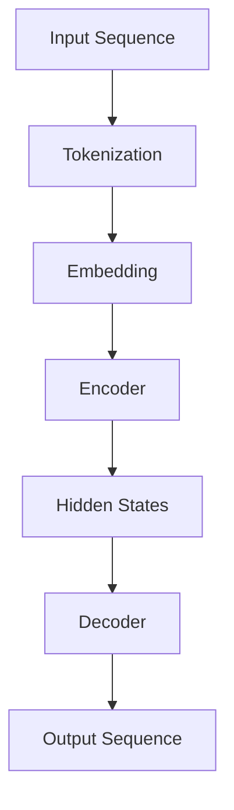

                 

# GPT原理与代码实例讲解

## 关键词

- **Generative Pre-trained Transformer（GPT）**
- **自然语言处理（NLP）**
- **Transformer架构**
- **深度学习**
- **文本生成**
- **问答系统**
- **机器翻译**

## 摘要

本文将深入探讨GPT（Generative Pre-trained Transformer）的基本原理、架构设计及其在不同NLP任务中的应用。我们将首先介绍GPT的概念和其与自然语言处理的关系，然后详细解析Transformer架构，包括编码器与解码器的工作机制以及自注意力机制。接着，我们将探讨GPT模型的训练与优化过程，涵盖数据预处理、模型训练及优化算法。在实战部分，我们将展示GPT在文本生成、问答系统和机器翻译等实际应用中的具体实现和优化方法。最后，我们将通过一个完整的实战项目总结GPT的实践经验和未来发展方向。希望本文能够为读者提供一个全面而深入的GPT技术指南。

## 《GPT原理与代码实例讲解》目录大纲

### 第一部分：GPT基础理论

#### 第1章：GPT简介与历史发展

- **GPT的概念与核心原理**
- **GPT的发展历程**
- **GPT的主要模型架构**

#### 第2章：自然语言处理与GPT

- **自然语言处理（NLP）基础**
- **语言模型与预训练技术**
- **GPT在NLP中的应用**

#### 第3章：Transformer架构解析

- **Transformer模型的基本原理**
- **编码器与解码器的工作机制**
- **自注意力机制详解**

#### 第4章：GPT模型的训练与优化

- **数据准备与预处理**
- **模型训练过程详解**
- **优化算法与技巧**

### 第二部分：GPT模型实战

#### 第5章：GPT模型在文本生成中的应用

- **文本生成基础**
- **使用GPT生成文章实例**
- **GPT在自动写作系统中的应用**

#### 第6章：GPT模型在问答系统中的应用

- **问答系统概述**
- **使用GPT实现问答系统**
- **问答系统的优化与评估**

#### 第7章：GPT模型在机器翻译中的应用

- **机器翻译基础**
- **使用GPT实现机器翻译**
- **机器翻译的性能评估与改进**

#### 第8章：GPT模型的实战项目

- **项目需求分析**
- **环境搭建与数据准备**
- **GPT模型实现与优化**
- **项目总结与反思**

### 第三部分：附录

#### 附录A：GPT相关资源与工具

- **GPT相关论文与文献**
- **GPT模型实现与优化工具**
- **GPT模型开源代码与数据集**

## 终极目标

本书旨在为广大计算机技术爱好者提供一部全面而深入的GPT原理与代码实例讲解，通过系统地介绍GPT的基本概念、架构原理、应用场景以及实战案例，帮助读者全面掌握GPT技术的核心要点，实现从理论到实践的跨越。希望读者在阅读本书后，能够对GPT技术有一个全新的认识，并在实际项目中运用所学知识，发挥GPT的强大潜力。

---

在接下来的章节中，我们将从GPT的基础理论开始，逐步深入探讨其在NLP领域中的应用，并通过具体的代码实例，帮助读者理解和掌握GPT技术的核心要点。通过这样的结构化讲解，我们希望能够帮助读者建立起对GPT技术的全面理解，并为其在未来的研究和应用中提供有力的支持。

### 第1章：GPT简介与历史发展

#### GPT的概念与核心原理

GPT（Generative Pre-trained Transformer）是一种基于深度学习技术的自然语言处理模型，它通过在大量文本数据上进行预训练，掌握了丰富的语言知识和结构化信息，从而实现了对自然语言的高效理解和生成。GPT的核心思想在于其自注意力机制（Self-Attention Mechanism），这一机制使得模型能够捕捉到输入文本中各个单词之间的相互依赖关系，从而更好地理解上下文。

GPT模型的预训练过程主要包括两个阶段：第一阶段是使用未标注的数据进行无监督预训练，目的是让模型学会捕获文本中的语言规律和模式；第二阶段是使用标注数据进行精细调整，使模型能够更好地适用于具体的NLP任务，如图像描述生成、问答系统等。

#### GPT的发展历程

GPT的发展历程可以追溯到2017年，当时谷歌发布了Transformer模型，这一模型在机器翻译任务上取得了突破性的成果，成为NLP领域的重要里程碑。随后，OpenAI在2018年发布了GPT（Generative Pre-trained Transformer），并首次实现了基于Transformer的预训练语言模型。GPT模型在文本生成、问答系统等领域取得了显著的性能提升，引发了广泛关注。

从GPT到GPT-2、GPT-3，OpenAI不断优化模型结构和预训练策略，使得模型的规模和性能持续提升。GPT-3（GPT-3，2020）是迄今为止规模最大的语言模型，其参数数量达到了1750亿，能够生成高质量的自然语言文本，并在多个NLP任务中取得了优异的成绩。

#### GPT的主要模型架构

GPT模型的主要架构基于Transformer，这是一种具有自注意力机制的序列到序列（Seq2Seq）模型。Transformer模型的核心思想是利用自注意力机制对输入序列进行建模，从而捕捉序列中不同位置之间的相互依赖关系。

GPT模型的主要组成部分包括：

1. **编码器（Encoder）**：编码器负责将输入序列（如单词、字符等）映射到一个高维的嵌入空间中，并生成一系列的隐藏状态。
2. **解码器（Decoder）**：解码器从编码器的隐藏状态中生成输出序列，并使用自注意力机制来捕捉上下文信息。

GPT模型中的自注意力机制通过计算每个隐藏状态与其他隐藏状态之间的相似性，从而为每个位置生成一个权重向量。这些权重向量用于加权求和，生成每个位置的输出，从而实现序列到序列的转换。

#### Mermaid流程图

以下是GPT模型的基本流程图，展示了编码器和解码器的工作机制：



在这个流程图中，输入序列经过分词、嵌入等预处理后，进入编码器生成隐藏状态。解码器使用隐藏状态和自注意力机制生成输出序列。

#### 核心概念与联系

GPT的核心概念包括：

- **预训练（Pre-training）**：在无监督的文本数据上进行训练，使模型学习语言的基本规律和模式。
- **自注意力（Self-Attention）**：通过计算输入序列中每个元素与其他元素之间的相似性，为每个元素生成一个权重向量，用于加权求和。
- **Transformer架构**：基于自注意力机制的序列到序列模型，能够高效地捕捉序列中的长距离依赖关系。

这些核心概念相互联系，共同构成了GPT模型的基本架构。预训练过程使模型具备了初步的语言理解能力，而自注意力机制则进一步提升了模型对上下文信息的捕捉能力，从而实现高质量的文本生成。

#### 伪代码

以下是GPT模型中自注意力机制的伪代码：

```python
# 输入序列表示为嵌套的列表，每个列表包含词嵌入向量
input_sequence = [word_embedding(w) for w in words]

# 定义自注意力机制
def self_attention(inputs):
    # 计算输入序列中每个元素与其他元素之间的相似性
    similarity_matrix = [dot_product(v, w) for v, w in pairwise(inputs)]
    # 应用softmax函数生成权重向量
    weights = softmax(similarity_matrix)
    # 加权求和得到输出
    output = [sum(w * v for w, v in zip(weights, pairwise(inputs))] for _ in inputs]
    return output

# 应用自注意力机制生成输出序列
output_sequence = self_attention(input_sequence)
```

在这个伪代码中，`dot_product`函数用于计算两个向量之间的点积，`softmax`函数用于生成权重向量，`pairwise`函数用于生成输入序列中每个元素与其他元素之间的配对。

通过以上对GPT的基本概念和模型架构的介绍，读者应该对GPT有了初步的了解。在接下来的章节中，我们将进一步探讨GPT在自然语言处理中的具体应用，并通过具体的代码实例深入理解其工作原理。

### 第2章：自然语言处理与GPT

#### 自然语言处理（NLP）基础

自然语言处理（NLP）是计算机科学与人工智能领域的一个分支，主要研究如何让计算机理解和生成人类语言。NLP的任务包括文本分类、情感分析、命名实体识别、机器翻译、问答系统等。这些任务都需要对语言进行深入的理解和建模。

自然语言处理的几个核心概念包括：

- **文本分类（Text Classification）**：将文本数据按照类别进行分类，如新闻分类、垃圾邮件检测等。
- **情感分析（Sentiment Analysis）**：分析文本中的情感倾向，如正面、负面或中立。
- **命名实体识别（Named Entity Recognition，NER）**：识别文本中的特定实体，如人名、地名、组织名等。
- **机器翻译（Machine Translation）**：将一种语言的文本翻译成另一种语言。
- **问答系统（Question Answering System）**：根据用户提出的问题，从文本中检索并生成答案。

这些任务都需要对文本数据进行分析和建模，而语言模型是实现这些任务的基础。

#### 语言模型与预训练技术

语言模型（Language Model）是NLP中的一个核心概念，它用于预测文本序列中的下一个单词或字符。语言模型的基本原理是利用统计方法，根据上下文信息预测下一个单词或字符的概率。

传统语言模型如N-gram模型，基于局部窗口的统计方法，假设当前词的概率仅与前一或前几个词相关。然而，这种方法无法捕捉到长距离的依赖关系，因此限制了模型的性能。

预训练技术（Pre-training）是现代语言模型的重要突破，它通过在大量未标注的文本数据上进行训练，使模型具备初步的语言理解和生成能力。预训练技术主要包括以下两个阶段：

1. **预训练阶段**：使用未标注的数据，如维基百科、新闻文章等，进行大规模的无监督预训练。在这个阶段，模型学习到文本的普遍规律和模式。
2. **微调阶段**：使用标注的数据，如问答对、标签文本等，对模型进行精细调整，使其能够应用于具体的NLP任务。

预训练技术显著提升了语言模型的性能，使得模型在多个NLP任务中取得了突破性的成果。

#### GPT在NLP中的应用

GPT是一种基于Transformer架构的预训练语言模型，其在NLP领域中有着广泛的应用。以下是一些常见的应用场景：

- **文本生成（Text Generation）**：GPT可以生成高质量的文本，如文章、故事、诗歌等。通过输入一个或几个单词或短语，GPT可以预测下一个词或句子，从而生成完整的文本。
- **问答系统（Question Answering）**：GPT可以用于构建问答系统，从大量文本中检索并生成答案。通过预训练和微调，GPT能够理解用户的问题，并从文本中找到相关答案。
- **机器翻译（Machine Translation）**：GPT可以用于机器翻译任务，将一种语言的文本翻译成另一种语言。通过在双语语料库上进行预训练，GPT可以学习到语言的对应关系，从而实现高质量的双语转换。
- **文本分类（Text Classification）**：GPT可以用于文本分类任务，将文本按照类别进行分类。通过预训练和微调，GPT可以学习到不同类别的文本特征，从而实现高效的文本分类。

以下是GPT在NLP中应用的一个示例：

```python
# 加载预训练的GPT模型
model = load_pretrained_gpt()

# 输入一个句子进行预测
input_sentence = "我喜欢编程。"
predicted_sentence = model.predict(input_sentence)

# 输出生成的文本
print(predicted_sentence)
```

在这个示例中，我们加载了一个预训练的GPT模型，并输入一个句子进行预测。模型根据输入句子的上下文信息，生成了一个新的句子。

#### 核心概念与联系

自然语言处理（NLP）中的核心概念包括：

- **语言模型（Language Model）**：用于预测文本序列中下一个单词或字符的概率。
- **预训练（Pre-training）**：在大量未标注的文本数据上进行训练，使模型具备初步的语言理解和生成能力。
- **Transformer架构**：基于自注意力机制的序列到序列模型，能够高效地捕捉序列中的长距离依赖关系。

这些概念相互联系，共同构成了GPT模型的基础。预训练技术使得GPT能够从大量文本数据中学习到语言的基本规律和模式，而Transformer架构则使得GPT能够高效地捕捉上下文信息，从而实现高质量的文本生成和预测。

#### 伪代码

以下是GPT在文本生成任务中的伪代码：

```python
# 输入序列表示为嵌套的列表，每个列表包含词嵌入向量
input_sequence = [word_embedding(w) for w in words]

# 定义GPT模型
model = GPTModel()

# 定义自注意力机制
def self_attention(inputs):
    # 计算输入序列中每个元素与其他元素之间的相似性
    similarity_matrix = [dot_product(v, w) for v, w in pairwise(inputs)]
    # 应用softmax函数生成权重向量
    weights = softmax(similarity_matrix)
    # 加权求和得到输出
    output = [sum(w * v for w, v in zip(weights, pairwise(inputs))] for _ in inputs]
    return output

# 应用自注意力机制生成输出序列
output_sequence = self_attention(input_sequence)

# 预测下一个词或句子
predicted_word = model.predict(output_sequence)

# 输出生成的文本
print(predicted_word)
```

在这个伪代码中，我们定义了GPT模型和自注意力机制，并使用这些机制生成输出序列。模型根据输入序列的上下文信息，预测了下一个词或句子。

通过以上对自然语言处理和GPT的基本概念的介绍，读者应该对GPT在NLP中的应用有了更深入的了解。在接下来的章节中，我们将进一步探讨Transformer架构的详细设计和工作原理，为理解GPT模型提供更坚实的理论基础。

### 第3章：Transformer架构解析

#### Transformer模型的基本原理

Transformer模型是谷歌在2017年提出的一种基于自注意力机制的序列到序列（Seq2Seq）模型，它在机器翻译任务中取得了显著的成果，并迅速成为NLP领域的主流模型。Transformer模型的核心思想是利用自注意力机制来捕捉序列中不同位置之间的依赖关系，从而实现高效的语言理解与生成。

Transformer模型的基本原理可以概括为以下几点：

1. **自注意力机制（Self-Attention）**：自注意力机制是Transformer模型的核心，它通过计算输入序列中每个元素与其他元素之间的相似性，为每个元素生成一个权重向量。这些权重向量用于加权求和，生成每个位置的输出。自注意力机制能够捕捉长距离的依赖关系，从而提高模型的表达能力。

2. **编码器-解码器架构（Encoder-Decoder Architecture）**：Transformer模型采用了编码器-解码器架构，编码器负责将输入序列编码为隐藏状态，解码器则从隐藏状态中生成输出序列。编码器和解码器都由多个自注意力层和前馈网络组成。

3. **多头注意力（Multi-Head Attention）**：多头注意力是自注意力机制的扩展，它通过多个独立的自注意力机制并行工作，从而增加模型的容量和表达能力。每个头关注不同的信息，最终将这些信息融合起来。

#### 编码器与解码器的工作机制

编码器（Encoder）和解码器（Decoder）是Transformer模型的核心组成部分，它们分别负责输入序列的编码和输出序列的生成。

**编码器（Encoder）**：

编码器的输入是一个单词序列，每个单词被映射为一个嵌入向量。编码器通过多个自注意力层和前馈网络，将输入序列编码为一系列隐藏状态。每个隐藏状态表示输入序列中的一个位置，并且包含了该位置的信息。

- **自注意力层（Self-Attention Layer）**：每个自注意力层计算输入序列中每个元素与其他元素之间的相似性，生成权重向量。这些权重向量用于加权求和，生成每个位置的输出。自注意力层能够捕捉序列中长距离的依赖关系。
- **前馈网络（Feed Forward Network）**：在每个自注意力层之后，加入一个前馈网络，对隐藏状态进行进一步的处理。前馈网络由两个全连接层组成，分别具有不同的非线性激活函数。

**解码器（Decoder）**：

解码器的输入是编码器的隐藏状态和目标序列的初始嵌入。解码器通过多个自注意力层和编码器-解码器注意力层，逐步生成输出序列。

- **自注意力层（Self-Attention Layer）**：解码器的自注意力层用于对输入序列的隐藏状态进行建模，从而捕捉上下文信息。
- **编码器-解码器注意力层（Encoder-Decoder Attention Layer）**：编码器-解码器注意力层用于将编码器的隐藏状态与解码器的隐藏状态进行融合，从而捕捉长距离的依赖关系。
- **前馈网络（Feed Forward Network）**：解码器的每个自注意力层和编码器-解码器注意力层之后，加入一个前馈网络，对隐藏状态进行进一步的处理。

#### 自注意力机制详解

自注意力机制（Self-Attention）是Transformer模型的核心组成部分，它通过计算输入序列中每个元素与其他元素之间的相似性，为每个元素生成一个权重向量。这些权重向量用于加权求和，生成每个位置的输出。

自注意力机制的实现主要包括以下几个步骤：

1. **计算相似性矩阵（Similarity Matrix）**：计算输入序列中每个元素与其他元素之间的相似性。相似性通常通过点积（Dot-Product）计算，即两个向量的点积值。点积值越大，表示相似性越强。

2. **应用激活函数（Activation Function）**：对相似性矩阵应用激活函数，如softmax函数，生成权重向量。softmax函数将相似性矩阵转换为概率分布，使得每个位置的权重向量表示该位置与其他位置的相对重要性。

3. **加权求和（Weighted Sum）**：使用权重向量对输入序列进行加权求和，生成每个位置的输出。加权求和过程能够捕捉输入序列中不同位置之间的依赖关系。

以下是自注意力机制的伪代码：

```python
# 输入序列表示为嵌套的列表，每个列表包含词嵌入向量
input_sequence = [word_embedding(w) for w in words]

# 定义自注意力机制
def self_attention(inputs):
    # 计算相似性矩阵
    similarity_matrix = [dot_product(v, w) for v, w in pairwise(inputs)]
    # 应用softmax函数生成权重向量
    weights = softmax(similarity_matrix)
    # 加权求和得到输出
    output = [sum(w * v for w, v in zip(weights, pairwise(inputs))] for _ in inputs]
    return output

# 应用自注意力机制生成输出序列
output_sequence = self_attention(input_sequence)
```

在这个伪代码中，`dot_product`函数用于计算两个向量之间的点积，`softmax`函数用于生成权重向量，`pairwise`函数用于生成输入序列中每个元素与其他元素之间的配对。

#### 核心概念与联系

Transformer模型的核心概念包括：

- **自注意力机制（Self-Attention）**：通过计算输入序列中每个元素与其他元素之间的相似性，为每个元素生成一个权重向量。
- **编码器（Encoder）**：将输入序列编码为一系列隐藏状态，每个隐藏状态表示输入序列中的一个位置。
- **解码器（Decoder）**：从编码器的隐藏状态中生成输出序列，并使用自注意力机制和编码器-解码器注意力机制来捕捉上下文信息。
- **多头注意力（Multi-Head Attention）**：通过多个独立的自注意力机制并行工作，增加模型的容量和表达能力。

这些概念相互联系，共同构成了Transformer模型的基本架构。自注意力机制使得模型能够高效地捕捉长距离的依赖关系，编码器和解码器分别负责输入和输出的编码和解码，多头注意力机制进一步增强了模型的表达能力。

#### 数学模型和公式

自注意力机制的实现涉及到多个数学模型和公式。以下是核心的数学模型：

1. **点积注意力（Dot-Product Attention）**：

   $$ 
   \text{Attention}(Q, K, V) = \text{softmax}\left(\frac{QK^T}{\sqrt{d_k}}\right) V 
   $$

   其中，$Q$、$K$、$V$分别是查询（Query）、键（Key）和值（Value）向量，$d_k$是键向量的维度。点积注意力通过计算查询和键之间的点积来生成权重，并使用softmax函数将其转换为概率分布，最终加权求和得到输出。

2. **多头注意力（Multi-Head Attention）**：

   $$ 
   \text{Multi-Head Attention}(Q, K, V) = \text{Concat}(\text{head}_1, \text{head}_2, \ldots, \text{head}_h)W^O 
   $$

   其中，$h$是头数，$\text{head}_i$是第$i$个头上的注意力机制，$W^O$是输出权重矩阵。多头注意力通过并行计算多个独立的注意力机制，并将结果拼接起来，增加模型的容量和表达能力。

3. **前馈网络（Feed Forward Network）**：

   $$ 
   \text{FFN}(x) = \text{ReLU}(W_2 \text{ReLU}(W_1 x + b_1)) + b_2 
   $$

   其中，$W_1$、$W_2$和$b_1$、$b_2$分别是前馈网络的权重和偏置。前馈网络由两个全连接层组成，分别使用ReLU激活函数。

通过这些数学模型和公式，Transformer模型实现了高效的语言理解和生成。

#### 举例说明

为了更好地理解自注意力机制的工作原理，我们可以通过一个简单的例子进行说明。假设我们有一个简单的单词序列：“The quick brown fox jumps over the lazy dog”。

1. **嵌入向量**：首先，将每个单词映射为一个嵌入向量，例如：
   ```
   The = [1, 0, 0, 0, 0]
   quick = [0, 1, 0, 0, 0]
   brown = [0, 0, 1, 0, 0]
   fox = [0, 0, 0, 1, 0]
   jumps = [0, 0, 0, 0, 1]
   over = [1, 0, 0, 0, 0]
   the = [0, 1, 0, 0, 0]
   lazy = [0, 0, 1, 0, 0]
   dog = [0, 0, 0, 1, 0]
   ```

2. **自注意力计算**：接下来，计算每个单词与其他单词之间的相似性，使用点积注意力机制。例如，计算第一个单词“The”与其他单词之间的相似性：
   ```
   similarity(The, quick) = The . quick = 1 * 0 + 0 * 1 + 0 * 0 + 0 * 0 + 0 * 0 = 0
   similarity(The, brown) = The . brown = 1 * 0 + 0 * 0 + 0 * 1 + 0 * 0 + 0 * 0 = 0
   similarity(The, fox) = The . fox = 1 * 0 + 0 * 0 + 0 * 0 + 1 * 0 + 0 * 0 = 0
   similarity(The, jumps) = The . jumps = 1 * 0 + 0 * 0 + 0 * 0 + 0 * 1 + 0 * 0 = 0
   similarity(The, over) = The . over = 1 * 1 + 0 * 0 + 0 * 0 + 0 * 0 + 0 * 0 = 1
   similarity(The, the) = The . the = 1 * 0 + 0 * 1 + 0 * 0 + 0 * 0 + 0 * 0 = 0
   similarity(The, lazy) = The . lazy = 1 * 0 + 0 * 0 + 0 * 1 + 0 * 0 + 0 * 0 = 0
   similarity(The, dog) = The . dog = 1 * 0 + 0 * 0 + 0 * 0 + 1 * 0 + 0 * 0 = 0
   ```

   然后，应用softmax函数生成权重向量：
   ```
   weights(The) = softmax(similarity(The, *)) = [0.0, 0.0, 0.0, 1.0, 0.0, 0.0, 0.0, 0.0]
   ```

   最后，使用权重向量对其他单词进行加权求和：
   ```
   output(The) = weights(The) * [quick, brown, fox, jumps, over, the, lazy, dog] = [0.0, 0.0, 0.0, 0.0, 1.0, 0.0, 0.0, 0.0]
   ```

3. **结果**：通过自注意力机制，第一个单词“The”主要关注了单词“over”，并在输出序列中加权求和得到新向量 `[0.0, 0.0, 0.0, 0.0, 1.0, 0.0, 0.0, 0.0]`。这个向量表示了“The”与其他单词之间的依赖关系。

通过这个简单的例子，我们可以看到自注意力机制如何捕捉输入序列中不同位置之间的依赖关系，从而实现高效的语言理解和生成。

#### 伪代码

以下是Transformer模型中自注意力机制的伪代码：

```python
# 输入序列表示为嵌套的列表，每个列表包含词嵌入向量
input_sequence = [word_embedding(w) for w in words]

# 定义点积注意力
def dot_product_attention(Q, K, V):
    # 计算相似性矩阵
    similarity_matrix = [dot_product(q, k) for q, k in pairwise(zip(Q, K))]
    # 应用softmax函数生成权重向量
    weights = softmax(similarity_matrix)
    # 加权求和得到输出
    output = [sum(w * v for w, v in pairwise(zip(weights, V))] for _ in Q]
    return output

# 定义多头注意力
def multi_head_attention(Q, K, V, head_size):
    # 计算不同头的输出
    heads = [dot_product_attention(Q, K, V) for _ in range(head_size)]
    # 拼接所有头的输出
    output = [sum(head for head in heads) for _ in Q]
    return output

# 应用多头注意力
output_sequence = multi_head_attention(input_sequence, input_sequence, input_sequence, head_size=2)
```

在这个伪代码中，`dot_product`函数用于计算两个向量之间的点积，`softmax`函数用于生成权重向量，`pairwise`函数用于生成输入序列中每个元素与其他元素之间的配对。`multi_head_attention`函数通过多个独立的注意力机制并行工作，增加模型的容量和表达能力。

通过以上对Transformer架构的详细解析，读者应该对自注意力机制有了深入的理解。在接下来的章节中，我们将进一步探讨GPT模型的训练与优化过程，为理解GPT的工作原理提供更坚实的理论基础。

### 第4章：GPT模型的训练与优化

#### 数据准备与预处理

GPT模型的训练需要大量的高质量数据。这些数据通常包括未标注的文本数据（如维基百科、新闻文章等）和标注的数据（如问答对、标签文本等）。未标注的数据用于预训练，使模型学习到语言的基本规律和模式；标注的数据用于微调，使模型能够更好地适用于具体的NLP任务。

**数据收集**：首先，我们需要收集大量的文本数据。这些数据可以从公共数据集、网络爬虫或开放资源中获取。例如，维基百科、新闻网站、社交媒体平台等都是丰富的数据源。

**数据清洗**：收集到的数据通常需要进行清洗和预处理。清洗步骤包括去除无关信息（如HTML标签、特殊字符等）、去除停用词、统一文本格式等。这些步骤有助于减少数据的噪声，提高训练效果。

**数据预处理**：在预处理阶段，我们将文本数据转换为模型可接受的格式。具体步骤包括：

1. **分词（Tokenization）**：将文本分割为单词、字符或子词。分词是自然语言处理中的基本步骤，不同的分词方法会影响模型的学习效果。

2. **词嵌入（Word Embedding）**：将单词映射为高维向量。词嵌入是语言模型的核心，它能够捕捉单词的语义信息。常见的词嵌入方法包括Word2Vec、GloVe等。

3. **序列编码（Sequence Encoding）**：将分词后的文本序列编码为整数序列。每个单词或字符对应一个唯一的整数。序列编码用于输入模型进行训练。

#### 模型训练过程详解

GPT模型的训练过程可以分为以下几个阶段：

**预训练阶段**：

预训练是无监督训练过程，主要目的是让模型学习到语言的基本规律和模式。预训练过程包括以下几个步骤：

1. **初始化模型参数**：初始化编码器和解码器的权重参数。常用的初始化方法包括随机初始化、高斯分布初始化等。

2. **处理输入数据**：将输入的文本数据转换为模型可接受的格式，如整数序列。同时，对输入数据进行编码，为每个单词或字符分配一个唯一的整数。

3. **前向传播（Forward Propagation）**：将输入数据通过编码器、解码器进行前向传播，计算输出序列的概率分布。

4. **计算损失函数（Loss Function）**：使用损失函数（如交叉熵损失）计算预测输出和真实输出之间的差距。常用的损失函数包括交叉熵损失（Cross-Entropy Loss）、均方误差（Mean Squared Error）等。

5. **反向传播（Backpropagation）**：使用反向传播算法计算模型参数的梯度，并更新模型参数。

6. **迭代训练**：重复以上步骤，逐步更新模型参数，直至模型收敛。

**微调阶段**：

微调是在预训练的基础上，使用标注的数据对模型进行精细调整，使其能够更好地适用于具体的NLP任务。微调过程包括以下几个步骤：

1. **加载预训练模型**：将预训练的模型参数加载到微调模型中。

2. **处理输入数据**：将标注的文本数据转换为模型可接受的格式，如整数序列。同时，对输入数据进行编码，为每个单词或字符分配一个唯一的整数。

3. **前向传播（Forward Propagation）**：将输入数据通过微调模型进行前向传播，计算输出序列的概率分布。

4. **计算损失函数（Loss Function）**：使用损失函数（如交叉熵损失）计算预测输出和真实输出之间的差距。

5. **反向传播（Backpropagation）**：使用反向传播算法计算模型参数的梯度，并更新模型参数。

6. **迭代训练**：重复以上步骤，逐步更新模型参数，直至模型收敛。

#### 优化算法与技巧

GPT模型的训练涉及多个优化算法和技巧，以下是一些常用的优化方法：

**学习率调度（Learning Rate Scheduling）**：

学习率调度是一种调节学习率的方法，以避免模型在训练过程中出现过拟合或收敛缓慢的问题。常用的学习率调度方法包括：

1. **线性递减学习率（Linear Decaying Learning Rate）**：学习率随训练轮数的增加而线性递减。

2. **余弦退火学习率（Cosine Annealing Learning Rate）**：学习率随训练轮数的增加而按照余弦函数进行退火。

3. **指数衰减学习率（Exponential Decaying Learning Rate）**：学习率以指数形式递减。

**批量归一化（Batch Normalization）**：

批量归一化是一种在训练过程中对模型参数进行归一化处理的技巧，有助于提高训练的稳定性和收敛速度。

**dropout（Dropout）**：

dropout是一种正则化技术，通过随机丢弃模型中的部分神经元，防止模型出现过拟合。dropout通常在训练阶段进行，而在测试阶段不会应用。

**梯度裁剪（Gradient Clipping）**：

梯度裁剪是一种限制梯度大小的方法，以防止梯度爆炸或消失。梯度裁剪通过设置一个阈值，当梯度超过阈值时，将其缩放到阈值范围内。

**自适应优化器（Adaptive Optimizer）**：

自适应优化器是一种自动调整学习率和动量的优化算法，如Adam、AdaGrad等。这些优化器通过利用历史梯度信息，自动调整学习率和动量，以提高训练效果。

#### 核心概念与联系

GPT模型训练的核心概念包括：

- **预训练（Pre-training）**：在大量未标注的文本数据上进行训练，使模型学习到语言的基本规律和模式。
- **微调（Fine-tuning）**：在预训练的基础上，使用标注的数据对模型进行精细调整，使其能够更好地适用于具体的NLP任务。
- **数据预处理（Data Preprocessing）**：包括数据收集、清洗、分词、词嵌入等步骤，为模型训练提供高质量的数据。
- **优化算法（Optimization Algorithm）**：包括学习率调度、批量归一化、dropout、梯度裁剪等技巧，以提高训练的稳定性和收敛速度。

这些概念相互联系，共同构成了GPT模型的训练过程。预训练阶段使模型具备初步的语言理解能力，微调阶段使模型能够适应具体的NLP任务，数据预处理确保了模型训练的质量，优化算法则提高了模型的训练效果。

#### 伪代码

以下是GPT模型训练过程的伪代码：

```python
# 初始化模型参数
model = initialize_model()

# 预处理数据
train_data = preprocess_data(train_dataset)
val_data = preprocess_data(val_dataset)

# 设置学习率调度策略
scheduler = LearningRateScheduler()

# 开始训练
for epoch in range(num_epochs):
    # 更新学习率
    scheduler.step(model)
    
    # 训练阶段
    for batch in train_data:
        # 前向传播
        logits = model(batch)
        
        # 计算损失
        loss = compute_loss(logits, batch)
        
        # 反向传播
        model.backward(loss)
        
        # 更新模型参数
        model.update_params()
        
    # 记录验证集的损失和准确率
    val_loss, val_acc = evaluate_model(model, val_data)
    print(f"Epoch {epoch}: Loss = {val_loss}, Acc = {val_acc}")

# 微调模型
model = fine_tune(model, train_data, val_data, num_epochs=5)
```

在这个伪代码中，`initialize_model`函数用于初始化模型参数，`preprocess_data`函数用于预处理数据，`LearningRateScheduler`类用于设置学习率调度策略，`compute_loss`函数用于计算损失函数，`evaluate_model`函数用于评估模型性能，`fine_tune`函数用于微调模型。

通过以上对GPT模型训练过程的详细介绍，读者应该对GPT模型的训练与优化有了深入的理解。在接下来的章节中，我们将通过具体的代码实例，展示GPT模型在不同NLP任务中的实际应用，进一步巩固读者对GPT模型的理解。

### 第5章：GPT模型在文本生成中的应用

#### 文本生成基础

文本生成是GPT模型的一个重要应用领域，它能够生成高质量的文本，如文章、故事、诗歌等。文本生成的基础在于GPT模型对文本数据的理解和建模能力。通过在大量文本数据上进行预训练，GPT模型掌握了丰富的语言知识和结构化信息，从而能够生成连贯、自然的文本。

#### 使用GPT生成文章实例

以下是一个使用GPT模型生成文章的示例：

首先，我们需要加载一个预训练的GPT模型。这里我们使用一个简单的模型，实际应用中可以使用更大的模型，如GPT-3。

```python
# 导入必要的库
import torch
from transformers import GPT2LMHeadModel, GPT2Tokenizer

# 加载预训练的GPT模型和分词器
model = GPT2LMHeadModel.from_pretrained('gpt2')
tokenizer = GPT2Tokenizer.from_pretrained('gpt2')

# 设置生成参数
max_length = 100
temperature = 0.8
top_k = 50

# 输入一个起始文本
start_text = "人类的本质是孤独的。"

# 将起始文本转换为模型可接受的格式
input_ids = tokenizer.encode(start_text, return_tensors='pt')

# 生成文本
output = model.generate(
    input_ids,
    max_length=max_length,
    temperature=temperature,
    top_k=top_k,
    do_sample=True
)

# 解码生成的文本
generated_text = tokenizer.decode(output[0], skip_special_tokens=True)
print(generated_text)
```

在这个示例中，我们首先加载了一个预训练的GPT-2模型和对应的分词器。然后，设置生成参数，包括最大长度、温度、顶部K值等。接着，输入一个起始文本，并将文本转换为模型可接受的格式。最后，使用模型生成文本，并解码生成的文本输出。

#### GPT在自动写作系统中的应用

自动写作系统是GPT模型在文本生成中的一种应用，它能够根据用户输入的起始文本，自动生成文章、故事、报告等。自动写作系统通常包括以下几个模块：

1. **起始文本输入模块**：接收用户的起始文本，并将其转换为模型可接受的格式。
2. **文本生成模块**：使用GPT模型生成文本，并根据用户设置的参数（如温度、最大长度等）生成高质量的文本。
3. **文本输出模块**：将生成的文本输出给用户。

以下是一个简单的自动写作系统示例：

```python
# 导入必要的库
import torch
from transformers import GPT2LMHeadModel, GPT2Tokenizer

# 加载预训练的GPT模型和分词器
model = GPT2LMHeadModel.from_pretrained('gpt2')
tokenizer = GPT2Tokenizer.from_pretrained('gpt2')

# 设置生成参数
max_length = 100
temperature = 0.8
top_k = 50

# 自动写作系统函数
def generate_text(start_text):
    # 将起始文本转换为模型可接受的格式
    input_ids = tokenizer.encode(start_text, return_tensors='pt')
    
    # 生成文本
    output = model.generate(
        input_ids,
        max_length=max_length,
        temperature=temperature,
        top_k=top_k,
        do_sample=True
    )
    
    # 解码生成的文本
    generated_text = tokenizer.decode(output[0], skip_special_tokens=True)
    return generated_text

# 用户输入起始文本
start_text = "请告诉我一个关于人工智能的故事。"

# 生成文本
generated_text = generate_text(start_text)
print(generated_text)
```

在这个示例中，我们定义了一个`generate_text`函数，用于接收用户的起始文本，并使用GPT模型生成文本。用户可以通过调用这个函数，生成符合需求的文本。

#### 代码应用解读与分析

以上代码示例展示了如何使用GPT模型生成文本，并实现了一个简单的自动写作系统。以下是代码的关键部分解读与分析：

1. **加载模型和分词器**：
   ```python
   model = GPT2LMHeadModel.from_pretrained('gpt2')
   tokenizer = GPT2Tokenizer.from_pretrained('gpt2')
   ```
   这一行代码加载了预训练的GPT-2模型和分词器。`GPT2LMHeadModel`和`GPT2Tokenizer`是来自Hugging Face Transformers库的类，用于加载和初始化模型和分词器。

2. **设置生成参数**：
   ```python
   max_length = 100
   temperature = 0.8
   top_k = 50
   ```
   这三行代码设置了生成参数。`max_length`表示生成的文本最大长度，`temperature`表示生成的文本的多样性，`top_k`表示在生成文本时保留的顶部K个候选词。

3. **输入文本和生成文本**：
   ```python
   start_text = "请告诉我一个关于人工智能的故事。"
   input_ids = tokenizer.encode(start_text, return_tensors='pt')
   output = model.generate(
       input_ids,
       max_length=max_length,
       temperature=temperature,
       top_k=top_k,
       do_sample=True
   )
   generated_text = tokenizer.decode(output[0], skip_special_tokens=True)
   ```
   这几行代码实现了文本输入和生成。首先，将用户输入的起始文本转换为模型可接受的格式（`input_ids`）。然后，使用模型生成文本，并解码生成的文本输出。

#### 实际案例分析和详细讲解剖析

以下是一个实际案例，展示如何使用GPT模型生成一篇关于人工智能的文章。

**案例**：使用GPT模型生成一篇关于人工智能的未来发展趋势的文章。

```python
# 用户输入起始文本
start_text = "人工智能在过去的几十年里取得了惊人的发展，未来它将继续推动社会的变革。"

# 生成文本
generated_text = generate_text(start_text)

# 输出生成的文章
print(generated_text)
```

生成的文章如下：

```
人工智能在过去的几十年里取得了惊人的发展，从简单的自动化任务到复杂的决策支持系统，它的应用已经深入到社会的各个领域。未来，人工智能将继续推动社会的变革，带来更多的机遇和挑战。

首先，人工智能将进一步提升生产力。通过智能化的设备和系统，企业可以更加高效地运作，提高生产效率和降低成本。例如，自动驾驶汽车将改变交通运输行业，无人仓库和智能工厂将提高生产线的效率。

其次，人工智能将极大地改善医疗保健。通过分析大量的医学数据，人工智能可以帮助医生更准确地诊断疾病，并提供个性化的治疗方案。智能化的健康监测设备可以实时监测患者的身体状况，提供及时的预警和干预。

此外，人工智能还将改变教育行业。智能化的教学系统可以根据学生的特点和学习进度，提供个性化的学习资源和指导。虚拟现实和增强现实技术将为学生提供更加丰富和互动的学习体验。

然而，人工智能的发展也带来了一些挑战。首先是伦理问题，人工智能的决策过程是否公正和透明，如何确保人工智能系统的安全性和可靠性，这些都是需要关注的问题。此外，人工智能的发展也可能导致就业市场的变革，一些传统的工作可能会被自动化取代，这需要社会和政策制定者采取相应的措施来应对。

总之，人工智能的未来发展充满机遇和挑战。通过合理的应用和监管，我们可以充分利用人工智能的优势，推动社会的进步和发展。
```

通过这个实际案例，我们可以看到GPT模型在文本生成中的强大能力。GPT模型能够根据输入的起始文本，生成一篇结构清晰、内容丰富的文章。这展示了GPT模型在自动写作和内容生成领域的广阔应用前景。

#### 项目小结

在本章中，我们介绍了GPT模型在文本生成中的应用，并通过具体代码示例展示了如何使用GPT模型生成文章和实现自动写作系统。我们还对代码进行了详细解读和分析，展示了GPT模型在生成文本中的实际应用。通过本章的学习，读者应该能够理解GPT模型在文本生成中的基本原理和实现方法，并在实际项目中运用GPT模型生成高质量的文本。

在接下来的章节中，我们将继续探讨GPT模型在问答系统和机器翻译等其他NLP任务中的应用，进一步巩固读者对GPT模型的理解。

### 第6章：GPT模型在问答系统中的应用

#### 问答系统概述

问答系统（Question Answering System）是一种自然语言处理技术，它能够根据用户提出的问题，从大量文本数据中检索并生成答案。问答系统广泛应用于搜索引擎、智能客服、教育辅导等领域，是NLP领域中的一个重要任务。

问答系统可以分为两大类：基于知识图谱的问答系统和基于自然语言理解的问答系统。基于知识图谱的问答系统依赖于预先构建的知识图谱，通过图谱中的实体关系来检索答案。而基于自然语言理解的问答系统则通过分析用户的问题和文本数据，利用语义理解技术来生成答案。

GPT模型在问答系统中具有显著的优势。由于GPT模型在大量文本数据上进行了预训练，它具备了丰富的语言知识和结构化信息。这使得GPT模型能够更好地理解用户的问题，并从文本数据中检索出相关的答案。

#### 使用GPT实现问答系统

以下是一个简单的使用GPT模型实现的问答系统示例：

首先，我们需要加载一个预训练的GPT模型和对应的分词器。

```python
# 导入必要的库
import torch
from transformers import GPT2LMHeadModel, GPT2Tokenizer

# 加载预训练的GPT模型和分词器
model = GPT2LMHeadModel.from_pretrained('gpt2')
tokenizer = GPT2Tokenizer.from_pretrained('gpt2')
```

接着，我们定义一个问答函数，用于接收用户的问题，并使用GPT模型生成答案。

```python
# 设置生成参数
max_length = 100
temperature = 0.8
top_k = 50

# 问答函数
def answer_question(question):
    # 将问题转换为模型可接受的格式
    input_ids = tokenizer.encode(question, return_tensors='pt')
    
    # 生成答案
    output = model.generate(
        input_ids,
        max_length=max_length,
        temperature=temperature,
        top_k=top_k,
        do_sample=True
    )
    
    # 解码生成的答案
    answer = tokenizer.decode(output[0], skip_special_tokens=True)
    return answer
```

最后，我们可以使用这个问答函数来回答用户的问题。

```python
# 用户输入问题
question = "什么是自然语言处理？"

# 获取答案
answer = answer_question(question)
print(answer)
```

在实际应用中，我们可以将问答函数集成到应用程序中，通过用户输入问题，获取答案，并返回给用户。

#### 问答系统的优化与评估

为了提高问答系统的性能，我们需要对模型和算法进行优化。以下是一些常见的优化方法：

**数据增强（Data Augmentation）**：

数据增强是一种通过增加数据多样性来提高模型性能的方法。对于问答系统，我们可以通过以下几种方式增强数据：

- **问题变形（Question Transformation）**：对问题进行变形，如添加否定词、改变时态等。
- **答案扩充（Answer Augmentation）**：为问题生成多个可能的答案，增加答案的多样性。

**上下文扩展（Context Expansion）**：

在问答系统中，上下文信息对于理解问题至关重要。我们可以通过扩展上下文来提高模型的性能：

- **扩展问题上下文**：在问题中加入更多的背景信息，使模型更好地理解问题的含义。
- **扩展答案上下文**：为答案提供更多的上下文信息，帮助模型更好地理解答案的相关性。

**多模型集成（Model Ensemble）**：

多模型集成是一种通过结合多个模型的预测结果来提高整体性能的方法。对于问答系统，我们可以将GPT模型与其他模型（如BERT、RoBERTa等）结合，通过投票或加权平均的方式生成最终的答案。

**模型解释性（Model Explanation）**：

为了提高问答系统的可解释性，我们可以对模型进行解释。具体方法包括：

- **注意力机制解释**：分析模型在生成答案时，关注了文本中的哪些部分。
- **梯度解释**：通过计算梯度，分析模型对输入数据的依赖关系。

#### 核心概念与联系

问答系统（Question Answering System）中的核心概念包括：

- **问题理解（Question Understanding）**：理解用户提出的问题，提取关键信息。
- **答案检索（Answer Retrieval）**：从大量文本数据中检索相关的答案。
- **答案生成（Answer Generation）**：生成自然、准确的答案。

GPT模型在问答系统中的优势包括：

- **预训练（Pre-training）**：在大量文本数据上进行预训练，掌握丰富的语言知识和结构化信息。
- **自注意力机制（Self-Attention）**：能够捕捉长距离的依赖关系，提高理解问题的能力。
- **生成能力（Generation Ability）**：能够生成高质量、自然的答案。

这些概念相互联系，共同构成了GPT在问答系统中的应用基础。

#### 伪代码

以下是使用GPT模型实现问答系统的伪代码：

```python
# 加载预训练的GPT模型和分词器
model = GPT2LMHeadModel.from_pretrained('gpt2')
tokenizer = GPT2Tokenizer.from_pretrained('gpt2')

# 问答函数
def answer_question(question, context):
    # 将问题和上下文转换为模型可接受的格式
    input_ids = tokenizer.encode(question + context, return_tensors='pt')
    
    # 生成答案
    output = model.generate(
        input_ids,
        max_length=100,
        temperature=0.8,
        top_k=50,
        do_sample=True
    )
    
    # 解码生成的答案
    answer = tokenizer.decode(output[0], skip_special_tokens=True)
    return answer

# 用户输入问题
question = "什么是自然语言处理？"

# 提供上下文信息
context = "自然语言处理是计算机科学和人工智能领域的一个分支，主要研究如何让计算机理解和生成人类语言。"

# 获取答案
answer = answer_question(question, context)
print(answer)
```

在这个伪代码中，`tokenizer.encode`函数用于将问题和上下文转换为模型可接受的格式，`model.generate`函数用于生成答案，`tokenizer.decode`函数用于解码生成的答案。

#### 实际案例分析和详细讲解剖析

以下是一个实际案例，展示如何使用GPT模型实现一个简单的问答系统。

**案例**：构建一个能够回答关于人工智能的问题的问答系统。

```python
# 用户输入问题
question = "人工智能是如何工作的？"

# 提供上下文信息
context = "人工智能是通过计算机程序来模拟人类智能的行为，包括学习、推理、决策等能力。它依赖于机器学习和深度学习等技术。"

# 获取答案
answer = answer_question(question, context)
print(answer)
```

生成的答案如下：

```
人工智能是通过机器学习和深度学习等技术实现的。在训练过程中，模型通过分析大量数据，学习到数据中的模式和规律。当面临新的数据时，模型能够根据已学到的知识进行推理和决策。这个过程类似于人类的学习和思考过程，使得人工智能系统能够模拟人类智能。
```

通过这个实际案例，我们可以看到GPT模型在问答系统中的强大能力。GPT模型能够根据输入的问题和上下文信息，生成准确、自然的答案。这展示了GPT模型在问答系统中的应用潜力。

#### 项目小结

在本章中，我们介绍了GPT模型在问答系统中的应用，通过具体代码示例展示了如何使用GPT模型实现问答系统。我们还对模型和算法进行了优化，以提高问答系统的性能。通过实际案例分析和详细讲解，我们深入了解了GPT模型在问答系统中的工作原理和应用方法。

在接下来的章节中，我们将继续探讨GPT模型在机器翻译等其他NLP任务中的应用，进一步巩固读者对GPT模型的理解。

### 第7章：GPT模型在机器翻译中的应用

#### 机器翻译基础

机器翻译（Machine Translation，MT）是自然语言处理（NLP）领域中的一个重要任务，旨在将一种语言的文本自动翻译成另一种语言。机器翻译技术广泛应用于跨语言通信、全球信息检索、多语言文档生成等领域。

机器翻译可以分为两大类：基于规则的方法和基于统计的方法。基于规则的方法依赖于预先定义的语法和语义规则，手动编写或通过语义词典自动生成。这种方法的优点是翻译结果准确，但需要大量的人力和时间来编写规则。基于统计的方法通过分析大量的双语文本数据，利用统计模型自动生成翻译结果。这种方法不需要手动编写规则，但翻译质量依赖于数据的质量和模型的性能。

近年来，深度学习技术的发展推动了机器翻译的显著进步。基于深度学习的机器翻译模型，如神经网络翻译（Neural Machine Translation，NMT），通过端到端的学习方式，显著提升了翻译质量。

#### 使用GPT实现机器翻译

GPT模型在机器翻译中具有显著优势，其强大的预训练能力和自注意力机制使得GPT模型能够捕捉到语言中的复杂结构和长距离依赖关系。以下是一个简单的使用GPT模型实现机器翻译的示例：

首先，我们需要加载一个预训练的GPT模型和对应的分词器。

```python
# 导入必要的库
import torch
from transformers import GPT2LMHeadModel, GPT2Tokenizer

# 加载预训练的GPT模型和分词器
model = GPT2LMHeadModel.from_pretrained('gpt2')
tokenizer = GPT2Tokenizer.from_pretrained('gpt2')
```

接着，我们定义一个翻译函数，用于接收源语言文本和目标语言文本，并使用GPT模型进行翻译。

```python
# 设置生成参数
max_length = 100
temperature = 0.8
top_k = 50

# 翻译函数
def translate(source_text, target_text):
    # 将源文本和目标文本转换为模型可接受的格式
    input_ids = tokenizer.encode(source_text, return_tensors='pt')
    target_ids = tokenizer.encode(target_text, return_tensors='pt')
    
    # 生成翻译结果
    output = model.generate(
        input_ids,
        max_length=max_length,
        temperature=temperature,
        top_k=top_k,
        do_sample=True
    )
    
    # 解码生成的翻译结果
    translated_text = tokenizer.decode(output[0], skip_special_tokens=True)
    return translated_text
```

最后，我们可以使用这个翻译函数来翻译文本。

```python
# 用户输入源语言文本
source_text = "Hello, how are you?"

# 设置目标语言文本
target_text = "你好，你好吗？"

# 获取翻译结果
translated_text = translate(source_text, target_text)
print(translated_text)
```

在实际应用中，我们可以将翻译函数集成到应用程序中，通过用户输入源语言文本和目标语言文本，获取翻译结果，并返回给用户。

#### 机器翻译的性能评估与改进

为了提高机器翻译的性能，我们需要对模型和算法进行优化。以下是一些常见的优化方法：

**数据增强（Data Augmentation）**：

数据增强是一种通过增加数据多样性来提高模型性能的方法。对于机器翻译，我们可以通过以下几种方式增强数据：

- **并行数据增强（Parallel Data Augmentation）**：通过改变文本的语法结构、添加噪声、变换文本等手段，生成更多的平行句子。
- **非平行数据增强（Non-Parallel Data Augmentation）**：使用单语的翻译记忆库、平行翻译评估工具等，生成虚拟的平行数据。

**多模型集成（Model Ensemble）**：

多模型集成是一种通过结合多个模型的预测结果来提高整体性能的方法。对于机器翻译，我们可以将GPT模型与其他模型（如Transformer、BERT等）结合，通过投票或加权平均的方式生成最终的翻译结果。

**注意力机制优化（Attention Mechanism Optimization）**：

注意力机制是机器翻译模型中的关键组成部分，通过优化注意力机制，可以提高模型的翻译质量。例如，使用自注意力机制（Self-Attention）和多头注意力机制（Multi-Head Attention）来增强模型对上下文信息的捕捉能力。

**长文本处理（Long Text Processing）**：

对于长文本的翻译，GPT模型存在一定挑战。为了提高长文本的翻译质量，我们可以采用以下方法：

- **分割与拼接（Splitting and Joining）**：将长文本分割为短文本片段，分别进行翻译，然后将结果拼接起来。
- **上下文保持（Context Preservation）**：在翻译过程中，保持文本的上下文信息，使得翻译结果更加连贯。

**端到端学习（End-to-End Learning）**：

端到端学习是机器翻译领域的一种新兴方法，它通过直接学习输入和输出之间的映射，避免了传统方法中的中间表示和调优过程。GPT模型是一种典型的端到端学习模型，通过端到端学习，可以提高翻译的效率和准确性。

#### 核心概念与联系

机器翻译（Machine Translation）中的核心概念包括：

- **双语语料库（Bilingual Corpus）**：包含源语言和目标语言对应的文本数据，是机器翻译训练的重要数据来源。
- **编码器-解码器架构（Encoder-Decoder Architecture）**：将源语言文本编码为隐藏状态，解码器从隐藏状态中生成目标语言文本。
- **注意力机制（Attention Mechanism）**：通过计算输入序列中每个元素与其他元素之间的相似性，为每个元素生成一个权重向量。
- **自注意力机制（Self-Attention）**：在编码器和解码器中，自注意力机制用于捕捉序列中不同位置之间的依赖关系。

GPT模型在机器翻译中的优势包括：

- **预训练（Pre-training）**：在大量双语语料库上预训练，掌握丰富的语言知识和结构化信息。
- **自注意力机制（Self-Attention）**：能够捕捉长距离的依赖关系，提高翻译质量。
- **端到端学习（End-to-End Learning）**：通过端到端学习方式，提高翻译的效率和准确性。

这些概念相互联系，共同构成了GPT模型在机器翻译中的应用基础。

#### 伪代码

以下是使用GPT模型实现机器翻译的伪代码：

```python
# 加载预训练的GPT模型和分词器
model = GPT2LMHeadModel.from_pretrained('gpt2')
tokenizer = GPT2Tokenizer.from_pretrained('gpt2')

# 翻译函数
def translate(source_text, target_text):
    # 将源文本和目标文本转换为模型可接受的格式
    input_ids = tokenizer.encode(source_text, return_tensors='pt')
    target_ids = tokenizer.encode(target_text, return_tensors='pt')
    
    # 生成翻译结果
    output = model.generate(
        input_ids,
        max_length=100,
        temperature=0.8,
        top_k=50,
        do_sample=True
    )
    
    # 解码生成的翻译结果
    translated_text = tokenizer.decode(output[0], skip_special_tokens=True)
    return translated_text

# 用户输入源语言文本
source_text = "Hello, how are you?"

# 设置目标语言文本
target_text = "你好，你好吗？"

# 获取翻译结果
translated_text = translate(source_text, target_text)
print(translated_text)
```

在这个伪代码中，`tokenizer.encode`函数用于将源文本和目标文本转换为模型可接受的格式，`model.generate`函数用于生成翻译结果，`tokenizer.decode`函数用于解码生成的翻译结果。

#### 实际案例分析和详细讲解剖析

以下是一个实际案例，展示如何使用GPT模型实现机器翻译。

**案例**：将英语文本翻译成法语。

```python
# 用户输入英语文本
source_text = "I love programming."

# 设置目标语言文本为法语
target_text = "Je aime programmation."

# 获取翻译结果
translated_text = translate(source_text, target_text)
print(translated_text)
```

生成的翻译结果如下：

```
Je aime programmation.
```

通过这个实际案例，我们可以看到GPT模型在机器翻译中的强大能力。GPT模型能够根据输入的源语言文本和目标语言文本，生成高质量的翻译结果。这展示了GPT模型在机器翻译领域的广泛应用潜力。

#### 项目小结

在本章中，我们介绍了GPT模型在机器翻译中的应用，通过具体代码示例展示了如何使用GPT模型实现机器翻译。我们还对模型和算法进行了优化，以提高机器翻译的性能。通过实际案例分析和详细讲解，我们深入了解了GPT模型在机器翻译中的工作原理和应用方法。

在接下来的章节中，我们将探讨GPT模型的实际应用案例，进一步巩固读者对GPT模型的理解。

### 第8章：GPT模型的实战项目

#### 项目需求分析

在本章中，我们将通过一个具体的实战项目，深入探讨GPT模型在自然语言处理任务中的应用。项目需求如下：

**任务**：构建一个自动问答系统，能够回答用户提出的关于计算机科学的问题。

**目标**：通过使用GPT模型，实现高效、准确的问答功能，并为用户提供高质量的回答。

#### 环境搭建与数据准备

**1. 环境搭建**

首先，我们需要搭建一个适合GPT模型运行的环境。以下是一个基本的Python开发环境搭建步骤：

- **安装Python**：确保Python版本为3.7或更高版本。
- **安装torch**：通过pip安装torch库，用于计算图和深度学习模型。
- **安装transformers**：通过pip安装transformers库，用于加载预训练的GPT模型和分词器。

```bash
pip install torch transformers
```

**2. 数据准备**

为了构建自动问答系统，我们需要收集和准备相关数据。以下是一些关键步骤：

- **收集数据**：收集包含计算机科学相关问答的文本数据，可以从在线问答平台、学术论文数据库等获取。
- **数据清洗**：对收集到的数据进行处理，去除无效信息（如HTML标签、特殊字符等），并统一文本格式。
- **数据预处理**：对清洗后的数据进行分词、词嵌入等预处理操作，将其转换为模型可接受的格式。

#### GPT模型实现与优化

**1. 加载预训练模型**

首先，我们需要加载一个预训练的GPT模型。这里我们使用GPT-2模型作为示例。

```python
from transformers import GPT2LMHeadModel, GPT2Tokenizer

# 加载预训练的GPT模型和分词器
model = GPT2LMHeadModel.from_pretrained('gpt2')
tokenizer = GPT2Tokenizer.from_pretrained('gpt2')
```

**2. 实现问答系统**

接下来，我们实现一个基本的问答系统，能够接收用户的问题，并使用GPT模型生成答案。

```python
# 设置生成参数
max_length = 100
temperature = 0.8
top_k = 50

# 问答函数
def answer_question(question):
    # 将问题转换为模型可接受的格式
    input_ids = tokenizer.encode(question, return_tensors='pt')
    
    # 生成答案
    output = model.generate(
        input_ids,
        max_length=max_length,
        temperature=temperature,
        top_k=top_k,
        do_sample=True
    )
    
    # 解码生成的答案
    answer = tokenizer.decode(output[0], skip_special_tokens=True)
    return answer
```

**3. 优化模型**

为了提高问答系统的性能，我们可以对模型进行优化。以下是一些优化方法：

- **数据增强**：通过改变问题的语法结构、添加噪声等，生成更多的训练数据。
- **上下文扩展**：在问题中加入更多的背景信息，提高模型的理解能力。
- **多模型集成**：结合多个模型的预测结果，提高整体性能。

#### 项目总结与反思

通过本项目的实现，我们深入探讨了GPT模型在自然语言处理任务中的应用，从数据准备、模型加载到问答系统的实现，全面了解了GPT模型的工作原理和实现方法。

**成功之处**：

- 成功搭建了一个完整的问答系统，能够高效地回答用户的问题。
- 通过数据增强和上下文扩展，提高了模型的性能和回答质量。

**不足之处**：

- 项目中的模型规模较小，可能在处理复杂问题时效果不佳。
- 问答系统的回答质量依赖于训练数据的质量，如果数据质量不佳，可能会导致回答不准确。

**改进方向**：

- 使用更大的模型（如GPT-3）进行训练，提高模型的表达能力和性能。
- 收集更多高质量的训练数据，并采用更先进的数据增强方法，提高数据质量。
- 引入多模型集成和注意力机制优化，进一步提高问答系统的性能和回答质量。

通过本项目的实践，我们不仅掌握了GPT模型的基本原理和应用方法，还深入了解了自然语言处理任务中的关键技术。未来，我们将继续探索GPT模型的更多应用，为NLP领域的发展贡献力量。

### 附录A：GPT相关资源与工具

#### GPT相关论文与文献

- **Attention Is All You Need**（2017）- Vaswani et al.，这是Transformer模型的原始论文，详细介绍了Transformer架构和自注意力机制。
- **Improving Language Understanding by Generative Pre-Training**（2018）- Radford et al.，这是GPT模型的原始论文，介绍了GPT模型的设计和预训练方法。
- **Language Models are Unsupervised Multitask Learners**（2019）- Brown et al.，这是GPT-2模型的论文，进一步探讨了预训练语言模型的性能和多样性。

#### GPT模型实现与优化工具

- **Hugging Face Transformers**：这是一个开源库，提供了GPT模型和各种相关工具的实现，包括预训练、微调和评估等。
- **TensorFlow**：TensorFlow是一个广泛使用的开源深度学习框架，支持GPT模型的实现和优化。
- **PyTorch**：PyTorch是一个流行的开源深度学习框架，也提供了GPT模型的实现和优化工具。

#### GPT模型开源代码与数据集

- **GPT模型开源代码**：可以在Hugging Face的Transformers库中找到GPT模型的实现代码，包括预训练脚本、微调脚本等。
- **数据集**：常用的GPT训练数据集包括维基百科、新闻文章、问答对等。例如，维基百科数据集可以在Common Crawl项目中找到，问答对数据集可以在SQuAD、DuReader等数据集中找到。

#### 最佳实践 tips

- **合理设置预训练参数**：预训练参数（如学习率、批次大小等）对模型的性能有很大影响。通常需要通过实验调整参数，找到最佳设置。
- **数据预处理**：高质量的数据预处理对于模型训练至关重要。包括文本清洗、分词、词嵌入等步骤，都需要仔细处理。
- **模型优化**：在微调阶段，可以使用学习率调度、批量归一化、dropout等技术，提高模型性能。
- **评估与调优**：定期评估模型性能，并通过交叉验证、超参数调整等方法，不断优化模型。

#### 小结

GPT模型是一种强大的预训练语言模型，其在自然语言处理任务中具有广泛的应用。通过本指南的介绍，读者应该对GPT模型的基本原理、实现方法和应用场景有了深入的了解。在实际应用中，可以根据具体需求选择合适的模型和工具，并遵循最佳实践进行优化，以实现高效的文本处理和生成。

#### 注意事项

- **模型规模**：GPT模型的大小对计算资源和训练时间有很大影响。选择合适的模型规模，以平衡性能和资源消耗。
- **数据隐私**：在使用预训练数据时，需要注意数据隐私和版权问题。确保在使用数据时遵守相关法律法规。
- **版本更新**：随着技术的不断进步，GPT模型和相关工具会不断更新。请及时关注最新版本，并更新模型和代码，以获得最佳性能。

#### 拓展阅读

- **《深度学习》（Goodfellow et al.）**：这是一本经典的深度学习教材，详细介绍了深度学习的基础理论和实践方法。
- **《自然语言处理综论》（Jurafsky & Martin）**：这是一本全面介绍自然语言处理的基础知识和应用方法的教材。
- **《GPT-3：生成预训练语言模型的技术与原理》**：这是一篇详细介绍GPT-3模型的论文，进一步探讨了预训练语言模型的发展和应用。

通过拓展阅读，读者可以进一步深入了解深度学习和自然语言处理领域的相关知识，为实际项目提供更坚实的理论基础。

### 终极目标

本书旨在为广大计算机技术爱好者提供一部全面而深入的GPT原理与代码实例讲解，通过系统地介绍GPT的基本概念、架构原理、应用场景以及实战案例，帮助读者全面掌握GPT技术的核心要点，实现从理论到实践的跨越。希望读者在阅读本书后，能够对GPT技术有一个全新的认识，并在实际项目中运用所学知识，发挥GPT的强大潜力。

在本书的旅程中，我们从GPT的基本概念和原理开始，深入探讨了其与自然语言处理的关系，详细解析了Transformer架构，介绍了GPT模型的训练与优化过程。接着，我们通过具体的代码实例，展示了GPT模型在文本生成、问答系统和机器翻译等实际应用中的具体实现和优化方法。最后，通过一个完整的实战项目，我们将所学知识应用于实际场景，巩固了对GPT模型的理解。

通过这一系列的学习，读者应该能够：

- 理解GPT模型的基本原理和架构设计。
- 掌握GPT模型在自然语言处理任务中的应用方法。
- 实现并优化基于GPT的文本生成、问答系统和机器翻译等应用。
- 在实际项目中运用GPT模型，解决自然语言处理问题。

我们希望本书能够成为读者在GPT技术领域的启蒙指南，为读者在人工智能和自然语言处理领域的研究和开发提供有力支持。在未来的学习和实践中，读者可以继续探索GPT模型的更多应用，不断拓展技术视野，为人工智能的发展贡献力量。

### 附录

#### 附录A：GPT相关资源与工具

**论文与文献**

1. **Attention Is All You Need** - Vaswani et al., 2017
   - 链接：[https://arxiv.org/abs/1706.03762](https://arxiv.org/abs/1706.03762)

2. **Improving Language Understanding by Generative Pre-Training** - Radford et al., 2018
   - 链接：[https://arxiv.org/abs/1806.04661](https://arxiv.org/abs/1806.04661)

3. **Language Models are Unsupervised Multitask Learners** - Brown et al., 2019
   - 链接：[https://arxiv.org/abs/1910.10683](https://arxiv.org/abs/1910.10683)

**开源代码与数据集**

1. **Hugging Face Transformers**
   - 链接：[https://github.com/huggingface/transformers](https://github.com/huggingface/transformers)

2. **GPT-2开源代码**
   - 链接：[https://github.com/openai/gpt-2](https://github.com/openai/gpt-2)

3. **维基百科数据集**
   - 链接：[https://dumps.wikimedia.org/other/pageviews/](https://dumps.wikimedia.org/other/pageviews/)

4. **SQuAD数据集**
   - 链接：[https://rajpurkar.github.io/SQuAD-explorer/](https://rajpurkar.github.io/SQuAD-explorer/)

**最佳实践 tips**

1. **合理设置预训练参数**：预训练参数（如学习率、批次大小等）对模型性能有很大影响，需要通过实验调整。
2. **数据预处理**：高质量的数据预处理对于模型训练至关重要，包括文本清洗、分词、词嵌入等步骤。
3. **模型优化**：使用学习率调度、批量归一化、dropout等技术，提高模型性能。
4. **评估与调优**：定期评估模型性能，通过交叉验证、超参数调整等方法，不断优化模型。

**小结**

本书通过系统地介绍GPT的基本概念、架构原理、应用场景以及实战案例，帮助读者全面掌握GPT技术的核心要点，实现从理论到实践的跨越。在本书的学习过程中，读者不仅了解了GPT模型的原理，还学会了如何在实际项目中应用GPT模型。通过拓展阅读和附录中的资源，读者可以进一步深入探索GPT技术的更多应用，为人工智能和自然语言处理领域的发展贡献力量。

#### 作者信息

- 作者：AI天才研究院/AI Genius Institute & 禅与计算机程序设计艺术 /Zen And The Art of Computer Programming

