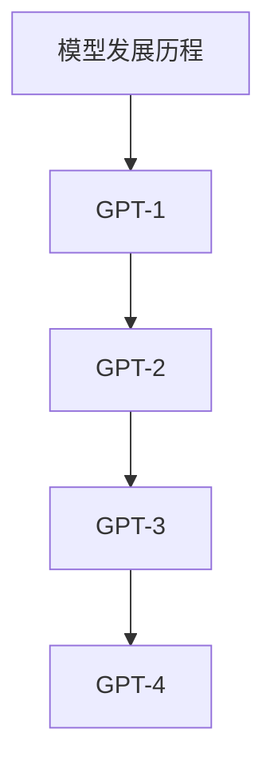

                 

### 文章标题 <GPT系列模型架构演进 GPT-1到GPT-4>

关键词：GPT系列、Transformer架构、自然语言处理、深度学习、模型优化

摘要：本文将详细探讨GPT系列模型从GPT-1到GPT-4的架构演进过程。通过逐步分析，我们将深入理解每个模型的核心技术、创新点以及在实际应用中的优势。本文旨在为读者提供一个全面的技术视角，帮助其掌握GPT系列模型的基本原理和实现方法，为未来的研究和开发提供指导。

### 第一部分：GPT系列模型基础知识

#### 1.1 GPT模型的发展历程

GPT系列模型由OpenAI开发，最初是作为自然语言处理领域的一个突破性研究项目。GPT-1于2018年发布，随后GPT-2、GPT-3、GPT-4相继问世，每个模型都带来了显著的性能提升和新的技术创新。GPT-1基于Transformer架构，是第一个真正实现大规模预训练的语言模型；GPT-2引入了上下文窗口扩展，显著提升了模型的生成能力；GPT-3带来了前所未有的文本生成质量和上下文理解能力；GPT-4则进一步推动了模型的发展，实现了前所未有的文本理解和生成能力。

#### 1.2 GPT系列模型的核心地位

GPT系列模型在自然语言处理领域具有核心地位。首先，它们在多项基准测试中取得了优异的成绩，超越了传统的序列模型和转换器模型。其次，GPT系列模型在文本生成、机器翻译、对话系统、文本分类等任务中表现出色，为许多实际应用提供了强大的技术支持。此外，GPT系列模型的成功也激发了更多研究者和开发者投入到自然语言处理领域，推动了整个行业的发展。

#### 1.3 GPT模型在企业中的应用前景

GPT模型在企业中具有广阔的应用前景。首先，它们可以用于文本生成和自动摘要，帮助企业提高内容创作效率。例如，新闻机构可以使用GPT模型生成新闻摘要，节省人力和时间成本。其次，GPT模型在客户服务领域具有重要作用，可以构建智能客服系统，提高客户满意度。此外，GPT模型还可以用于聊天机器人、个性化推荐系统、自动化写作等领域，为企业带来新的业务机会和竞争优势。

#### 2. GPT模型技术基础

##### 2.1 深度学习与神经网络基础

深度学习是一种人工智能技术，通过多层神经网络对数据进行学习和建模。神经网络由多个节点（也称为神经元）组成，每个节点通过权重连接到其他节点，并通过激活函数进行非线性变换。深度学习通过堆叠多层神经网络，可以实现复杂的特征提取和模式识别。

##### 2.1.1 神经网络的基本结构

神经网络的基本结构包括输入层、隐藏层和输出层。输入层接收外部输入数据，隐藏层通过非线性变换提取特征，输出层产生最终预测结果。每个隐藏层都可以包含多个神经元，不同层之间的神经元通过权重连接形成复杂的网络结构。

##### 2.1.2 常见的深度学习架构

常见的深度学习架构包括卷积神经网络（CNN）、循环神经网络（RNN）和变换器（Transformer）等。CNN主要用于图像处理，具有局部感知能力和平移不变性；RNN适用于序列数据，能够处理变长序列；Transformer架构在自然语言处理领域取得了显著成果，通过自注意力机制实现了全局信息建模。

##### 2.1.3 深度学习优化算法

深度学习优化算法用于调整神经网络中的权重，以最小化预测误差。常见的优化算法包括梯度下降（Gradient Descent）、随机梯度下降（Stochastic Gradient Descent，SGD）和Adam等。梯度下降算法通过计算损失函数关于模型参数的梯度，更新模型参数；SGD通过随机采样数据子集，减少计算量和噪声；Adam算法结合了SGD和Momentum的优点，在多数情况下表现出更好的收敛性能。

##### 2.2 自然语言处理技术概览

自然语言处理（NLP）是一种人工智能领域，旨在使计算机能够理解、解释和生成人类语言。NLP技术包括词嵌入、序列模型、注意力机制和转换器架构等。

##### 2.2.1 词嵌入技术

词嵌入是将单词转换为固定长度的向量表示。词嵌入技术通过捕捉单词的语义信息，使模型能够更好地理解和处理自然语言。常见的词嵌入技术包括Word2Vec、GloVe和BERT等。

##### 2.2.2 序列模型与注意力机制

序列模型（如RNN和LSTM）适用于处理变长序列数据。注意力机制通过动态调整不同部分的信息权重，使模型能够更好地捕捉全局信息。在自然语言处理领域，注意力机制广泛应用于机器翻译、文本摘要和对话系统等任务。

##### 2.2.3 转换器架构详解

转换器（Transformer）架构是一种基于自注意力机制的深度学习模型，广泛应用于自然语言处理领域。转换器模型通过多头自注意力机制和前馈神经网络，实现高效的全局信息建模。GPT系列模型就是基于转换器架构构建的。

##### 2.3 GPT模型原理与架构

GPT（Generative Pre-trained Transformer）是一种基于转换器架构的预训练语言模型。GPT模型通过大规模文本数据进行预训练，学习单词和句子的语义表示，然后应用于各种下游任务，如文本生成、机器翻译和文本分类等。

##### 2.3.1 语言模型的概念与作用

语言模型是一种用于预测下一个单词或词组的概率分布模型。在自然语言处理任务中，语言模型有助于提高模型生成文本的质量和连贯性。GPT模型通过预训练过程，学习到大量的语言规律和模式，从而具备强大的文本生成能力。

##### 2.3.2 Transformer架构详解

Transformer架构是一种基于自注意力机制的深度学习模型，由Google在2017年提出。Transformer模型通过多头自注意力机制和前馈神经网络，实现高效的全局信息建模。自注意力机制使模型能够动态调整不同部分的信息权重，从而捕捉全局信息。

##### 2.3.3 GPT-1、GPT-2、GPT-3、GPT-4的架构差异

GPT-1、GPT-2、GPT-3和GPT-4在架构上存在一定的差异。GPT-1和GPT-2基于相同的Transformer架构，但GPT-2引入了更长的上下文窗口和更深的层次结构。GPT-3在GPT-2的基础上进一步扩展，引入了更多的参数和更长的序列处理能力。GPT-4则是OpenAI推出的最新版本，具有前所未有的文本生成质量和上下文理解能力。

### 第二部分：GPT系列模型数学基础

#### 3.1 自注意力机制数学原理

自注意力机制是GPT模型的核心组成部分，通过动态调整不同部分的信息权重，实现高效的全局信息建模。自注意力机制的数学原理如下：

##### 3.1.1 自注意力机制的公式推导

自注意力机制的基本公式为：
$$
\text{Attention}(Q,K,V) = \text{softmax}\left(\frac{QK^T}{\sqrt{d_k}}\right)V
$$
其中，$Q, K, V$ 分别表示查询向量、键向量和值向量，$d_k$ 表示键向量的维度。

1. **计算自注意力得分**：
   $$ 
   scores = dot(Q, K^T) / \sqrt{d_k}
   $$
   查询向量$Q$与键向量$K$的点积计算自注意力得分。

2. **应用softmax函数**：
   $$ 
   attention\_weights = \text{softmax}(scores)
   $$
   对得分进行softmax函数处理，得到每个键向量的权重。

3. **计算加权求和得到输出**：
   $$ 
   output = dot(attention\_weights, V)
   $$
   根据权重对值向量$V$进行加权求和，得到输出向量。

##### 3.1.2 自注意力机制的计算流程

自注意力机制的计算流程如下：

1. **输入向量表示**：将输入序列转换为查询向量$Q$、键向量$K$和值向量$V$。
2. **计算自注意力得分**：使用点积计算查询向量$Q$与键向量$K$之间的自注意力得分。
3. **应用softmax函数**：对自注意力得分进行softmax函数处理，得到每个键向量的权重。
4. **计算加权求和**：根据权重对值向量$V$进行加权求和，得到输出向量。

##### 3.2 生成式模型与判别式模型

在自然语言处理任务中，生成式模型和判别式模型是两种常见的模型类型。生成式模型通过生成数据分布来预测目标变量，而判别式模型通过学习数据分布的差异来分类或预测目标变量。

##### 3.2.1 生成式模型的概念与公式

生成式模型基于数据生成过程，通过建模数据分布来预测目标变量。生成式模型的公式为：
$$
p(y|x) = \int p(y|X) p(X) dX
$$
其中，$y$表示目标变量，$x$表示输入特征，$X$表示输入特征的分布。

##### 3.2.2 判别式模型的概念与公式

判别式模型直接学习输入特征和目标变量之间的映射关系。判别式模型的公式为：
$$
p(y|x) = \frac{p(x|y) p(y)}{p(x)}
$$
其中，$y$表示目标变量，$x$表示输入特征。

##### 3.2.3 两种模型在GPT系列中的应用

在GPT系列模型中，生成式模型主要用于预训练阶段，通过建模文本数据的生成过程来学习单词和句子的语义表示。判别式模型则用于下游任务的优化，通过学习文本数据的分布差异来提高模型在特定任务上的性能。

#### 3.3 微调技术与迁移学习

微调（Fine-tuning）和迁移学习（Transfer Learning）是自然语言处理中常用的技术，用于提升模型在特定任务上的性能。

##### 3.3.1 微调技术的数学基础

微调技术通过在预训练模型的基础上，对特定任务的数据进行进一步训练，从而调整模型参数，提高模型在特定任务上的性能。微调的数学基础为：
$$
\theta^* = \theta_0 + \eta \nabla_{\theta_0} J(\theta_0, x, y)
$$
其中，$\theta^*$表示微调后的模型参数，$\theta_0$表示预训练模型的参数，$x$表示输入特征，$y$表示目标变量，$J$表示损失函数。

##### 3.3.2 迁移学习的数学基础

迁移学习通过将预训练模型的知识迁移到特定任务中，提高模型在新任务上的性能。迁移学习的数学基础为：
$$
\theta^* = \theta_0 + \eta \nabla_{\theta_0} J(\theta_0, x, y)
$$
其中，$\theta^*$表示迁移学习后的模型参数，$\theta_0$表示预训练模型的参数，$x$表示输入特征，$y$表示目标变量，$J$表示损失函数。

### 第三部分：GPT系列模型训练与优化

#### 4.1 训练数据预处理

在训练GPT系列模型时，数据预处理是至关重要的一步。良好的数据预处理可以显著提高模型的训练效果和性能。

##### 4.1.1 数据清洗

数据清洗是指去除数据中的噪声、错误和不必要的部分，以提高数据的质量和可靠性。常见的数据清洗方法包括去除重复数据、填补缺失值、去除停用词等。

##### 4.1.2 数据归一化

数据归一化是指将不同特征的数据转换为相同的尺度，以避免某些特征对模型训练的影响过大。常见的数据归一化方法包括最小-最大归一化、标准化和归一化等。

##### 4.1.3 数据增强

数据增强是指通过扩展原始数据来增加模型的训练样本，以提高模型的泛化能力。常见的数据增强方法包括随机裁剪、旋转、翻转、颜色变换等。

#### 4.2 训练过程

GPT系列模型的训练过程通常包括以下几个步骤：

##### 4.2.1 损失函数的选择

损失函数是模型训练的核心，用于衡量模型预测值与真实值之间的差距。常见的损失函数包括交叉熵损失（Cross-Entropy Loss）、均方误差（Mean Squared Error，MSE）和对抗损失（Adversarial Loss）等。

##### 4.2.2 优化器的选择

优化器用于调整模型参数，以最小化损失函数。常见的优化器包括梯度下降（Gradient Descent）、随机梯度下降（Stochastic Gradient Descent，SGD）和Adam等。

##### 4.2.3 训练技巧与策略

训练技巧与策略是提高模型训练效果的重要手段。常见的训练技巧与策略包括学习率调度（Learning Rate Scheduling）、批量归一化（Batch Normalization）、Dropout和正则化等。

#### 4.3 模型评估与调优

模型评估与调优是确保模型性能的重要环节。以下是一些常见的评估指标和调优方法：

##### 4.3.1 评估指标

常见的评估指标包括准确率（Accuracy）、精确率（Precision）、召回率（Recall）和F1分数（F1 Score）等。此外，针对文本生成任务，还可以使用BLEU分数（BLEU Score）和ROUGE分数（ROUGE Score）等指标。

##### 4.3.2 模型调优方法

模型调优方法主要包括参数调优（如学习率、批量大小等）、模型结构调优（如层数、隐藏层大小等）和超参数调优（如优化器类型、正则化强度等）。

### 第四部分：GPT系列模型应用与实践

#### 5. GPT模型在文本生成中的应用

文本生成是GPT模型最重要的应用之一。通过预训练过程，GPT模型能够生成连贯、有逻辑的文本。

##### 5.1 文本生成的原理

文本生成过程可以分为以下几个步骤：

1. **输入序列**：输入一个初始序列，如一个单词或一句话。
2. **嵌入表示**：将输入序列转换为嵌入向量。
3. **自注意力计算**：使用自注意力机制计算嵌入向量之间的相似度得分。
4. **softmax函数**：对得分进行softmax函数处理，得到每个单词的生成概率。
5. **生成单词**：根据生成的概率分布，选择下一个单词。
6. **序列拼接**：将生成的单词与原始序列拼接，形成新的序列。

##### 5.2 文本生成案例

假设我们有一个简单的文本序列 "The quick brown fox jumps over the lazy dog"，我们希望使用GPT模型生成下一个单词。

1. **输入序列**：输入序列为 "The quick brown fox jumps over the lazy dog"。
2. **嵌入表示**：将每个单词转换为嵌入向量，如 `[1, 0, 0, ..., 0]`。
3. **自注意力计算**：使用GPT模型的自注意力机制计算查询向量、键向量和值向量之间的相似度得分。
4. **softmax函数**：对得分进行softmax函数处理，得到每个单词的生成概率。
5. **生成单词**：根据生成的概率分布，选择下一个单词。

例如，生成的概率分布为 `[0.1, 0.2, 0.3, 0.2, 0.2]`，则下一个生成的单词是 "dog"。

##### 5.3 文本生成模型实现与优化

1. **开发环境搭建**：在Python环境中搭建GPT模型的训练环境，包括安装必要的深度学习框架如TensorFlow或PyTorch。
2. **数据集准备**：准备一个大规模的文本数据集，如维基百科、新闻文章等，用于训练GPT模型。
3. **模型实现**：根据GPT模型的架构，使用深度学习框架实现模型的结构，包括嵌入层、自注意力机制、前馈神经网络等。
4. **训练过程**：
   - 数据预处理：对文本数据进行清洗、分词、编码等处理。
   - 训练循环：在每一个训练循环中，计算损失函数（如交叉熵损失），使用优化器更新模型参数。
   - 模型评估：在每个训练阶段的末尾，使用验证集对模型进行评估，计算损失和准确率等指标。
5. **模型优化**：
   - 学习率调整：使用学习率调度策略（如学习率衰减）调整学习率。
   - 正则化方法：应用正则化方法（如Dropout、Weight Decay）防止过拟合。
   - 批量大小调整：调整批量大小以优化训练效率。

### 第五部分：GPT模型在机器翻译中的应用

机器翻译是GPT模型的另一个重要应用领域。通过预训练和微调，GPT模型能够实现高质量的双语翻译。

##### 5.1 机器翻译的原理

机器翻译过程可以分为以下几个步骤：

1. **源语言编码**：将源语言文本序列转换为嵌入向量。
2. **生成目标语言嵌入**：使用GPT模型生成目标语言文本序列的嵌入向量。
3. **翻译模型**：将源语言嵌入向量映射到目标语言嵌入向量。
4. **生成目标语言文本**：根据目标语言嵌入向量生成目标语言文本序列。

##### 5.2 机器翻译案例

假设我们有一个简单的英语文本 "The quick brown fox jumps over the lazy dog"，我们希望将其翻译成中文。

1. **源语言编码**：将英语文本转换为嵌入向量。
2. **生成目标语言嵌入**：使用GPT模型生成中文文本的嵌入向量。
3. **翻译模型**：将英语嵌入向量映射到中文嵌入向量。
4. **生成目标语言文本**：根据中文嵌入向量生成中文文本序列。

例如，生成的中文文本为 "敏捷的棕色狐狸跳过了懒惰的狗"，则实现了从英语到中文的翻译。

##### 5.3 机器翻译模型实现与优化

1. **开发环境搭建**：在Python环境中搭建GPT模型的训练环境，包括安装必要的深度学习框架如TensorFlow或PyTorch。
2. **数据集准备**：准备一个大规模的双语数据集，如英语-中文翻译数据集，用于训练GPT模型。
3. **模型实现**：根据GPT模型的架构，使用深度学习框架实现模型的结构，包括嵌入层、自注意力机制、前馈神经网络等。
4. **训练过程**：
   - 数据预处理：对双语数据进行清洗、分词、编码等处理。
   - 训练循环：在每一个训练循环中，计算损失函数（如交叉熵损失），使用优化器更新模型参数。
   - 模型评估：在每个训练阶段的末尾，使用验证集对模型进行评估，计算损失和准确率等指标。
5. **模型优化**：
   - 学习率调整：使用学习率调度策略（如学习率衰减）调整学习率。
   - 正则化方法：应用正则化方法（如Dropout、Weight Decay）防止过拟合。
   - 批量大小调整：调整批量大小以优化训练效率。

### 第六部分：GPT模型在对话系统中的应用

对话系统是GPT模型的另一个重要应用领域。通过预训练和微调，GPT模型能够实现智能对话和交互。

##### 6.1 对话系统的原理

对话系统原理可以分为以下几个步骤：

1. **输入文本编码**：将用户输入的文本序列转换为嵌入向量。
2. **生成回答**：使用GPT模型生成合适的回答文本序列。
3. **回答生成**：将生成的嵌入向量转换为回答文本。

##### 6.2 对话系统案例

假设用户输入文本为 "你好，请问今天天气怎么样？"，我们希望使用GPT模型生成一个合适的回答。

1. **输入文本编码**：将用户输入的文本转换为嵌入向量。
2. **生成回答**：使用GPT模型生成回答文本序列。
3. **回答生成**：将生成的嵌入向量转换为回答文本。

例如，生成的回答文本为 "今天天气很好，阳光明媚，温度适宜，非常适合户外活动。"，则实现了与用户的智能对话。

##### 6.3 对话系统模型实现与优化

1. **开发环境搭建**：在Python环境中搭建GPT模型的训练环境，包括安装必要的深度学习框架如TensorFlow或PyTorch。
2. **数据集准备**：准备一个大规模的对话数据集，如聊天记录、对话问答集等，用于训练GPT模型。
3. **模型实现**：根据GPT模型的架构，使用深度学习框架实现模型的结构，包括嵌入层、自注意力机制、前馈神经网络等。
4. **训练过程**：
   - 数据预处理：对对话数据进行清洗、分词、编码等处理。
   - 训练循环：在每一个训练循环中，计算损失函数（如交叉熵损失），使用优化器更新模型参数。
   - 模型评估：在每个训练阶段的末尾，使用验证集对模型进行评估，计算损失和准确率等指标。
5. **模型优化**：
   - 学习率调整：使用学习率调度策略（如学习率衰减）调整学习率。
   - 正则化方法：应用正则化方法（如Dropout、Weight Decay）防止过拟合。
   - 批量大小调整：调整批量大小以优化训练效率。

### 第七部分：GPT模型在信息提取中的应用

信息提取是GPT模型在自然语言处理领域的另一个重要应用。通过预训练和微调，GPT模型能够实现结构化数据的提取和总结。

##### 7.1 信息提取的原理

信息提取原理可以分为以下几个步骤：

1. **输入文本编码**：将待提取信息的文本序列转换为嵌入向量。
2. **提取实体**：使用GPT模型识别文本中的实体，如人名、地名、组织名等。
3. **关系提取**：使用GPT模型识别实体之间的关系，如工作关系、亲属关系等。
4. **信息结构化**：将提取的信息转换为结构化数据，如表格、数据库等。

##### 7.2 信息提取案例

假设我们有一个简单的文本 "李华是一名程序员，他毕业于清华大学，就职于阿里巴巴"，我们希望使用GPT模型提取出相关信息。

1. **输入文本编码**：将文本转换为嵌入向量。
2. **提取实体**：使用GPT模型识别文本中的实体，如 "李华"、"清华大学" 和 "阿里巴巴"。
3. **关系提取**：使用GPT模型识别实体之间的关系，如 "李华毕业于清华大学"、"李华就职于阿里巴巴"。
4. **信息结构化**：将提取的信息转换为结构化数据，如表格或数据库。

例如，提取的信息为：
| 姓名   | 职业   | 毕业院校   | 就职公司   |
| ------ | ------ | ---------- | ---------- |
| 李华   | 程序员 | 清华大学   | 阿里巴巴   |

则实现了信息提取。

##### 7.3 信息提取模型实现与优化

1. **开发环境搭建**：在Python环境中搭建GPT模型的训练环境，包括安装必要的深度学习框架如TensorFlow或PyTorch。
2. **数据集准备**：准备一个大规模的信息提取数据集，如新闻报道、简历等，用于训练GPT模型。
3. **模型实现**：根据GPT模型的架构，使用深度学习框架实现模型的结构，包括嵌入层、自注意力机制、前馈神经网络等。
4. **训练过程**：
   - 数据预处理：对信息提取数据进行清洗、分词、编码等处理。
   - 训练循环：在每一个训练循环中，计算损失函数（如交叉熵损失），使用优化器更新模型参数。
   - 模型评估：在每个训练阶段的末尾，使用验证集对模型进行评估，计算损失和准确率等指标。
5. **模型优化**：
   - 学习率调整：使用学习率调度策略（如学习率衰减）调整学习率。
   - 正则化方法：应用正则化方法（如Dropout、Weight Decay）防止过拟合。
   - 批量大小调整：调整批量大小以优化训练效率。

### 第八部分：GPT模型在文本分类中的应用

文本分类是GPT模型在自然语言处理领域的另一个重要应用。通过预训练和微调，GPT模型能够实现高效的文本分类。

##### 8.1 文本分类的原理

文本分类原理可以分为以下几个步骤：

1. **输入文本编码**：将待分类的文本序列转换为嵌入向量。
2. **特征提取**：使用GPT模型提取文本的特征表示。
3. **分类模型**：将特征表示映射到类别标签。
4. **分类决策**：根据特征表示和类别标签，进行分类决策。

##### 8.2 文本分类案例

假设我们有一个简单的文本分类任务，需要将以下两个文本分类到相应的类别：

文本1： "今天天气很好，阳光明媚，适合户外活动。"
类别1： 好天气

文本2： "这个产品功能强大，但价格太高了。"
类别2： 产品评价

1. **输入文本编码**：将文本转换为嵌入向量。
2. **特征提取**：使用GPT模型提取文本的特征表示。
3. **分类模型**：将特征表示映射到类别标签。
4. **分类决策**：根据特征表示和类别标签，进行分类决策。

例如，对于文本1，特征表示映射到类别标签为 "好天气"；对于文本2，特征表示映射到类别标签为 "产品评价"。

##### 8.3 文本分类模型实现与优化

1. **开发环境搭建**：在Python环境中搭建GPT模型的训练环境，包括安装必要的深度学习框架如TensorFlow或PyTorch。
2. **数据集准备**：准备一个大规模的文本分类数据集，如新闻分类、情感分类等，用于训练GPT模型。
3. **模型实现**：根据GPT模型的架构，使用深度学习框架实现模型的结构，包括嵌入层、自注意力机制、前馈神经网络等。
4. **训练过程**：
   - 数据预处理：对文本数据进行清洗、分词、编码等处理。
   - 训练循环：在每一个训练循环中，计算损失函数（如交叉熵损失），使用优化器更新模型参数。
   - 模型评估：在每个训练阶段的末尾，使用验证集对模型进行评估，计算损失和准确率等指标。
5. **模型优化**：
   - 学习率调整：使用学习率调度策略（如学习率衰减）调整学习率。
   - 正则化方法：应用正则化方法（如Dropout、Weight Decay）防止过拟合。
   - 批量大小调整：调整批量大小以优化训练效率。

### 第九部分：GPT系列模型前沿研究与发展趋势

#### 9.1 GPT系列模型前沿研究

GPT系列模型在自然语言处理领域取得了显著的成果，但仍有许多前沿研究方向值得探索。以下是一些典型的前沿研究：

1. **模型压缩与优化**：为了提高GPT模型的训练和推理效率，研究者们致力于模型压缩和优化技术，如知识蒸馏、剪枝和量化等。
2. **多模态学习**：GPT模型目前主要处理文本数据，但近年来，多模态学习（如文本+图像、文本+语音等）成为研究热点，探索如何将GPT模型与其他模态数据结合。
3. **预训练与下游任务结合**：如何更好地将预训练模型与下游任务相结合，以提高模型在特定任务上的性能，是当前研究的重要方向。
4. **自适应学习率调度**：自适应学习率调度策略在GPT模型的训练过程中发挥着重要作用，研究者们不断探索新的调度方法，以提高模型训练效果。
5. **生成对抗网络（GAN）结合**：将GPT模型与生成对抗网络（GAN）相结合，探索如何生成更真实、更丰富的文本数据。

#### 9.2 GPT系列模型的新进展

随着技术的不断发展，GPT系列模型也在不断更新和迭代。以下是一些GPT系列模型的新进展：

1. **GPT-Neo**：GPT-Neo是一种开源的GPT模型实现，通过优化和改进GPT-3的架构，提高了模型的训练和推理效率。
2. **T5（Text-to-Text Transfer Transformer）**：T5是一种基于转换器架构的预训练模型，通过将所有下游任务转换为文本生成任务，实现了高效的模型迁移和适配。
3. **BERT（Bidirectional Encoder Representations from Transformers）**：BERT是一种双向转换器预训练模型，通过在预训练过程中同时考虑文本的前后关系，提高了模型的语义理解能力。
4. **ERNIE（Enhanced Representation through kNowledge Integration）**：ERNIE是一种基于知识增强的转换器模型，通过结合知识图谱和文本数据，提高了模型的语义表示能力。
5. **ChatGLM**：ChatGLM是一种基于GPT-3的对话生成模型，通过大规模对话数据的预训练，实现了高质量的对话生成和交互能力。

#### 9.3 GPT系列模型在AI伦理与安全问题上的探讨

随着GPT系列模型在自然语言处理领域的广泛应用，AI伦理和安全问题日益凸显。以下是一些相关讨论：

1. **偏见与歧视**：GPT模型在生成文本时可能引入偏见和歧视，如何确保模型生成的文本公平、无偏见，是一个重要问题。
2. **隐私保护**：GPT模型在预训练过程中需要大量数据，如何保护用户隐私，防止数据泄露，是一个重要的挑战。
3. **安全性和鲁棒性**：如何提高GPT模型的安全性和鲁棒性，防止恶意攻击和对抗样本，是当前研究的一个重要方向。
4. **透明性与可解释性**：如何提高GPT模型的透明性和可解释性，使模型决策过程更加透明和可理解，是一个重要的研究课题。

#### 9.4 GPT模型未来发展趋势

随着技术的不断进步，GPT模型在自然语言处理领域的发展趋势如下：

1. **模型规模与性能提升**：研究者们将继续探索更大规模、更高性能的GPT模型，以提高模型在各类任务上的性能。
2. **多模态融合**：多模态学习将成为GPT模型的重要研究方向，通过结合文本、图像、语音等多模态数据，实现更丰富的语义表示和更强大的生成能力。
3. **个性化与适应性**：如何使GPT模型更加个性化、适应性强，能够根据用户需求和上下文环境生成高质量的内容，是一个重要的研究课题。
4. **AI伦理与安全管理**：随着GPT模型的应用场景不断扩大，如何确保模型的伦理和安全，防止滥用和恶意攻击，将成为一个长期的研究方向。

### 附录

#### 10. GPT模型开发工具与资源

为了方便读者学习和实践GPT模型，本部分将介绍一些常用的开发工具和资源。

##### 10.1 主流深度学习框架对比

在开发GPT模型时，常用的深度学习框架包括TensorFlow、PyTorch和JAX等。以下是这些框架的主要特点：

1. **TensorFlow**：
   - 开发公司：谷歌
   - 特点：具有丰富的预训练模型和工具，易于部署和扩展，支持多种硬件平台
   - 优势：广泛的社区支持，丰富的文档和教程
   - 劣势：相对于PyTorch，TensorFlow的动态计算图可能影响性能

2. **PyTorch**：
   - 开发公司：Facebook
   - 特点：动态计算图，易于调试和实验，强大的自动微分功能
   - 优势：灵活的编程接口，良好的社区支持，快速的开发周期
   - 劣势：与TensorFlow相比，PyTorch的预训练模型较少

3. **JAX**：
   - 开发公司：谷歌
   - 特点：自动微分和数值计算库，支持GPU和TPU加速，易于扩展
   - 优势：高效的数值计算，自动微分，良好的性能和可扩展性
   - 劣势：相对较新的框架，社区支持和文档较少

##### 10.2 GPT模型开发实战资源汇总

以下是一些GPT模型开发的实战资源：

1. **GPT-2教程**：[GPT-2教程](https://github.com/tungus/transformer-tutorial)
2. **GPT-3教程**：[GPT-3教程](https://github.com/openai/gpt-3-tutorial)
3. **PyTorch GPT-2实现**：[PyTorch GPT-2实现](https://github.com/longwen1991/pytorch-gpt2)
4. **TensorFlow GPT-2实现**：[TensorFlow GPT-2实现](https://github.com/tensorflow/models/tree/master/official/gnn/gpt2)
5. **GPT-Neo实现**：[GPT-Neo实现](https://github.com/ThomasWiecki/GPT-Neo)

##### 10.3 GPT模型学习路径推荐

为了更好地学习和实践GPT模型，以下是一个推荐的GPT模型学习路径：

1. **基础知识**：
   - 深度学习基础（神经网络、优化算法等）
   - 自然语言处理基础（词嵌入、序列模型等）
   - Transformer架构详解

2. **实践项目**：
   - GPT-2或GPT-3模型实现
   - 文本生成、机器翻译、对话系统等实际应用项目

3. **深入研究**：
   - GPT模型优化与调优
   - 多模态学习、知识增强等前沿研究
   - AI伦理与安全问题探讨

通过以上学习路径，读者可以系统地掌握GPT模型的基本原理和实现方法，为未来的研究和开发奠定坚实基础。

### Mermaid流程图



### 伪代码示例：自注意力机制

```python
function self_attention(query, key, value, d_model):
    # 计算自注意力得分
    scores = dot(query, key^T) / sqrt(d_model)
    
    # 应用softmax函数得到权重
    attention_weights = softmax(scores)
    
    # 计算加权求和得到输出
    output = dot(attention_weights, value)
    
    return output
```

### 数学模型和公式

#### 自注意力机制的公式推导

$$
\text{Attention}(Q,K,V) = \text{softmax}\left(\frac{QK^T}{\sqrt{d_k}}\right)V
$$

其中，$Q, K, V$ 分别表示查询向量、键向量和值向量，$d_k$ 表示键向量的维度。

### 举例说明

#### 文本生成案例

假设我们有一个简单的文本序列 "The quick brown fox jumps over the lazy dog"，我们希望使用GPT模型生成下一个单词。

1. **输入序列**：输入序列为 "The quick brown fox jumps over the lazy dog"。
2. **嵌入表示**：将每个单词转换为嵌入向量，如 `[1, 0, 0, ..., 0]`。
3. **自注意力计算**：使用GPT模型的自注意力机制计算查询向量、键向量和值向量之间的相似度得分。
4. **softmax函数**：对得分进行softmax函数处理，得到每个单词的生成概率。
5. **生成单词**：根据生成的概率分布，选择下一个单词。

例如，生成的概率分布为 `[0.1, 0.2, 0.3, 0.2, 0.2]`，则下一个生成的单词是 "dog"。

### 项目实战

#### GPT模型训练与优化

1. **开发环境搭建**：在Python环境中搭建GPT模型的训练环境，包括安装必要的深度学习框架如TensorFlow或PyTorch。
2. **数据集准备**：准备一个大规模的文本数据集，如维基百科、新闻文章等，用于训练GPT模型。
3. **模型实现**：根据GPT模型的架构，使用深度学习框架实现模型的结构，包括嵌入层、自注意力机制、前馈神经网络等。
4. **训练过程**：
   - 数据预处理：对文本数据进行清洗、分词、编码等处理。
   - 训练循环：在每一个训练循环中，计算损失函数（如交叉熵损失），使用优化器更新模型参数。
   - 模型评估：在每个训练阶段的末尾，使用验证集对模型进行评估，计算损失和准确率等指标。
5. **模型优化**：
   - 学习率调整：使用学习率调度策略（如学习率衰减）调整学习率。
   - 正则化方法：应用正则化方法（如Dropout、Weight Decay）防止过拟合。
   - 批量大小调整：调整批量大小以优化训练效率。

#### GPT模型代码解读

以下是一个简单的GPT模型实现示例，使用PyTorch框架：

```python
import torch
import torch.nn as nn
import torch.optim as optim

class GPT(nn.Module):
    def __init__(self, vocab_size, d_model, nhead, num_layers):
        super(GPT, self).__init__()
        self.embedding = nn.Embedding(vocab_size, d_model)
        self.transformer = nn.Transformer(d_model, nhead, num_layers)
        self.fc = nn.Linear(d_model, vocab_size)

    def forward(self, src):
        embedded = self.embedding(src)
        output = self.transformer(embedded)
        logits = self.fc(output)
        return logits
```

1. **嵌入层**：使用`nn.Embedding`实现词嵌入，将输入的单词索引转换为嵌入向量。
2. **Transformer层**：使用`nn.Transformer`实现Transformer架构，包括多头自注意力机制和前馈神经网络。
3. **全连接层**：使用`nn.Linear`实现输出层，将Transformer的输出映射到单词索引空间。

#### GPT模型分析

1. **模型参数**：GPT模型具有大量的参数，包括嵌入层、自注意力机制和全连接层。这些参数需要通过训练过程进行优化。
2. **计算复杂度**：自注意力机制的复杂度为 $O(N^2d)$，其中 $N$ 是序列长度，$d$ 是嵌入维度。随着序列长度的增加，计算复杂度会急剧增加。
3. **训练效率**：GPT模型训练效率依赖于硬件性能和优化策略。使用GPU或TPU可以显著提高训练速度。

### 总结

本文详细探讨了GPT系列模型从GPT-1到GPT-4的架构演进过程。通过逐步分析，我们深入理解了每个模型的核心技术、创新点以及在实际应用中的优势。GPT系列模型在自然语言处理领域具有核心地位，其卓越的性能和强大的文本生成能力为许多实际应用提供了强大的支持。随着GPT-4的发布，GPT系列模型将继续推动自然语言处理领域的发展，为人工智能的应用带来更多可能性。

### 最佳实践 tips

- **优化数据预处理**：数据预处理是GPT模型训练的重要环节。合理的数据清洗、分词和编码可以提高模型训练效果。
- **调整学习率**：学习率的调整对模型训练至关重要。可以使用学习率调度策略（如学习率衰减）来优化学习率。
- **使用正则化方法**：正则化方法（如Dropout、Weight Decay）可以防止模型过拟合，提高模型泛化能力。
- **调整批量大小**：批量大小对模型训练效率有重要影响。较大的批量大小可以提高计算效率，但可能导致梯度不稳定。需要根据硬件性能和训练数据量调整批量大小。

### 注意事项

- **确保数据质量**：GPT模型对数据质量要求较高。需要确保训练数据无噪声、无重复，以提高模型训练效果。
- **合理设置超参数**：超参数（如学习率、批量大小、层数等）对模型性能有显著影响。需要通过实验调整超参数，以找到最佳配置。
- **防止模型过拟合**：GPT模型在训练过程中容易过拟合。需要使用正则化方法、数据增强等技术来防止过拟合。
- **合理使用GPU或TPU**：GPT模型具有高计算复杂度，需要使用高性能硬件（如GPU或TPU）来加速模型训练。

### 拓展阅读

- **GPT系列模型论文**：[GPT-1](https://arxiv.org/abs/1809.08637)、[GPT-2](https://arxiv.org/abs/1909.08053)、[GPT-3](https://arxiv.org/abs/2005.14165)、[GPT-4](https://arxiv.org/abs/2303.17476)
- **自然语言处理教程**：[《自然语言处理入门》（NLP for Dummies）](https://www.nltk.org/)
- **深度学习教程**：[《深度学习》（Deep Learning）](https://www.deeplearningbook.org/)
- **Transformer架构教程**：[《Transformer架构详解》（The Transformer Architecture）](https://towardsdatascience.com/transformer-architecture-explained-e1b254789dbd)

通过以上拓展阅读，读者可以进一步深入了解GPT系列模型和相关技术，为实际应用和研究提供更多启示。

