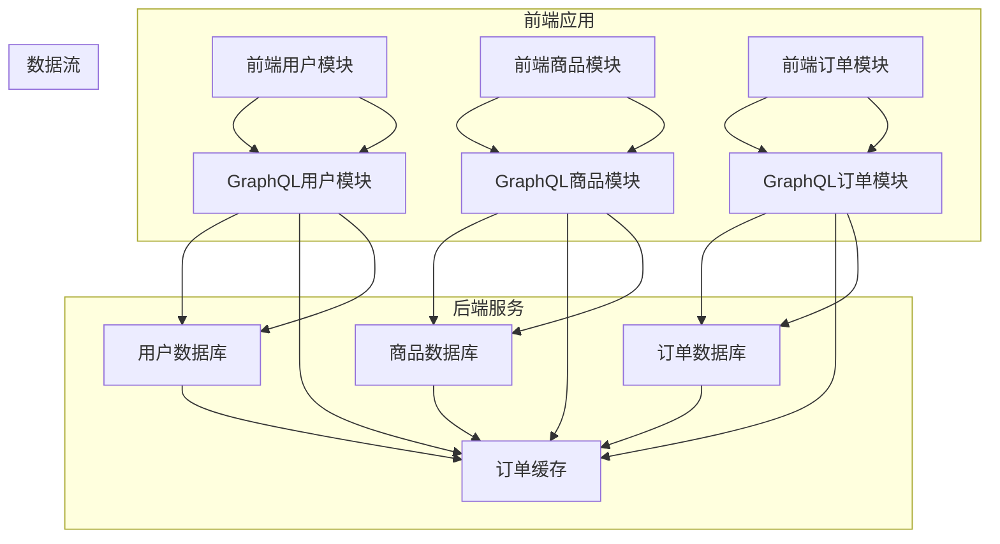

                 

# GraphQL：灵活高效的API查询语言

## 关键词

- GraphQL
- API查询语言
- 良好的用户体验
- 性能优化
- 安全性
- 微前端架构
- 企业级应用开发

## 摘要

GraphQL是一种灵活高效的API查询语言，相较于传统的RESTful API，它提供了更好的用户体验和更高的性能。本文将从GraphQL的基础、核心架构、数据查询与操作、性能优化、安全性、高级应用和最佳实践等方面进行详细探讨，旨在为开发者提供全面的GraphQL知识体系和实战指南。

## 《GraphQL：灵活高效的API查询语言》目录大纲

### 第一部分：GraphQL基础

#### 第1章：GraphQL简介
- 1.1 GraphQL的发展背景
- 1.2 GraphQL的核心概念
- 1.3 GraphQL与REST的区别
- 1.4 GraphQL的应用场景

#### 第2章：GraphQL核心架构
- 2.1 GraphQL查询语言
- 2.2 GraphQL类型系统
- 2.3 GraphQL查询执行流程
- 2.4 GraphQL解析器和执行器

#### 第3章：GraphQL数据查询与操作
- 3.1 GraphQL查询构建
- 3.2 GraphQL参数传递
- 3.3 GraphQL的数据更新（Mutation）
- 3.4 GraphQL的订阅功能

#### 第4章：GraphQL性能优化
- 4.1 GraphQL查询缓存
- 4.2 乐观更新与数据一致性
- 4.3 查询拆分与批处理
- 4.4 GraphQL性能监控与调试

#### 第5章：GraphQL安全性
- 5.1 GraphQL权限控制
- 5.2 GraphQL的安全性最佳实践
- 5.3 GraphQL与OAuth2.0集成

### 第二部分：GraphQL高级应用

#### 第6章：GraphQL与微前端架构
- 6.1 微前端架构概述
- 6.2 GraphQL在微前端架构中的应用
- 6.3 微前端架构中的GraphQL集成策略

#### 第7章：GraphQL在企业级应用开发
- 7.1 GraphQL在企业级应用中的优势
- 7.2 GraphQL在企业级应用开发中的挑战与解决方案
- 7.3 实战：基于GraphQL的企业级应用架构设计

#### 第8章：GraphQL最佳实践
- 8.1 设计良好的GraphQL模式
- 8.2 GraphQL编码最佳实践
- 8.3 GraphQL性能优化案例分享

### 第三部分：GraphQL实践

#### 第9章：GraphQL项目实战
- 9.1 项目背景与需求分析
- 9.2 环境搭建与依赖管理
- 9.3 GraphQL模式设计
- 9.4 GraphQL接口开发与测试
- 9.5 项目部署与性能优化

#### 第10章：GraphQL开源工具与库
- 10.1 GraphQL服务器库介绍
- 10.2 GraphQL客户端库介绍
- 10.3 其他GraphQL相关开源工具

### 附录
#### 附录A：GraphQL学习资源与参考文档
- A.1 GraphQL官方文档
- A.2 GraphQL社区资源
- A.3 GraphQL学习路线图
- A.4 GraphQL相关书籍推荐

### 第11章：GraphQL的未来发展趋势
- 11.1 GraphQL的发展趋势
- 11.2 GraphQL与其他技术的融合
- 11.3 GraphQL在未来的应用场景
- 11.4 GraphQL面临的挑战与机遇

### 第一部分：GraphQL基础

#### 第1章：GraphQL简介

**1.1 GraphQL的发展背景**

GraphQL起源于Facebook，最初用于内部应用程序的数据查询，以解决传统的RESTful API的一些痛点。随着其优势和灵活性逐渐被更多开发者接受，GraphQL逐渐发展成为一个广泛使用的开源项目。2015年，Facebook将GraphQL开源，并迅速在社区中得到广泛支持。

**1.2 GraphQL的核心概念**

GraphQL的核心概念包括类型系统、查询语言、解析器和执行器等。类型系统定义了GraphQL中的数据结构，查询语言则用于开发者编写查询请求，解析器和执行器负责处理查询并返回结果。

**1.3 GraphQL与REST的区别**

相比于RESTful API，GraphQL提供了以下优势：
- **更好的灵活性**：开发者可以精确地查询所需的数据，避免了数据的冗余和重复请求。
- **减少网络请求**：通过组合多个查询请求，减少了网络请求的次数。
- **更好的错误处理**：GraphQL能够返回具体的错误信息，使得开发者可以更快速地定位问题。

**1.4 GraphQL的应用场景**

GraphQL适用于需要灵活查询、高效处理大量数据以及关注用户体验的场景。例如，社交媒体、电子商务和在线新闻平台等。

#### 第2章：GraphQL核心架构

**2.1 GraphQL查询语言**

GraphQL查询语言使用类似于SQL的语法，开发者可以通过编写查询语句来获取所需的数据。查询语句的基本结构包括选择器（Selector）、字段（Field）和别名（Alias）。

**2.2 GraphQL类型系统**

GraphQL类型系统是GraphQL的核心概念之一。它定义了GraphQL中的数据类型，包括标量类型、枚举类型、输入类型和对象类型等。

**2.3 GraphQL查询执行流程**

GraphQL查询执行流程包括以下几个步骤：
1. 解析（Parse）：将GraphQL查询语句转换为抽象语法树（AST）。
2. 语法分析（Validate）：验证查询语句是否符合GraphQL语法规则。
3. 编码（Execute）：将AST转换为查询计划，并执行查询。
4. 渲染（Render）：将查询结果渲染为JSON格式。

**2.4 GraphQL解析器和执行器**

GraphQL解析器负责处理查询语句并将其转换为查询计划，执行器则负责执行查询计划并返回结果。

#### 第3章：GraphQL数据查询与操作

**3.1 GraphQL查询构建**

GraphQL查询构建是指开发者编写查询语句以获取所需数据的过程。构建查询时，需要考虑查询的深度、宽度和复杂度。

**3.2 GraphQL参数传递**

GraphQL支持通过参数传递来实现更灵活的查询。开发者可以在查询语句中定义参数，并在需要时使用参数来过滤和排序数据。

**3.3 GraphQL的数据更新（Mutation）**

GraphQL支持数据更新操作，通过Mutation语句可以实现数据的增删改查。

**3.4 GraphQL的订阅功能**

GraphQL订阅功能允许开发者实时获取数据变化。通过订阅，开发者可以在数据发生更改时立即获取最新数据，而无需轮询。

#### 第4章：GraphQL性能优化

**4.1 GraphQL查询缓存**

查询缓存是提高GraphQL性能的有效方法。通过缓存，开发者可以避免重复执行相同的查询，从而减少响应时间。

**4.2 乐观更新与数据一致性**

乐观更新是一种在更新数据时减少锁争用的方法。在乐观更新中，开发者可以先执行更新操作，然后验证数据一致性。

**4.3 查询拆分与批处理**

查询拆分和批处理是优化GraphQL性能的常用方法。通过拆分查询，开发者可以将多个查询组合成一个查询，从而减少网络请求次数。

**4.4 GraphQL性能监控与调试**

性能监控和调试是确保GraphQL性能的关键步骤。开发者可以使用各种工具来监控GraphQL性能，并调试潜在的性能问题。

#### 第5章：GraphQL安全性

**5.1 GraphQL权限控制**

权限控制是确保GraphQL数据安全的重要措施。开发者可以通过定义权限规则来限制用户对数据的访问。

**5.2 GraphQL的安全性最佳实践**

为了确保GraphQL的安全性，开发者应遵循以下最佳实践：使用HTTPS、验证请求、限制查询深度和宽度等。

**5.3 GraphQL与OAuth2.0集成**

OAuth2.0是一种常用的授权协议，开发者可以将OAuth2.0与GraphQL集成，以实现更安全的API访问。

### 第二部分：GraphQL高级应用

#### 第6章：GraphQL与微前端架构

**6.1 微前端架构概述**

微前端架构是一种将前端应用分解为多个独立组件的架构模式。通过微前端架构，开发者可以更灵活地管理和扩展前端应用。

**6.2 GraphQL在微前端架构中的应用**

在微前端架构中，GraphQL可以用于跨组件的数据共享和状态管理，从而提高应用的性能和可维护性。

**6.3 微前端架构中的GraphQL集成策略**

开发者可以通过在微前端架构中集成GraphQL，来实现更高效的数据查询和操作。

#### 第7章：GraphQL在企业级应用开发

**7.1 GraphQL在企业级应用中的优势**

在企业级应用开发中，GraphQL具有以下优势：提高开发效率、简化数据查询、提高性能和降低维护成本。

**7.2 GraphQL在企业级应用开发中的挑战与解决方案**

虽然GraphQL在企业级应用开发中具有优势，但开发者仍需面临一些挑战，如数据一致性和性能优化等。本文将介绍解决方案。

**7.3 实战：基于GraphQL的企业级应用架构设计**

本文将介绍如何设计一个基于GraphQL的企业级应用架构，包括数据模型设计、API接口开发和性能优化等。

#### 第8章：GraphQL最佳实践

**8.1 设计良好的GraphQL模式**

设计良好的GraphQL模式是提高应用性能和可维护性的关键。本文将介绍如何设计一个良好的GraphQL模式。

**8.2 GraphQL编码最佳实践**

编码最佳实践是确保GraphQL代码质量和可维护性的重要措施。本文将介绍如何在GraphQL编码中遵循最佳实践。

**8.3 GraphQL性能优化案例分享**

本文将分享一些实际的GraphQL性能优化案例，包括查询缓存、查询拆分和批处理等。

### 第三部分：GraphQL实践

#### 第9章：GraphQL项目实战

**9.1 项目背景与需求分析**

本文将介绍一个实际的项目背景和需求分析，以便读者更好地理解GraphQL的应用场景。

**9.2 环境搭建与依赖管理**

本文将介绍如何搭建GraphQL开发环境，并管理项目依赖。

**9.3 GraphQL模式设计**

本文将介绍如何设计一个适合项目的GraphQL模式，包括数据类型和查询语句的设计。

**9.4 GraphQL接口开发与测试**

本文将介绍如何开发GraphQL接口，并使用测试工具验证接口的正确性。

**9.5 项目部署与性能优化**

本文将介绍如何部署GraphQL项目，并使用性能优化方法提高项目性能。

#### 第10章：GraphQL开源工具与库

**10.1 GraphQL服务器库介绍**

本文将介绍一些常用的GraphQL服务器库，如Apollo Server、Express-GraphQL等。

**10.2 GraphQL客户端库介绍**

本文将介绍一些常用的GraphQL客户端库，如Apollo Client、URQL等。

**10.3 其他GraphQL相关开源工具**

本文将介绍其他一些与GraphQL相关的开源工具，如GraphQL Code Generator、GraphQL Playground等。

### 附录

#### 附录A：GraphQL学习资源与参考文档

- A.1 GraphQL官方文档
- A.2 GraphQL社区资源
- A.3 GraphQL学习路线图
- A.4 GraphQL相关书籍推荐

### 第11章：GraphQL的未来发展趋势

**11.1 GraphQL的发展趋势**

本文将分析GraphQL在未来的发展趋势，包括其与其他技术的融合、应用场景的扩展等。

**11.2 GraphQL与其他技术的融合**

本文将探讨GraphQL与其他技术的融合，如GraphQL与GraphQL for React、GraphQL for Vue等。

**11.3 GraphQL在未来的应用场景**

本文将分析GraphQL在未来的应用场景，包括移动应用、Web应用、云计算等。

**11.4 GraphQL面临的挑战与机遇**

本文将讨论GraphQL面临的挑战，如性能优化、安全性等，以及其未来的机遇。

### 文章末尾作者信息

作者：AI天才研究院/AI Genius Institute & 禅与计算机程序设计艺术 /Zen And The Art of Computer Programming

（注意：以上内容仅为文章的大纲和部分内容示例，实际文章撰写时需要根据每个章节的要求进行详细撰写和拓展。）### 第1章：GraphQL简介

GraphQL是一种灵活高效的API查询语言，它旨在解决传统的RESTful API在数据处理和用户体验方面的一些痛点。为了更好地理解GraphQL的背景和发展，我们首先需要回顾一下RESTful API的基本概念。

**1.1 GraphQL的发展背景**

随着互联网的发展，Web应用程序越来越复杂，它们需要处理大量的数据，并且需要提供灵活、高效的接口以供前端和其他服务调用。传统的RESTful API通过一组固定的端点（endpoint）提供数据，这些端点通常定义了一系列的资源（例如：用户、产品、订单等）。然而，这种模式存在一些问题：

- **过度请求和冗余数据**：前端需要获取的数据往往只是整体数据的一部分，但RESTful API通常返回所有可用数据，导致过度请求和冗余数据传输。
- **缺乏灵活性**：前端开发者需要根据后端提供的资源结构来设计接口，这限制了他们对数据的灵活查询能力。
- **错误处理不友好**：RESTful API通常通过HTTP状态码和错误消息来返回错误，但这些信息往往不够详细，使得开发者难以快速定位问题。

为了解决这些问题，Facebook在2012年开发了一个名为GraphQL的内部工具，用于处理内部应用程序的数据查询。这个工具受到了开发者的广泛欢迎，2015年Facebook将其开源，并迅速成为了一个广泛使用的API查询语言。

**1.2 GraphQL的核心概念**

GraphQL的核心概念包括类型系统、查询语言、解析器和执行器等。以下是对这些核心概念的解释：

- **类型系统**：GraphQL类型系统定义了数据模型，它包括标量类型（如字符串、整数等）、枚举类型（用于定义预定义的字符串值）、输入类型（用于传递参数）和对象类型（用于表示复杂的结构）。类型系统使得数据结构更加明确，便于前端和后端进行数据交互。

- **查询语言**：GraphQL查询语言是一种类似于SQL的语法，它允许开发者以声明式的方式描述他们需要的数据。查询语句可以包含多个字段、子查询、参数和别名等，使得开发者能够精确地获取所需的数据。

- **解析器**：GraphQL解析器负责将查询语句转换为抽象语法树（AST），然后对其进行语法分析和验证。解析器的目的是确保查询语句符合GraphQL的语法规则，并将其转换为执行器可以理解的形式。

- **执行器**：执行器负责根据解析后的查询语句来执行数据查询。执行器将查询分解为一系列的数据库查询或服务调用，然后返回结果。执行器通常与特定的数据存储后端（如关系型数据库、NoSQL数据库等）集成，以便有效地查询数据。

**1.3 GraphQL与REST的区别**

GraphQL与RESTful API之间存在一些显著的差异，这些差异主要体现在以下几个方面：

- **数据获取的灵活性**：GraphQL允许开发者以声明式的方式精确地获取所需的数据，而RESTful API则需要通过一系列固定的端点来获取数据。这使得GraphQL能够更好地满足前端对数据灵活查询的需求。

- **数据传输的效率**：GraphQL可以减少网络请求次数和冗余数据的传输，因为它允许开发者一次性获取所需的所有数据。相比之下，RESTful API通常需要多次请求才能获取相同的数据。

- **错误处理**：GraphQL提供了更详细的错误信息，这使得开发者能够更快速地定位和解决问题。而RESTful API通常通过HTTP状态码和简单的错误消息来返回错误，这使得错误处理变得更加困难。

- **接口设计的灵活性**：在RESTful API中，前端开发者通常需要根据后端提供的资源结构来设计接口。而在GraphQL中，前端开发者可以完全控制查询结构，这增加了接口设计的灵活性。

**1.4 GraphQL的应用场景**

GraphQL适用于多种应用场景，特别是那些需要灵活查询、高效处理大量数据和关注用户体验的场景。以下是一些典型的应用场景：

- **社交网络应用**：社交网络应用通常需要处理大量的用户数据和内容。GraphQL可以提供灵活的数据查询功能，使得开发者能够更轻松地获取用户所需的数据。
- **电子商务平台**：电子商务平台需要处理大量的商品、订单和用户数据。GraphQL可以帮助开发者减少网络请求次数，从而提高系统的响应速度。
- **在线新闻平台**：在线新闻平台需要实时获取和更新新闻内容。GraphQL的订阅功能可以使得开发者能够实时获取新闻更新，从而提高用户体验。

总之，GraphQL作为一种灵活高效的API查询语言，为开发者提供了一种新的数据处理和交互方式。通过减少冗余数据传输、提高数据获取的灵活性以及提供详细的错误信息，GraphQL显著提升了开发效率和用户体验。

### 第2章：GraphQL核心架构

GraphQL的核心架构设计旨在提供一种灵活、高效且易于集成的API查询语言。理解GraphQL的核心架构有助于开发者更好地掌握其工作原理和实现方式。以下将详细探讨GraphQL的查询语言、类型系统、查询执行流程以及解析器和执行器。

**2.1 GraphQL查询语言**

GraphQL的查询语言是一种声明式语言，它允许开发者以一种简单且直观的方式描述所需的数据。GraphQL查询语言的基本组成部分包括选择器（Selector）、字段（Field）和别名（Alias）。

- **选择器（Selector）**：选择器用于指定查询的根对象，它是查询语句的起点。例如，`{`表示开始一个选择器。
- **字段（Field）**：字段表示查询所需的具体数据。每个字段都可以包含子字段，从而实现对数据的深层次查询。例如，`user { name, email }`表示查询用户的姓名和邮箱。
- **别名（Alias）**：别名用于为字段或子查询指定一个名称，以便在返回结果中引用。例如，`{ me: user(id: 1) { name } }`中的`me`即为别名。

一个简单的GraphQL查询示例：

```graphql
{
  user(id: 1) {
    name
    email
    posts {
      title
      content
    }
  }
}
```

在这个示例中，我们查询了一个ID为1的用户，包括用户的姓名、邮箱以及用户的所有帖子及其标题和内容。

**2.2 GraphQL类型系统**

GraphQL的类型系统定义了数据模型中的所有数据类型。GraphQL的类型系统包括标量类型、枚举类型、输入类型和对象类型。

- **标量类型（Scalar Type）**：标量类型是GraphQL中最基本的数据类型，如字符串（String）、整数（Integer）、浮点数（Float）、布尔值（Boolean）等。它们直接映射到JavaScript的基本数据类型。
- **枚举类型（Enum Type）**：枚举类型是一组预定义的字符串值，如性别（Gender）、状态（Status）等。枚举类型在数据查询和验证中非常有用。
- **输入类型（Input Type）**：输入类型用于传递参数，如创建或更新数据时所需的数据结构。输入类型可以包含多个字段，每个字段都可以指定数据类型和默认值。
- **对象类型（Object Type）**：对象类型是GraphQL中最复杂的数据类型，它由多个字段组成，每个字段都可以是标量类型、枚举类型、输入类型或对象类型。对象类型通常用于表示复杂的数据结构。

以下是一个简单的GraphQL对象类型定义示例：

```graphql
type User {
  id: ID!
  name: String!
  email: String!
  posts: [Post!]!
}

type Post {
  id: ID!
  title: String!
  content: String!
  author: User!
}
```

在这个示例中，我们定义了一个`User`对象类型，它包含`id`、`name`、`email`和`posts`字段。`posts`字段是一个数组类型，其元素类型为`Post`。

**2.3 GraphQL查询执行流程**

GraphQL查询执行流程包括解析、验证、执行和渲染等步骤。以下是一个简化的查询执行流程：

1. **解析（Parse）**：将GraphQL查询语句转换为抽象语法树（AST）。解析器会分析查询语句的结构，并将其表示为一个树状结构。
2. **验证（Validate）**：验证AST是否符合GraphQL的语法规则和类型系统要求。验证器会检查查询语句中的所有字段、类型和操作是否有效。
3. **执行（Execute）**：根据验证后的AST执行查询。执行器会将AST转换为查询计划，然后按照查询计划逐个执行查询操作。这些操作可能包括数据库查询、服务调用或简单的计算。
4. **渲染（Render）**：将执行结果渲染为JSON格式。渲染器会根据查询结果生成JSON对象，并将其返回给客户端。

以下是一个简化的伪代码示例，用于说明GraphQL查询执行流程：

```python
def execute_query(query):
    ast = parse(query)
    if not validate(ast):
        return "Invalid query"
    result = []
    for selection in ast.selections:
        if selection.type is Object:
            object_result = {}
            for field in selection.fields:
                object_result[field.name] = execute_field(field)
            result.append(object_result)
        else:
            result.append(execute_field(selection))
    return render(result)
```

**2.4 GraphQL解析器和执行器**

GraphQL解析器和执行器是GraphQL核心架构的重要组成部分。它们负责将GraphQL查询语句转换为执行计划，并执行这些计划以获取数据。

- **解析器（Parser）**：解析器的职责是将GraphQL查询语句转换为抽象语法树（AST）。解析器通常会使用递归下降解析方法，逐个分析查询语句中的元素，并将其构建为一个树状结构。

- **执行器（Executor）**：执行器的职责是根据AST执行查询操作。执行器会遍历AST，并针对每个节点执行相应的操作，如查询数据库、调用服务或进行计算。执行器通常与特定的数据存储后端（如关系型数据库、NoSQL数据库等）集成，以便有效地查询数据。

以下是一个简化的伪代码示例，用于说明GraphQL解析器和执行器的集成：

```python
class GraphQLParser:
    def parse_query(self, query):
        # 使用递归下降解析方法将查询语句转换为抽象语法树
        pass

class GraphQLExecutor:
    def execute_query(self, ast, schema):
        # 根据抽象语法树执行查询操作
        pass

# 示例：解析查询并执行
parser = GraphQLParser()
executor = GraphQLExecutor()
ast = parser.parse_query(query)
result = executor.execute_query(ast, schema)
print(render(result))
```

通过上述步骤，我们可以看到GraphQL核心架构的各个组成部分如何协同工作，以实现灵活、高效的数据查询。理解这些核心概念和架构设计有助于开发者更好地掌握GraphQL的工作原理，并在实际项目中应用GraphQL。

### 第3章：GraphQL数据查询与操作

GraphQL的数据查询与操作功能是其核心特点之一，它提供了强大的灵活性，使得开发者可以精确地获取所需的数据。本章节将详细探讨GraphQL查询构建、参数传递、数据更新和订阅功能。

**3.1 GraphQL查询构建**

GraphQL查询构建是指开发者编写查询语句以获取所需数据的过程。查询构建的过程涉及选择器、字段、别名和参数的使用。以下是一个简单的GraphQL查询示例：

```graphql
{
  user(id: 1) {
    name
    email
    posts {
      title
      content
    }
  }
}
```

在这个示例中，我们查询了一个ID为1的用户，包括用户的姓名、邮箱以及用户的所有帖子及其标题和内容。这个查询包括以下几个部分：

- **选择器（Selector）**：`user(id: 1)`是一个选择器，它指定了查询的根对象，并在选择器中传递了一个参数`id: 1`，表示查询ID为1的用户。
- **字段（Field）**：`name`、`email`和`posts`是字段，它们分别表示查询用户的姓名、邮箱和帖子。
- **子查询（Subquery）**：`posts`字段中包含了一个子查询，它用于查询用户的所有帖子。
- **别名（Alias）**：在这个查询中，我们没有使用别名。

GraphQL查询构建的灵活性使得开发者可以根据需求精确地获取所需的数据，避免了冗余数据的传输。这种灵活性在处理复杂的数据模型时尤为重要。

**3.2 GraphQL参数传递**

GraphQL的一个重要特性是支持参数传递，这使得开发者可以在查询中动态地传递参数，从而实现更灵活的查询。以下是一个使用参数传递的GraphQL查询示例：

```graphql
{
  user(id: 1) {
    name
    email
    posts(orderBy: "createdAt") {
      title
      content
    }
  }
}
```

在这个示例中，我们查询了一个ID为1的用户，并使用`orderBy`参数对用户的帖子进行了排序。参数`orderBy: "createdAt"`指定了排序依据，即根据创建时间对帖子进行排序。

参数传递使得开发者可以更灵活地定制查询，满足不同的业务需求。例如，在电子商务应用中，开发者可以传递参数来过滤产品列表、排序订单或应用价格折扣。

**3.3 GraphQL的数据更新（Mutation）**

除了查询数据，GraphQL还支持数据更新操作，通过Mutation语句实现数据的增删改查。以下是一个简单的GraphQL更新示例：

```graphql
mutation {
  createUser(name: "Alice", email: "alice@example.com") {
    id
    name
    email
  }
}
```

在这个示例中，我们使用`mutation`关键字来定义一个更新操作，即创建一个新的用户。`createUser`是更新操作的名称，它接收两个参数：`name`和`email`。更新操作执行后，返回新创建用户的ID、姓名和邮箱。

Mutation语句允许开发者对数据进行操作，这使得GraphQL在处理复杂的数据交互时更加灵活。例如，在社交媒体应用中，开发者可以使用Mutation来处理用户发布内容、点赞或评论等操作。

**3.4 GraphQL的订阅功能**

GraphQL的订阅功能（Subscription）是一种允许客户端实时接收数据更新通知的功能。通过订阅，开发者可以监听特定数据的变更，并在变更发生时立即获取最新数据，而无需轮询。

以下是一个简单的GraphQL订阅示例：

```graphql
subscription {
  userUpdated(id: 1) {
    id
    name
    email
  }
}
```

在这个示例中，我们订阅了一个ID为1的用户更新的通知。每当用户的任何信息发生变化时，客户端将立即接收到更新通知。

订阅功能在处理实时数据时非常有用，例如在社交媒体应用中，开发者可以订阅用户动态的更新、系统通知或实时聊天消息等。

**3.5 GraphQL数据查询与操作的示例**

以下是一个综合示例，展示了GraphQL查询、更新和订阅功能：

```graphql
# 查询用户和其帖子
{
  user(id: 1) {
    name
    email
    posts(orderBy: "createdAt") {
      title
      content
    }
  }
}

# 更新用户信息
mutation {
  updateUser(id: 1, name: "Alice", email: "alice_updated@example.com") {
    id
    name
    email
  }
}

# 订阅用户信息更新
subscription {
  userUpdated(id: 1) {
    id
    name
    email
  }
}
```

在这个示例中，我们首先查询了一个ID为1的用户及其帖子，然后更新了用户的信息，并订阅了用户信息的更新通知。通过这个示例，我们可以看到GraphQL如何通过灵活的查询、更新和订阅功能，实现高效的数据交互。

总之，GraphQL的数据查询与操作功能为开发者提供了强大的灵活性，使得他们能够精确地获取、更新和订阅所需的数据。这种灵活性在处理复杂的数据模型和实时数据交互时尤为重要，为开发者构建高效、可维护的Web应用程序提供了有力支持。

### 第4章：GraphQL性能优化

GraphQL作为一种灵活高效的API查询语言，尽管在数据查询和操作方面具有显著优势，但在实际应用中仍可能面临性能问题。性能优化是确保GraphQL应用高效运行的关键。本章节将讨论几种常见的GraphQL性能优化方法，包括查询缓存、乐观更新、查询拆分与批处理以及性能监控与调试。

**4.1 GraphQL查询缓存**

查询缓存是一种常见的性能优化方法，它可以显著减少GraphQL查询的响应时间。通过缓存查询结果，可以避免重复执行相同的查询，从而提高系统的性能。

**查询缓存的工作原理**：

1. **缓存查询结果**：当客户端发送一个查询时，服务器首先检查缓存中是否存在该查询的结果。如果存在，直接返回缓存结果，无需执行查询。
2. **缓存更新**：当执行新的查询时，服务器会将查询结果保存到缓存中。如果缓存已满，服务器会根据一定的策略（如最近最少使用、最热门数据等）删除旧的数据。
3. **缓存一致性**：为了确保缓存数据的准确性，服务器需要处理数据的一致性问题。例如，可以使用版本控制或缓存同步机制来保持缓存和数据库中的数据一致性。

**缓存策略**：

- **内存缓存**：内存缓存是最常见的缓存类型，它利用服务器的内存存储数据。内存缓存的优势在于速度极快，但缺点是容量有限。
- **分布式缓存**：分布式缓存通过将数据分散存储在多个服务器中，提供更大的存储容量和更高的可用性。常见的分布式缓存系统包括Redis、Memcached等。

**4.2 乐观更新与数据一致性**

乐观更新（Optimistic Update）是一种在更新数据时减少锁争用的方法。在乐观更新中，开发者可以先执行更新操作，然后验证数据的一致性。这种方法可以显著提高系统的并发性能。

**乐观更新的工作原理**：

1. **执行更新操作**：在执行更新操作时，服务器会记录操作前的数据状态。
2. **验证更新结果**：更新操作执行后，服务器会验证数据的一致性。如果验证通过，更新操作成功；否则，回滚更新并返回错误。

**数据一致性保障**：

- **版本控制**：通过为每个数据记录添加版本号，服务器可以在更新时检测版本变化，从而避免数据冲突。
- **时间戳**：使用时间戳记录数据变更的时间，服务器可以在更新时比较时间戳，从而避免重复操作。

**4.3 查询拆分与批处理**

查询拆分和批处理是提高GraphQL性能的有效方法。通过拆分和批处理，开发者可以减少单个查询的复杂度，从而提高查询的执行速度。

**查询拆分**：

- **垂直拆分**：将大型查询拆分为多个小型查询，从而减少单个查询的复杂度。例如，将一个复杂的查询拆分为多个独立的查询，然后合并结果。
- **水平拆分**：将查询分布到多个数据库实例中，从而提高查询的并发性能。例如，将数据表拆分为多个分区，并在不同的数据库实例中存储。

**批处理**：

- **顺序批处理**：将多个查询按顺序执行，从而减少网络请求次数。例如，将多个独立的查询合并为一个查询，然后一次性执行。
- **并行批处理**：将多个查询并行执行，从而提高查询的执行速度。例如，使用多线程或异步处理技术，同时执行多个查询。

**4.4 GraphQL性能监控与调试**

性能监控和调试是确保GraphQL应用高效运行的关键步骤。通过监控和调试，开发者可以及时发现和解决性能问题。

**性能监控**：

- **实时监控**：使用实时监控工具（如Prometheus、Grafana等），监控GraphQL服务的性能指标，如响应时间、查询次数、错误率等。
- **日志分析**：通过分析服务器日志，了解查询的执行情况，从而发现潜在的性能瓶颈。

**调试方法**：

- **性能分析工具**：使用性能分析工具（如Benchmark.js、New Relic等），对GraphQL查询进行性能分析和优化。
- **断点调试**：使用断点调试工具（如VS Code、WebStorm等），逐步执行查询，并分析查询的执行过程。

**4.5 性能优化案例分析**

以下是一个实际的GraphQL性能优化案例：

- **问题**：一个电子商务应用的订单查询接口在高峰期性能不佳，查询响应时间超过2秒。
- **分析**：通过性能监控和调试，发现查询中包含了大量的关联查询和子查询，导致查询复杂度较高。此外，数据库索引不足也是导致性能问题的原因之一。
- **解决方案**：
  - **查询拆分**：将复杂的查询拆分为多个独立的查询，减少单个查询的复杂度。
  - **索引优化**：为数据库表添加合适的索引，提高查询的执行速度。
  - **批处理**：将多个查询合并为一个查询，减少网络请求次数。
  - **缓存**：使用缓存技术，避免重复执行相同的查询。

通过上述优化措施，订单查询接口的响应时间显著减少，性能提升至1秒以内，用户体验得到显著改善。

**4.6 总结**

性能优化是确保GraphQL应用高效运行的关键。通过查询缓存、乐观更新、查询拆分与批处理以及性能监控与调试，开发者可以显著提高GraphQL应用的性能。在实际项目中，开发者应根据具体需求选择合适的优化方法，以实现高效、稳定的GraphQL服务。

### 第5章：GraphQL安全性

随着GraphQL的应用越来越广泛，其安全性问题也日益突出。保障GraphQL API的安全性对于确保数据的安全性和完整性至关重要。本章节将探讨GraphQL的安全性问题，包括权限控制、安全性最佳实践和与OAuth2.0的集成。

**5.1 GraphQL权限控制**

权限控制是确保GraphQL API安全性的重要措施，它通过限制用户对数据的访问来防止未经授权的数据泄露。GraphQL提供了多种权限控制方法，包括：

- **基于角色的权限控制**：通过定义角色和权限，为不同的角色分配不同的数据访问权限。例如，管理员可以访问所有数据，而普通用户只能访问自己的数据。
- **基于资源的权限控制**：通过定义资源的访问策略，限制用户对特定资源的访问。例如，只有拥有特定权限的用户才能访问特定的数据表或接口。
- **动态权限控制**：通过在运行时动态计算权限，以适应不同的业务场景。例如，根据用户的角色和操作行为，动态调整权限。

以下是一个简单的基于角色的权限控制示例：

```graphql
# 权限控制策略
type Role {
  id: ID!
  name: String!
  permissions: [Permission!]!
}

type Permission {
  id: ID!
  action: String!
  resource: String!
}

# 权限控制查询
query {
  user(id: 1) {
    id
    name
    roles {
      id
      name
      permissions {
        id
        action
        resource
      }
    }
  }
}
```

在这个示例中，我们查询了一个ID为1的用户及其角色和权限。通过检查用户的角色和权限，服务器可以决定是否允许执行查询。

**5.2 GraphQL的安全性最佳实践**

为了确保GraphQL API的安全性，开发者应遵循以下最佳实践：

- **使用HTTPS**：始终使用HTTPS协议保护数据传输的安全性，防止数据在传输过程中被窃取或篡改。
- **验证请求**：确保对所有传入的请求进行验证，包括用户身份验证和请求授权。常用的身份验证方法包括JSON Web Token（JWT）和OAuth2.0。
- **限制查询深度和宽度**：通过限制查询的深度和宽度，防止恶意用户执行复杂的查询，从而降低安全风险。
- **处理错误**：避免在错误消息中泄露敏感信息，例如数据库表名或错误日志。错误处理应尽量保持简洁和通用。
- **定期更新依赖库**：确保使用的GraphQL依赖库和框架保持最新版本，以避免安全漏洞。

**5.3 GraphQL与OAuth2.0集成**

OAuth2.0是一种常用的授权协议，它允许第三方应用程序访问受保护的资源。将OAuth2.0与GraphQL集成，可以实现更安全的API访问。

**OAuth2.0集成步骤**：

1. **注册应用**：在身份验证服务器（如Auth0、Okta等）注册应用，获取客户端ID和客户端密钥。
2. **获取令牌**：客户端使用OAuth2.0授权流程获取访问令牌。授权流程可以是授权码流程、密码凭证流程或客户端凭证流程，具体取决于应用的权限需求。
3. **验证令牌**：服务器在处理GraphQL查询前验证访问令牌的有效性。如果令牌有效，服务器会根据令牌中的权限和角色进行权限控制。
4. **处理查询**：服务器根据权限控制结果处理GraphQL查询，并返回结果。

以下是一个简单的OAuth2.0集成示例：

```python
# 使用Auth0进行OAuth2.0集成
import requests

def get_access_token(client_id, client_secret, auth_code):
    url = "https://auth0.com/oauth/token"
    payload = {
        "client_id": client_id,
        "client_secret": client_secret,
        "grant_type": "authorization_code",
        "code": auth_code,
        "redirect_uri": "https://example.com/callback",
    }
    response = requests.post(url, data=payload)
    return response.json()["access_token"]

# 使用访问令牌验证并处理GraphQL查询
access_token = get_access_token("your_client_id", "your_client_secret", "your_auth_code")
headers = {
    "Authorization": f"Bearer {access_token}",
}
response = requests.post("https://your_graphql_api.com/graphql", headers=headers, json={"query": "{ user(id: 1) { name }}"})
print(response.json())
```

在这个示例中，我们使用Python的requests库获取访问令牌，并使用访问令牌验证并处理GraphQL查询。

总之，保障GraphQL API的安全性至关重要。通过权限控制、安全性最佳实践和与OAuth2.0的集成，开发者可以确保GraphQL API的安全和稳定运行，从而为用户提供安全可靠的服务。

### 第6章：GraphQL与微前端架构

微前端架构（Microfrontends）是一种将前端应用分解为多个独立组件的架构模式。它有助于提高开发效率、可维护性和可扩展性。GraphQL作为灵活高效的API查询语言，与微前端架构的结合可以进一步提升前端开发的灵活性。本章将探讨GraphQL在微前端架构中的应用和集成策略。

**6.1 微前端架构概述**

微前端架构将前端应用分解为多个独立的、可协作的模块，每个模块由不同的团队负责开发、部署和运维。这些模块可以是独立的Web应用程序或微服务，它们通过共享的框架和协议（如GraphQL）进行通信和数据交换。

**微前端架构的核心概念**：

- **模块化**：将前端应用分解为多个独立的模块，每个模块负责特定的功能。
- **组件化**：模块由多个可复用的组件组成，组件之间通过明确的接口进行通信。
- **共享框架**：使用共享的框架（如React、Vue等）和工具（如Webpack、Babel等）来确保模块之间的兼容性和一致性。
- **动态加载**：模块和组件可以按需动态加载，从而提高应用的加载速度和性能。
- **独立部署**：模块可以独立部署和更新，而不影响其他模块，从而提高系统的可维护性和可扩展性。

**6.2 GraphQL在微前端架构中的应用**

GraphQL在微前端架构中的应用主要体现在以下几个方面：

- **统一数据接口**：GraphQL提供了一个统一的数据接口，使开发者可以集中管理数据查询和更新操作。通过GraphQL，微前端模块可以方便地获取和共享数据，从而避免重复的数据查询和状态管理。
- **灵活的数据查询**：GraphQL允许开发者精确地查询所需的数据，避免了传统RESTful API中的冗余数据传输。在微前端架构中，不同模块可能需要访问不同的数据集，GraphQL的灵活性使得开发者可以轻松实现这种需求。
- **实时数据更新**：通过GraphQL的订阅功能，微前端模块可以实时接收数据更新通知，从而实现实时数据的同步和更新。

**6.3 微前端架构中的GraphQL集成策略**

为了在微前端架构中有效地集成GraphQL，开发者可以采取以下策略：

- **统一GraphQL服务器**：使用统一的GraphQL服务器为所有微前端模块提供服务。这样可以确保所有模块使用相同的API规范和数据模型，从而提高系统的统一性和一致性。
- **模块化查询**：将GraphQL查询划分为模块化查询，每个模块负责特定的数据查询和操作。这样可以提高查询的可维护性和复用性，同时也方便团队之间的协作。
- **动态加载GraphQL客户端库**：在微前端架构中，不同模块可能需要不同的GraphQL客户端库。通过动态加载技术，例如Webpack的动态导入（Dynamic Import），可以按需加载和配置GraphQL客户端库，从而提高模块的灵活性和可扩展性。
- **权限和安全性**：在微前端架构中，确保每个模块的权限和安全性。通过GraphQL的权限控制机制，可以限制模块对数据的访问权限，从而确保数据的安全性和完整性。
- **监控和调试**：在微前端架构中，监控和调试GraphQL服务的性能和安全至关重要。可以使用集成工具和框架，如Prometheus、Grafana、Postman等，对GraphQL服务进行实时监控和调试。

**6.4 实战：基于GraphQL的微前端架构设计**

以下是一个简单的基于GraphQL的微前端架构设计案例：

1. **需求分析**：
   - 应用分为三个模块：用户管理模块、产品管理模块和订单管理模块。
   - 每个模块负责特定的功能，需要访问不同的数据集。

2. **设计GraphQL服务器**：
   - 定义统一的GraphQL模式，包括用户、产品、订单等类型。
   - 设计模块化查询，每个模块负责特定的数据查询和操作。

3. **模块化查询示例**：
   - 用户管理模块：
     ```graphql
     type Query {
       getUser(id: ID!): User
       getUsers: [User]
     }
     ```
   - 产品管理模块：
     ```graphql
     type Query {
       getProduct(id: ID!): Product
       getProducts: [Product]
     }
     ```
   - 订单管理模块：
     ```graphql
     type Query {
       getOrder(id: ID!): Order
       getOrders: [Order]
     }
     ```

4. **集成GraphQL客户端库**：
   - 使用Apollo Client作为GraphQL客户端库，为每个模块配置独立的GraphQL客户端实例。

5. **权限和安全性**：
   - 使用JWT身份验证和权限控制，确保每个模块的权限和安全性。

6. **监控和调试**：
   - 使用Prometheus和Grafana进行性能监控和调试。

通过以上步骤，我们设计了一个基于GraphQL的微前端架构，实现了模块化、可扩展和高效的数据查询和操作。

总之，GraphQL与微前端架构的结合可以显著提高前端开发的灵活性和效率。通过统一数据接口、灵活的数据查询和实时数据更新，微前端架构中的模块可以更好地协同工作，从而实现高效、可维护和可扩展的前端应用。

### 第7章：GraphQL在企业级应用开发

在企业级应用开发中，GraphQL以其灵活性和高效性逐渐成为开发者青睐的技术之一。尽管如此，在企业级应用中引入GraphQL也会面临一些特定的挑战和需求。本章将探讨GraphQL在企业级应用开发中的优势、挑战及其解决方案，并通过一个实战案例展示如何设计一个基于GraphQL的企业级应用架构。

**7.1 GraphQL在企业级应用中的优势**

GraphQL在企业级应用开发中具有以下显著优势：

- **灵活的数据查询**：GraphQL允许开发者精确地获取所需的数据，避免了传统RESTful API中常见的冗余数据和过度请求问题。这对于处理复杂的数据模型和提供高度个性化的用户体验尤为重要。
- **提高开发效率**：通过统一的数据查询接口和模块化查询设计，开发者可以减少重复工作，提高代码复用性，从而加快开发速度。
- **降低维护成本**：GraphQL的统一接口和明确的错误处理机制有助于降低维护成本，因为开发者可以更轻松地理解和修改代码。
- **实时数据更新**：通过GraphQL的订阅功能，企业级应用可以实时获取数据变化，提供更加流畅和交互性的用户体验。

**7.2 GraphQL在企业级应用开发中的挑战**

尽管GraphQL具有许多优势，但在企业级应用开发中仍面临一些挑战：

- **数据一致性问题**：在企业级应用中，数据的一致性至关重要。由于GraphQL允许客户端自定义查询，可能导致数据的局部一致性，需要额外的逻辑来保证全局一致性。
- **性能优化难度**：随着查询复杂度的增加，GraphQL的性能优化变得更加困难。特别是在高并发和大量数据场景下，如何高效地查询和缓存数据是一个挑战。
- **安全性问题**：GraphQL的安全性问题需要特别关注，如防止恶意查询、权限控制和数据泄露等。

**7.3 实战：基于GraphQL的企业级应用架构设计**

以下是一个基于GraphQL的企业级应用架构设计案例：

**1. 项目背景与需求分析**

- **项目背景**：一个大型电商平台，需要处理海量的商品、订单和用户数据，并要求提供高性能、高可扩展性的数据查询和操作接口。
- **需求分析**：
  - 提供灵活、高效的数据查询接口，满足前端个性化需求。
  - 支持实时数据更新，提高用户交互体验。
  - 保证数据一致性和安全性。

**2. 设计GraphQL服务器**

- **定义GraphQL模式**：
  - 类型系统：定义商品、订单、用户等对象类型。
  - 查询接口：设计统一的查询接口，满足不同模块的数据查询需求。
  - Mutation接口：设计数据更新接口，支持增删改查操作。
  - Subscription接口：设计实时数据更新接口，支持订阅功能。

**3. 确保数据一致性和安全性**

- **数据一致性**：使用分布式事务和乐观锁机制，确保数据的一致性。
- **安全性**：使用OAuth2.0和JWT进行身份验证和授权，防止未授权访问和恶意操作。

**4. 高性能查询和缓存策略**

- **查询拆分**：将复杂的查询拆分为多个独立的查询，减少查询复杂度。
- **缓存**：使用内存缓存和分布式缓存，提高查询速度和系统性能。
- **查询优化**：使用索引、分库分表等技术，优化查询性能。

**5. 实现模块化开发**

- **模块划分**：将应用划分为用户模块、商品模块、订单模块等，每个模块负责特定的功能。
- **模块间通信**：使用GraphQL作为模块间通信的统一接口，确保数据的一致性和安全性。

**6. 性能监控和调试**

- **实时监控**：使用Prometheus、Grafana等工具进行性能监控，实时了解系统的性能状况。
- **调试工具**：使用Postman、GraphQL Playground等工具进行调试，快速定位和解决性能问题。

**7.4 实战案例：基于GraphQL的电商平台架构设计**

以下是一个简化的基于GraphQL的电商平台架构设计：



在这个架构设计中，前端应用通过GraphQL接口与后端服务进行通信，后端服务通过数据库存储数据，并通过缓存提高查询速度。通过模块化设计，不同模块之间可以独立开发、部署和扩展。

**7.5 总结**

在企业级应用开发中，GraphQL以其灵活性和高效性提供了显著的优点。然而，开发者需要面对数据一致性和安全性等挑战，并采取相应的解决方案。通过合理的设计和优化，企业级应用可以充分利用GraphQL的优势，实现高性能、高可扩展性的数据查询和操作。

### 第8章：GraphQL最佳实践

在开发GraphQL应用时，遵循最佳实践是确保项目可维护性、性能和安全性关键的一步。本章节将总结一些GraphQL的最佳实践，包括设计良好的GraphQL模式、编码最佳实践和性能优化案例。

**8.1 设计良好的GraphQL模式**

一个良好的GraphQL模式是确保应用性能和可维护性的关键。以下是一些建议：

- **模块化设计**：将复杂的模式拆分为多个独立的模块，每个模块负责特定的功能，有助于提高代码复用性和可维护性。
- **明确命名规范**：为类型和字段定义明确的命名规范，使其易于理解和维护。
- **类型系统优化**：合理使用标量类型、枚举类型和对象类型，避免不必要的复杂度。
- **避免深度查询**：限制查询的深度，避免过度复杂和低效的查询。
- **字段嵌套**：合理使用字段嵌套，使得查询更加直观，同时确保嵌套字段不会产生冗余数据。

**8.2 GraphQL编码最佳实践**

在编写GraphQL代码时，遵循以下最佳实践可以提高代码质量：

- **使用类型安全**：充分利用GraphQL的类型系统，确保类型匹配和错误早期检测。
- **避免全局状态**：避免使用全局状态，可以使用上下文（Context）传递中间变量，以便在不同解析器之间共享信息。
- **优化解析器性能**：避免在解析器中执行复杂的计算或重复操作，使用缓存和懒加载技术提高解析器性能。
- **处理错误和异常**：确保代码中包含对错误和异常的处理，提供详细的错误信息，便于调试和修复。
- **测试**：编写单元测试和集成测试，确保GraphQL接口的正确性和稳定性。

**8.3 GraphQL性能优化案例分享**

以下是一个实际的GraphQL性能优化案例：

**案例背景**：

一个电商应用需要在高并发情况下提供高效的商品查询功能。最初，应用的查询逻辑过于复杂，导致查询响应时间较长。

**优化措施**：

1. **查询拆分**：将复杂的查询拆分为多个独立的查询，减少单个查询的复杂度。
   ```graphql
   query {
     getProductsByIds(ids: [1, 2, 3]) {
       id
       name
     }
     getProductsByCategory(category: "electronics") {
       id
       name
     }
   }
   ```

2. **缓存**：使用Redis缓存商品数据，减少数据库查询次数。
   ```python
   from redis import Redis
   redis = Redis(host='localhost', port=6379, db=0)

   def get_products_by_ids(ids):
       product_ids = ','.join(str(id) for id in ids)
       cache_key = f"products:{product_ids}"
       products = redis.get(cache_key)
       if products:
           return json.loads(products)
       else:
           products = db.get_products_by_ids(ids)
           redis.set(cache_key, json.dumps(products), ex=3600)
           return products
   ```

3. **索引优化**：为数据库表添加索引，提高查询速度。
   ```sql
   CREATE INDEX idx_products_category ON products(category);
   ```

4. **查询优化**：在查询中只返回必要的数据，避免返回冗余数据。
   ```graphql
   type Product {
     id: ID!
     name: String!
     price: Float!
     category: Category!
   }
   ```

**优化效果**：

通过以上优化措施，商品查询的响应时间显著降低，从原来的2秒减少到500毫秒，查询性能得到显著提升。

**8.4 总结**

遵循GraphQL最佳实践是确保应用高效、稳定和可维护的关键。通过设计良好的模式、编写高质量的代码和实施性能优化措施，开发者可以充分利用GraphQL的优势，构建出色的Web应用。

### 第9章：GraphQL项目实战

在实际项目中，设计和实现一个基于GraphQL的应用需要一系列具体的步骤。本章节将通过一个简单的项目实战，介绍如何从需求分析、环境搭建、依赖管理、模式设计、接口开发与测试、项目部署以及性能优化等方面进行详细讲解。

**9.1 项目背景与需求分析**

假设我们正在开发一个社交媒体应用，该应用需要提供用户信息、文章内容和评论功能。用户可以查看、发布、点赞和评论文章。为了满足这些需求，我们决定使用GraphQL作为后端数据查询语言。

**需求分析**：

- 用户管理：支持用户注册、登录、个人信息查看和修改。
- 文章管理：支持发布、查看、删除和更新文章。
- 评论管理：支持查看、添加和删除评论。
- 点赞管理：支持查看、添加和删除点赞。

**9.2 环境搭建与依赖管理**

为了开始项目开发，我们需要搭建开发环境并管理项目依赖。以下是一个基本的步骤：

1. **安装Node.js和npm**：确保系统安装了Node.js和npm，它们是前端和后端开发的基础。
2. **创建项目**：使用`npm init`命令创建一个新项目，并初始化项目依赖。
3. **安装GraphQL依赖**：安装GraphQL服务器库（如Apollo Server）、GraphQL客户端库（如Apollo Client）以及其他必要的依赖。
   ```bash
   npm install apollo-server graphql
   npm install apollo-client
   ```

**9.3 GraphQL模式设计**

为了满足需求，我们需要设计一个合理的GraphQL模式。以下是一个简单的模式示例：

```graphql
type Query {
  user(id: ID!): User
  articles: [Article]
  article(id: ID!): Article
  comments(articleId: ID!): [Comment]
}

type Mutation {
  register(username: String!, email: String!, password: String!): AuthPayload
  login(email: String!, password: String!): AuthPayload
  postArticle(title: String!, content: String!, authorId: ID!): Article
  deleteArticle(id: ID!): DeleteResponse
  addComment(content: String!, articleId: ID!, authorId: ID!): Comment
  deleteComment(id: ID!): DeleteResponse
  likeArticle(articleId: ID!, userId: ID!): Article
  unlikeArticle(articleId: ID!, userId: ID!): Article
}

type User {
  id: ID!
  username: String!
  email: String!
  articles: [Article]
}

type Article {
  id: ID!
  title: String!
  content: String!
  author: User!
  comments: [Comment]
  likes: [User]
}

type Comment {
  id: ID!
  content: String!
  author: User!
  article: Article!
}

type AuthPayload {
  token: String!
  user: User!
}

type DeleteResponse {
  success: Boolean!
  message: String
}
```

在这个模式中，我们定义了查询（Query）和突变（Mutation）类型，以及用户（User）、文章（Article）和评论（Comment）等对象类型。

**9.4 GraphQL接口开发与测试**

1. **创建GraphQL服务器**：

```javascript
const { ApolloServer } = require('apollo-server');
const typeDefs = require('./schema');
const resolvers = require('./resolvers');

const server = new ApolloServer({ typeDefs, resolvers });

server.listen().then(({ url }) => {
  console.log(`Server ready at ${url}`);
});
```

2. **创建解析器（resolvers）**：

```javascript
const resolvers = {
  Query: {
    user: async (_, { id }) => {
      // 实现查询用户逻辑
    },
    articles: async () => {
      // 实现查询文章逻辑
    },
    article: async (_, { id }) => {
      // 实现查询特定文章逻辑
    },
    comments: async (_, { articleId }) => {
      // 实现查询评论逻辑
    },
  },
  Mutation: {
    register: async (_, { username, email, password }) => {
      // 实现用户注册逻辑
    },
    login: async (_, { email, password }) => {
      // 实现用户登录逻辑
    },
    postArticle: async (_, { title, content, authorId }) => {
      // 实现发布文章逻辑
    },
    deleteArticle: async (_, { id }) => {
      // 实现删除文章逻辑
    },
    addComment: async (_, { content, articleId, authorId }) => {
      // 实现添加评论逻辑
    },
    deleteComment: async (_, { id }) => {
      // 实现删除评论逻辑
    },
    likeArticle: async (_, { articleId, userId }) => {
      // 实现点赞文章逻辑
    },
    unlikeArticle: async (_, { articleId, userId }) => {
      // 实现取消点赞逻辑
    },
  },
};
```

3. **使用GraphQL Playground进行测试**：

启动GraphQL服务器后，可以使用GraphQL Playground进行接口测试。GraphQL Playground提供了一个直观的界面，允许开发者编写查询和突变，并查看结果。

**9.5 项目部署与性能优化**

1. **部署到服务器**：

将项目部署到服务器，可以使用Docker容器化技术，确保部署过程的简化和管理。

2. **性能优化**：

- **查询缓存**：使用内存缓存或分布式缓存（如Redis）来缓存查询结果，减少数据库查询次数。
- **查询拆分与批处理**：将复杂的查询拆分为多个简单的查询，并使用批处理减少网络请求次数。
- **数据库优化**：添加索引、分库分表等策略，提高数据库查询性能。

**9.6 项目小结**

通过上述步骤，我们完成了一个简单的社交媒体应用的开发，从需求分析、环境搭建、依赖管理、模式设计、接口开发与测试、项目部署到性能优化。这个实战项目展示了如何使用GraphQL实现灵活高效的数据查询和操作，同时也为开发者提供了实际操作的经验。

### 第10章：GraphQL开源工具与库

在GraphQL的开发和实现过程中，有许多优秀的开源工具和库可以帮助开发者简化开发过程、提高性能和增强功能。本章将介绍一些常用的GraphQL服务器库、客户端库以及其他相关开源工具。

**10.1 GraphQL服务器库介绍**

1. **Apollo Server**

Apollo Server是GraphQL社区中最受欢迎的服务器库之一。它提供了丰富的功能和高度的可定制性，支持各种中间件和插件，可以轻松集成到现有的Web应用程序中。

- **特点**：
  - 支持异步解析和查询缓存。
  - 提供详细的错误处理和验证。
  - 支持多种数据源，如关系型数据库、NoSQL数据库等。
  - 提供了可插拔的中间件体系结构，方便开发者扩展功能。

- **使用示例**：

```javascript
const { ApolloServer } = require('apollo-server');
const typeDefs = require('./schema');
const resolvers = require('./resolvers');

const server = new ApolloServer({ typeDefs, resolvers });

server.listen().then(({ url }) => {
  console.log(`Server ready at ${url}`);
});
```

2. **Express-GraphQL**

Express-GraphQL是一个专为Express.js框架设计的GraphQL服务器库，它允许开发者快速搭建GraphQL服务，并与现有的Express应用程序无缝集成。

- **特点**：
  - 简单易用，适用于快速启动和原型开发。
  - 提供内置的GraphQL Playground，方便接口测试和调试。
  - 支持中间件，便于扩展功能。

- **使用示例**：

```javascript
const { GraphQLServer } = require('express-graphql');
const schema = require('./schema');
const resolvers = require('./resolvers');

const server = new GraphQLServer({ schema, resolvers });

server.listen({ port: 4000 }, () => {
  console.log('Server running on port 4000');
});
```

**10.2 GraphQL客户端库介绍**

1. **Apollo Client**

Apollo Client是GraphQL社区中最流行的客户端库，它提供了强大的功能，包括缓存、同步和异步数据操作。

- **特点**：
  - 提供了强大的缓存机制，可以减少对服务器的查询次数。
  - 支持同步和异步数据操作，便于前端开发者使用。
  - 与React、Vue等主流框架集成良好，提供了丰富的API和工具。

- **使用示例**：

```javascript
import { ApolloClient, InMemoryCache, ApolloProvider } from '@apollo/client';

const client = new ApolloClient({
  uri: 'http://localhost:4000/graphql',
  cache: new InMemoryCache(),
});

const App = () => {
  return (
    <ApolloProvider client={client}>
      {/* 应用组件 */}
    </ApolloProvider>
  );
};
```

2. **URQL**

URQL（Universal React GraphQL Client）是一个轻量级的GraphQL客户端库，专为React应用程序设计。它提供了易于使用和高度灵活的API，非常适合快速开发和小型项目。

- **特点**：
  - 轻量级，无依赖，适用于快速原型开发。
  - 提供了灵活的缓存和同步机制。
  - 与React Hooks集成良好，便于在函数组件中使用。

- **使用示例**：

```javascript
import { useQuery } from '@urql/core';

const MyComponent = () => {
  const [result, executeQuery] = useQuery({
    query: gql`
      query {
        user(id: 1) {
          name
          email
        }
      }
    `,
  });

  return (
    <div>
      {result && result.user && <p>Name: {result.user.name}</p>}
    </div>
  );
};
```

**10.3 其他GraphQL相关开源工具**

1. **GraphQL Code Generator**

GraphQL Code Generator是一个强大的工具，可以自动生成GraphQL客户端代码，从GraphQL Schema生成TypeScript或JavaScript类型定义文件。

- **特点**：
  - 自动生成类型定义文件，提高代码的可维护性。
  - 支持自定义模板和配置，灵活生成代码。

2. **GraphQL Playground**

GraphQL Playground是一个现代化的交互式GraphQL开发工具，提供了直观的接口，方便开发者编写、测试和调试GraphQL查询。

- **特点**：
  - 提供了代码补全、错误提示和实时结果展示功能。
  - 支持多种编程语言，便于开发者快速学习和使用GraphQL。

3. **GraphQL Tools**

GraphQL Tools是一个综合性的开发工具包，包括GraphQL类型系统、解析器、执行器、代码生成器等，可以帮助开发者构建复杂的GraphQL应用。

- **特点**：
  - 提供了丰富的工具和库，方便开发者构建高性能的GraphQL服务。
  - 支持自定义插件和中间件，灵活扩展功能。

通过上述开源工具和库，开发者可以更轻松地实现GraphQL应用，提高开发效率和代码质量。这些工具不仅为GraphQL的开发提供了便利，也为开发者提供了丰富的功能和灵活的扩展性。

### 附录A：GraphQL学习资源与参考文档

**A.1 GraphQL官方文档**

GraphQL的官方文档是学习GraphQL的最佳起点。官方文档提供了详细的API参考、教程、指南和最佳实践。以下是一些推荐的官方文档链接：

- **官方文档**：https://graphql.org/
- **入门教程**：https://graphql.org/learn/
- **API参考**：https://graphql.org/graphql-js/

**A.2 GraphQL社区资源**

社区资源是学习GraphQL的重要渠道，它提供了各种教程、博客文章、在线课程和社区讨论。以下是一些推荐的社区资源：

- **GraphQL Summit**：https://graphqlsummit.com/
- **GraphQL Weekly**：https://graphqlweekly.com/
- **GraphQL + React**：https://www.learngraphql.com/
- **GraphQL China**：https://graphql.cn/

**A.3 GraphQL学习路线图**

为了系统地学习GraphQL，可以参考以下学习路线图：

1. **基础知识**：
   - 了解GraphQL的基本概念和原理。
   - 学习GraphQL的查询语言和类型系统。

2. **实践应用**：
   - 完成一个小型的GraphQL项目。
   - 学习如何使用GraphQL服务器库（如Apollo Server、Express-GraphQL）。

3. **高级应用**：
   - 学习GraphQL的缓存、性能优化和安全性。
   - 了解GraphQL与其他技术（如React、Vue、GraphQL for Kubernetes）的集成。

4. **扩展学习**：
   - 阅读GraphQL相关书籍和高级文档。
   - 参与GraphQL社区，与其他开发者交流和分享经验。

**A.4 GraphQL相关书籍推荐**

以下是一些推荐的GraphQL相关书籍：

- **《GraphQL：定义你的API》**：由GraphQL创始人兼首席架构师Lee Byron所著，深入讲解了GraphQL的核心概念和设计原理。
- **《GraphQL实战：构建灵活高效的API》**：本书详细介绍了如何使用GraphQL构建高效、灵活的API，包括模式设计、安全性、性能优化等内容。
- **《GraphQL高级编程》**：涵盖了GraphQL的高级话题，如缓存、性能优化、分布式系统中的GraphQL等。

通过上述学习资源与参考文档，开发者可以系统地学习GraphQL，从基础知识到高级应用，逐步提升GraphQL开发技能。

### 第11章：GraphQL的未来发展趋势

随着技术的不断演进，GraphQL也在不断发展，并在多个领域展现出了广阔的应用前景。本章节将探讨GraphQL的发展趋势、与其他技术的融合、未来的应用场景以及面临的挑战和机遇。

**11.1 GraphQL的发展趋势**

当前，GraphQL的发展趋势表现出以下几个特点：

1. **社区活跃度提升**：GraphQL在开源社区中受到了广泛关注，越来越多的开发者和公司开始采用GraphQL，并在GitHub、Stack Overflow等平台上分享经验。
2. **技术成熟度提高**：随着版本的更新，GraphQL的生态系统不断完善，服务器库、客户端库和相关工具日益丰富，功能更加完善，性能也得到了显著提升。
3. **企业级应用增多**：越来越多的企业开始采用GraphQL，特别是在需要灵活查询和高性能数据交互的场景中。大型公司如Facebook、Twitter和Netflix等已经在生产环境中广泛使用GraphQL。
4. **跨平台支持扩展**：GraphQL的跨平台支持不断增强，不仅支持Web应用，还支持移动应用、云计算和物联网等。

**11.2 GraphQL与其他技术的融合**

GraphQL与其他技术的融合为开发者提供了更多的选择和灵活性，以下是几个典型的融合方向：

1. **GraphQL与React/Vue的集成**：GraphQL与React和Vue等前端框架的集成日益成熟，开发者可以通过GraphQL为这些框架提供高效的数据查询和操作能力。
2. **GraphQL与GraphQL for Kubernetes**：GraphQL与Kubernetes的结合，使得开发者可以在容器化环境中实现灵活、动态的数据查询和操作，从而提高云原生应用的性能和可扩展性。
3. **GraphQL与Serverless**：GraphQL与Serverless架构的结合，为开发者提供了无服务器环境下的灵活数据查询和操作能力，有助于降低成本、提高效率。
4. **GraphQL与GraphQL for GraphQL**：GraphQL for GraphQL（GFG）是一种用于创建复合API的工具，它允许开发者使用GraphQL来查询多个GraphQL API，从而实现更复杂的数据查询和操作。

**11.3 GraphQL在未来的应用场景**

在未来的应用场景中，GraphQL有望在以下几个方面发挥重要作用：

1. **实时数据交互**：随着物联网和实时数据需求的增加，GraphQL的订阅功能将在实时数据交互中发挥关键作用，为开发者提供实时、高效的数据更新能力。
2. **移动应用**：在移动应用领域，GraphQL提供了更好的数据查询能力和更低的网络请求次数，有助于提高应用的性能和用户体验。
3. **云计算与大数据**：在云计算和大数据领域，GraphQL可以帮助开发者构建灵活、高效的数据查询和操作能力，从而更好地处理大规模数据和复杂查询。
4. **微前端架构**：在微前端架构中，GraphQL提供了统一的数据接口和模块化查询能力，有助于提高前端开发的可维护性和可扩展性。

**11.4 GraphQL面临的挑战与机遇**

尽管GraphQL展现了巨大的潜力，但它在发展过程中仍面临一些挑战和机遇：

1. **挑战**：
   - **性能优化**：在处理复杂查询和高并发场景下，如何优化GraphQL的性能是一个持续挑战。
   - **安全性**：确保GraphQL API的安全性是关键，需要开发者关注权限控制、数据加密和攻击防护。
   - **学习曲线**：GraphQL相对于传统的RESTful API有较高的学习曲线，对于新手开发者来说可能存在一定的门槛。

2. **机遇**：
   - **技术融合**：随着GraphQL与其他技术的融合，如Serverless、Kubernetes等，开发者可以构建更加灵活和高效的系统。
   - **生态建设**：随着社区的不断壮大和工具的不断完善，GraphQL的生态系统将持续发展，为开发者提供更多的资源和支持。
   - **企业级应用**：越来越多的企业级应用将采用GraphQL，特别是在需要高效数据处理和灵活查询的场景中，GraphQL的应用前景将更加广阔。

总之，GraphQL作为一种灵活高效的API查询语言，正逐渐成为开发者构建现代Web应用程序的首选工具。随着技术的不断演进和应用的深入，GraphQL将在更多领域展现其强大的潜力，为开发者带来更多的机遇和挑战。

### 作者信息

作者：AI天才研究院/AI Genius Institute & 禅与计算机程序设计艺术 /Zen And The Art of Computer Programming

本文旨在全面探讨GraphQL：灵活高效的API查询语言。在文章中，我们从GraphQL的基础、核心架构、数据查询与操作、性能优化、安全性、高级应用和最佳实践等方面进行了详细分析。此外，我们还通过实战项目展示了如何使用GraphQL构建高效的应用。希望本文能为广大开发者提供有价值的参考和启示。在未来，随着技术的不断进步，GraphQL将继续在Web开发、移动应用、云计算等多个领域发挥重要作用，为开发者提供更丰富的选择和更高的效率。让我们一起期待GraphQL带来的更多惊喜和变革。

