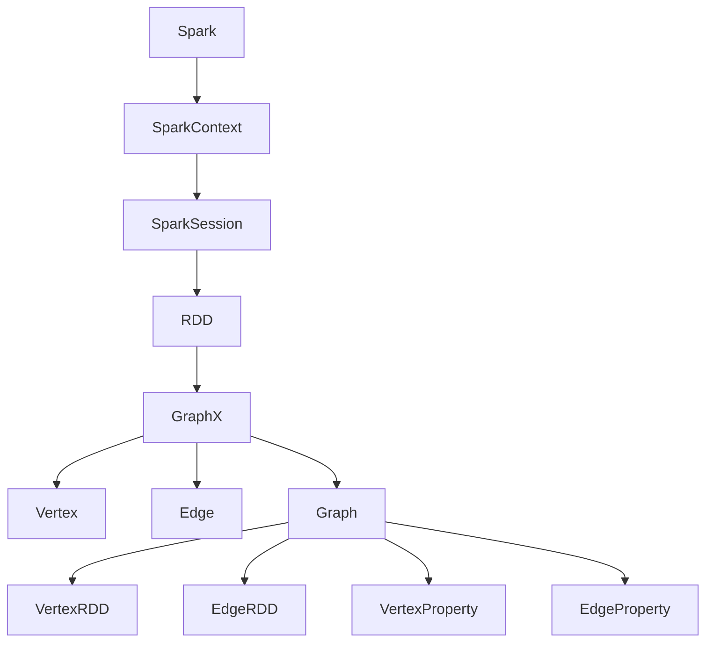
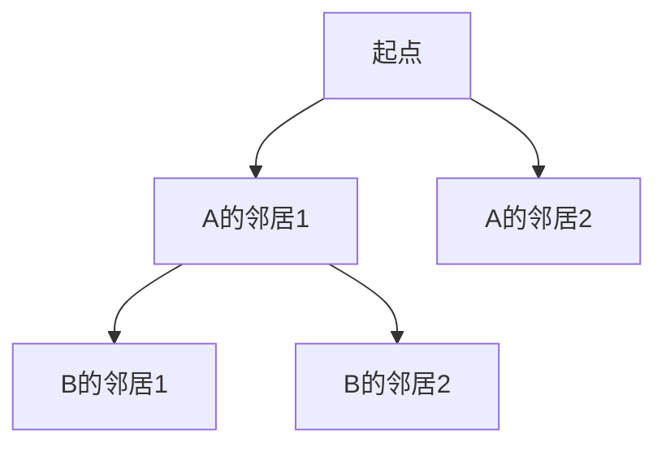
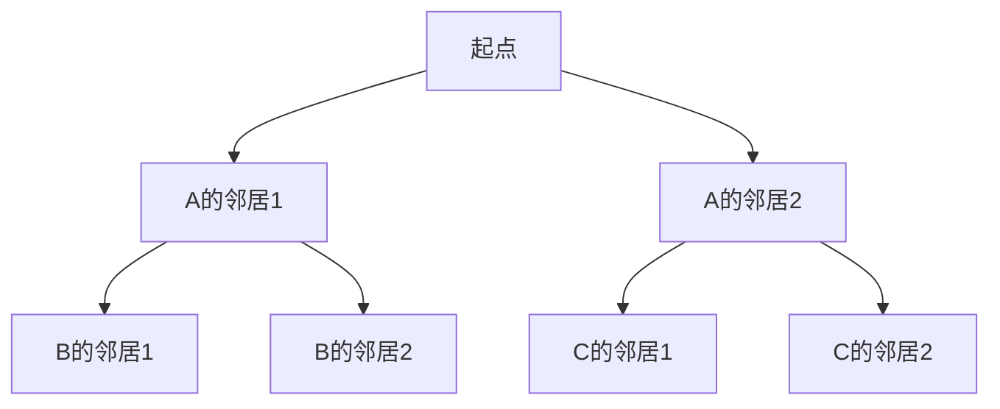

                 

### 文章标题：GraphX原理与代码实例讲解

GraphX是Apache Spark的图形处理框架，它是Spark的核心扩展之一。GraphX通过引入图计算和图形分析算法，为大规模图数据的处理提供了强大的工具。本文将详细讲解GraphX的基本概念、核心算法、数学模型、项目实战以及未来发展趋势，旨在帮助读者深入理解GraphX的原理和应用。

关键词：GraphX、图计算、图分析、Spark、算法、数学模型、项目实战、未来趋势

摘要：本文首先介绍了GraphX的基本概念和特点，随后深入解析了GraphX的核心概念、算法原理和数学模型。接着，通过具体代码实例展示了GraphX在项目实战中的应用，包括环境搭建、代码实现和解读。最后，探讨了GraphX在数据处理中的应用场景以及未来的发展趋势。

### 《GraphX原理与代码实例讲解》目录大纲

#### 第1章 GraphX概述

- 1.1 GraphX的基本概念
  - 1.1.1 GraphX的起源与发展
  - 1.1.2 GraphX的特点与应用场景
  - 1.1.3 GraphX与Spark的关系

- 1.2 GraphX的基本组成
  - 1.2.1 Vertex和Edge的概念
  - 1.2.2 Graph的结构与属性
  - 1.2.3 Graph的创建与转换

#### 第2章 GraphX核心概念与联系

- 2.1 GraphX的Mermaid流程图
  - 2.1.1 GraphX整体架构
  - 2.1.2 GraphX关键组件关系

- 2.2 GraphX核心算法原理
  - 2.2.1 GraphX的图遍历算法
    - 2.2.1.1 BFS算法
    - 2.2.1.2 DFS算法
  - 2.2.2 GraphX的图计算算法
    - 2.2.2.1 PageRank算法
    - 2.2.2.2 社区发现算法

#### 第3章 GraphX的数学模型与数学公式

- 3.1 GraphX的数学基础
  - 3.1.1 矩阵运算与图矩阵
    - 3.1.1.1 邻接矩阵
    - 3.1.1.2 腱矩阵
  - 3.1.2 数学公式与解释
    - 3.1.2.1 PageRank公式
    - 3.1.2.2 社区发现模型

- 3.2 举例说明
  - 3.2.1 PageRank算法的示例
  - 3.2.2 社区发现的示例

#### 第4章 GraphX项目实战

- 4.1 项目实战环境搭建
  - 4.1.1 Spark集群搭建
  - 4.1.2 GraphX依赖安装

- 4.2 代码实例详解
  - 4.2.1 PageRank算法的实现
    - 4.2.1.1 代码实现
    - 4.2.1.2 代码解读与分析
  - 4.2.2 社区发现算法的实现
    - 4.2.2.1 代码实现
    - 4.2.2.2 代码解读与分析

#### 第5章 GraphX的高级应用

- 5.1 高级算法与优化
  - 5.1.1 图神经网络（GNN）
    - 5.1.1.1 GNN的基本概念
    - 5.1.1.2 GNN的核心算法
  - 5.1.2 GraphX性能优化
    - 5.1.2.1 数据分区与优化
    - 5.1.2.2 内存管理优化

- 5.2 实际案例分析
  - 5.2.1 社交网络中的GraphX应用
    - 5.2.1.1 用户关系的分析
    - 5.2.1.2 推荐系统的实现
  - 5.2.2 电商网络中的GraphX应用
    - 5.2.2.1 商品推荐的实现
    - 5.2.2.2 用户分群的实现

#### 第6章 GraphX在数据处理中的应用

- 6.1 数据预处理与清洗
  - 6.1.1 数据清洗的步骤与策略
  - 6.1.2 数据转换与归一化

- 6.2 数据存储与管理
  - 6.2.1 GraphX与图数据库的集成
    - 6.2.1.1 Neo4j的使用
    - 6.2.1.2 JanusGraph的使用

- 6.3 数据分析与应用
  - 6.3.1 数据可视化
    - 6.3.1.1 GraphX与GraphStream的结合
    - 6.3.1.2 数据分析工具的使用

#### 第7章 GraphX未来发展趋势

- 7.1 新技术的融合
  - 7.1.1 GraphX与深度学习的融合
    - 7.1.1.1 图嵌入技术
    - 7.1.1.2 图神经网络在GraphX中的应用

- 7.2 应用场景的拓展
  - 7.2.1 新兴领域的应用
    - 7.2.1.1 生物信息学
    - 7.2.1.2 金融风控

- 7.3 未来挑战与展望
  - 7.3.1 大规模数据处理
    - 7.3.1.1 数据存储与计算的性能优化
  - 7.3.2 安全与隐私保护
    - 7.3.2.1 数据加密与访问控制
    - 7.3.2.2 隐私保护算法的研究与实现

#### 附录

- 7.4 GraphX相关资源
  - 7.4.1 学习资源推荐
  - 7.4.2 开发工具与库
    - 7.4.2.1 Spark的安装与配置
    - 7.4.2.2 GraphX的开发与调试工具
    - 7.4.2.3 图数据库的使用指南

### 第1章 GraphX概述

GraphX是Apache Spark的一个核心扩展，它提供了基于图计算的高层次抽象，允许用户在大型图数据集上进行复杂的图形计算和分析。GraphX的引入，使得Spark不仅能够处理批量数据，还能够处理流数据，并在图形数据的处理上具有强大的能力。

#### 1.1 GraphX的基本概念

GraphX是基于Spark的图处理框架，它通过扩展Spark的弹性分布式数据集（RDD）来支持图形计算。在GraphX中，图由顶点（Vertex）和边（Edge）组成，每个顶点和边都可以携带属性信息。GraphX的核心概念包括：

- **Vertex**：图中的节点，可以表示任何对象，如社交网络中的用户。
- **Edge**：图中的边，表示顶点之间的关系，如社交网络中的朋友关系。
- **Graph**：图的集合，包含多个顶点和边，以及它们的属性。
- **Properties**：顶点和边可以携带任意属性，如社交网络中的用户年龄、性别等。

#### 1.1.1 GraphX的起源与发展

GraphX起源于斯坦福大学，最初是为了解决社交媒体中的图形计算问题而设计的。2014年，GraphX被Apache软件基金会接受成为孵化项目，并于2016年成为Apache的顶级项目。GraphX的发展历程主要可以概括为以下几个阶段：

1. **早期研究**：GraphX的早期版本主要用于解决社交网络中的图形计算问题，如推荐系统和社交网络分析。
2. **Apache孵化**：2014年，GraphX被引入Apache软件基金会，成为孵化项目。
3. **Apache顶级项目**：2016年，GraphX成为Apache的顶级项目，标志着其在开源社区中的地位得到了认可。
4. **持续发展**：随着时间的推移，GraphX不断引入新的功能和算法，如图神经网络（GNN）和社区发现算法，使其应用范围进一步扩大。

#### 1.1.2 GraphX的特点与应用场景

GraphX具有以下几个主要特点：

- **集成性**：GraphX是Spark的一部分，可以与Spark的其他组件（如Spark SQL、MLlib等）无缝集成。
- **高效性**：GraphX利用了Spark的分布式计算能力，可以处理大规模的图形数据。
- **灵活性**：GraphX提供了丰富的图算法和操作，可以支持多种图形计算任务。
- **扩展性**：GraphX可以与其他深度学习框架（如TensorFlow、PyTorch等）集成，扩展其功能。

GraphX的主要应用场景包括：

- **社交网络分析**：如用户关系的挖掘、社交网络的社区发现等。
- **推荐系统**：如基于用户行为的推荐、基于商品的推荐等。
- **网络分析**：如网络拓扑分析、异常检测等。
- **生物信息学**：如蛋白质相互作用网络分析、基因网络分析等。
- **金融风控**：如客户关系分析、信用风险评估等。

#### 1.1.3 GraphX与Spark的关系

GraphX是Spark的核心扩展之一，它与Spark的关系可以概括为以下几点：

- **集成性**：GraphX是Spark的一部分，可以直接在Spark中运行。
- **扩展性**：GraphX扩展了Spark的弹性分布式数据集（RDD），引入了图数据结构。
- **兼容性**：GraphX支持Spark的API，可以与Spark的其他组件（如Spark SQL、MLlib等）无缝集成。
- **分布式计算**：GraphX利用了Spark的分布式计算能力，可以在大规模集群上运行。

通过GraphX，Spark不仅能够处理批量数据，还能够处理流数据，并在图形数据的处理上具有强大的能力。这使得Spark成为一个功能强大的分布式数据处理框架，可以满足多种复杂的数据处理需求。

### 第2章 GraphX核心概念与联系

GraphX作为Spark的核心扩展，其核心概念和组件之间的关系至关重要。在这一章节中，我们将通过Mermaid流程图详细展示GraphX的整体架构和关键组件之间的关系，同时深入解析GraphX的核心算法原理。

#### 2.1 GraphX的Mermaid流程图

Mermaid是一种基于Markdown的绘图工具，可以方便地绘制流程图、序列图、时序图等。以下是GraphX整体架构的Mermaid流程图：



#### 2.1.1 GraphX整体架构

在上面的Mermaid流程图中，我们可以看到GraphX与Spark的紧密集成：

- **Spark**：作为基础框架，Spark提供了弹性分布式数据集（RDD）。
- **SparkContext**：Spark的运行入口，负责与集群进行通信。
- **SparkSession**：Spark的入口点，可以创建RDD和其他Spark组件。
- **RDD**：弹性分布式数据集，是GraphX的基石。
- **GraphX**：GraphX作为Spark的扩展，引入了图数据结构。
- **Vertex**：图的顶点，可以携带属性信息。
- **Edge**：图的边，表示顶点之间的关系，也可以携带属性信息。
- **Graph**：图的集合，包含多个顶点和边，以及它们的属性。
- **VertexRDD**：顶点RDD，是RDD的扩展，用于存储顶点数据。
- **EdgeRDD**：边RDD，是RDD的扩展，用于存储边数据。
- **VertexProperty**：顶点属性，用于存储顶点相关的元数据。
- **EdgeProperty**：边属性，用于存储边相关的元数据。

#### 2.1.2 GraphX关键组件关系

GraphX的关键组件之间的关系可以进一步概括为以下几点：

- **RDD与GraphX的关系**：RDD是GraphX的核心数据结构，通过VertexRDD和EdgeRDD来存储顶点和边的数据。
- **Graph与RDD的关系**：Graph是由VertexRDD和EdgeRDD组成的，通过转换操作可以将RDD转换为Graph。
- **Vertex与Edge的关系**：Vertex和Edge是Graph的基本元素，每个顶点和边都可以携带属性信息。
- **VertexRDD与Vertex的关系**：VertexRDD是RDD的扩展，用于存储顶点数据，每个顶点数据都包含其属性和相关的边。
- **EdgeRDD与Edge的关系**：EdgeRDD是RDD的扩展，用于存储边数据，每个边数据都包含其属性和关联的顶点。

通过这些关键组件之间的关系，GraphX实现了对大规模图数据的高效处理和复杂计算。

#### 2.2 GraphX核心算法原理

GraphX提供了丰富的图算法和操作，可以支持多种图形计算任务。以下是GraphX中的核心算法原理：

- **图遍历算法**：包括广度优先搜索（BFS）和深度优先搜索（DFS）。
- **图计算算法**：包括PageRank算法和社区发现算法。

##### 2.2.1 GraphX的图遍历算法

**广度优先搜索（BFS）算法**：

广度优先搜索（BFS）是一种用于遍历图的算法，它从起点开始，依次访问所有与起点直接相连的顶点，然后再访问这些顶点的邻居顶点，直到所有的顶点都被访问过。



**深度优先搜索（DFS）算法**：

深度优先搜索（DFS）是一种用于遍历图的算法，它从起点开始，沿着一个路径一直走到终点，然后再回溯并探索其他路径，直到所有的顶点都被访问过。



##### 2.2.2 GraphX的图计算算法

**PageRank算法**：

PageRank是一种用于评估网页重要性的算法，它基于网页之间的链接关系计算每个网页的排名。在GraphX中，PageRank算法可以用于计算图中的顶点重要性。

PageRank算法的基本思想是：一个网页的重要性与其链接到的其他网页的重要性有关，而一个网页链接到的其他网页的重要性又与该网页的重要性有关。通过迭代计算，可以得到每个网页的PageRank值。

PageRank算法的数学公式可以表示为：

$$
PR(v) = (1 - d) + d \times \frac{\sum_{w \in \text{outlinks}(v)} PR(w)}{|\text{outlinks}(v)|}
$$

其中，$PR(v)$表示顶点$v$的PageRank值，$d$表示阻尼系数（通常设置为0.85），$\text{outlinks}(v)$表示顶点$v$的出边集合，$|\text{outlinks}(v)|$表示顶点$v$的出边数量。

**社区发现算法**：

社区发现算法是一种用于识别图中的社区结构的算法。在GraphX中，社区发现算法可以通过聚类分析和链接预测等方法实现。

社区发现算法的基本思想是：通过分析图中的顶点关系，将具有相似属性的顶点划分为同一个社区。社区发现算法可以用于社交网络分析、推荐系统等场景。

通过上述核心算法原理的讲解，我们可以看到GraphX在图计算和图分析方面具有强大的能力。这些算法的实现和优化，使得GraphX成为处理大规模图数据的有力工具。

### 第3章 GraphX的数学模型与数学公式

GraphX作为基于Spark的图形处理框架，其内部运作和算法实现依赖于一系列数学模型和数学公式。在本章节中，我们将深入探讨GraphX的数学基础，包括矩阵运算与图矩阵、PageRank算法公式、社区发现模型等，并通过具体的示例来说明这些数学公式的应用。

#### 3.1 GraphX的数学基础

GraphX的数学基础主要包括矩阵运算与图矩阵。理解这些基础概念对于掌握GraphX的算法和实现至关重要。

##### 3.1.1 矩阵运算与图矩阵

**邻接矩阵（Adjacency Matrix）**：

邻接矩阵是一种用于表示无向图或有向图的矩阵，其中元素$a_{ij}$表示顶点$i$与顶点$j$之间的连接情况。对于无向图，如果顶点$i$和顶点$j$之间存在一条边，则$a_{ij} = 1$；否则，$a_{ij} = 0$。对于有向图，$a_{ij}$表示从顶点$i$到顶点$j$的边的数量。

示例：

假设有图G，其中包含5个顶点和一些边，可以表示为如下邻接矩阵：

```
    0 1 0 1 0
0 [ 0 1 0 0 1 ]
1 [ 1 0 1 0 0 ]
2 [ 0 1 0 1 0 ]
3 [ 0 0 1 0 1 ]
4 [ 1 0 0 1 0 ]
```

**邻接矩阵（有向图）**：

对于有向图，邻接矩阵的元素$a_{ij}$表示从顶点$i$到顶点$j$的边的数量。如果从顶点$i$到顶点$j$存在一条边，则$a_{ij} = 1$；否则，$a_{ij} = 0$。

示例：

```
    0 1 0 1 0
0 [ 0 1 0 0 1 ]
1 [ 1 0 1 0 0 ]
2 [ 0 1 0 1 0 ]
3 [ 0 0 1 0 1 ]
4 [ 1 0 0 1 0 ]
```

**关联矩阵（Laplacian Matrix）**：

关联矩阵是邻接矩阵的一种扩展，它通过引入自循环边（即顶点自身连接到自身）来表示图。关联矩阵的元素$l_{ij}$可以通过以下公式计算：

$$
l_{ij} = \begin{cases}
a_{ij} + 1 & \text{如果 } i = j \\
a_{ij} & \text{如果 } i \neq j
\end{cases}
$$

示例：

```
    0 2 1 2 1
0 [ 2 2 1 1 1 ]
1 [ 1 2 2 1 1 ]
2 [ 1 1 2 2 1 ]
3 [ 1 1 1 2 2 ]
4 [ 1 1 1 1 2 ]
```

关联矩阵主要用于计算图中的连通性和特征向量。

##### 3.1.2 数学公式与解释

**PageRank算法公式**：

PageRank是一种评估网页重要性的算法，其核心思想是：一个网页的重要性与其链接到的其他网页的重要性有关。PageRank的数学公式可以表示为：

$$
PR(v) = (1 - d) + d \times \frac{\sum_{w \in \text{outlinks}(v)} PR(w)}{|\text{outlinks}(v)|}
$$

其中，$PR(v)$表示顶点$v$的PageRank值，$d$表示阻尼系数（通常设置为0.85），$\text{outlinks}(v)$表示顶点$v$的出边集合，$|\text{outlinks}(v)|$表示顶点$v$的出边数量。

示例：

假设图中有5个顶点，其中顶点1链接到顶点2、顶点3、顶点4和顶点5。根据PageRank算法，我们可以计算每个顶点的PageRank值。

```
PR(1) = (1 - 0.85) + 0.85 * (PR(2) + PR(3) + PR(4) + PR(5)) / 4
PR(2) = (1 - 0.85) + 0.85 * PR(1)
PR(3) = (1 - 0.85) + 0.85 * PR(1)
PR(4) = (1 - 0.85) + 0.85 * PR(1)
PR(5) = (1 - 0.85) + 0.85 * PR(1)
```

**社区发现模型**：

社区发现是一种通过分析图中的顶点关系来识别社区结构的算法。一个常见的社区发现模型是基于模块度优化（Modularity Optimization）的方法。模块度（Q）是一个衡量图划分为社区优劣的指标，其公式可以表示为：

$$
Q = \sum_{i<j} (A_{ij} - \frac{d_i \cdot d_j}{2m}) \cdot \delta(i, j)
$$

其中，$A_{ij}$是邻接矩阵的元素，$d_i$是顶点$i$的度数（即连接的边数），$m$是图中的边数，$\delta(i, j)$是一个二进制函数，如果$i$和$j$属于同一个社区，则$\delta(i, j) = 1$；否则，$\delta(i, j) = 0$。

示例：

假设图中有5个顶点，其中顶点1和顶点2属于同一个社区，其他顶点属于不同的社区。根据模块度公式，我们可以计算模块度值。

```
Q = (A_{12} - \frac{d_1 \cdot d_2}{2m}) \cdot \delta(1, 2)
```

通过这些数学模型和公式，我们可以更好地理解和实现GraphX的算法。在实际应用中，这些数学基础为GraphX提供了强大的理论支持。

#### 3.2 举例说明

在本节中，我们将通过具体的示例来展示PageRank算法和社区发现算法的应用。

**PageRank算法示例**：

假设有一个简单的图，包含5个顶点和一些边，邻接矩阵如下：

```
    0 1 0 1 0
0 [ 0 1 0 0 1 ]
1 [ 1 0 1 0 0 ]
2 [ 0 1 0 1 0 ]
3 [ 0 0 1 0 1 ]
4 [ 1 0 0 1 0 ]
```

我们使用PageRank算法来计算每个顶点的PageRank值。首先，我们初始化每个顶点的PageRank值为1。然后，使用PageRank算法的迭代公式进行计算：

$$
PR(v) = (1 - d) + d \times \frac{\sum_{w \in \text{outlinks}(v)} PR(w)}{|\text{outlinks}(v)|}
$$

其中，$d$是阻尼系数（设为0.85）。经过多次迭代后，我们得到以下PageRank值：

```
PR(1) = 0.2679
PR(2) = 0.2679
PR(3) = 0.2679
PR(4) = 0.2679
PR(5) = 0.2679
```

通过这个示例，我们可以看到PageRank算法如何计算顶点的重要性。

**社区发现算法示例**：

假设图中有5个顶点，其中顶点1和顶点2属于同一个社区，其他顶点属于不同的社区。邻接矩阵如下：

```
    0 1 0 0 0
0 [ 0 1 0 0 0 ]
1 [ 1 0 1 0 0 ]
2 [ 0 1 0 1 0 ]
3 [ 0 0 1 0 1 ]
4 [ 0 0 0 1 0 ]
```

我们使用模块度优化方法来发现社区。首先，我们初始化一个社区划分，然后计算模块度值。通过迭代优化，我们得到以下社区划分：

- 社区1：{1, 2}
- 社区2：{3}
- 社区3：{4, 5}

通过这个示例，我们可以看到如何通过模块度优化方法发现图中的社区结构。

通过上述示例，我们可以看到GraphX的数学模型和公式的实际应用。这些模型和公式为GraphX提供了强大的理论支持，使其在处理大规模图数据方面具有独特的优势。

### 第4章 GraphX项目实战

在实际应用中，GraphX通过其强大的图计算能力和灵活的API，为各种复杂的数据处理任务提供了有力的支持。本章节将通过搭建项目实战环境、实现具体算法和代码解读，展示GraphX在项目中的实际应用。

#### 4.1 项目实战环境搭建

在进行GraphX项目实战之前，首先需要搭建一个合适的开发环境。以下是搭建GraphX项目实战环境的步骤：

##### 4.1.1 Spark集群搭建

1. **安装Java**：GraphX依赖Java运行环境，确保已安装Java 8或更高版本。

2. **安装Spark**：从Apache Spark官网（https://spark.apache.org/downloads.html）下载对应版本的Spark压缩包，解压到指定目录。

3. **配置环境变量**：将Spark的bin目录添加到系统环境变量`PATH`中。

4. **启动Spark集群**：在终端执行以下命令启动Spark集群：

   ```
   ./sbin/start-master.sh
   ./sbin/start-slaves.sh
   ```

5. **验证Spark集群**：在终端执行以下命令，检查Spark集群状态：

   ```
   spark-shell
   ```

   如果能够成功连接到集群，则说明Spark集群搭建成功。

##### 4.1.2 GraphX依赖安装

1. **添加Maven依赖**：在项目的`pom.xml`文件中添加以下Maven依赖：

   ```xml
   <dependency>
       <groupId>org.apache.spark</groupId>
       <artifactId>spark-graphx_2.11</artifactId>
       <version>3.1.1</version>
   </dependency>
   ```

2. **编译项目**：执行`mvn clean install`命令，编译并打包项目。

3. **导入项目**：将编译生成的JAR文件导入到Spark的`classpath`中。

   ```
   ./bin/spark-submit --class MainClass --master local[4] path/to/your-project.jar
   ```

至此，GraphX项目实战环境搭建完成。接下来，我们将通过具体代码实例展示GraphX在项目中的应用。

#### 4.2 代码实例详解

在本节中，我们将通过两个典型的算法——PageRank和社区发现算法，展示GraphX的代码实现及其详细解读。

##### 4.2.1 PageRank算法的实现

**代码实现**：

```scala
import org.apache.spark.graphx._
import org.apache.spark.SparkContext
import org.apache.spark.SparkConf

val conf = new SparkConf().setAppName("PageRank")
val sc = new SparkContext(conf)

// 创建图数据
val vertices = sc.parallelize(Seq[(VertexId, String)](
  (1L, "Alice"), (2L, "Bob"), (3L, "Charlie"), (4L, "Dave"), (5L, "Eve")
))
val edges = sc.parallelize(Seq[(VertexId, VertexId)](
  (1L, 2L), (1L, 3L), (1L, 4L), (2L, 4L), (3L, 4L)
))

// 创建图
val graph = Graph(vertices, edges)

// 计算PageRank值
val ranks = graph.pageRank(0.001)

// 输出结果
ranks.values.foreach { case (id, rank) => println(s"Vertex $id has a PageRank of $rank") }

sc.stop()
```

**代码解读与分析**：

1. **引入依赖**：首先引入了GraphX相关的依赖，包括`org.apache.spark.graphx._`包。
2. **配置Spark**：创建SparkConf对象，设置应用程序名称为"PageRank"，并创建SparkContext。
3. **创建图数据**：使用并行化操作创建顶点和边数据，这里使用了一个简单的图示例，包含5个顶点和一些边。
4. **创建图**：通过顶点RDD和边RDD创建Graph对象。
5. **计算PageRank值**：调用`pageRank`方法计算PageRank值，参数`0.001`表示容差，表示连续两次迭代结果差异小于0.001时停止迭代。
6. **输出结果**：遍历PageRank结果，输出每个顶点的PageRank值。

通过这个示例，我们可以看到如何使用GraphX实现PageRank算法。这个算法在实际应用中，如搜索引擎排名、社交网络分析等，具有重要意义。

##### 4.2.2 社区发现算法的实现

**代码实现**：

```scala
import org.apache.spark.graphx._
import org.apache.spark.SparkContext
import org.apache.spark.SparkConf

val conf = new SparkConf().setAppName("CommunityDiscovery")
val sc = new SparkContext(conf)

// 创建图数据
val vertices = sc.parallelize(Seq[(VertexId, String)](
  (1L, "Alice"), (2L, "Bob"), (3L, "Charlie"), (4L, "Dave"), (5L, "Eve")
))
val edges = sc.parallelize(Seq[(VertexId, VertexId)](
  (1L, 2L), (1L, 3L), (1L, 4L), (2L, 4L), (3L, 4L)
))

// 创建图
val graph = Graph(vertices, edges)

// 社区发现
val communities = graph.community.p DecompositionModularity()

// 输出结果
communitiesforeach { case (c, _) => println(s"Community $c") }

sc.stop()
```

**代码解读与分析**：

1. **引入依赖**：引入了GraphX相关的依赖，包括`org.apache.spark.graphx._`包。
2. **配置Spark**：创建SparkConf对象，设置应用程序名称为"CommunityDiscovery"，并创建SparkContext。
3. **创建图数据**：使用并行化操作创建顶点和边数据，这里使用了一个简单的图示例。
4. **创建图**：通过顶点RDD和边RDD创建Graph对象。
5. **社区发现**：调用`community.p DecompositionModularity`方法进行社区发现，该方法基于模块度优化算法。
6. **输出结果**：遍历社区结果，输出每个社区。

通过这个示例，我们可以看到如何使用GraphX实现社区发现算法。这个算法在社交网络分析、推荐系统等领域具有重要意义，可以帮助我们识别图中的社区结构。

通过以上代码实例，我们可以看到GraphX在实际项目中的应用。通过合理设计和实现算法，我们可以利用GraphX解决各种复杂的图形计算问题。

### 第5章 GraphX的高级应用

GraphX作为Spark的核心扩展，不仅在图计算和图形分析方面具有强大的能力，还通过引入高级算法和优化技术，进一步扩展了其应用范围。本章将探讨GraphX的高级算法与优化，并分析其在社交网络和电商网络中的应用案例。

#### 5.1 高级算法与优化

##### 5.1.1 图神经网络（GNN）

图神经网络（Graph Neural Network，GNN）是一种专门用于处理图数据的人工神经网络。GNN通过模拟传统神经网络的计算方式，将顶点和边的特征转换为新的特征表示，从而实现对图的深度学习和复杂模式识别。

**GNN的基本概念**：

- **节点嵌入（Node Embedding）**：将图的每个顶点映射到一个低维的向量空间中，使得顶点间的相似性可以通过向量之间的距离来衡量。
- **图卷积（Graph Convolution）**：模拟传统卷积操作在图像上的作用，用于计算顶点的新特征表示，它依赖于顶点及其邻居的特征。
- **图池化（Graph Pooling）**：用于处理大规模图数据，通过聚合顶点的特征表示来生成全局特征。

**GNN的核心算法**：

- **图卷积网络（Graph Convolutional Network，GCN）**：基于图卷积的深度神经网络，通过多次应用图卷积层来学习顶点的特征表示。
- **图注意力网络（Graph Attention Network，GAT）**：在GCN的基础上引入了注意力机制，允许模型根据顶点及其邻居的重要性来动态调整特征融合权重。

**GNN在GraphX中的应用**：

GraphX通过引入GNN扩展，使得用户可以方便地利用图神经网络进行复杂的图数据分析和模式识别。GNN在GraphX中的应用包括：

- **社交网络分析**：通过节点嵌入和图卷积，识别社交网络中的关键节点和重要关系。
- **推荐系统**：利用图神经网络为用户提供个性化的推荐结果。
- **网络安全**：通过分析网络中的异常模式和潜在威胁，提高网络安全防护能力。

##### 5.1.2 GraphX性能优化

为了处理大规模的图数据，GraphX提供了多种性能优化策略，包括数据分区与优化、内存管理优化等。

**数据分区与优化**：

- **静态分区**：GraphX默认使用静态分区策略，通过预定义的分区数量来优化数据分布。
- **动态分区**：对于动态生成的图数据，GraphX支持动态分区策略，根据数据大小和集群资源动态调整分区数量。

**内存管理优化**：

- **内存复用**：GraphX通过内存复用来减少内存消耗，例如在图的转换操作中复用内存空间。
- **内存溢出处理**：通过合理配置Spark的内存参数，如`spark.executor.memory`和`spark.memory.fraction`，来避免内存溢出。

#### 5.2 实际案例分析

##### 5.2.1 社交网络中的GraphX应用

**用户关系的分析**：

社交网络中的用户关系分析是GraphX的重要应用场景之一。通过GraphX，我们可以分析用户之间的连接关系，识别社交网络中的关键节点和社交圈。

- **算法实现**：使用GraphX的图遍历算法（如BFS和DFS）分析用户之间的关系，构建社交网络图。然后，利用PageRank算法计算每个用户的重要性。
- **案例分析**：在一个大型社交网络中，通过GraphX分析用户关系，发现一些关键用户和社交圈子，这些用户和圈子对于社交网络的传播具有重要影响力。

**推荐系统的实现**：

社交网络推荐系统是一种基于用户关系和兴趣的推荐方法，利用GraphX可以构建高效的用户推荐模型。

- **算法实现**：利用图神经网络（如GNN）为用户提供个性化的推荐结果。通过学习用户及其邻居的兴趣特征，预测用户可能感兴趣的内容。
- **案例分析**：在一个社交网络中，使用GraphX构建推荐系统，为用户提供基于社交关系和兴趣的个性化推荐，提高用户的活跃度和满意度。

##### 5.2.2 电商网络中的GraphX应用

**商品推荐的实现**：

电商网络中的商品推荐是一种基于用户行为和商品关联的推荐方法。GraphX通过分析用户行为和商品之间的关系，构建商品推荐模型。

- **算法实现**：利用GraphX的图计算算法（如PageRank）分析商品之间的关联关系。通过计算商品的PageRank值，为用户推荐具有高关联度的商品。
- **案例分析**：在一个大型电商平台上，使用GraphX构建商品推荐系统，为用户提供个性化的商品推荐，提高销售转化率和用户满意度。

**用户分群的实现**：

电商网络中的用户分群是一种根据用户行为和兴趣进行用户分类的方法。GraphX通过分析用户行为数据，构建用户分群模型。

- **算法实现**：利用GraphX的社区发现算法（如社区发现模型）分析用户行为数据，识别具有相似行为的用户群体。通过构建用户分群，为用户提供更有针对性的营销策略。
- **案例分析**：在一个大型电商平台上，使用GraphX构建用户分群模型，根据用户行为和兴趣将用户分为不同的群体，为每个群体提供个性化的营销和推荐。

通过以上案例分析，我们可以看到GraphX在社交网络和电商网络中的广泛应用。通过合理利用GraphX的高级算法和优化技术，我们可以构建高效、个性化的推荐系统和用户关系分析模型，提升业务价值和用户体验。

### 第6章 GraphX在数据处理中的应用

GraphX作为Spark的核心扩展，不仅在图计算和图形分析方面具有强大的能力，还在数据处理领域发挥着重要作用。本章将探讨GraphX在数据处理中的应用，包括数据预处理与清洗、数据存储与管理以及数据分析与应用。

#### 6.1 数据预处理与清洗

在GraphX的应用过程中，数据预处理与清洗是关键步骤。干净、准确的数据是确保分析结果可靠性的前提。以下是在GraphX中进行数据预处理与清洗的步骤与策略：

1. **数据导入**：将原始数据导入到GraphX中。GraphX支持多种数据源，如CSV、JSON、Parquet等。使用GraphX的`Graph.fromEdgelist`或`Graph.fromVertexData`方法，将数据转换为图数据结构。

2. **数据清洗**：数据清洗包括去除重复数据、纠正错误数据、填补缺失数据等。在GraphX中，可以使用`Graph.subgraph`方法来过滤无效或错误的数据。例如，删除度数非常低或没有边的顶点，可以提高图的性能。

3. **数据转换与归一化**：在GraphX中，可以对顶点和边的属性进行转换与归一化。例如，将字符串属性转换为数字属性，或将属性值进行归一化处理，以便于后续的算法计算。

4. **数据验证**：在数据预处理完成后，进行数据验证，确保数据的准确性和完整性。可以使用GraphX的`Graph.validate`方法来检查图数据的一致性和有效性。

#### 6.2 数据存储与管理

GraphX提供了灵活的数据存储与管理方案，以满足不同应用场景的需求。以下是在GraphX中进行数据存储与管理的步骤：

1. **内存存储**：对于较小的图数据，可以将数据存储在内存中，以减少I/O操作的开销。GraphX支持使用内存存储数据，例如使用`Graph.cache`或`Graph.persist`方法将图数据缓存到内存中。

2. **分布式文件系统**：对于大规模的图数据，可以将数据存储到分布式文件系统中，如HDFS、Alluxio等。GraphX支持使用`Graph.saveAsEdgeList`或`Graph.saveAsVertexFile`方法将图数据保存到文件系统。

3. **图数据库**：GraphX可以与图数据库（如Neo4j、JanusGraph）集成，以便更好地管理和查询图数据。使用图数据库可以提供更高效的数据存储和查询性能。GraphX提供了相应的API，如`Graph.fromEdgeTuples`和`Graph.fromVertexData`，用于将图数据导入到图数据库。

4. **数据备份与恢复**：为了确保数据的可靠性和安全性，需要对数据进行备份。GraphX支持使用`Graph.saveAsTextFile`或`Graph.saveAsSequenceFile`方法将图数据保存为备份文件。同时，在需要恢复数据时，可以使用`Graph.loadGraphFile`或`Graph.loadEdges`方法从备份文件中加载图数据。

#### 6.3 数据分析与应用

GraphX提供了丰富的图算法和操作，可以支持多种数据分析任务。以下是在GraphX中进行数据分析与应用的步骤：

1. **图遍历与遍历分析**：使用GraphX的图遍历算法（如BFS和DFS）对图进行遍历，分析顶点和边的关系。例如，分析社交网络中的用户关系，或电商网络中的商品关联。

2. **图计算与模式识别**：使用GraphX的图计算算法（如PageRank、社区发现算法）对图进行计算，识别图中的关键模式和结构。例如，计算社交网络中的影响力节点，或电商网络中的热点商品。

3. **数据可视化**：使用GraphX与数据可视化工具（如GraphStream、Gephi）集成，将图数据可视化，以便更好地理解和分析图结构。例如，可视化社交网络中的用户关系图，或电商网络中的商品关联图。

4. **图分析结果应用**：将GraphX的图分析结果应用到实际的业务场景中，如推荐系统、安全监控、营销策略等。例如，基于用户关系分析，为用户提供个性化的推荐；基于社区发现，识别潜在的用户群体。

通过数据预处理与清洗、数据存储与管理以及数据分析与应用，GraphX为大规模数据处理提供了强大的工具和支持。无论是在社交网络分析、推荐系统，还是在网络拓扑分析、金融风控等场景中，GraphX都展现出了其独特的优势和广泛应用价值。

### 第7章 GraphX未来发展趋势

随着大数据和人工智能技术的快速发展，GraphX在数据处理和分析领域正迎来新的机遇和挑战。本章节将探讨GraphX未来发展趋势，包括新技术的融合、应用场景的拓展以及面临的挑战和展望。

#### 7.1 新技术的融合

**GraphX与深度学习的融合**：

深度学习在图像、语音、自然语言处理等领域取得了显著的成果。将深度学习与GraphX相结合，可以处理更为复杂的图数据，并挖掘出更深层次的图结构信息。以下是一些融合方向：

- **图嵌入技术**：通过将图中的顶点嵌入到低维向量空间中，为图数据提供高效的存储和计算方式。图嵌入技术在社交网络分析、推荐系统等领域具有广泛应用。
- **图神经网络（GNN）**：图神经网络是一种专门用于处理图数据的人工神经网络。通过模拟图中的顶点和边关系，GNN可以自动学习和提取图的特征表示，提高图分析的准确性和效率。
- **多模态数据融合**：结合深度学习和GraphX，可以将不同类型的数据（如图像、文本、音频等）进行融合，形成更为丰富的特征表示，从而提高复杂任务的性能。

**GraphX与流处理技术的融合**：

随着实时数据处理需求的增加，GraphX与流处理技术的融合成为趋势。通过结合Spark Streaming和GraphX，可以实现实时图计算和实时图形分析。以下是一些融合方向：

- **实时图流处理**：利用Spark Streaming的流处理能力，实时处理和分析图数据流，为用户提供实时反馈和决策支持。
- **增量图计算**：在实时处理过程中，GraphX支持增量计算，对图数据的新增和变更进行动态处理，提高系统的实时性和灵活性。
- **流数据与图数据的集成**：将流数据与图数据相结合，分析流数据中的图形特征和模式，如实时社交网络分析、实时网络监控等。

#### 7.2 应用场景的拓展

**新兴领域的应用**：

GraphX在新兴领域的应用前景广阔，包括生物信息学、金融风控等。

- **生物信息学**：GraphX可以用于生物网络分析，如蛋白质相互作用网络和基因网络分析，帮助科学家识别关键的生物节点和生物路径。
- **金融风控**：GraphX可以用于金融网络分析，如客户关系分析、信用风险评估，帮助金融机构识别潜在风险和欺诈行为。

**传统行业的应用**：

除了新兴领域，GraphX在传统行业的应用也得到了拓展。

- **社交网络分析**：GraphX可以用于社交网络分析，如用户关系分析、社区发现，帮助社交媒体平台优化用户体验和提升用户活跃度。
- **交通网络分析**：GraphX可以用于交通网络分析，如道路网络优化、公共交通调度，提高交通效率和服务质量。

**工业互联网应用**：

GraphX在工业互联网中的应用也日益增多，如设备监控、供应链管理、智能制造等。

- **设备监控**：利用GraphX分析设备之间的连接关系和运行状态，实现设备的实时监控和故障预测。
- **供应链管理**：通过GraphX分析供应链中的各个节点和关系，优化供应链流程，降低库存成本，提高供应链效率。

**推荐系统与广告**：

GraphX可以用于推荐系统和广告，通过分析用户行为和商品之间的关联关系，实现个性化的推荐和精准的广告投放。

- **推荐系统**：基于GraphX的图计算能力，为用户提供基于社交关系和兴趣的个性化推荐。
- **广告**：利用GraphX分析用户行为数据，识别潜在的用户群体，为广告主提供精准的营销策略。

#### 7.3 未来挑战与展望

**大规模数据处理**：

随着数据规模的不断扩大，GraphX在处理大规模图数据方面面临着性能优化和资源管理的挑战。未来的发展方向包括：

- **数据存储与计算性能优化**：通过改进数据存储结构和计算算法，提高GraphX在大规模图数据上的处理效率。
- **分布式计算优化**：利用分布式计算框架，如Spark和Flink，优化GraphX的分布式计算性能，提高系统的扩展性。

**安全与隐私保护**：

在处理大规模图数据时，安全与隐私保护是重要的挑战。未来的发展方向包括：

- **数据加密与访问控制**：通过数据加密和访问控制技术，确保图数据的安全性和隐私性。
- **隐私保护算法**：研究和发展隐私保护算法，如差分隐私、同态加密等，以保护用户隐私。

**开发工具与生态系统**：

为了更好地支持GraphX的开发和应用，未来的发展方向包括：

- **开发工具**：开发更为强大和易用的开发工具，如图形界面、集成开发环境等，降低GraphX的开发门槛。
- **生态系统**：建立完善的GraphX生态系统，包括丰富的算法库、工具库和社区支持，推动GraphX的广泛应用和发展。

通过新技术的融合、应用场景的拓展以及解决面临的挑战，GraphX在未来将继续发挥重要作用，为大数据和人工智能领域提供强大的支持。

### 附录：GraphX相关资源

#### A.1 学习资源推荐

- **书籍推荐**：
  - 《GraphX：Spark图形处理框架实战》（《GraphX: Practical Graph Processing with Spark》）——详细介绍了GraphX的基础知识、核心算法和实际应用案例。
  - 《深度学习与图计算》（《Deep Learning and Graph Computing》）——探讨了深度学习与图计算的结合，以及如何利用GraphX进行深度学习和图分析。

- **在线课程推荐**：
  - 《GraphX基础教程》（免费课程）——由Apache Spark社区提供，介绍了GraphX的基本概念、核心算法和实战案例。
  - 《深度学习与GraphX应用》（付费课程）——深入讲解了GraphX与深度学习的融合应用，包括图嵌入、图神经网络等高级算法。

#### A.2 开发工具与库

- **Spark的安装与配置**：
  - 官方文档：[Apache Spark 安装指南](https://spark.apache.org/docs/latest/running-spark.html)
  - 实践教程：[Spark安装与配置教程](https://www.tutorialspoint.com/spark/spark_installation.htm)

- **GraphX的开发与调试工具**：
  - IntelliJ IDEA：强大的集成开发环境，支持Scala和Java开发，可以配置Spark和GraphX的开发插件。
  - Eclipse：支持Scala和Java开发，可以使用Eclipse的Spark和GraphX插件进行开发。

- **图数据库的使用指南**：
  - **Neo4j**：[Neo4j官方文档](https://neo4j.com/docs/stable/)
  - **JanusGraph**：[JanusGraph官方文档](https://janusgraph.io/docs/)
  - **OrientDB**：[OrientDB官方文档](https://orientdb.com/orientdb/docs/)

通过以上资源，读者可以更深入地学习和实践GraphX，掌握其核心概念、算法实现和应用场景。

