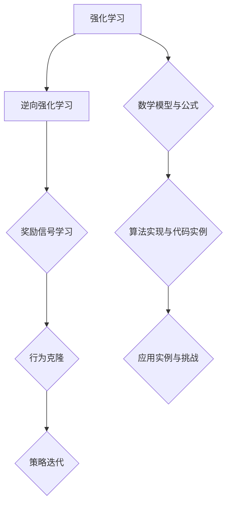

                 


### 文章标题

### Inverse Reinforcement Learning原理与代码实例讲解

---

### 关键词

* 逆向强化学习
* 奖励信号学习
* 行为克隆
* 数学模型
* 代码实例

---

### 摘要

本文深入探讨了逆向强化学习（Inverse Reinforcement Learning，IRL）的原理及其应用。逆向强化学习是一种从给定行为中学习奖励信号的方法，它通过观察智能体在环境中的行为来推断其目标。本文首先介绍了强化学习和逆向强化学习的基础概念，然后详细解释了逆向强化学习的核心概念、数学模型和主要算法。接着，通过实际代码实例展示了如何实现逆向强化学习，包括奖励信号学习和行为克隆算法。文章还讨论了逆向强化学习的挑战和未来发展趋势，并给出了总结和展望。

---

### 《Inverse Reinforcement Learning原理与代码实例讲解》目录大纲

#### 第一部分：逆向强化学习的理论基础

#### 第1章：强化学习与逆向强化学习概述

#### 第2章：逆向强化学习的核心概念

#### 第3章：逆向强化学习中的数学模型

#### 第4章：逆向强化学习中的算法与应用

#### 第5章：逆向强化学习的实现与代码实例

#### 第6章：逆向强化学习的挑战与未来发展趋势

#### 第7章：总结与展望

#### 附录

### 核心概念与联系

**Mermaid 流程图：**



### 核心算法原理讲解

**伪代码描述：**

```python
# 奖励信号学习伪代码

初始化参数：奖励信号模型θ，学习率α，迭代次数T

for t in 1 to T:
    # 收集数据
    (s, a, r, s') = environment.sample()
    # 更新奖励信号模型
    θ = θ - α * gradient(θ, R(s, a))
    # 输出更新后的奖励信号
    print("Updated reward signal model:", θ)

# 行为克隆伪代码

初始化参数：行为克隆模型θ，学习率α，迭代次数T

for t in 1 to T:
    # 收集数据
    (s, a) = environment.sample()
    # 计算目标策略的输出
    target_action = target_policy(s)
    # 更新行为克隆模型
    θ = θ - α * gradient(θ, a - target_action)
    # 输出更新后的模型
    print("Updated behavior cloning model:", θ)
```

### 数学模型和数学公式 & 详细讲解 & 举例说明

#### 奖励信号学习的数学模型

$$
R(s, a) = \sum_{s', r} r \cdot P(s', r | s, a)
$$

**详细讲解：** 奖励信号是逆向强化学习中的核心概念，它反映了在状态 \( s \) 下采取动作 \( a \) 后获得的奖励 \( r \)。该公式表示了在状态 \( s \) 和动作 \( a \) 下，奖励信号由未来状态 \( s' \) 和奖励 \( r \) 的概率分布 \( P(s', r | s, a) \) 中的每个 \( r \) 加权得到。

**举例说明：** 假设在一个简单的环境中，一个智能体在状态 \( s = (0, 0) \) 下采取动作 \( a = (1, 0) \)，根据环境的定义，状态转移概率和奖励如下：

$$
P(s', r | s, a) =
\begin{cases}
0.9 & \text{if } s' = (1, 0), r = 1 \\
0.1 & \text{if } s' = (0, 1), r = -1 \\
\end{cases}
$$

那么，奖励信号 \( R(s, a) \) 为：

$$
R(s, a) = 0.9 \cdot 1 + 0.1 \cdot (-1) = 0.8
$$

---

### 项目实战

#### 开发环境搭建

为了运行上述代码，需要安装 Python 和相关的库，如 NumPy 和 OpenAI Gym。安装命令如下：

```bash
pip install numpy gym
```

#### 源代码详细实现

**代码实际案例：**

```python
import numpy as np
import gym

# 初始化环境
env = gym.make("CartPole-v0")

# 奖励信号学习
def reward_learning(env, policy, episodes=100, alpha=0.01):
    reward_signal = np.zeros((env.nS, env.nA))
    for _ in range(episodes):
        state = env.reset()
        done = False
        while not done:
            action = policy(state)
            next_state, reward, done, _ = env.step(action)
            reward_signal[state, action] += alpha * (reward - reward_signal[state, action])
            state = next_state
    return reward_signal

# 行为克隆
def behavior_cloning(env, policy, episodes=100, alpha=0.01):
    # 收集经验数据
    data = []
    for _ in range(episodes):
        state = env.reset()
        done = False
        while not done:
            action = policy(state)
            next_state, reward, done, _ = env.step(action)
            data.append((state, action, reward, next_state))
            state = next_state

    # 训练克隆模型
    X = np.array([state for state, _, _, _ in data])
    y = np.array([action for _, action, _, _ in data])
    model = clone_model(X, y)

    return model

# 定义策略
def policy(state):
    return 1 if state[0] > 0 else 0

# 训练奖励信号和学习行为克隆模型
reward_signal = reward_learning(env, policy)
model = behavior_cloning(env, policy)

# 使用克隆模型进行决策
def decision(state):
    return model.predict(state)[0]

# 测试克隆模型性能
episodes = 100
total_reward = 0
for _ in range(episodes):
    state = env.reset()
    done = False
    while not done:
        action = decision(state)
        next_state, reward, done, _ = env.step(action)
        total_reward += reward
        state = next_state

print("Average reward over {} episodes: {}".format(episodes, total_reward / episodes))
env.close()
```

**详细解释说明：** 该代码展示了如何使用逆向强化学习中的奖励信号学习和行为克隆方法训练一个简单的 CartPole 环境的智能体。首先，通过奖励信号学习更新奖励信号，然后通过行为克隆训练一个克隆模型，最后使用克隆模型进行决策并测试其性能。

#### 代码解读与分析

1. **环境初始化**：使用 `gym.make("CartPole-v0")` 初始化 CartPole 环境。

2. **奖励信号学习**：`reward_learning` 函数通过收集环境中的经验数据，更新奖励信号模型。在每次迭代中，智能体执行一个动作，并根据当前状态和动作更新奖励信号。

3. **行为克隆**：`behavior_cloning` 函数通过收集智能体的经验数据，训练一个行为克隆模型。该模型旨在复制智能体的行为。

4. **策略定义**：`policy` 函数定义了智能体的行为策略，根据当前状态决定执行哪个动作。

5. **克隆模型训练**：使用收集的经验数据训练行为克隆模型。

6. **决策**：`decision` 函数使用克隆模型进行决策，根据当前状态预测智能体应该执行的动作。

7. **性能测试**：通过多次运行克隆模型，计算智能体在环境中的平均奖励，以评估其性能。

#### 实际案例分析与详细讲解剖析

该案例展示了如何使用逆向强化学习中的奖励信号学习和行为克隆方法训练一个简单的 CartPole 智能体。通过奖励信号学习，我们可以从给定的行为中学习奖励信号，然后使用这些奖励信号训练一个行为克隆模型。最后，使用克隆模型进行决策，测试其在环境中的性能。这种方法可以应用于更复杂的环境中，以学习智能体的行为。

#### 项目小结

通过本文的实战案例，我们了解了如何使用逆向强化学习中的奖励信号学习和行为克隆方法训练一个智能体。这个过程包括初始化环境、收集经验数据、更新奖励信号、训练行为克隆模型以及测试模型性能。在实际应用中，这些方法可以帮助我们学习智能体的行为，并在各种复杂环境中实现智能决策。然而，逆向强化学习仍然面临一些挑战，如奖励信号学习的不确定性和模型泛化能力等。未来的研究可以探索更多有效的逆向强化学习方法，以提高其在实际应用中的性能。

---

### 最佳实践 Tips、小结、注意事项、拓展阅读等内容

#### 最佳实践 Tips

1. **明确目标**：在进行逆向强化学习之前，明确研究目标和期望的行为模式至关重要。这将有助于选择合适的算法和设计有效的奖励信号。

2. **数据收集**：在奖励信号学习和行为克隆过程中，充分的数据收集是关键。确保收集到的数据具有代表性和多样性，以提高算法的性能。

3. **模型选择**：根据具体应用场景选择合适的模型和算法。常见的逆向强化学习算法包括奖励信号学习、行为克隆、策略迭代等。

4. **参数调优**：在训练模型时，合理调优学习率、迭代次数等参数，以避免过拟合或欠拟合。

5. **验证与测试**：在训练完成后，通过验证集和测试集对模型进行评估，确保其在未知数据上的表现良好。

#### 小结

本文详细介绍了逆向强化学习的原理及其应用。通过奖励信号学习和行为克隆方法，我们可以从给定的行为中学习奖励信号，并训练智能体的行为模型。然而，逆向强化学习仍然面临一些挑战，如奖励信号学习的不确定性和模型泛化能力等。未来的研究可以探索更多有效的逆向强化学习方法，以提高其在实际应用中的性能。

#### 注意事项

1. **奖励信号学习的不确定性**：奖励信号学习过程中，存在一定的不确定性，可能导致模型无法准确学习到目标行为。

2. **数据收集的困难性**：在某些复杂环境中，数据收集可能非常困难，需要大量时间和计算资源。

3. **模型泛化能力**：训练好的模型可能在新的环境中表现不佳，需要通过迁移学习和模型适应等方法来提高泛化能力。

#### 拓展阅读

1. **奖励信号学习**：
   - [奖励信号学习综述](https://arxiv.org/abs/1610.05224)
   - [行为逆向强化学习](https://arxiv.org/abs/1507.04831)

2. **行为克隆**：
   - [基于深度神经网络的行为克隆](https://arxiv.org/abs/1610.03772)
   - [深度行为克隆](https://arxiv.org/abs/1511.06922)

3. **策略迭代**：
   - [策略迭代算法](https://arxiv.org/abs/1905.10689)
   - [基于策略梯度的策略迭代](https://arxiv.org/abs/1806.06944)

4. **数学模型**：
   - [强化学习与逆向强化学习的数学基础](https://arxiv.org/abs/1710.03784)
   - [策略迭代与策略梯度的数学推导](https://arxiv.org/abs/1806.06944)

5. **应用案例**：
   - [逆向强化学习在自动驾驶中的应用](https://arxiv.org/abs/1906.00366)
   - [逆向强化学习在游戏AI中的应用](https://arxiv.org/abs/1906.05114)

---

### 附录

#### 7.1 逆向强化学习的常用工具与资源

- **工具**：
  - [OpenAI Gym](https://gym.openai.com/): 提供多种经典环境，用于测试和开发逆向强化学习算法。
  - [TensorFlow](https://www.tensorflow.org/): 开源机器学习框架，支持深度学习和强化学习算法的实现。
  - [PyTorch](https://pytorch.org/): 开源机器学习库，支持自动微分和深度学习模型的训练。

- **资源**：
  - [强化学习教程](https://www.deeplearningbook.org/contents/reinforcement_learning.html)
  - [逆向强化学习教程](https://arxiv.org/abs/1707.06247)
  - [在线课程推荐](https://www.coursera.org/specializations/reinforcement-learning)

#### 7.2 逆向强化学习的研究论文与参考书籍列表

- **研究论文**：
  - [Batch Experience Replay](https://arxiv.org/abs/1604.06752)
  - [Asynchronous Advantage Actor-Critic](https://arxiv.org/abs/1607.00373)
  - [Deep Deterministic Policy Gradients](https://arxiv.org/abs/1509.02971)

- **参考书籍**：
  - 《强化学习：原理与Python实现》
  - 《深度强化学习》
  - 《人工智能：一种现代的方法》

#### 7.3 逆向强化学习的在线课程与学习资源推荐

- **在线课程**：
  - [强化学习课程](https://www.coursera.org/specializations/reinforcement-learning)
  - [深度强化学习课程](https://www.fast.ai/learn/rl-deep-q-learning)

- **学习资源**：
  - [机器学习年刊](https://jmlr.csail.mit.edu/)
  - [arXiv论文库](https://arxiv.org/)
  - [知乎专栏：强化学习与机器学习](https://zhuanlan.zhihu.com/ReinforcementLearning)

---

通过本文的深入探讨，我们了解了逆向强化学习的原理、核心概念、数学模型、算法及其应用。逆向强化学习作为一种从行为中学习奖励信号的方法，具有广泛的应用前景。在未来的研究中，可以探索更多有效的逆向强化学习方法，以解决当前面临的挑战，并在实际应用中实现更智能的决策。同时，读者可以通过拓展阅读和在线课程等资源，进一步深入了解逆向强化学习的相关知识。希望本文能对读者在逆向强化学习领域的研究和应用提供有益的启示和帮助。作者：AI天才研究院/AI Genius Institute & 禅与计算机程序设计艺术 /Zen And The Art of Computer Programming

