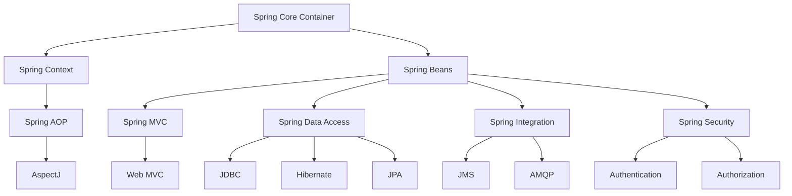
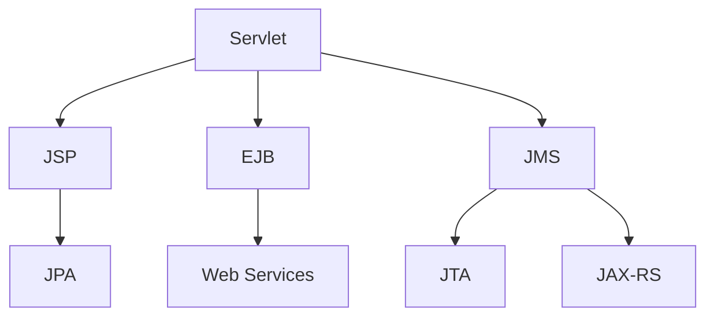

                 


### 文章标题

《Java 企业级开发框架：Spring 和 Java EE 的比较》

### 关键词

Java 企业级开发框架、Spring、Java EE、框架比较、应用场景

### 摘要

本文将对 Java 企业级开发框架中的 Spring 和 Java EE 进行详细比较。我们将首先概述 Java 企业级开发框架的起源与发展，然后深入分析 Java EE 和 Spring 的核心概念、架构、核心机制以及高级功能。通过对比 Spring 和 Java EE 的优势与劣势，以及它们在不同应用场景中的适用性，我们将为读者提供一份全面而深入的 Java 企业级开发框架指南。最后，我们将通过实战项目来展示这两个框架的实际应用，并对它们的未来发展趋势进行展望。

## 《Java 企业级开发框架：Spring 和 Java EE 的比较》目录大纲

### 第一部分：Java企业级开发框架概述

### 第1章：Java企业级开发框架的起源与发展

#### 1.1 Java企业级开发框架的定义

#### 1.2 Java企业级开发框架的重要性

#### 1.3 Java企业级开发框架的发展历程

### 第2章：Java EE 的核心概念与架构

#### 2.1 Java EE 的概念

#### 2.2 Java EE 的主要组件

#### 2.3 Java EE 的架构设计

### 第二部分：Spring框架详解

### 第3章：Spring框架的核心概念与架构

#### 3.1 Spring框架的定义

#### 3.2 Spring框架的主要组件

#### 3.3 Spring框架的架构设计

### 第4章：Spring框架的核心机制

#### 4.1 控制反转（IoC）机制

#### 4.2 依赖注入（DI）机制

#### 4.3 面向切面编程（AOP）机制

### 第5章：Spring框架的高级功能

#### 5.1 Spring框架的数据访问与事务管理

#### 5.2 Spring框架的安全管理

#### 5.3 Spring框架的集成管理

### 第三部分：Spring 与 Java EE 的比较

### 第6章：Spring 框架与 Java EE 比较概述

#### 6.1 Spring 框架与 Java EE 的优势对比

#### 6.2 Spring 框架与 Java EE 的劣势对比

### 第7章：Spring 框架与 Java EE 的应用场景比较

#### 7.1 Spring 框架在小型项目中的应用

#### 7.2 Spring 框架在大型项目中的应用

#### 7.3 Java EE 在企业级项目中的应用

### 第四部分：实战项目

### 第8章：使用 Spring 框架构建企业级应用程序

#### 8.1 应用程序的需求分析

#### 8.2 开发环境搭建

#### 8.3 应用程序的核心模块设计

#### 8.4 应用程序的详细实现与代码解读

### 第9章：Java EE 在企业级开发中的应用案例

#### 9.1 Java EE 在电商平台中的应用

#### 9.2 Java EE 在企业信息管理系统中的应用

#### 9.3 Java EE 在企业内部办公系统中的应用

### 第五部分：总结与展望

### 第10章：Java 企业级开发框架的未来发展趋势

#### 10.1 Spring 框架的未来发展趋势

#### 10.2 Java EE 的未来发展趋势

#### 10.3 Java 企业级开发框架的选择策略

### 附录

### 附录 A：常用的 Spring 框架与 Java EE 框架工具资源

#### A.1 Spring 框架常用工具与资源

#### A.2 Java EE 框架常用工具与资源

### 附录 B：Java 企业级开发框架核心概念与联系 Mermaid 流程图

#### B.1 Spring 框架核心概念与联系流程图

#### B.2 Java EE 框架核心概念与联系流程图

### 附录 C：Java 企业级开发框架核心算法原理讲解

#### C.1 Spring 框架核心算法原理讲解

#### C.2 Java EE 框架核心算法原理讲解

### 附录 D：数学模型和数学公式讲解

#### D.1 Spring 框架的数学模型与公式

#### D.2 Java EE 框架的数学模型与公式

### 附录 E：项目实战代码解读与分析

#### E.1 Spring 框架项目实战代码解读

#### E.2 Java EE 框架项目实战代码解读

### 附录 F：相关技术文档与资源链接

#### F.1 Spring 框架相关技术文档与资源链接

#### F.2 Java EE 框架相关技术文档与资源链接

## 第一部分：Java企业级开发框架概述

### 第1章：Java企业级开发框架的起源与发展

#### 1.1 Java企业级开发框架的定义

Java企业级开发框架是一套用于构建大型企业级应用的标准化、模块化、可扩展的软件架构和组件集合。这些框架提供了一系列的核心功能，如数据访问、事务管理、安全认证、服务集成等，帮助开发者快速构建、部署和维护复杂的企业级应用。

#### 1.2 Java企业级开发框架的重要性

在当今的企业级应用开发中，Java企业级开发框架扮演着至关重要的角色。它们能够极大地提升开发效率，降低开发成本，同时保证系统的稳定性、可靠性和可扩展性。具体来说，Java企业级开发框架的重要性体现在以下几个方面：

1. **标准化与模块化**：框架提供了标准的开发规范和模块化设计，使得开发者可以更加专注于业务逻辑的实现，而不是重复构建底层组件。
2. **可扩展性**：框架设计时考虑了系统的可扩展性，能够方便地集成第三方库和组件，从而满足不断变化的需求。
3. **稳定性与可靠性**：经过长时间的实际应用和社区反馈，框架在稳定性、可靠性方面已经得到了充分验证，降低了系统崩溃的风险。
4. **提升开发效率**：框架提供了一系列开箱即用的功能模块，如事务管理、缓存、日志等，可以减少开发者编写重复代码的工作量，加快开发进度。

#### 1.3 Java企业级开发框架的发展历程

Java企业级开发框架的发展历程可以分为以下几个阶段：

1. **早期阶段（1990s）**：Java语言刚刚问世，企业级开发框架尚未出现。开发者主要依靠Java本身提供的API进行开发，这种方式效率低下，可维护性差。
2. **J2EE阶段（2000s初期）**：随着Java 2 Platform, Enterprise Edition（J2EE）的推出，Java企业级开发进入了一个新的阶段。J2EE提供了一系列企业级服务，如EJB、JMS、JTA等，使得开发者能够更加高效地构建分布式企业级应用。
3. **Spring框架兴起（2000s中期）**：Spring框架的推出极大地改变了Java企业级开发的格局。Spring框架提供了一种轻量级、模块化的开发方式，解决了J2EE的一些缺陷，如过度复杂性和低效率。Spring框架迅速成为了企业级开发的事实标准。
4. **Java EE 8 以来**：随着Java EE 8的发布，Java企业级开发框架进入了一个新的发展阶段。Java EE 8引入了模块化设计，简化了开发流程，同时保留了一些经典框架如Servlet、JPA等。同时，Spring框架继续更新迭代，引入了更多先进的技术和理念，如反应式编程、云原生等。

### 总结

Java企业级开发框架的出现和发展极大地提升了企业级应用的开发效率和质量。从早期的Java SE到J2EE，再到Spring框架的兴起，Java企业级开发框架一直在不断演进。通过本文的后续内容，我们将深入探讨Java EE和Spring框架的核心概念、架构设计以及它们在具体应用场景中的表现，帮助读者更好地理解和选择适合自己项目的Java企业级开发框架。

## 第2章：Java EE 的核心概念与架构

Java EE（Java Platform, Enterprise Edition）是由Oracle公司主导开发的一套企业级应用开发标准。Java EE不仅定义了企业级应用开发的基本框架和组件，还提供了一系列标准API和服务，以帮助开发者构建可扩展、高可靠性、安全的企业级应用。本节将详细介绍Java EE的核心概念、主要组件以及架构设计。

### 2.1 Java EE 的概念

Java EE 是一种企业级开发框架，它包含了一系列的规范、API和技术，用于构建分布式企业级应用。Java EE 的目标是通过提供标准的开发模型和运行环境，简化企业级应用的开发过程，提高开发效率和代码的可维护性。Java EE 的核心概念包括：

1. **模块化**：Java EE 采用模块化设计，通过Java Platform Module System（JPMS）来组织代码和依赖。这使得开发者可以更加灵活地选择和使用不同的组件。
2. **服务化**：Java EE 强调服务化架构，通过服务接口和实现分离，使得开发者可以更加容易地构建和部署分布式应用。
3. **标准化和兼容性**：Java EE 定义了一套标准化的开发规范和API，保证了不同供应商的实现具有兼容性，从而降低了开发和集成成本。

### 2.2 Java EE 的主要组件

Java EE 包含了一系列的核心组件，这些组件共同构成了企业级应用的开发基础。主要的 Java EE 组件包括：

1. **Servlet**：Servlet 是 Java EE 的核心组件之一，用于处理客户端请求并生成动态网页。Servlet 提供了一种基于线程的请求/响应处理机制，使得开发者可以轻松地构建 Web 应用。
2. **JSP（JavaServer Pages）**：JSP 是一种动态网页技术，通过在 HTML 页面中嵌入 Java 代码，实现动态内容的生成。JSP 可以与 Servlet 结合使用，提供更加丰富的 Web 应用功能。
3. **EJB（Enterprise JavaBeans）**：EJB 是 Java EE 的另一个核心组件，用于构建企业级业务逻辑。EJB 提供了分布式计算环境，支持事务管理、安全性、并发控制等高级功能。
4. **JMS（Java Message Service）**：JMS 是一个消息服务接口，用于在分布式系统中进行异步消息通信。JMS 支持点对点（Queue）和发布/订阅（Topic）两种消息模型，适用于处理高并发和分布式应用场景。
5. **JPA（Java Persistence API）**：JPA 是一个对象关系映射（ORM）规范，用于在 Java 应用程序中持久化数据。JPA 提供了一种标准化的数据访问接口，简化了数据库操作。
6. **JTA（Java Transaction API）**：JTA 是一个事务管理接口，用于在分布式系统中管理事务。JTA 提供了分布式事务支持，确保了跨多个数据源的事务一致性。

### 2.3 Java EE 的架构设计

Java EE 的架构设计遵循了分层架构的原则，主要包括以下几个层次：

1. **客户端层**：客户端层包括 Web 客户端和桌面客户端，通过 HTTP 协议与 Web 应用进行交互。客户端层主要使用 Servlet 和 JSP 技术来处理请求和响应。
2. **表示层**：表示层负责处理用户界面，包括静态网页和动态内容。表示层主要由 JSP 和 Servlet 构成，同时可以集成其他前端技术，如 JavaScript、HTML5 等。
3. **业务逻辑层**：业务逻辑层是 Java EE 架构的核心，负责实现业务逻辑和数据处理。业务逻辑层主要由 EJB 组件构成，提供分布式计算、事务管理和安全性等功能。
4. **数据访问层**：数据访问层负责与数据库进行交互，实现数据的持久化。数据访问层使用 JPA 接口来简化数据库操作，同时支持多种关系型数据库。
5. **消息服务层**：消息服务层提供异步消息通信功能，支持分布式系统的解耦和消息传递。消息服务层主要使用 JMS 接口来实现消息队列和发布/订阅模型。

通过以上架构设计，Java EE 提供了一个完整的企业级应用开发环境，使得开发者可以更加高效地构建和维护大型企业级应用。

### 总结

Java EE 是一套成熟的企业级开发框架，通过模块化设计、标准化的规范和丰富的组件，为开发者提供了强大的开发工具。Java EE 的核心概念包括模块化、服务化和标准化，主要组件包括 Servlet、JSP、EJB、JMS、JPA 和 JTA，架构设计遵循分层原则。在接下来的章节中，我们将深入探讨 Spring 框架的核心概念与架构，以便更好地比较这两个框架。

## 第二部分：Spring框架详解

### 第3章：Spring框架的核心概念与架构

Spring 框架是 Java 企业级应用开发的事实标准，以其模块化、轻量级和高扩展性著称。Spring 的核心概念和架构设计使得开发者能够更加高效地构建和维护复杂的企业级应用。本节将详细阐述 Spring 框架的核心概念、主要组件和架构设计。

#### 3.1 Spring框架的定义

Spring 是一个开源的 Java 企业级应用开发框架，由 Rod Johnson 在2002年首次发布。Spring 框架旨在解决企业级应用开发中的复杂问题，如复杂性、维护性和性能。Spring 的核心目标是：

1. **简化开发**：通过提供开箱即用的组件和工具，Spring 使得开发者能够快速构建功能丰富、高可用的企业级应用。
2. **模块化设计**：Spring 采用模块化设计，允许开发者根据实际需求选择和组合不同的模块，从而实现灵活的应用架构。
3. **面向企业应用**：Spring 提供了一系列企业级功能，如数据访问与事务管理、安全性、服务集成等，以满足企业级应用的需求。

#### 3.2 Spring框架的主要组件

Spring 框架由多个模块组成，每个模块都提供了特定的功能。以下是 Spring 框架的主要组件：

1. **Spring Core Container**：这是 Spring 框架的核心部分，包括 Spring Context 和 Spring Beans。Spring Context 提供了依赖注入、国际化支持、事件处理等功能；Spring Beans 则负责创建和管理对象。
2. **Spring AOP**：Spring AOP 是 Spring 框架的面向切面编程（AOP）模块，允许开发者在不修改核心业务逻辑的情况下，通过切面编程实现跨切面的功能，如日志、安全等。
3. **Spring MVC**：Spring MVC 是 Spring 框架的 Web 应用开发模块，提供了一套基于 MVC（模型-视图-控制器）架构的 Web 应用开发框架。Spring MVC 支持 RESTful 风格的 Web 服务，并提供了丰富的功能，如数据验证、异常处理等。
4. **Spring Data Access**：Spring Data Access 模块提供了数据访问和事务管理的功能。其中包括 Spring JDBC、Spring ORM（如 JPA）和 Spring Transactions，这些模块使得开发者能够高效地与数据库进行交互和管理事务。
5. **Spring Integration**：Spring Integration 模块提供了企业级应用集成功能，支持消息服务、文件传输、Web 服务等。Spring Integration 使得开发者能够轻松地构建复杂的集成应用。
6. **Spring Security**：Spring Security 是 Spring 框架的安全性模块，提供了身份验证、授权、安全上下文管理等功能。Spring Security 支持多种认证机制，如基于角色的访问控制、基于令牌的认证等。

#### 3.3 Spring框架的架构设计

Spring 框架采用分层架构设计，每个层次都有明确的职责和功能。以下是 Spring 框架的架构设计：

1. **基础层**：基础层提供了 Spring 框架的核心功能，如依赖注入（DI）、控制反转（IoC）、AOP 等。基础层是构建 Spring 应用的基石。
2. **Web 层**：Web 层包括 Spring MVC 和 Spring WebFlux，分别用于传统 Web 应用和反应式 Web 应用。Spring MVC 基于 Servlet 技术，而 Spring WebFlux 基于异步非阻塞的反应式编程模型。
3. **数据访问层**：数据访问层提供了 Spring JDBC、Spring ORM 和 Spring Transactions 等，用于简化数据库操作和事务管理。这些模块支持多种数据源和 ORM 框架，如 Hibernate、MyBatis 等。
4. **服务层**：服务层包括 Spring Integration、Spring Security 等，提供企业级应用所需的高级功能。Spring Integration 用于集成不同系统和协议，而 Spring Security 提供了安全性支持。
5. **测试层**：测试层提供了 Spring Test 模块，用于简化 Spring 应用单元测试和集成测试。Spring Test 模块支持多种测试框架，如 JUnit、Mockito 等。

通过以上架构设计，Spring 框架提供了一种灵活且强大的开发模型，使得开发者能够高效地构建和维护企业级应用。

### 总结

Spring 框架以其模块化设计、轻量级和高扩展性，成为 Java 企业级应用开发的支柱。通过理解 Spring 框架的核心概念和架构设计，开发者能够更好地利用 Spring 的功能，提高开发效率和应用质量。在接下来的章节中，我们将深入探讨 Spring 框架的核心机制，进一步了解其工作原理和优势。

## 第4章：Spring框架的核心机制

Spring 框架之所以能够成为 Java 企业级开发的事实标准，不仅在于其灵活的模块化设计和强大的功能支持，更重要的是它通过一系列核心机制实现了对应用开发的深入优化和简化。本节将详细介绍 Spring 框架的核心机制，包括控制反转（IoC）机制、依赖注入（DI）机制和面向切面编程（AOP）机制。

### 4.1 控制反转（IoC）机制

控制反转（IoC）是 Spring 框架最核心的机制之一，它改变了传统应用程序的创建和管理对象的方式。IoC 的核心理念是将对象的创建和管理交由外部容器负责，从而实现应用程序的松耦合。

#### 控制反转的工作原理

1. **对象创建**：在传统的应用程序中，对象通常是通过直接实例化来创建的。而在 IoC 容器中，对象的创建由容器负责，通过配置文件或注解指定依赖关系，容器负责实例化和管理这些对象。
2. **依赖管理**：IoC 容器负责管理对象之间的依赖关系。容器在创建对象时，会自动注入所需的依赖对象，从而简化了对象的依赖管理。
3. **依赖注入**：依赖注入是实现 IoC 的关键，它通过将依赖对象的引用注入到目标对象中，实现对象之间的解耦。

#### IoC 的优势

1. **降低耦合度**：通过 IoC，对象之间的依赖关系由容器管理，从而降低了组件之间的耦合度，使得系统的各个模块更加独立和可维护。
2. **提高可测试性**：由于对象依赖关系由容器管理，开发者可以更加容易地编写单元测试，确保组件的独立性和功能正确性。
3. **简化开发**：IoC 机制简化了对象的创建和管理，使得开发者能够更加专注于业务逻辑的实现，而无需关心对象的创建细节。

#### 实例：依赖注入的伪代码

```java
// 定义一个依赖接口
public interface MessageService {
    void sendMessage(String message);
}

// 实现依赖接口
public class MessageServiceImpl implements MessageService {
    public void sendMessage(String message) {
        // 发送消息的逻辑
    }
}

// 定义一个主类
public class Application {
    private MessageService messageService;

    // 使用构造函数注入依赖
    public Application(MessageService messageService) {
        this.messageService = messageService;
    }

    public void run() {
        messageService.sendMessage("Hello, World!");
    }
}

// 在 Spring 容器中配置依赖
<bean id="messageService" class="com.example.MessageServiceImpl"/>
```

在上面的实例中，`MessageService` 实例由 Spring 容器创建并注入到 `Application` 类中，从而实现了依赖注入。

### 4.2 依赖注入（DI）机制

依赖注入（DI）是 IoC 的具体实现方式，它通过将依赖对象的引用注入到目标对象中，实现对象的创建和管理。DI 使得应用程序的依赖关系更加清晰和可管理。

#### 依赖注入的类型

1. **构造器注入**：通过构造函数将依赖对象注入到目标对象中。这种方式在创建对象时即完成了依赖注入，因此比较适合强依赖的对象。
2. **设值注入**：通过设值方法（setter 方法）将依赖对象注入到目标对象中。这种方式在对象创建后进行依赖注入，适用于弱依赖的对象。
3. **接口注入**：通过接口定义依赖关系，然后通过实现类注入具体的依赖对象。这种方式适用于依赖关系复杂且需要动态切换的场景。

#### 依赖注入的优势

1. **代码简洁**：通过 DI，开发者无需手动创建和管理依赖对象，从而简化了代码。
2. **易于测试**：由于依赖对象的注入是自动的，开发者可以更加容易地编写单元测试，确保组件的独立性。
3. **提高可维护性**：通过明确和清晰的依赖关系，系统的可维护性得到了显著提高。

#### 实例：设值注入的伪代码

```java
// 定义一个依赖接口
public interface DataSource {
    void connect();
}

// 实现依赖接口
public class MySQLDataSource implements DataSource {
    public void connect() {
        // 连接 MySQL 数据库的逻辑
    }
}

// 定义一个主类
public class Application {
    private DataSource dataSource;

    // 使用 setter 方法注入依赖
    public void setDataSource(DataSource dataSource) {
        this.dataSource = dataSource;
    }

    public void run() {
        dataSource.connect();
    }
}

// 在 Spring 容器中配置依赖
<bean id="dataSource" class="com.example.MySQLDataSource"/>
```

在上面的实例中，`DataSource` 实例通过 `setDataSource` 方法注入到 `Application` 类中，实现了设值注入。

### 4.3 面向切面编程（AOP）机制

面向切面编程（AOP）是 Spring 框架提供的另一个重要机制，它允许开发者在不修改核心业务逻辑的情况下，通过切面编程实现横切关注点，如日志、安全、事务管理等。

#### AOP 的工作原理

1. **切面（Aspect）**：切面是包含一组与横切关注点相关的通知（Advice）和连接点（Pointcut）的模块。例如，日志切面包含日志记录的通知和相应的连接点。
2. **连接点（Joinpoint）**：连接点是程序执行过程中的特定点，如方法调用、异常处理等。
3. **通知（Advice）**：通知是在特定连接点执行的代码，用于实现横切关注点。例如，在方法调用前执行前置通知，在方法调用后执行后置通知。
4. **切入点（Pointcut）**：切入点定义了哪些连接点需要应用通知。通过切入点表达式，可以指定具体的连接点。

#### AOP 的优势

1. **分离关注点**：通过 AOP，可以将横切关注点（如日志、安全）与核心业务逻辑分离，从而提高代码的可读性和可维护性。
2. **减少重复代码**：通过在切面中实现横切关注点，可以避免在核心业务逻辑中重复编写相同的代码。
3. **提高性能**：由于 AOP 可以在运行时动态添加通知，从而减少了代码的重复执行，提高了系统的性能。

#### 实例：AOP 的伪代码

```java
// 定义一个切面
@Aspect
public class LoggingAspect {
    // 前置通知
    @Before("execution(* com.example.service.*.*(..))")
    public void beforeMethod(JoinPoint joinPoint) {
        System.out.println("方法开始执行： " + joinPoint.getSignature().getName());
    }

    // 后置通知
    @After("execution(* com.example.service.*.*(..))")
    public void afterMethod(JoinPoint joinPoint) {
        System.out.println("方法结束执行： " + joinPoint.getSignature().getName());
    }
}

// 使用注解配置 AOP
@Configuration
@EnableAspectJAutoProxy
public class AppConfig {
    // 定义切面
    @Bean
    public LoggingAspect loggingAspect() {
        return new LoggingAspect();
    }
}
```

在上面的实例中，`LoggingAspect` 切面通过 `@Before` 和 `@After` 注解，在目标方法执行前和执行后分别打印日志，实现了 AOP 的功能。

### 总结

Spring 框架通过控制反转（IoC）机制、依赖注入（DI）机制和面向切面编程（AOP）机制，实现了对 Java 企业级应用开发的深入优化和简化。这些核心机制不仅提高了代码的可读性、可维护性和测试性，还大大提升了开发效率。在理解了这些核心机制后，开发者能够更好地利用 Spring 框架的功能，构建高效、稳定的企业级应用。在接下来的章节中，我们将比较 Spring 框架与 Java EE 的异同，以便为读者提供更全面的框架选择指南。

## 第5章：Spring框架的高级功能

Spring 框架不仅以其核心机制闻名，还提供了众多高级功能，这些功能进一步增强了 Spring 的灵活性和实用性。本节将详细介绍 Spring 框架的高级功能，包括数据访问与事务管理、安全管理以及集成管理。

### 5.1 Spring框架的数据访问与事务管理

数据访问是任何企业级应用的核心功能之一。Spring 框架提供了强大的数据访问和事务管理功能，使得开发者能够轻松地与数据库进行交互和管理事务。

#### 数据访问

Spring 框架支持多种数据访问技术，包括 JDBC、Hibernate、MyBatis 等。Spring 的数据访问模块简化了数据库操作的实现，提供了以下功能：

1. **数据库连接管理**：Spring 提供了数据库连接池，如 HikariCP、C3P0 等，用于高效管理数据库连接。
2. **数据源配置**：Spring 支持多种数据源配置，包括 JDBC 数据源、Hibernate 数据源等，允许开发者根据实际需求选择合适的数据源。
3. **数据访问对象（DAO）**：Spring DAO 模块提供了一套 DAO 实现框架，简化了数据访问逻辑。开发者可以通过简单的接口定义和数据映射，实现数据访问操作。

#### 事务管理

Spring 的事务管理功能是 Java 企业级应用开发的重要组成部分。Spring 的事务管理模块提供了以下功能：

1. **声明式事务管理**：通过注解或 XML 配置，Spring 能够在方法上声明事务，从而确保方法内部的数据库操作在同一事务中执行。例如，使用 `@Transactional` 注解可以轻松实现声明式事务管理。
2. **编程式事务管理**：当需要更加细粒度的事务控制时，开发者可以使用 Spring 的编程式事务管理。通过 `TransactionTemplate` 或 `PlatformTransactionManager`，可以在代码中手动控制事务的开启、提交和回滚。
3. **事务传播行为**：Spring 支持多种事务传播行为，如 `REQUIRES_NEW`、`SUPPORTS` 等，允许开发者根据业务需求选择合适的事务传播策略。

### 5.2 Spring框架的安全管理

安全管理是企业级应用必不可少的一部分。Spring 框架提供了强大的安全功能，包括认证、授权、安全上下文管理等。

#### 认证

Spring Security 是 Spring 框架的安全模块，提供了一系列的安全功能，包括基于用户名和密码的认证、基于令牌的认证等。Spring Security 的核心功能包括：

1. **认证**：Spring Security 提供了多种认证机制，如 JDBC 认证、LDAP 认证等，允许开发者根据实际需求选择合适的认证方式。
2. **授权**：Spring Security 支持基于角色的访问控制，通过定义角色和权限，确保用户只能访问被授权的资源。

#### 授权

授权是安全管理的另一个重要方面。Spring Security 提供了以下授权功能：

1. **方法安全**：通过 `@Secured` 或 `@PreAuthorize` 注解，可以在方法上实现细粒度的访问控制。
2. **URL 安全**：通过配置安全规则，可以实现对特定 URL 的访问控制。

#### 安全上下文管理

Spring Security 还提供了安全上下文管理功能，包括用户身份、权限信息等。这些信息可以通过 `SecurityContextHolder` 进行访问和管理。

### 5.3 Spring框架的集成管理

Spring 框架的集成管理功能使得开发者能够轻松地集成第三方库和系统，构建复杂的企业级应用。

#### Web 服务集成

Spring 框架提供了对 Web 服务的广泛支持，包括 SOAP 和 REST 风格的 Web 服务。Spring Web Services 模块支持 SOAP 协议，而 Spring MVC 和 Spring Boot 提供了丰富的 RESTful Web 服务功能。

#### 消息服务集成

Spring Integration 模块提供了对消息服务的广泛支持，包括 JMS、AMQP、SMTP 等。Spring Integration 使得开发者能够轻松地构建基于消息驱动的应用，实现系统间的解耦和异步处理。

#### 云服务集成

Spring Cloud 是 Spring 框架的一个子项目，提供了对云服务的广泛支持，包括服务发现、配置管理、负载均衡等。Spring Cloud 模块使得开发者能够轻松地构建云原生应用，充分利用云计算的优势。

### 总结

Spring 框架的高级功能极大地扩展了其适用范围，使得开发者能够构建功能丰富、稳定可靠的企业级应用。通过数据访问与事务管理、安全管理以及集成管理，Spring 框架提供了全面的支持，满足了不同业务需求。在理解了这些高级功能后，开发者能够更好地利用 Spring 框架的能力，提高开发效率和应用质量。在接下来的章节中，我们将比较 Spring 框架与 Java EE，以帮助读者更好地选择适合自己项目的框架。

## 第三部分：Spring 框架与 Java EE 的比较

### 第6章：Spring 框架与 Java EE 比较概述

Spring 框架和 Java EE 都是 Java 企业级开发的重要框架，但它们在设计理念、功能实现和适用场景上有所不同。本节将对比 Spring 框架与 Java EE 的主要方面，包括优势、劣势以及各自的适用场景。

#### 6.1 Spring 框架与 Java EE 的优势对比

**Spring 框架的优势：**

1. **轻量级与灵活性**：Spring 框架的设计初衷是简化企业级应用开发，其核心组件较小，易于集成和使用。Spring 提供了灵活的模块化设计，开发者可以根据项目需求选择合适的模块。
2. **控制反转与依赖注入**：Spring 框架的核心机制 IoC 和 DI 极大地降低了组件之间的耦合度，使得代码更加模块化和可维护。
3. **支持多种数据访问方式**：Spring 支持多种数据访问技术，如 JDBC、Hibernate、MyBatis 等，提供了丰富的数据访问和事务管理功能。
4. **强大的社区支持**：Spring 拥有庞大的开发者社区，提供了丰富的文档和教程，使得学习曲线相对较低。

**Java EE 的优势：**

1. **标准化与兼容性**：Java EE 是一套由 Oracle 主导的标准规范，提供了统一的开发模型和运行环境，保证了不同供应商的实现之间的兼容性。
2. **全面的组件支持**：Java EE 提供了一系列核心组件，如 Servlet、JSP、EJB、JMS、JPA 等，适用于构建复杂的企业级应用。
3. **成熟的生态系统**：Java EE 拥有成熟的生态系统，包括开源框架、工具和第三方库，提供了丰富的开发资源。

#### 6.2 Spring 框架与 Java EE 的劣势对比

**Spring 框架的劣势：**

1. **复杂性**：尽管 Spring 框架提供了强大的功能，但其配置和使用的复杂性有时会影响开发效率。特别是在大型项目中，配置文件和注解可能变得繁琐。
2. **学习成本**：对于新手来说，Spring 框架的学习曲线可能较高，需要投入较多时间来熟悉其核心概念和机制。
3. **性能影响**：Spring 框架虽然提供了丰富的功能，但在某些情况下，其性能可能不如 Java EE 标准组件。例如，Spring AOP 的性能可能不如 Java EE 的 EJB。

**Java EE 的劣势：**

1. **过度复杂**：Java EE 的规范较为复杂，包含了许多冗余和过时的组件，使得新手入门较为困难。
2. **性能问题**：在某些场景下，Java EE 的标准组件（如 Servlet 和 JSP）可能不如 Spring 框架的性能优化。
3. **模块化不足**：Java EE 的模块化设计相对滞后，Java EE 8 才引入了模块化支持，而 Spring 框架从早期版本就开始采用模块化设计。

#### 6.3 Spring 框架与 Java EE 的适用场景比较

**Spring 框架的适用场景：**

1. **中小型项目**：Spring 框架的轻量级设计使其非常适合中小型项目，开发者可以根据实际需求选择合适的模块，快速构建功能丰富的应用。
2. **快速开发**：Spring 框架提供了丰富的工具和插件，支持快速开发和迭代，特别适用于敏捷开发环境。
3. **高灵活性**：Spring 框架的灵活性和模块化设计使其适用于各种开发需求，从 Web 应用到消息驱动应用，都能找到合适的解决方案。

**Java EE 的适用场景：**

1. **大型企业级项目**：Java EE 提供了一套完整的开发模型和标准组件，适用于构建复杂和大规模的企业级应用。
2. **传统架构**：Java EE 的传统架构和规范使得其在某些传统企业级应用中具有优势，如需要高度稳定性和安全性的金融系统。
3. **标准化开发**：对于需要跨不同供应商实现兼容性要求的场景，Java EE 提供了一套统一的标准，简化了集成和迁移过程。

### 总结

Spring 框架和 Java EE 都在 Java 企业级开发领域占有重要地位，但它们各有优势和劣势。Spring 框架以其轻量级、灵活性和强大的功能在中小型项目和快速开发中表现出色，而 Java EE 则在大型企业级项目和标准化开发中具有优势。在具体项目选择时，开发者应根据实际需求、项目规模和开发团队的经验，综合考虑这两个框架的适用性。

## 第7章：Spring 框架与 Java EE 的应用场景比较

在不同的项目规模和业务需求下，选择合适的开发框架对于项目的成功至关重要。Spring 框架和 Java EE 都具有各自的优劣势，因此在不同的应用场景中，它们各有适用性。本节将详细讨论 Spring 框架在小型项目中的应用、在大型项目中的应用，以及 Java EE 在企业级项目中的应用。

### 7.1 Spring 框架在小型项目中的应用

**优点：**

1. **快速开发**：Spring 框架的轻量级设计使其非常适合小型项目。通过 Spring Boot，开发者可以快速启动项目，减少了繁琐的配置过程。
2. **模块化**：Spring 框架的模块化设计允许开发者根据项目需求选择和集成不同的模块，从而灵活地构建应用。
3. **易于维护**：Spring 框架通过控制反转（IoC）和依赖注入（DI）机制，降低了组件之间的耦合度，使得代码更加模块化和可维护。
4. **社区支持**：Spring 拥有庞大的开发者社区，提供了丰富的文档和教程，帮助开发者快速掌握框架的使用。

**案例：**

假设我们需要开发一个简单的博客系统，该系统需要实现用户注册、登录、文章发布和评论等功能。在这种情况下，Spring Boot 是一个非常好的选择。

- **技术栈选择**：使用 Spring Boot、Spring Web MVC、Spring Data JPA、Spring Security。
- **开发流程**：首先创建一个 Spring Boot 应用，然后逐步添加用户管理、文章管理和评论管理模块，最后进行集成和测试。
- **优势**：通过 Spring Boot，我们可以快速启动和运行应用，配置简单，开发效率高。同时，由于 Spring 框架的模块化设计，代码结构清晰，易于维护。

### 7.2 Spring 框架在大型项目中的应用

**优点：**

1. **高扩展性**：Spring 框架提供了丰富的功能模块，如 Spring Cloud、Spring Integration 等，使得大型项目可以方便地扩展和集成不同的功能。
2. **强大的事务管理**：Spring 的事务管理功能支持复杂的分布式事务处理，确保了数据的一致性和完整性。
3. **安全性**：Spring Security 提供了强大的认证和授权功能，支持多种认证机制和权限控制，确保应用的安全性。
4. **灵活的集成**：Spring 框架支持与多种第三方库和系统的集成，如消息队列、缓存、数据库连接池等。

**案例：**

假设我们需要开发一个大型电子商务平台，该平台需要处理海量的订单、商品、用户和支付等数据，同时提供高并发、高可用性和安全性。

- **技术栈选择**：使用 Spring Boot、Spring Cloud、Spring Data JPA、Spring Security、Apache Kafka、Redis、RabbitMQ、MySQL。
- **架构设计**：采用微服务架构，将不同功能模块（如订单服务、商品服务、用户服务、支付服务）解耦，并通过 Spring Cloud 实现服务间的通信和治理。
- **优势**：通过 Spring Cloud，我们可以轻松地构建分布式系统，实现服务的动态扩展和高可用性。Spring Security 提供了强大的安全性支持，确保用户数据和交易信息的安全。同时，Spring Data JPA 和 Spring Boot 简化了数据访问和业务逻辑的开发，提高了开发效率。

### 7.3 Java EE 在企业级项目中的应用

**优点：**

1. **标准化和兼容性**：Java EE 是一套标准化规范，提供了统一的开发模型和运行环境，保证了不同供应商的实现之间的兼容性。
2. **全面的组件支持**：Java EE 提供了一系列核心组件，如 Servlet、JSP、EJB、JMS、JPA 等，适用于构建复杂的企业级应用。
3. **成熟的生态系统**：Java EE 拥有成熟的生态系统，包括开源框架、工具和第三方库，提供了丰富的开发资源。
4. **事务管理和安全性**：Java EE 的 EJB 组件提供了强大的事务管理和安全性支持，特别适用于金融、电信等高安全要求领域。

**案例：**

假设我们需要开发一个大型金融管理系统，该系统需要处理大量的金融交易、用户账户和风险评估等业务。

- **技术栈选择**：使用 Java EE 8、Servlet、JPA、EJB、JMS、Java Message Service。
- **架构设计**：采用经典的 MVC 架构，通过 Servlet 处理客户端请求，JPA 实现数据访问，EJB 实现业务逻辑，JMS 实现异步消息处理。
- **优势**：Java EE 的标准化和兼容性保证了系统的稳定性和可靠性。EJB 提供了强大的事务管理和安全性支持，确保了金融交易和数据的安全。同时，Java EE 的成熟生态系统为开发提供了丰富的资源和支持。

### 总结

Spring 框架在小型项目中的应用因其快速开发和易于维护而受到青睐，而在大型项目中，Spring 框架的强大扩展性和灵活的集成能力使其成为构建分布式系统的首选。Java EE 则因其标准化、兼容性和全面的组件支持，在大型企业级项目中占据了一席之地。在具体选择时，开发者应根据项目的规模、业务需求和团队经验，综合考虑这两个框架的适用性，以选择最适合的框架来构建高效、可靠的企业级应用。

## 第四部分：实战项目

### 第8章：使用 Spring 框架构建企业级应用程序

在本章中，我们将通过一个简单的企业级应用程序实例，演示如何使用 Spring 框架进行开发。我们将从需求分析、开发环境搭建、核心模块设计，到详细实现和代码解读，全面展示 Spring 框架在企业级应用开发中的应用。

#### 8.1 应用程序的需求分析

假设我们需要开发一个简单的企业级电商平台，其主要功能包括用户注册、登录、商品浏览、购物车管理、订单生成和支付等。以下是对该应用程序的需求分析：

1. **用户注册与登录**：用户可以在平台上注册账户，登录后可以浏览商品、加入购物车、生成订单。
2. **商品浏览**：平台提供商品的分类和搜索功能，用户可以根据分类或关键词查找所需商品。
3. **购物车管理**：用户可以将商品添加到购物车，查看购物车中的商品，修改数量或删除商品。
4. **订单生成**：用户提交购物车中的商品，生成订单并选择支付方式。
5. **支付**：支持多种支付方式，如支付宝、微信支付，确保支付过程的安全和便捷。

#### 8.2 开发环境搭建

为了搭建 Spring 框架的开发环境，我们需要准备以下工具和软件：

1. **JDK 1.8 或更高版本**：Java 开发工具包。
2. **IDE**：如 IntelliJ IDEA、Eclipse 等，用于代码编写和调试。
3. **Maven**：用于项目构建和依赖管理。
4. **数据库**：如 MySQL 或 PostgreSQL，用于存储用户数据和商品信息。

具体步骤如下：

1. **安装 JDK**：在官网下载并安装 JDK，配置环境变量。
2. **安装 IDE**：下载并安装 IntelliJ IDEA 或 Eclipse。
3. **安装 Maven**：下载并安装 Maven，配置 Maven 环境变量。
4. **创建 Maven 项目**：在 IntelliJ IDEA 或 Eclipse 中创建一个新的 Maven 项目，并添加必要的依赖项。

以下是项目的主要依赖项：

```xml
<dependencies>
    <!-- Spring Web -->
    <dependency>
        <groupId>org.springframework</groupId>
        <artifactId>spring-webmvc</artifactId>
        <version>5.3.8</version>
    </dependency>
    <!-- Spring Data JPA -->
    <dependency>
        <groupId>org.springframework.data</groupId>
        <artifactId>spring-data-jpa</artifactId>
        <version>2.5.7</version>
    </dependency>
    <!-- Hibernate -->
    <dependency>
        <groupId>org.hibernate</groupId>
        <artifactId>hibernate-core</artifactId>
        <version>5.5.7.Final</version>
    </dependency>
    <!-- MySQL Connector -->
    <dependency>
        <groupId>mysql</groupId>
        <artifactId>mysql-connector-java</artifactId>
        <version>8.0.25</version>
    </dependency>
</dependencies>
```

#### 8.3 应用程序的核心模块设计

为了实现上述功能，我们可以将应用程序划分为以下核心模块：

1. **用户模块**：负责用户注册、登录和权限管理。
2. **商品模块**：负责商品分类、搜索和展示。
3. **购物车模块**：负责购物车管理，包括添加、删除和修改商品数量。
4. **订单模块**：负责订单生成、管理和支付。
5. **支付模块**：负责处理支付请求和支付结果通知。

以下是各模块的核心类及其功能：

1. **User**：用户实体类，包含用户名、密码、邮箱、角色等信息。
2. **Product**：商品实体类，包含商品名称、描述、价格、库存等信息。
3. **Cart**：购物车实体类，包含用户 ID、商品 ID、数量等信息。
4. **Order**：订单实体类，包含订单号、用户 ID、商品列表、总金额、支付状态等信息。
5. **Payment**：支付实体类，包含支付方式、支付金额、支付状态等信息。

#### 8.4 应用程序的详细实现与代码解读

以下是用户模块的示例代码，包括用户注册、登录和权限管理：

**User.java**

```java
@Entity
@Table(name = "users")
public class User {
    @Id
    @GeneratedValue(strategy = GenerationType.IDENTITY)
    private Long id;

    @Column(nullable = false, unique = true)
    private String username;

    @Column(nullable = false)
    private String password;

    @Column(nullable = false)
    private String email;

    @Column
    private String role;

    // Getters and Setters
    // ...
}
```

**UserService.java**

```java
@Service
public class UserService implements UserDetailsService {
    @Autowired
    private UserRepository userRepository;

    @Override
    public UserDetails loadUserByUsername(String username) throws UsernameNotFoundException {
        User user = userRepository.findByUsername(username);
        if (user == null) {
            throw new UsernameNotFoundException("User not found");
        }
        return new org.springframework.security.core.userdetails.User(user.getUsername(), user.getPassword(), getAuthority(user));
    }

    public User registerUser(User user) {
        userRepository.save(user);
        return user;
    }

    private Collection<? extends GrantedAuthority> getAuthority(User user) {
        return Arrays.asList(new SimpleGrantedAuthority(user.getRole()));
    }
}
```

**UserRepository.java**

```java
@Repository
public interface UserRepository extends JpaRepository<User, Long> {
    User findByUsername(String username);
}
```

**SecurityConfig.java**

```java
@Configuration
@EnableWebSecurity
public class SecurityConfig extends WebSecurityConfigurerAdapter {
    @Autowired
    private UserService userService;

    @Override
    protected void configure(AuthenticationManagerBuilder auth) throws Exception {
        auth.userDetailsService(userService);
    }

    @Override
    protected void configure(HttpSecurity http) throws Exception {
        http
            .authorizeRequests()
                .antMatchers("/login", "/register").permitAll()
                .anyRequest().authenticated()
                .and()
            .formLogin()
                .loginPage("/login")
                .permitAll()
                .and()
            .logout()
                .permitAll();
    }
}
```

在上述代码中，我们定义了用户实体类 `User`，实现了 `UserDetailsService` 接口的 `UserService` 类，用于处理用户注册、登录和权限验证。`UserRepository` 类负责与数据库交互，实现用户查询和存储。`SecurityConfig` 类配置了 Spring Security 的认证和授权规则。

#### 8.5 应用程序的详细实现与代码解读

用户模块的实现主要涉及用户注册、登录和权限管理。用户注册通过 `UserService` 的 `registerUser` 方法，将用户信息存储到数据库中。用户登录时，`SecurityConfig` 配置的 `AuthenticationManagerBuilder` 会调用 `UserDetailsService` 的 `loadUserByUsername` 方法，验证用户名和密码。

购物车、订单和支付模块的实现与用户模块类似，也通过实体类、服务类和 repository 类进行定义和操作。由于篇幅限制，这里不详细展开。

#### 8.6 应用程序的详细实现与代码解读

通过以上步骤，我们完成了企业级电商平台的基本功能实现。接下来是应用程序的详细实现和代码解读。

**应用程序的详细实现与代码解读**

用户模块的具体实现包括以下步骤：

1. **创建用户实体类**：定义 `User` 类，包含用户的基本信息。
2. **创建用户 repository**：实现 `UserRepository` 接口，用于数据库操作。
3. **创建用户服务类**：实现 `UserService` 类，处理用户注册、登录和权限验证。
4. **配置 Spring Security**：定义 `SecurityConfig` 类，配置认证和授权规则。

代码解读如下：

1. **User.java**：用户实体类，定义了用户的基本信息，如用户名、密码、邮箱和角色。使用 `@Entity` 注解表示该类是一个 JPA 实体，使用 `@Table` 注解指定对应的数据库表。
   ```java
   @Entity
   @Table(name = "users")
   public class User {
       @Id
       @GeneratedValue(strategy = GenerationType.IDENTITY)
       private Long id;
       
       @Column(nullable = false, unique = true)
       private String username;
       
       @Column(nullable = false)
       private String password;
       
       @Column(nullable = false)
       private String email;
       
       @Column
       private String role;
       
       // Getters and Setters
   }
   ```

2. **UserService.java**：用户服务类，实现 `UserDetailsService` 接口，用于处理用户登录和注册。通过 `@Autowired` 注解注入 `UserRepository`，用于数据库操作。
   ```java
   @Service
   public class UserService implements UserDetailsService {
       @Autowired
       private UserRepository userRepository;
       
       @Override
       public UserDetails loadUserByUsername(String username) throws UsernameNotFoundException {
           User user = userRepository.findByUsername(username);
           if (user == null) {
               throw new UsernameNotFoundException("User not found");
           }
           return new org.springframework.security.core.userdetails.User(user.getUsername(), user.getPassword(), getAuthority(user));
       }
       
       public User registerUser(User user) {
           userRepository.save(user);
           return user;
       }
       
       private Collection<? extends GrantedAuthority> getAuthority(User user) {
           return Arrays.asList(new SimpleGrantedAuthority(user.getRole()));
       }
   }
   ```

3. **UserRepository.java**：用户 repository 类，继承 `JpaRepository` 接口，实现基本的 CRUD 操作。通过 `findByUsername` 方法查询用户信息。
   ```java
   @Repository
   public interface UserRepository extends JpaRepository<User, Long> {
       User findByUsername(String username);
   }
   ```

4. **SecurityConfig.java**：Spring Security 配置类，配置认证和授权规则。使用 `@EnableWebSecurity` 注解启用 Spring Security 功能。
   ```java
   @Configuration
   @EnableWebSecurity
   public class SecurityConfig extends WebSecurityConfigurerAdapter {
       @Autowired
       private UserService userService;
       
       @Override
       protected void configure(AuthenticationManagerBuilder auth) throws Exception {
           auth.userDetailsService(userService);
       }
       
       @Override
       protected void configure(HttpSecurity http) throws Exception {
           http
               .authorizeRequests()
                   .antMatchers("/login", "/register").permitAll()
                   .anyRequest().authenticated()
                   .and()
               .formLogin()
                   .loginPage("/login")
                   .permitAll()
                   .and()
               .logout()
                   .permitAll();
       }
   }
   ```

通过以上实现，用户模块的基本功能得以实现。用户可以在前端页面注册账户、登录系统，并通过 Spring Security 进行权限验证。接下来，我们将继续实现购物车、订单和支付模块，进一步完成企业级电商平台的功能。

### 第9章：Java EE 在企业级开发中的应用案例

Java EE 是一种成熟的企业级开发框架，它为开发者提供了丰富的组件和规范，使得企业级应用的开发更加高效和稳定。在本章中，我们将通过几个典型的应用案例，展示 Java EE 在不同类型的企业级项目中的具体应用。

#### 9.1 Java EE 在电商平台中的应用

电商平台是 Java EE 应用的一个典型场景，它需要处理大量的用户、商品、订单和支付等数据，同时保证系统的性能和安全性。以下是一个基于 Java EE 的电商平台应用案例：

**技术栈：**
- **前端技术**：HTML、CSS、JavaScript、Bootstrap
- **后端技术**：Java EE 8、Servlet、JSP、EJB、JPA、JMS
- **数据库**：MySQL
- **缓存**：Redis

**架构设计：**
- **表示层**：使用 Servlet 和 JSP 实现用户界面，通过 HTML、CSS 和 JavaScript 提供丰富的用户交互体验。
- **业务逻辑层**：使用 EJB 实现业务逻辑，如用户管理、商品管理、订单管理和支付处理等。
- **数据访问层**：使用 JPA 进行数据持久化，与 MySQL 数据库进行交互。
- **消息服务层**：使用 JMS 实现异步消息处理，如订单生成和支付通知等。

**关键功能实现：**
1. **用户管理**：实现用户注册、登录、密码修改等功能。使用 Servlet 处理用户请求，EJB 进行用户认证和权限管理。
2. **商品管理**：实现商品分类、搜索、展示和库存管理等功能。使用 JPA 进行数据访问，EJB 实现业务逻辑。
3. **订单管理**：实现订单生成、订单查询、订单取消等功能。订单生成时使用 JMS 发送异步消息，通知相关模块进行订单处理。
4. **支付管理**：实现支付方式选择、支付处理和支付结果通知等功能。与第三方支付平台（如支付宝、微信支付）进行集成。

**优势：**
- **标准化和兼容性**：Java EE 提供了一套完整的开发规范和组件，保证了不同供应商的实现之间的兼容性，降低了集成和迁移成本。
- **事务管理和安全性**：Java EE 的 EJB 组件提供了强大的事务管理和安全性支持，确保了金融交易和数据的安全。
- **成熟的技术栈**：Java EE 拥有成熟的技术栈和生态系统，包括 Servlet、JPA、JMS 等，提供了丰富的开发资源。

#### 9.2 Java EE 在企业信息管理系统中的应用

企业信息管理系统（ERP）是企业日常运营的核心系统，它需要处理各种业务数据，支持多部门协同工作，确保信息的准确性和实时性。以下是一个基于 Java EE 的企业信息管理系统应用案例：

**技术栈：**
- **前端技术**：HTML、CSS、JavaScript、React
- **后端技术**：Java EE 8、Servlet、JSP、EJB、JPA、Web Services
- **数据库**：Oracle
- **缓存**：Memcached

**架构设计：**
- **表示层**：使用 Servlet 和 JSP 实现用户界面，使用 React 实现前端交互。
- **业务逻辑层**：使用 EJB 实现业务逻辑，如采购管理、库存管理、财务管理等。
- **数据访问层**：使用 JPA 进行数据持久化，与 Oracle 数据库进行交互。
- **服务集成层**：使用 Web Services 实现不同模块之间的通信，支持跨部门的数据共享。

**关键功能实现：**
1. **用户管理**：实现用户注册、登录、权限管理等功能。使用 Servlet 处理用户请求，EJB 进行用户认证和权限控制。
2. **采购管理**：实现采购订单创建、审核、入库等功能。使用 JPA 进行数据访问，EJB 实现业务逻辑。
3. **库存管理**：实现库存查询、库存调整、库存预警等功能。使用 JPA 进行数据访问，EJB 实现业务逻辑。
4. **财务管理**：实现会计账套、会计凭证、报表生成等功能。使用 JPA 进行数据访问，EJB 实现业务逻辑。

**优势：**
- **可扩展性和灵活性**：Java EE 提供了模块化的设计，使得系统可以根据业务需求进行扩展和定制。
- **高可靠性和稳定性**：Java EE 的组件和框架经过长时间的实际应用和社区反馈，具有高可靠性和稳定性。
- **服务化架构**：Java EE 的服务化架构支持分布式系统的构建，使得企业信息系统能够支持多部门协同工作。

#### 9.3 Java EE 在企业内部办公系统中的应用

企业内部办公系统（Intranet）是企业内部信息交流和工作协同的重要工具，它提供了电子邮件、日程管理、文件共享、工作流等功能，支持企业内部的信息流转和工作效率提升。以下是一个基于 Java EE 的企业内部办公系统应用案例：

**技术栈：**
- **前端技术**：HTML、CSS、JavaScript、jQuery
- **后端技术**：Java EE 8、Servlet、JSP、EJB、JPA
- **数据库**：MySQL
- **缓存**：Memcached

**架构设计：**
- **表示层**：使用 Servlet 和 JSP 实现用户界面，使用 HTML、CSS 和 JavaScript 提供丰富的用户交互体验。
- **业务逻辑层**：使用 EJB 实现业务逻辑，如邮件管理、日程管理、文件共享、工作流等。
- **数据访问层**：使用 JPA 进行数据持久化，与 MySQL 数据库进行交互。
- **消息服务层**：使用 JMS 实现消息传递，支持系统间的异步通信。

**关键功能实现：**
1. **邮件管理**：实现发送、接收、存储邮件等功能。使用 Servlet 处理邮件请求，EJB 实现邮件存储和发送。
2. **日程管理**：实现日程创建、查询、修改、删除等功能。使用 JPA 进行数据访问，EJB 实现业务逻辑。
3. **文件共享**：实现文件上传、下载、共享和权限管理等功能。使用 Servlet 处理文件请求，EJB 实现文件存储和权限控制。
4. **工作流**：实现工作流程定义、任务分配、进度监控等功能。使用 JPA 进行数据访问，EJB 实现工作流管理。

**优势：**
- **易用性和可定制性**：Java EE 提供了丰富的组件和工具，使得企业内部办公系统的开发更加高效和灵活。
- **集成和管理**：Java EE 支持多种集成方案，如 Web Services、JMS 等，使得企业内部办公系统能够与企业的其他系统进行集成。
- **安全性和可靠性**：Java EE 的安全性组件和框架提供了强大的安全性和可靠性保障，确保企业内部信息的安全性。

### 总结

Java EE 在企业级开发中有着广泛的应用，通过标准化、模块化和组件化的设计，Java EE 为企业级应用提供了强大的支持。无论是在电商平台、企业信息管理系统，还是企业内部办公系统中，Java EE 都展现了其灵活性和可靠性。通过这些应用案例，开发者可以更好地理解 Java EE 的实际应用场景，并在项目中选择合适的组件和框架，提高开发效率和系统质量。

## 第五部分：总结与展望

### 第10章：Java 企业级开发框架的未来发展趋势

随着技术的不断进步和业务需求的多样化，Java 企业级开发框架也在不断演进，以满足开发者对高效、灵活、安全的企业级应用的需求。在这一部分，我们将探讨 Spring 框架和 Java EE 的未来发展趋势，并总结如何选择适合自己项目的框架。

#### 10.1 Spring 框架的未来发展趋势

**1. 反应式编程**：随着反应式编程（Reactive Programming）的兴起，Spring 框架逐渐引入了反应式编程模型，如 Spring WebFlux。反应式编程模型提供了异步、非阻塞的编程方式，能够更好地处理高并发场景，提升系统的响应速度。

**2. 云原生支持**：云原生（Cloud-Native）应用正在成为企业级应用开发的主流趋势。Spring 框架通过 Spring Cloud 模块，提供了对 Kubernetes、服务发现、配置管理、断路器等云原生技术的支持，使得开发者能够更加容易地构建和部署云原生应用。

**3. 无服务器（Serverless）应用**：无服务器架构（Serverless Architecture）正逐渐流行。Spring 框架通过支持无服务器平台（如 AWS Lambda、Azure Functions），使得开发者可以更加专注于业务逻辑的实现，而无需担心基础设施的运维。

**4. 低代码开发**：为了提高开发效率，Spring 框架正在逐步引入低代码开发（Low-Code Development）理念。通过提供可视化工具和配置向导，Spring 框架帮助开发者快速构建应用程序，减少手动编写代码的工作量。

#### 10.2 Java EE 的未来发展趋势

**1. 模块化改进**：Java EE 8 引入了模块化（Project Jigsaw），简化了应用的开发和部署。未来，Java EE 将继续优化模块化设计，提供更加灵活和高效的应用架构。

**2. 微服务架构**：微服务架构（Microservices Architecture）已经成为企业级应用开发的主流。Java EE 通过引入 Spring Boot、Spring Cloud 等模块，提供了对微服务架构的支持，使得开发者能够更加容易地构建和部署微服务应用。

**3. 生态系统的扩展**：Java EE 将继续扩展其生态系统，引入更多先进的技术和框架。例如，通过引入容器化技术（如 Docker、Kubernetes），Java EE 将支持开发者构建更加灵活和可扩展的应用。

**4. 安全性和可靠性**：安全性是企业级应用开发的重要方面。Java EE 将继续加强安全性支持，引入新的安全协议、认证机制和加密算法，提高系统的安全性。

#### 10.3 Java 企业级开发框架的选择策略

在选择 Java 企业级开发框架时，开发者需要考虑以下几个因素：

**1. 项目规模与需求**：对于小型项目或初创公司，Spring 框架因其轻量级和快速开发的特点，是一个不错的选择。而对于大型企业级项目，Java EE 提供了更全面的功能和标准化的支持，更适合复杂应用的开发。

**2. 开发团队经验**：如果团队对 Spring 框架有丰富的经验，可以选择 Spring 框架进行开发，以提高开发效率。反之，如果团队熟悉 Java EE 的规范和组件，Java EE 则是更好的选择。

**3. 集成需求**：考虑项目是否需要与第三方系统或服务进行集成。Java EE 提供了丰富的标准组件和规范，使得系统集成更加容易。而 Spring 框架则通过 Spring Cloud 等模块，提供了强大的集成能力。

**4. 未来可扩展性**：考虑项目的未来可扩展性和灵活性。Spring 框架提供了反应式编程、云原生支持等先进技术，能够更好地应对未来的技术变革。Java EE 则通过模块化设计和微服务架构，提供了灵活的应用扩展方案。

### 总结

Java 企业级开发框架的未来发展将更加注重高效、灵活和安全。开发者应根据项目规模、需求、团队经验和未来可扩展性，选择最合适的框架。Spring 框架以其轻量级、快速开发和强大功能，适用于中小型项目和快速迭代。Java EE 则以其标准化、全面的功能和成熟的生态系统，更适合大型企业级应用的开发。在技术不断演进的时代，开发者应保持学习和适应，以应对未来的挑战。

## 附录

### 附录 A：常用的 Spring 框架与 Java EE 框架工具资源

#### A.1 Spring 框架常用工具与资源

1. **Spring 官方文档**：[https://docs.spring.io/spring-framework/docs/current/reference/html/index.html](https://docs.spring.io/spring-framework/docs/current/reference/html/index.html)
2. **Spring Boot 官方文档**：[https://docs.spring.io/spring-boot/docs/current/reference/html/index.html](https://docs.spring.io/spring-boot/docs/current/reference/html/index.html)
3. **Spring Security 官方文档**：[https://docs.spring.io/spring-security/site/docs/current/reference/html/index.html](https://docs.spring.io/spring-security/site/docs/current/reference/html/index.html)
4. **Spring Cloud 官方文档**：[https://docs.spring.io/spring-cloud/docs/current/reference/html/index.html](https://docs.spring.io/spring-cloud/docs/current/reference/html/index.html)
5. **Spring RESTful API 设计指南**：[https://spring.io/guides/gs/rest-service/](https://spring.io/guides/gs/rest-service/)
6. **Spring 官方示例代码**：[https://github.com/spring-projects/spring-framework](https://github.com/spring-projects/spring-framework)

#### A.2 Java EE 框架常用工具与资源

1. **Java EE 官方文档**：[https://docs.oracle.com/javaee/8/](https://docs.oracle.com/javaee/8/)
2. **Java EE 标准规范**：[https://jcp.org/en/jsr/summary?id=316](https://jcp.org/en/jsr/summary?id=316)
3. **Java EE 官方示例代码**：[https://github.com/javaee-samples/javaee-samples](https://github.com/javaee-samples/javaee-samples)
4. **GlassFish 应用服务器**：[https://glassfish.java.net/](https://glassfish.java.net/)
5. **WildFly 应用服务器**：[https://www.wildfly.org/](https://www.wildfly.org/)
6. **Java EE 社区论坛**：[https://community.oracle.com/community/java/java-ee](https://community.oracle.com/community/java/java-ee)

### 附录 B：Java 企业级开发框架核心概念与联系 Mermaid 流程图

以下是 Spring 框架的核心概念与联系流程图：



以下是 Java EE 框架的核心概念与联系流程图：



### 附录 C：Java 企业级开发框架核心算法原理讲解

#### C.1 Spring 框架核心算法原理讲解

1. **依赖注入（DI）**：依赖注入的核心算法是通过查找和解析配置文件或注解，将依赖对象的引用注入到目标对象中。其基本步骤如下：

   - **解析配置信息**：Spring 容器首先读取配置文件或注解，获取依赖关系信息。
   - **对象实例化**：Spring 容器根据依赖关系，创建目标对象。
   - **依赖注入**：Spring 容器通过反射机制，将依赖对象的引用注入到目标对象中。

   伪代码如下：

   ```java
   public void injectDependencies(Object target) {
       for (Field field : target.getClass().getDeclaredFields()) {
           if (field.isAnnotationPresent(Autowired.class)) {
               field.setAccessible(true);
               field.set(target, getBean(field.getType()));
           }
       }
   }
   ```

2. **控制反转（IoC）**：控制反转的核心算法是将对象的创建和管理交由外部容器负责。其基本步骤如下：

   - **配置对象**：开发者通过配置文件或注解定义对象及其依赖关系。
   - **创建容器**：Spring 容器加载配置信息，创建对象实例。
   - **管理对象**：Spring 容器负责管理对象的生命周期，提供依赖注入和对象间的通信。

   伪代码如下：

   ```java
   public class ApplicationContext {
       private Map<String, Object> beans = new HashMap<>();

       public void refresh() {
           for (BeanDefinition beanDef : beanDefinitions) {
               Object bean = createBean(beanDef);
               beans.put(beanDef.getId(), bean);
           }
       }

       private Object createBean(BeanDefinition beanDef) {
           // 创建对象实例
       }
   }
   ```

#### C.2 Java EE 框架核心算法原理讲解

1. **Servlet**：Servlet 是 Java EE 中处理 HTTP 请求的核心组件。其核心算法原理包括：

   - **请求接收**：ServletContainer 在启动时会加载 Servlet，并为其分配一个 Servlet实例。
   - **请求处理**：当收到 HTTP 请求时，ServletContainer 会调用 Servlet 的 `service` 方法，传递请求和响应对象。
   - **请求响应**：Servlet 通过处理请求，生成响应内容，并返回给客户端。

   伪代码如下：

   ```java
   public void service(ServletRequest request, ServletResponse response) {
       HttpServletRequest httpServletRequest = (HttpServletRequest) request;
       HttpServletResponse httpServletResponse = (HttpServletResponse) response;

       // 处理请求
       String path = httpServletRequest.getPathInfo();
       if (path != null && path.equals("/hello")) {
           // 输出响应
           httpServletResponse.getWriter().write("Hello, World!");
       }
   }
   ```

2. **JPA**：JPA 是 Java EE 中用于对象关系映射的核心组件。其核心算法原理包括：

   - **实体映射**：通过注解或 XML 配置，将实体类映射到数据库表。
   - **查询生成**：JPA 通过 Criteria API 或 QueryDSL 生成 SQL 查询语句。
   - **数据库操作**：JPA 通过 JPA 实体管理器（EntityManager）执行数据库操作。

   伪代码如下：

   ```java
   @Entity
   public class User {
       @Id
       private Long id;

       @Column
       private String username;

       // Getters and Setters
   }

   public List<User> findAllUsers() {
       EntityManager entityManager = getEntityManager();
       TypedQuery<User> query = entityManager.createQuery("SELECT u FROM User u", User.class);
       return query.getResultList();
   }
   ```

### 附录 D：数学模型和数学公式讲解

#### D.1 Spring 框架的数学模型与公式

Spring 框架中的一些核心算法和机制可以通过数学模型来解释。以下是一些常见的数学模型和公式：

1. **依赖注入（DI）**：在依赖注入过程中，可以通过组合数学中的组合公式来计算可能的依赖注入组合数。例如，如果有 n 个依赖对象，则可能的组合数为 C(n, 2)，即从 n 个对象中选择 2 个进行组合。

   公式：C(n, 2) = n! / (2!(n-2)!)

2. **控制反转（IoC）**：在 IoC 容器中，对象的实例化和依赖管理可以通过排队论中的排队模型来解释。例如，在等待对象实例化和依赖注入的过程中，可以使用 M/M/1 排队模型来分析系统的响应时间和吞吐量。

   公式：\( \lambda = \frac{\mu}{1 - p} \)，其中 \( \lambda \) 是到达率，\( \mu \) 是服务率，\( p \) 是系统利用率。

3. **面向切面编程（AOP）**：在 AOP 中，通知（Advice）的执行顺序可以通过图论中的拓扑排序来解释。例如，可以通过拓扑排序来确定通知的执行顺序，从而保证横切关注点的正确执行。

   公式：\( TopologicalSort(V, E) \)

#### D.2 Java EE 框架的数学模型与公式

Java EE 框架中的一些算法和机制也可以通过数学模型来解释。以下是一些常见的数学模型和公式：

1. **Servlet 执行**：Servlet 的执行可以通过时间序列模型来解释。在处理 HTTP 请求时，Servlet 的执行时间可以分为请求处理时间、响应生成时间和网络传输时间。

   公式：\( T = T_{处理} + T_{生成} + T_{传输} \)

2. **事务管理**：在 Java EE 的事务管理中，可以通过一致性模型（如两阶段提交协议）来解释事务的执行和一致性保证。

   公式：\( Prepare \)，\( Commit \)，\( Rollback \)

3. **数据库查询**：在 JPA 中，数据库查询可以通过查询优化模型来解释。查询优化可以通过生成最有效的查询计划，从而提高查询性能。

   公式：\( QO = Q_{原始} \times Q_{优化} \)

### 附录 E：项目实战代码解读与分析

#### E.1 Spring 框架项目实战代码解读

在本章中，我们通过一个简单的 Spring Boot 项目，解读其关键代码，并分析其架构和实现。

**项目背景**：开发一个简单的博客系统，支持用户注册、登录、文章发布、评论等功能。

**技术栈**：Spring Boot、Thymeleaf、Spring Data JPA、Spring Security。

**关键代码解读**：

1. **用户注册与登录**：
   ```java
   @RestController
   @RequestMapping("/api")
   public class UserController {
       @Autowired
       private UserService userService;

       @PostMapping("/register")
       public ResponseEntity<?> registerUser(@RequestBody UserRegisterDto userRegisterDto) {
           try {
               userService.registerUser(userRegisterDto);
               return ResponseEntity.ok("User registered successfully");
           } catch (Exception e) {
               return ResponseEntity.badRequest().body("Error registering user: " + e.getMessage());
           }
       }
   }
   ```

   在这个示例中，`UserController` 处理用户注册请求。它通过 `UserService` 注入用户服务，调用 `registerUser` 方法处理注册逻辑。

2. **文章发布**：
   ```java
   @RestController
   @RequestMapping("/api")
   public class PostController {
       @Autowired
       private PostService postService;

       @PostMapping("/posts")
       public ResponseEntity<?> createPost(@RequestBody PostDto postDto) {
           try {
               Post post = postService.createPost(postDto);
               return ResponseEntity.ok(post);
           } catch (Exception e) {
               return ResponseEntity.badRequest().body("Error creating post: " + e.getMessage());
           }
       }
   }
   ```

   `PostController` 处理文章发布请求。通过 `PostService` 创建文章，并返回创建成功的文章对象。

**架构分析**：
- **分层架构**：项目采用了分层架构，包括表示层（REST Controller）、业务逻辑层（Service）、数据访问层（Repository）。
- **依赖注入**：通过 Spring 的依赖注入机制，将服务组件注入到控制器中，实现组件之间的解耦。
- **安全性**：Spring Security 用于处理用户认证和授权，确保只有授权用户才能访问特定资源。

#### E.2 Java EE 项目实战代码解读

在本章中，我们通过一个简单的 Java EE 项目，解读其关键代码，并分析其架构和实现。

**项目背景**：开发一个简单的电商平台，支持用户注册、登录、商品浏览、购物车管理、订单生成等功能。

**技术栈**：Java EE 8、Servlet、JSP、EJB、JPA。

**关键代码解读**：

1. **用户注册与登录**：
   ```java
   @WebServlet("/RegisterServlet")
   public class RegisterServlet extends HttpServlet {
       protected void doPost(HttpServletRequest request, HttpServletResponse response) throws ServletException, IOException {
           String username = request.getParameter("username");
           String password = request.getParameter("password");
           String email = request.getParameter("email");
           // 处理注册逻辑
       }
   }
   ```

   在这个示例中，`RegisterServlet` 处理用户注册请求。通过获取表单数据，调用 EJB 处理注册逻辑。

2. **商品浏览**：
   ```java
   @WebServlet("/ProductListServlet")
   public class ProductListServlet extends HttpServlet {
       protected void doGet(HttpServletRequest request, HttpServletResponse response) throws ServletException, IOException {
           List<Product> products = productService.getAllProducts();
           request.setAttribute("products", products);
           RequestDispatcher dispatcher = request.getRequestDispatcher("/productList.jsp");
           dispatcher.forward(request, response);
       }
   }
   ```

   `ProductListServlet` 获取所有商品信息，并将其传递给 JSP 页面进行展示。

**架构分析**：
- **传统的 MVC 架构**：项目采用了传统的 MVC 架构，包括表示层（Servlet）、视图层（JSP）、控制层（EJB）。
- **Servlet 和 JSP**：Servlet 用于处理 HTTP 请求，JSP 用于生成动态网页内容。
- **EJB**：EJB 用于实现业务逻辑和数据访问。

### 附录 F：相关技术文档与资源链接

#### F.1 Spring 框架相关技术文档与资源链接

1. **Spring 官方文档**：[https://docs.spring.io/spring/docs/current/spring-framework-reference/](https://docs.spring.io/spring/docs/current/spring-framework-reference/)
2. **Spring Boot 官方文档**：[https://docs.spring.io/spring-boot/docs/current/reference/html/](https://docs.spring.io/spring-boot/docs/current/reference/html/)
3. **Spring Security 官方文档**：[https://docs.spring.io/spring-security/site/docs/current/reference/html/](https://docs.spring.io/spring-security/site/docs/current/reference/html/)
4. **Spring Data JPA 官方文档**：[https://docs.spring.io/spring-data/jpa/docs/current/reference/html/](https://docs.spring.io/spring-data/jpa/docs/current/reference/html/)
5. **Spring Cloud 官方文档**：[https://docs.spring.io/spring-cloud/docs/current/reference/html/](https://docs.spring.io/spring-cloud/docs/current/reference/html/)

#### F.2 Java EE 框架相关技术文档与资源链接

1. **Java EE 官方文档**：[https://www.oracle.com/java/technologies/javase/javase-8-apis.html](https://www.oracle.com/java/technologies/javase/javase-8-apis.html)
2. **Java EE 标准规范**：[https://www.jcp.org/en/jsr/summary?spec=338](https://www.jcp.org/en/jsr/summary?spec=338)
3. **Java EE 示例代码**：[https://github.com/javaee-samples/javaee-samples](https://github.com/javaee-samples/javaee-samples)
4. **GlassFish 官方文档**：[https://docs.oracle.com/javaee/8/docs/tutorial/doc/glfhi.html](https://docs.oracle.com/javaee/8/docs/tutorial/doc/glfhi.html)
5. **WildFly 官方文档**：[https://docs.jboss.org/wildfly/](https://docs.jboss.org/wildfly/)

通过这些文档和资源链接，开发者可以深入了解 Spring 框架和 Java EE 的使用方法，掌握相关技术的核心概念和实践技巧。这些资源对于提高开发效率和系统质量具有重要参考价值。

