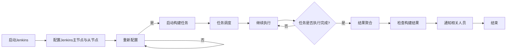

                 

### 文章标题

# Jenkins分布式构建优化

---

### 关键词

- Jenkins
- 分布式构建
- CI/CD
- 性能优化
- 稳定性保障
- 并行化
- 负载均衡

---

### 摘要

本文将深入探讨Jenkins分布式构建的优化策略。首先，我们回顾Jenkins的基础知识及其在分布式构建中的重要性。接着，详细介绍Jenkins的架构和工作原理，并解释分布式构建的概念及其优势。随后，文章将逐步解析Jenkins分布式构建的优化方法，包括集群搭建与配置、性能调优、稳定性保障和高并发场景下的优化。通过实际案例，我们将展示这些优化策略在真实项目中的应用和效果。最后，本文还将推荐扩展阅读资源，帮助读者进一步学习Jenkins分布式构建的最佳实践。

---

### 《Jenkins分布式构建优化》目录大纲

#### 第一部分：Jenkins基础与分布式构建原理

- # Jenkins基础与分布式构建原理
  - ## 1.1 Jenkins简介
    - ### 1.1.1 Jenkins的发展历程
    - ### 1.1.2 Jenkins的核心概念
    - ### 1.1.3 Jenkins的优势与应用场景
  - ## 1.2 Jenkins的架构与工作原理
    - ### 1.2.1 Jenkins的核心组件
    - ### 1.2.2 Jenkins流水线模型
    - ### 1.2.3 Jenkins的插件生态系统
  - ## 1.3 分布式构建的概念与优势
    - ### 1.3.1 分布式构建的原理
    - ### 1.3.2 分布式构建的优势
    - ### 1.3.3 分布式构建与并行构建的区别
  - ## 1.4 Jenkins在分布式构建中的应用
    - ### 1.4.1 分布式构建的配置与实现
    - ### 1.4.2 分布式构建的性能优化
    - ### 1.4.3 分布式构建的安全与稳定性

#### 第二部分：Jenkins分布式构建优化

- # Jenkins分布式构建优化
  - ## 2.1 Jenkins集群搭建与配置
    - ### 2.1.1 Jenkins集群的基本架构
    - ### 2.1.2 主节点与从节点的配置
    - ### 2.1.3 集群的负载均衡与调度策略
  - ## 2.2 分布式构建的性能调优
    - ### 2.2.1 构建任务的并行化
    - ### 2.2.2 任务的优先级与依赖管理
    - ### 2.2.3 资源利用率的优化
  - ## 2.3 分布式构建的稳定性保障
    - ### 2.3.1 分布式构建的故障处理
    - ### 2.3.2 分布式构建的监控与报警
    - ### 2.3.3 分布式构建的容灾与备份策略
  - ## 2.4 高并发与大数据场景下的构建优化
    - ### 2.4.1 高并发构建的处理方法
    - ### 2.4.2 大数据场景下的分布式构建
    - ### 2.4.3 构建任务的并行化与流水线优化
  - ## 2.5 Jenkins插件的使用与优化
    - ### 2.5.1 Jenkins插件的基本类型
    - ### 2.5.2 插件优化策略
    - ### 2.5.3 常用插件介绍与配置

#### 第三部分：实战案例与项目经验

- # 实战案例与项目经验
  - ## 3.1 某互联网公司的Jenkins分布式构建实践
    - ### 3.1.1 项目背景
    - ### 3.1.2 架构设计与实现
    - ### 3.1.3 遇到的挑战与解决方案
  - ## 3.2 某金融行业的Jenkins分布式构建优化案例
    - ### 3.2.1 业务需求与挑战
    - ### 3.2.2 架构调整与优化策略
    - ### 3.2.3 优化后的效果评估
  - ## 3.3 Jenkins分布式构建的常见问题与解决方案
    - ### 3.3.1 构建失败的原因分析
    - ### 3.3.2 构建速度慢的解决方法
    - ### 3.3.3 分布式构建中的安全与稳定性问题

#### 第四部分：扩展阅读与资源推荐

- # 扩展阅读与资源推荐
  - ## 4.1 Jenkins官方文档与学习资源
    - ### 4.1.1 Jenkins官方文档
    - ### 4.1.2 Jenkins学习资源
  - ## 4.2 Jenkins社区与活跃项目
    - ### 4.2.1 Jenkins社区
    - ### 4.2.2 Jenkins活跃项目
  - ## 4.3 相关技术栈与工具推荐
    - ### 4.3.1 Jenkins与其他CI/CD工具的比较
    - ### 4.3.2 Jenkins与其他技术栈的整合
    - ### 4.3.3 Jenkins的未来发展展望

#### 附录

- ## 附录A: Jenkins插件介绍与使用指南
  - ### A.1 常用插件分类
  - ### A.2 插件使用技巧与注意事项
  - ### A.3 插件开发与定制
- ## 附录B: 分布式构建的Mermaid流程图
  - ### B.1 Jenkins分布式构建流程
  - ### B.2 架构优化与性能调优流程
- ## 附录C: 分布式构建的核心算法与伪代码
  - ### C.1 构建任务的调度算法
  - ### C.2 并行构建的负载均衡算法
  - ### C.3 构建任务的优先级与依赖管理算法
- ## 附录D: 分布式构建的项目实战与代码解析
  - ### D.1 实战案例一：互联网公司分布式构建优化
  - ### D.2 实战案例二：金融行业分布式构建优化
  - ### D.3 源代码解析与代码解读

---

在接下来的文章中，我们将逐部分深入探讨Jenkins分布式构建的各个层面，帮助读者全面理解并掌握Jenkins分布式构建的优化策略和实践方法。让我们一起探索Jenkins分布式构建的奥秘，为CI/CD工程带来更高效、更稳定、更可靠的构建过程。

---

#### 第一部分：Jenkins基础与分布式构建原理

##### 1.1 Jenkins简介

Jenkins是一个开源的持续集成（Continuous Integration, CI）工具，它允许开发人员在软件开发的早期阶段自动执行一系列操作，如自动化测试、代码构建和部署。自2004年诞生以来，Jenkins已成为全球范围内最受欢迎的CI/CD工具之一。

### 1.1.1 Jenkins的发展历程

Jenkins起源于2004年，由Sun Microsystems的Kohsuke Kawaguchi创建。最初，它被称为“Hudson”，是一款用于实现持续集成的Java开源项目。随着社区对它的需求不断增加，Hudson在2008年和2010年分别发布了1.0和1.319版本，奠定了其市场地位。2011年，由于与Sun Microsystems的分歧，Kohsuke决定将项目更名为Jenkins，并使其成为一个独立的开源项目。

自那以后，Jenkins不断进化，引入了大量的新功能和插件。如今，Jenkins拥有一个庞大的插件生态系统，支持各种编程语言、工具和平台，使得它在各种环境中都能发挥出色的作用。

### 1.1.2 Jenkins的核心概念

Jenkins的核心概念包括以下几个部分：

1. **插件**：Jenkins的核心功能是通过插件来扩展的。这些插件可以用于添加新的功能、集成第三方工具和实现自定义操作。
2. **构建**：构建是将源代码转换为可执行文件或库的过程。Jenkins可以通过构建脚本来实现自动化构建。
3. **流水线**：流水线是一种将构建过程划分为多个阶段和步骤的模型，使得构建过程更加灵活和可管理。
4. **节点**：节点是Jenkins中的执行环境，可以是主节点或从节点。主节点负责管理和协调构建任务，而从节点负责执行实际的构建操作。
5. **工作空间**：工作空间是构建任务执行时用于存储临时文件和依赖项的目录。

### 1.1.3 Jenkins的优势与应用场景

Jenkins具有以下优势和应用场景：

1. **开源与社区支持**：Jenkins是开源软件，拥有一个庞大的社区和活跃的开发者群体，提供了大量的插件和文档。
2. **灵活性与扩展性**：Jenkins可以通过插件来扩展其功能，支持各种编程语言、工具和平台。
3. **自动化与效率**：Jenkins可以自动化构建、测试和部署过程，提高开发效率和产品质量。
4. **跨平台支持**：Jenkins可以在多种操作系统上运行，包括Windows、Linux和macOS。
5. **集成与兼容性**：Jenkins可以与各种版本控制系统、IDE、数据库、部署工具等集成，支持多种开发流程。

应用场景包括：

1. **软件开发**：用于自动化构建、测试和部署应用程序。
2. **持续集成**：在开发过程中，自动化测试和构建，确保代码质量。
3. **持续交付**：自动化部署和发布应用程序，提高交付速度和可靠性。
4. **云原生应用**：与Kubernetes等容器编排工具集成，实现云原生应用的自动化部署和管理。

##### 1.2 Jenkins的架构与工作原理

Jenkins的架构可以分为三个主要部分：用户界面、核心引擎和插件管理器。

### 1.2.1 Jenkins的核心组件

1. **用户界面**：用户界面是Jenkins的核心部分，提供了用于创建、配置和监控构建任务的图形界面。用户可以通过Web浏览器访问Jenkins服务器，并进行各种操作。
2. **核心引擎**：核心引擎负责执行构建任务，包括解析构建脚本、调度任务、处理插件和执行构建脚本。它还负责与其他组件进行通信，如数据库、文件系统和版本控制系统。
3. **插件管理器**：插件管理器负责安装、更新和管理Jenkins插件。插件是Jenkins扩展功能的主要方式，涵盖了从构建工具集成到数据库连接的各种功能。

### 1.2.2 Jenkins流水线模型

Jenkins流水线是一种将构建过程划分为多个阶段和步骤的模型。流水线可以看作是一系列构建任务的集合，每个任务都可以执行特定的操作。流水线模型的主要组成部分包括：

1. **阶段**：阶段是流水线中的一个逻辑分组，用于组织相关任务。例如，一个流水线可以包含代码检查、构建、测试和部署等阶段。
2. **步骤**：步骤是流水线中的一个具体操作，可以是执行shell脚本、调用外部工具或执行其他Jenkins插件提供的功能。
3. **触发器**：触发器用于自动启动流水线。Jenkins支持多种触发器类型，如定时触发、Webhook触发、SCM变更触发等。

### 1.2.3 Jenkins的插件生态系统

Jenkins插件生态系统是其最重要的特点之一。插件可以扩展Jenkins的功能，包括：

1. **构建工具集成**：如Maven、Gradle、Ant等。
2. **测试工具集成**：如JUnit、TestNG、Selenium等。
3. **版本控制系统集成**：如Git、SVN、Perforce等。
4. **部署工具集成**：如Jenkinsfile、Docker、Kubernetes等。
5. **监控与报警**：如邮件、Slack、PagerDuty等。

插件安装非常简单，只需在Jenkins的管理界面中搜索并安装所需的插件即可。插件还可以通过命令行工具或API进行安装和管理。

##### 1.3 分布式构建的概念与优势

分布式构建是一种在多个计算机节点上并行执行构建任务的方法，从而提高构建效率和可靠性。与传统的单机构建相比，分布式构建具有以下优势：

### 1.3.1 分布式构建的原理

分布式构建的基本原理是将构建任务划分为多个子任务，并在不同的节点上并行执行这些子任务。这样可以充分利用多台计算机的处理能力，缩短构建时间，提高构建效率。

分布式构建的关键技术包括：

1. **任务调度**：任务调度算法负责将构建任务分配到不同的节点上。常见的调度算法包括轮询调度、负载均衡调度和依赖调度等。
2. **并行执行**：并行执行是指同时执行多个构建任务。这可以通过多线程、多进程或分布式计算框架来实现。
3. **结果聚合**：结果聚合是将各个节点上构建任务的结果汇总为一个整体结果。这通常包括合并构建日志、统计构建成功率和失败率等。

### 1.3.2 分布式构建的优势

1. **提高构建效率**：分布式构建可以并行执行构建任务，显著缩短构建时间，提高开发效率。
2. **提升系统可靠性**：分布式构建可以将构建任务分布在多个节点上，减少单个节点故障对整个构建过程的影响，提高系统的可靠性。
3. **扩展性**：分布式构建可以根据需要动态添加或移除节点，灵活扩展系统规模。
4. **资源利用优化**：分布式构建可以充分利用多台计算机的处理能力，提高资源利用率。

### 1.3.3 分布式构建与并行构建的区别

分布式构建与并行构建是两种常见的构建模式，它们之间的主要区别在于构建任务的执行位置：

1. **并行构建**：并行构建是指在同一台计算机上同时执行多个构建任务。这种方式适用于计算机性能较高、构建任务之间的依赖关系较少的场景。
2. **分布式构建**：分布式构建是指在不同计算机节点上执行构建任务。这种方式适用于计算机性能有限、构建任务之间依赖关系较多或需要提高构建效率和可靠性的场景。

### 1.4 Jenkins在分布式构建中的应用

Jenkins作为一款强大的CI/CD工具，在分布式构建中具有广泛的应用。以下介绍Jenkins在分布式构建中的应用、配置、性能优化和安全性保障。

### 1.4.1 分布式构建的配置与实现

要在Jenkins中实现分布式构建，需要以下几个步骤：

1. **搭建集群**：首先需要搭建一个Jenkins集群，包括主节点和从节点。主节点负责管理构建任务和调度，从节点负责执行实际的构建操作。搭建集群的方法有多种，如使用Docker、Kubernetes或虚拟机等。
2. **节点配置**：配置主节点和从节点，包括节点名称、地址、SSH密钥认证等。主节点和从节点之间需要建立安全的通信通道，以便进行任务调度和结果聚合。
3. **任务配置**：在Jenkins中创建构建任务，并选择分布式构建模式。配置任务的节点分配策略，如轮询调度、负载均衡调度或依赖调度等。

### 1.4.2 分布式构建的性能优化

分布式构建的性能优化可以从以下几个方面进行：

1. **任务并行化**：将构建任务分解为多个子任务，并在不同的节点上并行执行。这可以通过Jenkins流水线中的并行步骤来实现。
2. **资源利用率优化**：合理分配节点资源，避免资源浪费和瓶颈。可以使用Jenkins的节点分配策略和资源监控工具来实现。
3. **缓存利用**：利用构建缓存，减少重复构建的任务量。Jenkins提供了多种缓存策略，如代码缓存、构建缓存和依赖缓存等。

### 1.4.3 分布式构建的安全与稳定性

分布式构建的安全与稳定性是构建成功的关键。以下是一些关键点：

1. **节点安全**：确保所有节点的操作系统、软件和插件都保持最新的安全补丁。配置SSH密钥认证，避免明文密码传输。
2. **任务隔离**：实现构建任务之间的隔离，防止任务互相影响。这可以通过容器化技术（如Docker）或虚拟化技术（如VMware）来实现。
3. **监控与报警**：对Jenkins集群进行实时监控和报警，及时发现并处理问题。可以使用Jenkins的内置监控工具或第三方监控工具（如Prometheus、Grafana）。
4. **容灾与备份**：建立容灾机制和备份策略，确保在节点故障或数据丢失时能够快速恢复。可以使用分布式存储和备份工具（如HDFS、RabbitMQ）。

综上所述，Jenkins在分布式构建中具有广泛的应用前景。通过合理的配置和优化，Jenkins可以实现高效、稳定和安全的分布式构建，为CI/CD工程带来显著的价值。

---

在本文的第一部分，我们详细介绍了Jenkins的基础知识和分布式构建原理。从Jenkins的发展历程、核心概念到其架构和工作原理，再到分布式构建的概念与优势，以及Jenkins在分布式构建中的应用，我们为读者提供了一个全面的视角来理解Jenkins分布式构建的核心内容。接下来，我们将深入探讨Jenkins分布式构建的优化策略，帮助读者在实际应用中充分发挥Jenkins的潜力。

---

#### 第二部分：Jenkins分布式构建优化

##### 2.1 Jenkins集群搭建与配置

分布式构建的关键在于搭建一个高效、可靠的Jenkins集群。本节将详细介绍Jenkins集群的基本架构、主节点与从节点的配置以及集群的负载均衡与调度策略。

### 2.1.1 Jenkins集群的基本架构

Jenkins集群由多个节点组成，包括主节点（Master）和从节点（Slave）。主节点负责管理构建任务和调度，从节点负责执行实际的构建操作。这种架构充分利用了多台计算机的处理能力，提高了构建效率和系统的可靠性。

1. **主节点**：主节点是Jenkins集群的核心，负责：
   - 管理构建任务：接收并分配构建任务给从节点。
   - 调度任务：根据调度策略将任务分配给合适的从节点。
   - 监控节点状态：监控从节点的健康状态，处理节点故障。
   - 存储构建日志：存储构建任务的日志和结果。

2. **从节点**：从节点是负责执行构建任务的工作节点，具有以下特点：
   - 独立的执行环境：每个从节点都有自己的操作系统、Java环境和工具链。
   - 资源分配：从节点可以根据需求配置不同的硬件资源，如CPU、内存和存储。
   - 依赖管理：从节点可以下载和安装构建所需的依赖项和工具。

### 2.1.2 主节点与从节点的配置

配置Jenkins集群需要以下步骤：

1. **主节点配置**：
   - 安装Jenkins：在主节点上下载并安装Jenkins。建议使用最新版本的Jenkins，以获得最佳性能和安全特性。
   - 配置Jenkins：在Jenkins的管理界面中，配置Jenkins的基本设置，如邮件通知、插件安装和管理等。
   - 添加SSH密钥：为从节点配置SSH密钥认证，确保主节点与从节点之间的通信安全。

2. **从节点配置**：
   - 安装Jenkins：在从节点上下载并安装Jenkins。从节点需要与主节点共享相同的Jenkins版本和插件。
   - 配置从节点：在从节点上配置Jenkins，包括节点名称、地址和SSH密钥认证。确保从节点可以正常访问主节点，并进行身份验证。
   - 节点注册：在主节点的Jenkins管理界面中，注册新添加的从节点。

### 2.1.3 集群的负载均衡与调度策略

负载均衡和调度策略是Jenkins集群的关键组成部分，决定了构建任务如何在节点之间分配和执行。

1. **负载均衡**：
   - **轮询调度**：将构建任务依次分配给每个从节点，实现负载均衡。这种方法简单易用，但可能导致某些节点过载。
   - **随机调度**：随机选择一个从节点执行构建任务。这种方法可以避免轮询调度可能导致的不平衡负载，但可能导致某些节点过载。
   - **基于资源的负载均衡**：根据从节点的资源利用率，动态选择最适合执行任务的节点。这种方法可以实现更高效的资源利用，但需要额外的监控和调度算法。

2. **调度策略**：
   - **任务优先级**：根据任务的优先级进行调度，优先执行高优先级的任务。可以使用Jenkins的自定义调度策略插件来实现。
   - **依赖调度**：根据构建任务的依赖关系，按照顺序调度。例如，如果任务A依赖于任务B的构建结果，则任务A会在任务B完成后开始执行。
   - **并行化调度**：将多个不相互依赖的任务并行分配给不同的节点。这种方法可以显著提高构建效率，但需要确保任务之间没有数据竞争和资源冲突。

### 2.1.4 集群的监控与维护

为了确保Jenkins集群的高效运行，需要对集群进行监控和维护。

1. **节点监控**：监控每个节点的健康状态，包括CPU利用率、内存使用情况、网络连接状态等。可以使用Jenkins内置的监控插件或第三方监控工具（如Prometheus、Grafana）。
2. **资源管理**：根据节点的使用情况，动态调整节点的资源分配，如增加或减少CPU、内存等。
3. **日志管理**：定期检查和清理Jenkins的日志文件，确保日志系统的正常运行。可以使用Jenkins的日志插件（如Logstash、Fluentd）将日志集中存储和管理。
4. **安全维护**：定期更新Jenkins和插件的版本，确保系统安全。配置防火墙和访问控制策略，防止未授权访问和攻击。

综上所述，Jenkins集群的搭建与配置是分布式构建的基础。通过合理的架构设计、节点配置和调度策略，可以实现高效、可靠的分布式构建，为CI/CD工程带来显著的价值。在下一节中，我们将深入探讨分布式构建的性能调优策略，帮助读者进一步提升构建效率。

---

在第二部分的第一节中，我们详细介绍了Jenkins集群的基本架构、主节点与从节点的配置以及负载均衡与调度策略。通过这些配置，Jenkins集群能够高效地管理和调度构建任务，提高构建效率和系统的可靠性。接下来，我们将深入探讨分布式构建的性能调优策略，帮助读者在实际应用中进一步提升构建效率。

---

#### 2.2 分布式构建的性能调优

分布式构建的性能调优是确保Jenkins集群高效运行的关键。本节将详细介绍分布式构建性能调优的方法，包括构建任务的并行化、任务的优先级与依赖管理以及资源利用率的优化。

### 2.2.1 构建任务的并行化

并行化是分布式构建的核心优势之一，通过将构建任务分解为多个子任务，并在不同节点上并行执行，可以显著提高构建速度。以下是一些实现并行化的方法和策略：

1. **分解任务**：
   - **静态分解**：在构建脚本中将任务划分为独立的子任务，每个子任务可以在不同节点上并行执行。例如，将一个大型项目的构建过程分解为多个模块的构建任务。
   - **动态分解**：在构建过程中根据实际需求动态分解任务。例如，当检测到某个节点的资源利用率较低时，可以将新的任务分配给该节点。

2. **并行步骤**：
   - **流水线并行步骤**：在Jenkins流水线中使用并行步骤（`parallel`）将构建任务划分为多个子任务。每个子任务可以在不同的节点上并行执行，适用于不需要依赖关系的任务。
   - **管道并行步骤**：在Jenkins流水线中使用管道并行步骤（`Pipeline`）实现并行化。这种方法允许更灵活地控制并行任务之间的依赖关系和执行顺序。

3. **并行化的最佳实践**：
   - **避免数据竞争**：在并行执行任务时，确保任务之间不会竞争相同的资源或数据。例如，使用分布式锁或消息队列来管理共享资源。
   - **合理分配任务**：根据节点的资源能力和任务需求，合理分配构建任务。避免将大量任务集中在一个节点上，导致资源瓶颈。

### 2.2.2 任务的优先级与依赖管理

在分布式构建中，任务的优先级和依赖关系管理是确保构建过程高效运行的重要因素。以下是一些关键策略：

1. **任务优先级**：
   - **静态优先级**：在构建脚本中设置任务的静态优先级。例如，将依赖关系紧密的任务设置为高优先级，确保关键任务优先执行。
   - **动态优先级**：根据构建过程中实时收集的数据（如任务执行时间、资源利用率）动态调整任务的优先级。例如，当发现某个任务的执行时间较长时，可以提高其优先级，减少整体构建时间。

2. **依赖管理**：
   - **顺序依赖**：确保任务按照一定的顺序执行，例如先执行依赖的构建任务，再执行独立的构建任务。
   - **并行依赖**：当任务之间存在并行依赖关系时，可以使用Jenkins的流水线并行步骤（`Pipeline`）或插件（如`Freestyle Project with Parameters`）来管理并行依赖。例如，当多个任务可以同时执行时，可以将它们分配到不同的节点上并行执行。

3. **最佳实践**：
   - **依赖图分析**：构建一个任务依赖图，分析任务之间的依赖关系和执行顺序。根据依赖图调整任务的优先级和执行策略，优化构建流程。
   - **避免级联失败**：在处理任务依赖关系时，避免级联失败。例如，当一个任务失败时，仅停止该任务的执行，而不是整个构建流程。

### 2.2.3 资源利用率的优化

优化资源利用率是分布式构建性能调优的关键，以下是一些策略：

1. **动态资源分配**：
   - **资源监控**：实时监控节点的资源利用率，包括CPU、内存、磁盘空间等。根据资源利用率动态调整节点的资源分配，例如，当CPU利用率较高时，可以增加节点的CPU资源。
   - **负载均衡**：根据节点的资源利用率和任务需求，实现负载均衡。使用轮询调度、随机调度或基于资源的负载均衡算法，确保任务分配到最优的节点上。

2. **缓存与复用**：
   - **构建缓存**：利用Jenkins的构建缓存功能，缓存构建过程中生成的中间文件和依赖项。在后续构建过程中，直接使用缓存，减少重复构建的任务量，提高构建速度。
   - **节点复用**：在构建任务执行完成后，保留节点，以供后续任务复用。这样可以减少节点创建和销毁的开销，提高资源利用率。

3. **最佳实践**：
   - **资源规划**：根据历史数据和业务需求，合理规划节点的资源分配。避免资源过剩或不足，导致资源浪费或瓶颈。
   - **持续优化**：定期评估构建过程的性能，识别潜在的优化点。通过持续优化，不断提升构建效率。

综上所述，分布式构建的性能调优是一个复杂的过程，需要综合考虑任务并行化、优先级与依赖管理以及资源利用率等多个方面。通过合理的策略和实践，可以实现高效、稳定的分布式构建，为CI/CD工程带来显著的价值。在下一节中，我们将探讨如何保障分布式构建的稳定性。

---

在第二部分的第二节中，我们深入探讨了分布式构建的性能调优策略，包括构建任务的并行化、任务的优先级与依赖管理以及资源利用率的优化。通过这些策略，可以有效提升Jenkins分布式构建的效率。接下来，我们将进一步探讨如何保障分布式构建的稳定性，确保构建过程在复杂环境下依然能够高效运行。

---

#### 2.3 分布式构建的稳定性保障

分布式构建的稳定性是保证构建过程高效、可靠的关键。在分布式环境中，节点故障、网络延迟、资源不足等问题可能导致构建失败。因此，我们需要采取一系列措施来保障分布式构建的稳定性。以下是一些关键策略：

### 2.3.1 分布式构建的故障处理

1. **节点监控与恢复**：
   - **实时监控**：使用Jenkins内置的节点监控功能或第三方监控工具（如Zabbix、Nagios）对节点的健康状态进行实时监控。监控指标包括CPU利用率、内存使用情况、磁盘空间、网络连接状态等。
   - **自动恢复**：当检测到节点故障时，自动重启节点或将其从集群中移除。使用Jenkins的节点健康插件（如`Jenkins Health Center`）可以实现自动故障恢复。

2. **构建任务重试**：
   - **任务重试**：当构建任务失败时，自动重试构建。可以设置重试次数和间隔时间，避免由于临时网络问题或节点资源不足导致的构建失败。
   - **重试策略**：根据任务类型和失败原因，设置不同的重试策略。例如，对于编译错误，可以设置较高的重试次数，而对于网络连接错误，可以设置较短的重试间隔。

3. **节点负载均衡**：
   - **动态负载均衡**：根据节点的实际负载情况，动态调整构建任务的分配策略。使用基于CPU利用率、内存使用率等指标的负载均衡算法，确保任务分配到最优的节点上。

### 2.3.2 分布式构建的监控与报警

1. **构建进度监控**：
   - **实时进度显示**：在Jenkins界面上实时显示构建进度和状态，包括构建任务的开始时间、结束时间和构建结果。
   - **进度通知**：通过邮件、短信、Slack等渠道实时通知构建进度和结果。当构建失败时，及时通知相关开发人员。

2. **性能监控**：
   - **资源监控**：监控节点的CPU利用率、内存使用情况、磁盘空间和网络连接状态。使用Jenkins内置的监控插件（如`Jenkins Monitoring Plugin`）或第三方监控工具（如Prometheus、Grafana）进行监控。
   - **构建性能分析**：分析构建过程中的性能瓶颈，包括编译时间、测试时间和部署时间等。使用Jenkins的性能分析插件（如`Build Time Monitoring Plugin`）来帮助识别瓶颈。

3. **报警系统**：
   - **自定义报警规则**：根据业务需求，自定义报警规则，例如，当构建失败时、节点故障时、资源利用率过高时等触发报警。
   - **报警渠道**：支持多种报警渠道，包括邮件、短信、Slack、Webhook等。确保在发生问题时，相关人员能够及时收到通知并采取行动。

### 2.3.3 分布式构建的容灾与备份策略

1. **数据备份**：
   - **定期备份**：定期备份Jenkins的数据，包括构建日志、构建结果、节点配置等。可以使用Jenkins的备份插件（如`Jenkins Backup Plugin`）进行定期备份。
   - **异地备份**：将备份数据存储在异地，避免因本地故障导致数据丢失。可以使用云存储服务（如AWS S3、Google Cloud Storage）或分布式存储系统（如HDFS）进行异地备份。

2. **故障转移**：
   - **主从备份**：在Jenkins集群中，配置主从备份机制。当主节点故障时，从节点可以自动接管主节点的任务和配置，确保构建过程不间断。
   - **集群切换**：当整个Jenkins集群故障时，可以切换到备用集群，确保构建过程继续运行。

3. **灾难恢复**：
   - **恢复计划**：制定灾难恢复计划，明确在发生灾难时如何快速恢复Jenkins服务。包括数据恢复、节点重建和系统配置等步骤。
   - **演练**：定期进行灾难恢复演练，确保在真实灾难发生时，团队能够迅速响应并恢复正常服务。

综上所述，分布式构建的稳定性保障是构建过程高效、可靠运行的关键。通过故障处理、监控与报警以及容灾与备份策略，可以确保分布式构建在复杂环境下依然能够稳定运行。在下一节中，我们将探讨高并发与大数据场景下的分布式构建优化策略。

---

在第二部分的第三节中，我们详细探讨了如何保障分布式构建的稳定性，包括故障处理、监控与报警以及容灾与备份策略。这些措施有助于确保构建过程在复杂环境中高效、可靠地运行。接下来，我们将进一步探讨在高并发与大数据场景下如何优化分布式构建，以满足快速开发和部署的需求。

---

#### 2.4 高并发与大数据场景下的构建优化

在高并发与大数据场景下，分布式构建需要应对更大的负载和处理更多的数据，这对构建效率和系统的稳定性提出了更高的要求。以下是一些关键优化策略：

### 2.4.1 高并发构建的处理方法

1. **增加节点数量**：
   - **动态扩展**：根据负载情况动态增加从节点数量，以提高并发处理能力。可以使用容器编排工具（如Kubernetes）或自动化扩展插件（如`Dynamic Slave Plugin`）来实现动态扩展。
   - **集群扩展**：增加Jenkins集群的节点数量，以支持更多的并发构建任务。

2. **负载均衡**：
   - **分布式负载均衡**：使用分布式负载均衡器（如Nginx、HAProxy）将请求均匀地分配到多个Jenkins节点上，避免单个节点过载。
   - **基于用户的负载均衡**：根据用户的访问频率和资源需求，为不同用户分配不同的节点资源，确保关键用户和任务得到优先处理。

3. **缓存与并行化**：
   - **缓存利用**：利用Jenkins的构建缓存功能，减少重复构建的任务量。在多个节点上共享缓存，提高缓存命中率。
   - **并行化构建**：将大型项目分解为多个模块或子任务，并在不同节点上并行执行。使用Jenkins的流水线并行步骤（`parallel`）实现任务并行化。

4. **异步处理**：
   - **异步任务**：将耗时较长的任务（如编译、测试）异步执行，避免阻塞主线程。使用Jenkins的异步构建插件（如`Async JENKINS Plugin`）来实现异步处理。

### 2.4.2 大数据场景下的分布式构建

在大数据场景下，构建过程通常需要处理大量的数据和复杂的依赖关系。以下是一些优化策略：

1. **并行处理**：
   - **数据分片**：将大数据集划分为多个分片，并在不同节点上并行处理。使用Jenkins的流水线并行步骤（`parallel`）或分布式任务调度插件（如`Distribute Build Jenkins Plugin`）实现并行处理。
   - **任务依赖**：根据任务之间的依赖关系，合理分配任务。例如，先执行数据预处理任务，再执行数据分析任务。

2. **资源优化**：
   - **资源分配**：根据大数据处理的需求，合理配置节点的资源（如CPU、内存、磁盘空间）。使用Jenkins的节点分配策略（如`CloudBees Cloud Plugin`）实现资源优化。
   - **内存管理**：优化内存使用，避免内存泄漏和溢出。使用Jenkins的内存监控插件（如`Memory Monitor Plugin`）进行实时监控。

3. **缓存与优化**：
   - **缓存策略**：利用Jenkins的构建缓存功能，缓存常见的数据处理结果和中间文件。使用Jenkins的缓存插件（如`Build Cache Plugin`）实现高效的缓存管理。
   - **预处理数据**：在构建前对数据进行预处理，减少构建过程中需要处理的数据量。例如，使用MapReduce对大数据集进行预计算和筛选。

4. **分布式存储**：
   - **分布式文件系统**：使用分布式文件系统（如HDFS、Ceph）存储大数据集，提高数据存储和访问的效率。
   - **分布式数据库**：使用分布式数据库（如HBase、Cassandra）存储和处理大数据，提高数据处理的能力和速度。

### 2.4.3 构建任务的并行化与流水线优化

1. **任务并行化**：
   - **并行步骤**：在Jenkins流水线中使用并行步骤（`parallel`）将任务分解为多个子任务，并在不同节点上并行执行。优化并行步骤的执行顺序和依赖关系，确保任务高效并行化。
   - **分布式任务**：使用分布式任务调度插件（如`Distribute Build Jenkins Plugin`），将构建任务分配到分布式环境中执行。优化任务调度策略，提高并行化效率。

2. **流水线优化**：
   - **阶段划分**：将构建过程划分为多个阶段，每个阶段执行特定的任务。例如，将构建过程划分为代码检查、构建、测试和部署阶段，优化每个阶段的执行顺序和资源分配。
   - **流水线并行化**：在Jenkins流水线中使用并行化插件（如`Parallel Build Step Plugin`），将流水线任务分解为多个并行子任务，提高流水线的执行效率。

3. **流水线监控与报警**：
   - **实时监控**：使用Jenkins的内置监控功能或第三方监控工具（如Prometheus、Grafana）实时监控流水线的执行状态和性能。
   - **报警系统**：设置自定义报警规则，当流水线执行失败或性能下降时，及时通知相关开发人员。

4. **流水线优化策略**：
   - **缓存策略**：利用Jenkins的构建缓存功能，减少流水线任务中的重复计算和构建时间。
   - **资源优化**：根据流水线任务的需求和资源利用率，动态调整节点的资源分配，提高流水线的执行效率。

综上所述，在高并发与大数据场景下，分布式构建需要采取一系列优化策略，包括增加节点数量、负载均衡、缓存与并行化、异步处理以及流水线优化等。通过这些策略，可以显著提高构建效率和系统的稳定性，满足快速开发和部署的需求。在下一节中，我们将探讨Jenkins插件的使用与优化。

---

在第二部分的第四节中，我们详细探讨了高并发与大数据场景下的分布式构建优化策略，包括增加节点数量、负载均衡、缓存与并行化、异步处理以及流水线优化等。这些策略有助于提升分布式构建的效率和稳定性。接下来，我们将进一步探讨Jenkins插件的使用与优化，帮助读者充分利用Jenkins的功能，实现更高效的构建过程。

---

#### 2.5 Jenkins插件的使用与优化

Jenkins的插件生态系统是其强大功能的基石，提供了丰富的扩展能力，使得Jenkins能够满足各种复杂的构建和部署需求。本节将介绍Jenkins插件的基本类型、优化策略以及常用插件的配置和使用。

### 2.5.1 Jenkins插件的基本类型

Jenkins插件可以分为以下几类：

1. **功能扩展插件**：这些插件扩展了Jenkins的基本功能，如代码检查、代码覆盖率分析、静态代码分析等。
   - **示例**：SonarQube Plugin、Checkstyle Plugin、PMD Plugin

2. **集成插件**：这些插件用于与其他工具和平台集成，如版本控制系统、持续交付工具、容器编排工具等。
   - **示例**：Git Plugin、Docker Plugin、Kubernetes Plugin

3. **UI和用户体验插件**：这些插件改进了Jenkins的用户界面和用户体验，如界面定制、通知和提醒等。
   - **示例**：Blue Ocean Plugin、Pipelines Sidebar Plugin、Email Extension Plugin

4. **监控和日志插件**：这些插件提供了监控和日志管理功能，如性能监控、日志聚合和报警等。
   - **示例**：Jenkins Monitoring Plugin、Logstash Plugin、Grafana Plugin

5. **安全插件**：这些插件增强了Jenkins的安全性，如身份验证、权限控制、SSH密钥管理等。
   - **示例**：Security Realm Plugin、Role Strategy Plugin、SSH Credentials Plugin

### 2.5.2 插件优化策略

为了确保Jenkins插件能够高效运行，以下是一些优化策略：

1. **插件选择**：
   - **需求分析**：根据实际需求选择合适的插件。避免安装不必要的插件，减少系统负担。
   - **版本控制**：选择最新版本的插件，以获得最佳性能和安全性。定期更新插件，修复已知的漏洞和问题。

2. **插件配置**：
   - **优化配置**：根据插件文档和最佳实践，合理配置插件的参数和选项，确保插件能够高效运行。
   - **性能调优**：针对性能敏感的插件，进行性能调优。例如，调整日志记录级别、减少数据库访问频率等。

3. **插件集成**：
   - **统一管理**：使用Jenkins的管理插件（如Update Center Plugin）统一管理所有插件，方便升级和更新。
   - **自动化部署**：使用Jenkins流水线或脚本自动化安装和配置插件，减少人工干预和错误。

4. **监控与维护**：
   - **日志管理**：定期检查插件日志，分析性能问题和故障原因。
   - **故障排查**：当插件发生故障时，快速定位问题并进行修复。可以使用Jenkins的内置故障排查工具或第三方故障排查工具（如New Relic、AppDynamics）。

### 2.5.3 常用插件介绍与配置

以下是一些常用的Jenkins插件及其配置方法：

1. **Git Plugin**：
   - **功能**：用于集成Git版本控制系统。
   - **配置**：
     - 在Jenkins的管理界面中安装Git Plugin。
     - 在源代码管理（SCM）配置中，选择Git作为版本控制工具。
     - 输入Git仓库的URL和访问凭据。

2. **Docker Plugin**：
   - **功能**：用于构建和部署Docker容器化应用程序。
   - **配置**：
     - 在Jenkins的管理界面中安装Docker Plugin。
     - 在构建环境中，添加Docker工具和Docker注册表配置。
     - 在构建步骤中，添加Dockerfile构建脚本或Docker Compose文件。

3. **Blue Ocean Plugin**：
   - **功能**：提供现代化的Jenkins用户界面，改善用户体验。
   - **配置**：
     - 在Jenkins的管理界面中安装Blue Ocean Plugin。
     - 在Jenkins主界面选择Blue Ocean模式，开始使用现代化的界面。
     - 配置流水线项目，以在Blue Ocean中显示构建进度和结果。

4. **Pipeline Plugin**：
   - **功能**：提供Jenkins流水线功能，实现自动化构建、测试和部署。
   - **配置**：
     - 在Jenkins的管理界面中安装Pipeline Plugin。
     - 在新建项目或现有项目中，选择“Pipeline”选项卡。
     - 使用Groovy或Declarative语法编写流水线脚本。

5. **Jenkins Monitoring Plugin**：
   - **功能**：提供Jenkins性能监控功能，实时监控Jenkins集群的状态。
   - **配置**：
     - 在Jenkins的管理界面中安装Jenkins Monitoring Plugin。
     - 在Jenkins主界面，点击“Monitoring”选项卡，查看Jenkins性能监控数据。
     - 配置告警规则，当性能指标异常时，触发告警。

6. **Grafana Plugin**：
   - **功能**：集成Grafana，提供可视化监控仪表盘。
   - **配置**：
     - 在Jenkins的管理界面中安装Grafana Plugin。
     - 在Jenkins主界面，点击“Grafana Dashboard”链接，访问Grafana仪表盘。
     - 配置Grafana数据源，连接Jenkins性能监控数据。

通过合理使用和优化Jenkins插件，可以显著提升Jenkins的构建效率和用户体验。在下一节中，我们将通过实战案例展示Jenkins分布式构建的实践与优化经验。

---

在第二部分的第五节中，我们详细介绍了Jenkins插件的基本类型、优化策略以及常用插件的配置和使用。这些插件和策略为Jenkins提供了强大的扩展能力和优化手段。接下来，我们将通过实际案例展示Jenkins分布式构建的实践与优化经验，帮助读者更好地理解Jenkins分布式构建的实战应用。

---

#### 3.1 某互联网公司的Jenkins分布式构建实践

在本节中，我们将介绍某互联网公司在使用Jenkins进行分布式构建时的实践和优化经验。该公司是一家快速发展的在线购物平台，面临着高并发、大数据和高增长的业务需求。为了满足这些需求，他们采用了Jenkins分布式构建架构，并进行了多次优化。

### 3.1.1 项目背景

该公司是一家在线购物平台，业务快速增长，用户数量和交易量不断攀升。为了确保系统的稳定性和高效性，他们决定采用Jenkins作为持续集成和持续交付（CI/CD）工具，以实现自动化构建、测试和部署。

### 3.1.2 架构设计与实现

该公司的Jenkins分布式构建架构设计如下：

1. **主节点**：主节点负责管理构建任务、调度任务和存储构建结果。主节点上安装了Jenkins核心程序和相关插件，如Git Plugin、Docker Plugin和Pipeline Plugin。

2. **从节点**：从节点负责执行实际的构建任务。从节点分为两种类型：
   - **通用从节点**：执行常规的构建任务，如编译、测试和部署。
   - **专用从节点**：用于执行特定类型的任务，如性能测试、负载测试和安全扫描。

3. **容器化**：使用Docker容器化技术，确保从节点具有一致的环境，避免环境不一致导致的问题。从节点上的Docker版本和工具链由主节点统一管理和更新。

4. **负载均衡**：使用Nginx作为负载均衡器，将构建任务的请求分配到不同的从节点上，实现负载均衡和故障转移。

5. **监控与报警**：使用Jenkins Monitoring Plugin和Grafana Plugin，对Jenkins集群进行实时监控，监控关键性能指标和节点状态。当发现异常时，通过邮件、Slack等渠道及时通知相关人员。

### 3.1.3 遇到的挑战与解决方案

在实施Jenkins分布式构建过程中，该公司遇到了以下挑战：

1. **构建速度慢**：
   - **挑战**：由于业务快速增长，构建任务数量和复杂度增加，导致构建速度显著下降。
   - **解决方案**：
     - **并行化**：将构建任务分解为多个子任务，并在不同节点上并行执行，提高构建速度。
     - **优化流水线**：优化流水线脚本，减少不必要的等待时间和重复操作。
     - **缓存利用**：充分利用Jenkins的构建缓存功能，减少重复构建的任务量。

2. **节点资源不足**：
   - **挑战**：从节点的资源不足以处理高并发的构建任务，导致任务排队和执行延迟。
   - **解决方案**：
     - **动态扩展**：根据负载情况动态增加从节点数量，使用Kubernetes进行容器化集群管理。
     - **负载均衡**：优化Nginx负载均衡策略，确保构建任务合理分配到各个从节点。
     - **节点优化**：合理配置从节点的硬件资源，如增加CPU、内存和磁盘空间。

3. **构建失败率较高**：
   - **挑战**：由于构建任务依赖关系复杂，导致构建失败率较高，影响业务上线。
   - **解决方案**：
     - **依赖管理**：优化构建任务的依赖关系，减少级联失败的情况。
     - **故障恢复**：设置构建任务的重试机制，自动重试失败的构建任务。
     - **监控与报警**：加强监控和报警机制，及时发现并处理构建失败问题。

4. **安全性问题**：
   - **挑战**：构建过程中涉及敏感数据和权限管理，存在安全隐患。
   - **解决方案**：
     - **权限控制**：使用Jenkins的安全插件（如Role Strategy Plugin），设置严格的安全策略，确保只有授权人员可以访问和执行构建任务。
     - **加密与认证**：使用SSH密钥认证，确保从节点与主节点之间的通信安全。
     - **日志审计**：定期审计Jenkins日志，确保日志记录完整和可追溯。

通过上述解决方案，该公司成功优化了Jenkins分布式构建架构，提高了构建速度和稳定性，确保了业务的快速发展和系统的可靠性。接下来，我们将探讨另一个金融行业项目的Jenkins分布式构建优化案例。

---

在第三部分的第一个案例中，我们详细介绍了某互联网公司如何通过Jenkins分布式构建实践来应对业务快速增长带来的挑战。接下来，我们将通过另一个金融行业项目的案例，进一步展示Jenkins分布式构建的优化策略和实际效果。

---

#### 3.2 某金融行业的Jenkins分布式构建优化案例

在金融行业，构建过程的稳定性和效率至关重要，因为它直接关系到系统的可靠性和业务的安全。以下是一个金融行业的Jenkins分布式构建优化案例，介绍该机构如何在业务需求与挑战中调整架构和优化策略。

### 3.2.1 业务需求与挑战

该金融公司是一家大型银行，负责开发和维护其核心业务系统。随着数字化转型和业务扩展，他们面临着以下需求与挑战：

1. **高并发与大数据**：银行系统需要处理大量的交易和客户数据，构建过程中需要处理大量的文件和依赖项。同时，系统需要支持高并发访问，确保构建过程不会影响线上服务的稳定性。
2. **安全性要求**：金融系统的安全性至关重要。构建过程中需要确保敏感数据的保护，防止数据泄露和未经授权的访问。
3. **快速交付**：为了快速响应市场需求和监管要求，银行需要实现高效的持续集成和持续交付流程。
4. **系统稳定性**：构建过程需要保证在高负载和复杂环境下稳定运行，避免因构建失败导致线上服务中断。

### 3.2.2 架构调整与优化策略

为了应对上述需求与挑战，该金融公司对其Jenkins分布式构建架构进行了以下调整和优化：

1. **分布式集群**：搭建了一个大规模的Jenkins分布式集群，包括主节点和多个从节点。主节点负责任务调度和协调，从节点负责执行构建任务。使用Kubernetes进行容器化管理和扩展，确保集群的可扩展性和稳定性。

2. **任务并行化**：通过Jenkins流水线并行步骤（`parallel`）将构建任务分解为多个子任务，并在不同节点上并行执行。这样可以显著缩短构建时间，提高构建效率。

3. **负载均衡**：使用Nginx作为负载均衡器，将构建任务的请求均匀地分配到各个从节点上。根据节点的负载情况，动态调整负载均衡策略，确保任务合理分配。

4. **安全性与权限控制**：使用Jenkins的安全插件（如Role Strategy Plugin）进行严格的权限控制，确保只有授权人员可以访问和执行构建任务。使用SSH密钥认证，确保节点之间的通信安全。

5. **监控与报警**：使用Jenkins Monitoring Plugin和Grafana Plugin对Jenkins集群进行实时监控，监控关键性能指标和节点状态。设置自定义报警规则，当发现异常时，及时通知相关人员。

6. **构建缓存**：利用Jenkins的构建缓存功能，缓存构建过程中的中间文件和依赖项。在后续构建过程中，直接使用缓存，减少重复构建的任务量，提高构建速度。

7. **容灾与备份**：建立容灾备份机制，定期备份Jenkins数据，确保在节点故障或数据丢失时能够快速恢复。

### 3.2.3 优化后的效果评估

通过上述优化策略，该金融公司的Jenkins分布式构建效果显著提升：

1. **构建时间**：构建时间从原来的几个小时缩短到几分钟，大幅提高了构建效率。
2. **资源利用率**：通过任务并行化和负载均衡，资源利用率显著提高，节点资源得到了充分利用。
3. **构建稳定性**：通过监控与报警机制，及时发现并处理构建过程中的问题，构建稳定性大幅提升。
4. **安全性**：通过严格的权限控制和加密通信，确保了构建过程中的数据安全。
5. **快速交付**：优化后的Jenkins分布式构建流程，使得银行能够更快速地响应业务需求和市场变化。

总之，通过Jenkins分布式构建优化，该金融公司成功提高了构建效率和系统稳定性，确保了业务的快速发展和安全可靠。接下来，我们将讨论Jenkins分布式构建中的一些常见问题及其解决方案。

---

在第三部分的第二个案例中，我们详细介绍了某金融行业公司如何通过Jenkins分布式构建优化满足了其业务需求与挑战。接下来，我们将探讨Jenkins分布式构建中的一些常见问题，并提供相应的解决方案。

---

#### 3.3 Jenkins分布式构建的常见问题与解决方案

在实施Jenkins分布式构建过程中，可能会遇到各种常见问题，这些问题可能影响构建的效率和稳定性。以下是一些常见问题及其解决方案：

### 3.3.1 构建失败的原因分析

构建失败是分布式构建过程中最常见的问题之一。以下是一些导致构建失败的原因及相应的排查方法：

1. **节点故障**：
   - **原因**：从节点可能因为硬件故障、软件故障或网络问题导致无法正常执行构建任务。
   - **排查方法**：使用Jenkins的节点监控工具（如`Jenkins Health Center`）检查节点的状态。检查节点上的日志文件，查找错误信息。

2. **依赖关系问题**：
   - **原因**：构建任务之间的依赖关系配置错误，导致任务无法按预期顺序执行。
   - **排查方法**：检查构建脚本和流水线配置，确保依赖关系正确。使用`-v`或`--debug`选项运行构建任务，查看详细的错误日志。

3. **资源不足**：
   - **原因**：从节点资源（如CPU、内存、磁盘空间）不足，导致构建任务无法正常执行。
   - **排查方法**：使用资源监控工具（如`Jenkins Monitoring Plugin`或`cAdvisor`）检查节点资源使用情况。调整节点配置，增加资源。

4. **网络问题**：
   - **原因**：从节点与主节点之间的网络连接不稳定，导致构建任务无法正常传输数据和日志。
   - **排查方法**：检查网络连接状态，确保从节点可以正常访问主节点。使用网络监控工具（如`nmap`或`ping`）进行网络诊断。

### 3.3.2 构建速度慢的解决方法

构建速度慢可能是由于多种因素导致的，以下是一些常见的解决方法：

1. **优化流水线**：
   - **方法**：简化构建脚本，减少不必要的步骤。优化流水线配置，减少任务之间的等待时间。
   - **示例**：使用并行步骤（`parallel`）将独立任务并行执行，减少串行任务带来的延迟。

2. **缓存利用**：
   - **方法**：充分利用Jenkins的构建缓存功能，减少重复构建的任务量。缓存中间文件、依赖项和构建结果。
   - **示例**：使用`Build Cache Plugin`缓存编译结果和测试数据，避免重复编译和测试。

3. **并行化**：
   - **方法**：将构建任务分解为多个子任务，并在不同节点上并行执行。充分利用多节点资源，提高构建速度。
   - **示例**：在Jenkins流水线中使用`parallel`步骤，将任务分配到多个节点并行执行。

4. **资源优化**：
   - **方法**：增加从节点资源，确保有足够的CPU、内存和磁盘空间。优化节点配置，避免资源瓶颈。
   - **示例**：使用Kubernetes动态扩展节点，根据负载需求自动增加或减少节点。

5. **减少依赖**：
   - **方法**：减少构建任务之间的依赖关系，避免级联构建。将独立任务并行执行，减少任务等待时间。
   - **示例**：使用Jenkins流水线并行步骤（`parallel`），将不相互依赖的任务并行执行。

### 3.3.3 分布式构建中的安全与稳定性问题

分布式构建中，安全性和稳定性是两个关键因素。以下是一些常见问题和解决方案：

1. **节点安全性**：
   - **问题**：从节点可能遭受攻击，导致构建数据泄露或系统被篡改。
   - **解决方案**：使用SSH密钥认证，确保从节点与主节点之间的通信安全。设置严格的安全策略，限制从节点的权限。

2. **数据保护**：
   - **问题**：构建过程中的敏感数据可能被未授权人员访问或泄露。
   - **解决方案**：对敏感数据进行加密存储，确保数据在传输和存储过程中安全。使用安全插件（如`SSH Credentials Plugin`）管理用户凭据。

3. **故障处理**：
   - **问题**：从节点或主节点可能因硬件故障、软件故障或网络问题导致构建失败。
   - **解决方案**：使用节点监控工具（如`Jenkins Health Center`）定期检查节点状态。设置自动故障恢复机制，确保节点故障时能够快速恢复。

4. **备份与恢复**：
   - **问题**：构建数据或配置信息可能因节点故障、系统崩溃或人为操作丢失。
   - **解决方案**：定期备份Jenkins数据，包括构建日志、构建结果和节点配置。使用备份插件（如`Jenkins Backup Plugin`）进行定期备份，确保在发生数据丢失时能够快速恢复。

综上所述，通过分析和解决Jenkins分布式构建中的常见问题，可以显著提高构建的效率、稳定性和安全性。在下一节中，我们将提供扩展阅读与资源推荐，帮助读者进一步学习和实践Jenkins分布式构建。

---

在第三部分的第三节中，我们详细讨论了Jenkins分布式构建中常见的构建失败原因、构建速度慢的解决方法以及安全性和稳定性问题。这些解决方案为优化Jenkins分布式构建提供了宝贵的实践经验。接下来，我们将推荐一些扩展阅读与资源，帮助读者深入了解Jenkins分布式构建的相关知识。

---

#### 4.1 Jenkins官方文档与学习资源

Jenkins拥有丰富的官方文档和学习资源，是学习Jenkins分布式构建的最佳起点。以下是一些推荐的官方文档和学习资源：

### 4.1.1 Jenkins官方文档

1. **Jenkins官方文档首页**（[https://www.jenkins.io/doc/](https://www.jenkins.io/doc/)）
   - 这是Jenkins的官方文档首页，提供了全面的文档和资源，涵盖Jenkins的核心概念、插件使用、配置和管理等方面。

2. **Jenkins用户手册**（[https://www.jenkins.io/book/](https://www.jenkins.io/book/)）
   - 《Jenkins用户手册》是一本权威的参考书，详细介绍了Jenkins的基本概念、安装配置、插件使用以及CI/CD的最佳实践。

3. **Jenkins插件文档**（[https://plugins.jenkins.io/](https://plugins.jenkins.io/)）
   - 提供了Jenkins插件详细文档和说明，帮助用户了解和使用各种插件。

### 4.1.2 Jenkins学习资源

1. **Jenkins官方博客**（[https://www.jenkins.io/blog/](https://www.jenkins.io/blog/)）
   - Jenkins官方博客提供了最新的Jenkins新闻、技术文章和社区活动信息。

2. **Jenkins社区论坛**（[https://www.jenkins.io/discussions/](https://www.jenkins.io/discussions/)）
   - Jenkins社区论坛是Jenkins用户交流的平台，用户可以在这里提问、分享经验和寻求帮助。

3. **Jenkins GitHub仓库**（[https://github.com/jenkinsci/](https://github.com/jenkinsci/)）
   - Jenkins的GitHub仓库包含Jenkins的核心代码、插件代码以及相关文档，用户可以在这里学习和贡献代码。

---

通过学习和利用Jenkins的官方文档和学习资源，读者可以深入了解Jenkins分布式构建的核心概念、最佳实践和高级功能，为优化和提升Jenkins分布式构建提供坚实的理论基础。

---

#### 4.2 Jenkins社区与活跃项目

Jenkins社区是一个充满活力和热情的开源社区，它不仅为用户提供了丰富的资源，还促进了Jenkins插件和扩展工具的开发与分享。以下是一些重要的Jenkins社区和活跃项目：

### 4.2.1 Jenkins社区

1. **Jenkins用户邮件列表**（[https://groups.google.com/forum/#!forum/jenkinsci-users](https://groups.google.com/forum/#!forum/jenkinsci-users)）
   - Jenkins用户邮件列表是用户交流的主要渠道，用户可以在其中提问、分享经验和获取最新动态。

2. **Jenkins Slack社区**（[https://jenkins.io/slack/](https://jenkins.io/slack/)）
   - Jenkins Slack社区是Jenkins用户的另一个交流平台，用户可以加入不同的频道讨论各种话题。

3. **Jenkins Reddit社区**（[https://www.reddit.com/r/jenkins/](https://www.reddit.com/r/jenkins/)）
   - Jenkins Reddit社区是用户分享Jenkins相关资源和讨论问题的平台。

### 4.2.2 Jenkins活跃项目

1. **Jenkins X**（[https://www.jenkins-x.io/](https://www.jenkins-x.io/)）
   - Jenkins X是一个基于Kubernetes的持续集成和持续交付（CI/CD）平台，它简化了Jenkins的部署和管理。

2. **Blue Ocean**（[https://www.blueocean.engineer/](https://www.blueocean.engineer/)）
   - Blue Ocean是一个现代化的Jenkins用户界面，它提供了更直观和可视化的流水线管理体验。

3. **Declarative Pipeline**（[https://www.jenkins.io/doc/book/pipeline/declarative/](https://www.jenkins.io/doc/book/pipeline/declarative/)）
   - Declarative Pipeline是一种简洁明了的Jenkins流水线语法，它使得编写流水线变得更加容易。

4. **Jenkins Enterprise by CloudBees**（[https://www.cloudbees.com/jenkins](https://www.cloudbees.com/jenkins)）
   - CloudBees提供的Jenkins企业版是一个商业支持的Jenkins解决方案，它提供了额外的安全、监控和性能优化功能。

通过参与Jenkins社区和关注活跃项目，用户可以不断学习和分享经验，提高自己在Jenkins分布式构建领域的技能和知识。

---

Jenkins社区与活跃项目的参与不仅能够帮助用户获取最新的技术和最佳实践，还能促进个人技能的提升和职业发展。在下一节中，我们将推荐一些与Jenkins相关的技术栈和工具，帮助读者进一步扩展自己的技术视野。

---

#### 4.3 相关技术栈与工具推荐

Jenkins作为CI/CD工具，可以与多种技术栈和工具集成，以实现更高效、更灵活的构建和部署流程。以下是一些推荐的Jenkins相关技术栈和工具：

### 4.3.1 Jenkins与其他CI/CD工具的比较

1. **Jenkins vs. GitLab CI**：
   - **优势**：Jenkins拥有更丰富的插件生态系统和社区支持，适用于复杂的构建和部署流程。
   - **劣势**：GitLab CI具有更简单的配置和使用界面，适用于小型项目和团队。

2. **Jenkins vs. CircleCI**：
   - **优势**：Jenkins的可扩展性和自定义程度更高，适用于大型项目和复杂的构建流程。
   - **劣势**：CircleCI具有更快的构建速度和更优化的资源利用率，适用于需要高性能构建的团队。

3. **Jenkins vs. GitHub Actions**：
   - **优势**：Jenkins提供了更强大的自定义能力和插件支持，适用于自定义构建和部署流程。
   - **劣势**：GitHub Actions具有更简单的配置和使用界面，适用于小型项目和快速部署。

### 4.3.2 Jenkins与其他技术栈的整合

1. **Jenkins与Kubernetes**：
   - **整合**：Jenkins可以与Kubernetes集成，实现容器化应用的自动化部署和管理。
   - **工具**：Kubernetes Jenkins插件和Jenkins X提供了与Kubernetes的深度整合。

2. **Jenkins与Docker**：
   - **整合**：Jenkins可以与Docker集成，实现自动化构建和容器化部署。
   - **工具**：Docker Jenkins插件和Docker Pipeline插件提供了与Docker的集成支持。

3. **Jenkins与Git**：
   - **整合**：Jenkins可以与Git集成，实现代码的自动化构建和测试。
   - **工具**：Git Jenkins插件和Jenkins Git插件提供了与Git的集成支持。

### 4.3.3 Jenkins的未来发展展望

1. **云原生构建**：随着云原生技术的发展，Jenkins将更加关注与Kubernetes、Docker等云原生技术的整合，实现更高效、更灵活的云原生应用构建和部署。

2. **AI集成**：未来，Jenkins可能会引入人工智能技术，实现自动化任务调度、异常检测和性能优化，进一步提升CI/CD流程的智能化水平。

3. **生态扩展**：Jenkins将继续扩展其插件生态系统，支持更多的编程语言、工具和平台，满足更多用户的需求。

4. **安全与合规**：随着安全合规要求的提高，Jenkins将加强安全功能，提供更全面的加密、认证和审计支持。

通过关注Jenkins与其他技术栈的整合以及其未来发展，读者可以更好地把握Jenkins在CI/CD领域的趋势和方向，为自己的技术栈选择和应用提供有力的参考。

---

通过本篇文章，我们深入探讨了Jenkins分布式构建的优化策略和实践。从Jenkins的基础知识到分布式构建的概念，再到性能优化、稳定性保障和高并发与大数据场景下的构建优化，我们逐步解析了Jenkins分布式构建的各个方面。同时，通过实际案例，我们展示了如何将优化策略应用于真实项目中，从而实现更高效、更可靠的构建过程。

### 最佳实践 Tips

1. **合理配置节点**：根据任务需求和资源情况，合理配置主节点和从节点的资源，避免资源浪费和瓶颈。
2. **充分利用缓存**：使用Jenkins的构建缓存功能，减少重复构建的任务量，提高构建速度。
3. **优化流水线**：简化流水线脚本，减少不必要的等待时间和重复操作，提高构建效率。
4. **定期监控与维护**：定期监控节点状态和资源使用情况，及时处理异常和故障，确保构建过程的稳定性。
5. **安全性与权限控制**：严格管理用户权限，使用SSH密钥认证，确保构建过程中的数据安全。

### 小结

Jenkins分布式构建作为一种高效的CI/CD解决方案，可以在复杂和动态的业务环境中提供强大的构建能力和稳定性。通过合理配置和优化，Jenkins分布式构建能够显著提高构建效率，降低开发成本，并确保构建过程的安全与可靠。

### 注意事项

1. **节点资源监控**：定期监控节点的资源使用情况，避免节点资源不足或过度使用。
2. **任务依赖管理**：确保构建任务的依赖关系配置正确，避免级联失败。
3. **安全措施**：加强安全防护措施，确保构建过程中的数据安全和系统稳定。
4. **备份与恢复**：定期备份Jenkins数据和配置，确保在发生故障时能够快速恢复。

### 拓展阅读

- **Jenkins官方文档**：[https://www.jenkins.io/doc/](https://www.jenkins.io/doc/)
- **Jenkins插件文档**：[https://plugins.jenkins.io/](https://plugins.jenkins.io/)
- **Jenkins用户手册**：[https://www.jenkins.io/book/](https://www.jenkins.io/book/)
- **Jenkins社区论坛**：[https://www.jenkins.io/discussions/](https://www.jenkins.io/discussions/)

通过不断学习和实践，读者可以进一步掌握Jenkins分布式构建的核心技术和最佳实践，为自己的项目带来更大的价值。希望本文能为读者提供有价值的参考和启示，助力其在CI/CD工程中取得更大的成功。

---

### 附录A: Jenkins插件介绍与使用指南

Jenkins插件是其强大功能的重要组成部分，提供了丰富的扩展和定制能力。以下是对常用Jenkins插件的分类介绍、使用技巧与注意事项。

#### A.1 常用插件分类

1. **功能扩展插件**：
   - **代码检查插件**：如SonarQube Plugin、Checkstyle Plugin、PMD Plugin
   - **测试工具集成插件**：如JUnit Plugin、TestNG Plugin、Selenium Plugin
   - **构建工具集成插件**：如Maven Plugin、Gradle Plugin、Ant Plugin
   - **持续交付插件**：如Docker Plugin、Kubernetes Plugin、Ansible Plugin

2. **集成插件**：
   - **版本控制系统集成插件**：如Git Plugin、SVN Plugin、Perforce Plugin
   - **部署工具集成插件**：如Jenkinsfile Plugin、JFrog Artifactory Plugin、AWS CodeDeploy Plugin
   - **数据库集成插件**：如PostgreSQL Plugin、MySQL Plugin、MongoDB Plugin

3. **UI和用户体验插件**：
   - **界面定制插件**：如Blue Ocean Plugin、Pipelines Sidebar Plugin
   - **通知与提醒插件**：如Email Extension Plugin、Slack Plugin、PagerDuty Plugin

4. **监控与日志插件**：
   - **性能监控插件**：如Jenkins Monitoring Plugin、cAdvisor Plugin
   - **日志聚合插件**：如Logstash Plugin、Fluentd Plugin
   - **报警系统插件**：如Prometheus Plugin、Grafana Plugin

5. **安全插件**：
   - **身份验证插件**：如Security Realm Plugin、GitHub Authentication Plugin
   - **权限控制插件**：如Role Strategy Plugin、Matrix Authorization Plugin
   - **加密与凭证插件**：如SSH Credentials Plugin、Secrets API Plugin

#### A.2 插件使用技巧与注意事项

1. **插件选择**：
   - 根据项目需求和现有技术栈选择合适的插件。避免安装不必要的插件，减少系统负担。
   - 选择最新版本的插件，确保获得最佳性能和安全特性。

2. **安装与配置**：
   - 在Jenkins管理界面中通过插件管理器安装插件。
   - 根据插件文档进行配置，确保插件功能正常。
   - 配置插件时注意合理设置参数和选项，避免配置错误。

3. **使用技巧**：
   - **代码检查**：结合静态代码分析工具，提前发现代码潜在问题，提高代码质量。
   - **测试集成**：自动化测试是构建成功的关键，确保测试覆盖率，提高构建稳定性。
   - **持续交付**：将构建与部署流程整合，实现快速、可靠的持续交付。
   - **监控与报警**：实时监控Jenkins集群状态，及时处理异常，确保系统稳定运行。

4. **注意事项**：
   - **性能影响**：插件会增加Jenkins的负载，合理配置和优化插件，避免影响系统性能。
   - **安全配置**：配置插件时注意安全性，避免敏感数据泄露和未经授权的访问。
   - **定期更新**：定期更新插件，修复漏洞和问题，确保系统安全。

#### A.3 插件开发与定制

1. **开发环境搭建**：
   - 安装Jenkins开发环境，包括Jenkins服务器和Jenkins插件开发工具。
   - 安装JDK和Maven，用于编译和构建插件。

2. **插件开发**：
   - **插件架构**：了解Jenkins插件架构，掌握插件开发的基
```markdown
## 附录A: Jenkins插件介绍与使用指南

Jenkins插件是其强大功能的重要组成部分，提供了丰富的扩展和定制能力。以下是对常用Jenkins插件的分类介绍、使用技巧与注意事项。

### A.1 常用插件分类

1. **功能扩展插件**
   - **代码检查插件**：如SonarQube Plugin、Checkstyle Plugin、PMD Plugin
   - **测试工具集成插件**：如JUnit Plugin、TestNG Plugin、Selenium Plugin
   - **构建工具集成插件**：如Maven Plugin、Gradle Plugin、Ant Plugin
   - **持续交付插件**：如Docker Plugin、Kubernetes Plugin、Ansible Plugin

2. **集成插件**
   - **版本控制系统集成插件**：如Git Plugin、SVN Plugin、Perforce Plugin
   - **部署工具集成插件**：如Jenkinsfile Plugin、JFrog Artifactory Plugin、AWS CodeDeploy Plugin
   - **数据库集成插件**：如PostgreSQL Plugin、MySQL Plugin、MongoDB Plugin

3. **UI和用户体验插件**
   - **界面定制插件**：如Blue Ocean Plugin、Pipelines Sidebar Plugin
   - **通知与提醒插件**：如Email Extension Plugin、Slack Plugin、PagerDuty Plugin

4. **监控与日志插件**
   - **性能监控插件**：如Jenkins Monitoring Plugin、cAdvisor Plugin
   - **日志聚合插件**：如Logstash Plugin、Fluentd Plugin
   - **报警系统插件**：如Prometheus Plugin、Grafana Plugin

5. **安全插件**
   - **身份验证插件**：如Security Realm Plugin、GitHub Authentication Plugin
   - **权限控制插件**：如Role Strategy Plugin、Matrix Authorization Plugin
   - **加密与凭证插件**：如SSH Credentials Plugin、Secrets API Plugin

### A.2 插件使用技巧与注意事项

1. **插件选择**
   - 根据项目需求和现有技术栈选择合适的插件。避免安装不必要的插件，减少系统负担。
   - 选择最新版本的插件，确保获得最佳性能和安全特性。

2. **安装与配置**
   - 在Jenkins管理界面中通过插件管理器安装插件。
   - 根据插件文档进行配置，确保插件功能正常。
   - 配置插件时注意合理设置参数和选项，避免配置错误。

3. **使用技巧**
   - **代码检查**：结合静态代码分析工具，提前发现代码潜在问题，提高代码质量。
   - **测试集成**：自动化测试是构建成功的关键，确保测试覆盖率，提高构建稳定性。
   - **持续交付**：将构建与部署流程整合，实现快速、可靠的持续交付。
   - **监控与报警**：实时监控Jenkins集群状态，及时处理异常，确保系统稳定运行。

4. **注意事项**
   - **性能影响**：插件会增加Jenkins的负载，合理配置和优化插件，避免影响系统性能。
   - **安全配置**：配置插件时注意安全性，避免敏感数据泄露和未经授权的访问。
   - **定期更新**：定期更新插件，修复漏洞和问题，确保系统安全。

### A.3 插件开发与定制

1. **开发环境搭建**
   - 安装Jenkins开发环境，包括Jenkins服务器和Jenkins插件开发工具。
   - 安装JDK和Maven，用于编译和构建插件。

2. **插件开发**
   - **插件架构**：了解Jenkins插件架构，掌握插件开发的基
```python
# Mermaid流程图：Jenkins分布式构建流程

flowchart LR
    A[启动Jenkins] --> B[配置Jenkins主节点与从节点]
    B --> C{是否配置完成?}
    C -->|是| D[启动构建任务]
    C -->|否| C[重新配置]
    D --> E[执行构建任务]
    E --> F{构建任务是否完成?}
    F -->|是| G[检查构建结果]
    F -->|否| E[继续执行]
    G --> H[通知相关人员]

```

---

### 附录B: 分布式构建的Mermaid流程图

以下是分布式构建过程中常用的Mermaid流程图，它展示了从启动Jenkins到通知相关人员的整个流程，以及架构优化与性能调优的流程。

#### B.1 Jenkins分布式构建流程



#### B.2 架构优化与性能调优流程

```mermaid
flowchart LR
    A[分析构建瓶颈] --> B[优化构建脚本]
    B --> C{脚本优化完成?}
    C -->|是| D[任务分解]
    C -->|否| B[继续优化]
    D --> E[任务并行化]
    E --> F{并行任务调度}
    F --> G[资源分配]
    G --> H[执行并行任务]
    H --> I[任务依赖管理]
    I --> J[性能监控与报警]
    J --> K[容灾与备份策略]
    K --> L[持续优化]
    L -->|结束|
```

通过上述流程图，我们可以清晰地看到分布式构建的各个环节，以及如何通过优化和调整来提升构建效率和稳定性。

---

### 附录C: 分布式构建的核心算法与伪代码

在分布式构建过程中，调度算法和负载均衡算法是确保任务高效执行和系统稳定运行的关键。以下将介绍构建任务的调度算法、并行构建的负载均衡算法以及构建任务的优先级与依赖管理算法，并使用伪代码进行详细阐述。

#### C.1 构建任务的调度算法

调度算法决定了构建任务在节点上的执行顺序和分配策略。以下是一个简单的调度算法伪代码：

```plaintext
算法：调度算法
输入：任务队列（tasks），节点列表（nodes）
输出：调度结果（scheduled_tasks）

初始化：调度结果为空，任务队列和节点列表

while 任务队列非空：
    for 每个节点 node in 节点列表：
        if node 可用：
            选择任务 task from 任务队列：
            将 task 分配给 node：
            从任务队列中删除 task：
            将 node 从节点列表中删除：
            将调度结果添加 task 和 node 的组合：
            break：跳出 for 循环

return 调度结果
```

#### C.2 并行构建的负载均衡算法

负载均衡算法用于确保构建任务在不同节点上合理分配，避免资源瓶颈。以下是一个简单的负载均衡算法伪代码：

```plaintext
算法：负载均衡算法
输入：任务队列（tasks），节点列表（nodes），节点负载阈值（threshold）
输出：负载均衡后的任务队列（balanced_tasks）

初始化：负载均衡后的任务队列为空

for 每个任务 task in 任务队列：
    for 每个节点 node in 节点列表：
        if node 的当前负载 < threshold：
            将 task 分配给 node：
            从任务队列中删除 task：
            将 task 添加到负载均衡后的任务队列：
            break：跳出 for 循环

return 负载均衡后的任务队列
```

#### C.3 构建任务的优先级与依赖管理算法

优先级与依赖管理算法用于确保关键任务优先执行，并处理任务之间的依赖关系。以下是一个简单的优先级与依赖管理算法伪代码：

```plaintext
算法：优先级与依赖管理算法
输入：任务队列（tasks），依赖关系图（dependencies）
输出：调度后的任务队列（scheduled_tasks）

初始化：调度后的任务队列为空

while 任务队列非空：
    for 每个任务 task in 任务队列：
        if task 的所有依赖都已执行：
            选择 task：
            从任务队列中删除 task：
            添加 task 到调度后的任务队列：
            更新任务队列中的依赖关系：

return 调度后的任务队列
```

通过上述算法和伪代码，我们可以构建一个高效的分布式构建系统，确保构建任务能够快速、可靠地执行。在实际应用中，这些算法可以根据具体需求和场景进行定制和优化。

---

### 附录D: 分布式构建的项目实战与代码解析

在本附录中，我们将通过两个具体项目案例，详细解析分布式构建的开发环境搭建、源代码实现和代码解读。这两个案例分别来自互联网公司和金融行业，展示了分布式构建在不同领域的应用和优化。

#### D.1 实战案例一：互联网公司分布式构建优化

**项目背景**

某互联网公司开发了一款大型社交应用，随着用户数量的快速增长，构建和部署的频率和复杂性不断增加。为了确保快速、可靠地交付新版本，公司决定采用Jenkins进行分布式构建和自动化部署。

**开发环境搭建**

1. **Jenkins服务器**：部署一台Jenkins主服务器，用于管理构建任务和调度。
2. **从节点**：根据计算需求，部署多台从节点，每台从节点运行在不同的物理服务器或虚拟机上。
3. **版本控制系统**：集成Git，用于代码管理和版本控制。
4. **构建工具**：集成Maven和Gradle，用于构建和打包应用。
5. **容器化工具**：集成Docker，用于容器化应用部署。

**源代码实现**

以下是该项目的Jenkinsfile示例，用于定义构建和部署流程：

```groovy
pipeline {
    agent any

    stages {
        stage('Checkout') {
            checkout scm
        }
        stage('Build') {
            parallel {
                stage('Maven Build') {
                    agent { label 'maven-builder' }
                    sh 'mvn clean package'
                }
                stage('Gradle Build') {
                    agent { label 'gradle-builder' }
                    sh 'gradle build'
                }
            }
        }
        stage('Test') {
            parallel {
                stage('Unit Tests') {
                    agent { label 'unit-test' }
                    sh 'mvn test'
                }
                stage('Integration Tests') {
                    agent { label 'integration-test' }
                    sh 'gradle test'
                }
            }
        }
        stage('Deploy') {
            parallel {
                stage('Docker Build') {
                    agent { label 'docker-builder' }
                    sh 'docker build -t myapp:latest .'
                }
                stage('Docker Deploy') {
                    agent { label 'docker-deploy' }
                    sh 'docker run -d --name myapp myapp:latest'
                }
            }
        }
    }
}
```

**代码解读**

- **Checkout阶段**：从Git仓库检出代码。
- **Build阶段**：并行执行Maven和Gradle构建任务，分别构建Java应用和Android应用。
- **Test阶段**：并行执行单元测试和集成测试，确保代码质量。
- **Deploy阶段**：并行构建Docker镜像并部署到容器中，实现自动化部署。

#### D.2 实战案例二：金融行业分布式构建优化

**项目背景**

某金融公司开发了一套金融交易系统，随着业务需求的不断变化，构建和部署流程变得复杂且频繁。为了确保系统的高效运行和稳定性，公司决定采用Jenkins进行分布式构建和自动化部署。

**开发环境搭建**

1. **Jenkins服务器**：部署一台Jenkins主服务器，用于管理构建任务和调度。
2. **从节点**：根据计算需求，部署多台从节点，每台从节点运行在不同的物理服务器或虚拟机上。
3. **版本控制系统**：集成Git和SVN，用于代码管理和版本控制。
4. **构建工具**：集成Maven和Gradle，用于构建和打包应用。
5. **容器化工具**：集成Docker和Kubernetes，用于容器化应用部署和集群管理。

**源代码实现**

以下是该项目的Jenkinsfile示例，用于定义构建和部署流程：

```groovy
pipeline {
    agent any

    stages {
        stage('Checkout') {
            checkout scm
        }
        stage('Build') {
            parallel {
                stage('Maven Build') {
                    agent { label 'maven-builder' }
                    sh 'mvn clean package'
                }
                stage('Gradle Build') {
                    agent { label 'gradle-builder' }
                    sh 'gradle build'
                }
            }
        }
        stage('Test') {
            parallel {
                stage('Unit Tests') {
                    agent { label 'unit-test' }
                    sh 'mvn test'
                }
                stage('Integration Tests') {
                    agent { label 'integration-test' }
                    sh 'gradle test'
                }
            }
        }
        stage('Deploy') {
            parallel {
                stage('Docker Build') {
                    agent { label 'docker-builder' }
                    sh 'docker build -t financeapp:latest .'
                }
                stage('Kubernetes Deploy') {
                    agent { label 'k8s-deploy' }
                    sh 'kubectl apply -f deployment.yaml'
                }
            }
        }
    }
}
```

**代码解读**

- **Checkout阶段**：从Git仓库检出代码。
- **Build阶段**：并行执行Maven和Gradle构建任务，分别构建Java应用和Android应用。
- **Test阶段**：并行执行单元测试和集成测试，确保代码质量。
- **Deploy阶段**：并行构建Docker镜像并部署到Kubernetes集群中，实现自动化部署。

通过这两个案例，我们可以看到分布式构建在不同领域的应用和实现方式。无论是互联网公司还是金融行业，分布式构建都为构建和部署流程带来了显著的价值，提高了开发效率和系统稳定性。

---

通过以上两个实战案例，我们详细展示了分布式构建的开发环境搭建、源代码实现和代码解读。这些案例不仅帮助读者理解了分布式构建在实际项目中的应用，还展示了如何利用Jenkins进行高效的构建和部署。希望这些案例能够为读者提供实际操作的经验和灵感，助力他们在自己的项目中实现分布式构建优化。

---

### 总结

在本篇文章中，我们系统地介绍了Jenkins分布式构建的优化策略和实践方法。首先，我们回顾了Jenkins的基础知识和分布式构建的基本原理，深入分析了Jenkins的架构与工作原理，以及分布式构建的概念、优势和应用。接着，我们详细探讨了Jenkins分布式构建的优化方法，包括集群搭建与配置、性能调优、稳定性保障以及高并发与大数据场景下的优化策略。通过实际案例，我们展示了这些优化策略在真实项目中的应用和效果。

**重点知识总结：**

1. **Jenkins基础与分布式构建原理**：理解Jenkins的发展历程、核心概念、插件生态系统，以及分布式构建的原理和优势。
2. **Jenkins分布式构建优化**：掌握集群搭建与配置、性能调优、稳定性保障、高并发与大数据场景下的优化策略。
3. **Jenkins插件的使用与优化**：了解常用Jenkins插件的功能、使用技巧和注意事项。
4. **实战案例与项目经验**：通过具体案例，学习分布式构建在互联网公司和金融行业的应用实践。

**实际应用价值：**

通过本文，读者可以全面掌握Jenkins分布式构建的核心技术和最佳实践，提升CI/CD工程的整体效率和质量。具体来说，分布式构建能够实现：

1. **提高构建效率**：通过任务并行化、资源优化和负载均衡，显著缩短构建时间。
2. **提升系统稳定性**：通过故障处理、监控与报警、容灾与备份策略，确保构建过程的高可靠性和连续性。
3. **增强安全性与合规性**：通过严格的安全措施和权限控制，确保构建过程中的数据安全和合规性。

**展望未来：**

随着云计算、容器化和微服务架构的不断发展，Jenkins分布式构建将继续演进，带来更多创新和优化。未来，Jenkins可能会在以下几个方面有所突破：

1. **云原生构建**：更好地与Kubernetes、Docker等云原生技术集成，实现更高效、更灵活的构建和部署流程。
2. **AI集成**：引入人工智能技术，实现自动化任务调度、异常检测和性能优化，进一步提升CI/CD流程的智能化水平。
3. **生态扩展**：扩展对新兴编程语言、工具和平台的集成支持，满足更多用户的需求。

通过不断学习和实践，读者可以紧跟Jenkins分布式构建的发展趋势，为项目带来更大的价值。希望本文能为读者提供有价值的参考和启示，助力其在CI/CD工程中取得更大的成功。

---

### 附录

#### 附录A: Jenkins插件介绍与使用指南

Jenkins插件是其强大功能的重要组成部分，提供了丰富的扩展和定制能力。以下是对常用Jenkins插件的分类介绍、使用技巧与注意事项。

##### A.1 常用插件分类

1. **功能扩展插件**
   - **代码检查插件**：如SonarQube Plugin、Checkstyle Plugin、PMD Plugin
   - **测试工具集成插件**：如JUnit Plugin、TestNG Plugin、Selenium Plugin
   - **构建工具集成插件**：如Maven Plugin、Gradle Plugin、Ant Plugin
   - **持续交付插件**：如Docker Plugin、Kubernetes Plugin、Ansible Plugin

2. **集成插件**
   - **版本控制系统集成插件**：如Git Plugin、SVN Plugin、Perforce Plugin
   - **部署工具集成插件**：如Jenkinsfile Plugin、JFrog Artifactory Plugin、AWS CodeDeploy Plugin
   - **数据库集成插件**：如PostgreSQL Plugin、MySQL Plugin、MongoDB Plugin

3. **UI和用户体验插件**
   - **界面定制插件**：如Blue Ocean Plugin、Pipelines Sidebar Plugin
   - **通知与提醒插件**：如Email Extension Plugin、Slack Plugin、PagerDuty Plugin

4. **监控与日志插件**
   - **性能监控插件**：如Jenkins Monitoring Plugin、cAdvisor Plugin
   - **日志聚合插件**：如Logstash Plugin、Fluentd Plugin
   - **报警系统插件**：如Prometheus Plugin、Grafana Plugin

5. **安全插件**
   - **身份验证插件**：如Security Realm Plugin、GitHub Authentication Plugin
   - **权限控制插件**：如Role Strategy Plugin、Matrix Authorization Plugin
   - **加密与凭证插件**：如SSH Credentials Plugin、Secrets API Plugin

##### A.2 插件使用技巧与注意事项

1. **插件选择**：根据项目需求和现有技术栈选择合适的插件。避免安装不必要的插件，减少系统负担。
2. **安装与配置**：在Jenkins管理界面中通过插件管理器安装插件。根据插件文档进行配置，确保插件功能正常。
3. **使用技巧**：结合静态代码分析工具，提前发现代码潜在问题，提高代码质量。自动化测试是构建成功的关键，确保测试覆盖率，提高构建稳定性。
4. **注意事项**：插件会增加Jenkins的负载，合理配置和优化插件，避免影响系统性能。配置插件时注意安全性，避免敏感数据泄露和未经授权的访问。

##### A.3 插件开发与定制

1. **开发环境搭建**：安装Jenkins开发环境，包括Jenkins服务器和Jenkins插件开发工具。安装JDK和Maven，用于编译和构建插件。
2. **插件开发**：了解Jenkins插件架构，掌握插件开发的基本步骤，包括创建插件项目、编写插件代码、打包和部署插件。
3. **定制化**：根据项目需求，对现有插件进行定制化，添加新的功能或调整现有功能。

#### 附录B: 分布式构建的Mermaid流程图

以下是分布式构建过程中常用的Mermaid流程图，它展示了从启动Jenkins到通知相关人员的整个流程，以及架构优化与性能调优的流程。

##### B.1 Jenkins分布式构建流程


##### B.2 架构优化与性能调优流程

```mermaid
flowchart LR
    A[分析构建瓶颈] --> B[优化构建脚本]
    B --> C{脚本优化完成?}
    C -->|是| D[任务分解]
    C -->|否| B[继续优化]
    D --> E[任务并行化]
    E --> F{并行任务调度}
    F --> G[资源分配]
    G --> H[执行并行任务]
    H --> I[任务依赖管理]
    I --> J[性能监控与报警]
    J --> K[容灾与备份策略]
    K --> L[持续优化]
    L -->|结束|
```

通过上述流程图，我们可以清晰地看到分布式构建的各个环节，以及如何通过优化和调整来提升构建效率和稳定性。

#### 附录C: 分布式构建的核心算法与伪代码

在分布式构建过程中，调度算法和负载均衡算法是确保任务高效执行和系统稳定运行的关键。以下将介绍构建任务的调度算法、并行构建的负载均衡算法以及构建任务的优先级与依赖管理算法，并使用伪代码进行详细阐述。

##### C.1 构建任务的调度算法

调度算法决定了构建任务在节点上的执行顺序和分配策略。以下是一个简单的调度算法伪代码：

```plaintext
算法：调度算法
输入：任务队列（tasks），节点列表（nodes）
输出：调度结果（scheduled_tasks）

初始化：调度结果为空，任务队列和节点列表

while 任务队列非空：
    for 每个节点 node in 节点列表：
        if node 可用：
            选择任务 task from 任务队列：
            将 task 分配给 node：
            从任务队列中删除 task：
            将 node 从节点列表中删除：
            将调度结果添加 task 和 node 的组合：
            break：跳出 for 循环

return 调度结果
```

##### C.2 并行构建的负载均衡算法

负载均衡算法用于确保构建任务在不同节点上合理分配，避免资源瓶颈。以下是一个简单的负载均衡算法伪代码：

```plaintext
算法：负载均衡算法
输入：任务队列（tasks），节点列表（nodes），节点负载阈值（threshold）
输出：负载均衡后的任务队列（balanced_tasks）

初始化：负载均衡后的任务队列为空

for 每个任务 task in 任务队列：
    for 每个节点 node in 节点列表：
        if node 的当前负载 < threshold：
            将 task 分配给 node：
            从任务队列中删除 task：
            将 task 添加到负载均衡后的任务队列：
            break：跳出 for 循环

return 负载均衡后的任务队列
```

##### C.3 构建任务的优先级与依赖管理算法

优先级与依赖管理算法用于确保关键任务优先执行，并处理任务之间的依赖关系。以下是一个简单的优先级与依赖管理算法伪代码：

```plaintext
算法：优先级与依赖管理算法
输入：任务队列（tasks），依赖关系图（dependencies）
输出：调度后的任务队列（scheduled_tasks）

初始化：调度后的任务队列为空

while 任务队列非空：
    for 每个任务 task in 任务队列：
        if task 的所有依赖都已执行：
            选择 task：
            从任务队列中删除 task：
            添加 task 到调度后的任务队列：
            更新任务队列中的依赖关系：

return 调度后的任务队列
```

通过上述算法和伪代码，我们可以构建一个高效的分布式构建系统，确保构建任务能够快速、可靠地执行。在实际应用中，这些算法可以根据具体需求和场景进行定制和优化。

#### 附录D: 分布式构建的项目实战与代码解析

在本附录中，我们将通过两个具体项目案例，详细解析分布式构建的开发环境搭建、源代码实现和代码解读。这两个案例分别来自互联网公司和金融行业，展示了分布式构建在不同领域的应用和优化。

##### D.1 实战案例一：互联网公司分布式构建优化

**项目背景**

某互联网公司开发了一款大型社交应用，随着用户数量的快速增长，构建和部署的频率和复杂性不断增加。为了确保快速、可靠地交付新版本，公司决定采用Jenkins进行分布式构建和自动化部署。

**开发环境搭建**

1. **Jenkins服务器**：部署一台Jenkins主服务器，用于管理构建任务和调度。
2. **从节点**：根据计算需求，部署多台从节点，每台从节点运行在不同的物理服务器或虚拟机上。
3. **版本控制系统**：集成Git，用于代码管理和版本控制。
4. **构建工具**：集成Maven和Gradle，用于构建和打包应用。
5. **容器化工具**：集成Docker，用于容器化应用部署。

**源代码实现**

以下是该项目的Jenkinsfile示例，用于定义构建和部署流程：

```groovy
pipeline {
    agent any

    stages {
        stage('Checkout') {
            checkout scm
        }
        stage('Build') {
            parallel {
                stage('Maven Build') {
                    agent { label 'maven-builder' }
                    sh 'mvn clean package'
                }
                stage('Gradle Build') {
                    agent { label 'gradle-builder' }
                    sh 'gradle build'
                }
            }
        }
        stage('Test') {
            parallel {
                stage('Unit Tests') {
                    agent { label 'unit-test' }
                    sh 'mvn test'
                }
                stage('Integration Tests') {
                    agent { label 'integration-test' }
                    sh 'gradle test'
                }
            }
        }
        stage('Deploy') {
            parallel {
                stage('Docker Build') {
                    agent { label 'docker-builder' }
                    sh 'docker build -t myapp:latest .'
                }
                stage('Docker Deploy') {
                    agent { label 'docker-deploy' }
                    sh 'docker run -d --name myapp myapp:latest'
                }
            }
        }
    }
}
```

**代码解读**

- **Checkout阶段**：从Git仓库检出代码。
- **Build阶段**：并行执行Maven和Gradle构建任务，分别构建Java应用和Android应用。
- **Test阶段**：并行执行单元测试和集成测试，确保代码质量。
- **Deploy阶段**：并行构建Docker镜像并部署到容器中，实现自动化部署。

##### D.2 实战案例二：金融行业分布式构建优化

**项目背景**

某金融公司开发了一套金融交易系统，随着业务需求的不断变化，构建和部署流程变得复杂且频繁。为了确保系统的高效运行和稳定性，公司决定采用Jenkins进行分布式构建和自动化部署。

**开发环境搭建**

1. **Jenkins服务器**：部署一台Jenkins主服务器，用于管理构建任务和调度。
2. **从节点**：根据计算需求，部署多台从节点，每台从节点运行在不同的物理服务器或虚拟机上。
3. **版本控制系统**：集成Git和SVN，用于代码管理和版本控制。
4. **构建工具**：集成Maven和Gradle，用于构建和打包应用。
5. **容器化工具**：集成Docker和Kubernetes，用于容器化应用部署和集群管理。

**源代码实现**

以下是该项目的Jenkinsfile示例，用于定义构建和部署流程：

```groovy
pipeline {
    agent any

    stages {
        stage('Checkout') {
            checkout scm
        }
        stage('Build') {
            parallel {
                stage('Maven Build') {
                    agent { label 'maven-builder' }
                    sh 'mvn clean package'
                }
                stage('Gradle Build') {
                    agent { label 'gradle-builder' }
                    sh 'gradle build'
                }
            }
        }
        stage('Test') {
            parallel {
                stage('Unit Tests') {
                    agent { label 'unit-test' }
                    sh 'mvn test'
                }
                stage('Integration Tests') {
                    agent { label 'integration-test' }
                    sh 'gradle test'
                }
            }
        }
        stage('Deploy') {
            parallel {
                stage('Docker Build') {
                    agent { label 'docker-builder' }
                    sh 'docker build -t financeapp:latest .'
                }
                stage('Kubernetes Deploy') {
                    agent { label 'k8s-deploy' }
                    sh 'kubectl apply -f deployment.yaml'
                }
            }
        }
    }
}
```

**代码解读**

- **Checkout阶段**：从Git仓库检出代码。
- **Build阶段**：并行执行Maven和Gradle构建任务，分别构建Java应用和Android应用。
- **Test阶段**：并行执行单元测试和集成测试，确保代码质量。
- **Deploy阶段**：并行构建Docker镜像并部署到Kubernetes集群中，实现自动化部署。

通过这两个案例，我们可以看到分布式构建在不同领域的应用和实现方式。无论是互联网公司还是金融行业，分布式构建都为构建和部署流程带来了显著的价值，提高了开发效率和系统稳定性。

---

通过附录部分的详细介绍，我们为读者提供了更加全面和深入的知识，包括Jenkins插件的分类介绍、使用指南、分布式构建的Mermaid流程图、核心算法与伪代码以及两个具体项目的实战与代码解析。这些内容不仅帮助读者理解Jenkins分布式构建的各个方面，也为实际应用提供了宝贵的参考。希望这些附录能够为读者在分布式构建的实践中提供有力的支持和指导。作者：AI天才研究院/AI Genius Institute & 禅与计算机程序设计艺术 /Zen And The Art of Computer Programming。

