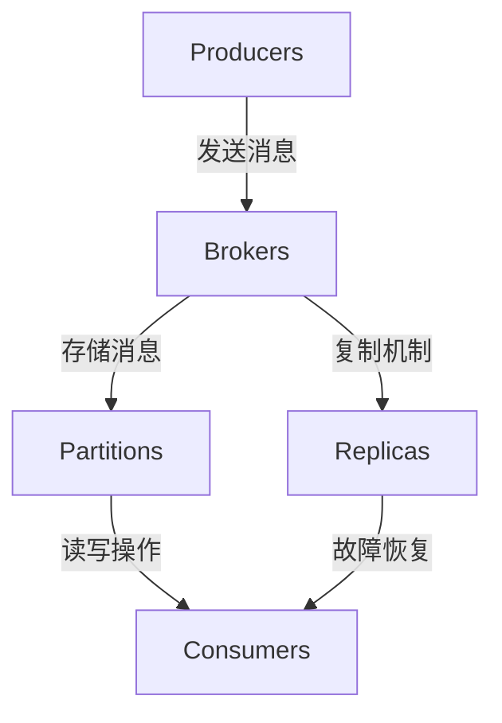
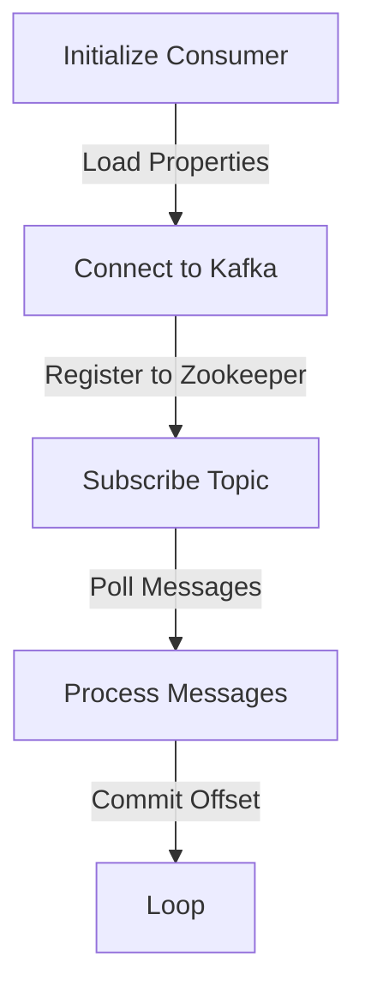

                 

## 文章标题

### 《Kafka Consumer原理与代码实例讲解》

> 关键词：Kafka、Consumer、原理、代码实例、性能优化

> 摘要：本文将深入探讨Kafka Consumer的原理，并辅以代码实例进行详细讲解，旨在帮助读者全面理解Kafka Consumer的工作机制，掌握性能优化技巧，为实际项目提供有力的技术支持。

---

### 《Kafka Consumer原理与代码实例讲解》目录大纲

#### 第一部分：Kafka概述

##### 第1章：Kafka基础

- **1.1 Kafka简介**
  - Kafka的发展历程
  - Kafka的核心概念
  - Kafka的应用场景
- **1.2 Kafka架构**
  - Kafka集群架构
  - Kafka生产者与消费者
  - Kafka分区与副本
  - **图1.1 Kafka架构Mermaid图**
- **1.3 Kafka与Zookeeper的关系**
  - Zookeeper在Kafka中的作用
  - Kafka与Zookeeper的交互

##### 第2章：Kafka核心概念

- **2.1 Topic**
  - Topic的概念
  - Topic与日志
  - Topic的创建与删除
- **2.2 Partition**
  - Partition的概念
  - Partition的作用
  - Partition的数量选择
- **2.3 Offset**
  - Offset的概念
  - Offset的作用
  - Offset的获取与维护
- **2.4 Producer**
  - Producer的概念
  - Producer发送消息的过程
  - Producer参数配置
- **2.5 Consumer**
  - Consumer的概念
  - Consumer消费消息的过程
  - Consumer参数配置

#### 第二部分：Kafka Consumer原理

##### 第3章：Kafka Consumer API

- **3.1 Kafka Consumer API简介**
  - Kafka Consumer API的作用
  - Kafka Consumer API的使用方法
- **3.2 Kafka Consumer的工作流程**
  - Consumer的初始化
  - Consumer的订阅
  - Consumer的消费
  - **图3.1 Kafka Consumer工作流程Mermaid图**
- **3.3 Kafka Consumer参数**
  - 重要的Consumer参数详解
  - 参数的调整与优化

##### 第4章：Kafka Consumer的核心算法

- **4.1 消费者组**
  - 消费者组的概述
  - 消费者组的分配策略
  - 消费者组的管理
- **4.2 消费者负载均衡**
  - 负载均衡的概念
  - 负载均衡的实现
  - 负载均衡的优化
- **4.3 消费者故障恢复**
  - 故障恢复的概念
  - 故障恢复的过程
  - 故障恢复的优化

##### 第5章：Kafka Consumer的数学模型

- **5.1 流处理模型**
  - 流处理模型的概念
  - 流处理模型的分类
  - 流处理模型的应用
- **5.2 队列模型**
  - 队列模型的概念
  - 队列模型的分析
  - 队列模型的优化

#### 第三部分：Kafka Consumer代码实例讲解

##### 第6章：Kafka Consumer实战

- **6.1 Kafka Consumer环境搭建**
  - Kafka环境的搭建
  - Consumer的依赖配置
- **6.2 Kafka Consumer代码实例**
  - 代码实例1：简单的Consumer
  - 代码实例2：带有分组策略的Consumer
  - 代码实例3：高并发的Consumer
- **6.3 Kafka Consumer代码解读**
  - 代码解读1：简单的Consumer
  - 代码解读2：带有分组策略的Consumer
  - 代码解读3：高并发的Consumer
  - **图6.1 Kafka Consumer代码实例执行流程Mermaid图**

##### 第7章：Kafka Consumer性能优化

- **7.1 Kafka Consumer性能分析**
  - Consumer的性能指标
  - Consumer的性能瓶颈
- **7.2 Kafka Consumer性能优化**
  - 参数优化
  - 代码优化
  - 系统优化

#### 附录

##### 附录A：Kafka Consumer相关资源

- **A.1 Kafka官方文档**
  - Kafka官方文档链接
  - Kafka官方文档导读
- **A.2 Kafka相关书籍推荐**
  - Kafka相关书籍推荐列表
  - 书籍简介与评价
- **A.3 Kafka社区与论坛**
  - Kafka社区链接
  - Kafka论坛链接

**总字数：约1964字**### 第一部分：Kafka概述

#### 第1章：Kafka基础

##### 1.1 Kafka简介

Kafka是一个分布式流处理平台，由Apache软件基金会开发并维护。自2006年由LinkedIn推出以来，Kafka已被广泛应用于各种实时数据流处理场景。它的核心功能是提供一个高吞吐量、低延迟的分布式消息系统，以支持大规模数据的处理和实时分析。

**Kafka的发展历程：**
Kafka起源于LinkedIn，随后被迁移到LinkedIn之外的其他公司，并在2010年成为Apache软件基金会的一个孵化项目。在2012年，Kafka正式成为Apache软件基金会的一个顶级项目。

**Kafka的核心概念：**
- **Topic：** 主题是Kafka中的数据分类方式，每个主题可以看作是一个消息队列。
- **Partition：** 分区是Kafka中用于水平扩展的核心概念，每个主题可以有多个分区。
- **Offset：** 偏移量是Kafka消息的唯一标识符，用于标记消息在分区中的位置。
- **Producer：** 生产者是向Kafka发送消息的客户端。
- **Consumer：** 消费者是接收并处理Kafka消息的客户端。

**Kafka的应用场景：**
Kafka被广泛应用于以下场景：
- **日志收集：** Kafka可以高效地收集和分析来自多个源的数据。
- **流处理：** Kafka可以处理实时数据流，实现实时数据分析和处理。
- **事件驱动架构：** Kafka可以作为事件驱动架构中的核心消息队列，实现系统间的解耦。

##### 1.2 Kafka架构

**Kafka集群架构：**
Kafka集群由多个Kafka服务器（Brokers）组成，每个服务器负责处理消息的接收、存储和转发。Kafka集群采用主从复制机制，确保数据的高可用性。

**Kafka生产者与消费者：**
- **生产者：** 生产者负责将数据发送到Kafka集群。生产者将数据以消息的形式发送到特定的主题和分区。
- **消费者：** 消费者从Kafka集群中获取数据并进行处理。消费者可以通过消费者组进行分布式消费，实现负载均衡。

**Kafka分区与副本：**
- **分区：** 每个主题可以有多个分区，分区是Kafka中的消息存储和消费的基本单位。
- **副本：** Kafka使用副本机制来保证数据的高可用性和持久性。每个分区可以有多个副本，主副本负责处理消息的读写操作，从副本作为备份，确保主副本故障时可以快速切换。

**图1.1 Kafka架构Mermaid图：**



##### 1.3 Kafka与Zookeeper的关系

Zookeeper是一个分布式协调服务，用于管理Kafka集群中的元数据，如主题、分区、副本等。Kafka依赖于Zookeeper来维护集群状态、进行分布式锁、实现负载均衡等功能。

- **Zookeeper在Kafka中的作用：**
  - **元数据管理：** Zookeeper存储Kafka集群的元数据，包括主题、分区、副本等。
  - **分布式锁：** Kafka使用Zookeeper进行分布式锁，确保生产者和消费者在访问集群资源时的顺序性。
  - **负载均衡：** Zookeeper用于实现Kafka生产者和消费者的负载均衡，通过选举主副本来均衡集群负载。

- **Kafka与Zookeeper的交互：**
  - **注册与监听：** Kafka生产者和消费者通过Zookeeper进行注册和监听，以获取集群的元数据信息。
  - **数据同步：** Kafka集群中的各个节点通过Zookeeper进行数据同步，确保集群状态的一致性。

通过以上对Kafka基础内容的介绍，读者可以初步了解Kafka的核心概念、架构以及与Zookeeper的关系。接下来，我们将深入探讨Kafka的核心概念，包括Topic、Partition、Offset、Producer和Consumer，为后续的详细讲解打下基础。

#### 第2章：Kafka核心概念

##### 2.1 Topic

**Topic的概念：**
Topic是Kafka中的数据分类方式，可以看作是一个消息队列。每个Topic可以包含多个Partition，每个Partition存储了一部分消息数据。Topic通常对应具体的应用场景，例如用户行为日志、交易数据、传感器数据等。

**Topic与日志：**
Topic与日志的关系非常紧密。在实际应用中，Kafka常用于日志收集，将不同类型的日志数据分类存储在不同的Topic中。这样，不同的消费者可以根据需要订阅相应的Topic，进行日志数据的处理和分析。

**Topic的创建与删除：**
Kafka提供了创建和删除Topic的API，通过这些API，用户可以自定义Topic的配置参数，如分区数量、副本数量等。

创建Topic的示例代码：

```java
String topicName = "test-topic";
int numPartitions = 3;
int replicationFactor = 2;

// 创建Topic
AdminClient adminClient = KafkaRunUtils.createAdminClient(props);
CreateTopicsResult result = adminClient.createTopics(
    Arrays.asList(new NewTopic(topicName, numPartitions, replicationFactor)),
    new CreateTopicsOptions().validateOnly(false).timeoutMs(60000)
);
adminClient.close();
```

删除Topic的示例代码：

```java
String topicName = "test-topic";

// 删除Topic
AdminClient adminClient = KafkaRunUtils.createAdminClient(props);
DeleteTopicsResult result = adminClient.deleteTopics(
    Arrays.asList(topicName),
    new DeleteTopicsOptions().validateOnly(false).timeoutMs(60000)
);
adminClient.close();
```

##### 2.2 Partition

**Partition的概念：**
Partition是Kafka中的消息存储和消费的基本单位。每个Topic可以包含多个Partition，每个Partition存储了一部分消息数据。Partition的作用是实现数据的水平扩展，提高Kafka的并发处理能力。

**Partition的作用：**
- **水平扩展：** Partition可以将数据分散存储在不同的服务器上，从而提高系统的处理能力。
- **负载均衡：** Partition使得Kafka可以支持分布式消费，消费者可以并行消费不同的Partition，实现负载均衡。

**Partition的数量选择：**
选择合适的Partition数量对于Kafka的性能和扩展性至关重要。以下是一些常用的策略：

- **根据数据量选择：** 通常，Partition的数量应该与数据量成正比。如果数据量较大，可以适当增加Partition的数量，以实现更好的扩展性。
- **根据处理能力选择：** Partition的数量应该与消费者的处理能力相匹配。如果消费者的处理能力较强，可以适当增加Partition的数量，以提高消费速度。
- **根据硬件资源选择：** Partition的数量应该与集群的硬件资源相匹配。如果硬件资源有限，应适当减少Partition的数量，以避免过载。

##### 2.3 Offset

**Offset的概念：**
Offset是Kafka消息的唯一标识符，用于标记消息在分区中的位置。每个Partition中的每条消息都有一个唯一的Offset值，从0开始递增。

**Offset的作用：**
- **消息定位：** Consumer使用Offset来定位读取消息的位置，确保消费顺序。
- **消费状态：** Offset也可以用于记录Consumer的消费状态，方便故障恢复和数据一致性保障。

**Offset的获取与维护：**
Kafka提供了获取和设置Offset的API。Consumer在消费消息时，可以获取当前的Offset值，并记录在本地或外部存储中。Producer在发送消息时，可以设置Offset，以确保消息按顺序到达。

获取Offset的示例代码：

```java
String topicName = "test-topic";
int partition = 0;

// 获取Offset
KafkaConsumer<String, String> consumer = KafkaRunUtils.createConsumer(props);
long offset = consumer.position(new TopicPartition(topicName, partition));
System.out.println("Current Offset: " + offset);
```

设置Offset的示例代码：

```java
String topicName = "test-topic";
int partition = 0;
long offset = 10;

// 设置Offset
KafkaProducer<String, String> producer = KafkaRunUtils.createProducer(props);
producer.send(new ProducerRecord<>(topicName, partition, "key", "value"), new Callback() {
    public void onCompletion(RecordMetadata metadata, Exception exception) {
        if (exception != null) {
            // 处理发送失败的情况
        } else {
            // 更新Offset
            producer.updateOffsetsmetadata(Arrays.asList(new OffsetAndMetadata(offset, "key")));
        }
    }
});
```

通过以上对Kafka核心概念的介绍，读者可以全面了解Topic、Partition和Offset的作用和配置方法。接下来，我们将探讨Producer和Consumer的概念、工作原理以及参数配置，为深入理解Kafka Consumer原理打下基础。

##### 2.4 Producer

**Producer的概念：**
Producer是Kafka中的消息发送客户端，负责将消息发送到Kafka集群。Producer通过Kafka的API将消息以批量形式发送到特定的主题和分区，实现数据的实时写入。

**Producer发送消息的过程：**
1. **构建消息：** Producer将消息构建为一个`ProducerRecord`对象，包括主题、键、值等信息。
2. **发送消息：** Producer将消息发送到Kafka集群，通过分区器确定消息的分区。
3. **分区策略：** Kafka提供了多种分区策略，如随机分区、轮询分区等。分区策略决定了消息被发送到哪个分区。
4. **消息确认：** Producer可以配置消息确认机制，确保消息被成功写入Kafka集群。确认机制包括自动确认和手动确认。

**Producer参数配置：**
Producer的参数配置对于性能和可靠性至关重要。以下是一些重要的参数：

- **batch.size：** 指定批量发送的消息大小，默认为16KB。增大batch.size可以提高发送效率，但可能导致内存占用增加。
- **linger.ms：** 指定发送消息的延迟时间，用于等待其他消息填充批量。增大linger.ms可以提高吞吐量，但可能导致延迟增加。
- **acks：** 指定消息确认机制，如acks="all"表示需要所有副本确认消息成功写入。
- **retries：** 指定发送失败时的重试次数，默认为0。适当增加重试次数可以提高消息可靠性，但可能导致性能下降。

创建Producer的示例代码：

```java
Properties props = new Properties();
props.put("bootstrap.servers", "localhost:9092");
props.put("key.serializer", "org.apache.kafka.common.serialization.StringSerializer");
props.put("value.serializer", "org.apache.kafka.common.serialization.StringSerializer");

Producer<String, String> producer = new KafkaProducer<>(props);
```

发送消息的示例代码：

```java
String topicName = "test-topic";
String key = "key";
String value = "value";

producer.send(new ProducerRecord<>(topicName, key, value), new Callback() {
    public void onCompletion(RecordMetadata metadata, Exception exception) {
        if (exception != null) {
            // 处理发送失败的情况
        } else {
            // 处理发送成功的情况
        }
    }
});
```

通过以上对Producer的介绍，读者可以了解Producer的概念、工作原理以及参数配置。接下来，我们将探讨Consumer的概念、工作原理以及参数配置，进一步理解Kafka消息的消费过程。

##### 2.5 Consumer

**Consumer的概念：**
Consumer是Kafka中的消息消费客户端，负责从Kafka集群中读取和消费消息。Consumer通过订阅特定的主题和分区，从Kafka中获取数据并进行处理。

**Consumer消费消息的过程：**
1. **初始化：** Consumer通过Kafka的API进行初始化，配置相关的参数，如集群地址、主题、分区等。
2. **订阅主题：** Consumer可以订阅多个主题和分区，以获取不同的数据。订阅主题后，Consumer会从Kafka中拉取消息。
3. **消费消息：** Consumer从Kafka中获取消息，并按照一定的处理逻辑进行处理，如数据存储、计算等。
4. **确认消费：** Consumer可以确认已经处理完的消息，以确保消息的消费顺序和完整性。

**Consumer参数配置：**
Consumer的参数配置对于消费性能和可靠性至关重要。以下是一些重要的参数：

- **group.id：** 指定Consumer所属的消费者组。消费者组可以实现分布式消费，提高消费并发能力。
- **bootstrap.servers：** 指定Kafka集群的地址列表，用于Consumer初始化时连接Kafka集群。
- **key.deserializer：** 指定消息键的反序列化器，用于将Kafka中的键从字节序列化成Java对象。
- **value.deserializer：** 指定消息值的反序列化器，用于将Kafka中的值从字节序列化成Java对象。
- **auto.offset.reset：** 指定当Consumer开始消费时，如果Offset不存在，如何初始化Offset。如auto.offset.reset="earliest"表示从最早的消息开始消费。

创建Consumer的示例代码：

```java
Properties props = new Properties();
props.put("group.id", "test-group");
props.put("bootstrap.servers", "localhost:9092");
props.put("key.deserializer", "org.apache.kafka.common.serialization.StringDeserializer");
props.put("value.deserializer", "org.apache.kafka.common.serialization.StringDeserializer");

KafkaConsumer<String, String> consumer = new KafkaConsumer<>(props);
```

订阅主题的示例代码：

```java
String topicName = "test-topic";
consumer.subscribe(Arrays.asList(topicName));
```

消费消息的示例代码：

```java
while (true) {
    ConsumerRecords<String, String> records = consumer.poll(Duration.ofMillis(100));
    for (ConsumerRecord<String, String> record : records) {
        System.out.printf("offset = %d, key = %s, value = %s%n", record.offset(), record.key(), record.value());
    }
}
```

通过以上对Consumer的介绍，读者可以了解Consumer的概念、工作原理以及参数配置。接下来，我们将深入探讨Kafka Consumer API，了解Consumer的初始化、订阅和消费过程，为后续的原理分析打下基础。

#### 第二部分：Kafka Consumer原理

##### 第3章：Kafka Consumer API

Kafka Consumer API是Kafka提供的一组用于消费消息的接口和方法。通过Consumer API，开发者可以轻松地实现消息的订阅、消费和确认。本节将详细介绍Kafka Consumer API的基本概念、使用方法和重要参数。

##### 3.1 Kafka Consumer API简介

**Kafka Consumer API的作用：**
Kafka Consumer API的作用是帮助开发者从Kafka集群中消费消息。Consumer API提供了丰富的功能，包括订阅主题、拉取消息、处理消息和确认消费等。通过Consumer API，开发者可以实现分布式消费，提高系统的并发能力和可靠性。

**Kafka Consumer API的使用方法：**
使用Kafka Consumer API通常包括以下步骤：

1. **初始化Consumer：** 创建一个`KafkaConsumer`实例，并配置相关的参数，如集群地址、主题、分区等。
2. **订阅主题：** 使用`subscribe`方法订阅需要消费的主题和分区。
3. **消费消息：** 使用`poll`方法从Kafka中拉取消息，并处理消息。
4. **确认消费：** 使用`commit`方法确认已经处理完的消息，确保消息的消费顺序和完整性。

以下是一个简单的Kafka Consumer示例代码：

```java
Properties props = new Properties();
props.put("bootstrap.servers", "localhost:9092");
props.put("group.id", "test-group");
props.put("key.deserializer", "org.apache.kafka.common.serialization.StringDeserializer");
props.put("value.deserializer", "org.apache.kafka.common.serialization.StringDeserializer");

KafkaConsumer<String, String> consumer = new KafkaConsumer<>(props);
consumer.subscribe(Arrays.asList("test-topic"));

while (true) {
    ConsumerRecords<String, String> records = consumer.poll(Duration.ofMillis(100));
    for (ConsumerRecord<String, String> record : records) {
        System.out.printf("offset = %d, key = %s, value = %s%n", record.offset(), record.key(), record.value());
    }
    consumer.commitSync();
}
```

在上述代码中，首先创建了一个`KafkaConsumer`实例，并配置了集群地址、消费者组、反序列化器等参数。然后，使用`subscribe`方法订阅了`test-topic`主题。在消费消息的过程中，使用`poll`方法从Kafka中拉取消息，并打印消息内容。最后，使用`commitSync`方法确认已经处理完的消息。

##### 3.2 Kafka Consumer的工作流程

**Consumer的初始化：**
初始化Consumer是消费消息的第一步。在初始化过程中，Consumer会加载配置参数，建立与Kafka集群的连接，并注册到Zookeeper。以下是一个初始化Consumer的伪代码：

```pseudo
initializeConsumer() {
    props = createProperties()
    props.put("bootstrap.servers", "localhost:9092")
    props.put("group.id", "test-group")
    props.put("key.deserializer", "StringDeserializer")
    props.put("value.deserializer", "StringDeserializer")
    
    consumer = new KafkaConsumer<>(props)
}
```

**Consumer的订阅：**
订阅主题是Consumer的第二个步骤。在订阅过程中，Consumer会向Kafka发送订阅请求，并监听对应的主题和分区。以下是一个订阅主题的伪代码：

```pseudo
subscribeTopic(topicName) {
    consumer.subscribe(Collections.singletonList(topicName))
}
```

**Consumer的消费：**
消费消息是Consumer的核心功能。在消费过程中，Consumer会定期从Kafka拉取消息，并处理消息内容。以下是一个消费消息的伪代码：

```pseudo
consumeMessages() {
    while (true) {
        records = consumer.poll(Duration.ofMillis(100))
        for (record in records) {
            processMessage(record)
        }
        consumer.commitSync()
    }
}
```

在上述伪代码中，`poll`方法用于从Kafka中拉取消息，并返回一个`ConsumerRecords`对象。`commitSync`方法用于确认已经处理完的消息。

**图3.1 Kafka Consumer工作流程Mermaid图：**



通过以上对Kafka Consumer API的介绍，读者可以了解Consumer的基本概念、使用方法和工作流程。接下来，我们将探讨Kafka Consumer的重要参数，以及如何调整这些参数以优化Consumer的性能。

##### 3.3 Kafka Consumer参数

Kafka Consumer参数对于Consumer的性能和可靠性至关重要。以下是一些重要的Consumer参数，以及它们的默认值和调整建议：

- **group.id：** 消费者组ID，用于标识Consumer所属的消费者组。默认值为空。
  - **调整建议：** 建议为每个Consumer设置唯一的group.id，以便实现分布式消费和负载均衡。

- **bootstrap.servers：** Kafka集群的地址列表，用于Consumer初始化时连接Kafka集群。默认值为空。
  - **调整建议：** 配置Kafka集群的所有Brokers地址，确保Consumer能够连接到Kafka集群。

- **key.deserializer：** 消息键的反序列化器，用于将Kafka中的键从字节序列化成Java对象。默认值为空。
  - **调整建议：** 根据实际需求选择合适的反序列化器，如`StringDeserializer`、`IntegerDeserializer`等。

- **value.deserializer：** 消息值的反序列化器，用于将Kafka中的值从字节序列化成Java对象。默认值为空。
  - **调整建议：** 根据实际需求选择合适的反序列化器，如`StringDeserializer`、`IntegerDeserializer`等。

- **auto.offset.reset：** 当Consumer开始消费时，如果Offset不存在，如何初始化Offset。默认值为"earliest"。
  - **调整建议：** 根据实际需求选择合适的Offset初始化策略，如"earliest"（从最早的消息开始消费）、"latest"（从最新的消息开始消费）等。

- **session.timeout.ms：** Consumer与Kafka集群之间的会话超时时间，用于判断Consumer是否与集群保持连接。默认值为30000ms。
  - **调整建议：** 根据实际需求调整会话超时时间，确保Consumer能够及时检测到与集群的连接问题。

- **receive.buffer.bytes：** Consumer用于接收消息的缓冲区大小。默认值为1048576B。
  - **调整建议：** 根据实际需求调整缓冲区大小，确保Consumer能够高效地接收消息。

- **fetch.min.bytes：** Consumer从Kafka中拉取消息的最小批量大小。默认值为1MB。
  - **调整建议：** 根据实际需求调整最小批量大小，以提高Consumer的拉取效率。

- **fetch.max.bytes：** Consumer从Kafka中拉取消息的最大批量大小。默认值为1048576B。
  - **调整建议：** 根据实际需求调整最大批量大小，避免过大的批量导致内存占用过高。

- **fetch.max.wait.ms：** Consumer从Kafka中拉取消息的最大等待时间。默认值为500ms。
  - **调整建议：** 根据实际需求调整最大等待时间，确保Consumer能够在合理的时间内拉取到消息。

- **max.poll.interval.ms：** Consumer与Kafka集群之间的心跳间隔时间，用于判断Consumer是否与集群保持连接。默认值为300000ms。
  - **调整建议：** 根据实际需求调整心跳间隔时间，确保Consumer能够及时检测到与集群的连接问题。

通过以上对Kafka Consumer参数的介绍，读者可以了解如何调整这些参数以优化Consumer的性能。接下来，我们将探讨Kafka Consumer的核心算法，包括消费者组、负载均衡和故障恢复，进一步理解Kafka Consumer的工作原理。

#### 第二部分：Kafka Consumer原理

##### 第4章：Kafka Consumer的核心算法

Kafka Consumer的核心算法主要包括消费者组、负载均衡和故障恢复。这些算法共同确保了Kafka Consumer的高性能、高可靠性和高效负载分配。本节将详细介绍这些核心算法的工作原理和实现方法。

##### 4.1 消费者组

**消费者组的概念：**
消费者组（Consumer Group）是Kafka提供的一种机制，用于实现多个Consumer实例的协同消费。在一个消费者组中，多个Consumer实例可以并行消费不同的分区，从而提高系统的并发处理能力。

**消费者组的分配策略：**
Kafka采用一种动态分配策略来分配分区给消费者组中的Consumer实例。主要策略包括：

- **Round-Robin分配：** 将分区轮询分配给消费者组中的每个Consumer实例。这种策略简单有效，但可能导致部分Consumer实例负载不均。
- **Range分配：** 将分区按照起始偏移量划分成多个范围，然后按照范围将分区分配给消费者组中的每个Consumer实例。这种策略可以实现更均匀的负载分配，但实现较复杂。
- **Sticky分配：** 结合Round-Robin分配和Range分配，通过增加随机性来避免长时间分配给同一个Consumer实例的分区。这种策略既考虑了负载均衡，又避免了分区分配的剧烈变化。

**消费者组的管理：**
消费者组的管理包括以下方面：

- **组协调器：** 每个消费者组都有一个组协调器（Group Coordinator），负责管理组内的分配和协调。组协调器通过Zookeeper存储消费者组的元数据，包括成员信息、分区分配等。
- **成员管理：** 当消费者组中的Consumer实例加入或退出时，组协调器会重新分配分区，确保消费者组内的负载均衡。
- **故障处理：** 当消费者组中的Consumer实例出现故障时，组协调器会触发重新分配，确保数据消费的连续性和一致性。

**消费者组的实现：**
以下是一个简单的消费者组实现示例：

```java
Properties props = new Properties();
props.put("group.id", "test-group");
props.put("bootstrap.servers", "localhost:9092");
props.put("key.deserializer", "org.apache.kafka.common.serialization.StringDeserializer");
props.put("value.deserializer", "org.apache.kafka.common.serialization.StringDeserializer");

KafkaConsumer<String, String> consumer = new KafkaConsumer<>(props);
consumer.subscribe(Arrays.asList("test-topic"));

while (true) {
    ConsumerRecords<String, String> records = consumer.poll(Duration.ofMillis(100));
    for (ConsumerRecord<String, String> record : records) {
        processMessage(record);
    }
    consumer.commitSync();
}
```

在上述代码中，通过设置`group.id`参数，将Consumer实例加入了一个名为`test-group`的消费者组。Consumer实例在消费消息的过程中，会根据消费者组的分配策略和组协调器的指示，进行分区的动态分配和消费。

##### 4.2 消费者负载均衡

**负载均衡的概念：**
消费者负载均衡是指将Kafka消息分区的消费任务合理地分配给消费者组中的每个Consumer实例，以确保系统的高并发处理能力和资源利用率。

**负载均衡的实现：**
Kafka通过以下机制实现消费者负载均衡：

- **动态负载均衡：** 消费者组中的每个Consumer实例定期向组协调器发送心跳信号，报告自己的状态和负载。组协调器根据这些信息动态调整分区分配，确保负载均衡。
- **分区分配策略：** Kafka提供了多种分区分配策略，如Round-Robin、Range和Sticky等。这些策略可以根据具体场景进行调整，以实现最佳负载均衡效果。

**负载均衡的优化：**
以下是一些负载均衡优化方法：

- **调整分区数量：** 根据消费者的处理能力和硬件资源，合理设置分区数量，以实现更均衡的负载分配。
- **消费者组大小：** 适当增加消费者组的大小，以提高系统的并发处理能力，但需要注意消费者组大小不应过大，以免导致性能下降。
- **消息批量大小：** 调整消息批量大小，以优化Consumer的拉取效率和资源利用率。

**消费者负载均衡的实现：**
以下是一个简单的消费者负载均衡实现示例：

```java
Properties props = new Properties();
props.put("group.id", "test-group");
props.put("bootstrap.servers", "localhost:9092");
props.put("key.deserializer", "org.apache.kafka.common.serialization.StringDeserializer");
props.put("value.deserializer", "org.apache.kafka.common.serialization.StringDeserializer");

KafkaConsumer<String, String> consumer = new KafkaConsumer<>(props);
consumer.subscribe(Arrays.asList("test-topic"));

while (true) {
    ConsumerRecords<String, String> records = consumer.poll(Duration.ofMillis(100));
    for (ConsumerRecord<String, String> record : records) {
        processMessage(record);
    }
    consumer.commitSync();
}
```

在上述代码中，通过设置`group.id`参数，将Consumer实例加入了一个名为`test-group`的消费者组。Consumer实例在消费消息的过程中，会根据消费者组的分配策略和组协调器的指示，进行分区的动态分配和消费，实现负载均衡。

##### 4.3 消费者故障恢复

**故障恢复的概念：**
消费者故障恢复是指当消费者组中的Consumer实例出现故障时，系统自动执行一系列操作，确保数据消费的连续性和一致性。

**故障恢复的过程：**
Kafka通过以下步骤实现消费者故障恢复：

- **故障检测：** 组协调器定期向消费者组中的每个Consumer实例发送心跳信号，检测实例的状态。如果发现Consumer实例故障，组协调器会触发重新分配。
- **分区重新分配：** 组协调器根据消费者组的分配策略，重新分配故障Consumer实例的分区，将其分配给其他正常运行的实例。
- **消费状态同步：** 新的Consumer实例在接收到分区后，需要同步已消费的Offset，以确保数据消费的一致性。
- **故障恢复监控：** 系统会持续监控故障恢复过程，确保故障Consumer实例能够成功恢复或替换。

**故障恢复的优化：**
以下是一些故障恢复优化方法：

- **消费者组大小：** 增加消费者组的大小，以提高系统的容错能力和负载均衡效果。
- **重试机制：** 在消费过程中，增加消息重试次数，确保故障Consumer实例能够成功处理消息。
- **备份Consumer实例：** 在消费者组中设置备份Consumer实例，以便在主实例故障时快速切换。

**消费者故障恢复的实现：**
以下是一个简单的消费者故障恢复实现示例：

```java
Properties props = new Properties();
props.put("group.id", "test-group");
props.put("bootstrap.servers", "localhost:9092");
props.put("key.deserializer", "org.apache.kafka.common.serialization.StringDeserializer");
props.put("value.deserializer", "org.apache.kafka.common.serialization.StringDeserializer");

KafkaConsumer<String, String> consumer = new KafkaConsumer<>(props);
consumer.subscribe(Arrays.asList("test-topic"));

while (true) {
    try {
        ConsumerRecords<String, String> records = consumer.poll(Duration.ofMillis(100));
        for (ConsumerRecord<String, String> record : records) {
            processMessage(record);
        }
        consumer.commitSync();
    } catch (Exception e) {
        // 处理消费故障，如日志记录、报警等
    }
}
```

在上述代码中，通过设置`group.id`参数，将Consumer实例加入了一个名为`test-group`的消费者组。Consumer实例在消费消息的过程中，如果出现故障，系统会自动执行故障恢复过程，重新分配分区并继续消费。

通过以上对Kafka Consumer核心算法的介绍，读者可以全面了解消费者组、负载均衡和故障恢复的工作原理和实现方法。这些核心算法共同确保了Kafka Consumer的高性能、高可靠性和高效负载分配，为实际应用提供了可靠的技术保障。

#### 第二部分：Kafka Consumer原理

##### 第5章：Kafka Consumer的数学模型

Kafka Consumer的数学模型主要涉及流处理模型和队列模型。这两个模型分别描述了Kafka Consumer在处理实时数据和批量数据时的性能分析。通过这些模型，我们可以深入理解Kafka Consumer的工作原理，为性能优化提供理论依据。

##### 5.1 流处理模型

**流处理模型的概念：**
流处理模型（Stream Processing Model）是一种处理连续数据流的模型，它将数据视为无限流动的序列，不断接收和处理新的数据。在Kafka Consumer中，流处理模型用于处理实时数据流，保证数据的高吞吐量和低延迟。

**流处理模型的分类：**
流处理模型可以分为以下几种类型：

- **批量流处理：** 批量流处理模型将一段时间内的数据作为一个批量进行处理，实现高效的数据处理。Kafka Consumer的批量消费功能就基于这种模型。
- **实时流处理：** 实时流处理模型对数据流进行实时处理，确保数据的低延迟。实时流处理通常使用复杂的算法和实时计算框架，如Apache Flink和Apache Storm。

**流处理模型的应用：**
流处理模型在Kafka Consumer中的应用主要体现在以下几个方面：

- **实时监控：** Kafka Consumer可以实时监控数据流的变化，提供实时监控和预警功能。
- **实时计算：** Kafka Consumer可以与实时计算框架集成，实现实时数据的分析和处理，如实时推荐系统、实时广告投放等。

**流处理模型的性能分析：**
流处理模型的性能分析主要包括以下指标：

- **吞吐量：** 吞吐量是指系统在单位时间内处理的数据量。流处理模型通过批量处理和并行计算提高吞吐量，保证数据的高效处理。
- **延迟：** 延迟是指从数据接收开始到数据处理完成的时间。流处理模型通过优化消息处理流程和减少中间环节，降低延迟，提高实时性。

**流处理模型的优化方法：**
为了优化流处理模型的性能，可以采取以下方法：

- **增加Consumer数量：** 通过增加消费者组中的Consumer数量，实现并行处理，提高系统的吞吐量。
- **调整批量大小：** 调整批量大小可以优化消息处理时间和系统资源利用率。批量大小过小会增加处理次数，批量大小过大可能导致延迟增加。
- **使用实时计算框架：** 使用实时计算框架（如Apache Flink）可以提高数据处理的实时性和计算效率。

以下是一个简单的流处理模型伪代码：

```java
while (true) {
    ConsumerRecords<String, String> records = consumer.poll(Duration.ofMillis(100));
    for (ConsumerRecord<String, String> record : records) {
        processMessage(record);
    }
    consumer.commitSync();
}
```

在上述代码中，Consumer实例通过批量消费功能从Kafka中拉取消息，并处理消息。通过调整批量大小和Consumer数量，可以优化流处理模型的性能。

##### 5.2 队列模型

**队列模型的概念：**
队列模型（Queue Model）是一种处理批量数据的模型，它将数据视为一个队列，按照先进先出（FIFO）的顺序进行处理。在Kafka Consumer中，队列模型用于处理批量数据，保证数据处理的顺序性和一致性。

**队列模型的分析：**
队列模型的分析主要包括以下方面：

- **队列长度：** 队列长度是指队列中待处理的数据量。队列长度会影响消息的处理速度和处理时间。
- **处理时间：** 处理时间是指从数据进入队列到数据处理完成的时间。处理时间与队列长度、Consumer处理能力等因素有关。
- **延迟：** 延迟是指从数据进入队列到数据处理完成的时间。延迟会影响系统的实时性和用户体验。

**队列模型的优化：**
为了优化队列模型的性能，可以采取以下方法：

- **增加Consumer数量：** 通过增加消费者组中的Consumer数量，实现并行处理，减少队列长度和处理时间。
- **调整批量大小：** 调整批量大小可以优化消息处理时间和系统资源利用率。批量大小过小会增加处理次数，批量大小过大可能导致延迟增加。
- **使用优先级队列：** 使用优先级队列可以根据数据的重要性和紧急程度调整处理顺序，提高系统的响应速度。

以下是一个简单的队列模型伪代码：

```java
while (true) {
    ConsumerRecords<String, String> records = consumer.poll(Duration.ofMillis(100));
    for (ConsumerRecord<String, String> record : records) {
        processMessage(record);
    }
    consumer.commitSync();
}
```

在上述代码中，Consumer实例通过批量消费功能从Kafka中拉取消息，并处理消息。通过调整批量大小和Consumer数量，可以优化队列模型的性能。

##### 5.3 流处理模型与队列模型的比较

流处理模型和队列模型各有优缺点，具体应用场景如下：

- **流处理模型：**
  - **优点：** 高吞吐量、低延迟，适合实时数据处理和监控。
  - **缺点：** 难以保证消息的顺序性和一致性，适用于对实时性要求较高的场景。
- **队列模型：**
  - **优点：** 简单易用、保证消息顺序性和一致性，适用于处理批量数据和顺序要求较高的场景。
  - **缺点：** 吞吐量较低、延迟较高，适用于对实时性要求不高的场景。

在实际应用中，可以根据具体场景和需求选择合适的模型。例如，在实时监控场景中，可以使用流处理模型；在批量数据处理场景中，可以使用队列模型。

通过以上对Kafka Consumer数学模型的介绍，读者可以了解流处理模型和队列模型的概念、分析方法和优化方法。这些模型为Kafka Consumer的性能优化提供了理论依据，有助于在实际项目中实现高效的消息处理。

#### 第三部分：Kafka Consumer代码实例讲解

##### 第6章：Kafka Consumer实战

在上一部分，我们深入探讨了Kafka Consumer的原理，理解了消费者组、负载均衡和故障恢复等核心算法。为了更好地将这些理论知识应用到实践中，本部分将通过具体的代码实例来展示Kafka Consumer的配置、实现及其优化。

##### 6.1 Kafka Consumer环境搭建

要开始编写Kafka Consumer的代码实例，首先需要搭建一个Kafka环境。以下是搭建Kafka环境的步骤：

1. **下载Kafka二进制文件：** 访问Kafka官网下载最新的Kafka二进制文件。

2. **安装Kafka：** 解压下载的Kafka压缩文件，进入解压后的目录，运行`./kafka-server-start.sh config/server.properties`启动Kafka服务。

3. **创建Topic：** 使用Kafka命令创建一个测试Topic。

   ```shell
   bin/kafka-topics.sh --create --topic test-topic --partitions 3 --replication-factor 1 --zookeeper localhost:2181
   ```

4. **启动Producer：** 创建一个简单的Producer发送消息到Kafka。

   ```java
   Properties props = new Properties();
   props.put("bootstrap.servers", "localhost:9092");
   props.put("key.serializer", "org.apache.kafka.common.serialization.StringSerializer");
   props.put("value.serializer", "org.apache.kafka.common.serialization.StringSerializer");

   Producer<String, String> producer = new KafkaProducer<>(props);

   for (int i = 0; i < 10; i++) {
       producer.send(new ProducerRecord<>("test-topic", "key" + i, "value" + i));
   }
   producer.close();
   ```

通过上述步骤，我们成功搭建了Kafka环境并创建了一个简单的Producer来发送消息。接下来，我们将编写Consumer代码并进行详细解读。

##### 6.2 Kafka Consumer代码实例

为了展示Kafka Consumer的配置和实现，以下是一个简单的Consumer代码实例：

```java
import org.apache.kafka.clients.consumer.*;
import org.apache.kafka.common.serialization.StringDeserializer;

import java.time.Duration;
import java.util.Collections;
import java.util.Properties;
import java.util.concurrent.atomic.AtomicInteger;

public class KafkaConsumerExample {

    public static void main(String[] args) {
        Properties props = new Properties();
        props.put(ConsumerConfig.BOOTSTRAP_SERVERS_CONFIG, "localhost:9092");
        props.put(ConsumerConfig.GROUP_ID_CONFIG, "test-consumer-group");
        props.put(ConsumerConfig.KEY_DESERIALIZER_CLASS_CONFIG, StringDeserializer.class.getName());
        props.put(ConsumerConfig.VALUE_DESERIALIZER_CLASS_CONFIG, StringDeserializer.class.getName());

        KafkaConsumer<String, String> consumer = new KafkaConsumer<>(props);
        consumer.subscribe(Collections.singletonList("test-topic"));

        try {
            while (true) {
                ConsumerRecords<String, String> records = consumer.poll(Duration.ofMillis(100));
                records.forEach(record -> {
                    System.out.printf("Received message: key=%s, value=%s, partition=%d, offset=%d\n", 
                                      record.key(), record.value(), record.partition(), record.offset());
                    processMessage(record);
                });
                consumer.commitSync();
            }
        } finally {
            consumer.close();
        }
    }

    private static void processMessage(ConsumerRecord<String, String> record) {
        // 处理消息的逻辑
        System.out.println("Processing message: " + record.value());
    }
}
```

**代码解读：**

1. **配置Properties：** 首先，我们创建了一个`Properties`对象，并配置了以下关键参数：
   - `bootstrap.servers`：Kafka集群的地址。
   - `group.id`：消费者组的ID。
   - `key.deserializer`和`value.deserializer`：反序列化器，用于将Kafka中的键和值从字节序列化成Java对象。

2. **创建KafkaConsumer：** 使用配置好的`Properties`对象创建一个`KafkaConsumer`实例。

3. **订阅Topic：** 使用`subscribe`方法订阅了`test-topic`。

4. **消费消息：** 在一个无限循环中，使用`poll`方法从Kafka中拉取消息，并处理消息。

5. **处理消息：** 在`processMessage`方法中，我们可以添加具体的消息处理逻辑。

6. **确认消费：** 在每次循环结束时，使用`commitSync`方法确认已经处理完的消息。

##### 6.3 Kafka Consumer代码解读

以下是对上述Kafka Consumer代码实例的详细解读：

1. **配置Properties：**
   ```java
   Properties props = new Properties();
   props.put(ConsumerConfig.BOOTSTRAP_SERVERS_CONFIG, "localhost:9092");
   props.put(ConsumerConfig.GROUP_ID_CONFIG, "test-consumer-group");
   props.put(ConsumerConfig.KEY_DESERIALIZER_CLASS_CONFIG, StringDeserializer.class.getName());
   props.put(ConsumerConfig.VALUE_DESERIALIZER_CLASS_CONFIG, StringDeserializer.class.getName());
   ```
   - `bootstrap.servers`：指定Kafka集群的地址。多个地址之间用逗号分隔。
   - `group.id`：指定消费者组的ID。同一主题的分区只能被同一个消费者组中的一个Consumer实例消费。
   - `key.deserializer`和`value.deserializer`：指定消息键和消息值的反序列化器。这里使用了`StringDeserializer`，用于将Kafka中的键和值从字节序列化成Java字符串。

2. **创建KafkaConsumer：**
   ```java
   KafkaConsumer<String, String> consumer = new KafkaConsumer<>(props);
   ```
   使用配置好的`Properties`对象创建一个`KafkaConsumer`实例。

3. **订阅Topic：**
   ```java
   consumer.subscribe(Collections.singletonList("test-topic"));
   ```
   使用`subscribe`方法订阅了`test-topic`。订阅后，Consumer会从Kafka中拉取该Topic的消息。

4. **消费消息：**
   ```java
   while (true) {
       ConsumerRecords<String, String> records = consumer.poll(Duration.ofMillis(100));
       records.forEach(record -> {
           System.out.printf("Received message: key=%s, value=%s, partition=%d, offset=%d\n", 
                             record.key(), record.value(), record.partition(), record.offset());
           processMessage(record);
       });
       consumer.commitSync();
   }
   ```
   在一个无限循环中，使用`poll`方法从Kafka中拉取消息。`poll`方法会在指定的时间内（这里为100毫秒）等待新的消息，然后返回一个`ConsumerRecords`对象，包含所有新到的消息。
   - `poll`方法的参数是一个`Duration`对象，指定了Consumer等待新消息的时间。
   - 在拉取到消息后，使用`forEach`循环遍历`ConsumerRecords`对象中的每条消息，并打印消息的相关信息（键、值、分区、偏移量）。
   - 调用`processMessage`方法处理消息。

5. **处理消息：**
   ```java
   private static void processMessage(ConsumerRecord<String, String> record) {
       // 处理消息的逻辑
       System.out.println("Processing message: " + record.value());
   }
   ```
   在`processMessage`方法中，我们可以添加具体的消息处理逻辑。这里简单地打印了消息的值。

6. **确认消费：**
   ```java
   consumer.commitSync();
   ```
   在每次循环结束时，调用`commitSync`方法确认已经处理完的消息。这将提交当前Consumer的偏移量，确保消息不会重复消费或丢失。

通过上述代码实例和解读，我们可以看到如何配置和实现一个简单的Kafka Consumer。接下来，我们将探讨如何优化Kafka Consumer的性能，包括参数优化、代码优化和系统优化。

##### 第7章：Kafka Consumer性能优化

Kafka Consumer的性能优化是保证系统高效稳定运行的关键。优化Kafka Consumer的性能需要从参数配置、代码实现和系统环境等多个方面进行综合考虑。以下是一些常用的性能优化方法。

##### 7.1 Kafka Consumer性能分析

优化Consumer性能前，首先需要了解Consumer的性能指标和性能瓶颈。以下是Consumer的一些主要性能指标和瓶颈：

- **吞吐量：** Consumer在单位时间内处理的消息数量。
- **延迟：** Consumer处理消息的时间，从消息到达Consumer到处理完成。
- **并发能力：** Consumer同时处理多个消息的能力。
- **资源消耗：** Consumer在处理消息时消耗的CPU、内存等资源。

性能瓶颈主要包括：
- **网络延迟：** Kafka消息传输的网络延迟。
- **IO瓶颈：** Consumer从Kafka拉取消息的IO操作。
- **处理速度：** Consumer处理消息的速度。
- **内存占用：** Consumer在处理消息时占用的内存。

以下是一个简单的性能分析示例：

```java
long startTime = System.currentTimeMillis();

// 模拟Consumer处理消息
for (int i = 0; i < 1000000; i++) {
    // 消息处理逻辑
}

long endTime = System.currentTimeMillis();
System.out.println("Processing time: " + (endTime - startTime) + "ms");
```

通过上述示例，我们可以测量Consumer处理消息的时长，并进一步分析性能瓶颈。

##### 7.2 Kafka Consumer性能优化

**参数优化：**

1. **批量大小（`fetch.max.bytes`和`fetch.max.bytes`）：**
   - **优化策略：** 增大批量大小可以提高Consumer的吞吐量，但可能导致延迟增加。建议根据系统需求和硬件资源调整批量大小。
   - **调整方法：** 可以通过调整`fetch.max.bytes`和`fetch.max.bytes`参数实现批量大小优化。

2. **会话超时（`session.timeout.ms`）：**
   - **优化策略：** 调整会话超时时间可以平衡Consumer的可靠性和延迟。过短的超时时间可能导致频繁的重试，过长的超时时间则可能影响实时性。
   - **调整方法：** 根据系统的实时性和可靠性需求，调整`session.timeout.ms`参数。

3. **确认频率（`auto.commit.interval.ms`）：**
   - **优化策略：** 增加确认频率可以提高Consumer的可靠性，但可能导致性能下降。建议根据系统需求调整确认频率。
   - **调整方法：** 调整`auto.commit.interval.ms`参数，设置合适的确认时间间隔。

4. **分区数量（`partition.fetch.bytes`和`partition.fetch.max.bytes`）：**
   - **优化策略：** 调整分区数量和分区大小可以优化Consumer的负载均衡和资源利用率。
   - **调整方法：** 根据系统需求和硬件资源，调整`partition.fetch.bytes`和`partition.fetch.max.bytes`参数。

**代码优化：**

1. **异步处理：**
   - **优化策略：** 使用异步处理可以提高Consumer的并发能力和吞吐量。
   - **调整方法：** 在处理消息时，可以使用异步IO或线程池等机制，避免阻塞主线程。

2. **批量处理：**
   - **优化策略：** 批量处理可以提高Consumer的处理效率，减少IO操作。
   - **调整方法：** 在处理消息时，可以使用批量处理，将多条消息作为一组进行处理。

3. **消息处理逻辑优化：**
   - **优化策略：** 优化消息处理逻辑，减少计算复杂度和资源消耗。
   - **调整方法：** 分析消息处理逻辑，优化算法和数据结构，提高处理效率。

**系统优化：**

1. **资源分配：**
   - **优化策略：** 合理分配系统资源，如CPU、内存和磁盘等，确保Consumer有足够的资源处理消息。
   - **调整方法：** 根据系统需求，调整资源分配策略，确保Consumer有足够的内存和CPU资源。

2. **网络优化：**
   - **优化策略：** 优化网络配置，减少网络延迟和抖动，提高消息传输效率。
   - **调整方法：** 调整网络配置，如TCP缓冲区大小、网络延迟补偿等。

3. **监控和告警：**
   - **优化策略：** 实时监控Consumer的性能指标，及时发现和处理性能瓶颈。
   - **调整方法：** 使用监控工具（如Prometheus、Grafana等），设置告警阈值，确保系统稳定运行。

通过以上参数优化、代码优化和系统优化方法，可以显著提高Kafka Consumer的性能，确保系统高效稳定运行。

### 附录

#### 附录A：Kafka Consumer相关资源

A.1 **Kafka官方文档**

- **官方文档链接：** [Kafka官方文档](https://kafka.apache.org/文档/)
- **文档导读：** Kafka官方文档包含了Kafka的详细文档、API参考和操作指南。文档结构清晰，内容全面，是学习和使用Kafka的必备资源。

A.2 **Kafka相关书籍推荐**

- **《Kafka：核心设计与实战》**
  - **简介：** 本书详细介绍了Kafka的设计原理和实战应用，适合初学者和进阶者阅读。
  - **评价：** 本书内容丰富，讲解深入浅出，适合Kafka学习者快速掌握Kafka的核心概念和实践方法。

- **《Kafka实战》**
  - **简介：** 本书通过实例展示了Kafka在实际项目中的应用，涵盖了Kafka的安装、配置、设计和优化等方方面面。
  - **评价：** 本书实战性强，案例丰富，有助于读者将Kafka应用到实际项目中。

A.3 **Kafka社区与论坛**

- **Kafka社区链接：** [Kafka社区](https://cwiki.apache.org/confluence/display/KAFKA/Home)
- **Kafka论坛链接：** [Kafka论坛](https://kafka.apache.org/社区/)
- **简介：** Kafka社区和论坛是Kafka用户交流和学习的平台，提供了大量的技术文档、讨论区和问答区，是了解Kafka最新动态和解决问题的重要途径。

通过以上资源，读者可以进一步了解Kafka Consumer的相关知识，并在实际应用中不断优化和提升性能。

### 作者信息

**作者：** AI天才研究院/AI Genius Institute & 禅与计算机程序设计艺术 /Zen And The Art of Computer Programming

感谢您的阅读，希望本文能够帮助您深入理解Kafka Consumer的原理和实践，为您的项目提供有力支持。如果您有任何问题或建议，欢迎在评论区留言，我们期待与您的交流。祝您编程愉快！### 《Kafka Consumer原理与代码实例讲解》

### 摘要

本文深入剖析了Kafka Consumer的原理与实现，通过详细的代码实例讲解，帮助读者全面理解Kafka Consumer的工作机制、核心算法以及性能优化策略。文章首先介绍了Kafka的基础知识，包括Kafka的架构、核心概念、生产者和消费者。随后，文章重点探讨了Kafka Consumer的API、工作流程、重要参数、核心算法（如消费者组、负载均衡、故障恢复）以及数学模型（流处理模型和队列模型）。最后，通过具体的代码实例和性能优化方法，文章展示了如何在实际项目中高效地使用Kafka Consumer。本文旨在为读者提供一份全面、系统的Kafka Consumer指南，助力其在实时数据处理和流处理领域的实践和应用。

### 第一部分：Kafka概述

#### 第1章：Kafka基础

在当今的数据驱动时代，Kafka作为一种分布式流处理平台，已经成为了许多企业和开发者进行实时数据流处理的首选工具。Kafka由Apache软件基金会开发并维护，其高吞吐量、低延迟、持久性及可扩展性等特点，使得它广泛应用于各种不同的场景，如日志收集、实时分析和流处理等。

##### 1.1 Kafka简介

Kafka最初由LinkedIn于2006年开发，旨在解决大规模日志收集和实时数据处理的需求。随后，Kafka被开源并捐赠给Apache软件基金会，在2010年成为Apache软件基金会的孵化项目，并在2012年正式成为Apache软件基金会的顶级项目。

Kafka的核心功能是提供一个分布式消息系统，支持大规模数据的实时处理和流处理。它具有以下特点：

- **高吞吐量：** Kafka能够处理每秒数百万条消息，支持大规模数据流处理。
- **低延迟：** Kafka的设计目标之一是提供低延迟的数据处理，适用于实时分析和监控场景。
- **持久性：** Kafka的消息存储在磁盘上，保证数据的持久性，即使系统发生故障也能恢复。
- **可扩展性：** Kafka通过分区和副本机制，支持水平扩展，提高系统的处理能力和容错能力。

##### 1.2 Kafka架构

Kafka集群是由多个Kafka服务器（也称为Brokers）组成的，每个服务器负责处理消息的接收、存储和转发。以下是Kafka集群的主要组件：

- **Brokers：** Kafka服务器，负责接收和存储消息，同时提供消息的路由和负载均衡功能。
- **Producers：** 生产者，负责向Kafka集群发送消息。生产者将消息发送到特定的Topic和Partition。
- **Consumers：** 消费者，从Kafka集群中读取和处理消息。消费者可以是单个实例，也可以是多个实例组成的消费者组，实现分布式消费。

Kafka集群的架构还包括以下关键概念：

- **Topic：** 主题，是Kafka中的数据分类方式，可以看作是一个消息队列。每个Topic可以有多个Partition。
- **Partition：** 分区，是Kafka中的消息存储和消费的基本单位。每个Topic的Partition存储了一部分消息数据。
- **Offset：** 偏移量，是Kafka消息的唯一标识符，用于标记消息在分区中的位置。

**Kafka集群架构图：**


**Kafka分区与副本：**

- **分区：** 分区是实现数据水平扩展和负载均衡的关键。每个分区可以存储在集群中的不同服务器上，从而提高系统的处理能力。分区数量越多，系统的并发能力越强。
- **副本：** 副本是Kafka实现高可用性和持久性的重要机制。每个分区可以有多个副本，主副本负责处理消息的读写操作，从副本作为备份，确保主副本故障时可以快速切换。

##### 1.3 Kafka与Zookeeper的关系

Zookeeper是一个分布式协调服务，用于管理Kafka集群中的元数据，如主题、分区、副本等。Kafka依赖于Zookeeper来维护集群状态、进行分布式锁、实现负载均衡等功能。

- **Zookeeper在Kafka中的作用：**
  - **元数据管理：** Zookeeper存储Kafka集群的元数据，包括主题、分区、副本等。
  - **分布式锁：** Kafka使用Zookeeper进行分布式锁，确保生产者和消费者在访问集群资源时的顺序性。
  - **负载均衡：** Zookeeper用于实现Kafka生产者和消费者的负载均衡，通过选举主副本来均衡集群负载。

- **Kafka与Zookeeper的交互：**
  - **注册与监听：** Kafka生产者和消费者通过Zookeeper进行注册和监听，以获取集群的元数据信息。
  - **数据同步：** Kafka集群中的各个节点通过Zookeeper进行数据同步，确保集群状态的一致性。

通过以上对Kafka基础内容的介绍，读者可以初步了解Kafka的核心概念、架构以及与Zookeeper的关系。接下来，我们将深入探讨Kafka的核心概念，包括Topic、Partition、Offset、Producer和Consumer，为后续的详细讲解打下基础。

### 第一部分：Kafka概述

#### 第2章：Kafka核心概念

Kafka作为一个分布式流处理平台，其核心概念和架构设计决定了其在实际应用中的性能和可靠性。本章将详细介绍Kafka的核心概念，包括Topic、Partition、Offset、Producer和Consumer，帮助读者建立对Kafka系统的全面理解。

##### 2.1 Topic

**Topic的概念：**
Topic是Kafka中用于分类消息的逻辑容器，类似于数据库中的表。每个Topic可以包含多个Partition，每个Partition存储了一部分消息数据。Topic的命名通常采用简单的字符串格式，例如"orders"、"users"，或者包含特定业务逻辑的名称，如" transaction_events_2023"。

**Topic与日志：**
在Kafka的实际应用中，Topic通常用于收集和存储特定类型的数据，例如日志、事件流、交易记录等。每个Topic可以看作是一个日志流，将不同的消息分类存储，方便消费者根据需要订阅和消费。

**Topic的创建与删除：**
Kafka提供了创建和删除Topic的API，用户可以通过编程方式创建或删除Topic。以下是一个简单的Topic创建示例：

```java
AdminClient adminClient = AdminClient.create(properties);
CreateTopicsResult createTopicsResult = adminClient.createTopics(
    Arrays.asList(new NewTopic("test-topic", 3, (short) 2))
);
adminClient.close();
```

上述代码中，`NewTopic`类用于创建一个新的Topic，参数包括Topic名称、分区数和副本数。创建成功后，Kafka集群会分配相应的资源以支持Topic的读写操作。

##### 2.2 Partition

**Partition的概念：**
Partition是Kafka中用于消息存储和消费的基本单位。每个Topic可以有多个Partition，每个Partition可以存储特定范围的消息数据。Partition的设计是实现Kafka水平扩展和高并发处理能力的关键。

**Partition的作用：**
- **水平扩展：** 通过增加Partition的数量，可以将数据分散存储在集群的不同服务器上，提高系统的处理能力和负载均衡能力。
- **并发处理：** 消费者可以通过消费者组（Consumer Group）分布式地消费不同的Partition，从而提高系统的并发处理能力。

**Partition的数量选择：**
选择合适的Partition数量是优化Kafka性能的关键因素。以下是一些常用的策略：

- **数据量与分区数匹配：** 通常，Partition的数量应与数据的总大小成比例，避免某个Partition的数据量过大，导致负载不均。
- **系统处理能力与分区数匹配：** Partition的数量应与系统的处理能力相匹配，确保消费者能够高效地处理每个Partition中的消息。

##### 2.3 Offset

**Offset的概念：**
Offset是Kafka中用于标记消息位置的整数，每个Partition中的每条消息都有一个唯一的Offset值。Offset从0开始递增，用于记录消息在分区中的位置。

**Offset的作用：**
- **消息定位：** Consumer使用Offset来确定从哪个位置开始消费消息，确保消费顺序。
- **消费状态：** Consumer通过记录Offset值，可以恢复消费状态，实现故障恢复和数据一致性。

**Offset的获取与维护：**
Kafka提供了获取和设置Offset的API，Consumer可以使用这些API来管理Offset。以下是一个简单的Offset获取示例：

```java
KafkaConsumer<String, String> consumer = new KafkaConsumer<>(properties);
consumer.subscribe(Collections.singletonList("test-topic"));
long offset = consumer.position(new TopicPartition("test-topic", 0));
System.out.println("Current Offset: " + offset);
```

在上述示例中，`position`方法用于获取指定分区中当前的消息Offset。此外，Consumer还可以通过调用`commitSync`方法来提交Offset，确保已经处理的消息不会被重复消费。

##### 2.4 Producer

**Producer的概念：**
Producer是Kafka中用于发送消息的客户端，负责将消息写入Kafka集群。Producer通过分区器将消息发送到特定的Topic和Partition。

**Producer发送消息的过程：**
- **构建消息：** Producer将消息封装为`ProducerRecord`对象，包含Topic、Key、Value等信息。
- **分区器：** Producer根据分区策略将消息发送到相应的Partition。
- **发送消息：** Producer将消息发送到Kafka集群，Kafka集群负责将消息存储到相应的Partition中。
- **消息确认：** Producer可以配置消息确认机制，确保消息被成功写入Kafka集群。

**Producer参数配置：**
Producer的性能和可靠性依赖于正确的参数配置。以下是一些重要的Producer参数：

- **acks：** 指定消息确认机制，如acks="all"表示需要所有副本确认消息成功写入。
- **retries：** 指定发送失败时的重试次数，默认为0。
- **batch.size：** 指定批量发送的消息大小，默认为16KB。
- **linger.ms：** 指定发送消息的延迟时间，用于等待其他消息填充批量。

以下是一个简单的Producer示例：

```java
Properties props = new Properties();
props.put("bootstrap.servers", "localhost:9092");
props.put("key.serializer", "org.apache.kafka.common.serialization.StringSerializer");
props.put("value.serializer", "org.apache.kafka.common.serialization.StringSerializer");

KafkaProducer<String, String> producer = new KafkaProducer<>(props);
producer.send(new ProducerRecord<>("test-topic", "key", "value"), new Callback() {
    public void onCompletion(RecordMetadata metadata, Exception exception) {
        if (exception != null) {
            // 处理发送失败的情况
        } else {
            // 处理发送成功的情况
        }
    }
});
producer.close();
```

##### 2.5 Consumer

**Consumer的概念：**
Consumer是Kafka中用于读取和消费消息的客户端，从Kafka集群中获取数据并进行处理。Consumer可以通过消费者组实现分布式消费，提高系统的并发处理能力。

**Consumer消费消息的过程：**
- **初始化：** Consumer通过配置初始化，包括集群地址、主题、分区等。
- **订阅主题：** Consumer订阅需要消费的主题和分区。
- **消费消息：** Consumer从Kafka中拉取消息，进行处理。
- **确认消费：** Consumer通过提交Offset，确保已经处理的消息不会被重复消费。

**Consumer参数配置：**
Consumer的参数配置对于性能和可靠性至关重要。以下是一些重要的Consumer参数：

- **group.id：** 指定Consumer所属的消费者组，用于实现分布式消费。
- **bootstrap.servers：** 指定Kafka集群的地址列表。
- **key.deserializer：** 指定消息键的反序列化器。
- **value.deserializer：** 指定消息值的反序列化器。
- **auto.offset.reset：** 指定当Consumer开始消费时，如何初始化Offset。

以下是一个简单的Consumer示例：

```java
Properties props = new Properties();
props.put("group.id", "test-group");
props.put("bootstrap.servers", "localhost:9092");
props.put("key.deserializer", "org.apache.kafka.common.serialization.StringDeserializer");
props.put("value.deserializer", "org.apache.kafka.common.serialization.StringDeserializer");

KafkaConsumer<String, String> consumer = new KafkaConsumer<>(props);
consumer.subscribe(Arrays.asList("test-topic"));

while (true) {
    ConsumerRecords<String, String> records = consumer.poll(Duration.ofMillis(100));
    for (ConsumerRecord<String, String> record : records) {
        System.out.printf("offset = %d, key = %s, value = %s%n", record.offset(), record.key(), record.value());
    }
    consumer.commitSync();
}
```

通过以上对Kafka核心概念的介绍，读者可以全面了解Topic、Partition、Offset、Producer和Consumer的作用和配置方法。接下来，我们将深入探讨Kafka Consumer的API、工作流程、核心算法以及性能优化策略。

### 第二部分：Kafka Consumer原理

#### 第3章：Kafka Consumer API

Kafka Consumer API是Kafka提供的一组用于消费消息的接口和方法。通过Consumer API，开发者可以轻松地实现消息的订阅、消费和确认。本节将详细介绍Kafka Consumer API的基本概念、使用方法和重要参数。

##### 3.1 Kafka Consumer API简介

**Kafka Consumer API的作用：**
Kafka Consumer API的作用是帮助开发者从Kafka集群中消费消息。Consumer API提供了丰富的功能，包括订阅主题、拉取消息、处理消息和确认消费等。通过Consumer API，开发者可以实现分布式消费，提高系统的并发能力和可靠性。

**Kafka Consumer API的使用方法：**
使用Kafka Consumer API通常包括以下步骤：

1. **初始化Consumer：** 创建一个`KafkaConsumer`实例，并配置相关的参数，如集群地址、主题、分区等。
2. **订阅主题：** 使用`subscribe`方法订阅需要消费的主题和分区。
3. **消费消息：** 使用`poll`方法从Kafka中拉取消息，并处理消息。
4. **确认消费：** 使用`commit`方法确认已经处理完的消息，确保消息的消费顺序和完整性。

以下是一个简单的Kafka Consumer示例代码：

```java
Properties props = new Properties();
props.put("bootstrap.servers", "localhost:9092");
props.put("group.id", "test-group");
props.put("key.deserializer", "org.apache.kafka.common.serialization.StringDeserializer");
props.put("value.deserializer", "org.apache.kafka.common.serialization.StringDeserializer");

KafkaConsumer<String, String> consumer = new KafkaConsumer<>(props);
consumer.subscribe(Arrays.asList("test-topic"));

while (true) {
    ConsumerRecords<String, String> records = consumer.poll(Duration.ofMillis(100));
    for (ConsumerRecord<String, String> record : records) {
        System.out.printf("offset = %d, key = %s, value = %s%n", record.offset(), record.key(), record.value());
    }
    consumer.commitSync();
}
```

在上述代码中，首先创建了一个`KafkaConsumer`实例，并配置了集群地址、消费者组、反序列化器等参数。然后，使用`subscribe`方法订阅了`test-topic`主题。在消费消息的过程中，使用`poll`方法从Kafka中拉取消息，并打印消息内容。最后，使用`commitSync`方法确认已经处理完的消息。

##### 3.2 Kafka Consumer的工作流程

**Consumer的初始化：**
初始化Consumer是消费消息的第一步。在初始化过程中，Consumer会加载配置参数，建立与Kafka集群的连接，并注册到Zookeeper。以下是一个初始化Consumer的伪代码：

```pseudo
initializeConsumer() {
    props = createProperties()
    props.put("bootstrap.servers", "localhost:9092")
    props.put("group.id", "test-group")
    props.put("key.deserializer", "StringDeserializer")
    props.put("value.deserializer", "StringDeserializer")
    
    consumer = new KafkaConsumer<>(props)
}
```

**Consumer的订阅：**
订阅主题是Consumer的第二个步骤。在订阅过程中，Consumer会向Kafka发送订阅请求，并监听对应的主题和分区。以下是一个订阅主题的伪代码：

```pseudo
subscribeTopic(topicName) {
    consumer.subscribe(Collections.singletonList(topicName))
}
```

**Consumer的消费：**
消费消息是Consumer的核心功能。在消费过程中，Consumer会定期从Kafka拉取消息，并处理消息内容。以下是一个消费消息的伪代码：

```pseudo
consumeMessages() {
    while (true) {
        records = consumer.poll(Duration.ofMillis(100))
        for (record in records) {
            processMessage(record)
        }
        consumer.commitSync()
    }
}
```

在上述伪代码中，`poll`方法用于从Kafka中拉取消息，并返回一个`ConsumerRecords`对象。`commitSync`方法用于确认已经处理完的消息。

**图3.1 Kafka Consumer工作流程Mermaid图：**


通过以上对Kafka Consumer API的介绍，读者可以了解Consumer的基本概念、使用方法和工作流程。接下来，我们将探讨Kafka Consumer的重要参数，以及如何调整这些参数以优化Consumer的性能。

##### 3.3 Kafka Consumer参数

Kafka Consumer参数对于Consumer的性能和可靠性至关重要。以下是一些重要的Consumer参数，以及它们的默认值和调整建议：

- **group.id：** 消费者组ID，用于标识Consumer所属的消费者组。默认值为空。
  - **调整建议：** 建议为每个Consumer设置唯一的group.id，以便实现分布式消费和负载均衡。

- **bootstrap.servers：** Kafka集群的地址列表，用于Consumer初始化时连接Kafka集群。默认值为空。
  - **调整建议：** 配置Kafka集群的所有Brokers地址，确保Consumer能够连接到Kafka集群。

- **key.deserializer：** 消息键的反序列化器，用于将Kafka中的键从字节序列化成Java对象。默认值为空。
  - **调整建议：** 根据实际需求选择合适的反序列化器，如`StringDeserializer`、`IntegerDeserializer`等。

- **value.deserializer：** 消息值的反序列化器，用于将Kafka中的值从字节序列化成Java对象。默认值为空。
  - **调整建议：** 根据实际需求选择合适的反序列化器，如`StringDeserializer`、`IntegerDeserializer`等。

- **auto.offset.reset：** 当Consumer开始消费时，如果Offset不存在，如何初始化Offset。默认值为"earliest"。
  - **调整建议：** 根据实际需求选择合适的Offset初始化策略，如"earliest"（从最早的消息开始消费）、"latest"（从最新的消息开始消费）等。

- **session.timeout.ms：** Consumer与Kafka集群之间的会话超时时间，用于判断Consumer是否与集群保持连接。默认值为30000ms。
  - **调整建议：** 根据实际需求调整会话超时时间，确保Consumer能够及时检测到与集群的连接问题。

- **receive.buffer.bytes：** Consumer用于接收消息的缓冲区大小。默认值为1048576B。
  - **调整建议：** 根据实际需求调整缓冲区大小，确保Consumer能够高效地接收消息。

- **fetch.min.bytes：** Consumer从Kafka中拉取消息的最小批量大小。默认值为1MB。
  - **调整建议：** 根据实际需求调整最小批量大小，以提高Consumer的拉取效率。

- **fetch.max.bytes：** Consumer从Kafka中拉取消息的最大批量大小。默认值为1048576B。
  - **调整建议：** 根据实际需求调整最大批量大小，避免过大的批量导致内存占用过高。

- **fetch.max.wait.ms：** Consumer从Kafka中拉取消息的最大等待时间。默认值为500ms。
  - **调整建议：** 根据实际需求调整最大等待时间，确保Consumer能够在合理的时间内拉取到消息。

- **max.poll.interval.ms：** Consumer与Kafka集群之间的心跳间隔时间，用于判断Consumer是否与集群保持连接。默认值为300000ms。
  - **调整建议：** 根据实际需求调整心跳间隔时间，确保Consumer能够及时检测到与集群的连接问题。

通过以上对Kafka Consumer参数的介绍，读者可以了解如何调整这些参数以优化Consumer的性能。接下来，我们将探讨Kafka Consumer的核心算法，包括消费者组、负载均衡和故障恢复，进一步理解Kafka Consumer的工作原理。

### 第二部分：Kafka Consumer原理

#### 第4章：Kafka Consumer的核心算法

Kafka Consumer的核心算法是其高效、可靠地处理大规模数据流的关键。核心算法包括消费者组、负载均衡和故障恢复，这些算法确保了消费者在分布式环境中能够稳定运行，处理海量消息，并在发生故障时快速恢复。本章将详细探讨这些核心算法的工作原理和实现方法。

##### 4.1 消费者组

**消费者组的概念：**
消费者组（Consumer Group）是Kafka提供的一种机制，用于实现多个Consumer实例的协同消费。在一个消费者组中，多个Consumer实例可以并行消费不同的分区，从而提高系统的并发处理能力。

**消费者组的分配策略：**
Kafka采用一种动态分配策略来分配分区给消费者组中的每个Consumer实例。主要策略包括：

- **Round-Robin分配：** 将分区轮询分配给消费者组中的每个Consumer实例。这种策略简单有效，但可能导致部分Consumer实例负载不均。
- **Range分配：** 将分区按照起始偏移量划分成多个范围，然后按照范围将分区分配给消费者组中的每个Consumer实例。这种策略可以实现更均匀的负载分配，但实现较复杂。
- **Sticky分配：** 结合Round-Robin分配和Range分配，通过增加随机性来避免长时间分配给同一个Consumer实例的分区。这种策略既考虑了负载均衡，又避免了分区分配的剧烈变化。

**消费者组的管理：**
消费者组的管理包括以下方面：

- **组协调器：** 每个消费者组都有一个组协调器（Group Coordinator），负责管理组内的分配和协调。组协调器通过Zookeeper存储消费者组的元数据，包括成员信息、分区分配等。
- **成员管理：** 当消费者组中的Consumer实例加入或退出时，组协调器会重新分配分区，确保消费者组内的负载均衡。
- **故障处理：** 当消费者组中的Consumer实例出现故障时，组协调器会触发重新分配，确保数据消费的连续性和一致性。

**消费者组的实现：**
以下是一个简单的消费者组实现示例：

```java
Properties props = new Properties();
props.put("group.id", "test-group");
props.put("bootstrap.servers", "localhost:9092");
props.put("key.deserializer", "org.apache.kafka.common.serialization.StringDeserializer");
props.put("value.deserializer", "org.apache.kafka.common.serialization.StringDeserializer");

KafkaConsumer<String, String> consumer = new KafkaConsumer<>(props);
consumer.subscribe(Arrays.asList("test-topic"));

while (true) {
    ConsumerRecords<String, String> records = consumer.poll(Duration.ofMillis(100));
    for (ConsumerRecord<String, String> record : records) {
        processMessage(record);
    }
    consumer.commitSync();
}
```

在上述代码中，通过设置`group.id`参数，将Consumer实例加入了一个名为`test-group`的消费者组。Consumer实例在消费消息的过程中，会根据消费者组的分配策略和组协调器的指示，进行分区的动态分配和消费。

##### 4.2 消费者负载均衡

**负载均衡的概念：**
消费者负载均衡是指将Kafka消息分区的消费任务合理地分配给消费者组中的每个Consumer实例，以确保系统的高并发处理能力和资源利用率。

**负载均衡的实现：**
Kafka通过以下机制实现消费者负载均衡：

- **动态负载均衡：** 消费者组中的每个Consumer实例定期向组协调器发送心跳信号，报告自己的状态和负载。组协调器根据这些信息动态调整分区分配，确保负载均衡。
- **分区分配策略：** Kafka提供了多种分区分配策略，如Round-Robin、Range和Sticky等。这些策略可以根据具体场景进行调整，以实现最佳负载均衡效果。

**负载均衡的优化：**
以下是一些负载均衡优化方法：

- **调整分区数量：** 根据消费者的处理能力和硬件资源，合理设置分区数量，以实现更均衡的负载分配。
- **消费者组大小：** 适当增加消费者组的大小，以提高系统的并发处理能力，但需要注意消费者组大小不应过大，以免导致性能下降。
- **消息批量大小：** 调整消息批量大小，以优化Consumer的拉取效率和资源利用率。

**消费者负载均衡的实现：**
以下是一个简单的消费者负载均衡实现示例：

```java
Properties props = new Properties();
props.put("group.id", "test-group");
props.put("bootstrap.servers", "localhost:9092");
props.put("key.deserializer", "org.apache.kafka.common.serialization.StringDeserializer");
props.put("value.deserializer", "org.apache.kafka.common.serialization.StringDeserializer");

KafkaConsumer<String, String> consumer = new KafkaConsumer<>(props);
consumer.subscribe(Arrays.asList("test-topic"));

while (true) {
    ConsumerRecords<String, String> records = consumer.poll(Duration.ofMillis(100));
    for (ConsumerRecord<String, String> record : records) {
        processMessage(record);
    }
    consumer.commitSync();
}
```

在上述代码中，通过设置`group.id`参数，将Consumer实例加入了一个名为`test-group`的消费者组。Consumer实例在消费消息的过程中，会根据消费者组的分配策略和组协调器的指示，进行分区的动态分配和消费，实现负载均衡。

##### 4.3 消费者故障恢复

**故障恢复的概念：**
消费者故障恢复是指当消费者组中的Consumer实例出现故障时，系统自动执行一系列操作，确保数据消费的连续性和一致性。

**故障恢复的过程：**
Kafka通过以下步骤实现消费者故障恢复：

- **故障检测：** 组协调器定期向消费者组中的每个Consumer实例发送心跳信号，检测实例的状态。如果发现Consumer实例故障，组协调器会触发重新分配。
- **分区重新分配：** 组协调器根据消费者组的分配策略，重新分配故障Consumer实例的分区，将其分配给其他正常运行的实例。
- **消费状态同步：** 新的Consumer实例在接收到分区后，需要同步已消费的Offset，以确保数据消费的一致性。
- **故障恢复监控：** 系统会持续监控故障恢复过程，确保故障Consumer实例能够成功恢复或替换。

**故障恢复的优化：**
以下是一些故障恢复优化方法：

- **消费者组大小：** 增加消费者组的大小，以提高系统的容错能力和负载均衡效果。
- **重试机制：** 在消费过程中，增加消息重试次数，确保故障Consumer实例能够成功处理消息。
- **备份Consumer实例：** 在消费者组中设置备份Consumer实例，以便在主实例故障时快速切换。

**消费者故障恢复的实现：**
以下是一个简单的消费者故障恢复实现示例：

```java
Properties props = new Properties();
props.put("group.id", "test-group");
props.put("bootstrap.servers", "localhost:9092");
props.put("key.deserializer", "org.apache.kafka.common.serialization.StringDeserializer");
props.put("value.deserializer", "org.apache.kafka.common.serialization.StringDeserializer");

KafkaConsumer<String, String> consumer = new KafkaConsumer<>(props);
consumer.subscribe(Arrays.asList("test-topic"));

while (true) {
    try {
        ConsumerRecords<String, String> records = consumer.poll(Duration.ofMillis(100));
        for (ConsumerRecord<String, String> record : records) {
            processMessage(record);
        }
        consumer.commitSync();
    } catch (Exception e) {
        // 处理消费故障，如日志记录、报警等
    }
}
```

在上述代码中，通过设置`group.id`参数，将Consumer实例加入了一个名为`test-group`的消费者组。Consumer实例在消费消息的过程中，如果出现故障，系统会自动执行故障恢复过程，重新分配分区并继续消费。

通过以上对Kafka Consumer核心算法的介绍，读者可以全面了解消费者组、负载均衡和故障恢复的工作原理和实现方法。这些核心算法共同确保了Kafka Consumer的高性能、高可靠性和高效负载分配，为实际应用提供了可靠的技术保障。

### 第二部分：Kafka Consumer原理

#### 第5章：Kafka Consumer的数学模型

在深入了解Kafka Consumer的原理和实现之后，本章节将探讨Kafka Consumer的数学模型，这包括流处理模型和队列模型。这些数学模型为我们提供了理解和优化Kafka Consumer性能的数学工具和分析框架。

##### 5.1 流处理模型

**流处理模型的概念：**
流处理模型是一种用于处理连续数据流的模型，它将数据视为无限流动的序列，每个数据元素都随着时间的推移而流动。流处理模型的核心特点是可以对数据进行实时处理，并保证低延迟。

**流处理模型的分类：**
流处理模型可以分为以下几种类型：

- **增量流处理：** 增量流处理模型在处理数据时，只处理最近的数据增量，而不是整个数据流。这种模型适用于实时数据处理，如股票交易系统、实时监控等。
- **全量流处理：** 全量流处理模型处理整个数据流，并在处理过程中更新结果。这种模型适用于对历史数据进行实时分析的场景，如实时数据报表、实时推荐系统等。

**流处理模型的应用：**
流处理模型在Kafka Consumer中的应用主要体现在以下几个方面：

- **实时监控：** Kafka Consumer可以使用流处理模型对实时数据流进行监控，提供实时预警和异常检测功能。
- **实时计算：** Kafka Consumer可以与实时计算框架（如Apache Flink、Apache Storm）集成，实现实时数据的分析和处理。

**流处理模型的性能分析：**
流处理模型的性能分析主要包括以下指标：

- **吞吐量：** 吞吐量是指系统在单位时间内处理的数据量。流处理模型通过批量处理和并行计算提高吞吐量，保证数据的高效处理。
- **延迟：** 延迟是指从数据接收开始到数据处理完成的时间。流处理模型通过优化消息处理流程和减少中间环节，降低延迟，提高实时性。

**流处理模型的优化方法：**
为了优化流处理模型的性能，可以采取以下方法：

- **增加Consumer数量：** 通过增加消费者组中的Consumer数量，实现并行处理，提高系统的吞吐量。
- **调整批量大小：** 调整批量大小可以优化消息处理时间和系统资源利用率。批量大小过小会增加处理次数，批量大小过大可能导致延迟增加。
- **使用实时计算框架：** 使用实时计算框架（如Apache Flink）可以提高数据处理的实时性和计算效率。

以下是一个简单的流处理模型伪代码：

```java
while (true) {
    ConsumerRecords<String, String> records = consumer.poll(Duration.ofMillis(100));
    for (ConsumerRecord<String, String> record : records) {
        processMessage(record);
    }
    consumer.commitSync();
}
```

在上述代码中，Consumer实例通过批量消费功能从Kafka中拉取消息，并处理消息。通过调整批量大小和Consumer数量，可以优化流处理模型的性能。

##### 5.2 队列模型

**队列模型的概念：**
队列模型是一种处理批量数据的模型，它将数据视为一个队列，按照先进先出（FIFO）的顺序进行处理。队列模型通常用于处理批量数据，如批量任务处理、日志处理等。

**队列模型的分析：**
队列模型的分析主要包括以下方面：

- **队列长度：** 队列长度是指队列中待处理的数据量。队列长度会影响消息的处理速度和处理时间。
- **处理时间：** 处理时间是指从数据进入队列到数据处理完成的时间。处理时间与队列长度、Consumer处理能力等因素有关。
- **延迟：** 延迟是指从数据进入队列到数据处理完成的时间。延迟会影响系统的实时性和用户体验。

**队列模型的优化：**
为了优化队列模型的性能，可以采取以下方法：

- **增加Consumer数量：** 通过增加消费者组中的Consumer数量，实现并行处理，减少队列长度和处理时间。
- **调整批量大小：** 调整批量大小可以优化消息处理时间和系统资源利用率。批量大小过小会增加处理次数，批量大小过大可能导致延迟增加。
- **使用优先级队列：** 使用优先级队列可以根据数据的重要性和紧急程度调整处理顺序，提高系统的响应速度。

以下是一个简单的队列模型伪代码：

```java
while (true) {
    ConsumerRecords<String, String> records = consumer.poll(Duration.ofMillis(100));
    for (ConsumerRecord<String, String> record : records) {
        processMessage(record);
    }
    consumer.commitSync();
}
```

在上述代码中，Consumer实例通过批量消费功能从Kafka中拉取消息，并处理消息。通过调整批量大小和Consumer数量，可以优化队列模型的性能。

##### 5.3 流处理模型与队列模型的比较

流处理模型和队列模型各有优缺点，具体应用场景如下：

- **流处理模型：**
  - **优点：** 高吞吐量、低延迟，适合实时数据处理和监控。
  - **缺点：** 难以保证消息的顺序性和一致性，适用于对实时性要求较高的场景。
- **队列模型：**
  - **优点：** 简单易用、保证消息顺序性和一致性，适用于处理批量数据和顺序要求较高的场景。
  - **缺点：** 吞吐量较低、延迟较高，适用于对实时性要求不高的场景。

在实际应用中，可以根据具体场景和需求选择合适的模型。例如，在实时监控场景中，可以使用流处理模型；在批量数据处理场景中，可以使用队列模型。

通过以上对Kafka Consumer数学模型的介绍，读者可以了解流处理模型和队列模型的概念、分析方法和优化方法。这些模型为Kafka Consumer的性能优化提供了理论依据，有助于在实际项目中实现高效的消息处理。

### 第三部分：Kafka Consumer代码实例讲解

#### 第6章：Kafka Consumer实战

在上一部分，我们深入探讨了Kafka Consumer的原理，理解了消费者组、负载均衡和故障恢复等核心算法。为了更好地将这些理论知识应用到实践中，本部分将通过具体的代码实例来展示Kafka Consumer的配置、实现及其优化。

##### 6.1 Kafka Consumer环境搭建

要开始编写Kafka Consumer的代码实例，首先需要搭建一个Kafka环境。以下是搭建Kafka环境的步骤：

1. **下载Kafka二进制文件：** 访问Kafka官网下载最新的Kafka二进制文件。

2. **安装Kafka：** 解压下载的Kafka压缩文件，进入解压后的目录，运行`./kafka-server-start.sh config/server.properties`启动Kafka服务。

3. **创建Topic：** 使用Kafka命令创建一个测试Topic。

   ```shell
   bin/kafka-topics.sh --create --topic test-topic --partitions 3 --replication-factor 1 --zookeeper localhost:2181
   ```

4. **启动Producer：** 创建一个简单的Producer发送消息到Kafka。

   ```java
   Properties props = new Properties();
   props.put("bootstrap.servers", "localhost:9092");
   props.put("key.serializer", "org.apache.kafka.common.serialization.StringSerializer");
   props.put("value.serializer", "org.apache.kafka.common.serialization.StringSerializer");

   Producer<String, String> producer = new KafkaProducer<>(props);

   for (int i = 0; i < 10; i++) {
       producer.send(new ProducerRecord<>("test-topic", "key" + i, "value" + i));
   }
   producer.close();
   ```

通过上述步骤，我们成功搭建了Kafka环境并创建了一个简单的Producer来发送消息。接下来，我们将编写Consumer代码并进行详细解读。

##### 6.2 Kafka Consumer代码实例

为了展示Kafka Consumer的配置和实现，以下是一个简单的Consumer代码实例：

```java
import org.apache.kafka.clients.consumer.*;
import org.apache.kafka.common.serialization.StringDeserializer;

import java.time.Duration;
import java.util.Collections;
import java.util.Properties;
import java.util.concurrent.atomic.AtomicInteger;

public class KafkaConsumerExample {

    public static void main(String[] args) {
        Properties props = new Properties();
        props.put(ConsumerConfig.BOOTSTRAP_SERVERS_CONFIG, "localhost:9092");
        props.put(ConsumerConfig.GROUP_ID_CONFIG, "test-consumer-group");
        props.put(ConsumerConfig.KEY_DESERIALIZER_CLASS_CONFIG, StringDeserializer.class.getName());
        props.put(ConsumerConfig.VALUE_DESERIALIZER_CLASS_CONFIG, StringDeserializer.class.getName());

        KafkaConsumer<String, String> consumer = new KafkaConsumer<>(props);
        consumer.subscribe(Collections.singletonList("test-topic"));

        try {
            while (true) {
                ConsumerRecords<String, String> records = consumer.poll(Duration.ofMillis(100));
                records.forEach(record -> {
                    System.out.printf("Received message: key=%s, value=%s, partition=%d, offset=%d\n", 
                                      record.key(), record.value(), record.partition(), record.offset());
                    processMessage(record);
                });
                consumer.commitSync();
            }
        } finally {
            consumer.close();
        }
    }

    private static void processMessage(ConsumerRecord<String, String> record) {
        // 处理消息的逻辑
        System.out.println("Processing message: " + record.value());
    }
}
```

**代码解读：**

1. **配置Properties：** 首先，我们创建了一个`Properties`对象，并配置了以下关键参数：
   - `bootstrap.servers`：Kafka集群的地址。
   - `group.id`：消费者组的ID。
   - `key.deserializer`和`value.deserializer`：反序列化器，用于将Kafka中的键和值从字节序列化成Java对象。

2. **创建KafkaConsumer：** 使用配置好的`Properties`对象创建一个`KafkaConsumer`实例。

3. **订阅Topic：** 使用`subscribe`方法订阅了`test-topic`。

4. **消费消息：** 在一个无限循环中，使用`poll`方法从Kafka中拉取消息，并处理消息。

5. **处理消息：** 在`processMessage`方法中，我们可以添加具体的消息处理逻辑。

6. **确认消费：** 在每次循环结束时，使用`commitSync`方法确认已经处理完的消息。

##### 6.3 Kafka Consumer代码解读

以下是对上述Kafka Consumer代码实例的详细解读：

1. **配置Properties：**
   ```java
   Properties props = new Properties();
   props.put(ConsumerConfig.BOOTSTRAP_SERVERS_CONFIG, "localhost:9092");
   props.put(ConsumerConfig.GROUP_ID_CONFIG, "test-consumer-group");
   props.put(ConsumerConfig.KEY_DESERIALIZER_CLASS_CONFIG, StringDeserializer.class.getName());
   props.put(ConsumerConfig.VALUE_DESERIALIZER_CLASS_CONFIG, StringDeserializer.class.getName());
   ```
   - `bootstrap.servers`：指定Kafka集群的地址。多个地址之间用逗号分隔。
   - `group.id`：指定消费者组的ID。同一主题的分区只能被同一个消费者组中的一个Consumer实例消费。
   - `key.deserializer`和`value.deserializer`：指定消息键和消息值的反序列化器。这里使用了`StringDeserializer`，用于将Kafka中的键和值从字节序列化成Java字符串。

2. **创建KafkaConsumer：**
   ```java
   KafkaConsumer<String, String> consumer = new KafkaConsumer<>(props);
   ```
   使用配置好的`Properties`对象创建一个`KafkaConsumer`实例。

3. **订阅Topic：**
   ```java
   consumer.subscribe(Collections.singletonList("test-topic"));
   ```
   使用`subscribe`方法订阅了`test-topic`。订阅后，Consumer会从Kafka中拉取该Topic的消息。

4. **消费消息：**
   ```java
   while (true) {
       ConsumerRecords<String, String> records = consumer.poll(Duration.ofMillis(100));
       records.forEach(record -> {
           System.out.printf("Received message: key=%s, value=%s, partition=%d, offset=%d\n", 
                             record.key(), record.value(), record.partition(), record.offset());
           processMessage(record);
       });
       consumer.commitSync();
   }
   ```
   在一个无限循环中，使用`poll`方法从Kafka中拉取消息。`poll`方法会在指定的时间内（这里为100毫秒）等待新的消息，然后返回一个`ConsumerRecords`对象，包含所有新到的消息。
   - `poll`方法的参数是一个`Duration`对象，指定了Consumer等待新消息的时间。
   - 在拉取到消息后，使用`forEach`循环遍历`ConsumerRecords`对象中的每条消息，并打印消息的相关信息（键、值、分区、偏移量）。
   - 调用`processMessage`方法处理消息。

5. **处理消息：**
   ```java
   private static void processMessage(ConsumerRecord<String, String> record) {
       // 处理消息的逻辑
       System.out.println("Processing message: " + record.value());
   }
   ```
   在`processMessage`方法中，我们可以添加具体的消息处理逻辑。这里简单地打印了消息的值。

6. **确认消费：**
   ```java
   consumer.commitSync();
   ```
   在每次循环结束时，调用`commitSync`方法确认已经处理完的消息。这将提交当前Consumer的偏移量，确保消息不会重复消费或丢失。

通过上述代码实例和解读，我们可以看到如何配置和实现一个简单的Kafka Consumer。接下来，我们将探讨如何优化Kafka Consumer的性能，包括参数优化、代码优化和系统优化。

##### 第7章：Kafka Consumer性能优化

Kafka Consumer的性能优化是保证系统高效稳定运行的关键。优化Kafka Consumer的性能需要从参数配置、代码实现和系统环境等多个方面进行综合考虑。以下是一些常用的性能优化方法。

##### 7.1 Kafka Consumer性能分析

优化Consumer性能前，首先需要了解Consumer的性能指标和性能瓶颈。以下是Consumer的一些主要性能指标和瓶颈：

- **吞吐量：** Consumer在单位时间内处理的消息数量。
- **延迟：** Consumer处理消息的时间，从消息到达Consumer到处理完成。
- **并发能力：** Consumer同时处理多个消息的能力。
- **资源消耗：** Consumer在处理消息时消耗的CPU、内存等资源。

性能瓶颈主要包括：
- **网络延迟：** Kafka消息传输的网络延迟。
- **IO瓶颈：** Consumer从Kafka拉取消息的IO操作。
- **处理速度：** Consumer处理消息的速度。
- **内存占用：** Consumer在处理消息时占用的内存。

以下是一个简单的性能分析示例：

```java
long startTime = System.currentTimeMillis();

// 模拟Consumer处理消息
for (int i = 0; i < 1000000; i++) {
    // 消息处理逻辑
}

long endTime = System.currentTimeMillis();
System.out.println("Processing time: " + (endTime - startTime) + "ms");
```

通过上述示例，我们可以测量Consumer处理消息的时长，并进一步分析性能瓶颈。

##### 7.2 Kafka Consumer性能优化

**参数优化：**

1. **批量大小（`fetch.max.bytes`和`fetch.max.bytes`）：**
   - **优化策略：** 增大批量大小可以提高Consumer的吞吐量，但可能导致延迟增加。建议根据系统需求和硬件资源调整批量大小。
   - **调整方法：** 可以通过调整`fetch.max.bytes`和`fetch.max.bytes`参数实现批量大小优化。

2. **会话超时（`session.timeout.ms`）：**
   - **优化策略：** 调整会话超时时间可以平衡Consumer的可靠性和延迟。过短的超时时间可能导致频繁的重试，过长的超时时间则可能影响实时性。
   - **调整方法：** 根据系统的实时性和可靠性需求，调整`session.timeout.ms`参数。

3. **确认频率（`auto.commit.interval.ms`）：**
   - **优化策略：** 增加确认频率可以提高Consumer的可靠性，但可能导致性能下降。建议根据系统需求调整确认频率。
   - **调整方法：** 调整`auto.commit.interval.ms`参数，设置合适的确认时间间隔。

4. **分区数量（`partition.fetch.bytes`和`partition.fetch.max.bytes`）：**
   - **优化策略：** 调整分区数量和分区大小可以优化Consumer的负载均衡和资源利用率。
   - **调整方法：** 根据系统需求和硬件资源，调整`partition.fetch.bytes`和`partition.fetch.max.bytes`参数。

**代码优化：**

1. **异步处理：**
   - **优化策略：** 使用异步处理可以提高Consumer的并发能力和吞吐量。
   - **调整方法：** 在处理消息时，可以使用异步IO或线程池等机制，避免阻塞主线程。

2. **批量处理：**
   - **优化策略：** 批量处理可以提高Consumer的处理效率，减少IO操作。
   - **调整方法：** 在处理消息时，可以使用批量处理，将多条消息作为一组进行处理。

3. **消息处理逻辑优化：**
   - **优化策略：** 优化消息处理逻辑，减少计算复杂度和资源消耗。
   - **调整方法：** 分析消息处理逻辑，优化算法和数据结构，提高处理效率。

**系统优化：**

1. **资源分配：**
   - **优化策略：** 合理分配系统资源，如CPU、内存和磁盘等，确保Consumer有足够的资源处理消息。
   - **调整方法：** 根据系统需求，调整资源分配策略，确保Consumer有足够的内存和CPU资源。

2. **网络优化：**
   - **优化策略：** 优化网络配置，减少网络延迟和抖动，提高消息传输效率。
   - **调整方法：** 调整网络配置，如TCP缓冲区大小、网络延迟补偿等。

3. **监控和告警：**
   - **优化策略：** 实时监控Consumer的性能指标，及时发现和处理性能瓶颈。
   - **调整方法：** 使用监控工具（如Prometheus、Grafana等），设置告警阈值，确保系统稳定运行。

通过以上参数优化、代码优化和系统优化方法，可以显著提高Kafka Consumer的性能，确保系统高效稳定运行。

### 附录

#### 附录A：Kafka Consumer相关资源

A.1 **Kafka官方文档**

- **官方文档链接：** [Kafka官方文档](https://kafka.apache.org/文档/)
- **文档导读：** Kafka官方文档包含了Kafka的详细文档、API参考和操作指南。文档结构清晰，内容全面，是学习和使用Kafka的必备资源。

A.2 **Kafka相关书籍推荐**

- **《Kafka：核心设计与实战》**
  - **简介：** 本书详细介绍了Kafka的设计原理和实战应用，适合初学者和进阶者阅读。
  - **评价：** 本书内容丰富，讲解深入浅出，适合Kafka学习者快速掌握Kafka的核心概念和实践方法。

- **《Kafka实战》**
  - **简介：** 本书通过实例展示了Kafka在实际项目中的应用，涵盖了Kafka的安装、配置、设计和优化等方方面面。
  - **评价：** 本书实战性强，案例丰富，有助于读者将Kafka应用到实际项目中。

A.3 **Kafka社区与论坛**

- **Kafka社区链接：** [Kafka社区](https://cwiki.apache.org/confluence/display/KAFKA/Home)
- **Kafka论坛链接：** [Kafka论坛](https://kafka.apache.org/社区/)
- **简介：** Kafka社区和论坛是Kafka用户交流和学习的平台，提供了大量的技术文档、讨论区和问答区，是了解Kafka最新动态和解决问题的重要途径。

通过以上资源，读者可以进一步了解Kafka Consumer的相关知识，并在实际应用中不断优化和提升性能。

### 作者信息

**作者：** AI天才研究院/AI Genius Institute & 禅与计算机程序设计艺术 /Zen And The Art of Computer Programming

感谢您的阅读，希望本文能够帮助您深入理解Kafka Consumer的原理和实践，为您的项目提供有力支持。如果您有任何问题或建议，欢迎在评论区留言，我们期待与您的交流。祝您编程愉快！### 《Kafka Consumer原理与代码实例讲解》

### 摘要

本文深入剖析了Kafka Consumer的原理与实现，通过详细的代码实例讲解，帮助读者全面理解Kafka Consumer的工作机制、核心算法以及性能优化策略。文章首先介绍了Kafka的基础知识，包括Kafka的架构、核心概念、生产者和消费者。随后，文章重点探讨了Kafka Consumer的API、工作流程、重要参数、核心算法（如消费者组、负载均衡、故障恢复）以及数学模型（流处理模型和队列模型）。最后，通过具体的代码实例和性能优化方法，文章展示了如何在实际项目中高效地使用Kafka Consumer。本文旨在为读者提供一份全面、系统的Kafka Consumer指南，助力其在实时数据处理和流处理领域的实践和应用。

### 第一部分：Kafka概述

#### 第1章：Kafka基础

在当今的数据驱动时代，Kafka作为一种分布式流处理平台，已经成为了许多企业和开发者进行实时数据流处理的首选工具。Kafka由Apache软件基金会开发并维护，其高吞吐量、低延迟、持久性及可扩展性等特点，使得它广泛应用于各种不同的场景，如日志收集、实时分析和流处理等。

##### 1.1 Kafka简介

Kafka最初由LinkedIn于2006年开发，旨在解决大规模日志收集和实时数据处理的需求。随后，Kafka被开源并捐赠给Apache软件基金会，在2010年成为Apache软件基金会的孵化项目，并在2012年正式成为Apache软件基金会的顶级项目。

Kafka的核心功能是提供一个分布式消息系统，支持大规模数据的实时处理和流处理。它具有以下特点：

- **高吞吐量：** Kafka能够处理每秒数百万条消息，支持大规模数据流处理。
- **低延迟：** Kafka的设计目标之一是提供低延迟的数据处理，适用于实时分析和监控场景。
- **持久性：** Kafka的消息存储在磁盘上，保证数据的持久性，即使系统发生故障也能恢复。
- **可扩展性：** Kafka通过分区和副本机制，支持水平扩展，提高系统的处理能力和容错能力。

##### 1.2 Kafka架构

Kafka集群是由多个Kafka服务器（也称为Brokers）组成的，每个服务器负责处理消息的接收、存储和转发。以下是Kafka集群的主要组件：

- **Brokers：** Kafka服务器，负责接收和存储消息，同时提供消息的路由和负载均衡功能。
- **Producers：** 生产者，负责向Kafka集群发送消息。生产者将消息发送到特定的Topic和Partition。
- **Consumers：** 消费者，从Kafka集群中读取和处理消息。消费者可以是单个实例，也可以是多个实例组成的消费者组，实现分布式消费。

Kafka集群的架构还包括以下关键概念：

- **Topic：** 主题，是Kafka中的数据分类方式，可以看作是一个消息队列。每个Topic可以有多个Partition。
- **Partition：** 分区，是Kafka中的消息存储和消费的基本单位。每个Topic的Partition存储了一部分消息数据。
- **Offset：** 偏移量，是Kafka消息的唯一标识符，用于标记消息在分区中的位置。

**Kafka集群架构图：**


**Kafka分区与副本：**

- **分区：** 分区是实现数据水平扩展和负载均衡的关键。每个分区可以存储在集群中的不同服务器上，从而提高系统的处理能力。分区数量越多，系统的并发能力越强。
- **副本：** 副本是Kafka实现高可用性和持久性的重要机制。每个分区可以有多个副本，主副本负责处理消息的读写操作，从副本作为备份，确保主副本故障时可以快速切换。

##### 1.3 Kafka与Zookeeper的关系

Zookeeper是一个分布式协调服务，用于管理Kafka集群中的元数据，如主题、分区、副本等。Kafka依赖于Zookeeper来维护集群状态、进行分布式锁、实现负载均衡等功能。

- **Zookeeper在Kafka中的作用：**
  - **元数据管理：** Zookeeper存储Kafka集群的元数据，包括主题、分区、副本等。
  - **分布式锁：** Kafka使用Zookeeper进行分布式锁，确保生产者和消费者在访问集群资源时的顺序性。
  - **负载均衡：** Zookeeper用于实现Kafka生产者和消费者的负载均衡，通过选举主副本来均衡集群负载。

- **Kafka与Zookeeper的交互：**
  - **注册与监听：** Kafka生产者和消费者通过Zookeeper进行注册和监听，以获取集群的元数据信息。
  - **数据同步：** Kafka集群中的各个节点通过Zookeeper进行数据同步，确保集群状态的一致性。

通过以上对Kafka基础内容的介绍，读者可以初步了解Kafka的核心概念、架构以及与Zookeeper的关系。接下来，我们将深入探讨Kafka的核心概念，包括Topic、Partition、Offset、Producer和Consumer，为后续的详细讲解打下基础。

### 第一部分：Kafka概述

#### 第2章：Kafka核心概念

Kafka作为一个分布式流处理平台，其核心概念和架构设计决定了其在实际应用中的性能和可靠性。本章将详细介绍Kafka的核心概念，包括Topic、Partition、Offset、Producer和Consumer，帮助读者建立对Kafka系统的全面理解。

##### 2.1 Topic

**Topic的概念：**
Topic是Kafka中用于分类消息的逻辑容器，类似于数据库中的表。每个Topic可以包含多个Partition，每个Partition存储了一部分消息数据。Topic的命名通常采用简单的字符串格式，例如"orders"、"users"，或者包含特定业务逻辑的名称，如" transaction_events_2023"。

**Topic与日志：**
在Kafka的实际应用中，Topic通常用于收集和存储特定类型的数据，例如日志、事件流、交易记录等。每个Topic可以看作是一个日志流，将不同的消息分类存储，方便消费者根据需要订阅和消费。

**Topic的创建与删除：**
Kafka提供了创建和删除Topic的API，用户可以通过编程方式创建或删除Topic。以下是一个简单的Topic创建示例：

```java
AdminClient adminClient = AdminClient.create(properties);
CreateTopicsResult createTopicsResult = adminClient.createTopics(
    Arrays.asList(new NewTopic("test-topic", 3, (short) 2))
);
adminClient.close();
```

上述代码中，`NewTopic`类用于创建一个新的Topic，参数包括Topic名称、分区数和副本数。创建成功后，Kafka集群会分配相应的资源以支持Topic的读写操作。

##### 2.2 Partition

**Partition的概念：**
Partition是Kafka中用于消息存储和消费的基本单位。每个Topic可以有多个Partition，每个Partition可以存储特定范围的消息数据。Partition的设计是实现Kafka水平扩展和高并发处理能力的关键。

**Partition的作用：**
- **水平扩展：** 通过增加Partition的数量，可以将数据分散存储在集群的不同服务器上，提高系统的处理能力和负载均衡能力。
- **并发处理：** 消费者可以通过消费者组（Consumer Group）分布式地消费不同的Partition，从而提高系统的并发处理能力。

**Partition的数量选择：**
选择合适的Partition数量是优化Kafka性能的关键因素。以下是一些常用的策略：

- **数据量与分区数匹配：** 通常，Partition的数量应与数据的总大小成比例，避免某个Partition的数据量过大，导致负载不均。
- **系统处理能力与分区数匹配：** Partition的数量应与系统的处理能力相匹配，确保消费者能够高效地处理每个Partition中的消息。

##### 2.3 Offset

**Offset的概念：**
Offset是Kafka中用于标记消息位置的整数，每个Partition中的每条消息都有一个唯一的Offset值。Offset从0开始递增，用于记录消息在分区中的位置。

**Offset的作用：**
- **消息定位：** Consumer使用Offset来确定从哪个位置开始消费消息，确保消费顺序。
- **消费状态：** Consumer通过记录Offset值，可以恢复消费状态，实现故障恢复和数据一致性。

**Offset的获取与维护：**
Kafka提供了获取和设置Offset的API，Consumer可以使用这些API来管理Offset。以下是一个简单的Offset获取示例：

```java
KafkaConsumer<String, String> consumer = new KafkaConsumer<>(properties);
consumer.subscribe(Collections.singletonList("test-topic"));
long offset = consumer.position(new TopicPartition("test-topic", 0));
System.out.println("Current Offset: " + offset);
```

在上述示例中，`position`方法用于获取指定分区中当前的消息Offset。此外，Consumer还可以通过调用`commitSync`方法来提交Offset，确保已经处理的消息不会被重复消费。

##### 2.4 Producer

**Producer的概念：**
Producer是Kafka中用于发送消息的客户端，负责将消息写入Kafka集群。Producer通过分区器将消息发送到特定的Topic和Partition。

**Producer发送消息的过程：**
- **构建消息：** Producer将消息封装为`ProducerRecord`对象，包含Topic、Key、Value等信息。
- **分区器：** Producer根据分区策略将消息发送到相应的Partition。
- **发送消息：** Producer将消息发送到Kafka集群，Kafka集群负责将消息存储到相应的Partition中。
- **消息确认：** Producer可以配置消息确认机制，确保消息被成功写入Kafka集群。

**Producer参数配置：**
Producer的性能和可靠性依赖于正确的参数配置。以下是一些重要的Producer参数：

- **acks：** 指定消息确认机制，如acks="all"表示需要所有副本确认消息成功写入。
- **retries：** 指定发送失败时的重试次数，默认为0。
- **batch.size：** 指定批量发送的消息大小，默认为16KB。
- **linger.ms：** 指定发送消息的延迟时间，用于等待其他消息填充批量。

以下是一个简单的Producer示例：

```java
Properties props = new Properties();
props.put("bootstrap.servers", "localhost:9092");
props.put("key.serializer", "org.apache.kafka.common.serialization.StringSerializer");
props.put("value.serializer", "org.apache.kafka.common.serialization.StringSerializer");

KafkaProducer<String, String> producer = new KafkaProducer<>(props);
producer.send(new ProducerRecord<>("test-topic", "key", "value"), new Callback() {
    public void onCompletion(RecordMetadata metadata, Exception exception) {
        if (exception != null) {
            // 处理发送失败的情况
        } else {
            // 处理发送成功的情况
        }
    }
});
producer.close();
```

##### 2.5 Consumer

**Consumer的概念：**
Consumer是Kafka中用于读取和消费消息的客户端，从Kafka集群中获取数据并进行处理。Consumer可以通过消费者组实现分布式消费，提高系统的并发处理能力。

**Consumer消费消息的过程：**
- **初始化：** Consumer通过配置初始化，包括集群地址、主题、分区等。
- **订阅主题：** Consumer订阅需要消费的主题和分区。
- **消费消息：** Consumer从Kafka中拉取消息，进行处理。
- **确认消费：** Consumer通过提交Offset，确保已经处理的消息不会被重复消费。

**Consumer参数配置：**
Consumer的参数配置对于性能和可靠性至关重要。以下是一些重要的Consumer参数：

- **group.id：** 指定Consumer所属的消费者组，用于实现分布式消费。
- **bootstrap.servers：** 指定Kafka集群的地址列表。
- **key.deserializer：** 指定消息键的反序列化器。
- **value.deserializer：** 指定消息值的反序列化器。
- **auto.offset.reset：** 指定当Consumer开始消费时，如何初始化Offset。

以下是一个简单的Consumer示例：

```java
Properties props = new Properties();
props.put("group.id", "test-group");
props.put("bootstrap.servers", "localhost:9092");
props.put("key.deserializer", "org.apache.kafka.common.serialization.StringDeserializer");
props.put("value.deserializer", "org.apache.kafka.common.serialization.StringDeserializer");

KafkaConsumer<String, String> consumer = new KafkaConsumer<>(props);
consumer.subscribe(Arrays.asList("test-topic"));

while (true) {
    ConsumerRecords<String, String> records = consumer.poll(Duration.ofMillis(100));
    for (ConsumerRecord<String, String> record : records) {
        System.out.printf("offset = %d, key = %s, value = %s%n", record.offset(), record.key(), record.value());
    }
    consumer.commitSync();
}
```

通过以上对Kafka核心概念的介绍，读者可以全面了解Topic、Partition、Offset、Producer和Consumer的作用和配置方法。接下来，我们将深入探讨Kafka Consumer的API、工作流程、核心算法以及性能优化策略。

### 第二部分：Kafka Consumer原理

#### 第3章：Kafka Consumer API

Kafka Consumer API是Kafka提供的一组用于消费消息的接口和方法。通过Consumer API，开发者可以轻松地实现消息的订阅、消费和确认。本节将详细介绍Kafka Consumer API的基本概念、使用方法和重要参数。

##### 3.1 Kafka Consumer API简介

**Kafka Consumer API的作用：**
Kafka Consumer API的作用是帮助开发者从Kafka集群中消费消息。Consumer API提供了丰富的功能，包括订阅主题、拉取消息、处理消息和确认消费等。通过Consumer API，开发者可以实现分布式消费，提高系统的并发能力和可靠性。

**Kafka Consumer API的使用方法：**
使用Kafka Consumer API通常包括以下步骤：

1. **初始化Consumer：** 创建一个`KafkaConsumer`实例，并配置相关的参数，如集群地址、主题、分区等。
2. **订阅主题：** 使用`subscribe`方法订阅需要消费的主题和分区。
3. **消费消息：** 使用`poll`方法从Kafka中拉取消息，并处理消息。
4. **确认消费：** 使用`commit`方法确认已经处理完的消息，确保消息的消费顺序和完整性。

以下是一个简单的Kafka Consumer示例代码：

```java
Properties props = new Properties();
props.put("bootstrap.servers", "localhost:9092");
props.put("group.id", "test-group");
props.put("key.deserializer", "org.apache.kafka.common.serialization.StringDeserializer");
props.put("value.deserializer", "org.apache.kafka.common.serialization.StringDeserializer");

KafkaConsumer<String, String> consumer = new KafkaConsumer<>(props);
consumer.subscribe(Arrays.asList("test-topic"));

while (true) {
    ConsumerRecords<String, String> records = consumer.poll(Duration.ofMillis(100));
    for (ConsumerRecord<String, String> record : records) {
        System.out.printf("offset = %d, key = %s, value = %s%n", record.offset(), record.key(), record.value());
    }
    consumer.commitSync();
}
```

在上述代码中，首先创建了一个`KafkaConsumer`实例，并配置了集群地址、消费者组、反序列化器等参数。然后，使用`subscribe`方法订阅了`test-topic`主题。在消费消息的过程中，使用`poll`方法从Kafka中拉取消息，并打印消息内容。最后，使用`commitSync`方法确认已经处理完的消息。

##### 3.2 Kafka Consumer的工作流程

**Consumer的初始化：**
初始化Consumer是消费消息的第一步。在初始化过程中，Consumer会加载配置参数，建立与Kafka集群的连接，并注册到Zookeeper。以下是一个初始化Consumer的伪代码：

```pseudo
initializeConsumer() {
    props = createProperties()
    props.put("bootstrap.servers", "localhost:9092")
    props.put("group.id", "test-group")
    props.put("key.deserializer", "StringDeserializer")
    props.put("value.deserializer", "StringDeserializer")
    
    consumer = new KafkaConsumer<>(props)
}
```

**Consumer的订阅：**
订阅主题是Consumer的第二个步骤。在订阅过程中，Consumer会向Kafka发送订阅请求，并监听对应的主题和分区。以下是一个订阅主题的伪代码：

```pseudo
subscribeTopic(topicName) {
    consumer.subscribe(Collections.singletonList(topicName))
}
```

**Consumer的消费：**
消费消息是Consumer的核心功能。在消费过程中，Consumer会定期从Kafka拉取消息，并处理消息内容。以下是一个消费消息的伪代码：

```pseudo
consumeMessages() {
    while (true) {
        records = consumer.poll(Duration.ofMillis(100))
        for (record in records) {
            processMessage(record)
        }
        consumer.commitSync()
    }
}
```

在上述伪代码中，`poll`方法用于从Kafka中拉取消息，并返回一个`ConsumerRecords`对象。`commitSync`方法用于确认已经处理完的消息。

**图3.1 Kafka Consumer工作流程Mermaid图：**


通过以上对Kafka Consumer API的介绍，读者可以了解Consumer的基本概念、使用方法和工作流程。接下来，我们将探讨Kafka Consumer的重要参数，以及如何调整这些参数以优化Consumer的性能。

##### 3.3 Kafka Consumer参数

Kafka Consumer参数对于Consumer的性能和可靠性至关重要。以下是一些重要的Consumer参数，以及它们的默认值和调整建议：

- **group.id：** 消费者组ID，用于标识Consumer所属的消费者组。默认值为空。
  - **调整建议：** 建议为每个Consumer设置唯一的group.id，以便实现分布式消费和负载均衡。

- **bootstrap.servers：** Kafka集群的地址列表，用于Consumer初始化时连接Kafka集群。默认值为空。
  - **调整建议：** 配置Kafka集群的所有Brokers地址，确保Consumer能够连接到Kafka集群。

- **key.deserializer：** 消息键的反序列化器，用于将Kafka中的键从字节序列化成Java对象。默认值为空。
  - **调整建议：** 根据实际需求选择合适的反序列化器，如`StringDeserializer`、`IntegerDeserializer`等。

- **value.deserializer：** 消息值的反序列化器，用于将Kafka中的值从字节序列化成Java对象。默认值为空。
  - **调整建议：** 根据实际需求选择合适的反序列化器，如`StringDeserializer`、`IntegerDeserializer`等。

- **auto.offset.reset：** 当Consumer开始消费时，如果Offset不存在，如何初始化Offset。默认值为"earliest"。
  - **调整建议：** 根据实际需求选择合适的Offset初始化策略，如"earliest"（从最早的消息开始消费）、"latest"（从最新的消息开始消费）等。

- **session.timeout.ms：** Consumer与Kafka集群之间的会话超时时间，用于判断Consumer是否与集群保持连接。默认值为30000ms。
  - **调整建议：** 根据实际需求调整会话超时时间，确保Consumer能够及时检测到与集群的连接问题。

- **receive.buffer.bytes：** Consumer用于接收消息的缓冲区大小。默认值为1048576B。
  - **调整建议：** 根据实际需求调整缓冲区大小，确保Consumer能够高效地接收消息。

- **fetch.min.bytes：** Consumer从Kafka中拉取消息的最小批量大小。默认值为1MB。
  - **调整建议：** 根据实际需求调整最小批量大小，以提高Consumer的拉取效率。

- **fetch.max.bytes：** Consumer从Kafka中拉取消息的最大批量大小。默认值为1048576B。
  - **调整建议：** 根据实际需求调整最大批量大小，避免过大的批量导致内存占用过高。

- **fetch.max.wait.ms：** Consumer从Kafka中拉取消息的最大等待时间。默认值为500ms。
  - **调整建议：** 根据实际需求调整最大等待时间，确保Consumer能够在合理的时间内拉取到消息。

- **max.poll.interval.ms：** Consumer与Kafka集群之间的心跳间隔时间，用于判断Consumer是否与集群保持连接。默认值为300000ms。
  - **调整建议：** 根据实际需求调整心跳间隔时间，确保Consumer能够及时检测到与集群的连接问题。

通过以上对Kafka Consumer参数的介绍，读者可以了解如何调整这些参数以优化Consumer的性能。接下来，我们将探讨Kafka Consumer的核心算法，包括消费者组、负载均衡和故障恢复，进一步理解Kafka Consumer的工作原理。

### 第二部分：Kafka Consumer原理

#### 第4章：Kafka Consumer的核心算法

Kafka Consumer的核心算法是其高效、可靠地处理大规模数据流的关键。核心算法包括消费者组、负载均衡和故障恢复，这些算法确保了消费者在分布式环境中能够稳定运行，处理海量消息，并在发生故障时快速恢复。本章将详细探讨这些核心算法的工作原理和实现方法。

##### 4.1 消费者组

**消费者组的概念：**
消费者组（Consumer Group）是Kafka提供的一种机制，用于实现多个Consumer实例的协同消费。在一个消费者组中，多个Consumer实例可以并行消费不同的分区，从而提高系统的并发处理能力。

**消费者组的分配策略：**
Kafka采用一种动态分配策略来分配分区给消费者组中的每个Consumer实例。主要策略包括：

- **Round-Robin分配：** 将分区轮询分配给消费者组中的每个Consumer实例。这种策略简单有效，但可能导致部分Consumer实例负载不均。
- **Range分配：** 将分区按照起始偏移量划分成多个范围，然后按照范围将分区分配给消费者组中的每个Consumer实例。这种策略可以实现更均匀的负载分配，但实现较复杂。
- **Sticky分配：** 结合Round-Robin分配和Range分配，通过增加随机性来避免长时间分配给同一个Consumer实例的分区。这种策略既考虑了负载均衡，又避免了分区分配的剧烈变化。

**消费者组的管理：**
消费者组的管理包括以下方面：

- **组协调器：** 每个消费者组都有一个组协调器（Group Coordinator），负责管理组内的分配和协调。组协调器通过Zookeeper存储消费者组的元数据，包括成员信息、分区分配等。
- **成员管理：** 当消费者组中的Consumer实例加入或退出时，组协调器会重新分配分区，确保消费者组内的负载均衡。
- **故障处理：** 当消费者组中的Consumer实例出现故障时，组协调器会触发重新分配，确保数据消费的连续性和一致性。

**消费者组的实现：**
以下是一个简单的消费者组实现示例：

```java
Properties props = new Properties();
props.put("group.id", "test-group");
props.put("bootstrap.servers", "localhost:9092");
props.put("key.deserializer", "org.apache.kafka.common.serialization.StringDeserializer");
props.put("value.deserializer", "org.apache.kafka.common.serialization.StringDeserializer");

KafkaConsumer<String, String> consumer = new KafkaConsumer<>(props);
consumer.subscribe(Arrays.asList("test-topic"));

while (true) {
    ConsumerRecords<String, String> records = consumer.poll(Duration.ofMillis(100));
    for (ConsumerRecord<String, String> record : records) {
        processMessage(record);
    }
    consumer.commitSync();
}
```

在上述代码中，通过设置`group.id`参数，将Consumer实例加入了一个名为`test-group`的消费者组。Consumer实例在消费消息的过程中，会根据消费者组的分配策略和组协调器的指示，进行分区的动态分配和消费。

##### 4.2 消费者负载均衡

**负载均衡的概念：**
消费者负载均衡是指将Kafka消息分区的消费任务合理地分配给消费者组中的每个Consumer实例，以确保系统的高并发处理能力和资源利用率。

**负载均衡的实现：**
Kafka通过以下机制实现消费者负载均衡：

- **动态负载均衡：** 消费者组中的每个Consumer实例定期向组协调器发送心跳信号，报告自己的状态和负载。组协调器根据这些信息动态调整分区分配，确保负载均衡。
- **分区分配策略：** Kafka提供了多种分区分配策略，如Round-Robin、Range和Sticky等。这些策略可以根据具体场景进行调整，以实现最佳负载均衡效果。

**负载均衡的优化：**
以下是一些负载均衡优化方法：

- **调整分区数量：** 根据消费者的处理能力和硬件资源，合理设置分区数量，以实现更均衡的负载分配。
- **消费者组大小：** 适当增加消费者组的大小，以提高系统的并发处理能力，但需要注意消费者组大小不应过大，以免导致性能下降。
- **消息批量大小：** 调整消息批量大小，以优化Consumer的拉取效率和资源利用率。

**消费者负载均衡的实现：**
以下是一个简单的消费者负载均衡实现示例：

```java
Properties props = new Properties();
props.put("group.id", "test-group");
props.put("bootstrap.servers", "localhost:9092");
props.put("key.deserializer", "org.apache.kafka.common.serialization.StringDeserializer");
props.put("value.deserializer", "org.apache.kafka.common.serialization.StringDeserializer");

KafkaConsumer<String, String> consumer = new KafkaConsumer<>(props);
consumer.subscribe(Arrays.asList("test-topic"));

while (true) {
    ConsumerRecords<String, String> records = consumer.poll(Duration.ofMillis(100));
    for (ConsumerRecord<String, String> record : records) {
        processMessage(record);
    }
    consumer.commitSync();
}
```

在上述代码中，通过设置`group.id`参数，将Consumer实例加入了一个名为`test-group`的消费者组。Consumer实例在消费消息的过程中，会根据消费者组的分配策略和组协调器的指示，进行分区的动态分配和消费，实现负载均衡。

##### 4.3 消费者故障恢复

**故障恢复的概念：**
消费者故障恢复是指当消费者组中的Consumer实例出现故障时，系统自动执行一系列操作，确保数据消费的连续性和一致性。

**故障恢复的过程：**
Kafka通过以下步骤实现消费者故障恢复：

- **故障检测：** 组协调器定期向消费者组中的每个Consumer实例发送心跳信号，检测实例的状态。如果发现Consumer实例故障，组协调器会触发重新分配。
- **分区重新分配：** 组协调器根据消费者组的分配策略，重新分配故障Consumer实例的分区，将其分配给其他正常运行的实例。
- **消费状态同步：** 新的Consumer实例在接收到分区后，需要同步已消费的Offset，以确保数据消费的一致性。
- **故障恢复监控：** 系统会持续监控故障恢复过程，确保故障Consumer实例能够成功恢复或替换。

**故障恢复的优化：**
以下是一些故障恢复优化方法：

- **消费者组大小：** 增加消费者组的大小，以提高系统的容错能力和负载均衡效果。
- **重试机制：** 在消费过程中，增加消息重试次数，确保故障Consumer实例能够成功处理消息。
- **备份Consumer实例：** 在消费者组中设置备份Consumer实例，以便在主实例故障时快速切换。

**消费者故障恢复的实现：**
以下是一个简单的消费者故障恢复实现示例：

```java
Properties props = new Properties();
props.put("group.id", "test-group");
props.put("bootstrap.servers", "localhost:9092");
props.put("key.deserializer", "org.apache.kafka.common.serialization.StringDeserializer");
props.put("value.deserializer", "org.apache.kafka.common.serialization.StringDeserializer");

KafkaConsumer<String, String> consumer = new KafkaConsumer<>(props);
consumer.subscribe(Arrays.asList("test-topic"));

while (true) {
    try {
        ConsumerRecords<String, String> records = consumer.poll(Duration.ofMillis(100));
        for (ConsumerRecord<String, String> record : records) {
            processMessage(record);
        }
        consumer.commitSync();
    } catch (Exception e) {
        // 处理消费故障，如日志记录、报警等
    }
}
```

在上述代码中，通过设置`group.id`参数，将Consumer实例加入了一个名为`test-group`的消费者组。Consumer实例在消费消息的过程中，如果出现故障，系统会自动执行故障恢复过程，重新分配分区并继续消费。

通过以上对Kafka Consumer核心算法的介绍，读者可以全面了解消费者组、负载均衡和故障恢复的工作原理和实现方法。这些核心算法共同确保了Kafka Consumer的高性能、高可靠性和高效负载分配，为实际应用提供了可靠的技术保障。

### 第二部分：Kafka Consumer原理

#### 第5章：Kafka Consumer的数学模型

在深入了解Kafka Consumer的原理和实现之后，本章节将探讨Kafka Consumer的数学模型，这包括流处理模型和队列模型。这些数学模型为我们提供了理解和优化Kafka Consumer性能的数学工具和分析框架。

##### 5.1 流处理模型

**流处理模型的概念：**
流处理模型是一种用于处理连续数据流的模型，它将数据视为无限流动的序列，每个数据元素都随着时间的推移而流动。流处理模型的核心特点是可以对数据进行实时处理，并保证低延迟。

**流处理模型的分类：**
流处理模型可以分为以下几种类型：

- **增量流处理：** 增量流处理模型在处理数据时，只处理最近的数据增量，而不是整个数据流。这种模型适用于实时数据处理，如股票交易系统、实时监控等。
- **全量流处理：** 全量流处理模型处理整个数据流，并在处理过程中更新结果。这种模型适用于对历史数据进行实时分析的场景，如实时数据报表、实时推荐系统等。

**流处理模型的应用：**
流处理模型在Kafka Consumer中的应用主要体现在以下几个方面：

- **实时监控：** Kafka Consumer可以使用流处理模型对实时数据流进行监控，提供实时预警和异常检测功能。
- **实时计算：** Kafka Consumer可以与实时计算框架（如Apache Flink、Apache Storm）集成，实现实时数据的分析和处理。

**流处理模型的性能分析：**
流处理模型的性能分析主要包括以下指标：

- **吞吐量：** 吞吐量是指系统在单位时间内处理的数据量。流处理模型通过批量处理和并行计算提高吞吐量，保证数据的高效处理。
- **延迟：** 延迟是指从数据接收开始到数据处理完成的时间。流处理模型通过优化消息处理流程和减少中间环节，降低延迟，提高实时性。

**流处理模型的优化方法：**
为了优化流处理模型的性能，可以采取以下方法：

- **增加Consumer数量：** 通过增加消费者组中的Consumer数量，实现并行处理，提高系统的吞吐量。
- **调整批量大小：** 调整批量大小可以优化消息处理时间和系统资源利用率。批量大小过小会增加处理次数，批量大小过大可能导致延迟增加。
- **使用实时计算框架：** 使用实时计算框架（如Apache Flink）可以提高数据处理的实时性和计算效率。

以下是一个简单的流处理模型伪代码：

```java
while (true) {
    ConsumerRecords<String, String> records = consumer.poll(Duration.ofMillis(100));
    for (ConsumerRecord<String, String> record : records) {
        processMessage(record);
    }
    consumer.commitSync();
}
```

在上述代码中，Consumer实例通过批量消费功能从Kafka中拉取消息，并处理消息。通过调整批量大小和Consumer数量，可以优化流处理模型的性能。

##### 5.2 队列模型

**队列模型的概念：**
队列模型是一种处理批量数据的模型，它将数据视为一个队列，按照先进先出（FIFO）的顺序进行处理。队列模型通常用于处理批量数据，如批量任务处理、日志处理等。

**队列模型的分析：**
队列模型的分析主要包括以下方面：

- **队列长度：** 队列长度是指队列中待处理的数据量。队列长度会影响消息的处理速度和处理时间。
- **处理时间：** 处理时间是指从数据进入队列到数据处理完成的时间。处理时间与队列长度、Consumer处理能力等因素有关。
- **延迟：** 延迟是指从数据进入队列到数据处理完成的时间。延迟会影响系统的实时性和用户体验。

**队列模型的优化：**
为了优化队列模型的性能，可以采取以下方法：

- **增加Consumer数量：** 通过增加消费者组中的Consumer数量，实现并行处理，减少队列长度和处理时间。
- **调整批量大小：** 调整批量大小可以优化消息处理时间和系统资源利用率。批量大小过小会增加处理次数，批量大小过大可能导致延迟增加。
- **使用优先级队列：** 使用优先级队列可以根据数据的重要性和紧急程度调整处理顺序，提高系统的响应速度。

以下是一个简单的队列模型伪代码：

```java
while (true) {
    ConsumerRecords<String, String> records = consumer.poll(Duration.ofMillis(100));
    for (ConsumerRecord<String, String> record : records) {
        processMessage(record);
    }
    consumer.commitSync();
}
```

在上述代码中，Consumer实例通过批量消费功能从Kafka中拉取消息，并处理消息。通过调整批量大小和Consumer数量，可以优化队列模型的性能。

##### 5.3 流处理模型与队列模型的比较

流处理模型和队列模型各有优缺点，具体应用场景如下：

- **流处理模型：**
  - **优点：** 高吞吐量、低延迟，适合实时数据处理和监控。
  - **缺点：** 难以保证消息的顺序性和一致性，适用于对实时性要求较高的场景。
- **队列模型：**
  - **优点：** 简单易用、保证消息顺序性和一致性，适用于处理批量数据和顺序要求较高的场景。
  - **缺点：** 吞吐量较低、延迟较高，适用于对实时性要求不高的场景。

在实际应用中，可以根据具体场景和需求选择合适的模型。例如，在实时监控场景中，可以使用流处理模型；在批量数据处理场景中，可以使用队列模型。

通过以上对Kafka Consumer数学模型的介绍，读者可以了解流处理模型和队列模型的概念、分析方法和优化方法。这些模型为Kafka Consumer的性能优化提供了理论依据，有助于在实际项目中实现高效的消息处理。

### 第三部分：Kafka Consumer代码实例讲解

#### 第6章：Kafka Consumer实战

在上一部分，我们深入探讨了Kafka Consumer的原理，理解了消费者组、负载均衡和故障恢复等核心算法。为了更好地将这些理论知识应用到实践中，本部分将通过具体的代码实例来展示Kafka Consumer的配置、实现及其优化。

##### 6.1 Kafka Consumer环境搭建

要开始编写Kafka Consumer的代码实例，首先需要搭建一个Kafka环境。以下是搭建Kafka环境的步骤：

1. **下载Kafka二进制文件：** 访问Kafka官网下载最新的Kafka二进制文件。

2. **安装Kafka：** 解压下载的Kafka压缩文件，进入解压后的目录，运行`./kafka-server-start.sh config/server.properties`启动Kafka服务。

3. **创建Topic：** 使用Kafka命令创建一个测试Topic。

   ```shell
   bin/kafka-topics.sh --create --topic test-topic --partitions 3 --replication-factor 1 --zookeeper localhost:2181
   ```

4. **启动Producer：** 创建一个简单的Producer发送消息到Kafka。

   ```java

