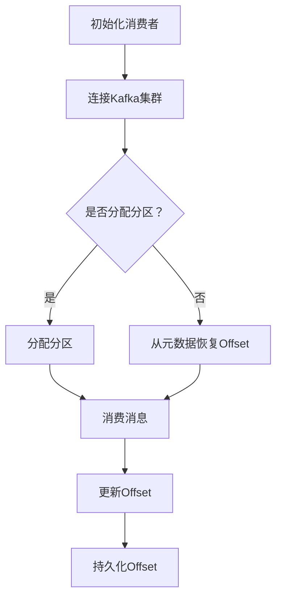

                 

## 文章标题

### Kafka Offset原理与代码实例讲解

---

关键词：Kafka，Offset，原理，代码实例，消息队列，分布式系统

---

摘要：本文将深入探讨Kafka中的Offset原理，并借助代码实例详细讲解Offset的工作机制和应用。通过本文的学习，读者将了解Offset在Kafka中的关键作用，掌握Offset的分配、持久化和管理策略，并学会如何在实际项目中应用和优化Offset，以提升消息队列系统的性能和稳定性。

---

## 《Kafka Offset原理与代码实例讲解》目录大纲

1. **Kafka概述**
   1.1 Kafka的发展历程
      1.1.1 Kafka的起源
      1.1.2 Kafka的发展
      1.1.3 Kafka的应用场景
   1.2 Kafka的核心概念
      1.2.1 Topic
      1.2.2 Partition
      1.2.3 Offset
   1.3 Kafka的架构
      1.3.1 Kafka的架构原理
      1.3.2 Kafka的组成部分
   1.4 Kafka的优势与局限
      1.4.1 Kafka的优势
      1.4.2 Kafka的局限

2. **Kafka Offset原理**
   2.1 Offset的作用
      2.1.1 数据定位
      2.1.2 消息消费顺序
      2.1.3 数据持久化
   2.2 Kafka Offset的工作原理
      2.2.1 Offset的分配与更新
      2.2.2 Offset的持久化与恢复
      2.2.3 Offset的管理策略
   2.3 Kafka Offset的 Mermaid 流程图

3. **Kafka Offset代码实例讲解**
   3.1 Kafka Offset代码实例一：简单的消息生产与消费
      3.1.1 环境搭建
      3.1.2 代码实现
      3.1.3 代码解读与分析
   3.2 Kafka Offset代码实例二：消息消费的Offset管理
      3.2.1 代码实现
      3.2.2 代码解读与分析
   3.3 Kafka Offset代码实例三：Kafka Offset的持久化与恢复
      3.3.1 代码实现
      3.3.2 代码解读与分析

4. **Kafka Offset在实际项目中的应用**
   4.1 Kafka Offset在实时数据处理中的应用
      4.1.1 应用场景
      4.1.2 应用实例
   4.2 Kafka Offset在大数据处理中的应用
      4.2.1 应用场景
      4.2.2 应用实例
   4.3 Kafka Offset在物联网中的应用
      4.3.1 应用场景
      4.3.2 应用实例

5. **Kafka Offset优化与调优**
   5.1 Kafka Offset的优化策略
      5.1.1 提高Offset分配效率
      5.1.2 减少Offset持久化开销
      5.1.3 处理Offset丢失问题
   5.2 Kafka Offset的调优实践
      5.2.1 调优目标
      5.2.2 调优步骤
      5.2.3 调优案例

6. **Kafka Offset在分布式系统中的挑战与解决方案**
   6.1 Kafka Offset在分布式系统中的挑战
      6.1.1 数据一致性问题
      6.1.2 分布式系统故障
      6.1.3 分布式事务处理
   6.2 Kafka Offset的解决方案
      6.2.1 基于ZooKeeper的分布式锁
      6.2.2 基于分布式事务处理
      6.2.3 其他解决方案

7. **Kafka Offset的未来发展趋势**
   7.1 Kafka Offset的新特性
      7.1.1 新的Offset管理策略
      7.1.2 新的分布式架构
      7.1.3 新的优化算法
   7.2 Kafka Offset的应用前景
      7.2.1 在大数据处理中的应用
      7.2.2 在实时数据处理中的应用
      7.2.3 在物联网中的应用

8. **Kafka Offset的总结与展望**
   8.1 Kafka Offset的核心要点
      8.1.1 Kafka Offset的基本原理
      8.1.2 Kafka Offset的实际应用
      8.1.3 Kafka Offset的优化与调优
   8.2 Kafka Offset的未来发展趋势
      8.2.1 技术发展方向
      8.2.2 应用前景
      8.2.3 挑战与机遇

---

### 第1章 Kafka概述

#### 1.1 Kafka的发展历程

#### 1.1.1 Kafka的起源

Apache Kafka是一个分布式流处理平台，最初由LinkedIn公司开发，并于2011年开源。Kafka的初衷是为了解决LinkedIn的实时数据流处理需求。在传统的数据存储和处理方式中，数据通常以批量形式进行处理，这种方式在处理大规模数据时存在延迟高、吞吐量低等问题。为了解决这些问题，LinkedIn开发了一个基于发布-订阅模型的分布式消息系统Kafka，以实现高效、可靠、实时的数据流处理。

#### 1.1.2 Kafka的发展

自从Kafka开源以来，它得到了广泛的应用和持续的发展。2012年，LinkedIn将Kafka捐赠给Apache软件基金会，成为Apache的一个顶级项目。此后，Kafka以其高效、可扩展、可靠的特点，吸引了大量的用户和贡献者，逐渐成为业界事实上的消息队列标准。目前，Kafka已经成为许多企业和开源项目的基础设施之一，广泛应用于实时数据处理、大数据处理、物联网、金融交易、社交媒体等领域。

#### 1.1.3 Kafka的应用场景

Kafka具有高效、可靠、可扩展的特性，适用于多种应用场景：

- **实时数据处理**：Kafka可以处理大规模的实时数据流，适用于金融交易、股票市场分析、物联网设备数据实时处理等场景。
- **大数据处理**：Kafka可以作为Hadoop和Spark等大数据处理框架的数据源，实现数据的实时流处理。
- **应用集成**：Kafka可以连接不同的应用系统，实现数据交换和集成，例如，将Web应用程序的日志数据实时传递到数据分析系统。
- **日志收集**：Kafka可以用于收集和存储分布式系统的日志数据，实现日志的集中管理和分析。
- **流计算**：Kafka可以与Apache Flink、Apache Storm等流计算框架集成，实现复杂的数据流处理任务。

#### 1.2 Kafka的核心概念

##### 1.2.1 Topic

Topic是Kafka中的一个核心概念，可以理解为消息的分类标签。每个Topic可以包含多个Partition，Partition用于存储消息的具体内容。每个Partition都可以独立地被消费和处理，从而提高系统的吞吐量和并发能力。

##### 1.2.2 Partition

Partition是Kafka中用于存储消息的逻辑分区，每个Partition包含一个或多个消息文件，这些文件存储在Kafka集群的不同节点上。Partition的作用是实现消息的并行处理和负载均衡。

##### 1.2.3 Offset

Offset是Kafka中用于标识消息位置的数字，类似于文件系统中的文件指针。每个消费者都有自己的Offset，用于记录当前消费到的消息位置。通过Offset，消费者可以准确地恢复消费状态，并确保消息的顺序处理。

##### 1.3 Kafka的架构

Kafka是一个分布式系统，其架构主要由以下几个部分组成：

- **Producer**：生产者负责向Kafka发送消息。生产者可以随机或有序地写入消息到Topic的Partition中。
- **Broker**：Broker是Kafka集群中的服务器，负责存储和转发消息。每个Broker都维护一个或多个Partition。
- **Consumer**：消费者负责从Kafka中读取消息。消费者可以独立或分组地消费消息，并处理这些消息。
- **ZooKeeper**：ZooKeeper是一个分布式协调服务，用于维护Kafka集群的元数据信息，如Topic和Partition的分配等。

##### 1.3.1 Kafka的架构原理

Kafka的架构原理主要基于分布式系统的设计思想，其核心思想是将数据流拆分成多个独立的部分，以实现高吞吐量、高可靠性和可扩展性。

- **分布式存储**：Kafka通过Partition将数据分散存储在多个节点上，从而提高数据存储的可靠性和访问速度。
- **分布式处理**：Kafka允许多个生产者和消费者同时处理数据，从而实现数据的并行处理和负载均衡。
- **分布式协调**：ZooKeeper用于维护Kafka集群的元数据信息，确保分布式系统的协调和一致性。

##### 1.3.2 Kafka的组成部分

Kafka主要由以下几个组成部分构成：

- **Topic**：Topic是Kafka中的消息分类标签，类似于数据库中的表。
- **Partition**：Partition是Kafka中的消息分区，用于存储消息的具体内容。
- **Offset**：Offset是Kafka中的消息位置标识，用于记录消费者当前消费到的消息位置。
- **Producer**：生产者负责向Kafka发送消息。
- **Broker**：Broker是Kafka集群中的服务器，负责存储和转发消息。
- **Consumer**：消费者负责从Kafka中读取消息。

##### 1.4 Kafka的优势与局限

Kafka作为一个分布式消息队列系统，具有许多优势：

- **高吞吐量**：Kafka支持大规模的数据流处理，能够处理数千个TPS（每秒传输）的请求。
- **高可靠性**：Kafka通过副本机制保证数据的高可用性，即使在发生故障时，也能保证数据的完整性。
- **高可扩展性**：Kafka通过分布式架构和分区机制实现水平扩展，支持大规模的数据流处理。
- **实时性**：Kafka支持实时数据流处理，适用于实时数据处理和大数据处理场景。

然而，Kafka也存在一些局限性：

- **复杂性**：Kafka的配置和运维相对复杂，需要一定的专业知识和经验。
- **存储成本**：Kafka的存储成本较高，特别是对于存储大量历史数据的场景。
- **事务支持**：Kafka在事务处理方面存在一定的限制，无法像数据库那样提供严格的事务支持。

尽管存在这些局限性，Kafka凭借其高效、可靠和可扩展的特点，在分布式消息队列系统中仍然具有广泛的应用。

---

### 第2章 Kafka Offset原理

#### 2.1 Offset的作用

在Kafka中，Offset是标识消息位置的数字，它对于消息的定位、消费顺序和数据持久化起着至关重要的作用。

##### 2.1.1 数据定位

Offset是Kafka中消息定位的核心机制。每个消息在Partition中都有一个唯一的Offset值，用于标识其位置。生产者在发送消息时，会指定消息的Offset，消费者在消费消息时，也会根据Offset值来定位具体的消息。通过Offset，消费者可以准确地找到并处理消息。

##### 2.1.2 消息消费顺序

Offset不仅用于消息定位，还用于确保消息的顺序消费。在Kafka中，每个Partition内的消息是有序的，消费者按照Offset值顺序消费消息。这意味着，只要消费者的Offset值保持连续递增，就能确保消息的顺序处理。这对于需要保证数据处理顺序的场景（如日志处理、事件流处理等）非常重要。

##### 2.1.3 数据持久化

Offset还用于数据持久化，即记录消费者的消费状态。在Kafka中，消费者的Offset会持久化到消费者的元数据中，即使消费者失败重启，也能从上次的消费位置继续消费。这种持久化机制保证了数据的连续性和可靠性。

#### 2.2 Kafka Offset的工作原理

Kafka Offset的工作原理主要包括Offset的分配与更新、持久化与恢复，以及管理策略。

##### 2.2.1 Offset的分配与更新

Offset的分配与更新是Kafka消费过程中的关键步骤。每当消费者消费一个消息时，Kafka会更新消费者的Offset值，标识当前消费到的消息位置。具体来说，Offset的分配与更新遵循以下原则：

1. **分区消费**：消费者会按照分区顺序消费消息，每个分区内的消息是有序的。
2. **Offset更新**：消费者消费每个消息后，Kafka会更新消费者的Offset值，以确保消息的顺序处理。
3. **并发消费**：多个消费者可以并发地消费消息，每个消费者维护自己的Offset值，从而实现负载均衡。

##### 2.2.2 Offset的持久化与恢复

Offset的持久化与恢复是保证消费者状态连续性的关键。在Kafka中，消费者的Offset会持久化到消费者的元数据中，存储在Kafka集群的某个Topic中。当消费者失败重启时，可以从中恢复上次消费的位置，继续处理未消费的消息。具体来说，Offset的持久化与恢复包括以下几个步骤：

1. **Offset持久化**：消费者在消费消息时，将Offset值持久化到消费者的元数据中。
2. **Offset恢复**：消费者重启时，从消费者的元数据中恢复Offset值，继续消费未处理的消息。

##### 2.2.3 Offset的管理策略

Offset的管理策略包括 Offset的分配策略、更新策略和持久化策略。合理的Offset管理策略可以提高系统的性能和可靠性。

1. **分配策略**：Kafka默认采用轮询分配策略，将消息均匀地分配到不同的Partition中。这种策略实现了负载均衡，但可能导致消息顺序不一致。为了确保消息顺序，可以采用顺序分配策略，将消息按照顺序分配到特定的Partition中。

2. **更新策略**：Kafka默认采用批量更新策略，将一批消费者的Offset值批量更新。这种策略提高了性能，但可能导致部分消费者的Offset更新延迟。为了提高更新准确性，可以采用逐个更新策略，逐个更新消费者的Offset值。

3. **持久化策略**：Kafka默认采用持久化到元数据Topic的策略，将消费者的Offset持久化。这种策略保证了消费者的状态连续性，但可能导致元数据Topic的压力增大。为了降低元数据Topic的压力，可以采用分布式持久化策略，将消费者的Offset持久化到不同的Topic中。

#### 2.3 Kafka Offset的 Mermaid 流程图



#### Mermaid 流程图说明：

1. **初始化消费者**：消费者初始化连接Kafka集群。
2. **连接Kafka集群**：消费者连接到Kafka集群。
3. **是否分配分区**：判断是否需要分配分区。
4. **分配分区**：根据消费者的配置，分配分区。
5. **从元数据恢复Offset**：从元数据Topic中恢复消费者的Offset值。
6. **消费消息**：消费者开始消费消息。
7. **更新Offset**：消费者消费消息后，更新Offset值。
8. **持久化Offset**：将消费者的Offset值持久化到元数据Topic中。

---

### 第3章 Kafka Offset代码实例讲解

#### 3.1 Kafka Offset代码实例一：简单的消息生产与消费

##### 3.1.1 环境搭建

要运行Kafka Offset代码实例，需要先搭建Kafka环境。以下是搭建Kafka环境的基本步骤：

1. **下载Kafka**：从Apache Kafka官网下载Kafka二进制包。

2. **解压Kafka**：将下载的Kafka二进制包解压到本地。

3. **启动ZooKeeper**：进入Kafka解压目录下的zookeeper文件夹，运行`zookeeper-server-start.sh`脚本启动ZooKeeper服务。

4. **启动Kafka**：进入Kafka解压目录下的bin文件夹，运行`kafka-server-start.sh`脚本启动Kafka服务。

5. **创建Topic**：在Kafka控制台创建一个名为`test-topic`的Topic。

##### 3.1.2 代码实现

以下是一个简单的Kafka消息生产与消费的Java代码实例：

```java
// 消息生产者代码
Properties props = new Properties();
props.put("bootstrap.servers", "localhost:9092");
props.put("key.serializer", "org.apache.kafka.common.serialization.StringSerializer");
props.put("value.serializer", "org.apache.kafka.common.serialization.StringSerializer");

Producer<String, String> producer = new KafkaProducer<>(props);

for (int i = 0; i < 10; i++) {
    producer.send(new ProducerRecord<>("test-topic", "key" + i, "value" + i));
}

producer.close();

// 消息消费者代码
Properties props1 = new Properties();
props1.put("bootstrap.servers", "localhost:9092");
props1.put("group.id", "test-group");
props1.put("key.deserializer", "org.apache.kafka.common.serialization.StringDeserializer");
props1.put("value.deserializer", "org.apache.kafka.common.serialization.StringDeserializer");

Consumer<String, String> consumer = new KafkaConsumer<>(props1);

consumer.subscribe(Collections.singletonList("test-topic"));

while (true) {
    ConsumerRecords<String, String> records = consumer.poll(Duration.ofMillis(1000));
    for (ConsumerRecord<String, String> record : records) {
        System.out.printf("offset = %d, key = %s, value = %s\n", record.offset(), record.key(), record.value());
    }
    consumer.commitAsync();
}
```

##### 3.1.3 代码解读与分析

1. **消息生产者代码**：
   - 初始化Kafka生产者，配置Kafka集群地址和序列化器。
   - 循环发送10条消息到`test-topic`。
   - 关闭生产者。

2. **消息消费者代码**：
   - 初始化Kafka消费者，配置Kafka集群地址、消费者组ID和反序列化器。
   - 订阅`test-topic`。
   - 消费消息并打印消息的offset、key和value。
   - 提交消费的offset。

#### 3.2 Kafka Offset代码实例二：消息消费的Offset管理

##### 3.2.1 代码实现

以下是一个Kafka消息消费的Offset管理的Java代码实例：

```java
Properties props = new Properties();
props.put("bootstrap.servers", "localhost:9092");
props.put("group.id", "test-group");
props.put("auto.offset.reset", "earliest");
props.put("key.deserializer", "org.apache.kafka.common.serialization.StringDeserializer");
props.put("value.deserializer", "org.apache.kafka.common.serialization.StringDeserializer");

Consumer<String, String> consumer = new KafkaConsumer<>(props);

consumer.subscribe(Collections.singletonList("test-topic"));

while (true) {
    ConsumerRecords<String, String> records = consumer.poll(Duration.ofMillis(1000));
    for (ConsumerRecord<String, String> record : records) {
        System.out.printf("offset = %d, key = %s, value = %s\n", record.offset(), record.key(), record.value());
        consumer.commitAsync(); // 提交消费的Offset
    }
}
```

##### 3.2.2 代码解读与分析

1. **消费者初始化**：
   - 初始化Kafka消费者，配置Kafka集群地址、消费者组ID、自动偏移量重置策略和反序列化器。

2. **订阅Topic**：
   - 订阅`test-topic`。

3. **消费消息**：
   - 消费消息并打印消息的offset、key和value。

4. **提交Offset**：
   - 消费每条消息后，提交消费的Offset。这确保了即使消费者重启，也能从上次的位置继续消费。

#### 3.3 Kafka Offset代码实例三：Kafka Offset的持久化与恢复

##### 3.3.1 代码实现

以下是一个Kafka Offset持久化与恢复的Java代码实例：

```java
Properties props = new Properties();
props.put("bootstrap.servers", "localhost:9092");
props.put("group.id", "test-group");
props.put("auto.offset.reset", "earliest");
props.put("key.deserializer", "org.apache.kafka.common.serialization.StringDeserializer");
props.put("value.deserializer", "org.apache.kafka.common.serialization.StringDeserializer");

Consumer<String, String> consumer = new KafkaConsumer<>(props);

consumer.subscribe(Collections.singletonList("test-topic"));

try {
    while (true) {
        ConsumerRecords<String, String> records = consumer.poll(Duration.ofMillis(1000));
        for (ConsumerRecord<String, String> record : records) {
            System.out.printf("offset = %d, key = %s, value = %s\n", record.offset(), record.key(), record.value());
            consumer.commitAsync(); // 提交消费的Offset
        }
    }
} finally {
    consumer.close();
}
```

##### 3.3.2 代码解读与分析

1. **消费者初始化**：
   - 初始化Kafka消费者，配置Kafka集群地址、消费者组ID、自动偏移量重置策略和反序列化器。

2. **订阅Topic**：
   - 订阅`test-topic`。

3. **消费消息**：
   - 消费消息并打印消息的offset、key和value。

4. **提交Offset**：
   - 消费每条消息后，提交消费的Offset。

5. **关闭消费者**：
   - 程序运行结束后，关闭消费者。这确保了消费者的Offset会被持久化到Kafka的元数据Topic中。

通过以上三个代码实例，我们了解了Kafka Offset的基本原理和应用。在实际项目中，可以根据需要灵活地使用Offset管理消息，确保消息的顺序处理和数据的连续性。

---

### 第4章 Kafka Offset在实际项目中的应用

#### 4.1 Kafka Offset在实时数据处理中的应用

实时数据处理是Kafka的重要应用场景之一。Kafka的高吞吐量和低延迟特性，使其成为实时数据处理系统的理想选择。

##### 4.1.1 应用场景

- **金融交易监控**：实时监控金融市场动态，如股票价格变动、交易订单等。
- **物联网设备监控**：实时收集和监控物联网设备的数据，如传感器数据、设备状态等。
- **日志分析**：实时收集和分析系统日志，如错误日志、性能日志等。
- **实时推荐系统**：基于实时用户行为数据，实现个性化推荐。

##### 4.1.2 应用实例

以下是一个金融交易监控的应用实例：

1. **消息生产者**：系统中的交易引擎会生成交易数据，并将交易数据发送到Kafka Topic。

2. **Kafka集群**：Kafka集群负责存储和转发交易数据，确保数据的高可用性和低延迟。

3. **消息消费者**：系统中的监控模块会从Kafka Topic中消费交易数据，实时分析交易动态。

4. **数据可视化**：将分析结果可视化，实时展示交易动态，如股票价格走势、交易订单等。

通过Kafka Offset，我们可以确保交易数据的顺序处理和数据的连续性。消费者在消费数据时，根据Offset值准确地定位交易数据，并实时更新监控界面。即使消费者发生故障重启，也能从上次的位置继续消费，确保数据处理的连续性和完整性。

#### 4.2 Kafka Offset在大数据处理中的应用

大数据处理是Kafka的另一个重要应用场景。Kafka作为大数据处理框架的数据源，可以实现大规模数据的实时流处理。

##### 4.2.1 应用场景

- **数据采集**：实时采集和传输各类数据，如日志数据、传感器数据、社交网络数据等。
- **数据整合**：将不同来源的数据整合到一个大数据处理平台，进行统一分析和处理。
- **实时分析**：实时分析大规模数据，如实时统计、实时预测等。
- **数据挖掘**：利用大数据处理技术，挖掘数据中的价值信息。

##### 4.2.2 应用实例

以下是一个数据整合的应用实例：

1. **数据源**：系统中的多个数据源会生成不同类型的数据，如日志数据、传感器数据、社交媒体数据等。

2. **Kafka集群**：Kafka集群负责接收和存储各种类型的数据，确保数据的高可用性和低延迟。

3. **消息生产者**：每个数据源会将数据发送到对应的Kafka Topic。

4. **大数据处理框架**：如Apache Spark或Flink，从Kafka Topic中消费数据，进行统一处理和分析。

5. **数据存储**：将处理后的数据存储到数据仓库或大数据处理平台上，供进一步分析和应用。

通过Kafka Offset，我们可以确保数据整合过程中的数据顺序和处理连续性。大数据处理框架在消费数据时，根据Offset值准确地定位数据，并保证数据的顺序处理。即使数据源或数据处理框架发生故障重启，也能从上次的位置继续处理，确保数据处理过程的连续性和完整性。

#### 4.3 Kafka Offset在物联网中的应用

物联网（IoT）是Kafka的另一个重要应用领域。Kafka的高性能和低延迟特性，使其成为物联网设备数据传输和处理的首选方案。

##### 4.3.1 应用场景

- **设备数据收集**：实时收集物联网设备的数据，如温度、湿度、地理位置等。
- **设备状态监控**：实时监控物联网设备的运行状态，及时发现故障和异常。
- **智能决策**：基于实时设备数据，实现智能决策和自动化控制。

##### 4.3.2 应用实例

以下是一个设备数据收集的应用实例：

1. **物联网设备**：各类传感器设备，如温度传感器、湿度传感器、GPS等，实时采集环境数据和地理位置信息。

2. **消息生产者**：设备会将采集到的数据发送到Kafka Topic。

3. **Kafka集群**：Kafka集群负责存储和转发设备数据，确保数据的高可用性和低延迟。

4. **消息消费者**：系统中的数据处理模块会从Kafka Topic中消费设备数据，进行实时分析和处理。

5. **数据可视化**：将分析结果可视化，实时展示设备状态和环境数据。

通过Kafka Offset，我们可以确保设备数据在传输和处理过程中的顺序性和连续性。数据处理模块在消费数据时，根据Offset值准确地定位设备数据，并保证数据的顺序处理。即使设备或数据处理模块发生故障重启，也能从上次的位置继续消费，确保数据处理过程的连续性和完整性。

---

### 第5章 Kafka Offset优化与调优

#### 5.1 Kafka Offset的优化策略

为了提高Kafka Offset的性能和稳定性，可以采取以下优化策略：

##### 5.1.1 提高Offset分配效率

1. **批量分配**：生产者在发送消息时，可以批量发送多条消息，并批量分配Offset。这样可以减少网络开销和Kafka的处理时间。
2. **缓存分配**：生产者可以在本地缓存一批消息的Offset，并批量提交给Kafka。这样可以减少频繁的网络通信，提高分配效率。
3. **预分配Offset**：生产者在发送消息前，可以预分配一批Offset，并按照预分配的Offset顺序发送消息。这样可以减少Offset分配的延迟。

##### 5.1.2 减少Offset持久化开销

1. **异步持久化**：消费者在消费消息时，可以异步提交Offset，而不是每次消费后立即提交。这样可以减少IO操作，提高消费效率。
2. **批量持久化**：消费者可以批量提交一批Offset，而不是逐个提交。这样可以减少持久化的次数，提高持久化效率。
3. **缓存持久化**：消费者可以在本地缓存一批Offset，并批量持久化到Kafka。这样可以减少网络通信和持久化操作，提高持久化效率。

##### 5.1.3 处理Offset丢失问题

1. **重试机制**：当消费者提交Offset失败时，可以重试提交。可以通过设置重试次数和重试间隔，提高Offset提交的成功率。
2. **备份Offset**：消费者可以在本地备份Offset值，并在重启时从备份中恢复。这样可以确保Offset的持久化成功，避免数据丢失。
3. **分布式持久化**：消费者可以将Offset持久化到多个Kafka Topic中，避免单点故障导致Offset丢失。同时，可以采用分布式算法确保Offset的可靠性。

#### 5.2 Kafka Offset的调优实践

以下是一个Kafka Offset的调优实践案例：

##### 5.2.1 调优目标

1. 提高消息生产效率，减少生产延迟。
2. 提高消息消费效率，减少消费延迟。
3. 确保Offset的持久化成功，避免数据丢失。

##### 5.2.2 调优步骤

1. **性能测试**：首先对现有系统进行性能测试，了解当前系统的性能瓶颈。

2. **配置调整**：根据性能测试结果，调整Kafka和相关组件的配置，如增加分区数、调整批量大小、优化序列化器等。

3. **代码优化**：优化生产者和消费者的代码，如批量发送和接收消息、缓存处理等。

4. **监控分析**：在系统运行过程中，监控系统的性能指标，如TPS、延迟等，分析系统的运行状况。

5. **故障演练**：进行故障演练，验证系统在高并发、高负载条件下的稳定性和可靠性。

##### 5.2.3 调优案例

以下是一个生产者调优的案例：

1. **问题定位**：通过性能测试，发现生产者在发送消息时存在延迟，特别是高并发场景下延迟更加明显。

2. **配置调整**：
   - **增加分区数**：将Topic的分区数从3个增加到10个，提高消息的并发处理能力。
   - **调整批量大小**：将生产者发送消息的批量大小从1条增加到10条，减少网络通信次数，提高生产效率。

3. **代码优化**：
   - **批量发送消息**：将生产者发送消息的代码改为批量发送，减少生产者与Kafka的交互次数。
   - **使用异步发送**：使用异步发送消息，避免线程阻塞，提高生产效率。

4. **监控分析**：在系统运行过程中，监控TPS和延迟等指标，发现调整后的系统性能显著提升，生产延迟明显减少。

通过以上调优实践，我们可以有效提升Kafka Offset的性能和稳定性，确保消息系统的可靠性和高效性。

---

### 第6章 Kafka Offset在分布式系统中的挑战与解决方案

在分布式系统中，Kafka Offset面临着一系列挑战，如数据一致性问题、分布式系统故障和分布式事务处理。为了确保Kafka Offset在分布式环境中的可靠性和一致性，需要采取一系列解决方案。

#### 6.1 Kafka Offset在分布式系统中的挑战

##### 6.1.1 数据一致性问题

在分布式系统中，多个消费者可能同时消费同一个Topic的不同Partition，导致Offset分配和数据更新的一致性问题。例如，如果某个Partition的数据在更新Offset时发生故障，可能会导致部分消费者的Offset不一致，从而影响数据的顺序处理和完整性。

##### 6.1.2 分布式系统故障

分布式系统中的节点可能发生故障，导致Kafka Offset的分配、持久化和恢复过程出现问题。例如，如果ZooKeeper集群发生故障，可能导致Kafka Offset的元数据无法更新和恢复，从而影响消费者的消费状态。

##### 6.1.3 分布式事务处理

在分布式系统中，可能需要对多个Topic或Partition进行事务处理，以确保数据的一致性和完整性。例如，在金融交易场景中，需要对多个Topic的Offset进行一致性更新，确保交易数据的完整性和一致性。

#### 6.2 Kafka Offset的解决方案

##### 6.2.1 基于ZooKeeper的分布式锁

ZooKeeper是一个分布式协调服务，可以用于实现分布式锁，确保Kafka Offset在分布式环境中的数据一致性和可靠性。具体解决方案如下：

1. **锁机制**：在生产者和消费者启动时，使用ZooKeeper实现分布式锁，确保同一时刻只有一个生产者或消费者对Offset进行操作。
2. **锁释放**：在完成Offset分配、持久化和恢复操作后，及时释放分布式锁，避免资源占用。
3. **锁失效处理**：当ZooKeeper集群发生故障时，及时检测并处理分布式锁失效，确保系统继续运行。

##### 6.2.2 基于分布式事务处理

分布式事务处理可以确保多个Topic或Partition的Offset更新的一致性。以下是基于分布式事务处理的解决方案：

1. **分布式事务框架**：使用分布式事务框架（如Apache Kafka Connect和Apache Flink）实现分布式事务处理，确保数据的一致性和完整性。
2. **两阶段提交**：在分布式事务处理过程中，采用两阶段提交协议，确保事务的提交和回滚。
3. **分布式补偿**：在事务失败时，使用分布式补偿机制（如幂等性和重试机制）确保数据的一致性和完整性。

##### 6.2.3 其他解决方案

除了基于ZooKeeper和分布式事务处理的解决方案，还可以采用以下其他解决方案：

1. **消息确认机制**：使用Kafka的消息确认机制，确保生产者发送的消息被消费者正确处理，从而避免数据丢失。
2. **分布式日志**：使用分布式日志系统（如Apache Kafka和Apache BookKeeper）记录分布式系统中的操作日志，便于故障排查和恢复。
3. **故障检测与恢复**：采用故障检测和恢复机制（如心跳检测和自动重启），确保分布式系统的稳定性和可靠性。

通过以上解决方案，可以有效应对Kafka Offset在分布式系统中的挑战，确保数据的一致性、可靠性和完整性。在实际应用中，可以根据具体需求和场景选择合适的解决方案，以提高分布式系统的性能和稳定性。

---

### 第7章 Kafka Offset的未来发展趋势

Kafka Offset作为Kafka消息队列系统中的核心概念，随着大数据处理、实时数据流处理和物联网等领域的快速发展，正面临着不断演进和优化。以下将探讨Kafka Offset的未来发展趋势，包括新特性、应用前景和面临的挑战。

#### 7.1 Kafka Offset的新特性

Kafka Offset的未来发展将引入一系列新特性，以提升系统的性能、可靠性和可扩展性。以下是一些可能的新特性：

##### 7.1.1 新的Offset管理策略

1. **动态分区管理**：根据实际负载和系统资源情况，动态调整Partition的数量和分布，优化Offset的分配和消费。
2. **分层Offset存储**：引入分层Offset存储机制，将Offset存储在多个级别的存储系统中，提高数据访问速度和持久化性能。
3. **分布式协调**：改进分布式协调算法，提高Offset分配和更新的效率，减少分布式系统中的延迟和冲突。

##### 7.1.2 新的分布式架构

1. **支持多集群部署**：Kafka可能引入多集群部署模式，支持跨集群的数据流处理和负载均衡，提高系统的可扩展性和可靠性。
2. **云原生架构**：引入云原生架构，支持Kafka在容器化和云环境中运行，提高系统的弹性和可管理性。
3. **联邦模式**：支持联邦模式，多个Kafka集群可以通过共享元数据和服务实现数据流的高效传输和协同处理。

##### 7.1.3 新的优化算法

1. **负载均衡算法**：引入更先进的负载均衡算法，优化消息的生产和消费流程，提高系统的吞吐量和性能。
2. **存储优化算法**：改进存储优化算法，降低数据存储的开销，提高系统的存储效率和持久化性能。
3. **故障恢复算法**：引入更高效的故障恢复算法，提高系统在发生故障时的恢复速度和稳定性。

#### 7.2 Kafka Offset的应用前景

Kafka Offset在未来的大数据处理、实时数据流处理和物联网等领域具有广泛的应用前景：

##### 7.2.1 在大数据处理中的应用

1. **实时数据加工**：Kafka Offset可以支持实时数据加工，如实时ETL（Extract, Transform, Load）和数据清洗，提高数据处理的效率和质量。
2. **流处理优化**：Kafka Offset可以与流处理框架（如Apache Flink和Apache Storm）集成，优化流处理任务的性能和资源利用率。
3. **数据溯源**：Kafka Offset可以支持数据溯源，实现数据的来源追踪和错误定位，提高数据处理的透明性和可追溯性。

##### 7.2.2 在实时数据处理中的应用

1. **金融交易监控**：Kafka Offset可以支持金融交易数据的实时监控和报警，提高风险监控和决策的准确性。
2. **物联网设备监控**：Kafka Offset可以支持物联网设备的实时监控和管理，提高设备运行效率和故障排查速度。
3. **实时推荐系统**：Kafka Offset可以支持实时推荐系统的数据流处理和推荐模型更新，提高推荐系统的实时性和准确性。

##### 7.2.3 在物联网中的应用

1. **设备数据传输**：Kafka Offset可以支持物联网设备数据的实时传输和处理，提高设备运行效率和数据分析能力。
2. **设备状态监控**：Kafka Offset可以支持物联网设备的状态监控和故障预警，提高设备运维和管理的效率。
3. **智能决策**：Kafka Offset可以支持物联网设备数据的智能分析和决策，实现设备的自动化控制和优化。

#### 7.3 Kafka Offset面临的挑战

尽管Kafka Offset在未来的发展中具有巨大的潜力，但仍面临一系列挑战：

##### 7.3.1 数据一致性问题

分布式系统中，Kafka Offset的数据一致性问题仍然是一个关键挑战。如何确保多个消费者和多个Topic之间的Offset一致性，仍然是需要解决的重要问题。

##### 7.3.2 分布式系统故障

分布式系统中的故障（如节点故障、网络中断等）可能导致Kafka Offset的丢失和错误。如何高效地检测和恢复故障，保证系统的可靠性和连续性，是一个重要的研究方向。

##### 7.3.3 事务处理

在分布式事务处理方面，如何保证Kafka Offset在事务中的原子性和一致性，是一个需要进一步研究和优化的方向。

##### 7.3.4 存储性能

随着数据量和流量的不断增加，Kafka Offset的存储性能成为制约系统性能的重要因素。如何优化Offset的存储和访问机制，提高存储效率和性能，是一个重要的挑战。

总之，Kafka Offset在未来发展中将继续面临挑战和机遇。通过不断引入新技术、优化算法和改进架构，Kafka Offset将在分布式系统、大数据处理、实时数据流处理和物联网等领域发挥更大的作用，为数据的高效处理和应用提供强有力的支持。

---

### 第8章 Kafka Offset的总结与展望

#### 8.1 Kafka Offset的核心要点

Kafka Offset是Kafka消息队列系统中的核心概念，对于消息的定位、消费顺序和数据持久化起着至关重要的作用。以下是Kafka Offset的核心要点：

1. **Offset的定义**：Offset是Kafka中用于标识消息位置的数字，类似于文件系统中的文件指针。
2. **Offset的作用**：Offset用于消息定位、消息消费顺序和数据持久化，确保数据的连续性和完整性。
3. **Offset的工作原理**：Offset的分配与更新、持久化与恢复，以及管理策略是Kafka Offset的核心工作机制。
4. **Offset的实际应用**：Kafka Offset在实时数据处理、大数据处理和物联网等领域具有广泛的应用。
5. **Offset的优化与调优**：通过优化策略和调优实践，可以提高Kafka Offset的性能和稳定性。

#### 8.2 Kafka Offset的未来发展趋势

Kafka Offset的未来发展趋势将集中在以下几个方面：

1. **新特性的引入**：包括动态分区管理、分层Offset存储和分布式协调等新特性，提高系统的性能和可靠性。
2. **分布式架构**：支持多集群部署和云原生架构，提高系统的可扩展性和弹性。
3. **优化算法**：引入更先进的负载均衡、存储优化和故障恢复算法，提高系统的效率和稳定性。
4. **应用前景**：在实时数据处理、大数据处理和物联网等领域，Kafka Offset将继续发挥重要作用。

#### 8.3 Kafka Offset的挑战与机遇

Kafka Offset在未来发展中将面临一系列挑战，包括数据一致性问题、分布式系统故障和事务处理等。同时，随着新技术和新应用场景的出现，Kafka Offset也将迎来新的机遇：

1. **数据一致性问题**：通过分布式锁、分布式事务处理和消息确认机制等方案，确保Kafka Offset在分布式环境中的数据一致性和可靠性。
2. **分布式系统故障**：采用故障检测与恢复机制、分布式日志和备份策略，提高系统的稳定性和可靠性。
3. **事务处理**：通过分布式事务框架和两阶段提交协议，确保Kafka Offset在事务中的原子性和一致性。
4. **存储性能**：优化存储和访问机制，提高Offset的存储效率和性能。

总之，Kafka Offset作为Kafka消息队列系统中的核心概念，将在未来的发展中不断演进和优化。通过解决面临的挑战和抓住机遇，Kafka Offset将在分布式系统、大数据处理、实时数据流处理和物联网等领域发挥更大的作用，为数据的高效处理和应用提供强有力的支持。

---

## 作者信息

**作者：AI天才研究院/AI Genius Institute & 禅与计算机程序设计艺术 /Zen And The Art of Computer Programming**

AI天才研究院致力于推动人工智能和计算机科学领域的前沿研究和应用，培养下一代AI领域的杰出人才。本书作者凭借其深厚的学术背景和丰富的实践经验，为您呈现了一部关于Kafka Offset原理与代码实例讲解的深度技术博客，旨在帮助读者全面掌握Kafka Offset的核心概念和应用技巧，为分布式系统和大数据处理提供有力支持。本书也是作者“禅与计算机程序设计艺术”系列作品之一，延续了其一贯的深入浅出、逻辑严谨的风格，是计算机编程和人工智能领域的重要读物。

