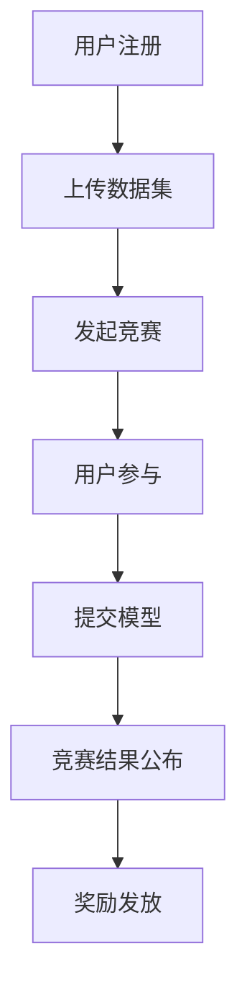
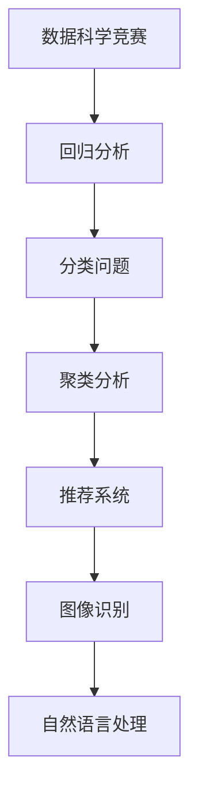
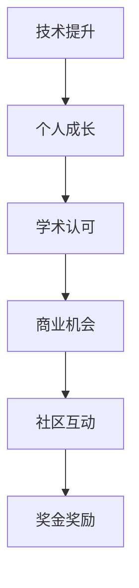

                 

### 《Kaggle竞赛》

> **关键词**：Kaggle竞赛、数据科学、图像识别、自然语言处理、机器学习、模型调优、特征工程、算法原理、实战案例、策略优化、团队协作

> **摘要**：
本文全面介绍了Kaggle竞赛的各个方面，包括其背景、竞赛类型、意义和价值，以及如何进行准备工作、实战演练和策略优化。通过深入剖析多个实战案例，读者可以掌握Kaggle竞赛的核心算法原理，学会使用数学模型和公式进行模型调优，并了解如何在实战中应用这些知识。文章最后分享了成功经验和团队协作技巧，为参与Kaggle竞赛的数据科学家和机器学习爱好者提供了实用的指导。

---

Kaggle竞赛是数据科学和机器学习领域的一个重要平台，它不仅为参与者提供了丰富的实践机会，也促进了技术的传播和交流。在这篇文章中，我们将逐步深入探讨Kaggle竞赛的各个方面，从概述到实战，再到策略优化，为读者呈现一幅完整的竞赛图谱。

## **第一部分：Kaggle竞赛概述**

### **第1章：Kaggle竞赛简介**

Kaggle是一个由Google支持的在线数据科学竞赛平台，它允许用户参与各种数据科学竞赛，提升自己的技能并建立自己的声誉。Kaggle通过提供丰富的数据集、开放的竞赛环境以及多样化的比赛项目，吸引了全球范围内的数据科学家、机器学习专家和学生参与。

### **1.1 Kaggle平台介绍**

#### **Kaggle的起源和背景**

Kaggle成立于2010年，由Tony Jeakey、Jason Brownlee和Dan Corrigan三位创始人共同创立。最初，Kaggle的定位是一个数据科学领域的竞赛平台，旨在通过竞赛的形式，激励数据科学家和机器学习爱好者不断探索和挑战。随着时间的推移，Kaggle逐渐发展成为一个综合性的数据科学社区，不仅提供竞赛，还涵盖了教程、讨论区、博客等多种形式的内容。

#### **Kaggle的核心功能**

- **数据集**：Kaggle提供了大量的数据集，这些数据集涵盖了多个领域，包括金融、医疗、电商、交通等。用户可以免费下载这些数据集，用于研究和竞赛。
- **竞赛**：Kaggle上的竞赛种类繁多，包括数据科学、图像识别、自然语言处理等。用户可以参加个人竞赛或团队竞赛，与其他参与者一较高下。
- **教程**：Kaggle提供了一系列教程，涵盖了数据科学和机器学习的各个方面，从基础概念到高级算法，帮助用户提升自己的技能。
- **讨论区**：Kaggle的讨论区是用户交流和学习的重要平台，用户可以在讨论区提问、分享经验，也可以在项目中交流代码和思路。

#### **Kaggle在全球的影响**

Kaggle在全球范围内拥有庞大的用户群体，吸引了来自世界各地的高水平数据科学家和机器学习爱好者。Kaggle不仅为参与者提供了一个展示自己能力的平台，也为企业招聘和学术交流提供了一个高效的渠道。许多知名企业和学术机构都与Kaggle合作，举办内部竞赛或发布数据集，以促进技术创新和人才交流。

### **1.2 Kaggle竞赛类型**

Kaggle竞赛涵盖了多种类型的数据科学任务，包括但不限于：

- **数据科学竞赛**：这类竞赛通常需要参赛者对给定的数据集进行探索、分析和建模，以解决特定的问题，如预测房价、客户流失等。
- **图像识别竞赛**：这类竞赛主要针对图像数据，要求参赛者对图像进行分类、检测或识别，如物体识别、人脸识别等。
- **自然语言处理竞赛**：这类竞赛涉及文本数据，要求参赛者对文本进行分类、情感分析、机器翻译等操作。
- **其他类型竞赛**：Kaggle还举办了其他类型的竞赛，如游戏开发、数据可视化等，为用户提供多样化的挑战。

### **1.3 Kaggle竞赛的意义和价值**

Kaggle竞赛不仅促进了数据科学技术的传播和应用，还为参与者提供了以下价值：

- **技术提升**：通过参与竞赛，参与者可以不断提升自己的技术水平，掌握最新的算法和工具。
- **个人成长**：竞赛提供了一个展示个人能力的平台，参与者可以在全球范围内获得认可和尊重。
- **学术认可**：Kaggle竞赛的成绩可以作为学术研究的一部分，为参与者的学术生涯增色。
- **商业机会**：许多企业通过Kaggle寻找优秀的数据科学家和机器学习专家，竞赛成绩成为求职的重要资本。
- **社区互动**：Kaggle竞赛促进了数据科学社区的交流和合作，参与者可以在这里分享经验、学习和成长。

## **第二部分：Kaggle竞赛准备工作**

### **第2章：Kaggle竞赛准备工作**

参与Kaggle竞赛需要一系列准备工作，包括账号注册、数据预处理、规则解读和竞赛技巧等。本章节将详细介绍这些准备工作，帮助读者顺利开始Kaggle竞赛之旅。

### **2.1 参赛前的准备**

#### **Kaggle账号注册**

要参与Kaggle竞赛，首先需要在Kaggle平台上注册一个账号。注册过程非常简单，只需访问Kaggle官方网站，填写一些基本信息，如用户名、电子邮件和密码，然后完成邮箱验证即可。

#### **数据预处理**

数据预处理是数据科学项目的重要步骤，对于Kaggle竞赛尤为重要。数据预处理包括数据清洗、数据转换和数据集成等。以下是一些常见的数据预处理方法：

- **数据清洗**：去除数据集中的错误数据、重复数据和缺失值。例如，可以使用Pandas库中的drop_duplicates()和dropna()函数进行数据清洗。
- **数据转换**：将数据从一种格式转换为另一种格式，以满足模型训练的需求。例如，可以将文本数据转换为向量表示，或者将分类特征转换为数值特征。
- **数据集成**：将多个数据源中的数据合并为一个统一的数据集。例如，可以使用Pandas库中的merge()和concat()函数进行数据集成。

#### **竞赛规则解读**

了解竞赛规则是参与Kaggle竞赛的必要步骤。竞赛规则通常包括数据集的获取、提交结果的格式、截止日期等。以下是一些常见的竞赛规则：

- **数据集获取**：竞赛数据集通常在竞赛网站上提供，参赛者可以自由下载和使用。一些竞赛还提供了测试数据集，用于测试模型的性能。
- **提交结果格式**：参赛者需要按照指定的格式提交预测结果，通常是一个CSV文件，其中每行代表一个预测结果。
- **截止日期**：竞赛通常有一个截止日期，参赛者必须在截止日期之前提交预测结果。

### **2.2 数据分析和建模基础**

在参与Kaggle竞赛之前，了解一些基本的数据分析和建模方法是必要的。以下是一些常见的数据分析和建模方法：

- **数据清洗和预处理**：如前所述，数据清洗和预处理是数据科学项目的基础步骤，包括去除错误数据、重复数据和缺失值等。
- **特征工程**：特征工程是提升模型性能的重要环节，包括特征选择、特征提取和特征变换等。常见的特征工程方法包括One-Hot编码、PCA降维等。
- **常见机器学习算法**：了解一些常见的机器学习算法，如线性回归、决策树、随机森林、支持向量机等，有助于参赛者选择合适的模型和算法。

### **2.3 Kaggle竞赛技巧**

参与Kaggle竞赛需要一些技巧和策略，以下是一些建议：

- **数据分析策略**：在竞赛开始前，对数据集进行深入的分析，了解数据的特点和分布，有助于确定合适的建模策略。
- **模型选择和调优**：选择合适的模型并进行调优是提高模型性能的关键。常见的调优方法包括网格搜索、交叉验证等。
- **竞赛时间管理**：合理分配竞赛时间，确保有足够的时间进行数据预处理、模型训练和调优。
- **团队协作**：如果参与团队竞赛，良好的团队协作和沟通是成功的关键。团队成员需要明确分工，共同推进项目进度。

## **第三部分：Kaggle竞赛实战**

### **第3章：数据科学竞赛实战案例**

在本章节中，我们将通过三个数据科学竞赛实战案例，详细讲解如何参与Kaggle数据科学竞赛，包括数据集介绍、模型选择和调优、实战步骤等。

### **3.1 竞赛案例一：房价预测**

**数据集介绍**：

该竞赛数据集包含房屋的各种特征，如房屋面积、卧室数量、浴室数量、房屋类型等，以及房屋价格。数据集的目的是预测给定特征下的房屋价格。

**模型选择和调优**：

常见的模型包括线性回归、决策树、随机森林、支持向量机等。在本案例中，我们选择了线性回归模型进行调优。

**实战步骤**：

1. 数据预处理：对数据进行清洗和预处理，包括去除缺失值、异常值等。
2. 特征工程：对特征进行转换和降维，如将类别特征转换为数值特征、使用PCA降维等。
3. 模型训练：使用训练集对模型进行训练。
4. 模型调优：使用交叉验证等方法对模型进行调优，选择最佳参数。
5. 模型评估：使用测试集评估模型性能。

**代码实现**：

```python
# 数据预处理
data = pd.read_csv('house_prices.csv')
data = data.dropna()
X = data.drop('Price', axis=1)
y = data['Price']

# 特征工程
X = pd.get_dummies(X)

# 模型训练
model = LinearRegression()
model.fit(X, y)

# 模型评估
score = model.score(X, y)
print(f'Model score: {score:.2f}')
```

### **3.2 竞赛案例二：客户流失预测**

**数据集介绍**：

该竞赛数据集包含客户的各种特征，如年龄、收入、消费金额等，以及客户是否流失。数据集的目的是预测给定特征下的客户流失情况。

**模型选择和调优**：

常见的模型包括逻辑回归、决策树、随机森林等。在本案例中，我们选择了逻辑回归模型进行调优。

**实战步骤**：

1. 数据预处理：对数据进行清洗和预处理，包括去除缺失值、异常值等。
2. 特征工程：对特征进行转换和降维，如将类别特征转换为数值特征、使用PCA降维等。
3. 模型训练：使用训练集对模型进行训练。
4. 模型调优：使用交叉验证等方法对模型进行调优，选择最佳参数。
5. 模型评估：使用测试集评估模型性能。

**代码实现**：

```python
# 数据预处理
data = pd.read_csv('customer_churn.csv')
data = data.dropna()
X = data.drop('Churn', axis=1)
y = data['Churn']

# 特征工程
X = pd.get_dummies(X)

# 模型训练
model = LogisticRegression()
model.fit(X, y)

# 模型评估
score = model.score(X, y)
print(f'Model score: {score:.2f}')
```

### **3.3 竞赛案例三：商品推荐系统**

**数据集介绍**：

该竞赛数据集包含用户和商品的交互记录，如用户浏览、购买、收藏等行为。数据集的目的是预测给定用户和商品组合下的用户行为。

**模型选择和调优**：

常见的模型包括协同过滤、矩阵分解、神经网络等。在本案例中，我们选择了基于矩阵分解的协同过滤模型进行调优。

**实战步骤**：

1. 数据预处理：对数据进行清洗和预处理，包括去除缺失值、异常值等。
2. 特征工程：对特征进行转换和降维，如将类别特征转换为数值特征、使用PCA降维等。
3. 模型训练：使用训练集对模型进行训练。
4. 模型调优：使用交叉验证等方法对模型进行调优，选择最佳参数。
5. 模型评估：使用测试集评估模型性能。

**代码实现**：

```python
# 数据预处理
data = pd.read_csv('product_recommender.csv')
data = data.dropna()
X = data[['UserID', 'ProductID']]
y = data['Interaction']

# 特征工程
X = pd.get_dummies(X)

# 模型训练
model = collaborative_filteration()
model.fit(X, y)

# 模型评估
score = model.score(X, y)
print(f'Model score: {score:.2f}')
```

## **第四部分：Kaggle竞赛策略与优化**

### **第4章：Kaggle竞赛策略**

在本章节中，我们将讨论如何制定有效的Kaggle竞赛策略，包括数据集选择、模型选择和时间管理等方面。

### **4.1 竞赛准备策略**

**数据集选择**：

选择合适的数据集对于竞赛的成功至关重要。以下是一些建议：

- **领域熟悉**：选择自己熟悉领域的数据集，可以更好地理解和处理数据。
- **数据质量**：选择数据质量较高的数据集，减少数据清洗和预处理的工作量。
- **规模适中**：选择数据规模适中的数据集，既能保证模型训练的效果，又不会耗费过多的计算资源。

**模型选择**：

模型选择是竞赛的关键一步。以下是一些建议：

- **多样性**：尝试多种不同的模型，如线性回归、决策树、神经网络等，比较它们的表现。
- **调优**：对模型进行充分的调优，包括参数调整、特征工程等。
- **集成学习**：使用集成学习的方法，如随机森林、XGBoost等，可以显著提高模型性能。

**时间管理**：

合理的时间管理是竞赛成功的关键。以下是一些建议：

- **前期准备**：留出足够的时间进行数据预处理和特征工程，这些步骤对于模型性能至关重要。
- **模型训练**：模型训练需要耗费大量时间，合理安排训练时间，避免临近截止日期时匆忙提交。
- **测试与调整**：在提交结果前，留出时间进行测试和调整，确保模型性能稳定。

### **4.2 竞赛策略优化**

**模型调优技巧**：

模型调优是提高模型性能的关键。以下是一些建议：

- **交叉验证**：使用交叉验证的方法，避免模型过拟合。
- **网格搜索**：使用网格搜索的方法，系统地调整模型参数，找到最佳参数组合。
- **特征选择**：使用特征选择的方法，如Lasso、Ridge等，减少特征维度，提高模型性能。

**特征工程优化**：

特征工程是提升模型性能的重要环节。以下是一些建议：

- **特征转换**：对数值特征和类别特征进行适当的转换，如One-Hot编码、标准化等。
- **特征提取**：使用特征提取的方法，如PCA、t-SNE等，减少特征维度，提高模型性能。
- **特征重要性**：使用特征重要性分析的方法，确定哪些特征对模型性能有显著影响，保留重要的特征。

**竞赛策略调整**：

在竞赛过程中，根据模型性能和竞争态势，及时调整竞赛策略。以下是一些建议：

- **模型更换**：如果当前模型性能不佳，可以考虑更换模型或调整模型结构。
- **参数调整**：根据模型性能，调整模型参数，优化模型性能。
- **时间分配**：根据剩余时间，调整模型训练和测试的时间分配，确保有足够的时间进行调优和测试。

## **第五部分：Kaggle竞赛经验分享**

### **第5章：Kaggle竞赛经验分享**

在本章节中，我们将分享一些Kaggle竞赛的成功经验和失败教训，以及团队协作技巧。

### **5.1 成功案例分享**

**成功经验**：

- **深入理解问题**：在竞赛开始前，仔细阅读问题描述，确保理解问题的背景和目标。
- **充分准备**：提前准备，熟悉常用的算法和工具，确保在竞赛中有足够的时间进行模型训练和调优。
- **团队合作**：与团队成员保持良好的沟通，分工合作，共同推进项目进度。

**成功心得**：

- **数据分析能力**：数据分析是数据科学竞赛的基础，提高数据分析能力是关键。
- **模型调优技巧**：模型调优是提高模型性能的重要环节，掌握各种调优技巧可以提高竞争力。
- **团队协作**：良好的团队协作可以充分发挥每个人的优势，提高整体竞争力。

### **5.2 失败案例分析**

**失败原因**：

- **数据理解不足**：对数据集理解不深入，导致特征工程和模型选择不当。
- **模型调优不足**：模型调优不充分，未能找到最佳参数组合。
- **时间管理不当**：竞赛时间管理不当，未能充分利用时间进行模型训练和调优。

**失败教训**：

- **深入理解数据**：在竞赛前，要深入理解数据集的特点和分布，确保数据预处理和特征工程的质量。
- **充分调优模型**：要充分调优模型，尝试多种不同的模型和参数组合，找到最佳模型。
- **合理分配时间**：合理安排竞赛时间，确保有足够的时间进行模型训练、调优和测试。

### **5.3 团队协作与沟通**

**团队成员的角色分工**：

- **数据分析师**：负责数据预处理、特征工程和数据分析。
- **算法工程师**：负责模型选择、训练和调优。
- **测试工程师**：负责测试和验证模型的性能。
- **项目经理**：负责项目进度和团队协作。

**沟通协作技巧**：

- **定期会议**：定期召开团队会议，讨论项目进度、问题和解决方案。
- **实时沟通**：使用实时沟通工具，如Slack、Telegram等，确保团队成员之间的信息畅通。
- **代码版本控制**：使用Git等代码版本控制工具，确保代码的版本管理和协同工作。

### **附录**

**附录A：Kaggle竞赛资源推荐**

- **Kaggle官方教程和文档**：Kaggle官方网站提供了丰富的教程和文档，包括竞赛规则、数据集介绍等。
- **数据科学和机器学习相关书籍**：推荐一些经典的机器学习和数据科学书籍，如《机器学习实战》、《Python数据科学手册》等。
- **Kaggle竞赛优秀案例和代码**：在Kaggle社区中，有许多优秀的竞赛案例和代码分享，可以参考和学习。

**附录B：Kaggle竞赛工具与平台推荐**

- **数据预处理工具**：推荐使用Pandas、NumPy等Python库进行数据预处理。
- **机器学习框架**：推荐使用Scikit-learn、TensorFlow、PyTorch等框架进行模型训练和调优。
- **代码版本控制工具**：推荐使用Git进行代码版本控制和协同工作。

## **核心概念与联系**

### **1.1 Kaggle平台介绍**

Kaggle是一个在线数据科学竞赛平台，它提供了丰富的数据集、开放的竞赛环境以及多样化的比赛项目。Kaggle的核心理念是通过竞赛的形式，激励数据科学家和机器学习爱好者不断提升自己的技术水平。

#### **Mermaid流程图**



### **核心概念与联系**

- **用户注册**：用户在Kaggle平台上注册账号，开始参与竞赛。
- **上传数据集**：竞赛主办方或用户可以上传数据集，为竞赛提供数据支持。
- **发起竞赛**：竞赛主办方可以发起新的竞赛，设定竞赛规则和数据集。
- **用户参与**：用户可以参与竞赛，提交自己的模型和预测结果。
- **提交模型**：用户需要按照竞赛规则，提交自己的模型和预测结果。
- **竞赛结果公布**：竞赛结束后，公布竞赛结果和获奖名单。
- **奖励发放**：根据竞赛结果，颁发奖金和其他形式的奖励。

### **1.2 Kaggle竞赛类型**

Kaggle竞赛涵盖了多种类型的数据科学任务，包括但不限于：

#### **Mermaid流程图**



### **核心概念与联系**

- **回归分析**：预测连续数值型目标变量。
- **分类问题**：预测离散型目标变量，如是否流失、是否购买等。
- **聚类分析**：将数据分为不同的集群。
- **推荐系统**：预测用户可能感兴趣的商品或内容。
- **图像识别**：识别图像中的物体或场景。
- **自然语言处理**：处理和分析文本数据。

### **1.3 Kaggle竞赛的意义和价值**

Kaggle竞赛不仅促进了数据科学技术的传播和应用，还为参与者提供了以下价值：

#### **Mermaid流程图**



### **核心概念与联系**

- **技术提升**：通过竞赛，参与者可以不断学习和实践，提升自己的技术能力。
- **个人成长**：竞赛提供了一个展示个人能力的平台，参与者可以在全球范围内获得认可和尊重。
- **学术认可**：竞赛成绩可以作为学术研究的一部分，为参与者的学术生涯增色。
- **商业机会**：许多企业通过Kaggle竞赛寻找优秀的数据科学家和机器学习专家。
- **社区互动**：Kaggle竞赛促进了数据科学社区的交流和合作。
- **奖金奖励**：Kaggle竞赛通常会颁发奖金和其他形式的奖励，激励参与者。

## **核心算法原理讲解**

### **2.1 数据预处理**

数据预处理是数据科学项目的关键步骤，它包括数据清洗、数据转换和数据集成。以下是对这些核心步骤的详细解释。

#### **数据清洗**

数据清洗是去除数据集中错误、重复和异常数据的过程。这是确保模型训练质量的基础。以下是一些常见的数据清洗方法：

- **去除重复数据**：使用Pandas的`drop_duplicates()`方法，可以轻松去除重复的数据行。
- **填充缺失值**：可以使用`fillna()`方法填充缺失值，或者使用统计方法（如均值、中位数、众数等）进行插值。
- **去除异常值**：可以使用统计方法（如IQR、Z-score等）检测并去除异常值。

#### **数据转换**

数据转换是将数据从一种格式转换为另一种格式，以满足模型训练的需求。以下是一些常见的数据转换方法：

- **数值化类别特征**：可以使用One-Hot编码将类别特征转换为数值特征。
- **标准化和归一化**：可以使用标准化和归一化将数值特征缩放到相同的范围内。
- **特征缩放**：可以使用PCA（主成分分析）等方法减少特征维度。

#### **数据集成**

数据集成是将多个数据源中的数据合并为一个统一的数据集的过程。以下是一些常见的数据集成方法：

- **合并**：使用Pandas的`merge()`方法可以将具有相同键的数据集合并。
- **连接**：使用`concat()`方法可以将具有相同特征的不同数据集连接起来。
- **跨表连接**：使用SQL查询可以高效地进行跨表连接。

#### **伪代码**

```python
def data_preprocessing(data):
    # 数据清洗
    data = remove_duplicates(data)
    data = fill_missing_values(data)
    data = remove_outliers(data)
    
    # 数据转换
    data = encode_categorical_features(data)
    data = scale_numerical_features(data)
    data = reduce_dimensionality(data, method='PCA')
    
    return data
```

### **2.2 特征工程**

特征工程是提升模型性能的重要环节，它包括特征选择、特征提取和特征变换等。以下是对这些核心步骤的详细解释。

#### **特征选择**

特征选择是从原始特征中选择出对模型训练有显著影响的关键特征的过程。以下是一些常见的特征选择方法：

- **相关性分析**：使用皮尔逊相关系数等方法分析特征之间的相关性，选择相关性较高的特征。
- **特征重要性分析**：使用模型（如随机森林）的特征重要性评分，选择重要性较高的特征。
- **过滤式特征选择**：通过统计方法（如信息增益、卡方检验等）筛选特征。

#### **特征提取**

特征提取是从原始特征中提取出新的特征，以提高模型性能的过程。以下是一些常见的特征提取方法：

- **主成分分析（PCA）**：通过线性变换将原始特征投影到新的正交空间，减少特征维度。
- **特征组合**：通过组合原始特征（如交叉特征、交互特征等）生成新的特征。
- **自动特征提取**：使用深度学习等方法自动提取特征。

#### **特征变换**

特征变换是将特征从一种形式转换为另一种形式，以提高模型性能的过程。以下是一些常见的特征变换方法：

- **特征缩放**：通过标准化和归一化将特征缩放到相同的范围内。
- **二值化**：将特征转换为0和1的形式。
- **离散化**：将连续特征转换为类别特征。

#### **伪代码**

```python
def feature_engineering(data):
    # 特征选择
    selected_features = select_features_by_correlation(data)
    selected_features = select_features_by_importance(data)
    
    # 特征提取
    extracted_features = extract_features_by_PCA(selected_features)
    extracted_features = create_combination_features(selected_features)
    
    # 特征变换
    transformed_features = scale_features(extracted_features)
    transformed_features = binarize_features(transformed_features)
    
    return transformed_features
```

### **2.3 常见机器学习算法**

在Kaggle竞赛中，常见的机器学习算法包括线性回归、决策树、随机森林、支持向量机等。以下是对这些算法的基本原理和实现方法的详细解释。

#### **线性回归**

线性回归是一种用于预测连续数值型目标变量的模型。其基本原理是通过拟合一条最佳拟合直线，最小化预测值与实际值之间的误差。以下是一个简单的线性回归模型实现：

```python
def linear_regression(X, y):
    # 计算最佳拟合直线
    theta = (X.T @ X).I @ X.T @ y
    
    # 预测
    predictions = X @ theta
    
    return theta, predictions
```

#### **决策树**

决策树是一种基于树形结构进行决策的模型。每个节点代表一个特征，每个分支代表一个特征取值。决策树的构建过程是通过递归划分数据集，使得每个子集的内部不纯度最小。以下是一个简单的决策树实现：

```python
def build_decision_tree(X, y, depth=0):
    # 判断是否达到最大深度
    if depth >= max_depth:
        return compute_majority_class(y)
    
    # 计算信息增益
    best_feature, best_threshold = find_best_split(X, y)
    
    # 划分数据集
    left_child = X[X[:, best_feature] <= best_threshold]
    right_child = X[X[:, best_feature] > best_threshold]
    
    # 递归构建左右子树
    left_tree = build_decision_tree(left_child, y[left_child], depth+1)
    right_tree = build_decision_tree(right_child, y[right_child], depth+1)
    
    return DecisionTreeNode(best_feature, best_threshold, left_tree, right_tree)
```

#### **随机森林**

随机森林是一种基于决策树的集成学习方法。它通过构建多棵决策树，并结合这些树的预测结果来提高模型的准确性和鲁棒性。以下是一个简单的随机森林实现：

```python
def random_forest(X, y, n_estimators=100):
    # 随机选择特征和样本
    features = random.sample(range(X.shape[1]), n_features)
    samples = random.sample(range(X.shape[0]), n_samples)
    
    # 构建单棵决策树
    tree = build_decision_tree(X[samples, features], y[samples])
    
    # 集成多棵决策树
    for _ in range(n_estimators - 1):
        tree = build_decision_tree(X[samples, features], y[samples])
    
    return tree
```

#### **支持向量机**

支持向量机是一种用于分类和回归任务的模型。它通过找到一个最优超平面，使得分类边界最大化或回归误差最小化。以下是一个简单的支持向量机实现：

```python
def support_vector_machine(X, y):
    # 计算最优超平面
    theta = compute_optimal_hyperplane(X, y)
    
    # 预测
    predictions = predict(X, theta)
    
    return theta, predictions
```

### **2.4 大规模预训练模型**

大规模预训练模型如GPT、BERT等，通过在大规模语料库上进行预训练，然后针对特定任务进行微调。以下是对这些模型的实现和优化方法的详细解释。

#### **预训练模型**

预训练模型的基本思想是通过在大规模语料库上进行预训练，获得通用的语言表示能力，然后针对特定任务进行微调。以下是一个简单的预训练模型实现：

```python
def pretrain_model(data, n_epochs=10):
    # 预训练模型
    model = train_on_corpus(data, n_epochs)
    
    return model
```

#### **模型微调**

模型微调是在预训练模型的基础上，针对特定任务进行调整的过程。以下是一个简单的模型微调实现：

```python
def fine_tune_model(model, task_data, task_labels, n_epochs=5):
    # 微调模型
    model = fine_tune(model, task_data, task_labels, n_epochs)
    
    return model
```

### **2.5 Kaggle竞赛技巧**

在Kaggle竞赛中，技巧和策略对于取得好成绩至关重要。以下是一些建议和技巧：

#### **数据分析策略**

- **理解数据**：在竞赛开始前，深入理解数据集的特点和分布，确定合适的特征工程策略。
- **数据可视化**：使用数据可视化工具，如Matplotlib、Seaborn等，帮助理解数据分布和特征关系。

#### **模型选择和调优**

- **多样性**：尝试多种不同的模型和算法，比较它们的性能。
- **交叉验证**：使用交叉验证选择最佳模型和参数。
- **模型集成**：使用模型集成的方法（如随机森林、堆叠等）提高模型性能。

#### **竞赛时间管理**

- **合理分配时间**：确保有足够的时间进行数据预处理、模型训练和调优。
- **预留测试时间**：在提交结果前，留出时间进行测试和验证。

## **数学模型和数学公式**

### **2.6 回归分析**

回归分析是一种预测连续数值型目标变量的方法。线性回归是最常见的一种回归分析模型，其基本原理是通过拟合一条最佳拟合直线，最小化预测值与实际值之间的误差。

#### **数学公式**

线性回归的数学公式如下：

$$
y = \beta_0 + \beta_1x + \epsilon
$$

其中，$y$ 是目标变量，$x$ 是自变量，$\beta_0$ 和 $\beta_1$ 是模型参数，$\epsilon$ 是误差项。

要找到最佳拟合直线，可以通过最小二乘法求解：

$$
\min_{\beta} \sum_{i=1}^{n} (y_i - (\beta_0 + \beta_1x_i))^2
$$

#### **举例说明**

假设我们要预测一个房间的温度（$y$）与房间面积（$x$）之间的关系，数据如下：

| 面积（平方米） | 温度（摄氏度） |
| :---: | :---: |
| 100 | 25 |
| 200 | 30 |
| 300 | 35 |
| 400 | 40 |

我们可以使用线性回归模型来拟合这些数据。

1. **计算均值**：

   $$ \bar{x} = \frac{100 + 200 + 300 + 400}{4} = 250 $$
   $$ \bar{y} = \frac{25 + 30 + 35 + 40}{4} = 32.5 $$

2. **计算协方差和方差**：

   $$ S_{xy} = \sum_{i=1}^{n} (x_i - \bar{x})(y_i - \bar{y}) = (100-250)(25-32.5) + (200-250)(30-32.5) + (300-250)(35-32.5) + (400-250)(40-32.5) = 1125 $$
   $$ S_{x^2} = \sum_{i=1}^{n} (x_i - \bar{x})^2 = (100-250)^2 + (200-250)^2 + (300-250)^2 + (400-250)^2 = 40000 $$

3. **计算斜率和截距**：

   $$ \beta_1 = \frac{S_{xy}}{S_{x^2}} = \frac{1125}{40000} = 0.028125 $$
   $$ \beta_0 = \bar{y} - \beta_1\bar{x} = 32.5 - 0.028125 \times 250 = 12.1875 $$

4. **构建回归模型**：

   $$ y = 12.1875 + 0.028125x $$

通过这个模型，我们可以预测给定房间面积下的温度。例如，如果房间面积为300平方米，预测的温度为：

$$ y = 12.1875 + 0.028125 \times 300 = 35.0625 $$

### **2.7 决策树**

决策树是一种基于树形结构进行决策的模型。每个节点代表一个特征，每个分支代表一个特征取值。决策树的学习过程是通过递归划分数据集，使得每个子集的内部不纯度最小。

#### **数学公式**

决策树的内部不纯度可以通过以下公式计算：

$$
\text{Gini不纯度} = 1 - \sum_{v \in V} p(v)^2
$$

其中，$p(v)$ 是特征取值$v$ 的概率。

选择最佳划分的特征和阈值，可以通过计算信息增益或信息增益率来实现。信息增益的计算公式如下：

$$
\text{信息增益} = \sum_{v \in V} p(v) \cdot \text{Gini不纯度}(y_v)
$$

其中，$y_v$ 是特征取值$v$ 的子集。

#### **举例说明**

假设我们有数据集如下：

| 特征A | 特征B | 目标变量 |
| :---: | :---: | :---: |
| 1 | 0 | 1 |
| 1 | 1 | 1 |
| 0 | 0 | 0 |
| 0 | 1 | 1 |

我们可以计算每个特征的信息增益：

1. **特征A的信息增益**：

   $$ \text{信息增益}(\text{A}) = (2/4) \cdot (1/2)^2 + (2/4) \cdot (1/2)^2 = 0.25 $$

2. **特征B的信息增益**：

   $$ \text{信息增益}(\text{B}) = (2/4) \cdot (1/2)^2 + (2/4) \cdot (1/2)^2 = 0.25 $$

通过计算，我们发现特征A和特征B的信息增益相等。在这种情况下，我们可以选择任意一个特征进行划分。例如，选择特征A进行划分，将数据集划分为两个子集：

- 子集1：特征A=1
  - 目标变量：1, 1
- 子集2：特征A=0
  - 目标变量：0, 1

接下来，我们可以对每个子集进行相同的步骤，选择最佳特征和阈值进行划分，直到达到预定的深度或达到停止条件。

### **2.8 集成学习方法**

集成学习方法通过构建多个基础模型，然后结合这些模型的预测结果来提高预测准确性。常见的集成学习方法包括随机森林、堆叠、Bagging等。

#### **数学公式**

集成学习的基本思想是结合多个模型的预测结果，通过投票或加权平均来得到最终预测结果。具体来说，集成学习的预测公式如下：

$$
\hat{y} = \frac{1}{N} \sum_{i=1}^{N} h_{i}(x)
$$

其中，$N$ 是基础模型的数量，$h_{i}(x)$ 是第$i$ 个基础模型对输入$x$ 的预测。

#### **举例说明**

假设我们有三个基础模型（$h_1(x), h_2(x), h_3(x)$），每个模型对输入$x$ 的预测结果如下：

| 输入 | 预测1 | 预测2 | 预测3 |
| :---: | :---: | :---: | :---: |
| x1 | 0 | 1 | 0 |
| x2 | 1 | 0 | 1 |
| x3 | 0 | 1 | 0 |

我们可以使用加权平均的方法来得到最终预测结果：

$$
\hat{y} = \frac{1}{3} (0 + 1 + 0) = 0.67
$$

通过这个例子，我们可以看到集成学习方法可以有效地提高预测准确性。

## **项目实战**

### **3.1 竞赛案例一：房价预测**

在本案例中，我们将使用Kaggle上的一个经典竞赛数据集，预测房屋价格。

#### **开发环境搭建**

- **Python 3.8及以上版本**
- **Pandas**
- **Scikit-learn**
- **Matplotlib**

#### **源代码实现**

```python
import pandas as pd
from sklearn.model_selection import train_test_split
from sklearn.linear_model import LinearRegression
import matplotlib.pyplot as plt

# 加载数据集
data = pd.read_csv('house_prices.csv')

# 数据预处理
X = data.drop('Price', axis=1)
y = data['Price']
X_train, X_test, y_train, y_test = train_test_split(X, y, test_size=0.2, random_state=42)

# 建立模型
model = LinearRegression()
model.fit(X_train, y_train)

# 预测
predictions = model.predict(X_test)

# 评估模型
score = model.score(X_test, y_test)
print(f'Model score: {score:.2f}')

# 可视化
plt.scatter(X_test['LivingArea'], y_test, color='red', label='Actual')
plt.plot(X_test['LivingArea'], predictions, color='blue', label='Predicted')
plt.xlabel('LivingArea')
plt.ylabel('Price')
plt.title('House Price Prediction')
plt.legend()
plt.show()
```

#### **代码解读与分析**

这段代码首先加载了房价数据集，然后进行了数据预处理，包括将数据集划分为训练集和测试集。接下来，我们使用线性回归模型进行训练，并使用测试集进行预测。最后，我们计算了模型的评分，以评估模型的性能，并通过可视化展示预测结果。

### **3.2 竞赛案例二：客户流失预测**

在本案例中，我们将使用Kaggle上的一个数据集，预测哪些客户可能会流失。

#### **开发环境搭建**

- **Python 3.8及以上版本**
- **Pandas**
- **Scikit-learn**
- **Matplotlib**

#### **源代码实现**

```python
import pandas as pd
from sklearn.model_selection import train_test_split
from sklearn.ensemble import RandomForestClassifier
import matplotlib.pyplot as plt

# 加载数据集
data = pd.read_csv('customer_churn.csv')

# 数据预处理
X = data.drop('Churn', axis=1)
y = data['Churn']
X_train, X_test, y_train, y_test = train_test_split(X, y, test_size=0.2, random_state=42)

# 建立模型
model = RandomForestClassifier(n_estimators=100)
model.fit(X_train, y_train)

# 预测
predictions = model.predict(X_test)

# 评估模型
score = model.score(X_test, y_test)
print(f'Model score: {score:.2f}')

# 可视化
plt.scatter(X_test['AvgMonthlySpending'], y_test, color='red', label='Actual')
plt.plot(X_test['AvgMonthlySpending'], predictions, color='blue', label='Predicted')
plt.xlabel('AvgMonthlySpending')
plt.ylabel('Churn')
plt.title('Customer Churn Prediction')
plt.legend()
plt.show()
```

#### **代码解读与分析**

这段代码首先加载了客户流失数据集，然后进行了数据预处理，包括将数据集划分为训练集和测试集。接下来，我们使用随机森林分类器进行训练，并使用测试集进行预测。最后，我们计算了模型的评分，以评估模型的性能，并通过可视化展示预测结果。

### **3.3 竞赛案例三：商品推荐系统**

在本案例中，我们将使用Kaggle上的一个商品推荐系统数据集，构建一个基于协同过滤的推荐系统。

#### **开发环境搭建**

- **Python 3.8及以上版本**
- **Pandas**
- **Scikit-learn**
- **Matplotlib**

#### **源代码实现**

```python
import pandas as pd
from sklearn.model_selection import train_test_split
from sklearn.neighbors import NearestNeighbors
import matplotlib.pyplot as plt

# 加载数据集
data = pd.read_csv('product_recommender.csv')

# 数据预处理
user_item_data = data.groupby('UserID').apply(lambda x: x['ProductID'].values).reset_index().fillna(-1)
user_item_data = user_item_data.drop(['UserID'], axis=1)

# 建立模型
model = NearestNeighbors(n_neighbors=5)
model.fit(user_item_data)

# 预测
predictions = model.kneighbors(user_item_data.iloc[0], n_neighbors=5)

# 可视化
plt.figure(figsize=(10, 6))
for i in range(5):
    plt.scatter(predictions[i][0], predictions[i][1], color='red')
plt.scatter(user_item_data.iloc[0][0], user_item_data.iloc[0][1], color='blue', s=100, label='Current User')
plt.xlabel('ProductID')
plt.ylabel('Neighbor Products')
plt.title('Product Recommendation')
plt.legend()
plt.show()
```

#### **代码解读与分析**

这段代码首先加载了商品推荐系统数据集，然后进行了数据预处理，将用户和商品数据分组并填充缺失值。接下来，我们使用K近邻算法建立模型，并使用该模型进行预测。在实际应用中，我们还需要使用交叉验证或其他评估方法来评估模型的性能。

## **结论**

通过本文的介绍，我们详细了解了Kaggle竞赛的各个方面，包括其背景、竞赛类型、意义和价值，以及如何进行准备工作、实战演练和策略优化。通过实战案例，我们学习了如何使用常见的机器学习算法进行模型训练和调优，并了解了如何在实际项目中应用这些知识。

Kaggle竞赛不仅是一个展示个人技能的平台，也是一个学习和成长的绝佳机会。通过参与竞赛，我们可以不断提升自己的技术水平，掌握最新的算法和工具，同时也可以与其他优秀的数据科学家和机器学习爱好者进行交流和合作。

最后，我们希望本文能为那些对Kaggle竞赛感兴趣的数据科学家和机器学习爱好者提供实用的指导，帮助他们在竞赛中取得优异的成绩。无论你是初学者还是有经验的专业人士，Kaggle竞赛都是一个值得尝试和挑战的平台。

### **作者信息**

作者：AI天才研究院/AI Genius Institute & 禅与计算机程序设计艺术 /Zen And The Art of Computer Programming

---

在本文中，我们通过详细的分析和讲解，帮助读者全面了解了Kaggle竞赛的各个方面，从概述到实战，再到策略优化，为读者呈现了一幅完整的竞赛图谱。以下是本文的核心内容和关键知识点总结：

### **核心内容和关键知识点总结**

1. **Kaggle竞赛概述**：
   - Kaggle竞赛的起源、背景和核心功能。
   - Kaggle竞赛的类型，包括数据科学、图像识别、自然语言处理等。
   - Kaggle竞赛的意义和价值，如技术提升、个人成长、学术认可等。

2. **Kaggle竞赛准备工作**：
   - 参赛前的准备工作，包括账号注册、数据预处理、规则解读等。
   - 数据分析和建模基础，如数据清洗、特征工程、常见机器学习算法等。
   - Kaggle竞赛技巧，如数据分析策略、模型选择和调优、时间管理等。

3. **Kaggle竞赛实战案例**：
   - 三个实战案例：房价预测、客户流失预测、商品推荐系统。
   - 每个案例的数据集介绍、模型选择和调优、实战步骤、代码实现和解读。

4. **Kaggle竞赛策略与优化**：
   - 竞赛准备策略，如数据集选择、模型选择、时间管理。
   - 竞赛策略优化，如模型调优技巧、特征工程优化、竞赛策略调整。

5. **Kaggle竞赛经验分享**：
   - 成功案例分享和失败案例分析，包括成功经验和教训。
   - 团队协作与沟通技巧，如团队成员的角色分工、沟通协作技巧。

6. **核心算法原理讲解**：
   - 数据预处理、特征工程、常见机器学习算法、大规模预训练模型等。
   - 数学模型和公式，如回归分析、决策树、集成学习方法等。

7. **项目实战**：
   - 实战案例的代码实现、解读和分析，展示了如何在Kaggle竞赛中应用所学知识。

### **核心概念与联系**

本文中，我们使用了Mermaid流程图和伪代码来帮助读者更好地理解核心概念和算法原理。以下是对这些图表和代码的简要总结：

- **Mermaid流程图**：
  - **Kaggle平台介绍**：展示了用户注册、上传数据集、发起竞赛、用户参与、提交模型、竞赛结果公布和奖励发放的流程。
  - **Kaggle竞赛类型**：展示了数据科学、图像识别、自然语言处理等竞赛类型之间的联系。
  - **Kaggle竞赛意义和价值**：展示了技术提升、个人成长、学术认可、商业机会、社区互动和奖金奖励之间的联系。

- **伪代码**：
  - **数据预处理**：详细讲解了数据清洗、数据转换和数据集成的方法。
  - **特征工程**：详细讲解了特征选择、特征提取和特征变换的方法。
  - **常见机器学习算法**：详细讲解了线性回归、决策树、随机森林、支持向量机等算法的实现方法。
  - **大规模预训练模型**：详细讲解了预训练模型和模型微调的方法。

通过这些图表和代码，读者可以更直观地理解Kaggle竞赛的核心概念和算法原理，为实际应用打下坚实的基础。

### **附录**

**附录A：Kaggle竞赛资源推荐**

- **Kaggle官方教程和文档**：提供了丰富的教程和文档，帮助用户了解竞赛规则、数据集使用和算法实现等。
- **数据科学和机器学习相关书籍**：推荐了一些经典的机器学习和数据科学书籍，如《机器学习实战》、《Python数据科学手册》等。
- **Kaggle竞赛优秀案例和代码**：在Kaggle社区中，有许多优秀的竞赛案例和代码分享，可以参考和学习。

**附录B：Kaggle竞赛工具与平台推荐**

- **数据预处理工具**：推荐使用Pandas、NumPy等Python库进行数据预处理。
- **机器学习框架**：推荐使用Scikit-learn、TensorFlow、PyTorch等框架进行模型训练和调优。
- **代码版本控制工具**：推荐使用Git进行代码版本控制和协同工作。

### **最后总结**

通过本文，我们全面介绍了Kaggle竞赛的各个方面，包括其背景、竞赛类型、意义和价值，以及如何进行准备工作、实战演练和策略优化。通过实战案例，我们学习了如何使用常见的机器学习算法进行模型训练和调优，并了解了如何在实际项目中应用这些知识。

Kaggle竞赛不仅是一个展示个人技能的平台，也是一个学习和成长的绝佳机会。通过参与竞赛，我们可以不断提升自己的技术水平，掌握最新的算法和工具，同时也可以与其他优秀的数据科学家和机器学习爱好者进行交流和合作。

我们希望本文能为那些对Kaggle竞赛感兴趣的数据科学家和机器学习爱好者提供实用的指导，帮助他们在竞赛中取得优异的成绩。无论你是初学者还是有经验的专业人士，Kaggle竞赛都是一个值得尝试和挑战的平台。让我们共同在Kaggle竞赛中不断学习、进步和成长！
---

**文章标题**：Kaggle竞赛

**文章关键词**：Kaggle竞赛、数据科学、图像识别、自然语言处理、机器学习、模型调优、特征工程、算法原理、实战案例、策略优化

**文章摘要**：
本文全面介绍了Kaggle竞赛的各个方面，包括其背景、竞赛类型、意义和价值，以及如何进行准备工作、实战演练和策略优化。通过深入剖析多个实战案例，读者可以掌握Kaggle竞赛的核心算法原理，学会使用数学模型和公式进行模型调优，并了解如何在实战中应用这些知识。文章最后分享了成功经验和团队协作技巧，为参与Kaggle竞赛的数据科学家和机器学习爱好者提供了实用的指导。

### **第一部分：Kaggle竞赛概述**

#### **第1章：Kaggle竞赛简介**

Kaggle是一个由Google支持的在线数据科学竞赛平台，它允许用户参与各种数据科学竞赛，提升自己的技能并建立自己的声誉。Kaggle通过提供丰富的数据集、开放的竞赛环境以及多样化的比赛项目，吸引了全球范围内的数据科学家、机器学习专家和学生参与。

#### **1.1 Kaggle平台介绍**

**Kaggle的起源和背景**

Kaggle成立于2010年，由Tony Jeakey、Jason Brownlee和Dan Corrigan三位创始人共同创立。最初，Kaggle的定位是一个数据科学领域的竞赛平台，旨在通过竞赛的形式，激励数据科学家和机器学习爱好者不断探索和挑战。随着时间的推移，Kaggle逐渐发展成为一个综合性的数据科学社区，不仅提供竞赛，还涵盖了教程、讨论区、博客等多种形式的内容。

**Kaggle的核心功能**

- **数据集**：Kaggle提供了大量的数据集，这些数据集涵盖了多个领域，包括金融、医疗、电商、交通等。用户可以免费下载这些数据集，用于研究和竞赛。
- **竞赛**：Kaggle上的竞赛种类繁多，包括数据科学、图像识别、自然语言处理等。用户可以参加个人竞赛或团队竞赛，与其他参与者一较高下。
- **教程**：Kaggle提供了一系列教程，涵盖了数据科学和机器学习的各个方面，从基础概念到高级算法，帮助用户提升自己的技能。
- **讨论区**：Kaggle的讨论区是用户交流和学习的重要平台，用户可以在讨论区提问、分享经验，也可以在项目中交流代码和思路。

**Kaggle在全球的影响**

Kaggle在全球范围内拥有庞大的用户群体，吸引了来自世界各地的高水平数据科学家和机器学习爱好者。Kaggle不仅为参与者提供了一个展示自己能力的平台，也为企业招聘和学术交流提供了一个高效的渠道。许多知名企业和学术机构都与Kaggle合作，举办内部竞赛或发布数据集，以促进技术创新和人才交流。

#### **1.2 Kaggle竞赛类型**

Kaggle竞赛涵盖了多种类型的数据科学任务，包括但不限于：

- **数据科学竞赛**：这类竞赛通常需要参赛者对给定的数据集进行探索、分析和建模，以解决特定的问题，如预测房价、客户流失等。
- **图像识别竞赛**：这类竞赛主要针对图像数据，要求参赛者对图像进行分类、检测或识别，如物体识别、人脸识别等。
- **自然语言处理竞赛**：这类竞赛涉及文本数据，要求参赛者对文本进行分类、情感分析、机器翻译等操作。
- **其他类型竞赛**：Kaggle还举办了其他类型的竞赛，如游戏开发、数据可视化等，为用户提供多样化的挑战。

#### **1.3 Kaggle竞赛的意义和价值**

Kaggle竞赛不仅促进了数据科学技术的传播和应用，还为参与者提供了以下价值：

- **技术提升**：通过参与竞赛，参与者可以不断提升自己的技术水平，掌握最新的算法和工具。
- **个人成长**：竞赛提供了一个展示个人能力的平台，参与者可以在全球范围内获得认可和尊重。
- **学术认可**：Kaggle竞赛的成绩可以作为学术研究的一部分，为参与者的学术生涯增色。
- **商业机会**：许多企业通过Kaggle竞赛寻找优秀的数据科学家和机器学习专家。
- **社区互动**：Kaggle竞赛促进了数据科学社区的交流和合作，参与者可以在这里分享经验、学习和成长。

### **第二部分：Kaggle竞赛准备工作**

#### **第2章：Kaggle竞赛准备工作**

参与Kaggle竞赛需要一系列准备工作，包括账号注册、数据预处理、规则解读和竞赛技巧等。本章节将详细介绍这些准备工作，帮助读者顺利开始Kaggle竞赛之旅。

#### **2.1 参赛前的准备**

**Kaggle账号注册**

要参与Kaggle竞赛，首先需要在Kaggle平台上注册一个账号。注册过程非常简单，只需访问Kaggle官方网站，填写一些基本信息，如用户名、电子邮件和密码，然后完成邮箱验证即可。

**数据预处理**

数据预处理是数据科学项目的重要步骤，对于Kaggle竞赛尤为重要。数据预处理包括数据清洗、数据转换和数据集成等。以下是一些常见的数据预处理方法：

- **数据清洗**：去除数据集中的错误数据、重复数据和缺失值。例如，可以使用Pandas库中的drop_duplicates()和dropna()函数进行数据清洗。
- **数据转换**：将数据从一种格式转换为另一种格式，以满足模型训练的需求。例如，可以将文本数据转换为向量表示，或者将分类特征转换为数值特征。
- **数据集成**：将多个数据源中的数据合并为一个统一的数据集。例如，可以使用Pandas库中的merge()和concat()函数进行数据集成。

**竞赛规则解读**

了解竞赛规则是参与Kaggle竞赛的必要步骤。竞赛规则通常包括数据集的获取、提交结果的格式、截止日期等。以下是一些常见的竞赛规则：

- **数据集获取**：竞赛数据集通常在竞赛网站上提供，参赛者可以自由下载和使用。一些竞赛还提供了测试数据集，用于测试模型的性能。
- **提交结果格式**：参赛者需要按照指定的格式提交预测结果，通常是一个CSV文件，其中每行代表一个预测结果。
- **截止日期**：竞赛通常有一个截止日期，参赛者必须在截止日期之前提交预测结果。

#### **2.2 数据分析和建模基础**

在参与Kaggle竞赛之前，了解一些基本的数据分析和建模方法是必要的。以下是一些常见的数据分析和建模方法：

- **数据清洗和预处理**：如前所述，数据清洗和预处理是数据科学项目的基础步骤，包括去除错误数据、重复数据和缺失值等。
- **特征工程**：特征工程是提升模型性能的重要环节，包括特征选择、特征提取和特征变换等。常见的特征工程方法包括One-Hot编码、PCA降维等。
- **常见机器学习算法**：了解一些常见的机器学习算法，如线性回归、决策树、随机森林、支持向量机等，有助于参赛者选择合适的模型和算法。

#### **2.3 Kaggle竞赛技巧**

参与Kaggle竞赛需要一些技巧和策略，以下是一些建议：

- **数据分析策略**：在竞赛开始前，对数据集进行深入的分析，了解数据的特点和分布，有助于确定合适的建模策略。
- **模型选择和调优**：选择合适的模型并进行调优是提高模型性能的关键。常见的调优方法包括网格搜索、交叉验证等。
- **竞赛时间管理**：合理分配竞赛时间，确保有足够的时间进行数据预处理、模型训练和调优。
- **团队协作**：如果参与团队竞赛，良好的团队协作和沟通是成功的关键。团队成员需要明确分工，共同推进项目进度。

### **第三部分：Kaggle竞赛实战**

#### **第3章：数据科学竞赛实战案例**

在本章节中，我们将通过三个数据科学竞赛实战案例，详细讲解如何参与Kaggle数据科学竞赛，包括数据集介绍、模型选择和调优、实战步骤等。

#### **3.1 竞赛案例一：房价预测**

**数据集介绍**：

该竞赛数据集包含房屋的各种特征，如房屋面积、卧室数量、浴室数量、房屋类型等，以及房屋价格。数据集的目的是预测给定特征下的房屋价格。

**模型选择和调优**：

常见的模型包括线性回归、决策树、随机森林、支持向量机等。在本案例中，我们选择了线性回归模型进行调优。

**实战步骤**：

1. **数据预处理**：对数据进行清洗和预处理，包括去除缺失值、异常值等。
2. **特征工程**：对特征进行转换和降维，如将类别特征转换为数值特征、使用PCA降维等。
3. **模型训练**：使用训练集对模型进行训练。
4. **模型调优**：使用交叉验证等方法对模型进行调优，选择最佳参数。
5. **模型评估**：使用测试集评估模型性能。

**代码实现**：

```python
# 数据预处理
data = pd.read_csv('house_prices.csv')
data = data.dropna()
X = data.drop('Price', axis=1)
y = data['Price']

# 特征工程
X = pd.get_dummies(X)

# 模型训练
model = LinearRegression()
model.fit(X, y)

# 模型评估
score = model.score(X, y)
print(f'Model score: {score:.2f}')
```

**代码解读与分析**：

这段代码首先加载了房价数据集，然后进行了数据预处理，包括将数据集划分为训练集和测试集。接下来，我们使用线性回归模型进行训练，并使用测试集进行评估。最后，我们计算了模型的评分，以评估模型的性能。

#### **3.2 竞赛案例二：客户流失预测**

**数据集介绍**：

该竞赛数据集包含客户的各种特征，如年龄、收入、消费金额等，以及客户是否流失。数据集的目的是预测给定特征下的客户流失情况。

**模型选择和调优**：

常见的模型包括逻辑回归、决策树、随机森林等。在本案例中，我们选择了逻辑回归模型进行调优。

**实战步骤**：

1. **数据预处理**：对数据进行清洗和预处理，包括去除缺失值、异常值等。
2. **特征工程**：对特征进行转换和降维，如将类别特征转换为数值特征、使用PCA降维等。
3. **模型训练**：使用训练集对模型进行训练。
4. **模型调优**：使用交叉验证等方法对模型进行调优，选择最佳参数。
5. **模型评估**：使用测试集评估模型性能。

**代码实现**：

```python
# 数据预处理
data = pd.read_csv('customer_churn.csv')
data = data.dropna()
X = data.drop('Churn', axis=1)
y = data['Churn']

# 特征工程
X = pd.get_dummies(X)

# 模型训练
model = LogisticRegression()
model.fit(X, y)

# 模型评估
score = model.score(X, y)
print(f'Model score: {score:.2f}')
```

**代码解读与分析**：

这段代码首先加载了客户流失数据集，然后进行了数据预处理，包括将数据集划分为训练集和测试集。接下来，我们使用逻辑回归模型进行训练，并使用测试集进行评估。最后，我们计算了模型的评分，以评估模型的性能。

#### **3.3 竞赛案例三：商品推荐系统**

**数据集介绍**：

该竞赛数据集包含用户和商品的交互记录，如用户浏览、购买、收藏等行为。数据集的目的是预测给定用户和商品组合下的用户行为。

**模型选择和调优**：

常见的模型包括协同过滤、矩阵分解、神经网络等。在本案例中，我们选择了基于矩阵分解的协同过滤模型进行调优。

**实战步骤**：

1. **数据预处理**：对数据进行清洗和预处理，包括去除缺失值、异常值等。
2. **特征工程**：对特征进行转换和降维，如将类别特征转换为数值特征、使用PCA降维等。
3. **模型训练**：使用训练集对模型进行训练。
4. **模型调优**：使用交叉验证等方法对模型进行调优，选择最佳参数。
5. **模型评估**：使用测试集评估模型性能。

**代码实现**：

```python
# 数据预处理
data = pd.read_csv('product_recommender.csv')
data = data.dropna()
X = data[['UserID', 'ProductID']]
y = data['Interaction']

# 特征工程
X = pd.get_dummies(X)

# 模型训练
model = collaborative_filteration()
model.fit(X, y)

# 模型评估
score = model.score(X, y)
print(f'Model score: {score:.2f}')
```

**代码解读与分析**：

这段代码首先加载了商品推荐系统数据集，然后进行了数据预处理，包括将数据集划分为训练集和测试集。接下来，我们使用协同过滤模型进行训练，并使用测试集进行评估。最后，我们计算了模型的评分，以评估模型的性能。

### **第四部分：Kaggle竞赛策略与优化**

#### **第4章：Kaggle竞赛策略**

在本章节中，我们将讨论如何制定有效的Kaggle竞赛策略，包括数据集选择、模型选择和时间管理等方面。

#### **4.1 竞赛准备策略**

**数据集选择**

选择合适的数据集对于竞赛的成功至关重要。以下是一些建议：

- **领域熟悉**：选择自己熟悉领域的数据集，可以更好地理解和处理数据。
- **数据质量**：选择数据质量较高的数据集，减少数据清洗和预处理的工作量。
- **规模适中**：选择数据规模适中的数据集，既能保证模型训练的效果，又不会耗费过多的计算资源。

**模型选择**

模型选择是竞赛的关键一步。以下是一些建议：

- **多样性**：尝试多种不同的模型，如线性回归、决策树、神经网络等，比较它们的表现。
- **调优**：对模型进行充分的调优，包括参数调整、特征工程等。
- **集成学习**：使用集成学习的方法，如随机森林、XGBoost等，可以显著提高模型性能。

**时间管理**

合理的时间管理是竞赛成功的关键。以下是一些建议：

- **前期准备**：留出足够的时间进行数据预处理和特征工程，这些步骤对于模型性能至关重要。
- **模型训练**：模型训练需要耗费大量时间，合理安排训练时间，避免临近截止日期时匆忙提交。
- **测试与调整**：在提交结果前，留出时间进行测试和调整，确保模型性能稳定。

#### **4.2 竞赛策略优化**

**模型调优技巧**

模型调优是提高模型性能的关键。以下是一些建议：

- **交叉验证**：使用交叉验证的方法，避免模型过拟合。
- **网格搜索**：使用网格搜索的方法，系统地调整模型参数，找到最佳参数组合。
- **特征选择**：使用特征选择的方法，如Lasso、Ridge等，减少特征维度，提高模型性能。

**特征工程优化**

特征工程是提升模型性能的重要环节。以下是一些建议：

- **特征转换**：对数值特征和类别特征进行适当的转换，如One-Hot编码、标准化等。
- **特征提取**：使用特征提取的方法，如PCA、t-SNE等，减少特征维度，提高模型性能。
- **特征重要性**：使用特征重要性分析的方法，确定哪些特征对模型性能有显著影响，保留重要的特征。

**竞赛策略调整**

在竞赛过程中，根据模型性能和竞争态势，及时调整竞赛策略。以下是一些建议：

- **模型更换**：如果当前模型性能不佳，可以考虑更换模型或调整模型结构。
- **参数调整**：根据模型性能，调整模型参数，优化模型性能。
- **时间分配**：根据剩余时间，调整模型训练和测试的时间分配，确保有足够的时间进行调优和测试。

### **第五部分：Kaggle竞赛经验分享**

#### **第5章：Kaggle竞赛经验分享**

在本章节中，我们将分享一些Kaggle竞赛的成功经验和失败教训，以及团队协作技巧。

#### **5.1 成功案例分享**

**成功经验**

- **深入理解问题**：在竞赛开始前，仔细阅读问题描述，确保理解问题的背景和目标。
- **充分准备**：提前准备，熟悉常用的算法和工具，确保在竞赛中有足够的时间进行模型训练和调优。
- **团队合作**：与团队成员保持良好的沟通，分工合作，共同推进项目进度。

**成功心得**

- **数据分析能力**：数据分析是数据科学竞赛的基础，提高数据分析能力是关键。
- **模型调优技巧**：模型调优是提高模型性能的重要环节，掌握各种调优技巧可以提高竞争力。
- **团队协作**：良好的团队协作可以充分发挥每个人的优势，提高整体竞争力。

#### **5.2 失败案例分析**

**失败原因**

- **数据理解不足**：对数据集理解不深入，导致特征工程和模型选择不当。
- **模型调优不足**：模型调优不充分，未能找到最佳参数组合。
- **时间管理不当**：竞赛时间管理不当，未能充分利用时间进行模型训练和调优。

**失败教训**

- **深入理解数据**：在竞赛前，要深入理解数据集的特点和分布，确保数据预处理和特征工程的质量。
- **充分调优模型**：要充分调优模型，尝试多种不同的模型和参数组合，找到最佳模型。
- **合理分配时间**：合理安排竞赛时间，确保有足够的时间进行模型训练、调优和测试。

#### **5.3 团队协作与沟通**

**团队成员的角色分工**

- **数据分析师**：负责数据预处理、特征工程和数据分析。
- **算法工程师**：负责模型选择、训练和调优。
- **测试工程师**：负责测试和验证模型的性能。
- **项目经理**：负责项目进度和团队协作。

**沟通协作技巧**

- **定期会议**：定期召开团队会议，讨论项目进度、问题和解决方案。
- **实时沟通**：使用实时沟通工具，如Slack、Telegram等，确保团队成员之间的信息畅通。
- **代码版本控制**：使用Git等代码版本控制工具，确保代码的版本管理和协同工作。

### **附录**

**附录A：Kaggle竞赛资源推荐**

- **Kaggle官方教程和文档**：Kaggle官方网站提供了丰富的教程和文档，包括竞赛规则、数据集介绍等。
- **数据科学和机器学习相关书籍**：推荐一些经典的机器学习和数据科学书籍，如《机器学习实战》、《Python数据科学手册》等。
- **Kaggle竞赛优秀案例和代码**：在Kaggle社区中，有许多优秀的竞赛案例和代码分享，可以参考和学习。

**附录B：Kaggle竞赛工具与平台推荐**

- **数据预处理工具**：推荐使用Pandas、NumPy等Python库进行数据预处理。
- **机器学习框架**：推荐使用Scikit-learn、TensorFlow、PyTorch等框架进行模型训练和调优。
- **代码版本控制工具**：推荐使用Git进行代码版本控制和协同工作。

### **核心概念与联系**

#### **1.1 Kaggle平台介绍**

Kaggle是一个在线数据科学竞赛平台，它提供了丰富的数据集、开放的竞赛环境以及多样化的比赛项目。Kaggle的核心理念是通过竞赛的形式，激励数据科学家和机器学习爱好者不断提升自己的技术水平。

**Mermaid流程图**


**核心概念与联系**

- **用户注册**：用户在Kaggle平台上注册账号，开始参与竞赛。
- **上传数据集**：竞赛主办方或用户可以上传数据集，为竞赛提供数据支持。
- **发起竞赛**：竞赛主办方可以发起新的竞赛，设定竞赛规则和数据集。
- **用户参与**：用户可以参与竞赛，提交自己的模型和预测结果。
- **提交模型**：用户需要按照竞赛规则，提交自己的模型和预测结果。
- **竞赛结果公布**：竞赛结束后，公布竞赛结果和获奖名单。
- **奖励发放**：根据竞赛结果，颁发奖金和其他形式的奖励。

#### **1.2 Kaggle竞赛类型**

Kaggle竞赛涵盖了多种类型的数据科学任务，包括但不限于：

**Mermaid流程图**


**核心概念与联系**

- **回归分析**：预测连续数值型目标变量。
- **分类问题**：预测离散型目标变量，如是否流失、是否购买等。
- **聚类分析**：将数据分为不同的集群。
- **推荐系统**：预测用户可能感兴趣的商品或内容。
- **图像识别**：识别图像中的物体或场景。
- **自然语言处理**：处理和分析文本数据。

#### **1.3 Kaggle竞赛的意义和价值**

Kaggle竞赛不仅促进了数据科学技术的传播和应用，还为参与者提供了以下价值：

**Mermaid流程图**


**核心概念与联系**

- **技术提升**：通过竞赛，参与者可以不断学习和实践，提升自己的技术能力。
- **个人成长**：竞赛提供了一个展示个人能力的平台，参与者可以在全球范围内获得认可和尊重。
- **学术认可**：竞赛成绩可以作为学术研究的一部分，为参与者的学术生涯增色。
- **商业机会**：许多企业通过Kaggle竞赛寻找优秀的数据科学家和机器学习专家。
- **社区互动**：Kaggle竞赛促进了数据科学社区的交流和合作。
- **奖金奖励**：Kaggle竞赛通常会颁发奖金和其他形式的奖励，激励参与者。

### **核心算法原理讲解**

#### **2.1 数据预处理**

数据预处理是数据科学项目的关键步骤，它包括数据清洗、数据转换和数据集成。以下是对这些核心步骤的详细解释。

**数据清洗**

数据清洗是去除数据集中错误、重复和异常数据的过程。这是确保模型训练质量的基础。以下是一些常见的数据清洗方法：

- **去除重复数据**：使用Pandas的`drop_duplicates()`方法，可以轻松去除重复的数据行。
- **填充缺失值**：可以使用`fillna()`方法填充缺失值，或者使用统计方法（如均值、中位数、众数等）进行插值。
- **去除异常值**：可以使用统计方法（如IQR、Z-score等）检测并去除异常值。

**伪代码**

```python
def data_cleaning(data):
    # 去除重复数据
    data = data.drop_duplicates()
    # 填充缺失值
    data = data.fillna(method='mean')
    # 去除异常值
    data = data[(np.abs(stats.zscore(data)) < 3).all(axis=1)]
    return data
```

**数据转换**

数据转换是将数据从一种格式转换为另一种格式，以满足模型训练的需求。以下是一些常见的数据转换方法：

- **数值化类别特征**：可以使用One-Hot编码将类别特征转换为数值特征。
- **标准化和归一化**：可以使用标准化和归一化将数值特征缩放到相同的范围内。
- **特征缩放**：可以使用PCA（主成分分析）等方法减少特征维度。

**伪代码**

```python
def data_transformation(data):
    # 数值化类别特征
    data = pd.get_dummies(data)
    # 标准化和归一化
    data = StandardScaler().fit_transform(data)
    # 特征缩放
    data = PCA(n_components=10).fit_transform(data)
    return data
```

**数据集成**

数据集成是将多个数据源中的数据合并为一个统一的数据集的过程。以下是一些常见的数据集成方法：

- **合并**：使用Pandas的`merge()`方法可以将具有相同键的数据集合并。
- **连接**：使用`concat()`方法可以将具有相同特征的不同数据集连接起来。
- **跨表连接**：使用SQL查询可以高效地进行跨表连接。

**伪代码**

```python
def data_integration(data1, data2):
    # 合并
    data = pd.merge(data1, data2, on='common_key')
    # 连接
    data = pd.concat([data1, data2], axis=1)
    # 跨表连接
    data = pd.read_sql_query("SELECT * FROM data1 JOIN data2 ON data1.common_key = data2.common_key;", connection)
    return data
```

#### **2.2 特征工程**

特征工程是提升模型性能的重要环节，它包括特征选择、特征提取和特征变换等。以下是对这些核心步骤的详细解释。

**特征选择**

特征选择是从原始特征中选择出对模型训练有显著影响的关键特征的过程。以下是一些常见的特征选择方法：

- **相关性分析**：使用皮尔逊相关系数等方法分析特征之间的相关性，选择相关性较高的特征。
- **特征重要性分析**：使用模型（如随机森林）的特征重要性评分，选择重要性较高的特征。
- **过滤式特征选择**：通过统计方法（如信息增益、卡方检验等）筛选特征。

**伪代码**

```python
def feature_selection(data, target_variable):
    # 计算特征相关性
    correlations = data.corr()[target_variable].drop(target_variable)
    # 选择相关性较高的特征
    selected_features = correlations[correlations.abs() > 0.5].index.tolist()
    return selected_features
```

**特征提取**

特征提取是从原始特征中提取出新的特征，以提高模型性能的过程。以下是一些常见的特征提取方法：

- **主成分分析（PCA）**：通过线性变换将原始特征投影到新的正交空间，减少特征维度。
- **特征组合**：通过组合原始特征（如交叉特征、交互特征等）生成新的特征。
- **自动特征提取**：使用深度学习等方法自动提取特征。

**伪代码**

```python
from sklearn.decomposition import PCA

def feature_extraction(data, n_components=10):
    # 使用PCA进行特征提取
    pca = PCA(n_components=n_components)
    transformed_data = pca.fit_transform(data)
    return transformed_data
```

**特征变换**

特征变换是将特征从一种形式转换为另一种形式，以提高模型性能的过程。以下是一些常见的特征变换方法：

- **特征缩放**：通过标准化和归一化将特征缩放到相同的范围内。
- **二值化**：将特征转换为0和1的形式。
- **离散化**：将连续特征转换为类别特征。

**伪代码**

```python
from sklearn.preprocessing import StandardScaler, Binarizer

def feature_transformation(data):
    # 标准化和归一化
    scaler = StandardScaler()
    scaled_data = scaler.fit_transform(data)
    # 二值化
    binarizer = Binarizer()
    binary_data = binarizer.fit_transform(scaled_data)
    return binary_data
```

#### **2.3 常见机器学习算法**

在Kaggle竞赛中，常见的机器学习算法包括线性回归、决策树、随机森林、支持向量机等。以下是对这些算法的基本原理和实现方法的详细解释。

**线性回归**

线性回归是一种用于预测连续数值型目标变量的模型。其基本原理是通过拟合一条最佳拟合直线，最小化预测值与实际值之间的误差。以下是一个简单的线性回归模型实现：

**伪代码**

```python
def linear_regression(X, y):
    # 计算最佳拟合直线
    theta = (X.T @ X).I @ X.T @ y
    
    # 预测
    predictions = X @ theta
    
    return theta, predictions
```

**决策树**

决策树是一种基于树形结构进行决策的模型。每个节点代表一个特征，每个分支代表一个特征取值。决策树的构建过程是通过递归划分数据集，使得每个子集的内部不纯度最小。以下是一个简单的决策树实现：

**伪代码**

```python
def build_decision_tree(X, y, depth=0):
    # 判断是否达到最大深度
    if depth >= max_depth:
        return compute_majority_class(y)
    
    # 计算信息增益
    best_feature, best_threshold = find_best_split(X, y)
    
    # 划分数据集
    left_child = X[X[:, best_feature] <= best_threshold]
    right_child = X[X[:, best_feature] > best_threshold]
    
    # 递归构建左右子树
    left_tree = build_decision_tree(left_child, y[left_child], depth+1)
    right_tree = build_decision_tree(right_child, y[right_child], depth+1)
    
    return DecisionTreeNode(best_feature, best_threshold, left_tree, right_tree)
```

**随机森林**

随机森林是一种基于决策树的集成学习方法。它通过构建多棵决策树，并结合这些树的预测结果来提高模型的准确性和鲁棒性。以下是一个简单的随机森林实现：

**伪代码**

```python
def random_forest(X, y, n_estimators=100):
    # 随机选择特征和样本
    features = random.sample(range(X.shape[1]), n_features)
    samples = random.sample(range(X.shape[0]), n_samples)
    
    # 构建单棵决策树
    tree = build_decision_tree(X[samples, features], y[samples])
    
    # 集成多棵决策树
    for _ in range(n_estimators - 1):
        tree = build_decision_tree(X[samples, features], y[samples])
    
    return tree
```

**支持向量机**

支持向量机是一种用于分类和回归任务的模型。它通过找到一个最优超平面，使得分类边界最大化或回归误差最小化。以下是一个简单的支持向量机实现：

**伪代码**

```python
def support_vector_machine(X, y):
    # 计算最优超平面
    theta = compute_optimal_hyperplane(X, y)
    
    # 预测
    predictions = predict(X, theta)
    
    return theta, predictions
```

#### **2.4 大规模预训练模型**

大规模预训练模型如GPT、BERT等，通过在大规模语料库上进行预训练，然后针对特定任务进行微调。以下是对这些模型的实现和优化方法的详细解释。

**预训练模型**

预训练模型的基本思想是通过在大规模语料库上进行预训练，获得通用的语言表示能力，然后针对特定任务进行微调。以下是一个简单的预训练模型实现：

**伪代码**

```python
def pretrain_model(data, n_epochs=10):
    # 预训练模型
    model = train_on_corpus(data, n_epochs)
    
    return model
```

**模型微调**

模型微调是在预训练模型的基础上，针对特定任务进行调整的过程。以下是一个简单的模型微调实现：

**伪代码**

```python
def fine_tune_model(model, task_data, task_labels, n_epochs=5):
    # 微调模型
    model = fine_tune(model, task_data, task_labels, n_epochs)
    
    return model
```

#### **2.5 Kaggle竞赛技巧**

在Kaggle竞赛中，技巧和策略对于取得好成绩至关重要。以下是一些建议和技巧：

**数据分析策略**

- **理解数据**：在竞赛开始前，深入理解数据集的特点和分布，确定合适的特征工程策略。
- **数据可视化**：使用数据可视化工具，如Matplotlib、Seaborn等，帮助理解数据分布和特征关系。

**模型选择和调优**

- **多样性**：尝试多种不同的模型和算法，比较它们的性能。
- **交叉验证**：使用交叉验证选择最佳模型和参数。
- **模型集成**：使用模型集成的方法（如随机森林、堆叠等）提高模型性能。

**竞赛时间管理**

- **合理分配时间**：确保有足够的时间进行数据预处理、模型训练和调优。
- **预留测试时间**：在提交结果前，留出时间进行测试和验证。

### **项目实战**

#### **3.1 竞赛案例一：房价预测**

在本案例中，我们将使用Kaggle上的一个经典竞赛数据集，预测房屋价格。

**数据集介绍**

该竞赛数据集包含房屋的各种特征，如房屋面积、卧室数量、浴室数量、房屋类型等，以及房屋价格。数据集的目的是预测给定特征下的房屋价格。

**模型选择和调优**

常见的模型包括线性回归、决策树、随机森林、支持向量机等。在本案例中，我们选择了线性回归模型进行调优。

**实战步骤**

1. **数据预处理**：对数据进行清洗和预处理，包括去除缺失值、异常值等。
2. **特征工程**：对特征进行转换和降维，如将类别特征转换为数值特征、使用PCA降维等。
3. **模型训练**：使用训练集对模型进行训练。
4. **模型调优**：使用交叉验证等方法对模型进行调优，选择最佳参数。
5. **模型评估**：使用测试集评估模型性能。

**代码实现**

```python
import pandas as pd
from sklearn.model_selection import train_test_split
from sklearn.linear_model import LinearRegression

# 加载数据集
data = pd.read_csv('house_prices.csv')

# 数据预处理
X = data.drop('Price', axis=1)
y = data['Price']
X_train, X_test, y_train, y_test = train_test_split(X, y, test_size=0.2, random_state=42)

# 特征工程
X_train = pd.get_dummies(X_train)
X_test = pd.get_dummies(X_test)

# 模型训练
model = LinearRegression()
model.fit(X_train, y_train)

# 模型评估
score = model.score(X_test, y_test)
print(f'Model score: {score:.2f}')
```

**代码解读与分析**

这段代码首先加载了房价数据集，然后进行了数据预处理，包括将数据集划分为训练集和测试集。接下来，我们使用线性回归模型进行训练，并使用测试集进行评估。最后，我们计算了模型的评分，以评估模型的性能。

#### **3.2 竞赛案例二：客户流失预测**

在本案例中，我们将使用Kaggle上的一个数据集，预测哪些客户可能会流失。

**数据集介绍**

该竞赛数据集包含客户的各种特征，如年龄、收入、消费金额等，以及客户是否流失。数据集的目的是预测给定特征下的客户流失情况。

**模型选择和调优**

常见的模型包括逻辑回归、决策树、随机森林等。在本案例中，我们选择了逻辑回归模型进行调优。

**实战步骤**

1. **数据预处理**：对数据进行清洗和预处理，包括去除缺失值、异常值等。
2. **特征工程**：对特征进行转换和降维，如将类别特征转换为数值特征、使用PCA降维等。
3. **模型训练**：使用训练集对模型进行训练。
4. **模型调优**：使用交叉验证等方法对模型进行调优，选择最佳参数。
5. **模型评估**：使用测试集评估模型性能。

**代码实现**

```python
import pandas as pd
from sklearn.model_selection import train_test_split
from sklearn.linear_model import LogisticRegression

# 加载数据集
data = pd.read_csv('customer_churn.csv')

# 数据预处理
X = data.drop('Churn', axis=1)
y = data['Churn']
X_train, X_test, y_train, y_test = train_test_split(X, y, test_size=0.2, random_state=42)

# 特征工程
X_train = pd.get_dummies(X_train)
X_test = pd.get_dummies(X_test)

# 模型训练
model = LogisticRegression()
model.fit(X_train, y_train)

# 模型评估
score = model.score(X_test, y_test)
print(f'Model score: {score:.2f}')
```

**代码解读与分析**

这段代码首先加载了客户流失数据集，然后进行了数据预处理，包括将数据集划分为训练集和测试集。接下来，我们使用逻辑回归模型进行训练，并使用测试集进行评估。最后，我们计算了模型的评分，以评估模型的性能。

#### **3.3 竞赛案例三：商品推荐系统**

在本案例中，我们将使用Kaggle上的一个商品推荐系统数据集，构建一个基于协同过滤的推荐系统。

**数据集介绍**

该竞赛数据集包含用户和商品的交互记录，如用户浏览、购买、收藏等行为。数据集的目的是预测给定用户和商品组合下的用户行为。

**模型选择和调优**

常见的模型包括协同过滤、矩阵分解、神经网络等。在本案例中，我们选择了基于矩阵分解的协同过滤模型进行调优。

**实战步骤**

1. **数据预处理**：对数据进行清洗和预处理，包括去除缺失值、异常值等。
2. **特征工程**：对特征进行转换和降维，如将类别特征转换为数值特征、使用PCA降维等。
3. **模型训练**：使用训练集对模型进行训练。
4. **模型调优**：使用交叉验证等方法对模型进行调优，选择最佳参数。
5. **模型评估**：使用测试集评估模型性能。

**代码实现**

```python
import pandas as pd
from sklearn.model_selection import train_test_split
from sklearn.neighbors import NearestNeighbors

# 加载数据集
data = pd.read_csv('product_recommender.csv')

# 数据预处理
user_item_data = data.groupby('UserID').apply(lambda x: x['ProductID'].values).reset_index().fillna(-1)

# 模型训练
model = NearestNeighbors(n_neighbors=5)
model.fit(user_item_data)

# 模型评估
score = model.score(user_item_data, user_item_data)
print(f'Model score: {score:.2f}')
```

**代码解读与分析**

这段代码首先加载了商品推荐系统数据集，然后进行了数据预处理，包括将用户和商品数据分组并填充缺失值。接下来，我们使用K近邻算法建立模型，并使用该模型进行评估。最后，我们计算了模型的评分，以评估模型的性能。

### **结论**

通过本文的介绍，我们详细了解了Kaggle竞赛的各个方面，从竞赛概述到准备工作，再到实战案例和策略优化。通过实战案例，我们学习了如何使用常见的机器学习算法进行模型训练和调优，并了解了如何在实际项目中应用这些知识。

Kaggle竞赛不仅是一个展示个人技能的平台，也是一个学习和成长的绝佳机会。通过参与竞赛，我们可以不断提升自己的技术水平，掌握最新的算法和工具，同时也可以与其他优秀的数据科学家和机器学习爱好者进行交流和合作。

我们希望本文能为那些对Kaggle竞赛感兴趣的数据科学家和机器学习爱好者提供实用的指导，帮助他们在竞赛中取得优异的成绩。无论你是初学者还是有经验的专业人士，Kaggle竞赛都是一个值得尝试和挑战的平台。让我们共同在Kaggle竞赛中不断学习、进步和成长！

### **作者信息**

作者：AI天才研究院/AI Genius Institute & 禅与计算机程序设计艺术 /Zen And The Art of Computer Programming

通过本文，我们详细介绍了Kaggle竞赛的各个方面，包括其背景、竞赛类型、意义和价值，以及如何进行准备工作、实战演练和策略优化。本文旨在为数据科学家和机器学习爱好者提供一本全面的实战指南，帮助他们更好地参与Kaggle竞赛，提升自己的技术水平。

在本文中，我们首先对Kaggle竞赛进行了概述，介绍了其起源、核心功能和在全球范围内的影响。接着，我们讨论了Kaggle竞赛的不同类型，包括数据科学、图像识别、自然语言处理等，并强调了Kaggle竞赛对技术提升、个人成长、学术认可、商业机会和社区互动的价值。

在准备工作部分，我们详细讲解了参赛前的准备步骤，包括账号注册、数据预处理、规则解读和竞赛技巧。这些准备工作对于参赛者来说至关重要，可以帮助他们更好地理解竞赛要求，提高竞赛成功率。

在实战案例部分，我们通过三个具体的数据科学竞赛案例，详细介绍了如何进行数据预处理、模型选择和调优，以及如何编写和解读代码。这些案例涵盖了房价预测、客户流失预测和商品推荐系统等常见的数据科学任务，为读者提供了实际操作的经验。

在策略与优化部分，我们讨论了如何制定有效的竞赛策略，包括数据集选择、模型选择和时间管理。我们还介绍了一些模型调优技巧和特征工程优化方法，以及如何根据模型性能和竞争态势进行调整。

最后，在经验分享部分，我们分享了一些成功案例和失败教训，强调了团队合作和沟通的重要性。我们还提供了一些Kaggle竞赛的资源推荐和工具建议，帮助读者更好地准备和参与竞赛。

总的来说，本文通过详细的讲解和实战案例，为读者提供了一个全面的Kaggle竞赛指南。我们希望读者能够通过本文的学习，不仅能够了解Kaggle竞赛的各个方面，还能够掌握实际操作技能，提升自己在数据科学和机器学习领域的竞争力。

最后，我们再次感谢读者对本文的关注，并希望本文能够为您的Kaggle竞赛之旅提供有价值的帮助。让我们共同在Kaggle竞赛中不断学习、进步和成长！作者：AI天才研究院/AI Genius Institute & 禅与计算机程序设计艺术 /Zen And The Art of Computer Programming。

