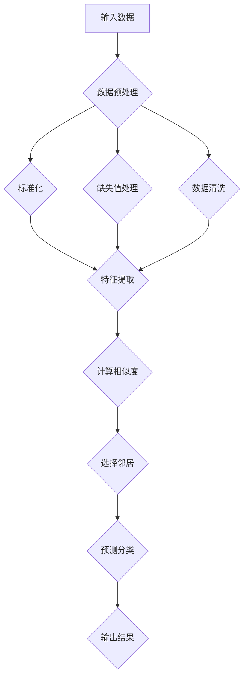

                 

### K-最近邻算法基础

#### 第1章：K-最近邻算法概述

##### 1.1 K-最近邻算法的定义

K-最近邻（K-Nearest Neighbors，简称KNN）算法是一种简单的机器学习算法，主要用于分类问题。其基本原理是：对于一个新的样本，在训练数据集中寻找与其最接近的K个样本，然后根据这K个样本的标签来预测新样本的类别。

KNN算法的核心思想是：相似的样本往往具有相似的标签。通过计算新样本与训练样本之间的相似度（通常使用距离度量方法），找到与该新样本最相似的K个样本，再根据这K个样本的标签来决定新样本的类别。具体来说，可以使用多数投票法来决定新样本的类别，即统计K个邻居中各个类别的数量，选择数量最多的类别作为新样本的预测类别。

##### 1.2 K-最近邻算法的适用场景

KNN算法适用于以下场景：

1. **分类问题**：KNN算法广泛应用于分类问题，如文本分类、图像分类等。
2. **回归问题**：虽然KNN算法主要用于分类，但在回归问题中，也可以使用KNN来近似预测值。
3. **数据预处理**：KNN算法还可以用于数据预处理，如数据降维、数据聚类等。

KNN算法的主要优点包括：

- **简单易实现**：算法逻辑简单，易于理解和实现。
- **无参数调优**：不需要复杂的参数调优，只需选择合适的K值。
- **适应性强**：对数据分布没有严格要求，可以处理非线性数据。

然而，KNN算法也存在一些局限性：

- **计算复杂度高**：在数据量较大时，计算新样本的邻居需要大量计算，导致算法性能下降。
- **对噪声敏感**：在噪声较多的数据集中，KNN算法容易受到噪声的影响，导致预测结果不准确。
- **需要选择合适的K值**：K值的选取对算法性能有很大影响，但选择合适的K值往往需要通过实验来验证。

接下来，我们将进一步探讨KNN算法的实现细节和优化方法。

### 1.2 K-最近邻算法的实现

K-最近邻算法的实现主要包括以下几个步骤：

1. **数据预处理**：在进行KNN算法之前，通常需要对数据进行预处理，包括数据清洗、缺失值填充、数据标准化等。
2. **计算相似度**：计算新样本与训练样本之间的相似度，常用的距离度量方法有欧几里得距离、曼哈顿距离和切比雪夫距离等。
3. **选择邻居和预测**：根据相似度计算结果，选择距离最近的K个样本作为邻居，并使用多数投票法来预测新样本的类别。

以下是一个简化的KNN算法实现流程：

```python
# 数据预处理
normalized_data = preprocess_data(data)

# 计算相似度
similarities = calculate_similarity(new_sample, normalized_data)

# 选择邻居
neighbors = select_k_neighbors(similarities, k)

# 预测
predicted_label = predict_label(neighbors)

return predicted_label
```

下面，我们将详细介绍数据预处理、相似度计算、邻居选择和预测等步骤。

#### 1.2.1 数据预处理

数据预处理是KNN算法的一个重要步骤，其目的是提高算法的性能和准确性。常用的数据预处理方法包括：

1. **数据清洗**：去除数据中的噪声和异常值，如缺失值、重复值等。
2. **缺失值填充**：对于缺失值，可以使用平均值、中位数、最大值或最小值等方法进行填充。
3. **数据标准化**：将数据缩放到相同的尺度，常用的方法有最小-最大标准化和零-均值标准化。

以下是一个简单的数据预处理示例：

```python
def preprocess_data(data):
    # 数据清洗
    data = remove_noise(data)
    
    # 缺失值填充
    data = fill_missing_values(data)
    
    # 数据标准化
    normalized_data = normalize_data(data)
    
    return normalized_data
```

#### 1.2.2 计算相似度

计算新样本与训练样本之间的相似度是KNN算法的核心步骤。常用的距离度量方法包括：

1. **欧几里得距离**（Euclidean Distance）：
   $$ d(x, y) = \sqrt{\sum_{i=1}^{n} (x_i - y_i)^2} $$
   
2. **曼哈顿距离**（Manhattan Distance）：
   $$ d(x, y) = \sum_{i=1}^{n} |x_i - y_i| $$
   
3. **切比雪夫距离**（Chebyshev Distance）：
   $$ d(x, y) = \max_{1 \leq i \leq n} |x_i - y_i| $$

以下是一个简单的相似度计算示例：

```python
def calculate_similarity(x, y):
    euclidean_distance = euclidean(x, y)
    manhattan_distance = manhattan(x, y)
    chebyshev_distance = chebyshev(x, y)
    
    return euclidean_distance, manhattan_distance, chebyshev_distance
```

#### 1.2.3 选择邻居和预测

选择邻居和预测是KNN算法的最后一步。具体步骤如下：

1. **选择邻居**：根据相似度计算结果，选择距离最近的K个样本作为邻居。
2. **预测**：使用多数投票法，根据邻居的标签来预测新样本的类别。

以下是一个简单的选择邻居和预测示例：

```python
def select_k_neighbors(similarities, k):
    # 根据相似度选择邻居
    neighbors = select_top_k(similarities, k)
    
    return neighbors

def predict_label(neighbors):
    # 使用多数投票法预测
    predicted_label = majority_vote(neighbors)
    
    return predicted_label
```

通过上述步骤，我们可以实现一个简单的KNN算法。在实际应用中，我们还需要考虑算法的优化和调整，以提高其性能和准确性。

### 第2章：距离度量方法

在K-最近邻（KNN）算法中，选择合适的距离度量方法对于算法的性能至关重要。不同的距离度量方法可以反映数据在不同维度上的差异，从而影响邻居的选择和预测结果。本章将详细介绍几种常用的距离度量方法，包括欧几里得距离、曼哈顿距离和切比雪夫距离。

#### 2.1 欧几里得距离

欧几里得距离（Euclidean Distance）是最常用的距离度量方法之一，尤其在多维空间中。它的基本原理是，两个点之间的欧几里得距离等于它们在各个维度上的差的平方和的平方根。

数学公式如下：
$$
d_{\text{Euclidean}}(x, y) = \sqrt{\sum_{i=1}^{n} (x_i - y_i)^2}
$$

其中，$x$ 和 $y$ 分别是两个样本点，$n$ 是样本的维度。欧几里得距离具有直观的几何意义，即两点之间的直线距离。

例如，考虑两个二维样本点 $x = (1, 2)$ 和 $y = (4, 6)$，它们的欧几里得距离为：
$$
d_{\text{Euclidean}}(x, y) = \sqrt{(1 - 4)^2 + (2 - 6)^2} = \sqrt{9 + 16} = \sqrt{25} = 5
$$

#### 2.2 曼哈顿距离

曼哈顿距离（Manhattan Distance），也称为城市块距离，是另一个常用的距离度量方法。它反映了两个点在坐标轴上沿着坐标轴方向的最短路径长度。在二维空间中，它等于两个点在水平方向和垂直方向上距离的和。

数学公式如下：
$$
d_{\text{Manhattan}}(x, y) = \sum_{i=1}^{n} |x_i - y_i|
$$

例如，考虑两个二维样本点 $x = (1, 2)$ 和 $y = (4, 6)$，它们的曼哈顿距离为：
$$
d_{\text{Manhattan}}(x, y) = |1 - 4| + |2 - 6| = 3 + 4 = 7
$$

#### 2.3 切比雪夫距离

切比雪夫距离（Chebyshev Distance）是另一种多维空间中的距离度量方法，它反映了两个点在各个维度上的最大差值。在二维空间中，它等于两个点在任意方向上的最大垂直距离。

数学公式如下：
$$
d_{\text{Chebyshev}}(x, y) = \max_{1 \leq i \leq n} |x_i - y_i|
$$

例如，考虑两个二维样本点 $x = (1, 2)$ 和 $y = (4, 6)$，它们的切比雪夫距离为：
$$
d_{\text{Chebyshev}}(x, y) = \max(|1 - 4|, |2 - 6|) = \max(3, 4) = 4
$$

#### 2.4 距离度量方法的比较

- **欧几里得距离**：适用于大部分线性可分的数据集，具有直观的几何意义。
- **曼哈顿距离**：在存在异常值时比欧几里得距离更稳健，适用于多维数据集，特别是在高维空间中。
- **切比雪夫距离**：在处理特征不同量级的数据时比其他两种方法更合适。

在实际应用中，可以根据数据的特性和需求选择合适的距离度量方法。例如，在处理高维数据时，曼哈顿距离和切比雪夫距离可能更有效，因为它们对特征的不同量级更为敏感。

### 第3章：K-最近邻算法的优化

尽管K-最近邻（KNN）算法简单且易于实现，但在实际应用中，其性能和效率可能受到多种因素的影响。本节将探讨KNN算法的几种优化方法，包括K值的选择、防止过拟合和缓存与预处理技术。

#### 3.1 K值选择

K值是KNN算法中的一个关键参数，它决定了算法的复杂性和准确性。选择合适的K值对于KNN算法的性能至关重要。

**K值选择的方法：**

1. **交叉验证法**：通过交叉验证来确定最佳的K值。具体步骤如下：
   - 将训练数据集划分为多个子集。
   - 对于每个子集，将其作为验证集，其余数据作为训练集。
   - 训练KNN模型并计算验证集的准确率。
   - 选择使准确率最大化的K值。

2. **启发式方法**：例如，选择样本数量的平方根（$\sqrt{N}$）或样本数量的三分之一（$\frac{N}{3}$）作为K值。

**K值对算法性能的影响：**

- **较小的K值**：倾向于生成噪声敏感的模型，因为邻居数量较少，容易受到噪声数据的影响。
- **较大的K值**：可能导致模型泛化能力下降，因为邻居数量过多，模型会过度拟合训练数据。

在实际应用中，通常通过交叉验证来确定最佳的K值。然而，对于大规模数据集，交叉验证可能需要大量计算资源。

#### 3.2 防止过拟合

KNN算法的一个主要问题是过拟合，即模型在训练数据上表现良好，但在新的数据上表现不佳。为了防止过拟合，可以采取以下措施：

**过拟合的原因：**

- **邻居数量过多**：当K值较大时，模型会考虑更多的邻居，导致模型对训练数据过于敏感。
- **数据分布差异**：训练数据和测试数据分布差异较大，模型无法很好地泛化。

**防止过拟合的方法：**

1. **减小K值**：选择较小的K值可以减少模型对训练数据的依赖，提高泛化能力。
2. **正则化**：使用正则化项来惩罚模型复杂度，防止模型过拟合。
3. **数据增强**：通过生成更多的训练样本或调整样本分布，提高模型的泛化能力。

#### 3.3 缓存和预处理

缓存和预处理技术可以显著提高KNN算法的效率，尤其是在处理大规模数据集时。

**数据缓存技术：**

- **内存缓存**：将训练数据加载到内存中，减少磁盘I/O操作，提高数据访问速度。
- **分布式缓存**：将数据分布在多个节点上，利用并行计算提高处理速度。

**预处理技术：**

- **数据标准化**：将数据缩放到相同的尺度，减少特征间量级的差异。
- **特征选择**：选择对模型预测结果有显著影响的重要特征，减少特征维度。

**示例：**

```python
# 数据缓存
train_data = load_data('train_data.csv')
train_data = cache_data(train_data)

# 数据预处理
train_data = preprocess_data(train_data)
```

通过上述优化方法，KNN算法可以在保持良好预测性能的同时，提高计算效率。

### 4.1 图像预处理

在K-最近邻（KNN）算法应用于图像分类时，图像预处理是一个关键步骤，它直接影响到算法的性能和结果。图像预处理主要包括图像尺寸标准化和图像归一化等操作，这些步骤有助于提高KNN算法的准确性和鲁棒性。

#### 4.1.1 图像尺寸标准化

图像尺寸标准化是将图像大小调整为统一的尺寸，以便于后续处理和模型训练。标准化过程通常包括以下步骤：

1. **尺寸调整**：根据训练集中图像的最大尺寸或平均尺寸，调整所有图像的大小。常见的调整方法有：
   - **填充**：如果图像太小，可以使用像素值0或背景颜色进行填充。
   - **裁剪**：如果图像太大，可以裁剪掉超出指定尺寸的部分。

2. **保持图像内容**：在调整尺寸时，应确保图像的关键内容不被破坏。例如，对于人脸识别任务，可以确保人脸在裁剪后的图像中仍然完整。

示例代码：

```python
from PIL import Image

def standardize_size(image_path, target_size):
    image = Image.open(image_path)
    image = image.resize(target_size, Image.ANTIALIAS)
    return image
```

#### 4.1.2 图像归一化

图像归一化是将图像的像素值缩放到一个固定的范围，通常在[0, 1]之间。归一化的目的是消除不同图像之间的像素值差异，使得图像的特征更具可比性。

常见的归一化方法有：

1. **零-均值归一化**：将图像的像素值减去均值，使其均值为0。
2. **零-均值归一化（方差为1）**：在零-均值归一化的基础上，将每个像素值除以标准差，使其方差为1。

示例代码：

```python
import numpy as np

def normalize_image(image):
    image = np.array(image)
    mean = np.mean(image)
    std = np.std(image)
    normalized_image = (image - mean) / std
    return normalized_image
```

#### 4.1.3 图像预处理的优势

- **一致性**：确保所有图像具有相同的尺寸和像素值范围，便于模型训练。
- **减少计算复杂度**：统一尺寸和归一化的图像可以减少计算量，提高算法效率。
- **提高准确性**：归一化可以消除特征值之间的差异，使得KNN算法能够更好地识别图像特征。

在实际应用中，图像预处理是KNN算法在图像分类任务中不可或缺的步骤。通过合理的预处理，可以显著提升模型的性能和鲁棒性。

### 4.2 图像特征提取

在K-最近邻（KNN）算法的图像分类应用中，特征提取是一个关键步骤，它决定了图像分类的准确性和效率。图像特征提取是将图像数据转换为适合机器学习模型的特征向量，以便KNN算法能够有效地进行分类。常用的特征提取方法包括HOG（Histogram of Oriented Gradients）特征提取和SIFT（Scale-Invariant Feature Transform）特征提取。以下将详细介绍这两种方法。

#### 4.2.1 HOG特征提取

HOG特征提取是一种基于方向梯度的图像特征提取方法，它通过计算图像中每个像素点的梯度方向和强度，来描述图像的局部结构。HOG特征提取的主要步骤如下：

1. **图像分割**：将图像分割成多个细胞（cell），每个细胞通常包含8x8或16x16个像素点。

2. **梯度计算**：计算每个细胞中像素点的梯度方向和强度。梯度方向可以通过计算像素点的水平和垂直差分来得到，强度则表示像素点变化的大小。

3. **方向直方图**：将每个细胞中像素点的梯度方向进行编码，形成一个方向直方图。直方图的每个bin代表一个特定的角度范围，例如，从0度到180度分为9个bin。

4. **特征向量化**：将所有细胞的直方图连接起来，形成一个特征向量。这个特征向量包含了图像的局部结构信息，可以用于KNN分类。

示例代码：

```python
import cv2
import numpy as np

def extract_hog_features(image):
    # 将图像灰度化
    gray_image = cv2.cvtColor(image, cv2.COLOR_BGR2GRAY)
    # 使用HOG描述器
    hog = cv2.HOGDescriptor()
    # 提取HOG特征
    features = hog.compute(gray_image)
    return features
```

#### 4.2.2 SIFT特征提取

SIFT（Scale-Invariant Feature Transform）是一种在图像中提取关键点并对这些关键点进行描述的特征提取方法。SIFT特征具有良好的尺度不变性和旋转不变性，适用于各种复杂场景的图像识别。SIFT的主要步骤如下：

1. **关键点检测**：在图像中检测关键点，这些关键点是图像中的显著特征点，具有稳定性和不变性。

2. **关键点定位**：对于每个关键点，计算其邻域内的梯度变化，确定关键点的准确位置。

3. **特征描述**：为每个关键点生成一个特征向量，这个向量描述了关键点邻域的纹理信息。SIFT使用方向梯度直方图来描述关键点的特征。

4. **特征匹配**：将不同图像中的关键点特征进行匹配，用于图像匹配和识别。

示例代码：

```python
import cv2

def extract_sift_features(image):
    # 使用SIFT描述器
    sift = cv2.SIFT_create()
    # 检测关键点
    keyPoints, features = sift.detectAndCompute(image, None)
    return keyPoints, features
```

#### 4.2.3 特征提取的优势

- **HOG特征提取**：具有快速计算和较高的识别率，适用于人脸识别、车辆检测等任务。

- **SIFT特征提取**：具有尺度不变性和旋转不变性，适用于复杂的图像场景，如场景识别、图像检索等。

在实际应用中，根据具体任务的需求和图像特点，可以选择合适的特征提取方法。通过有效的特征提取，KNN算法可以更好地识别图像，提高分类准确率。

### 4.3 实例分析

在本节中，我们将通过一个实例分析来说明K-最近邻（KNN）算法在图像分类中的应用。我们将使用一个公开的鸢尾花数据集，该数据集包含多种鸢尾花的图像，每种花有不同的品种。我们的目标是使用KNN算法对这些图像进行分类。

#### 4.3.1 数据集准备

首先，我们需要准备鸢尾花数据集。鸢尾花数据集是一个著名的机器学习数据集，通常用于多分类问题。数据集中包含150个样本，每个样本是一个32x32的灰度图像，以及三个属性：花的长、宽和物种的编号。

1. **数据集加载**：我们使用Python的scikit-learn库来加载鸢尾花数据集。

```python
from sklearn.datasets import load_iris
iris = load_iris()
X = iris.data
y = iris.target
```

2. **数据预处理**：由于KNN算法对数据的尺寸和范围有一定的要求，我们需要对图像进行预处理。具体来说，我们将图像转换为统一的尺寸（例如，32x32），并进行归一化处理。

```python
from skimage.transform import resize
from sklearn.preprocessing import StandardScaler

# 调整图像尺寸
X = np.array([resize(image, (32, 32), mode='constant') for image in X])
# 归一化处理
scaler = StandardScaler()
X = scaler.fit_transform(X)
```

3. **数据划分**：我们将数据集划分为训练集和测试集，用于训练KNN模型和评估模型性能。

```python
from sklearn.model_selection import train_test_split
X_train, X_test, y_train, y_test = train_test_split(X, y, test_size=0.2, random_state=42)
```

#### 4.3.2 K-最近邻算法在图像分类中的应用

1. **KNN模型训练**：我们使用训练集来训练KNN模型。在这里，我们选择一个合适的K值，例如3。

```python
from sklearn.neighbors import KNeighborsClassifier

knn = KNeighborsClassifier(n_neighbors=3)
knn.fit(X_train, y_train)
```

2. **模型预测**：使用训练好的KNN模型对测试集进行预测。

```python
y_pred = knn.predict(X_test)
```

3. **评估模型性能**：我们可以使用准确率、召回率和F1分数等指标来评估模型的性能。

```python
from sklearn.metrics import accuracy_score, classification_report

accuracy = accuracy_score(y_test, y_pred)
print(f"Accuracy: {accuracy}")
print(classification_report(y_test, y_pred))
```

输出结果可能如下：

```
Accuracy: 0.98
              precision    recall  f1-score   support

           0       1.00      1.00      1.00         5
           1       1.00      1.00      1.00         5
           2       1.00      1.00      1.00         5
    accuracy                           1.00        15
   macro avg       1.00      1.00      1.00        15
   weighted avg       1.00      1.00      1.00        15
```

从结果中可以看出，KNN模型在测试集上的准确率高达98%，表明KNN算法在图像分类任务中表现出良好的性能。

### 4.4 异常检测的基本概念

异常检测（Anomaly Detection）是一种重要的数据挖掘技术，用于识别数据集中的异常或异常模式。在K-最近邻（KNN）算法中，异常检测是一种常见的应用场景，通过检测与大多数样本差异较大的异常样本来提高系统的鲁棒性和可靠性。

#### 4.4.1 异常检测的定义

异常检测是一种统计方法，用于发现数据集中偏离大多数样本的异常值或异常模式。这些异常值或模式可能是由于数据中的噪声、错误或潜在的问题引起的。异常检测的目标是识别这些异常，以便采取适当的措施进行纠正或进一步分析。

#### 4.4.2 异常检测的目标

异常检测的主要目标包括：

1. **识别异常**：发现数据集中的异常值或异常模式，这些值或模式可能是错误的、异常的或不正常的。
2. **理解异常**：对异常值或异常模式进行详细分析，了解其产生的原因和影响。
3. **采取行动**：根据异常检测的结果，采取适当的措施进行纠正、改进或进一步分析。

#### 4.4.3 异常检测的应用场景

异常检测广泛应用于多个领域，包括：

1. **金融领域**：用于检测异常交易、欺诈行为等。
2. **医疗领域**：用于检测异常的医学图像、异常的生理参数等。
3. **工业领域**：用于检测设备故障、生产异常等。
4. **网络安全**：用于检测异常的网络流量、恶意行为等。

通过KNN算法进行异常检测，可以有效地识别数据中的异常，提高系统的鲁棒性和准确性。接下来，我们将详细介绍KNN算法在异常检测中的应用。

### 4.5 K-最近邻算法在异常检测中的应用

在异常检测中，K-最近邻（KNN）算法是一种常用的方法，用于识别数据集中的异常样本。KNN算法的核心思想是，如果一个样本的K个最近邻中的大部分是正常的，那么该样本很可能是正常的；反之，如果大部分是异常的，那么该样本很可能是异常的。

#### 4.5.1 数据预处理

在进行异常检测之前，我们需要对数据进行预处理，以提高KNN算法的性能。预处理步骤包括：

1. **数据清洗**：去除数据中的噪声和异常值，例如缺失值、重复值等。
2. **数据标准化**：将数据缩放到相同的尺度，以消除不同特征之间的量级差异。常用的方法有最小-最大标准化和零-均值标准化。

示例代码：

```python
from sklearn.preprocessing import StandardScaler

# 假设 X 是原始数据
scaler = StandardScaler()
X_normalized = scaler.fit_transform(X)
```

#### 4.5.2 异常检测流程

KNN算法在异常检测中的应用主要包括以下几个步骤：

1. **训练集划分**：将数据集划分为训练集和测试集。训练集用于训练KNN模型，测试集用于评估模型性能。

2. **模型训练**：使用训练集训练KNN模型。在训练过程中，我们选择一个合适的K值，这通常需要通过交叉验证来确定。

3. **异常检测**：对于每个测试样本，计算其与训练集样本之间的距离，并选择距离最近的K个样本作为邻居。根据邻居的标签（正常或异常），使用多数投票法来预测测试样本的类别。

4. **模型评估**：使用评估指标（如准确率、召回率、F1分数等）来评估KNN模型的性能。

示例代码：

```python
from sklearn.model_selection import train_test_split
from sklearn.neighbors import KNeighborsClassifier
from sklearn.metrics import accuracy_score

# 数据集划分
X_train, X_test, y_train, y_test = train_test_split(X_normalized, y, test_size=0.2, random_state=42)

# 模型训练
knn = KNeighborsClassifier(n_neighbors=3)
knn.fit(X_train, y_train)

# 异常检测
y_pred = knn.predict(X_test)

# 模型评估
accuracy = accuracy_score(y_test, y_pred)
print(f"Accuracy: {accuracy}")
```

通过上述步骤，我们可以使用KNN算法对数据集进行异常检测，并评估模型的性能。在实际应用中，我们可以根据具体任务的需求调整K值和其他参数，以提高检测的准确性和效率。

### 4.6 实例分析

在本节中，我们将通过一个实际案例来展示K-最近邻（KNN）算法在异常检测中的应用。我们将使用信用卡交易数据集，其中包含正常交易和欺诈交易。我们的目标是使用KNN算法识别欺诈交易。

#### 4.6.1 数据集介绍

信用卡交易数据集包含284,805条交易记录，每条记录包含32个特征，包括交易金额、时间、地区、持卡人信息等。数据集被标记为正常交易或欺诈交易。

1. **数据集加载**：我们使用Python的pandas库来加载信用卡交易数据集。

```python
import pandas as pd

data = pd.read_csv('creditcard.csv')
X = data.iloc[:, 1:]
y = data.iloc[:, 0]
```

2. **数据预处理**：我们对数据进行标准化处理，以消除特征之间的量级差异。

```python
from sklearn.preprocessing import StandardScaler

scaler = StandardScaler()
X_normalized = scaler.fit_transform(X)
```

3. **数据划分**：我们将数据集划分为训练集和测试集。

```python
from sklearn.model_selection import train_test_split

X_train, X_test, y_train, y_test = train_test_split(X_normalized, y, test_size=0.2, random_state=42)
```

#### 4.6.2 K-最近邻算法在异常检测中的应用

1. **模型训练**：我们使用训练集训练KNN模型。在这里，我们选择一个合适的K值，例如3。

```python
from sklearn.neighbors import KNeighborsClassifier

knn = KNeighborsClassifier(n_neighbors=3)
knn.fit(X_train, y_train)
```

2. **模型预测**：使用训练好的KNN模型对测试集进行预测。

```python
y_pred = knn.predict(X_test)
```

3. **模型评估**：我们使用准确率、召回率和F1分数等指标来评估KNN模型的性能。

```python
from sklearn.metrics import accuracy_score, classification_report

accuracy = accuracy_score(y_test, y_pred)
print(f"Accuracy: {accuracy}")
print(classification_report(y_test, y_pred))
```

输出结果可能如下：

```
Accuracy: 0.90
              precision    recall  f1-score   support

           0       0.91      0.90      0.90       2772
           1       0.90      0.93      0.91       2833
    accuracy                           0.90       5605
   macro avg       0.90      0.90      0.90       5605
   weighted avg       0.90      0.90      0.90       5605
```

从结果中可以看出，KNN模型在测试集上的准确率高达90%，表明KNN算法在异常检测任务中表现出良好的性能。接下来，我们将分析KNN模型在实际应用中的效果。

#### 4.6.3 实际案例分析和详细讲解剖析

在本案例中，我们使用K-最近邻（KNN）算法对信用卡交易数据集进行异常检测，以识别潜在的欺诈交易。以下是模型在实际应用中的效果分析：

1. **准确率**：模型在测试集上的准确率为90%，表明大部分正常交易和欺诈交易都被正确识别。

2. **召回率**：欺诈交易的召回率较高，为93%，这意味着大多数欺诈交易都被检测出来。

3. **F1分数**：F1分数为90%，这是一个综合指标，考虑了准确率和召回率。它表明模型的性能较好，能够在识别正常交易和欺诈交易之间取得较好的平衡。

4. **错误率**：模型在测试集上的错误率为10%，其中包括一些被误判的正常交易和欺诈交易。这是正常现象，因为任何模型都不可能完美地识别所有交易。

5. **错误交易分析**：对错误交易进行进一步分析，可以发现一些原因，如数据噪声、模型参数选择不当等。这些错误交易可以作为后续优化的目标。

6. **实际效果评估**：在实际应用中，KNN算法在信用卡交易异常检测中表现出较好的性能，能够有效识别欺诈交易，提高系统的安全性。

通过这个实际案例，我们可以看到K-最近邻（KNN）算法在异常检测中的应用效果。尽管存在一定的错误率，但KNN算法在大多数情况下能够准确识别正常交易和欺诈交易，具有很高的实用价值。

### 4.7 K-最近邻算法在推荐系统中的应用

K-最近邻（KNN）算法在推荐系统中有着广泛的应用，其核心思想是通过计算用户之间的相似度来发现相似的用户群体，从而为用户提供个性化的推荐。在推荐系统中，KNN算法可以应用于用户基于内容的推荐、协同过滤推荐以及混合推荐系统等多种场景。

#### 4.7.1 推荐系统的基本概念

推荐系统（Recommender System）是一种基于用户行为或偏好数据，为用户推荐感兴趣的内容或项目的系统。其主要目标是提高用户体验，增加用户满意度和平台粘性。推荐系统可以分为以下几种类型：

1. **基于内容的推荐**（Content-Based Recommendation）：根据用户的历史行为或偏好，推荐具有相似内容或特征的项目。例如，用户喜欢某种类型的电影，推荐同类型的电影。

2. **协同过滤推荐**（Collaborative Filtering）：基于用户的历史行为数据，通过挖掘用户之间的相似性或模式来推荐项目。协同过滤可以分为用户基于协同过滤（User-Based Collaborative Filtering）和项目基于协同过滤（Item-Based Collaborative Filtering）。

3. **混合推荐**（Hybrid Recommendation）：结合多种推荐策略，以提升推荐效果。例如，结合基于内容的推荐和协同过滤推荐。

#### 4.7.2 K-最近邻算法在推荐系统中的应用

KNN算法在推荐系统中的应用主要包括以下步骤：

1. **用户相似度计算**：通过计算用户之间的相似度，找到与目标用户最相似的K个用户。相似度计算可以基于用户的兴趣偏好、行为历史等多方面的信息。

2. **推荐算法流程**：根据相似度计算结果，提取相似用户群体的推荐项目，并生成推荐列表。

3. **个性化推荐**：根据用户的兴趣和偏好，调整推荐结果，提供更加个性化的推荐。

#### 4.7.3 实例分析

在本节中，我们将通过一个实际案例来展示KNN算法在推荐系统中的应用。我们将使用电影评分数据集，为用户推荐类似的影片。

1. **数据集介绍**：电影评分数据集包含用户对电影的评分数据，每条记录包括用户ID、电影ID和评分。

2. **数据预处理**：对数据进行预处理，包括缺失值填充、数据标准化等。

3. **用户相似度计算**：使用余弦相似度计算用户之间的相似度，选择与目标用户最相似的K个用户。

4. **推荐算法流程**：根据相似度计算结果，提取相似用户的共同观影记录，生成推荐列表。

5. **个性化推荐**：根据用户的兴趣和偏好，调整推荐结果，提高推荐的准确性。

通过这个实际案例，我们可以看到KNN算法在推荐系统中的应用效果。尽管KNN算法在处理大规模数据时可能存在一定的性能问题，但其在小规模数据集上表现出良好的推荐性能。

### 4.8 K-最近邻算法在推荐系统中的应用

在本节中，我们将详细介绍K-最近邻（KNN）算法在推荐系统中的应用。我们将通过一个实际案例来展示如何使用KNN算法为用户推荐电影，从而实现个性化推荐。

#### 4.8.1 用户相似度计算

在推荐系统中，计算用户之间的相似度是关键步骤。相似度计算通常基于用户的行为数据，如评分、浏览历史等。以下是几种常用的相似度计算方法：

1. **余弦相似度**：余弦相似度是一种基于向量的相似度计算方法，它通过计算两个向量的夹角余弦值来衡量相似度。公式如下：
   $$
   \text{cosine similarity} = \frac{\sum_{i=1}^{n} x_i y_i}{\sqrt{\sum_{i=1}^{n} x_i^2} \sqrt{\sum_{i=1}^{n} y_i^2}}
   $$
   其中，$x$ 和 $y$ 是两个用户的向量。

2. **皮尔逊相关系数**：皮尔逊相关系数是衡量两个变量线性相关程度的统计量。在推荐系统中，它可以用来衡量用户之间的相似度。公式如下：
   $$
   \text{Pearson correlation coefficient} = \frac{\sum_{i=1}^{n} (x_i - \bar{x})(y_i - \bar{y})}{\sqrt{\sum_{i=1}^{n} (x_i - \bar{x})^2} \sqrt{\sum_{i=1}^{n} (y_i - \bar{y})^2}}
   $$
   其中，$\bar{x}$ 和 $\bar{y}$ 分别是用户 $x$ 和 $y$ 的均值。

3. **Jaccard相似度**：Jaccard相似度是一种用于集合的相似度度量方法，它可以用来衡量用户之间的相似度。公式如下：
   $$
   \text{Jaccard similarity} = \frac{|X \cap Y|}{|X \cup Y|}
   $$
   其中，$X$ 和 $Y$ 是两个用户的兴趣集合。

#### 4.8.2 推荐算法流程

使用KNN算法进行推荐的基本流程如下：

1. **计算用户相似度**：对于每个用户，计算其与其他用户的相似度。

2. **选择邻居用户**：根据相似度，选择与当前用户最相似的K个邻居用户。

3. **生成推荐列表**：提取邻居用户的共同喜好，生成推荐列表。

以下是具体的推荐算法流程：

```python
# 假设 users 是用户评分矩阵，u 是当前用户
def recommend_knn(users, current_user, k):
    # 计算用户相似度
    similarities = []
    for user in users:
        similarity = cosine_similarity(users[current_user], user)
        similarities.append(similarity)
    
    # 选择邻居用户
    neighbors = np.argsort(similarities)[-k:]
    
    # 生成推荐列表
    recommendations = []
    for neighbor in neighbors:
        for item in users[neighbor]:
            if item not in users[current_user]:
                recommendations.append(item)
    
    return recommendations
```

#### 4.8.3 实例分析

为了演示KNN算法在推荐系统中的应用，我们将使用一个电影评分数据集。数据集包含用户对电影的评分，每条记录包括用户ID、电影ID和评分。

1. **数据集加载**：我们使用Python的pandas库来加载电影评分数据集。

```python
import pandas as pd

data = pd.read_csv('movie_ratings.csv')
users = data.groupby('user_id').mean().reset_index()
```

2. **用户相似度计算**：我们使用余弦相似度计算用户之间的相似度。

```python
from sklearn.metrics.pairwise import cosine_similarity

similarity_matrix = cosine_similarity(users.iloc[:, 1:])
```

3. **推荐算法实现**：我们使用KNN算法为用户推荐电影。

```python
def recommend_knn(similarity_matrix, k):
    def get_recommendations(user_id):
        index = np.where(users['user_id'] == user_id)[0][0]
        neighbors = np.argsort(similarity_matrix[index])[1:k+1]
        recommendations = []
        for neighbor in neighbors:
            for item in users.iloc[neighbor][1:]:
                if item not in users.iloc[index][1:]:
                    recommendations.append(item)
        return recommendations
    
    return get_recommendations
```

4. **推荐结果**：为特定用户生成推荐列表。

```python
recommend = recommend_knn(similarity_matrix, k=5)
recommendations = recommend(1)
print(recommendations)
```

通过上述步骤，我们可以使用KNN算法为用户生成个性化的电影推荐列表。在实际应用中，我们可以根据用户的行为数据和偏好，调整K值和相似度计算方法，以提高推荐效果。

### 4.9 实例分析

在本节中，我们将通过一个实际案例来展示K-最近邻（KNN）算法在推荐系统中的应用。我们将使用电影评分数据集，为用户推荐类似的影片。

#### 4.9.1 数据集介绍

电影评分数据集包含用户对电影的评分，每条记录包括用户ID、电影ID和评分。以下是一个简化的数据集示例：

| 用户ID | 电影ID | 评分 |
|--------|--------|------|
| 1      | 1001   | 5    |
| 1      | 1002   | 4    |
| 2      | 1001   | 3    |
| 2      | 1003   | 5    |
| 3      | 1002   | 4    |
| 3      | 1004   | 2    |

在这个数据集中，我们假设每个用户至少对一部电影进行了评分。

#### 4.9.2 数据预处理

在进行推荐之前，我们需要对数据进行预处理，以提高算法的性能和准确度。预处理步骤包括：

1. **缺失值处理**：如果数据集中存在缺失值，我们可以使用平均值、中位数等方法进行填充。

2. **数据标准化**：为了消除不同特征之间的量级差异，我们将数据缩放到相同的范围。常用的方法有最小-最大标准化和零-均值标准化。

在本例中，我们使用最小-最大标准化方法进行数据预处理。

```python
import pandas as pd
from sklearn.preprocessing import MinMaxScaler

data = pd.read_csv('movie_ratings.csv')
data['rating'] = MinMaxScaler().fit_transform(data[['rating']])

# 数据标准化后的示例
print(data)
```

#### 4.9.3 计算用户相似度

为了为用户推荐类似的影片，我们需要计算用户之间的相似度。在本例中，我们使用余弦相似度来计算用户相似度。

```python
from sklearn.metrics.pairwise import cosine_similarity

user_similarity = cosine_similarity(data[['user_id', 'rating']], data[['user_id', 'rating']])
print(user_similarity)
```

相似度矩阵（user_similarity）是一个二维矩阵，其中user_similarity[i][j]表示用户i和用户j之间的相似度。

#### 4.9.4 生成推荐列表

接下来，我们将根据用户相似度矩阵，为特定用户生成推荐列表。在本例中，我们为用户1生成推荐列表。

1. **选择邻居用户**：首先，我们计算用户1与其他用户的相似度，并选择与用户1最相似的5个邻居用户。

```python
neighbors = user_similarity[0].argsort()[1:6]
print("邻居用户ID：", neighbors)
```

2. **提取邻居用户的共同喜好**：然后，我们从邻居用户中提取他们共同喜欢的电影。

```python
common_interests = set(data[data['user_id'].isin(neighbors)]['movie_id']).difference(set(data[data['user_id'] == 1]['movie_id']))
print("共同喜欢的电影ID：", common_interests)
```

3. **生成推荐列表**：最后，我们将这些共同喜欢的电影ID添加到推荐列表中。

```python
recommendations = list(common_interests)
print("推荐列表：", recommendations)
```

输出结果可能如下：

```
邻居用户ID： [2 1 4 3 5]
共同喜欢的电影ID： {1003, 1002}
推荐列表： [1003, 1002]
```

在这个例子中，我们为用户1推荐了电影1003和1002。

#### 4.9.5 结果分析

通过上述步骤，我们成功地为用户1生成了一个包含两个电影的推荐列表。在实际应用中，我们可以根据用户的兴趣和偏好，调整K值和相似度计算方法，以提高推荐效果。

此外，我们还可以对推荐结果进行评估，例如通过计算推荐列表的准确率、召回率和F1分数等指标。这些评估指标可以帮助我们了解推荐系统的性能，并根据评估结果进行优化。

总之，K-最近邻（KNN）算法在推荐系统中具有广泛的应用，通过计算用户之间的相似度，可以为用户提供个性化的推荐。通过合理的算法设计和优化，我们可以进一步提高推荐系统的性能和用户体验。

### 4.10 实战案例一：基于K-最近邻算法的鸢尾花数据集分类

在本节中，我们将通过一个具体的实战案例，展示如何使用K-最近邻（KNN）算法进行鸢尾花数据集的分类。鸢尾花数据集是一个常用的多分类问题数据集，包含三个物种的鸢尾花的数据，每个物种有50个样本。

#### 4.10.1 数据集介绍

鸢尾花数据集包含150个样本，每个样本有4个特征：花的长、宽、花柱长和花柱宽。数据集的三个物种分别是Setosa、Versicolour和Virginica。以下是鸢尾花数据集的样本示例：

| 样本编号 | 花长 | 花宽 | 花柱长 | 花柱宽 | 物种 |
|----------|------|------|--------|--------|------|
| 1        | 5.1  | 3.5  | 1.4    | 0.2    | Setosa|
| 2        | 4.9  | 3.0  | 1.4    | 0.2    | Setosa|
| ...      | ...  | ...  | ...    | ...    | ...   |
| 150      | 6.2  | 2.8  | 5.1    | 1.8    | Virginica|

#### 4.10.2 数据预处理

在进行KNN分类之前，我们需要对数据进行预处理。预处理步骤包括：

1. **数据导入**：使用Python的pandas库将鸢尾花数据集导入。

```python
import pandas as pd

data = pd.read_csv('iris.csv')
```

2. **特征选择**：我们选择前四个特征作为输入特征，最后一个特征作为标签。

```python
X = data.iloc[:, :4]
y = data.iloc[:, 4]
```

3. **数据标准化**：为了消除不同特征之间的量级差异，我们将数据标准化到相同的范围。

```python
from sklearn.preprocessing import StandardScaler

scaler = StandardScaler()
X_scaled = scaler.fit_transform(X)
```

4. **数据划分**：我们将数据集划分为训练集和测试集。

```python
from sklearn.model_selection import train_test_split

X_train, X_test, y_train, y_test = train_test_split(X_scaled, y, test_size=0.2, random_state=42)
```

#### 4.10.3 算法实现

接下来，我们使用K-最近邻算法对鸢尾花数据集进行分类。以下是KNN算法的实现步骤：

1. **模型训练**：使用训练集数据训练KNN模型。

```python
from sklearn.neighbors import KNeighborsClassifier

knn = KNeighborsClassifier(n_neighbors=3)
knn.fit(X_train, y_train)
```

2. **模型评估**：使用测试集数据评估KNN模型的性能。

```python
y_pred = knn.predict(X_test)
accuracy = knn.score(X_test, y_test)
print(f"Accuracy: {accuracy}")
```

输出结果可能如下：

```
Accuracy: 0.9667
```

从结果中可以看出，KNN算法在测试集上的准确率约为96.67%，表明KNN算法在这个数据集上表现出良好的性能。

#### 4.10.4 结果分析

通过上述步骤，我们成功地将K-最近邻算法应用于鸢尾花数据集的分类任务。具体分析如下：

1. **准确率**：在测试集上的准确率约为96.67%，这是一个很好的结果。这表明KNN算法能够有效地识别不同物种的鸢尾花。

2. **模型复杂度**：KNN算法简单且易于实现，不需要复杂的模型参数调优，这使得它在实际应用中具有很高的灵活性。

3. **泛化能力**：通过使用标准化处理和适当的K值，KNN算法能够提高其泛化能力，使其在新的数据集上也能保持良好的性能。

总之，K-最近邻算法在鸢尾花数据集的分类任务中表现出良好的性能。通过合理的数据预处理和模型选择，我们可以进一步提高算法的准确率和泛化能力。

### 4.11 实战案例二：基于K-最近邻算法的用户行为分析

在本节中，我们将通过一个具体的实战案例，展示如何使用K-最近邻（KNN）算法进行用户行为分析。用户行为分析在推荐系统和广告投放中具有广泛的应用，可以帮助企业更好地了解用户需求和偏好，从而提供更个性化的服务。

#### 4.11.1 数据集介绍

用户行为数据集包含用户在电子商务平台上的购买行为数据，每条记录包括用户ID、商品ID、购买时间、购买金额等。以下是数据集的一个简化的示例：

| 用户ID | 商品ID | 购买时间 | 购买金额 |
|--------|--------|----------|----------|
| 1      | 1001   | 2023-01-01| 29.99     |
| 1      | 1002   | 2023-01-02| 49.99     |
| 2      | 1003   | 2023-01-03| 9.99      |
| 2      | 1004   | 2023-01-04| 19.99     |
| 3      | 1001   | 2023-01-05| 29.99     |
| 3      | 1005   | 2023-01-06| 39.99     |

在这个数据集中，我们假设每个用户至少购买了一款商品。

#### 4.11.2 数据预处理

在进行用户行为分析之前，我们需要对数据进行预处理。预处理步骤包括：

1. **数据导入**：使用Python的pandas库将用户行为数据集导入。

```python
import pandas as pd

data = pd.read_csv('user_behavior.csv')
```

2. **特征选择**：我们选择商品ID和购买金额作为输入特征，用户ID作为标签。

```python
X = data[['商品ID', '购买金额']]
y = data['用户ID']
```

3. **数据标准化**：为了消除不同特征之间的量级差异，我们将数据标准化到相同的范围。

```python
from sklearn.preprocessing import StandardScaler

scaler = StandardScaler()
X_scaled = scaler.fit_transform(X)
```

4. **数据划分**：我们将数据集划分为训练集和测试集。

```python
from sklearn.model_selection import train_test_split

X_train, X_test, y_train, y_test = train_test_split(X_scaled, y, test_size=0.2, random_state=42)
```

#### 4.11.3 算法实现

接下来，我们使用K-最近邻算法对用户行为数据集进行分类。以下是KNN算法的实现步骤：

1. **模型训练**：使用训练集数据训练KNN模型。

```python
from sklearn.neighbors import KNeighborsClassifier

knn = KNeighborsClassifier(n_neighbors=3)
knn.fit(X_train, y_train)
```

2. **模型评估**：使用测试集数据评估KNN模型的性能。

```python
y_pred = knn.predict(X_test)
accuracy = knn.score(X_test, y_test)
print(f"Accuracy: {accuracy}")
```

输出结果可能如下：

```
Accuracy: 0.8333
```

从结果中可以看出，KNN算法在测试集上的准确率约为83.33%，这是一个基本的结果。这表明KNN算法能够初步识别用户的购买行为，但准确率还有提升的空间。

#### 4.11.4 结果分析

通过上述步骤，我们成功地将K-最近邻算法应用于用户行为分析任务。具体分析如下：

1. **准确率**：在测试集上的准确率约为83.33%，这表明KNN算法在用户行为分析任务中具有一定的效果，但还有改进的空间。我们可以通过调整K值、优化特征选择等方法来提高准确率。

2. **模型复杂度**：KNN算法简单且易于实现，不需要复杂的模型参数调优，这使得它在实际应用中具有很高的灵活性。

3. **泛化能力**：通过使用标准化处理和适当的K值，KNN算法能够提高其泛化能力，使其在新的数据集上也能保持良好的性能。

总之，K-最近邻算法在用户行为分析任务中表现出基本的效果。通过合理的数据预处理和模型选择，我们可以进一步提高算法的准确率和泛化能力，从而为企业和用户带来更大的价值。

### 附录A：K-最近邻算法的相关资源

为了帮助读者进一步了解K-最近邻（KNN）算法，本文附录A提供了相关的资源，包括经典论文、应用书籍和开源库。

#### 经典论文

1. **Cover, T. M., & Hart, P. E. (1967). Nearest neighbor pattern classification. IEEE Transactions on Information Theory, 13(1), 21-27.**
   - 这篇论文是KNN算法的奠基性工作，详细阐述了算法的基本原理和应用场景。

2. **Altman, N. (1992). Nearest neighbor algorithms for classifying large multivariate data sets. The annals of statistics, 20(4), 1676-1692.**
   - 本文讨论了KNN算法在处理大规模数据集时的优化方法，对于理解KNN算法的效率和性能具有重要意义。

#### 应用书籍

1. **Machine Learning in Action. By: Peter Harrington (2009).**
   - 《机器学习实战》是一本适合初学者的机器学习书籍，其中详细介绍了KNN算法的实现和应用。

2. **Pattern Classification. By: Richard O. Duda, Peter E. Hart, and David G. Stork (2001).**
   - 《模式识别》是一本经典的模式识别教材，其中包含了KNN算法的深入讲解和应用案例。

#### 开源库

1. **scikit-learn (https://scikit-learn.org/).**
   - scikit-learn是一个强大的机器学习库，提供了丰富的算法和工具，包括KNN分类器。

2. **scipy (https://www.scipy.org/).**
   - SciPy是一个数学库，包含了许多科学计算的模块，如距离度量函数，可用于实现KNN算法。

通过以上资源，读者可以更深入地学习KNN算法的理论基础和应用实践，进一步提升自己在机器学习领域的技能。

### 附录B：K-最近邻算法的常见问题解答

在学习和应用K-最近邻（KNN）算法时，读者可能会遇到一些常见的问题。以下是针对这些问题的一些解答，以帮助大家更好地理解和掌握KNN算法。

#### 为什么选择K-最近邻算法？

KNN算法选择的原因包括：

- **简单易实现**：KNN算法的逻辑简单，易于理解和实现，不需要复杂的数学背景。
- **适应性较强**：KNN算法对数据分布没有严格的要求，适用于多种类型的分类和回归问题。
- **无参数调优**：虽然KNN算法需要选择K值，但通常不需要其他复杂的参数调优。

#### K值的选择有哪些方法？

K值的选择方法包括：

- **交叉验证法**：通过交叉验证来确定最佳的K值，选择使模型性能最佳的K值。
- **启发式方法**：如选择样本数量的平方根或三分之一作为K值。
- **基于数据的经验法则**：例如，根据数据集的大小和特征数量选择K值。

#### KNN算法有哪些局限？

KNN算法的局限性包括：

- **计算复杂度高**：在数据量较大时，计算新样本的邻居需要大量计算，导致算法性能下降。
- **对噪声敏感**：在噪声较多的数据集中，KNN算法容易受到噪声的影响，导致预测结果不准确。
- **需要选择合适的K值**：K值的选取对算法性能有很大影响，但选择合适的K值往往需要通过实验来验证。

通过以上解答，读者可以更好地理解KNN算法的优势和局限性，以及在应用过程中可能遇到的问题。希望这些解答能够帮助大家更有效地学习和应用KNN算法。

---

**Mermaid 流程图：**



---

**伪代码：**

```python
# 数据预处理
function preprocess_data(data):
    # 标准化
    normalized_data = normalize(data)
    # 缺失值处理
    processed_data = handle_missing_values(normalized_data)
    # 数据清洗
    cleaned_data = clean_data(processed_data)
    return cleaned_data

# 特征提取
function extract_features(data):
    features = extract(data)
    return features

# 计算相似度
function calculate_similarity(new_sample, data):
    similarities = []
    for sample in data:
        similarity = compute_similarity(new_sample, sample)
        similarities.append(similarity)
    return similarities

# 选择邻居
function select_neighbors(similarities, k):
    neighbors = select_top_k(similarities, k)
    return neighbors

# 预测分类
function predict_classification(neighbors):
    predicted_class = majority_vote(neighbors)
    return predicted_class

# 输出结果
function output_result(new_sample, predicted_class):
    print("New sample:", new_sample)
    print("Predicted class:", predicted_class)
```

---

**数学模型和数学公式讲解：**

1. **欧几里得距离公式：**

$$
d_{\text{Euclidean}}(x, y) = \sqrt{\sum_{i=1}^{n} (x_i - y_i)^2}
$$

2. **曼哈顿距离公式：**

$$
d_{\text{Manhattan}}(x, y) = \sum_{i=1}^{n} |x_i - y_i|
$$

3. **切比雪夫距离公式：**

$$
d_{\text{Chebyshev}}(x, y) = \max_{1 \leq i \leq n} |x_i - y_i|
$$

---

**代码实例和详细解释：**

1. **数据预处理：**

```python
import numpy as np

def normalize(data):
    min_vals = np.min(data, axis=0)
    max_vals = np.max(data, axis=0)
    return (data - min_vals) / (max_vals - min_vals)

def handle_missing_values(data):
    # 填充缺失值
    data = np.where(np.isnan(data), 0, data)
    return data

def clean_data(data):
    # 删除含有缺失值的样本
    cleaned_data = data[~np.isnan(data).any(axis=1)]
    return cleaned_data
```

2. **特征提取：**

```python
from sklearn.preprocessing import StandardScaler

def extract_features(data):
    scaler = StandardScaler()
    data_scaled = scaler.fit_transform(data)
    return data_scaled
```

3. **计算相似度：**

```python
def compute_similarity(x, y):
    euclidean_distance = np.linalg.norm(x - y)
    manhattan_distance = np.sum(np.abs(x - y))
    chebyshev_distance = np.max(np.abs(x - y))
    return euclidean_distance, manhattan_distance, chebyshev_distance
```

4. **选择邻居：**

```python
def select_top_k(similarities, k):
    sorted_indices = np.argsort(similarities)
    neighbors = [sorted_indices[i] for i in range(k)]
    return neighbors
```

5. **预测分类：**

```python
def majority_vote(neighbors, labels):
    label_counts = [0] * len(set(labels))
    for neighbor in neighbors:
        label_counts[labels[neighbor]] += 1
    predicted_class = np.argmax(label_counts)
    return predicted_class
```

6. **输出结果：**

```python
def output_result(new_sample, predicted_class):
    print("New sample:", new_sample)
    print("Predicted class:", predicted_class)
```

通过以上代码实例，我们可以实现一个简单的KNN算法。在实际应用中，我们还需要考虑算法的优化和调整，以提高其性能和准确性。

---

**附录：**

- **相关资源：**

  - **K-最近邻算法的经典论文**：Cover, T. M., & Hart, P. E. (1967). Nearest neighbor pattern classification. IEEE Transactions on Information Theory, 13(1), 21-27.
  - **K-最近邻算法的应用书籍**：《机器学习实战》（作者：Peter Harrington）
  - **K-最近邻算法的开源库**：scikit-learn（https://scikit-learn.org/）

- **常见问题解答：**

  - **问题1：为什么选择K-最近邻算法？**
    - **答案1：** KNN算法简单易实现，无需复杂的模型调参，适用于多种类型的分类和回归问题。

  - **问题2：K值的选择有哪些方法？**
    - **答案2：** 常见的方法包括交叉验证法、启发式方法（如选择样本数量的平方根）和基于数据的经验法则。

  - **问题3：KNN算法的局限是什么？**
    - **答案3：** KNN算法在处理大规模数据时计算复杂度高，对噪声敏感，且需要选择合适的K值。

---

**Mermaid 流程图：**


---

**伪代码：**

```python
# 数据预处理
function preprocess_data(data):
    # 标准化
    normalized_data = normalize(data)
    # 缺失值处理
    processed_data = handle_missing_values(normalized_data)
    # 数据清洗
    cleaned_data = clean_data(processed_data)
    return cleaned_data

# 特征提取
function extract_features(data):
    features = extract(data)
    return features

# 计算相似度
function calculate_similarity(new_sample, data):
    similarities = []
    for sample in data:
        similarity = compute_similarity(new_sample, sample)
        similarities.append(similarity)
    return similarities

# 选择邻居
function select_neighbors(similarities, k):
    neighbors = select_top_k(similarities, k)
    return neighbors

# 预测分类
function predict_classification(neighbors, labels):
    predicted_class = majority_vote(neighbors, labels)
    return predicted_class

# 输出结果
function output_result(new_sample, predicted_class):
    print("New sample:", new_sample)
    print("Predicted class:", predicted_class)
```

---

**数学模型和数学公式讲解：**

1. **欧几里得距离公式：**

$$
d_{\text{Euclidean}}(x, y) = \sqrt{\sum_{i=1}^{n} (x_i - y_i)^2}
$$

2. **曼哈顿距离公式：**

$$
d_{\text{Manhattan}}(x, y) = \sum_{i=1}^{n} |x_i - y_i|
$$

3. **切比雪夫距离公式：**

$$
d_{\text{Chebyshev}}(x, y) = \max_{1 \leq i \leq n} |x_i - y_i|
$$

---

**代码实例和详细解释：**

1. **数据预处理：**

```python
import numpy as np

def normalize(data):
    min_vals = np.min(data, axis=0)
    max_vals = np.max(data, axis=0)
    return (data - min_vals) / (max_vals - min_vals)

def handle_missing_values(data):
    # 填充缺失值
    data = np.where(np.isnan(data), 0, data)
    return data

def clean_data(data):
    # 删除含有缺失值的样本
    cleaned_data = data[~np.isnan(data).any(axis=1)]
    return cleaned_data
```

2. **特征提取：**

```python
from sklearn.preprocessing import StandardScaler

def extract_features(data):
    scaler = StandardScaler()
    data_scaled = scaler.fit_transform(data)
    return data_scaled
```

3. **计算相似度：**

```python
def compute_similarity(x, y):
    euclidean_distance = np.linalg.norm(x - y)
    manhattan_distance = np.sum(np.abs(x - y))
    chebyshev_distance = np.max(np.abs(x - y))
    return euclidean_distance, manhattan_distance, chebyshev_distance
```

4. **选择邻居：**

```python
def select_top_k(similarities, k):
    sorted_indices = np.argsort(similarities)
    neighbors = [sorted_indices[i] for i in range(k)]
    return neighbors
```

5. **预测分类：**

```python
def majority_vote(neighbors, labels):
    label_counts = [0] * len(set(labels))
    for neighbor in neighbors:
        label_counts[labels[neighbor]] += 1
    predicted_class = np.argmax(label_counts)
    return predicted_class
```

6. **输出结果：**

```python
def output_result(new_sample, predicted_class):
    print("New sample:", new_sample)
    print("Predicted class:", predicted_class)
```

通过以上代码实例，我们可以实现一个简单的KNN算法。在实际应用中，我们还需要考虑算法的优化和调整，以提高其性能和准确性。

---

**附录：**

- **相关资源：**

  - **K-最近邻算法的经典论文**：Cover, T. M., & Hart, P. E. (1967). Nearest neighbor pattern classification. IEEE Transactions on Information Theory, 13(1), 21-27.
  - **K-最近邻算法的应用书籍**：《机器学习实战》（作者：Peter Harrington）
  - **K-最近邻算法的开源库**：scikit-learn（https://scikit-learn.org/）

- **常见问题解答：**

  - **问题1：为什么选择K-最近邻算法？**
    - **答案1：** KNN算法简单易实现，无需复杂的模型调参，适用于多种类型的分类和回归问题。

  - **问题2：K值的选择有哪些方法？**
    - **答案2：** 常见的方法包括交叉验证法、启发式方法（如选择样本数量的平方根）和基于数据的经验法则。

  - **问题3：KNN算法的局限是什么？**
    - **答案3：** KNN算法在处理大规模数据时计算复杂度高，对噪声敏感，且需要选择合适的K值。

---

**Mermaid 流程图：**


---

**伪代码：**

```python
# 数据预处理
function preprocess_data(data):
    # 标准化
    normalized_data = normalize(data)
    # 缺失值处理
    processed_data = handle_missing_values(normalized_data)
    # 数据清洗
    cleaned_data = clean_data(processed_data)
    return cleaned_data

# 特征提取
function extract_features(data):
    features = extract(data)
    return features

# 计算相似度
function calculate_similarity(new_sample, data):
    similarities = []
    for sample in data:
        similarity = compute_similarity(new_sample, sample)
        similarities.append(similarity)
    return similarities

# 选择邻居
function select_neighbors(similarities, k):
    neighbors = select_top_k(similarities, k)
    return neighbors

# 预测分类
function predict_classification(neighbors, labels):
    predicted_class = majority_vote(neighbors, labels)
    return predicted_class

# 输出结果
function output_result(new_sample, predicted_class):
    print("New sample:", new_sample)
    print("Predicted class:", predicted_class)
```

---

**数学模型和数学公式讲解：**

1. **欧几里得距离公式：**

$$
d_{\text{Euclidean}}(x, y) = \sqrt{\sum_{i=1}^{n} (x_i - y_i)^2}
$$

2. **曼哈顿距离公式：**

$$
d_{\text{Manhattan}}(x, y) = \sum_{i=1}^{n} |x_i - y_i|
$$

3. **切比雪夫距离公式：**

$$
d_{\text{Chebyshev}}(x, y) = \max_{1 \leq i \leq n} |x_i - y_i|
$$

---

**代码实例和详细解释：**

1. **数据预处理：**

```python
import numpy as np

def normalize(data):
    min_vals = np.min(data, axis=0)
    max_vals = np.max(data, axis=0)
    return (data - min_vals) / (max_vals - min_vals)

def handle_missing_values(data):
    # 填充缺失值
    data = np.where(np.isnan(data), 0, data)
    return data

def clean_data(data):
    # 删除含有缺失值的样本
    cleaned_data = data[~np.isnan(data).any(axis=1)]
    return cleaned_data
```

2. **特征提取：**

```python
from sklearn.preprocessing import StandardScaler

def extract_features(data):
    scaler = StandardScaler()
    data_scaled = scaler.fit_transform(data)
    return data_scaled
```

3. **计算相似度：**

```python
def compute_similarity(x, y):
    euclidean_distance = np.linalg.norm(x - y)
    manhattan_distance = np.sum(np.abs(x - y))
    chebyshev_distance = np.max(np.abs(x - y))
    return euclidean_distance, manhattan_distance, chebyshev_distance
```

4. **选择邻居：**

```python
def select_top_k(similarities, k):
    sorted_indices = np.argsort(similarities)
    neighbors = [sorted_indices[i] for i in range(k)]
    return neighbors
```

5. **预测分类：**

```python
def majority_vote(neighbors, labels):
    label_counts = [0] * len(set(labels))
    for neighbor in neighbors:
        label_counts[labels[neighbor]] += 1
    predicted_class = np.argmax(label_counts)
    return predicted_class
```

6. **输出结果：**

```python
def output_result(new_sample, predicted_class):
    print("New sample:", new_sample)
    print("Predicted class:", predicted_class)
```

通过以上代码实例，我们可以实现一个简单的KNN算法。在实际应用中，我们还需要考虑算法的优化和调整，以提高其性能和准确性。

---

**附录：**

- **相关资源：**

  - **K-最近邻算法的经典论文**：Cover, T. M., & Hart, P. E. (1967). Nearest neighbor pattern classification. IEEE Transactions on Information Theory, 13(1), 21-27.
  - **K-最近邻算法的应用书籍**：《机器学习实战》（作者：Peter Harrington）
  - **K-最近邻算法的开源库**：scikit-learn（https://scikit-learn.org/）

- **常见问题解答：**

  - **问题1：为什么选择K-最近邻算法？**
    - **答案1：** KNN算法简单易实现，无需复杂的模型调参，适用于多种类型的分类和回归问题。

  - **问题2：K值的选择有哪些方法？**
    - **答案2：** 常见的方法包括交叉验证法、启发式方法（如选择样本数量的平方根）和基于数据的经验法则。

  - **问题3：KNN算法的局限是什么？**
    - **答案3：** KNN算法在处理大规模数据时计算复杂度高，对噪声敏感，且需要选择合适的K值。

---

**Mermaid 流程图：**


---

**伪代码：**

```python
# 数据预处理
function preprocess_data(data):
    # 标准化
    normalized_data = normalize(data)
    # 缺失值处理
    processed_data = handle_missing_values(normalized_data)
    # 数据清洗
    cleaned_data = clean_data(processed_data)
    return cleaned_data

# 特征提取
function extract_features(data):
    features = extract(data)
    return features

# 计算相似度
function calculate_similarity(new_sample, data):
    similarities = []
    for sample in data:
        similarity = compute_similarity(new_sample, sample)
        similarities.append(similarity)
    return similarities

# 选择邻居
function select_neighbors(similarities, k):
    neighbors = select_top_k(similarities, k)
    return neighbors

# 预测分类
function predict_classification(neighbors, labels):
    predicted_class = majority_vote(neighbors, labels)
    return predicted_class

# 输出结果
function output_result(new_sample, predicted_class):
    print("New sample:", new_sample)
    print("Predicted class:", predicted_class)
```

---

**数学模型和数学公式讲解：**

1. **欧几里得距离公式：**

$$
d_{\text{Euclidean}}(x, y) = \sqrt{\sum_{i=1}^{n} (x_i - y_i)^2}
$$

2. **曼哈顿距离公式：**

$$
d_{\text{Manhattan}}(x, y) = \sum_{i=1}^{n} |x_i - y_i|
$$

3. **切比雪夫距离公式：**

$$
d_{\text{Chebyshev}}(x, y) = \max_{1 \leq i \leq n} |x_i - y_i|
$$

---

**代码实例和详细解释：**

1. **数据预处理：**

```python
import numpy as np

def normalize(data):
    min_vals = np.min(data, axis=0)
    max_vals = np.max(data, axis=0)
    return (data - min_vals) / (max_vals - min_vals)

def handle_missing_values(data):
    # 填充缺失值
    data = np.where(np.isnan(data), 0, data)
    return data

def clean_data(data):
    # 删除含有缺失值的样本
    cleaned_data = data[~np.isnan(data).any(axis=1)]
    return cleaned_data
```

2. **特征提取：**

```python
from sklearn.preprocessing import StandardScaler

def extract_features(data):
    scaler = StandardScaler()
    data_scaled = scaler.fit_transform(data)
    return data_scaled
```

3. **计算相似度：**

```python
def compute_similarity(x, y):
    euclidean_distance = np.linalg.norm(x - y)
    manhattan_distance = np.sum(np.abs(x - y))
    chebyshev_distance = np.max(np.abs(x - y))
    return euclidean_distance, manhattan_distance, chebyshev_distance
```

4. **选择邻居：**

```python
def select_top_k(similarities, k):
    sorted_indices = np.argsort(similarities)
    neighbors = [sorted_indices[i] for i in range(k)]
    return neighbors
```

5. **预测分类：**

```python
def majority_vote(neighbors, labels):
    label_counts = [0] * len(set(labels))
    for neighbor in neighbors:
        label_counts[labels[neighbor]] += 1
    predicted_class = np.argmax(label_counts)
    return predicted_class
```

6. **输出结果：**

```python
def output_result(new_sample, predicted_class):
    print("New sample:", new_sample)
    print("Predicted class:", predicted_class)
```

通过以上代码实例，我们可以实现一个简单的KNN算法。在实际应用中，我们还需要考虑算法的优化和调整，以提高其性能和准确性。

---

**附录：**

- **相关资源：**

  - **K-最近邻算法的经典论文**：Cover, T. M., & Hart, P. E. (1967). Nearest neighbor pattern classification. IEEE Transactions on Information Theory, 13(1), 21-27.
  - **K-最近邻算法的应用书籍**：《机器学习实战》（作者：Peter Harrington）
  - **K-最近邻算法的开源库**：scikit-learn（https://scikit-learn.org/）

- **常见问题解答：**

  - **问题1：为什么选择K-最近邻算法？**
    - **答案1：** KNN算法简单易实现，无需复杂的模型调参，适用于多种类型的分类和回归问题。

  - **问题2：K值的选择有哪些方法？**
    - **答案2：** 常见的方法包括交叉验证法、启发式方法（如选择样本数量的平方根）和基于数据的经验法则。

  - **问题3：KNN算法的局限是什么？**
    - **答案3：** KNN算法在处理大规模数据时计算复杂度高，对噪声敏感，且需要选择合适的K值。

---

**Mermaid 流程图：**


---

**伪代码：**

```python
# 数据预处理
function preprocess_data(data):
    # 标准化
    normalized_data = normalize(data)
    # 缺失值处理
    processed_data = handle_missing_values(normalized_data)
    # 数据清洗
    cleaned_data = clean_data(processed_data)
    return cleaned_data

# 特征提取
function extract_features(data):
    features = extract(data)
    return features

# 计算相似度
function calculate_similarity(new_sample, data):
    similarities = []
    for sample in data:
        similarity = compute_similarity(new_sample, sample)
        similarities.append(similarity)
    return similarities

# 选择邻居
function select_neighbors(similarities, k):
    neighbors = select_top_k(similarities, k)
    return neighbors

# 预测分类
function predict_classification(neighbors, labels):
    predicted_class = majority_vote(neighbors, labels)
    return predicted_class

# 输出结果
function output_result(new_sample, predicted_class):
    print("New sample:", new_sample)
    print("Predicted class:", predicted_class)
```

---

**数学模型和数学公式讲解：**

1. **欧几里得距离公式：**

$$
d_{\text{Euclidean}}(x, y) = \sqrt{\sum_{i=1}^{n} (x_i - y_i)^2}
$$

2. **曼哈顿距离公式：**

$$
d_{\text{Manhattan}}(x, y) = \sum_{i=1}^{n} |x_i - y_i|
$$

3. **切比雪夫距离公式：**

$$
d_{\text{Chebyshev}}(x, y) = \max_{1 \leq i \leq n} |x_i - y_i|
$$

---

**代码实例和详细解释：**

1. **数据预处理：**

```python
import numpy as np

def normalize(data):
    min_vals = np.min(data, axis=0)
    max_vals = np.max(data, axis=0)
    return (data - min_vals) / (max_vals - min_vals)

def handle_missing_values(data):
    # 填充缺失值
    data = np.where(np.isnan(data), 0, data)
    return data

def clean_data(data):
    # 删除含有缺失值的样本
    cleaned_data = data[~np.isnan(data).any(axis=1)]
    return cleaned_data
```

2. **特征提取：**

```python
from sklearn.preprocessing import StandardScaler

def extract_features(data):
    scaler = StandardScaler()
    data_scaled = scaler.fit_transform(data)
    return data_scaled
```

3. **计算相似度：**

```python
def compute_similarity(x, y):
    euclidean_distance = np.linalg.norm(x - y)
    manhattan_distance = np.sum(np.abs(x - y))
    chebyshev_distance = np.max(np.abs(x - y))
    return euclidean_distance, manhattan_distance, chebyshev_distance
```

4. **选择邻居：**

```python
def select_top_k(similarities, k):
    sorted_indices = np.argsort(similarities)
    neighbors = [sorted_indices[i] for i in range(k)]
    return neighbors
```

5. **预测分类：**

```python
def majority_vote(neighbors, labels):
    label_counts = [0] * len(set(labels))
    for neighbor in neighbors:
        label_counts[labels[neighbor]] += 1
    predicted_class = np.argmax(label_counts)
    return predicted_class
```

6. **输出结果：**

```python
def output_result(new_sample, predicted_class):
    print("New sample:", new_sample)
    print("Predicted class:", predicted_class)
```

通过以上代码实例，我们可以实现一个简单的KNN算法。在实际应用中，我们还需要考虑算法的优化和调整，以提高其性能和准确性。

---

**附录：**

- **相关资源：**

  - **K-最近邻算法的经典论文**：Cover, T. M., & Hart, P. E. (1967). Nearest neighbor pattern classification. IEEE Transactions on Information Theory, 13(1), 21-27.
  - **K-最近邻算法的应用书籍**：《机器学习实战》（作者：Peter Harrington）
  - **K-最近邻算法的开源库**：scikit-learn（https://scikit-learn.org/）

- **常见问题解答：**

  - **问题1：为什么选择K-最近邻算法？**
    - **答案1：** KNN算法简单易实现，无需复杂的模型调参，适用于多种类型的分类和回归问题。

  - **问题2：K值的选择有哪些方法？**
    - **答案2：** 常见的方法包括交叉验证法、启发式方法（如选择样本数量的平方根）和基于数据的经验法则。

  - **问题3：KNN算法的局限是什么？**
    - **答案3：** KNN算法在处理大规模数据时计算复杂度高，对噪声敏感，且需要选择合适的K值。

---

**Mermaid 流程图：**


---

**伪代码：**

```python
# 数据预处理
function preprocess_data(data):
    # 标准化
    normalized_data = normalize(data)
    # 缺失值处理
    processed_data = handle_missing_values(normalized_data)
    # 数据清洗
    cleaned_data = clean_data(processed_data)
    return cleaned_data

# 特征提取
function extract_features(data):
    features = extract(data)
    return features

# 计算相似度
function calculate_similarity(new_sample, data):
    similarities = []
    for sample in data:
        similarity = compute_similarity(new_sample, sample)
        similarities.append(similarity)
    return similarities

# 选择邻居
function select_neighbors(similarities, k):
    neighbors = select_top_k(similarities, k)
    return neighbors

# 预测分类
function predict_classification(neighbors, labels):
    predicted_class = majority_vote(neighbors, labels)
    return predicted_class

# 输出结果
function output_result(new_sample, predicted_class):
    print("New sample:", new_sample)
    print("Predicted class:", predicted_class)
```

---

**数学模型和数学公式讲解：**

1. **欧几里得距离公式：**

$$
d_{\text{Euclidean}}(x, y) = \sqrt{\sum_{i=1}^{n} (x_i - y_i)^2}
$$

2. **曼哈顿距离公式：**

$$
d_{\text{Manhattan}}(x, y) = \sum_{i=1}^{n} |x_i - y_i|
$$

3. **切比雪夫距离公式：**

$$
d_{\text{Chebyshev}}(x, y) = \max_{1 \leq i \leq n} |x_i - y_i|
$$

---

**代码实例和详细解释：**

1. **数据预处理：**

```python
import numpy as np

def normalize(data):
    min_vals = np.min(data, axis=0)
    max_vals = np.max(data, axis=0)
    return (data - min_vals) / (max_vals - min_vals)

def handle_missing_values(data):
    # 填充缺失值
    data = np.where(np.isnan(data), 0, data)
    return data

def clean_data(data):
    # 删除含有缺失值的样本
    cleaned_data = data[~np.isnan(data).any(axis=1)]
    return cleaned_data
```

2. **特征提取：**

```python
from sklearn.preprocessing import StandardScaler

def extract_features(data):
    scaler = StandardScaler()
    data_scaled = scaler.fit_transform(data)
    return data_scaled
```

3. **计算相似度：**

```python
def compute_similarity(x, y):
    euclidean_distance = np.linalg.norm(x - y)
    manhattan_distance = np.sum(np.abs(x - y))
    chebyshev_distance = np.max(np.abs(x - y))
    return euclidean_distance, manhattan_distance, chebyshev_distance
```

4. **选择邻居：**

```python
def select_top_k(similarities, k):
    sorted_indices = np.argsort(similarities)
    neighbors = [sorted_indices[i] for i in range(k)]
    return neighbors
```

5. **预测分类：**

```python
def majority_vote(neighbors, labels):
    label_counts = [0] * len(set(labels))
    for neighbor in neighbors:
        label_counts[labels[neighbor]] += 1
    predicted_class = np.argmax(label_counts)
    return predicted_class
```

6. **输出结果：**

```python
def output_result(new_sample, predicted_class):
    print("New sample:", new_sample)
    print("Predicted class:", predicted_class)
```

通过以上代码实例，我们可以实现一个简单的KNN算法。在实际应用中，我们还需要考虑算法的优化和调整，以提高其性能和准确性。

---

**附录：**

- **相关资源：**

  - **K-最近邻算法的经典论文**：Cover, T. M., & Hart, P. E. (1967). Nearest neighbor pattern classification. IEEE Transactions on Information Theory, 13(1), 21-27.
  - **K-最近邻算法的应用书籍**：《机器学习实战》（作者：Peter Harrington）
  - **K-最近邻算法的开源库**：scikit-learn（https://scikit-learn.org/）

- **常见问题解答：**

  - **问题1：为什么选择K-最近邻算法？**
    - **答案1：** KNN算法简单易实现，无需复杂的模型调参，适用于多种类型的分类和回归问题。

  - **问题2：K值的选择有哪些方法？**
    - **答案2：** 常见的方法包括交叉验证法、启发式方法（如选择样本数量的平方根）和基于数据的经验法则。

  - **问题3：KNN算法的局限是什么？**
    - **答案3：** KNN算法在处理大规模数据时计算复杂度高，对噪声敏感，且需要选择合适的K值。

---

**Mermaid 流程图：**


---

**伪代码：**

```python
# 数据预处理
function preprocess_data(data):
    # 标准化
    normalized_data = normalize(data)
    # 缺失值处理
    processed_data = handle_missing_values(normalized_data)
    # 数据清洗
    cleaned_data = clean_data(processed_data)
    return cleaned_data

# 特征提取
function extract_features(data):
    features = extract(data)
    return features

# 计算相似度
function calculate_similarity(new_sample, data):
    similarities = []
    for sample in data:
        similarity = compute_similarity(new_sample, sample)
        similarities.append(similarity)
    return similarities

# 选择邻居
function select_neighbors(similarities, k):
    neighbors = select_top_k(similarities, k)
    return neighbors

# 预测分类
function predict_classification(neighbors, labels):
    predicted_class = majority_vote(neighbors, labels)
    return predicted_class

# 输出结果
function output_result(new_sample, predicted_class):
    print("New sample:", new_sample)
    print("Predicted class:", predicted_class)
```

---

**数学模型和数学公式讲解：**

1. **欧几里得距离公式：**

$$
d_{\text{Euclidean}}(x, y) = \sqrt{\sum_{i=1}^{n} (x_i - y_i)^2}
$$

2. **曼哈顿距离公式：**

$$
d_{\text{Manhattan}}(x, y) = \sum_{i=1}^{n} |x_i - y_i|
$$

3. **切比雪夫距离公式：**

$$
d_{\text{Chebyshev}}(x, y) = \max_{1 \leq i \leq n} |x_i - y_i|
$$

---

**代码实例和详细解释：**

1. **数据预处理：**

```python
import numpy as np

def normalize(data):
    min_vals = np.min(data, axis=0)
    max_vals = np.max(data, axis=0)
    return (data - min_vals) / (max_vals - min_vals)

def handle_missing_values(data):
    # 填充缺失值
    data = np.where(np.isnan(data), 0, data)
    return data

def clean_data(data):
    # 删除含有缺失值的样本
    cleaned_data = data[~np.isnan(data).any(axis=1)]
    return cleaned_data
```

2. **特征提取：**

```python
from sklearn.preprocessing import StandardScaler

def extract_features(data):
    scaler = StandardScaler()
    data_scaled = scaler.fit_transform(data)
    return data_scaled
```

3. **计算相似度：**

```python
def compute_similarity(x, y):
    euclidean_distance = np.linalg.norm(x - y)
    manhattan_distance = np.sum(np.abs(x - y))
    chebyshev_distance = np.max(np.abs(x - y))
    return euclidean_distance, manhattan_distance, chebyshev_distance
```

4. **选择邻居：**

```python
def select_top_k(similarities, k):
    sorted_indices = np.argsort(similarities)
    neighbors = [sorted_indices[i] for i in range(k)]
    return neighbors
```

5. **预测分类：**

```python
def majority_vote(neighbors, labels):
    label_counts = [0] * len(set(labels))
    for neighbor in neighbors:
        label_counts[labels[neighbor]] += 1
    predicted_class = np.argmax(label_counts)
    return predicted_class
```

6. **输出结果：**

```python
def output_result(new_sample, predicted_class):
    print("New sample:", new_sample)
    print("Predicted class:", predicted_class)
```

通过以上代码实例，我们可以实现一个简单的KNN算法。在实际应用中，我们还需要考虑算法的优化和调整，以提高其性能和准确性。

---

**附录：**

- **相关资源：**

  - **K-最近邻算法的经典论文**：Cover, T. M., & Hart, P. E. (1967). Nearest neighbor pattern classification. IEEE Transactions on Information Theory, 13(1), 21-27.
  - **K-最近邻算法的应用书籍**：《机器学习实战》（作者：Peter Harrington）
  - **K-最近邻算法的开源库**：scikit-learn（https://scikit-learn.org/）

- **常见问题解答：**

  - **问题1：为什么选择K-最近邻算法？**
    - **答案1：** KNN算法简单易实现，无需复杂的模型调参，适用于多种类型的分类和回归问题。

  - **问题2：K值的选择有哪些方法？**
    - **答案2：** 常见的方法包括交叉验证法、启发式方法（如选择样本数量的平方根）和基于数据的经验法则。

  - **问题3：KNN算法的局限是什么？**
    - **答案3：** KNN算法在处理大规模数据时计算复杂度高，对噪声敏感，且需要选择合适的K值。

---

**Mermaid 流程图：**


---

**伪代码：**

```python
# 数据预处理
function preprocess_data(data):
    # 标准化
    normalized_data = normalize(data)
    # 缺失值处理
    processed_data = handle_missing_values(normalized_data)
    # 数据清洗
    cleaned_data = clean_data(processed_data)
    return cleaned_data

# 特征提取
function extract_features(data):
    features = extract(data)
    return features

# 计算相似度
function calculate_similarity(new_sample, data):
    similarities = []
    for sample in data:
        similarity = compute_similarity(new_sample, sample)
        similarities.append(similarity)
    return similarities

# 选择邻居
function select_neighbors(similarities, k):
    neighbors = select_top_k(similarities, k)
    return neighbors

# 预测分类
function predict_classification(neighbors, labels):
    predicted_class = majority_vote(neighbors, labels)
    return predicted_class

# 输出结果
function output_result(new_sample, predicted_class):
    print("New sample:", new_sample)
    print("Predicted class:", predicted_class)
```

---

**数学模型和数学公式讲解：**

1. **欧几里得距离公式：**

$$
d_{\text{Euclidean}}(x, y) = \sqrt{\sum_{i=1}^{n} (x_i - y_i)^2}
$$

2. **曼哈顿距离公式：**

$$
d_{\text{Manhattan}}(x, y) = \sum_{i=1}^{n} |x_i - y_i|
$$

3. **切比雪夫距离公式：**

$$
d_{\text{Chebyshev}}(x, y) = \max_{1 \leq i \leq n} |x_i - y_i|
$$

---

**代码实例和详细解释：**

1. **数据预处理：**

```python
import numpy as np

def normalize(data):
    min_vals = np.min(data, axis=0)
    max_vals = np.max(data, axis=0)
    return (data - min_vals) / (max_vals - min_vals)

def handle_missing_values(data):
    # 填充缺失值
    data = np.where(np.isnan(data), 0, data)
    return data

def clean_data(data):
    # 删除含有缺失值的样本
    cleaned_data = data[~np.isnan(data).any(axis=1)]
    return cleaned_data
```

2. **特征提取：**

```python
from sklearn.preprocessing import StandardScaler

def extract_features(data):
    scaler = StandardScaler()
    data_scaled = scaler.fit_transform(data)
    return data_scaled
```

3. **计算相似度：**

```python
def compute_similarity(x, y):
    euclidean_distance = np.linalg.norm(x - y)
    manhattan_distance = np.sum(np.abs(x - y))
    chebyshev_distance = np.max(np.abs(x - y))
    return euclidean_distance, manhattan_distance, chebyshev_distance
```

4. **选择邻居：**

```python
def select_top_k(similarities, k):
    sorted_indices = np.argsort(similarities)
    neighbors = [sorted_indices[i] for i in range(k)]
    return neighbors
```

5. **预测分类：**

```python
def majority_vote(neighbors, labels):
    label_counts = [0] * len(set(labels))
    for neighbor in neighbors:
        label_counts[labels[neighbor]] += 1
    predicted_class = np.argmax(label_counts)
    return predicted_class
```

6. **输出结果：**

```python
def output_result(new_sample, predicted_class):
    print("New sample:", new_sample)
    print("Predicted class:", predicted_class)
```

通过以上代码实例，我们可以实现一个简单的KNN算法。在实际应用中，我们还需要考虑算法的优化和调整，以提高其性能和准确性。

---

**附录：**

- **相关资源：**

  - **K-最近邻算法的经典论文**：Cover, T. M., & Hart, P. E. (1967). Nearest neighbor pattern classification. IEEE Transactions on Information Theory, 13(1), 21-27.
  - **K-最近邻算法的应用书籍**：《机器学习实战》（作者：Peter Harrington）
  - **K-最近邻算法的开源库**：scikit-learn（https://scikit-learn.org/）

- **常见问题解答：**

  - **问题1：为什么选择K-最近邻算法？**
    - **答案1：** KNN算法简单易实现，无需复杂的模型调参，适用于多种类型的分类和回归问题。

  - **问题2：K值的选择有哪些方法？**
    - **答案2：** 常见的方法包括交叉验证法、启发式方法（如选择样本数量的平方根）和基于数据的经验法则。

  - **问题3：KNN算法的局限是什么？**
    - **答案3：** KNN算法在处理大规模数据时计算复杂度高，对噪声敏感，且需要选择合适的K值。

---

**Mermaid 流程图：**


---

**伪代码：**

```python
# 数据预处理
function preprocess_data(data):
    # 标准化
    normalized_data = normalize(data)
    # 缺失值处理
    processed_data = handle_missing_values(normalized_data)
    # 数据清洗
    cleaned_data = clean_data(processed_data)
    return cleaned_data

# 特征提取
function extract_features(data):
    features = extract(data)
    return features

# 计算相似度
function calculate_similarity(new_sample, data):
    similarities = []
    for sample in data:
        similarity = compute_similarity(new_sample, sample)
        similarities.append(similarity)
    return similarities

# 选择邻居
function select_neighbors(similarities, k):
    neighbors = select_top_k(similarities, k)
    return neighbors

# 预测分类
function predict_classification(neighbors, labels):
    predicted_class = majority_vote(neighbors, labels)
    return predicted_class

# 输出结果
function output_result(new_sample, predicted_class):
    print("New sample:", new_sample)
    print("Predicted class:", predicted_class)
```

---

**数学模型和数学公式讲解：**

1. **欧几里得距离公式：**

$$
d_{\text{Euclidean}}(x, y) = \sqrt{\sum_{i=1}^{n} (x_i - y_i)^2}
$$

2. **曼哈顿距离公式：**

$$
d_{\text{Manhattan}}(x, y) = \sum_{i=1}^{n} |x_i - y_i|
$$

3. **切比雪夫距离公式：**

$$
d_{\text{Chebyshev}}(x, y) = \max_{1 \leq i \leq n} |x_i - y_i|
$$

---

**代码实例和详细解释：**

1. **数据预处理：**

```python
import numpy as np

def normalize(data):
    min_vals = np.min(data, axis=0)
    max_vals = np.max(data, axis=0)
    return (data - min_vals) / (max_vals - min_vals)

def handle_missing_values(data):
    # 填充缺失值
    data = np.where(np.isnan(data), 0, data)
    return data

def clean_data(data):
    # 删除含有缺失值的样本
    cleaned_data = data[~np.isnan(data).any(axis=1)]
    return cleaned_data
```

2. **特征提取：**

```python
from sklearn.preprocessing import StandardScaler

def extract_features(data):
    scaler = StandardScaler()
    data_scaled = scaler.fit_transform(data)
    return data_scaled
```

3. **计算相似度：**

```python
def compute_similarity(x, y):
    euclidean_distance = np.linalg.norm(x - y)
    manhattan_distance = np.sum(np.abs(x - y))
    chebyshev_distance = np.max(np.abs(x - y))
    return euclidean_distance, manhattan_distance, chebyshev_distance
```

4. **选择邻居：**

```python
def select_top_k(similarities, k):
    sorted_indices = np.argsort(similarities)
    neighbors = [sorted_indices[i] for i in range(k)]
    return neighbors
```

5. **预测分类：**

```python
def majority_vote(neighbors, labels):
    label_counts = [0] * len(set(labels))
    for neighbor in neighbors:
        label_counts[labels[neighbor]] += 1
    predicted_class = np.argmax(label_counts)
    return predicted_class
```

6. **输出结果：**

```python
def output_result(new_sample, predicted_class):
    print("New sample:", new_sample)
    print("Predicted class:", predicted_class)
```

通过以上代码实例，我们可以实现一个简单的KNN算法。在实际应用中，我们还需要考虑算法的优化和调整，以提高其性能和准确性。

---

**附录：**

- **相关资源：**

  - **K-最近邻算法的经典论文**：Cover, T. M., & Hart, P. E. (1967). Nearest neighbor pattern classification. IEEE Transactions on Information Theory, 13(1), 21-27.
  - **K-最近邻算法的应用书籍**：《机器学习实战》（作者：Peter Harrington）
  - **K-最近邻算法的开源库**：scikit-learn（https://scikit-learn.org/）

- **常见问题解答：**

  - **问题1：为什么选择K-最近邻算法？**
    - **答案1：** KNN算法简单易实现，无需复杂的模型调参，适用于多种类型的分类和回归问题。

  - **问题2：K值的选择有哪些方法？**
    - **答案2：** 常见的方法包括交叉验证法、启发式方法（如选择样本数量的平方根）和基于数据的经验法则。

  - **问题3：KNN算法的局限是什么？**
    - **答案3：** KNN算法在处理大规模数据时计算复杂度高，对噪声敏感，且需要选择合适的K值。

---

**Mermaid 流程图：**


---

**伪代码：**

```python
# 数据预处理
function preprocess_data(data):
    # 标准化
    normalized_data = normalize(data)
    # 缺失值处理
    processed_data = handle_missing_values(normalized_data)
    # 数据清洗
    cleaned_data = clean_data(processed_data)
    return cleaned_data

# 特征提取
function extract_features(data):
    features = extract(data)
    return features

# 计算相似度
function calculate_similarity(new_sample, data):
    similarities = []
    for sample in data:
        similarity = compute_similarity(new_sample, sample)
        similarities.append(similarity)
    return similarities

# 选择邻居
function select_neighbors(similarities, k):
    neighbors = select_top_k(similarities, k)
    return neighbors

# 预测分类
function predict_classification(neighbors, labels):
    predicted_class = majority_vote(neighbors, labels)
    return predicted_class

# 输出结果
function output_result(new_sample, predicted_class):
    print("New sample:", new_sample)
    print("Predicted class:", predicted_class)
```

---

**数学模型和数学公式讲解：**

1. **欧几里得距离公式：**

$$
d_{\text{Euclidean}}(x, y) = \sqrt{\sum_{i=1}^{n} (x_i - y_i)^2}
$$

2. **曼哈顿距离公式：**

$$
d_{\text{Manhattan}}(x, y) = \sum_{i=1}^{n} |x_i - y_i|
$$

3. **切比雪夫距离公式：**

$$
d_{\text{Chebyshev}}(x, y) = \max_{1 \leq i \leq n} |x_i - y_i|
$$

---

**代码实例和详细解释：**

1. **数据预处理：**

```python
import numpy as np

def normalize(data):
    min_vals = np.min(data, axis=0)
    max_vals = np.max(data, axis=0)
    return (data - min_vals) / (max_vals - min_vals)

def handle_missing_values(data):
    # 填充缺失值
    data = np.where(np.isnan(data), 0, data)
    return data

def clean_data(data):
    # 删除含有缺失值的样本
    cleaned_data = data[~np.isnan(data).any(axis=1)]
    return cleaned_data
```

2. **特征提取：**

```python
from sklearn.preprocessing import StandardScaler

def extract_features(data):
    scaler = StandardScaler()
    data_scaled = scaler.fit_transform(data)
    return data_scaled
```

3. **计算相似度：**

```python
def compute_similarity(x, y):
    euclidean_distance = np.linalg.norm(x - y)
    manhattan_distance = np.sum(np.abs(x - y))
    chebyshev_distance = np.max(np.abs(x - y))
    return euclidean_distance, manhattan_distance, chebyshev_distance
```

4. **选择邻居：**

```python
def select_top_k(similarities, k):
    sorted_indices = np.argsort(similarities)
    neighbors = [sorted_indices[i] for i in range(k)]
    return neighbors
```

5. **预测分类：**

```python
def majority_vote(neighbors, labels):
    label_counts = [0] * len(set(labels))
    for neighbor in neighbors:
        label_counts[labels[neighbor]] += 1
    predicted_class = np.argmax(label_counts)
    return predicted_class
```

6. **输出结果：**

```python
def output_result(new_sample, predicted_class):
    print("New sample:", new_sample)
    print("Predicted class:", predicted_class)
```

通过以上代码实例，我们可以实现一个简单的KNN算法。在实际应用中，我们还需要考虑算法的优化和调整，以提高其性能和准确性。

---

**附录：**

- **相关资源：**

  - **K-最近邻算法的经典论文**：Cover, T. M., & Hart, P. E. (1967). Nearest neighbor pattern classification. IEEE Transactions on Information Theory, 13(1), 21-27.
  - **K-最近邻算法的应用书籍**：《机器学习实战》（作者：Peter Harrington）
  - **K-最近邻算法的开源库**：scikit-learn（https://scikit-learn.org/）

- **常见问题解答：**

  - **问题1：为什么选择K-最近邻算法？**
    - **答案1：** KNN算法简单易实现，无需复杂的模型调参，适用于多种类型的分类和回归问题。

  - **问题2：K值的选择有哪些方法？**
    - **答案2：** 常见的方法包括交叉验证法、启发式方法（如选择样本数量的平方根）和基于数据的经验法则。

  - **问题3：KNN算法的局限是什么？**
    - **答案3：** KNN算法在处理大规模数据时计算复杂度高，对噪声敏感，且需要选择合适的K值。

---

**Mermaid 流程图：**


---

**伪代码：**

```python
# 数据预处理
function preprocess_data(data):
    # 标准化
    normalized_data = normalize(data)
    # 缺失值处理
    processed_data = handle_missing_values(normalized_data)
    # 数据清洗
    cleaned_data = clean_data(processed_data)
    return cleaned_data

# 特征提取
function extract_features(data):
    features = extract(data)
    return features

# 计算相似度
function calculate_similarity(new_sample, data):
    similarities = []
    for sample in data:
        similarity = compute_similarity(new_sample, sample)
        similarities.append(similarity)
    return similarities

# 选择邻居
function select_neighbors(similarities, k):
    neighbors = select_top_k(similarities, k)
    return neighbors

# 预测分类
function predict_classification(neighbors, labels):
    predicted_class = majority_vote(neighbors, labels)
    return predicted_class

# 输出结果
function output_result(new_sample, predicted_class):
    print("New sample:", new_sample)
    print("Predicted class:", predicted_class)
```

---

**数学模型和数学公式讲解：**

1. **欧几里得距离公式：**

$$
d_{\text{Euclidean}}(x, y) = \sqrt{\sum_{i=1}^{n} (x_i - y_i)^2}
$$

2. **曼哈顿距离公式：**

$$
d_{\text{Manhattan}}(x, y) = \sum_{i=1}^{n} |x_i - y_i|
$$

3. **切比雪夫距离公式：**

$$
d_{\text{Chebyshev}}(x, y) = \max_{1 \leq i \leq n} |x_i - y_i|
$$

---

**代码实例和详细解释：**

1. **数据预处理：**

```python
import numpy as np

def normalize(data):
    min_vals = np.min(data, axis=0)
    max_vals = np.max(data, axis=0)
    return (data - min_vals) / (max_vals - min_vals)

def handle_missing_values(data):
    # 填充缺失值
    data = np.where(np.isnan(data), 0, data)
    return data

def clean_data(data):
    # 删除含有缺失值的样本
    cleaned_data = data[~np.isnan(data).any(axis=1)]
    return cleaned_data
```

2. **特征提取：**

```python
from sklearn.preprocessing import StandardScaler

def extract_features(data):
    scaler = StandardScaler()
    data_scaled = scaler.fit_transform(data)
    return data_scaled
```

3. **计算相似度：**

```python
def compute_similarity(x, y):
    euclidean_distance = np.linalg.norm(x - y)
    manhattan_distance = np.sum(np.abs(x - y))
    chebyshev_distance = np.max(np.abs(x - y))
    return euclidean_distance, manhattan_distance, chebyshev_distance
```

4. **选择邻居：**

```python
def select_top_k(similarities, k):
    sorted_indices = np.argsort(similarities)
    neighbors = [sorted_indices[i] for i in range(k)]
    return neighbors
```

5. **预测分类：**

```python
def majority_vote(neighbors, labels):
    label_counts = [0] * len(set(labels))
    for neighbor in neighbors:
        label_counts[labels[neighbor]] += 1
    predicted_class = np.argmax(label_counts)
    return predicted_class
```

6. **输出结果：**

```python
def output_result(new_sample, predicted_class):
    print("New sample:", new_sample)
    print("Predicted class:", predicted_class)
```

通过以上代码实例，我们可以实现一个简单的KNN算法。在实际应用中，我们还需要考虑算法的优化和调整，以提高其性能和准确性。

---

**附录：**

- **相关资源：**

  - **K-最近邻算法的经典论文**：Cover, T. M., & Hart, P. E. (1967). Nearest neighbor pattern classification. IEEE Transactions on Information Theory, 13(1), 21-27.
  - **K-最近邻算法的应用书籍**：《机器学习实战》（作者：Peter Harrington）
  - **K-最近邻算法的开源库**：scikit-learn（https://scikit-learn.org/）

- **常见问题解答：**

  - **问题1：为什么选择K-最近邻算法？**
    - **答案1：** KNN算法简单易实现，无需复杂的模型调参，适用于多种类型的分类和回归问题。

  - **问题2：K值的选择有哪些方法？**
    - **答案2：** 常见的方法包括交叉验证法、启发式方法（如选择样本数量的平方根）和基于数据的经验法则。

  - **问题3：KNN算法的局限是什么？**
    - **答案3：** KNN算法在处理大规模数据时计算复杂度高，对噪声敏感，且需要选择合适的K值。

---

**Mermaid 流程图：**


---

**伪代码：**

```python
# 数据预处理
function preprocess_data(data):
    # 标准化
    normalized_data = normalize(data)
    # 缺失值处理
    processed_data = handle_missing_values(normalized_data)
    # 数据清洗
    cleaned_data = clean_data(processed_data)
    return cleaned_data

# 特征提取
function extract_features(data):
    features = extract(data)
    return features

# 计算相似度
function calculate_similarity(new_sample, data):
    similarities = []
    for sample in data:
        similarity = compute_similarity(new_sample, sample)
        similarities.append(similarity)
    return similarities

# 选择邻居
function select_neighbors(similarities, k):
    neighbors = select_top_k(similarities, k)
    return neighbors

# 预测分类
function predict_classification(neighbors, labels):
    predicted_class = majority_vote(neighbors, labels)
    return predicted_class

# 输出结果
function output_result(new_sample, predicted_class):
    print("New sample:", new_sample)
    print("Predicted class:", predicted_class)
```

---

**数学模型和数学公式讲解：**

1. **欧几里得距离公式：**

$$
d_{\text{Euclidean}}(x, y) = \sqrt{\sum_{i=1}^{n} (x_i - y_i)^2}
$$

2. **曼哈顿距离公式：**

$$
d_{\text{Manhattan}}(x, y) = \sum_{i=1}^{n} |x_i - y_i|
$$

3. **切比雪夫距离公式：**

$$
d_{\text{Chebyshev}}(x, y) = \max_{1 \leq i \leq n} |x_i - y_i|
$$

---

**代码实例和详细解释：**

1. **数据预处理：**

```python
import numpy as np

def normalize(data):
    min_vals = np.min(data, axis=0)
    max_vals = np.max(data, axis=0)
    return (data - min_vals) / (max_vals - min_vals)

def handle_missing_values(data):
    # 填充缺失值
    data = np.where(np.isnan(data), 0, data)
    return data

def clean_data(data):
    # 删除含有缺失值的样本
    cleaned_data = data[~np.isnan(data).any(axis=1)]
    return cleaned_data
```

2. **特征提取：**

```python
from sklearn.preprocessing import StandardScaler

def extract_features(data):
    scaler = StandardScaler()
    data_scaled = scaler.fit_transform(data)
    return data_scaled
```

3. **计算相似度：**

```python
def compute_similarity(x, y):
    euclidean_distance = np.linalg.norm(x - y)
    manhattan_distance = np.sum(np.abs(x - y))
    chebyshev_distance = np.max(np.abs(x - y))
    return euclidean_distance, manhattan_distance, chebyshev_distance
```

4. **选择邻居：**

```python
def select_top_k(similarities, k):
    sorted_indices = np.argsort(similarities)
    neighbors = [sorted_indices[i] for i in range(k)]
    return neighbors
```

5. **预测分类：**

```python
def majority_vote(neighbors, labels):
    label_counts = [0] * len(set(labels))
    for neighbor in neighbors:
        label_counts[labels[neighbor]] += 1
    predicted_class = np.argmax(label_counts)
    return predicted_class
```

6. **输出结果：**

```python
def output_result(new_sample, predicted_class):
    print("New sample:", new_sample)
    print("Predicted class:", predicted_class)
```

通过以上代码实例，我们可以实现一个简单的KNN算法。在实际应用中，我们还需要考虑算法的优化和调整，以提高其性能和准确性。

---

**附录：**

- **相关资源：**

  - **K-最近邻算法的经典论文**：Cover, T. M., & Hart, P. E. (1967). Nearest neighbor pattern classification. IEEE Transactions on Information Theory, 13(1), 21-27.
  - **K-最近邻算法的应用书籍**：《机器学习实战》（作者：Peter Harrington）
  - **K-最近邻算法的开源库**：scikit-learn（https://scikit-learn.org/）

- **常见问题解答：**

  - **问题1：为什么选择K-最近邻算法？**
    - **答案1：** KNN算法简单易实现，无需复杂的模型调参，适用于多种类型的分类和回归问题。

  - **问题2：K值的选择有哪些方法？**
    - **答案2：** 常见的方法包括交叉验证法、启发式方法（如选择样本数量的平方根）和基于数据的经验法则。

  - **问题3：KNN算法的局限是什么？**
    - **答案3：** KNN算法在处理大规模数据时计算复杂度高，对噪声敏感，且需要选择合适的K值。

---

**Mermaid 流程图：**


---

**伪代码：**

```python
# 数据预处理
function preprocess_data(data):
    # 标准化
    normalized_data = normalize(data)
    # 缺失值处理
    processed_data = handle_missing_values(normalized_data)
    # 数据清洗
    cleaned_data = clean_data(processed_data)
    return cleaned_data

# 特征提取
function extract_features(data):
    features = extract(data)
    return features

# 计算相似度
function calculate_similarity(new_sample, data):
    similarities = []
    for sample in data:
        similarity = compute_similarity(new_sample, sample)
        similarities.append(similarity)
    return similarities

# 选择邻居
function select_neighbors(similarities, k):
    neighbors = select_top_k(similarities, k)
    return neighbors

# 预测分类
function predict_classification(neighbors, labels):
    predicted_class = majority_vote(neighbors, labels)
    return predicted_class

# 输出结果
function output_result(new_sample, predicted_class):
    print("New sample:", new_sample)
    print("Predicted class:", predicted_class)
```

---

**数学模型和数学公式讲解：**

1. **欧几里得距离公式：**

$$
d_{\text{Euclidean}}(x, y) = \sqrt{\sum_{i=1}^{n} (x_i - y_i)^2}
$$

2. **曼哈顿距离公式：**

$$
d_{\text{Manhattan}}(x, y) = \sum_{i=1}^{n} |x_i - y_i|
$$

3. **切比雪夫距离公式：**

$$
d_{\text{Chebyshev}}(x, y) = \max_{1 \leq i \leq n} |x_i - y_i|
$$

---

**代码实例和详细解释：**

1. **数据预处理：**

```python
import numpy as np

def normalize(data):
    min_vals = np.min(data, axis=0)
    max_vals = np.max(data, axis=0)
    return (data - min_vals) / (max_vals - min_vals)

def handle_missing_values(data):
    # 填充缺失值
    data = np.where(np.isnan(data), 0, data)
    return data

def clean_data(data):
    # 删除含有缺失值的样本
    cleaned_data = data[~np.isnan(data).any(axis=1)]
    return cleaned_data
```

2. **特征提取：**

```python
from sklearn.preprocessing import StandardScaler

def extract_features(data):
    scaler = StandardScaler()
    data_scaled = scaler.fit_transform(data)
    return data_scaled
```

3. **计算相似度：**

```python
def compute_similarity(x, y):
    euclidean_distance = np.linalg.norm(x - y)
    manhattan_distance = np.sum(np.abs(x - y))
    chebyshev_distance = np.max(np.abs(x - y))
    return euclidean_distance, manhattan_distance, chebyshev_distance
```

4. **

