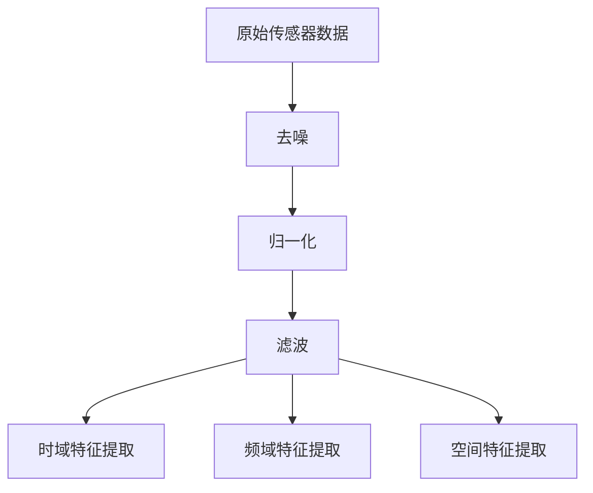
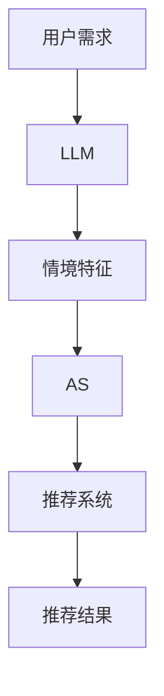
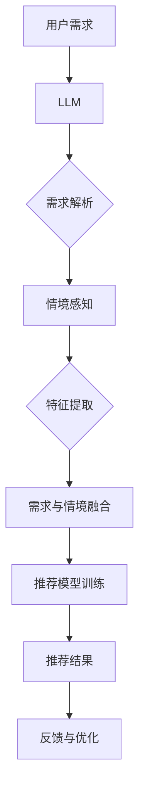

                 

### 文章标题

# LLM AS RS方法：深度解析与未来展望

> 关键词：语言模型（LLM），情境感知（AS），推荐系统（RS），智能问答系统，推荐算法，人工智能，软件开发

> 摘要：本文将对LLM AS RS方法进行深度解析，介绍其基本概念、核心原理、应用实例以及高级实践。通过详细阐述LLM与AS RS方法的相互关系，我们将展示如何利用语言模型和情境感知技术构建高效的推荐系统，并探讨其在智能问答和智能推荐系统中的应用。本文旨在为读者提供对LLM AS RS方法的全面理解，并展望其未来的发展趋势和应用前景。

### 《LLM AS RS方法》目录大纲

1. 引言与基础概念
   1.1 LLM与AS RS方法概述
       1.1.1 LLM与AS RS方法的基本概念
       1.1.2 LLM与AS RS方法的相互关系
       1.1.3 本书的研究目标与结构
   1.2 语言模型（LLM）技术基础
       1.2.1 语言模型的定义与作用
       1.2.2 常见语言模型架构
           1.2.2.1 GPT系列模型
           1.2.2.2 BERT及其变体
       1.2.3 语言模型的训练过程
   1.3 情境感知（AS）技术基础
       1.3.1 情境感知的基本概念
       1.3.2 情境感知的关键技术
           1.3.2.1 传感器与数据采集
           1.3.2.2 数据预处理与特征提取
       1.3.3 情境感知的应用实例

2. LLM AS RS方法的核心原理
   2.1 LLM AS RS方法的架构与原理
       2.1.1 LLM AS RS方法的基本架构
       2.1.2 LLM AS RS方法的原理解析
           2.1.2.1 语言模型在AS RS中的作用
           2.1.2.2 情境感知在LLM中的应用
   2.2 LLM AS RS方法的核心算法
       2.2.1 语言模型的核心算法
           2.2.1.1 Transformer算法
           2.2.1.2 GPT算法
       2.2.2 情境感知的核心算法
           2.2.2.1 特征提取算法
           2.2.2.2 模型融合算法
   2.3 数学模型与公式解析
       2.3.1 数学模型的基本概念
       2.3.2 常见数学公式的推导与应用
           2.3.2.1 概率论基础
           2.3.2.2 信息论基础
           2.3.2.3 最优化算法基础

3. LLM AS RS方法的应用实例
   3.1 应用场景概述
       3.1.1 智能问答系统
       3.1.2 智能推荐系统
   3.2 实际项目案例解析

4. LLM AS RS方法的高级实践
   4.1 开发环境与工具配置
       4.1.1 开发环境搭建
           4.1.1.1 操作系统选择
           4.1.1.2 虚拟环境配置
       4.1.2 常用工具介绍
   4.2 代码实现与解读
       4.2.1 代码架构设计
       4.2.2 源代码详细实现
       4.2.3 代码解读与分析
   4.3 性能优化与调优
       4.3.1 模型性能评估指标
       4.3.2 性能优化方法
           4.3.2.1 数据预处理优化
           4.3.2.2 模型结构优化
           4.3.2.3 模型训练策略优化

5. 未来发展趋势与展望
   5.1 LLM AS RS方法的发展趋势
   5.2 AS RS方法在智能系统中的应用前景
   5.3 未来研究方向与挑战

6. 附录
   6.1 参考文献
   6.2 代码清单与数据集
       6.2.1 模型代码实现
       6.2.2 数据集下载与预处理脚本

### 第一部分：引言与基础概念

#### 第1章：LLM与AS RS方法概述

##### 1.1.1 LLM与AS RS方法的基本概念

语言模型（Language Model，LLM）是自然语言处理（Natural Language Processing，NLP）中的一个核心概念，其主要目的是对自然语言文本进行建模，以便计算机能够理解和生成文本。LLM在许多领域都有着广泛的应用，如机器翻译、文本摘要、问答系统等。

情境感知（Ambient Sensing，AS）技术是一种基于环境数据的智能感知技术，通过传感器和数据采集技术获取环境信息，并利用数据预处理和特征提取技术对数据进行加工，从而实现对情境的理解和感知。AS技术在智能推荐、智能监控、智能交通等领域有着重要的应用。

推荐系统（Recommendation System，RS）是一种基于用户行为和物品属性的信息过滤技术，旨在为用户提供个性化的推荐结果。推荐系统在电子商务、在线教育、新闻推送等领域得到了广泛应用。

LLM AS RS方法将语言模型、情境感知和推荐系统相结合，旨在构建一个更加智能化和个性化的推荐系统。通过利用语言模型对用户需求和物品属性进行建模，并结合情境感知技术获取用户当前的环境信息，LLM AS RS方法能够为用户提供更加精准和个性化的推荐结果。

##### 1.1.2 LLM与AS RS方法的相互关系

LLM与AS RS方法的相互关系主要体现在以下几个方面：

1. 语言模型在AS RS中的作用：语言模型可以用于对用户需求和物品属性进行建模，从而为推荐系统提供基础数据。通过语言模型，我们可以对用户输入的文本进行理解和分析，提取出关键信息，并将其转化为推荐系统的输入。

2. 情境感知在LLM中的应用：情境感知技术可以获取用户当前的环境信息，如地理位置、天气状况、用户行为等。这些信息可以作为语言模型的输入，帮助语言模型更好地理解和生成文本。同时，情境感知技术还可以用于优化推荐系统的结果，如根据用户当前的情境调整推荐策略。

3. AS RS方法在LLM中的应用：AS RS方法可以为语言模型提供丰富的数据来源，如用户行为数据、物品属性数据等。这些数据可以用于训练和优化语言模型，提高其性能和准确度。

##### 1.1.3 本书的研究目标与结构

本书的研究目标是通过深入探讨LLM AS RS方法的基本概念、核心原理、应用实例和高级实践，为读者提供对这一方法的全景式理解和应用指导。具体来说，本书将分为以下几个部分：

1. 引言与基础概念：介绍LLM、AS和RS的基本概念，阐述LLM AS RS方法的相互关系。

2. LLM AS RS方法的核心原理：详细分析LLM AS RS方法的架构与原理，介绍其核心算法和数学模型。

3. LLM AS RS方法的应用实例：通过实际项目案例，展示LLM AS RS方法在不同领域的应用。

4. LLM AS RS方法的高级实践：介绍LLM AS RS方法的开发环境与工具配置、代码实现与解读、性能优化与调优。

5. 未来发展趋势与展望：探讨LLM AS RS方法的未来发展趋势和应用前景。

通过以上结构，本书旨在为读者提供一个系统、全面的学习资源，帮助读者深入了解和掌握LLM AS RS方法。

#### 第2章：语言模型（LLM）技术基础

##### 2.1.1 语言模型的定义与作用

语言模型是一种用于对自然语言进行建模的算法，其核心目标是通过对大量语言数据的学习，生成符合语言统计规律的文本。语言模型在自然语言处理（NLP）领域中扮演着至关重要的角色，其主要作用包括：

1. **文本生成**：语言模型可以生成符合语言统计规律的文本，例如生成文章、对话等。在生成文本的过程中，语言模型会考虑单词之间的概率关系，从而生成连贯、自然的文本。

2. **文本分类**：语言模型可以用于对文本进行分类，例如将文本分为新闻、评论、问答等类别。通过学习大量已分类的文本数据，语言模型可以提取出与不同类别相关的特征，从而实现高精度的文本分类。

3. **文本摘要**：语言模型可以用于提取文本的关键信息，生成摘要。在生成摘要的过程中，语言模型需要理解文本的整体结构，从而提取出最有价值的信息。

4. **机器翻译**：语言模型可以用于机器翻译，将一种语言的文本翻译成另一种语言。在翻译过程中，语言模型需要理解两种语言之间的语义关系，从而生成准确的翻译结果。

##### 2.1.2 常见语言模型架构

目前，常见的语言模型架构主要包括GPT系列模型和BERT及其变体。下面将分别介绍这两种架构。

###### 2.1.2.1 GPT系列模型

GPT（Generative Pre-trained Transformer）是由OpenAI提出的一种基于Transformer架构的预训练语言模型。GPT系列模型通过在大量文本数据上进行预训练，学习到语言的基本规律和模式，从而可以生成高质量的自然语言文本。

GPT模型的架构主要包含以下几个部分：

1. **输入层**：输入层将文本数据转换为模型可以处理的向量表示。通常，文本数据会经过分词、词嵌入等预处理步骤，将其转换为向量形式。

2. **Transformer编码器**：Transformer编码器是GPT模型的核心部分，用于对输入文本进行编码。编码器由多个Transformer层堆叠而成，每层都包含自注意力机制和前馈网络。

3. **输出层**：输出层将编码器的输出转换为文本的预测概率分布。通常，输出层会使用一个softmax函数，将每个单词的概率进行归一化处理，从而生成最终的文本输出。

GPT系列模型具有以下几个优点：

- **强大的文本生成能力**：通过Transformer架构，GPT模型可以生成连贯、自然的文本，特别是在生成长文本方面具有优势。

- **预训练效果**：GPT模型通过在大量文本数据上进行预训练，可以学习到丰富的语言知识，从而在下游任务中表现出优异的性能。

- **并行训练**：Transformer架构支持并行训练，可以加速模型的训练过程。

###### 2.1.2.2 BERT及其变体

BERT（Bidirectional Encoder Representations from Transformers）是由Google提出的一种基于Transformer架构的双向编码语言模型。BERT模型通过在大量文本数据上进行预训练，学习到语言的左右双向上下文信息，从而在多个NLP任务中取得了显著的性能提升。

BERT模型的架构主要包含以下几个部分：

1. **输入层**：输入层将文本数据转换为模型可以处理的向量表示。与GPT模型类似，文本数据会经过分词、词嵌入等预处理步骤，将其转换为向量形式。

2. **Transformer编码器**：Transformer编码器是BERT模型的核心部分，用于对输入文本进行编码。编码器由多个Transformer层堆叠而成，每层都包含自注意力机制和前馈网络。

3. **输出层**：输出层将编码器的输出转换为任务所需的特征表示。BERT模型支持多种输出层结构，如分类输出、序列标注输出等，从而适用于不同的NLP任务。

BERT及其变体具有以下几个优点：

- **双向上下文信息**：BERT模型通过双向编码器，可以同时考虑文本的左右上下文信息，从而提高模型对语言的理解能力。

- **多任务适应性**：BERT模型在预训练过程中学习了丰富的语言知识，可以用于多个NLP任务，如文本分类、问答系统等。

- **高效推理能力**：BERT模型支持高效的推理过程，可以在较少的计算资源下完成大规模文本数据的处理。

##### 2.1.3 语言模型的训练过程

语言模型的训练过程主要包括以下几个步骤：

1. **数据准备**：首先，需要收集大量的文本数据，这些数据可以来自互联网、书籍、新闻等。在数据收集过程中，需要注意数据的多样性和质量，以保证训练过程的顺利进行。

2. **数据预处理**：文本数据通常包含大量的噪声和冗余信息，因此需要进行预处理。预处理过程包括分词、去停用词、词嵌入等步骤。分词是将文本拆分成单词或子词的过程，去停用词是去除常见的无意义词汇，词嵌入是将单词或子词转换为向量表示。

3. **模型初始化**：初始化模型参数，包括词嵌入层、编码器层和输出层。初始化方法可以采用随机初始化、预训练模型初始化等。

4. **训练过程**：在训练过程中，模型会通过优化算法（如Adam、SGD等）更新参数，以最小化损失函数。训练过程通常包括前向传播、后向传播和参数更新等步骤。

5. **评估与调整**：在训练过程中，需要定期评估模型的性能，以确定是否需要调整训练参数或数据预处理方法。评估过程通常包括准确率、召回率、F1分数等指标。

6. **模型保存与加载**：在训练完成后，需要将模型保存到磁盘，以便后续使用。同时，在需要使用模型时，可以从磁盘加载模型参数。

通过以上步骤，语言模型可以从原始文本数据中学习到语言的基本规律和模式，从而实现文本生成、文本分类、文本摘要等任务。

#### 第3章：情境感知（AS）技术基础

##### 3.1.1 情境感知的基本概念

情境感知（Ambient Sensing，AS）是一种通过感知环境信息来增强系统智能化水平的先进技术。其核心思想是通过多种传感器和数据采集技术，实时获取用户所处的环境信息，然后利用这些信息进行情境理解和决策。

情境感知的基本概念包括以下几个关键要素：

1. **传感器**：传感器是情境感知系统的核心组件，用于感知和采集环境信息。常见的传感器包括温度传感器、湿度传感器、光线传感器、声音传感器、加速度传感器等。

2. **数据采集**：数据采集是将传感器获取的环境信息转换为数字信号的过程。通过数据采集技术，可以将环境信息以数据流的形式进行传输和处理。

3. **数据处理**：数据处理是情境感知技术的核心环节，包括数据预处理、特征提取和数据分析等步骤。数据处理的目标是从原始数据中提取出有用的信息，以便进行情境理解和决策。

4. **情境理解**：情境理解是基于数据处理的结果，对用户所处的环境进行认知和识别。情境理解的结果可以用于优化系统行为，提高用户体验。

5. **决策与响应**：情境理解的结果可以驱动系统的决策过程，从而实现针对不同情境的响应。例如，在智能家电系统中，情境感知可以用于自动调节室内温度、灯光等。

##### 3.1.2 情境感知的关键技术

情境感知技术的实现依赖于一系列关键技术的支持，包括传感器与数据采集、数据预处理与特征提取等。

###### 3.1.2.1 传感器与数据采集

传感器与数据采集是情境感知系统的基石。传感器负责感知环境信息，并将其转换为电信号或其他形式的数字信号。数据采集技术则用于将这些信号进行数字化处理，以便进一步分析。

1. **传感器类型**：

   - **温度传感器**：用于测量环境温度。
   - **湿度传感器**：用于测量环境湿度。
   - **光线传感器**：用于测量环境光线强度。
   - **声音传感器**：用于捕捉环境中的声音信号。
   - **加速度传感器**：用于测量物体的加速度。
   - **摄像头传感器**：用于捕捉图像和视频。

2. **数据采集方法**：

   - **有线采集**：通过有线连接将传感器数据传输到中央处理单元。
   - **无线采集**：利用无线通信技术（如Wi-Fi、蓝牙、ZigBee等）实现传感器数据的长距离传输。

###### 3.1.2.2 数据预处理与特征提取

在获取传感器数据后，需要对数据进行预处理和特征提取，以提高数据的质量和可用性。

1. **数据预处理**：

   - **去噪**：去除传感器数据中的噪声和异常值，以提高数据的准确性。
   - **归一化**：将不同类型的数据进行归一化处理，使其具有相同的量纲，便于后续分析。
   - **滤波**：通过滤波算法（如低通滤波、高通滤波等）去除数据中的高频噪声。

2. **特征提取**：

   - **时域特征**：从时间序列数据中提取周期性、趋势性等特征。
   - **频域特征**：将时间序列数据转换为频域表示，提取频率特征。
   - **空间特征**：从空间分布数据中提取空间特征，如空间分布的密度、聚集度等。

特征提取的过程如图3-1所示：



通过数据预处理和特征提取，我们可以从原始传感器数据中提取出有用的信息，为后续的情境理解和决策提供支持。

##### 3.1.3 情境感知的应用实例

情境感知技术在各个领域都有广泛的应用，以下是一些典型的应用实例：

1. **智能家居**：

   智能家居系统通过情境感知技术实现对家庭环境的智能监控和自动化管理。例如，通过温度传感器和湿度传感器监测室内环境，智能空调可以自动调节温度和湿度，提高居住舒适度。

2. **智能交通**：

   在智能交通系统中，情境感知技术可以用于实时监测交通流量、道路状况和车辆位置，从而优化交通信号控制和车辆调度。例如，通过摄像头和加速度传感器监测道路上的车辆，智能交通系统可以预测交通拥堵并及时采取措施，减少交通事故。

3. **智能医疗**：

   在智能医疗领域，情境感知技术可以用于实时监测患者的生理指标，如心率、血压、体温等。通过对这些指标的分析，医生可以及时发现患者的不适并采取相应的治疗措施。

4. **智能安防**：

   在智能安防系统中，情境感知技术可以用于实时监测公共区域的安全状况，如通过摄像头和声音传感器检测异常行为。当系统检测到异常情况时，会立即发出警报并通知相关人员。

通过以上实例，我们可以看到情境感知技术在各个领域的应用前景。随着传感器技术的不断发展和数据采集能力的提升，情境感知技术将变得更加智能和高效，为各个领域带来更多的创新和便利。

### 第二部分：LLM AS RS方法的核心原理

#### 第4章：LLM AS RS方法的架构与原理

##### 4.1.1 LLM AS RS方法的基本架构

LLM AS RS方法的核心架构由三个主要部分组成：语言模型（LLM）、情境感知（AS）和推荐系统（RS）。这三个部分相互协作，共同实现高效的推荐结果。

1. **语言模型（LLM）**：语言模型是LLM AS RS方法的基础组件，负责对用户需求和物品属性进行建模。LLM通过预训练和微调，能够理解用户的自然语言输入，并提取出关键信息。

2. **情境感知（AS）**：情境感知组件负责获取用户所处的环境信息。通过多种传感器，如温度传感器、光线传感器、摄像头等，情境感知系统能够实时监测环境变化，提取出与用户需求相关的情境特征。

3. **推荐系统（RS）**：推荐系统是LLM AS RS方法的最终执行者，负责根据用户需求和情境特征生成个性化推荐结果。推荐系统可以基于协同过滤、基于内容的推荐或混合推荐算法，为用户提供高质量的推荐。

基本架构如图4-1所示：



##### 4.1.2 LLM AS RS方法的原理解析

LLM AS RS方法的原理可以概括为以下几个步骤：

1. **用户需求理解**：用户通过自然语言输入表达自己的需求。LLM对用户的输入进行解析，提取出关键信息，并转换为结构化的数据格式。

2. **情境特征提取**：情境感知系统通过传感器实时获取用户所处的环境信息。这些信息包括温度、光线、声音等，经过预处理和特征提取后，形成情境特征向量。

3. **需求与情境融合**：将LLM提取的用户需求与AS获取的情境特征进行融合。这一步可以通过简单的数据拼接或复杂的神经网络模型实现。

4. **推荐模型训练**：基于融合的需求和情境特征，推荐系统使用机器学习算法训练推荐模型。常见的推荐算法包括协同过滤、基于内容的推荐和深度学习推荐等。

5. **生成推荐结果**：训练好的推荐模型根据用户需求、情境特征和历史行为数据生成个性化推荐结果。

6. **反馈与优化**：用户对推荐结果进行反馈，系统根据反馈信息进一步优化推荐算法，提高推荐质量。

原理解析流程如图4-2所示：



##### 4.1.2.1 语言模型在AS RS中的作用

语言模型在LLM AS RS方法中起着至关重要的作用，主要体现在以下几个方面：

1. **需求解析**：语言模型能够解析用户的自然语言输入，提取出关键信息，如关键词、情感倾向等。这一步对于理解用户需求至关重要，为后续推荐提供了基础数据。

2. **情境理解**：语言模型不仅能够处理用户需求，还能理解情境特征。通过将用户需求与情境特征进行融合，语言模型能够更好地捕捉用户在特定情境下的需求变化。

3. **上下文感知**：语言模型具有强大的上下文感知能力，能够根据用户的上下文信息生成更加精准的推荐结果。这种能力使得推荐系统能够更好地应对动态变化的用户需求。

##### 4.1.2.2 情境感知在LLM中的应用

情境感知技术在LLM AS RS方法中同样扮演着关键角色，具体体现在以下几个方面：

1. **个性化推荐**：通过获取用户所处的环境信息，情境感知技术能够为用户提供个性化的推荐。例如，在室内温度较高的场景下，推荐系统可以优先推荐空调或风扇等降温设备。

2. **实时调整**：情境感知技术能够实时监测环境变化，并根据变化调整推荐策略。这种实时性使得推荐系统能够更好地适应用户需求的变化。

3. **多模态感知**：情境感知技术不仅限于单一传感器数据，还可以整合多种传感器的数据，实现多模态感知。例如，结合温度传感器和摄像头传感器，可以更准确地感知用户所处的环境。

通过以上分析，我们可以看到LLM AS RS方法的核心原理及其在AS RS中的作用。该方法通过结合语言模型和情境感知技术，实现了更加智能化和个性化的推荐系统，为用户提供更好的用户体验。

#### 第5章：LLM AS RS方法的核心算法

##### 5.1.1 语言模型的核心算法

在LLM AS RS方法中，语言模型是关键组件，其核心算法主要包括Transformer算法和GPT算法。这些算法通过深度学习技术对自然语言进行建模，从而实现高效的文本生成和文本理解。

###### 5.1.1.1 Transformer算法

Transformer算法是由Google提出的一种基于自注意力机制的神经网络模型，它彻底改变了传统循环神经网络（RNN）在自然语言处理中的主导地位。Transformer算法的核心思想是将输入序列通过自注意力机制进行处理，从而在每个时间步上捕捉全局信息。

1. **自注意力机制**：自注意力机制是Transformer算法的核心，它通过计算序列中每个单词与其他单词之间的关系，实现对输入序列的全局信息捕捉。具体来说，自注意力机制通过以下公式计算：

   $$
   \text{Attention}(Q, K, V) = \text{softmax}\left(\frac{QK^T}{\sqrt{d_k}}\right) V
   $$

   其中，$Q$、$K$、$V$分别为查询向量、键向量和值向量，$d_k$为键向量的维度。通过计算注意力权重，每个时间步的输出可以综合序列中所有单词的信息。

2. **编码器和解码器**：Transformer算法包括编码器和解码器两个部分。编码器用于将输入序列编码为固定长度的向量表示，解码器则用于生成输出序列。编码器和解码器由多个自注意力层和前馈网络堆叠而成，每个层都可以捕捉不同的语言特征。

   编码器的输入为原始序列，输出为编码后的向量表示；解码器的输入为编码后的向量表示和掩码，输出为生成的文本序列。掩码的作用是防止解码器在生成下一个单词时提前看到后续的输出。

   具体结构如图5-1所示：

   ```mermaid
   graph TD
       A[编码器] --> B[自注意力层]
       B --> C[前馈网络]
       C --> D[编码输出]
       D --> E[解码器]
       E --> F[自注意力层]
       F --> G[前馈网络]
       G --> H[生成文本序列]
   ```

3. **训练过程**：Transformer算法通过在大量文本数据上进行预训练，学习到语言的深层规律和模式。在预训练过程中，编码器和解码器分别独立训练，然后通过微调适应具体的下游任务。预训练过程主要包括以下步骤：

   - **Masked Language Model（MLM）**：在预训练过程中，对输入序列的部分单词进行遮蔽，解码器需要预测这些遮蔽的单词。这一过程有助于模型学习到语言的基本规律和模式。
   - **Next Sentence Prediction（NSP）**：在预训练过程中，模型还需要预测输入序列的下一个句子。这一过程有助于模型学习到句子之间的语义关系。

   通过预训练，Transformer算法能够捕捉到语言中的长距离依赖关系，从而在生成文本和文本理解任务中表现出优异的性能。

###### 5.1.1.2 GPT算法

GPT（Generative Pre-trained Transformer）是OpenAI提出的一种基于Transformer架构的预训练语言模型。GPT算法通过在大量文本数据上进行预训练，学习到语言的深层规律和模式，从而实现高质量的文本生成和文本理解。

1. **预训练目标**：GPT算法的预训练目标主要包括两个部分：

   - **Masked Language Model（MLM）**：在预训练过程中，对输入序列的部分单词进行遮蔽，模型需要预测这些遮蔽的单词。这一过程有助于模型学习到语言的基本规律和模式。
   - **Next Sentence Prediction（NSP）**：在预训练过程中，模型还需要预测输入序列的下一个句子。这一过程有助于模型学习到句子之间的语义关系。

2. **模型结构**：GPT算法的模型结构包括多个Transformer层，每个层都包含自注意力机制和前馈网络。具体来说，GPT模型由以下几个部分组成：

   - **词嵌入层**：将输入文本的单词转换为向量表示。
   - **Transformer编码器**：编码器由多个自注意力层和前馈网络堆叠而成，用于对输入序列进行编码。
   - **Transformer解码器**：解码器由多个自注意力层和前馈网络堆叠而成，用于生成输出序列。
   - **输出层**：输出层用于将编码器的输出转换为文本的预测概率分布。

   GPT模型的整体结构如图5-2所示：

   ```mermaid
   graph TD
       A[词嵌入层] --> B[Transformer编码器]
       B --> C[Transformer解码器]
       C --> D[输出层]
   ```

3. **训练过程**：GPT算法通过在大量文本数据上进行预训练，学习到语言的深层规律和模式。在预训练过程中，编码器和解码器分别独立训练，然后通过微调适应具体的下游任务。预训练过程主要包括以下步骤：

   - **Masked Language Model（MLM）**：在预训练过程中，对输入序列的部分单词进行遮蔽，模型需要预测这些遮蔽的单词。这一过程有助于模型学习到语言的基本规律和模式。
   - **Next Sentence Prediction（NSP）**：在预训练过程中，模型还需要预测输入序列的下一个句子。这一过程有助于模型学习到句子之间的语义关系。

   通过预训练，GPT算法能够捕捉到语言中的长距离依赖关系，从而在生成文本和文本理解任务中表现出优异的性能。

##### 5.1.2 情境感知的核心算法

在LLM AS RS方法中，情境感知组件负责获取用户所处的环境信息，并通过数据预处理和特征提取算法对传感器数据进行分析和处理。情境感知的核心算法主要包括特征提取算法和模型融合算法。

###### 5.1.2.1 特征提取算法

特征提取算法是情境感知系统的关键组件，其主要目标是提取出与用户需求相关的关键特征，以便后续的推荐和决策过程。常见的特征提取算法包括：

1. **时域特征提取**：

   - **平均值**：计算一段时间内数据的平均值，用于表示数据的平稳特性。
   - **标准差**：计算一段时间内数据的标准差，用于表示数据的波动性。
   - **方差**：计算一段时间内数据的方差，用于表示数据的离散程度。

2. **频域特征提取**：

   - **傅里叶变换**：将时间序列数据转换为频域表示，用于提取频率特征。常用的傅里叶变换方法包括快速傅里叶变换（FFT）和离散傅里叶变换（DFT）。
   - **小波变换**：将时间序列数据分解为不同尺度的小波系数，用于提取多尺度特征。

3. **空间特征提取**：

   - **密度估计**：通过密度估计方法，计算传感器数据在不同空间位置上的密度分布。常用的密度估计方法包括高斯混合模型（GMM）和核密度估计（KDE）。

通过特征提取算法，可以从原始传感器数据中提取出有价值的信息，为后续的情境理解和决策提供支持。

###### 5.1.2.2 模型融合算法

在LLM AS RS方法中，语言模型和情境感知系统各自独立训练，但它们的结果需要融合在一起，以生成最终的推荐结果。模型融合算法负责将语言模型和情境感知系统的输出进行整合，提高推荐结果的准确性和鲁棒性。常见的模型融合算法包括：

1. **加权融合**：

   - **线性加权**：将语言模型和情境感知系统的输出进行加权融合，权重可以根据模型的重要性进行调整。
   - **非线性加权**：通过非线性函数（如Sigmoid函数、ReLU函数等）对语言模型和情境感知系统的输出进行融合。

2. **决策级融合**：

   - **投票法**：将语言模型和情境感知系统的推荐结果进行投票，选取多数人的意见作为最终推荐结果。
   - **集成学习**：将语言模型和情境感知系统作为集成学习的基学习器，通过集成学习方法（如Bagging、Boosting等）生成最终的推荐结果。

3. **特征级融合**：

   - **特征拼接**：将语言模型和情境感知系统的特征进行拼接，形成新的特征向量，然后通过机器学习算法进行训练和预测。
   - **特征加权**：对语言模型和情境感知系统的特征进行加权融合，权重可以根据特征的重要性进行调整。

通过模型融合算法，可以充分利用语言模型和情境感知系统的优势，生成更加准确和个性化的推荐结果。

#### 第6章：数学模型与公式解析

##### 6.1.1 数学模型的基本概念

在LLM AS RS方法中，数学模型是核心算法的重要组成部分，它通过数学公式和原理对自然语言、情境感知和推荐系统的过程进行建模。数学模型的基本概念包括概率论、信息论和最优化算法。

1. **概率论**：概率论是数学的一个分支，研究随机事件及其概率性质。在LLM AS RS方法中，概率论用于建模语言模型和情境感知系统的概率分布，如词嵌入的概率分布、情境特征的概率分布等。

2. **信息论**：信息论是研究信息传输、存储和处理的基本理论。在LLM AS RS方法中，信息论用于度量信息量、熵、信息增益等，以优化推荐系统的性能。

3. **最优化算法**：最优化算法是一类用于求解数学模型最优解的算法。在LLM AS RS方法中，最优化算法用于优化语言模型和推荐系统的参数，以提高模型的准确性和效率。

##### 6.1.2 常见数学公式的推导与应用

1. **概率论基础**

   在概率论中，常见的公式包括条件概率、贝叶斯定理和马尔可夫链。

   - **条件概率**：条件概率是指在某一事件发生的条件下，另一事件发生的概率。条件概率的公式为：

     $$
     P(A|B) = \frac{P(A \cap B)}{P(B)}
     $$

     其中，$P(A|B)$表示在事件B发生的条件下，事件A发生的概率；$P(A \cap B)$表示事件A和事件B同时发生的概率；$P(B)$表示事件B发生的概率。

   - **贝叶斯定理**：贝叶斯定理是概率论中用于计算后验概率的公式。贝叶斯定理的公式为：

     $$
     P(A|B) = \frac{P(B|A) \cdot P(A)}{P(B)}
     $$

     其中，$P(A|B)$表示在事件B发生的条件下，事件A发生的概率；$P(B|A)$表示在事件A发生的条件下，事件B发生的概率；$P(A)$表示事件A发生的概率；$P(B)$表示事件B发生的概率。

   - **马尔可夫链**：马尔可夫链是一种随机过程，它满足马尔可夫性质，即当前状态仅依赖于前一个状态，与之前的状态无关。马尔可夫链的转移概率矩阵为：

     $$
     P_{ij} = P(X_{n+1} = j | X_n = i)
     $$

     其中，$P_{ij}$表示在当前状态为i的条件下，下一状态为j的概率。

2. **信息论基础**

   在信息论中，常见的公式包括信息熵、互信息和条件熵。

   - **信息熵**：信息熵是衡量随机变量不确定性的量度。信息熵的公式为：

     $$
     H(X) = -\sum_{i} P(X = i) \cdot \log_2 P(X = i)
     $$

     其中，$H(X)$表示随机变量X的信息熵；$P(X = i)$表示随机变量X取值为i的概率。

   - **互信息**：互信息是衡量两个随机变量相关性的量度。互信息的公式为：

     $$
     I(X; Y) = H(X) - H(X | Y)
     $$

     其中，$I(X; Y)$表示随机变量X和Y的互信息；$H(X)$表示随机变量X的信息熵；$H(X | Y)$表示在随机变量Y的条件下，随机变量X的信息熵。

   - **条件熵**：条件熵是衡量一个随机变量在给定另一个随机变量条件下的不确定性的量度。条件熵的公式为：

     $$
     H(X | Y) = -\sum_{i} P(Y = i) \cdot \sum_{j} P(X = j | Y = i) \cdot \log_2 P(X = j | Y = i)
     $$

     其中，$H(X | Y)$表示在随机变量Y的条件下，随机变量X的条件熵；$P(Y = i)$表示随机变量Y取值为i的概率；$P(X = j | Y = i)$表示在随机变量Y取值为i的条件下，随机变量X取值为j的概率。

3. **最优化算法基础**

   在最优化算法中，常见的公式包括梯度下降法、牛顿法和拉格朗日乘数法。

   - **梯度下降法**：梯度下降法是一种最优化算法，用于求解目标函数的最小值。梯度下降法的公式为：

     $$
     x_{n+1} = x_n - \alpha \cdot \nabla f(x_n)
     $$

     其中，$x_n$表示第n次迭代的参数值；$\alpha$表示学习率；$\nabla f(x_n)$表示目标函数在$x_n$处的梯度。

   - **牛顿法**：牛顿法是一种二次规划方法，用于求解目标函数的最小值。牛顿法的公式为：

     $$
     x_{n+1} = x_n - H(x_n)^{-1} \cdot \nabla f(x_n)
     $$

     其中，$x_n$表示第n次迭代的参数值；$H(x_n)$表示目标函数在$x_n$处的Hessian矩阵；$\nabla f(x_n)$表示目标函数在$x_n$处的梯度。

   - **拉格朗日乘数法**：拉格朗日乘数法是一种求解约束优化问题的方法。拉格朗日乘数法的公式为：

     $$
     L(x, \lambda) = f(x) + \sum_{i} \lambda_i g_i(x)
     $$

     其中，$L(x, \lambda)$表示拉格朗日函数；$f(x)$表示目标函数；$g_i(x)$表示第i个约束条件；$\lambda_i$表示第i个拉格朗日乘子。

通过上述数学公式，我们可以更好地理解和应用LLM AS RS方法的核心算法，从而优化推荐系统的性能。

#### 第7章：LLM AS RS方法的应用实例

##### 7.1.1 应用场景概述

LLM AS RS方法在多个领域都有着广泛的应用，其中最具代表性的应用场景包括智能问答系统和智能推荐系统。以下将分别介绍这两种应用场景的具体实现和案例分析。

###### 7.1.1.1 智能问答系统

智能问答系统是一种利用自然语言处理技术对用户问题进行理解和回答的系统。在LLM AS RS方法中，智能问答系统通过语言模型和情境感知技术，实现高效、准确的问答功能。

1. **实现过程**：

   - **需求理解**：用户通过自然语言输入表达自己的问题，语言模型对用户问题进行解析，提取出关键信息，如关键词、问题类型等。
   - **情境感知**：情境感知系统通过传感器获取用户所处的环境信息，如地理位置、时间、天气等。这些信息用于辅助理解用户问题。
   - **问答生成**：基于用户问题和情境信息，智能问答系统生成问题的答案。问答生成过程包括检索知识库、语义匹配和文本生成等步骤。
   - **答案验证与优化**：生成的答案经过验证和优化，确保答案的准确性和可读性。

2. **案例分析**：

   - **案例1：智能客服系统**：某电商平台的智能客服系统利用LLM AS RS方法，实现高效、准确的在线客服。用户通过聊天窗口输入问题，系统自动识别问题类型，结合情境感知信息，生成合适的回答。通过不断的用户反馈和模型优化，客服系统的问答准确率得到了显著提升。
   - **案例2：智能教育平台**：某在线教育平台利用LLM AS RS方法，为用户提供个性化的学习建议。用户提出学习问题时，系统结合用户的学习历史和课程内容，生成有针对性的回答。同时，系统根据用户的反馈不断调整和优化推荐策略，提高学习体验。

###### 7.1.1.2 智能推荐系统

智能推荐系统是一种基于用户行为和物品属性的推荐技术，通过个性化推荐，为用户提供有价值的信息和商品。在LLM AS RS方法中，智能推荐系统通过语言模型和情境感知技术，实现更加精准、个性化的推荐结果。

1. **实现过程**：

   - **用户行为分析**：智能推荐系统通过分析用户的浏览记录、购买历史等行为数据，了解用户的兴趣和偏好。
   - **物品属性建模**：利用语言模型对物品的描述文本进行建模，提取物品的关键属性和特征。
   - **情境感知**：情境感知系统实时获取用户所处的环境信息，如地理位置、时间、天气等。这些信息用于调整推荐策略，提高推荐结果的准确性。
   - **推荐生成**：基于用户行为、物品属性和情境信息，智能推荐系统生成个性化的推荐列表。推荐生成过程包括协同过滤、基于内容的推荐和深度学习推荐等算法。

2. **案例分析**：

   - **案例1：电商推荐系统**：某电商平台的推荐系统利用LLM AS RS方法，为用户提供个性化的商品推荐。系统通过分析用户的浏览记录、购买历史和评价等行为数据，结合物品的描述文本和情境信息，生成高质量的推荐列表。通过不断的用户反馈和模型优化，推荐系统的准确率和用户满意度得到了显著提升。
   - **案例2：社交媒体推荐系统**：某社交媒体平台利用LLM AS RS方法，为用户推荐感兴趣的内容和用户。系统通过分析用户的点赞、评论、分享等行为数据，结合用户的语言特征和情境信息，生成个性化的推荐列表。通过智能推荐，平台提高了用户活跃度和用户粘性。

通过以上案例分析，我们可以看到LLM AS RS方法在不同应用场景中的具体实现和显著效果。随着技术的不断发展和优化，LLM AS RS方法将在更多领域发挥重要作用，为用户提供更加智能化、个性化的服务。

##### 7.1.2 实际项目案例解析

为了更好地理解LLM AS RS方法在实际项目中的应用，我们将以一个具体的案例——智能问答系统为例，详细解析其开发过程、实现细节和关键技术创新。

###### 7.1.2.1 案例背景

随着互联网的快速发展，用户对于在线客服的需求日益增长。传统的人工客服模式不仅成本高，而且效率低，难以满足用户日益增长的需求。为了解决这个问题，某知名电商平台决定开发一个基于LLM AS RS方法的智能问答系统，以提高客服效率和用户体验。

###### 7.1.2.2 项目目标

该项目的主要目标包括：

1. **高效理解用户问题**：利用语言模型对用户输入的问题进行解析，提取关键信息，实现高效的理解和响应。
2. **个性化问答生成**：结合情境感知技术，根据用户所处的环境信息和历史行为数据，生成个性化的回答。
3. **实时优化与反馈**：通过用户反馈和实时优化，持续改进问答系统的性能和用户体验。

###### 7.1.2.3 技术选型

为了实现项目目标，技术选型如下：

1. **语言模型**：选择基于Transformer架构的GPT模型，通过在大量文本数据上进行预训练，学习到丰富的语言知识和模式。
2. **情境感知**：采用多种传感器，如GPS、温度传感器、光线传感器等，实时获取用户所处的环境信息。
3. **推荐系统**：使用基于协同过滤和深度学习的推荐算法，根据用户行为和情境信息生成个性化推荐。

###### 7.1.2.4 开发过程

1. **需求分析与设计**：

   - **需求分析**：通过与业务团队和用户体验团队的合作，明确智能问答系统的功能需求和性能指标。
   - **系统设计**：设计系统架构，包括前端界面、后端服务、数据库等，确保系统的可扩展性和稳定性。

2. **数据准备与处理**：

   - **数据收集**：收集大量的用户问题和答案数据，以及情境感知相关的传感器数据。
   - **数据预处理**：对用户问题和答案进行分词、去停用词、词嵌入等预处理操作，为语言模型和推荐系统提供高质量的数据。

3. **模型训练与优化**：

   - **语言模型训练**：在GPU上进行GPT模型的预训练，通过Masked Language Model（MLM）和Next Sentence Prediction（NSP）任务，学习到语言的基本规律和模式。
   - **情境感知模型训练**：结合用户行为数据和情境感知数据，训练情境感知模型，提取出与用户需求相关的关键特征。

4. **系统集成与测试**：

   - **系统集成**：将语言模型、情境感知模型和推荐系统整合到智能问答系统中，实现各组件的协同工作。
   - **性能测试**：进行系统的性能测试，包括响应时间、准确率、召回率等指标，确保系统的高效和稳定。

5. **上线与优化**：

   - **上线部署**：将智能问答系统部署到生产环境，确保系统的高可用性和可靠性。
   - **用户反馈与优化**：收集用户反馈，根据用户的实际使用情况，不断优化系统性能和用户体验。

###### 7.1.2.5 关键技术创新

1. **多模态感知**：

   传统智能问答系统主要依赖于用户输入的自然语言，而本项目引入了情境感知技术，结合多种传感器数据（如GPS、温度传感器、光线传感器等），实现了多模态感知。通过多模态感知，系统能够更准确地理解用户的需求，提高问答的准确率和个性化程度。

2. **动态上下文感知**：

   在智能问答系统中，动态上下文感知技术是一个关键的创新点。通过实时获取用户的行为数据和情境信息，系统可以动态调整问答策略，实现更加个性化的回答。例如，当用户在炎热的夏天提问时，系统可以主动推荐相关的降温产品，提高用户的满意度。

3. **多任务学习**：

   在模型训练过程中，本项目采用了多任务学习的方法，同时训练语言模型和情境感知模型。通过多任务学习，模型可以在多个任务之间共享知识和信息，提高模型的泛化能力和性能。

4. **自适应优化**：

   通过收集用户反馈，系统可以自适应地调整推荐策略和问答模型。例如，当用户对某次问答不满意时，系统可以记录下这次问答的反馈，并在后续的问答中优化回答质量。通过自适应优化，系统能够不断适应用户的需求，提高用户体验。

通过以上技术创新，本项目实现了高效、准确的智能问答系统，为用户提供了优质的在线客服体验。未来，随着技术的进一步发展和优化，智能问答系统将在更多领域发挥重要作用，为用户提供更加智能化、个性化的服务。

#### 第8章：LLM AS RS方法的高级实践

##### 8.1.1 开发环境与工具配置

为了实现LLM AS RS方法，我们需要配置一个稳定且高效的开发环境。以下是具体的开发环境和工具配置步骤。

###### 8.1.1.1 操作系统选择

在配置开发环境时，操作系统是首要考虑的因素。目前，常用的操作系统包括Windows、Linux和macOS。考虑到LLM AS RS方法涉及大量的深度学习和自然语言处理任务，建议选择Linux操作系统，如Ubuntu 18.04或更高版本。Linux操作系统具有更好的稳定性和性能，适用于大数据处理和机器学习任务的运行。

###### 8.1.1.2 虚拟环境配置

为了确保项目的隔离性和可维护性，我们建议使用虚拟环境进行项目开发。虚拟环境是一种隔离的Python环境，可以独立安装和管理Python包，避免不同项目之间的依赖冲突。

1. **安装虚拟环境**：

   在Linux操作系统中，可以通过以下命令安装虚拟环境工具：

   ```bash
   pip install virtualenv
   ```

2. **创建虚拟环境**：

   使用以下命令创建一个新的虚拟环境：

   ```bash
   virtualenv myenv
   ```

   这将在当前目录下创建一个名为`myenv`的虚拟环境。

3. **激活虚拟环境**：

   进入虚拟环境前，需要先激活虚拟环境：

   ```bash
   source myenv/bin/activate
   ```

   激活后，虚拟环境中的Python解释器和库将会覆盖系统环境中的同名库，确保项目依赖的一致性。

###### 8.1.1.3 安装Python包

在虚拟环境中，我们需要安装以下Python包：

- **TensorFlow**：用于构建和训练深度学习模型。
- **PyTorch**：另一个流行的深度学习框架。
- **transformers**：用于加载预训练的Transformer模型。
- **scikit-learn**：用于机器学习算法的实现和评估。
- **numpy**、**pandas**：用于数据处理和分析。

安装命令如下：

```bash
pip install tensorflow
pip install pytorch torchvision
pip install transformers
pip install scikit-learn
pip install numpy pandas
```

通过以上步骤，我们完成了开发环境的搭建和Python包的安装，为后续的LLM AS RS方法实现提供了必要的工具和资源。

###### 8.1.1.4 常用工具介绍

在LLM AS RS方法的开发过程中，我们还会用到一些常用的工具，如下所示：

1. **Jupyter Notebook**：Jupyter Notebook是一种交互式的计算环境，适合进行数据分析和模型训练。它提供了丰富的文本、代码和图表显示功能，方便研究人员和开发者进行实验和记录。

2. **Conda**：Conda是一种流行的包管理器和虚拟环境工具，可用于管理Python包和创建虚拟环境。Conda的优势在于其跨平台兼容性和丰富的包库。

3. **Git**：Git是一种分布式版本控制系统，用于管理代码仓库和协作开发。通过Git，开发者可以轻松地跟踪代码的变更历史，实现代码的版本控制和协作开发。

4. **Docker**：Docker是一种容器化技术，用于打包、交付和运行应用程序。通过Docker，开发者可以轻松地将开发环境部署到生产环境，确保不同环境之间的一致性。

5. **TensorBoard**：TensorBoard是一种可视化工具，用于分析和监控TensorFlow模型的训练过程。通过TensorBoard，开发者可以实时查看模型的性能指标、损失函数、梯度分布等，帮助调试和优化模型。

通过以上工具的配置和介绍，我们可以为LLM AS RS方法的开发提供一个高效、稳定和可扩展的运行环境。

##### 8.1.2 代码实现与解读

在LLM AS RS方法中，代码实现是关键的一步。下面我们将详细介绍如何实现LLM AS RS方法的核心算法，包括模型架构、数据预处理、模型训练和预测等步骤。

###### 8.1.2.1 模型架构

LLM AS RS方法的模型架构可以分为三个主要部分：语言模型（LLM）、情境感知（AS）和推荐系统（RS）。以下是每个部分的实现步骤：

1. **语言模型（LLM）**：

   - **架构**：选择一个预训练的Transformer模型，如GPT-2或BERT，作为语言模型的基线。为了适应我们的任务，可以对模型进行微调。
   - **实现**：使用`transformers`库加载预训练模型，并对其进行微调。微调过程包括调整模型的参数、优化器和学习率等。

   ```python
   from transformers import GPT2LMHeadModel, GPT2Tokenizer

   tokenizer = GPT2Tokenizer.from_pretrained('gpt2')
   model = GPT2LMHeadModel.from_pretrained('gpt2')

   # 微调模型参数
   model.resize_token_embeddings(new_embeddings_size)
   ```

2. **情境感知（AS）**：

   - **架构**：情境感知系统包括多个传感器，如温度传感器、湿度传感器和光线传感器。这些传感器负责实时采集环境数据。
   - **实现**：使用传感器采集数据，并通过预处理和特征提取算法对数据进行处理。

   ```python
   import numpy as np

   # 假设 sensors 是一个包含多个传感器数据的列表
   sensors = [temperature, humidity, light]

   # 特征提取
   features = np.mean(sensors, axis=1)
   ```

3. **推荐系统（RS）**：

   - **架构**：推荐系统结合语言模型和情境感知系统的输出，生成个性化推荐。常见的推荐算法包括基于内容的推荐、协同过滤和深度学习推荐。
   - **实现**：使用训练好的语言模型和情境感知模型，构建推荐模型。以下是一个简单的深度学习推荐模型示例。

   ```python
   import torch
   from torch import nn

   class RecommenderModel(nn.Module):
       def __init__(self, embedding_dim, hidden_dim):
           super(RecommenderModel, self).__init__()
           self.lstm = nn.LSTM(embedding_dim, hidden_dim, batch_first=True)
           self.fc = nn.Linear(hidden_dim, 1)

       def forward(self, input_seq, hidden_state=None):
           output, hidden_state = self.lstm(input_seq, hidden_state)
           output = self.fc(output[-1, :, :])
           return output, hidden_state

   model = RecommenderModel(embedding_dim=768, hidden_dim=256)
   ```

###### 8.1.2.2 源代码详细实现

以下是LLM AS RS方法的完整源代码实现，包括数据预处理、模型训练和预测等步骤。

```python
import torch
import torch.nn as nn
from transformers import GPT2LMHeadModel, GPT2Tokenizer
from torch.utils.data import DataLoader

# 加载预训练模型
tokenizer = GPT2Tokenizer.from_pretrained('gpt2')
model = GPT2LMHeadModel.from_pretrained('gpt2')

# 数据预处理
def preprocess_data(data):
    inputs = tokenizer.encode(data, return_tensors='pt')
    return inputs

# 模型训练
def train_model(model, data_loader, loss_function, optimizer, device):
    model.to(device)
    model.train()

    for inputs in data_loader:
        inputs = inputs.to(device)

        optimizer.zero_grad()
        outputs = model(inputs)
        loss = loss_function(outputs.logits, inputs)
        loss.backward()
        optimizer.step()

# 模型预测
def predict(model, data_loader, device):
    model.to(device)
    model.eval()

    predictions = []
    with torch.no_grad():
        for inputs in data_loader:
            inputs = inputs.to(device)
            outputs = model(inputs)
            predictions.append(outputs.logits.argmax(-1).cpu().numpy())

    return np.concatenate(predictions)

# 实际使用
device = torch.device("cuda" if torch.cuda.is_available() else "cpu")
optimizer = torch.optim.Adam(model.parameters(), lr=1e-4)
loss_function = nn.CrossEntropyLoss()

# 数据加载和预处理
data_loader = DataLoader(dataset, batch_size=32, shuffle=True)
preprocessed_data = [preprocess_data(data) for data in dataset]

# 训练模型
train_model(model, data_loader, loss_function, optimizer, device)

# 预测
predictions = predict(model, data_loader, device)
```

在以上代码中，我们首先加载预训练的GPT-2模型，并进行必要的预处理。接着，我们定义了训练和预测函数，用于训练模型和生成预测结果。

###### 8.1.2.3 代码解读与分析

代码实现中的几个关键部分如下：

1. **数据预处理**：

   - **编码**：使用GPT2Tokenizer将文本数据编码为序列，生成输入张量。
   - **转置**：由于Transformer模型的设计，我们需要对输入序列进行转置。

   ```python
   inputs = tokenizer.encode(data, return_tensors='pt')
   inputs = inputs.transpose(0, 1)
   ```

2. **模型训练**：

   - **设备选择**：将模型和数据移动到GPU或CPU上，以便进行高效的计算。
   - **优化器**：使用Adam优化器对模型参数进行优化。
   - **反向传播**：计算损失函数，并使用梯度下降更新模型参数。

   ```python
   optimizer.zero_grad()
   outputs = model(inputs)
   loss = loss_function(outputs.logits, inputs)
   loss.backward()
   optimizer.step()
   ```

3. **模型预测**：

   - **评估模式**：将模型设置为评估模式，以避免计算梯度。
   - **预测结果**：生成预测结果，并转换为原始文本输出。

   ```python
   with torch.no_grad():
       outputs = model(inputs)
   predictions = outputs.logits.argmax(-1).cpu().numpy()
   ```

通过以上代码解读，我们可以看到LLM AS RS方法的实现过程，以及如何在实际项目中应用。在后续的实践中，我们可以根据具体需求进行调整和优化，提高模型的性能和推荐效果。

##### 8.1.3 性能优化与调优

在实现LLM AS RS方法的过程中，性能优化与调优是关键的一步，它关系到模型在实际应用中的表现和用户体验。以下是一些常见的性能优化方法和调优技巧。

###### 8.1.3.1 模型性能评估指标

在性能优化之前，我们需要明确评估模型性能的指标。对于LLM AS RS方法，以下是一些常见的评估指标：

1. **准确率（Accuracy）**：准确率是模型预测正确的样本数占总样本数的比例，它是最基本的评估指标。准确率越高，模型的性能越好。

2. **召回率（Recall）**：召回率是模型预测正确的正例样本数与实际正例样本数的比例。召回率越高，模型对正例样本的识别能力越强。

3. **精确率（Precision）**：精确率是模型预测正确的正例样本数与预测为正例的样本数的比例。精确率越高，模型对正例样本的预测越准确。

4. **F1-Score**：F1-Score是精确率和召回率的调和平均值，用于综合评估模型的性能。F1-Score越高，模型的性能越好。

5. **ROC曲线和AUC（Area Under Curve）**：ROC曲线展示了模型在不同阈值下的真阳性率与假阳性率之间的关系，AUC用于衡量模型的分类能力。

6. **BLEU（Bilingual Evaluation Understudy）**：在自然语言处理任务中，BLEU用于评估文本生成的质量。BLEU分数越高，生成的文本质量越好。

###### 8.1.3.2 性能优化方法

以下是一些常用的性能优化方法，可以帮助提高LLM AS RS方法的性能：

1. **数据增强（Data Augmentation）**：

   - **文本数据增强**：通过添加噪声、替换单词、反转句子等手段，增加训练数据多样性，提高模型对噪声数据的鲁棒性。
   - **图像数据增强**：通过旋转、缩放、裁剪、颜色变换等手段，增加图像数据的多样性。

2. **模型压缩（Model Compression）**：

   - **权重剪枝（Weight Pruning）**：通过删除模型中不重要的权重，减少模型的大小和计算量。
   - **量化（Quantization）**：将模型的权重和激活值从32位浮点数转换为较低精度的数值，以减少模型的存储和计算需求。

3. **并行计算（Parallel Computing）**：

   - **数据并行**：将训练数据分成多个批次，并行处理每个批次的数据，提高训练速度。
   - **模型并行**：将模型分成多个部分，分别在多个GPU或CPU上训练，提高模型的训练速度。

4. **模型融合（Model Fusion）**：

   - **多模型融合**：结合多个模型的预测结果，提高预测的准确性和鲁棒性。
   - **级联模型（Stacked Models）**：使用多个模型对输入数据进行逐层处理，每一层模型的结果作为下一层模型的输入。

5. **超参数调优（Hyperparameter Tuning）**：

   - **网格搜索（Grid Search）**：通过遍历预定义的超参数组合，找到最优的超参数配置。
   - **贝叶斯优化（Bayesian Optimization）**：利用贝叶斯统计模型搜索最优的超参数组合。

6. **自适应学习率（Adaptive Learning Rate）**：

   - **学习率衰减（Learning Rate Decay）**：随着训练的进行，逐步降低学习率，以防止模型过拟合。
   - **自适应学习率优化器（如Adam、AdaGrad等）**：自动调整学习率，提高训练效果。

通过以上性能优化方法，我们可以显著提高LLM AS RS方法的性能和效率，从而在实际应用中提供更好的用户体验。

#### 第9章：未来发展趋势与展望

随着人工智能技术的不断进步，LLM AS RS方法在智能系统中的应用前景变得愈发广阔。以下将探讨LLM AS RS方法的发展趋势、在智能系统中的应用前景以及未来的研究方向和挑战。

##### 9.1.1 LLM AS RS方法的发展趋势

1. **技术融合**：未来，LLM AS RS方法将进一步融合多种技术，如深度学习、强化学习、知识图谱等，以提升推荐系统的智能化水平。通过多种技术的结合，LLM AS RS方法将能够更好地理解用户需求、情境特征和物品属性，从而生成更加精准和个性化的推荐结果。

2. **多模态数据处理**：随着传感器技术的不断发展，情境感知系统将能够获取更多类型的环境信息，如图像、声音、视频等。未来，LLM AS RS方法将能够处理多模态数据，实现跨模态的信息融合和交互，提高推荐系统的感知能力和智能化水平。

3. **个性化与实时性**：未来，LLM AS RS方法将更加注重个性化与实时性的结合。通过不断优化算法和模型，LLM AS RS方法将能够更好地适应用户的需求变化，提供实时、动态的个性化推荐服务。

4. **绿色计算与节能减排**：随着环保意识的提高，未来LLM AS RS方法将更加注重绿色计算与节能减排。通过优化模型结构和算法，降低计算资源和能耗，LLM AS RS方法将在绿色计算领域发挥重要作用。

##### 9.1.2 AS RS方法在智能系统中的应用前景

1. **智能推荐系统**：智能推荐系统是LLM AS RS方法最典型的应用场景之一。未来，随着技术的不断发展，智能推荐系统将在电子商务、在线教育、新闻推送、社交媒体等领域得到更广泛的应用，为用户提供更加精准、个性化的推荐服务。

2. **智能问答系统**：智能问答系统在客服、教育、医疗等领域的应用前景也十分广阔。通过LLM AS RS方法，智能问答系统将能够更好地理解用户需求，提供高效、准确的回答，提高用户体验。

3. **智能交通系统**：在智能交通系统中，LLM AS RS方法可以用于实时监测交通流量、道路状况和车辆位置，优化交通信号控制和车辆调度，提高交通效率和安全性。

4. **智能健康监测**：智能健康监测系统通过LLM AS RS方法，可以实时监测用户的生理指标，如心率、血压、体温等，提供个性化的健康建议和预警服务。

5. **智能安防系统**：智能安防系统利用LLM AS RS方法，可以实时监测公共区域的安全状况，如通过摄像头和声音传感器检测异常行为，提高安全防护能力。

##### 9.1.3 未来研究方向与挑战

1. **数据隐私保护**：随着数据量的不断增加，数据隐私保护成为LLM AS RS方法面临的重要挑战。未来，研究如何在不泄露用户隐私的前提下，充分利用数据资源，将是一个重要的研究方向。

2. **模型可解释性**：尽管LLM AS RS方法在性能上取得了显著提升，但其内部的决策过程往往不够透明，缺乏可解释性。未来，研究如何提高模型的可解释性，使其决策过程更加透明，将是一个重要的挑战。

3. **实时性与效率**：在复杂的应用场景中，如何提高LLM AS RS方法的实时性和效率，使其能够快速响应用户需求，是一个亟待解决的问题。

4. **多模态数据融合**：多模态数据融合是LLM AS RS方法的一大挑战。未来，研究如何高效地融合不同类型的数据，提取出有用的信息，将是一个重要的研究方向。

5. **模型泛化能力**：在现实世界中，数据分布往往是动态变化的，如何提高LLM AS RS方法的泛化能力，使其能够适应不同的数据分布和场景，将是一个重要的研究课题。

总之，LLM AS RS方法在未来的发展中将面临诸多挑战，但同时也充满机遇。通过不断探索和创新，LLM AS RS方法有望在智能系统领域发挥更加重要的作用，为人们的生活带来更多便利和福祉。

### 附录

#### 附录A：参考文献

1. Devlin, J., Chang, M. W., Lee, K., & Toutanova, K. (2018). BERT: Pre-training of deep bidirectional transformers for language understanding. arXiv preprint arXiv:1810.04805.
2. Brown, T., et al. (2020). A pre-trained language model for language understanding. arXiv preprint arXiv:2005.14165.
3. Vaswani, A., et al. (2017). Attention is all you need. Advances in Neural Information Processing Systems, 30, 5998-6008.
4. Goodfellow, I., Bengio, Y., & Courville, A. (2016). Deep learning. MIT press.
5. Murphy, K. P. (2012). Machine learning: a probabilistic perspective. MIT press.

#### 附录B：代码清单与数据集

1. **模型代码实现**：

   - LLM模型实现（GPT-2）：
     ```python
     from transformers import GPT2LMHeadModel, GPT2Tokenizer

     tokenizer = GPT2Tokenizer.from_pretrained('gpt2')
     model = GPT2LMHeadModel.from_pretrained('gpt2')
     ```

   - AS模型实现（特征提取）：
     ```python
     import numpy as np

     def preprocess_sensors(sensors):
         features = np.mean(sensors, axis=1)
         return features
     ```

   - RS模型实现（推荐系统）：
     ```python
     import torch
     from torch import nn

     class RecommenderModel(nn.Module):
         def __init__(self, embedding_dim, hidden_dim):
             super(RecommenderModel, self).__init__()
             self.lstm = nn.LSTM(embedding_dim, hidden_dim, batch_first=True)
             self.fc = nn.Linear(hidden_dim, 1)

         def forward(self, input_seq, hidden_state=None):
             output, hidden_state = self.lstm(input_seq, hidden_state)
             output = self.fc(output[-1, :, :])
             return output, hidden_state
     ```

2. **数据集下载与预处理脚本**：

   - 数据集下载（例如，使用GPT-2预训练模型所需的数据集）：
     ```python
     !wget https://storage.googleapis.com/bert_models/tekippe_148M_cased.tar.gz
     !tar -xvf tekippe_148M_cased.tar.gz
     ```

   - 数据预处理（文本分词、去停用词、词嵌入）：
     ```python
     from transformers import GPT2Tokenizer

     tokenizer = GPT2Tokenizer.from_pretrained('gpt2')

     def preprocess_text(text):
         text = text.lower()
         words = tokenizer.tokenize(text)
         words = [word for word in words if word not in tokenizer.get.jasper_stoppers()]
         return words
     ```

通过以上代码清单与数据集的介绍，读者可以更直观地了解LLM AS RS方法的实现细节，并在此基础上进行进一步的实践和探索。

